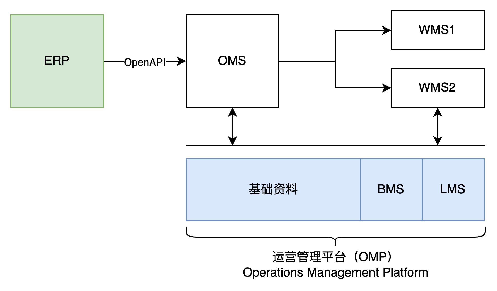
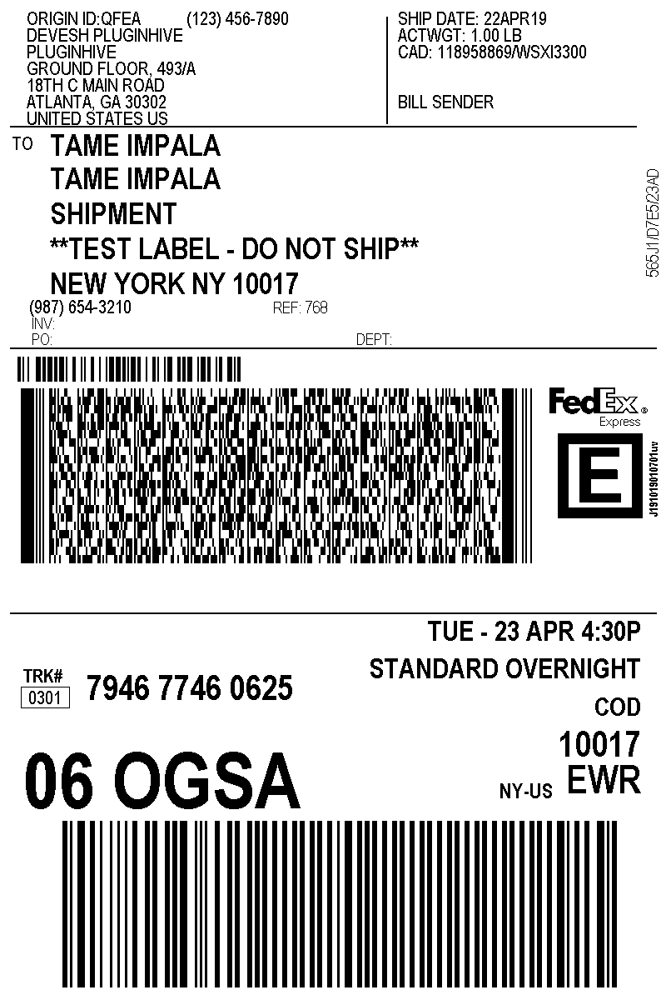
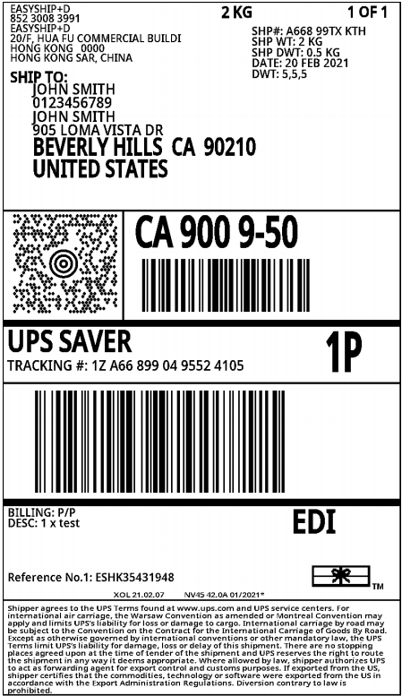
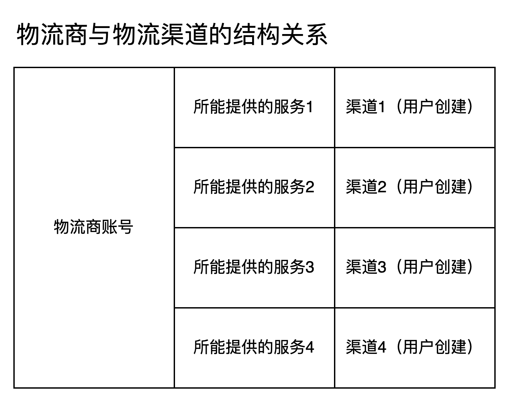
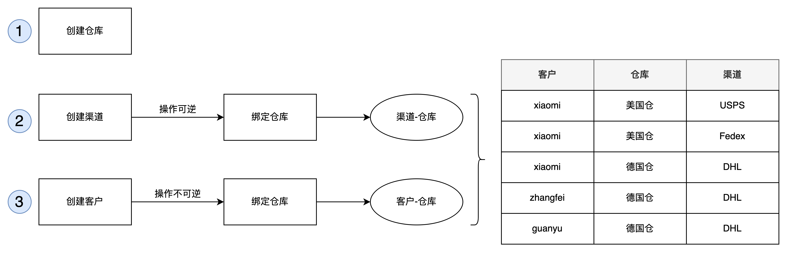
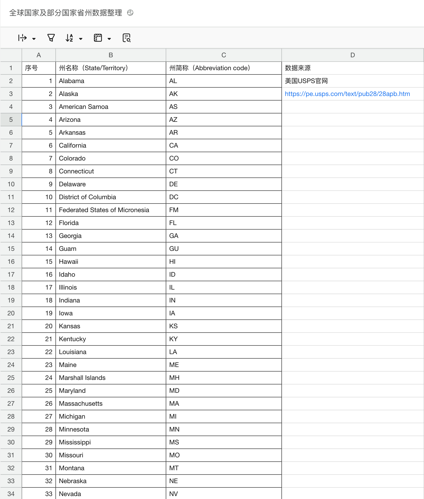
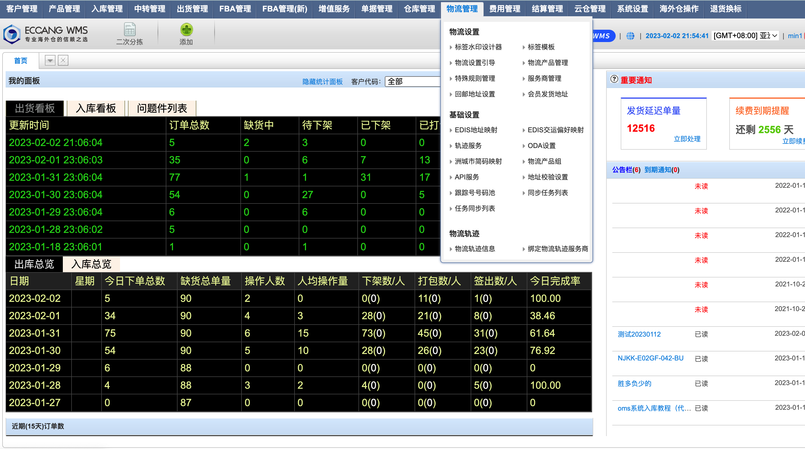
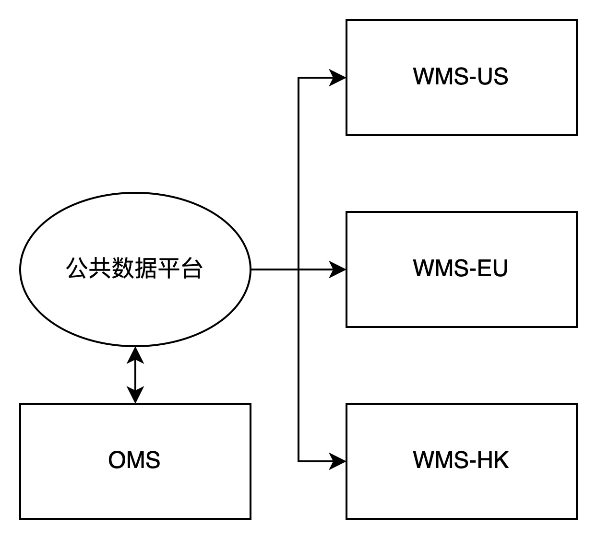
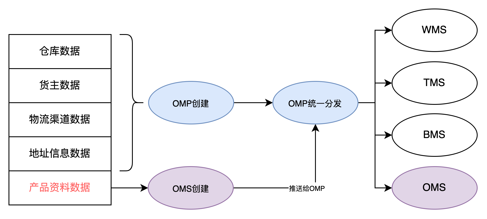

**基础数据**  
一般来说，要搭建一套信息化系统，最核心最关键的当然是业务流程和业务功能模块的实现，这个是用户最容易感知，也是最能直接体现价值的点。所以市面上关于这一块的内容往往资料非常的多，例如WMS的波次和拣货业务，就是WMS非常核心的业务和功能点，而且市面上也有非常多的参考资料，对于很多初入行的朋友来说，虽然这一块比较难，但是好歹有可学习的东西作为支撑。  
系统中的很多基础数据维护和管理的模块往往就不那么受到人们的重视了，很多人第一感觉就是这个模块就是基础的增删改查而已，没什么难度；甚至很多负责这一块业务的产品经理们也会有这种“大材小用”的感觉，觉得自己做来做去一直在做这些基础数据，没有成就感，是埋没了自己的才华。  
但是我个人认为，基础数据不仅仅是对于海外仓业务而言有非常大的作用，对其他行业的产品也是有非常大的重要的。虽然这一块的内容可能是稍微简单的，或者没那么突出的，但是并不代表着它不重要。它只是在背后默默发力，没有那么耀眼而已，作为产品经理的我们，从基础数据模块接手，既是一个循序渐进熟悉负责业务系统的好方法，也是刻意练习自己基本功的好机会。尤其是对初级产品经理来说，做好基础数据相关的产品方案，其实也非常地锻炼个人能力，也能掌握很多冰山下的业务知识。  
基础数据是构建业务系统的前提，类似于人体中的血液一样，基础数据遍布各处，源源不断地提供系统运转的动力。对于海外仓系统而言，一般场景的基础数据有这么几个：  
1仓库  
2货主  
3物流渠道  
4地址信息  
5产品信息  
这些基础数据一般来说都会被超过2个以上的系统所使用，所以除了要考虑数据在哪里维护，怎么管理之外，还需要考虑其他系统调用的问题。海外仓的OTWB如果业务量覆盖的区域较多的话，一般都会采用分布式部署的方式，也就是说不同的系统或者同一个系统的不同的模块可能会部署在不同的地区的服务器上，这样就需要额外考虑数据传输的速度，准确率，一致性和异常兜底的逻辑等。  
  

海外仓OTWB的系统交互示意图

  
**仓库**  
仓库的基础信息，例如仓库名称，仓库编码，地址，收件人，时区，所使用的币种等。在WMS中，“仓库”是一个可以一直增加和修改的基础资料，但是实际上实体仓库是有限的，不可能无限增加。对于仓库服务商来说，如果采购或者研发一套系统，能覆盖越多的仓库，那么这套系统平摊到每个仓库的成本就会很低。如果一套系统只用于一个仓库，那么单个仓库的信息化成本就会很高了。  
“仓库”这个数据在OTWB中，算是最基础也最容易被忽略的一个基础信息了。对于海外仓WMS来说，一般会考虑在仓库管理中维护“时区”的信息，因为海外仓分布在不同的国家/地区，有些时候为了照顾当地的用户，所以需要将WMS中的一些时间转化为本地时间展示，所以就需要借助仓库管理中的“时区”这个字段的信息。  
OTWB中存储的标准时间一般是北京时间，因为大多数系统的用户都在国内，也就是“UTC+8”的时间，然后根据不同的海外仓所属的时区进行换算即可。  
**货主**  
货主也可以称之为客户，一般是客户将货物放在仓库中，然后仓库服务商根据对应的指令来操作客户的货物。不过，仓库服务商也可以只服务于自己，也就是自己建设仓库给自己内部业务所使用，这个时候货主就是自己。  
所以对于仓库管理来说，会有“单货主”和“多货主”的概念，单货主相当于仓库就是给某个客户专用的，而多货主就是多个客户共享仓库的资源。  
如果是单货主的体系下，可以不用“货主”这个词，相当于默认所有的货物都是属于一个人的，就不需要单独用一个“货主”的字段来做区分了。但是如果是多货主的体系下，那么货主这个字段就非常的重要的，如果没有这字段，就分不清某个货物到底是属于谁的，这样也不利于后续的结算。  
对于第三方海外仓服务商来说，它们的主要盈利方式就是为客户订单履约提供仓储物流服务，所以肯定是会有客户的，于是就要在系统中维护“货主”的信息，有一些海外仓系统也称之为“客户管理”，都是一个意思。  
**物流渠道**  
客户的订单指令会推送到仓库，需要仓库按要求去履约发货，仓库除了要拿到准确的货物和数量之外，还要按要求贴上对应的物流商的面单。面单就是电子快递单，在系统中一般是一个PDF文件或者PNG图片。  
  

FedEx物流面单

UPS物流面单

  
在海外仓实际经营中，不同的仓库在不同的国家或地区，货物的体积重量类型等不一样，所以选择的物流服务商和对应物流渠道也会不一样。物流渠道作为很关键的基础信息，是需要提前维护在系统中的。

  
除了基础的物流渠道信息之外，还需要维护关键仓库-物流渠道的关联关系，甚至做的细节的时候，还需要维护客户-仓库-物流渠道的关系。

客户-仓库-渠道的关系

  
渠道信息一般包含，渠道编码，渠道名称，渠道授权信息，渠道的时效，渠道运输的范围等，可以围绕渠道做很多业务的拓展。  
**地址**  
对于国内电商来说，中国的省-市-县区的三级联动数据已经很成熟了，有一些免费的且准确的数据，再加上国内的地址规范相对来说还是比较标准的。所以在向物流商获取面单的时候，因为地址信息不合规或者填写错误而导致获取失败的场景比较少的。  
但是对于跨境电商来说，包裹会发到全球国家或地区，不同国家/地区的地址录入方式，语种，必填的字段等都不太一样，所以就在向物流商获取面单的过程中，因为地址不合规或者填写错误等原因而导致获取失败的场景很多。  
所以，如果要搭建一套海外仓系统，提前准备好一套**全球国家数据+重点国家的省/州+城市**的数据非常重要，一方面可以提升用户录入数据的效率，另一方面也可以在这份基础数据上做一些对照校验，避免在地址方面耽误太多的时间。  
对于美国电商来说，还有一些公司会专门做一些插件去解析地址，同时判定该地址的类型是住宅地址还是商业地址，因为不同的地址类型涉及到计费也不一样。FedEx和UPS在美国的住宅地址和商业地址的判定规则就有细微的不太一样，所以需要额外对接挺多的物流商接口才能确定这些信息。  
  

美国的省州数据关系表

  
如果搞不到一些重点国家的省州+城市联动数据，那么可以退而求其次把国家+省州的数据维护好，这样也能提升很多用户体验了。一些重点国家+省州的联动数据，我放在了语雀知识库中，感兴趣的朋友可以看这个链接。  
  

[全球国家及部分国家省州数据整理](https://www.yuque.com/jiaowovitamin/uizu4s/rdevgq67g6yhm0yr#GF9k)

  
**产品资料**  
虽然WMS是叫作仓库管理系统，但是仓库中管理的核心还是实际的货物，有些系统中叫做商品，有些叫货品，我在此统一定义为产品。  
仓库需要对实际的产品进行管理，所以WMS中产品资料可以称得上是最核心、最必备的基础资料了。  
WMS的产品资料涉及到的字段不会很多，尤其是海外仓不需要精细化管理和运营的场景下。一般可以将产品资料分成这么几大类：  
1基础信息，例如SKU，商品名称，英文名称，图片，备注等  
2规格信息，例如尺寸，重量  
3条码信息，例如EAN/UPC，FNSKU，其他条码等  
4申报信息，例如申报中文名，申报英文名，申报价格，海关编码，原产地，是否危险品等  
5一些控制信息，例如效期管理，SN管理，出入库的作业要求等  
产品资料一般是由客户提供的，所以一般都是在OMS端录入，但是需要用到产品资料的系统很多，基本上所有的业务系统（OTWB）都需要用到这个数据，只不过有一些系统用的多，有一些系统用的少一些，所以产品资料就涉及到基础数据的分发问题，需要重点注意一下。  
**基础信息的创建与分发**  
上述提到的一些基础数据，在多个系统中都会需要用到，有一些数据是需要同步到下游的系统中的，这里就涉及到了一些数据的分发业务，我们先讲一下数据分发这一块的内容。  
一般来说，如果OTWB都是部署在一个服务器中或者共同调用的都是一个数据库中的数据，那么基础信息的分发就很简单了，只需要分别去请求数据库中的对应的基础数据表即可。  
但是对于海外仓来说，由于仓库是分布在海外不同的国家/地区，那么就会涉及到多站点部署的问题。关于多站点部署的这一块，其实还是有一些很容易踩的坑，当时我在做这一块的内容的时候还花了挺多时间和心思去规避这个问题。  
市面上主流的做法有两种，一种是将基础数据的分发放在WMS中，另一种做法是将基础数据的分发放在单独的一个系统，例如公共数据平台或者运营管理系统中。  
例如海外仓SaaS WMS领域中的老大哥——易仓WMS就是选择将基础数据放在WMS中，WMS中除了作业相关的数据，还有仓库，客户（货主），物流，地址，产品，费用等模块。  
  

易仓WMS示意图

  
**这种设计模式的好处明显，坏处也很明显。**  
好处就是，一个系统包揽了很多角色要操作的内容，通过不同的权限去控制，这样更利于集中管理和维护。  
但是缺点也很多，首先就是对于管理员或者权限比较多的角色登录了这个系统之后，会发现有很多功能菜单，会导致上手学习的难度非常高；其次就是这种设计背后有一个很尴尬的问题，就是多国访问的速度问题。例如把WMS放在香港的服务器，然后美国，欧洲，拉美，东南亚等地区访问的时候速度会慢。而且还是SaaS多租户的模式，就会导致资源很紧张，系统负担很重。  
另一种做法是将基础数据的分发放在单独的一个系统，例如公共数据平台或者运营管理系统中，然后由公共数据平台对外提供统一的调用接口或者分发接口。我所经历的两家公司都是用的这种方式，据我了解“递四方（4PX）”的WMS也是用的这种解耦的模式。  
  

基础数据放在公共数据平台中

  
上面讲到，基础数据包含有：  
1仓库数据  
2货主数据  
3物流渠道数据  
4地址信息数据  
5产品资料数据  
6……  
其中除了产品资料数据来源于客户之外，其他的数据都是可以让海外仓服务商的运营人员自己去创建的，所以这些基础数据的创建放在运营管理系统中是最好的，我把这个系统定义为OMP，即Operation Management Platform（运营管理平台）。  
而产品资料是客户创建的，那么自然是放在OMS中去创建了，不过由于有一些仓库需要对客户创建的产品资料进行前置审核，所以OMS创建的产品资料也会同步一份到OMP中，然后再由OMP执行统一的数据分发即可。  
  

基础数据的创建与分发

  
除此之外，还有一种更加细节的优化方式，可以考虑将OMS的的产品资料模块和OMP打通，相当于两个系统共用的是一份数据，OMS可以看到这份数据，OMP看到的也是这份数据，然后借助OMP对外的这种分发能力去推送到不同的系统中。  
例如OMP可以推送产品资料到WMS中，可以推送到BMS中，也可以推送到TMS中，不过一般TMS用不上这些信息，只需要OMS在物流下单的时候带上一些产品的基础信息过去即可。这类信息一般都是和物流报关/清关、还有费用计算，保险索赔有关系的，例如尺寸、重量，是否带电，申报价值，海关编码等。  
**基础数据分发需要注意的一些事项**  
**推送方**  
1要考虑清楚，数据是在哪里创建？是由谁推送给谁？基础数据的创建入口最好要做收敛，不是越多越好。  
2什么时候推送？是创建之后就立马推送，还是定时推送，还是通过某个按钮点击之后或者是状态更新之后才推送，产品经理要定义好这些数据的推送时机。  
**接收方**  
1谁需要这些信息，接收方是谁？如果有多个接收方，那么不同的接收方的处理逻辑都要单独梳理一下。  
2接收方怎么接收这些数据，这些数据从哪里来？是不是已经有提供好了接口？  
3一次接收的数据量会不会太大？会不会有更新的情况，更新了要怎么接收？  
**容错机制的设计**  
1如果数据推送失败了，接收者没有收到数据怎么办？这种异常流程要怎么处理？  
2是否有重试或者兜底的策略？针对数据同步方面，要多和技术沟通一些容错机制，尽量规避这种问题的出现。  
**监测逻辑的补充**  
1如果报错了，失败了，有没有做监控，会不会及时提醒？谁来接收这些信息，然后及时处理？这一块也要和技术还有运维同事沟通清楚，产品经理要有这样的业务敏感性。  
2能不能统计到某个接口报错的频率，后续可以专项处理，升级优化？出现问题之后要及时解决，避免下次再重现。  
  
上面提到的基础数据，都是指OTWB多个系统之间都会用到公共数据，但是如果是WMS中创建的基础数据一般都是仅限于仓库本身所使用，所以是哪个仓库创建的，就哪个仓库使用即可，不需要特殊考虑分发的问题，这些数据一般是：  
1库区、库位  
2容器  
3播种墙  
4包材  
5员工信息  
6……  
在下篇文章中，我将详细给大家介绍一下这一块的内容。