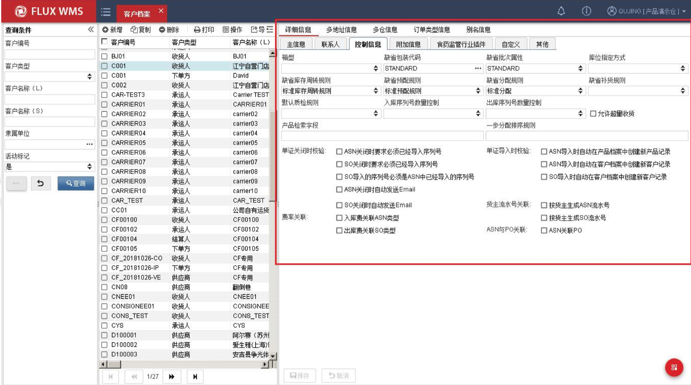
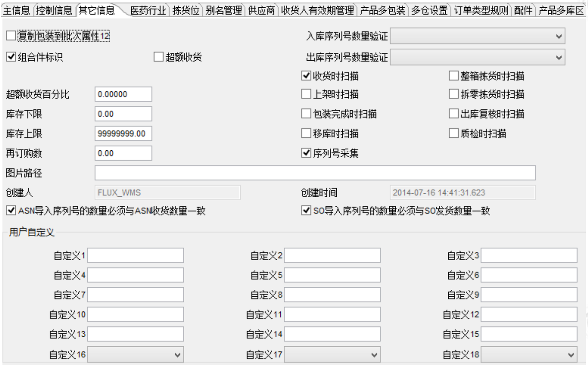
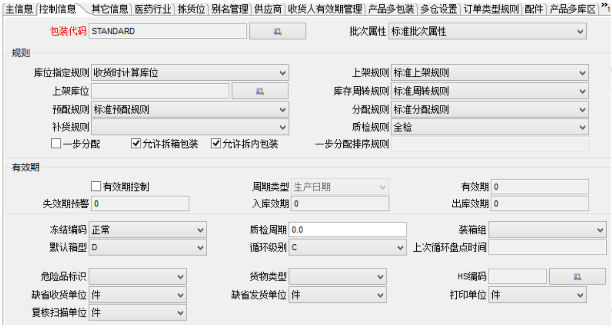
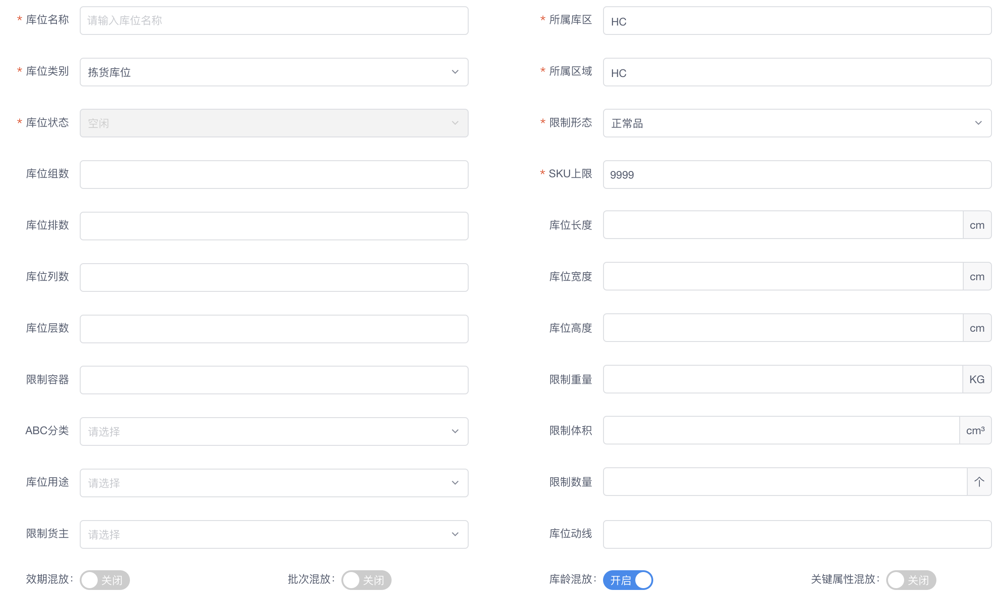
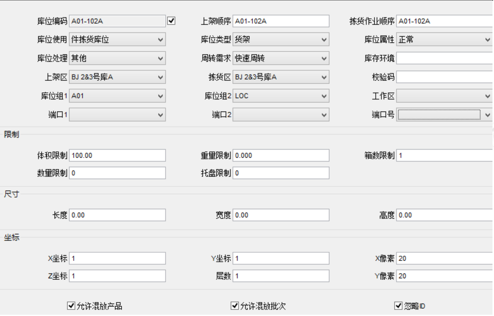
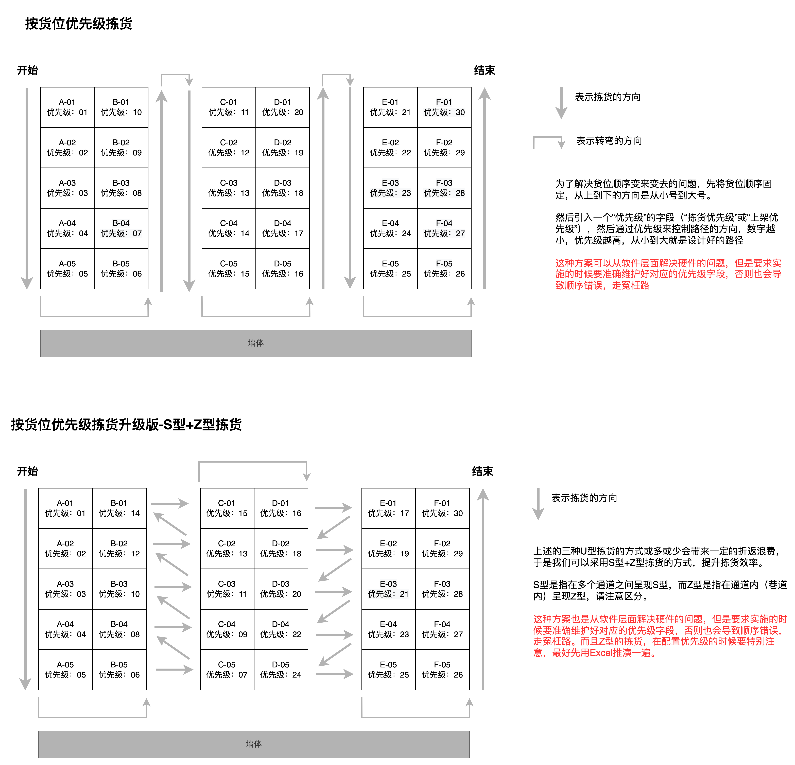
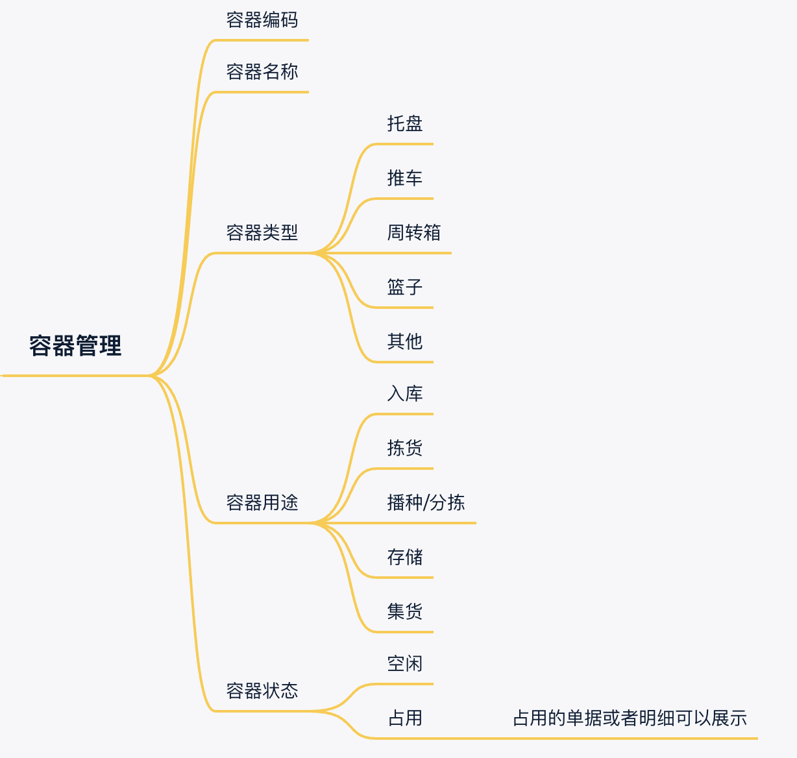
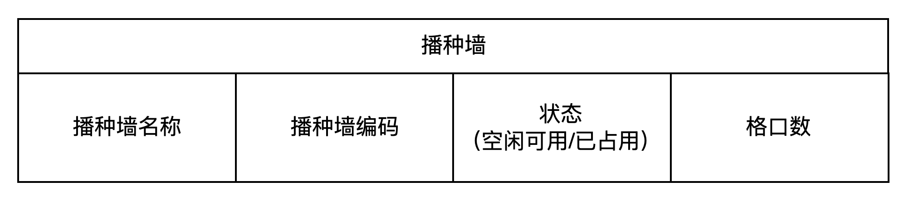
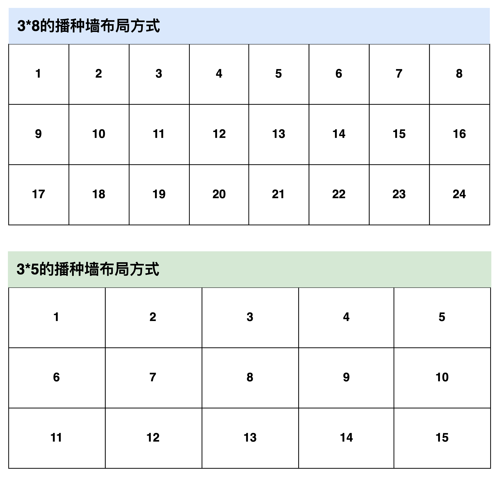
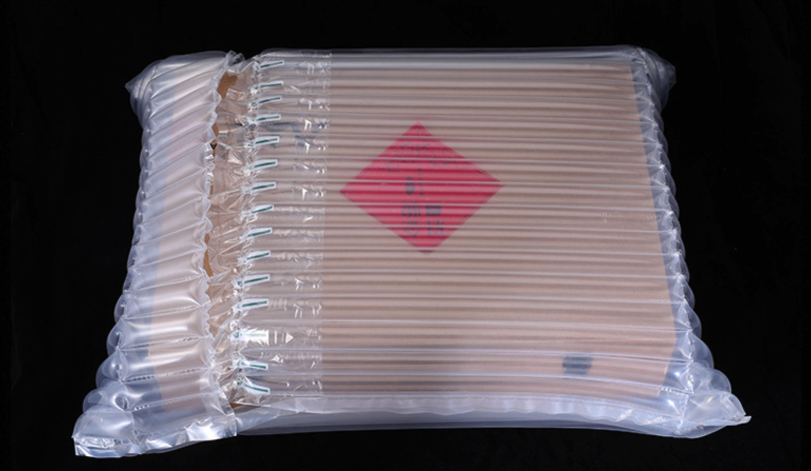

**哪些是基础数据？**  
在实际的仓库作业中，涉及到很多环节，很多人员，很多实物，所以在系统运转的时候也需要将这些人员或者实物映射到系统中，一般都会放在“基础数据”模块中。  
为了对仓库进行分区精细化管理，WMS中一般都会有“库区管理”和“库位管理”模块。  
为了管理好仓库中的一些实物或者工具，WMS中一般会有“容器管理”，“月台管理”，“硬件设备管理”等模块。  
为了对仓库作业人员的绩效进行有效考核，WMS中一般会有“仓库员工管理”，“仓库角色管理”等模块。  
为了记录客户的一些数据和资产等，WMS中一般会有“客户资料”，“产品资料”，“包材资料”等模块。  
为了满足仓库精细化作业的策略或要求，WMS中可能还会有“批次属性管理”，“多单位管理（包装管理）”，“ABC分类”，“策略管理”等模块。  
**这些数据有各自不同的作用，分别作用于不同的业务场景，而且可以多个交叉组合、联动，构成了一个庞大的，精细的“信息网”，所以这个“信息网”便是WMS中最复杂，也最为核心的东西**。如果想专精于WMS领域，那么这些东西一定需要花时间慢慢去摸索并掌握。  
**国内仓和海外仓WMS的基础数据差异**  
从系统的复杂度和业务场景支持的丰富度来看，国内的WMS做的明显比海外仓WMS要好很多。  
受海外仓当地的文化，人工成本，政治经济，以及业务形态等方面的影响，海外仓WMS的系统复杂度要比国内的WMS复杂度小几个量级，甚至很多操作都要求傻瓜式和一键式。  
所以海外仓WMS的要管理的基础数据模块相对也会少一些，简单一些。一般来说，海外仓WMS中比较常见的基础数据有：  
●客户资料  
●产品资料  
●库区和库位管理  
●容器管理  
●播种墙管理  
●包材资料  
●仓库员工管理  
●……  
**海外仓WMS的基础数据分析**  
**1.客户资料**  
客户（货主）资料对海外仓来说其实没什么关键信息，尤其是一些敏感信息可能在WMS中还脱敏了，所以海外仓要客户资料更多的还是出于一些业务的控制使用，而不是查询使用。  
例如不同的客户可能有等级之分，需要针对KA客户做一些个性化的配置，那么就需要从上游系统推送客户资料到WMS中。不同的客户有一些控制要求，则要按不同客户来维护对应的策略和控制信息等……  
  

富勒WMS-客户档案管理

  
**2.产品资料**  
产品资料对海外仓来说比较重要，是整个仓库运作的底层基石。WMS中的产品资料基本上都是从上游推送过来的，所以在WMS中的产品资料更多的也是一个查询和关联控制信息的作用。  
例如海外仓的产品往往会有很多个条码（SKU，EAN/UPC,FNSKU等），为了让仓库可以在各种场景下识别相应的条码，就是需要提前维护好对应的产品条码信息；仓库要对货物进行计费，则需要产品资料提供对应的尺寸和重量信息；仓库要对产品做精细化运营管理，则需要在产品资料的基础上加上一些控制信息……  
  

  
富勒WMS的产品档案管理  
  

  
富勒WMS的产品档案管理  
一般来说，海外仓产品资料的控制信息不会很多，因为要维护的信息越多，管理的粒度越细，仓库要付出的成本也就越多。最常见的就是“产品条码”，“SN管理”，“尺寸重量”，“库存预警”，“批次管理”等，其他特别细的一般都用不上。  
**3.库区和库位管理**  
虽然说国内仓和海外仓WMS有很多差异点，但是本质上还是仓库管理系统，还是要对实物进行管理，所以库区和库位的管理还是基本一致的。  
海外仓WMS一般都是电商仓属性，存放的货物基本上都是服装，配件，3C类产品等常规货物，很少会有食品，生鲜，冷冻类产品等，所以库区属性也就比较简单。常见的就是按作业类型来区分，例如“存储区”，“拣选区”，“退货区”，“残次品区”，“暂存区”等。  
关于库位的管理也一般会比较简单，主要就是库位编码，所属库区和一些业务控制信息，例如“是否支持混放”，“是否绑定货主”等。很少会有国内WMS的精细化管理粒度，类似于“体积上限”，“重量上限”，“库位坐标”，“上架/拣货优先级”等信息。  
  

  
C-WMS的库位管理  
  

  
富勒WMS的库位管理  
如果后续要做一些精细化运营的功能，则在库位管理这一块要维护很多关键信息。  
例如为了控制不同货主的商品不混在一起，可以设置库位“不允许混放产品”，为了管理效期产品或者有严格批次管理的产品，可以设置库位“不允许混放批次”。  
为了后续做拣货路径的规划或者优先从某个库位拣货，可以设置库位的“拣货优先级”，为了提升货物的周转效率，可以设置库位的“ABC分类”……  
  

库位优先级示意图

  
**4.容器管理**  
容器管理相对于库位和库区来说算比较简单了，主要就是容器的分类、用途和状态，具体如下图所示：  
  

  
仓库中经常需要容器的环节一般有：  
●收货的时候，使用容器来绑定产品，后续上架的时候可以按容器来生成上架任务；  
●拣货的时候，使用容器来拣货，绑定对应的订单，实现边拣边分；也可以在二次分拣的时候绑定订单，实现播种的功能，但是一般这个有对应的播种墙管理，也可以算是容器的一种；  
●在打包称重之后，需要按照不同的物流商进行分拨集货，也会用到集货容器，将同一个物流商的包裹放在一个容器中；  
关于状态方面，重点把控好容器和盛放的物品的关系即可。例如容器被占用了，是因为什么单据而占用，是因为什么单据的什么产品而占用的；在什么时候将容器的状态改成占用，什么时候将状态转为可用。  
**5.播种墙管理**  
播种墙管理和容器管理非常类似，因为播种墙也可以理解为一种“特殊”的容器。

  
播种墙的状态一般是“空闲可用”和“已占用”两种，在“已占用”的状态下，可以在播种墙管理页面中查看具体被占用的波次拣货单是什么。  
播种墙的格口数，如果要做的细节一些，可以采用“层\*列”的方式维护，实体播种墙是几层几列，那么系统维护的时候也录入对应的数据，然后在播种的时候，可以根据这种“层\*列”的方式，响应式展示播种墙的情况。  
  

响应式播种墙布局方式

  
播种墙管理可以通过系统来管理，也可以不使用系统来管理，取决于仓库管理的精细化程度。如果使用系统来管理播种墙，会有这么几个好处：  
1在播种的时候，可以判断播种墙是否能播种完波次中的所有订单；  
2播种之后，在复核的时候，可以扫描播种墙的格口号进行复核，多了一种定位订单的方式；  
3当仓库中的播种墙较多时，可以通过系统查看具体的闲忙情况，也更容易追溯一些日志，定位问题；  
**6.包材资料**  
包材管理也可以称之为耗材管理，是指产品实物发出的时候需要使用的包装材料的管理。  
海外仓比较常用的包材一般有纸盒（飞机盒），标准纸箱，气柱袋，珍珠棉和防水袋等。因为包材有采购成本，所以一般会维护相应的采购价和销售价，用来计算出库订单的操作费。  
  

  
  

  
又因为海外仓很多场景下需要发货到FBA，需要打包装箱，然后量尺寸和称重量。为了减少量尺寸的成本，可以使用标准纸箱，免去了人工测量纸箱的时间。  
包材管理中比较复杂的逻辑是“包材推荐”，指在打包装箱的时候，系统自动根据出库订单的产品明细来推荐合适的包装材料。  
高深的推荐逻辑涉及到一系列装箱算法，一般海外仓也不会采用这种高成本的解决方案。稍微简单一些的推荐逻辑就是基于历史数据来推荐，相同的产品结构的出库订单，根据历史使用包材的情况，推荐一个用的最多的包材。如果没有历史数据，或者推荐的有问题，也可以人工手动指定，调整推荐的权重值……