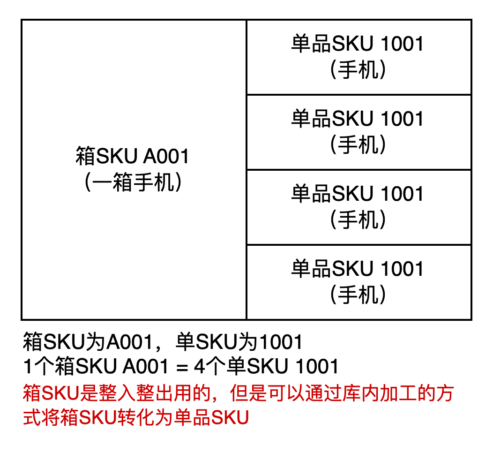
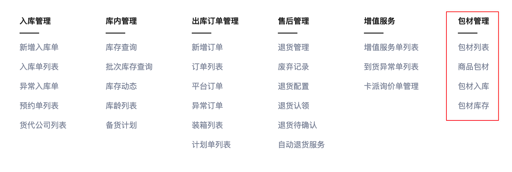
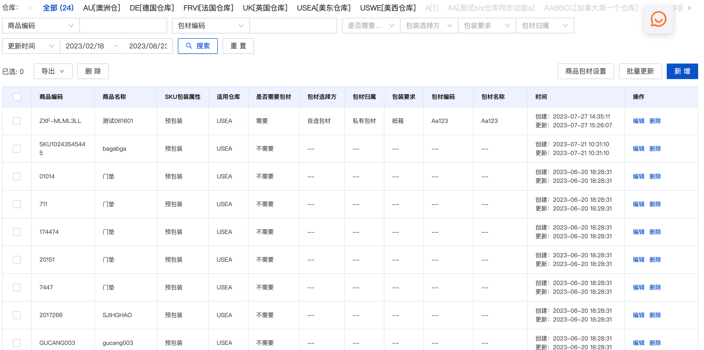
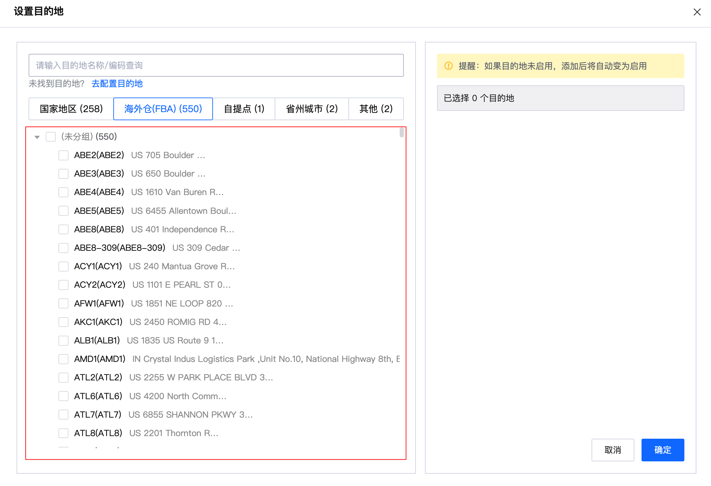
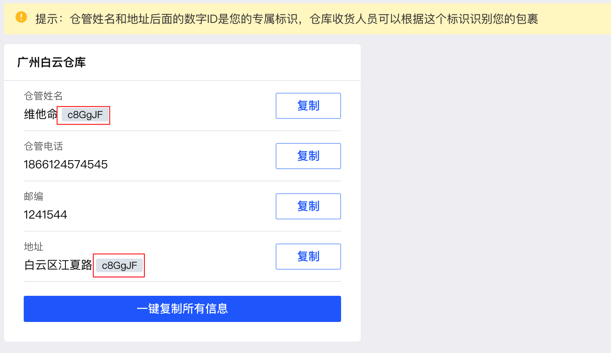
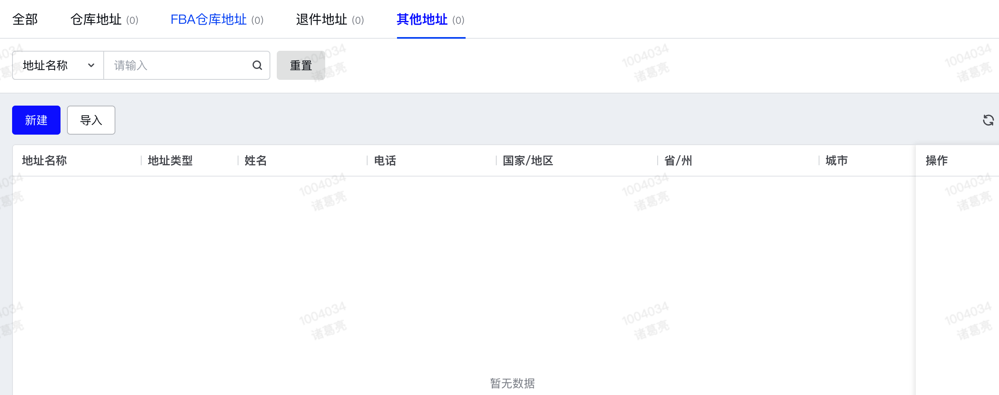
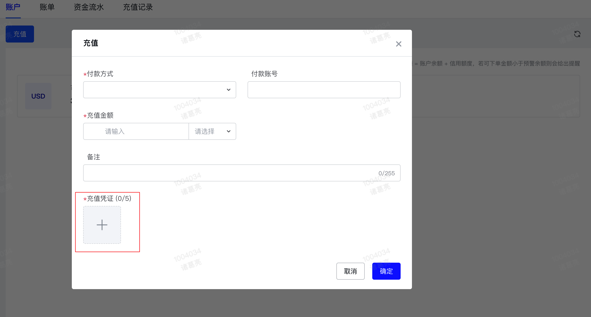
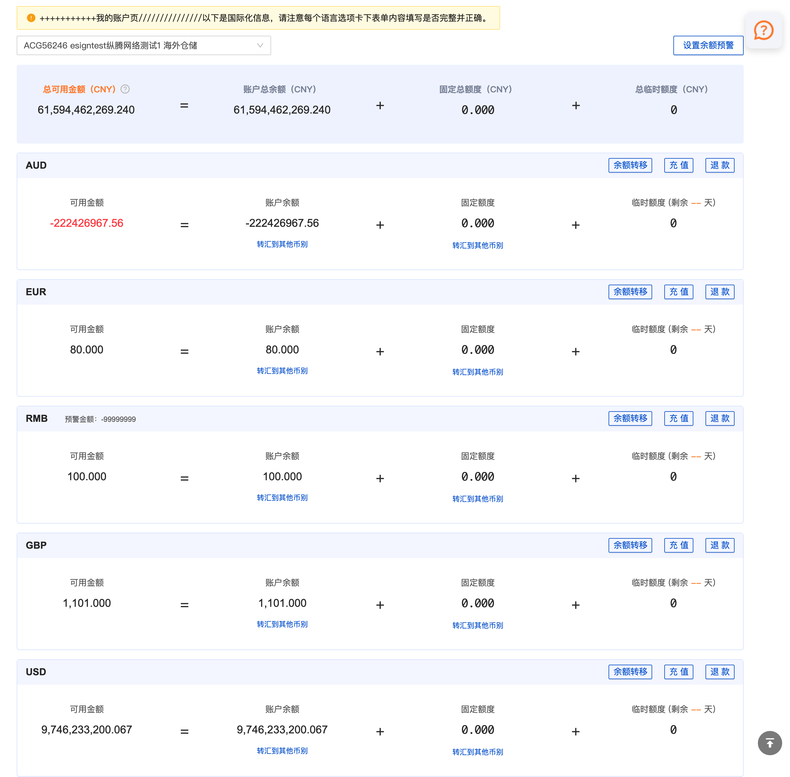

在海外仓OMS中，需要由OMS的创建的基础数据比较少。因为这个系统是给客户去使用的，作为一个入驻的客户，它需要维护和创建的基础数据自然就不会太多，考虑到前面已经讲了OWTB的一些通用基础数据，然后也单独讲了WMS的基础数据，所以就额外开了这个章节来简单讲讲OMS的基础数据。  
**1产品资料**  
在OMS中，客户最需要先维护好的就是产品资料，它是所有核心业务中最底层的东西。如果没有产品资料，就没办法创建入库单，创建出库单，也没有库存，几乎所有的业务都跑不起来。  
产品资料创建要维护哪些字段，在管理方式上有什么特殊要求？这些会在后续“第三章OMS篇”中详细介绍，在此先按下不表。  
OMS的产品资料创建之后一般会推送OMP或者管理端的系统审核，只有审核通过的产品才可以准入，才会推送到下游的WMS中去使用。在海外仓的业务场景中，产品资料的管理粒度一般都是“PCS”，用到**多单位**的场景比较少，不过会有少量的仓库使用“箱SKU”的概念。  
“箱SKU”也是一种产品资料，一个箱SKU中包含了多个单品SKU，可以混箱，也可以不混箱，一般不混箱的多。在统计库存的时候，单品SKU和箱SKU是独立统计的，不做单位的换算。  
  

  
**2****包材数据**  
一般来说包材数据应该是在WMS层面维护的，但是有一些品牌客户会对海外仓提相关的要求，希望能将自己的包材送到海外仓，然后海外仓在出库打包的时候使用自己采购的包材。  
针对这种场景，包材数据就和产品资料一样，需要提前在OMS上维护，然后交给对应的部门/系统审核之后，才能推送到WMS中。  
然后还需要在OMS创建包材的入库单，这样才可以在系统中查看到包材的库存；当WMS使用了包材之后，会记录消耗的量，扣减包材的库存，这样一入一出的操作，和正常的商品管理是类似的。  
例如下图中，谷仓就支持用户自己维护包材基础数据，对包材创建入库单，查询库存等操作。  
  

谷仓的OMS

  
也可以支持客户在OMS提前维护好“商品和包材的关系”，这样仓库处理对应的商品的包裹的时候，就知道要使用什么包材了。不过这种场景仅仅适用于单品单件的订单，如果是单品多件或者是多品混合，那么包材的指定就没有那么简单了，复杂点的可能就要用到**包材推荐算法**了。  
  

谷仓的OMS

  
**3****地址类信息**  
由于海外仓会涉及到多个国家/地区，然后也会有很多场景下需要使用到地址，所以很多OMS都会将地址类信息聚合成一个“地址管理”的模块，便于业务使用的时候快速调用。  
例如，在海外仓备货中转到FBA的场景下，需要快速选择FBA的仓库地址，这个时候就可以提前维护一套FBA仓库地址进去，然后输入“FBA仓库代码”就可以快速带出具体的地址信息。  
  

选择FBA的仓库地址

  
例如，在海外仓退货的场景下，仓库为了便于区分退回来的商品是什么货主的，一般会给不同的货主创建不同的地址，地址上的大多数信息都是一样的，可能会在收件人名称或者收件地址上增加一串特殊的编码。当仓库收到货物之后，看这个地址就可以快速识别是什么货主退回的货物。**这个退货地址，也是算一种基础信息**。  
  

专属的退货地址

  
还有其他一些场景下需要频繁使用到相同的地址，都可以将这个地址信息维护到“地址簿”中，不同类型的地址基本上都可以抽象成一样的字段结构，用同一张表去存储。  
  

地址簿管理

  
**4****账户充值**  
对OMS的客户来说，账户是不需要自己创建的，一般都是运营系统（OMP）创建客户的时候就会自动为每个客户初始化一套账户体系，客户可以拿来即用。  
所以这里提到的是“账户充值”而不是“账户”，这个算是基础数据，也算是业务操作前的一些必要要求。因为大多数海外仓都是采用“预充值”的业务模式，也就是要用海外仓业务入库，出库等，那么就需要提前在自己的OMS账户中充值对应的金额进去。  
OMS的账户充值一般都比较轻量化，不会做一些支付工具的对接，而是采用线下充值后，线上提交充值证据的方式来人工处理进行充值。  
例如，客户向海外仓的收款账户转了一笔钱之后，就可以在OMS上创建一个充值申请单，然后填写金额和转账的记录，当海外仓的财务确认收到了这样的钱之后就会审核这笔充值，然后OMS的账户就会增加对应的余额。  
  

  
这里需要注意的是，海外仓可能会遍布各个国家/地区，也就是会有多币种结算的场景存在。常见的有两种解决方案：  
1给客户多币种账户，充值什么币种就会对应增加什么币种的余额，消耗扣减的时候也是从对应的币种中扣除；  
2只给客户单币种（USD），然后不同的仓库使用的结算币种不同的时候，需要转换一遍汇率再扣减客户单币种的余额；  
主流的做法应该是选择方案1的比较多，比较通俗易懂，可以参考一下谷仓的做法。  
  

