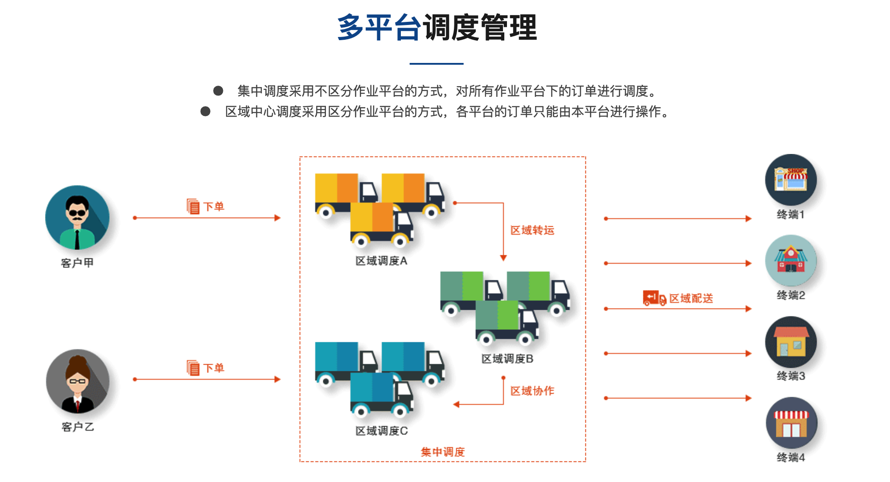
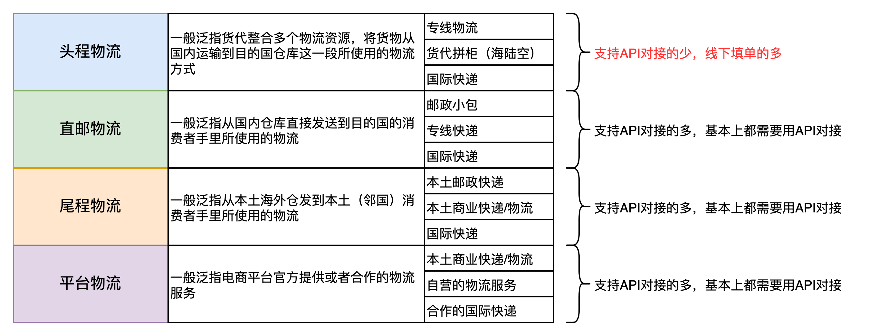
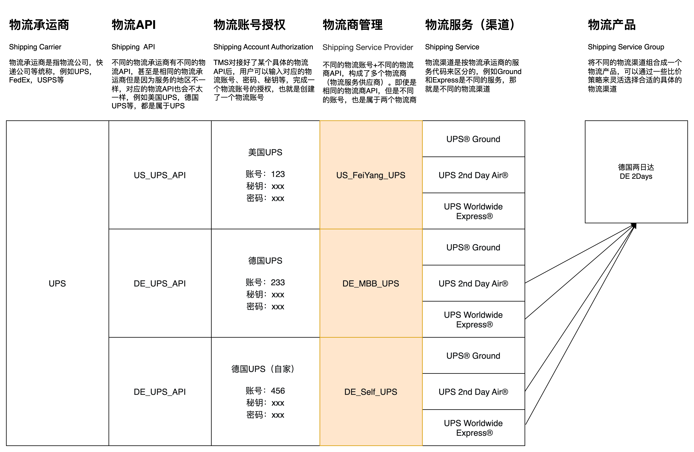
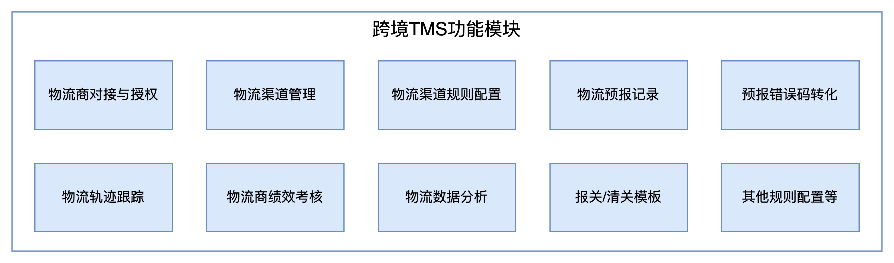
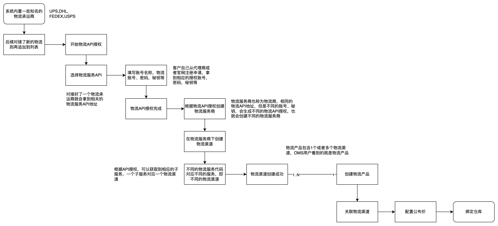
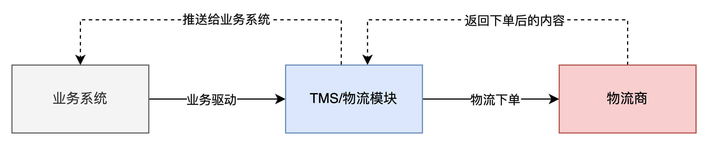

**什么是TMS？**  
TMS (Transport Management System) ，称之为运输管理系统，也就是主要的业务场景是和运输相关，WMS是仓储管理系统，主要的业务场景是和仓库相关。  
运输管理系统是一种软件系统，用于帮助企业管理与实际货物移动（陆运、空运、海运或混合运输方式）相关的物流。作为庞大的供应链管理系统的一部分，TMS物流软件能够帮助企业优化装载计划和送货路线、追踪本地和全球运输线路中的货物，并自动执行以往极为耗时的任务（例如，处理贸易合规性文档和货运计费等），确保按时交付货物。TMS 系统可以帮助企业和最终客户降低成本。  
TMS这个叫法一般来说是特指车辆运输管理相关的业务场景，例如包含了订单管理、调度分配、行车管理、GPS车辆定位系统、车辆管理等模块。  
  

唯智TMS介绍

  
但是跨境领域的TMS其实更多的是一些物流服务商的管理，物流渠道的对接，轨迹的抓取与分析，渠道派送时效统计分析，小包专线，空海派渠道管理等之类，和国内的TMS定义和功能模块等有非常大的区别，所以我在很多场景下会将跨境海外仓中的物流系统称之为LMS（Logistics Management System），感觉这个定义会更加准确一点，也有意于区分开国内的TMS，避免理解上有歧义。  
本文所讲的TMS其实是特指的跨境领域的LMS，在电商ERP中，这一部分也称之为“物流管理”或者“物流模块”等，表达的都是同一个意思。  
**跨境TMS的一些名词解释**  
**物流方式的分类**  
物流方式有很多种分类方式，很难找到那种满足“MECE”原则的分类方式，所以有一些内容会有重叠。这里我以自己对跨境物流的理解来对物流方式做一个大概的分类，帮助大家理解各种物流方式的用途。  
之前的文章讲过，跨境出口物流可以分成2种模式：**一个是直邮模式，一个是海外仓模式**。对的，海外仓其实也算是一种物流方式，因为物流是一个比较大概念。  
其中直邮可以分成三大类：邮政，专线，国际快递。而海外仓则分成了头程、尾程两段，头程段所使用的物流一般API对接的少，尾程段使用的物流一般都会有API对接。除此之外，由于很多电商平台也有自营物流（FBA物流），这种模式其实可以等同为是尾程物流的一类，都是从仓库直接发到消费者手中。  
基于上述的分析，我将物流方式分成了这么几种：  
1头程物流  
2直邮物流  
3尾程物流  
4平台物流  
具体的详细说明可以看下图，这里我建议产品经理重点要关注“支持API对接的物流”，尤其是直邮物流和尾程物流，这两种模式很有多相似之处，而且也有很多业务知识和细节在里面，对设计TMS来说必须要提前掌握这些业务场景和细节的知识。  
  

跨境出口物流的几种常见方式

  
**跨境物流相关的一些名词**  
1物流承运商  
Shipping Carrier，泛指物流公司，快递公司等统称，例如UPS，FedEx，USPS等。  
2物流API  
Shipping API，不同的物流承运商有不同的物流API，甚至是相同的物流承运商但是因为服务的地区不一样，对应的物流API也会不太一样，例如美国UPS，德国UPS，UPS国际等，都是属于UPS，但是不同的物流API。  
3物流账号授权  
Shipping Account Authorization，TMS对接好了某个具体的物流API后，用户可以输入对应的物流账号、密码、秘钥等，完成一个物流账号的授权，也就是创建了一个物流账号。  
4物流商管理  
Shipping Service Provider，不同的物流账号+不同的物流商API，构成了多个物流商（物流服务供应商）。即使是相同的物流商API，但是不同的账号，也是属于两个物流商。  
5物流服务（渠道）  
Shipping Service，物流渠道是按物流承运商的具体服务代码来区分的，例如Ground和Express是不同的服务，那就是不同的物流渠道，类似与顺丰快递的隔日达和次日达就是不同的物流服务（渠道）  
6物流产品  
Shipping Service Group，将不同的物流渠道组合成一个物流产品，可以通过一些比价策略来灵活选择合适的具体的物流渠道。对客户来说只需要选择物流产品即可，背后具体使用的是什么渠道则不需要让客户关注。  
  

跨境物流相关的一些名词

  
**跨境TMS的主要功能模块**  
  

TMS功能模块

  
跨境TMS是属于底层支撑类系统，在ERP中一般都是以“物流管理”模块单独存在的，对于仓储类系统来说，由于业内一直有“OTWB”的说法，所以有一些公司会单独抽出一个系统来承载TMS的一些内容。  
从我过往的经验来看，如果对物流这一块没有太复杂的业务需要，那么可以考虑做成一个单独的模块放在运营管理类的系统中即可，例如我之前就是将TMS和BMS的内容放在了OMP（运营管理系统）中，这样更加简洁清爽，也能满足相应的业务需求。  
TMS包含的功能不算很多，大概可以分成四类：  
1物流商对接和物流渠道管理，TMS的很多工作都是在对接物流商，对接物流商，需要一个一个接口文档去看，然后对接、调试、正式上线，然后再创建对应的物流渠道，才可以交付给业务系统去使用；  
2物流轨迹的跟踪，TMS需要对接物流商官方的轨迹或者通过第三方工具去抓取轨迹，然后对轨迹的内容进行分析，判断物流是否妥投，是否退货，准确率和及时率等情况；  
3物流的数据分析，每天都会有多个物流订单生成，会产生大量的数据，TMS需要从多个维度去分析这些物流订单的数据，同时也要结合物流商的一些考核指标，对物流商进行评分考核；  
4物流的相关规则配置，国家物流中涉及到多个国家，多种语言，多种物流规则，所以TMS需要支持配置和维护一些复杂的规则，减轻人工处理异常的频率，提升出库单获取物流面单的成功率；  
**跨境TMS的核心流程**  
**物流渠道和产品的创建**  
  

  
TMS中会接入很多物流商，但是对于系统操作员来说不需要关注接入层面的内容，只需要使用这些接入好的物流商即可。所以重点就是在系统中授权自己的物流账号，然后逐步创建物流渠道，再将物流渠道打包组合成物流产品，最后再配置好对客户的价格之后，就可以公布出去给客户使用了。  
这一步是属于基础信息的维护，因为客户在使用海外仓的时候，**一般也会使用海外仓提供的物流产品，而且物流费用的差价是海外仓的重要收入来源**，所以TMS需要提前维护好这些物流渠道和物流产品，才能支撑后续的OMS向TMS下单的流程。  
**物流下单流程**  
TMS要支持的核心业务场景就是“获取面单”或者“物流预报”，也就是通过业务系统传递相关的数据给TMS，然后TMS再通过对接好的接口请求背后的物流商，拿到电子面单和跟踪号。

物流下单流程

  
无论是海外仓的TMS还是跨境ERP的物流模块，基本上都是这样的业务流程，详细的物流下单流程会在后续的文章中讲解，在此处就先按下不表。  
**小结**  
对于海外仓系统来说，虽然大家常说“OTWB”，但是其中最核心和最重要的还是WMS，其次是OMS和BMS，而TMS更多的还是“工具人属性”，业务复杂度和深度都不算很高，但是因为涉及到多个物流商，多个国家，多个供应商和客户等，所以就会显得有点难搞，不过理解背后的底层逻辑之后，这些困难大多数就迎刃而解了，后续的文章中会持续拆解TMS背后的底层逻辑，帮助大家更好地理解和掌握TMS。