仓储作业模块虽然业务流程多，场景多，多模块关联性强，但是最起码竞品多，解决方案多，可以借鉴的方法也多。但是海外仓的物流模块就不一样了，市面上没有什么很成熟的方案，也没有很多公开的资料，不透明的信息带来了很多不确定性，大多数稍微成熟的产品都是自己一步一步踩坑总结经验后打磨出来的。  
上一篇介绍了跨境物流可以分成好多种类，其中我们会重点关注和讲解就是：**直邮物流和尾程物流**。因为这两种模式有很多相似之处，掌握了其中一个就可以顺带也掌握另外一个。而且从业务的适用性角度来讲，这两种物流方式也是用的最多和最广泛的，具有很强的普适性。  
**尾程物流的成本价格之争**  
最开始我刚入行的时候，我一直以为海外仓的盈利点是来自于整套服务体系，包含了仓储服务，订单操作，增值服务和尾程运费价差等。后来随着对业务的熟悉和了解之后，我发现原来很多仓库的仓储服务，订单操作和增值服务等其实都是亏钱的，**基本上都是靠尾程运费价差来补窟窿的**。  
所以现实情况就是，海外仓能不能开，能不能接到客户，能不能赚到钱，跟有没有系统不重要，跟有没有很好的服务也不重要，跟仓库离港口多少个小时的车程也不是那种重要，最重要的就是价格——**尾程物流的价格是否有优势，也就是行话说的“优势账号”。**  
例如两家仓库都在差不多的位置，A仓库对客户报价如下，而B仓库对客户的报价则是在A仓库的报价基础上还能打个7折（乱编的），那么对客户来说，B仓库就非常的有吸引力了，因为物流费是B2C销售订单中的一个大头。  
  

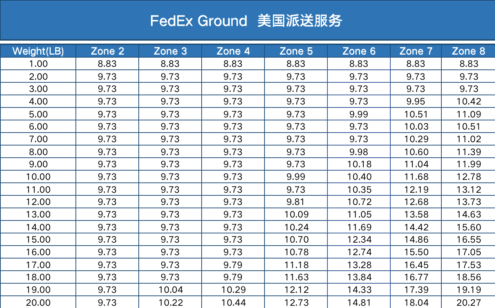

  
仅做参考示意使用  
假如平均一个出库单大概能省2美金左右，一天1000单就能省2000多美金，长年累月下来就是一大笔成本的节省。  
对于海外仓来说，基本上报价都会维持和同行相近的水平，所以谁的成本越低，能获得的利润也就会越大，**于是乎海外仓的实力之间的较量就多了一条“尾程物流成本价格的较量”**。  
**去哪里拿到低价？**  
之前我一直认为建海外仓除了需要大量的资本投入建仓之外，还需要一定的当地人脉关系，起码可以找到一些靠谱的上游供应商，来解决尾程物流账号的问题。  
但是随着2020年跨境卖家的一波崛起，海外仓也雨后春笋般增长了起来。只要有需求，那么就会有人发现这一块的商机，变着法来提供需求。大概是从2021年开始市面上就出来了很多海外仓，而且有的仓库很小，人也很少，有的仓库没有系统，有的仓库只做一两种业务，但是他们都赚到了钱。  
一方面是因为当时市场上对海外仓的需求确实很多，所以很多人看到了这个机会就火速入局，于是乎就多了很多海外仓，哪怕说自己没什么仓库运营经验也没关系，因为当时的那种状态下会有很多中间商来协助帮忙建仓库、运营仓库或者是大家互相结盟，势要把这一块蛋糕拿下来。  
另一方面就是这些比较小众的海外仓鱼龙混杂，其中不乏一些浑水摸鱼的玩家，他们秉持着一种“打一枪就走”的心态，于是在尾程这一块就搞了一些“关系账号”，行话也称之为“灰色账号”，“跑水账号”等。  
所谓“跑水账号”指的是一些不良货代利用美国UPS快递公司，先派送后收费，及国内卖家先付款再发货的时间差，通过设立空头公司开设UPS账号，或者盗用其他公司账号，在市场大肆低价揽货，东窗事发后一走了之的套路。  
还有另一种解释是：UPS 在设置面单、订单号以及编码时有一定规律可循。这一规律被“聪明”的物流商利用起来，进行破解，然后打印出虚假面单进行发货。UPS在不知情的情况下会正常派送货物，**但是在扣费的时候却收不到钱，这时候才发现上当受骗了。**使用这类跑水帐号和虚假面单来发货，其成本几乎为零，因此，卖家在选择货代公司时，往往会遇到许多报价极低的货代公司，因为他们采用了虚假面单。  
虽然这些服务商的仓库比较小，库内操作和管理的人也不是很专业，但是对外的报价中关于物流这一块的价格非常有优势，比行业内很多大牌的、老牌的海外仓的价格还要低，所以就吸引了很多客户冒险选择他们的仓库。  
由于这些仓库比较小众，一般都是没有海外仓WMS来支持作业的，但是由于手动线下的物流下单是一个很繁琐的事情，如果全部是手动来操作肯定是不现实的。  
  

线下物流寄件下单的流程太麻烦了

  
于是针对这个场景下，又有一些服务商发现了商机，他们结合自己的一些开发能力推出了“**打单系统**”这种东西，用来给这些海外仓**提供低价的折扣账号**和**在线下单**的服务。  
**什么是打单系统？**  
打单系统按我的理解，可以分成两类。  
第一类可以理解为打单系统是官方物流商的代理商或者经销商，从这个平台去注册官方账号可以拿到更多的一些折扣。打单系统类似于一个聚合的平台，提供了快捷的方式帮助用户注册一个官方账号。同时也和多家物流商实现了接口对接，后续如果有客户需要对接多家物流商，则可以直接对接该打单系统，就可以借助打单系统去连接背后的多家物流商。  
第二类可以理解为一个物流账号的分销系统，打单系统的后台将一个很有优势的官方账号，裂变成多个打单系统的子账号，然后子账号分别提供给不同的海外仓使用，最后所有的预报信息和账单等都会汇总到打单系统的后台中，本质上是对一个账号的使用划分了不同的渠道而已。  
  

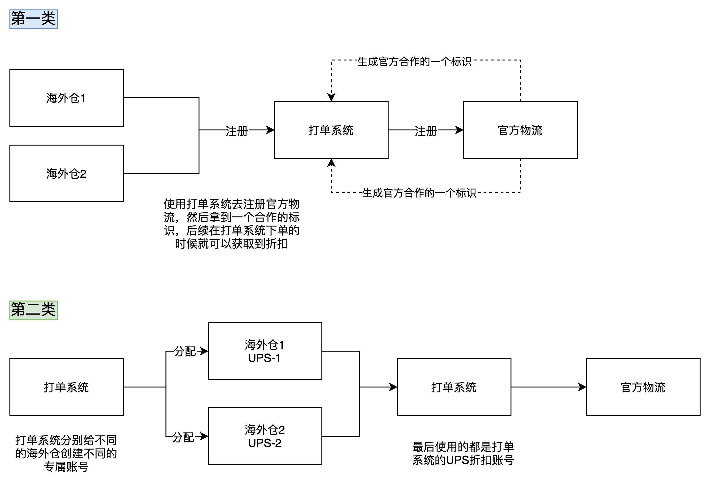

  
两类打单系统的区别  
从价格优势的维度去考虑，大多数海外仓使用的都是第二类的打单系统，因为打单系统中的主账号足够有优势，才可以拿出来做裂变、分销。**不过这一类的主账号貌似是有隐藏风险的，毕竟不可能又便宜，又好用，还没问题的东西会这么的小众化，不为人知。**  
如果是对物流账号有一定的要求的海外仓，会考虑选择第一类的打单系统，因为它们本质上就是官方物流的代理商或者经销商，是属于“干净的账号”，也是属于“合规的账号”，可能相对来说比较吃亏的劣势就是它们的价格不算特别有吸引力。例如Shipstation的对外折扣是USPS 84折，DHL国际81折，UPS 82折，**这种折扣如果是给海外仓的话完全没有什么竞争力，因为都太贵了**。所以比较适合那种单量不是很大C端或者零售玩家，如果是海外仓这种B2C的玩家，这个价格完全打不了。  
  

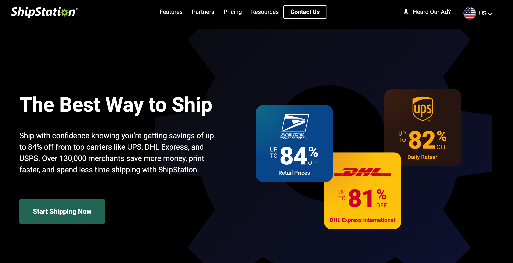

Shipstation的官网折扣价格

  
**尾程物流商的对接**  
对于海外仓来说，要满足仓库内的便捷作业，那么前置就要解决订单来源问题和物流下单的问题，最理想的情况就是：**单据到了仓库之后，一切信息都就绪，只需要仓库拣货，打包，发走就好了。**  
关于订单的来源，一般都是通过对接第三方ERP或者OMS对接电商平台来解决的，订单到了OMS之后然后生成对应的发货单或者出库单，再推送给WMS即可。  
而关于物流下单，有一些是放在OMS端，有一些是放在WMS端，这也就是我之前文章中写到的“前置预报”和“后置预报”的区别。无论是要前置预报还是后置预报，都需要提前和物流商进行对接，这样才能实现在线打单。  
与在线打单相对应的就是“线下打单”，也就是导出订单信息，然后导入到打单系统，然后预报成功了之后再导回OMS或WMS中。  
对于没有信息化系统的WMS来说，一般是用共享Excel进行协作的，其中最繁琐的就是要把物流下单的信息导入到打单系统，然后等打单系统获取到了物流面单之后再把面单文件上传到Excel中。  
这一类海外仓在经营了一段时间之后都意识到了这种导入、导出、再导入的方式太麻烦了，而且很容易出错，于是都会逐步考虑采购SaaS WMS或者自研WMS，然后用系统来管理这些单据，其中很核心的环节就是与尾程物流商的对接，对接的接口一般也可以分成三种：  
1官方物流接口；  
2打单系统（第一类）的对接；  
3打单系统（第二类）的对接；  
官方物流接口的对接，一般比较费时费力，而且需要相应的开发者账号资质，因为需要联调，测试，验证等环节，还要和海外的技术团队进行邮件沟通等。按我们之前团队的对接情况来看，一般一个物流从拿到接口文档到最后上线打通全部流程，一般都需要1周到2周左右的时间。如果遇到一些接口异常或者特殊情况下，一个月或者更久也有可能。一般来说每个物流商都要分别去对接，分别看它们的文档，例如下图中的：FedEx，DHL，USPS的接口文档。  
  

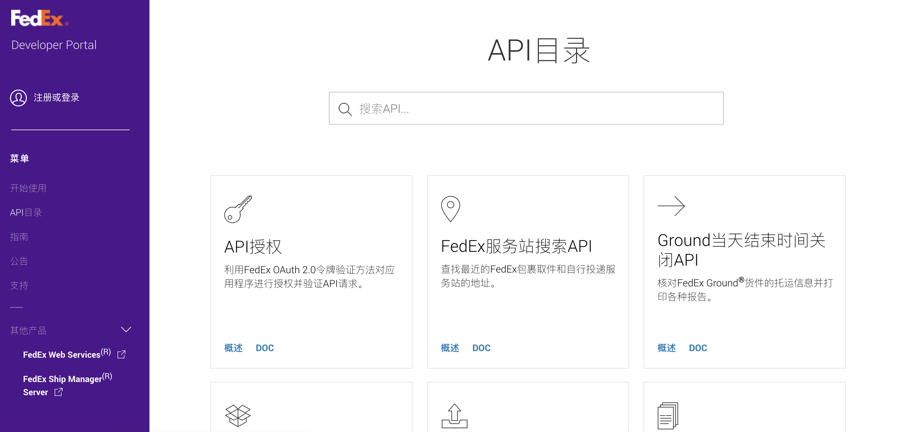

  
FedEx接口文档  
  

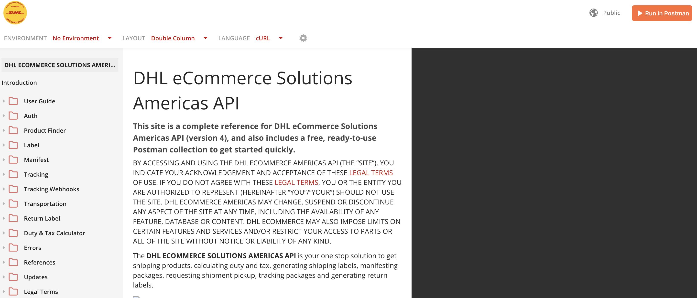

  
DHL接口文档  
  

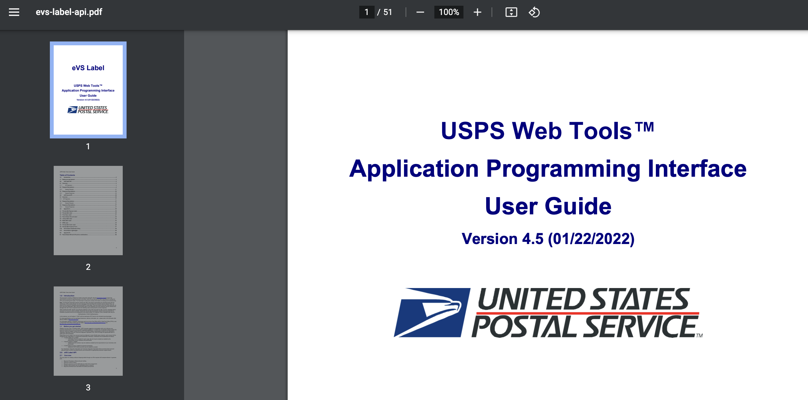

  
USPS接口文档  
打单系统（第一类）的对接，是比较快速就能对接多家物流商的一种方式，因为它已经和多家系统打通，就不用像和官方物流接口对接一样，一个物流一个物流商的看文档，联调，测试验证等。例如市面上比较有名的两家物流商聚合商，分别是Shipstation和Shippingeasy，只需要和这两个聚合平台对接好，然后就可以借助他们的平台能力直接链接到背后的多个物流商账号。  
  

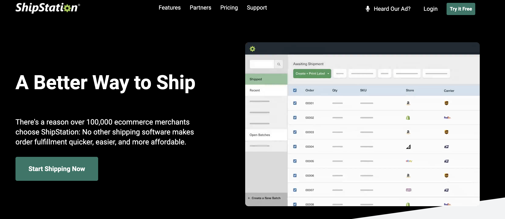

  
Shipstation  
  

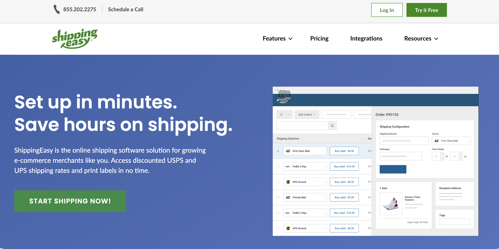

  
Shippingeasy  
打单系统（第二类）的对接，由于大多数此类打单系统都是国人开发的，所以对接起来一般都比较简单。不过因为这种打单系统业务量不是特别复杂和庞大，所以公司对IT的支出也比较少，一般也就是几个人就做了一套系统，于是很多文档或者接口功能就做得比较简陋和粗糙。而且目前市面上有很多人把跨境TMS开始充当了打单系统的作用，所以关于这一类型的打单系统的标杆产品到底是哪家，我也不知道，只能从Google中查询到一些信息。  
  

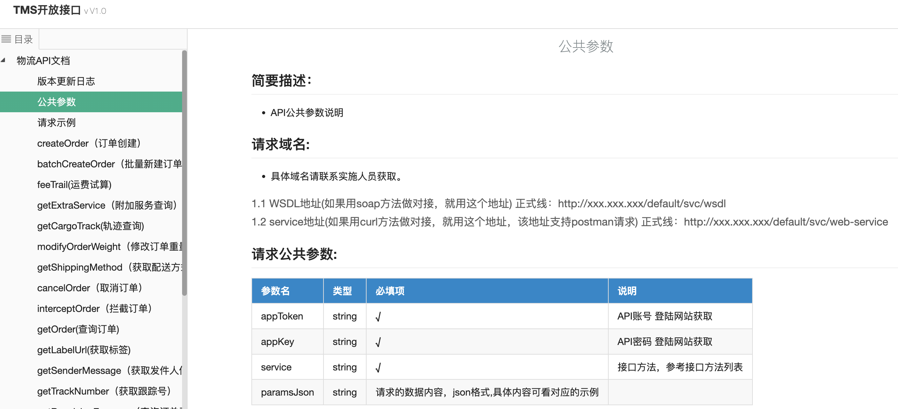

  
易仓TMS  
  

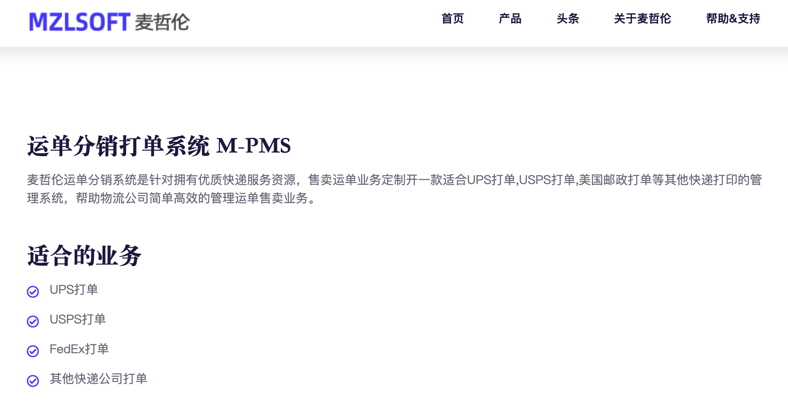

  
麦哲伦M-PMS  
  

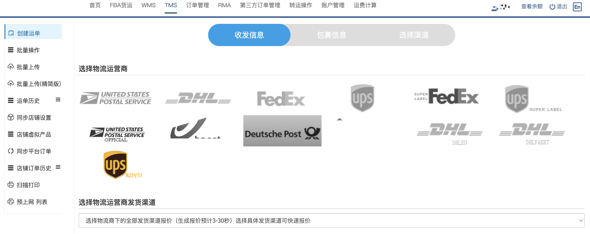

  
魔方云仓TMS  
**小结**  
国际物流背后的水很深，业务逻辑非常的复杂，关于这一块解析的文章非常的少。鉴于本人水平有限，可能本文中的观点有部分可能会有误导作用，欢迎大家拍砖。  
要做海外仓相关的业务，肯定绕不过尾程物流这座大山。同样的，如果要做一套WMS系统，也不仅仅只是搭建WMS模块就够了，TMS或者LMS也是一个非常关键的系统，背后也需要大量的业务知识作为铺垫。  
如果需要快速接入多家物流商，实现系统在线打单的能力，那么对接上文所说的“第一类打单系统”是非常不错的选择，因为自己去对接官网的物流成本太高了，而且门槛也很高，很容易在这个环节阻碍了业务的正常进展。  
如果是为了获得更低的、更有优势的物流价格，那么关键还是看商务渠道的资源和能力，可以找到那种提供优势账号的服务商，然后洽谈具体的合作方式即可。如果确认了要接入这种“第二类打单系统”，系统的对接也不会太难。