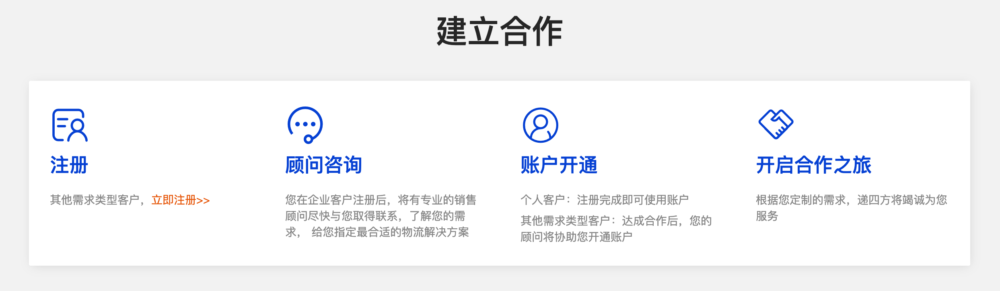
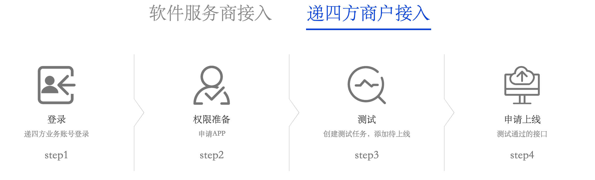
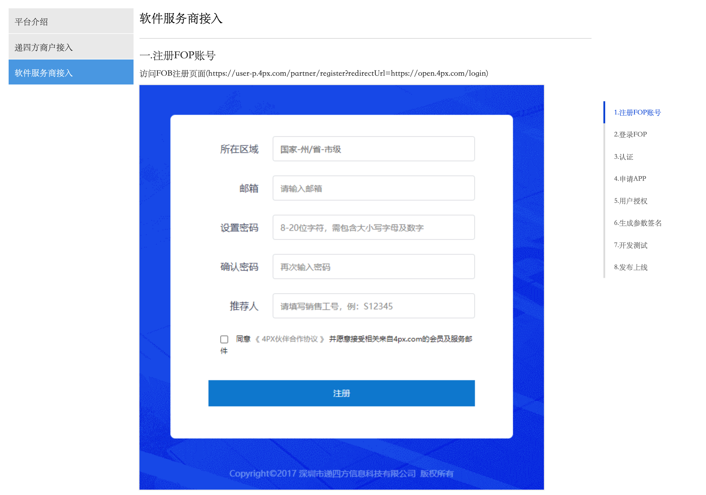
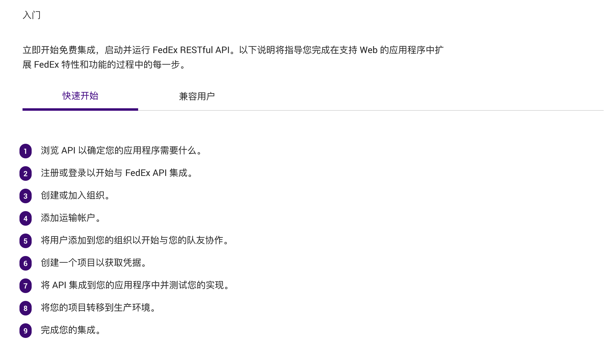
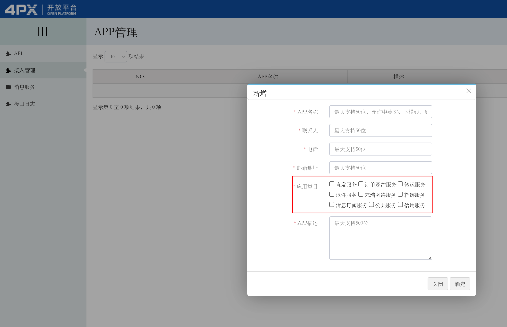
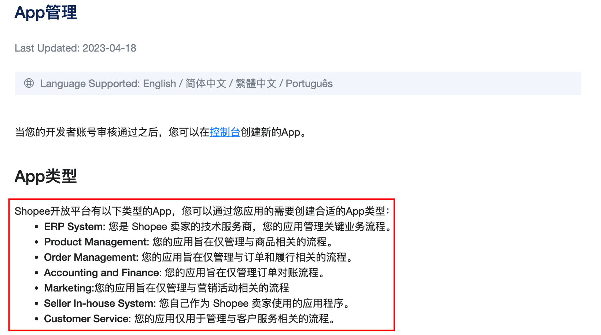
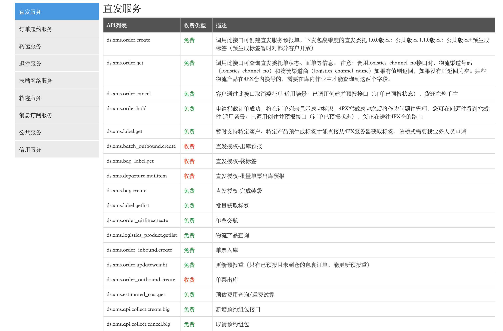
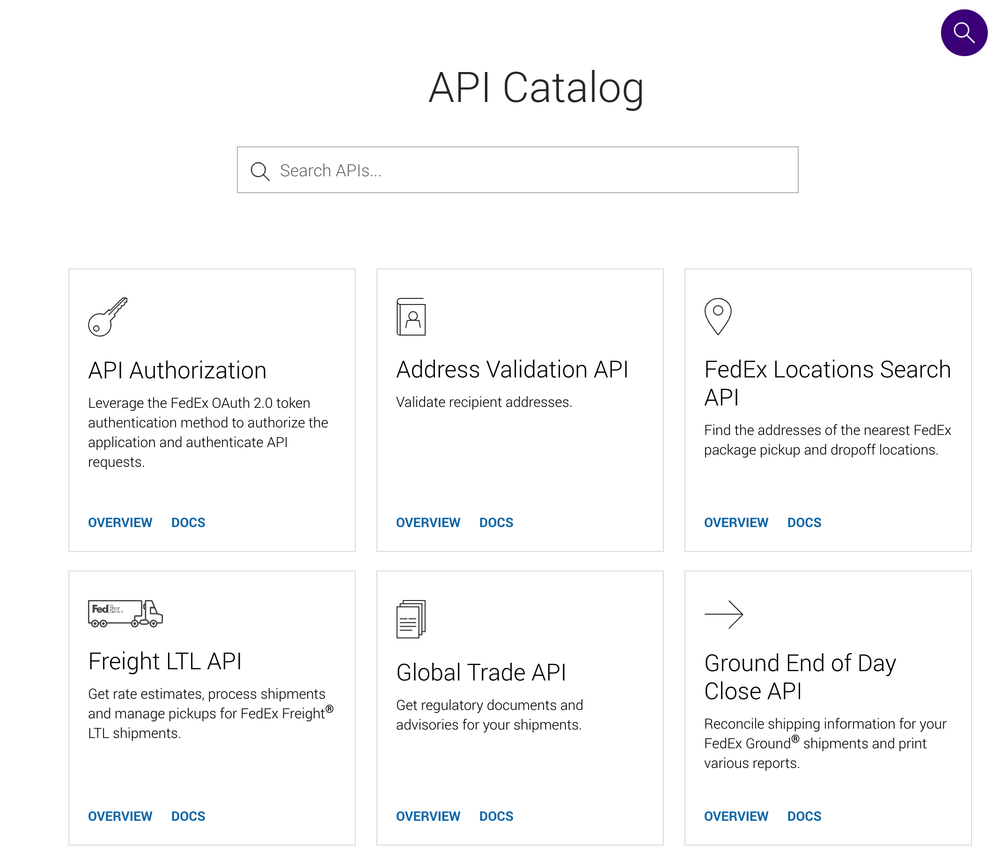
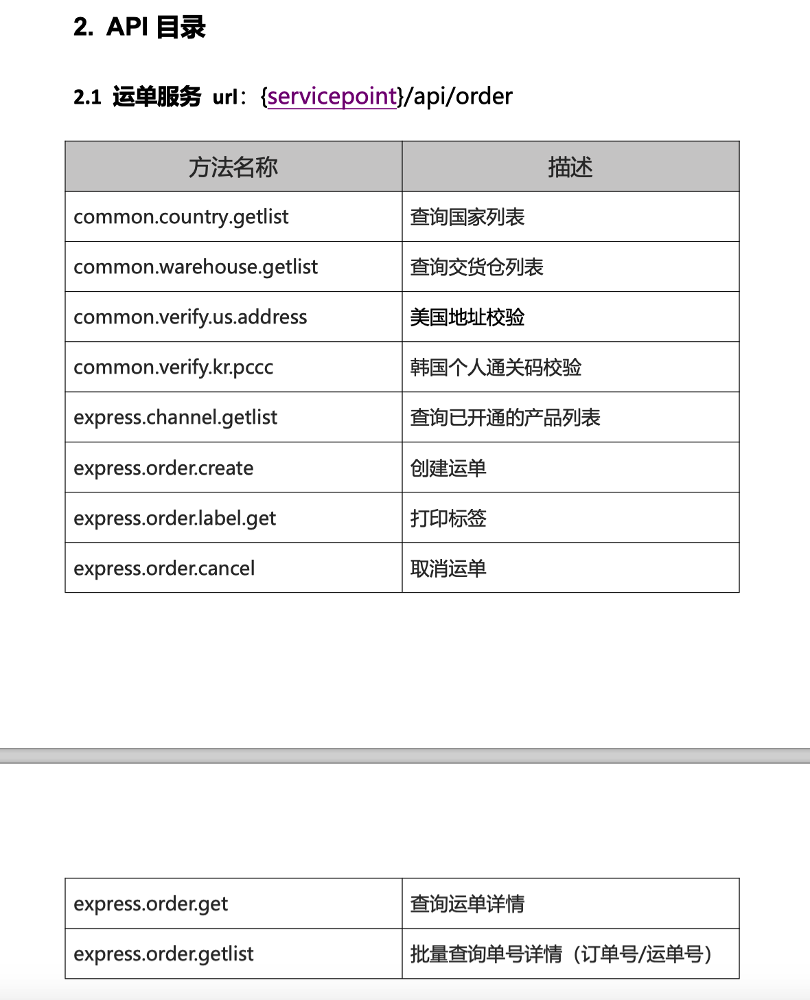

**物流商的接入**  
仓库能使用某个物流的前提是：**提前和这个物流商进行了商业合作，接入了相关的物流商**。  
这里的接入包含了两层意思，一个是商业层面的合作，另一个就是技术层的接入。一般是先商业层面，然后才是技术层面。  
例如仓库需要使用4px的物流，那么公司的物流经理或者物流渠道专员就会联系4px的销售或者商务，然后沟通自己的诉求，谈下一个合适的价格，然后逐步推进，签订服务合同。4px则会为仓库开通单独的物流账号，然后就可以进行下一步技术层面的接入了。  
  

4px的商业层面接入

  
技术的接入，就是比较标准的“开发者接入模式”了，这里做一个简单的介绍。一般包括以下步骤：  
1 注册开发者账号：开发者需要在开放平台上注册一个账号，填写相关信息并通过验证。  
2 创建应用：创建一个应用，为该应用生成唯一的应用标识符和密钥等凭证信息，以便后续调用开放平台提供的API接口。  
3 阅读文档：开放平台一般会提供详细的文档和开发者指南，开发者需要仔细阅读相关文档，了解如何使用开放平台提供的API接口。  
4 开发调试：根据文档和指南，开发者可以在自己的本地环境中进行开发和调试，以确保API接口的正确性和稳定性。  
5 提交审核：开发者在完成开发和调试后，需要将应用提交给开放平台进行审核，审核通过后才能正式上线并对外提供服务。  
6 上线发布：审核通过后，开发者可以将应用上线发布，供用户使用。  
  

4px的商户开发者接入

  
**物流商的API对接**  
在前面的文章中提到过，跨境物流的分类有很多种，其中产品经理要重点关注“支持API对接的物流”，也就是“直邮物流”和“尾程物流”这两大块。因为物流产品经理的大多数工作都和API对接有关系，需要频繁地接入多个物流商，创建多个物流渠道，然后再和业务系统串联起来，验证跑通了之后才算正式上线。  
物流商的API对接这件事，说难也难，说容易也容易。说难是因为海外仓可能遍布多个国家或地区，需要接入多个国家或地区的物流商，工作量很大，而且每个物流商的API风格、特性都不太一样，需要持续地去攻克这些问题；说容易是因为接入物流商API这件事，本质上都是一样的API接入流程，都是看接口文档，然后写对接需求，最后再验证上线等。  
**1****查看API文档**  
完成了商业层面的对接之后，就会拿到相关的物流账号和密码，有一些物流商是需要在开放平台去注册成为开发者，开发者账号密码和业务系统的账号密码不太一样，但是也有一些是通过业务账号密码去生成开发者账号，这些具体要看物流商而定。  
  

4px的接入流程

  
  

FedEx的接入流程

  
API文档大多数都是对外Open的，即使你没有成为开发者，没有相关的账号和密码也是可以阅读相关的内容的。而且API接入文档中一般都会有Quick Start的部分，就是告诉开发者要接入这些物流服务大概需要多少步骤，这一些流程和操作一般来说需要产品经理自己先去阅读，把一些关键信息和要做的动作确认清楚。  
**2****确认需要对接的接口**  
在了解了Quick Start的文档内容之后，知道了大概有多少步骤，要准备什么东西，还有一个很关键的点就是要确认一下自己的要对接多少个接口。  
一个物流商服务商，由于自身的业务可能会比较复杂，可能会提供多种服务，例如4px除了物流服务，还有海外仓服务，转运服务，退件服务等。但是又因为这些服务都是放在一个开放平台中的，所以为区分开发者到底需要接入哪个服务，就会需要开发者登录开放平台，然后申请相关的“应用”或者“APP”，用来声明你需要调用的服务是哪个。  
  

4px的开放平台创建应用

  
  

Shopee支持的App类型

  
当确定了要对接物流商的哪一类服务（APP）之后，接着就是查阅该服务类下的具体接口文档，然后确定要对接哪几个接口，因为即使是同一类服务（例如“直发服务”），下面也会有很多具体的功能接口，类似于产品设计中的增删改查导入导出等，不一定都要接入。  
  

4PX直发服务的接口列表

  
  

FedEx的接口分类

  
  

燕文物流的API目录

  
产品经理需要结合实际的业务情况确定要对接哪些接口，这样才能在下一步输出需求文档的时候有针对性，而不会让开发感觉抓瞎。  
例如燕文物流的API物流中有“美国地址校验”，“韩国个人通关码校验”等，这些如果你的实际业务是没有的，那么就可以不对接，选择你需要的业务对接即可。  
**3****输出对接的需求文档**  
完成了前面两步之后，产品经理就可以输出相关的需求文档了，接口对接类的需求和普通的业务需求文档基本上是类似的，只不过需要额外多说明几个点：  
1接口文档的资料，PDF或者是链接；  
2接口联调的测试账号、密码、秘钥等；  
3需要对接哪些接口，不同的接口的用处是什么；  
4一些核心的接口的字段映射关系，物流商需要什么字段，系统中应该传递什么字段给它；  
如果接口对接通了之后，怎么和业务系统打通，业务逻辑是怎么处理的？这些内容就和正常的需求描述一样即可，所以对于API对接类的需求，重点就是产品需要提前把接口文档琢磨透彻一些，然后从中提炼出一些核心的，高价值的内容。  
**4****联调测试并解决一些阻塞的问题**  
当评审完需求之后，研发就会进入接口对接的开发工作中，此时产品经理要做的就是及时解决一些阻塞性的问题。例如研发反馈某个接口调不通，可能是对方的接口文档没有更新或者是有错误，需要产品经理从中协调去沟通解决。  
例如研发发现某个接口需要的字段系统中没有，那么可能产品要尽快确认怎么去搞定这个字段，是不传，还是在业务系统中新加一个字段传过去。  
例如研发联调的时候发现有一些问题和预期的不对，产品经理要及时根据这些问题去判断可能的原因，然后调用资源去解决。  
**5****上线**  
当所有的接口都对接完成，并且也联调通过之后，那么就可以上线了。物流商对接完成后如果要正式投入生产，一般会需要做一些实单测试，因为有一些物流商的测试环境不能做到仿真效果，所以必须要上线之后在正式的生产环境中测试验证一下。实单测试一方面是看接口能不能跑通，数据是否正常，另一方面是看具体的业务是否能跑通，例如打印出来的面单是否能正常被物流商揽收，生成的物流账单结算等是否正常等。  
**尾程物流商对接容易踩坑的点**  
**1****接口不清晰**  
在物流对接过程中，如果对方物流商的研发水平不行，接口文档输出的质量也不会太高，就会导致有很多内容你看不懂，也不知道是什么意思，所以就需要频繁地和对方的研发人员沟通，所以接口对接的时候拉一个交流群是比较好的做法。但是也有一些国外的物流商是没有用微信、钉钉等工具的习惯的，所以遇到了问题就需要发邮件去沟通，这样效率就稍微慢一些。  
**2****对方不回复**  
在对接一些欧洲的本土物流商的时候最容易遇到的一个问题就是“对方不回复”，因为欧洲的文化习俗问题，有些公司的年假很多，所以你发过去了邮件，可能对方去休假了，你就要十天半个月之后才会有人理你。从我接触过的项目来看，欧洲的物流商对接难度很大一部分来自于找不到人或者对方不回复。  
所有产品经理可以自己找一些交流群，多准备好相关的资源，如果遇到了问题之后直接求助交流群的其他产品或者研发也是一个好办法。傻傻地等对方回复是一个很低效率的操作，但是又没得办法，确实很烦。  
**3****测试验证可能会收费**  
跨境物流的包裹计费节点一般来说有两种模式：  
1一种是按预报收费，意思就是你预报了面单之后，不管你用不用都会收费，除非你及时取消这个单；  
2一种是按扫描收费，意思就是预报了面单之后不会收费，而是物流商揽收扫描了信息，录入到了他们的系统之后才会收费；  
所以，我们对接完成了物流接口之后，肯定是要上线的。上线之后在生产环境测试的时候，要问清楚业务人员这个物流是怎么计费的模式，如果是按预报收费，那么就要及时取消，否则就会产生相关的物流费用了。  
**4****错误提示看不懂**  
有一些本土的物流商对接完成之后，在调用对方接口的时候可能会提示报错，然后这些错误提示很多可能是自己的当地语言，例如德语，法语或者西班牙语等，这些错误信息如果直接反馈给用户的话，那么用户看到了也会一脸懵。而跨境物流下单的失败率其实还挺高的，因为地址不对，字段不对，一些参数不合法等都会导致下单失败，所以针对物流下单失败的场景需要单独去做“错误信息的美化翻译”，让用户可以通俗易懂地get到哪里出错了，要怎么修改，这个一块的内容我们会在后续的文章中介绍。  
**一些物流接口文档分享**  
  

[云途物流API接口开发规范 OMS-202012.pdf](https://www.yuque.com/office/yuque/0/2024/pdf/460219/1719298505835-8f4b3fdf-1993-41ef-abef-00918a417b24.pdf?from=https%3A%2F%2Fwww.yuque.com%2Fjiaowovitamin%2Fotwb2%2Fgnsvoscvbrguykre)

(626 kB)

[4PX开放平台版权© 2004-2019 深圳市递四方信息科技有限公司 粤ICP备 12019163号-7](https://open.4px.com/)

[燕文物流追踪API文档\_V2.5.4.pdf](https://www.yuque.com/office/yuque/0/2024/pdf/460219/1719298506266-5c2920f0-5bd4-4b86-bc4a-d4f4babc812c.pdf?from=https%3A%2F%2Fwww.yuque.com%2Fjiaowovitamin%2Fotwb2%2Fgnsvoscvbrguykre)

(406 kB)

[燕文EJF订单管理系统接口2.0.pdf](https://www.yuque.com/office/yuque/0/2024/pdf/460219/1719298506783-e7141586-8fd7-466c-8fdf-73e31ba3e8bf.pdf?from=https%3A%2F%2Fwww.yuque.com%2Fjiaowovitamin%2Fotwb2%2Fgnsvoscvbrguykre)

(479 kB)

| **物流商** | **类型** | **业务范围（国家/地区）** | **API文档地址/PDF文件** | **对接要求/资质** | **其他说明** |
| --- | --- | --- | --- | --- | --- |
| DHL | 国际物流商 | 全球 | [https://developer.dhl.com/api-reference](https://developer.dhl.com/api-reference/shipment-tracking#get-started-section/) |  | 1. 有自己的发件人地址库，可以通过地址代码放弃发件人信息的传参 2. 德国境内的快递必须要有门牌号 |
| USPS | 国际物流商 | 美国 | [https://zh.usps.com/business/web-tools-apis/documentation-updates.htm](https://zh.usps.com/business/web-tools-apis/documentation-updates.htm) |  |  |
| 皇邮 | 国际物流商 | 英国 | [https://www.royalmail.com/business/tools-services/apis](https://www.royalmail.com/business/tools-services/apis) |  | 可以不翻墙 |
| Fedex | 国际物流商 | 美国 | [https://developer.fedex.com/api/en-us/home.html](https://developer.fedex.com/api/en-us/home.html) |  | 1. 有独立的测试环境和测试账号 2. 必须要有真实的渠道服务商账号 |
| Postmen | 打单系统 |  | [https://www.aftership.com/docs/postmen/quickstart/api-quick-start](https://www.aftership.com/docs/postmen/quickstart/api-quick-start) |  | Aftership旗下的一个打单系统，对接之后可以直接通过Postmen进行物流接口的打通，也可以使用Postmen的折扣账号。Postmen的接口文档比较标准和规范，如果未来自己也要做一个打单平台，那么可以参考一下他的接口 |
| 邮差小马 | 打单系统 |  | [POSTPONY——API开发文档.pdf](https://www.yuque.com/attachments/yuque/0/2022/pdf/460219/1666427723586-6e5a25cf-5ba2-43b5-a6b7-eaaa27e43dcb.pdf) |  | 邮差小马Postpony，也是一个物流订单平台，主要是面向美国的物流市场，接口文档中有一些UPS，Fedex的业务知识，可以学习一下 |
| GlobalTranz | 国际物流商 | 美国 | [https://api.gtzintegrate.com/docs/?identifier=0CPvaw4f7hDOC0VAW5uUAQ==Gd_HYUcz2iPhkvPsnqlrB8Tw8kGFkaZBHSatKNIWY4MqE_iEkVDwIbSlDlok7HOkOFHSIg5QkBplD9VHjWBTAIp1l4WY-KdCdbgg6sgSFi0#/ltl/ltlPartnerQuote](https://api.gtzintegrate.com/docs/?identifier=0CPvaw4f7hDOC0VAW5uUAQ==Gd_HYUcz2iPhkvPsnqlrB8Tw8kGFkaZBHSatKNIWY4MqE_iEkVDwIbSlDlok7HOkOFHSIg5QkBplD9VHjWBTAIp1l4WY-KdCdbgg6sgSFi0#/ltl/ltlPartnerQuote) |  | GlobalTranz属于物流整合平台4PL，在美国支持零担物流LTL和整车物流。 |
| GigaCloud Lastmile | 国际物流商 | 美国 | [LastMile API_v1.3.3_20220526.pdf](https://www.yuque.com/attachments/yuque/0/2022/pdf/23209935/1666780586357-b26eb4ca-059d-497f-b3c7-51bd2a6483e0.pdf) |  | 美国尾程物流商，主要承运大货，提供LTL服务。对接API需先签约成为gigacloud lastmile的客户。商务合作联系电话：13402507279 |
| FreightClub | 国际物流商 | 美国 | [Freight-Club-Technical-API-Documentation.pdf](https://www.yuque.com/attachments/yuque/0/2022/pdf/23209935/1666837844017-a50d85d8-8995-4509-b755-5b47ad26ce06.pdf) |  | Freight club是美国卡车运输整合平台，详情见官网https://www.freightclub.com/ |
| 巴西邮政 | 国际物流商 | 巴西 | [CORREIOS_PACKET_API_INTEGRATION_GUIDE_EN_v2.pdf](https://www.yuque.com/attachments/yuque/0/2022/pdf/711187/1667183317848-798086b4-0997-4b6e-b34b-4066d9951e64.pdf) |  | 巴西邮政，需要自制LB、袋标、航空清单 |
| UPS | 国际物流商 | 全球 | [https://www.ups.com/upsdeveloperkit?loc=zh_CN](https://www.ups.com/upsdeveloperkit?loc=zh_CN) |  | 申请网站秘钥需要有45天以内的账单信息（发票号、发票日期，发票金额） |
| GLS | 国际物流商 | 全球 | [https://mojgls.si/integrate/api](https://mojgls.si/integrate/api) |  |  |

**小结**  
跨境物流的对接是一个比较繁琐但又比较重要的事情，因为物流是履约的一个基础，物流的稳定性对仓库来说非常重要。因为它并不掌控在自己手中，如果物流商出了什么问题就会极大地影响到自己的业务。  
所以关于物流对接这一块，一定要谨慎加重视，同时还需要多总结一些提升效率的办法，因为物流商要接入的太多了，如果没有梳理出一套体系化的方案和流程，每次都是花费高额的时间去接入的话就太低效率了。  
跨境物流中会有很多物流商的接口文档都是英文版，所以一些英语比较好的朋友去做这一块的业务会有一定的优势，如果英文不好也没关系，要学会借助工具去达到自己的目的，多用翻译软件也是可以的。