**物流商的授权**  
当系统对接完成了某物流商的API接口之后，还需要上线相关的授权管理页面，便于使用者可以灵活的填写相关的物流授权信息。尤其是对一些SaaS ERP或者SaaS WMS来说，对接物流商的API只是完成了信息传输通道的建设，但是最终还是要让使用者（SaaS的租户）来填写物流商的物流账号和密码，所以这个授权和管理页面也是TMS中比较关键的模块，不过这一块一般都是做在ERP的客户端或者是海外仓后台管理系统的物流模块。  
  

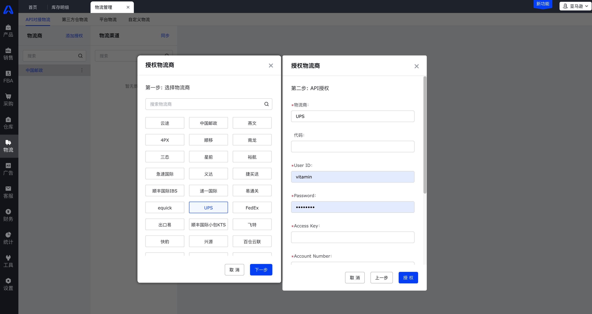

  
  

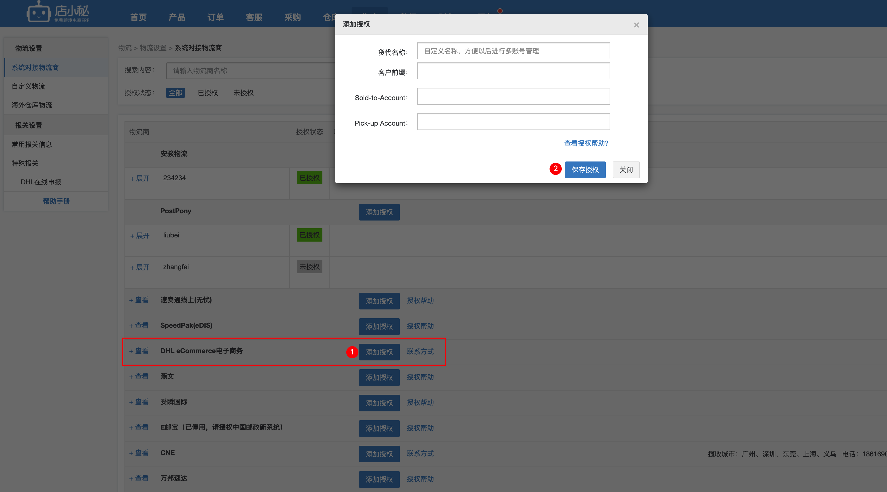

  
  

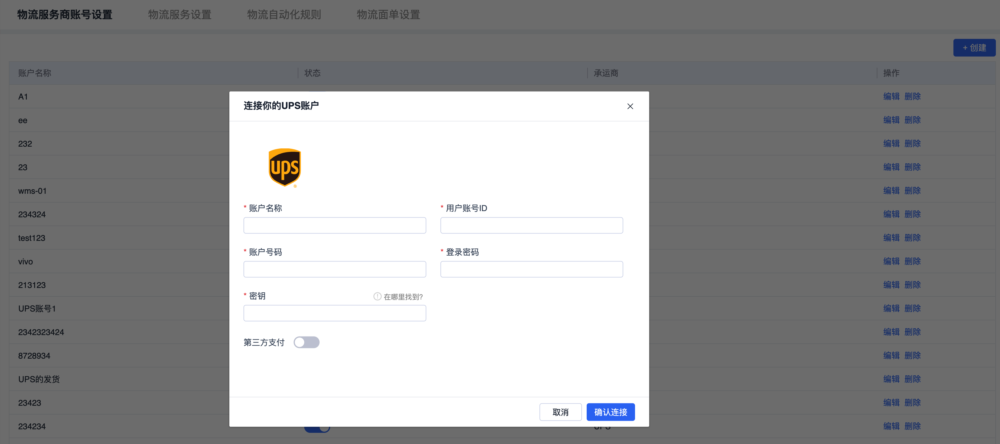

  
授权物流商的时候，需要根据不同的物流的授权接口要求使用者填写不同的授权信息，例如有一些物流商是要填写Account，password等，但是也有一些物流商是要求填写ID，Key，Token等信息，总之就是得要看物流商的授权接口而定。  
除此之外，不同的物流商的授权认证方式不太一样，所以会导致当客户填写了授权信息之后不能直接知道授权是成功的还是失败的，因为接口传递数据过去之后有一些物流商的不会直接反馈结果的，默认都是成功的。  
简单举个例子就是，我可以输入任意的字段信息去授权某个物流商，系统都会判定我授权成功了，但是实际上我的账号密码登信息都是错误的。  
针对这种情况，主要原因还是物流商的信息化接口能力不足导致的，而有一些物流商这可以在账号授权的环节就判断出这些授权信息是否正确，为了兼容这种参差不齐的物流商接口，我建议增加一个“授权状态”的字段，然后一共可以分成“未授权”，“授权成功”，“未知”这三个子类。  
如果物流商不能给出明确的结果，那么授权状态就是“未知”；如果能给出明确的结果是成功或者失败，那么授权状态就是“授权成功”或者“未授权”。  
**物流渠道的创建**  
物流商的账号授权通过之后了，可以通过接口获取到物流商可提供的所有服务列表，一个物流商可以提供多种不同的物流服务，这些不同的服务在物流商内部一般都会有单独的服务代码。例如UPS分成了“Domestic Service（本土服务）”和“International Service（国际服务）”两大类，然后本土服务中又有“UPS Ground”，“UPS 2nd Day Air”等不同的服务，而国际服务则有“UPS Worldwide Expedited”和“UPS Worldwide Express”等不同的服务。  
  

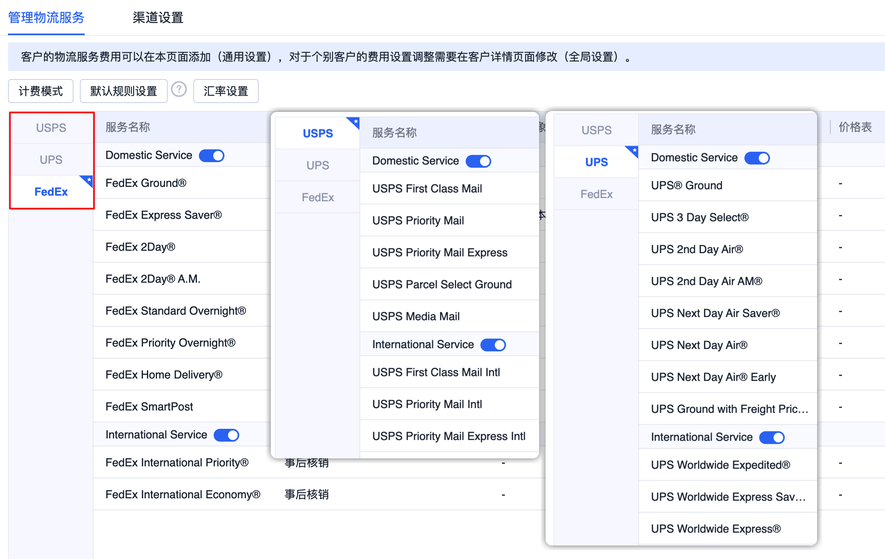

  
国内的一些物流服务商也会有类似的服务名称和服务代码的概念，如果需要使用具体的某个服务，则需要在接口传递数据的时候把对应的服务代码（物流渠道代码）传输给服务商。  
  

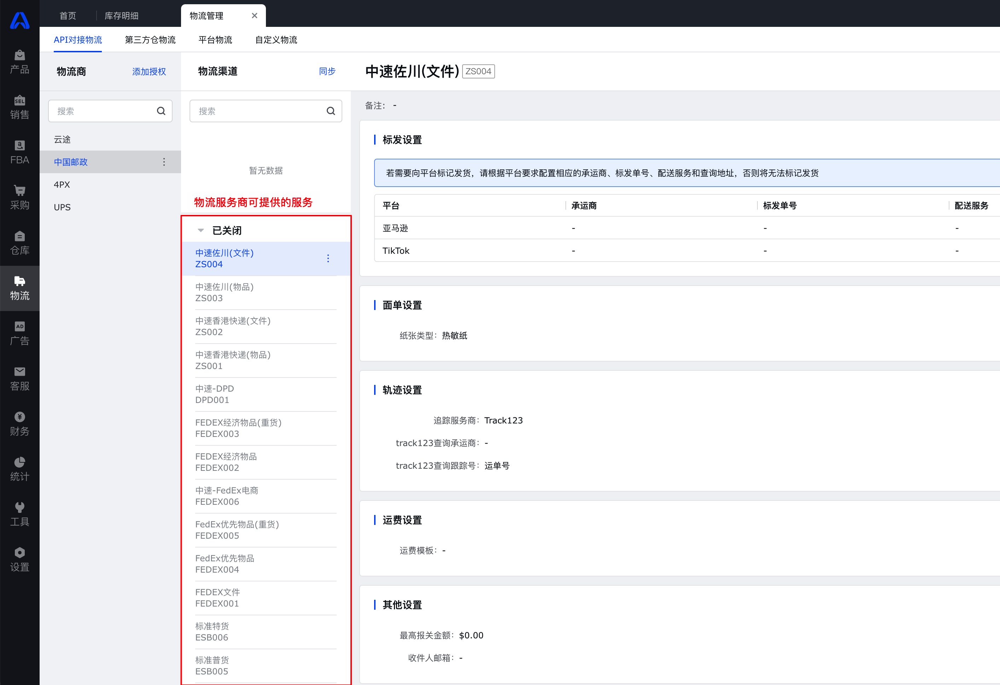

  
很多时候，服务商的服务代码或名称可能不太利于ERP或者海外仓的用户去使用，而且在本地的信息化系统中需要对这些不同的服务代码关联上一些控制信息或者配置项，所以需要在本地创建一个“物流渠道”。然后把控制信息挂在本地的物流渠道上，平时的使用也是用这个物流渠道，当需要和物流商进行接口传输的时候，再通过这种映射关系把本地物流渠道背后对应的服务商的服务代码传输过去。  
所以当我们授权好了物流商账号之后，接下来要做的就是针对物流商提供的服务代码去创建一个一对一的本地物流渠道（下文都称之为“物流渠道”），既然有创建物流渠道，那么就会有修改、删除、停用等操作，所以这个模块也可以称之为“渠道管理”。  
在创建渠道的时候，除了维护渠道的基础信息之外，还有很关键的就是要维护渠道相关的配置信息，这些配置信息和实际业务有很大的关系，所以ERP的渠道配置和海外仓的渠道配置不太一样，ERP的渠道配置一般包含：  
1基础信息，渠道的名称，备注，说明等；  
2物流映射（标发配置），即在不同的电商平台上映射的是哪个物流商，然后回传的跟踪号是取什么字段的值；  
3面单配置，不同的物流渠道返回的面单数据可能不太一样，有一些是需要自画面单，所以需要配置打印模板；  
4发货地址，可以配置不同的渠道的发货地址不一样；  
5运费配置，ERP在选择使用哪个物流的时候需要进行物流比价，物流比价的前提就是要为物流渠道配置好对应的计费模块，才可以试算出运费多少；  
6其他设置，一些物流渠道可能需要维护最大最小的报关金额，最大的包裹重量，一些特殊的地址字段自动处理，还有黑名单自动拦截等规则；  
  

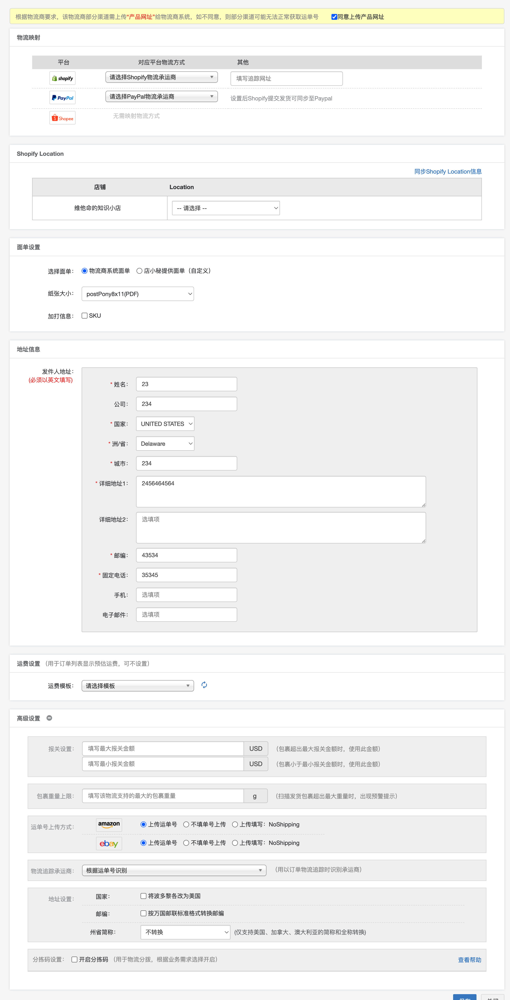

店小秘ERP物流配置

  
而对于海外仓的物流渠道来说，因为海外的物流渠道大多数都是尾程物流（要遵守国外物流的规则），而且一个物流渠道可能用在不同的仓库上，所以配置项就和ERP不太一样了，主要有：  
1仓库配置，确定哪个仓库可以使用这个物流渠道；  
2客户配置，确定哪个客户可以使用这个物流渠道；  
3发货地址配置，可以配置不同的渠道的发货地址不一样；  
4面单打印模板的配置，同的物流渠道返回的面单数据可能不太一样，有一些是需要自画面单，所以需要配置打印模板；  
5业务类的配置，例如是否需要运单号截取，是否支持签名，是否支持保险，是否支持一单多包裹，是否支持子母件，是否支持可跟踪等；  
  

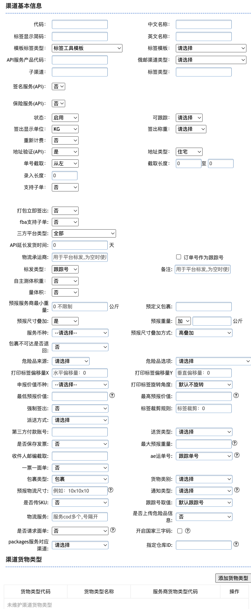

易仓WMS的物流配置

  
**物流产品的创建**  
一般来说，授权好了物流商，然后再创建好物流渠道，接着配置好相关的信息之后物流渠道就可以直接提供给用户去使用了。由于业务的发展，有一些海外仓发现如果给客户提供的是准确的物流渠道（物流商的具体服务）这种玩法可能会有一些些瑕疵，例如说暴露了过多的信息，容易被同行恶意竞争；指定好了物流渠道之后，可能会错过一些物流可获利的点。  
拿国内的电商玩法举例，对于9.9包邮的商品来说，如果是使用顺丰快递去发货，那么成本一般来说肯定是比中通，韵达，极兔这一类的快递要贵的，而且对于一些省份来说，其实发顺丰还是发极兔时效都是差不多的，虽然极兔可能服务态度不太好或者网点少一些，但是整体来看反正都能送到，而且时效也是一样的，既然极兔便宜我就肯定多用极兔就好了。对于消费者来说，如果一开始卖家不承诺使用什么快递，只是含糊其辞地说包邮，那么自己也事先感知不到卖家会用什么快递，也不会有什么期待，所以对消费者的体验是没有什么太大的影响。  
如果我们把业务放到海外仓的模式上来看，会发现这两者玩法其实是类似的。海外仓帮商家去发货给消费者，如果海外仓一开始承诺了要用FedEx等快递去给商家发货，那么最后履约的时候肯定是要按承诺的方式去做的。但是可能实际上相同的地址，FedEx要比USPS快递更贵，但是两者的服务、体验可能对商家或者消费者来说体验不会很差很多，可是FedEx却比USPS贵一些。**于是有一些仓库就在想，如果我能对客户收FedEx的钱（更贵的费用），然后背后却用更便宜的快递去发货（USPS是指美国邮政快递，价格比较便宜），这一来一回岂不是赚得更多了？**  
于是，在这样的业务场景下，海外仓行业就搞出来了一个“物流产品”的概念，对卖家提供物流服务的时候不指名具体是什么物流服务，只是是用“美国2日达”，“美国经济快递”，“美国特快派送”等字眼来描述这些物流方式。  
  

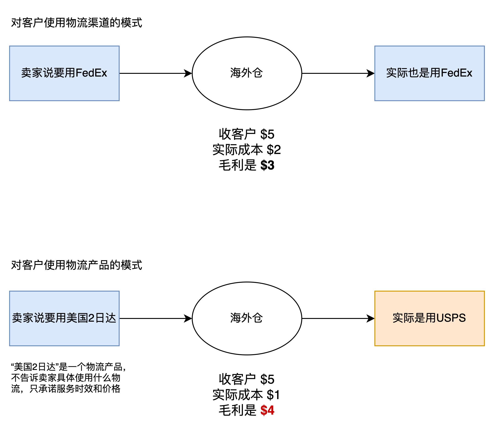

  
物流产品背后包含了多个具体的物流渠道，这些物流渠道可能都是同一个物流商旗下的不同服务，例如都是FedEx的，但是可能是不同的物流服务（FedEx Ground，FedEx Express Saver，FedEx 2Day等）。也有可能是不同的物流商旗下的不同服务，例如“美国2日达”这样的物流产品，背后的物流服务可能是（FedEx 2Day，UPS 2nd Day Air，USP Priority Mail等）  
  

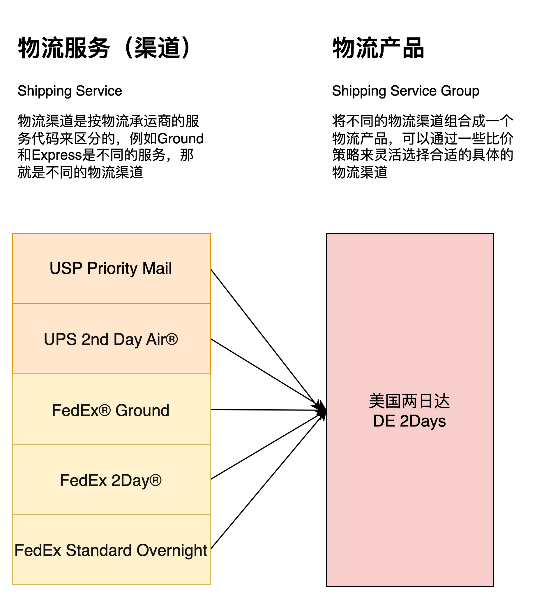

物流渠道和物流产品的关系

  
如果需要引入物流产品这个概念，那么就自然也需要有“物流产品管理”这样的一个模块，通过创建一个物流产品，然后去选择包含的物流渠道，以及配置可使用的客户或者仓库等。  
  

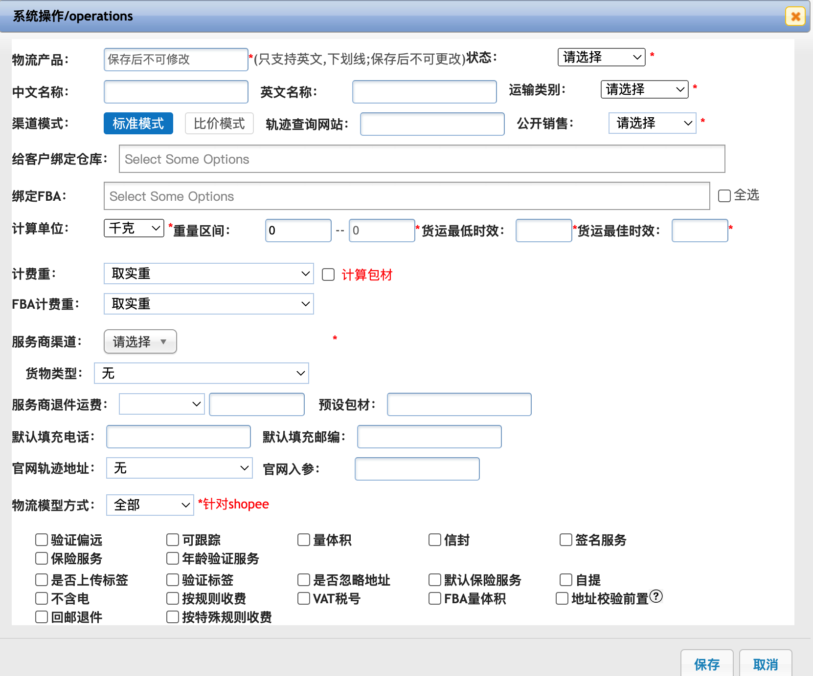

易仓WMS创建物流产品示意图

  
**物流规则的配置**  
在创建物流渠道的时候可以去维护一些配置信息，可以便于后续业务使用的时候做一些控制操作，但是对于海外仓的尾程物流来说，有很多要求和规则是比较隐性的，有些时候只有遇到了错误之后物流商才会反馈结果给用户，这样的体验就不太好。所以为了更加灵活地处理这些隐性的要求，可以单独抽出一个“物流规则”的模块来专门维护，通过这些规则可以提前约束、限制或者转化一些已知的错误，让用户使用物流渠道下单的时候更加顺畅，而不是每次都要等提交到了物流商之后才知道结果可能是错误的。  
例如某个渠道(物流服务）会对发件人和收件人的信息的发/收件人信息、商品重量/服务、发货条款等有限制，这些限制是从物流商提供的API文档中知道的，也有部分是通过实际业务运转得出来的，针对这种场景，就可以去配置一条专门的规则。  
发件人和收件人的名称长度不能超过XX位字符的时候；  
收件地址中的邮箱需要必填，而且要符合邮箱格式；地址中的门牌号必须要有值，否则会下单失败；  
当地址信息中包含了“XXX”字符的时候，自动将“XXX”替换为“YYY”；  
当包裹中的产品包含了“带电属性”时，则不允许发货；  
……  
规则的配置方式很有多种，需要把这些规则抽出来，然后做成配置化的模式，一般来说的思路就是如下图所示：  
当满足XX规则后，则怎么操作；  
当收件人的名称超过XXX位字符时，则报错提示“字符长度不能超过XXX位字符”；  
  

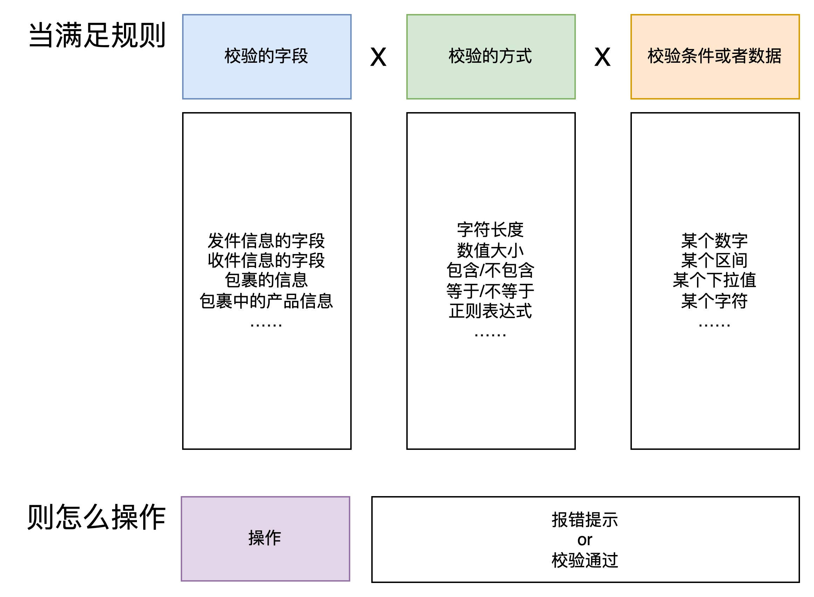

  
**小结**  
物流商对接完成之后还需要授权，创建渠道，配置物流规则，或者是创建物流产品等操作，这些操作都是放在TMS来完成的。  
对于海外仓经营来说，尾程物流的收入是核心利润的来源，所以在物流方面的业务要求会比较多，对于刚入此行的产品经理来说，需要多花时间去了解实际的业务规则，然后再去做具体的产品功能设计。  
有些时候竞品系统中看似很奇怪的操作，其实都是有实际的业务原因的，不要一味地吐槽和指责对方做得不好，而是要思考这些“不好的功能”的背后都发生了啥，都是因为什么原因导致的，这也是我们容易踩坑和犯错的点，也是促使我们快速成长和进步的关键因子。