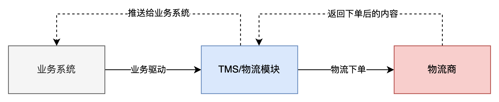
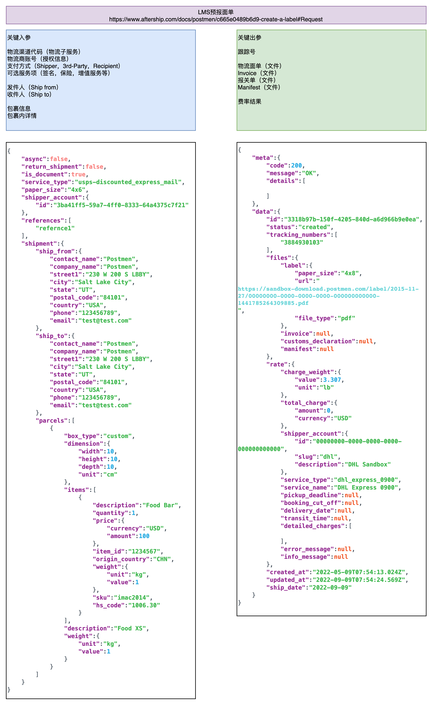
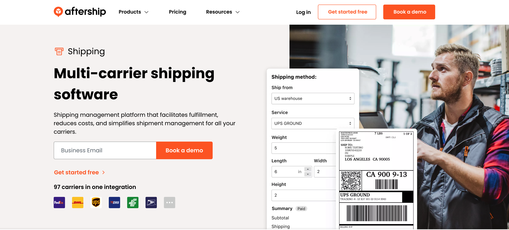
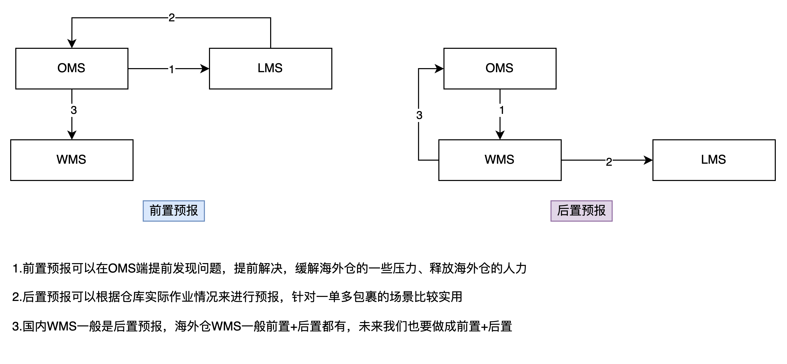
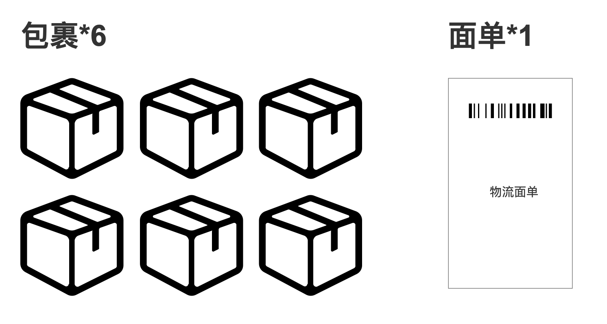
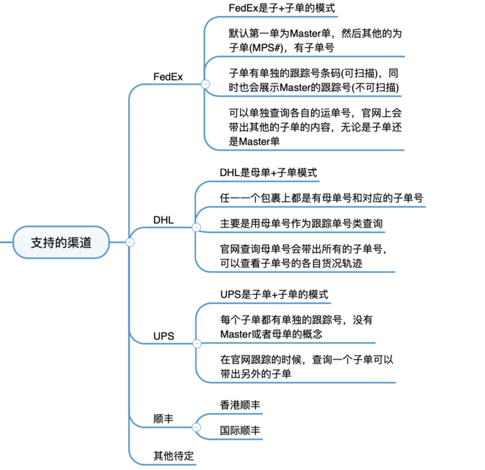
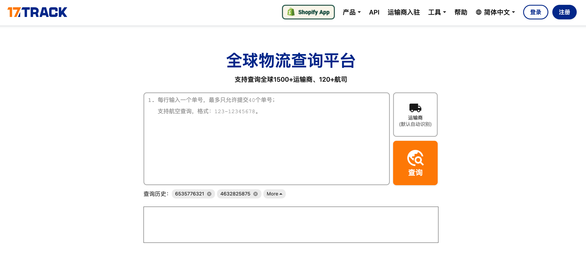
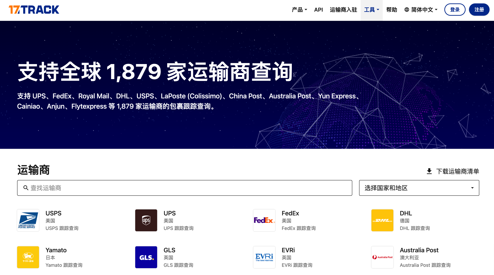

**物流下单**  
物流下单也称为“物流预报”，“申请运单号”，“获取面单”等，意思就是TMS通过API接口向物流商请求获取电子面单和跟踪号的行为。这个过程使得仓库能够高效地处理大量订单，而无需手动录入每个订单的信息。  
总体来说，物流下单的流程，不论是OMS，WMS，还是ERP，都和下图大差不差：  
  

物流下单示意图

  
和物流商直接交互的是TMS或者物流模块，而TMS/物流模块的上游还有业务系统，业务系统一般是指OMS/订单模块。所以TMS除了要对接好物流商的各种接口之外，还需要和上游的业务系统也提前对接好，这样才能接收这些业务系统推送过来的单据。  
物流下单的时候，需要推送给物流服务商的信息大致可以分为以下几类：  
1地址信息：包括发件人和收件人的姓名、地址等信息，确保货物能够从正确的发件地点送达到预期的收件地点。  
2货品信息：包括货物的品类、尺寸、重量等信息。需要注意的是，有些物流服务对于包裹内容有特殊要求，如禁止运输液体、粉末、带电产品或易燃易爆物品等。此外，某些物流渠道也对包裹的尺寸和重量有限制。  
3物流服务选择：根据不同的需求，选择合适的物流渠道和服务。例如，有些渠道采用空运，不支持带电产品；有些渠道对安全性有较高要求，不支持易燃易爆物品；有些渠道不支持超长超重或异常形状的包裹等。  
提供的关键信息有：  
1发件人  
2收件人  
3包裹信息  
4物流渠道  
返回的关键信息有：  
1跟踪号/运单号  
2物流面单（文件）  
  
  
要知道具体物流预报的时候需要用到哪些信息，物流商会反馈哪些信息等，可以查阅相关物流商提供的API文档，因为不同的物流商对接口的字段要求基本上都不太一样。这里以打单系统“Postmen”为例，看看TMS需要传输哪些信息给它，而它又会返回哪些信息给TMS。  
  

Postmen的接口示例

  
Postmen的Aftership旗下的一款物流打单聚合平台，目前已经更名为Aftership Shipping了。它接入了多家物流商，用户可以通过Postmen拿到官方折扣价，也可以把Postmen当作一个物流接口聚合商，通过接入Postmen然后快速地对接背后的多家物流商。  
  

  
**物流下单的两个节点**  
海外仓的物流下单一般有两个节点：**前置物流下单和后置物流下单**。  
前置物流下单就是在OMS当中完成物流下单，而后置物流下单就是在WMS当中完成物流下单。  
前置物流下单就是在OMS系统中向物流商的接口请求物流面单，把一些物流的label，还有跟踪号等拿到了之后，再跟订单其他信息一起推到WMS当中，让仓库端直接就可以作业了。  
后置物流下单，一般就是指OMS只把订单信息推送到WMS中（一般会指定物流商或者物流渠道），WMS接到了订单之后，向物流商的接口请求物流面单，拿到了相应的信息之后再开始作业。也可以先进行作业，然后根据实际的打包情况，再向物流商申请物流面单，这种情况一般用于一单多包（子母件）的场景。  
  

海外仓前置预报和后置预报的区别

  
**1****前置物流下单的好处**  
前置物流下单的好处就是把一些复杂性的操作，异常的处理流程等放在了前端。因为国际物流有很多规则，也有很多要求，所以物流下单经常会失败。失败的原因千奇百怪，例如说地址是黑名单地址，地址里有小语种字段，一些必填字段没有填写，甚至是因为一些特殊情况一些国家或者地区暂时不能使用该物流服务，需要换过一种……  
放在OMS端的话，会有专门的这种物流下单人员或者客服人员去处理这些异常，可以比较快速准确的响应问题。而且由于海外仓的人工成本比较高，如果能在前置就把物流下单拿到的面单、跟踪号等等信息一起推送给仓库端，仓库端只要按要求执行，拣货、打包、称重这些环节就OK，而不用花费其他精力去处理这些物流的问题。  
**2****后置物流下单的好处**  
后置物流下单则是把一些复杂性操作，异常的处理交给了WMS的一些人员来处理这样的话。意味着在仓库端就需要安排这样的一个岗位或者在国内安排这样的岗位，让他登录到WMS系统中去处理这些东西。物流下单处理完了之后再将状态流转到可作业的状态，让仓库操作端的人员根据订单情况去拣货作业。  
在处理物流下单的异常的时候，如果遇到了一些订单，是需要跟前端电商平台的买家进行交流的，那就需要把这个单回推OMS或者标识为异常，及时通知OMS的用户，让他们去联系前端的买家，然后处理后再反馈给WMS。WMS的物流人员再发起物流下单，直到成功为止。  
在WMS端完成物流下单看似比较麻烦，没什么特别的优势，但是它有一个特别明显的优势是OMS没办法做到的：**那就是一单多包裹，也就是子母件的问题**。  
有一些订单，对于OMS来说，并不知道会打包成几个包裹，于是在物流下单的时候只能默认都是按一个订单（出库单）一个包裹的方式来物流下单。但是仓库端打包了之后发现，产品数量过多或者体积过大，必须要打包成多个包裹。如果此刻只获取了一个物流面单，那就不够用，所以又需要重新获取新的多个包裹的面单，这就是国内电商里面常见的子母件，也叫作**一票多箱或者一单多物流包裹**。  
如果WMS支持物流下单，那么就可以在作业之前先不拿物流面单，等作业完了，打包之后再看具体情况来获取物流面单。**有多个包裹，就获取多个物流面单，这个是WMS后置物流下单最大的优势。**  
除此之外，后置物流下单还有「订单取消」的一些优势，因为很多时候订单到了仓库客户可能会发起取消订单或者拦截订单的指令。而后置下单由于节点靠后，很有可能取消指令到达的时候还没有物流下单，那么直接取消订单就可以了。如果已经物流下单了，取消订单的时候可能还需要顺带取消物流下单的内容。  
因为有一些国际物流商有规定，一旦下单成功了，即使没有真正的发货，也会收费。如果需要取消订单，那就必须要顺带取消物流面单。  
**一票多箱的难题**  
之前海外仓很流行做自带物流包装的一件代发，基本都是小件，而且也不需要打包，直接拣货，复核出面单之后就贴面单发走。  
但是随着市场竞争越来越激烈，越来越多的海外仓开始做一些差异化的服务，例如主要发一些中大件或者多元化一些的产品。这些产品数量可能多，也有可能单个体积偏大，所以在打包装箱之后发现会分成多个包裹，如果按普通一件代发的玩法就会发现走不通，因为物流面单只有一张，而货物却有多箱（多包裹），这种现象在行业内称为：**一票多件或者一票多箱，也有称为多包裹或者子母件的。**  
  

一票多箱示意图

  
**难点一**  
在国际物流渠道中，并非是所有的物流渠道都支持一票多箱，能支持一票多箱的渠道还是比较少的。如果想要使用一票多箱的服务，还需要额外的对接相应的API接口，如果没有对接呢，也做不到一票多箱。  
对接一票多箱的服务是属于物流对接的话题，在之前的文章我们已经结果过了，重点就是要多看看物流商的接口，根据接口要求传递对应的装箱信息给物流商。根据我之前的一些项目经验，如果是首次做这一块的功能，可能会遇到的难点或者疑惑点是这些：  
1一票多箱的跟踪号是怎么展示的？母子关系还是子子并列关系？  
2一票多箱是否需要和实际打包完成的箱子一一对应？没有一一对应会怎样？  
3一票多箱的计费是怎么样的？按重量一直续重计费还是单箱单独算？  
4一票多箱的轨迹怎么抓取和展示？  
在此，我直接把我的趟坑经验也分享一下，解答一下上面的问题。  
1不同的物流商展示方式不一样，例如DHL就是母子关系，FedEx是子子关系，但是会有一个Master Tracking Id；  
2需要一一对应，因为物流商自己也会称重，有些物流商可能会按实重和预报重取大来计算，如果没有一一对应，可能会多收费；  
3不同的物流商计费方式也不一样，例如DHL是按续重计算，FedEx则是按多包裹单独计算；  
4这个和第1点是一样的意思，一般来说会有一个主单号，可以用来查询轨迹；FedEx好像是查询任意一个包裹的轨迹信息都会带出其他兄弟包裹的轨迹信息；  
  

主流的物流商的一票多箱

  
**难点二**  
根据上面的信息，我们知道在获取一票多箱的物流面单的时候，一定要知道包裹被打包成了几个，这样才知道要获取几张面单。所以获取物流面单的节点应该是在仓库拣货完成，而且打包称重之后再进行，操作人员需要录入打包的明细或者装箱明细，用来向物流商下单。  
因为物流下单的时候接口会要求提供包裹有多少个，每个包裹多重，甚至有一些物流商会要求提供每一个包裹的尺寸，用来计算体积重。  
此流程对系统来说不难，但是对仓库操作人员来说就很复杂。而且还需要考虑一个场景，那就是正常的包裹流程和一票多箱的包裹的流程应该怎么区分？  
假如用户是在OMS端物流下单的，那么仓库复核完成了之后就会打印出面单，这个是正常的一单一包裹的流程。但是如果打印出一个面单之后，然后交给下游去打包的时候发现一个包裹装不下，那么就要重新去获取新的子母件面单，那操作的时候就要转移到其他的工作流水线上去了。  
所以，对于一单多包裹的情况，OMS不太能直接知道是否会需要一单多包裹，仓库拣货人员也不一定知道，只有等真正打包之后才知道。  
经过之前的调研和实践，最终我们选择采用了「双路线」的方式解决这个问题。  
**无论是在OMS端物流下单还是WMS端物流下单，都默认按一个订单一个物流面单的方式来获取面单。如果在打包之后发现一个物流面单不够用，需要使用一票多箱，那么就转移到其他的工作流水线上，然后再让仓库端录入打包明细，重新获取新的物流面单。**  
**难点三**  
最后一个难点其实和第二个有很大的关联，当重新按一票多箱的信息去获取物流面单之后，之前的历史数据怎么处理？  
历史数据主要就是：**跟踪号和面单，以及背后衍生的一些计费，交易信息等**。  
之前的物流跟踪号还有面单一般都需要取消，因为有可能即使不发货也会被收费，如果明确知道某些物流商下单了不发货是不会扣费的，也可以不取消。  
另外就是衍生的一些信息需要列举出来，逐个分析。  
例如有些ERP抓取到了物流跟踪号就会反馈给电商平台标记发货，但是其实后面马上就会取消这个跟踪号换成其他的，而ERP大多数都不会抓取第二遍，所以最好是定义好一个不容易再变化的节点，然后才允许ERP来抓取这个节点之后的跟踪号，这样跟踪号就不容易变来变去了。  
很多OMS在提交订单到WMS之后了，一般会根据订单的信息和报价表进行费用的冻结，如果变成了一票多箱之后，对应的报价表也变了，需要重新计算费用再冻结或者扣除费用。  
还有历史数据到底是否要记录留档，还是直接更新替换即可，需要结合业务自己去分析再给出应对策略。  
**物流轨迹的查询**  
仓库将包裹打包并交给物流商后，物流商会扫描录入收到的包裹信息，术语叫作“物流扫描”或者“登记上网”，然后在物流商的轨迹查询页面就可以看到包裹的关键运输节点，也可以称之为“物流轨迹信息”。无论是商家还是消费者都需要知道具体的物流运输情况，所以物流轨迹的查询对于海外仓来说也是一个比较重要的功能。  
物流轨迹对接的方式有几种，其中一种是直接对接官方的API。这种方式的工作量确实很大，因为要先成为对方OpenAPI平台的合作开发者，这涉及到一些资质问题，对接过程可能并不容易。此外，由于涉及多个物流商，比如几十个甚至几百个，对接官方API的工作会变得非常繁琐。  
因此，直接对接大量的官方API在实际操作中并不现实。虽然这种方式的效果可能更好，但由于工作量大、资质要求高以及可能产生的成本等因素，许多企业会选择其他方式进行轨迹对接。  
一些常见的替代方案包括使用第三方物流轨迹查询服务商，如AfterShip和17Track。这些平台已经完成了与各个物流商的对接工作，从而为用户节省了时间和成本。虽然这种方式可能在准确性和特定需求方面存在一定的局限性，但对于大多数企业来说，使用第三方平台是更为现实和高效的选择。  
  

17Track就是一个第三方轨迹查询平台

  
在对接物流轨迹时，直接对接官方API的方式可能会耗费大量时间和成本。因此，市面上有一种更通用的方法，即**通过爬虫抓取相应的轨迹**。首先，我们需要分析每个物流商对应的单号规则以及查询页面地址；然后，当用户输入单号时，根据规则判断该单号属于哪个物流商，并将该单号填写到预先准备好的地址上以进行查询；查询出结果后，立即使用爬虫抓取这些数据，将数据存储在自己的系统中以备用户后续查询。这种方案简单、高效且可以快速对接多家物流商的轨迹记录。  
采用爬虫方案需要考虑一些成本，如部署多个爬虫服务器和代理服务器。同时，爬虫技术的能力也需要达到一定水平，否则可能会受到物流商反爬技术的影响。为了确保用户体验，很多轨迹查询平台会采用爬虫抓取轨迹数据，同时也会考虑使用接口对接，甚至还有一些会使用RPA数据抓取。通过多种手段和方式，目标是将数据准确无误地呈现给用户，从而实现最佳效果。  
  

这么多物流商不可能一个一个接口去对接

  
当我们把轨迹对接完成或者抓取完成之后，我们就需要根据这些轨迹信息进行分析，分析的目的就是判断一下这些物流商的发货时间时效是否达到了当初承诺的那种事项，例如说，他承诺从某个地方送达某个地方一般两天或三天能够送达，那么我就可以通过这个轨迹信息去查询他的这个履约时间是否是合格的同时还可以通过轨迹信息去判断有哪些包裹可能是异常派送失败，或者已经被用户拒收到，以便于我提前做好相应的一些准备，所以轨迹分析这一步的工作对于海外仓来说是非常有价值的。  
具体的轨迹分析指标需要根据各业务公司的需求来决策。有些公司会重视履约时效，而有些公司则更看重整体的丢失率、妥投率以及保险和索赔等情况。在此，我对这方面的了解有限，只能提供一些基本的介绍。如有兴趣了解更多细节，建议向相关专业人士咨询或查询相关资料。  
**小结**  
物流下单和物流轨迹查询是物流具体使用过程中非常关键的两个模块，它自身的业务逻辑比较简单直白，但是核心是要和其他业务串联起来。  
例如物流下单的时候要和业务系统的订单模块对接，通过对这些订单信息的处理、转化，然后才将相关的信息推送给物流商API去获取面单，这里面重点是怎么灵活处理和业务系统的逻辑关系。  
而物流轨迹查询也是一样，单纯地查询某个单号的轨迹并不难，关键是拿到了这些轨迹之后要做什么？要怎么和业务串联起来，同时如果要抓取多个物流商的多个单号应该怎么提升效率、准确率等，这些才是关键的东西。  
尾程物流其实是海外仓区别于国内仓业务形态最重要的一个因素，涉及到OMS推单的逻辑，订单接口的数据回传，WMS的作业流程，BMS的计费方式，库内打包要求，轨迹追踪，货况分析等都和尾程物流有关系，而仓库的基本作业方式和国内都大同小异，经验完全可以迁移。  
**可能说，搞清楚尾程物流的七七八八的规则和要求，基本上海外仓体系和玩法就懂了一半。**  
我在这个行业做了快4年的产品，WMS这一块摸得最熟悉，最主要的原因就是：**WMS的竞品太多了，资料也很多**。只要有合适的机会去仓库，然后自己多看几本书，多看一些文章之类的，基本上业务就能抓得八九不离十。  
但是国际物流这一块，物流商很多，各家的规则又不一样，国外的玩法也不一样，可借鉴的信息太少，导致业务学习的难度就比较大，希望本文能起到抛砖引玉的作用，帮助大家打破国际物流学习的一些壁垒和阻碍。