在电商ERP或者仓储物流系统中，经常需要对接很多第三方的系统，第三方服务商的API等。在对接第三方的系统的时候，比较常见的小困扰就是第三方系统返回的错误信息的处理。  
有一些研发能力比较强或者说接口做的比较完善的第三方，他们返回的错误信息会比较的齐全，会包含错误码，错误信息和其他内容等，我们可以通过这些信息知道发生了什么错误，应该要怎么解决。  
  

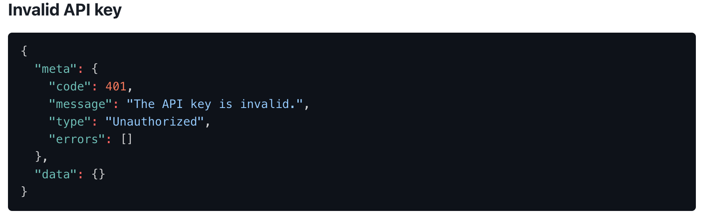

  
截图出自：Aftership的API文档  
而且第三方的API文档中也会有一个公共的错误码查询页面，当我们遇到了一些问题之后，可以查看这些文档去尝试自己解决问题。  
  

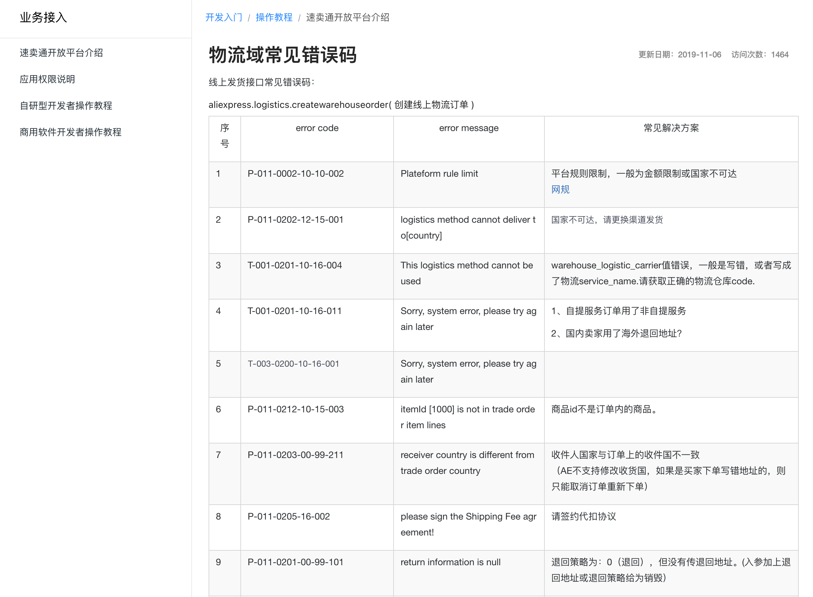

  
截图出自：速卖通的API文档  
但是在实际的工作中，我们也会发现有一些第三方的API其实做的很不完善。有一些错误信息没有规范处理，可能没有错误码，也可能错误信息都是一些偏术语性的程序错误，导致我们拿到了错误信息之后并不知道错误信息到底是怎么产生的，应该要怎么解决。类似于下图的错误，是在对接一些国际物流渠道的时候经常会遇到的问题：  
  

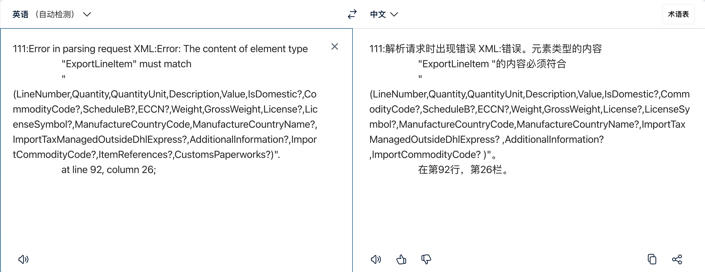

  
DHL返回的错误，即使翻译了也看不太懂原因是啥  
在跨境电商SaaS ERP或者SaaS WMS/TMS这一类系统中，以上问题出现的频率很高。尤其是SaaS ERP，因为它需要对接很多外部的第三方系统，例如说：  
1对接电商平台，Amazon，eBay，Walmart，Shopify等；  
2对接物流商，国际物流（DHL，FedEx，UPS），跨境物流（云途，燕文，4PX）等；  
3对接海外仓，谷仓，万邑通，4PX，其他SaaS WMS等；  
4对接一些工具服务商，图片翻译，图片编辑，支付收款，选品分析等；  
这些第三方系统，有一些是有比较专业的研发团队，有一些则是不太专业的研发团队，所以就会导致在对接完成了之后，用户在使用的过程中如果遇到了问题或者错误，反馈回来的原始错误信息有可能是不太好阅读的，甚至是压根对不上的错误信息。  
除此之外，由于要对接很多国外的系统（国际物流商），这些系统返回的错误信息还有一些语言上的差异，例如说德国的物流渠道会返回的错误是德语，法货的物流渠道返回的错误是法语，即使是比较通用的英语，有一些错误信息还是需要借助翻译工具才能理解其中的意思。  
  

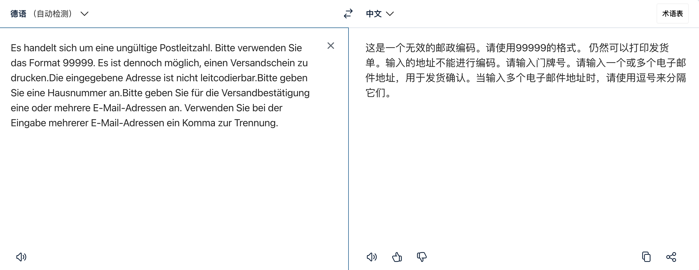

  
DHL Packet返回的错误是德语  
基于以上的背景，当我们对接了大量的第三方系统，而第三方系统返回的错误信息可能是千差万别，甚至非常不利于客户理解的时候，我们就需要考虑去对第三方系统返回的错误信息做一个**转换处理**，这个处理过程我称之为：**错误信息转化为友好型提示的过程**。  
**什么是友好型提示？**  
当用户在使用系统的过程中，用户并不关心系统背后对接了多少家第三方系统，用户甚至也不担心在使用的过程中遇到报错，**用户担心的是报错看不懂，报错有误，这种不确定性会很容易消耗掉用户的耐心，从而让用户对系统产生一些负面的看法**。  
作为一个信息系统的设计者（产品经理），我们都知道系统运行发生错误，提示错误信息是不可避免的。但是我们希望的是，当系统出现了错误时，呈现给用户看到的东西是“友好型的提示”，也就是让用户容易理解，最好是能能让用户自主排查问题、自行解决问题的一种提示。  
  

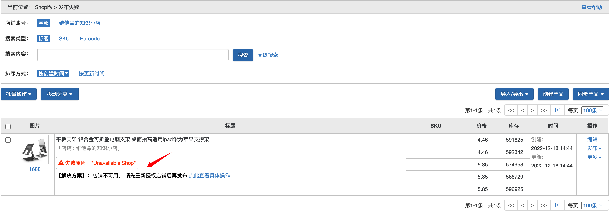

  
友好型提示案例1  
如上图所示，我在刊登产品到Shopify的时候报错了，系统告诉了我错误原因是“Unavaliable Shop”，同时还告诉了我解决方案，是因为我的店铺不可用，需要重新授权，点击就可以查看具体的授权操作帮助指引。  
这种错误提示对用户来说就是“友好型提示”，除了告诉我出错了，还告诉了我错误原因是啥，我应该怎么去解决这个错误。  
  

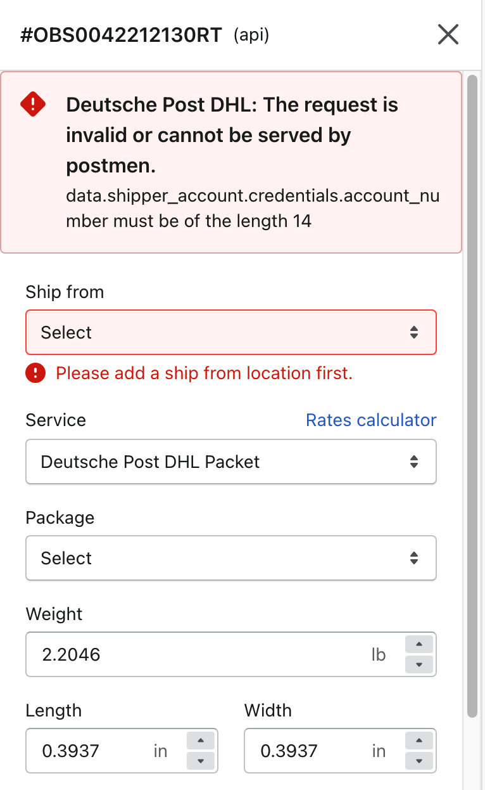

  
友好型提示案例2  
上面这张图反馈的也算是“友好型提示”，先告诉了我遇到了错误，同时也告诉了我错误原因是“account numer must be of the legth 14”，所以我要做的就是查看我的account number是否有超长。  
并不是说“友好型提示”就一定要翻译成中文或者一定要带上解决方案，**只要能让用户快速知道问题所在，并知道怎么解决这个问题，那么这种错误提示都可以称之为“友好型提示”**。  
**错误信息如何转化为友好型提示？**  
当我们请求第三方系统的时候，从结果上来看，要么是成功的，要么是失败的。如果只看失败的情况下，失败的提示也就分成两种，要么是能看得懂的（友好型），要么是看不太懂的（非友好型）。  
所以，当我们讨论怎么将错误信息转化为友好型提示时，其实前提是将“非友好型”的错误信息转化为“友好型”的提示。因为，有一些第三方系统是会对错误信息处理好后才抛给请求方，这样的错误信息一般情况下都是友好型的，而有一些第三方系统则是因为种种原因，所以就直接将非友好型的错误信息回传给请求方了。  
如果第三方回传的是友好型提示，那么后端接收到了错误信息之后，无需处理，直接传给前端去展示对应的错误即可。  
如果第三方回传的是非友好型提示，那么后端接收到了之后就需要额外处理、转化加工之后再传给前端，去展示处理后的友好型提示。  
**那么，后端怎么判断第三方系统返回的错误信息是友好型提示还是非友好型呢？**  
  

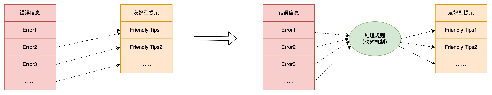

  
错误信息转化为友好型提示的示意图  
最简单的办法就是在“错误信息”和“友好型提示”之间，**加上一个过滤器，也称之为处理规则或映射机制**。  
当系统接收到了第三方返回的错误信息之后，将错误信息推给处理规则，如果命中了处理规则，则返回处理后的数据，即友好型提示；如果没有命中规则，则返回原始的错误信息。  
系统增加一个“处理规则”的维护模块，可以手动创建多个处理规则，然后所有的错误信息进入系统之后，都去轮询跑所有的处理规则，看是否命中了对应的规则，如果命中了则按规则的配置进行处理，如果没有命中在，则循环下一个规则，直到所有的规则都循环处理完成。  
  

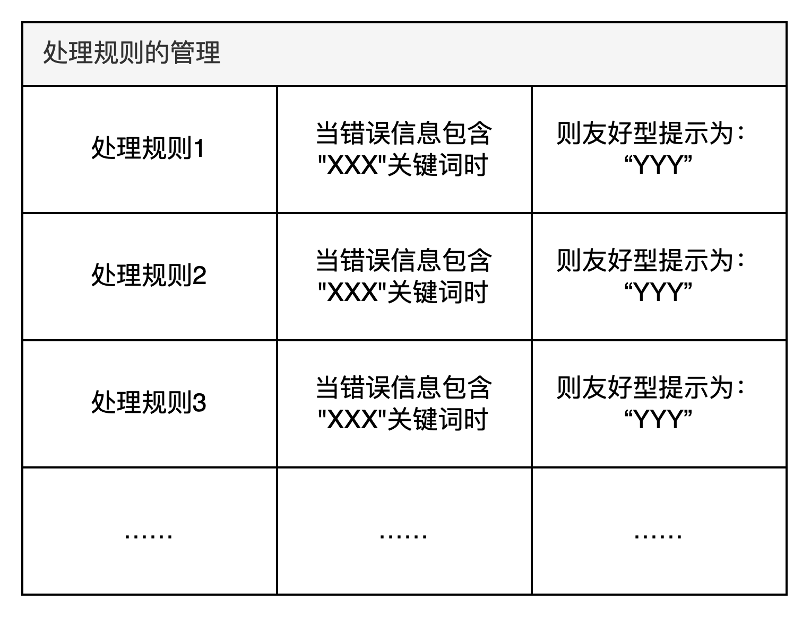

  
处理规则其实也很简单，分成三部分，一个是规则是基础信息，一个是规则的匹配逻辑，另一个就是处理后的友好型提示。  
在**基础信息模块**，可以定义规则的名称，规则适用于什么第三方物流服务商，以及规则的优先级等，下图的示意图没有设置优先级，是以对接的物流服务来举例的，大家实际在设计的时候可以灵活的调整。  
在**规则的匹配逻辑模块**，可以被匹配的原始错误数据有两类，一个是错误码，一个是错误信息，而匹配的方式有三种，所以组合之后一共是最多6中匹配逻辑，这些匹配逻辑可以采用“或”的关系，也可以采用“且”的关系。  
  

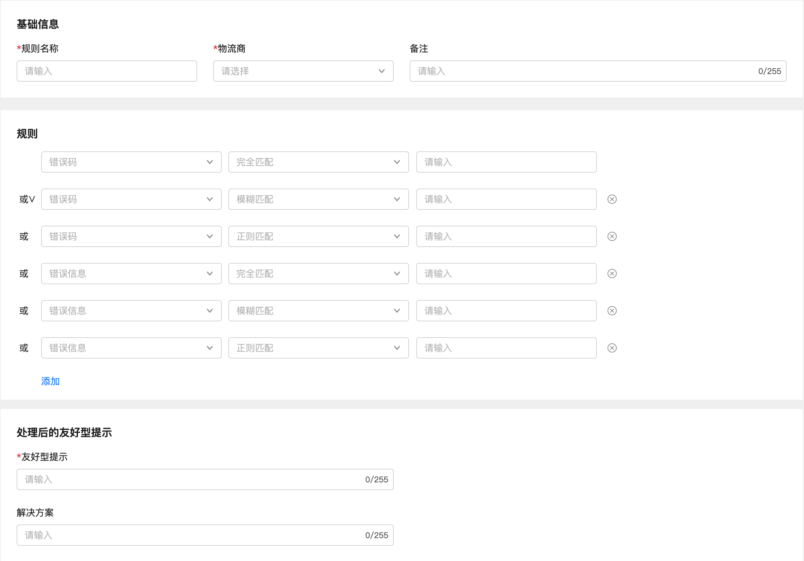

  
举个例子，如果某第三方物流商的错误码和错误信息如下图所示，当系统需要创建处理规则来匹配其返回的错误码或者错误信息的时候，可以有很多种配置方式。  
  

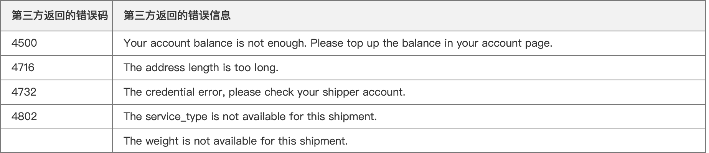

  
第三方错误码示意图  
针对错误码设置匹配逻辑，可以有“完全匹配”，“模糊匹配”，“正则匹配”，如下图所示：  
  

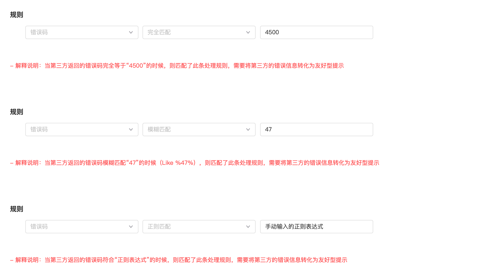

针对错误的配置

  
如果是针对错误信息设置匹配逻辑，可以有“完全匹配”，“模糊匹配”，“正则匹配”，如下图所示：  
  

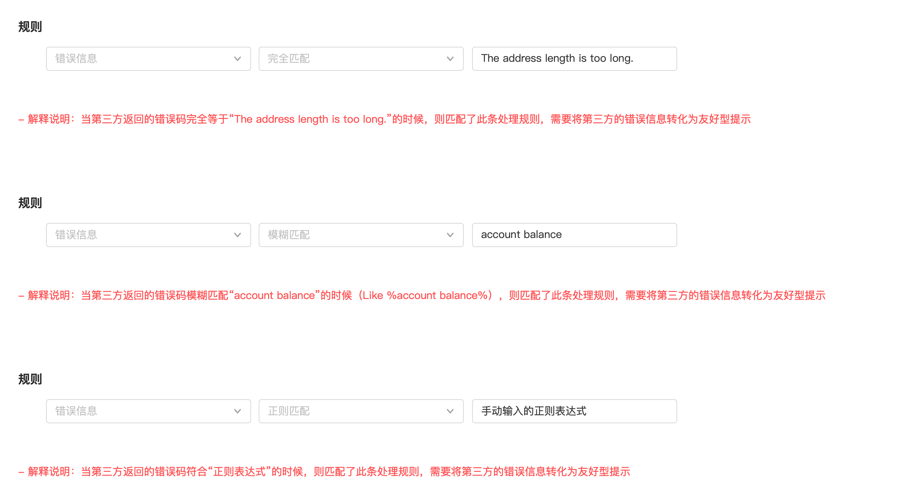

针对错误信息的配置

  
除此之外，还可以设置多条匹配规则，然后采用“且”或者“或”的关系进行组合，有非常多的组合方式，很是灵活。  
在**处理后的友好型提示**模块，必须要填写的内容是“友好型提示”，而“解决方案”是非必填的。当第三方原始的错误信息匹配了该条处理规则之后，系统会将“友好型提示”和“解决方案”的内容传给用户展示。这样用户就可以看到处理后的提示，能更容易理解遇到了什么问题，将要怎么处理。  
  

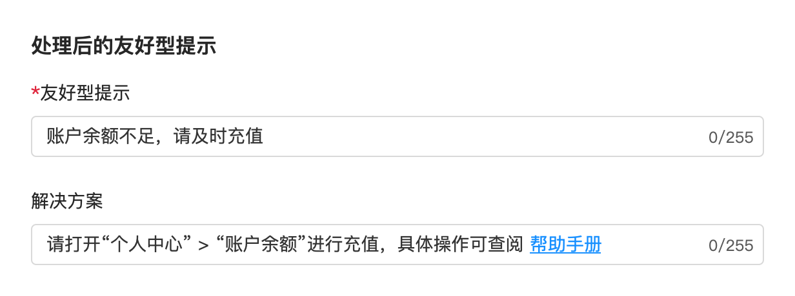

  
同时也要注意一下，为了带来更好的体验，“解决方案”这个字段还可以支持维护超链接的文字，这样用户还可以直接点击就跳转到对应的帮助手册中。  
  

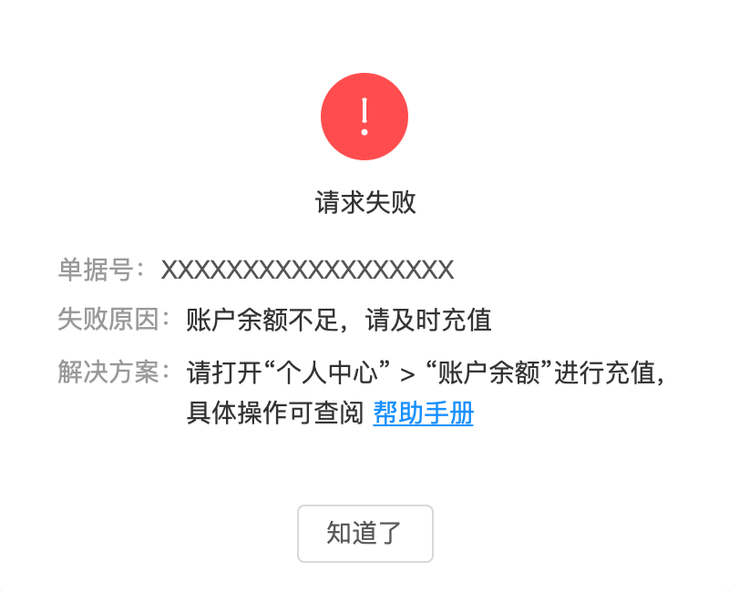

  
用户在前端界面看到的友好型提示  
**一些设计背后的思考**  
截止到写这篇文章之前，我陆续做过2次的错误码映射转化的需求，但是之前的方案感觉建模的过程搞混了，所以有一些逻辑没有想清楚，就总觉得这个方案不太好，是不是还有什么更优解之类的。  
当时在设计方案的时候，一直把焦点放在了历史的错误信息上。期望的是当一个新的错误信息进来后，先在历史的错误信息池中找一遍，看是否能找到对应的错误，也就意味着这个错误曾经发生过，然后把之前的错误信息对应的处理方式赋值给新的错误信息，相当于就直接得出了这条新错误的处理方式。  
但是实际上，这样的设计就是因为**建模对象搞错了**，把重心放在了错误信息池上，每次进来的新错误都要插入到错误信息池中，同时还要标记上对应的处理规则，而这个处理规则是从历史的错误信息的处理规则复制过来的。这样就会导致每次去匹配历史的错误信息都要花费很多时间，因为错误信息池肯定是会无限膨胀，逐步增加的。  
  

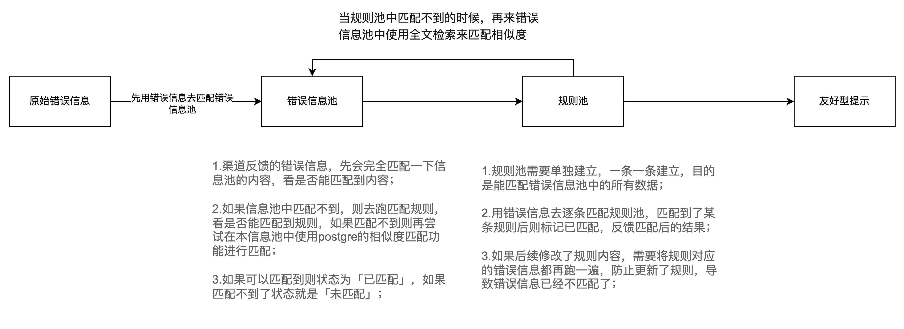

原来方案的设计思路

  
当我为了写这一篇文章，重新去对这些业务对象梳理、建模之后，发现只要把建模的核心放在处理规则上，其实这个事情就没有想象中的复杂。因为处理规则是少量的，是可控，也是相对来说固定的，只要预设好处理规则，把它当做一个管道，原始错误进入管道，能处理的就会变成友好型提示，不能处理的就会用原始错误信息展示。  
**只需要不断地对这个管道升级和维护，未来它能处理的消息数量、类型、种类等都会随之提升。而且之前一些没有处理过也不需要初始化了，只对后续产生的错误信息进行处理即可。**  
  

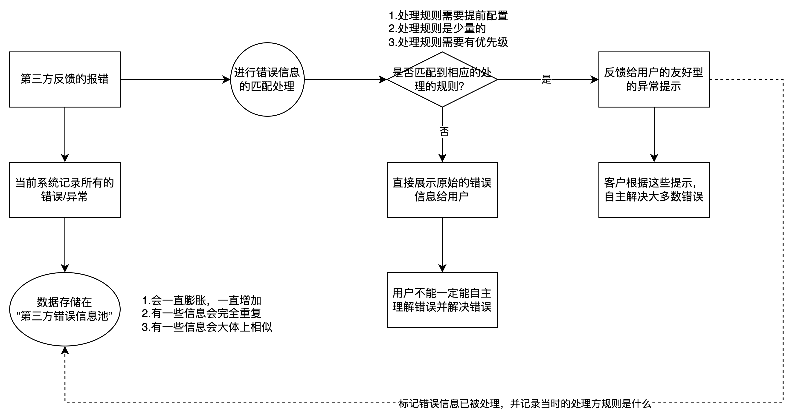

后来方案的设计思路

  
在此，我分享一个之前看到的聚水潭ERP的处理方式，当时单看这张图的时候，我也想了挺久也搞不明白，但是结合我上面的分析之后，我发现看懂这张图就不难了。  
它关注的是规则这个对象，只需要不断地去创建新的“异常信息配置”，然后每一条配置解决的一类问题即可。如果一个错误信息命中了多条配置项，那么就按配置项中的“权重”来分配即可，配置项越丰富，这种错误信息被转化、翻译的几率就会越大，对用户的体验来说就更好。  
  

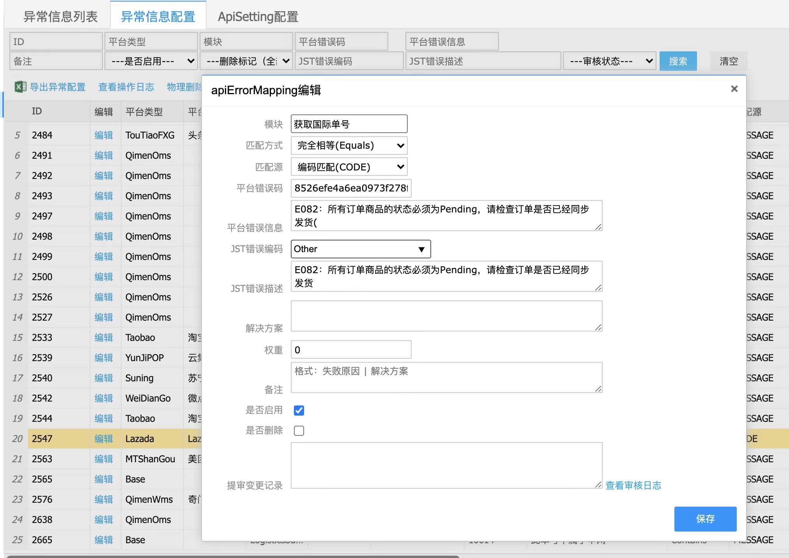

  
聚水潭ERP apiErrorMapping  
**小结**  
错误信息转化为友好型提示，在物流对接的场景下是用的最多的，因为国际物流返回的错误信息真的奇奇怪怪，什么都有，对用户来说反复修改信息再去尝试获取这样的操作体验还是很不好的，因为可能改了好多次都没有办法预报成功。所以如果是在做TMS的朋友一定要重视这个小细节功能的完善，争取一步到位直接把所有的第三方接入的通道都接上这个错误信息处理的规则，可以有效提升使用者的体验和工作效率。  
除了物流系统之外，其实很多系统都会需要与第三方系统对接，而且都会遇到这种错误信息不利于用户理解的场景，所以设计一套错误信息的转化规则还是挺有价值的。适用于不同的行业，也适用于不同的系统，学会之后可复用性很高。  
我在写这篇文章的时候，在网上找了一下，发现几乎没有看到什么相关的问题，我猜测一方面是因为产品经理可能没有意识到这些错误信息对用户来说体验可能不太好，或者意识到了但是不太懂技术也不知道这个东西还可以优化；还有一方面就是来自第三方的错误信息实在是太多了，这个工程量还是蛮大的，综合考虑来看，这些优先级可能会排的比较后；还是就是写这种细节类、实操类总结文章太费时间，而且不是大家爱看的选题……  
在我日常的调研和体验多个SaaS/B端系统的过程中，我发现只有一些比较知名或者说重视用户体验的产品才会在这一块投入较多的资源去优化解决，其他同类型的竞品做了类似的优化的比较少见。  
对于跨境电商领域的SaaS产品来说，这一块的优化尤为重要，尤其是SaaS ERP。毕竟一款成熟的ERP对接的第三方系统实在是太多了，很难保证诸多第三方的API体验都是在及格线之上，所以还是要靠自己多做一些兜底的工作。