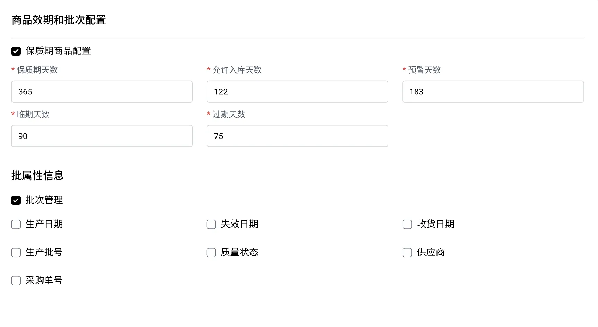
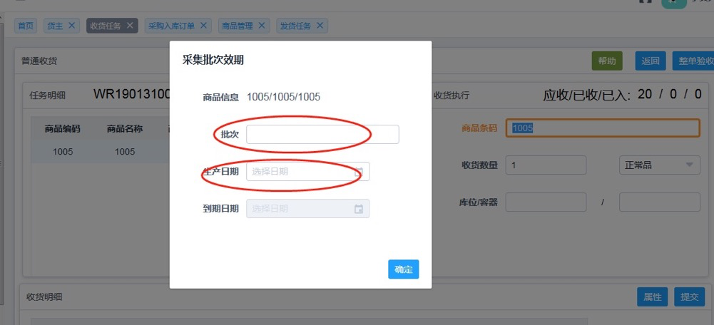
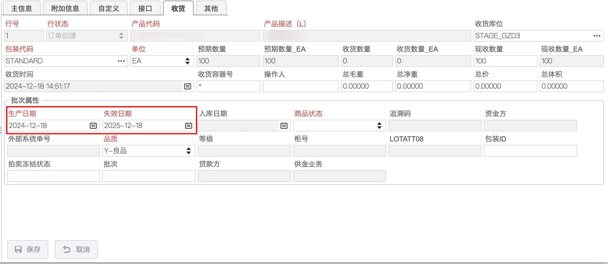
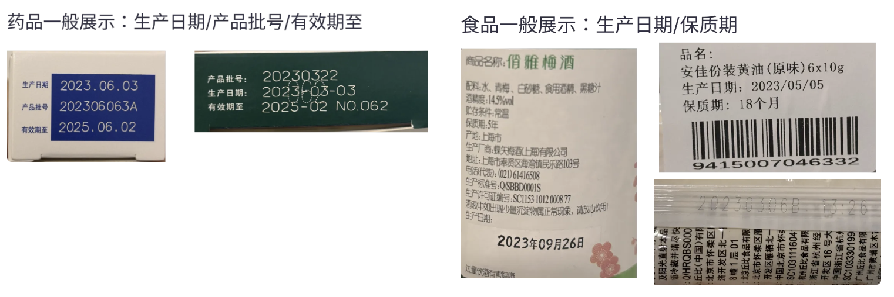
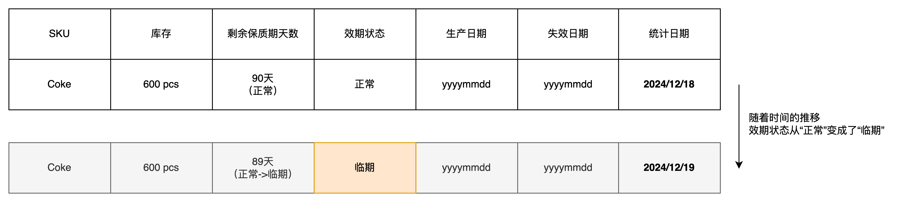
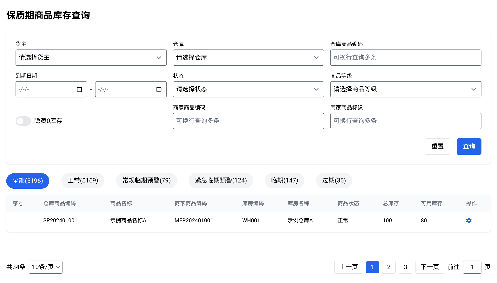
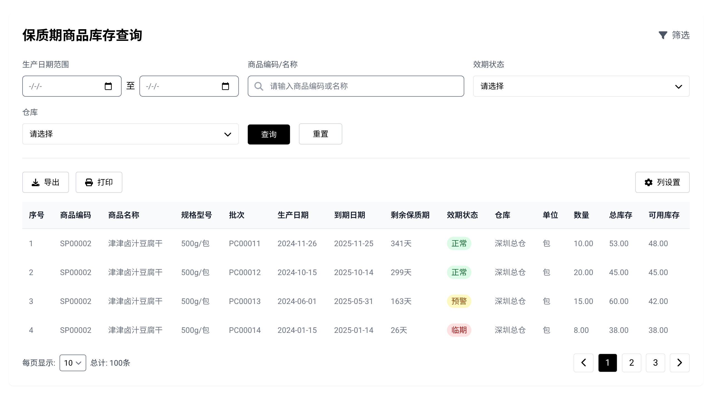
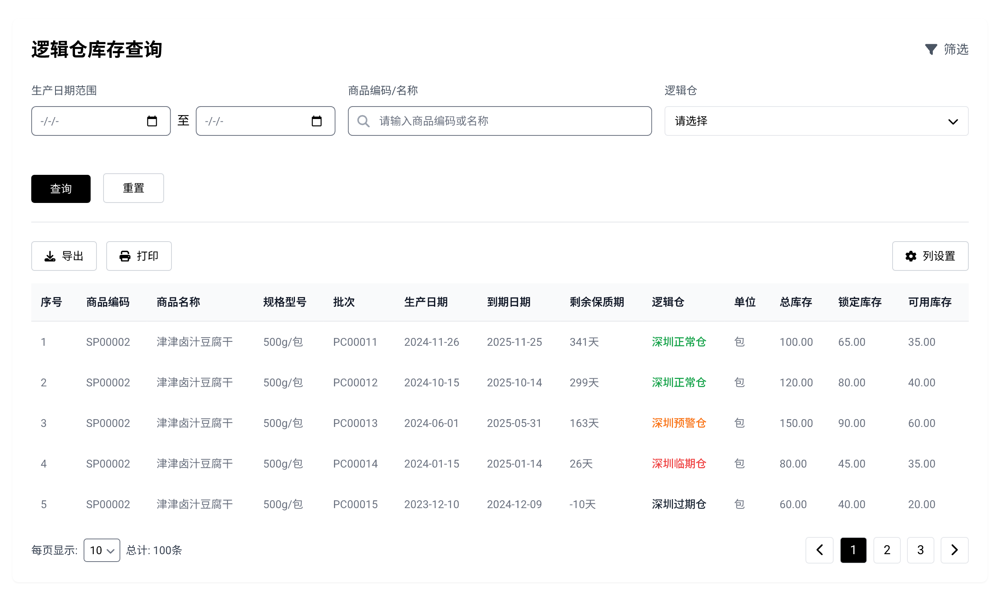
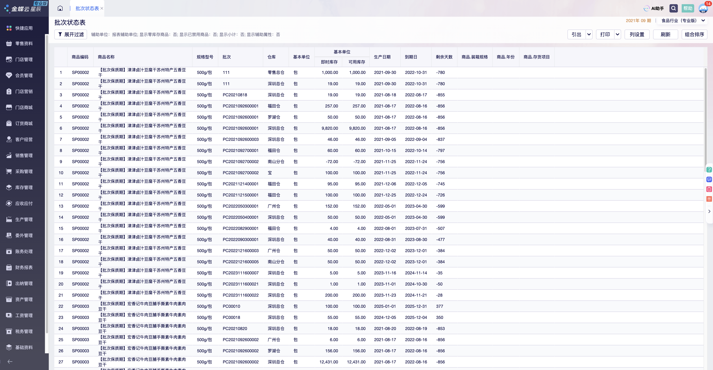

## 背景

在零售供应链的管理中，保质期商品的效期状态管理是一个非常重要的环节。对于启用了保质期管理的商品，随着时间的推移，其剩余保质期天数会逐渐减少，商品的效期状态也会发生变化。例如，从“正常”状态逐步进入“预警”状态，再到“临期”状态，最终可能进入“过期”状态。

这些效期状态不仅仅是仓储管理的关注重点，也直接影响到库存管理、销售策略、供应链优化等多个环节。例如：

-   **临期商品**：在出库时可能需要张贴“临期品”的标识，方便门店或客户快速识别商品的效期状态，及时进行促销或处理。
-   **过期商品**：一旦商品过期，仓库需要将其转移到“过期品”或“不良品”库区，并根据公司规定进行销毁、退货或其他处理。

在这种复杂的业务场景下，ERP（企业资源计划系统）与WMS（仓库管理系统）的协同显得尤为重要。WMS作为仓库作业的核心系统，掌握着商品效期的第一手信息，而ERP则需要基于这些效期状态信息进行全局的库存管理和业务逻辑处理。因此，两者之间的数据对接和协同处理成为了关键。

## WMS如何做保质期商品的管控

WMS如果要支持保质期商品的管控，那么从商品资料，入库、库存、出库、库内盘点、库存调整等模块都需要有相关的功能支撑。仅仅是针对“商品效期状态”这个业务场景，需要重点关注的模块和流程有以下几个。

### 1\. 商品资料维护效期的配置项

在WMS中，商品资料的维护是管理保质期的第一步。对于需要启用保质期管理的商品，通常会在商品资料中增加以下几个关键配置项：

-   **保质期天数**：商品的总保质期天数，表示商品从生产日期到失效日期一共有多长的时间。
-   **允许入库天数**：指距离商品生产日期的时间限制。在此时间范围内，商品才被允许入库。
-   **预警天数**：指商品剩余的保质期天数不足时，系统提前发出警告的时间范围。通过设定预警天数，供应链管理人员能够及时采取措施（如促销、退货、调整存储等），以尽可能避免商品过期造成的损失。
-   **临期天数**：指的是商品距离过期日期的天数范围。在这个范围内，商品被标记为“临期商品”，通常会被优先处理（如促销或销毁）。临期天数是企业对库存管理的重点关注对象，直接影响到商品的处理策略。
-   **过期天数**：指商品超过保质期的时间范围或者是人为指定的一个时间范围后被视作为“已过期”状态。过期商品通常被视为不可使用或销售的，企业需要按照相关法规进行处理（如销毁、退货或回收）。

### 2\. 入库时采集效期信息

在商品入库的时候，如果商品是启用了保质期管理的，那么WMS会要求收货人员采集到货商品的效期信息（批次属性），一般来说，仓库的批次属性配置中，最常用的三个是：

1.  收货日期，仓库不同时间点收货，会导致生成的WMS内部批次号不一样；
2.  生产日期/失效日期，一般生产日期/失效日期是只需要知道一个即可，因为可以结合“保质期天数”算出另外一个，同一个商品，有不同的生产日期，也意味着失效日期也不一样；
3.  生产批号，针对医疗器械类，保健品，药品类等一般外包装上会印刷生产批号，仓库入库的时候要做数据采集；

上述的批次属性，和商品效期有直接关系的是“生产日期/失效日期”这两个字段，因为同一个商品，不同批次送货到货会有不同的生产日期/失效日期。所以在上架完成之后查询库存时，不同批次的库存也会有不同的生产日期和失效日期。

| 列 1 | 列 2 |
| --- | --- |
|  |  |

### 3\. 每日定时任务变更效期状态

当商品入库到了仓库之后，商品的效期状态是会随着时间而动态变化的，所以WMS需要通过每日定时任务来对库存中的商品进行效期状态的更新。

其中包含的一些步骤有：

1.  **每天定时计算商品剩余保质期天数**：

-   剩余保质期 = 到期日期 - 当前日期，例如统计日期是“2024/12/18”的时候，Coke的剩余保质期是90天。

2.  **结合剩余保质期天数判断商品的效期状态**：

-   **正常状态**：剩余保质期 > 预警天数。
-   **预警状态**：预警天数 ≥ 剩余保质期 > 临期天数。
-   **临期状态**：临期天数 ≥ 剩余保质期 > 过期天数。
-   **过期状态**：剩余保质期 ≤ 过期天数（默认过期天数为0）。

3.  **即时更新批次效期状态**：

-   当判断出商品的效期状态之后，WMS需要立即更新“商品效期状态”这个字段。WMS需要提前定义好该字段的枚举值，一般需要包含：正常、临期、过期这三个状态，也可以追加“常规临期预警”，“紧急临期预警”等更加丰富的状态。
-   更新商品库存的效期状态，是细化到“商品批次库存”维度的。即同一个商品会有存在多个批次，只要启用了效期状态，那么所有的批次库存都要分别更新“商品效期状态”这个字段的值。
-   如果商品没有启用效期管理，那么“商品效期状态”建议保持为空。只有启用了“效期管理”的商品，才会有“商品效期状态”的枚举值展示。这样WMS可以单独把启用了效期管理的商品的库存单独拎出来查询，更有利于库存查询。

## ERP获取WMS的效期状态的2种方式

ERP系统是综合型的业务后台管理系统，属于WMS系统的上游，会和WMS有比较频繁业务往来，单据交互等。ERP需要从WMS中获取商品的效期状态，这样后续在做库存管理，销售管理，采购管理等业务的时候，可以调用读取这部分的数据，做一些业务限制和逻辑判断等。

由于WMS中的包含商品效期状态的数据很多，而且每天可能都会有效期状态的变更，再加上WMS的库存也会动态变更，所以WMS的这部分数据如何回传给ERP，也是一个值得重点关注的细节点。我总结了2种比较常见的ERP获取WMS的效期状态数据的方式，它们各有优劣势，适用于不同的业务场景等。

### 1\. WMS效期状态变更后回传ERP

在这种方式下，每天WMS完成了效期状态的变更之后，会通过一个“库存变动流水”将变更的数据通过接口回传给ERP。具体流程如下：

1.  **WMS完成效期状态的更新**：

-   每日定时任务去判断有多少SKU是需要做效期状态变更的，如果满足变更的条件则会自动触发变更，生成商品批次效期状态的变更记录。

2.  **WMS通过接口回传数据**：

-   WMS将批次号、商品编码、仓库信息以及最新的效期状态通过API接口的方式发送给ERP。

3.  **ERP更新库存记录**：

-   ERP接收到WMS的库存流水数据后，根据流水中的原始状态，变更后的状态，变动数量等，汇总处理之后调整ERP的库存数据。

### 2\. ERP根据批次库存信息自己变更效期状态

也有一些ERP的产品架构设计是会自己记录三方仓的批次库存信息，所以WMS通过定时任务来判断批次库存是否变更效期状态。而ERP自身也可以通过定时任务来判断批次库存是否要变更效期状态。即WMS和ERP都各自使用定时任务来更新批次库存的效期状态。

1.  **ERP根据WMS业务单据回传的数据来记录批次库存信息**：

-   当WMS完成了入库，出库之后，ERP通过接口回传的数据拿到批次库存的数据，包括批次号、商品编码、生产日期、到期日期等。

2.  **ERP根据规则计算效期状态**：

-   ERP通过定时任务，再加上自身设定的预警、临期、过期等规则，来判断商品效期状态的变更。

以上两种方案都可以实现ERP和WMS的库存效期状态的同步和变更，但是总体来说方案1的复杂性更低，准确性也更高，同时开发难度，对账难度等都更低一些，所以会更建议采用这种方案。

ERP去记录WMS的批次库存信息，看似是一个更周全，更精细化的方案，但是背后牵扯到数据同步，接口功能改造，还有指令精准下达并执行等多个问题，带来了更高的维护成本和管理成本。

> 而且要注意，ERP记录WMS的批次库存，并不是说直接通过接口去拉取WMS的批次库存就可以，而是要和WMS对接所有库存变动的业务单据、业务场景。
> 
> 当仓库入库之后，WMS会增加库存，同时也会回传数据给ERP，此时回传的数据会有详细的批次信息，然后ERP去增加库存的同时也会在库存中记录批次的信息。
> 
> 同理，当仓库出库之后，WMS会扣减库存，也会将数据回传给ERP，此时回传的数据也要有详细的批次信息，然后ERP去扣减这些批次关联的库存数据。
> 
> 还有仓库发生的盘点，其他出入库，库存调整，库内加工等业务，都需要和ERP打通，回传仓库变动的批次库存信息给ERP。

这一整套流程下来，牵扯到的系统对接工作量，数据准确性的把关，还有接口的兼容性、拓展性等都很难实现，整体成本太高，收益却很低。

## ERP获取到了商品效期状态后的处理

当ERP成功获取到商品的效期状态后，需要对库存的管理和业务场景进行相应的调整。以下的两种比较常见的适配方式：

### 1\. ERP的库存中包含“效期状态”

ERP系统的库存管理模块需要增加“效期状态”字段，用于记录每个批次商品的当前状态。这一字段可以帮助业务部门快速查询商品的效期情况，例如：

-   筛选出所有处于“临期”状态的商品，制定促销策略。
-   查询“过期”状态的商品，安排退货或销毁。

### 2\. 使用逻辑仓来区分商品的效期状态

为了更好地管理不同效期状态的商品，ERP可以通过逻辑仓的方式进行区分。当“效期状态”发生了变化之后，则对应库存会从A逻辑仓调拨到B逻辑仓中，例如：

-   **正常品仓**：存放正常状态的商品。
-   **临期品仓**：存放临期状态的商品。
-   **不良品仓**：存放过期状态的商品。

通过逻辑仓的划分，ERP能够帮助业务部门更直观地管理库存，并为后续的处理提供数据支持。

无论是使用方案1，在库存查询中增加“效期状态”字段；还是使用方案2，通过逻辑仓来记录不同效期状态的库存，最终在ERP中都可以比较清晰地查询到同一个商品但是处于不同效期状态的数量有多少。

当业务侧需要对这些数据进行不同的逻辑处理时，则可以在ERP上使用“效期状态”或者是“逻辑仓”来判断。

> 假如我们选择了方案1，当ERP需要通知仓库发出临期的商品时，则ERP推送出库单到WMS的时候，在请求的接口中加上“**效期状态=临期**”的标识。WMS收到了出库单之后，就知道可以用哪些状态下的库存数据，那么在分波推荐库位的时候，就知道可以使用哪些批次库存，要从哪些库位上去拣货。

## 总结

如果要对启用保质期的商品进行精细化的管理，除开仓库实际管理层面的要求之外，ERP与WMS的系统协同、接口互通也是很关键的一环。WMS作为仓库作业的核心系统，负责商品效期的精细化管理，而ERP则需要基于WMS的数据进行库存管理和业务逻辑的优化。

在实际操作中，企业需要根据自身的业务需求和系统架构，选择合适的数据对接方式，并在ERP中充分利用效期状态数据，优化库存管理和销售策略。同时，还需要加强仓储运营部门与仓库的沟通与培训，确保效期管理的执行落地。

对于电商、零售等行业来说，保质期商品的效期管理是提升客户满意度、降低库存风险的重要环节。ERP系统在这一过程中承担了重要职责，需要特别关注商品效期状态的处理逻辑，为企业的整体运营提供有力支持。

市面上很多的电商ERP都在效期管理这个场景下做得很弱，要么是功能缺失，要么就是支撑的场景特别单一，所以可以借鉴和参考的SaaS产品不多。如果想要研究一下ERP中怎么更好地管理效期商品，怎么记录和展示这些效期库存等，那么我推荐学习一下金蝶的产品，例如金蝶云星辰，金蝶云星空等产品，毕竟“遇事不决学金蝶”这句口号不是白喊的。

