**SPU和SKU的关系**  
关于SPU和SKU的基础概念的了解，建议大家还是看看一些关于电商的书籍介绍，在此我就不做过多的整理，直接从《电商产品经理兵法：基于SaaS的电商系统设计与实践》此书中搬运一些基础概念过来。  
  

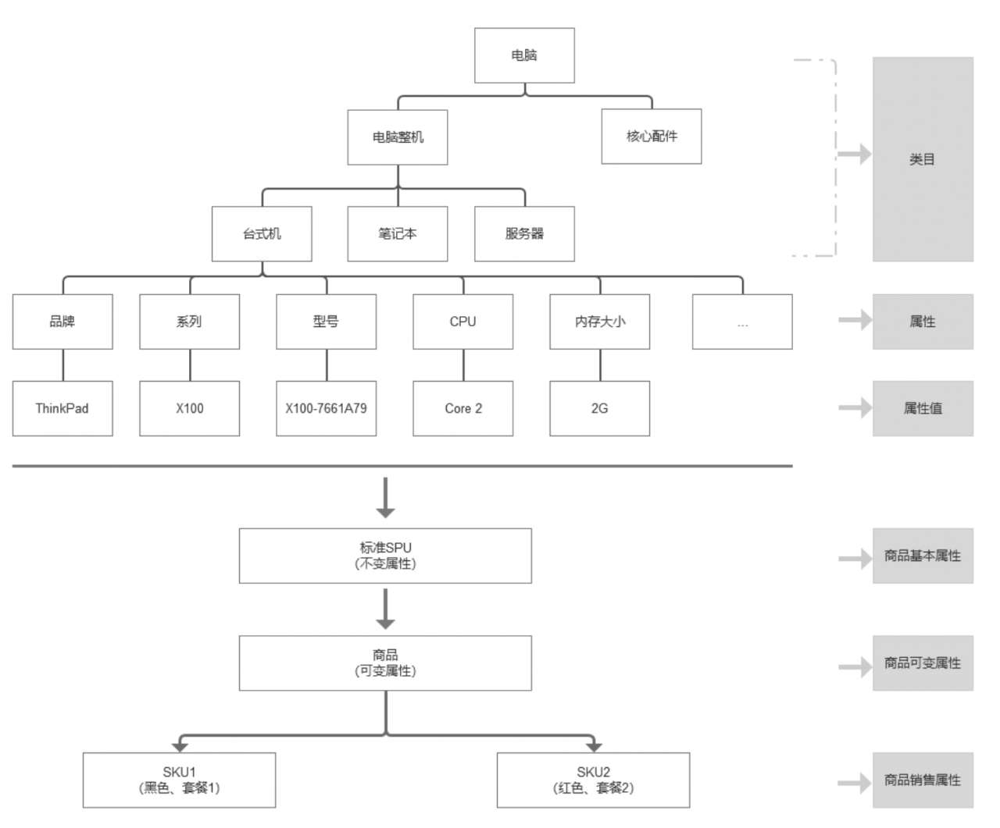

摘自《电商产品经理兵法：基于SaaS的电商系统设计与实践》

  
**1\. 什么是SPU？**  
SPU即标准化产品单元，是一组可复用、易检索的标准化信息的集合。该集合描述了一个“产品”的特性。  
通俗来说，属性值、特性相同的商品就可以称为一个SPU。**也可以说，SPU是一个抽象出来的模板**。  
一般来说，类目系统中的关键属性（品牌、货号等）能够确定一个SPU，例如，iPhone 6就是一个SPU，诺基亚N97也是一个SPU，这与商家无关，与颜色、款式、套餐也无关。  
SPU的属性是分类属性的子集。只要用户在SPU中定义了属性，那么用户在录入商品时，就不需要再次录入，也不可以更改。  
摘自《电商产品经理兵法：基于SaaS的电商系统设计与实践》  
**2\. 什么是SKU？**  
SKU即单品/最小库存单元。目前，SKU在各种零售商品中应用得非常普遍。例如，某款衣服是一件商品，不同颜色、不同尺码的该款衣服，对应不同的SKU。SKU比较简单，就是把销售的值组合存放，再加上库存、价格。例如，该款衣服的黑色大号共有5件，每件20元；红色小号共有3件，每件21元。  
摘自《电商产品经理兵法：基于SaaS的电商系统设计与实践》  
通俗来理解，SPU代表的是一款产品，SKU代表的是一个具体的商品。例如上面提到的“iPhone 6”是一个SPU，而“iPhone 6 64G 黑色”就是一个SKU。商品的基本属性可以理解为是SPU的属性，如手机的屏幕尺寸、CPU型号、像素等基础属性；而销售属性则挂在SKU上，例如具体的颜色，存储空间等。  
**3\. 电商后台与ERP的商品管理差别**  
电商后台的商品管理模块中，往往不会直接有SKU层面的管理，都是在「商品管理」中处理，也就是在SPU层面来管理。主要涉及的操作有商品发布、编辑/修改、商品上/下架、提交商品审核等。  
而ERP中，往往是在SKU层面进行管理的，例如发起采购、创建订单、查看库存、出入库单据等，都是关联的SKU。  
所以在设计ERP的商品管理功能的时候，如果只是单纯地参考电商后台的管理，很容易踩坑，也很不太能理解背后是怎么运作、怎么管理的。  
**在线产品与本地产品**  
对于供应链产品经理来说，大多数场景下都会接触到电商ERP相关的业务，可能是国内电商，也可能是跨境电商，无论是哪一类的ERP，都会涉及到ERP中的“产品管理”或者“商品管理”模块，这个是ERP的底层基础数据，也是采购、订单履约等业务的前置条件。  
在电商ERP中，一般会有“在线产品”和“本地产品”这两种类型的产品管理，名字听起来很像，让很多初次接触ERP的朋友会有点懵逼，为什么需要有两个产品管理呢？它们的区别是什么？  
**在线产品**，指的是电商平台上售卖的具体商品，在电商平台的后台中一般称为“商品管理”比较多。  
  

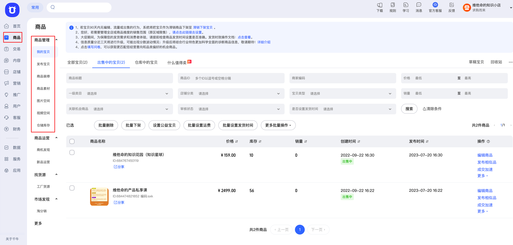

电商后台的“商品管理”模块

  
**本地产品**，指的是在ERP系统中管理和维护的产品资料，这些是指实际放在仓库中或者需要从供应商手中采购的实物产品。  
  

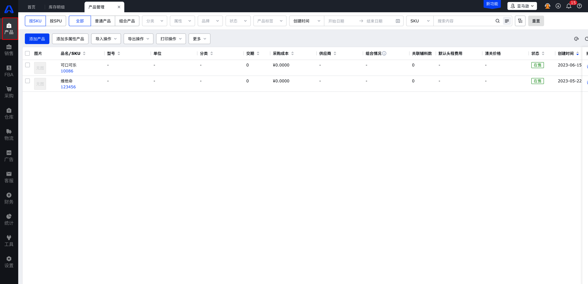

ERP中的本地产品管理模块

  
**一般来说，电商平台上卖的产品就是实际放在仓库中的实体产品，那为什么要区分为两种产品进行管理呢？**  
如果是对于单店铺或者是单平台来说，这两者保持一致其实是没问题的。但是由于电商卖家往往会开设多个店铺，运营多个平台，以此来提升自己的曝光度，获取更多的流量，所以就需要在多个平台，多个店铺上架自己的产品。  
多个平台，多个店铺之间为了避免相同的产品被平台检测为恶意铺货或者由于不同的平台上架商品的规则不一样，就会衍生出不同的在线产品，它们本质上对应的还是同一款本地产品。在跨境电商ERP中，不同平台的在线产品的维护与管理一般都放在“刊登”或者“产品”模块。  
  

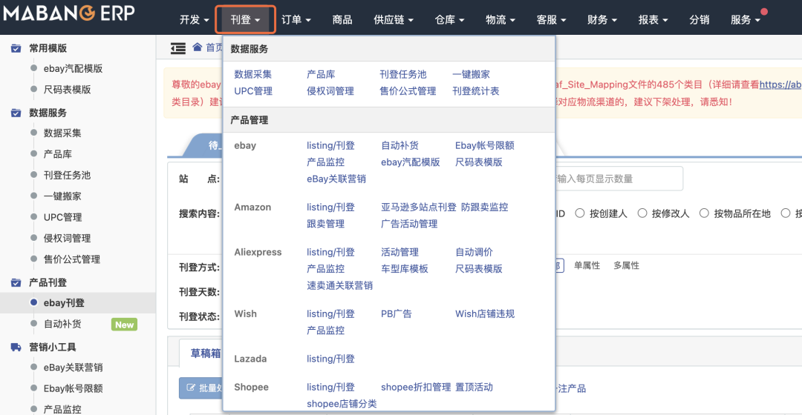

马帮ERP

  
  

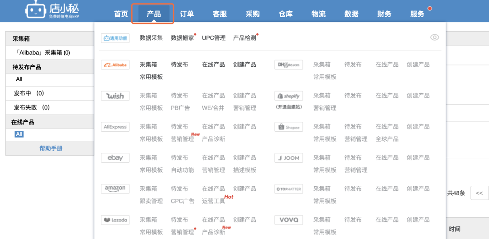

店小秘ERP

  
而具体的本地产品的管理则会单独放在“仓库”模块或者是“商品模块”，如下图所示。  
  

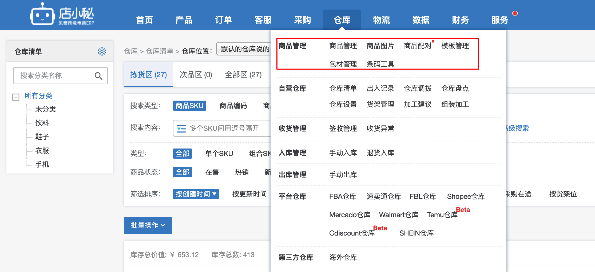

店小秘ERP

  
  

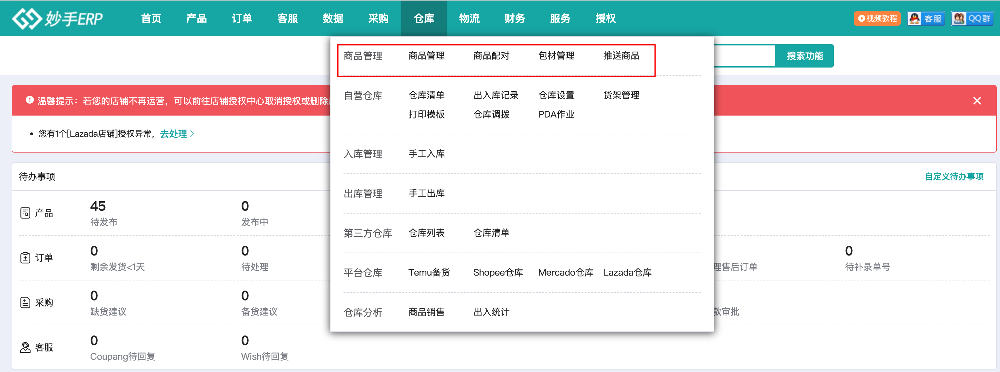

妙手ERP

  
前面提到了，在线产品在多个渠道，多个平台，多个店铺中售卖，但是实际上要履约发货的只有少量的几个本地产品，那么当不同平台的订单进入到同一个ERP之后，就会出现一个问题：**不同平台订单中的产品都不一样，那么我应该实际发出哪一款本地产品给用户呢？**  
这就涉及到“本地产品与在线产品”的映射问题了，在跨境电商ERP中，这种关系也叫做“商品匹配”或者“产品配对”。  
  

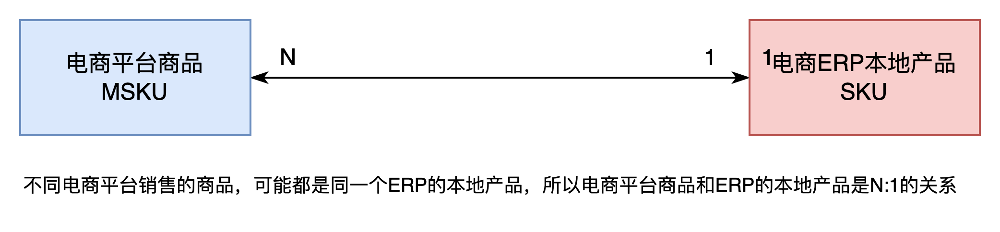

电商平台在线产品与ERP本地产品的对应关系

  
先通过对接电商平台的接口将所有在线产品都同步到一个公共池中（在线商品池），然后设置一些规则将这些在线产品与本地产品自动配对或者手动进行配对，后续平台订单进来了之后，通过这一层绑定关系可以自动匹配出实际要发货的产品是哪个，这个实际要发出的产品，也就是标题中提到的“本地产品”。  
  

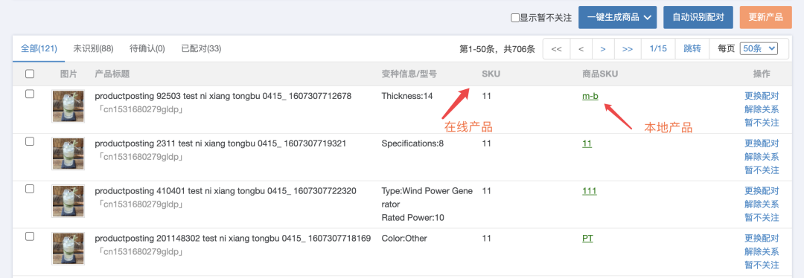

店小秘的商品配对

  
  

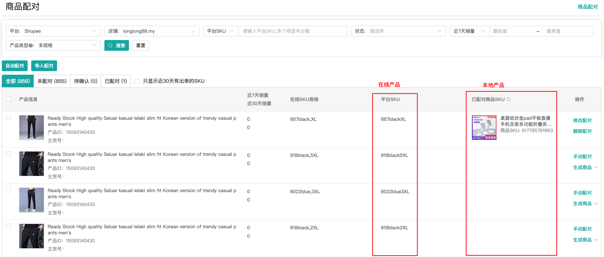

妙手ERP的商品配对

  
**ERP本地产品管理的两种设计方案**  
经过我的调研和实践，如果需要搭建一套用来管理本地产品的“SKU产品库”，一般会有两种设计方案：  
1平台型设计方案，类似于电商平台的产品管理模式，以SPU为主体；  
2库存性设计方案，以实际的库存管理粒度为主体，即以SKU为主体。  
**跨境电商ERP中，主流的做法是采用方案2，而采用方案1的比较少，不太常见**。下面我分别来介绍一下这两种设计方案的具体细节。  
**1\. 平台型设计方案（以SPU为主体）**  
  

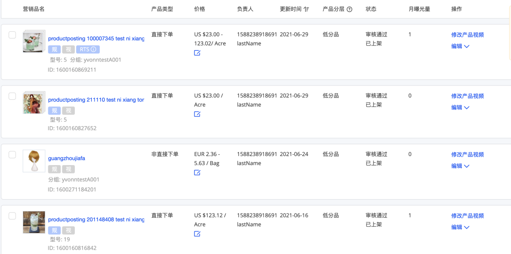

阿里巴巴国际站后台-产品管理

  
  

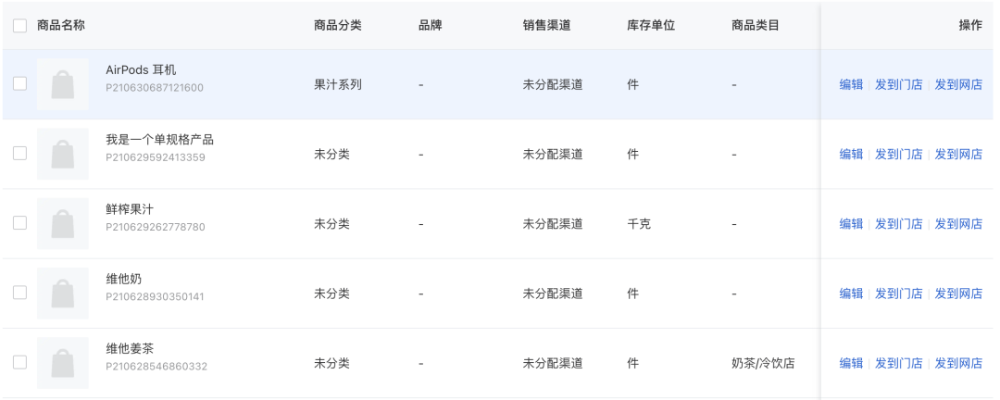

有赞后台-产品管理

  
  
  

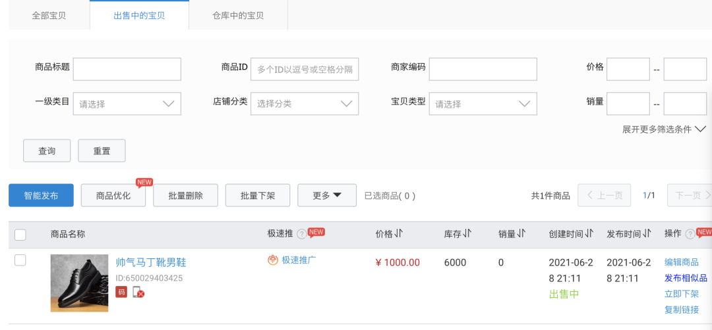

淘宝千牛后台-产品管理

  
以上三张图都是很典型的电商后台产品管理的界面，每一行展示的都是一款产品（SPU）的主要信息，这个跟用户在前台看到的列表是相同的。  
但是实际用户点击进去之后就会发现，当要购买一款具体的产品的时候，还需要选择一些规格，这样才能确定最终的价格。这些逐个选择的规格，最后就组成了实际的SKU，也就能确定具体的库存商品是哪个。  
具体的操作路径如下图所示：  
  

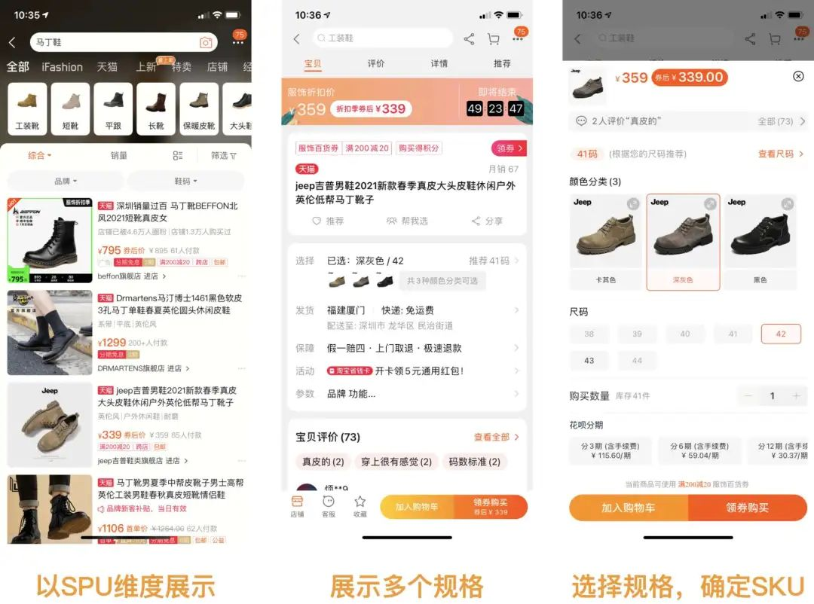

淘宝商品的展示逻辑

  
其中我了解的采用平台型设计方案ERP有：通途，金蝶等。  
  

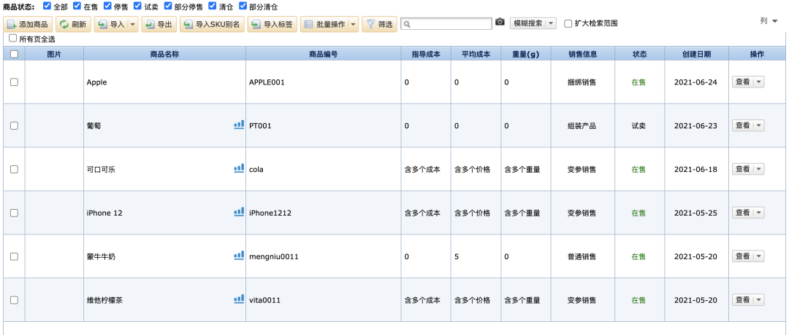

通途ERP-产品管理

  
  

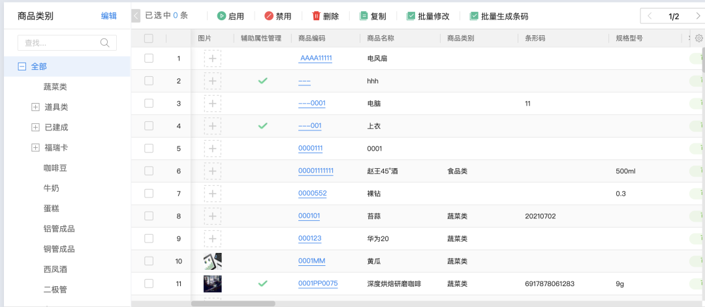

金蝶星辰-产品管理

  
**2\. 库存型设计方案（以SKU为主体）**  
库存型设计方案是市面上最主流的，最常见的方案。无论是单品还是多规格品，在创建之后都会以SKU的维度展示，所有的信息也都是在SKU维度进行更新的。SPU只是在创建多规格产品的时候用来快捷生成多个SKU的载体而已，当生成了SKU之后，SPU也就几乎没啥作用了。  
  

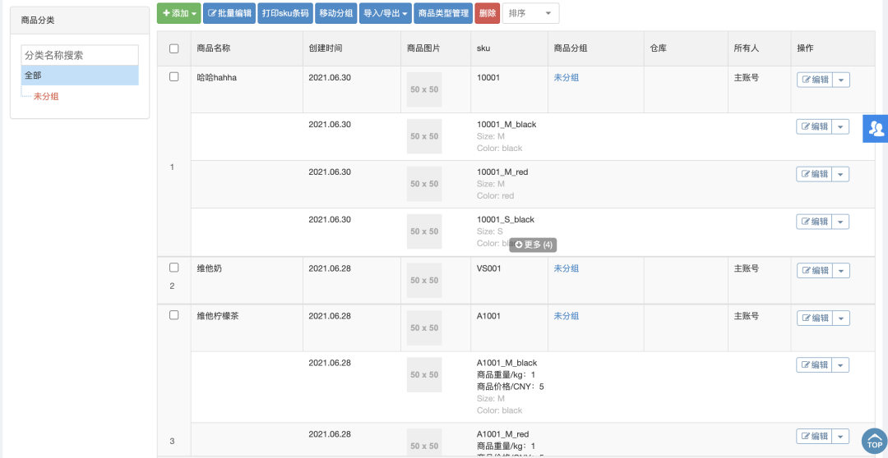

芒果店长ERP-产品管理

  
  

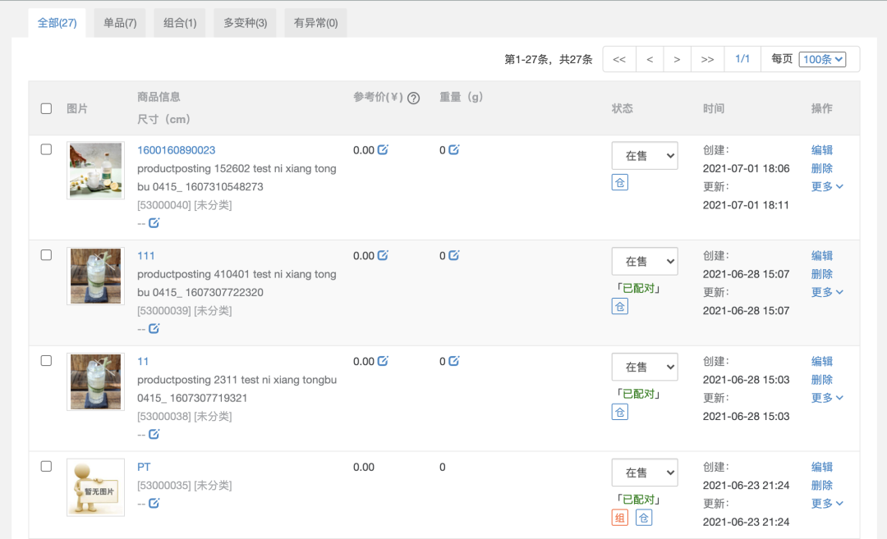

店小秘ERP-产品管理

  
  

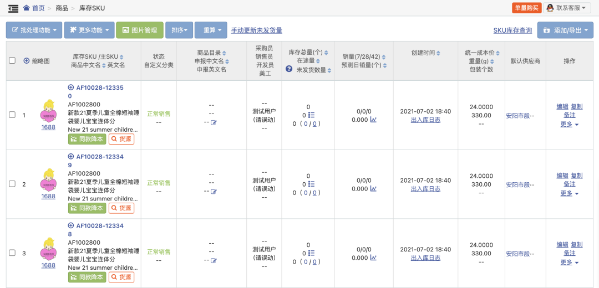

马帮ERP-产品管理

  
**两种设计方案的差异**  
如果只是单纯的看图似乎看不出两种设计方案的差异在哪里，不过如果你对此话题比较感兴趣的话，我建议你可以去申请一些试用账号体验一下，相信会对其中的细节有更深入的理解。  
在此，我用一些文字来解释一下其中的关键差异。  
**1\. 展现方式不一样**  
平台型设计方案是以SPU为维度展示产品的，而库存型设计方案则是以SKU为维度展示产品。如果以SPU为维度，那么一些差异性的细节就不好展示了，例如价格、重量、尺寸，库存、可用情况等，因为这些信息一般是跟SKU挂钩的。对于电商ERP来说，一般管理的维度都是以SKU为主，所以用SKU的形式来展示更加贴合实际的业务场景，同时也能更加直观地展示出不同产品之间的一些差异，例如产品图片，条码，价格，库存等。  
**2\. 编辑方式不一样**  
平台型设计方案如果要编辑具体的产品信息，需要编辑两块的内容，一块是公共的数据，也就是所有SKU都继承的内容，即SPU那一块的信息；另一块是单个SKU关联的信息，不同的规格组合对应的信息不一样，需要单独维护。  
库存型设计方案则直接到了最小库存单位的粒度，所有的信息都是独立的，可以各自维护。例如：41码的鞋子和42码的鞋子是不同的SKU，可以分别维护这两者的信息，而不用考虑公共信息继承的问题。  
你可以把41码的那个SKU的名字改成“女鞋”，而42码的那个SKU的名字改成“老人鞋”，虽然从电商产品管理的角度来说这不合理，但是在ERP中却没有限制，因为它们的SKU没有变化。  
**3\. 调用的方式不一样**  
平台型设计方案，在需要选择SKU的时候，要先选择SPU，然后通过选择不同的规格来确定想要的那个SKU；而库存型设计方案则简单多了，只需要直接选择相应的SKU即可。  
  

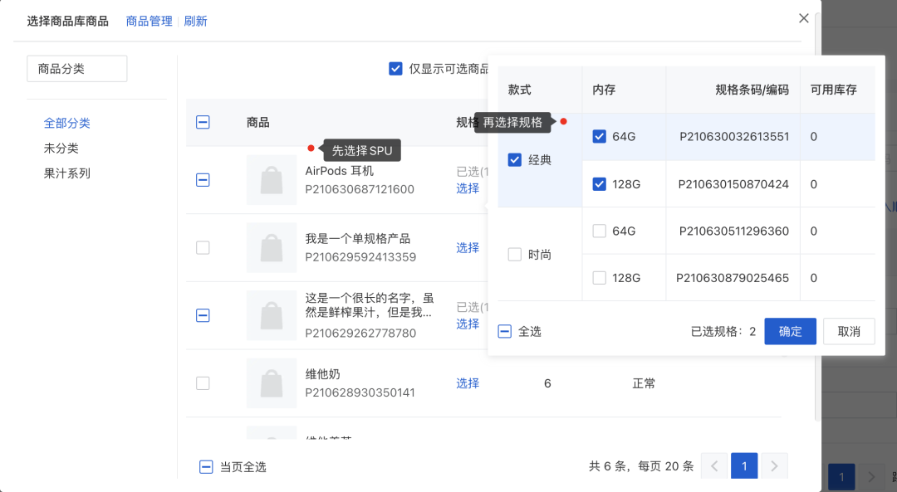

先选择SPU，再选择规格确定SKU

  
  

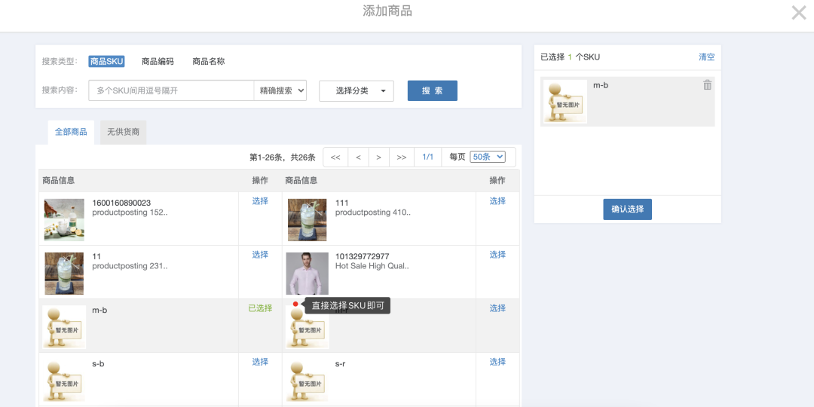

直接选择SKU

  
**4\. 删除的逻辑不一样**  
平台型设计方案，如果需要删除SKU的时候，需要通过删除规格来删除SKU，而且需要在SPU的载体上操作；而库存型设计方案则直接选择对应的SKU即可删除，不会和SPU等有什么强关联的关系。  
**5.平台型设计方案的利弊**  
总结来说，库存管理的本质还是以SKU为最小粒度，无论是平台型设计方案还是库存型设计方案，最后都是通过管理SKU来达到管理实物的目的。  
以SPU为载体，然后通过规格去确定SKU有一定的好处，也有很明显的弊端，这也是为什么主流的跨境电商ERP都不太选用此方案的原因。  
主要的利处和弊端分别如下：  
**利处：**  
●维护产品资料的时候可以与平台产品的逻辑保持一致，便于用户上手和理解；  
●适用于多规格属性比较多的产品，可以通过先选择产品然后再通过规格来定位具体的SKU；  
●适用于需要维护比较丰富的产品资料的场景，因为很多资料都是在SPU的维度，这样可以减少重复维护的工作量。比较适合B2B的模式，需要使用产品库的内容给用户做报价。  
**弊端：**  
●调用产品的时候会麻烦一点，需要通过选择SPU再选择SKU，还需要记忆相应的规格来确定最终的SKU；  
●编辑和维护的时候有两套入口，一个是SPU的入口，一个是SKU的入口，会比较麻烦一些，而且SKU的入库能维护的信息不多；  
●无规格的产品和多规格的产品并列展示的时候，需要后台做特殊处理，例如给无规格的产品也加上SPU+SKU的关系；  
●查看和展示的时候不够直观，尤其是放在仓库层面来使用的时候，仓库应该是以SKU的粒度来管理是最有效的，但是此处也需要做特殊处理，将SKU抽离出来，并排展示。  
**一些踩坑点**  
上面介绍完了两种设计方案的一些差异，如果是按照库存型设计方案来做，基本上市面上主流的跨境ERP都是这样做的，该踩的坑别人都踩过了，所以自己只要对着竞品走一遍后，踩坑几率就可以大大降低。  
所以这里谈到的踩坑点是针对平台型设计方案来总结的，这一块网络上已有的资料比较少，而且采用这种做法的ERP也比较少，所以踩坑点就多了些。  
**1****单规格产品与多规格产品的区分**  
基于电商后台的规则，SKU是通过SPU的多规格来生成的，在创建SPU的时候，选择不同的规格，然后不同的规格就会通过笛卡尔乘积，生成不同的SKU。  
在梳理这一块逻辑的时候，我就发现了一个问题：如果一个SPU的规格属性有两种「颜色」和「尺码」，在「颜色」中有“红色”、“蓝色”，在「尺码」中有“S”和“M”，则意味着一共会生成四个SKU。  
但是如果允许后期修改规格（修改规格属性或者修改规格属性值）内容的话，会重新生成SKU，同时老的SKU在这里就无法体现了（因为属性不存在或者属性值不存在）。  
例如（下图）：如果将“蓝色”改成“绿色”，那么应该重新生成SKU，但是原来的“蓝色”规格的SKU就“消失”了。还有如果创建商品的时候没有选择规格，然后只是生成了一个SKU，后续要增加规格的时候，那么原来的商品也不能和后续多规格衍生的SKU形成相同的结构（规格结构不一样）。  
  

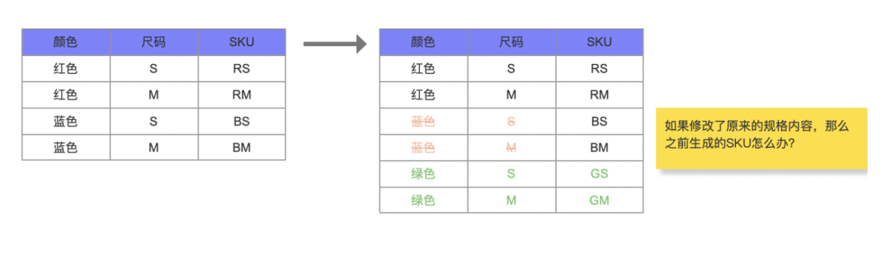

  
如果SKU编码BS和BM是在库的、有库存的，那么直接删除这两个SKU显然是不合理的，但是由于电商的管理应该大多数是基于SPU层面，所以如果修改了规格属性（电商也叫销售属性），那么被更改了的那个应该不能再出现了，类似于此款停产或者不再售卖了。  
下图是淘宝的千牛后台，发布商品的时候先选择对应的类目后，会给出对应的销售属性，而且是都必填，所以不存在中途增加和修改销售规格的情况出现。  
但是ERP系统就不会有这么严谨的逻辑，而且也没有对应的类目信息。  
所以这一块如果限制死了，不允许客户添加规格，那么就可能会满足不了一些多规格商品的信息维护；如果放开了限制，那么用户就可以随意调整对应的规格信息，那么生成的SKU可能就会和原SPU断开关联。  
  

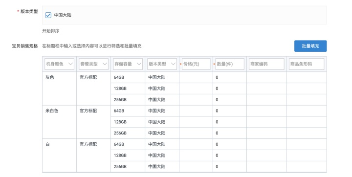

  
千牛后台截图  
基于上述的情况，我查了很多资料，也问了一些朋友之后发现，如果是单纯地参考电商平台的后台处理逻辑，那么很难兼容各行各业商家的产品。  
于是我开始找了另一类竞品：电商ERP，主要还是跨境类的，例如：店小秘、马帮、通途等。  
结果发现它们的处理方式很巧妙，在创建商品的时候可以选择类型：  
●单规格产品，也可以称为无规格产品；  
●多规格产品，可以自由添加规格进行变换。  
单规格产品不能转为多规格，如果需要增加规格，则需要重新创建SPU再生成SKU；多规格产品也不能转为单规格产品，多规格产品一定要选择至少一项规格属性。**这样一分类，就将很多复杂的场景给隔离开了，只需要重点关注多规格产品的管理即可。**  
为了避免单规格和多规格的随意转化，影响关联的单据和历史数据等，一般跨境电商ERP创建产品的入口就会分成两个：“创建普通产品”和“创建多规格产品”。  
创建普通产品，是在创建SPU的同时也创建了SKU，而且SKU的所有信息都是从SPU这里继承来的，此刻的SPU编码会和SKU编码一致，SPU的存在只是为了兼容，以致于表结构呈现一致性。  
创建多规格产品，是先创建SPU，然后通过规格的组合自动生成SKU，SPU编码和SKU编码不相同，而是SKU维度上需要填写相应的属性，例如：成本价、销售价、期初库存、重量等。  
**2****SKU如何编辑？可以编辑哪些信息？**  
上面提到了，我们创建了SKU的时候有两个入口，一个是创建单规格产品，一个是创建多规格产品。所以对应的，我们编辑SKU的入口也有两个，一个是从SPU层面进入编辑，另外一个是从SKU的层面进入编辑。  
起初，我一直觉得既然创建好了SKU，那么其实在ERP中，SPU基本上就没啥作用了，所以编辑只需要在SKU层面即可。  
但是随着对业务的分析，以及对SPU和SKU关系的进一步熟悉，我发现如果只是在SKU层编辑就会出现一些很奇怪的问题。  
例如：「iPhone 12 国行」可以算作是一个SPU，然后“iPhone 12 国行 红色 64G”（简称为：红色64G）和“iPhone 12 国行 白色 128G”（简称为：白色128G）则是其所对应的SKU。  
如果我将所有的编辑都放在SKU层面，那么我自然而然可以编辑一些“基础信息”、“非关键属性”、“销售信息”等。  
如果只是编辑“销售信息”那么还没什么问题，因为不同的SKU就是因为销售属性不一样而做的区分。但是如果允许编辑一些“基础信息”，例如说“名称”、“描述”、“类目”等，那么可以将“iPhone 12 国行 红色 64G”改成“苹果12 中国红 64G”，也可以改成“苹果11 白色 64G”等等，这样就会乱套了。  
所以，SKU的编辑应该和创建的逻辑相同，也要符合SPU和SKU的关系定义。有两个入口创建，也就有两个入口编辑。同时，不同的入口可以编辑的信息是不一样的。  
SPU维度编辑的“基础信息”等应该是复用在所有的SKU层面的，即改了SPU的信息则SKU的信息也要改；SKU维度的编辑，只能是一些自己独立的属性，例如：“售价”、“库存信息”、“采购价格”等。  
  

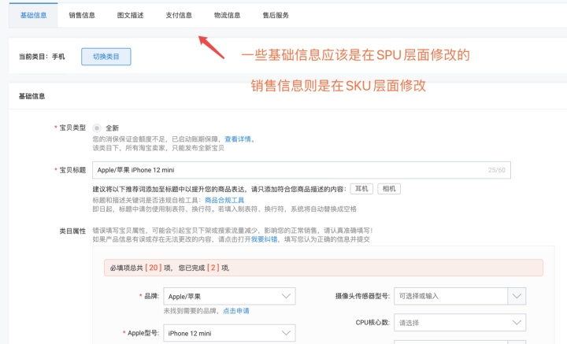

千牛后台截图

  
**3****产品库的列表展示**  
平台上的产品管理都是以SPU的维度来管理的， 但是如果放在ERP或者仓库中，那么这种逻辑是否可以直接沿用，这个也是一个坑。  
**从我一段时间的调研和体验来说，以SPU维度展示和以SKU维度展示都应该要做，因为它们适用于不同的场景。**  
以SPU维度的展示可以放在基础的产品管理页面，类似于平台的产品管理。这样可以很方便的维护这些数据，编辑和查看都是从SPU的维度进去。  
而以SKU维度的展示可以放在例如：库存查询，库存流水，或者就叫做专门的“SKU产品管理”页面。可以单个的对SKU的一些信息维护，例如：条形码，价格，库存信息，销售情况等。  
  

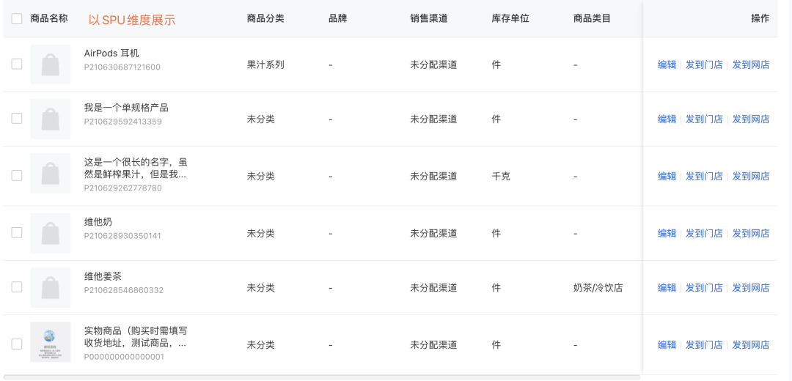

SPU维度展示产品

  
  

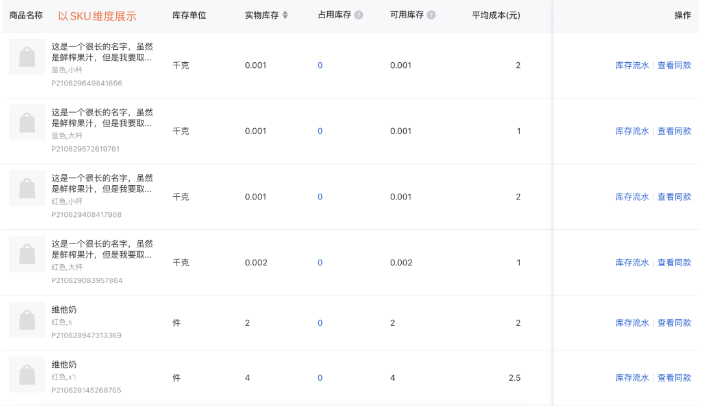

SKU维度展示产品

  
**4****供应商与SPU&SKU的关系**  
供应商是和SPU关联还是和SKU关联，这个也是我之前一直很纠结的一个问题。按理说，供应商提供的是具体的产品，那么自然而然应该是跟SKU关联。  
但是有一部分的SKU是通过SPU的多规格属性演化而来的，如果供应商直接和SKU关联，那么则意味着创建好了SKU之后，还需要分别对同SPU但是不同SKU的产品一一设置供应商关系、供应商报价等。  
从操作层面来说，用户要做多次重复的工作；从设计层面来说，有很多可复用的属性没有复用到……  
  

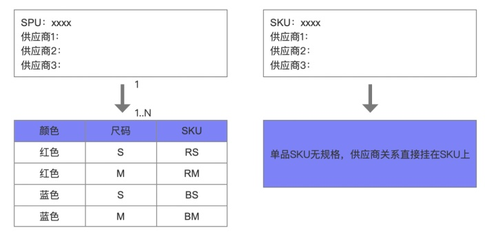

  
**创建多规格产品（SKU）的时候，将供应商信息挂在SPU维度上，然后SKU继承这些信息，就避免了逐个SKU维护供应商的繁琐操作。**  
**如果是创建单规格产品（SKU）的时候，将供应商信息直接挂在SKU维度上，一个SKU就维护一次。**  
  

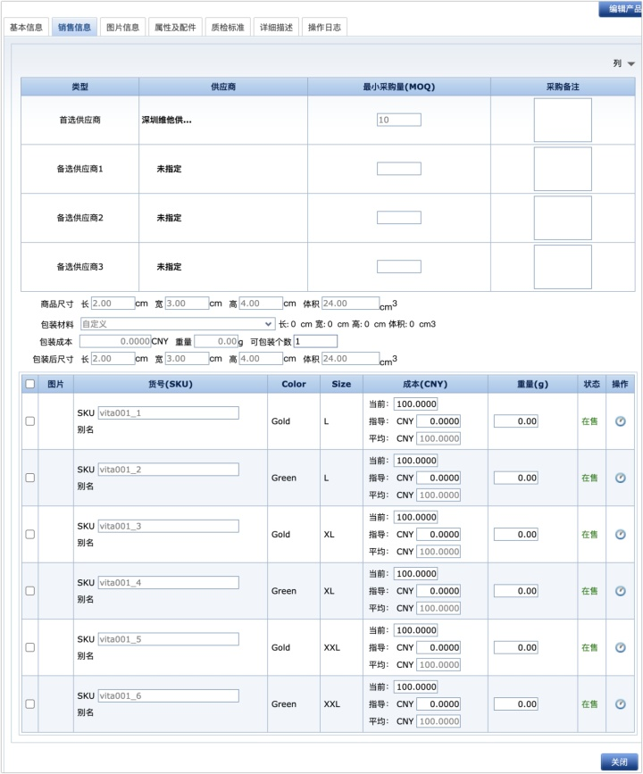

  
通途ERP截图  
通途ERP也是这样的做法，这样比较清晰明了。