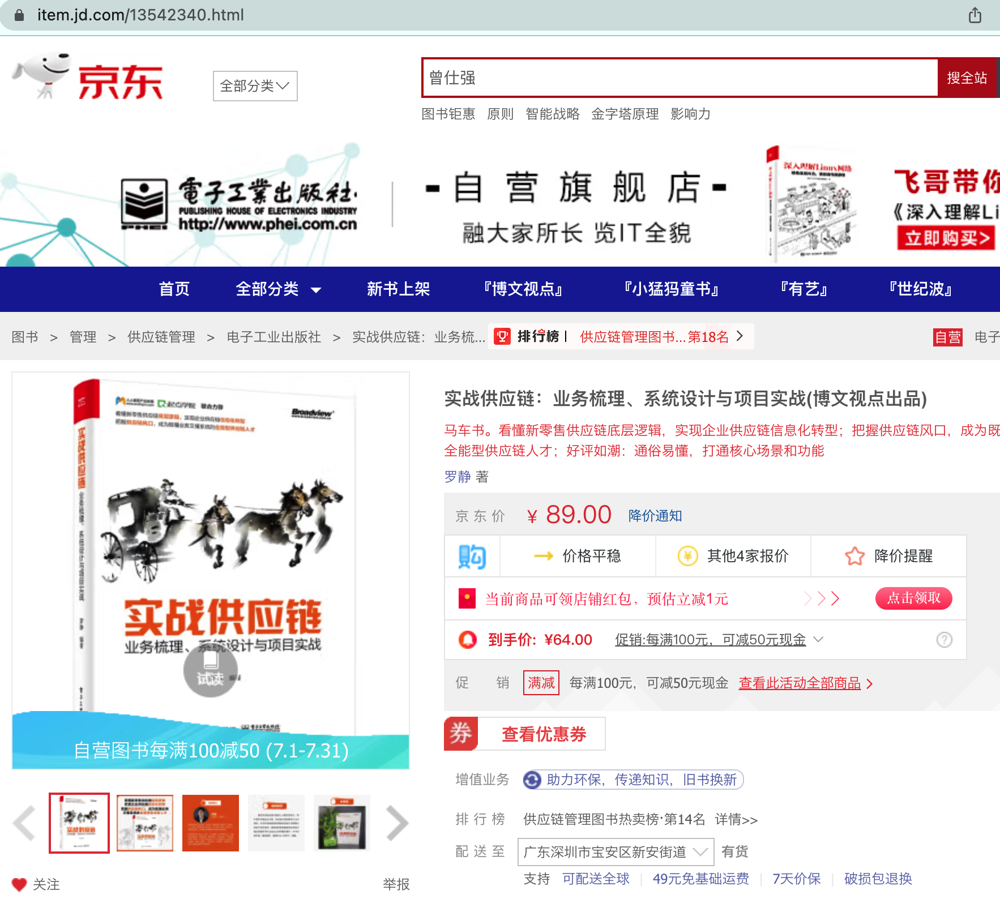
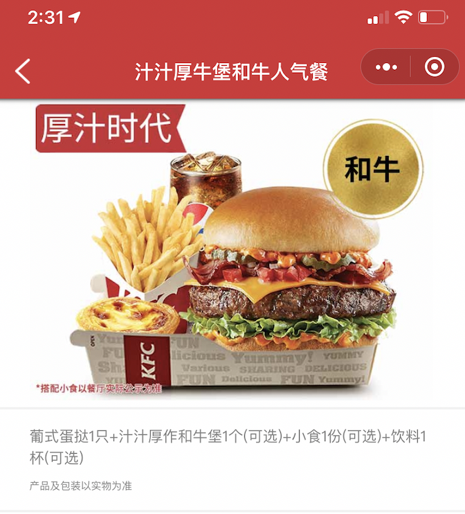
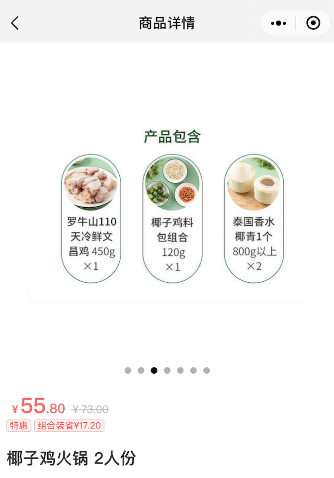
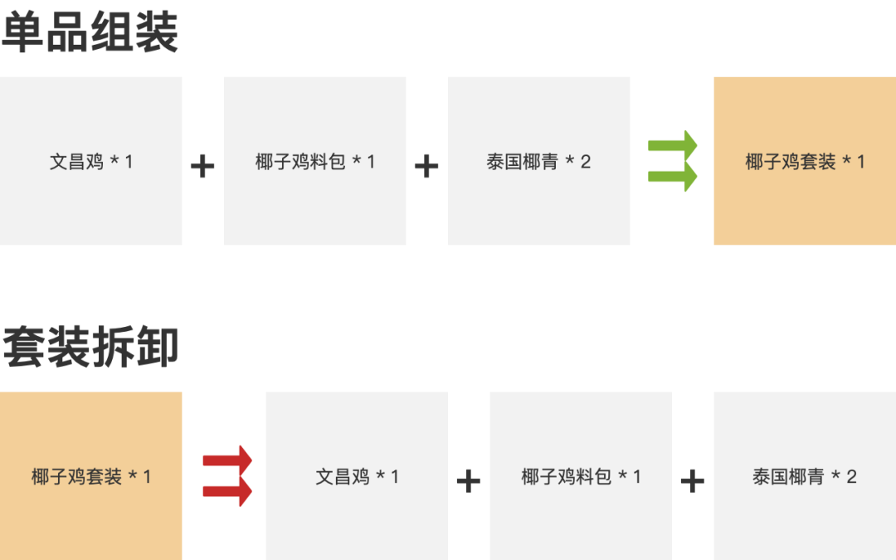
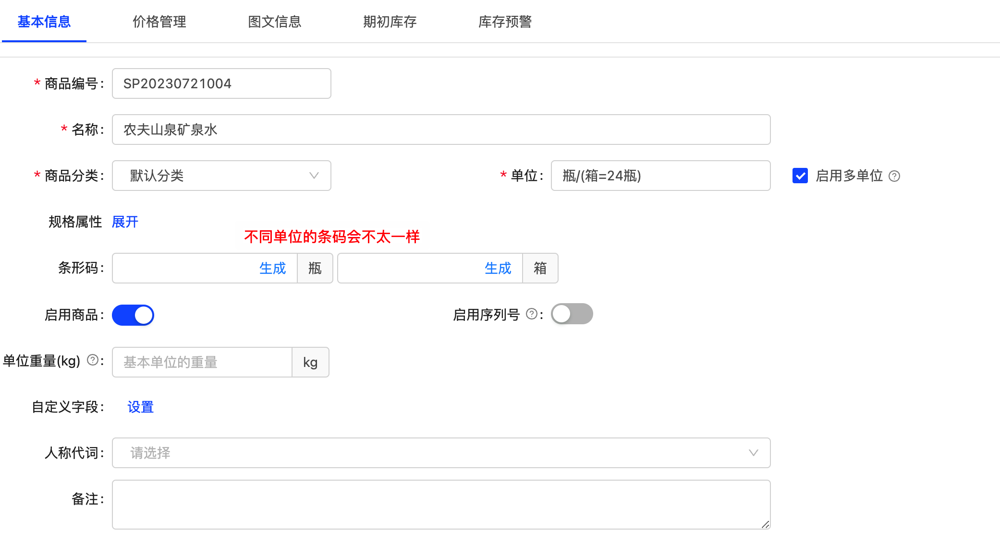
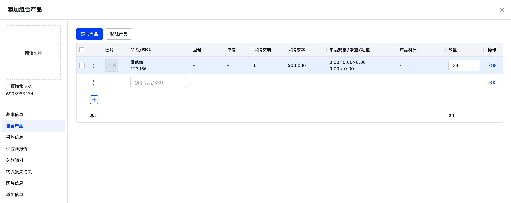
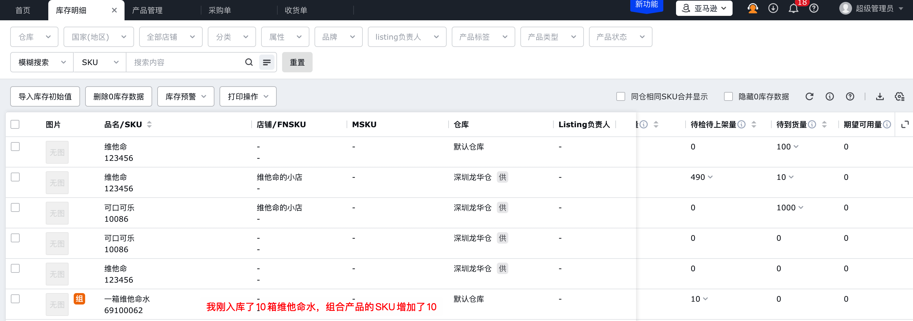
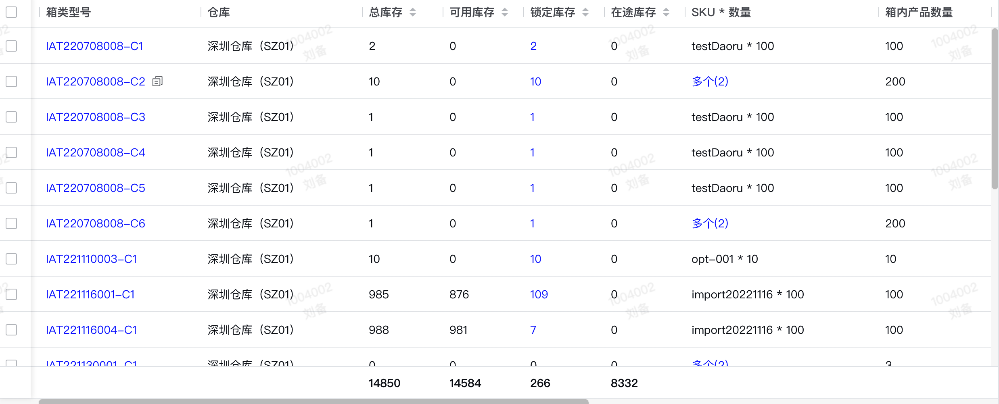

无论是国内电商还是海外的电商，无论是电商平台还是电商ERP，OMS还是WMS，都离不开对产品（商品）的管理，也就是对SKU的管理。  
SKU是Stock Keeping Unit（最小存货单位），可以通俗理解为对商品的最小化粒度管理。例如：一瓶水，一台手机，一件衣服，一支笔等，都会有对应的SKU编码来进行标识，便于系统数据流转，也便于日常业务作业。  
在SKU的基础上，随着业务的变化，我们也会对SKU进行不断地演化，于是就有了今天我们要讨论的几种产品（SKU）形态：  
●单品  
●组合产品  
●套装产品  
●箱产品  
对产品经理来说，若想要设计好系统中产品管理模块的功能，那么就需要先准确地定义好产品（SKU）的几种形态，然后结合实际的业务进行取舍和演变。  
**名词解释**  
**1****单品**  
单品最容易理解，代表着最基础的SKU。一件产品就是一个SKU，通过这个SKU可以对应唯一的这样一件产品。  
单品是产品管理的基础，也是不可再分割的最小单元。例如：一本书就是一个单品SKU，会有唯一的一个SKU编码。  
  

  
**2****组合产品**  
组合产品的定义在不同的公司，不同的平台，不同的系统中都会有不同的定义，由于下面还有一个「套装产品」，所以此处的组合产品和套装产品是不一样的意思。  
组合产品是指在产品销售的时候，为了拉动其他产品的销售，而将多个产品打包成一个组合产品来销售。组合产品本身是虚拟的，不存在实体的。  
例如：KFC点餐时，一般会各种单品和套餐，消费者下单购买的是套餐（组合产品），但是实际扣除的库存是套餐（组合产品）背后的单品库存。

截图自肯德基点餐小程序

  
如果你买了一个「汁汁厚牛堡和牛人气餐」，它里面是包含了：  
●葡式蛋挞1只  
●汁汁厚作和牛堡1个  
●小食1份  
●饮料1杯  
如果其中任一一个单品缺货了，那么这个套餐（组合产品）就无法售卖了，餐厅工作人员可能会提醒你更换其他同价值类的单品。  
类似地，如果是在电商平台上，组合产品背后的某款单品如果缺货了，即使其他单品有货，此组合产品的库存不足也不能再售卖了。**所以组合产品的库存数量取决于组合中单品的最少库存数量，类似于「木桶理论」中的最短板的高度决定了木桶能装的水的高度。**  
**3****套装产品**  
套装产品与组合产品在语义上很相似，而且在使用的时候文案经常混着用，所以很容易被大家误解、混淆。  
但是套装产品其最本质的特点就是：**套装产品的库存是实物库存而不是虚拟库存**。  
这也是区分套装产品和组合产品最直观的方式。  
例如：我们在一些生鲜超市或者生鲜App上看到的一些套装，这些套装会用保鲜膜缠在一起，然后贴上套装产品的SKU条码。消费者购买的时候，是按整套直接出售的，扣除库存的时候也是直接扣除套装产品的库存。  
  

截图自叮咚买菜

  
有些套装产品中的单品是可以单独卖的，有些则不行，所以不能依据套装中的单品是否可以单独出售来判断是组合产品还是套装产品。**最关键的还是要看实际管控库存的时候，是按单品来管，还是按套装来管。**如果是按单品来管，那么就是组合产品；如果是按套装来管，那么就是套装产品。  
当然，套装产品也可以通过库内的组装/拆卸功能来进行库存的变化。如果是对单品进行组装，那么就会扣除单品的库存而增加套装的库存；如果是对套餐进行拆卸，那么就会扣除套装的库存而增加单品的库存。  
  

库存加工-组装/拆卸

  
**4****箱产品**  
  

  
箱产品有点比较特殊，不同的场景下这个箱产品的理解会不一样，一般来说会有两种理解方式：  
1箱产品是一种多单位的体现，例如：一瓶水，一打水还有一箱水，其中的瓶，打，箱都是多种不同的单位；  
2箱产品是指一种特殊的套装产品，一箱水有24瓶，一般是用来按箱售卖，如果需要拆零，则可以使用拆卸的功能；  
如果是以第1种的理解方式，那么在创建产品的时候就需要维护产品的单位，不同的单位直接会有换算关系，例如：矿水泉“1箱水=24瓶水”，而且在启用了多单位管理之后，也可以维护不同单位下的条形码，以便于扫描的时候就可以定位具体的单位。  
  

七色米的多单位商品创建

  
如果是以第2种的理解方式，那么箱产品其实就是一个“特殊的单品”，箱产品一般可以单独使用，例如：记录箱产品的库存，箱产品的尺寸、重量，箱产品的基础属性等，在采购、出库等实际操作货物的时候，也是直接操作箱产品的维度。如果有一些特殊场景需要，可以对箱产品进行加工拆卸，把箱产品库存减少，单品库存增加。**此时的场景下，箱产品和套装产品是相同的意思。**  
既然有两种理解方式，那么实际上在不同的系统中怎么确定这个箱产品到底是第1种，还是第2种呢？  
其实判断的方式也很简单，那就是在创建商品的时候看一下是否有**“多单位”或者“辅助单位”**的字段即可，如果有这个字段，那么一般都是要创建最小化的单品，然后通过多单位的管理可以配置单位的换算关系，从而自动生成相关的其他单位的产品（例如：1箱=24瓶）。  
而如果在创建商品的时候没有“多单位”和“辅助单位”的字段，只是当做一个单品一样维护，可能还会有箱内包含的产品维护，那么这种就是“套装产品”型的“箱产品”  
  

添加箱产品的示意图

  
**ERP和WMS中的使用场景介绍**  
了解了上述的名词解释之后，接下来我们在设计系统的产品管理模块的时候就会更加得心应手一些。  
针对跨境电商ERP来说，一般用的最多的就是单品和套装产品，但是很多跨境ERP都会把这个套装产品称之为“组合产品”，目的是为了降低用户的理解难度。实际上跨境ERP（例如：领星ERP）的组合产品是套装产品的概念，它是一个单独的SKU，然后采购、出库等影响的库存也是组合产品自己的实物库存。  
  

领星ERP的组合产品（就是文中的套装产品）

  
针对WMS来说，一般用的最多是单品和套装产品，也会有一些公司使用箱产品，一定要提前做好名词解释，否则容易对用户造成困扰。在海外仓WMS中，备货到FBA仓的这部分库存是一个很特殊的存在，不同公司，不同仓库的玩法都不一样。  
有些公司的产品先发到海外仓，然后由海外仓中转发到FBA仓中，这些产品都是打包成了一箱一箱的，而且全部是用来中转FBA的。所以到了海外仓之后，一般都不会拆箱，会以箱子为最小单位，于是就有了箱产品这个概念，其实就是一个不可拆卸的「**套装产品**」。OMS下推出库指令是按箱来下推的，例如：上面的240瓶水，可能下推的指令就是“FBA中转出库：整箱水\*10”。  
  

海外仓的箱产品库存

  
而有些公司使用海外仓，不仅仅是做FBA中转备货，也会做其他平台的自发货。虽然入到海外仓的产品是一箱一箱的打包的，但是实际都是按单品的维度来管理的。无论是FBA中转出库还是自己仓内一件代发，OMS下推的出库指令都是“出库：单瓶水\*N件”，期间并不掺杂任何的“箱”、“组合”或者“套装”的概念，特别的简单和纯粹。  
**小结**  
之前我研究过好多ERP，电商产品后台，WMS等，发现很少有人会将这些基本概念做一个说明，导致我在理解一些业务的时候总是特别吃力。  
如果用户只用某一两个系统那还好，因为多用几次就会get系统设计的逻辑是怎么样的；但是如果用户用过多个系统，就会发现不同系统的不同定义对于新人来说特别不友好。  
除此之外，还有一些系统在设计这几种产品类型的时候，很多场景思考没有闭环，逻辑不够严谨。通过调研以为客户需要组合产品，于是自己就创建了一个组合产品，结果这个组合产品其实本质上是一个套装产品。**但是客户的需求其实是组合产品，也就是通过单品来确定最终的库存，从而来调整电商平台的销售策略。**  
还有一些系统本质上是套装产品，但是在扣减库存的时候，没有通过拆卸单或者提醒用户，而是自动去把套装不足的部分用单品来抵扣。这样导致仓库在实际拣货出库的时候特别困扰，一部分是打包好的套装，一部分是零散的单品，最后发给客户的东西变得奇奇怪怪。  
在设计“产品管理”相关的模块，一定要结合实际的场景做出准确的判断，别眉毛胡子一把抓，什么都想做，最后做的四不像。  
如果是在做一些同质化比较严重的系统（例如跨境ERP）的时候，不到万不得已不要轻易挑战用户的习惯，自己去派生一些新名词。假如一定要这样做，那么一定要及时做好相应的名词解释，避免给客户带来困扰。