**条码知识扫盲**  
很多第一次接触仓库知识的朋友可能都会在条码这一块翻车踩坑，所以我觉得很有必要对条码的知识进行一波科普讲解，帮助大家避开一些很容易踩的坑，只要掌握了条码的核心知识，基本上是一通百通的。  
仓库中常见的条码就是一维码，少数场景下会用到二维码。一维码和二维码都可以包含一些信息，但是二维码包含的信息量级更大，能支持的字符类型也更多。  
  

  
下方的是一个条形码，它是一个一维码，如果用手机扫描的话，应该可以知道它背后的字符是“vitamin”  
  

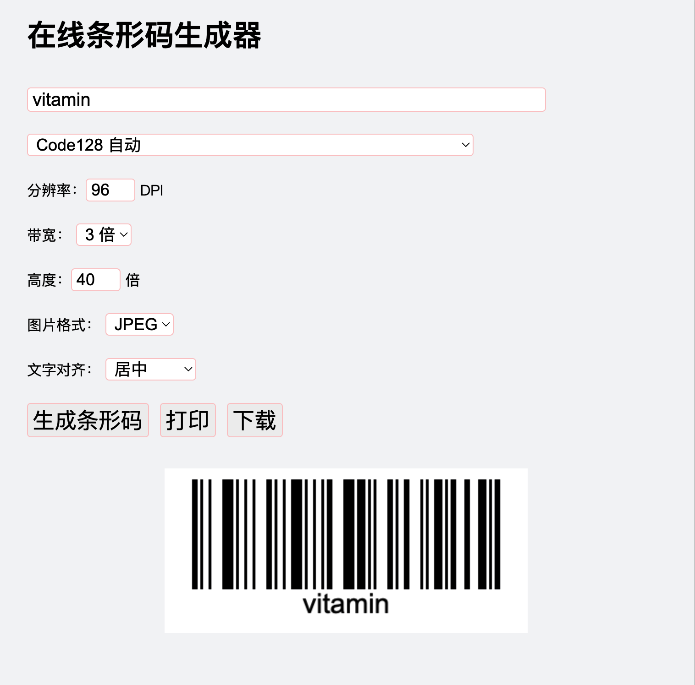

  
下方的是一个条形码，它是一个二维码，如果用手机扫描的话，应该可以知道它背后的字符是“vitamin”  
  

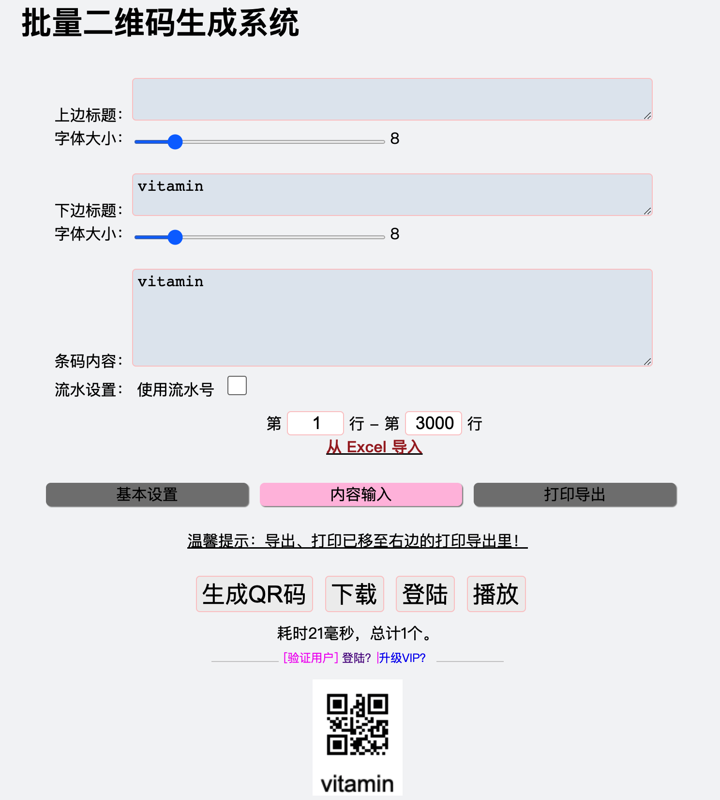

  
无论是条形码还是二维码，本质上都是将一些字符信息写入到图像中，然后使用相机或者扫描器解析的时候，可以拿到这些字符信息。通俗点来说，就是把字符信息转化为图片（条码/二维码）叫做编码，反过来扫描图片（条码/二维码）就叫做解码。  
拿条形码来举例，生成条码的时候需要进行编码，于是就有一个“编码规则”的选择，不同的编码规则生成的条码是会有一些差异的，一般来说，条形码的生成规则常见是就是“Code128，EAN，UPC，ISBN”等。  
  

  
Code128的编码方式有三种，分别是：  
●Code128A  
●Code128B  
●Code128C  
这三种的区别，可以看我之前写的文章：  
  

[Code128相关知识普及](https://www.yuque.com/jiaowovitamin/uizu4s/ueabiz)

  
一般来说，默认使用Code128 Auto即可，Auto是根据数据内容自动选择A/B/C代码集，以最短的方式编码图形。  
  
如果使用了比较冷门的编码方式生成条形码，可能会导致扫码枪不支持，就会无法识别和解析。例如：有一些扫码枪是不能支持二维码的，就会导致无法扫描并解析出结果。  
  

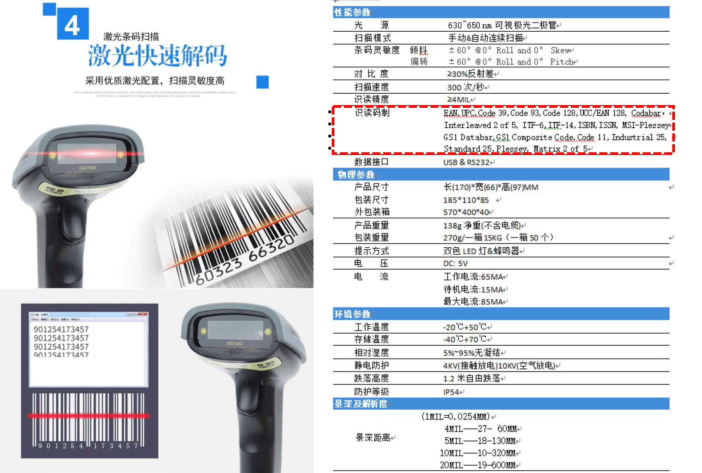

  
  

| **序号** | **踩坑点描述** | **解决方案** |
| --- | --- | --- |
| 1 | 编码太长，导致生成的条形码太密集或者也太长，打印出来的时候不能完整的打印，比例会有问题 | 在创建一些编码字段的时候，就要对字段进行长度约束，避免用户输入太长的条码。例如：EAN码一般来说是13位，那么我们就可以限制用户最多输入15或者20 |
| 2 | 有一些字段的条码生成失败了或者是出现了一些“？？”符号 | 条形码编码的时候是有编码规则的，编码规则中会告知有一些字符是不能进行编码的，例如：汉字或者一些全角的标点符号，所以在创建编码字段的时候，要对字段的字符类型进行限制 SKU支持字母、数字、符号(空格 - & _ # * () % @ ! . = / " ' < > +) |
| 3 | 仓库中有一些商品是二维码，但是用PDA扫描的时候无法识别 | 扫码枪或者PDA等设备是有不同的规格属性的，有一些设备不支持解析二维码，所以仓库在采购设备的时候要注意这个点 |
| 4 | 有一些条码识别出来之后感觉和原编码字段是一样的，但是搜索的时候就是查询不到信息 | 条形码一般是支持空格的，所以在生成条形码的时候要注意看首尾是否有空格，一般来说首尾空格要去除，否则识别出来的内容在查询的时候很容易发现查询不到信息 |

在供应链系统中，会遇到很多形形色色的编码、Code或者是ID之类的字段，很多人一开始可能对这些信息会感觉很绕，那是因为对业务信息掌握的还不够，等后续掌握了业务就觉得其实这些也比较简单。  
本文，我整理了一些常见的编码类字段，这些字段在我们设计产品字段和对应功能的时候都会有很关键的作用，一定要仔细核对领悟一下。  
**仓库中的一些编码名词解释**  
  

| **名词定义** | **解释** | **举例说明** |
| --- | --- | --- |
| SKU ID | 1.由于不同的客户有可能会有重复SKU，所以系统为所有的SKU都生成一个内部的SKU ID 2.SKU ID还可以用来打印条码，类似亚马逊的FNSKU，可以打印出来贴在商品上 | 亚马逊的FNSKU就是亚马逊库内唯一生成的编码，一款SKU对应一个FNSKU，哪怕不同的客户卖相同产品，也会生成不同的FNSKU |
| SKU | 1.每个产品都会有SKU，SKU由客户自己生产，然后填写在ERP或者OMS系统中 2.海外仓OMS场景下，同一个客户内，不允许SKU重复，但是不同的客户有可能SKU重复 | 张三和李四卖的东西不一样，但是用了一套编码规则，所以张三的一瓶水和李四的一件衣服都是用了相同的SKU（MS12446103） 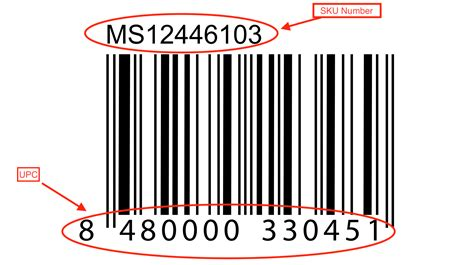 |
| 产品条码 | 1.一般来说，产品实物上印刷的条码称之为产品条码，中国常见的条码叫做EAN码，一般是69开头的13位码，也叫做69码 2.北美地区一般是用UPC码，和EAN码类似，不过UPC码一般是12位长度 | 身边常见的产品上一般都会印刷69开头的13位条码 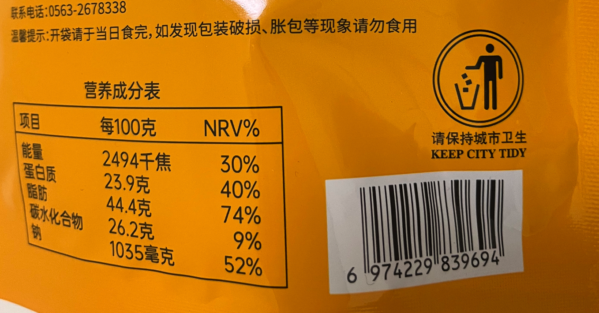 |
| FNSKU | 1.亚马逊的库内产品条码，称之为FNSKU，指货物送到亚马逊的仓库之前亚马逊自动为货物生成的一个产品编码 2.一个SKU可能会对应多个FNSKU，但是一个FNSKU一般只会对应一个SKU | 卖家需要使用FBA发货的时候，需要向亚马逊申请FNSKU，然后贴好FNSKU标之后，发到亚马逊仓库中 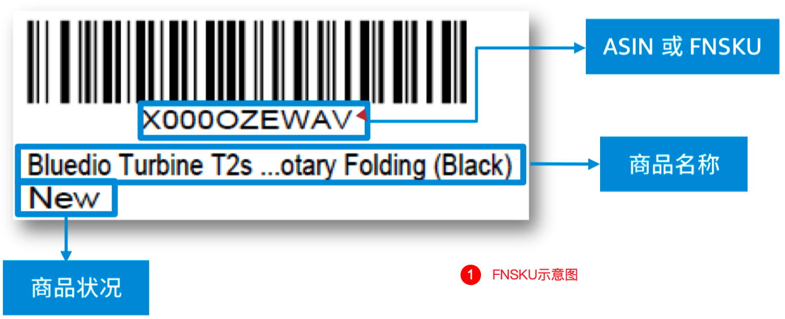 |
| 其他条码 | 1.为了兼容某些客户的极端场景，一个产品会有多个条码，所以引入了这个字段 2.和产品条码类似，用来做条码的拓展，例如：一品多码，就是指同一款商品但是有多个条码 | 与产品条码类似，可以用来拓展条码 |
| Barcode | 1.Barcode是所有条码拼接（聚合）的统称，意味着扫描其中任意一个条码都可以找到对应的SKU 2.Barcode包含：SKU,SKU ID,产品条码,FNSKU,其他条码 | 所有可扫描的条码的合集统称 |
| SN码 | 1.SN码叫做序列号码，也称之为唯一码 2.同一个SKU中的唯一码是具有唯一性的，例如：都是iPhone14，张三和李四的iPhone14是不一样的唯一码 3.但是由于不同的厂商生成唯一码的规则不一样，所以不同厂商的产品之间可能会有相同的唯一码，例如：小米手机和华为手环的唯一码可能会一样，这种概率比较低 | 例如：手机是IMEI号，然后iPhone手机的序列号，电子产品的序列号等，每个有序列号的产品，自己的序列号都是独一无二的（不考虑不同厂商撞车的情况） 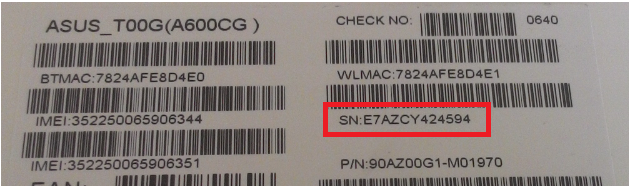 |

  
  

  
如果是北美地区的产品则会用UPC码  
  

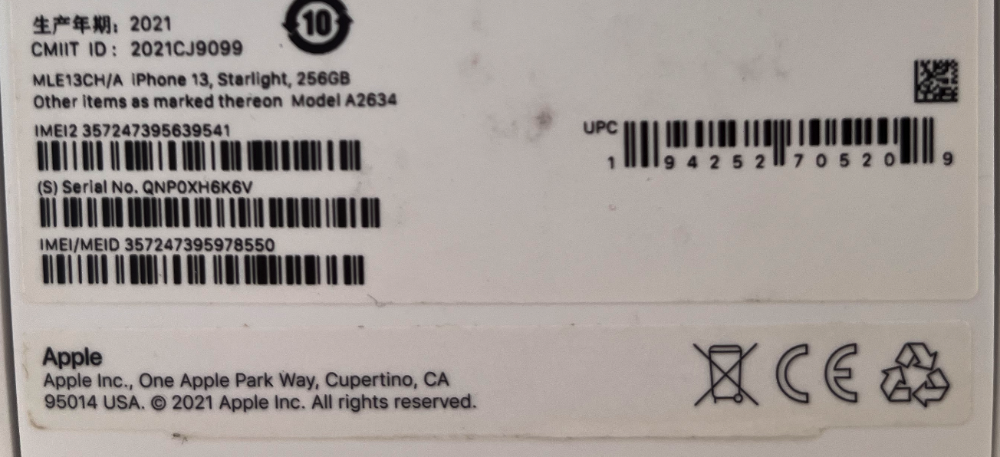

  
  

  
  

  
  

**具体的案例说明**  
1SKU不要求一定是可扫描的，所以**SKU≠条码**，在做一些查询或者数据传输的时候要注意，什么时候传递SKU，什么时候传递条码，最好是要支持SKU查询，也要支持商品条码查询。

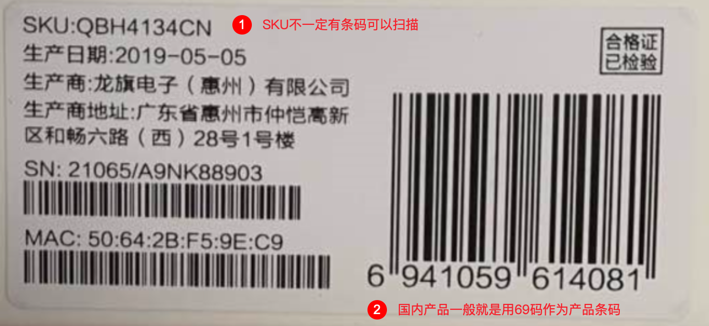

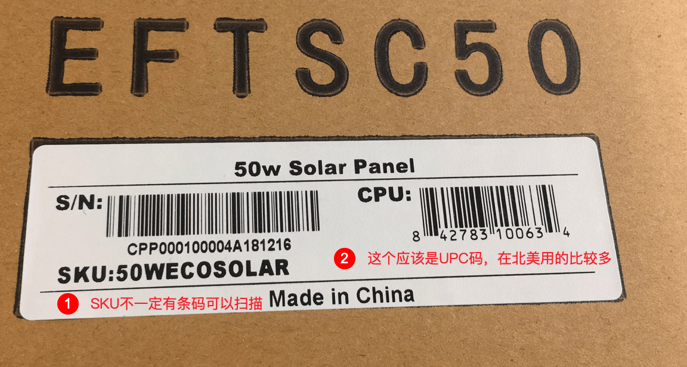

  
2商品可扫描的条码最好只有一个，WMS作业的时候可以展示2个关键信息，一个是商品名称，一个是可扫描条码（默认是产品条码），在实物上最容易看到的是条码，可以通过条码再结合商品名称或者图片确认一下产品是否正确。系统中的数据传递一般是用SKU或者SKU ID，不过也可以使用“客户代码+产品条码”这种，也可以定位到一个确定的商品，需要使用“客户代码”是因为不同客户的产品条码可能会重复，不同客户的SKU也可能会重复。  
  

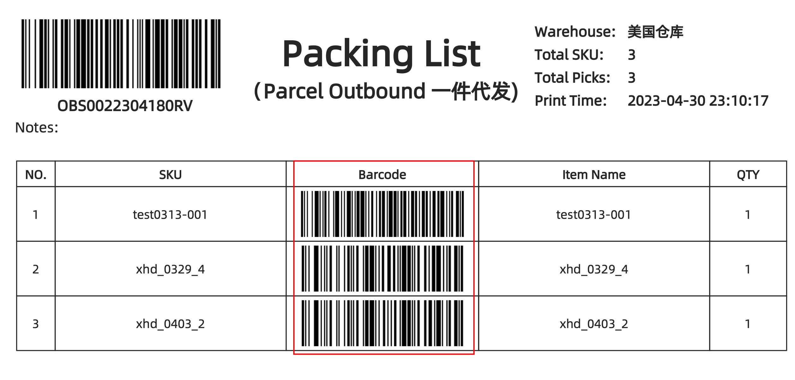

海外仓的拣货单

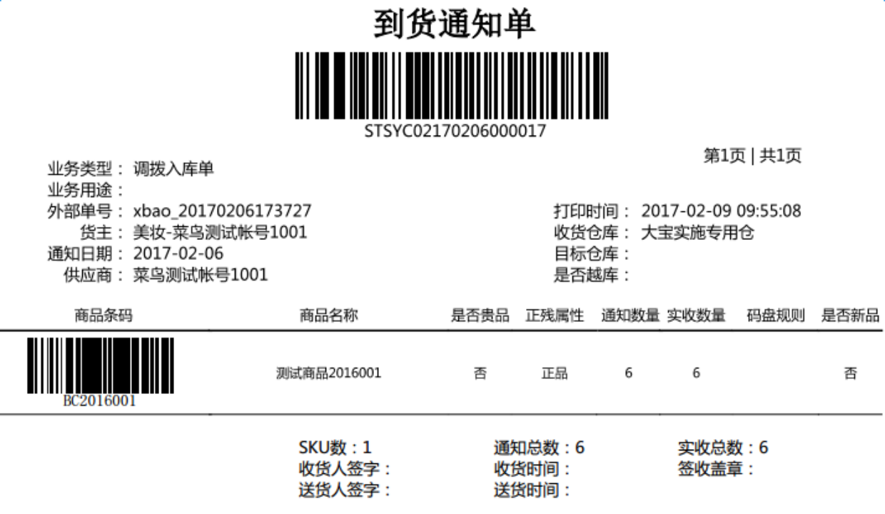

菜鸟大宝仓库的通知单

  
3OMS中遇到重复的SKU时，内部自己生成一个SKU ID，插入到Barcode中，可以不需要让客户贴标，如果客户需要重新贴标，最好是贴SKU ID，这样扫描之后就可以直接确认是哪个客户的哪款产品。  
  

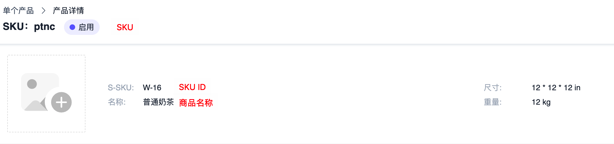

展示SKU ID

  
**补充知识（****唯一商品标识码简介****）**  
唯一商品标识码 (UPI) 可帮您定义您在全球市场上销售的商品。它们会以独一无二的方式区分出您所销售的商品，并帮助将搜索查询与您的商品进行匹配。制造商会为每种商品指定唯一商品标识码。  
**因此，如果您销售的商品与其他零售商的相同，那么商品的唯一商品标识码也会相同。**  
常见的唯一商品标识码包括全球贸易项目代码 (GTIN)、制造商部件号 (MPN) 以及品牌名称。并非所有商品都具备唯一商品标识码。可能没有指定 GTIN 的商品示例包括：  
●自有品牌商品  
●替换部件  
●原始设备制造商 (OEM) 部件或 OEM 部件替换件  
●定制商品（例如定制 T 恤、工艺品和手工制品）  
●在 ISBN 于 1970 年获批成为 ISO 标准以前出版的图书  
●复古物品或古董  
要想标识没有 GTIN 的商品，您可以使用 MPN[mpn] 和品牌[brand] 属性。MPN，即制造商部件号，是制造商为特定部件指定的唯一商品标识码。利用品牌[brand] 属性，您可以将品牌作为商品的唯一商品标识码。  
  

| **属性** | **名称** | **说明** |
| --- | --- | --- |
| [GTIN[gtin\]](https://support.google.com/merchants/answer/6324461) | UPC | ●主要在北美洲使用 ●通用商品编码 (UPC)，也称为 GTIN-12 和 UPC-A ●12 位数字 ●商品的唯一数字标识码，通常与零售商品上印刷的条形码相关联 |
| [GTIN[gtin\]](https://support.google.com/merchants/answer/6324461) | EAN | ●主要在北美洲以外的地区使用 ●欧洲商品编码 (EAN)，也称为 GTIN-13 ●通常为 13 位数字（有时为 8 位或 14 位数字） ●商品的唯一数字标识码，通常与零售商品上印刷的条形码相关联 |
| [GTIN[gtin\]](https://support.google.com/merchants/answer/6324461) | JAN | ●仅在日本使用 ●日本商品编码 (JAN)，也称为 GTIN-13 ●8 位或 13 位数字 ●商品的唯一数字标识码，通常与零售商品上印刷的条形码相关联 |
| [GTIN[gtin\]](https://support.google.com/merchants/answer/6324461) | ISBN | ●在全球使用 ●国际标准书号 (ISBN) ●**ISBN-10**：共 10 位数字（最后一位可以为 X，表示数字 10） ●请注意，此格式已于 2007 年弃用，并非所有图书都可用 ISBN-10 表示 ●**ISBN-13（推荐）**：共 13 位数字，通常以 978 或 979 开头 ●用于 1970 年以后出版的图书的唯一数字标识码，与条形码一起印刷在图书的背面 |
| [品牌[brand\]](https://support.google.com/merchants/answer/6324351) | 品牌 | ●在全球使用 ●商品的品牌 ●应该清晰地展示在商品包装或标签的正面 |
| [MPN[mpn\]](https://support.google.com/merchants/answer/6324482) | MPN | ●在全球使用 ●制造商部件号 (MPN) ●字母数字数位（长度不等） ●此编号可以独一无二的方式标识商品的制造商 |