**前言**  
亚马逊平台有很多衍生的名词，让很多小白朋友们非常之头痛，哪怕是入行一段时间的产品朋友，如果没有去深挖其中的关系，对一些概念其实还是一知半解的状态，遇到一些较深的场景时，经常容易卡壳。  
网络上有很多相关的科普文，但是我感觉要么写的很碎，要么写的很浅，要么就是偏向于运营视角，和产品经理没太大关系……  
于是我决定班门弄斧一下，自己写一篇相关的介绍文，一方面是精进自己相关的业务知识，另一方面也算是为广大产品朋友们填补这一块的空缺吧。  
由于我自身并没有具体做过亚马逊相关的业务，所有的内容都是通过收集资料、与相关产品朋友沟通而输出的，若文章中有一些内容阐述的不准确，恳请读者朋友们指出。  
  

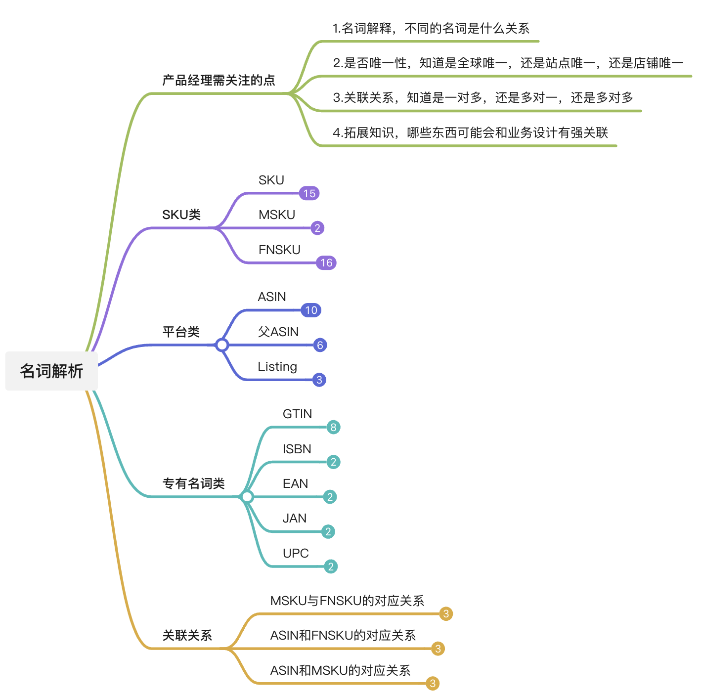

  
本文的写作大纲已经整理成了一个脑图，放在了语雀上，便于后续快速查看，感兴趣的朋友可以点击“阅读原文”获取。

**SKU类名词**  
**SKU（Stock Keeping Unit）**  
SKU，英文Stock Keeping Unit(库存量单位)，定义为库存管理中的最小可用单元。SKU代码是一种唯一的标识符，它包括字母和数字，用于表示产品的重要特征，如品牌、颜色和大小。SKU是指一款商品，每款产品都有一个SKU，便于识别商品。  
SKU对于电商产品经理来说是最基础的概念，但是要向小白解释这个概念还是挺难的，这里举一个简单的例子：  
怡宝矿泉水有不同的容量装，那么怎么知道不同容量的水分别剩余多少库存呢？只需要对不同容量的水定义一个不同的SKU，使用SKU进行管理即可。  
●一瓶怡宝350ML的水是：SKU1  
●一瓶怡宝500ML的水是：SKU2  
●一瓶怡宝1500ML的水是：SKU3  
●一箱24瓶装（单瓶350ML）的怡宝水是：SKU4  
SKU1的库存是500，则表示350ML的水还有500瓶；SKU4的库存是100，则表示一箱24瓶装（单瓶350ML）的怡宝水有100箱……  
  

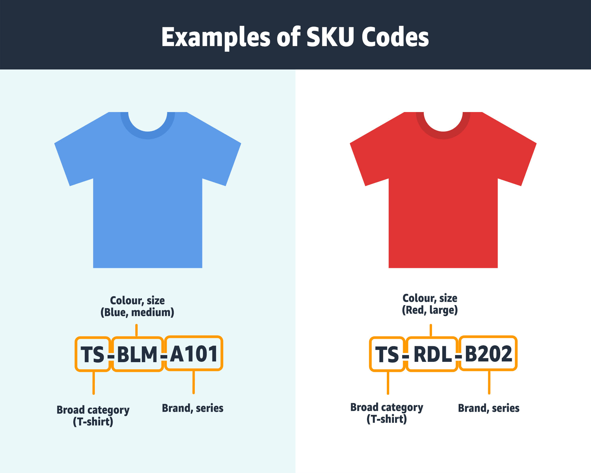

  
不同尺码，不同颜色的衣服也是不同的SKU  
**MSKU（Merchant Stock Keeping Unit）**  
MSKU，英文Merchant Stock Keeping Unit（商家/制造商库存量单位），应该是亚马逊专门搞的一个名词，用来和FNSKU区分开。MSKU是指卖家自己定义的SKU，在其他的电商平台也称之为平台SKU或者销售SKU，也有直接就叫作SKU的。  
MSKU其实和SKU基本上是一样的概念，大多数卖家会使用自己定义的SKU来填写在亚马逊的Seller SKU栏。如果不填写此栏，则亚马逊会自动为该商品创建一个SKU编码。  
  

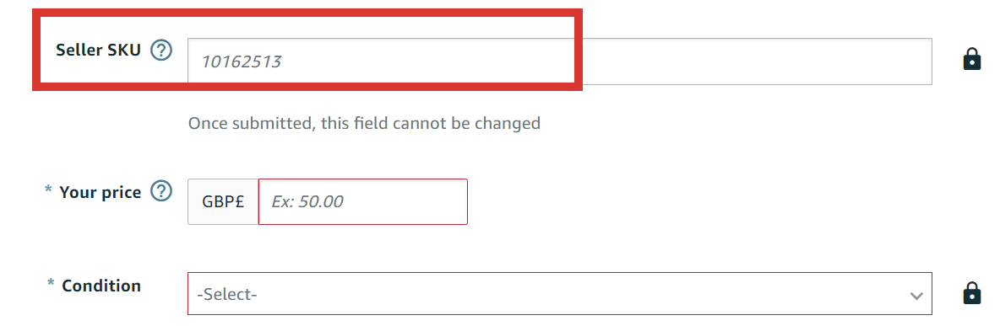

  
图源网络  
需要注意的是，MSKU或者Seller SKU一般都是店铺内唯一的，不同的店铺可能会有重复，因为这个是亚马逊无法控制的。  
**FNSKU（Fulfillment Network Stock Keeping Unit）**  
FNSKU，英文Fulfillment Network Stock Keeping Unit（配送网络库存单位），是亚马逊平台特有的名词。 FNSKU可以理解为使用亚马逊的仓库发货时，亚马逊为相应的产品自动生成的条码，用于仓库管理使用。  
只有启用了FBA服务才会生成FNSKU，如果没有启用则不会生成FNSKU。FNSKU编码的生成规则一般有两种：  
●若卖家配置“亚马逊物流商品条形码首选项”时，选择了“亚马逊条形码”，则FNSKU一般是X00开头。注：贴有亚马逊条形码的商品将不参与虚拟追踪。  
●若卖家配置“亚马逊物流商品条形码首选项”时，选择了“制造商条形码”，则FNSKU一般是B0开头，注：这个B0开头的条码一般是指ASIN，制造商条形码会自动参与“虚拟追踪”。  
  

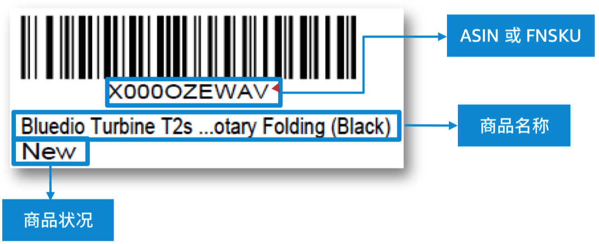

  
图源：亚马逊卖家大学  
什么是虚拟追踪，可以看看下方两个链接，语雀中也有相关的链接说明。  
https://sellercentral.amazon.com/gp/help/external/200141490?language=zh\_CN&ref=efph\_200141490\_cont\_201100910  
https://sellercentral.amazon.com/gp/help/external/help.html?itemID=200141480&language=zh\_CN&ref=efph\_200141480\_cont\_201100910  
FNSKU的条码生成规则暂时没有找到文章，不确定是怎么生成的，但是FNSKU对每个产品和每个卖家都是独一无二的。如果其他卖家通过亚马逊配送中心销售相同的产品，这一点尤其重要，因为它有助于区分哪些商品属于哪个卖家。  
通过我找到的资料，我判断“**FNSKU是具有全球唯一性的**”。虽然当卖家使用制造商条形码的时候，打印出来的FNSKU条码展示的是ASIN（B0开头），但是这并不代表不同的卖家销售相同的产品时候，产品的FNSKU会重复。关于这一点，也欢迎专业人士给我解答一下。  
**平台类**  
**ASIN（Amazon Standard Identification Number）**  
ASIN，英文Amazon Standard Identification Number（亚马逊标准识别号）。由亚马逊系统自动生成的由 10 个字母或数字组成的代码，用于表示商品的唯一编码，不需要卖家自行添加。如果是书籍类的ASIN码就等同于全世界通用的ISBN号。  
ASIN在亚马逊平台上是唯一的，不同的卖家如果卖相同的商品，其ASIN可能是相同，也可能是不同。亚马逊卖产品一般分2种，自己在店铺新建Listing，这种情况下就会新生成一个ASIN，即使我们两个人卖的是相同的产品；另一种是“跟卖”，我跟卖你这个ASIN，就相当于我们俩共用一条链接卖货，购物车在谁的手里，这条链接的编辑权就在谁手中，这种情况下ASIN往往是相同的。  
如何来判断商品是否相同呢？一般是采用GTIN来判断商品是否相同，什么是GTIN，在下方会有说明。  
为了创建新的ASIN，亚马逊提供了“添加产品”工具。如果您的商品已经存在，您将匹配正确的ASIN。如果它是新产品，那么您将创建一个新ASIN。请注意，如果您添加新的ASIN，其他卖家现在也可以使用此ASIN 编号销售相同的商品。 如果您要创建新的ASIN，则需要知道商品的GTIN（全球贸易商品编号）。最常用的GTIN是UPC、ISBN和EAN。亚马逊使用这些通用产品标识符来创建和匹配他们自己的唯一ASIN代码。  
在哪里可以找到ASIN？一般来说前端页面有两个地方可以找到，一个是URL地址，一个是商品介绍详情。  
  

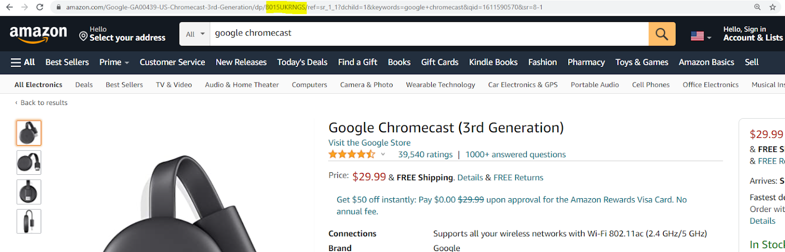

  
商品页的URL地址中  
  

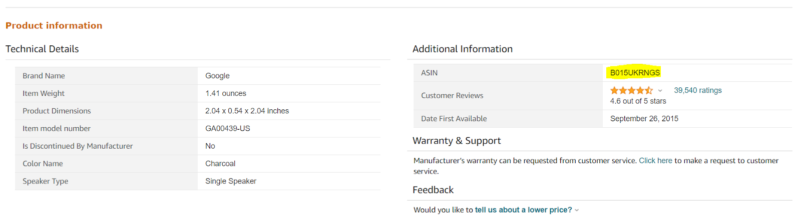

  
商品页的详情中  
**父ASIN**  
ASINs也可以组织成层次结构，也称为parent-child variation (父子变体），以提供目录结构并有助于整理库存。**通俗地理解，父ASIN和子ASIN的关系，和SPU与SKU的关系类似，是一种父子级关系**。  
变体（又称父/子关系）是根据尺寸、颜色、口味等彼此关联的一组商品。例如，想要搜索短袖 T 恤的买家可能会在商品详情页面中点击查看具有三种尺寸（小号、中号、大号）和三种颜色（蓝色、红色、黑色）的 T 恤。买家无需浏览各个颜色和尺寸的单独页面，而是可以选择想要的尺寸，然后从同一页面上所提供的三种颜色变体中选择颜色。  
父AISN和子ASIN，FNSKU等的关系如下图所示：  
  

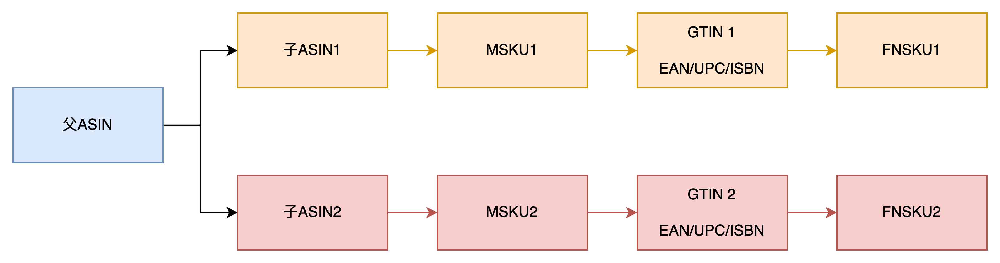

  
父ASIN下面有多个子ASIN，父ASIN在前端界面不可见，前端可见的是子ASIN，也就是在URL地址或者商品详情页看到的都是子ASIN。  
  

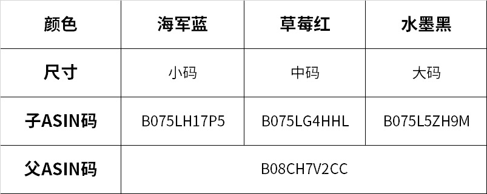

  
图源网络  
**Listing**  
在亚马逊上架的产品，每个产品就会有一个对应的Listing页面（商品详情页）。只要你创建了Listing之后亚马逊就会自动生成一个对应的Listing ID和ASIN，里面可能包含有不同的变体（尺寸、颜色、型号等）。  
和Listing相关的知识比较多，可操作性也很强，还衍生了一个名词，叫做“Listing优化”，也有对应的岗位产生。主要就是负责对Listing进行优化，包含标题，商品描述，商品要点，图片，页面，搜索关键词，分类节点等。  
Listing的跟卖也是亚马逊平台的一个特色，卖家在上传新产品时不是自己创建新的Listing，而是通过产品名称、UPC码、EAN码或是ASIN码，搜索出已经在亚马逊平台上架的产品，然后点击“Sell yours”，通过这种方式将产品挂在别人已存在的Listing的下面进行售卖，可以达到多人共享一个Listing页面的作用。  
  

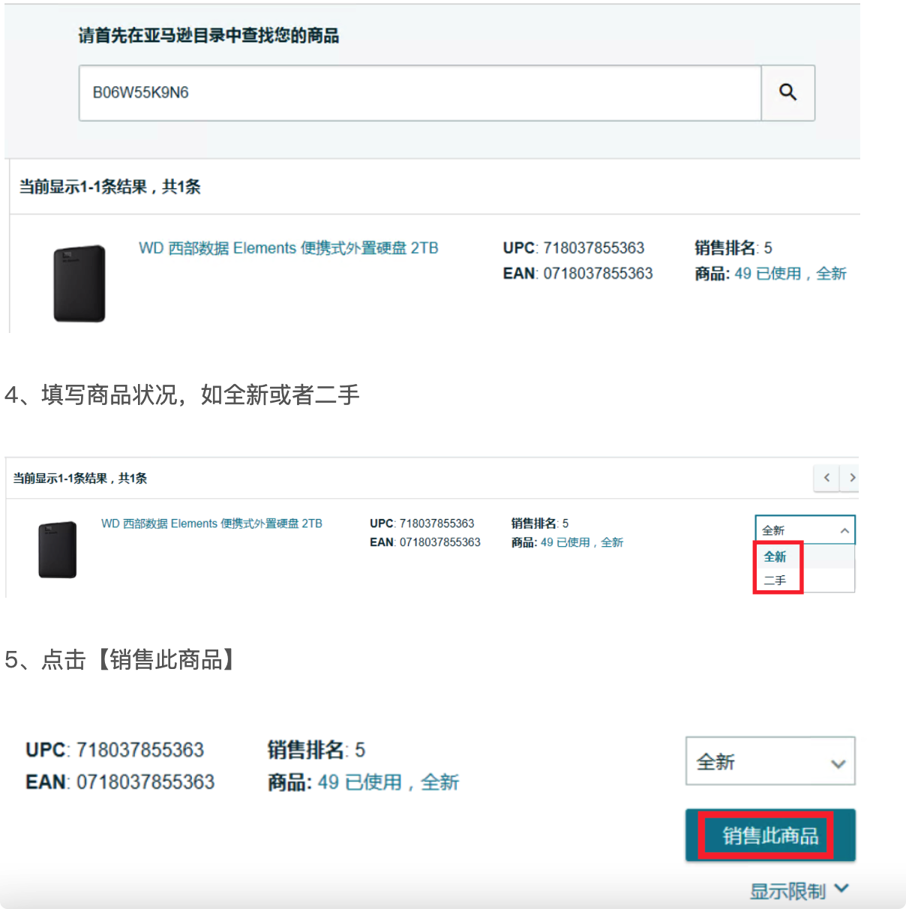

  
图源：船长BI运营干货  
共享的Listing的基础信息都一样，跟卖者只需要调整价格，库存和配送方式即可。  
  

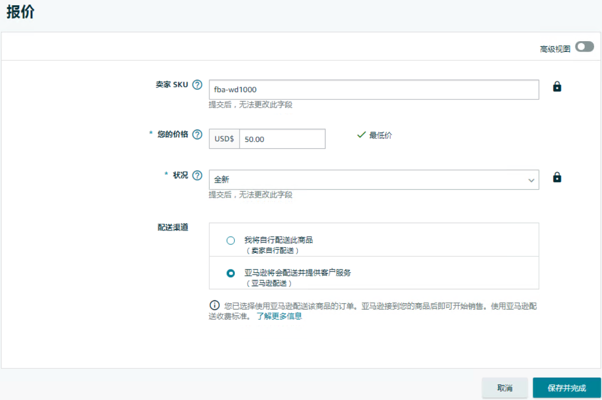

  
图源：船长BI运营干货  
  

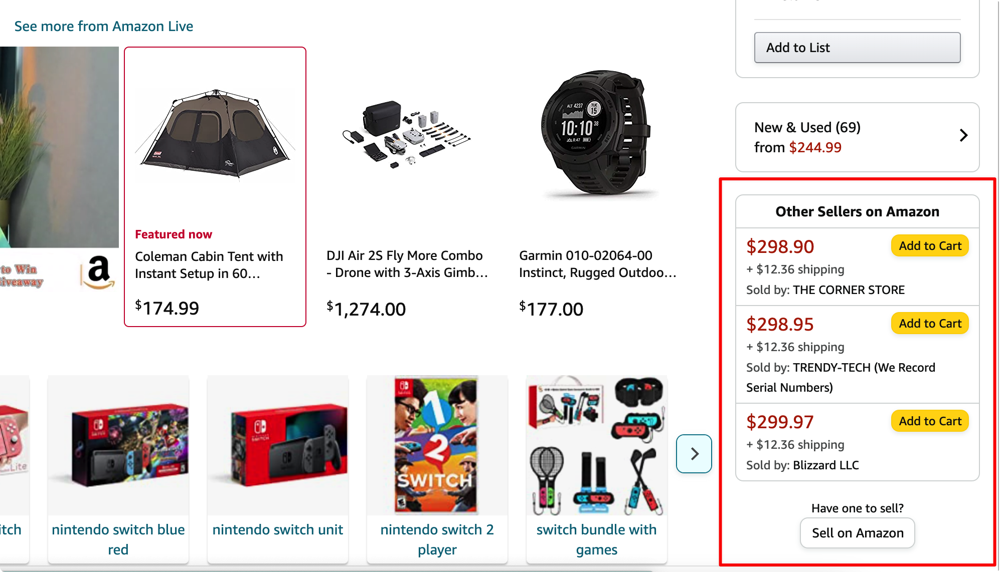

  
亚马逊Listing的前台页面  
**专有名词类**  
**GTIN（Global Trade Item Number）**  
GTIN，英文Global Trade Item Number（全球贸易项目编号），是国际公认的产品识别系统，为全球贸易项目提供唯一标识的代码。由非营利组织“GS1”开发了该系统，并定义了相关标准。  
GTIN 的长度可以是 8、12、13 或 14 位数字。它们是产品条形码的数字表示。根据产品的来源和产品类型，存在不同类型的 GTIN。  
●GTIN-8 -主要用于 EAN-8 条码  
●GTIN-12 -主要用于 UPC 条码  
●GTIN-13 -主要用于 ISBN、JAN 和 EAN-13 条码  
●GTIN-14 - 适用于批发或多件装产品  
  

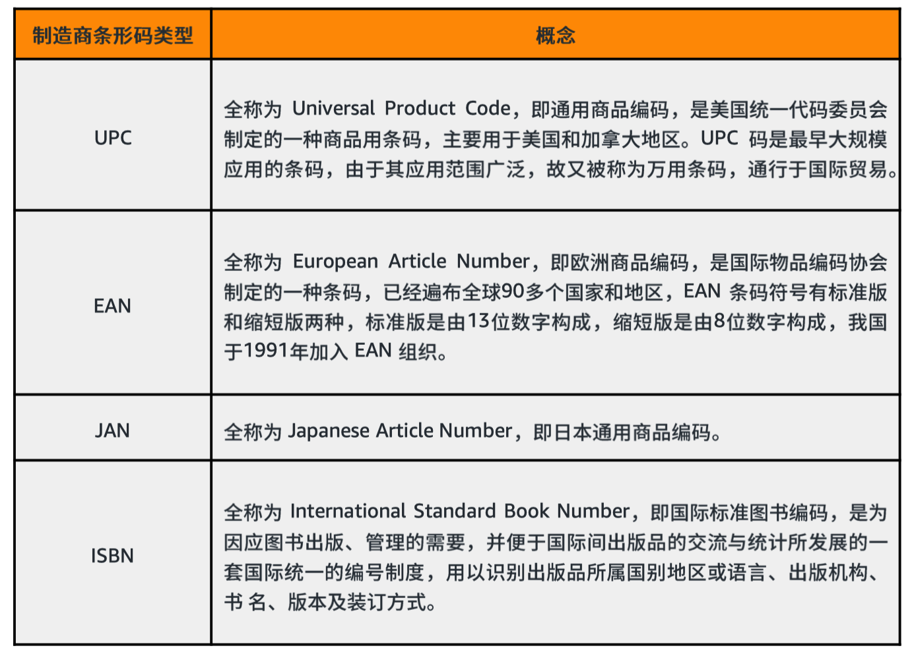

  
亚马逊常用的GTIN类型  
**ISBN**  
国际标准书号（英语：International Standard Book Number，缩写为ISBN），是国际通用的图书或独立出版物（定期出版的期刊除外）代码。出版社可以通过国际标准书号清晰地辨认所有非期刊书籍。一个国际标准书号只有一个或一份相应的出版物与之对应。一本书的每一版或其他的变化，能够申请到一个新的国际标准书号。新版本如果在原来旧版的基础上没有内容上太大的变动，在出版时不会得到新的国际标准书号。当一本书同时有平装本与精装本出版时，平装本的国际标准书号不得用于精装本，反之亦然。  
出版社应将其于2007年1月仍会流通使用的ISBN-10书号（包括存货清单上的图书），转换为ISBN-13格式。2007年1月1日之后出版的新书，必须编配新的ISBN-13位书号。  
**EAN**  
欧洲商品编码（European Article Number，EAN），原来只是欧洲范围内商品代码，而现在已是全球范围内产品交易的商品代码。为了适应读码器辨认的需要，这些代码又做成大家熟知的条形码。  
EAN有8位的，也有13位的。中国一般用的都是13位，而且都是69开头，所以也俗称为“69码”，大家可以随手拿起身边的一些产品看看背后的条码  
**JAN**  
日本于1978年在EAN的基础上开发出日本商品编码（Japanese Article Number，JAN），JAN（日本商品编号）是 EAN-13 条码的另一个名称。前两位数字 -国家代码- 必须是 45 或 49（日本）。  
**UPC**  
通用产品代码（英语：Universal Product Code，UPC）是美国均匀码理事会制定的商品条码，主要在美国及加拿大使用。在其基础之上发展起来的欧洲商品编码则已发展成为适用范围最广的通用条码。  
UPC又分为UPC-A、B、C、D、E五种版本。UPC-A是用的最广泛的一种版本，由12位数字组成  
**关联关系**  
**MSKU与FNSKU的对应关系**  
MSKU是卖家自定义填写的SKU，如果不填写则亚马逊会自动为该商品生成一个SKU。FNSKU是启用了亚马逊物流服务（FBA）的时候自动生成的。  
一般来说MSKU和FNSKU是没有必然的关系的，因为FNSKU应该是根据GTIN，店铺，卖家等因素来生成的。不过站在运营的角度，同一个店铺中，一个MSKU可以理解为对应一个FNSKU。  
**ASIN和FNSKU的对应关系**  
ASIN是亚马逊根据产品来生成的全局唯一的编码，相同的产品会有相同的ASIN，那么怎么判定产品是相同的呢？一般是用GTIN来判断的，即UPC/EAN/ISBN等。  
FNSKU是启用了亚马逊物流服务（FBA）的时候自动生成的。  
**一般来说，一个ASIN只会对应一个FNSKU**。  
**ASIN和MSKU的对应关系**  
ASIN是亚马逊根据产品来生成的全局唯一的编码，相同的产品会有相同的ASIN，那么怎么判定产品是相同的呢？一般是用GTIN来判断的，即UPC/EAN/ISBN等。  
MSKU是卖家自定义填写的SKU，如果不填写则亚马逊会自动为该商品生成一个SKU。  
当卖家使用了自发货服务的时候，即不会生成FNSKU，那么此时一个ASIN一般只会对应一个MSKU/Seller SKU。注意，同一个店铺内（同一站点）的MSKU不可重复，但是多店铺之间的MSKU可能会重复。  
**参考资料**  
以上大多数资料都来自于亚马逊Seller Central和卖家大学。GTIN的部分，来自于维基百科。  
对于其中的部分内容我还是存疑的有：  
1ASIN是全球唯一，还是站点唯一？我个人倾向于是全球唯一。  
2FNSKU是不是唯一的？我个人倾向于是唯一的，而且是全球唯一。但是也有朋友说有遇到过不同的卖家遇到了相同的FNSKU的情况，这一点需要专业人士帮忙解答一下。  
3FNSKU的生成规则是什么？是根据GTIN+站点+店铺+卖家来的吗？这一块应该亚马逊的核心逻辑了。