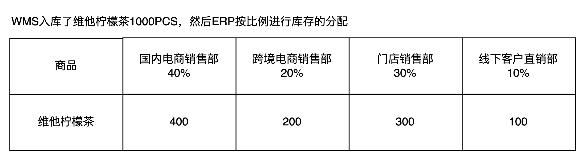
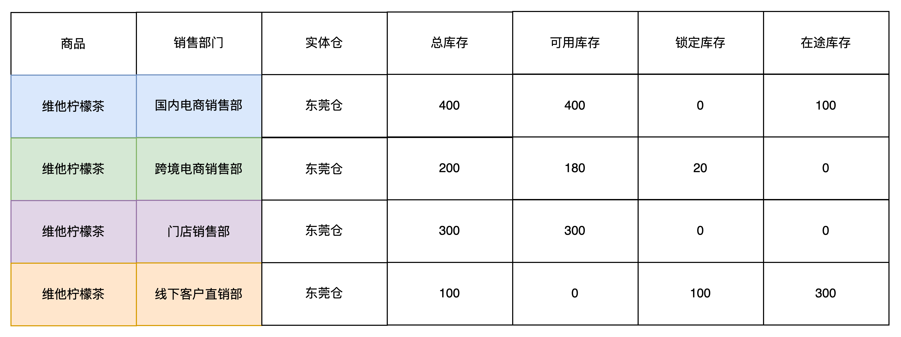
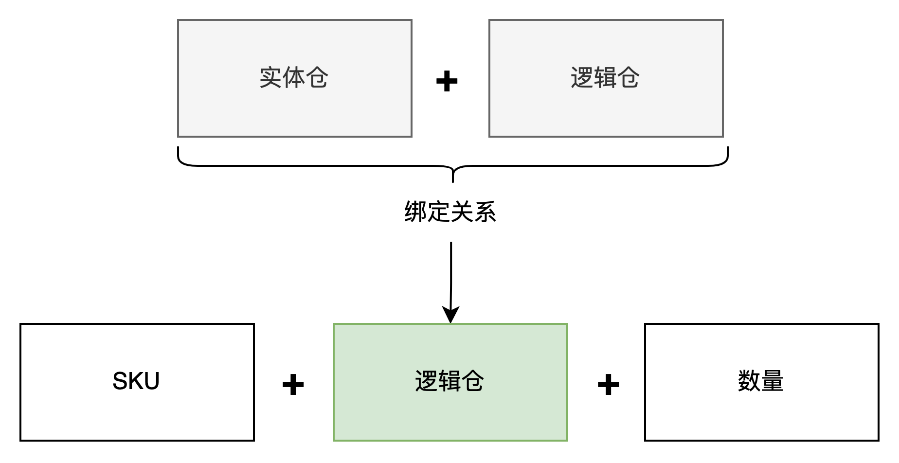
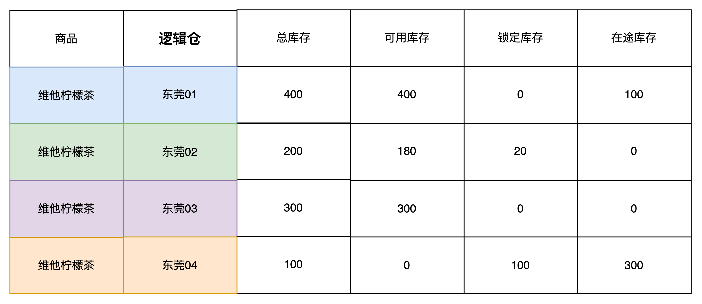
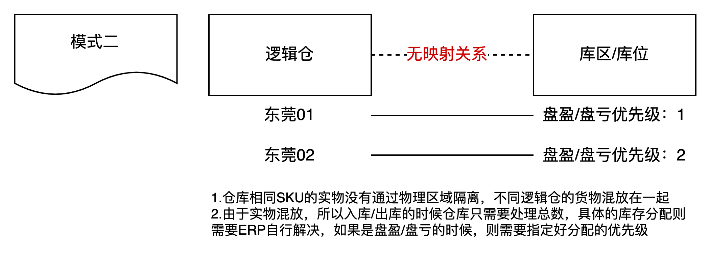
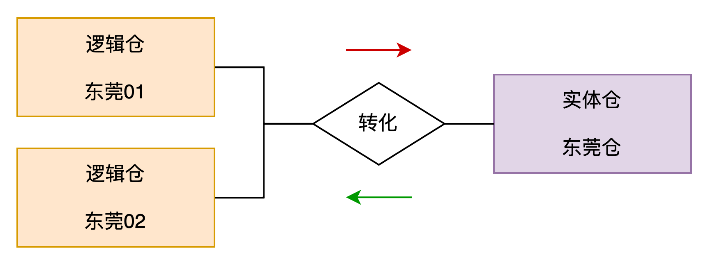
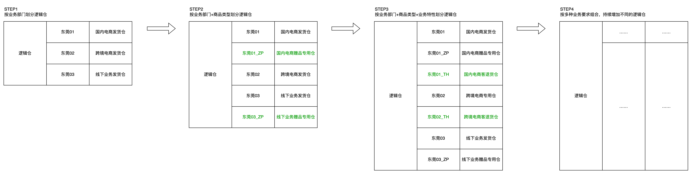

**业务背景介绍**  
仓库类型是一个很宽泛的词语，可以按照不同的分类标准而且定义出不同含义的名词。  
例如按仓库所在地域划分，可以分成国内仓和海外仓。  
例如按仓库所存放的货物的不同，可以分成原料仓，半成品仓，成品仓。  
例如按仓库的用途来划分，可以分成加工仓，中转仓，存储仓，保税仓，电商仓。  
例如按仓库的功能分类，也可以定义为中心仓，区域仓，前置仓，门店仓。  
……  
而本文的所阐述的产品类型是按照业务库存的信息化管控要求来划分的，分别是实体仓，逻辑仓和虚拟仓。  
**名词定义**  
**1.什么是实体仓？**  
实体仓的定义比较简单，就是指真实存在的仓库，这种仓库有具体的仓库名称和编码，有物理地址，有联系人信息等，属于供应链系统中最常见的“仓库”的概念。实体仓通常位于实际的物流节点，可以是公司自己拥有或租赁的仓库，也可以是第三方物流提供商的仓库。实体仓用于存储、分拣、包装和分发货物，是供应链中实际操作的环节。  
例如说某个系统中有“东莞一仓”，这是一个实体仓，通过这个仓库名称可以在系统中查询到相关的仓库基础信息，仓库中的货主信息，仓库中的库存信息等。  
**2.什么是逻辑仓？**  
逻辑仓是基于实体仓而衍生出来的概念，现实情况下一般实体仓的数量是有限的、较少的，也就意味着用“实体仓”的维度去查询一些信息的时候粒度会比较粗糙。而在实际的业务发展过程中，如果某个公司要对库存有更精细化的库存管理，那么只用“实体仓”这个字段是不够的。逻辑仓可以根据不同的需求和策略划分为不同的区域、库位或存储单元，用于管理库存和货物的流动。逻辑仓可以通过供应链管理软件进行管理，记录和跟踪库存信息、订单流程和库存变动等。逻辑仓的划分可以基于产品属性、销售渠道、地理位置等因素进行。  
例如在某个实体仓中，划分了多个区域，这不同的区域归属于同一个公司下不同的业务部门，每个部门独立占用其中一块区域作为自己的库存管理区域，常见的做法就是会引入逻辑仓。  
  

实体仓和逻辑仓

  
**3.什么是虚拟仓？**  
虚拟仓相对实体仓来说，就是虚拟的，不真实的，并不真实存在于物理空间中，而是通过系统和技术手段模拟出来的仓库概念。最容易区分的一个关键点就是：虚拟仓不需要实物管理，它只是用来记录一些数据，便于数据的流转和查询而已。  
例如说很多ERP都会定义一些“在途仓”，“中转仓”，“冻结仓”，“锁定仓”或者是直接就叫做“XX虚拟仓”，表示这个仓库不需要实物的管控，只是用来做数据的记录而已。  
**为什么需要逻辑仓？**  
很多人可能听过比较多的就是“实体仓”和“虚拟仓”，这两者比较好理解，但是关于“逻辑仓”可能就听得比较少，也有点奇怪，为什么需要这个东西？  
接下来我用一个V公司的案例，来给大家说明一下这其中的道理和逻辑。请注意，V公司不代表某个真实的公司，只是我杜撰的一个虚拟公司，用来帮助讲解业务而已。  
V公司是一家多渠道销售的贸易型公司，有国内电商销售，跨境电商销售，线下门店销售，线下客户直销等。不同的销售渠道是通过不同的业务部门来分别管理的，即销售部门分成了国内电商销售部，跨境电商销售部，门店销售部，线下客户直销部等。  
公司还有一个供应链计划的部门，会收集各个销售部门的需求，然后集中去采购。在采购的时候需要明确货物到底送到什么仓库去？然后要采购多少数量？  
在没有引入逻辑仓概念之前，一般来说采购的时候指定某个实体仓，然后数量就是汇总所有业务部门的需求。当仓库收货完成之后，然后再通过ERP进行库存的调度分配，常见的玩法就是按比例，例如说国内电商销售部占比40%，跨境电商销售部占比20%，门店销售部占比30%，线下客户直销部占比10%。  
  

  
这种方式用了一段时间之后就会发现有几个点是很容易扯皮。  
例如说某次又采购了维他柠檬茶500PCS，但是这次采购的需求是国内电商销售部和门店销售部发起的，所以应该由着两个部门来分配，但是按之前的设定好的分配比例，又把库存给到了跨境电商销售部和线下客户直销部。**这样会导致每次采购的时候，都要指定好分配的比例，操作流程会更麻烦一点点**。  
其次，当每次采购指定好了分配比例之后，采购或者销售过程中，会出现实际库存和系统账面库存不准确的情况，于是又要设定相关的比例分配的逻辑。当多了库存的时候，优先增加给谁；当少了库存的时候，优先扣减谁的；  
还有，在做库存的查询和处理的时候会比较麻烦，因为库存的切割粒度是按“商品+销售部门”来划分的，如果要统计某个商品的可用库存，锁定库存，在途库存等信息，则都需要带上“商品+销售部门”，相对来说会比较麻烦。

商品+销售部门的库存展示

  
最后，如果未来库存还需要分配给其他的部门去使用，则又要引入一个新的部门，然后涉及到分配相关的配置和业务可能都需要调整，而且这种库存的分配机制一旦引入之后，涉及的改动一般都会比较多，显然不太适合业务的拓展。  
基于上述的一些问题和现状等，行业内的大佬们逐步意识到了可以通过引入一个更加灵活拓展的字段来解决这个问题，这个字段其实就是“逻辑仓”。  
既然业务部门可能会经常变化，然后业务部门对各自库存的管理诉求也是希望能独立划分，那么干脆就引入一个“逻辑仓”来进行划分。通过“部门-逻辑仓”的配置关系，可以很灵活的划定不同的业务部门说管辖的库存范畴。  
当只有实体仓的时候，我们是通过“SKU+实体仓+数量”来划分库存的，例如说：维他柠檬茶在东莞仓中有1000个库存，则库存的展示数据如下所示。  
  

只有实体仓的时候

  
当我需要对实体仓的库存进行进一步的划分的时候，就可以引入“SKU+实体仓+虚拟仓+数量”的方式来划分库存，例如说：维他柠檬茶在「东莞仓」下的「东莞01逻辑仓」有600个库存；维他柠檬茶在「东莞仓」下的「东莞02逻辑仓」有400个库存；两个逻辑仓都是属于「东莞仓」这个实体仓，所以「东莞仓」一共是有1000个库存。  
  

当引入了实体仓+逻辑仓的时候

  
当实体仓和逻辑仓维护好了父子级关系之后，在库存展示的时候就可以隐藏实体仓了，只需要展示逻辑仓就可以通过这层关系知道背后的实体仓是什么，于是库存的展示列表如下所示：  
  

当只有逻辑仓的时候

  
根据上面3个图例的介绍，我们再来重新绘制一下“商品+销售部门的库存展示”这张图，最后改进后的展示效果如下所示：  
  

商品+逻辑仓的库存展示

  
对比两张图，似乎好像只是把“销售部门”改成了“逻辑仓”，仅仅只是一个字段的调整，但是背后的业务逻辑其实已经发生了质的变化。因为引入了逻辑仓，所以库存所关联的维度就发现了变化，而且逻辑仓又可以不受到组织结构的影响，可以自由增加和变化，同时也可以单独和仓库进行更紧密的映射关系配置，带来了诸多的好处。  
**引入的逻辑仓之后**  
当引入了逻辑仓之后，接下来就要重点考虑逻辑仓和实体仓的关联关系了，逻辑仓和实体仓的关系是怎么样的关系？逻辑仓的库存和实体仓的库存是怎么联动发生变化的？  
首先，**实体仓和逻辑仓的关系一般都1:N的关系，即一个实体仓下有多个逻辑仓**；其次，要确认逻辑仓的库存和实体仓的库存是怎么联动的，则需要提前定义好两者的“映射关系”。业内一般会有两种做法，一种是有映射关系，一种的没有映射关系。  
**有映射关系**  
第一种情况，逻辑仓和实体仓的库区/库位有映射关系。在ERP的角度，如果向「东莞01仓」采购了1000PCS的维他柠檬茶，则仓库在收货之后，会根据映射关系，上架到库区A中。同理，如果是「东莞02仓」采购了200PCS，则仓库会上架到库区B中。  
在实体仓库中，此时一共有1200PCS的维他柠檬茶，分别是在库区A和库区B。在管理的时候是物理区域隔离开的，如果说库区A的货物盘盈了或者盘亏了，那么可以根据映射关系反馈给ERP，去盘盈或者盘亏逻辑仓「东莞01」的库存。  
  

逻辑仓和实体仓的库区/库位映射

  
这种方式的优点很明显，就是可以精细化、准确地管理逻辑仓的库存，在ERP的维度可以很清晰的知道某个逻辑仓的库存到底是多少，即使是每天有高频的库存变化，也很容易追溯查账，可以大大地降低库存不准确的几率，对ERP做一些计划、调度有很大的帮助。  
而这个方案的缺点就是对仓库端的要求比较高，甚至会降低仓库的作业效率。同一个SKU，如果集中放在某个区域，某个库位，这样既可以提升库容利用率，也能提高作业的效率。但是有逻辑仓和库区/库位绑定了，如果有很多个逻辑仓，那么同一个SKU就可能会放在一个仓库的很多个库区/库位上，分的很散，不利于仓库的管理。  
**没有映射关系**  
接下来介绍的是第二种情况，即逻辑仓和实体仓的库区/库位没有映射关系。在ERP的角度，如果向「东莞01仓」采购了1000PCS的维他柠檬茶，同时也向「东莞02仓」采购了200PCS的维他柠檬茶，则仓库在收货的时候会将这1200PCS集中放在一个区域中（会混放在一起）。  
当收货/发货数量和实际的数量没有差异的时候，ERP增加/扣减对应逻辑仓的库存，而WMS就直接增加/扣减总的库存即可。但是如果收货/发货数量有差异，或者仓库中的实物存在盘盈/盘亏的时候，则需要提前指定好对应的分配逻辑，即**当多了库存的时候，优先增加给谁；当少了库存的时候，优先扣减谁的**；  
  

逻辑仓和实体仓的库区/库位没有映射关系

  
此方案的优点就是：不依赖仓库端的作业，对仓库来说，其实仓库都感知不到有多个逻辑仓的存在，仓库中所有的货物都是集中在实体仓的维度下进行管理，没有逻辑仓的概念。  
所以对应的缺点就是：ERP推送到WMS的单据中，但凡涉及到逻辑仓的内容都要转化为背后的实体仓；而实体仓作业完成之后回传数据给ERP的时候，也需要让ERP根据转化关系再裂变成多个虚拟仓。  
  

ERP和WMS的单据转化

  
**引入逻辑仓的优势**  
当引入逻辑仓之后，无论是否配置了ERP和WMS的库区/库位的映射关系，都可以带来很多便捷之处，因为逻辑仓最大的优势就是可以将多种业务的诉求融合在一起，然后用一个“逻辑仓编码”去承载。例如下图中的案例，一开始的时候只有三个逻辑仓，分别是：  
1国内电商发货仓  
2跨境电商发货仓  
3线下业务发货仓  
  

逻辑仓的演进之路

  
这几个仓库都是挂在实体仓「东莞仓」下面，随着业务的发展，财务方提出要将正常的商品和赠品分开管理，便于财务做账和对账，于是只需要在系统中配置新的逻辑仓，即国内电商赠品专用仓，线下业务赠品专用仓就可以了。此时，系统中的逻辑仓变成了：  
1国内电商发货仓  
2国内电商赠品专用仓  
3跨境电商发货仓  
4线下业务发货仓  
5线下业务赠品专用仓  
新的逻辑仓增加了之后，又过了一段时间，电商业务发生了比较多的客户退货，有一些退货是可以当作新品继续销售的，但是有一些商品是有明显的拆封痕迹，为了避免将这些“二手”的货物当作“新品”发给消费者，于是业务方决定引入新的退货仓，专门来存储客户退回的货物。只有经过了严格的检测和筛选之后才能转回到电商发货或者线下业务发货，否则就要当作二手或者残次品货物销售。于是，又要增加新的逻辑仓，即国内电商客退货仓，跨境电商客退货仓。目前系统中的逻辑仓就变成了：  
1国内电商发货仓  
2国内电商赠品专用仓  
3国内电商客退货仓  
4跨境电商发货仓  
5跨境电商客退货仓  
6线下业务发货仓  
7线下业务赠品专用仓  
从上图可知，逻辑仓可以通过根据不同的业务要求动态、灵活地响应，理论上是没有上限数量的。  
现在，我们再来回顾一下逻辑仓的定义和作用是什么，想必会有一个更深刻的认识：  
逻辑仓可以根据不同的需求和策略划分为不同的区域、库位或存储单元，用于管理库存和货物的流动。逻辑仓可以通过供应链管理软件进行管理，记录和跟踪库存信息、订单流程和库存变动等。逻辑仓的划分可以基于产品属性、销售渠道、地理位置等因素进行。  
**为什么需要虚拟仓？**  
上面解答了为什么需要逻辑仓，接下来我们再来看一下，为什么需要虚拟仓？  
虚拟仓一般在ERP或者05-OMS系统中比较常见，因为仓库是虚拟的，所以一般WMS就没有这仓库了。使用虚拟仓是因为有一些数据需要挂在仓库这个维度上，但是这个仓库又不参与实际的线下操作，所以就会引入一个“虚拟仓的概念”，来解决一些数据承载的问题。  
例如说，海外仓OMS会有一个智能选仓的功能，即上游系统通过接口推送订单给OMS。如果推送的是具体的仓库编码，则就默认为使用指定的仓库编码，如果推送的是一个虚拟仓的编码，则意味着海外仓OMS需要通过智能选仓的逻辑去动态匹配最合适的仓库。  
例如说，在多仓或者多门店之间的调拨，为了便于业务跟进调拨的过程和调拨的数量等，可以引入一个“在途仓”的概念。当发生了调拨之后，库存会先转移到在途仓中，可以通过在途仓的维度去查看到所有在途的库存，这个在途仓就是虚拟仓。  
例如说一些需要委外加工的业务，也可以将委外加工发出的材料记录在虚拟仓中，当加工完成之后，成品转移到正常的仓库中，即从虚拟仓中扣除库存，然后在正常仓中增加库存。委外加工仓也是一个虚拟仓，用来跟进一些库存数据和状态。  
例如说有一些电商ERP还会引入虚拟仓和销售渠道进行绑定和关联，已达到独享库存的效果。电商业务中会有全渠道一盘货的玩法，为了让某个销售渠道有足够的库存可以使用，可以引入虚拟仓与该渠道管理，然后将实体仓的库存分配到虚拟仓中，实现预留渠道库存的效果。如果没有和虚拟仓管理的渠道，则默认使用实体仓的库存，即大家一起共享库存。这里的虚拟仓和上面提到的逻辑仓类似，有的产品中叫作逻辑仓，有的则叫虚拟仓。  
虚拟仓不需要实物管理，它只是用来记录一些数据，便于数据的流转和查询而已。  
**总结**  
初次接触实体仓、逻辑仓和虚拟仓的概念时，其中最让人费解的就是逻辑仓，因为背后关联的一些业务比较复杂，如果不知道前因后果的话很容易被一些概念和定义给迷糊。而实体仓和虚拟仓，相对来说定义更清晰，用途也更明确，所以理解起来不会那么难。  
仓库是库存管理中最核心的一个因素，它是承载库存的一个基石，货品要放在某个地方才会产生库存，这里的“某个地方”就是指仓库。如果是实际的、具象的仓库存在，那么这个承载仓库就是指的“实体仓”；而在进销存或者其他一些简单的库存管理系统中，由于没有具体的仓库，所以会定义出一个“逻辑仓”或者“虚拟仓”。  
当一个系统中，即存在实体仓，又存在逻辑仓和虚拟仓的时候，那就要先定义好这三者的用途和区别了。根据上面的拆解，再结合具体的业务，相信大家可以很好地理清楚它们之间的关系，也能设计出适合自身业务的产品设计方案了。