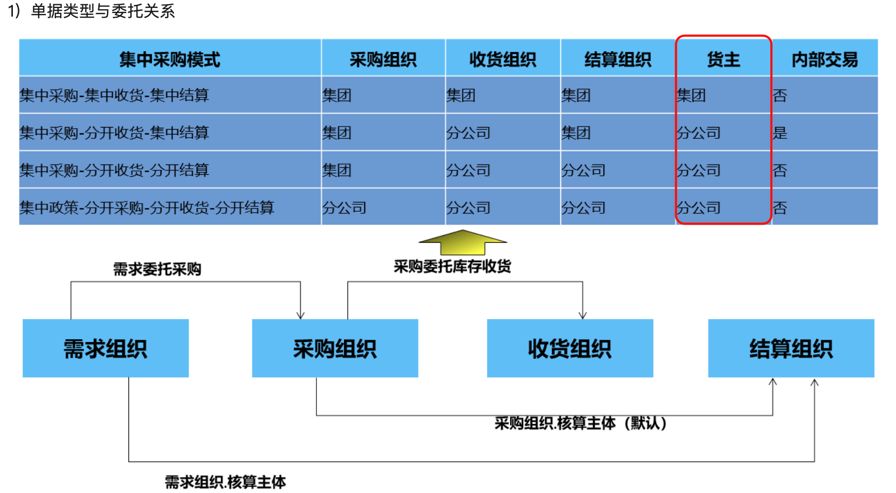
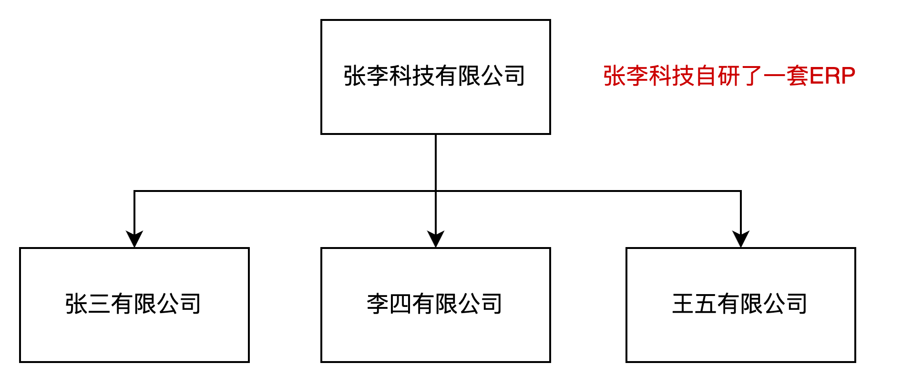
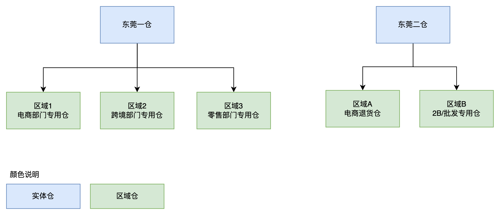
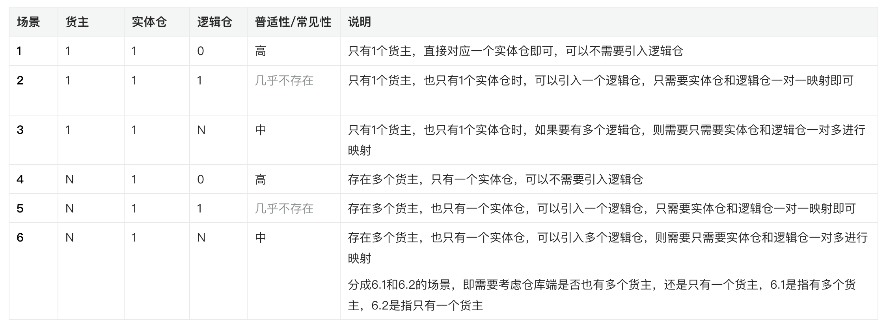
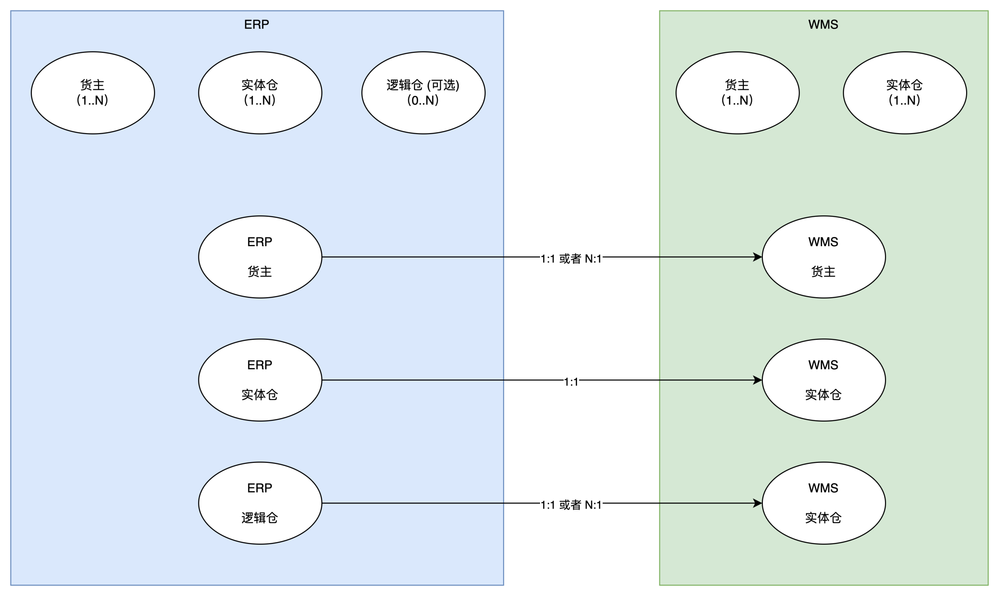
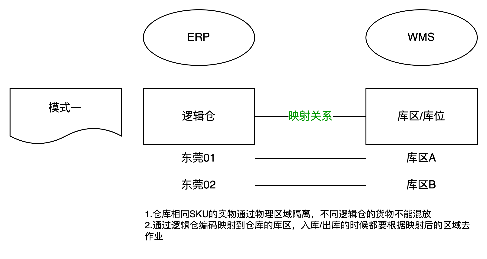
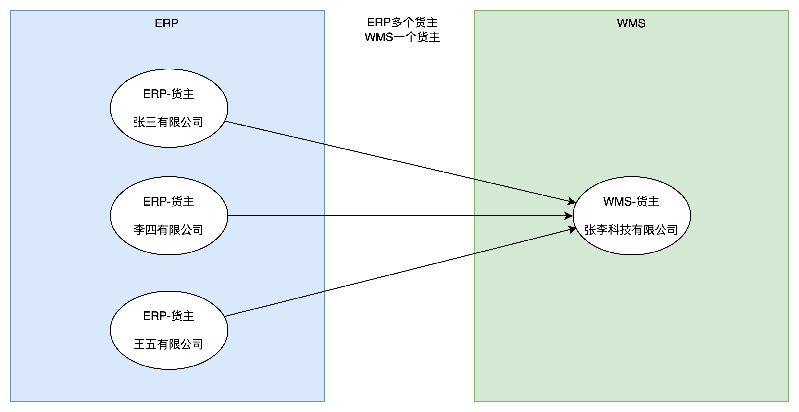
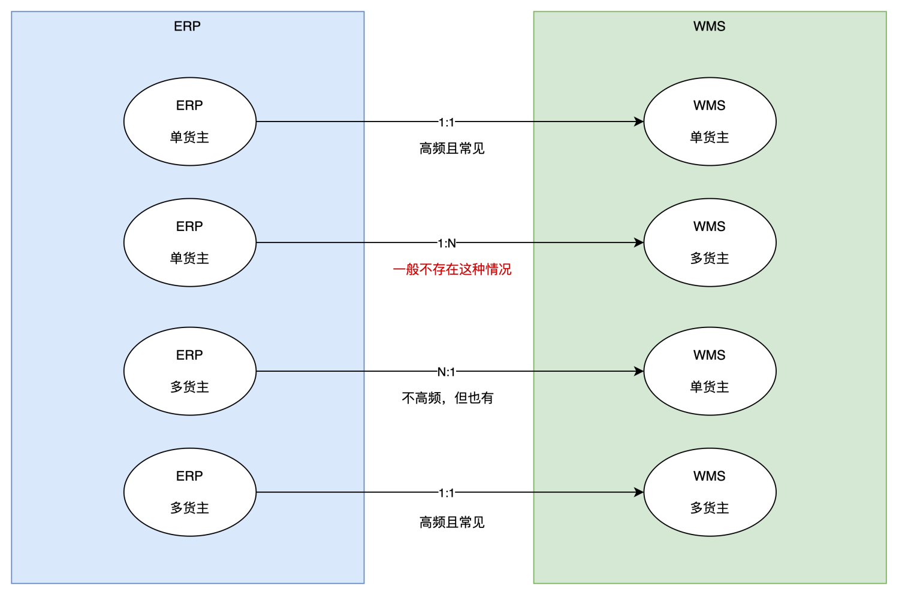
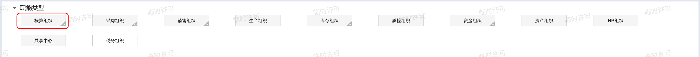
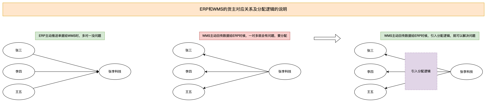

**背景**  
在2023年10月份的时候，我写了一篇名为《供应链系统中的仓库类型拆解：实体仓、逻辑仓、虚拟仓 》的文章，主要是分享了一下我对实体仓、逻辑仓、虚拟仓的一些理解和认知。  
我一直觉得大量滥用逻辑仓是一个不太优雅的、不太简洁的产品设计方案，带来的一些隐患和弊端非常之大，于是就很想要重构这一块的逻辑。过去这段时间趁着一些机会对实际的业务场景，相关的底层逻辑做了更深入的调研和研究，然后发现历史包袱想要抛弃掉估计是不太行了。但是既然都做了调研了，还是得要把一些经验、知识、感悟什么的记录下来，万一以后有机会从零开始再做一次类似的项目呢，这篇文章不就可以翻出来回顾一下么。  
**名词定义**  
**1.货主**  
货主，可以理解为“货物的拥有者”，也就是说货物归属于谁。在WMS仓储系统中，货主的定义一般比较简单纯粹，通常是在签约合作的时候就配置好货主编码，后续的作业单据中也指明相关的货主信息。但是在ERP系统或者财务结算类系统（金蝶、用友等），可能货主的概念就会复杂一些。例如说集团和分公司之间的采购模式可能会有多种，不同的采购模式对应的采购方，收货方，结算方，还有货主也是不一样。  
  

图源：金蝶ERP

  
例如“张李科技有限公司”是总公司，下面会有三个子公司，虽然这三个子公司很多业务上的操作是会一样，但是由于财务层面需要做独立核算，所以在财务核算的时候是需要做一些区分的。ERP统计不同公司（货主）的库存或者用来不同公司（货主）的库存成本的去做结算的时候，是需要严格区分货主的，因为ERP需要算清楚每一笔库存的变化，到底是属于张三，还是李四或王五。  
  

多组织架构模式下的供应链业务示例

  
  
货主的定义在不同的系统，不同的领域是会有区分的。如果在负责业财一体化相关的业务或者是多组织架构模式下的供应链业务时候，需要特别注意一下，可以参考金蝶的玩法。  
**2.实体仓**  
实体仓的定义比较简单，就是指真实存在的仓库，这种仓库有具体的仓库名称和编码，有物理地址，有联系人信息等，属于供应链系统中最常见的“仓库”的概念。实体仓通常位于实际的物流节点，可以是公司自己拥有或租赁的仓库，也可以是第三方物流提供商的仓库。实体仓用于存储、分拣、包装和分发货物，是供应链中实际操作的环节。  
例如说某个系统中有“东莞一仓”，这是一个实体仓，通过这个仓库名称可以在系统中查询到相关的仓库基础信息，仓库中的货主信息，仓库中的库存信息等。  
**3.逻辑仓**  
逻辑仓是基于实体仓而衍生出来的概念，现实情况下一般实体仓的数量是有限的、较少的，也就意味着用“实体仓”的维度去查询一些信息的时候粒度会比较粗糙。而在实际的业务发展过程中，如果某个公司要对库存有更精细化的库存管理，那么只用“实体仓”这个字段是不够的。逻辑仓可以根据不同的需求和策略划分为不同的区域、库位或存储单元，用于管理库存和货物的流动。逻辑仓可以通过供应链管理软件进行管理，记录和跟踪库存信息、订单流程和库存变动等。逻辑仓的划分可以基于产品属性、销售渠道、地理位置等因素进行。  
例如在某个实体仓中，划分了多个区域，这不同的区域归属于同一个公司下不同的业务部门，每个部门独立占用其中一块区域作为自己的库存管理区域，常见的做法就是会引入逻辑仓。  
  

实体仓和逻辑仓

  
**ERP和WMS的货主、实体仓、逻辑仓的场景初步分析**  
在多组织架构模式下，ERP系统中的货主、实体仓、逻辑仓的关联关系会有多种组合，不同组合的逻辑关系解释如下。为了简化理解，以下的推演都是建立在只有一个实体仓的情况下，暂不考虑多地多仓的情况。  
  

  
**ERP系统中存在一个货主和一个实体仓，或者是多个货主和一个实体仓的场景具有最高的普适性**。也就是无论是单货主还是多货主都会把货物存放在一个实体仓中，如果多货主存放在一个实体仓但是又需要做一些更精细化的区分时，会考虑引入逻辑仓，就会变成“**多货主+单实体仓+多逻辑仓**”的玩法。  
  

ERP和WMS的货主、仓库的关系

  
**场景1：单货主，单实体仓，无逻辑仓**  
非常高频常见，是见的最多，最常用的一种方案。  
ERP中只有一个货主，也只有一个实体仓，在创建入库单或者出库单的时候，直接下拉选择对应的货主编码或者仓库编码即可。当只有一个货主的时候，货主可以直接省略，默认程序处理逻辑的时候自带这个货主编码即可；而只有一个仓库的时候也可以这样做，但是实际上仓库一般会有多个，所以仓库一般支持灵活选择。  
**场景2：单货主，单实体仓，单逻辑仓**  
比较少见，不怎么常用的方案。  
ERP中只有一个货主，也只有一个实体仓，一般不会额外再去创建一个逻辑仓了，这样完全没必要，所以这种场景几乎不存在。  
**场景3：单货主，单实体仓，多逻辑仓**  
没有那么高频，但是对于复杂的业务场景下，一般都会选择这种方案。  
ERP中只有一个货主，也只有一个实体仓，如果需要引入逻辑仓相关的业务场景，那么就必然会创建多个逻辑仓，用来支撑相关的业务。  
例如说：实体仓是“深圳坂田仓”，但是由于业务需要区分正向采购和逆向退回的货物，那么就会引入“深圳坂田正向商品仓”和“深圳坂田逆向商品仓”，这样的逻辑仓来支撑相关的业务。  
**场景4：多货主，单实体仓，无逻辑仓**  
非常高频常见，比第一种方案稍微少一些。  
ERP中有多个货主，因为同一套公司里面可能包含了不同的集团、公司、子公司、部门等，这些都可能是货主，但是依然只有一个实体仓。而且在实物管理的时候，这些不同的货主都会具有相同的商品。  
当出现这种情况，仓库端一般会选择也创建多个货主，这样可以和ERP的货主对应上。此时在仓库端的库存是：**张三+iPhone15+深圳坂田仓，李四+iPhone15+深圳板田仓**  
而在ERP端的库存也是：**张三+iPhone15+深圳坂田仓，李四+iPhone15+深圳板田仓**……  
这样在实体仓中，可以通过货主来区分具体的商品到底是哪个货主的，用来计算库存也会更加简单方便。  
**场景5：多货主，单实体仓，单逻辑仓**  
比较少见，不怎么常用的方案。  
ERP中有多个货主，也只有一个实体仓，一般不会额外再去创建一个逻辑仓了，这样完全没必要，所以这种场景几乎不存在。  
**场景6：多货主，单实体仓，多逻辑仓**  
没有那么高频，但是对于复杂的业务场景下，一般都会选择这种方案。  
ERP中有多个货主，因为同一套公司里面可能包含了不同的集团、公司、子公司、部门等，这些都可能是货主。当只有一个实体仓的时候，如果又要引入逻辑仓相关的业务场景，那么就必然会创建多个逻辑仓，用来支撑相关的业务。  
此时可能会有6.1和6.2的玩法区分：  
●6.1就是仓库还是会创建多货主；  
●6.2则是仓库只有一个货主；  
当选择了6.1的方案时，实体仓是“深圳坂田仓”，但是由于业务需要区分正向采购和逆向退回的货物，那么就会引入“深圳坂田正向商品仓”和“深圳坂田正向商品仓”，这样的逻辑仓来支撑相关的业务。  
此时，在仓库端的库存查询是：**张三+iPhone15+深圳坂田仓，李四+iPhone15+深圳板田仓**……  
而在ERP中，查询库存的时候是：**张三+iPhone15+深圳坂田正向商品仓，李四+iPhone15+深圳坂田正向商品仓**……  
当选择了6.2的方案时，实体仓是“深圳坂田仓”，但是由于业务需要区分正向采购和逆向退回的货物，那么就会引入“深圳坂田正向商品仓”和“深圳坂田正向商品仓”，这样的逻辑仓来支撑相关的业务。不过此时，仓库端只有一个货主，所以在仓库端的库存查询是：**签约货主+iPhone15+深圳坂田仓**……  
而在ERP中，查询库存的时候是：**张三+iPhone15+深圳坂田正向商品仓，李四+iPhone15+深圳坂田正向商品仓**……  
这种方案下，仓库端只有一个货主，而ERP有多个货主，当仓库端主动发起一些库存变动时，则ERP需要经常性去做“货主分配”的操作，因为一对多的场景下，“一”方主动反馈数据，“多”方是需要指定分配去接收的。  
  

ERP多货主和WMS单货主关系

  
**多种场景的具体分析和库存结构推演**  
**1）场景1：单货主，单实体仓，无逻辑仓**  
这种场景的业务模式是最简单的，哪怕是有异地多仓，ERP也可以很轻松就统计出多仓的库存情况。一般适用于业务模式单一的场景，例如说进销存，自建电商系统，简单的ERP，海外仓业务等系统就会使用这种方案。  
ERP层面的库存展示如下所示：  
  

| **货主** | **商品** | **仓库** | **总库存** | **说明** |  |
| --- | --- | --- | --- | --- | --- |
| 张三 | iPhone15 | 深圳坂田仓 | 100 | 此处的仓库指的就是实体仓，ERP的仓库编码和WMS的仓库编码保持一致 |  |
| 张三 | 红米K70 PRO | 深圳坂田仓 | 200 |  |  |
| 张三 | iPhone15 | 东莞凤岗仓 | 90 |  | 如果ERP使用了多个实体仓，则在ERP层面可以统计出所有的实体仓的库存，ERP的仓库编码和WMS的仓库编码依然是保持一致 |
| 张三 | 荣耀X100 | 东莞凤岗仓 | 300 |  |  |

WMS层面的库存展示如下所示：  
  

| **货主** | **商品** | **仓库** | **总库存** | **说明** |
| --- | --- | --- | --- | --- |
| 张三 | iPhone15 | 深圳坂田仓 | 100 | 此处的仓库是指WMS中的实体仓 引入了不同的实体仓后 |
| 张三 | 红米K70 PRO | 深圳坂田仓 | 200 |  |
| 张三 | iPhone15 | 东莞凤岗仓 | 90 |  |
| 张三 | 荣耀X100 | 东莞凤岗仓 | 300 |  |

**2）场景2：单货主，单实体仓，单逻辑仓**  
此场景几乎不存在，不具有什么分析的价值，一般要引入逻辑仓的时候一定是会多个，而不会只有一个，所以此处直接跳过相关的拆解分析。  
**3）场景3：单货主，单实体仓，多逻辑仓**  
当ERP系统有多个逻辑仓的时候，逻辑仓需要和实体仓配置好对应的关系，然后在库存表中一般只需要使用逻辑仓即可。可以通过置逻辑仓，去找到背后对应的实体仓，然后推送单据到具体的实体仓中。ERP中的实体仓编码和WMS的仓库编码保持一致，或者也可以不一致，通过一对一映射的方式解决即可。  
如果ERP使用了多个实体仓，则每一个实体仓都要映射相应的逻辑仓，最后会形成N\*M的个逻辑仓。日常业务还是用逻辑仓，实体仓只是ERP和外部03-WMS系统对接时使用的。  
ERP层面的库存展示如下所示：  
  

| **货主** | **商品** | **实体仓** | **逻辑仓** | **总库存** | **说明** |  |
| --- | --- | --- | --- | --- | --- | --- |
| 张三 | iPhone15 | 深圳坂田仓 | 深圳坂田正向商品仓 | 90 | 此处系统会有逻辑仓和实体仓两个字段，日常业务使用的是逻辑仓，而系统则需要通过配置映射关系，去设置逻辑仓背后对应的实体仓 ERP中的实体仓编码和WMS的仓库编码保持一致，或者也可以不一致，通过一对一映射的方式解决 |  |
| 张三 | iPhone15 | 深圳坂田仓 | 深圳坂田逆向商品仓 | 10 |  |  |
| 张三 | 红米K70 PRO | 深圳坂田仓 | 深圳坂田线下专供仓 | 200 |  |  |
| 张三 | iPhone15 | 东莞凤岗仓 | 东莞凤岗退供仓 | 30 |  | 如果ERP使用了多个实体仓，则每一个实体仓都要映射相应的逻辑仓，日常业务还是用逻辑仓，实体仓只是系统内部处理时用来和外部系统对接的 |
| 张三 | iPhone15 | 东莞凤岗仓 | 东莞凤岗出口仓 | 10 |  |  |
| 张三 | iPhone15 | 东莞凤岗仓 | 东莞凤岗正向商品仓 | 40 |  |  |
| 张三 | iPhone15 | 东莞凤岗仓 | 东莞凤岗逆向商品仓 | 10 |  |  |
| 张三 | 荣耀X100 | 东莞凤岗仓 | 东莞凤岗正向商品仓 | 300 |  |  |

WMS层面的库存展示如下所示：  
  

| **货主** | **商品** | **实体仓** | **区域/库区** | **总库存** | **说明** |  |
| --- | --- | --- | --- | --- | --- | --- |
| 张三 | iPhone15 | 深圳坂田仓 | 良品区 | 90 | 在WMS的层面，一般不会有逻辑仓，但是会有区域，库区，库位，库存品级/商品状态等，简单来说就是仓库是通过这些东西来划分不同的商品库存情况，然后决定相关的用途的 |  |
| 张三 | iPhone15 | 深圳坂田仓 | 逆向良品区 | 10 |  |  |
| 张三 | 红米K70 PRO | 深圳坂田仓 | 良品区 | 200 |  |  |
| 张三 | iPhone15 | 东莞凤岗仓 | 待退货区 | 30 |  | 也存在仓库端划分不到那么细节，而是要ERP自己进行分配和处理的场景。例如说：仓库没有专门的正向商品仓、线下专供仓，也没有出口仓，这些货物可能都是放在“良品区”，所以就需要ERP自行对这些区域的库存进行分配和处理 |
| 张三 | iPhone15 | 东莞凤岗仓 | 良品区 | 50（10+40） |  |  |
| 张三 | iPhone15 | 东莞凤岗仓 | 逆向良品区 | 10 |  |  |
| 张三 | 荣耀X100 | 东莞凤岗仓 | 良品区 | 300 |  |  |

**4）场景4：多货主，单实体仓，无逻辑仓**  
当ERP引入了多货主之后，ERP层面只是在库存维度上再增加一个新货主即可，但是一般仓库端会有两种情况：  
1单货主，即仓库和ERP的一个货主签约了，一般会和ERP的一个总公司/结算主体签约，例如下图中的张李科技；  
2多货主，即仓库和ERP的多个货主签约了，一般是ERP有几个货主，仓库也是有几个货主；  
当仓库端只有一个单货主，而ERP有多货主时，ERP是按具体的货主来分别统计库存，而WMS端则是按单个签约的货主统计库存，两者并不是一一对应的，涉及到库存的分配逻辑。  
ERP层面的库存展示如下所示：  
  

| **货主** | **商品** | **仓库** | **总库存** | **说明** |  |
| --- | --- | --- | --- | --- | --- |
| 张三 | iPhone15 | 深圳坂田仓 | 100 | 此处的仓库指的就是实体仓，ERP的仓库编码和WMS的仓库编码保持一致 如果ERP使用了多个实体仓，则在ERP层面可以统计出所有的实体仓的库存，ERP的仓库编码和WMS的仓库编码依然是保持一致 |  |
| 张三 | 红米K70 PRO | 深圳坂田仓 | 200 |  |  |
| 张三 | iPhone15 | 东莞凤岗仓 | 90 |  |  |
| 张三 | 荣耀X100 | 东莞凤岗仓 | 300 |  |  |
| 李四 | iPhone15 | 深圳坂田仓 | 99 |  | 引入了多货主之后，ERP层面只是在库存维度上再增加一个新货主即可，而一般仓库端会有两种情况：1.单货主 / 2.多货主 这一块的分析在下面会重点拆解 |
| 李四 | iPhone15 | 东莞凤岗仓 | 200 |  |  |
| 李四 | 荣耀X100 | 东莞凤岗仓 | 10 |  |  |

WMS层面的库存展示，会因为单货主或多货主的情景而有所不同，具体如下所示：  
  

| **货主** | **商品** | **仓库** | **总库存** | **说明** |
| --- | --- | --- | --- | --- |
| 张李科技 | iPhone15 | 深圳坂田仓 | 199（100+99） | 如果WMS使用了单货主，那么意味着ERP只和仓库签约了一个货主（张李科技） 所以WMS的货主（张李科技）+商品+仓库的库存，会等于ERP的张三货主+商品+仓库的库存，再加上李四货主+商品+仓库的库存之和 |
| 张李科技 | 红米K70 PRO | 深圳坂田仓 | 200 |  |
| 张李科技 | iPhone15 | 东莞凤岗仓 | 290（90+200） |  |
| 张李科技 | 荣耀X100 | 东莞凤岗仓 | 310（300+10） |  |

| **货主** | **商品** | **仓库** | **总库存** | **说明** |
| --- | --- | --- | --- | --- |
| 张三 | iPhone15 | 深圳坂田仓 | 100 | 如果WMS使用了多货主的，那么就会和ERP的货主一一对应，所以库存情况也是一一对应的 此处的仓库是指WMS中的实体仓，仓库中的货主是多货主，即和仓库签约了2个货主，分别是张三和李四 |
| 张三 | 红米K70 PRO | 深圳坂田仓 | 200 |  |
| 张三 | iPhone15 | 东莞凤岗仓 | 90 |  |
| 张三 | 荣耀X100 | 东莞凤岗仓 | 300 |  |
| 李四 | iPhone15 | 深圳坂田仓 | 99 |  |
| 李四 | iPhone15 | 东莞凤岗仓 | 200 |  |
| 李四 | 荣耀X100 | 东莞凤岗仓 | 10 |  |

**5）场景5：多货主，单实体仓，单逻辑仓**  
此场景几乎不存在，不具有什么分析的价值，一般要引入逻辑仓的时候一定是会多个，而不会只有一个，所以此处直接跳过相关的拆解分析。  
**6）场景6.1：多货主，单实体仓，多逻辑仓，且仓库端也是多货主**  
和场景3相比，ERP增加了多货主的场景，也就是说ERP端会有多货主，然后WMS端也会有多个货主，一般两者都是一一对应的。同时又引入了多逻辑仓，所以ERP也需要把逻辑仓和实体仓配置好对应的关系，日常业务还是使用逻辑仓，但是需要和外部03-WMS系统交互的时候再使用实体仓。  
ERP层面的库存展示如下所示：  
  

| **货主** | **商品** | **实体仓** | **逻辑仓** | **总库存** | **说明** |  |  |
| --- | --- | --- | --- | --- | --- | --- | --- |
| 张三 | iPhone15 | 深圳坂田仓 | 深圳坂田正向商品仓 | 90 | 此处系统会有逻辑仓和实体仓两个字段，日常业务使用的是逻辑仓，而系统则需要通过配置映射关系，去设置逻辑仓背后对应的实体仓。 ERP中的实体仓编码和WMS的仓库编码保持一致，或者也可以不一致，通过一对一映射的方式解决 |  |  |
| 张三 | iPhone15 | 深圳坂田仓 | 深圳坂田逆向商品仓 | 10 |  |  |  |
| 张三 | 红米K70 PRO | 深圳坂田仓 | 深圳坂田线下专供仓 | 200 |  |  |  |
| 张三 | iPhone15 | 东莞凤岗仓 | 东莞凤岗退供仓 | 30 |  | 如果ERP使用了多个实体仓，则每一个实体仓都要映射相应的逻辑仓，日常业务还是用逻辑仓，实体仓只是系统内部处理时用来和外部系统对接的 |  |
| 张三 | iPhone15 | 东莞凤岗仓 | 东莞凤岗出口仓 | 10 |  |  |  |
| 张三 | iPhone15 | 东莞凤岗仓 | 东莞凤岗正向商品仓 | 40 |  |  |  |
| 张三 | iPhone15 | 东莞凤岗仓 | 东莞凤岗逆向商品仓 | 10 |  |  |  |
| 张三 | 荣耀X100 | 东莞凤岗仓 | 东莞凤岗正向商品仓 | 300 |  |  |  |
| 李四 | iPhone15 | 深圳坂田仓 | 深圳坂田正向商品仓 | 100 |  |  | 在库存层面增加了一个货主（李四），其他做单页面也需要调整，支持选择不同的货主 |
| 李四 | 红米K70 PRO | 东莞凤岗仓 | 东莞凤岗线下专供仓 | 50 |  |  |  |

WMS层面的库存展示如下所示：  
  

| **货主** | **商品** | **实体仓** | **区域/库区** | **总库存** | **说明** |
| --- | --- | --- | --- | --- | --- |
| 张三 | iPhone15 | 深圳坂田仓 | 良品区 | 90 | 在WMS的层面，一般不会有逻辑仓，但是会有区域，库区，库位，库存品级/商品状态等，简单来说就是仓库是通过这些东西来划分不同的商品库存情况，然后决定相关的用途的。 也存在仓库端划分不到那么细节，而是要ERP自己进行分配和处理的场景。例如说：仓库没有专门的正向商品仓、线下专供仓，也没有出口仓，这些货物可能都是放在“良品区”，所以就需要ERP自行对这些区域的库存进行分配和处理。 仓库中的货主是多货主，即和仓库签约了2个货主，分别是张三和李四 |
| 张三 | iPhone15 | 深圳坂田仓 | 逆向良品区 | 10 |  |
| 张三 | 红米K70 PRO | 深圳坂田仓 | 良品区 | 200 |  |
| 张三 | iPhone15 | 东莞凤岗仓 | 待退货区 | 30 |  |
| 张三 | iPhone15 | 东莞凤岗仓 | 良品区 | 50（10+40） |  |
| 张三 | iPhone15 | 东莞凤岗仓 | 逆向良品区 | 10 |  |
| 张三 | 荣耀X100 | 东莞凤岗仓 | 良品区 | 300 |  |
| 李四 | iPhone15 | 深圳坂田仓 | 良品区 | 100 |  |
| 李四 | 红米K70 PRO | 东莞凤岗仓 | 良品区 | 50 |  |

ERP中有两个货主分别是张三和李四，然后在WMS端也是有两个货主，分别是张三和李四；ERP中有多个逻辑仓，而WMS中就会有相应的区域/库区去做区分。  
在上一篇文章《供应链系统中的仓库类型拆解：实体仓、逻辑仓、虚拟仓》讲过，当引入了逻辑仓之后，要确认逻辑仓的库存和实体仓的库存是怎么联动的，则需要提前定义好两者的“映射关系”。业内一般会有两种做法，一种是有映射关系，一种的没有映射关系。上图中演示的就是有映射关系的做法。  
  

逻辑仓和实体仓的库区/库位映射

  
**7）场景6.2：多货主，单实体仓，多逻辑仓，且仓库端是单货主**  
和场景6.1相比，最大的区别就是仓库端的货主的单货主，6.2的场景下意味着ERP端是多货主，而WMS端则是单货主，需要做多对一的映射关系。多逻辑仓的业务模式还是保持一致，日常业务还是使用逻辑仓，但是需要和外部03-WMS系统交互的时候再使用实体仓。  
  

| **货主** | **商品** | **实体仓** | **逻辑仓** | **总库存** | **说明** |  |
| --- | --- | --- | --- | --- | --- | --- |
| 张三 | iPhone15 | 深圳坂田仓 | 深圳坂田正向商品仓 | 90 | 此处系统会有逻辑仓和实体仓两个字段，日常业务使用的是逻辑仓，而系统则需要通过配置映射关系，去设置逻辑仓背后对应的实体仓。 ERP中的实体仓编码和WMS的仓库编码保持一致，或者也可以不一致，通过一对一映射的方式解决 如果ERP使用了多个实体仓，则每一个实体仓都要映射相应的逻辑仓，日常业务还是用逻辑仓，实体仓只是系统内部处理时用来和外部系统对接的 |  |
| 张三 | iPhone15 | 深圳坂田仓 | 深圳坂田逆向商品仓 | 10 |  |  |
| 张三 | 红米K70 PRO | 深圳坂田仓 | 深圳坂田线下专供仓 | 200 |  |  |
| 张三 | iPhone15 | 东莞凤岗仓 | 东莞凤岗退供仓 | 30 |  |  |
| 张三 | iPhone15 | 东莞凤岗仓 | 东莞凤岗出口仓 | 10 |  |  |
| 张三 | iPhone15 | 东莞凤岗仓 | 东莞凤岗正向商品仓 | 40 |  |  |
| 张三 | iPhone15 | 东莞凤岗仓 | 东莞凤岗逆向商品仓 | 10 |  |  |
| 张三 | 荣耀X100 | 东莞凤岗仓 | 东莞凤岗正向商品仓 | 300 |  |  |
| 李四 | iPhone15 | 深圳坂田仓 | 深圳坂田正向商品仓 | 100 |  | 在库存层面增加了一个货主（李四），其他做单页面也需要调整，支持选择不同的货主 |
| 李四 | 红米K70 PRO | 东莞凤岗仓 | 东莞凤岗线下专供仓 | 50 |  |  |

WMS层面的库存展示如下所示：  
  

| **货主** | **商品** | **实体仓** | **区域/库区** | **总库存** | **说明** |
| --- | --- | --- | --- | --- | --- |
| 张李科技 | iPhone15 | 深圳坂田仓 | 良品区 | 190（100+90） | 此处的仓库是指WMS中的实体仓，仓库中的货主是单货主，即只和仓库签约了一个货主（张李科技） 在WMS的层面，一般不会有逻辑仓，但是会有区域，库区，库位，库存品级/商品状态等，简单来说就是仓库是通过这些东西来划分不同的商品库存情况，然后决定相关的用途的。 也存在仓库端划分不到那么细节，而是要ERP自己进行分配和处理的场景。例如说：仓库没有专门的正向商品仓、线下专供仓，也没有出口仓，这些货物可能都是放在“良品区”，所以就需要ERP自行对这些区域的库存进行分配和处理。 |
| 张李科技 | iPhone15 | 深圳坂田仓 | 逆向良品区 | 10 |  |
| 张李科技 | 红米K70 PRO | 深圳坂田仓 | 良品区 | 200 |  |
| 张李科技 | iPhone15 | 东莞凤岗仓 | 待退货区 | 30 |  |
| 张李科技 | iPhone15 | 东莞凤岗仓 | 良品区 | 50（40+10） |  |
| 张李科技 | iPhone15 | 东莞凤岗仓 | 逆向良品区 | 10 |  |
| 张李科技 | 荣耀X100 | 东莞凤岗仓 | 良品区 | 300 |  |
| 张李科技 | 红米K70 PRO | 东莞凤岗仓 | 良品区 | 50 |  |

ERP中有两个货主分别是张三和李四，然后在WMS端只有单个货主，即张李科技。意味着仓库只和ERP的一个货主签约了，一般会和ERP的一个总公司/结算主体签约，例如上图中的张李科技。  
  

ERP多货主和WMS单货主关系

  
**ERP端多货主&仓库端单/多货主的对比**  
ERP的货主可以是单个或者多个，WMS的货主也可以是单个或者多个，所以组合之后就是2\*2=4种关系。  
ERP是单货主，WMS也是单货主，这种没什么优劣势之分，就是最常用的方案，所以不做分析。同时ERP是单货主，但是WMS的多货主，这种情况一般不存在，所以也不做分析。  
所以剩下要分析对比的就是**ERP是多货主，WMS是单货主或者WMS也是多货主**这两种情况，由于这两种场景各有优劣，不同的公司/团队中在选择的时候往往也会产生一些分歧和争议，所以应该重点分析对比这两种情况。  
●ERP是多货主，WMS也是多货主，则成为：一对一关系；  
●ERP是多货主，WMS的单货主，简称为：多对一关系；  
  

  
**为什么会有多货主？**  
ERP存在多个货主的时候，往往是因为同一个集团公司下，会有不同的子集团、子公司、分公司等，这些组织在金蝶的体系下都称之为“业务单元”，然后如果这些“业务单元”要支持结算的话，就会被定义为“结算组织”。  
  

金蝶的业务单元创建

  
为了降低大家的理解成本，可以先不考虑这些概念或者名词定义，**简单来说就是：一款自研型ERP，内部涉及到多个公司，多个主体，这些主体在财务层面需要分开结算**。  
张李科技有限公司是总公司，下面会有三个子公司，这三个子公司需要分开核算，虽然很多业务上的操作是会一样，但是财务层面的结算时需要区分。ERP在统计不同公司（货主）的库存，或者用来不同公司（货主）的库存成本的去做结算的时候，是需要严格区分货主的，因为ERP需要算清楚每一笔库存的变化，到底是属于张三，还是李四或王五。  
  

  
**一对一的场景**  
ERP上有多个货主，如果此时对接的外部仓库也有多个货主，那么无论是ERP主动推送单据给仓库，还是仓库主动发起一些库存变更给ERP，都可以在单据上带上“货主”字段，这样双方核对数据，业务往来等，都是最简单，最轻松的，所以这个方案也是最多选择的。  
但是这个方案自然也会有弊端，它最大的弊端就是：**仓库存在多货主，会增加仓库作业的成本，带来了一些额外的支出。**  
1对接外部仓库的时候，需要和外部仓库签约，此时就需要签约多个主体，然后维护多份数据。这个改造的成本也不是很大，只是稍微麻烦了一点点；  
2仓库有多货主的情况下，如果要给仓库下销售单，那么就要明确给出具体是要出哪个货主的货，这些货物可能都是送到同一个地点，此时就要仓库支持多货主的出库货物合并打包，然后统一送到一个地点。这种包裹合并发货的功能，一些大仓库也是支持的，不过会增加一定的操作成本；  
3张三、李四、王五的货物可能都是相同的，这个时候仓库端在管理这些库存的时候需要考虑哪些可以混货主存放，哪些不能混货主存放，无形中会增加库存占用空间，同时仓库在作业的时候也要时刻去区分不同的货主，会带来一定的操作成本增加；  
4仓库使用了多货主之后，在后续对账、核对的时候，工作量也可能会翻倍，尤其是如果公司并不需要在实物层严格区分货主的时候，这种操作就比较麻烦了。  
综合上述分析可知，如果多货主的商品、业务模式等比较雷同，那么会出现大量的重复性操作，此时如果仓库端还是使用多货主模式去管理，就会增加没必要的成本，反而会带来效率的降低。所以这种方案比较适合于：  
**多货主的商品，业务模式都不太一样，而且希望能在实物层严格区分管理的业务场景下。**  
**多对一的场景**  
分析完了上述的一对一的场景，接下来可以看看多对一的玩法是怎么样的。ERP上还是有多个货主，但是和外部仓库签约的时候，只签约一个主体，相当于在仓库端其实只有一个货主。这样就会构成多对一的情况，ERP的多货主，WMS是单货主。  
这种方案的优势其实就是“一对一场景”的劣势，它适用于：  
**多货主的商品、业务模式都很一样，在业务操作层基本上不需要特殊区分，只是财务/账务层面要做库存的区分而已。**  
采用这种方案之后，ERP可以按多货主的逻辑去建单，去操作，然后推送给到WMS之后，WMS只有一个货主，只有一种操作逻辑和管理要求，可以有效地节省操作成本，同时也降低了一些管理的复杂度。  
而采用了这种方案之后，最大的弊端就是需要ERP做大量的“**分配货主**”的功能，需要业务定好清晰的规则，同时系统也要能比较完善地支撑这些需求。在多对一的场景下，若“多方”发起单据，“一方”是可以直接接收并处理的；而如果是反过来，“一方”发起单据，“多方”是不能直接接收并处理的，因为不知道具体是谁来处理，所以就需要**制定好分配逻辑**。  
  

  
如果是仓库端（一方）主动发起的单据，ERP端（多方）去接收的时候，都会涉及到分配的逻辑：  
1仓库端发现破损/丢失，主动发起盘亏或者发起盘盈，需要分配货主；  
2仓库端对商品库存的状态进行变更，例如正常转临期，临期转过期，正品转次品等，需要分配货主；  
3仓库端发起的对库存的变更，调整，ERP端如果需要记录和知晓的，都需要分配货主；  
结合上面的分析可以知道，多对一的场景下，WMS侧的操作相对来说会简单清晰很多，比较利于节省成本和提升仓库的作业效率，而对应的弊端就是会存在一些实物和系统库存不能精确匹配，在库存逻辑数量层面需要强依赖信息化系统（ERP）的分配策略。  
所以如果采用了此方案，那么对于ERP端来说一方面要做好和仓库端的接口对接，把仓库端的一些核心库存信息都抓取回来，包含但不限于：商品质量情况（良品，不良品），生产日期，失效日期，生产批号，商品关联的单号等。另一方面也要制定好完善的多货主库存分配逻辑，明确在什么场景下先增加/扣减哪个货主的库存，然后扣减的库存关联的颗粒度是什么维度，例如“货主+SKU”，“货主+SKU+批次”，“货主+SKU+批次+序列号”……  
**总结**  
供应链系统中的货主和仓库都是非常基础且常见的概念，但是在不同的业务场景下，不同的系统逻辑下，会有很多种不同的玩法，让我时常有一种“看山是山，看山不是山”的感觉。  
早期做海外仓的时候，货主和仓库的逻辑都很简单，后面陆续接触了ERP之后发现货主和仓库其实也可以做得比较复杂，定义更加细分，最后通过一些调研并输出了这一篇文章之后，我感觉这里其实依然还有很多地方可以做文章。  
以上的内容更多是作为一个业务调研和方案调研之后的推演结果记录和思考，其中有一些方案是工作中已经接触过，并且知道了优势和弊端是什么的。而有一些则是根据当前的采用的模式去反推的另一种可能解法，只是推演而已，所以一些优劣势分析可能还不够全面，也不够精细化……  
非常希望有相关实践经验的朋友看完文章之后，可以一起交流、讨论、互相学习一波。  
供应链之路，道阻且长，期待更多同行者一起交流学习……