在之前的文章中，我陆续分享过OMS的批次管理和WMS的批次管理

  
在实际的工作中，除了WMS和OMS的批次管理外，还有ERP也会有对应的批次管理，所以今天这篇文章来给大家讲讲关于ERP的批次管理。  
如果之前做过WMS相关的项目，那么再上手去做ERP的批次管理，相对来说上手会比较快，更有画面感一些；如果你之前没接触过WMS相关的项目，第一个接触的就是ERP相关的内容，那么最好先去了解一下仓库端关于批次管理的一些实操案例，加强一些画面感，会对后续做ERP的批次管理有一个比较明显的帮助。  
**WMS/OMS/ERP的定义和关联关系**  
OMS和ERP算是比较容易有歧义的两个系统，主要的原因就是因为在不同领域、不同业务场景中，这两个系统所表达的意思和侧重的场景都不太一样，所以大家对这两个系统的理解和认知是不一样的，所以我先做一个基础的铺垫介绍，防止大家在看后续文章的时候出现一些认知上的偏差。  
WMS，是"Warehouse Management System"的缩写，即仓库管理系统。03-WMS系统通过对仓库内的物资进行准确、高效的入库、出库和库存管理，帮助企业实现仓库的自动化、智能化管理，从而提升仓库运营效率、降低运营成本。  
OMS，是“Order Management System”的缩写，即订单管理系统。需要注意，OMS在不同的公司，不同的行业和领域中会有不同的定义，这里说的OMS其实是指WMS客户端，也就是给WMS的货主/客户所使用的一套客户端。用户可以OMS上维护商品，创建入库单，出库单，查看库存，并且将相关的单据提交给WMS去执行。  
ERP，是"Enterprise Resource Planning"的缩写，即企业资源计划。ERP系统在不同领域，不同行业中大家的认知和理解也不太一样。文章中所提到的ERP，是指“电商ERP”这类业务导向型的ERP，最常见和高频的业务有：商品管理，采购订单，销售订单，仓储管理，物流管理等。  
  

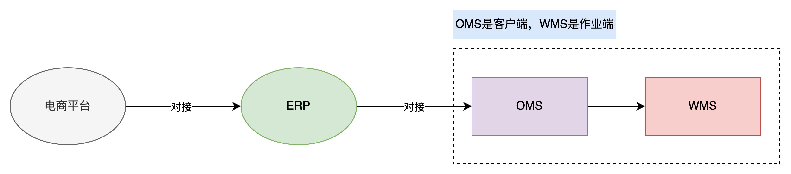

三个系统的关联关系

  
**什么是批次？批次管理有什么用？**  
在供应链系统中，我们经常会用“批次号”来表示：相同的SKU但是两者之间有细微区别，需要通过批次号来区分管理或对待。  
如果单独来看批次号的话，它就是一个自增的流水号而已，没有什么特殊的意义。例如说：  
●20240415-01，就是2024年04月15日的第一批  
●20240415-02，就是2024年04月15日的第二批  
●20240415-03，就是2024年04月15日的第三批  
●……  
我们在聊批次号的时候，往往是说“某个SKU的批次号”，“某个SKU的批次”，所以SKU和批次号是需要关联起来的，这样才有实际的价值和意义。  
  

  
当我们提及到批次管理的时候，大家更多会想到的是仓储管理有关的内容，例如说先进先出，效期管理，库龄统计等，以至于会有很多人觉得批次管理好像只是和WMS有关系，只是和仓库有关系。  
**但是实际情况下并非如此，供应链管理是需要上下游紧密合作的，相关的供应链系统之间也会有频繁和密切的数据传输、交互等。**  
以“电商ERP”为例，在电商ERP中也有很多个模块、业务场景，是要对批次管理的，要对批次相关的信息做维护，配置，接收、使用等，接下来就让我们一起来看看ERP中的批次管理都要做哪些。  
**商品信息的维护**  
批次信息是属于商品的一个关联信息，所以如果要对商品进行批次管理，那么在维护商品资料的时候，就要先确认对商品开启批次管理。  
对商品开启批次管理，是一个配置项，即“启用批次管理”或者是“不启用批次管理”，当启用了批次管理之后，后续一些业务单据在调用商品信息的时候，会根据这个配置来做一些差异化的处理。  
和批次管理很相近的一个概念是“效期管理”，也就是对商品的保质期进行管理。如果启用了效期管理，则说明商品是有保质期的，一般实物上会印刷有相关的效期信息（生产日期、保质期天数等），对应的仓库在管理这些库存的时候也要对保质期的信息进行采集、维护、针对性处理等。  
批次管理和效期管理是一个比较容易混淆的概念，它们有一定的相关性，但是在大多数情况下又是互相独立的，我画了一个图，再搭配相关的说明来解释这两者的关系。  
  

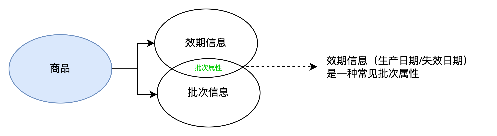

批次管理和效期管理的关系

  
**商品会有效期信息，也会有批次信息**。如果是要对效期信息进行管理，则需要关注商品的生产日期，失效日期，要确保商品在保质期之前销售出去或者处理掉。如果要对批次信息进行管理，则需要关注定义商品批次的批次属性有哪些，可能是生产批号，入库日期，供应商，采购单号，生产日期等。  
生产日期或失效日期，是定义商品批次的一个常见且高频的批次属性，所以批次管理和效期管理在某些场景下是有一定的相关性的，但是它们彼此又可以发挥各自的作用。  
假设一家食品公司生产了一批面包，效期管理会确保这些面包在过期前被销售，比如记录每批面包的生产日期和到期日期，确保它们在到期前一周被下架。而批次管理则会记录这批面包的批次号，如果发现某批次的面包存在问题，公司可以迅速定位并召回该批次的所有面包，而不影响其他批次。  
了解了这些背景之后，我们来看ERP层如果要对商品启用批次管理和效期管理那么应该怎么配置的。这里我以万里牛ERP为例，同时加上一些金蝶ERP的截图，帮助大家更好地了解在维护商品的时候应该如何启用批次管理和效期管理。  
  

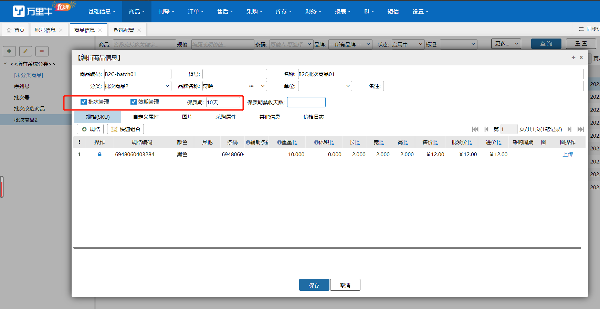

万里牛ERP新增、编辑商品

  
  

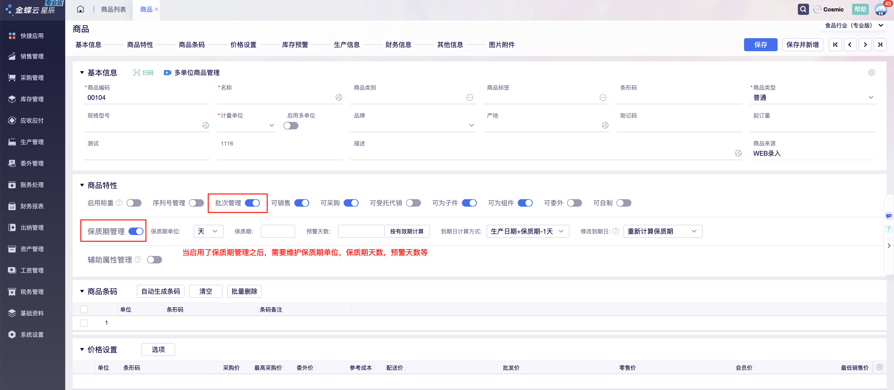

金蝶ERP新增、编辑商品

  
在商品管理模块中，新增或者修改商品资料的时候，可以选择启用批次管理，不需要再维护其他的内容；如果是启用了效期管理，则需要同时维护商品的“生产日期”，“保质期天数”或者是“失效日期”，“保质期天数”。  
失效日期 = 生产日期 + 保质期天数，所以只需要维护“保质期天数”和生产日期，或者是“保质期天数”和“失效日期”即可，剩下的一个值可以通过系统自动计算得出。  
当商品启用了批次管理和效期管理之后，相关的配置信息除了要在ERP上存储，同时还需要同步推送给下游的仓库系统，也就是我们所说的OMS。因为批次管理需要结合实物管理来执行，仓库也要知道具体的批次管理要求是什么，所以需要拿到这些相关的信息。  
  

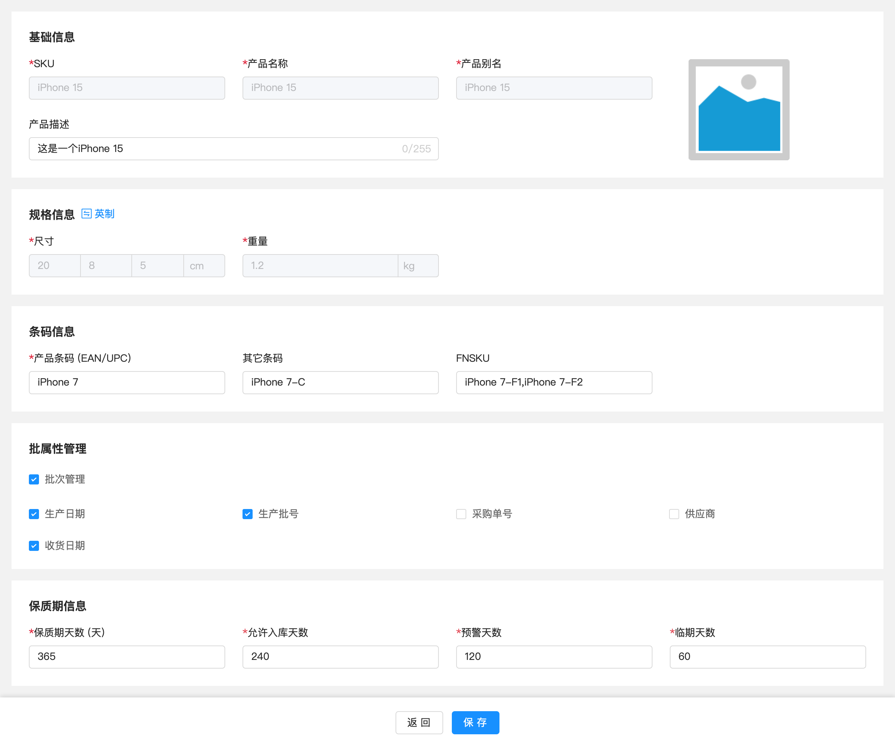

OMS创建商品页面

  
**采购场景下的批次管理**  
ERP创建好了采购订单之后，需要推送给下游的WMS去收货入库，一般这个时候采购订单中的商品是没有批次信息和效期信息的，所以直接推送SKU+数量给仓库，让仓库收到实物之后再采集相关的批次和效期信息即可。  
  

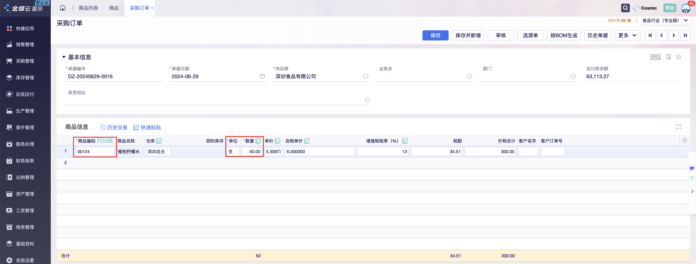

采购订单示例图

  
当仓库收到了实物之后，一般会在WMS中录入一些批次信息，常见的有：  
1生产日期  
2失效日期  
3生产批号（包装批号）  
这些信息只要仓库采集录入了，一般都是可以在WMS和OMS中查看到的，但是对于ERP来说，则需要在和WMS接口对接时特殊处理，即接入WMS批次相关的信息回传，然后把这些信息存储在ERP中。  
  

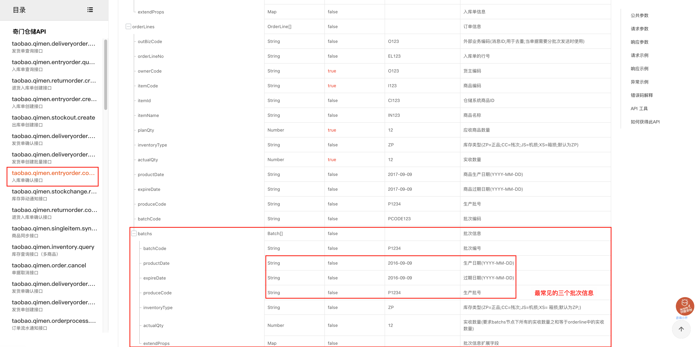

奇门的入库单确认接口

  
对一些未对接下游三方WMS的ERP来说，不对接的原因可能是该ERP只是用来做账使用，也可能是仓库管理使用的是ERP自身的功能模块，所以这类ERP采集和录入批次信息的位置会放在“采购入库单”模块中。  
  

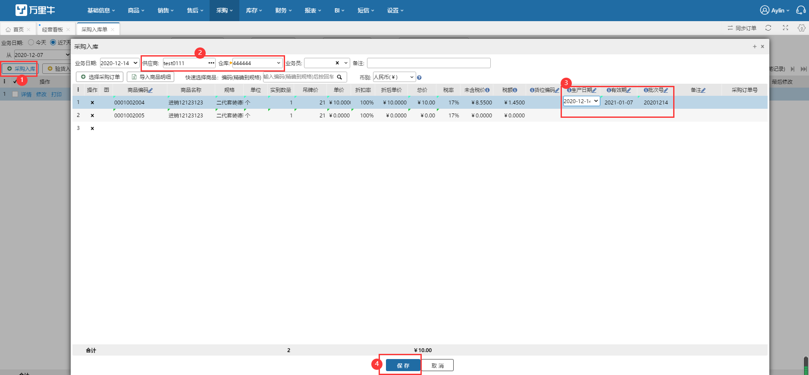

万里牛ERP采购入库单维护批次信息

  
  

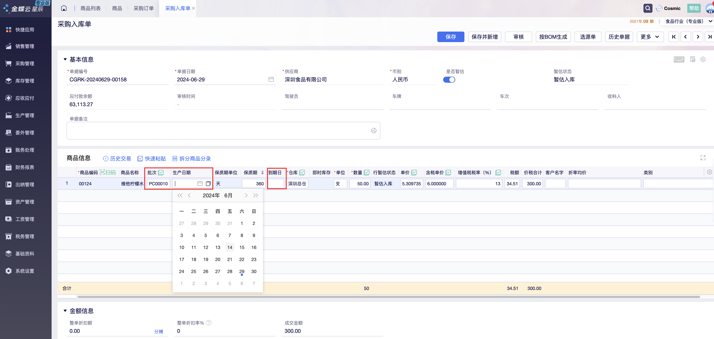

金蝶ERP采购入库单维护批次信息

  
**库存场景下的批次管理**  
当下游的WMS完成收货并回传到ERP或者是ERP的采购入库单完成之后，对应ERP的库存就会增加，而相关的批次信息也会同步记录在ERP的库存模块中。  
  

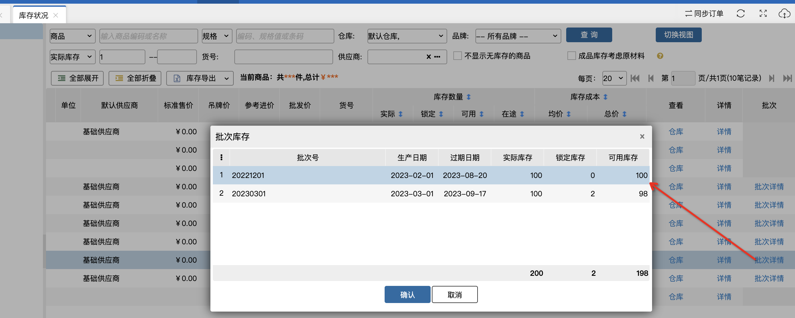

万里牛ERP的批次库存

  
  

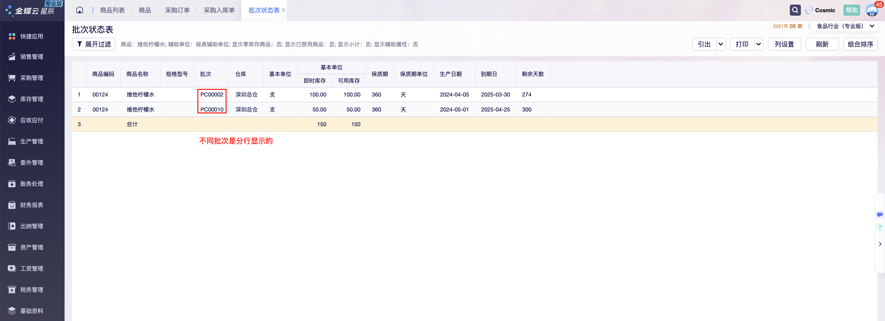

金蝶ERP的批次库存

  
这里再补充一个关于ERP库存变化的底层逻辑，这是很多供应链产品经理都会忽视的细节，或者说对这些概念和逻辑模棱两可，掌握的不够透彻。  
  

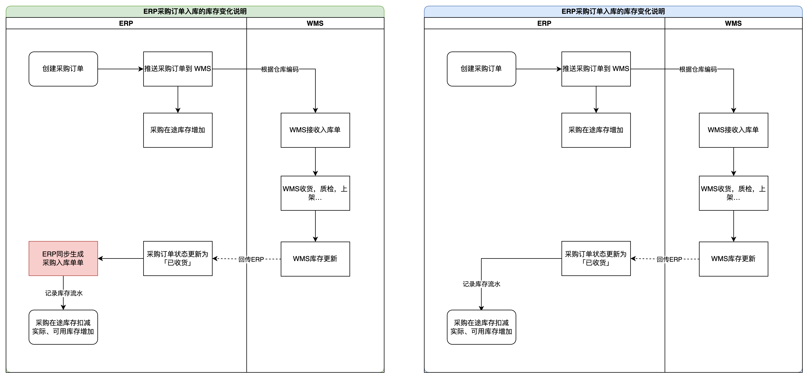

ERP采购订单入库的库存变化说明

  
上图中，当仓库完成了收货上架，回传数据给了ERP之后，方案一是让采购订单的状态更新为“已收货”，同时生成了一张“采购入库单”，再通过这张采购入库单来记录库存流水的变更，增加可用库存，扣减在途库存。  
而方案二则是让采购订单的状态更新为“已收货”，直接用采购订单的状态变更来记录库存流水的变更，然后增加可用库存，扣减在途库存。  
这两种方案，一般来说都可以，但是方案一采用了采购订单和采购入库单解耦的方式，后续更有利于业务的拓展，推荐使用这种。  
除此之外，我们会发现ERP的库存变更都是通过“业务单据”来触发，可能是“业务单据+状态”，即某些单据要达到某些状态后，才会触发库存的变更；当然也可能是“业务单据”，即只要生成了某些单据之后，就会触发库存的变更。  
这里我想提醒大家关注的点是： **ERP的库存和WMS的库存更新并不一定是同步的，因为各自的驱动逻辑和更新时机都不太一样**。即WMS更新了库存，ERP不一定会更新库存，反之也是一样的。普遍采用的都是“业务单据”触发，如果WMS更新了库存，想要让ERP也更新库存，那么一定要通过推送某些单据来触发，反之也是如此。  
当理解了这个概念之后，后续在设计ERP的盘点，其他出入库，调拨等功能的时候，才能更好地理解，这些单据和仓库WMS中的盘点，库存调整单，调拨单等有什么差异，应该要怎么联动，怎么交互。  
**销售场景下的批次管理**  
ERP创建好了销售订单之后，也是需要推送给下游的WMS去拣货出库，这个时候一般会有两种典型的场景：  
1指定批次信息给WMS，让仓库按ERP指定的批次信息去出库  
2不指定批次信息给WMS，让仓库按WMS配置的批次规则去出库  
针对第1种情况，比较常见的就是指定仓库出某个效期状态（临期、过期）的商品，出某个外部批号的商品等。这种指定批次信息的方式，很强大，很精细化，但是需要WMS的配合，还要看仓库的实际管理能力，所以如果有一些仓库的管理水平不够或者WMS的功能不够强大，那么ERP是无法指定批次信息的。  
具体的实现方式，可以参考我之前写过的OMS指定批次信息出库的原型，ERP层面的设计和这个是类似的，因为ERP的数据会推送到OMS，两者要保证大体的数据结构是一致的，才可以对接。  
  

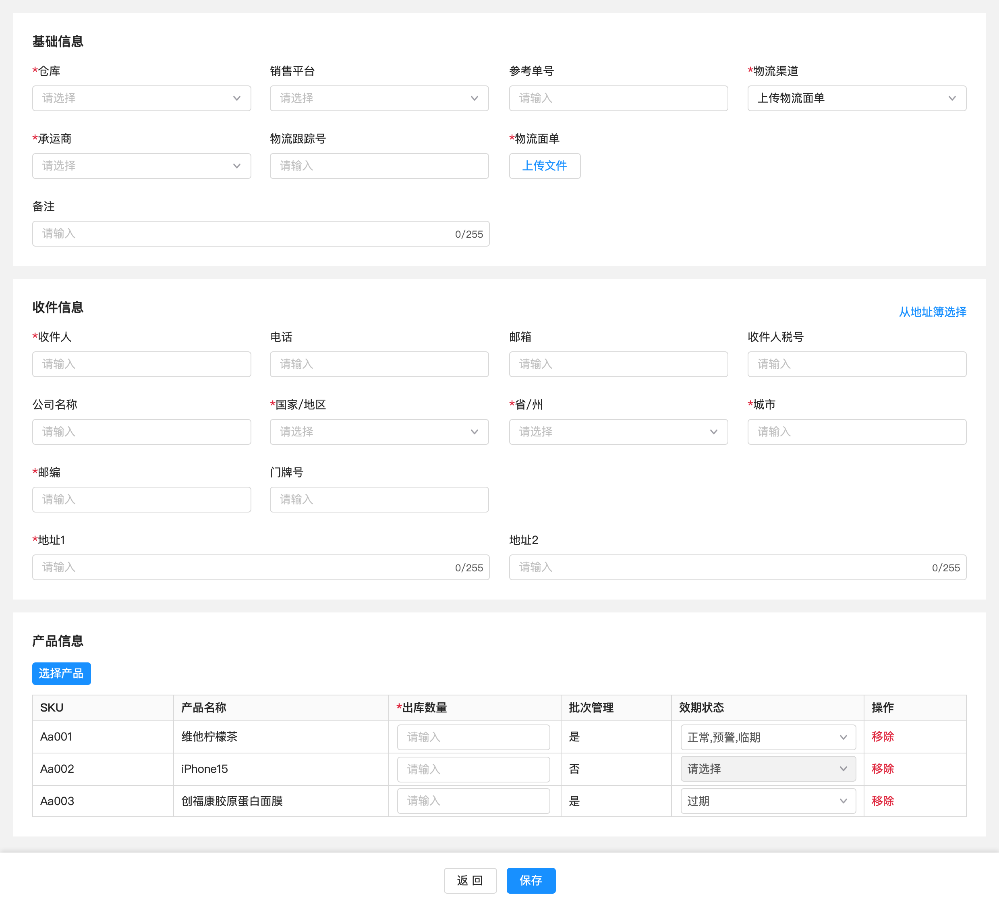

OMS创建出库单页面

  
针对第2种情况，那么ERP这边就比较简单，只需要指定“商品+数量”即可，具体要出什么批次的商品，完全交给了WMS去处理，最后只需要接收仓库出库之后回传的批次信息即可。  
  

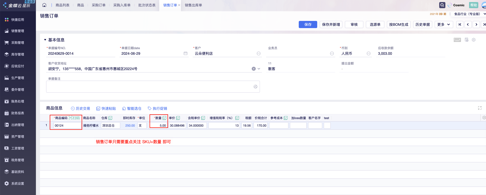

销售订单示意图

  
当仓库完成了销售订单的发货出库之后，可以通过回调接口，把WMS实际出库的商品和相关的批次信息等回传给ERP，所以ERP也要在和WMS接口对接时，把相关的字段对接上，后续也把相关的信息存储起来。  
  

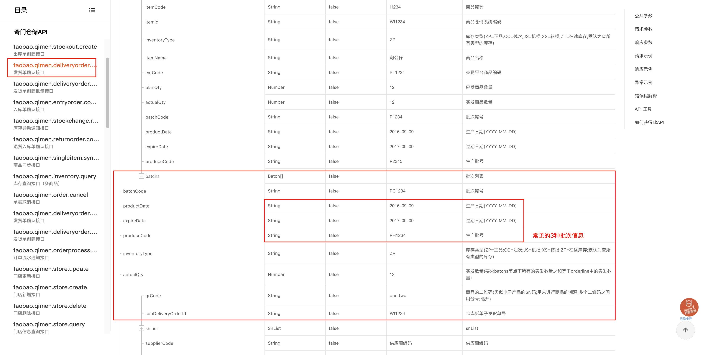

奇门的发货单确认接口

  
对一些未对接下游三方WMS的ERP来说，不对接的原因可能是该ERP只是用来做账使用，也可能是仓库管理使用的是ERP自身的功能模块。这类ERP在出库的时候也需要根据批次规则来分配批次号和效期信息等，同时也要支持手动维护实际出库的商品批次信息，这些信息的维护会放在“销售出库单”模块中。  
  

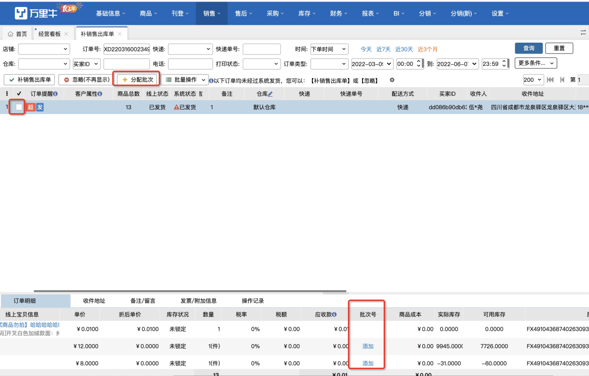

万里牛ERP销售出库单维护批次信息

  
  

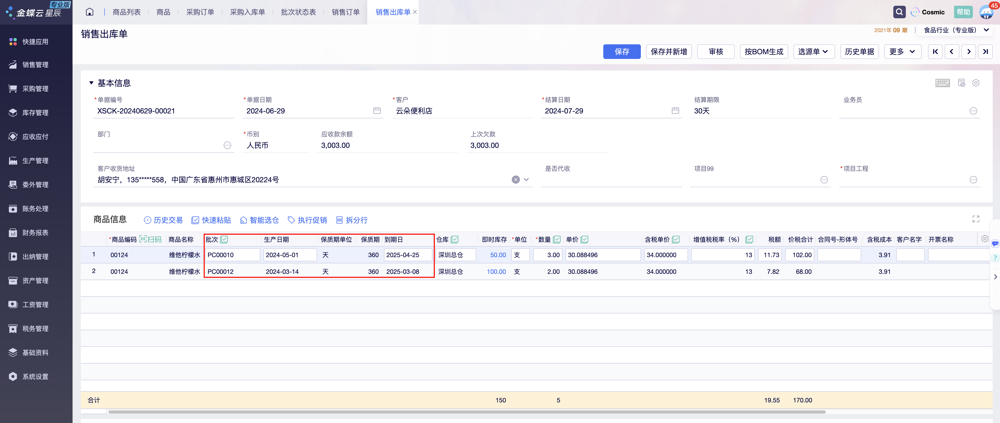

金蝶ERP销售出库单维护批次信息

  
**ERP的批次库存和WMS的批次库存**  
经过对ERP的的“商品，入库、销售、库存”等模块的拆解，我们可以很清晰地知道ERP的批次管理，其实和WMS是批次管理是密不可分的。虽然是在不同的系统，由不同的用户角色来使用，但是很多数据的交互和逻辑的处理，ERP和WMS都是同根同源，一脉相承的。  
所以，我更推荐大家先学习和掌握WMS的批次管理，然后以此为根基，逐步去学习OMS的批次管理和ERP的批次管理。  
在讲“销售场景下的批次管理”时，细心的朋友会发现一个问题，那就是无论我是指定批次信息还是不指定批次信息给WMS，都可能会出现一个很尴尬的问题：**ERP的批次库存和WMS的批次库存对不上，怎么办？**  
**是的，ERP的批次库存和WMS的批次库存之间会存在差异，就好像OMS的批次库存和WMS的批次库存之间的差异一样。**需要注意：ERP实际上是直接和OMS进行交互的，这里用“WMS的批次库存”其实是想表达仓库批次库存的意思，因为对上游的ERP来说，OMS和WMS都是属于仓库的系统，这两者的差异和区别等对ERP用户来说不太关注。  
在“海外仓OMS的批次管理”的文章中，我讲到了如果要解决OMS和WMS的批次库存的差异，可以有两种做法：  
1OMS可以自己记录两层库存（SKU库存、SKU-批次库存），那所有的库存变更的场景都需要精细化到批次维度；  
2OMS只记录一层库存（SKU库存），涉及到批次库存的时候可以直接从WMS层面去调用接口实时查询；  
  

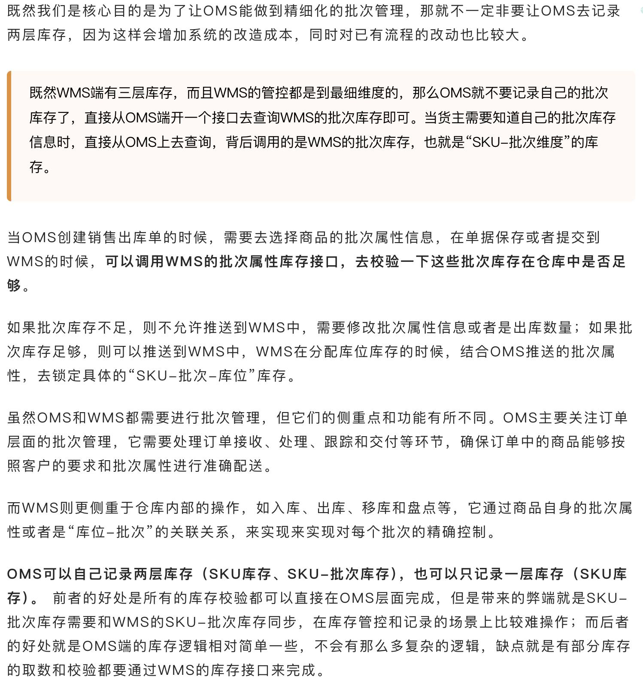

OMS的批次管理文章的部分片段截图

  
由此可见，如果要解决ERP的批次库存和WMS的批次库存之间的差异，其实也是采用类似的方式：  
1ERP自己记录两套库存（SKU库存，SKU-批次库存），ERP和下游WMS的所有库存变更场景都要精细化到批次库存维度；  
2ERP只记录一层库存（ERP库存），涉及到批次库存的时候再通过开放平台的接口去实时查询；  
  

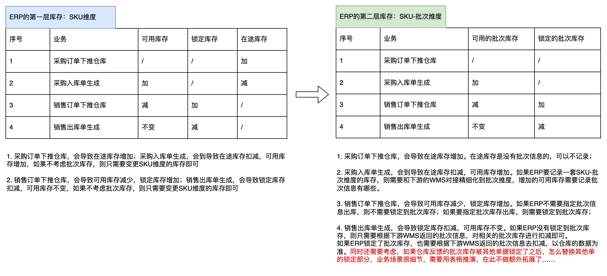

  
通过上述的场景简单推演分析之后，会发现ERP的批次库存要和WMS的批次库存做到一致，同步等，其实难度非常大，耗时耗力，效益可能还不是很大。  
所以，有很多系统会做一些妥协的方案，即ERP不去记录这些WWMS层面的批次库存，而是通过接口去查询WMS的数据或者让WMS定期提供这些报表。如果ERP需要用到一些库存的批次去做成本核算或者是逻辑层面的溯源、定位等，那么就让ERP自己做一套“逻辑层”的批次库存管理，这个数据和WMS的实物并不能对得上，属于“两套账”的玩法，感兴趣的朋友可以自己推演一下相关的方案。  
**总结**  
关于批次管理方面的文章，我已经陆续写完了WMS的批次管理，OMS的批次管理，再加上这篇ERP的批次管理，基本上这个系列就要进入尾声了。  
输出这些文章，不仅让我自己对很多竞品，对很多产品方案有了更深的了解，也让我不断地在更新、迭代我对批次管理的认知。  
批次管理虽然有一定的标准和通用做法，但是在不同的系统下，不同的业务场景下，不同的业务诉求下，还是会有很多衍生的玩法，这些可能是妥协后的方案，可能是因地制宜的方案，也可能是当前阶段最佳化的方案，希望大家可以灵活应用这些文章中的知识，不断提升自己的产品能力。  
以下是输出这篇文章的时候，我所查阅的一些参考资料，感兴趣的记得都浏览一遍：  
●https://hupun.yuque.com/unzko7/oedgy7/mwi7c0nezzhggx1s#snjtO  
●https://vip.kingdee.com/questions/129339652304816805/answers/129339687906069018?  
productLineId=35&isKnowledge=2&lang=zh-CN  
●https://open.taobao.com/doc.htm?docId=106850&docType=1#ss8