在供应链类系统中创建商品的时候，经常会需要必填一个的字段叫“单位”，同时在它旁边也会有一个“启用多单位”的配置项。

| 列 1 | 列 2 |
| --- | --- |
| 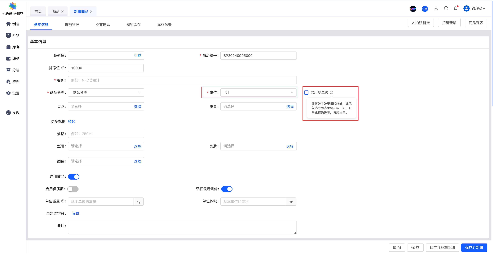 | 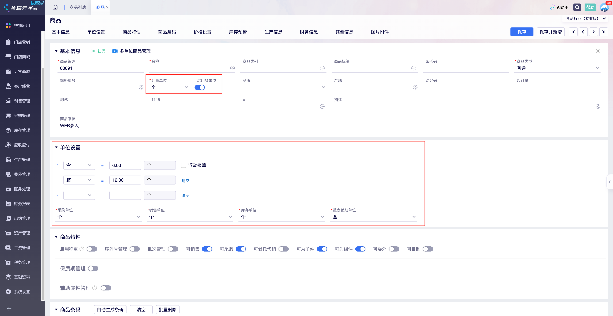 |

很多初学者在这个地方很容易陷入一个“看山是山，看水是水”的困境，初看之下好像这个东西很简单，很好理解。但是等到后面涉及到一些业务场景中要运用这一块内容的时候，就会发现好像这玩意并不简单，牵扯的业务逻辑和要把关的细节还挺多的。

这篇文章，我会从多个方面，多种供应链系统，多个业务场景，深入拆解一下“多单位”的产品设计思路，让你知其然更知其所以然，快速掌握“多单位”背后的业务逻辑。

## 理解SKU和多条码，多单位的关系

### SKU

SKU是（stock keeping unit）的缩写，中文也叫作“库存单元”或者“库存单元”，定义为库存管理中的最小可用的单元，当下已经被引申为产品统一编号的简称，每种产品均对应有SKU号。可以通俗地理解为每种商品，除了会有一个名称之外，还会有一个便于管理的编码，而这个编码就等同于SKU。通过SKU可以知道其指向的具体商品，也就可以知道该商品的规格、颜色、款式等描述性信息。

### 多条码

多条码是指是一个SKU可以有多个不同的条码，这种情况通常出现在以下几种情况：

1.  **不同包装**：同一款商品的不同包装形式（如新包装、老包装）可能使用不同的条码。
2.  **促销活动**：为了促销，商家可能会推出特别包装的商品，这些商品会有专门的条码。
3.  **渠道销售**：同一个商品在不同的销售渠道（如线上和线下）可能会有不同的条码。

### 多单位

单位是指商品的计量方式，如件、盒、瓶、公斤等，而多单位则指的是一个SKU可以支持多种不同的计量单位。例如，一瓶饮料可以按瓶销售，也可以按箱（包含多瓶）销售。多单位的使用可以让商家更灵活地满足不同消费者的需求，并简化库存管理。

### 它们之间的关系

一个SKU可以有多个条码，以适应不同的包装、促销活动或渠道销售。每个条码都可以标识该SKU的一个特定版本，记载一些特有的信息。

一个SKU也可以支持一个SKU可以支持多种单位，以满足不同消费者的需求和市场策略。每种单位都有其对应的属性，包括包装信息，价格，商品描述等。

在某些情况下，同一个SKU的不同单位会分别对应不同的条码（一般一对一的较多），这样可以通过条码知道商品单位是什么，例如，一箱饮料的条码和单瓶饮料的条码是不同的。

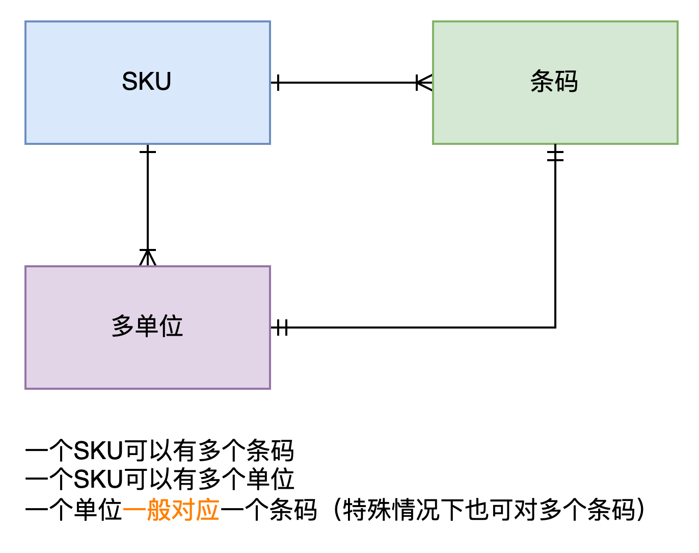

> 在接触到SKU和多单位的时候，大多数朋友都会有一个疑问：一瓶水和一箱水，是属于2个SKU，还是1个SKU的两种单位？

一瓶水和一箱水是属于2个SKU还是1个SKU的2种单位，要看业务需求和商品的管理策略而定，简单来说就是：这两种方式都可以。

#### 情况一：2个SKU

如果一瓶水和一箱水被视为完全不同的商品项，具有独立的库存管理和销售策略，那么它们应该被定义为两个不同的SKU。具体来说：

-   **SKU 1**：表示单瓶水，包含单瓶水的所有信息（如品牌、名称、规格、条码等）。
-   **SKU 2**：表示一箱水，包含一箱水的所有信息（如品牌、名称、规格、条码等）。

在这种情况下，一瓶水和一箱水的库存、价格、销售渠道等都可以独立管理。

#### 情况二：1个SKU的两种单位

如果一瓶水和一箱水被视为同一商品项的不同计量单位，且业务上希望统一管理它们的库存和销售策略，那么它们可以被定义为一个SKU的两种单位。具体来说：

-   **SKU**：表示水，包含水的基本信息（如品牌、名称、规格等）。
-   **单位**：该SKU支持两种单位，即“瓶”和“箱”。

在这种情况下，一瓶水和一箱水的库存和销售信息可以通过单位转换来统一管理。例如，可以定义一箱水包含12瓶水，这样在库存管理系统中就可以通过单位转换来计算总库存量。

> 如果希望可以独立管理这两种商品，采用不同的销售策略等，那么建议把一瓶水和一箱水当作2个SKU。当然，除了要考虑业务层面的要求之外，也要考虑系统是否支持多单位的管理，如果系统没有多单位管理功能，那么就只能当作2个SKU来管理了。
> 
> 如果希望可以统一管理这两种商品，且两者的销售策略，整体运营规划也类似，那么就建议当作1个SKU的2种单位。

在进销存类、零售类系统中往往会优先考虑支持多单位的管理，因为它们面向的客户在实际的业务场景中，经常会有多单位管理的诉求，所以这个功能非常重要，得要优先考虑满足。而在电商B2C业务、简易型WMS中，往往都是按最小单位进行管理，所以对多单位的管理就用的比较少。

接下来，我们就以“零售业务”为参考，同时借鉴若干个市面上成熟的进销存系统、ERP系统等，解析一下对应的供应链系统要如何设计，才能满足“多单位”的业务场景。

## 商品资料的创建

在供应链类系统中，商品的管理是非常常见，也非常重要的一个模块。因为“多单位”的管理是围绕商品进行的，所以在创建商品的时候就要配置好“多单位”的一些配置项。

一般在创建商品的时候，都会先让用户选择一个基本单位，然后再让用户选择“是否启用多单位”的管理。如果选择了启用，那么就会在下方给出“多单位”的换算关系和相关的基础信息。

| 列 1 | 列 2 | 列 3 |
| --- | --- | --- |
| 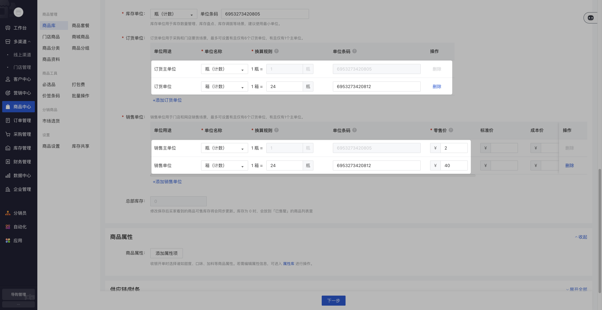 | 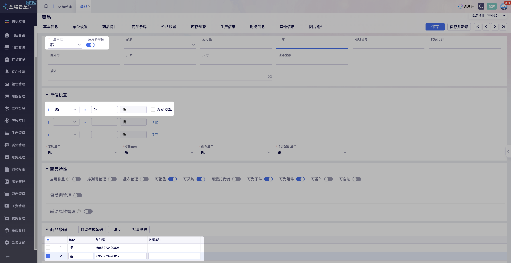 | 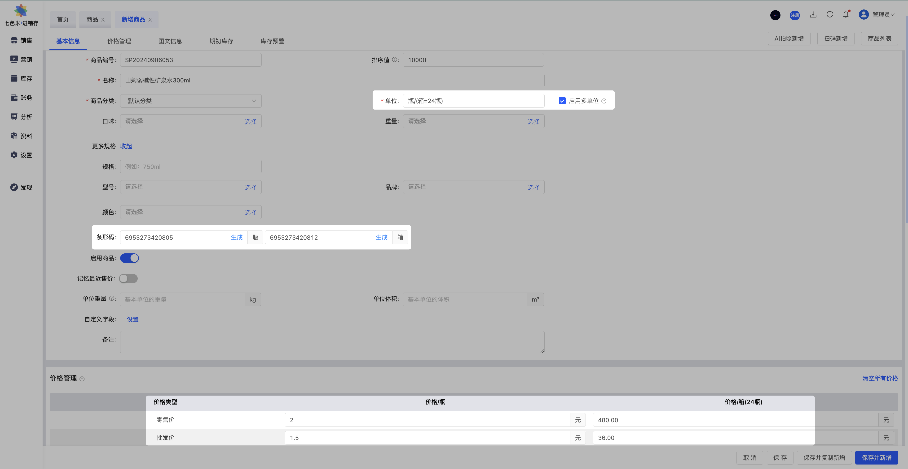 |

当启用了多单位管理之后，需要针对不同的单位维护一些关联的属性，比较常见的就是：单位换算关系，条码信息和价格信息。

单位换算关系，是指先确定一个基础单位，然后再新增多个辅助单位，辅助单位 = N个基础单位。例如说“矿泉水”的基础单位是“瓶”，然后辅助单位1是“箱”，那么就要维护“1 箱 = 24 瓶”；如果辅助单位2是“打”，那么就要维护“1打 = 12 瓶”。

条码信息，是指不同的单位会有不同的条码，这样扫描了一个条码之后，可以知道具体是什么单位，这样就可以带出该单位对应的信息。例如说在收银的时候，如果扫描了“瓶”的条码，那么就会带出1瓶水的价格；如果扫描了“箱”的条码，那么就会带出1箱水的价格；

价格信息，是指不同的单位会有对应的价格，这个价格包含采购价格，销售价格，批发价格，参考成本等。例如说一瓶水的销售价格和一箱水的价格肯定是不一样的；

| 列 1 | 列 2 |
| --- | --- |
| 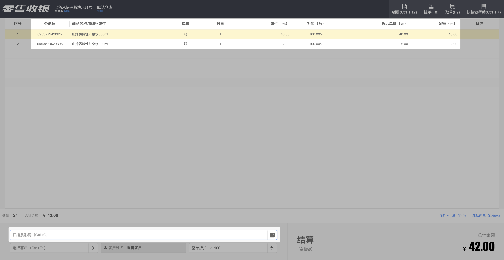 | 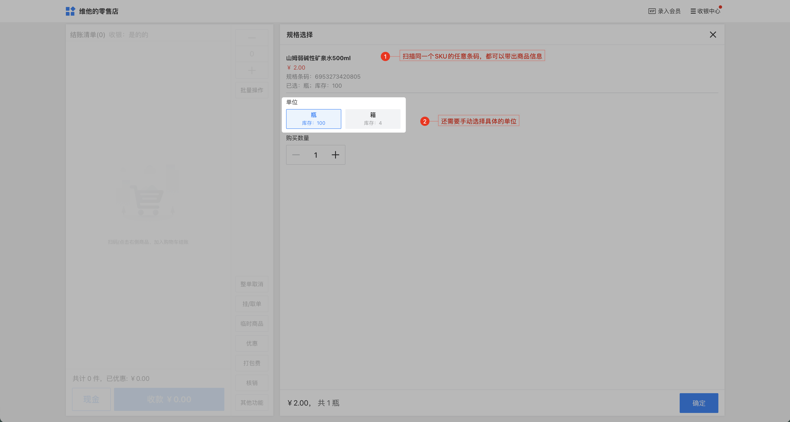 |

> 在“七色米”的零售收银场景中，可以通过扫描不同的条码来识别同一个SKU的不同单位，然后再带出相关的价格信息。
> 
> 在“有赞”的零售收银场景中，扫描不同的条码后都会定位到同一个SKU，然后还需要手动再选择合适的单位，相对来说操作更多了一步，更繁琐了一些。

## 采购场景中“多单位”的应用

当创建完成了一个“多单位”的商品之后，接下来面临的第一个场景就是：**采购和采购入库**。

在创建采购订单的时候，除了选择对应的供应商，收货仓库等基础信息外，还需要考虑怎么选择商品，怎么展示商品。目前主流的做法是会在选择的商品明细行中引入“单位”字段，告知用户当前选择的是哪个SKU以及对应的单位是什么。

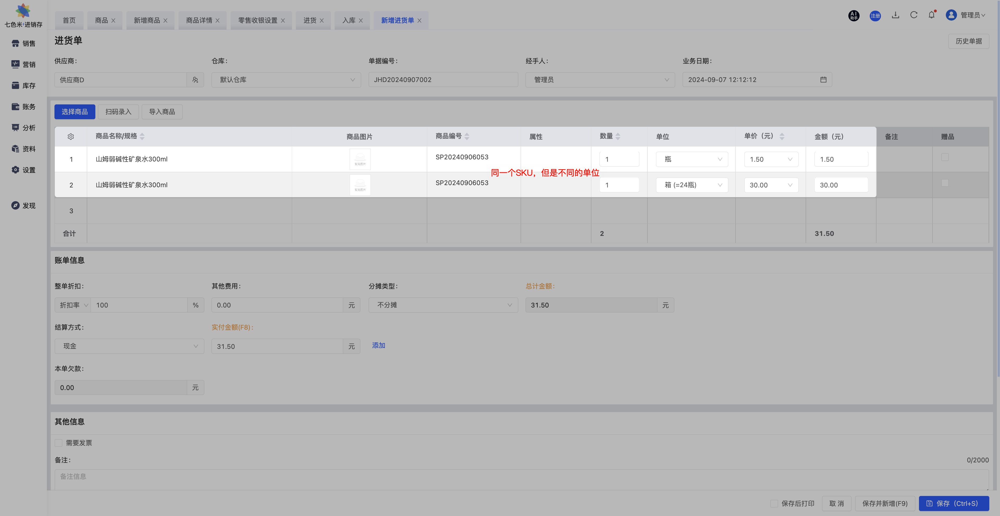

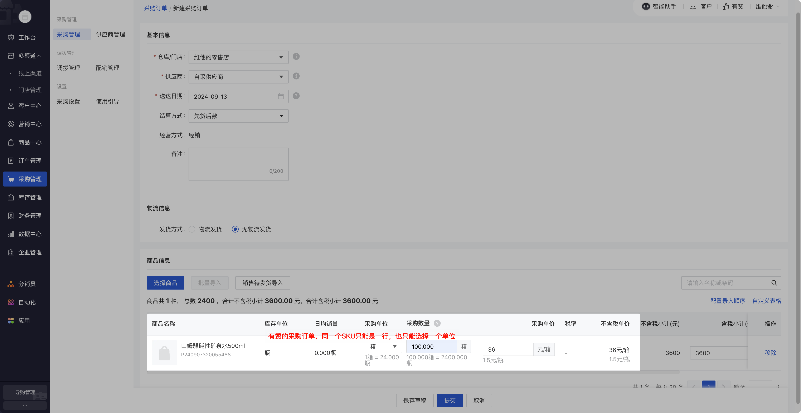

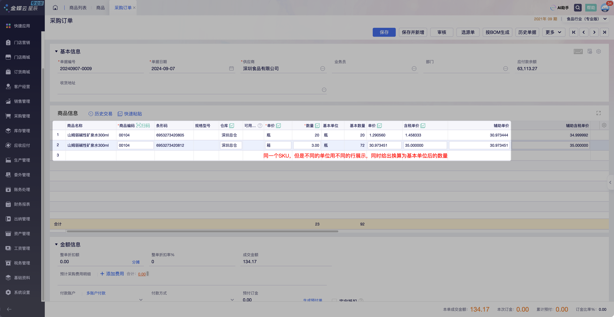

在采购订单的商品明细行中，会需要选择“单位”，如果选择了“瓶”，然后采购的数量就是用瓶作为计量单位；如果选择了“箱”，那么采购的数量就是用箱作为计量单位。

单位不一样，会导致关联的一些属性信息也不一样，例如说采购价格。所以在维护商品行明细的时候，要结合SKU和单位共同考虑，填写准确的信息，避免造成一些损失。

当采购订单中存在了同一个SKU但是不同单位的2行商品明细，那么下推生成的**采购入库单**中也会有对应的结构，如下图所示。

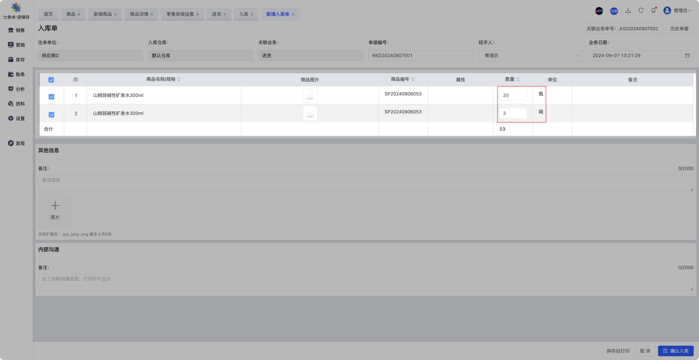

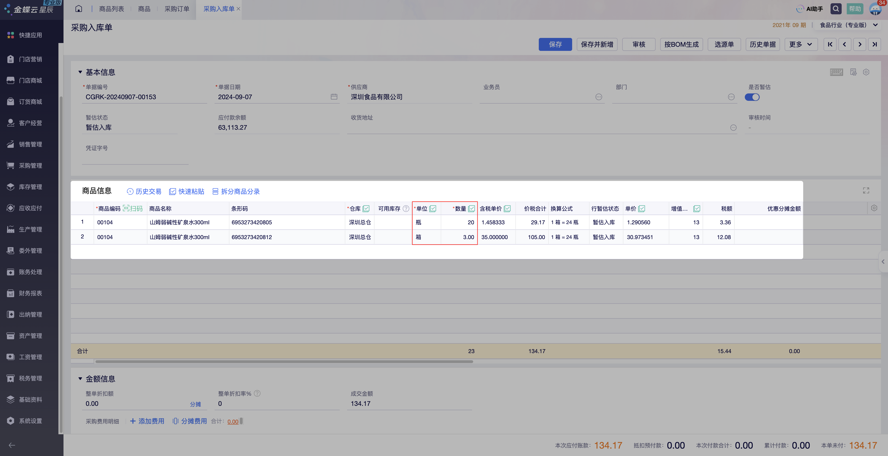

## 库存查询场景中“多单位”的应用

当多单位的商品通过采购的方式入库之后，会增加对应的库存数量，因为采购的时候是有明确SKU+单位的，所以在查询库的时候，也需要结合SKU+单位来考虑，而不能仅考虑SKU维度。

在七色米的设计中，是可以在库存查询界面中灵活转换“单位”的，不同的单位会对应不同的数量，系统会实时进行换算。

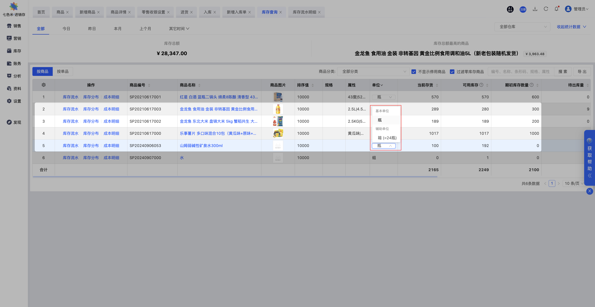

在金蝶星辰的设计中，是先在“商品管理”中配置好，库存查询的展示的单位是什么，然后以配置的单位作为库存统计的对象。同时在库存查询界面中，也会展示辅助单位，这样也可以达到和七色米类似的效果。

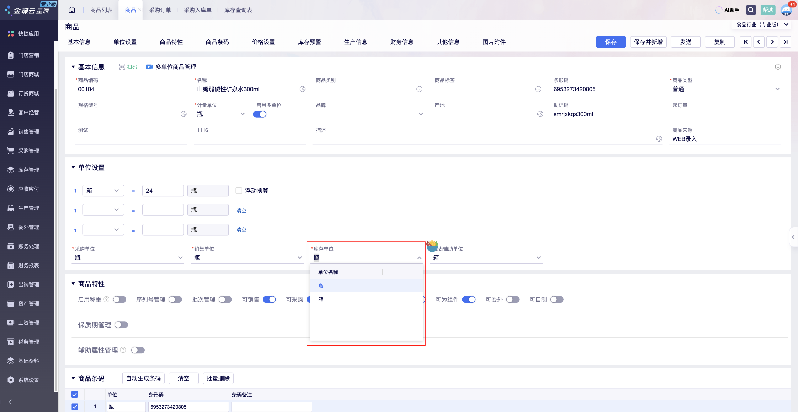

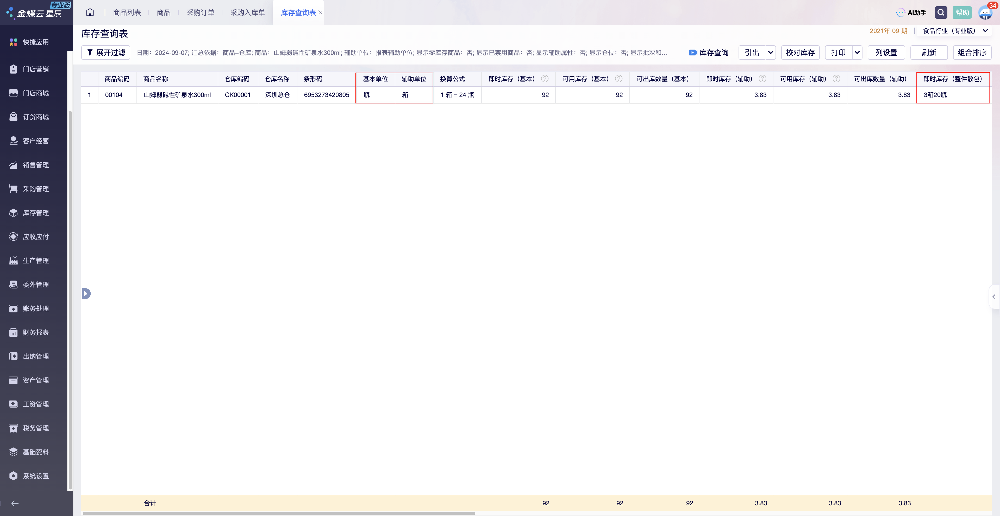

> 一个SKU有多单位，在统计库存的时候一般不会分成多行来展示，而是放在同一行展示，只不过是通过不同的单位来实时换算并给出结果。这样也意味着，如果想要明确的知道真实的库存有几箱，有几瓶的时候，这种统计方式往往不太准确，因为它给出的是一种逻辑层面换算的结果，而不是实物的真实情况。
> 
> 例如说，一共采购了2箱水，正常统计库存的时候应该是2箱水或者48瓶水，然后通过销售卖了6瓶水，分别从第一箱和第二箱中取出来了3瓶。此时实物应该是第一箱还有21瓶，第二箱也还有21瓶，但是系统做库存统计的时候，结果是剩余**42瓶**或者是**1箱18瓶。**
> 
> 真实情况是实物两箱都拆开了，应该没有整箱了，但是系统统计的时候还是会认为有1箱18瓶，所以这是“一个SKU多单位”统计库存时的一种特性，也可以理解为一种“短板”。

## 销售场景中“多单位”的应用

前面讲到了采购和库存查询，如果理解了其中的玩法，那么在做销售的时候也就不难了，直接套用相关的逻辑即可。

在创建销售订单的时候，也要关注销售的商品明细行，关注明细行的单位是什么，数量是什么，这样在校验库存是否足够，要锁定多少库存，扣减多少库存的时候才不会搞错。

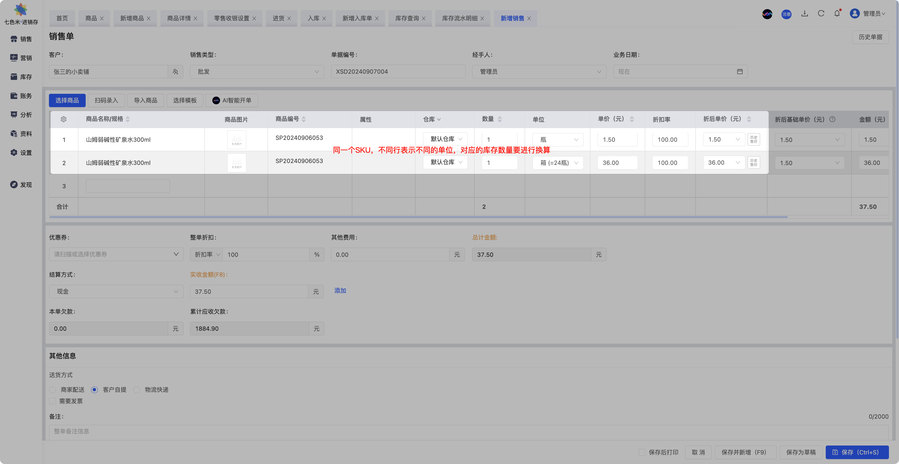

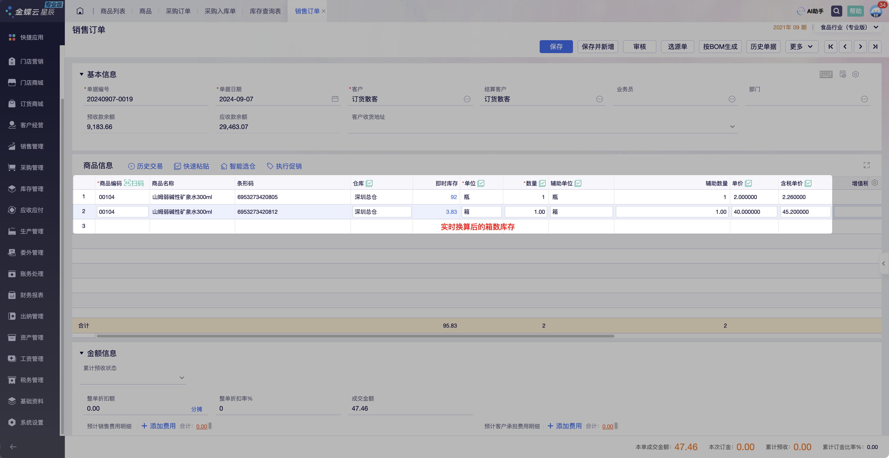

无论是七色米还是金蝶星辰在创建销售订单的时候，都可以一行明细表示一种单位，金蝶星辰会实时换算出“箱”的库存数量有多少，让用户做单的时候看起来更清晰明了。

当销售订单下推生成了销售出库单之后，系统在扣减库存的时候，记录的流水也是可以根据单位进行换算的。例如说，在七色米中，虽然说出库单中是出库了1箱，但是在流水展示的时候也可以记录为“24瓶”。而在金蝶星辰中，库存流水则是按照销售出库单中的商品明细行的单位来展示的，当时是什么单位，那么流水中也是什么单位。

| 列 1 | 列 2 |
| --- | --- |
| 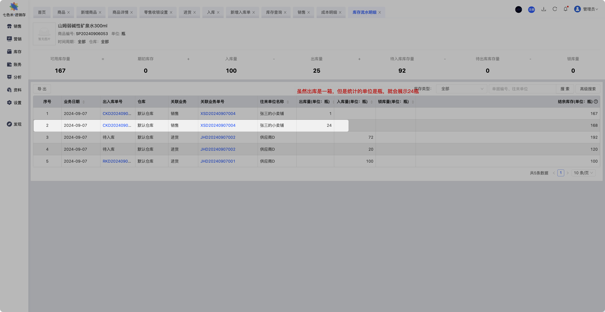 | 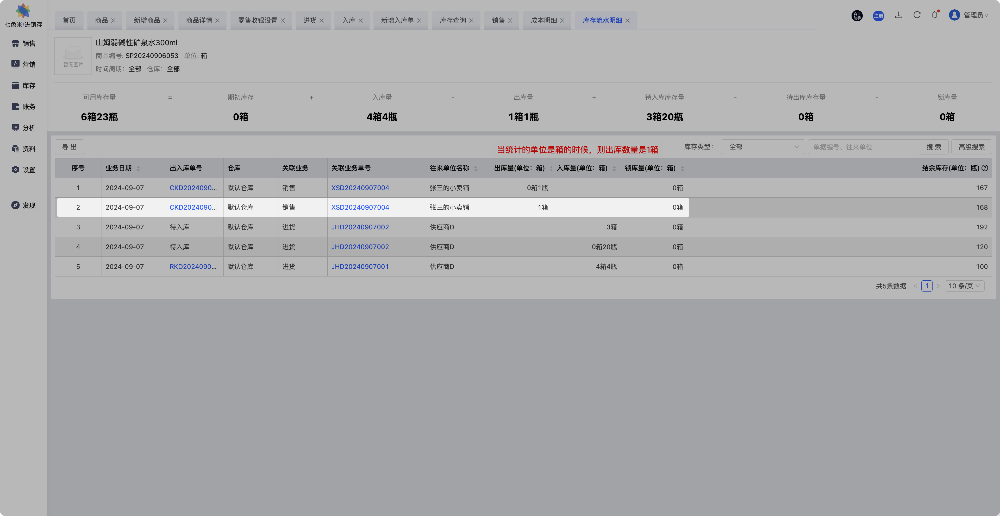 |

| 列 1 | 列 2 |
| --- | --- |
| 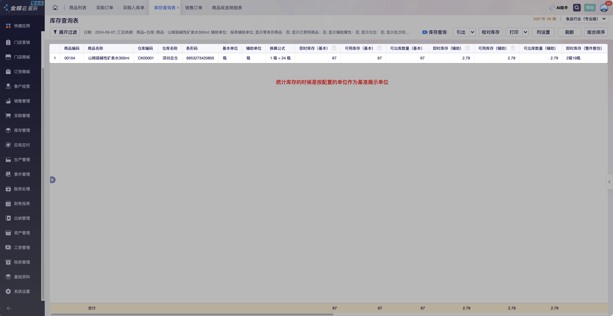 | 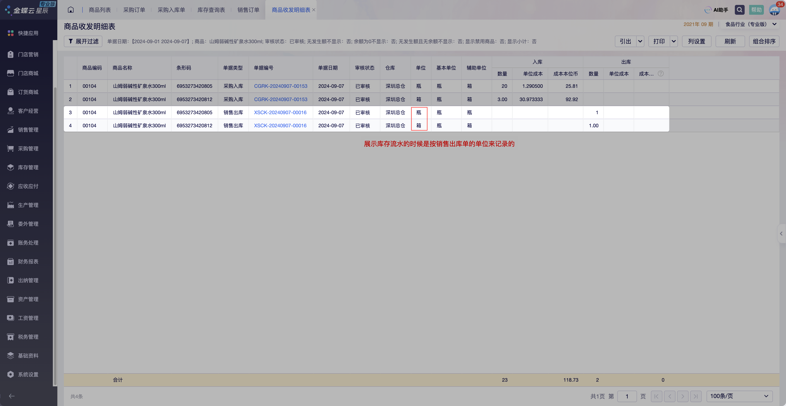 |

## 总结

通过上面的几个案例拆解，我们了解到当一个商品要启用多单位管理时，需要将系统中涉及到“进销存”的模块都做改造。涉及到商品的选择，商品库存的处理等场景时，除了要考虑“SKU”之外，还要考虑“单位”，几乎是所有和SKU有关的模块都要全面考虑到，要引入“单位”这个字段。

同时，根据上面的一些业务案例拆解，也可以知道“一个SKU多单位”管理和“多个SKU分开”管理其实还是会有挺多的细节上的差异，我把常见的一些差异做成了一个对比的表格，让大家更加直观地理解这两种管理方式的不同。

| **业务场景** | **一个SKU两个单位** | **两个独立SKU** |
| --- | --- | --- |
| **商品资料创建** | 创建一个SKU，包含两个单位（如：瓶、箱） 设置单位换算关系（如：1箱=24瓶），设置每个单位的条码、价格等信息 | 创建两个独立的SKU，分别对应瓶装和箱装 每个SKU有独立的商品信息、价格等 |
| **采购场景** | 采购时需记录SKU的数量及单位（如：采购10箱，相当于240瓶） 库存增加时，按SKU的数量+单位更新 | 分别采购瓶装和箱装，记录各自的数量 库存增加时，分别更新两个SKU的库存 |
| **销售场景** | 销售时要选择SKU的数量及单位（瓶或箱） 根据选择的单位进行价格计算和库存扣减 | 销售时直接选择对应的SKU（瓶装或箱装） 每个SKU独立进行价格计算和库存扣减 |
| **库存查询场景** | 查询库存的时候，要关注对应的单位及换算的一些关系（如：总库存250瓶，相当于10箱余10瓶） | 分别查询瓶装和箱装的库存数量 如需总库存，需手动将辅助单位的SKU库存换算成基础单位的库存，然后计算两个SKU的总和 |
| **优点** | SKU管理简化，减少重复信息的录入 库存一行展示，统一管理，便于整体把控 | SKU独立，便于针对不同包装进行精细化管理和营销 库存清晰，不易混淆 |
| **缺点** | 在涉及到商品选择和使用的时候，都要考虑单位 单位的换算增加操作的复杂性，系统的库存数量和实物的状态表现有差异 | SKU数量增多，管理相对更复杂 需分别对多个SKU进行库存管理和监控 汇总统计库存的时候更麻烦，需要手动操作 |

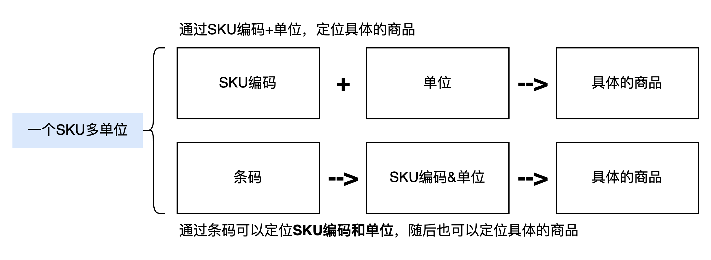

当采用“一个SKU多单位”的管理方式时，扫描SKU编码后，还需要选择具体的单位才能定位到具体的商品；如果是扫描条码，则可以通过条码管理的SKU编码和单位，然后定位具体的商品，前提是需要分别维护SKU不同单位对应的条码。

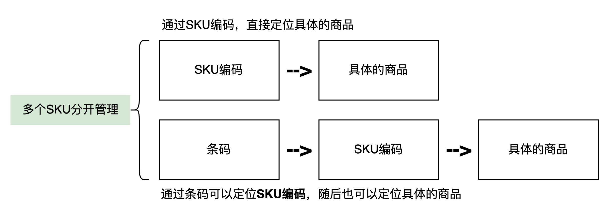当采用“多个SKU分开”的管理方式时，扫描SKU编码后，就能直接定位到具体的商品；如果是扫描条码，也可以查询到对应的SKU编码，然后定位具体的商品。