## 1\. 什么是送仓预约？

无论是海外仓，还是国内仓，一般来说一个仓库都会有多个客户（货主），而这些货主也会有多个SKU，这些SKU可能来自于不同的供应商，来自于不同的生产工厂。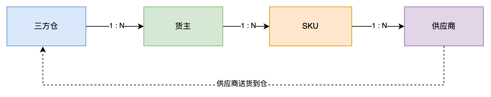

所以站在三方仓的角度，每天都会有大量的货物送到仓库中，这些货物来自于不同货主的不同供应商。每一批的货物送达的方式可能也不一样，可能是快递包裹送达，可能是整车LTL/FTL送达，也可能是整柜送达（20GP/40GP等）。不同的送达方式和货物数量，决定了仓库要准备多少人力，多少空间，多少时间来处理这些到仓的货物，如果仓库对于每天即将送过来的货物有多少，是什么形式送达的一无所知，那么机会导致特别被动，很难提早做好规划和准备。

所以在一些主流的、大体量的、业务繁忙的仓库中，一般都会要求送货方在将货物送达到仓库之前，先发起“送仓预约”，等仓库确认预约成功之后，再按照具体的预约时间、地点送货到仓库指定的位置。送仓预约有非常明显的好处和收益，如下所示：

-   **提高仓库作业效率**：通过预约，仓库可以提前规划作业流程，减少等待和空闲时间，提高作业效率。
-   **减少货物在仓库的停留时间**：预约入库可以减少货物在仓库的等待时间，加快货物的流转速度。
-   **优化资源分配**：仓库可以根据预约信息，合理分配人力和设备资源，避免资源浪费。
-   **提升客户满意度**：供应商和物流公司可以更准确地预测货物到达时间，从而提高客户满意度。
-   **降低成本**：通过减少等待时间和优化资源分配，可以降低仓库的运营成本。

> 送仓预约（也称入库预约）是一种仓库管理策略，它要求供应商或物流公司在将货物送达仓库之前，先进行预约。这样，仓库可以提前准备接收货物所需的资源，如人力、设备和存储空间。

## 2\. 送仓预约怎么做？

仓库的送仓预约，本质上和我们平时预约会议室，预约医生，预约上课，预约维修保养等事项的底层逻辑是一样的。

> 送仓者，提前登录相关的预约系统或者预约界面，然后查看可预约的时间和资源，最后填写一些相关的信息即可完成预约。

| 列 1 | 列 2 | 列 3 |
| --- | --- | --- |
| 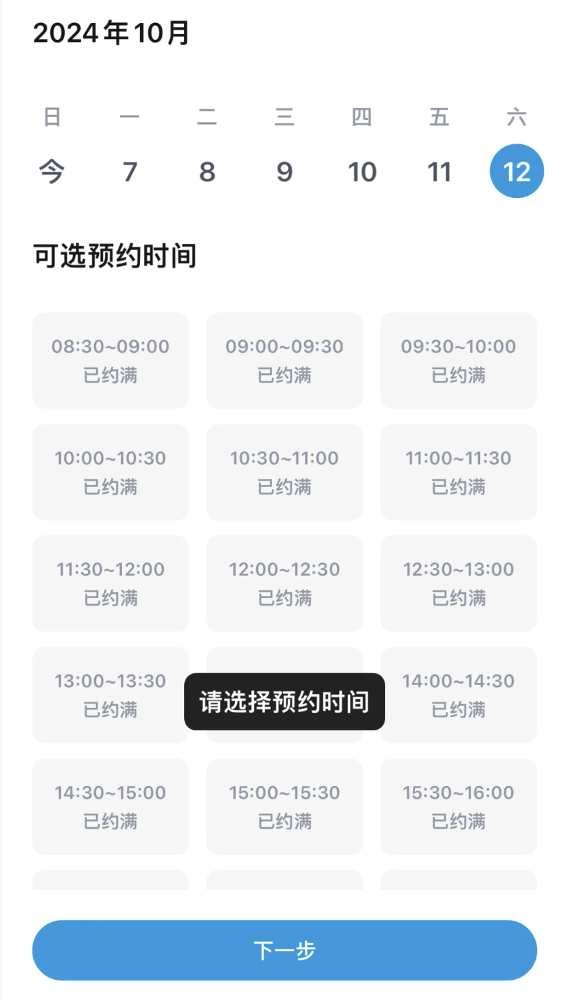 | 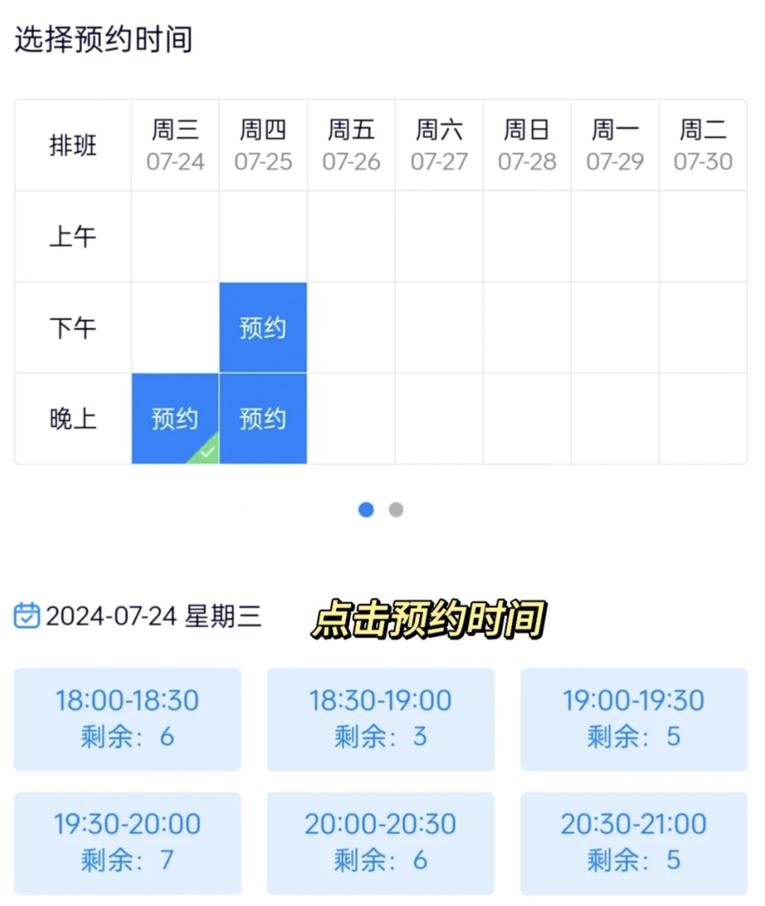 | 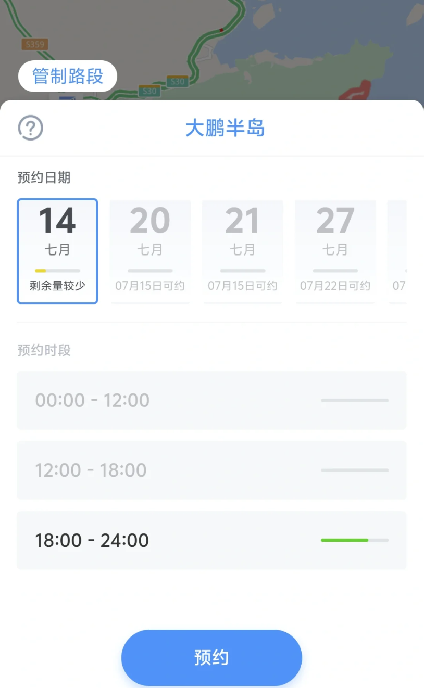 |

在仓库的送仓预约场景中，主要可以拆分成两个部分来看，一个是仓库端，一个是送仓端。**仓库端**，即仓库管理方，一般使用的系统就是WMS。**送仓端**，一般是供应商或者是物流商等，一般使用的系统是OMS或者单独的预约系统、小程序等，这些系统也是由仓库端提供的。

### 2.1 仓库端维护可预约的信息

当我们在预约看医生的时候，我们会先选择“具体的医生”作为我们要预约的对象，然后选择对应的时间即可完成预约。

而在WMS中，有的系统会选择把“月台”当作是预约的一个对象，所以供应商/物流商在预约送仓的时候，要选择“月台+具体的时间段”才可以完成预约。也有一些系统会认为“月台”是外部用户不太关注的东西，所以会将商品PCS数量或者是体积等作为预约的对象，这部分会称之为“配额”或者“可预约量”。

| 列 1 | 列 2 |
| --- | --- |
| 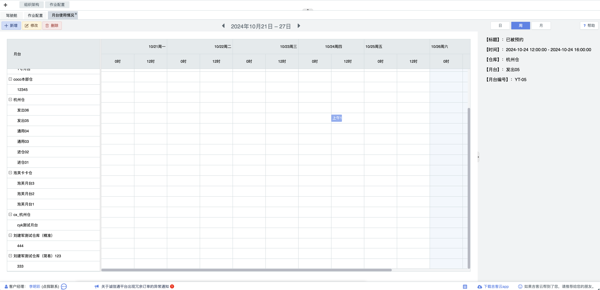 | 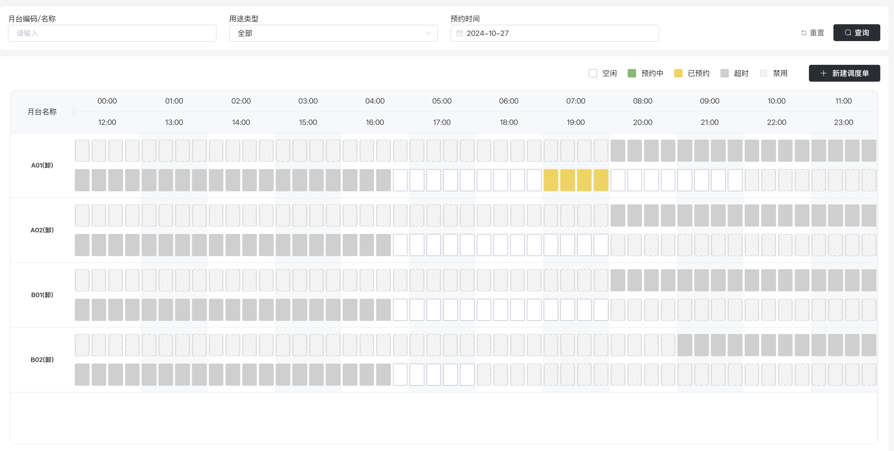 |

WMS端可以配置好可预约的对象，可预约的时间段，并且设定相关的规则。保存之后，用户就可以在预约端去执行预约的操作，也可以修改预约，取消预约，查看自己的预约记录等。

WMS需要针对预约的对象设置“计算规则”，例如说如果是将商品的PCS数量作为“配额”，那么当供应商预约了成功了之后，对应的配额就要减少，这样后续其他供应商预约的时候就可以看到剩余的配额还有多少。

同时，也要针对送仓预约管理做一些“增删改查”的功能，可以灵活应对供应商突然发起的修改、取消、加急预约等需求。

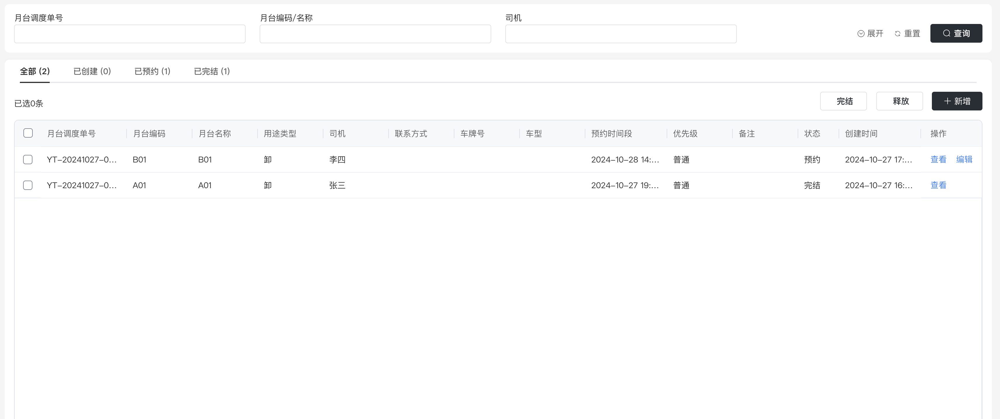

### 2.2 预约端发起具体的预约

基于OTWB的产品架构设计，一般仓库会提供一个客户端（OMS/商家服务中心）给对应的货主使用，预约送仓的功能也一般会放在OMS端。

在OMS中，货主可以给自己的每个供应商开通对应的账号，并且通过数据权限控制来约束供应商只能查看到自己的数据。

预约端除了放在OMS之外，也可以放在微信小程序、微信公众号等，只需要数据和OMS端、WMS端打通即可，具体的形式可以不作要求。

| 列 1 | 列 2 |
| --- | --- |
| 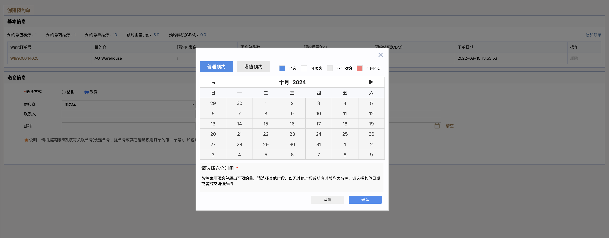 | 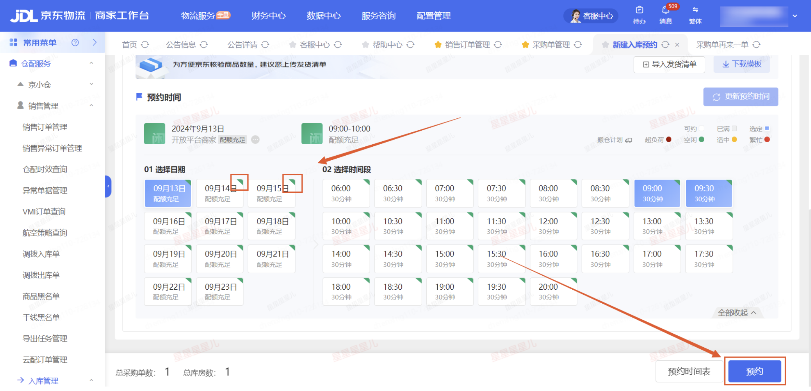 |

供应商在预约送仓的时候，要先选择为哪个单执行送仓预约，即供应商要选择已经在OMS中存在的入库单或者采购订单。这就要求上游的系统ERP或者SRM，需要先将采购订单推送到仓库系统中（OMS/商家服务中心），这样才能让供应商在送货之前完成预约送仓的工作。

| 列 1 | 列 2 |
| --- | --- |
| 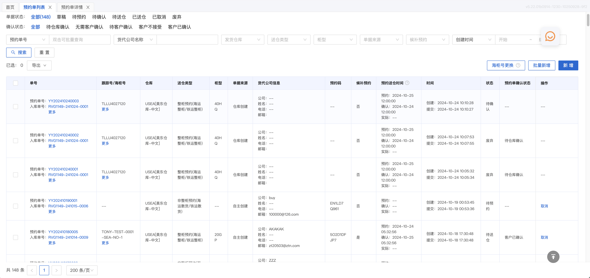 | 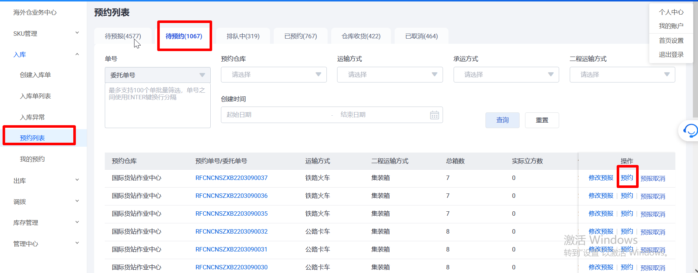 |

## 3\. 上下游系统的业务链路串联

虽然本节内容是讲解的送仓预约，表面上看只是和仓库的业务挂钩。但是仓库的单据是由上游推送过来，而且其中涉及到的角色除了有货主之外，还有货主供应商。

有一些供应链的初学者可能不太理解这里的货主和货主的供应商，也不太理解上游系统和WMS的数据流转关系。不知道SRM和ERP的关系是怎么样的？ERP和下游WMS的OMS又是怎么样的关系？甚至会发现自己的系统叫作OMS，别人的系统也是OMS，这两者有什么区别，有什么联系吗？

基于上述提到的送仓预约业务，再结合本套电子书专栏给出的定义，我为大家拆解一下这几个系统的联动关系，便于大家理解。

### 3.1 名词定义

**SRM：**Supplier Relationship Management 的英文缩写，即供应商关系管理。SRM和ERP一样，首先是一种管理思想、理念，然后也逐步衍生为一种企业管理软件，主要是采购方和供应商方相关的一些业务的管理。

**ERP：**Enterprise Resource Planning的英文缩写，即企业资源计划。ERP早期的时候是一种管理思想，管理理念，随着时代的演进，也随着计算机的普及和信息化的推广，现在大家会默认把ERP当做为一款综合型的后台管理软件，在不同的行业、领域和公司中，表示的含义会有一些不一样。

**OMS：**Order Management System的英文缩写，即订单管理系统。在本专栏系列的文章中，如果没有特别声明，那么OMS就是指仓库WMS的客户端，在海外仓一般称之为OMS，在国内仓可能会称之为商家服务平台或者商家业务中心等。

**WMS：**Warehouse Management System，即仓库管理系统。是一种专门用于管理仓库和库存操作的软件系统。

经过上面简单的科普，估计还是有不少的朋友不太理解这几个系统的怎么串联起来的，对应的单据是怎么流转的，接下来我用几张流程图来帮助大家理解和认识这几个系统的业务流转关系。

### 3.2 多系统间的入库单据流程

本文讲解的重点是“送仓预约”，所以多系统间的单据流程也是以“采购入库”的场景为例，其他的业务场景在此省略。

#### 3.2.1 最基础的模式

当仓库的货主（采购方）的没有自己的ERP系统，或者说ERP系统没有和仓库系统打通的时候，那么就需要手动在仓库的客户端（OMS）导入入库单，然后完成送仓的预约。当供应商送货到了仓库之后，WMS就可以结合预约的信息来高效率地完成收货、上架的操作。

当入库单由货主自己从OMS中手动导入后，预约送仓这个动作可以让货主来代替供应商执行，也可以让供应商自己执行。不过既然入库单都是货主手动导入的，那么约仓这个动作大概率也是由货主来操作，它可以先和供应商线下沟通送货的时间，然后帮供应商录入预约送仓的信息。

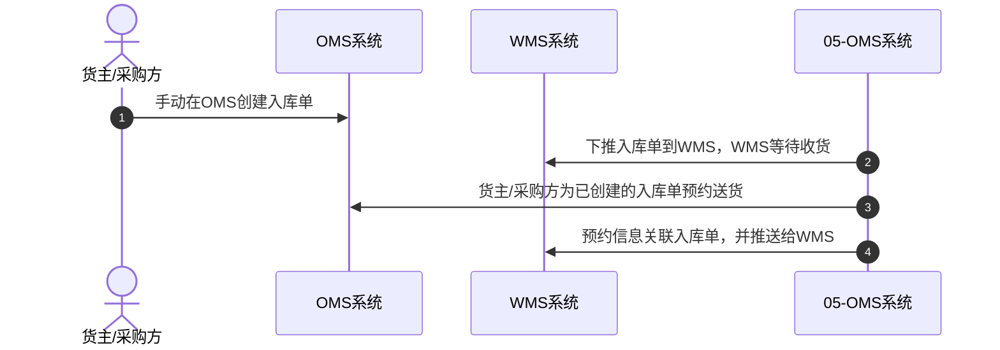

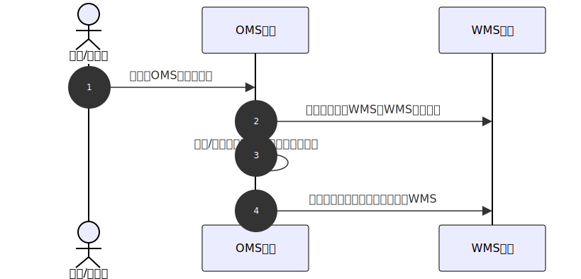

#### 3.2.2 最常见的模式

一般货主（采购方）都会提前和仓库系统完成接口的对接，采购订单从ERP创建，然后推送到仓库的OMS中，再通过规则配置，自动提交到WMS中。所以ERP推送采购订单到仓库，是指先推送到OMS，然后OMS自动处理推送到WMS中。

但是在实际的业务沟通中，往往不会分的这么细，而是会直接说：**ERP推送采购订单到仓库，生成仓库的入库单或者ASN（预到货通知单）。**

OMS的货主可以提前为自己的供应商开通专属的账号，这样供应商就可以登录OMS的预约送仓模块。当采购订单推送到了OMS之后，供应商可以按自己实际送货的情况提前执行送仓预约。

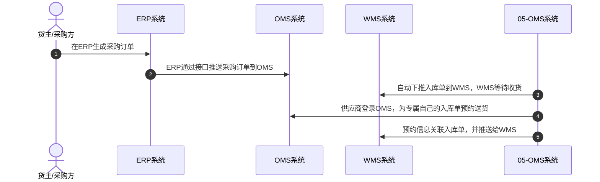

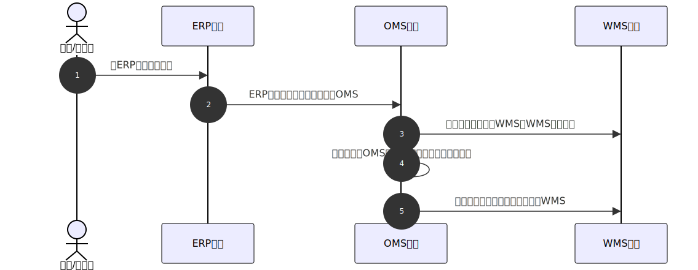

#### 3.2.3 最复杂的模式

如果货主（采购方）的供应商很多，采购需求和采购场景也比较复杂，那么一般会使用SRM系统来完成采购的协同，提升采购的效率等。

SRM一般会有采购端和供应商端这2个端，采购端是给采购方使用的系统，也就是仓库的货主来使用，而供应商端就是货主的供应商使用的系统。

采购订单一般会在采购端创建，然后推送到供应商端，对于供应商端来说这部分就是销售订单。当供应商生产、备货完成之后，就可以按采购订单的要求进行发货，此时就会生成发货计划或者发货通知单。

供应商的发货单，可能会直接让SRM推送到WMS，也可能会让SRM先推送到ERP，然后ERP再推送到WMS。因为业务型ERP一般会承担对接外部服务商的功能，所以SRM先推送到ERP，然后让ERP统一推送到仓库的方式往往更加主流一些。

发货通知单推送到了仓库OMS中之后，对于仓库OMS来说这个单就是入库单或者ASN。当供应商要实际送货之前，就可以执行约仓送货的动作了。

预约送仓可以通过仓库的OMS来完成，即登录OMS的账号，然后创建对应的入库预约单。如果SRM或者ERP（一般是ERP）和仓库完成了送仓预约的接口对接，那么这个预约的功能也可以放在SRM的供应商端，供应商可以在一个系统上完成发货和约仓，效率会更高。

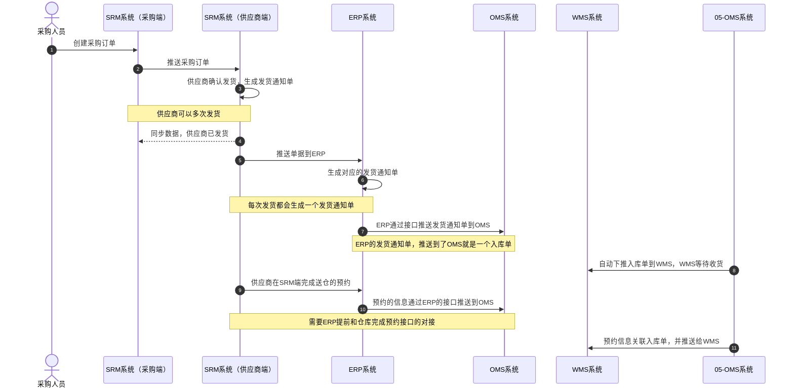

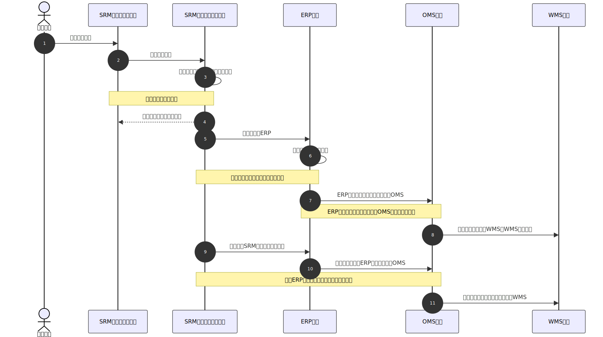

## 4\. 常见的一些疑问解答

1.  供应商送货到仓库之前，都需要预约吗？国内仓和海外仓是否会不一样？

> 送货到仓前是否要预约，是由仓库运营方来决定的。一般来说，大仓库人多，货多，客户多，为了提升这种管理效率，都会要求送货前要预约，便于安排仓库的资源。
> 
> 国内仓和海外仓的玩法也是一样的，只要仓库觉得自己有必要用这种方式来提升入库的效率和秩序，那么就会要求送货前预约。

2.  仓库入库的方式除了采购入库之外，也会有调拨入库和退货入库，这些是否也要预约？

> 一般来说，既然入库要求预约，那么就会包含采购入库的预约，调拨入库的预约，还有退货入库的预约。采购入库和调拨入库，往往单次数量较大，这两种入库的方式基本是一样的。但是退货入库可能就有一些不太一样了，因为退货的原因，退货送达仓库的方式等都有所不一样，所以退货入库的预约会有一些差异。
> 
> 例如海外仓的退货，可能不需要预约，但是会要求退货的时候再仓库收件人或者收件地址上标识货主代码或者其他关键词，便于仓库一眼就能识别这是退货入库，还是正常的备货入库。

3.  供应商送货前要预约，每次都要登录OMS的账号去操作吗？

> 是的，供应商送货到仓库之前要登录OMS的账号，这样才可以查询到属于自己的采购订单，然后根据采购订单去执行预约动作。
> 
> 而OMS的账号是由货主为供应商开通的，这意味着如果OMS的货主有100个供应商，则起码要为这个100个供应商分别开通一个账号。
> 
> 而且每个供应商执行完约仓之后，都可以查看到自己的预约单据，如果因为某些原因要调整预约信息，也可以直接发起变更。

4.  一个货主会有多个仓库，也会有多个供应商。如果每个仓库都要预约，而且这些仓库还是不同的系统（仓储服务商不一样），那是不是要开通多个账号给供应商？

> 是的，如果仓库服务商不一样，那么仓库提供的OMS也不一样。如果一个货主（采购方）有100个供应商，这100个供应商分别要送到该货主（采购方）的5个仓库，而且这5个仓库都是不同的服务商，有不同的OMS账号。
> 
> 那么货主（采购方）则需要分别在5个仓库的OMS中，为这100个供应商开通账号，所以加在一起就有500个账号了。
> 
> 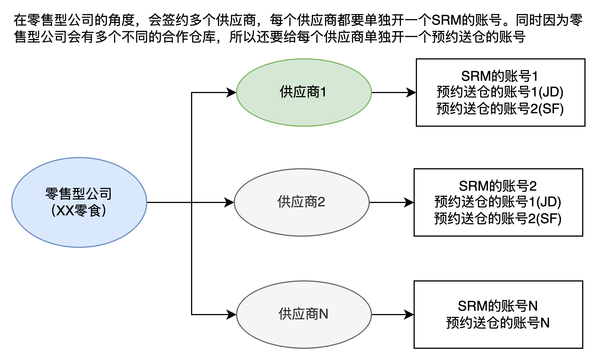

5.  送仓预约单和入库单是一个东西吗？WMS端会怎么使用它们？

> 送仓预约单和入库单是两个不同的单据，一般要先有入库单，然后才会有预约单。
> 
> 入库单上会有几个字段来关联预约的信息，例如说“预约状态（未预约/已预约/预约取消）”，“预约时间”，“预约单号”等。
> 
> 而预约单也会有通过“入库单号”字段来关联入库单的信息。
> 
> 入库单是用来执行收货的单据，是仓库执行收货的业务单据。而预约单，则是用于司机送货到仓，叫号排队、月台卸货使用的。当司机将货物按约定时间送到了仓库，完成了卸货之后，预约单就没什么作用了。