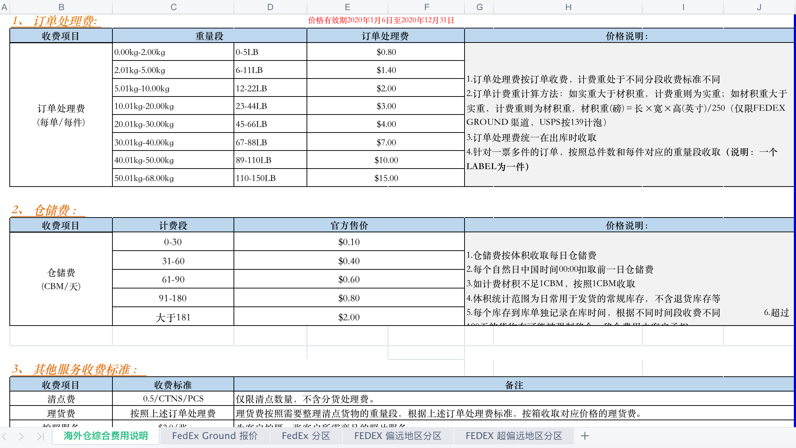
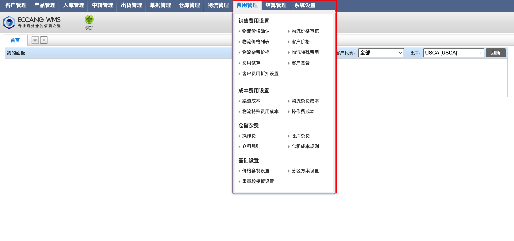
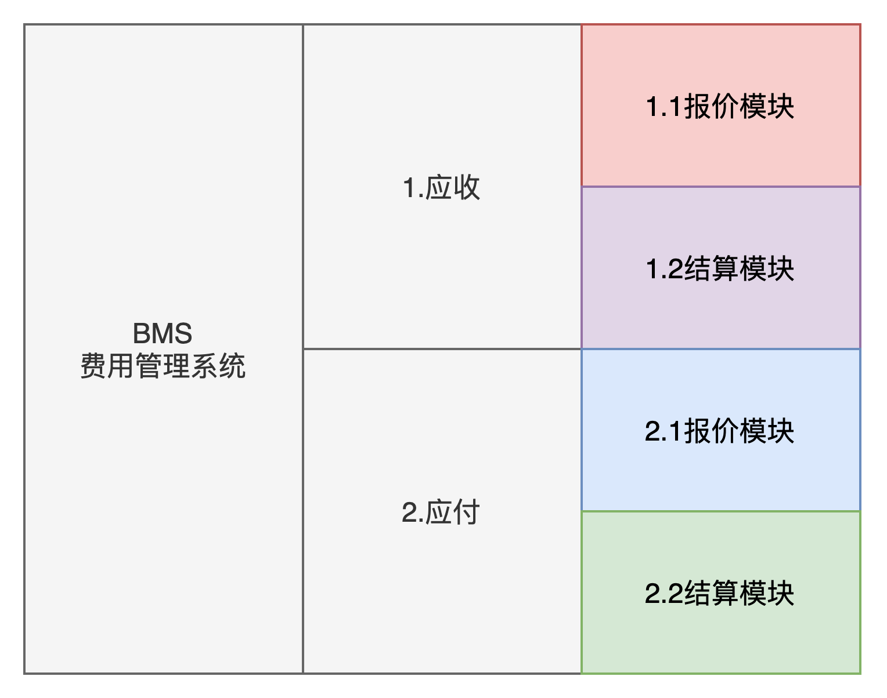
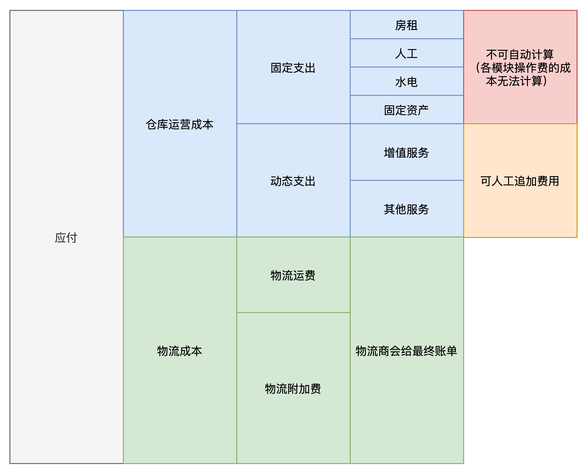
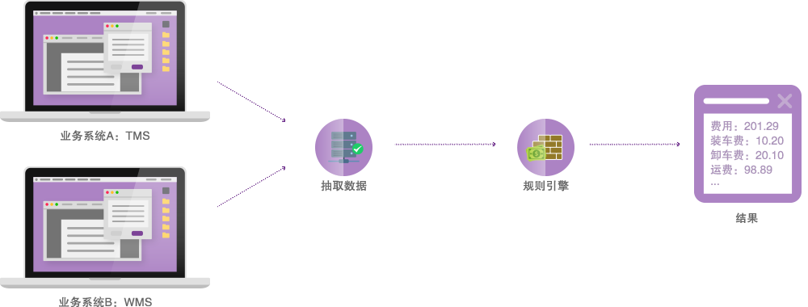
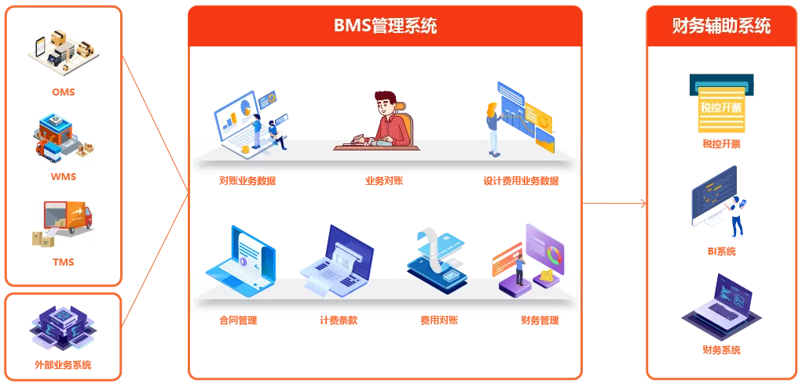
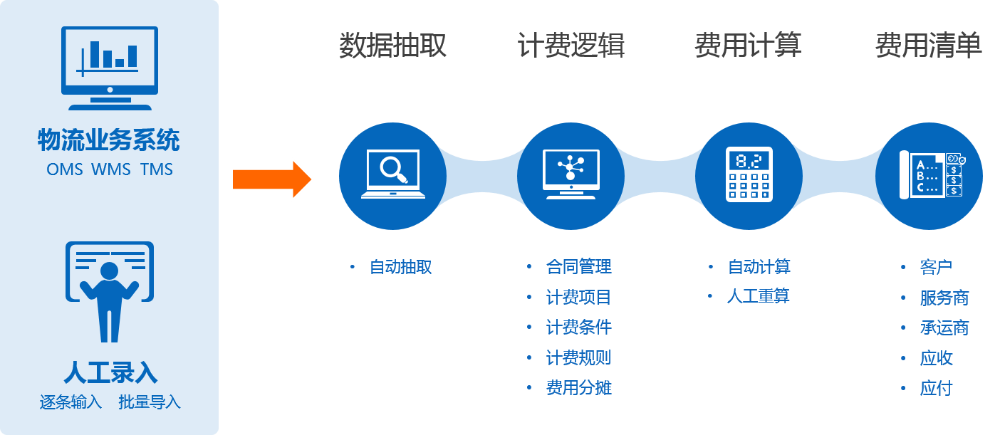
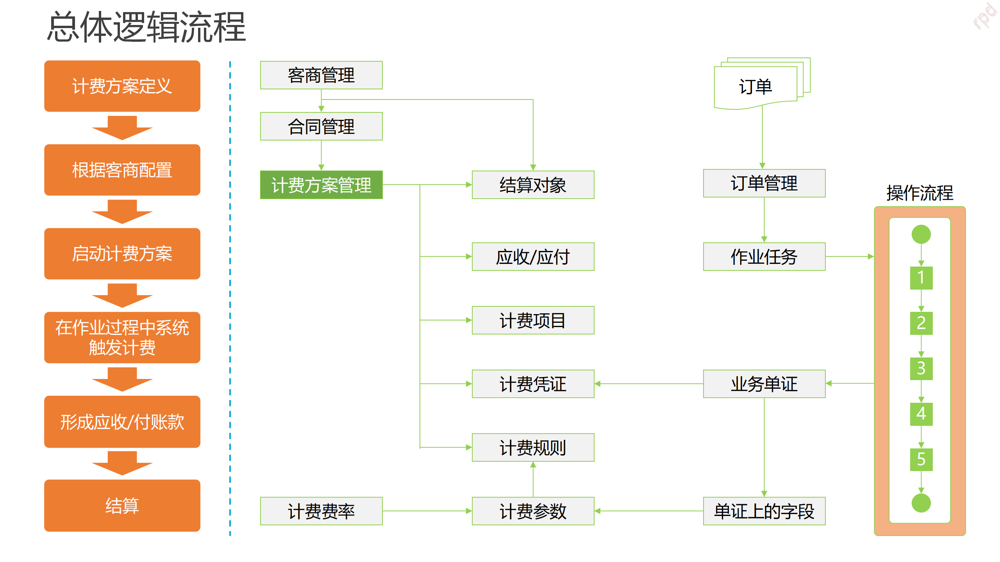

**什么是BMS？**  
BMS叫做费用管理系统（Billing Management System），有些公司也会叫做FMS，意思是指财务管理系统（Financial Management System）。  
BMS和TMS一样很有具有行业特色，也比较容易有歧义。很多人或者公司对BMS的理解是基于物流行业的计费模式而衍生出来的，而且仓储行业又和物流行业有天然的关联关系。所以聊到BMS时，除了想到TMS，也可以想到WMS。  
在海外仓系统（WMS）中，BMS也是用于费用的计算和账单的核对等业务，和国内仓储物流领域的TMS大体是相似的，只不过是计费的项目和规则不太一样。  
**海外仓BMS用途是什么？**  
当海外仓服务商租赁了一个仓库，一切硬件，软件都到位之后。第一步要考虑的就是如何引入客户的问题，因为海外仓是为了客户提供仓储服务的。  
既然要提供服务，那么肯定是需要明码标价的，因为客户需要结合多种因素来判断到底使用你的仓库还是别人的仓储。对客户的报价，一般会用Excel提前列好相应的明细，然后发给客户去比对、查阅。  
  

某海外仓报价表示意

  
一般来说，不同的仓库对不同的客户都有可能会有不同的价格，所以报价表的种类和版本就会有很多，为了节省制作报价的时间，同时也为了方便计算自己的利润和降低管理成本等。  
一般海外仓会先制作一份基础报价，也称之为公开报价，可以适用于所有客户；然后有一些客户可能是KA或者VIP等，希望在基础报价的基础上再优惠一些，于是海外仓就根据基础报价再做一些微调（设置折扣，减收部分费用项等），这样得出来的报价一般称之为VIP报价或者定制报价。  
报价用Excel制作，发给客户看很方便，但是如果客户已经接入了，实际发生了相应的业务之后，要去根据Excel的报价来计费费用就很麻烦了。 所以我们需要将Excel的报价整理好，然后导入到系统中，将这些报价转化为对应的计算公式，后续就可以根据实际的业务数据来自动调用公式，从而得出费用。  
而支持导入这些报价，并通过业务数据来计算对应费用的系统，它就是费用管理系统（BMS）。有一些公司会将BMS单独抽出来，当做一个独立的系统来进行开发、迭代；而有一些公司也会将计费系统植入到WMS中，当作WMS的某个子模块来使用。以上两种方案都很普遍，具体选择哪种技术方案，可以根据自己的业务情况来判断。  
  

易仓WMS是把费用管理当作一个子模块

  
抽出单个系统便于后续的业务拓展，可以分别迭代管理，精细化运作，适合内部自研的WMS模式，可以针对自己的业务场景进行拓展；而合并在WMS中，则可以减少开发成本，快速调用业务数据，更加轻量化，这种就比较适合SaaS版的产品，可以降低实施交付的成本，用户也可以快速上手，集中化使用。  
**BMS的主要模块**  
无论是基础报价还是定制报价，这些报价都是对外（面向客户）的，也就是海外仓需要向客户收取的，所以这些报价所产生的费用又可以称之为“**应收费用**”。反过来看，如果海外仓需要固定向自己的供应商或者服务商支出某些成本费用，那这些费用就称之为“**应付费用**”。  
**所以在BMS中，如果按费用的流向来区分，可以分成“应收”和“应付”两大块。**  
在完成了报价之后，通过采集相应的业务数据，结合报价的计算公式，可以计算出具体的费用明细，然后将费用明细汇总成一个账单，向客户收费或者向供应商付费。  
简单理解为BMS除了要支持录入报价之外，还需要有一个计算费用并生成账单的功能，一般我们把这两个步骤定义为：**报价和结算。**  
  

BMS的主要模块

  
在海外仓系统运作中，应付的成本往往比较固定，同时又不太好分摊到具体的业务单据上。所以关于应付模块一般更多的是关注一个总数，同时也不会用到比较复杂的计算公式，故而这一块在系统方面发力的会比较少，常用手动录入、登记的方式记录某些费用。例如房租、水电，人工，固定资产这些不好计算，一般就不会录入到系统里面去；而一些增值服务类，例如帮忙加班，调度车辆，定制化加工某些产品等，这些所产生的费用就会先手动线下记录，后续再统一录入到系统中去。  
  

应付示意图

  
海外仓的BMS的重心主要是在应收模块，因为对客户的应收报价类型多，应收模块的多，应收的计算公式也比较复杂。  
海外仓的应收费用一般是由库内操作费，仓租费和物流费这三大类型构成的。其中库内操作费往往规则最多、最复杂，计算起来也是最为麻烦，主要取决于仓库对费用项把控的粒度；仓租费一般都比较简单，因为规则是通用的，常用产品的体积或者托盘来按天计算费用；物流费用则比较动态化，如果完全按物流商给的应付报价进行一对一的转化，然后向客户收取（行话也叫做“背靠背”），那物流费也会很复杂，因为使用的物流渠道越多，计费规则也会越多。如果能对一些物流商的报价梳理、整合，然后单独对客户报价，就可以精简化物流计费的规则，报价也会简单一些。  
  

应收示意图

  
除了上述说到一些核心模块之外，BMS一般还会有客户模块，客户账户模块，合同模块，规则模块，账单模块，业务数据模块等，在此就不做详细的赘述了。  
**BMS与其他系统的协作**  
我从之前收集的资料中摘了几个图给大家看看，方便理解BMS和其他系统的协作关系是怎么样的。  
  

示意图1：来源网络

  
  

示意图2：来源网络

  
  
  

示意图3：来源网络

  
  

示意图4：来源网络

  
TMS和WMS作为业务系统，会提供对应的业务数据到BMS中，然后BMS通过配置好的计费规则计算出相应的费用，然后将费用汇总成具体的账单，最后再进行结算。  
之前我提到过很多次“OTWB”这样的概念，指得是OMS，TMS，WMS，BMS这几个系统，这个概念一般用于仓储领域，因为用了仓储一般都会和物流挂钩，所以有了WMS就会有TMS。仓储类的业务系统的核心的业务单据流向一般是：OMS->TMS->WMS->BMS或者OMS->WMS->TMS->BMS。  
但是市面上也会有“OTB”这样的概念，指得是OMS，TMS，BMS这几个系统，这个一般用于物流（快递、快运，专线，整车等）领域，因为对于物流来说，重点是在运输而不是存储，所以仓储这一块做得简单一些，不需要用专门的WMS来处理。物流类的业务系统的核心的业务单据流向一般是：OMS->TMS->BMS。