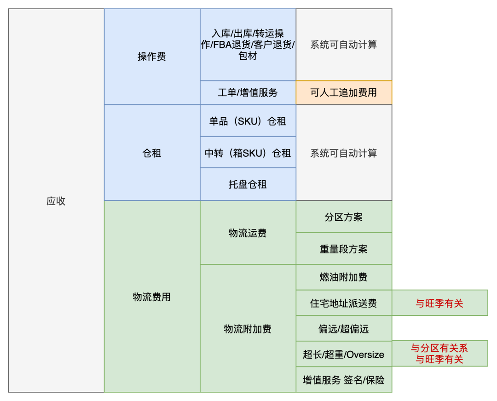
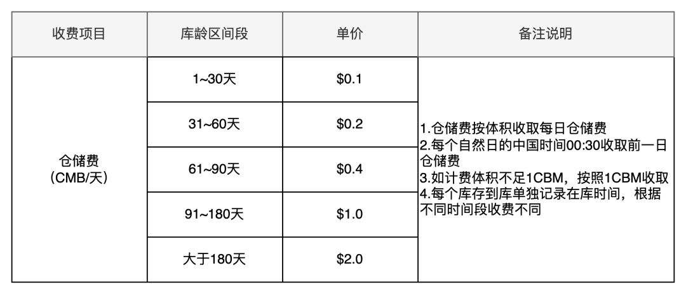
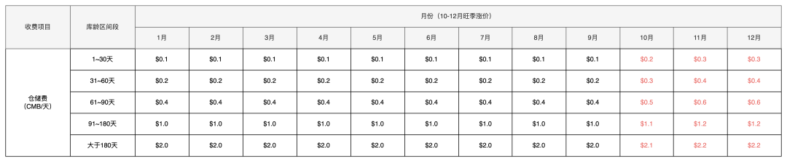
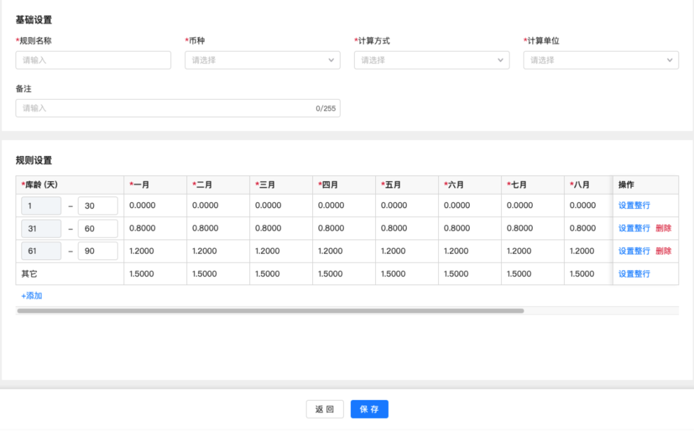
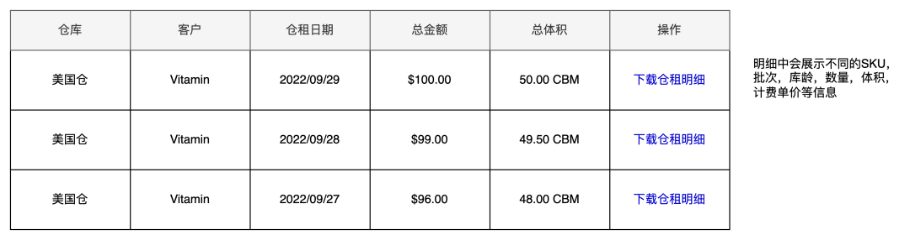

**一、仓储费说明**  
  

海外仓应收费用示意图

  
三大计费板块中物流费是赚钱的环节，而仓储费则可能是最不赚钱甚至是亏钱的模块了。一方面是因为海外仓的租金成本比较高，海外仓的库内精细化管控也不够到位，所以库容利用率也比较一般，成本高了也就不好赚钱了；还有一方面原因是前两年因为亚马逊封店、限仓导致海外仓迎来了一波跟风的快速增长，大家为了吸引客户，纷纷把仓储费一降再降，恨不得直接免仓租来拓客……  
**虽然仓储费不怎么赚钱，但是对于一套海外仓WMS来说，计费的需求还是非常的强烈且关键的，毕竟做电商的利润就是一分一毫抠出来的。**  
仓储费的计算方式一般是按照货品的体积，结合货品在仓库存放的时间来计算的。也有一些海外仓没有用系统或者想要简化计费方式，就会采用托盘数量，结合存放的时间来计算。  
如果是按货品体积来计算，则是统计出所有货品的总体积，然后按CBM（立方米）/天或者CMF（立方英尺）/天来计算。例如：  
在计费的时间点，某个货主在库的货品的总体积是100CBM，然后仓租的报价是$0.1 CBM/天，那么当天的仓租就是100\*0.1=10USD，每天统计一次，以此类推。  
如果是按托盘数量来计算，则是统计出所有货品一共占用了几个托盘，不足1托盘的也按1来算，例如：  
在计费的时间点，某个货主在库的货品一共放在了50个托盘上，然后仓租的报价是$0.2 托/天，那么当天的仓租就是50\*0.2=10USD，每天统计一次，以此类推。  
**二、按货品体积计算仓租费**  
仓租一般都是“日结累加”的方式统计的，但是日结也是有一些门道在里面的，接下来就跟大家分享一下其中的一些细节之处。  
首先，仓租一般是按货品的体积来计算的，因为体积能衡量占用的空间的多少，相对来说是比较准确的。但是体积其实是不能相加减的，但是为了简化计费的难度，一般都会采用累加法来计算体积。先算出某个SKU的体积是多少，然后再乘以库存数量，就得出来了此SKU在库的总体积。  
其次，在计算SKU的体积的时候，关于长宽高的取值也是海外仓历来都存在争议的话题。客户在创建基础资料的时候会填写货品的尺寸信息，然后仓库也会直接使用客户的数据来计费或者其他必要的用途。后来，有一些客户可能发现这个地方会有漏洞，于是就会将实物的尺寸刻意填小一些或者人为的失误导致信息不准确，久而久之仓库发现客户提供的数据就不太准确了。  
于是就有了一个“新品测量”的要求，也就是第一次来仓库的货品，仓库都会自己手动测量一遍，用来和客户的数据比对，如果没有差异或者差异在误差范围内，就以客户的为准，如果有很大差异则可能需要发起特殊的处理流程，这里有一系列的繁琐事，在此按下不表。后来，逐渐形成了不成文的规定，那就是：**按仓库测量的尺寸来计算仓租**。  
接着，当解决了SKU体积取值的问题，就会面临另一个难题：**因为仓租很便宜，所以导致客户一直把货物存放在仓库中，库存周转率非常低，仓库都没有多余的空间来处理其他客户的货物了**。  
为了提升客户的库存周转率或者说避免客户长期存放货物，仓库提出了仓租需要**按梯度来计费**的方式。如果货品存放的时间很短，例如7天以内，那仓库就直接免仓租，不收费；如果货品存放的时间很长，例如几百天了，那么仓库就要加收仓租（更高的单价），让用户尽快处理掉这些货物，腾出空间给其他的新客户。这种思路很好，于是系统也要提供相应的支持：**即按不同的批次来统计库龄**。  
仓库中某个货品有100个库存，单个货品的体积是0.0001CBM，那么总体积就是0.01CBM，然后要计算仓租的时候直接乘以仓租单价就好了。但是因为引入了批次库龄的概念，所以仓租的单价其实是不同的，需要按不同的库龄区间段来匹配单价。例如100个库存中，有60个库存批次是一样的，库龄是29天；而有40个库存批次是一样的，库龄是31天。仓租的报价是1~30天内，是$0.1 CBM/天，而31~60天，是$0.2 CBM/天。  
  

库龄梯度仓租报价

  
最后，解决了批次库龄的问题之后，海外仓发现好像这样计费还是不赚钱，因为海外仓的业绩情况和电商的促销活动息息相关。例如接近年底的时候美国有“黑五·网一”这样的活动，行业内称之为**旺季**。  
在旺季的时候，仓库的单量会急剧上升，爆仓也是常有的事，所以库容非常的关键，如果这个时候有一堆卖不动的货品放在仓库中，就会大大地影响仓库赚钱。于是乎，海外仓又提出了，除梯度仓租之外，还需要按时间段（月份）来收取不同的仓租。  
**简单理解就是旺季的时候仓租会更贵，而淡季的时候仓租就会更便宜。**  
  

库龄梯度-时间段仓租报价

  
在计算仓租的时候，除了要判断库存的批次对应的库龄之外，还要看当前是属于哪个月份，是否属于旺季，然后结合上面的二维表，就可以得出具体的仓租单价了。  
**三、按托盘数量计算仓储费**  
从我个人的经历来看，遇到用托盘数量来计算仓租的海外仓比较少，大多数选择这样计费的仓库都是因为没有系统或者做的业务比较简单，直接入库打托，出库也是按托盘出库。因为我们没有实际做过这一块的业务，所以我按我自己的理解来拆解一下这一块的逻辑，如果有什么表述不准确的，也希望有专业人士指导一下。  
首先，每个货主的货物入库之后都码放到托盘上，上架也是直接按托盘放到地推库位上，然后记录托盘数量有多少。这样就不需要人工去测量产品的尺寸，也不需要计算那么多SKU还有批次等信息。  
接着，出库的时候，直接按箱子或者按托盘出，再记录一下出库了多少托盘。如果只是出了托盘上的某些箱但是没有全部出完，则这个托还是算库存的。  
最后，每天晚上统计每个货主当天还在仓库剩余多少托盘，就可以快速统计出每天的仓储费用是多少。直接用托盘数乘以仓租单价即可。  
这种方案，简单粗暴，也可以搭配时间段（月份）来设置仓租单价，非常适合主做亚马逊FBA中转的海外仓使用。但是弊端也是非常明显，例如：  
●不足一托也按一托算，对客户来说收费可能就比较贵了，客户会觉得有点亏；  
●这种方式没有办法梯度收费，如果货物放在仓库比较久，也没办法通过仓租来督促客户尽快处理；  
●上架的时候不方便拆零分开上，因为要统计托盘数，所以货物一般都是放在地堆上或者高位货架上，仓库的作业模式就会受到限制，仅适用于整箱（整托）入库和整箱（整托）出库；  
●每次入库和出库都要单独维护托盘的内容，对操作人员来说有点麻烦了；  
**四、仓储费的方案设计**  
上面聊了很多业务的说明，接下来再来看看关于产品方案设计方面的内容。  
对于BMS来说，无论是仓储费，还是物流费或者库内操作费，计费的本质其实就是**套公式算结果**。所以BMS也可以拆成这么几个部分：  
1数据部分，即计费需要采集的数据，例如仓租需要采集体积和库龄  
2公式部分，即计费规则的维护，应该怎么计算，怎么组合  
3结果部分，即计费最后得出的结果是什么，然后能不能把计费的过程或者明细体现出来  
  

“数据”套入“公式”得出“结果”

  
**1\. 数据部分**  
如果是按货品的体积来计算仓租，那么需要采集的数据就主要是：  
●SKU的单个体积；  
●SKU的批次库龄，批次的数量；  
关于SKU的批次库龄是怎么计算的，可以看“

[3.5 海外仓OMS的库存模块](https://www.yuque.com/jiaowovitamin/dgugdp/asmdklrn1zc7y504)

”有详细的介绍。  
**2\. 公式部分**  
还是按货品的体积来计算仓租，如果是要达到上述说的所有的业务要求，那么就需要配置对应计费公式，包含：  
●计费的体积单位  
●库龄区间分段  
●不同月份的单价  
  

仓租计费公式的配置示意图

  
**3\. 结果部分**  
采集到了数据，然后也配置了计费的公式之后，就可以算出相应的仓租了。  
具体的计算方式就是采用“单个累加法”，先用SKU的批次库龄和数量找到对应的计费公式，然后分别算出不同库龄在不同月份的单价，接着再把所有SKU的仓租都计算出来，最后合计在一起，就是某个客户所有的货品在仓库中一天所需要支付的仓租。如果需要按周或者按月统计总共的仓租，那么就把每天的仓租费用汇总一下即可。

每日仓租结果展示

  
**五、小结**  
对于BMS来说，仓储费用方面的计算应该是算最简单和最基础的模块了，想要学习BMS相关内容的朋友可以试着从这个角度切入。  
仓储费的计算公式比较简单，没有太多的逻辑在里面，可能稍微难一些的是计费数据的采集，涉及到了批次，库龄，还有体积，数量等汇总和传输，还是容易踩到很多小坑的。  
关于BMS的仓储计费内容就聊到这里，下一篇我们再来聊聊库内操作费的内容。