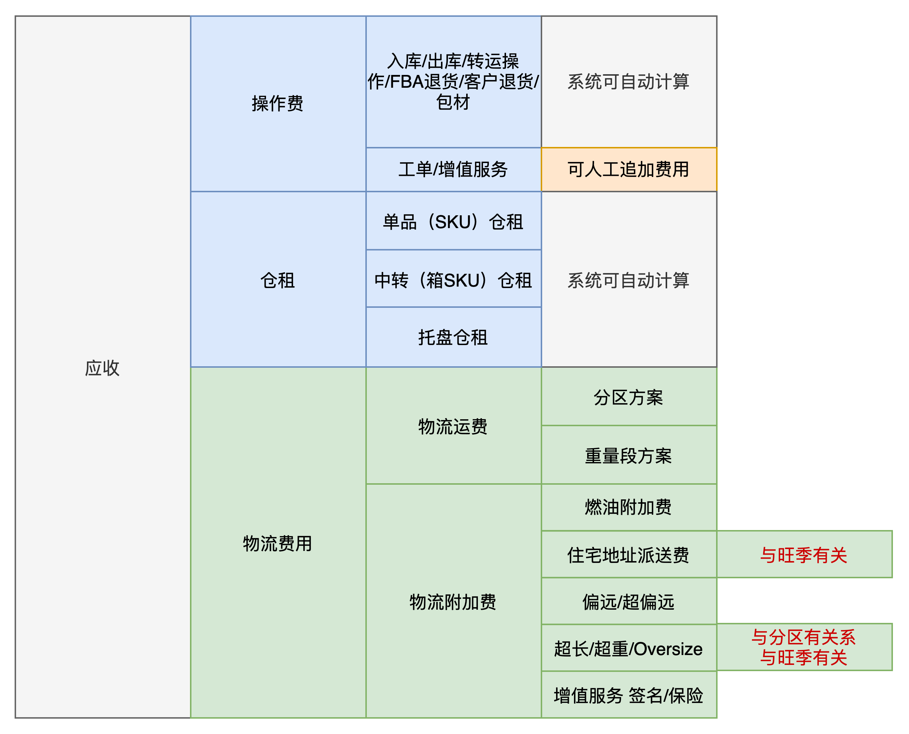
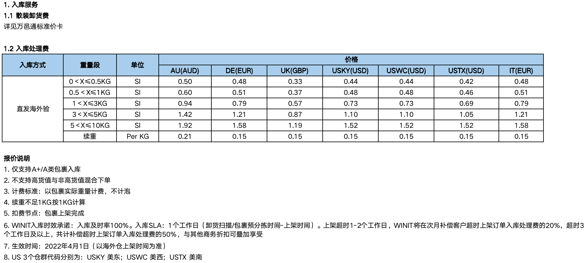
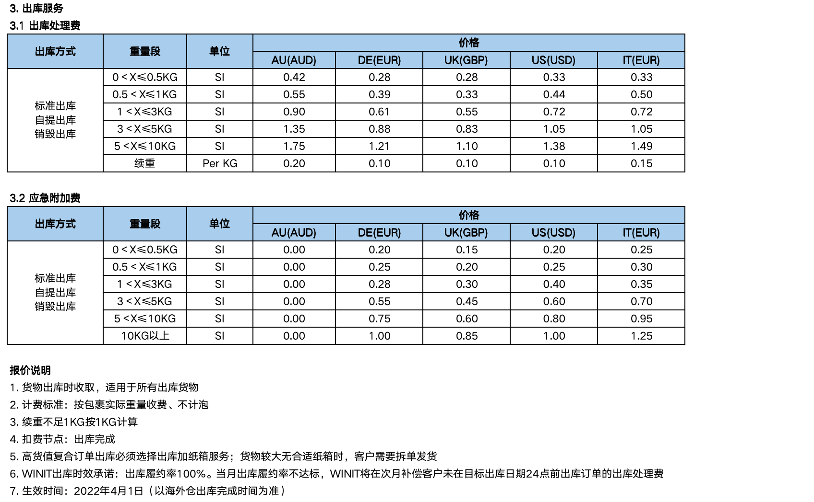
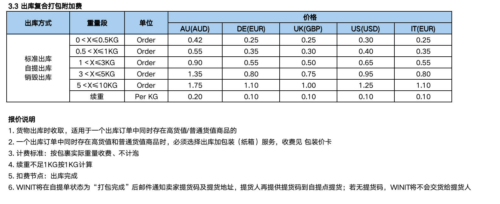
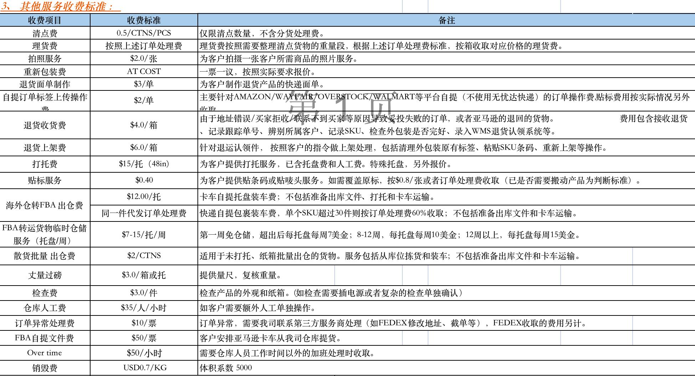
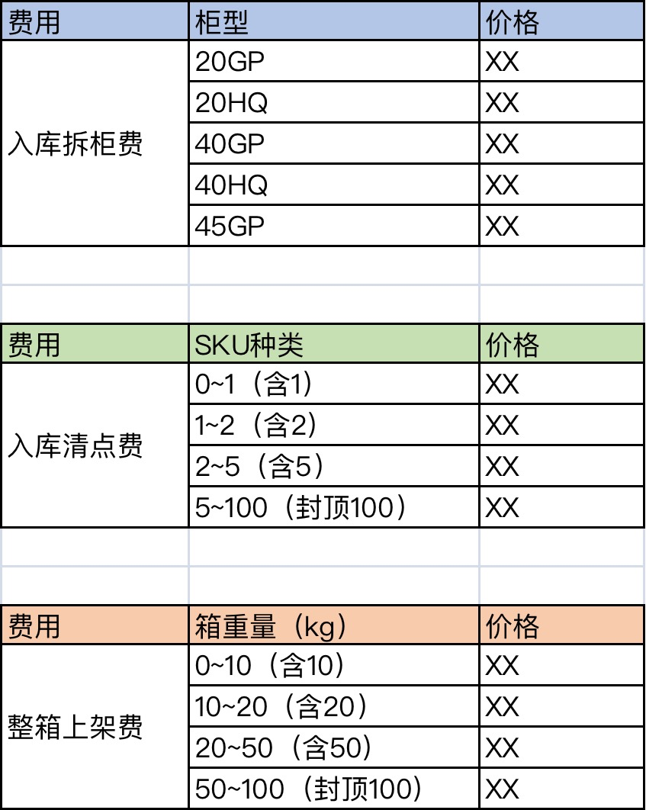
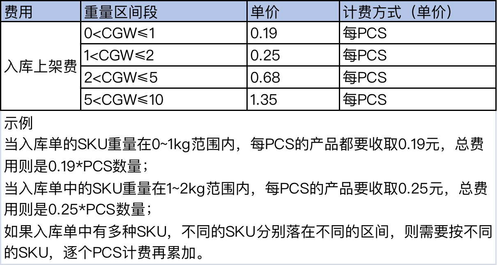
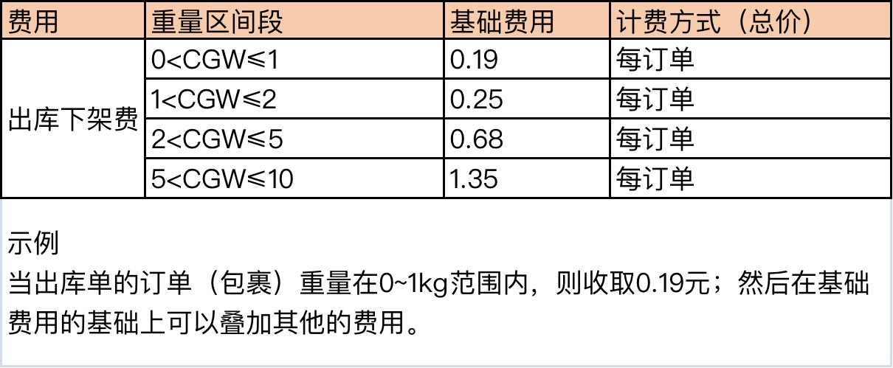
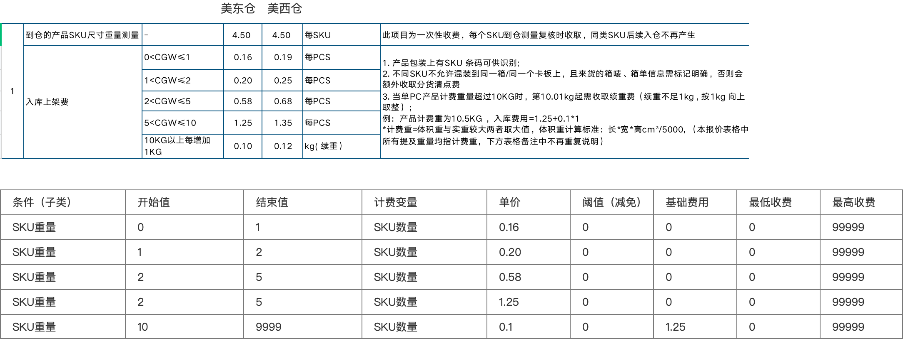

**什么是库内操作费？**  
  

海外仓应收费用示意图

  
在三大计费板块中操作费是计费是最复杂，也是最容易出问题的一个环节。因为仓库中要做的操作有很多种，而且很多操作是不记录在系统中的，这样就会导致系统不太好收集这些基础的业务数据。从BMS“计费的本质公式”可以知道，要计算出费用最核心的还是：  
1计费的数据/变量；  
2计费的公式/规则；

  
不同的仓库，不同的业务模式，在库内操作的时候会有不同的要求，所以计费项也会复杂多变。如果数据没有标准化，那么就无法采集或者采集后也不好套入公式去计算。  
所以针对库内操作费的计算可以分成两大块：**分别是系统自动计算部分和人工计算追加的部分**。标准化的数据和公式就可以通过系统来自动计算出费用，而一些不标准的数据或者不标准的公式，就只能人工去计算，最后补录到计费结果中。  
如果想要解放人力，提升效率，那么就要争取让“自动计算”的部分占比更高一些，尽量把一些不标准的数据整合在标准的数据。  
**操作费的报价**  
业务量越大的仓库，对自动化计费的要求就越高，所以这一块的占比要不断地提升，于是很多大型仓库就会尽量简化一些计费项，这样能让数据更容易标准化。而一些业务量不大的仓库就会很纠结一些细枝末节的东西，例如收货的时候是不是帮忙拆板了，有没有做清点，搬运的货物是否超长超重了，是否帮忙换了一些破损的外包装或者条码等，这些动作很多都不方便记录到系统中，所以就不能自动计费了。  
  

万邑通-入库操作费报价

  
  

万邑通-出库操作费报价

  
  

万邑通-出库打包附加费报价

  
对于一些不能标准化的，或者不利于直接采集的数据，往往会先通过报价表告知客户（一般是指增值服务）。然后在实际业务发生之后通过手动补录或者线下记录的方式，最后合并后归总在客户账单中。  
  

无忧达-其他服务费报价

  
库内操作费一般也会按业务类型或者出入库方向来划分，主要有：  
1入库的费用，卸货操作费，入库清点费，上架费等  
2出库的费用，下架费，加箱打包费，订单处理费，序列号采集费等；  
3增值服务的费用，贴标费，拍照费，打托/打板费，工单处理费，加班费等；  
一般入库和出库的费用相对比较容易做到标准化计费，所以是系统自动化计费重点关注的模块，而增值服务的内容则因为不够标准或者系统不能沉淀相应的数据，所以采用手动补录的方式居多。  
**操作费的计费规则**  
观察一些海外仓给出的报价表之后，我们发现操作费的计费规则大多数都是“基于不同区间段的不同计价方式”，而且计价方式一般都是采用“区间单价”或者“区间总价”的方式。  
基于不同的区间段的不同计价方式，是指不同的前置条件下，会有不同的计价方式，前置条件常见的区间段有：单据的总重量区间，每个SKU的重量区间，每个订单的货品数量区间，SKU种类，入库箱子的数量，单箱的体积和重量等。  
  

前置条件案例

  
前置条件不一定都是区间，因为区间是数值的一种判定方式。如果是一些非数值的内容，也可以用关系运算的方式来判断，例如包含，不包含，是，不是等。  
区间单价是指，落在了某个区间之后，就按这个区间的单价去乘以实际的数量；区间总价是，落在了某个区间之后，就按这个区间的总价（一口价）来计算。  
  

区间单价

  
区间总价一般是按整个单据或者整票货来收，一般要乘的系数都是1，所以区间总价也可以理解为是一种特殊的区间单价。  
  

区间总价

  
**操作费的计费方案**  
了解了操作费的一些业务知识和通用的规律之后，接下来看看操作费的计费方案一般是怎么设计的。  
**数据部分**  
库内操作费一般会按业务的模块来划分，例如入库，出库，退货等，所以针对不同的模块也会有不同的数据采集要求。从业务系统侧采集数据回来的时候，要根据业务系统的状态、时机等来判断采集的时间点，同时也要提前定义好采集的数据信息有哪些。  
例如入库的时候需要采集柜型，卡板数，箱数，箱体积，箱重量等；而出库的时候需要采集出库单的重量，货品明细，包裹数量，包材数据等；退货的时候需要采集到货包裹的重量，货品明细，贴标数量，重新装箱的结果等；  
**公式部分**  
库内操作费的公式是最难的一个点，一方面要梳理出不同费用项的计费公式，然后抽出多个公式的共同点，设计成一套通用的计费公式配置功能；另一方面要考虑多个费用项组合在一起之后的特殊要求，例如优先取值性，排他性，累加性等。  
先将报价表中的前置条件和计费变量拆解出来，前**置条件与计费变量是一对多的关系，也就是满足了某个前置条件后，计费所使用的变量并不是条件中的变量**。  
例如“满足订单重量大于5kg（条件变量），则按订单的重量（计费变量）\*某个单价”，这种就是条件变量与计费变量相同的时候，属于一对一的关系；但是也可以变成“满足订单重量大于5kg（条件变量），则按产品的每PCS数（计费变量）\*某个单价”，这种情况下条件变量和计费变量就不相同，属于一对多，因为一个条件变量，后面可以对应多个计费变量。  
  

  
条件变量和计费变量的关系  
理解了条件变量和计费变量的关系之后，我们再来看看计费公式一般是怎么构成的。  
  

库内操作费计费公式拆解

  
单看上面的计费公式拆解肯定还是有点迷糊的，接下来再看看一个具体的案例，套入到对应的计费公式配置表中就更好理解了。  
  

报价表与计费公式案例

  
每一个区间的报价，都会对应一行计费公式配置，有多少个区间就要填写多少行计费公式配置。然后逐行判断，满足一行就收取一条费用，满足两行就收取两行费用，以此类推，所以配置的时候要注意别配错了。  
最终设计出来的原型也和上述案例中描述的类似，只不过多了一些计费项的细节补充等。  
  

计费规则的配置原型示例图

  
“单位数量”是指最小计费的数量级是什么，例如每KG多少钱，每PCS多少钱，这时候的单位数量是1，大多数情况下单位数量默认都是1；如果是每2KG多少钱，每5个多少钱，这里的2和5就是不同的单位数量。  
“是否进位”一般和“单位数量”搭配使用，例如单位数量是5，实际数量是12，若选择不进位，则算出的计费数量是2.4（12/5=2.4）；若选择了进位，则算出的计费数量是3（2.4向上取整就是3）。**进位相当于不足单位数量的时候是否要向上取整，和四舍五入有一些不一样，需要注意区分**。  
“基础费”是指某一条计费规则是否需要加上起步价或者基础加收的钱，只要满足了条件变量，那么基础费是一定会收取的。  
“最低收费”和“最高收费”类似于最低消费和封顶收费的逻辑。指当该计费规则算出的费用低于了最低收费的时候，需要按最低收费收取；如果算出的费用高于最高收费，则按最高收费收取。  
**结果部分**  
库内操作费的计费数据采集和计费公式配置搞定了之后，接下来计算结果也有一些容易踩坑的点需要注意。  
一般来说库内操作费的使用频率最高的计费公式就是：  
((计费变量-减免值) / 单位数量) \* 单价 + 基础费用  
只要掌握了这个公式，然后将对应的参数引入进去即可算出最后的费用。需要注意的是除了公式之外，计费配置项中的一些约束条件等也需要代入进去一起判断。  
例如“是否进位”，就决定了 **(计费变量-减免值)/单位数量** 后得出来的值是否要进位后再处理。  
例如“最低收费”和“最低收费”就决定了最后算出的费用到底取哪个值。  
例如有一些费用项是需要对逐个SKU或者PCS计算，然后算完之后再作求和的，不是算完一个就停止了……  
关于计费结果的部分，最简单的方式就是用Excel表将一些需要采集的变量列出来，然后把变量对应的计算公式也列出来，最后套入到公式中走查一下是否都可以配置出来，也可以试着手动算一下结果，与系统自动计算的结果对比验证。  
  

Excel表列出计费的变量、公式和例子等

  
**小结**  
库内操作费的计费其实远不止文中描述的那么简单，为了降低阅读的难度，照顾更多的朋友，我对一些内容都做了删减。但是总得来说，只要理解了这一块的核心思路，无论业务需求怎么变化，都是可以灵活应对的。  
首先要先掌握计费条件的判断，有哪些前置条件，这些条件要怎么配置，然后怎么判断，才能让系统知道是需要使用这一条计费项来计费的。  
其次就是计费变量有哪些，这些变量一般是怎么计费的，有哪些公式，这个公式能不能兼容多种费用项，然后通过配置公式的方式引入参数，从而计算出结果。在计算结果的过程中，也需要注意一下相关的约束条件。  
最后就是关于哪个单据要使用哪个计费规则的判定，这一块属于报价方案维度的内容，我会在后面的文章讲解这一块的内容。  
大概的思路就是讲不同的业务类型的计费规则打包成一个客户报价方案，然后给每个客户关联对应的报价方案，后续该客户的业务单据发生了之后，就会通过报价方案找到具体的业务计费规则，然后开始执行规则，最后算出每条规则的费用并汇总成业务单据的费用。