**基础知识普及**  
**1.实重，体积重和计费重**  
“重量”是快递快递/物流的计费基础，了解什么是“实重”，什么是“体积重”，什么是“计费重”，是万里长征的第一步。  
实重，就是实际的重量，用电子秤测量出来的数据，例如一个邮寄一个包裹，测量的重量是1.5kg，实重就是1.5kg。  
体积重，属于物流行业中的专用的一个名词。当一件物品的体积太大而重量太轻时，这样在运输中就会把它的体积折算成重量来收取费用。计算公式是：**体积重(kg)=长(cm)×宽(cm)×高(cm)÷体积重系数**，其中“体积重系数”是一个变化值，一般常见的是5000或者6000。  
计费重，一般是根据货物的实际重量和货物的“体积重”二者比较后，取其中的较大值，而计费重就是用来计算物流费用的重量。  
  

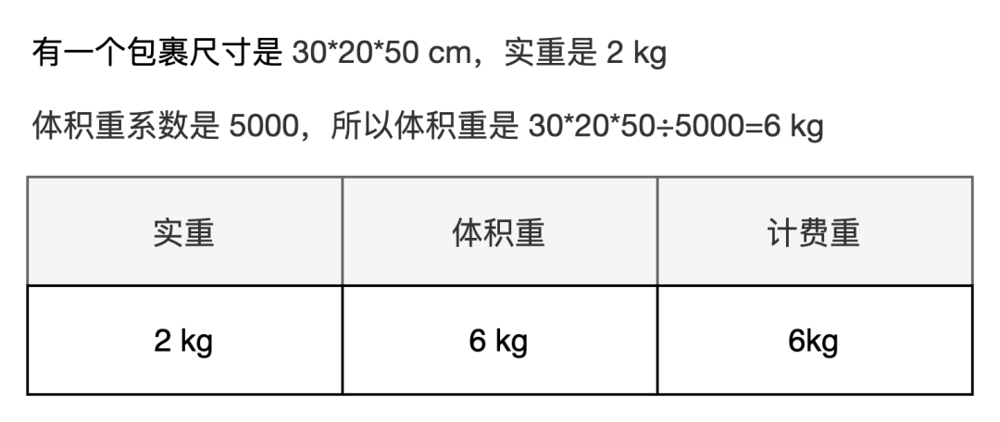

  
行业内一般把体积重大于实重的货物称之为“抛货”或者“泡货”，通俗理解就是重量轻，但是体积大的货品。关于泡货的更多内容，我推荐看看这一篇文章《[一文揭秘空运的各种“重”和“泡”的计算，建议收藏以备不时之需！](http://mp.weixin.qq.com/s?__biz=MzIxNzMzMTM0OQ==&mid=2247486312&idx=1&sn=f91c580864f482a2ff55bd82118cb38e&chksm=97fa2892a08da1844495253828fa5dc5f490fde29111d436b0fc350177c592801d547b146783#rd)》。  
**2.续重单位**  
“续重单位”这个概念可能初步听起来有点不太好理解，但是可以先看下方的案例，然后从案例中来吸收理解一下。  
某个物流渠道的报价是，1kg内收取10元，超过1kg后，每超0.5kg收取2元，不足0.5kg的按0.5kg算。  
这个案例中的“0.5kg”就是“续重单位”，也可以称之为“续重计重单位”或“计重单位”，如果包裹的重量是1.3kg，那么按照进位规则， 应该当做1.5kg来算；如果包裹的重量是2.6kg，则应该当做3kg来算。  
  

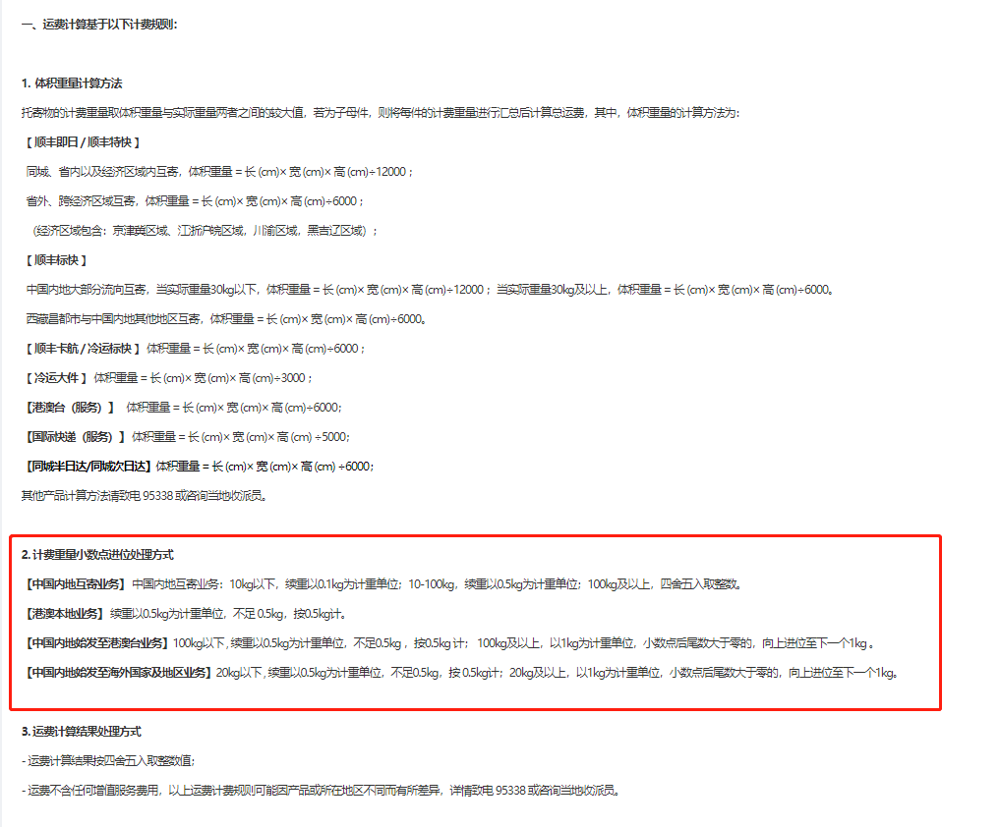

  
**3.燃油附加费**  
一些主流的国际快递（UPS，Fedex，DHL）除了收取运费和一些附加服务费之外，还会固定加收一部分燃油附加费。燃油附加费会动态更新，一般是一周一个价格，具体的规则可以看各家物流商的官网描述。  
UPS使用指数式附加费且于每周进行调整。更新的附加费将于每周的星期一生效。附加费将基于美国能源部（EIA）所公布的美国墨西哥湾沿岸(USGC)煤油型航空燃油价格，且本周所报告的价格将在两周后生效，四舍五入到最接近的美分。  
  

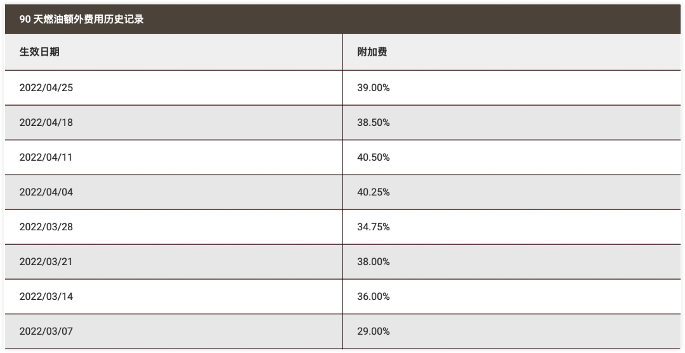

UPS燃油附加费-摘自UPS官网

  
燃油附加费的收取有一个细节要注意，那就是很多人都以为燃油附加费是收取公式是：**基础运费\*燃油费率**。但是实际上不只是基础运费要收取燃油费，一些额外的附加费也需要收取燃油费，所以准确的公式应该是：**(基础运费+部分附加费)\*燃油费率**。哪些附加费是要加收燃油费的，可以看各家物流商的说明。  
  

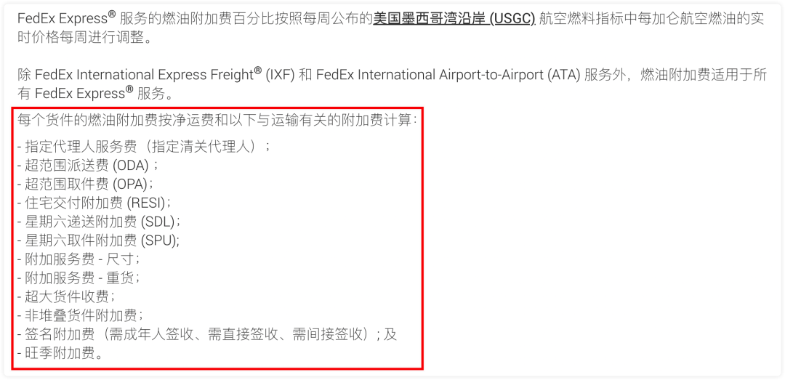

Fedex的燃油附加费收取说明

  
**4.附加服务费**  
附加服务是尾程物流中最复杂的内容，因为各家的附加服务不一样，而且收取的一些规则也千奇百怪，整理的难度很大。我从收集到的报价表中，摘一下常用常见的附加服务费内容出来，如果要了解最全的内容，建议去官网找详细的资料。  
  

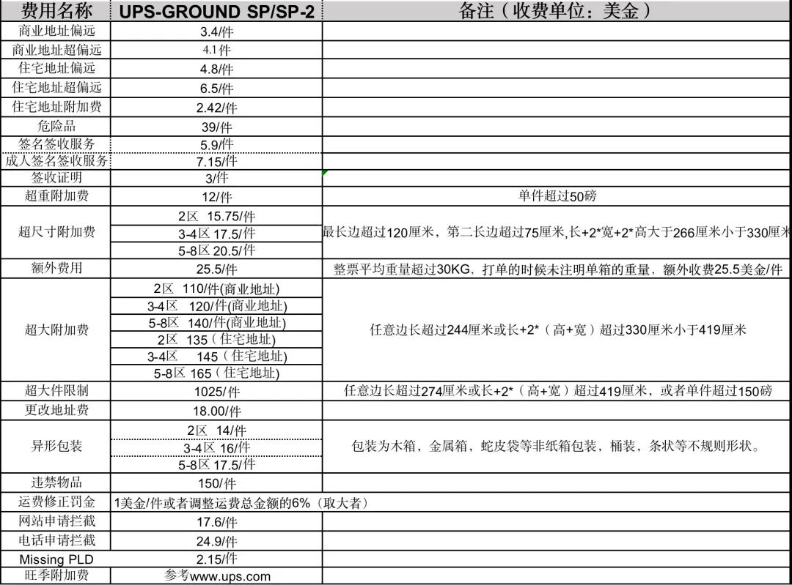

UPS的附加费

  
  

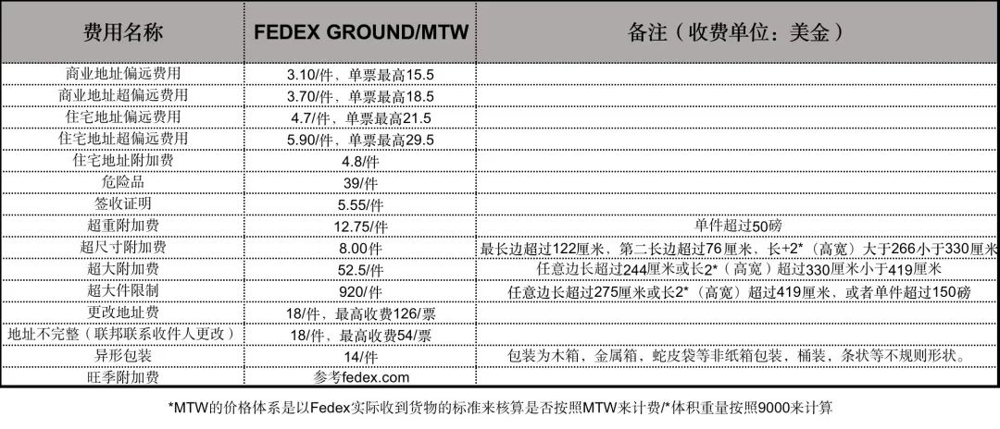

Fedex的附加费

  
附加费的收取首先要满足对应的条件或者规则，例如UPS的“超重费”就要满足“重量超过50磅”，其次再按计费规则进行收取，例如UPS的“超重费”就要收12USD/每包裹。  
附加费的收取有一些是可以在物流下单（预报面单）的时候判断出来的，我们称之为“前置收费”。例如使用了签名服务，配置了超长/超重的规则，配置了偏远/超偏远的规则等。  
但是也有一些是只有物流商取件、派件之后才知道是否要收取的，我们称之为“后置补收”，例如异型包装，电话拦截，地址修改等。  
很多ERP都支持提前设置好“运费模板”，然后使用“运费试算”的功能来判断某一个单的运费，这个运费其实是预估的运费，也就是“前置收费”的部分，不一定百分百准确。**而物流商“后置补收”的费用，在运费试算的环节，是不能算出来的**。  
**5.分区**  
分区也叫做“物流分区表”，英文为Zone Chart。简单理解就是某个包裹需要从A地发出，然后可以送达到多个地址，根据不同地址所处的国家、省州、城市、邮编等来定义一个分区表，落在哪个分区，就按这个分区的价格来算运费。  
  

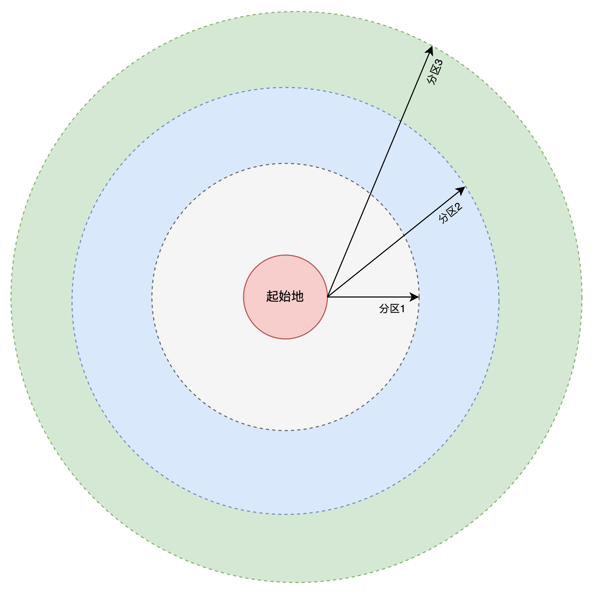

离起始地越远，则分区代码越大

  
例如大陆DHL将所能送达的国家分为9个区间，美国为第一区间；加拿大、墨西哥为第二区间；欧洲地区国家大约划分两个区间，英国、印度、德国分别为第五、第六与第九区间。澳大利亚、新西兰与日本，分别为第七区间、第八区间。  
  

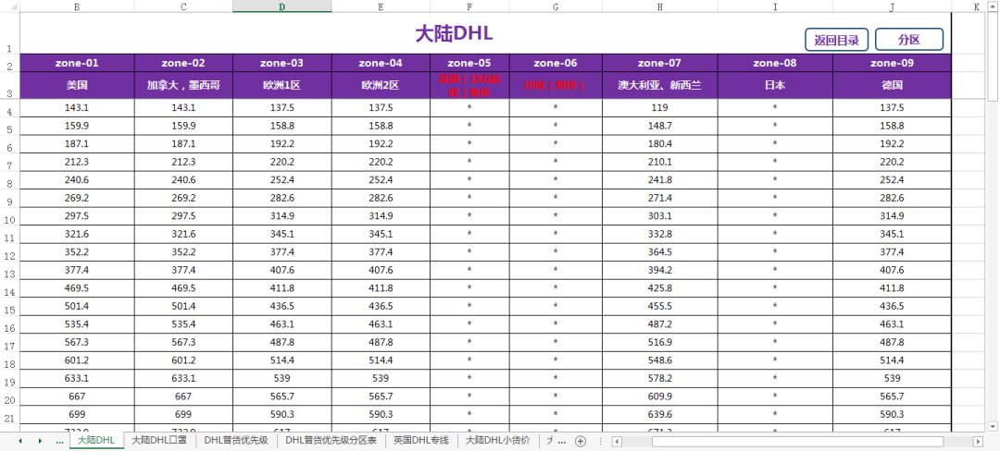

摘自网络

  
分区可以按国家/地区来划分，可以按国家/地区+城市来划分，也可以用国家/地区+邮编来划分。例如下图就是按国家来定义分区的。  
  

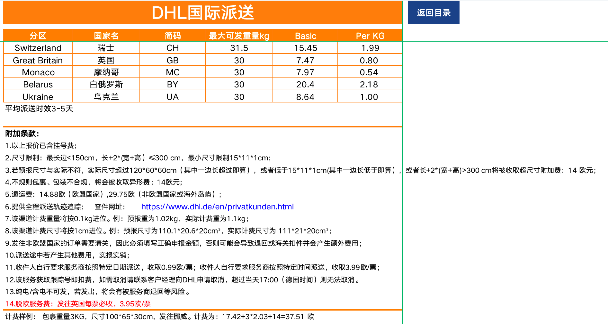

按国家作为分区

  
国家，省州，城市，邮编，都可以作为分区，本质上就是通过地址来确认所属什么区域，然后在某个分区中就按对应的几个进行物流的计费。  
而在美国或者加拿大，由于邮编体系做得很丰富，所以一般来说它们都是用“国家+邮编”的方式来划分分区的，下图就是FedEx的一个分区价格表。  
  

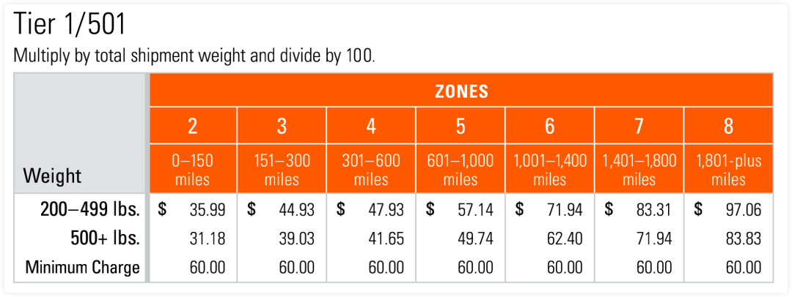

FedEx美国分区

  
在分区价格表中，我们只是看到一个分区对应的一个价格，那么到底哪些地区属于什么分区呢？这个时候就需要引入一个分区规则表了，即当确定了某个始发地之后，不同的目的地地址会对应不同的分区。  
我选择从美国的加州CA，邮编92518作为我的发货起始地，然后从UPS官网拿到了一个邮编分区规则。  
查看下表可以知道，以UPS Ground为例，如果目的地邮编是004-005区间的，则定义为008区；如果目的地的邮编是006-007区间的，则定义为045区。  
在这里再简单普及一个美国邮编的规则，美国的邮编一般是五个号码，第一个数字代表美国各州、第二个和第三个数字一起代表一个地区（或一个大城市），第四个和第五个数字代表更加具体的区域。所以004-005的意思是指前三位邮编是004的或者是005的。  
  

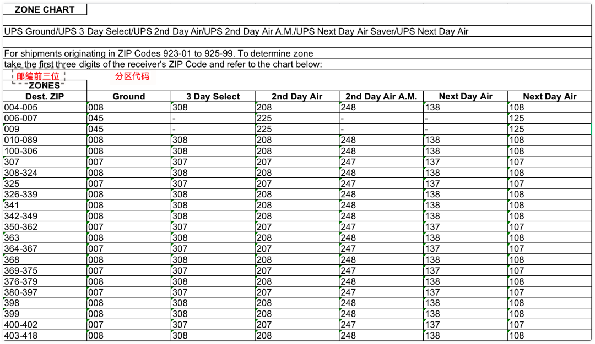

美国UPS邮编分区规则

  
按邮编的来定义分区是最细的，也是最复杂的。对于美国这样邮编有规律性的国家来说，判断分区可能还比较简单，但是对于一些邮编规律比较奇葩的国家来说，判断分区就需要下点功夫了，例如英国的邮编，加拿大的邮编，感兴趣的朋友可以去了解一下。  
**6.重量段**  
知道了什么是分区，怎么定义和判断分区之后，接下来要讲的就是和分区息息相关的重量段了。分区表示的是从A地发出到B地属于什么分区，是距离的一个维度；但是运费肯定还是需要考虑重量这个维度的，也可以简单理解为：**分区&重量段构成了运费价格表**。  
下图是UPS Ground的分区价格表，横轴的是分区代码，纵轴的就是重量区间段。  
  

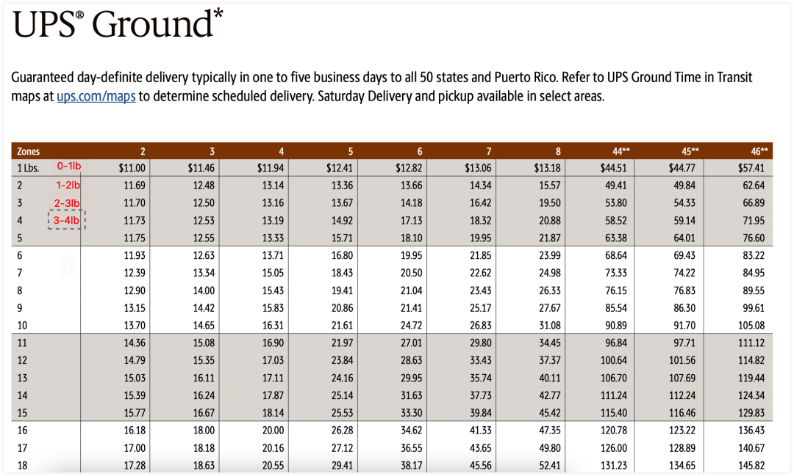

  
UPS Ground分区-重量段价格表  
其中1lbs表示的是0-1lb范围，2表示的是1-2lb范围，以此类推，美国一般都是从1到150lb结尾，超过150lb就要按其他的计费方式收费了。  
  

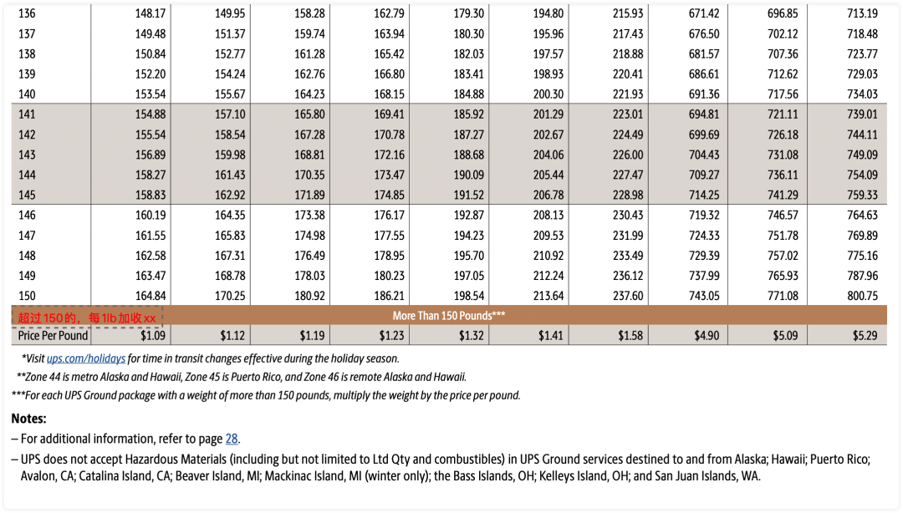

UPS Ground超过150lb后分区价格表

  
关于分区-重量段的报价表，无论是业务对外展示的Excel报价，还是录入到系统的模板，一般都要遵循以下几个原则，否则就会导致系统报价出错：  
1重量段要指明重量单位，不能只有数值；  
2重量段不一定要规律性递增，也不一定要整数；  
3在给客户展示重量段的时候，可以简写，一般行业会遵循左开右闭的原则；  
4重量段需要连续，不能有空挡，不能重复；  
  

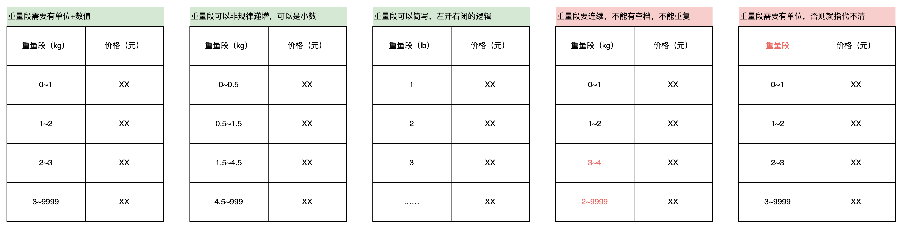

重量段需要注意的事项

  
**美国快递的一些特点**  
**1.住宅地址和商业地址**  
由于美国和加拿大人口居住分布的原因，快递派送到人口密集的城市和商业地区的均摊成本低，而送到人口稀松的住宅地区的均摊成本更高，所以物流商会根据派件地址来判断是否是住宅地址，如果是住宅地址，则需要收取住宅派送费。如果是商业地址，一般不需要加收额外的附加费。住宅地址和商业地址的判断是通过物流商官方的API接口来判断的，而USPS，UPS或者Fedex的判断结果是否一致，我暂时没有拿到数据，但是我猜测应该是差不多一样的。  
**2.偏远地区和超偏远地区**  
住宅地址和商业地址是一个维度的判断，而偏远地区和超偏远地区是另外一个维度的判断，两者不能一概而论。也就是说，如果收取了偏远附加费，也有可能再收取一遍住宅地址派送费。不过一般会按最大值收取，叠加的情况比较少。偏远地区和超偏远地区本质上也是分区的概念，所以还是用判断分区的逻辑来判断是否偏远或者超偏远。美国国内件一般是用国家/地区+邮编的方式来判断，其他地区暂不确定。

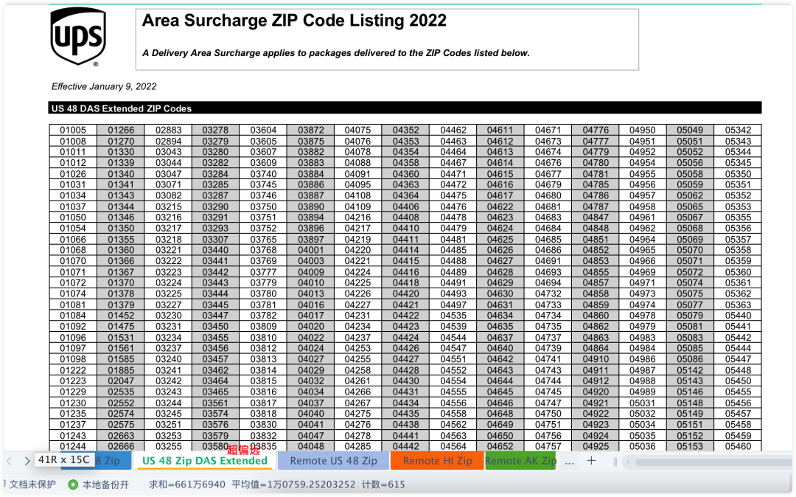

UPS偏远地区和超偏远地区规则

  
**3.直接签名、间接签名和成人签名**  
以下内容摘自邦阅网的《[UPS和FedEx的签收服务的种类及收费](https://www.52by.com/article/72248)》，有做删减。  
1直接签名：货件可以由送货地址的任何一位人士签收，例如：家人或者在家的朋友等；假如货件送抵时无人收件，联邦快递将会再尝试派递。  
2间接签名：联邦快递将会透过以下三项方式的其中一项，派递货件：1.由收货地址的任何人士签收。2.由邻居、大厦管理员或邻近地址的人士签收。3.向收件人取得授权，容许在没有任何人在场的情况下派递货件。  
3成人签名：联邦快递会在送货地址要求一位当地已达成年岁数的人士（非未成年人士）签收货件。该签署人士须要出示一张由当地政府发出，并附有照片的身份证或当地政府惯常接受的辨别文件。假如送货地址并无合资格的收件人，联邦快递将会再尝试派递。  
其中间接签名是最便宜的，直接签名中等，成人签名最贵。美国FedEx的部分物流服务，直接签名和间接签名是一个价。  
  

Fedex的签名服务类型

  
  

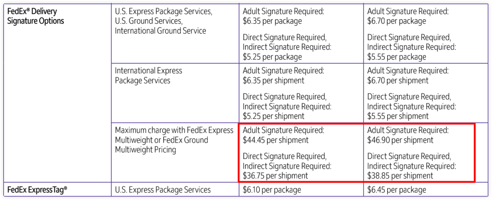

美国FedEx的签名服务报价

  
美国是海外仓占比最高的国家，美国海外仓的主流的尾程物流商也是最具有代表性的几家（USPS，UPS，Fedex），所以搞懂这几家的物流规则，对物流计费这一块会有很大的帮助。  
**尾程物流费用构成**  
海外仓服务商的盈利点大多数是来自于“尾程物流”的差价，从上游物流商那边拿到足够优势的低价，然后再报给客户一个有吸引力的价格，这一来一回的差价就是海外仓服务商的主要利润点了。所以尾程物流费用的计算对海外仓来说非常重要，这里还是以“应收”的未来来拆解一下其中的计算方式。  
  

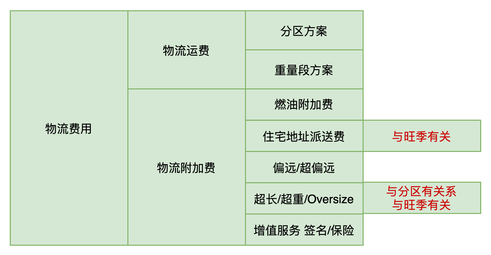

  
物流费用构成  
从上图可知，物流费用主要是由“物流运费”和“物流附加费”两个部分构成的。  
物流运费就是指基础的运费，一般是通过“运费价卡”或者“运费报价表”计算出来的。  
物流附加费就是指除了运费之外，还有一些增值服务是需要额外收费的，一般会是通过“附加费表”计算出来的。  
**与国内商业快递对比，海外仓尾程物流费用比较麻烦的点主要还是在于附加费这一块**。这也是很多刚入行的朋友很容易踩坑和碰壁的一个地方，因为杂七杂八的附加费太多了，计算规则也千奇百怪，想要完全摸透还挺难的。  
**运费报价表解析**  
由于附加费的内容太多了，而且业务过于特殊，所以在此篇文章中，我就不对此展开讲了，咱们重点聊聊运费报价这一块。  
尾程物流的报价表一般是用Excel来展示的，常见的报价表一般用“行”展示重量段，用“列”展示分区，其中交集的部分，就是表示“在xx重量段，发到xx分区，需要多少钱”。  
  

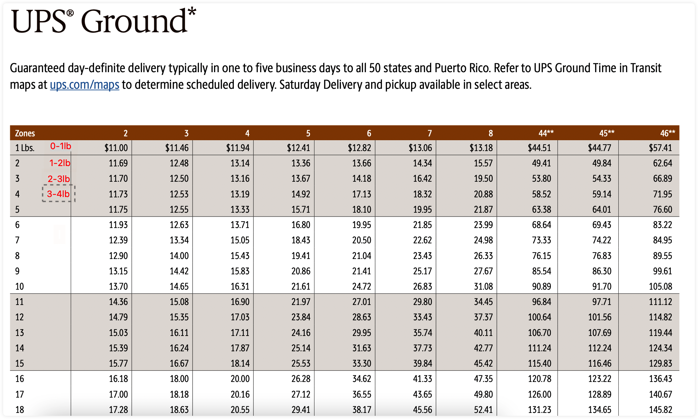

  
UPS Ground分区-重量段价格表  
从上图来看，每一行都是不同的重量段，每一列表示的就是一个分区。不知道重量段和分区的概念的朋友，可以看看上一篇文章。  
**运费报价表基本上每家都不太一样，因为不同的物流商或者是相同的物流商的不同服务类型会有不同的计算方式，所以报价表展现的也就不一样**。但是经过大量的比对、分析、调研之后，我大概总结了一下市面上常见的报价表一般会有这么几种计费模式。  
●总价模式，也称之为一口价，即落在某个“格子”就按这个格子的价格作为总价，运费=总价。  
●单价模式，即落在某个“格子”就按这个格子的价格作为单价，运费=单价\*实际的重量。  
●续重价模式，国内常称之为“首续重模式”，即在首重范围内，按首重价格算，超过首重的部分，按续重价计算。如果重量在首重内，则运费=首重价；如果重量超过首重，则运费=首重价+(实际重量-首重重量)\*续重价。  
●总价+单价模式，也称之为复合式报价，即在某个重量段以前是按总价算，超过某个重量段之后，就按单价算。  
●总价+多阶梯续重价模式，也是复合式报价的一种，即在某个重量段以前是按总价算，超过某个重量段后，超过的部分按续重价算，而且可以支持不同的续重阶梯，类似于阶梯电费的计算方式。这种模式和国内的“首续重模式”最大的区别就是支持多个阶梯，而首续重模式一般来说超过了首重之后，剩下的都按续重价来算，属于只有一个阶梯的模式。所以也可以把首续重模式当做是一种特殊的只有一个阶梯的“总价+多阶梯续重价模式”。  
**1\. 总价模式**  
  

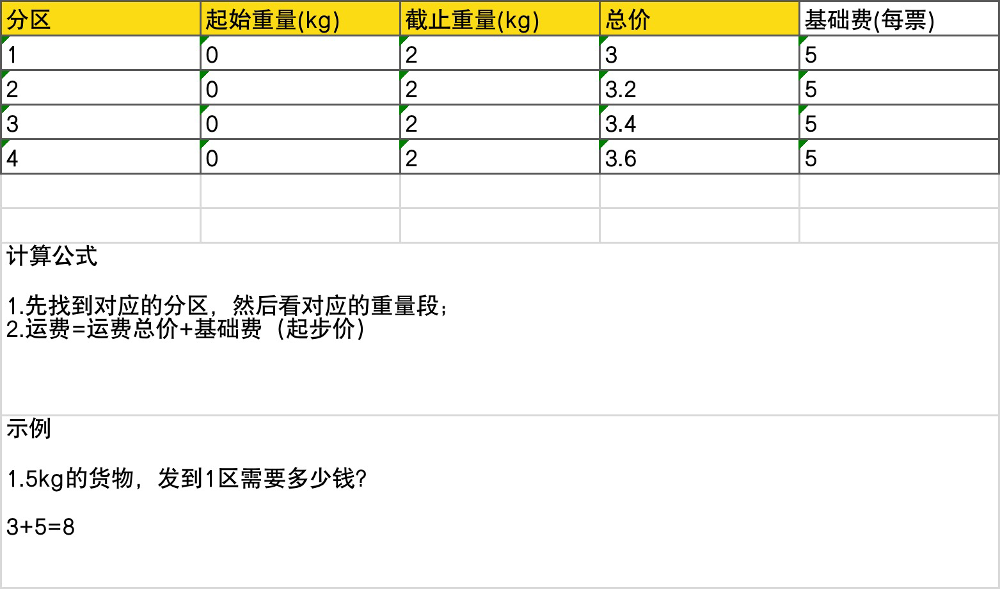

总价模式

  
总价模式是最简单的一种报价表，只需要知道自己的货物多重，要发到什么分区，然后就可以快速得出运费是多少了。  
**2\. 单价模式**  
  

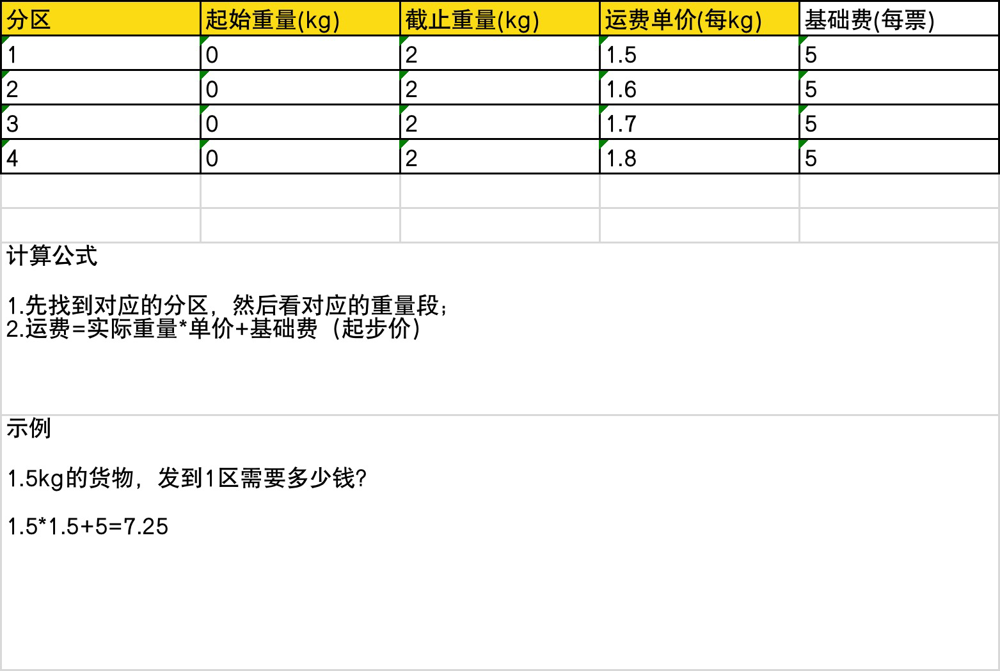

单价模式

  
单价模式和总价模式类似，只不过就是报的价格是单价。知道自己的货物多重，要发到什么分区，然后用单价\*实际的重量即可算出运费。  
**3\. 续重价模式**  
  

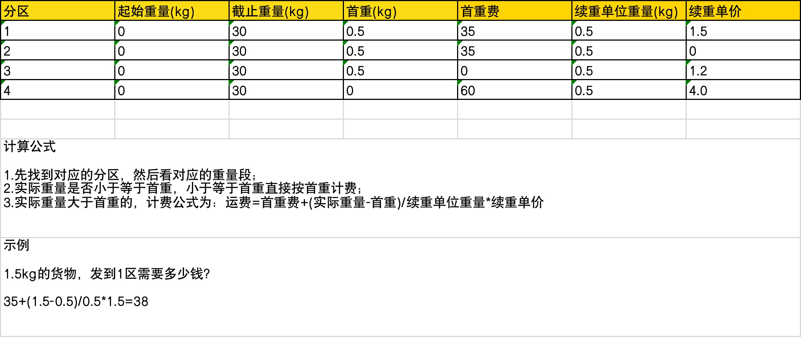

续重价模式

  
续重价模式就是国内的“首续重模式”，需要维护好“首重”，“首重费”，“续重单位”和“续重单价”。  
**首重、首重费和续重单价都可以为0，但是续重单位不能为0。**  
**4\. 总价+单价模式**  
  

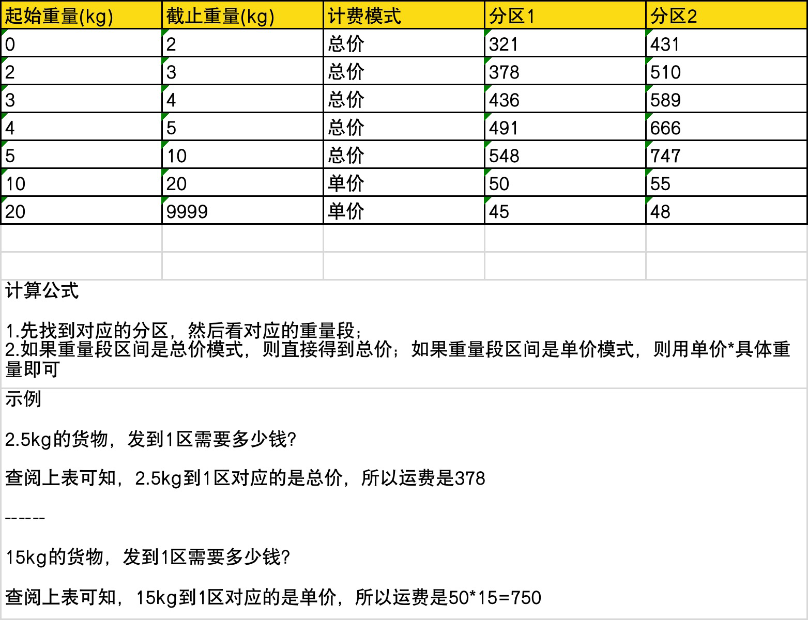

总价+单价模式

  
总价+单价模式，可以配置在一个Excel表中，也可以分开两个表来配置。一般来说，小重量区间用总价模式，后面的大重量区间就用单价模式。  
这种报价表见的比较少，属于个别物流商的特殊报价模式。  
**5\. 总价+多阶梯续重价模式**  
  

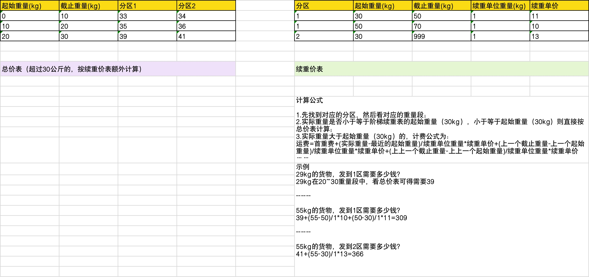

总价+续重价模式

  
总价+续重价模式是最复杂的一种模式，也“首续重模式”的一种变型。在小重量区间用总价模式，超过某个重量后，开始采用“梯度计费”的方式。  
**梯度计费也可以称之为“超额累进制”，简单理解就是超过的部分按新梯度的价格算，没超过的部分还是按之前的梯度的价格算**。生活中最为典型的案例就是电费的梯度计费，还有医疗保险的梯度报销，感兴趣的朋友建议去B站找几个视频看看，回顾一下初中数学的知识。  
  

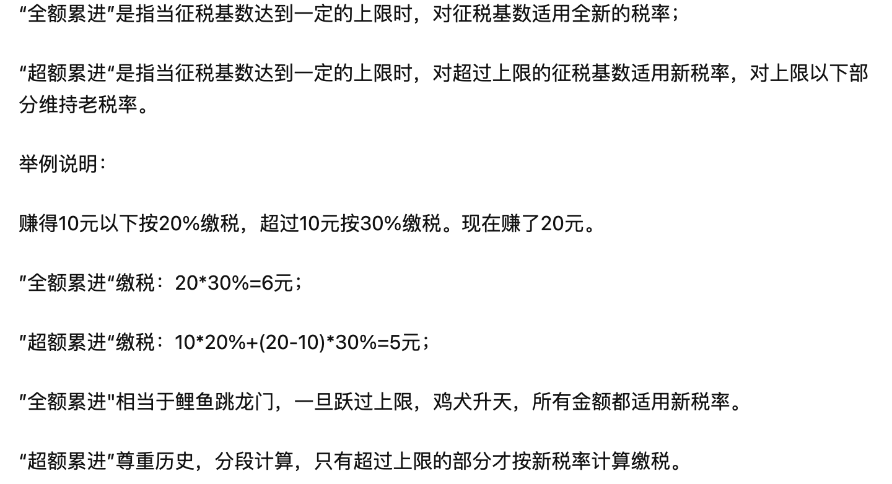

  
超额累进和全额累进——摘自知乎  
整理完了物流运费报价表的几种大类之后，我们发现这五种报价的模板有一些是有相似的，类似于“提取公因式”一样，可以将其中的一些通用部分抽出来。  
例如“总价表”和“单价表”的结构其实完全一致，只不过是计算公式不一样。  
“总价+单价表”可以用一张表来体现，也可以用两张表（Sheet）来表示，一个是“总价”，一个是“单价”。  
“续重价表”和“总价+多阶梯续重价表”有很多地方也是类似的，将“续重价表”中的“首重”当做“总价+多阶段续重价表”中的“总价”，然后“续重价表”中的“续重价”和“总价+多阶梯续重价表”中的“续重价”也是一样的，可以直接搬来就用。  
于是，我们可以将这些表做一个归类和整理，可以简化成一个Excel的三张表（Sheet），分别是：**总价表，单价表，续重价表。**  
  

简化后的导入模板

  
**物流计费方案的设计**  
确认了运费报价的几种类型和精简后的导入方案之后，我们物流计费方案就完成了一大半了。还剩下的几个难题分别是：  
1分区的判断规则  
2附加费的判断规则  
3附加费的收取规则  
这几个难题内容还挺多的，所以我会留到后面的文章中再来讲。  
下图是一个物流计费方案的结构图，如果算是上基础信息这个模块，那就一共是5个模块，**这五个模块中，最难的是价格表和附加费，其次是分区，而重量段和基础信息就没什么难度了**。  
  

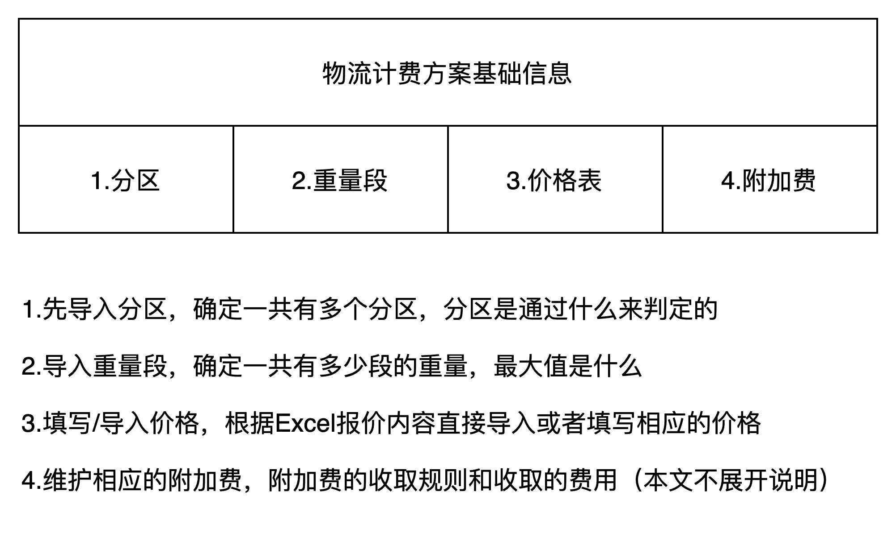

  
物流计费方案的结构  
如果海外仓覆盖的国家是明确的，例如只发美国，那么分区方案就可以用通用的美国邮编匹配的方式来匹配。如果物流商和物流渠道也是确定的，例如UPS、USPS，FedEx，而且某些增值服务是不使用的，那么附加费的类型也就很少了，计算难度也会相应减少……  
**小结**  
海外仓尾程尾流费用模块主要是由基础运费+附加费组成的，本文重点阐述了关于基础运费这一块的内容，附加费的模块会考虑放在后面放出来。  
关于基础运费的计费方案其实和市面上很多成熟的系统已经非常吻合了，乍看之下，好像大家都是用的差不多方案，甚至是在重复造轮子的感觉。但是看得再多，也不如自己亲自实践一波，体验和思考一波。  
因为其中有很多难点和踩坑点是需要从0开始搭建才会发现的，而且有很多“二手信息”反而会干扰到实际方案的输出。所以我更加鼓励从真实需求出发，从源头信息开始整理，物流计费方案的产品设计也就没有那么难了。