前一节的提到了物流费的计算是需要依赖分区和重量段以及它们所构成的价格表，而分区就是物流派送的时候根据地址做的一个分类，划分成一个大区域，凡是送到这个区域内的地址都是相同的价格。这种区域的划分可能有多个维度，例如按国家维度，即只要地址是属于某个国家，那么就会属于该分区；例如按国家+省/州维度，即只要地址是属于该国家的某个省州，那么就会属于该分区。  
  

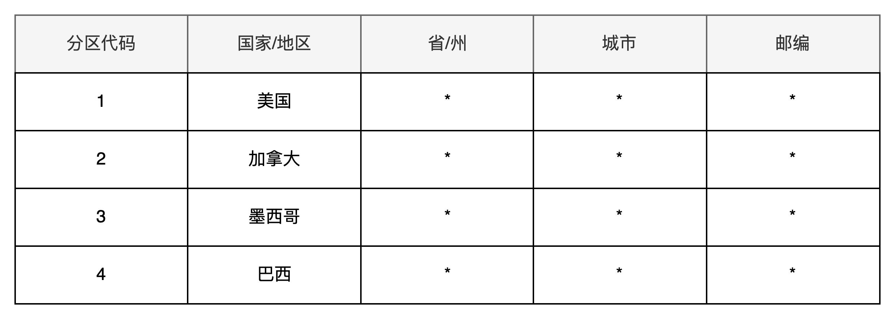

按国家分区

  
  

按国家+省/州分区

  
**分区的本质是根据地址的一些特性来做归类分组**，所以国家，省/州，城市，邮编，都可以作为分区的依据。  
一般来说，国际快递（国家之间的快递），一般都是按国家或者国家+省/州的维度来划分分区，例如大陆DHL发国际件，将所有国家分为9个区间，美国为第一区间，加拿大、墨西哥为第二区间……  
  

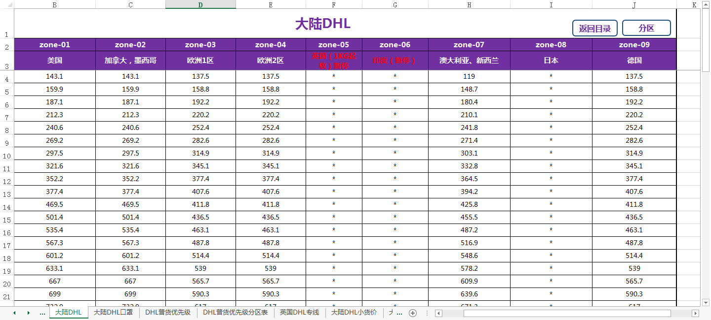

大陆DHL的分区表

  
而本土快递（例如美国本土的FedEx）一般就是按“国家+邮编”的维度来划分分区，因为所有的地址都已经是美国了，所以就只需要看邮编即可。美国的邮编比较有规律性，物流派送也会依赖这个信息，所以在美国购物填写地址的时候要注意邮编的准确性。“Dest.ZIP”就是指目的地邮编，然后“005”就是指只要目的地的邮编是按005开头的，那么就都属于8区（始发地是美西仓）。  
请注意，分区是需要先确定始发地是哪里的，离始发地近的地址一般来说分区代码数值就越小，而离始发地远的地址则分区代码数值就越大。  
  

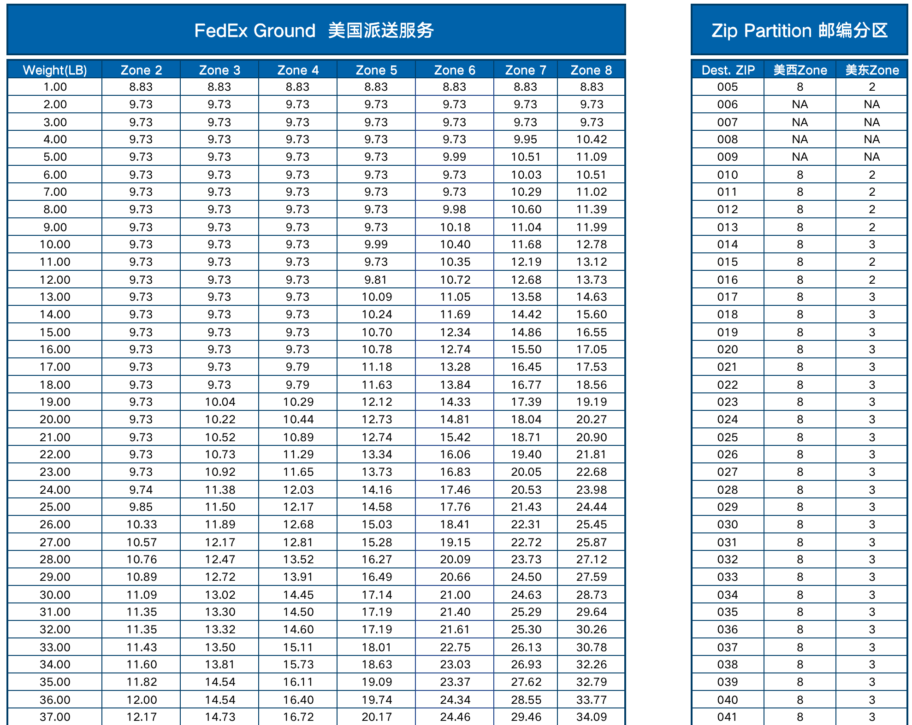

美国的邮编分区示意图

  
在系统中会创建一个对应的分区配置表，然后用收件人的地址按下方的步骤（优先级顺序）去匹配分区方案，如果匹配到多个分区方案，则取最上面的结果；如果步骤1没有匹配到，则用步骤2的方式，如果步骤2也没有匹配到，则用步骤3……  
  

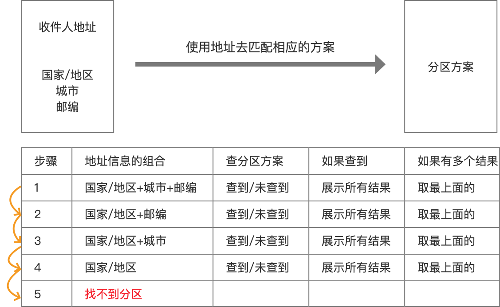

收件人地址确认分区的逻辑说明

  
**不同国家的分区规则**  
主流的海外仓一般都是分布在，美国，英国，德国，日本，加拿大等地区，其中美国占据了大头，所以美国本土快递的分区规则大家都玩得比较熟悉了，一般就是用目的地邮编来区分，而且美国的邮编体系做得很规范，所以这一块难度不太大。  
和美国类似的邮编体系比较规范的还有加拿大，但是加拿大的邮编命名规则有稍微有点麻烦，稍后我们会单独解释一下。英国的邮编体系应该是最复杂的，分区的方式也最为复杂，因为英国全称是“大不列颠及北爱尔兰联合王国”，所以包含了多个地区，各个地区的分区规则也不太一样，这一点我们也在后续介绍。  
德国或者其他欧盟类国家，一般都是按国家来分区的，如果涉及到了一些欧盟国家的附属岛屿的话，就会按这些附属岛屿的邮编区间段来划分，这一块的内容比较小众，就不做过多介绍了。  
日本的海外仓由于我没怎么做过，所以这一块就没怎么了解，不太熟悉他们的分区规则是怎么样的，感兴趣的朋友可以自己去查询相关的资料学习。  
**1****美国邮编分区**  
美国邮政编码 (ZIP Code)是美国邮政服务 (United States Postal Service, USPS)使用的一种邮政编码，一般常以大楷写作ZIP。ZIP是Zone Improvement Plan (地区改进计划)的简称，它暗示邮件可以更有效率及快捷地送到目的地。最基本的ZIP编号包括五个号码，随后增加了四个号码，使邮件可以更精确地传送到目的地。增加号码后的ZIP编号称为"ZIP+4"。  
例如：22162-1010  
第1、2、3位数字表示分发大区或者处理、分发中心，第4、5位数字表示邮局或者分发区域，第6、7位数字表示小区，第8、9位数字表示区段。大多数美国海外仓收到的订单地址中的邮编都是5位数的，也就是说电商场景下一般使用5位数的邮编居多，而且如果是为了确定分区一般前3位数就够用了，后续太细的数字对于分区来说不那么重要。  
美国地址示例：  
ABC MOVERS  
1500 E MAIN AVE STE 201  
SPRINGFIELD VA 22162–1010  
UNITED STATES OF AMERICA  
  
  

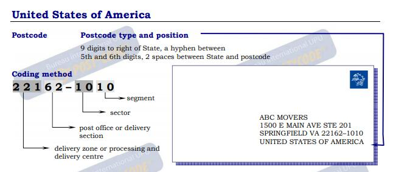

  
美国的5位数邮编是属于递增的纯数字，意味着可以比较大小和确认邮编区间段，例如说“邮编区间为35201~35238”，即指在数字“35201~35238”范围内的邮编都属于这个区间。  
  

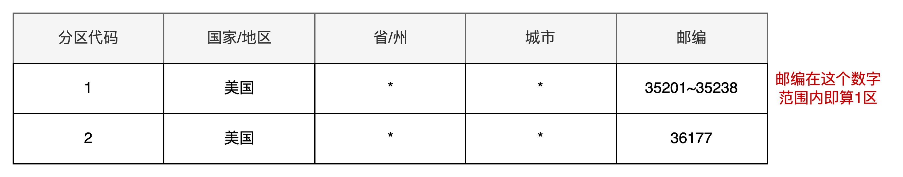

美国邮编分区示意图

  
以美国UPS的官方分区表为例，可以访问[此地址](https://www.ups.com/us/en/support/shipping-support/shipping-costs-rates/daily-rates.page)，然后输入“Origin Postal Code（起始邮编）”，然后UPS会自动计算并给出对应的分区表，以下载Excel的形式展示。  
  

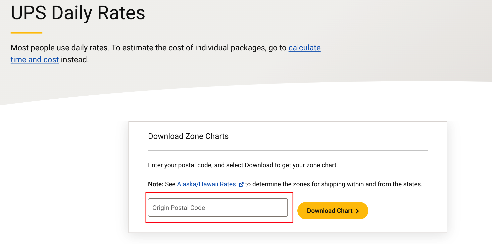

获取UPS的分区表

  
打开分区表后可以看到，“Dest.ZIP”即目的地邮编是前三位数字，意思就是说如果目的地的邮编是以这三位数开头的，那么不同的服务对应的分区编码就会不一样。例如说第二列的服务是UPS Ground，如果目的地邮编是“005”开头，那么使用UPS Ground寄送，则对应的分区编码是008；如果目的地邮编是“006”开头，则对应的分区编码是045……  
  

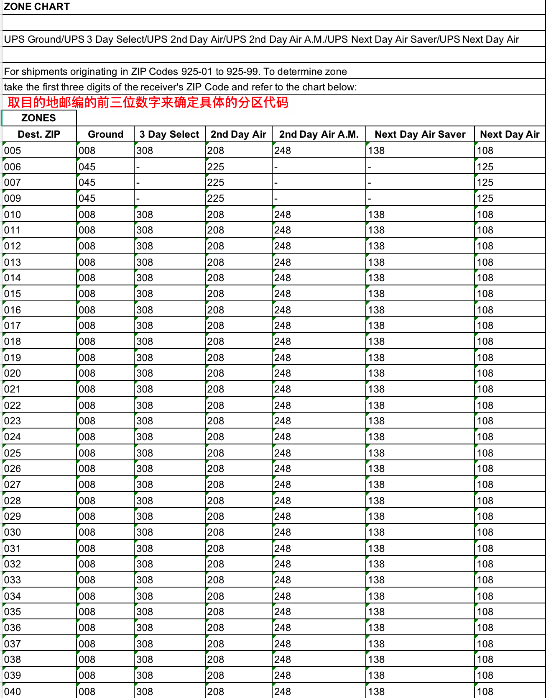

UPS不同服务和不同目的地邮编所对应的分区表

  
基于上述的背景，我们发现了美国邮编分区的几个特性：  
1美国一般用5位数纯数字的邮编；  
2纯数字是可以直接比较大小的，所以可以通过邮编区间来判断某个地址的邮编是否属于该分区；  
3用来确认分区的邮编只需要取前三位数字即可，后面的几位数字不重要；  
于是我们就可以根据上述的特性设计对应的产品解决方案，例如最常用的就是“邮编区间匹配”，即在配置分区表的时候可以让用户输入一个“开始邮编”，然后再输入一个“结束邮编”，只要满足了这个区间的邮编都会属于该分区。  
  

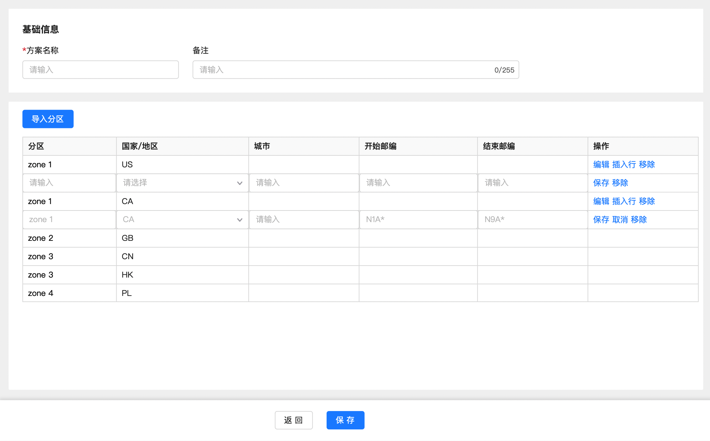

分区配置表示意图

系统会根据地址从大到小的维度来匹配，如果大维度没有满足，就不会继续匹配小维度。例如：填写了“国家/地区”和“邮编”，如果“国家/地区”没有匹配到，即使“邮编”是正确的，也不会再进行匹配了。  
为了提升用户配置分区表的体验，兼容多种不同的场景，我建议可以使用“前缀匹配”的方式来做前几位的匹配。如果要按匹配邮编的前几位（截取）来匹配，则要求使用通配符“\*”，不使用通配符“\*”则表示不截取，需要完整匹配。  
例如：邮编区间是“00200”-“22399”，可以填写开始邮编“00200”，结束邮编“22399”。  
也可以填写开始邮编“002\*”，结束邮编“223\*”，即按前三位进行匹配。  
通配符“\*”这个概念比较好用，但是非技术型的用户可能不太理解，需要产品或者实施在交付的时候多做说明和解释。  
**2****加拿大邮编分区**  
加拿大的邮政编码为“3+3”共6个字符的英文字及数字混用编号，书写时前三个字符和后三个字符通常以一个空格分开，其中奇数字符（第一字，第三字，第五字）为A-Z英文字母，偶数字符（第二字，第四字，第六字）为0-9数字，例如：  
V0T 1H0  
其中前三位代表转送大区，后三位代表本地投递小区。  
加拿大地址示例：  
MS. UNETELLE  
SERVICE DU MARKETING  
10-123 ½ RUE BEAUDRY  
MONTREAL QC H3Z 2Y7  
CANADA  
  

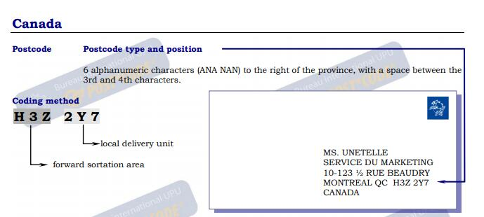

  
加拿大的邮编是字母加数字结合的6位数，虽然不是纯数字，看似不能直接相加减，但是在计算机中，字母也可以进行比较大小，例如A在Z的前面，意味着A更小，所以，对于加拿大邮编来说，也是可以用邮编区间的方式来表示的。例如说“邮编区间为A0A 0A0~A0Z 9Z9”，即指在邮编在这个范围内的都属于这个分区。  
  

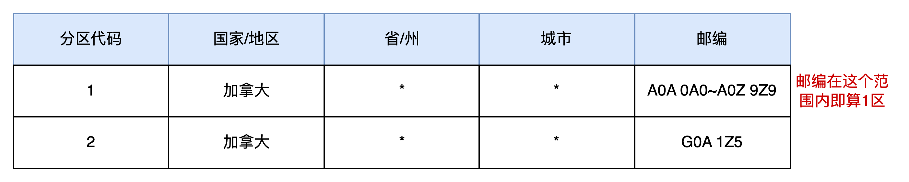

加拿大邮编分区示意图

  
下图是UPS国际件从美国发到加拿大的分区表（Zone Chart），可以看到官方给的分区表也是和美国本土邮编一样，只取前3位邮编，然后也支持区间范围，所以之前设计的产品分区方案除了可以支持美国之外，也可以支持加拿大。  
  

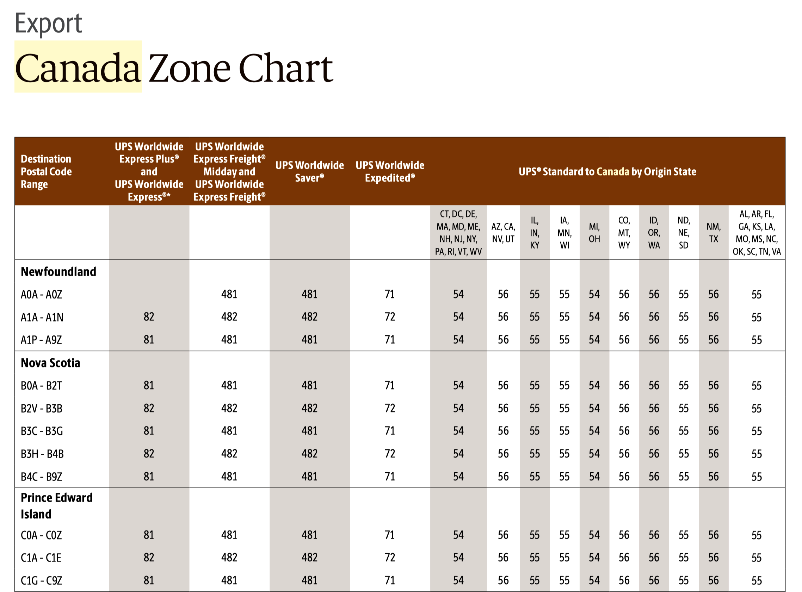

加拿大的分区表

  
用户在配置加拿大的分区表的时候，也可以采用“前缀匹配”和“完整匹配”这两种方式，如果使用通配符“\*”则表示是来表示匹配邮编的前几位，而没有通配符“\*”则表示是完整邮编的匹配，例如：  
邮编区间是“B0A0A0”-“B2T9Z9”，可以填写开始邮编“B0A0A0”，结束邮编“B2T9Z9”。  
也可以填写开始邮编“B0A\*”，结束邮编“B2T\*”，即按前三位进行匹配。  
**3****英国邮编分区**  
英国邮政编码（英语：Postcode）是由字母及数字混用组成的编码，其格式系统大概是全球最为复杂的。它可以是下列六种格式，格式中以A表示字母（A-Z），以N表示数字（0-9）。英国的邮政编码长度最少为五个字符加一空格，最多为七个字符加一空格。  
  

| 格式 | 英国邮编实例 |
| --- | --- |
| AN NAA | M2 5BQ |
| ANN NAA | M34 4AB |
| AAN NAA | CR0 2YR |
| AANN NAA | DN16 9AA |
| ANA NAA | W1A 4ZZ |
| AANA NAA | EC1A 1HQ |

除此之外，尚有特例“GIR 0AA”（不符合上列六种格式）也是合法邮编。 （注意：每一种格式里，最后三个字符前都有一个空格）  
所有的英国邮区编号都可分成四个部分:  
1邮域(Postal Area)：最前的一或二个字母  
2邮区(Postal District)：接下来到空格处前的一或二个数字及可能有的一个字母  
3邮政部门(Postal Sector)：空格后的一个数字  
4递送点(Delivery Point)：最后的二个字母  
比如邮编EC1Y 8SY，EC代表邮域，1Y代表邮区，8代表邮政部门，SY代表递送点。  
英国地址示例： Mr. Walter C. Brown--收件人  
49 Featherstone Street--路名  
LONDON--城市  
EC1Y 8SY--邮编  
UNITED KINGDOM--国家名  
  

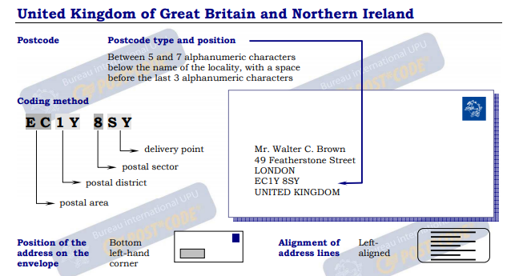

  
英国是由联合王国本土由四个“国家”（又称为“构成国”）组成，分别是英格兰、威尔士、苏格兰及北爱尔兰。  
每一个构成国在合并为大不列颠王国或联合王国之前就形成了各自的地方管理制度和行政区划体系，并且在合并之后保留了各自的体系。历史上，英格兰（以及威尔士）和苏格兰在中世纪早期就被划分为郡（英语：County），而郡制直到近代社会早期才推行到爱尔兰岛。虽然英国的历史行政区划多以郡为基础，但是各构成国的管理制度却有差别。直到19世纪，伴随着民选的理事会（英语：Council）的建立，郡地方行政系统才有一些细微的变化。但是，这个变化并未统一各构成国的管理系统，且此后的数次地方政府改革也是在一个或者几个构成国分别进行，不存在全国性的改革。因此，联合王国没有统一的行政区划体系且即使在未来，管理系统统一的可能性也较小。  
  

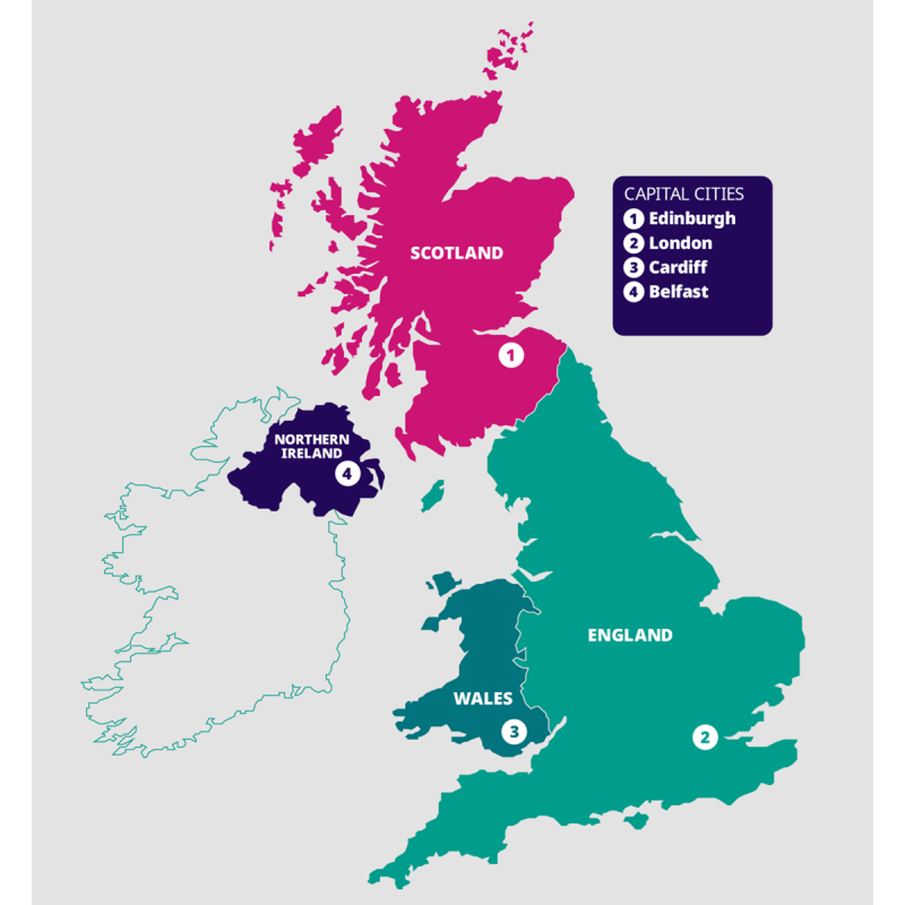

  
英国的邮编非常的复杂，因为它的历史背景也比较复杂，我找了很多资料也没有发现什么特别的规律，所以只能用最简单的方式（穷举法）来表示分区，可以先参考一下DHL Parcel UK的分布表看看。主要是分成了ABCDE五个区，然后不同的区，有一些是按邮编来划分，有一些是按邮域代码来划分（除伦敦市外的其他城市，邮域代码为各个城市名称的缩写），有一些是城市来划分，还有按国家来划分的……  
  

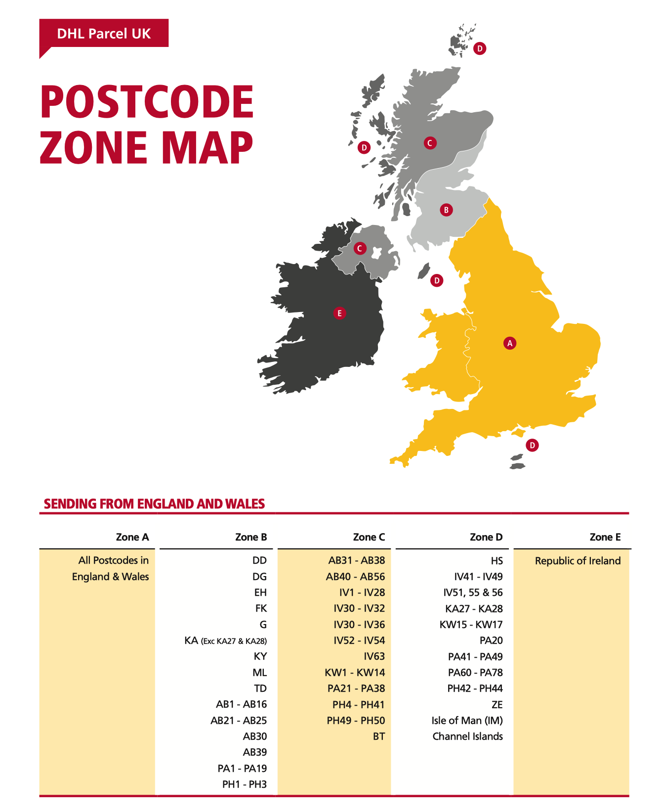

DHL Parcel UK的分区表

  
用户在配置英国的分区表的时候，不支持匹配区间段的方式，所以就需要使用穷举法来展示，也就是只有“完整匹配”这一种方式，例如：  
例如：邮编区间是“IV30”-“IV32”，穷举后分别是  
{Zone C，开始邮编“IV30”，结束邮编“IV30”}，  
{Zone C，开始邮编“IV31”，结束邮编“IV31”}，  
{Zone C，开始邮编“IV32”，结束邮编“IV32”}  
**美国主流渠道的附加费规则讲解**  
讲完了不同国家的分区规则之后，接下来我们来聊聊美国主流的尾程渠道的一些附加费规则，这一块也是BMS中难啃的一个点。  
首先，不同的尾程渠道的附加费收取规则不太一样，UPS、FedEx，USPS是美国海外仓主流使用是三个渠道，但是它们的附加费收取规则就不太一样。  
其次，附加费的收取有一些时候不是按官方的要求来的，因为海外仓不一定是用的官方的账号，而是可能用的打单系统提供的账号，或者一些“特殊的折扣账号”，这些账号的附加费可能会在官方的附加费基础上进行优化和调整，一般来说是会更简单一些。  
然后，附加费的规则是有时效性的，例如燃油附加费会经常变化，一些高峰期作业附加费也会随着时间变化，还有每年的附加费价格也会有稍微调整一下。  
最后，就是关于这些附加费的名目还有相关的规则解释太多了，很多奇奇怪怪的附加费名词也搞不懂是什么意思，而且相关资料散落的在各处，所以会导致大家在收集这一块信息的时候需要频繁去求职和落实具体的细节。  
这些内容加在一起，就构成了附加费这一块业务很难梳理，也很难进行产品设计的痛点。  
通过这个[地址](https://www.fedex.com/en-us/shipping/rate-changes/additional-shipping-fees.html)可以查看到FedEx官方的的附加费说明，每一年附加费的说明都会更新，例如目前就是可以查看2023年的附加费明细，对应的系统也要及时响应去更新这一块的内容。  
  

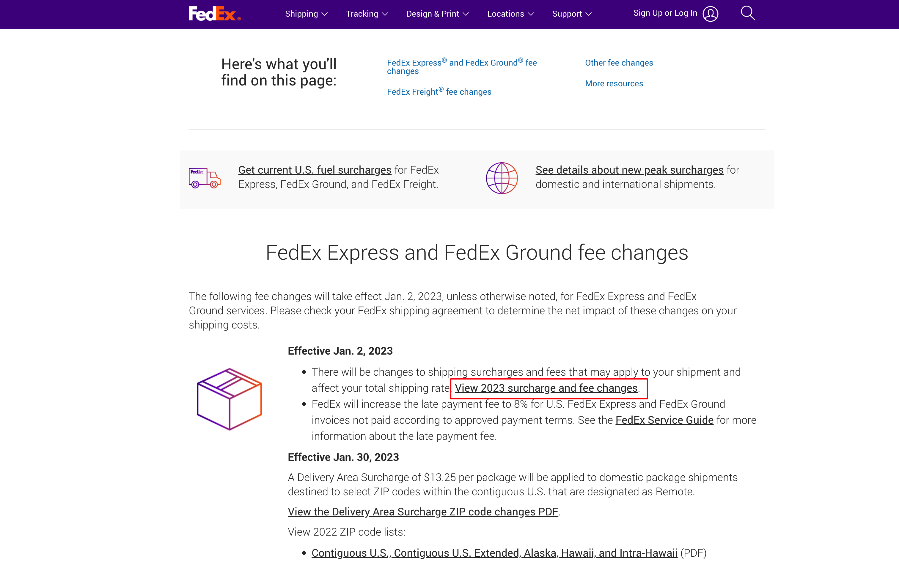

FedEx附加费说明页

  
  

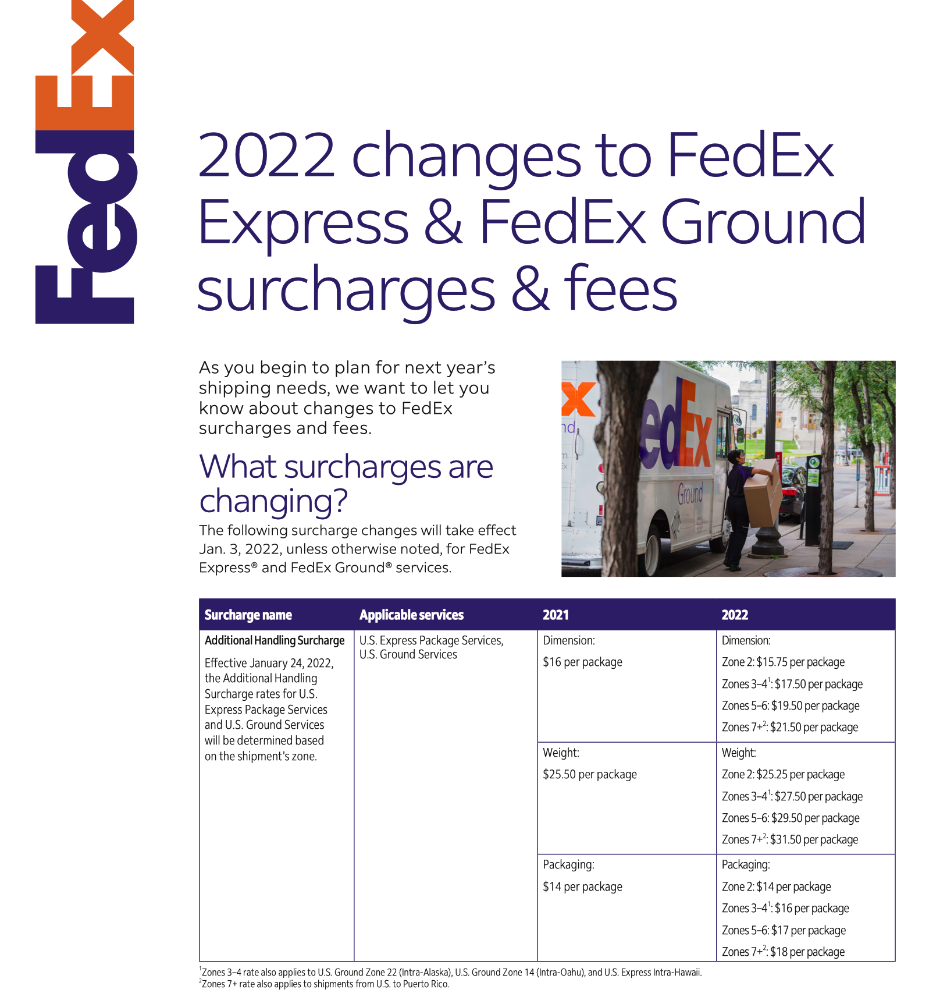

FedEx附加费具体明细说明

  
  

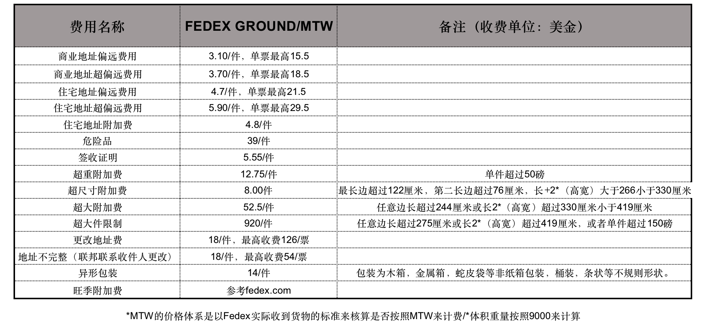

打单系统提供的FedEx Ground附加费说明表

  
我整理了美国海外仓常用的这几个物流渠道中高频会使用到的附加费，分别介绍了有哪些附加费，这些附加费收取的规则和条件是什么，以及相关的业务逻辑等，具体内容如下图所示：  
  

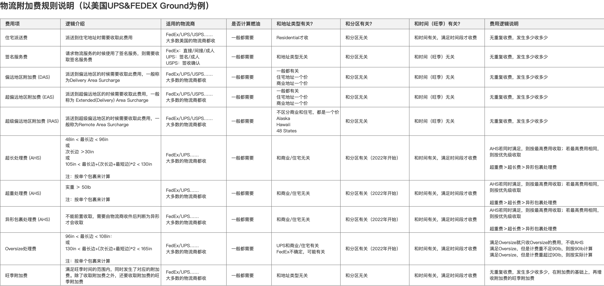

常见的一些附加费及其对应的规则

  
除了以上附加费之外，海外仓尾程物流中最常见的就是燃油附加费，这个是国际物流中最常见的、最基础的一个附加费。  
很多人以为燃油附加费是针对基础运费来收取的，例如燃油费率是20%，然后基础运费是100元，所以燃油附加费就是20元。但实际情况并不是，除了基础运费要收取燃油费之外，其他的附加费也需要收取燃油费，所以实际上燃油附加费的收取规则应该是：  
(基础运费 + 需计算燃油的附加费) \* 燃油费率  
不同的物流商会给具体的需要计算燃油的附加服务，这些数据要么从物流商的官网拿到，那么就从代理商或者物流商的业务员手里拿到。  
  

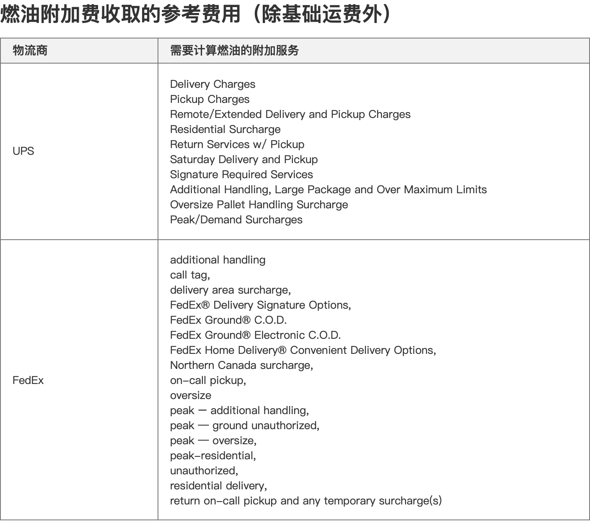

需要计算燃油的附加服务

  
**物流附加费的计算**  
  

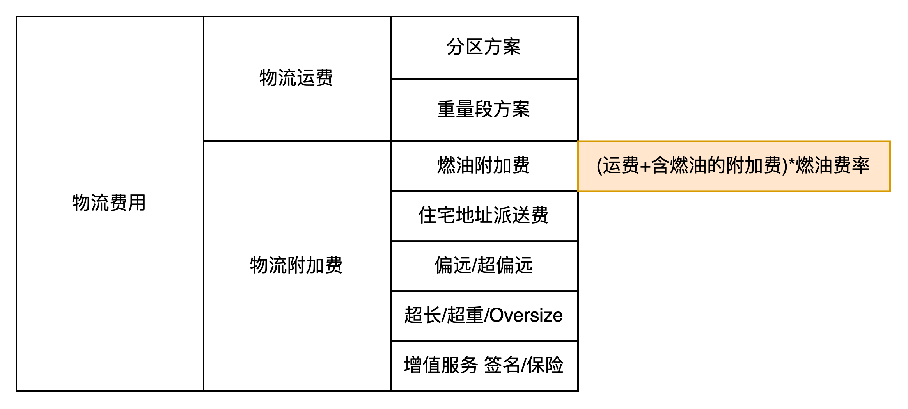

物流费用的构成

  
完整的物流费用是由“物流运费”+“物流附加费”两部分构成的，前一篇的内容，我们介绍了物流基础运费的计算方式，主要就是通过“分区-重量段价格表”来确定具体的计算方式，然后代入对应的数据就可以得出基础的物流运费，现在我们来讲讲物流附加费的计算逻辑。  
首先第一步就是要确认一下附加费有哪些，例如常见的就是“燃油附加费”，“住宅地址派送费”，“偏远/超偏远派送附加费”，“超长/超重/Oversize附加费”，“签名/保险服务附加费”等等。  
第二步就是要确认具体的附加费的计算规则是怎么样的，这个就是前面的图“常见的一些附加费及其对应的规则”中展示的一些内容，例如说“住宅地址派送费”，就是当目的地的地址是属于住宅地址，那么就会收取对应的附加费，所以要提前在配置报价的时候维护这些计算公式或者单价。  
  

常见的一些附加费及其对应的规则

  
第三步是将一些附加费的判断条件提前维护在系统中，例如怎么才算是“偏远/超偏远派送”，那就需要提前维护好对应的“偏远/超偏远派送”的地址库或者规则表；怎么才算是“超长/超重/Oversize”，也需要提前维护好对应的规则表。  
  

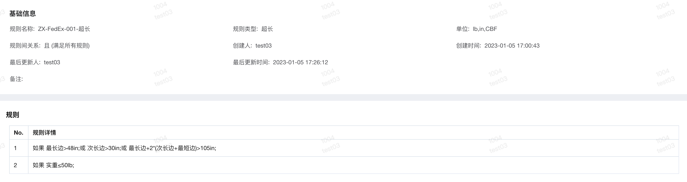

超长规则

  
  

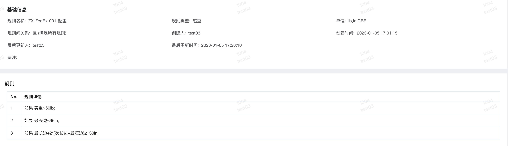

超重规则

  
  

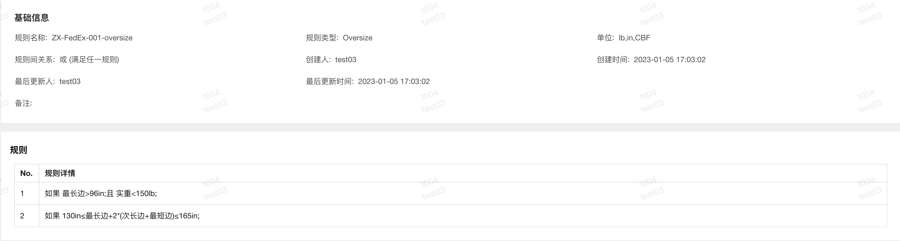

Oversize规则

  
  

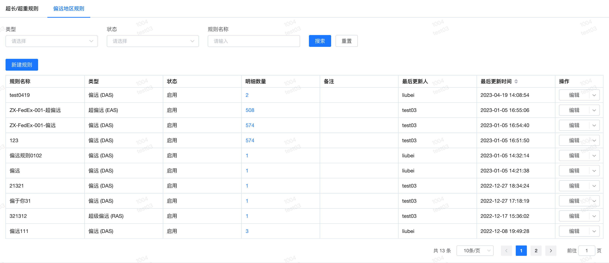

偏远地区规则

  
第四步就是将这些附加费整合到具体的“附加费报价表”中，通过录入表单的方式把附加费的计算方式配置进去，这里建议大家可以参考学习一下Shipout WMS的附加费配置功能，它做得比较好。  
  

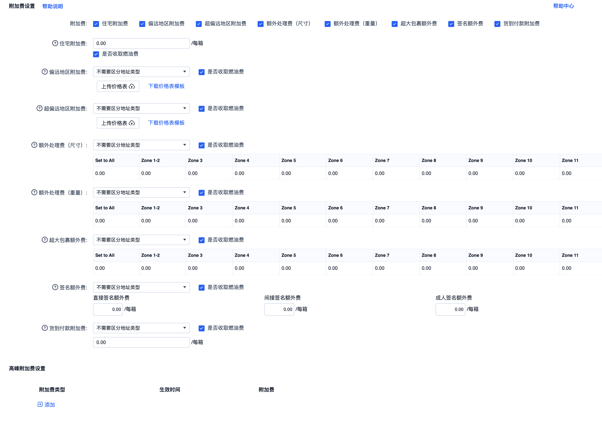

Shipout的物流附加费配置表

  
如需查阅帮助手册的话可以点击此链接：  
  

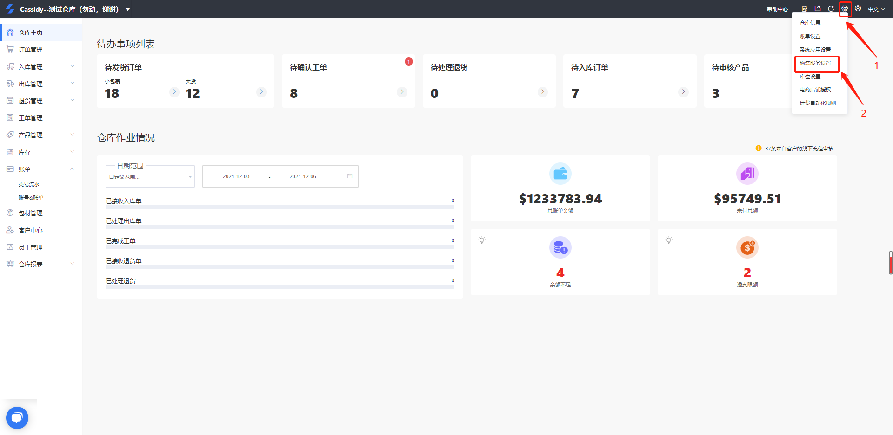[配置物流渠道附加费说明 – ShipOut Support CenterShipOut Support Center](https://support.wms.shipout.com/?docs=support/lexical-interpretation/shipping-service-group-surcharge-details)

**小结**  
海外仓尾程物流快递的分区规则是计算物流运费的基础，如果分区规则没有搞定，就没办法确认某个地址是什么分区，就不能套入到“分区-重量段价格表”去计算基础运费。  
而附加费规则是明确在什么条件下才会满足这些规则，因为满足了规则之后就要收取对应的附加费，这些附加费的规则整理起来比较难，大家在做相关业务的时候可以多看看一些海外仓提供的尾程报价单，同时也要结合具体的物流商官网去查看最新的动态，及时更新相关的数据。怎么找到这些数据也是考验产品经理的信息检索能力是否达标的一个点，这种场景在未来的工作中会频繁遇到，核心还是要培养自己的信息检索能力。  
最后就是附加费的报价了，做好了前面的准备之后报价就是没有特别麻烦了，本质上报价就是让用户去配置一个计算公式，然后通过代码将这个计算逻辑保存起来，等后续需要计算费用的时候再将数据套入进去即可算出结果。  
下一篇内容将给大家带来BMS计费逻辑的抽象和总结，本质上还是下面这张图，只不过是在此基础上再深挖了一层。  
  

“数据”套入“公式”得出“结果”