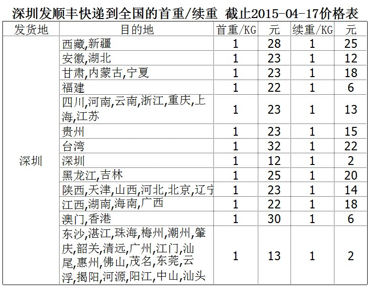
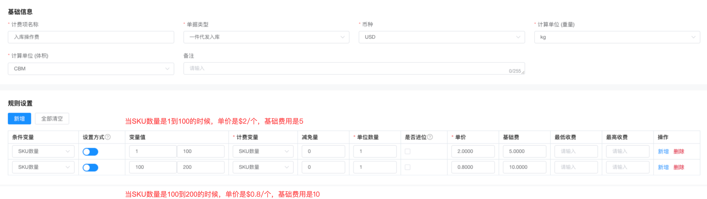
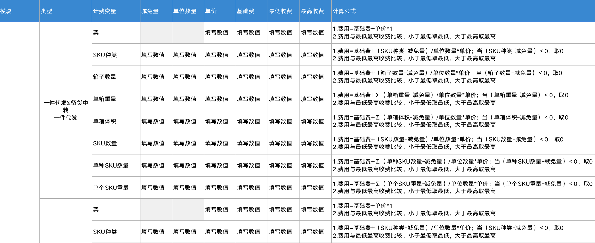

在第一次接手BMS的时候，我发现这个系统比较少有竞品，同时也有很多复杂的规则，当时就觉得这个系统的学习难度非常的高，自己碰了一鼻子的灰。后来当我有机会第二次再去做BMS的时候，通过对一些实际的业务规则进行梳理后，我发现只要抓住了计费的核心公式，BMS好像也没有想象中的那么难了。  
这个核心公式是对多个报价表抽象之后得出来的结论，基本上能满足大多数的BMS报价场景。  
  

  
无论是物流费用，还是仓储费用，还是其他的操作费用等，本质上都可以套用上述的公式，得出最终的计算结果。明白了这个底层的逻辑之后，经过进一步的梳理和分析，我发现还有一个“万能公式”可以解决海外仓/跨境物流行业中的大多数计费场景。这个公式是：  
  

  
**计费公式的拆解**  
((计费变量-减免值) / 单位数量) \* 单价 + 基础费用  
**计费变量**：是指实际要计费的对象所产生的值，例如包裹的运费是按重量来收的，那么计费变量就是包裹的重量（包裹重量1.5kg）；例如操作费是按产品的数量来计费的，那计费变量就是产品数量（产品数量为10PCS）；  
**减免值**：是指某些情况下会有“起征点”或者“减免值”的概念，例如物流运费会有首续重的概念，那么计算续重的时候就要减去首重；例如某些操作费是2件以内免费，超过2件的部分才计费，所以就要用总件数减去2；  
**单位数量**：是指最小计费的数量级是什么，例如每KG多少钱，每PCS多少钱，这时候的单位数量是1，大多数情况下单位数量默认都是1；如果是每2KG多少钱，每5个多少钱，这里的2和5就是不同的单位数量；  
**单价**：是指单个数量的价格，例如2元/KG，100元/件，200元/CBM等；  
**基础费用**：是指固定要收取的费用，可以理解为起步价或者固定价格，例如说包裹打包必须要收取固定的打包费10元，装箱贴标的时候要收取固定的操作费5元；  
**为什么说是“万能公式”**  
为什么说这个公式是“万能公式”呢，因为它除了在海外仓物流计费领域可以用得上，在生活中的其他领域也可以用得上，接下来我们一起来看看生活中和具体的业务中的一些例子。  
**1\. 出租车的计费**  
  

  
  

深圳出租车的价格表-来源网络

  
为了快速理解这个公式，我们就按白天的价格表来看。其中，起步价是10元，但是注明了2公里以内，说明只要在2公里以内都是10元，超过的部分是按2.4元/千米来计算的，还有一个燃油附加费是固定收取的。  
((计费变量-减免值) / 单位数量) \* 单价 + 基础费用  
假如我从家里打车去了公司，一共是10公里。那么“计费变量”就是10，“减免值”就是2（2公里内是起步价），“单位数量”是1，“单价”是2.4，基础费用是10+1（起步价和燃油附加费）。  
最后我要支付的费用是：  
((10-2)/1)\*2.4+(10+1)=30.2元  
**2\. 快递的计费**  
  

顺丰的快递价目表-摘自网络

  
如果我从深圳，寄送了1台笔记本电脑到江西南昌，这台电脑包装后的重量是4kg。那么“计费变量”就是4，“减免值”就是1（首重1kg，就是1kg内都是这个价格），“单位数量”是1，“单价”是18，没有基础费用。  
最后我要支付的费用是：  
((4-1)/1)\*18+22=76元  
这个也是国内快递最常见的“首重+续重计费模式”，也是符合这个万能计费公式的。  
**3\. 出库贴标费**  
某个海外仓对出库贴标费的报价规则是：按产品的数量来统计，前5个免费贴（类似于减免量），超过5的部分，按每个0.5元计算，同时每个贴标任务（一个产品一个任务）都需要一个基础的开箱费&封箱费，一共2块钱（类似于起步价）。  
如果某客户让海外仓对一个产品贴100个标签，那么需要支付的费用是：  
((100-5)/1)\*0.5+2=49.5元  
**规则的配置**  
了解了这个万能公式的计算逻辑之后，我们就可以根据这个公式来设计相关的计费规则配置表，通过表单录入的方式完成计费公式的构建。这里以库内操作费的计算为例，给大家介绍下图这种计费规则配置表的应该怎么去填写、录入。  
  

计费规则的配置原型示例图

  
下面我配置了两个计费的规则表，然后我会给出对应的解释说明，仔细看完其中的逻辑介绍，就能理解这种规则配置表要怎么填写，怎么设计了。  
**1\. 入库操作费**  
  

入库操作费示意图

  
当SKU数量是1到100的时候，单价是$2/个，基础费用是5；  
当SKU数量是100到200的时候，单价是$0.8/个，基础费用是10；  
当SKU数量是大于200的时候，由于没有配置这个计费规则，所以反而不会收费；  
每一行就是一条独立的规则，表达的意思是：当满足了某个条件之后（条件变量），计费变量是什么，它的单价是多少，基础费用是多少。  
如果需要满足多个前置条件，那么就要配置多行。每一行之间没有必然的关联关系，实际执行的时候需要轮询完每一行，只要满足一行就按其中一行的公式计费，最后将所有满足的行的结果累加求和。  
**2\. 出库贴标费**  
  

出库贴标示意图

  
当SKU数量是1到9999的时候，减免量是5，单价是$0.5/个，基础费用是5，同时还有最低收费和最高收费。  
最低收费和最高收费的意思是，如果计算出来的结果小于最低收费，那么会按最低收费去收取；如果计算出来的结果大于最高收费，则需要按最高收费收取。**相当于有一个“最低消费”和一个“封顶消费”**。  
现在大家看到了最后的配置界面的时候，会觉得这种配置比较简单，好像也不是很难。但是在没有确认最终的方案之前，我们对很多业务报价表进行了分析，同时把不同的报价表的计费公式都抽出来了，最后发现可以用上图的配置方式全部包含在一起。既做到了页面的美观整洁，同时也能兼容绝大多数的场景。  
  

操作费的业务公式分析

  
**当然，这个配置方式也不是万能的，也不是最终形态，后续可以在这个基础上继续迭代改版很多种玩法，只需要抓住核心的公式玩法就万变不离其宗了**。  
如果只是为了配置“万能公式”，那么不一定要用我上面提到的这么复杂的配置列表，可以考虑用国内电商比较常用的那种首续重的配置公式即可。前置条件是配送的地区，然后配置好对应的首重（减免值），运费（基础费用），续重（单位数量），续费（单价），就可以算出实际的运费了。  
  

有赞的运费模板

  
**小结**  
本文是一片总结性质的短文，内容虽然短，但是还是有一定的含金量，主要是对过去所写的几篇BMS的文章做了一个补充和完善。  
这条“万能公式”其实本质就是国内物流计费中最常见的“首续重公式”，只要花点时间研究一下“首续重公式”的逻辑，就会发现这个“万能公式”非常的简单，同时也会发现它运用的非常广。  
在实际的产品工作中，当我们发现一个需求、一个方案越做越复杂的时候，往往说明路子可能搞错了，应该考虑重新思考一下新的方案，因为往往越复杂的需求越需要一个简单清晰的内核去支撑它。  
写这篇文章的目的也是记录一下我当时的一个心境，因为我一开始接手这个项目的时候确实走了很多弯路，设计了很多复杂的产品方案，最后回过头去看的时候发现，原来内核是这么的简单。  
《教父》中有一句经典的名言：“花一秒钟就看透事物本质的人，和花一辈子都看不清的人，注定是截然不同的命运。”