**什么是报价方案？**  
当客户需要使用海外仓服务时，会向海外仓的业务人员咨询一份报价表，用来浏览海外仓各项服务内容的价格，这种报价表一般都是用Excel来制作的，类似于下图。  
  

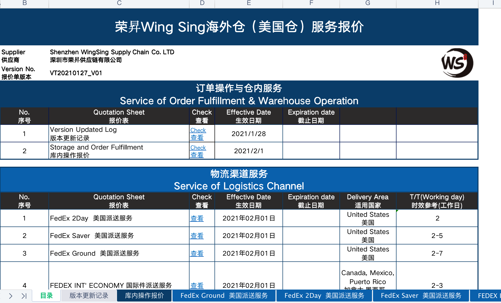

海外仓报价表示意图

  
  

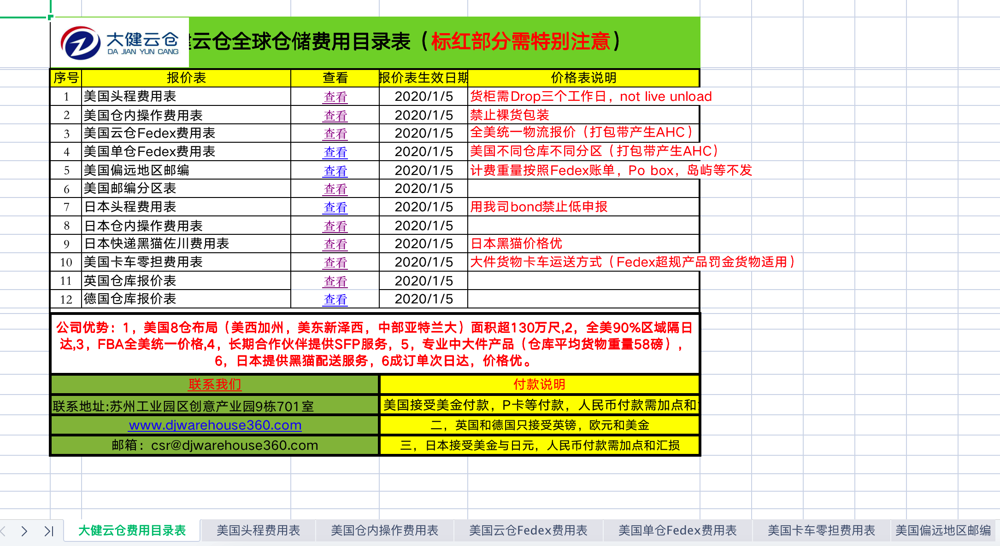

海外仓报价表示意图

  
一份Excel的报价表中，一般都会有多个Sheet表，不同的Sheet会表示不同的报价内容，但是基本上离不开这三大块的报价：  
1库内操作费  
2仓储费  
3物流费  
库内操作费和仓储费的报价一般比较简单，所以只需要一个Sheet就可以搞定，而物流费因为不同的物流渠道报价都不一样，一般就是有多少个渠道就会有多少个Sheet的报价说明。  
一份报价表可能是适用于多个客户，也可能是专客专用、定制化的报价。当与客户完成签约后，也就意味着确定了该使用什么报价方案，按什么标准来服务和收费，于是就会给到客户具体的报价表。  
**对于信息化的系统来说，接下来要做的就是将Excel的报价表中的内容迁移到系统中，将对应的计费规则转化成系统能识别的配置项，而这个系统一般称之为“BMS”或者“报价与结算模块”**。  
**报价方案的构成**  
知道了Excel的报价表长什么样子，那么系统中的报价方案自然也要它差不多。一方面是方便业务人员录入对应的计费规则，另一方面就是对用户来说也会有一种熟悉感，更利于线上线下的数据核对。  
  

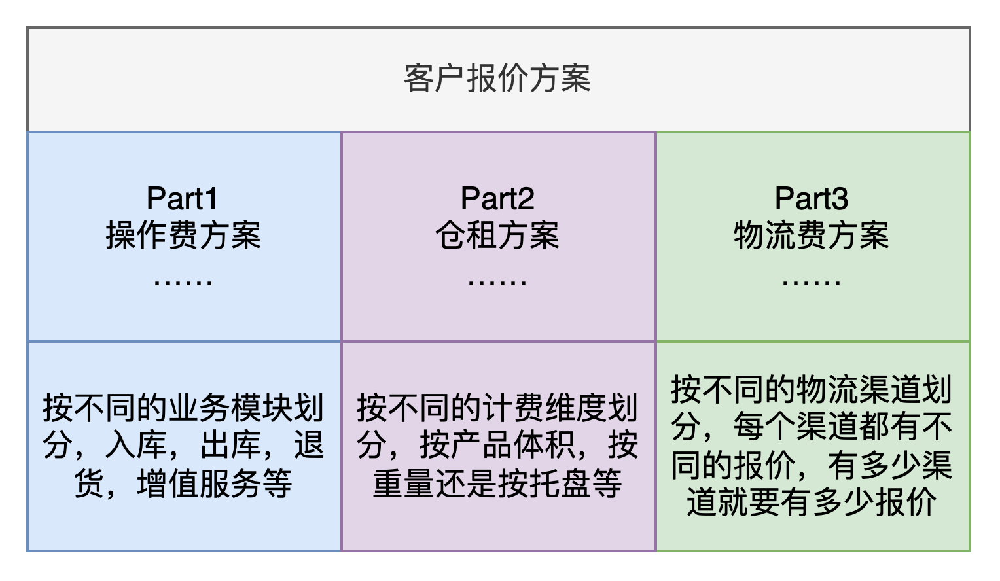

客户报价方案示意图

  
对客户的一个完整报价方案大概由三个大计费模块组成，而这三个计费模块的内部又是由一些更细的业务模块或者不同的计费维度构成的。这三个计费模块已经在之前的文章分别介绍了，不太熟悉的朋友可以再看一遍前面的文章，接下来我们重点讲讲这三个计费模块与报价方案是怎么关联起来的。  
  

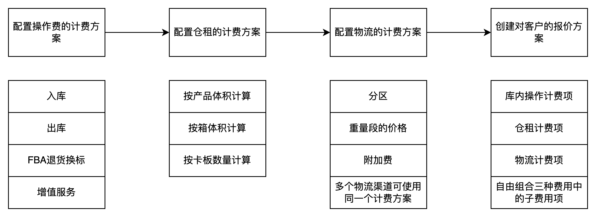

报价方案的配置流程

  
总得来说，对客户的报价方案，是由库内操作费，仓租费，物流费这三类计费模块自由组合构成的。自由组合的原因是有些客户可能不需要计费，有些可能不使用物流，有些客户可能免仓租等，所以不同的客户需要计费的内容不一样，自然报价方案中关联的计费模块就会不一样了。  
  

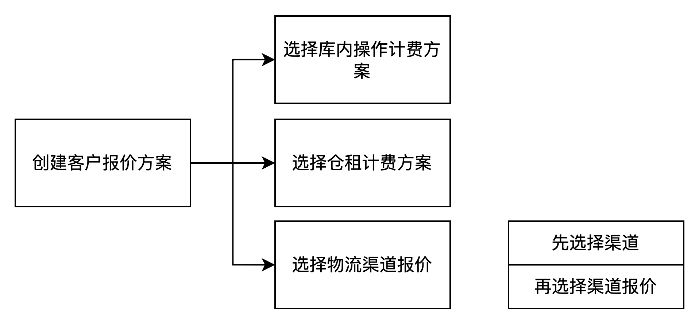

创建客户报价方案示意图

  
在配置客户报价方案之前，需要先配置好这三类计费模块的子项，当要配置客户报价方案的时候，就直接选择配置好的子项即可。所以，**三类计费模块的子项配置是没有严格的顺序之分的**，可以先配置操作费，也可以先配置物流费或者仓租费，都是可以的。

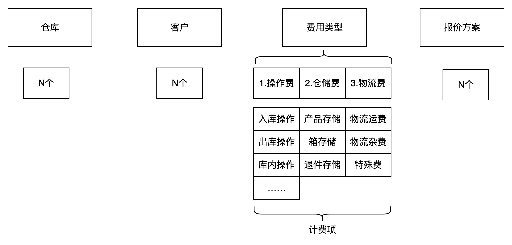

  
一份完整的客户报价方案中除了核心的“计费模块”之外，还有仓库，客户，物流渠道等业务信息，因为对于海外仓来说，大概率不止有一个仓库，所有的仓库都需要用一套系统来管控，而不同的仓库有可能处于不同的国家或地区，结算的币种或者报价方式也不一样，所以在配置报价方案的时候要重点关注好“仓库”这个元素。  
一个仓库大概率也是会有多个客户的，所以客户报价方案大概率也是每个客户一个方案，但是一旦客户多了之后，每次维护就会比较麻烦。**有的系统会采用等级价的方式来应对，也有系统是采用客户组的方式来应对**。等级价和客户组其实本质上的原理都是一样的，就是对客户进行归类分组，减少逐个维护管理的成本，只需要维护少量的客户报价，这些报价是和客户组挂钩的，然后再把客户归入到客户组中，就可以和客户报价关联起来。结合所调研的业务场景和产品设计方案，我们采用的是分组的方式，一个报价方案可以关联多个客户。  
  

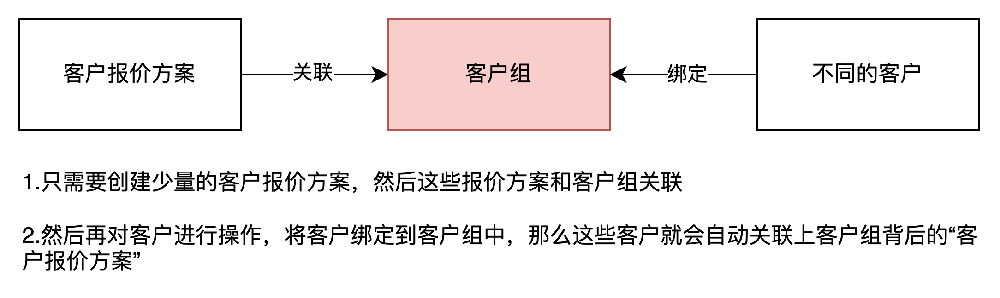

客户报价方案-客户组-客户的关系

  
在配置物流费的时候，还需要通过仓库和客户的关系筛选出符合条件的物流渠道，也就是要确定“仓库-客户-物流渠道”的关系，这样在配置物流费的时候才不会配置一些客户用不上的渠道。  
最后就是，客户报价方案是会有一定的周期、时效的，相当于签约的合同时长。如果超过了失效日期，那么就需要重新拟定一份报价方案。当引入了时间周期这个字段之后，在创建客户报价方案的时候也需要校验一下仓库下的某个客户是否有重复的报价方案，如果有重复的报价方案则不允许创建。**因为同一个时间段内，一个仓库下的一个客户只能有一份报价**。  
  

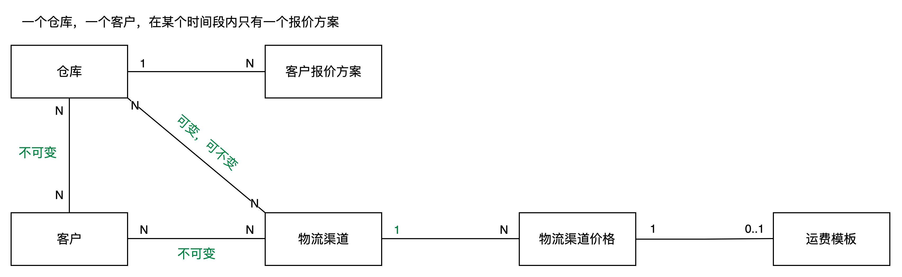

报价方案中的多个元素的关系图

  
**客户的报价方案怎么计费？**  
客户报价方案类似于一个压缩包，将库内操作费，仓租费，物流费打包在了一起，然后再关联上客户，仓库，币种等信息。当维护好了一个客户报价方案之后，相当于计费的公式/规则已经到位了，接下来就是采集数据并计费了。  
如果数据采集到位了，那客户的报价方案是怎么计费的呢？  
1当报价方案配置好了之后，业务系统（OMS或者WMS）会根据业务发生的节点或预设的采集点主动推送相关的数据给BMS。例如说上架费就是要等单据状态变成了已上架之后，才会将数据推送给BMS，这样才可以算出实际的上架费用。  
2整个报价方案中会有三大类的业务，而其中的一类（例如操作费）中又可以继续拆分成不同的业务类型（入库，出库等），经过这样的拆解之后，不同的业务模块会有不同的计费规则，而从业务系统（OMS或WMS）推送过来的数据也会按不同的分类分别去匹配对应的计费规则。  
3在匹配对应的计费规则时，需要先从大的维度找到生效的客户方案（例如通过仓库、客户等确认具体的报价方案），然后再逐层判断更细节的计费规则（是物流费，还是操作费，还是仓租费），最后再流入到最细一层的计费规则，将业务数据套到公式/规则中，就可以算出对应的费用了。  
4算出了对应的费用之后，再反向将这些费用汇总累加，就可以得出每一单的费用或者是某个客户当天的总费用等。  
  

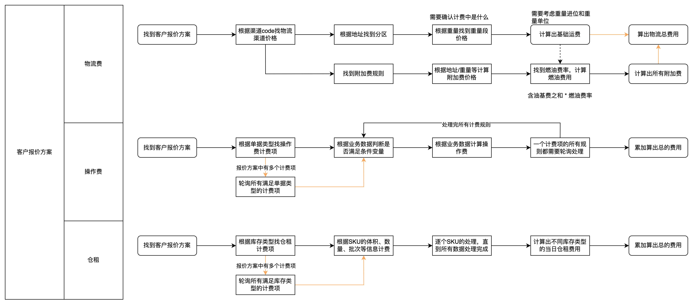

三大模块的计费方式说明

  
**物流费**  
物流费主要是由基础运费+附加费构成的。基础运费是靠分区+重量段来匹配对应的价格算出来的，而附加费就有很多规则了，例如燃油附加费，超长/超重附加费，偏远/超偏远附加费，住宅地址派送费等，需要先理解不同的附加费收取条件，才能设计好对应的计费规则。  
业务数据推送到了BMS之后，先根据仓库，客户，时间等信息确认客户的报价方案，因为在一个时间内，客户在仓库中只有一个客户报价方案。  
找到了报价方案之后，再根据业务类型分流，例如我们要计算物流费，那么就找到报价方案中的物流渠道的价格（物流渠道的报价）。  
找到了对应的物流渠道价格之后，就根据订单地址，包裹重量等信息找到渠道价格中的分区和重量段等，最后得出基础运费的价格。  
而附加费等则需要先通过附加费的判断条件，满足了附加费的收取条件之后，再将业务数据代入到附加费的计算公司中，就可以计算出附加费的结果。  
**操作费**  
操作费一般是会按实际的业务模块来划分的，例如入库的操作费，出库的操作费，退件的操作费，然后采集到了业务数据之后，先根据仓库，客户，时间等确认报价方案。  
找到了报价方案之后，再根据业务数据中的单据类型，确认是在入库模块还是出库模块去找对应的计费项。找到了计费项之后，需要将采集的数据依次代入到计费项中的条件变量中，先确认是否满足计费子项，再决定要不要计算该子项费用。  
一个出库模块中可能会有很多个计费项，一个计费项又有多个计费子项，需要将所有的计费子项都跑一遍，算出来的费用再累加才是最后得出来的操作费。  
  

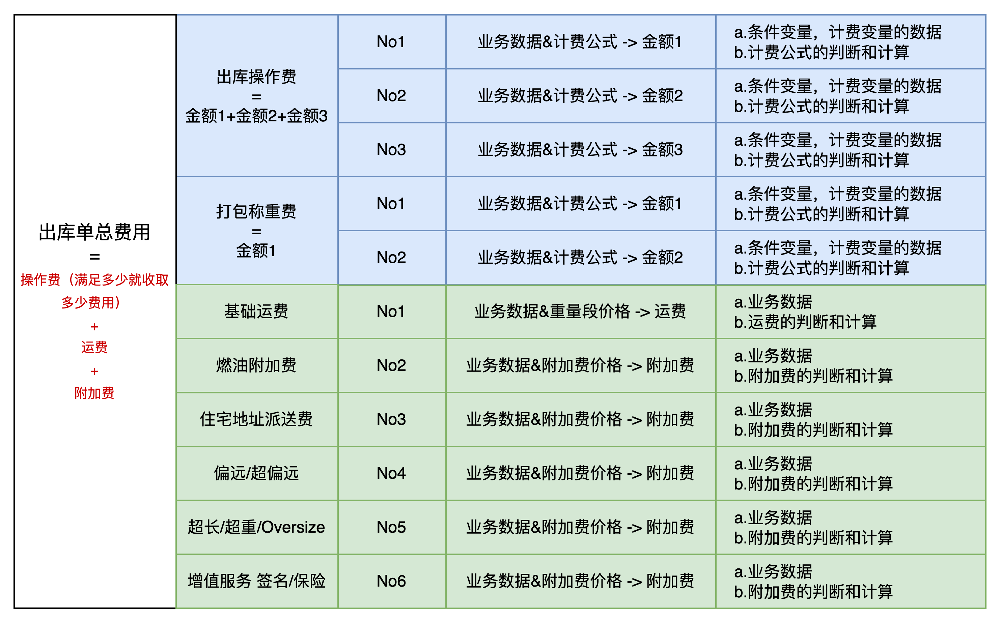

出库单总费用构成

  
**仓租**  
仓租也是和上面两类费用类似的判断方式，先确认客户的报价方案，然后找到仓租中不同库存类型的仓租计费方式。如果仓库只有一种库存类型（产品库存），那么就只有一种仓租的计费方式，反而会更加简单一些。  
接着将不同的库存类型的每日批次库存信息代入到计费规则中，就可以算出某个产品在当天应收取多少仓租，最后将所有的产品的仓租汇总就可以得到当日总共的仓租。  
  
  

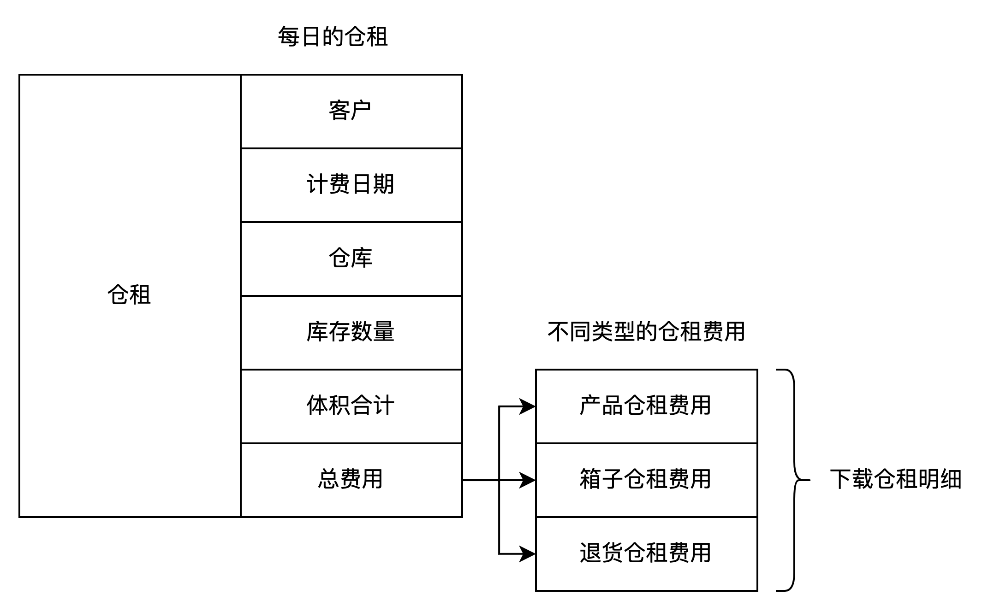

每日仓租费用的构成

  
**小结**  
海外仓BMS的报价方案是根据之前的内容层层递进、演化最终形成的解决方案。系统重的报价方案是实际业务的抽象表达，也是系统自动化计费的基础前提。  
报价方案的设计简单来说就是把几个大类的费用都打包在一起，然后当业务发生了之后，再从高到低去层层匹配对应的业务分类，计费项和计费子项等。  
在设计报价方案的时候，除了要考虑兼容三大费用及其子项之外，还需要重点考虑业务数据跑规则的时候能不能不遗漏，不出错且关键场景都兼顾到位。因为报价方案和费用项都是息息相关的，谁错了都会导致最后的计费结果出错。  
BMS相关的文章都比较少，但是其中的内容实际还是很多、很琐碎的，产品设计难度也非常大。考虑到文章的简洁性和大家的接受程度，我对一些内容做了精简，如果对这方面没看太懂的的朋友可以与我交流沟通。