**前言**  
此书的核心内容是聚焦在“海外仓OTWB”，但是市面上关于海外仓相关的资料相对来说还是比较少，不过仓储类的底层业务知识都是相通的，所以看不了海外仓的一些资料，也可以看看国内仓的一些资料，都可以产生很大的帮助。  
本文主要是展示一些我之前搜集的WMS、PDA，还有仓库具体作业的资料等，如果后续有其他新的资料，我也会持续维护进去。  
**WMS相关资料**  
  

| 仓库类型 | 产品名称 | 介绍说明 | 截图参考 |
| --- | --- | --- | --- |
| 海外仓 | [Shipout WMS](https://support.wms.shipout.com/docs/support/user-manual/shipout-wms-user-guide/) | Shipout是一款SaaS WMS，主要是针对海外仓的业务，而且主要是美国的海外仓。所以如果想要做美国海外仓这一块的，可以多花点时间研究一下它做得东西。 | 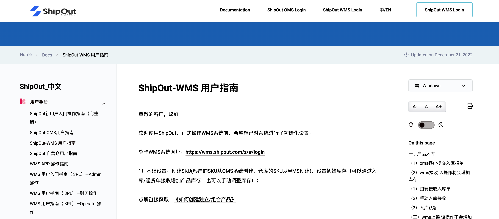 |
| 海外仓 | [星链WMS](http://help.xlwms.com/) | 星链WMS也是一款SaaS WMS，也是针对海外仓业务，但是不局限于美国的海外仓，而且针对全球的海外仓业务都可以支持，相对来说功能模块比较简洁易懂，交互体验也做得不错，值得参考借鉴。 | 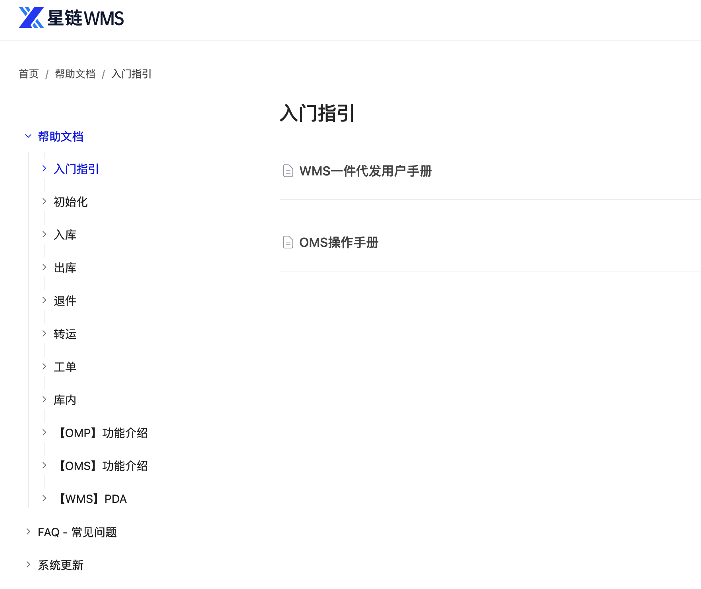 |
| 海外仓 | [易仓WMS](https://www.eccang.com/manual_2.html) | 易仓WMS是比较老牌的海外仓WMS，产品迭代时间比较久，功能比较丰富，强大，但是上手的难度相对比较高，而且其中有比较多的功能模块可能是作废了或者压根用不上了，所以学习起来成本比较高 | 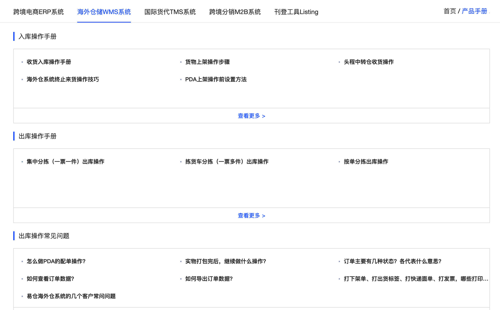 |
| 国内仓 | [富勒WMS](https://www.flux.com.cn/) | 富勒WMS算是国内WMS领域的天花板级别的存在，功能非常强大，而且也很灵活，支持二次开发或者灵活配置很多功能项。如果要深入学习WMS相关的知识，那么必须要多花时间钻研富勒WMS的内容 |  |
| 国内仓 | [唯智WMS](https://www.vtradex.com/pro_wms.html) | 唯智WMS在国内也有比较多的用户和受众，但是唯智的操作手册好像一直没有写得很细节，所以关于这一块的知识我收集的比较少，有一个帮助手册大家可以将就看看 |  |
| 国内仓 | [吉客云ERP](https://www.jackyun.com/pages/space.html) | 吉客云ERP是一款针对国内电商的综合型ERP，除了包含电商ERP的内容，还有WMS，MES，OA，质量，财务等多个模块，功能非常强大，而且帮助手册做得很好，值得学习借鉴。 | 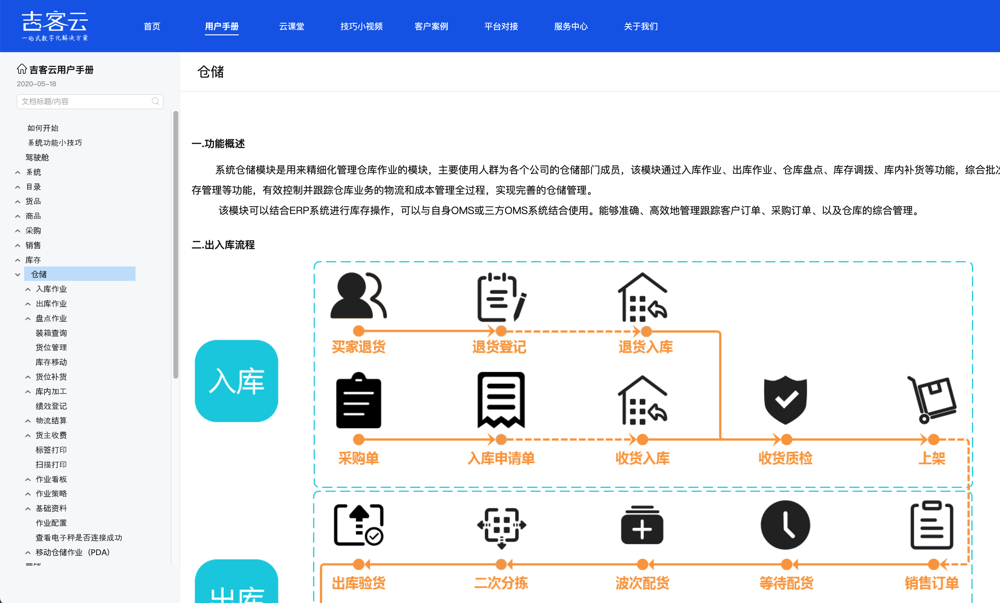 |
| 国内仓 | [万里牛WMS](https://hupun-service.cus.dingtalk.com/page/knowledge?pageId=6&category=1003118871&language=zh) | 万里牛WMS是一款针对国内电商业务的仓储管理系统，既然是专业做WMS的，那么PDA的功能自然也可以借鉴参考一下了。 | 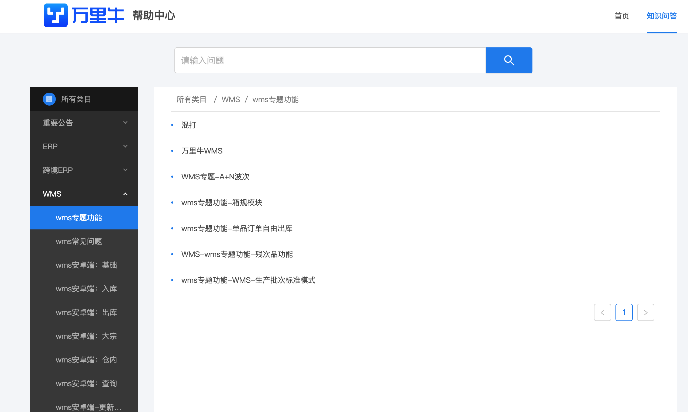 |
| 国内仓 | [C-WMS](https://www.kancloud.cn/c-wms2020/cwmsjhczsc/2555418) | C-WMS也是一款国内专业的WMS产品，它的帮助手册放在看云上，总体来说也是有比较丰富的介绍了 | 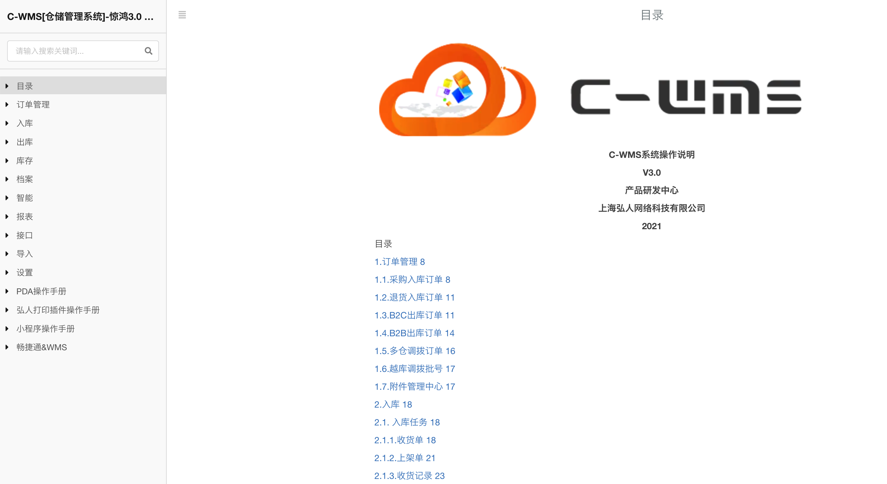 |

​  

  
  

**PDA相关资料**  
  

| 产品名称 | 介绍说明 | 截图参考 |
| --- | --- | --- |
| [领星ERP PDA](https://www.lingxing.com/help/article/PDAlogin) | 领星ERP中有仓储模块，其中涉及到了仓库端的PDA收货，上架，拣货，移库的操作，所以PDA的一些交互操作可以参考学习。 | 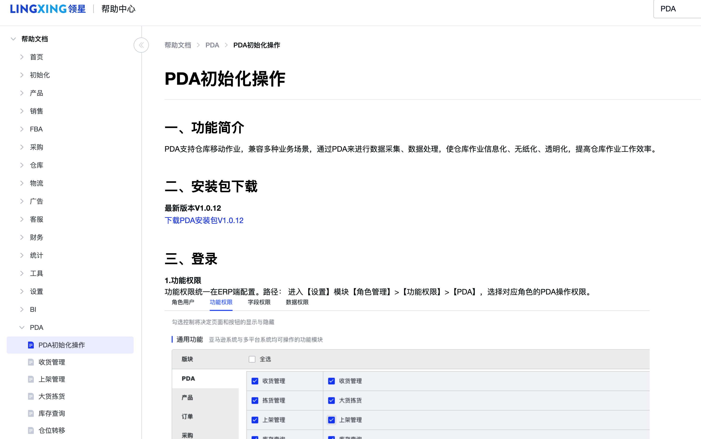 |
| [Shipout WMS](https://support.wms.shipout.com/docs/support/user-manual/app-manual/) | Shipout是一款SaaS WMS，主要是针对海外仓的业务，其中PDA的交互做得挺好的，尤其是多语言/国际化的场景，很有参考学习的价值。 | 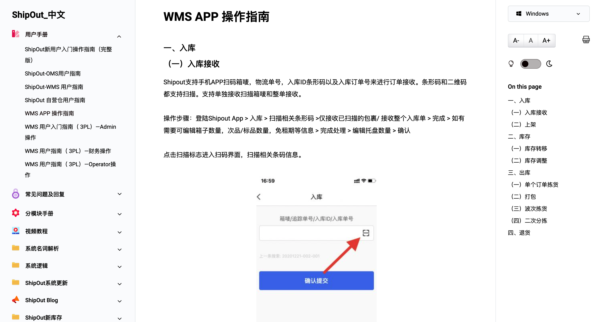 |
| [易仓WMS PDA](https://home.eccang.com/#/company/helper/center?docId=182) | 易仓WMS也是一款针对海外仓的SaaS WMS，而且也做了比较久的时间，有一些PDA的操作可以参考借鉴一下。 需要注册一下易仓的账号，然后在“帮助中心”->“用户中心”找到“智能硬件-PDA操作” | 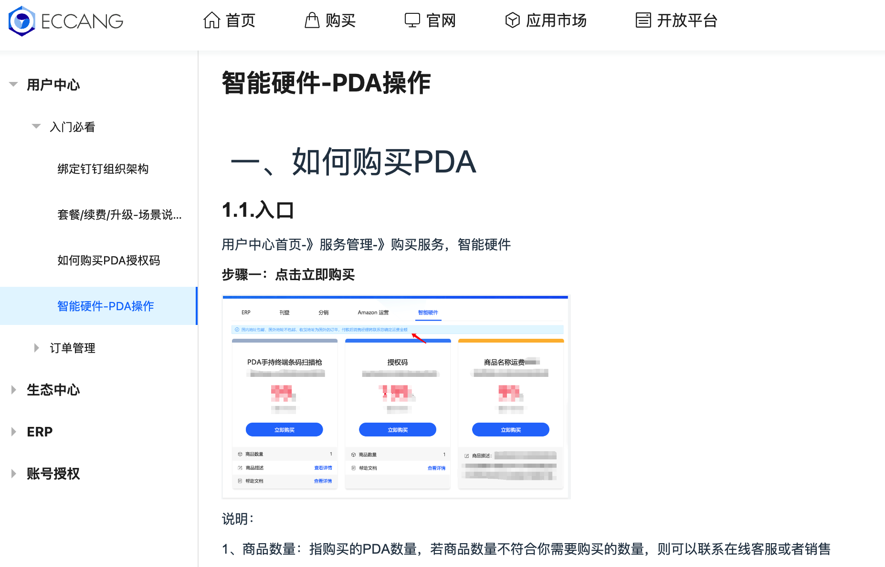 |
| [吉客云ERP PDA](https://www.jackyun.com/pages/space.html) | 吉客云ERP是一款针对国内电商的综合型ERP，除了包含电商ERP的内容，还有WMS，MES，OA，质量，财务等多个模块，功能非常强大，而且帮助手册做得很好，值得学习借鉴。 | 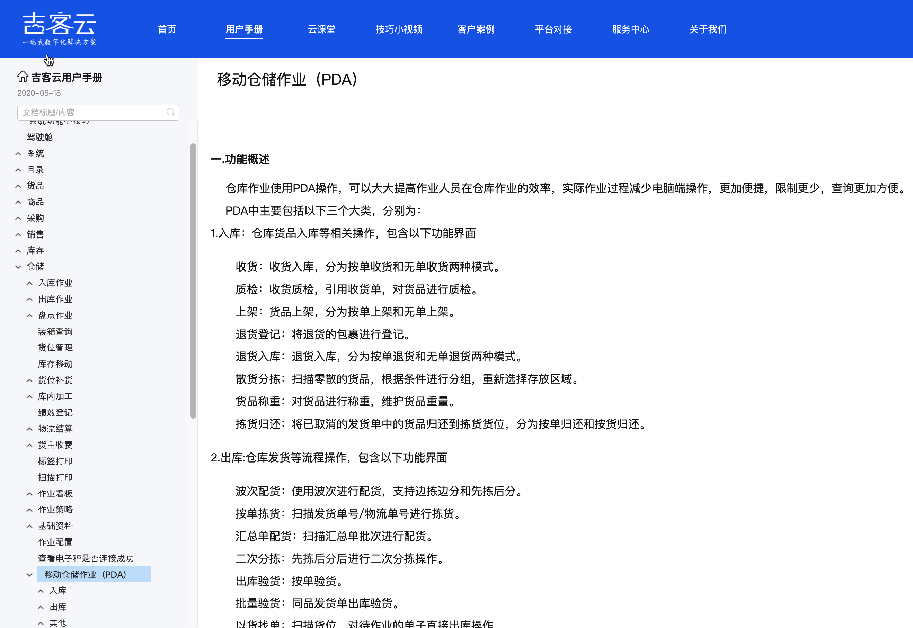 |
| [万里牛WMS PDA](https://hupun-service.cus.dingtalk.com/page/knowledge?pageId=6&category=1003118871&language=zh) | 万里牛WMS是一款针对国内电商业务的仓储管理系统，既然是专业做WMS的，那么PDA的功能自然也可以借鉴参考一下了。 | 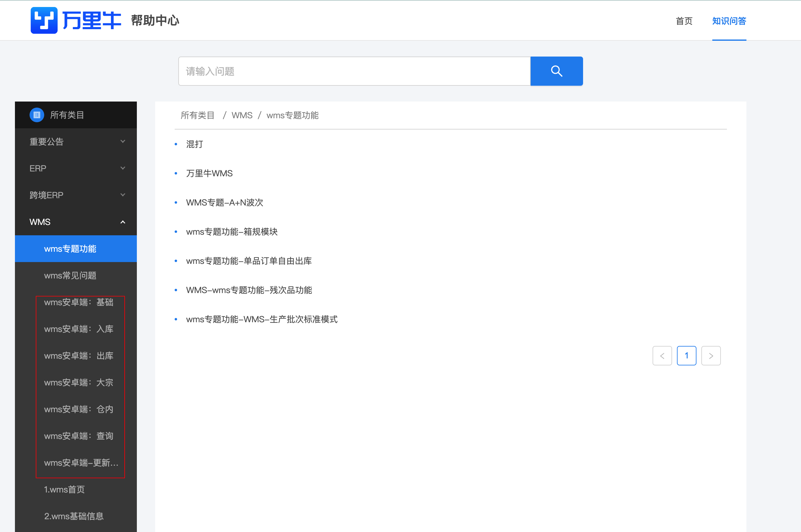 |
| [C-WMS PDA](https://www.kancloud.cn/c-wms2020/cwmsjhczsc/2538201) | C-WMS也是一款国内专业的WMS产品，它的帮助手册放在看云上，总体来说也是有比较丰富的介绍了，要做PDA相关的业务的话，可以参考学习一下。 | 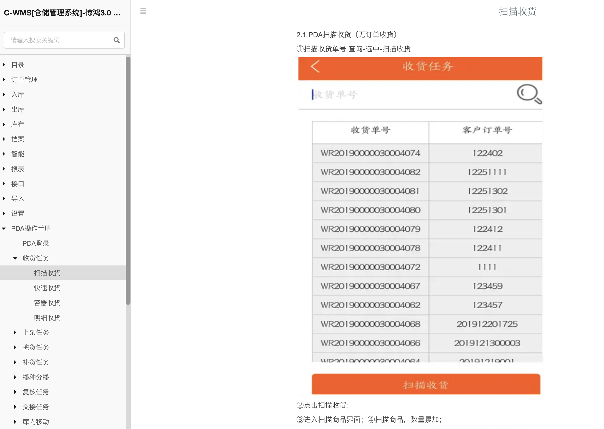 |
| [鸿牛WMS PDA](https://www.yuque.com/ihgd8c/manual/ep0kv2) | 在语雀上找到的一款关于WMS的操作手册，详细的内容没有怎么体验过，但是手册内容还是很详实的，可以参考学习。 | 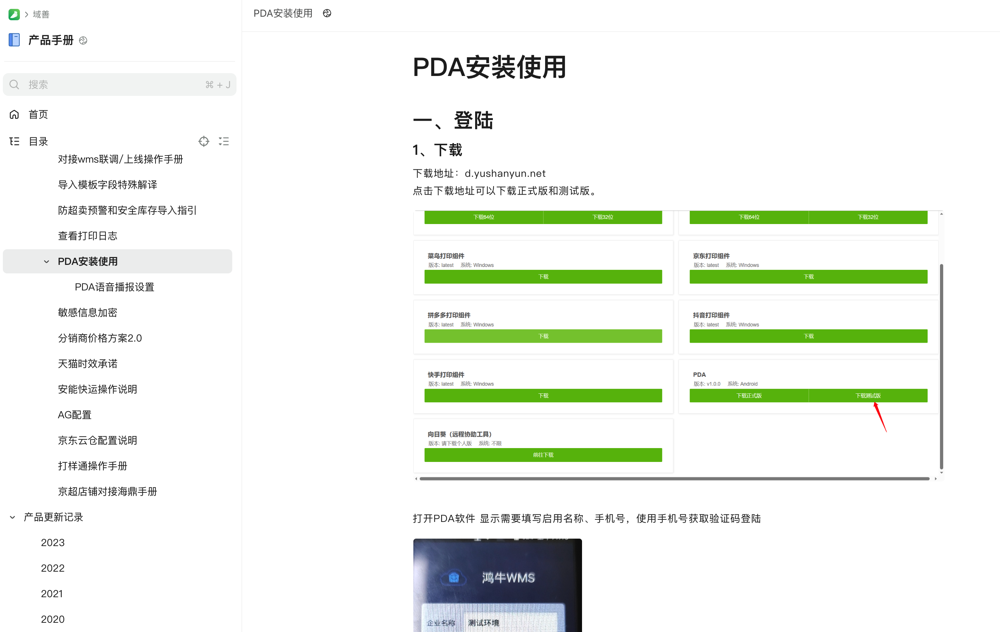 |
| [网店管家 PDA](https://www.yuque.com/tongtong-7vq3d/cv1gxp) | 网店管家和吉客云应该是兄弟公司，是一家比较老牌的做国内电商ERP的公司，ERP/WMS等领域都做得还不错，帮助手册中图文并茂还有视频，值得学习参考。 | 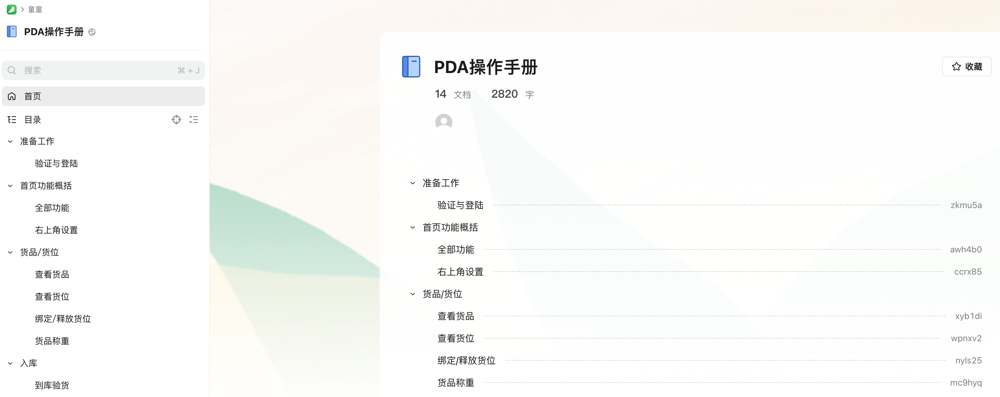 |