## WMS的“暂存库位”是什么？

在一些复杂的、成熟的WMS中（例如富勒WMS）会有一个“过渡库位”的概念，也可以理解为“暂存库位”。意思就是说这个库位是在仓库的操作过程中临时使用的库位，用来过渡、暂存一下。

例如说，收货完成之后，货物会先暂时存放在过渡库位（STAGE1），然后等要上架的时候再从过渡库位转移到具体的存储库位中。

同样的道理，当拣货完成之后，货物会从存储库位中下架，然后也暂时存放在过渡库位（STAGE2），等真正的出库之后，再从过渡库位中扣减库存。

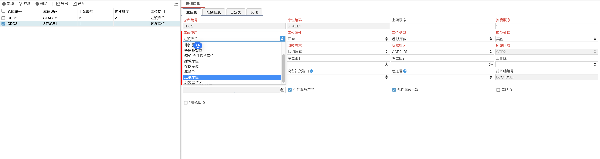

当我们去研究海外仓WMS的竞品时，可能会发现几乎大多数的SaaS海外仓WMS或是自研型的海外仓WMS都没有设计“暂存库位”这个概念，但是依然可以正常将业务流程运转起来。那么在实际的产品设计过程中，我们到底是选择用“暂存库位”，还是选择不用，这两者都什么区别，有什么差异呢？

接下来，我抛出几个比较常见的业务问题或者是产品设计的场景问题，我们尝试用不同的解决方案去解决它，然后再看这些解决方案背后有什么差异，也许就可以明白，到底自己在做WMS的时候，要不要用到“暂存库位”了。

## 问题1：WMS入库在什么时候增加库存？

我相信，有非常多初次做WMS的朋友都曾经想过这问题，到底WMS在入库的时候，应该在什么节点去增加库存呢？是在收货清点之后，还是在上架完成之后？

### 解答1：收货之后

如果我们选择了在收货之后去增加库存，那么意味着当仓库完成了清点、验收、收货之后，WMS就增加了收货的库存。那么我们接下来就会面临另外的几个问题：

1.  收货加了库存，那么上架的时候加不加库存？
2.  收货加了库存，那这个库存记录在什么维度上呢？怎么管理呢？

一般来说，如果采用了在“收货之后”就增加库存的方案，那么收货之后会增加库存，就需要知道这个库存是挂在什么维度上的。此时就会在WMS中引入一个“暂存库位”的概念，WMS收货之后库存会增加在“暂存库位”中，这个暂存库位就是一个虚拟的库位，用来承载收货的库存数量。

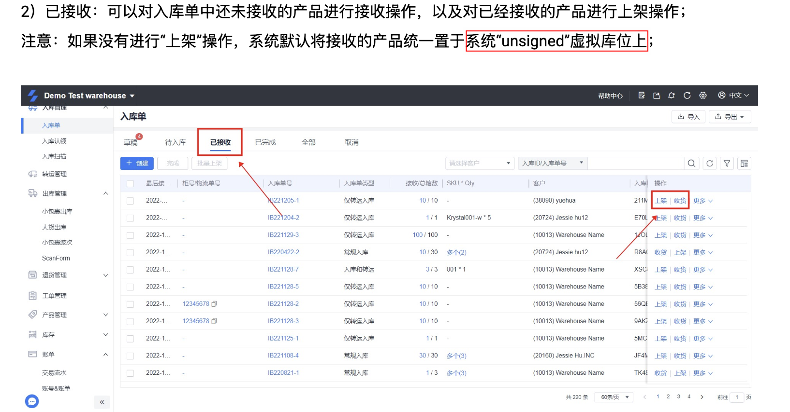

由于大多数的WMS都是需要进行批次管理的，既然在收货的时候生成了库存，所以就应该在生成库存的时候，同时也按**批次属性**来生成对应的批次号，并将库存和批次号关联起来。所以当我们完成了收货之后，同时也应该得到“SKU-库位”和“SKU-批次”这两个维度的库存。

当仓库完成了收货之后，货物可能只是暂存放在容器中或者是某个仓库的空地上，最终的货物肯定是要移动到具体的货架上，库位上。当我们在收货之后，依然是要进行上架操作的，此时的上架依然是要增加库存的，不过这个增加是“库内移位式的增加”。**意思就是，从暂存库位移动到存储库位，先从暂存库位下架，然后再上架到存储库位中，库存先扣减，然后再增加**。

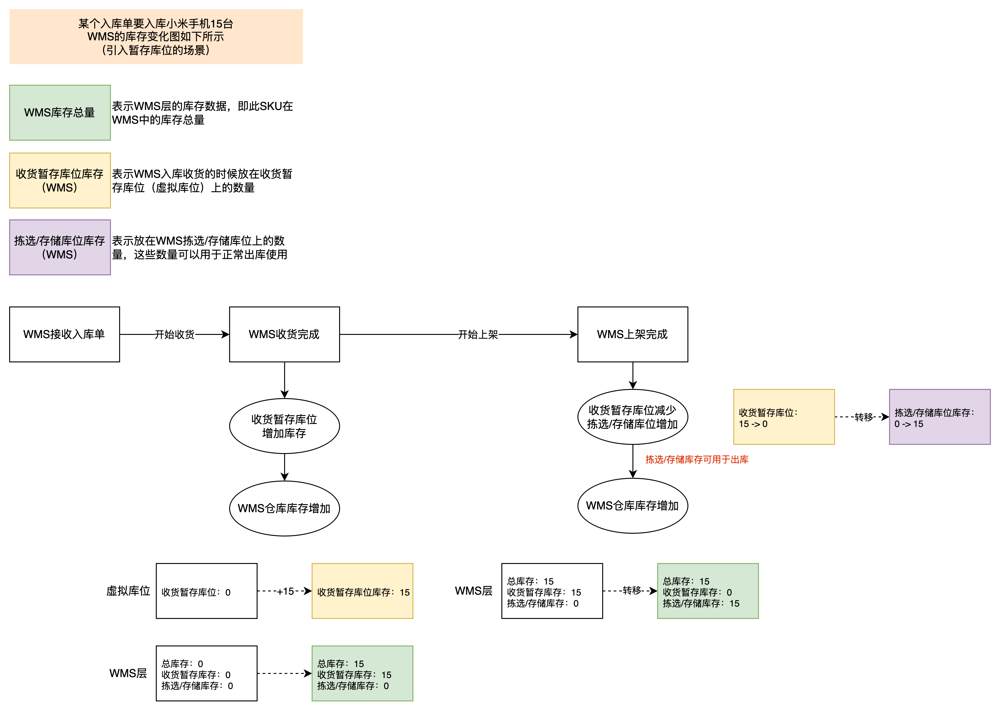

### 解答2：上架之后

也有很多海外仓是没有引入“暂存库位”或者“暂存库位”的概念，所以他们往往会选择在上架之后去增加库存。

如果是在上架之后才生成库存，也就是在上架之后才会有“SKU库存、SKU-批次库存，SKU-库位库存、SKU-批次-库位”的库存，那么又会面临另外的一个问题：**上架的时候要怎么判断批次是否混放呢？**

因为在很多WMS中，在新增库位的时候，都会配置“是否允许混放产品”或者“是否允许混放批次”。

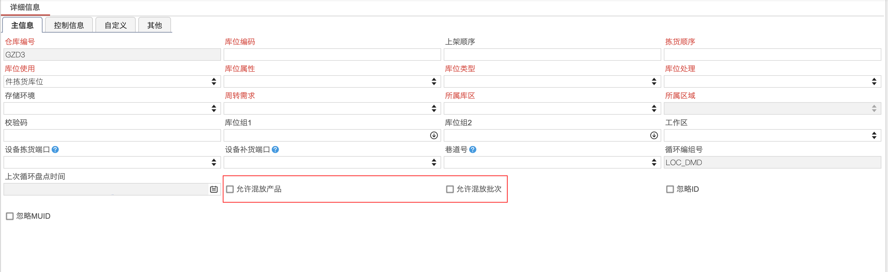

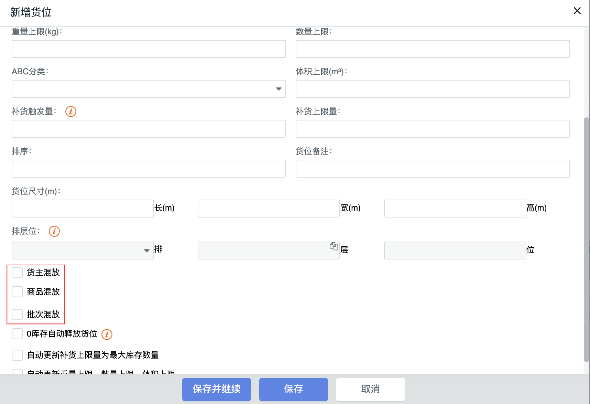

因为上架之后才会增加库存，此时如果还没有上架，自然也就不会生成批次库存了，也就没有批次号了，那要怎么判断是否批次混放呢？

为了解决这个问题，我们可以采用**通过判断“批次属性”的方式**来判断是否批次混放，因为批次号的生成是通过批次属性来判断的，只要同一个SKU的批次属性都相同，那么批次号必然也是相同的，那么能不能混放也就可以知道了。一般来说，批次属性的一些数据获取是在收货的时候就可以获取到的，例如说入库日期，生产日期，失效日期，采购订单号，供应商等。

**在上架的时候，就可以通过这些批次属性来判断同一个库位上是否混放了批次。**

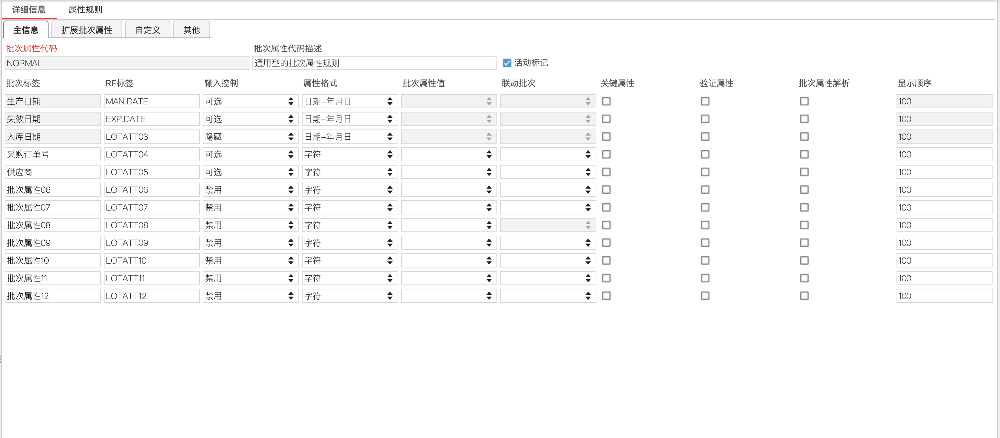

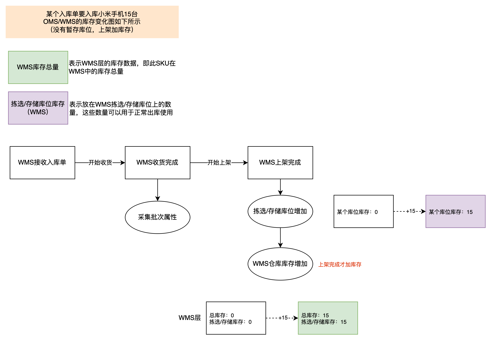

## 问题2：仓库拣货下架之后但是还没有出库的库存怎么处理？

当我们知道了问题1的背景和设计思路之后，我们马上就会想到一个类似的问题：**仓库拣货下架之后，还没有出库的部分库存要怎么处理呢？**

因为仓库拣货下架之后，货物会放在拣货车上，然后去做二次分拣、复核、打包称重，最后等待物流揽收，直到货物出库之前，这些货物应该都是存放在仓库中的。所以理论上来说只要仓库还没有将实物出库，那么这部分的库存就应该是可以跟踪和溯源的。

### 解答1：用暂存库位来记录这部分库存

当仓库拣货之后，货物从货架上的库位拿下来放到了拣货车中，所以在“SKU-库位”和“SKU-库位-批次”的维度，这部分的库存是要扣减的，因为货物已经不在原来的库位上了。

但是要追踪和记录这部分拿下来的库存，所以我们可以再做一次“库内移位式”的操作，货物从货架的库位转移到了暂存库位的中，所以存储库位的“SKU-库位”和“SKU-库位-批次”维度的库存扣减，对应的暂存库位的“SKU-库位”和“SKU-库位-批次”维度的库存则增加。

如果此时，仓库需要做盘点、做移库、做任何调用存储库位中库存的动作，那么这部分已经拣货下架的内容都不会受到影响，因为它已经不在存储库位上了。

同样的道理，如果此时订单发生了取消，需要将拣货下架的这部分库存重新返库上架，回到原来的存储库位上，也可以从暂存库位再做一次“库内移位式”的操作。

如果订单一切正常，那么当仓库确认出库之后，就直接从“暂存库位”扣减库存即可。

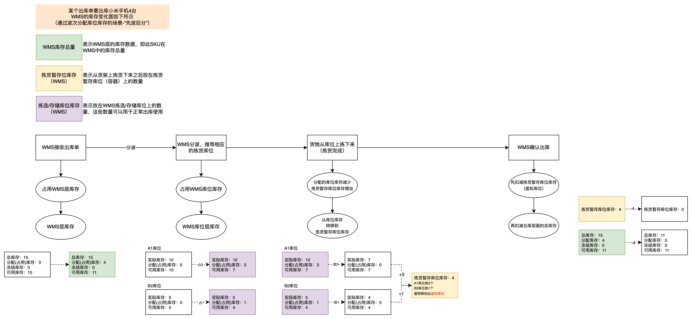

### 解答2：不用暂存库位来记录这部分库存

如果我们选择不用暂存库位来记录这部分的库存，那么当实物拣货下架之后，此时在WMS中是无法记录到这部分“空白期”的库存，我们只能记录到从这个库位上扣减了多少库存数量。

通过前面章节的内容，我们知道仓库会有多层级的库位维度，那么在出库的时候需要提前预占锁定库存，也需要按多层级的方式，从高到低逐层去预占锁定。

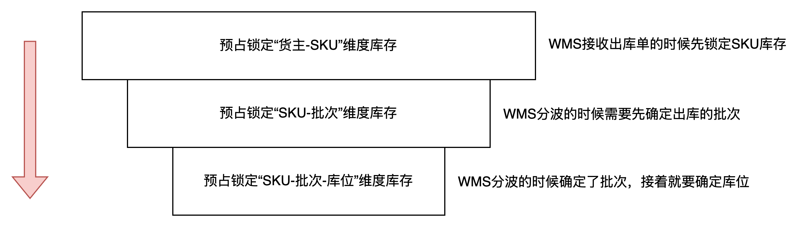

当我们预占锁定了“SKU-批次-库位”维度的库存之后，就可以去执行拣货操作了。拣货完成之后，我们需要将“SKU-批次-库位”维度的库存从预占锁定转为扣减，虽然是扣减了库位上的库存，但是仓库层面的总库存因为实物还没有具体出库，所以暂时还是在锁定的状态中。

如果此时，仓库需要做盘点、做移库、做任何调用存储库位中库存的动作，那么这部分已经拣货下架的内容都不会受到影响，因为它已经不在存储库位上了。

不过如果此时订单发生了取消，需要将拣货下架的这部分库存重新返库上架，回到原来的存储库位上，那么此时就不是做“库内移位式”的操作，而是需要特殊处理一下用**返库上架**的逻辑。因为如果是按普通的上架逻辑，那么批次号，原始的拣货库位等信息会对不上，所以得要用定制的“返库上架”，去溯源取消的订单曾经是从什么库位拣货的，现在又要回到什么库位上。

可以通过库存流水中关联的“拣货任务号”、“波次号”、“出库单号”等信息来关联相关的库存流水，然后找到源库位和数量等信息。

​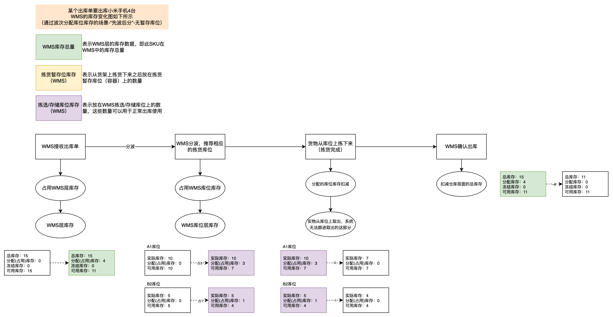

## 问题3：有了“暂存库存”之后，查询库存的时候怎么展示？

通过上面入库、出库的拆解，我们会发现无论是否选择使用“暂存库位”，系统都可以有对应的解决方案，都是可以达到业务的目的，只不过是系统层面的一些改动点和逻辑处理会有点不太一样而已。

当我们选择了引入了“过渡库位”或者“暂存库位”之后，如果要在WMS中要去查询库存，那么对应的一些产品功能逻辑也要做出相应的调整，因为“暂存库存”虽然是库存，但是在某些场景是不可用的库存，所以要在库存设计的时候就考虑到这一层。

关于库存方面的展示逻辑，还有是否可用的限制约束，以入库收货时启用“暂存库位”的场景为例，我这里整理了几种相应的设计方案供参考。

### 方案一：部分维度隐藏“暂存库存”的数据

第一种，就是在多层库存查询维度中，都不展示这部分的库存，这样可以直观地让用户关注可用的库存数量有多少，而不用被其他的概念和名词困扰。

在这种方案中，可以通过“SKU-库位查询”或者是“SKU-批次-库位”查询，知道存放在暂存库位中的数量有多少。同时系统也做了限制，虽然知道有多少数量，但是这些数量都是不可用的，不能用来分配拣货，移库，下架等任务，通过系统的定制化处理，只能将这部分的库存用于上架使用（以收货的“暂存库存”为例）。

> 总库存 = 可用库存 + 锁定库存 + 不可用库存（页面不可见）

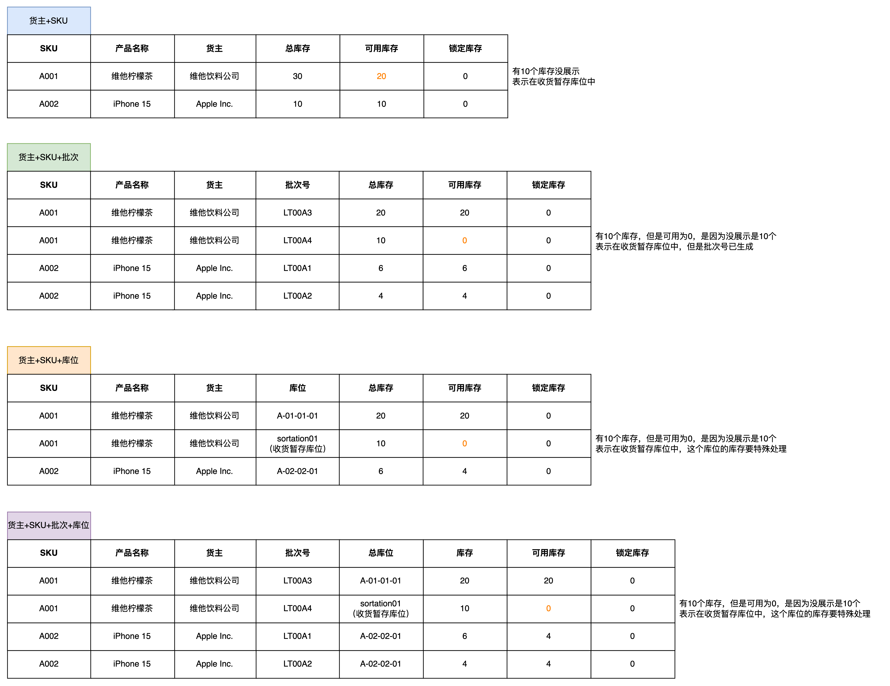

### 方案二：全部维度展示“暂存库存”的数据

第二种方案，就是在多层库存查询维度中，全部都展示这部分的库存，但是标记为“不可用库存”，这样可以让用户知道具体有多少可用的库存，又有多少不可用的库存。而不可用的库存，可以特意说明清楚就是指存放在暂存库位的库存。

在这种方案中，当通过“SKU-库位”或者是“SKU-批次-库位”查询库存的时候，可以知道货物是放在了暂存库位中。那么这部分库存是算作“可用库存”，还是“不可用库存”，这个就要结合系统逻辑和代码逻辑来处理了。

-   如果算可用库存，那么就要控制，在拣货、移库下架等场景下分配库位库存的时候，不要分配到暂存库位的“可用库存”；
-   如果是算作不可用库存，那么就是要控制，只有在特定的几个场景下才可以使用暂存库位的库存，即使它是“不可用库存”的类型

> 总库存 = 可用库存 + 锁定库存 + 不可用库存（页面可见）

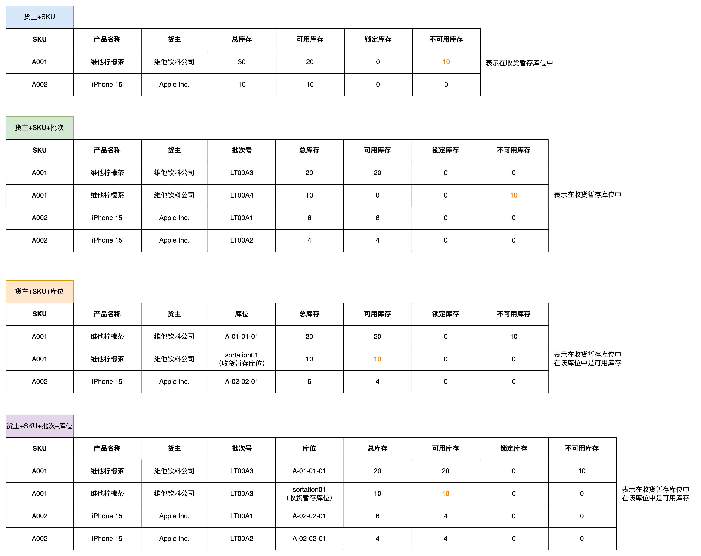

### 方案三：部分隐藏，部分展示“暂存库存”的数据

第三种方案，是富勒WMS的做法，它结合了方案一和方案二的内容，构成了一种比较特殊的处理方式。在“SKU”和“SKU-批次”的维度，隐藏不可用的库存。但是在“SKU-库位”和“SKU-批次-库位”维度，引入了一个“待移出库存”的概念，总库存和待移出库存是有数据的，但是可用库存还是为0。

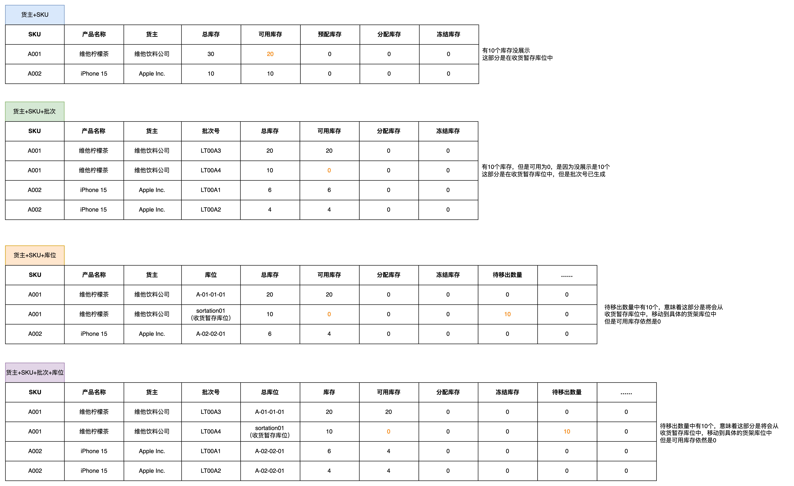

在富勒WMS中，涉及到“SKU-库位”和“SKU-批次-库位”维度的库存，会有非常精细化的库存类型的划分，除了有“待移出库存”之外，还会有：

-   订货数－ 默认为空，用于根据库存生成单证。
-   补货待下架数量－补货任务待操作数量。同一补货任务，对于补货来源库位，锁定为补货待下架数量。
-   补货待上架数量-补货任务待操作数量。同一补货任务，对于补货目标库位，锁定为补货待上架数量。
-   待上架数量－上架任务待操作数量。
-   待移出数量－移库任务待操作数量。同一移库任务，对于移库来源库位，锁定为待移出数量。
-   待移入数量－移库任务待操作数量。同一移库任务，对于移库目标库位，锁定为待移入数量。
-   待调整数量－ 调整单待执行数量。

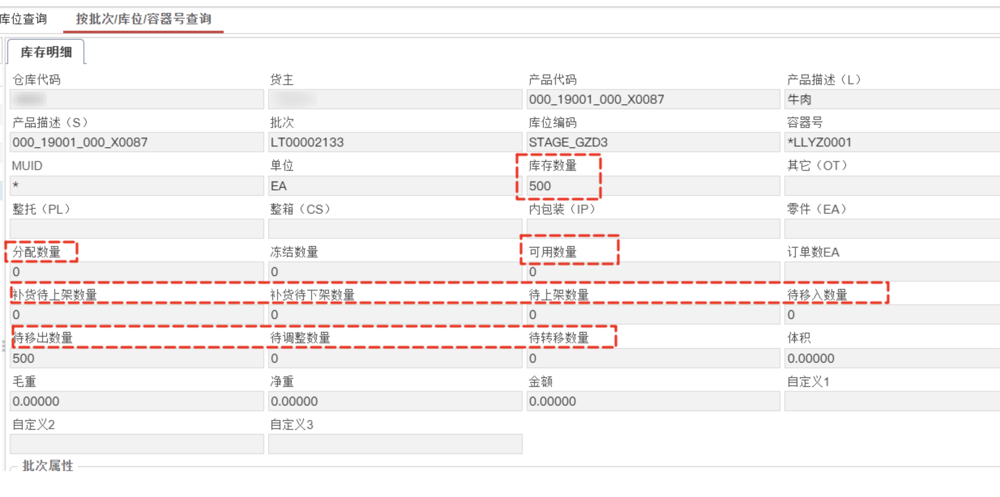

## 总结

通过上面的分析，我们可以知道WMS中可以启用“暂存库位”，也可以不启用，最终我们都可以达到最终的业务目的。

当引入了“暂存库位”之后，意味着仓库入库、出库、盘点、移库等各种操作都要考虑使用“暂存库位”来承载库存。当仓库发生了库位库存的变动之后，往往会同时生成两条流水，一条是存储库位的，一条是暂存库位的，这两者关联的业务单据和动作任务等是同一个。

当后续需要定位一些库存异常问题的时候，可以通过库存流水，库存变更的详情来快速处理，因为越丰富的记录，越丰富的字段，是可以大幅度提升排查问题的效率。

同时也因为增加了过多的概念和逻辑，系统的功能设计，逻辑设计，还有使用体验等多少会受到一些影响，例如说系统逻辑更复杂了，开发难度更高，成本更高，同时用户上手学习的成本也更高了，使用起来更复杂了。

而海外仓WMS或者是一些简单化的WMS，一方面是业务场景没有那么复杂，软件功能够用即可；另一方面也是基于用户的上手学习使用的成本，往往会考虑更简单直白的设计方案，所以往往在设计相关系统的时候不会采用引入“暂存库位”的方案。

虽然没有“暂存库位”，但是海外仓WMS依然可以实现入库到上架，拣货到出库的各项业务流程。即使有一些解决方案可能会有一定的取舍，不过最终所取得的结果还是没问题的，这也是海外仓领域发展了这么多年之后的经验沉淀。

​