**什么是WMS?**  
WMS（Warehouse Management System）即仓库管理系统，是一种针对仓库管理的软件系统，它能够有效地管理仓库的各个方面，如货物的收货、存储、拣选、打包、发运等流程。03-WMS系统的主要作用是提高仓库的管理效率和准确度，实现货物的高效流转和及时配送，从而提升企业的业务水平和客户满意度。  
和OMS的定义相比较，WMS是定义清晰的、没有什么歧义的，也就是当我们在聊WMS的时候，即使是身处不同行业，不同业务形态的人们也能知道这个WMS是指什么，脑海中形成的画面感都是类似的。  
**这是WMS领域的一个特点，也算是一种优势**。这意味着只要你有比较丰富的WMS经验，你是可以横向跳槽到不同领域和不同行业的公司中，例如你是做自研的WMS，你可以跳槽去做SaaS WMS；你是做海外仓的WMS，你可以跳槽去做国内电商仓的WMS；你是做原料加工类的仓储WMS，你可以跳槽到成品类仓储WMS；你是做普通电商仓库的WMS，你可以跳槽到生鲜冷链领域的WMS……  
虽然我们在描述WMS的时候，刻意加上了“海外仓WMS”和“国内电商仓WMS”这样的修饰词，但是从更本质和更底层的角度来看，**其实各类WMS的底层逻辑都是相通的，相关的产品经理也是可以互相学习，快速迁移换岗的**。  
本文虽然重点讲解的是跨境海外仓WMS的业务和产品方案设计，但是大多数知识也同样适用于国内电商WMS，也就是受众不仅仅是做跨境海外仓的朋友，也包含国内电商仓储、传统制造业仓储、生鲜冷链仓储等领域的朋友。  
**仓库的一些基础知识介绍**  
**仓库的分类及相关的用途**  
1如果根据仓库所在的地区来分，可以分成：  
a国内仓，指地址设置在中国大陆境内的仓库  
b海外仓，指地址设置在中国大陆境外的仓库，香港仓库一般也算是“海外仓”  
2如果按照仓库保管货物的特性来分类，可以分成：  
a原料仓库  
b成品仓库  
c冷藏仓库  
d恒温仓库  
e危险品仓库  
3如果按照仓库的用途来分类，可以分成：  
a零售/批发仓库  
b中转仓库  
c加工仓库  
d保税仓库  
4如果按照仓库内部结构和设备的情况来分类，可以分成：  
a单层仓库  
b双层/多层仓库  
c立体仓库  
d自动机器人仓库  
e传统货架型仓库  
一般常见或者常听的是电商仓库，例如京东、菜鸟、唯品会，网易、顺丰，这些仓库往往比较大，然后商品的品类比较多，基本上都会使用AGV机器人，对应的03-WMS系统也会比较复杂，有很多功能模块，要支持很多业务场景。  
而海外仓相对来说，业务比较简单，仓库面积也不算很大，用机器人的也比较少；海外仓WMS要支持的业务场景少，功能也不会太复杂，相对来说入门比较简单一些。**所以，我们接下来的实战项目就会围绕海外仓的WMS来展开，方便大家快速上手。**  
  

  
  

  
  

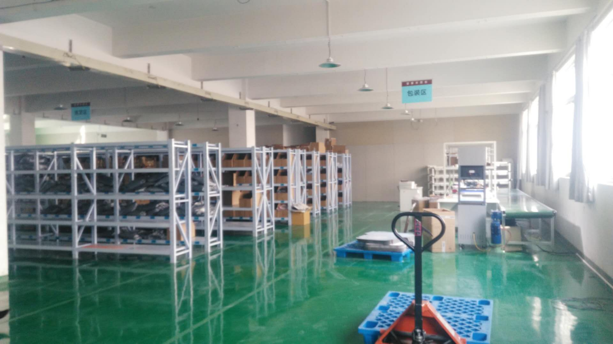

  
  

  
**仓库的库内布局与规划**  
不同的仓库，内部布局可能不一样，常见的布局方式有这么几种：  
●U型布局  
●I型布局  
●L型布局  
●S型布局  
●……  
  

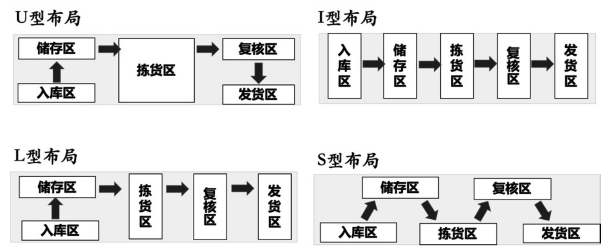

摘自实战供应链

  
这里以比较常见的仓库规划为例，给大家分享一下仓库的物理布局是怎样的，如果看这个图片没有什么画面感的话，我会在文章的最后放上一个仓库布局规划的视频，帮助大家更好地理解仓库的库内示意图。  
  

  
仓库中的区域划分是呈树状结构的，一般一个仓库会分成多个库区，一个库区中有多个货架，一个货架上又有多个库位等，具体的示意图如下所示：  
  

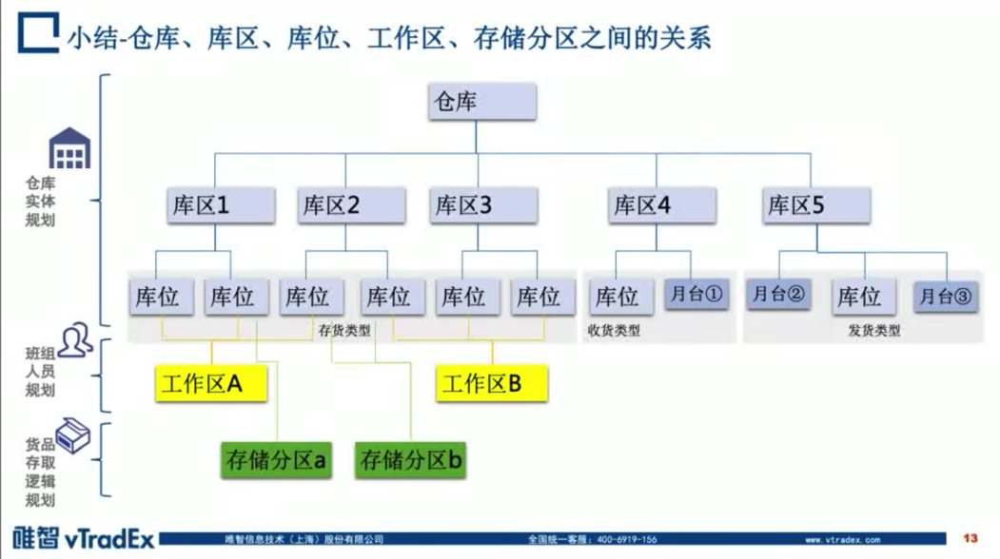

仓库区域划分示意图

  
WMS中的很多产品逻辑都和库位有关系，库位是WMS中特有的一个概念，同时也是非常重要的基础数据。  
库位的编码规则也会有很多种，但是基本上大家都会遵循一个“语义化或者规律化”的逻辑，也就是通过库位编码可以识别出大概的信息，同时也可以推导出相关的规律，例如下图的“库区-巷道-货架-层-列”的命名方式就是一种主流的库位命名方式。

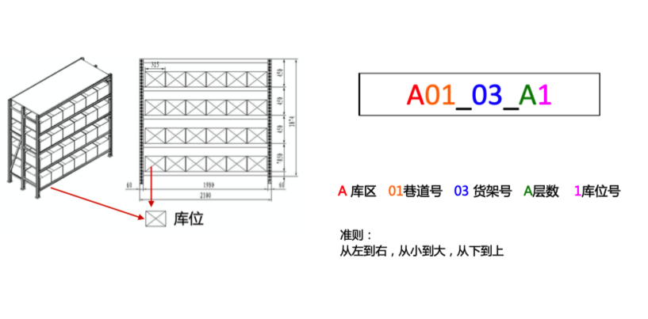

  
  

仓库的货架示意图

  
**仓库的常见设备介绍**  
  

| **项目** | **用途/说明** | **图片/视频** |
| --- | --- | --- |
| 月台 | 车辆停靠，方便装卸货的平台 | 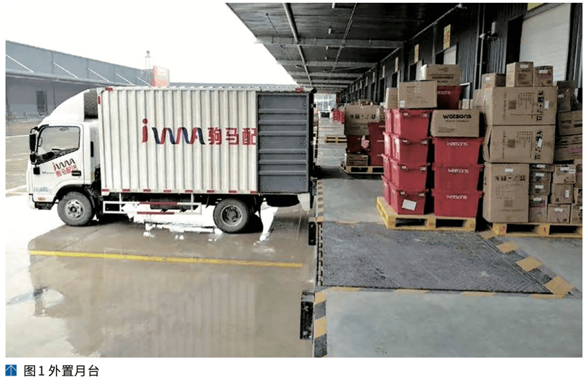 |
| 仓库人员角色介绍 | 1仓库管理员 2收货员、质检员，上架员 3拣货员，复核员，打包员，称重员，物流员 4客服，调度员，搬运员，补货员，仓库文员 | 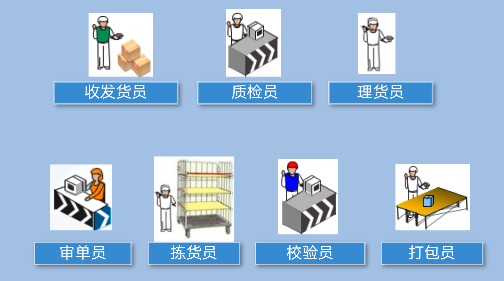 |
| 仓库设备介绍 | PDA，手持终端设备，用于便携作业。市面上常见的设备一般搭载安卓系统，之前也有一些是WinCE系统。 |  |
| 仓库设备介绍 | 托盘，也称之为卡板，用于盛放货物，可以批量搬运，加快作业效率 |  |
| 仓库设备介绍 | 叉车/地牛 |  |
| 仓库设备介绍 | 周转箱：用来盛放货物，周转使用 置物篮：用来盛放货物，周转使用 笼车：用来移动盛放的货物，一般用于物流分拨之后 |  |
| 仓库设备介绍 | 分拣车，二次分拣的时候用，扫码一个商品之后，放入对应的格号（不同的格号对应不同的订单） 分拣车和拣货车很多时候会混用，两者没有本质的区别，都是同一个东西。分拣车一般格子多一些，可以容纳更多的订单，而拣货车如果带格子，可以使用边拣边分的操作方式；如果不带格子，就只能先拣后分了 | 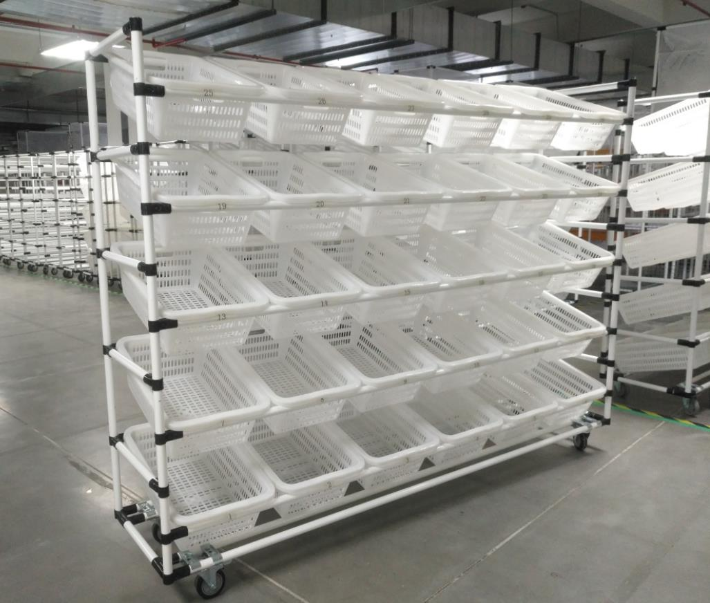 |
| 仓库设备介绍 | 灯光电子播种墙，当扫描某个商品之后会自动亮灯告诉作业人员要放入到哪个位置，通过红外感应确认是否成功放入，然后关闭亮灯 | 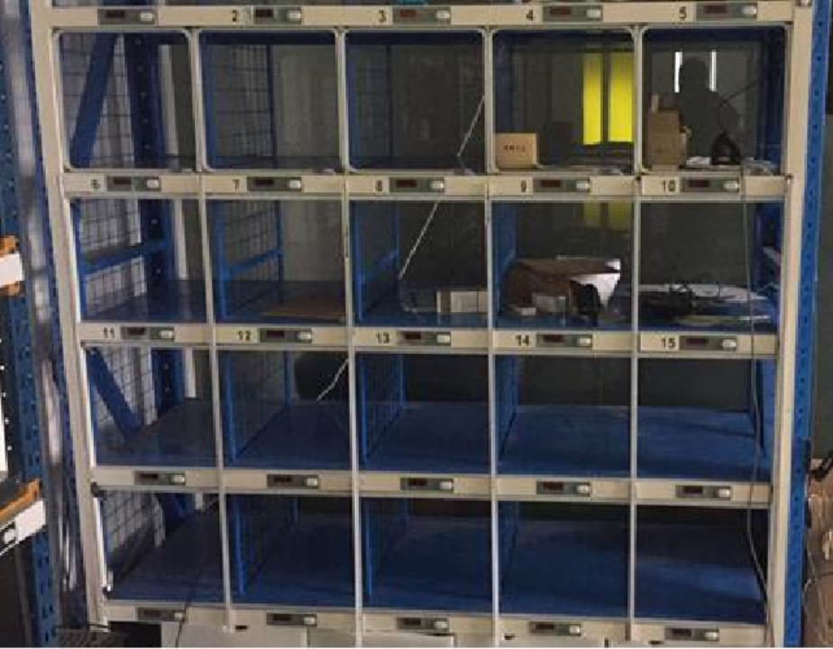 |

  
  

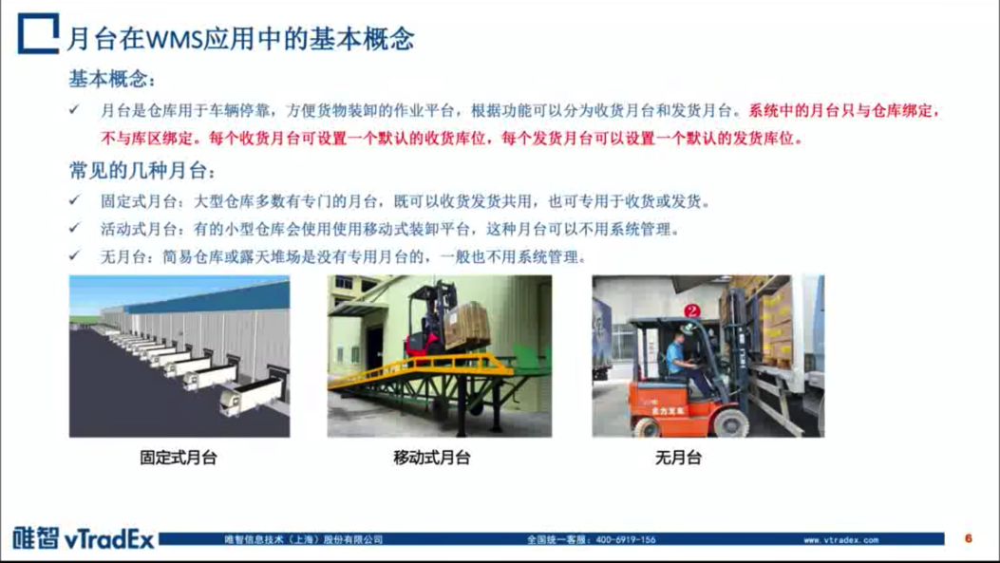

  
  

  
  

  
  

  
  

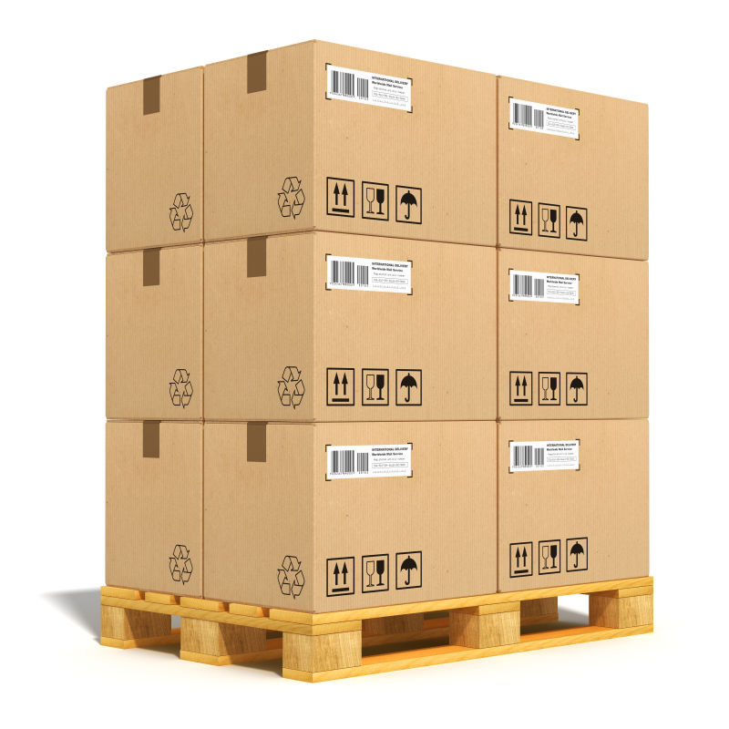

  
  

  
  

  
  

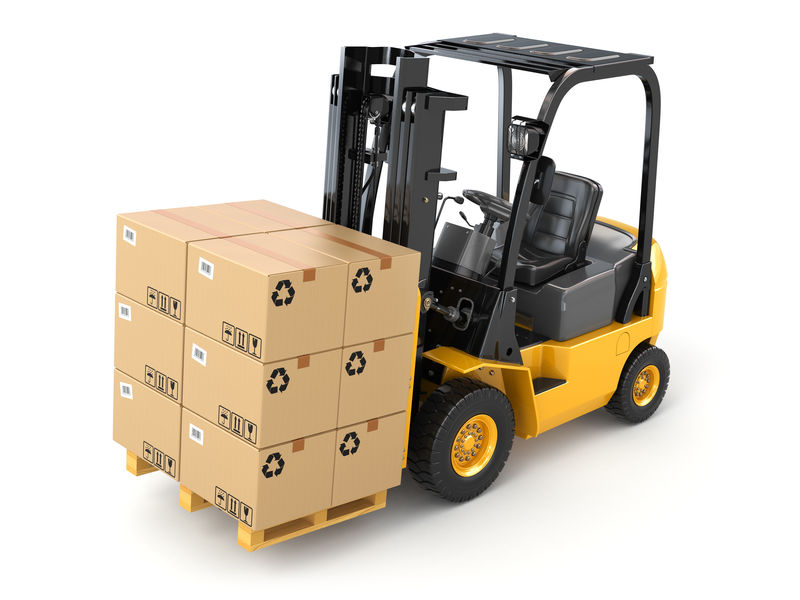

  
  

  
  

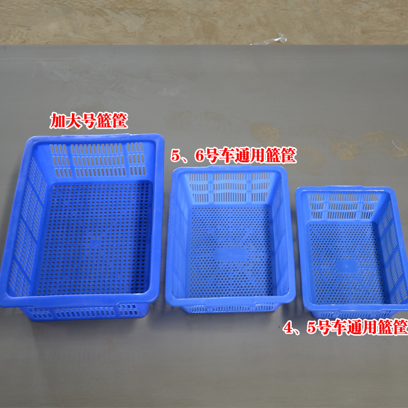

  
  

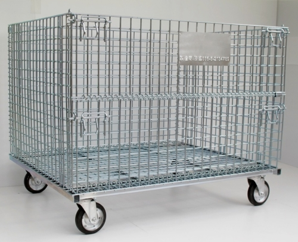

  
  

  
  

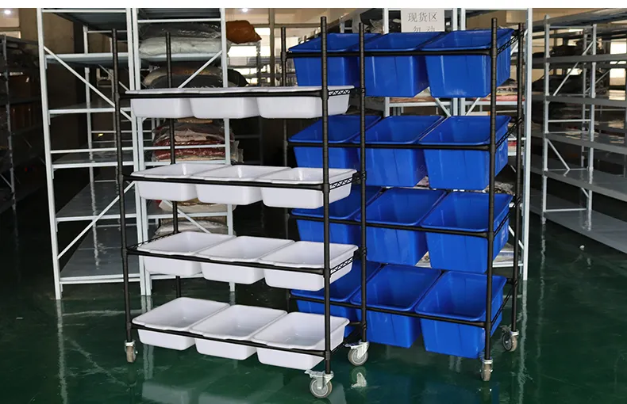

  
  

  
  

**海外仓WMS的核心流程**  
海外仓WMS中最核心流程可以按入库和出库来划分，其他的库内操作或者是非核心业务流程我们在后续详细介绍的时候再做介绍。  
  

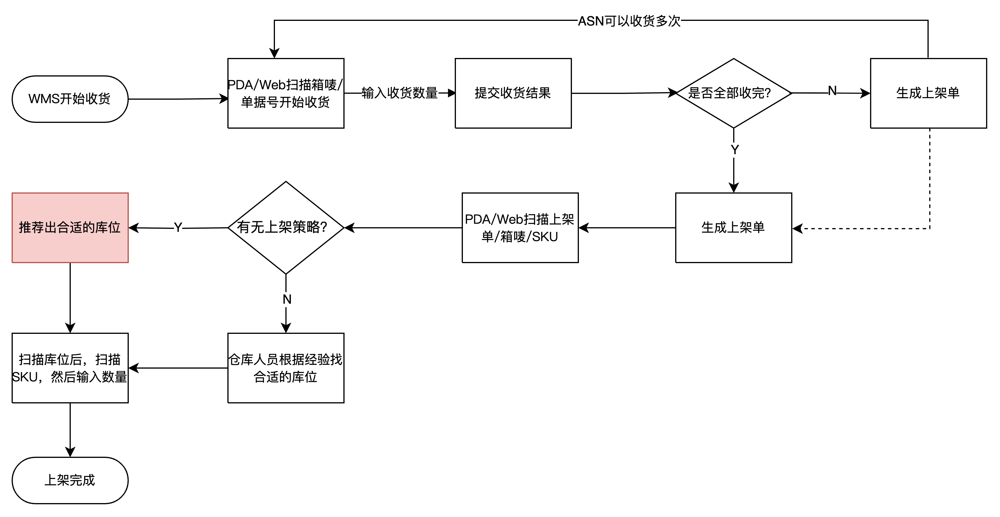

  
WMS的入库流程  
无论是海外仓还是国内仓WMS，在入库环节，基本上就是收货、质检（可选）、上架这三步，但是由于海外仓业务比较特殊，人力成本比较高，而且送到海外仓的货物基本上都是提前处理好的，所以入库需要质检的海外仓比较少，大多数海外仓WMS会省略这一块的内容，直接收货，然后上架即可。  
  

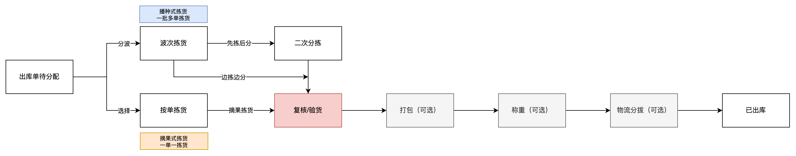

WMS的出库流程

  
海外仓WMS的出库流程和国内WMS的出库流程基本上是一样的，尤其是对2C业务来说，基本上可以直接迁移复制过来。而对于一些特殊的业务流程，例如：FBA退货换标，拆柜转运等，这些我们在后续的模块中再单独介绍。  
**海外仓WMS的主要功能模块**  
  

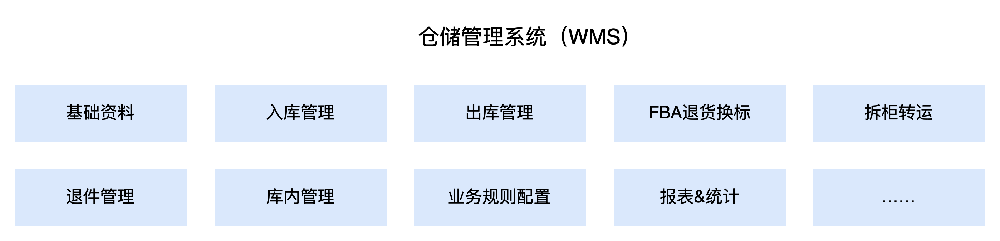

WMS的功能模块

  
无论是国内仓还是海外仓WMS，其中最常见的功能模块可以大概分成四类：  
1入库模块，包含收货，质检，上架，月台预约等；  
2出库模块，包含波次，拣货，播种，复核，称重，物流分拨等；  
3库内模块，包含盘点，移库，库存查询，库存调整等；  
4基础支撑模块，包含基础资料，业务规则，系统配置等；  
之前讲过，海外仓WMS会有主流的4个或者5个业务，所以对应的WMS功能模块也会包含这一些东西，例如：  
1一件代发，即标准的2C订单履约业务，那么自然就需要有入库模块和出库模块支撑；  
2备货中转，即2B的订单或者调拨到其他仓库的业务，也是需要入库模块和出库模块的一些功能作为支撑；  
3FBA退货换标，这个是属于海外仓特有的功能业务模块，所以会有一个单独的模块管理；  
4拆柜转运，这个也是属于海外仓特有的功能模块，也会有一个单独的模块；  
5退货管理，有一些仓库会有退货的业务，包含了客户退货和物流退货两大类，所以也会有单独的一个模块去管理；  
其中管理模块又可以继续拆分成更细的菜单入口或者页面入口，例如：  
1入库管理模块，其中可能包含了入库单管理（ASN），质检单管理，上架单管理，扫描收货，扫描上架等；  
2出库管理模块，其中可能包含了出库单管理，波次管理，拣货页面，二次分拣页面，复核页面，称重页面等  
3……  
这些具体的菜单入口或者功能操作，我们会在后续的文章中进行相关的介绍。  
  

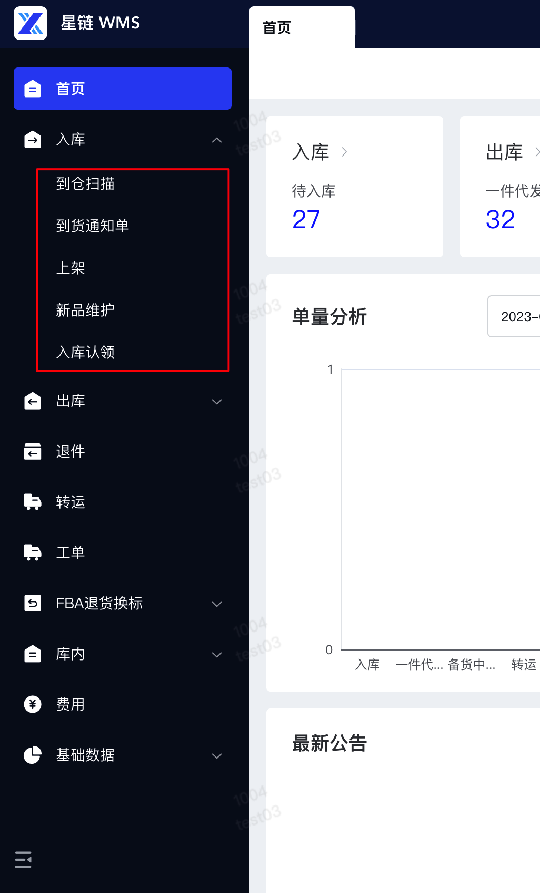

  
  

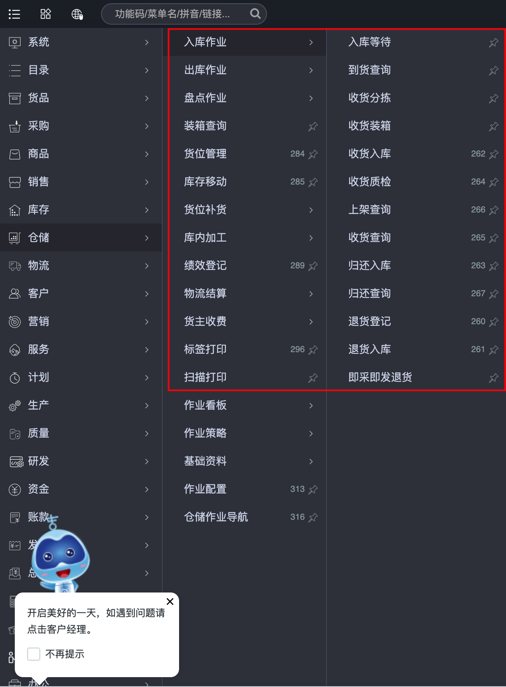