对于仓库来说，货物的流向主要是入库和出库，入库就是从外部流入到仓库内部，出库就是仓库内部流出到外部。仓库的货物流入的原因多种多样，对于WMS来说，这种一般会被定义为“入库类型”或者“入库原因”，主要有这么几类：  
1采购入库  
2备货入库  
3调拨入库  
4退货入库  
由于海外仓的业务比较特殊，所以一般来说比较常见的入库就是备货入库，少量的是调拨入库和退货入库，而国内仓库可能最常见就是采购入库。  
海外仓的备货入库，其实就是指货主将货物在国内仓库提前处理好（装箱，贴箱唛，打托等），然后委托货代将处理好的货物运送到海外仓中，所以海外仓的入库接收一般都是按箱维度的接收，这个之前讲OMS入库单的时候已经介绍过了。  
海外仓的调拨入库基本上和备货入库是一样的，只不过这种调拨一般是指同一个国家但是不同地域的仓库之间的调拨，例如美东仓库的货物，调拨到美西仓库入库，所以美东仓库要装箱，贴唛，打托等，然后美西仓库按备货入库的方式进行接收即可。  
而海外仓的退货入库则会在后续的文章中进行单独介绍，所以在此就不做过多的赘述了。  
本文所讲的WMS的入库主要是针对“备货入库”和“调拨入库”这两种的场景，它们的业务模式基本一样，而且也是海外仓很主流、常见的入库方式。  
**入库流程**  
  

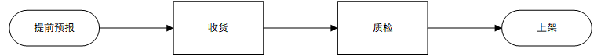

  
WMS入库流程  
WMS的入库流程基本上都是大同小异，先接收上游预报的入库单（ASN），然后货到了之后，对货打印ASN收货单，接着开始点数收货；收货的时候可能需要贴标，如果不需要贴标则录入数量即可；有些情况下会有质检的要求，通过质检将到货的不良品区分出来，然后将良品上架即可，不良品拒收或者单独处理。  
**1\. 提前预报**  
关于提前预报，很多仓库都会提出这样的要求，一般来说客户也都能接受这样的要求。但是也会有极少数情况下出现未预报，货却提前到的情况，这个时候仓库一般会耽误一些时间来识别这些货到底是属于谁的，是入库还是退件还是什么情况。所以这一块需要特别地和客户强调清楚，可以通过警告或者罚款的方式来规避这样问题继续出现。  
早期的时候，由于海外仓的客户少，而且也比较有话语权，所以入库预报只需要提供SKU和数量就够了。对仓库来说，仓库知道这个入库单预报了多少SKU，多少数量，然后到货了对着清单点数即可。  
但是随着业务的发展，这种方式出现了一个问题，那就是当客户预报了一个入库单，入库单中会有多个货品，而且这些货品会因为运输方式问题不能同时到达，会有先后陆续到货的情况。此时仓库收货就会很头痛，因为一个预报单要收货多次，仓库并不知道这个单到底有没有收完，从数量上看还有一些数量没有收完，但是不能确定剩余的部分是再也不会来了？还是已经到了但是放在某个仓库的角落没有被发现？  
为了解决这个问题，后来海外仓逐步学习亚马逊的FBA入库的预报方式，**以箱子为单位**去预报入库。箱子相对来说体积更大，更好识别，同时也更利于追溯到底是还在路上，还是已经全部送达了……  
  

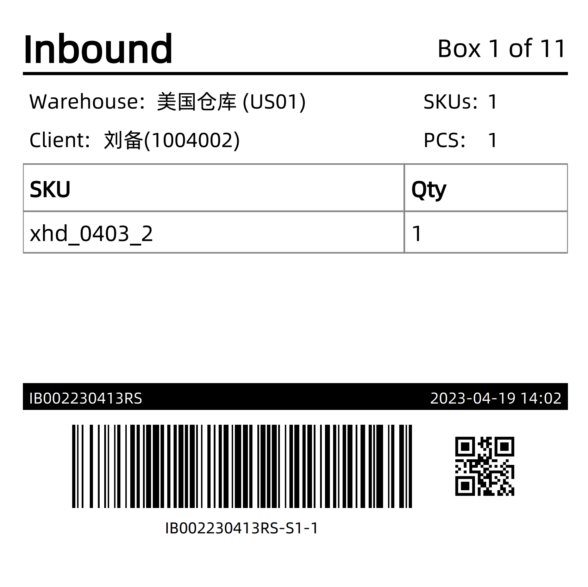

海外仓收货的时候货物上的箱唛

  
客户在预报入库单的时候，需要以箱为载体，有多少箱，每一箱里面装的是什么SKU，多少数量，这些都要录入进去，同时还要在每箱外表面贴上箱唛号；仓库在收货的时候，扫描箱唛号就可以收货，可以精确地知道还有几箱没有到，几箱是已经收货了的。  
  

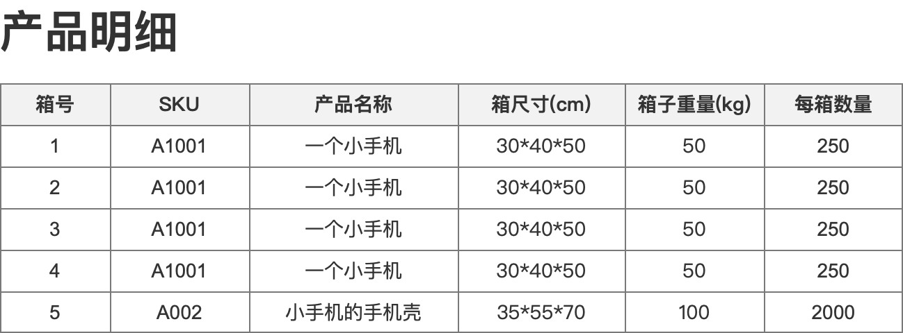

箱-SKU-数量

  
**2\. 收货**  
海外仓收货有一个和国内电商WMS很明显的不一样的地方在于：**海外仓收货基本上没有拒收这种情况。**  
客户千辛万苦地将货物出口报关，国际运输，然后再进口清关，再从港口码头提货派送到仓库，结果仓库因为货物损坏或者没有预报什么的就拒收，这个显然不合理。  
所以海外仓收货如果遇到破损，丢失等问题，基本上只能先收了再说，至于索赔或者是换货什么的都是线下沟通再处理。  
这里有一个难点在于不同客户对货物的要求不一样，有些客户如果遇到了丢失那么要立马处理，而不能按仓库实到多少就收多少；还有一些客户觉得破损了包装是不能卖的，有些客户觉得一点点破损没问题，可以卖……WMS主要是通过“**货主层的控制信息**”来解决这种差异化的需求的，给不同的客户配置不同的作业方式和判断逻辑，以此来提供差异化的服务。  
收货的时候一般有两种方式，一种是PDA收货，一种是纸单收货。PDA收货就是拿着PDA，然后根据清点的情况实时录入数据，好处就是数据很及时，而且可以多人同时作业，加快收货效率；纸单收货就是打印ASN List，也有人叫做收货清单，然后对着清单进行清点，清点之后将数据录入WMS中即可，这种方式也称之为Web收货。  
  

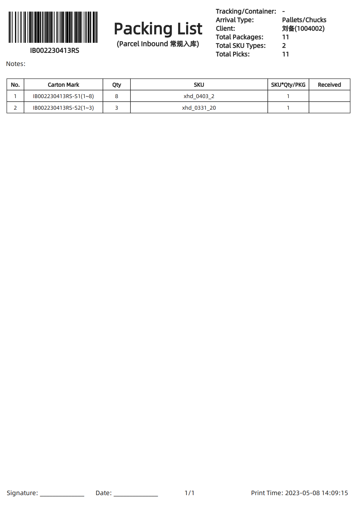

打印收货清单（纸单收货）

  
有条件的情况下推荐使用PDA收货，因为Web收货有一定的滞后性，中间有挺多个环境，然后纸单这个东西也容易丢失等，可能会导致数据录入错误或者货物搞混之类的。  
  

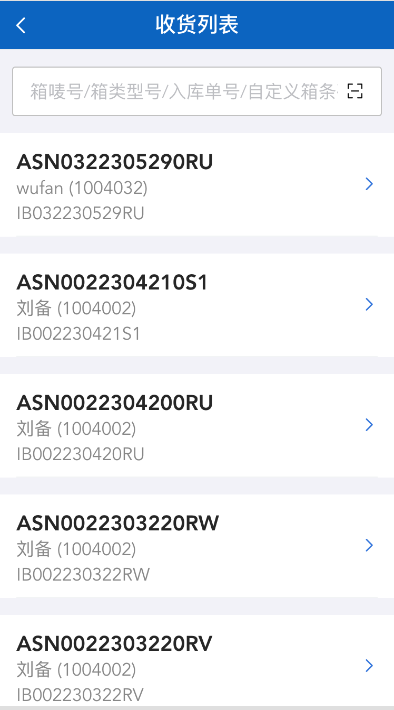

  
  

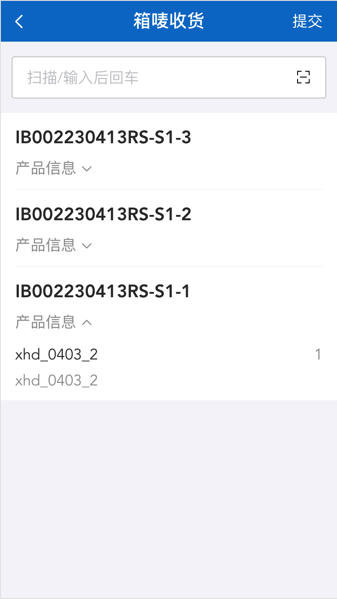

  
收货的数量差异问题，取决于各个客户的要求和仓库的妥协程度，最好的方式或者最快速的方式就是：**以仓库实收为主，仓库收多少就是多少。**  
  

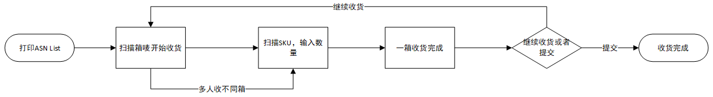

  
PDA多人按箱号收货流程  
**3\. 质检**  
收货后根据预入库的要求进行抽检或者全检，考虑到海外仓一般没有拒收和二次加工等。一般质检后不合格的，都会标记为不良品，然后单独上架到不良品区；而合格的产品一般会上架到好料区，然后提供销售。  
海外仓做质检的比较少，原因在上面提到了，一方面是人工费用的问题，一方面是沟通的问题；因为质检的标准不太好界定，一般都需要独立的部门负责，而让海外仓库来做这些有点太为难了。所以很多客户都会选择将这类产品放在不良品区，然后固定的一个周期将其转运回香港或者内地，然后由专门团队进行维修和检测。  
当然，如果只是一些简单的外包装破损等，客户可以提前准备一些替换的物料，然后备货在仓库，如有需要，则联系仓库帮忙更换包装，系统一般就做一个出库操作（扣减物料库存）即可。  
**总体而言，海外仓WMS的质检模块都比较简单一些，因为实际业务需求不是那么强烈。**  
**4\. 上架**  
  

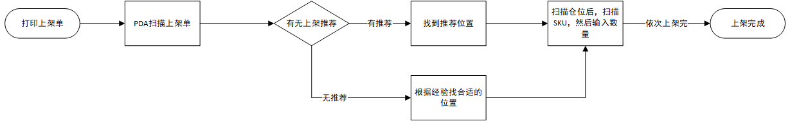

  
PDA上架流程  
上架的难点和痛点有这么几个地方：  
●上架数量和收货数量不一致怎么办？  
●上架的策略是什么？  
●上架货物混放的问题；  
上架数量和收货数量不一致一般是仓库的责任——如果收货的时候点数点错了，那么上架的时候就会造成客户的实际库存不准确。  
如果是上架比收货多了，那么客户库存多了；如果上架数量比收货数量少了，那么客户库存少了；无论是哪种，对客户来说，看到收货数量和上架数量不一致，都会感觉到很迷惑。  
所以一般WMS会强制要求上架数量和收货数量要一致，不允许出现差异。如果确实出现了差异，那么WMS可以按收货数量去上架，确保账面上的数量是一致的。如果实物少了，也就意味着仓库多收但是少上架了，则仓库自己发起一个盘亏；如果实物多了，也就意味着仓库少收但是按少的数量上架了，所以仓库需要再发起一个盘盈单，把剩余的实物上架到库位上；也可以联系客户客户重新补推一张入库单，把上次上架多出来的商品进行收货和上架。  
上架的策略也是上架的一个难点，一般来说国内的仓库会有一整套比较完整的上架策略的配置规则，主要是用于自动推荐合适的库位。而海外仓则在策略这一块还是要看实际业务量的情况，如果仓库业务量不是很大，那么上架策略这一块也会做的简洁一些，一般来说采用“根据历史记录推荐”的方式来做就够用了，将某个客户的货物集中的放在一个区域，然后同样的SKU尽量推荐放在一起。如果想要详细了解这一块的内容，建议还是要看看国内成熟的WMS的上架策略方案，例如大宝WMS，富勒WMS等。  
  

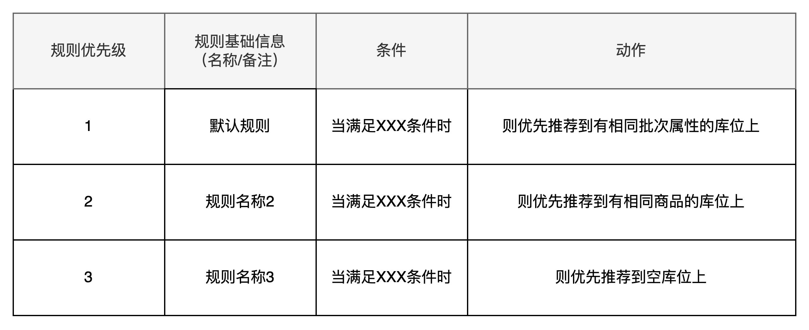

WMS上架策略的思路

  
聊完上架策略的问题，还有一个要重点考虑的就是上架货物混放的问题。上架的货物混放一般可以分成：  
●产品混放，一个库位上支持混放多种不同的产品  
●批次混放，一个库位上支持混放相同的产品但是不同的批次  
产品混放和批次混放是两种不同的控制维度，可以同时开启，也可以只开启其中一个，如下图所示：  
  

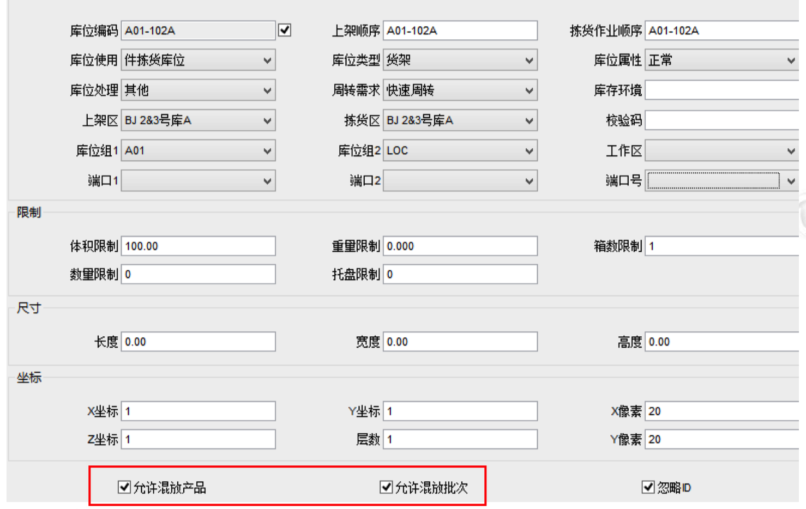

富勒WMS的库位混放配置

  
在做上架库位推荐的时候，也需要考虑到库位混放的限制，避免推荐之后但是上架的时候又提示错误的情况。对于海外仓来说，由于存放的产品大多数都是普货，而且精细化批次管理的也比较少，所以一般都会开启混放产品和混放批次，只有部分有精细化要求的产品才会不允许混放产品或者批次。  
**入库单结构设计**  
之前提到过，海外仓的收货一般是按箱唛维度进行清点接收的，但是上架的时候则是按产品SKU维度进行上架的。所以在收货环节，需要根据外箱箱唛进行定位和扫描收货，收货之后默认箱唛中的所有产品都被接收了。  
当箱唛被收货之后，则会根据不同的收货提交时机去生成不同的上架单，一个入库单多批次收货就会生成多个对应的上架单，然后再通过上架单中的SKU明细去完成上架任务，即可增加相应的SKU库存。  
  

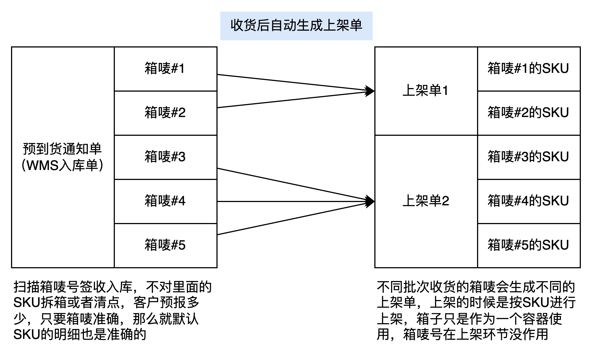

一个入库单可以生成多个上架单

  
如果有一些海外仓是希望收货之后可以进行质检，然后根据质检结果区分正品和次品，然后采用不同的策略，则可以在预到货通知单和上架单中间再插入一个收货单（也有称为“待质检单”的）。预到货通知单多批次收货，则会生成不同的收货单，然后针对收货单的SKU明细进行质检，可以区分出正品和次品，正品则生成正品上架单，然后只能将货物上架到正品库位；而次品则生成次品上架单，只能将货物上架单次品库位。  
  

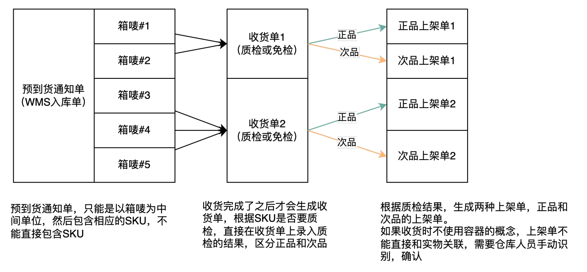

入库单-收货单-正/次品上架单

  
**入库单和上架单状态流转说明**  
  

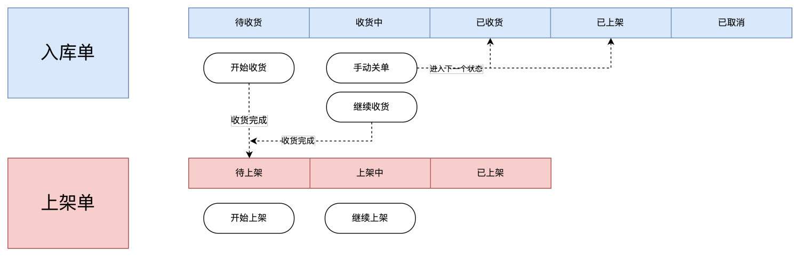

状态流转图

  
入库单即预到货通知单（ASN），大概有以下几个状态：  
1待收货，即OMS推送过来的入库单的初始状态，在待收货的状态下， 可以执行【开始收货】的动作；  
2收货中，当入库单开始收货之后，但是又没有全部收完（因为会有多批次收货的场景），那么入库单就会变成收货中；  
3已收货，当入库单的产品明细全部都收货完成之后则会变成已收货的状态；  
4已上架，当入库单中的产品明细全部都上架完成之后，则会变成已上架的状态；  
5已取消，当入库单是待收货的状态时，可以从上游OMS发起取消，入库单就会进入已取消的状态；  
除了要关注入库单的状态之外，还要需要关注对应生成的上架单的状态，因为虽然入库单是在收货中或者已收货的状态，但是如果已经生成了对应的上架单，那么上架单就可以进行相关的上架操作了。  
1待上架，每收货收货完成一次（可以部分完成或者全部完成），就会生成对应的上架单，此时的状态就是待上架；  
2上架中，当上架单开始上架但是又没有完全上架完成的时候，状态就会进入到上架中。因为上架是一个持续进行的事情，所以上架中也会持续比较久的时间，看仓库的作业时间来决定；  
3已上架，当上架单全部上架完成之后，上架单的状态会变成已上架；  
以上的单据状态流转是基于“入库单收货之后就生成上架单”的方案来定的，如果中间插入了收货单（质检单），那么就额外考虑质检之后怎么生成上架单即可。  
**库存的变化**  
对于WMS收货和上架场景下的库存变化，一般来说业内有两种方案，一种是收货的时候增加库存，一种是上架的时候增加库存，我分别做了两张图来阐释这一块的库存变化。  
收货的时候增加库存，即引入一个“收货暂存库位”的概念，当收货之后，默认将收货的产品统一放在这个暂存库位上，然后会增加对应的收货暂存库位库存，但是由于这个是库位是一个虚拟库位，所以在统计库存的时候会单独将这一块的库存视为不可用的库存，不能正常用于出库。  
当需要上架的时候，则从收货暂存库位移位到实际的拣选/存储库位，库存也从虚拟库位转移到了真实的库位，此时的库存就可以正常使用了。  
这种方案的优势就在于可以做比较精细化的控制和追踪，只要入库了责任就在仓库，所以就要做相关的数据记录和实物跟进，同时也可以满足一些入库就算库龄的需求。  
  

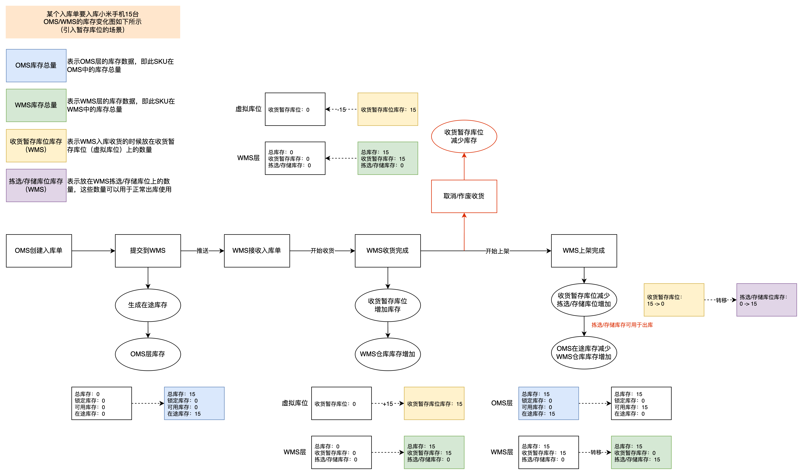

方案一：收货时增加库存

  
另一种方案就是收货的时候不加库存，只有上架了才加库存，这个时候的库存就是直接可用的库存。此方案比较简洁清晰，可以降低用户的学习成本，同时也降低系统的研发难度，适用于一些轻量化管理的仓库，例如海外仓就比较适合用这种模式。但是弊端就是收货后的库存没有在系统中记录和追溯，如果业务量大，货物繁多或者出现差异的时候不好核对，同时如果有一些场景下需要入库就计算库龄就不太能支持了。  
  

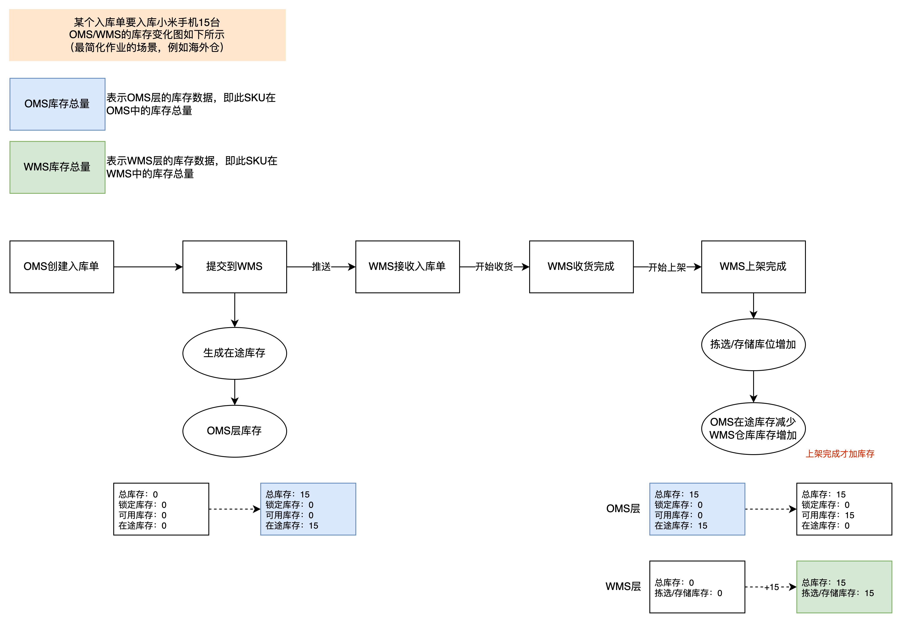

方案二：上架时增加库存

  
**新品维护**  
在WMS入库收货的业务中，有一个场景经常会被人忽略，那就是入库采集数据，也称之为：**新品维护**。  
新品维护的意思就是当货主的货物第一次入仓的时候，是需要对其进行测量的，主要是测量尺寸和重量。为什么需要尺寸和重量呢？主要是为了后续调用这些基础数据的时候使用，例如要预估包裹的重量，那么就要有准确的产品重量；要预估包材的尺寸那也需要产品的尺寸，还有就是计算仓租的时候也需要这些产品的尺寸和重量……  
  

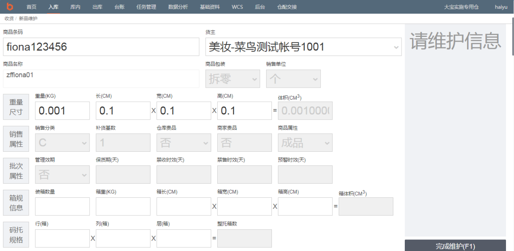

大宝WMS的新品维护

  
关于新品维护，主要是有这么几个重难点需要关注：  
1怎么判断是新品？  
2WMS维护的尺寸和重量如果跟客户提供的不太一致怎么办？  
对于第1个问题，主要就是需要梳理出新品判断的规则和节点，一般来说会引入一个“新品维护表”，所有入库的产品都会插入一条数据到这里，如果新入库的产品不在新品维护表，那么就要自动插入并标示该产品没有做新品维护。入库的产品指的是正向入库的产品，即正常的入库单中的产品，还有逆向入库的产品，即退货单中的产品。  
  

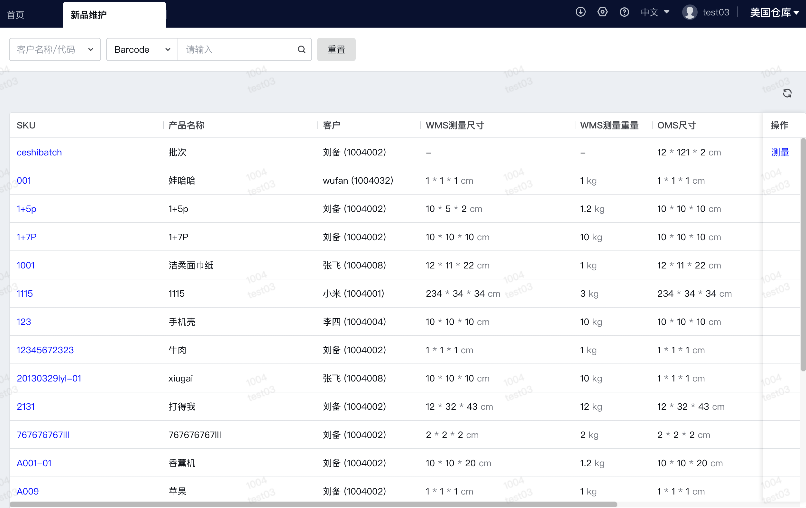

新品维护表

  
对于第2个问题，核心是业务给出最终的处理方式，因为仓库测量的数据和客户提供的数据肯定是会有误差的，关键就是误差的阈值范围是多少，满足阈值范围内的情况下，虽然WMS的尺寸重量和OMS的尺寸重量不一致，但是可以默认用客户的数据。  
如果WMS的尺寸重量和OMS的尺寸重量在阈值范围之外，那么就要看业务怎么定夺了，复杂的处理方式可能是打回OMS，让OMS用户去处理，到底是选择用仓库的数据，还是提出异议进行复测之类的；简单的处理方式那就是直接按WMS测量的数据为准，直接通知OMS的用户某个产品已经改成了WMS的尺寸和重量。  
如果选择使用WMS的尺寸和重量也会面临另一个问题，那就是不同海外仓可能都会入库相同的产品，那么是不是每个仓库都要自己做一遍新品维护，如果做了新品维护，仓库A和仓库B的数据不太一样，那么客户看到一个产品有多个尺寸和重量怎么处理？  
我们当时对这个问题的处理方案是每个仓库都要测量新品，但是默认只会使用第一个仓库测量的尺寸和重量，如果客户对尺寸和重量有疑问，那么可以选择发起复测或者选择不同的仓库的数据作为默认的数据。  
**总之，新品维护的处理逻辑本质上难点不在系统，而是在业务怎么定夺，如果是做自研WMS就比较好决策了，如果是做SaaS的WMS，那么就要做灵活的配置支持不同的业务场景了。**  
**小结一下**  
WMS的入库环节一般都会包含收货，质检和上架，但是海外仓由于质检需求比较少，所以常用的就是收货和上架。而收货和上架也分成了PDA处理和Web处理，这两种不同的处理方式需要产品经理根据不同的终端去设计不同的解决方案。  
在收货场景下，由于海外仓一般都是按箱送达，所以收货的对象一般都是箱子，通过扫描箱子的箱唛识别相关的数据，然后接收的时候自动带出箱子中的产品明细，可以灵活输入实际接收的数量，这个数量是指产品的数量。  
在上架的场景下，收货的时候的箱子一般都是当作容器使用，核心还是对产品进行上架，上架涉及到上架策略，库位混放逻辑的判断等，这些和国内仓WMS的内容都是相似的。  
入库和上架的内容其实还有很多细节之处没有提及，相关内容在后续的文章中补充说明。