**出库的业务分类**  
之前的文章有提到过，海外仓主要的场景有一件代发，备货中转，拆柜转运，FBA退货换标，客户退货等，其中最为高频，也是具有普适性的业务是一件代发和备货中转，所以我们WMS的出库业务介绍主要就是围绕这两大业务来展开。  
一件代发和备货中转都是属于跨境的一些术语或者黑话，如果用更加通俗的名词来定义，可以称之为“B2C出库”和“B2B出库”。  
1B2C出库，主要是一些小包裹，体积小，包裹内的SKU数量也少，可以批量处理，也很方便搬运和装卸；  
2B2B出库，主要是一些大包裹，按箱子或者托盘出库，单个SKU的体积大或者是体积小但是数量多；不方便批量处理，也不是很方便搬运，需要借助卡板和叉车等工具来运输；  
B2C和B2B的出库单由于单据内的商品明细还有一些业务要求不太一样，所以一般会用不同的业务处理流程来处理，也有仓库会用两条业务线来区分具体的操作业务。  
**1\. B2C出库**  
  

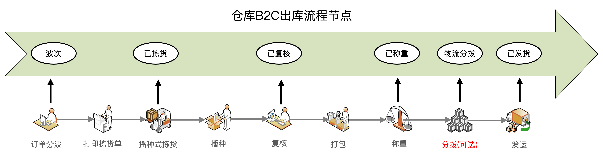

B2C出库流程

  
B2C的出库流程和国内WMS基本上都是一样的，这一块的业务知识和产品设计方案等可以通用。  
一般的流程就是先按一些出库单的字段条件进行筛选然后分波，例如相同客户的一个波次，相同物流商的一个波次，单品单件的一个波次等。  
分波完成之后，然后再按波次去进行批量拣货，也称之为播种式拣货的方式，拣货之后。播种之后每个订单匹配到了相应的货物，接着就可以去复核了。复核就是单据和实物比对，确保客户要的货物和拣出来的货物是一致的。一般会用系统来处理，扫描订单，然后带出订单的明细，接着依次扫描实物，确保一一核对没问题。  
复核之后就会打印出物流运输的面单文件，然后将文件交付给流水线的打包工人，工人选择对应的容器包装好货物，然后贴上面单文件，打包就算完成了。  
打包完成之后一般是需要称重的，称重一方面是可以录入包裹的重量，方便后续的计费；另外一方面是可以通过重量来预判包裹内的东西是否有问题，系统可以通过计算得出该包裹理论应该多重，如果实际重量和理论差距很大，那么仓库就应该考虑拆包检查一下，是否有发错货物。  
一般来说称重之后就算是作业完成了，可以将货物存放在「待发货区」，等待物流公司上门取件或者自己送到物流站点。但是有些时候考虑「待发货区」的包裹很多，容易产生丢失或者无法监控，所以有的仓库会使用**物流分拨或者叫集货管理**，将同一个渠道的货物通过集货的方式包装在同一个容器中，然后封死容器，除非要交接的时候才打开。  
有一些物流商会来仓库上门取货，上门取货的时候有一些会在取货揽收的时候就逐个扫描清点货物，也有一些是直接拉回去之后再扫描清点。当然也有一些物流商是不来仓库揽收的，需要仓库自己定期送到揽收点。  
**2\. B2B出库**  
  

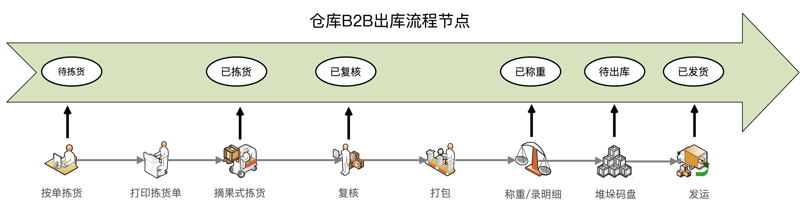

B2B出库流程

  
B2B出库单，也有人称之为大宗出库单，特点就是一个出库单货物一般要么单个体积比较大，要么就是一个单中的数量比较多。所以不太适合多个出库单一起批量操作，也就不会采用批次作业，而是直接按单处理。所以这种按单拣货的方式也称之为“摘果式拣货”，按单拣货的业务一般也不会有波次的环节，因为没有必要汇总多个单批量处理，波次的意义就不是很大的。  
摘果式拣货后就不需要二次分拣了，所以可以直接复核即可。复核之后，因为大宗货物的数量比较多，可能会装多箱，多个卡板，所以一般业务会要求打包之后，根据实际打包情况录入装箱明细，这样可以方便后续出库的时候跟踪具体的箱子信息。如果没有多箱或者业务不需要装箱明细，那么直接录入重量即可。  
同样的，如果担心大宗货物放在「待发货区」会不方便管理或者丢失少货，也可以用集货功能进行管理。但是一般来说，大货在复核之后已经打包成工整的箱子或者卡板了，这个时候目标比较大，一般不会出现丢失的问题，所以集货也就不太有必要了。  
FBA订单的出库操作本质上和B2B大宗出库单是一样的，只不过FBA的订单多了一些亚马逊的要求：**需要贴亚马逊的库内码FNSKU，同时需要在外箱明显处贴亚马逊的入库箱唛信息而已。** 除此之外，其他的操作都是一样的，所以就不再赘述了。  
**出库单结构设计**  
如果同时考虑B2C和B2B的业务，那么WMS的出库单的核心业务流程如下所示，这个流程和吉客云WMS的流程基本上都是一样的。  
  

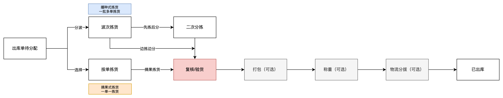

WMS的出库流程

  
由于B2C的流程更高频，业务也更加复杂，下面我们会重点以B2C出库的流程为例，详细的拆解一下这里面的业务知识和产品设计的方案。  
  

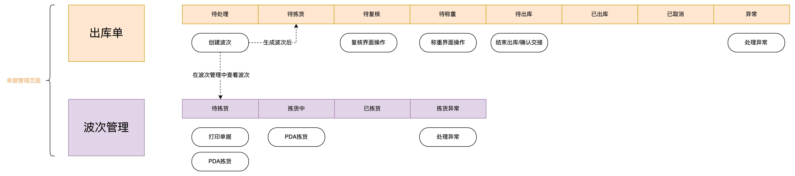

出库单和波次单的单据状态流转图

  
这里用到了两个单据去设计这一块的业务，分别是：  
●出库单，用来管理和跟进出库单的核心状态流程；  
●波次管理单，主要用于批次拣货，批量处理多个出库单；  
从OMS推送过来的出库单，初始的状态是待处理，然后在这个状态下可以进行分波（创建波次），生成了波次之后，会在波次管理中创建一个对应的波次单。可以对波次单进行拣货，当波次单完成了拣货之后也就意味着波次内的所有出库单都完成了拣货，就可以进入二次分拣或者复核的流程了，由于二次分拣并不是必须做的动作，所以在状态流转图中并没有体现。复核之后就是称重，由于业务的特殊性，所以此处省略了物流分拨的业务，直接称重之后的出库单就会变成待出库状态，最后再确认出库，交运给物流商就完成了整个出库的流程。  
**出库核心功能设计**  
**1****波次**  
在WMS领域中，波次（Wave）通常指一组相关订单或任务的集合，这些订单或任务通常会在同一时间内被处理和执行。波次通常由WMS系统按照一定规则自动创建或手动创建，以便提高订单处理和执行的效率。  
举个简单的例子，假设一个仓库需要处理3个订单，其中每个订单都需要拣选几种不同的商品。如果将这3个订单按照顺序一个一个地处理，可能会导致拣选的效率低下，因为需要不断地在仓库中移动。但是如果将这3个订单组成一个波次，WMS系统可以根据一定规则将所有相关的订单集中在一起，以便在同一时间内尽可能多地处理，这样可以提高拣选的效率和减少处理时间。  
  

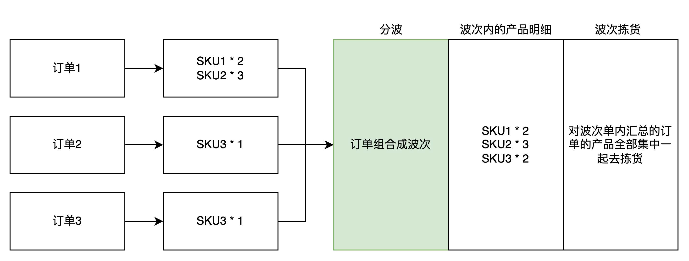

波次的示意图

  
在WMS中，将订单汇总成波次的动作称之为“分波”，“汇波”或者“生成波次”都可以，本文就以“分波”来表示这个动作。  
WMS的波次可以按照一定的规则或者策略自动生成，也可以手动创建。我一直认为，“手动创建”就是“系统规则/策略创建”的MVP版实现方式，也就是说但凡你要做“系统规则/策略”，那么第一步肯定是先考虑怎么做“手动创建”。  
对于海外仓来说，大多数仓库比较小，员工人数也不多，日均单量也不会很多，再加上海外的员工学习操作系统的成本比较高，所以综合来看海外仓WMS会做得比国内的WMS稍微简单一些。例如波次这一块就会做得简单很多，用手动创建波次的方式就可以应付绝大多数场景了，如果随着业务单量的增加，对作业效率的要求变高，也可以逐步引入更复杂的波次规则或者波次策略。  
WMS系统确定波次的规则通常是根据仓库的业务需求和特定的操作流程来制定的。以下是一些常见的波次规则：  
1\. 订单类型：WMS系统可以根据订单类型（例如B2B订单、B2C订单、紧急订单等）将订单分组，以确保订单处理的优先级和速度。  
2\. 产品属性：WMS系统可以根据产品属性（例如重量、尺寸、温度要求等）将订单分组，以确保这些属性相似的商品可以在一起处理。例如，需要保持冷链的商品应该分别处理，以避免与不需要保持冷链的商品混在一起而导致质量问题。  
3\. 区域分布：WMS系统可以根据订单中的产品分布情况将订单分组，以减少工作人员的移动距离。例如，所有在同一区域的订单可以在一起处理，以便拣选人员可以尽可能减少移动。  
4\. 时间窗口：WMS系统可以根据订单的要求交货时间将订单分组，以确保订单可以按时交付。例如，所有要求在同一天交付的订单可以在一起处理，以便提前安排完成订单的处理和运输。  
5\. 工作人员：WMS系统可以根据工作人员的技能和可用性将任务分配给不同的人员。例如，拥有相同技能的人员可以一起处理任务，以便提高处理效率。  
总之，WMS系统根据仓库的具体情况和业务需求来确定波次规则，以便优化订单处理和执行的过程，提高工作效率和减少处理时间。如果想要更加深入的学习和掌握这一块的内容，我建议多去看看国内仓的波次策略，例如富勒WMS，菜鸟大宝WMS，还有吉客云WMS等都有详细介绍这一块的内容， 也可以去看《实战供应链》这本书的第8章节，也有详细的内容介绍。  
**2****波次的库存分配**  
波次可以简单理解为将订单汇总成一个组，然后便于集中式地处理这些汇总的订单内产品。生成波次的时候最核心要做的动作就是对波次内的产品分配具体的库存，而且是分配库位库存。  
分配库位库存的有两层意思：  
1系统推荐去某个库位拣货，因为一个波次内有很多产品，一个产品可能会放在不同的库位上。如果拣货人员靠记忆货物放在什么库位再去拣货，肯定是会出错的。所以需要系统去推荐合适的库位，然后拣货人员按推荐的库位去拣货。  
2当系统推荐了某个库位之后，需要占用/锁定该库位的产品库存，因为其他的波次可能也会推荐到这个库位上拣货，所以确定了该波次下的某个产品要去哪个库位拣货之后，就要同时占用/锁定这个库位上的产品库存。  
此时，有一些朋友可能就会有疑问了，一个产品A可能会放在仓库中的多个库位，那系统应该推荐哪个库位呢？这里面有没有什么通用做法或者的策略之类的？  
一般来说，波次中的产品库位推荐肯定是需要策略的，这个策略可以简单，也可以复杂，但是基本上可以拆分成两块去理解，然后结合业务去精细化补充就好了。  
  

波次库位推荐的基本逻辑

  
第1步，我们先确认一下要出库的产品是哪个批次？因为大多数WMS都是会精确到批次管理的，而且批次管理中最为常见的业务要求就是“先进先出”，也就是先确定一下在系统中该产品最早的批次是哪个？  
第2步，确认了要出库的产品的批次是什么？我们再通过“产品-批次-库位”查询该批次放在什么库位上，此时可能会发现多个库位上都有这个批次，于是我们还要通过库位分配策略来确定具体要从什么库位上出，一般来说会有“最少库位原则”，“清空库位原则”，“数量匹配策略”等。  
当完成了上述的操作之后，就可以知道具体要拣哪个批次的产品，然后这些产品放在什么库位上了。接着就要对这个库位的库存进行占用，防止其他的波次来抢占这个库位的库存。  
这种在分波的时候去分配占用库位库存的玩法，在业内称之为“先波后分”，也有一种玩法是在出库单推送到WMS的时候就分配占用库位库存，这种就称之为“先分后波”。  
  

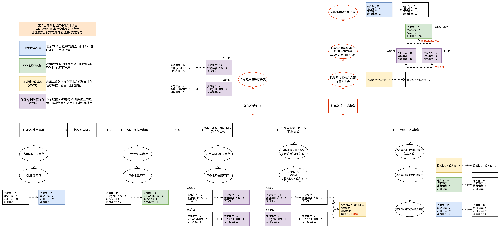

先波后分的库位变化逻辑说明

  
  

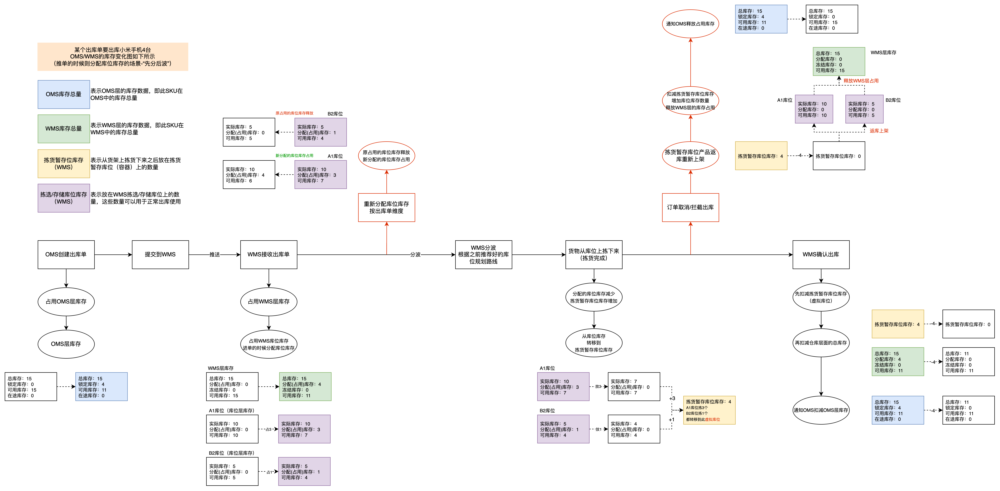

先分后波的库位变化逻辑说明

  
先波后分在分配策略和效率提升上有更大的空间，因为分配结果就是作业员需要执行的库位，这里可以做的很复杂，比如用到算法。而先分后波因为分配是针对订单的，所以策略相对固定，无法考虑整体作业效率的提升。特别是在一些波次拆分较细的场景下，先分后波会导致同一库位的货品被拆分到多个波次，导致作业效率较低（海外仓大件仓这个场景特别明显），好处就是系统处理逻辑相对更简单。**无论是国内仓还是海外仓WMS，选择先波后分的还是占大多数。**  
**3****拣货**  
当分完了波次之后，也就分配好了对应的拣货库位，这个时候就去执行拣货动作了。在《实战供应链》中，是将波次和批拣单解耦，即两者没什么关联关系，生成波次只是为了推荐库位和占用库存，而批拣单则是根据“批拣规则”将波次内的订单商品重新组合分配而生成的。这种做法对精细化的仓库管理来说确实比较灵活，未来更好进行拓展，但是对于海外仓或者一些没那么精细化作业的仓库来说，会加大用户的理解难度，同时也提升研发的难度，所以在做海外仓的时候，我们是将波次单等同于批拣单，也就是波次单除了分配库位、占用库存的作用之外，也承载了批量拣货的职责。  
拣货的时候可以打印纸质拣货单，然后拣货之后再将数据录入到系统中，此方式称之为“纸单拣货”，也称之为“Web拣货”；但是也可以直接用PDA找到对应的波次单，然后通过PDA进行操作，这种方式就是“PDA拣货”或者“RF拣货”。  
波次拣货一般会有两种方式，分别是：  
1**边拣边分：**在拣货的时候，把拣出的货物分配到对应的拣货车中的篮子（订单）中，因为一个波次中一般会有多个订单，也就会有多个篮子。（例如去超市买东西的时候帮室友带一些，拣货的时候就区分好是张三还是李四的东西）。  
2**先拣后分：**在拣货的时候，一次性把整个波次中要拣货的货物拣出来，然后再去一个专门的区域进行二次分拣，把对应的货物放入到代表订单的篮子中。这个动作叫二次分拣，也可以叫播种。（例如去超市买东西的时候帮室友带一些，拣货的时候只管拿，买完之后再回去分）。  
决定拣货的时候是用哪种方式的时机也有好几个，一般来说就是通过配置来控制，也可以不控制，让用户自己来选择。例如，在分波的时候配置好，这个波次用什么方式拣货；也可以生成波次之后，可以在提交拣货任务给PDA的时候选择波次拣货方式；还可以在PDA拣货的页面弹出拣货方式的选择。  
什么时候应该用边拣边分，什么时候用先拣后分，可以参考以下原则：  
1边拣边分一般针对订单结构差异比较大，涉及动线比较长的情况，还有尾单什么的也可以使用。  
2先拣后分的适用于单品单件，单品多件，或者涉及品类不多的多品多件。  
3SKU数量多（品种多），会让拣货的小伙伴停留的库位多（默认一位一货），行走的距离多，那么这种情况花费在拣货区的时间就已经够长了，如果使用“二次分拣”的方法还要再回去分拣一遍，这样就会很浪费时间了，所以适合用边拣边分。  
4SKU数量少（品种少），但是总数多，就会让拣货的小伙伴停留在某一个库位的时间长，这个时候拣货的时候就可以边拣货边分货了，所以也适用边拣边分。  
**4****二次分拣/播种**  
二次分拣，也称之为播种，由于“播种式拣货”是先集中批量拣选，拣选完成之后就要对拣选的内容进行再次的分发处理，这个动作就称之为二次分拣，因为操作的方式和“种花生的时候把种子撒在窝里”类似，所以也称之为播种。  
举个简单的例子，某个波次内包含了4个出库单，一共需要拣3种SKU，其中A产品4件，B产品2件，C产品3件，波次内的产品数量一共是9件。当这些货物都拣完了之后，需要知道9件产品要分配给哪个出库单。于是就要通过扫描产品SKU，然后系统去查询哪个出库单需要该SKU，接着再给出对应的提示，仓库作业人员就将这个产品放到代表该订单的容器中，直到波次内的所有产品都分配到对应的订单容器中，则播种过程完成。  
  

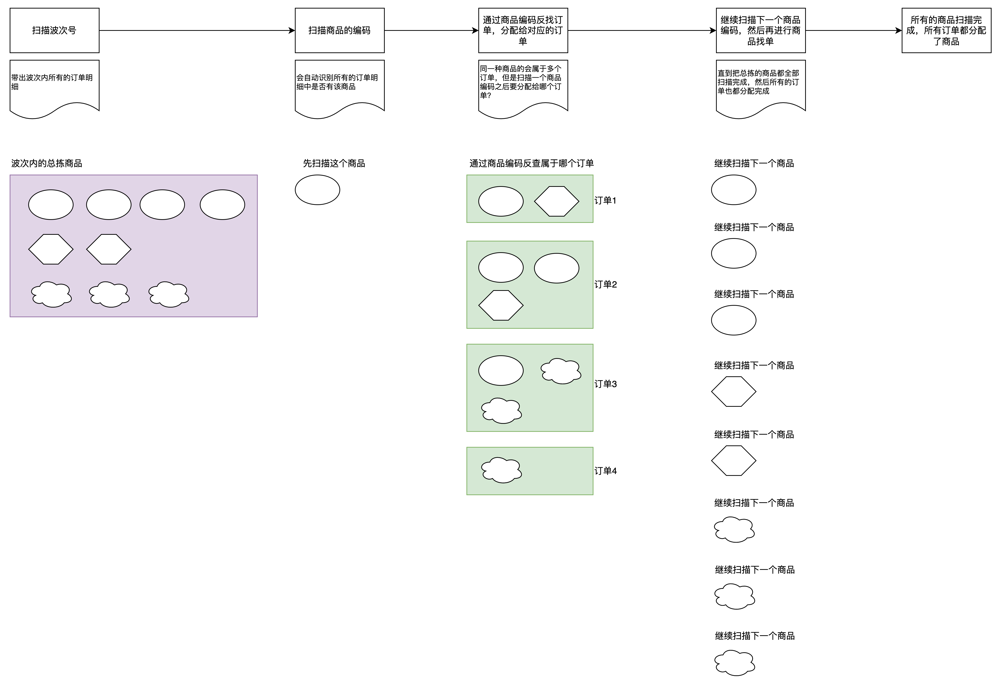

播种示意图

  
播种的原型示意图如下，扫描波次单号之后会带出这个波次单中有多少个订单（出库单），然后会有对应格子号表示订单的序号，例如1号格子表示的是波次单内的第一个订单，它需要2件产品，而2号格子表示的是第二个订单需要3件产品，这个波次一共有25个订单。  
  

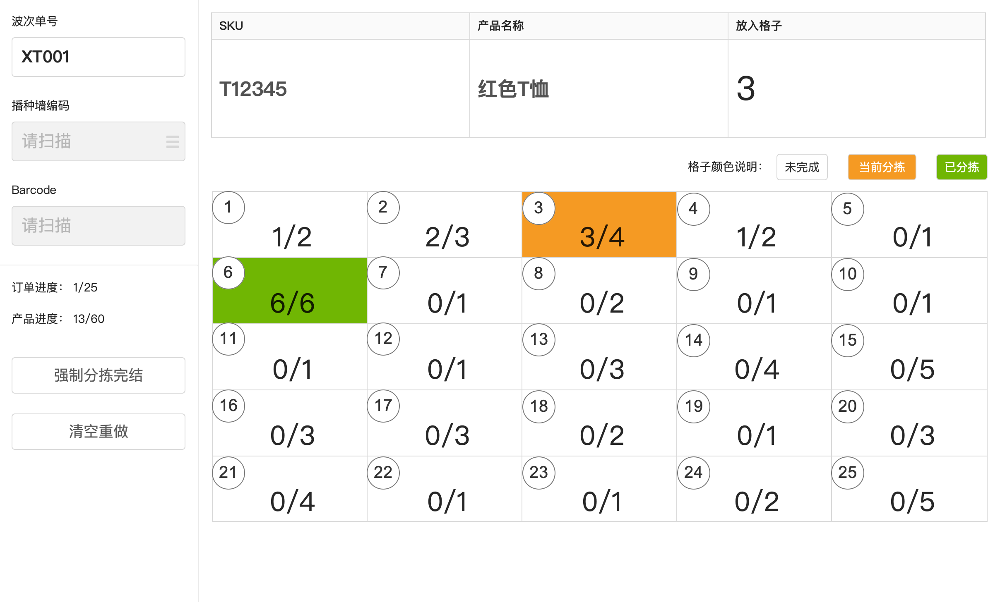

二次分拣示意图

  
需要注意的是，二次分拣操作并不是必须要用系统或者播种墙这种硬件的，因为二次分拣的本质目的就是对集中式拣货后的产品进行分发和归类，所以在更小众一些的仓库或者更轻量化的作业场景，也可以使用人工肉眼分拣的方式去执行二次分拣。所以二次分拣一般来说不会作为出库单的标准状态流，而是会作为可选项或者可配置项来处理。  
  

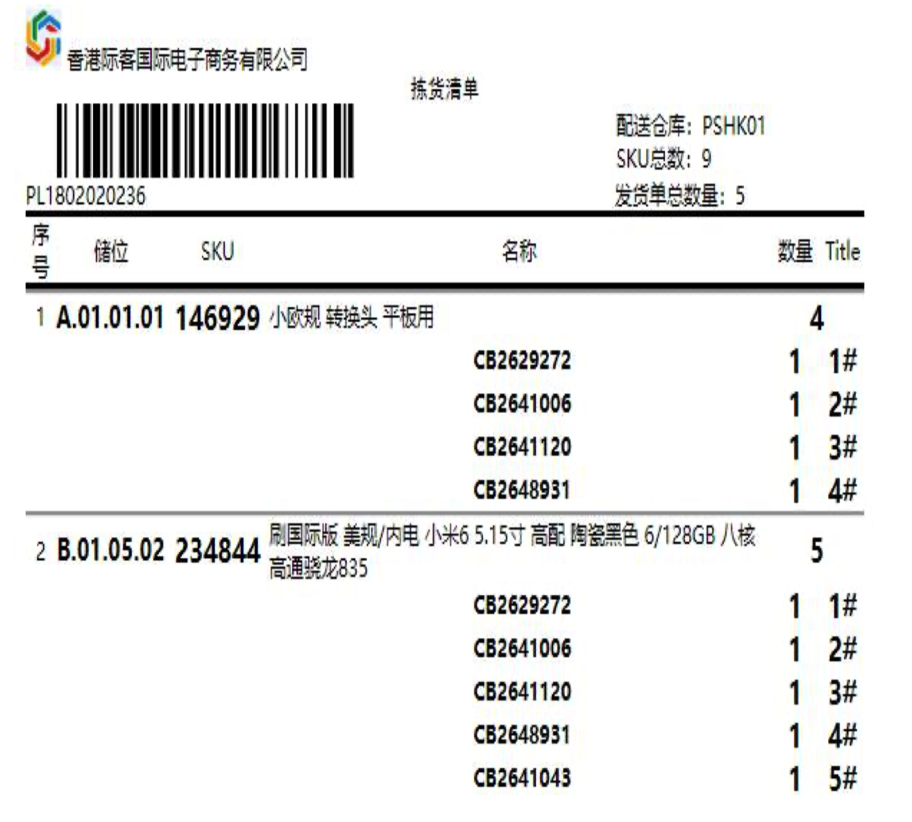

  
例如在生成拣货单的时候，就在拣货单上标记好对应的SKU应该属于哪个订单，属于几号篮子。  
这种方式可以在拣货的时候就完成边拣边分，也可以全部拣货完成之后，用拣货单去辅助二次分拣，就不需要借助播种墙或者是Web的播种功能了。  
甚至也可以简单一些，对每个订单都打印装箱单（发货单），然后在每个篮子中放置单个装箱单，表示这个篮子就是代表这个订单，然后通过篮子里的装箱单去从批拣的货物中拿出所需要的产品。这种操作方式，就是肉眼识别二次分拣。  
**5****复核/验货**  
复核/验货的意思就是重复审核，查验，确保没有问题。因为拣货完成或者二次分拣完成之后我们会得到一个表示出库单的篮子，这个篮子里装了该出库单所需要的全部商品，但是由于拣货或者二次分拣都会存在一定的操作失误，所以篮子里的商品可能不一定和出库单所需要的商品完全吻合，于是就需要进行复核动作。  
出库复核的核心目的：是将实物与系统中出库单所需的商品明细进行比对，只有不多不少完全吻合才算是复核通过。所以可以使用系统/机器复核，也可以人工肉眼来复核，只不过因为人工复核的效率比较低，所以用得比较少，大多数仓库还是会选择使用系统来进行复核的。  
  

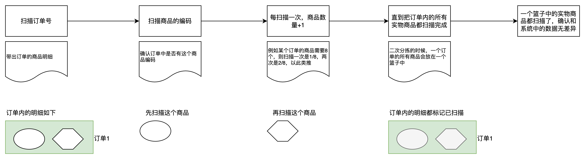

复核示意图

  
复核的原型示意图如下，扫描出库单号或者对应的物流跟踪号之后会带出这个出库单中的商品明细，然后复核员扫描代表出库单的篮子中的实物，如果扫描之后在出库单的商品明细中能匹配到相关的商品，则会自动增加扫描数量，直到扫描数量和总数量完全一致，则表示复核完成，此时实物和系统的商品明细是完全匹配对应的。  
  

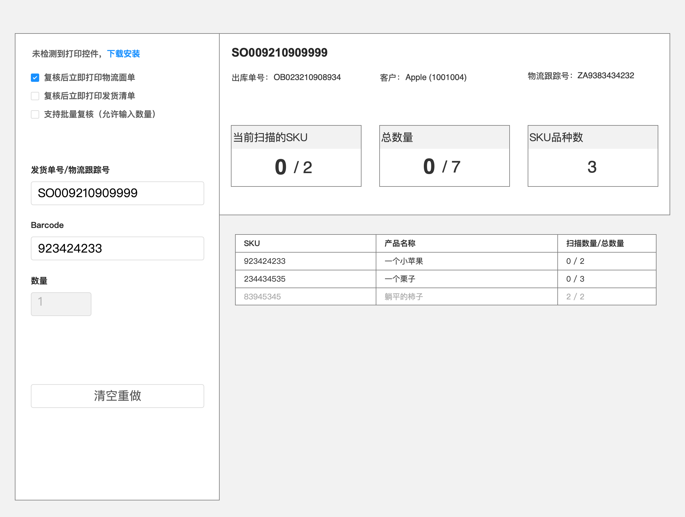

复核示意图

  
复核环节除了核对商品的信息之外，也可以在这个环节推荐打包所需要的耗材，打印物流清单，打印发货清单等，同时如果出库单被取消了，则在复核的时候也可以给出提示，然后及时拦截出库。  
**6****称重**  
复核完成了之后，一般会自动打印出物流面单和发货清单，然后接着就可以对这些复核通过的出库单进行打包。打包的流程一般都是在复核之后，可以是在复核台上直接打包，也可以复核之后放在流水线上然后给下游的打包员进行打包，这一块没什么标准做法，所以在此就忽略不讲。  
打包之后就会进入称重环节，称重对产品方案设计来说比较简单，主要是要理解称重的作用和意义，一般来说有这么几个作用：  
1计算物流成本，因为包裹是通过快递物流送走的，那么包裹的重量是很重要的信息，可以留底核查，所以仓库在出库前就要对已经打包成了包裹的出库单进行称重；  
2再次确认货物没有搞错，打包的时候由于没有系统监控可能也会出问题，例如多打包了，少打包了，可以通过称重，结合包材的重量+商品的重量预估出包裹的重量，如果称重的实际重量和预估的重量有差异，那么可能打包就有问题；  
称重的原型示意图如下所示，先将包裹放在电子秤上，然后扫描物流跟踪号，扫描校验通过之后光标会跳转到重量的输入，如果对接好了电子秤，则可以自动读数并填充到输入框中，如果没有对接好就需要手动输入相应的重量，最后点击【确认称重】即可。  
  

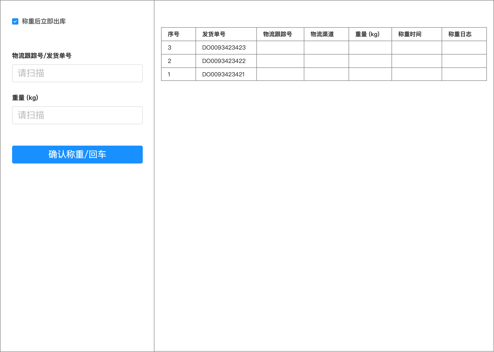

称重示意图

  
称重的时候可以配置“称重后立即出库”，相当于称重之后出库单会直接变成已出库的状态，如果没有打开这个配置，则称重之后会变成“待出库”的状态，需要仓库人员确认出库之后才会变成已出库。  
WMS扣除实际的出库库存的节点也会和业务有关系，例如有一些仓库是在“待出库”转化“已出库”的时候扣除仓库的库存，意味着此时货物已经发出去了，也完成了出库；但是也有一些仓库，是在复核或者称重之后就会扣除库存，而且标记为“系统已出库”，因为平台对仓库作业有时效要求，如果等到物流商揽收货物之后才算出库的话可能会超时，而复核或者称重之后就“出库”，意思就是仓库已经完成了订单的履约操作，只不过是物流商的环节自己不可控而已，实物没有出库，但是系统单据是已经出库了。  
**7订单取消与拦截**  
对出库订单而言，库内取消和拦截是一个很重要也很能提升用户体验的功能，此功能对海外仓来说算是一个加分利器。  
例如有时候我们在京东购物的时候，会遇到这种情况：自己突然不想要这个货物，或者别的地方更便宜，我需要对这个单取消。但是订单已经在库内作业了，如果不能支持库内取消拦截，那就得要等到收快递的时候拒收，但是如果快递员放在快递柜或者门卫处就走了，那你可能还不能拒收，又要发起一次退货。  
对于国内的物流来说，拒收或者退货其实成本也没有很高，不过就是几块钱运费，然后几天就可以返厂。但是对于海外的物流来说，物流成本比国内高很多，而且派送时间也很长，可能一个订单出库再拒收返库要花很长的时间，还要付给物流商双倍运费，特别吃亏。  
所以对于库内的订单取消拦截，尽量能在库内拦截就在库内拦截。一般的拦截节点有这么几个：  
●分波前的拦截；  
●分波后但是未拣货完成；  
●拣货后复核前拦截；  
●打包后称重前拦截；  
●最后交运的时候拦截；  
拦截节点越多，对客户的体验提升越明显，但是对仓库的作业要求就越高，成本也很高，而且对系统的各种业务逻辑处理也会有很高的要求。所以一般来说仓库会预设好几个拦截节点，如果出库单状态超过了这个几个节点就会拦截失败，也就是不允许取消。  
订单如果分波了但是还没开始拣货，此时有拦截指令推送过来，那么就会从波次中剔除这个单；如果订单已经开始拣货，那么剩余未拣的部分就可以提示已经被取消拦截了，让拣货员别去拣货了；如果订单已经完成了拣货，从货架上把货物拿下来了，那么在复核的时候就要提示订单被取消拦截了，应该要生成对应的返库上架任务，这一部分的货物不能出库。  
订单的取消与拦截是WMS中比较高频的一个场景，也是一个需要特别注意的场景的，除了涉及到拦截的提示，货物的返库，库存的变化之外，还有一些操作项的记录，因为后续要和库内操作费挂钩，用来计算客户应付的费用等。