**什么是拣货？**  
仓库作业人员从仓库的货架上拣选出订单所需要的商品，这一过程称之为拣货。拣货员会按照订单的要求，根据商品的货架位置，去仓库里挑选出需要的商品。他们可能需要走过很多货架，把商品逐一选出来，然后把它们放到一个拣货容器里面。  
拣货是一个比较耗时、耗资源的过程，所以大多数的WMS会在拣货环节下功夫，提升拣货的效率，降低拣货错误率等，这对系统的要求会比较高，所以很多时候面试WMS产品经理的时候，面试会重点问波次和拣货相关的问题，一方面是考察你是否对仓库拣货业务是否熟悉，另一方面也是看你对WMS的策略相关的内容理解的深不深。  
上一篇出库的章节提到，对于大多数业务没有那么复杂的仓库或者WMS来说，波次单等同于拣货单，所以分波之后就会对波次单进行拣货。波次单可以拆分成多个拣货任务，也可以一个波次就是一个拣货任务，为了便于大家的理解，我们就以一个波次单就对应一个拣货单为例。  
  

波次单和拣货任务单的关系

  
**怎么做到先进先出**  
在分波的时候，需要对每个波次内的商品推荐合适的库位，在推荐的时候可以按两步来拆解，分别是：  
1商品分配策略  
2库位分配策略  
  

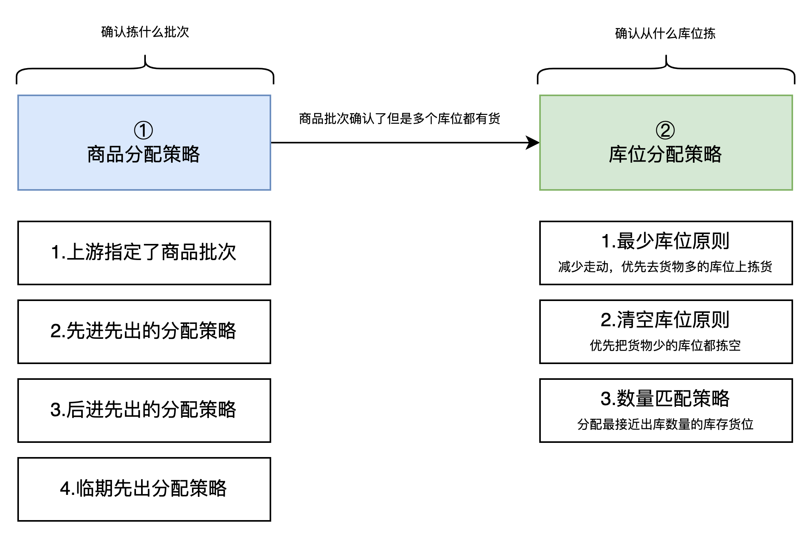

波次库位推荐的基本逻辑

  
商品分配策略决定了本波次要拣货的商品是什么批次，然后库位分配策略则决定了这些批次放在什么库位上，要去哪些库位上拣货。  
一般来说，商品分配策略中最常用到的就是先进先出，也就是先进来的批次优先发货出库，那么系统是怎么知道哪个批次是最早的呢？它又放在哪里呢？接下来我们就对先进先出的内容做一个业务的拆解。  
仓库在上个月入库了一批iPhone 12，然后上架到了库位A上；这个月又要入库一批iPhone 12，由于不同时间入库的商品属于不同的批次，所以这个月入库的商品属于另一个批次，不能和上个月入库的商品放在同一个库位上。因为iPhone都长得一样，如果放在同一个库位上，那就混在一起搞不清楚了。  
所以就需要将这个月入库的批次放在库位B上，以区分库位A的那个批次。随着时间的推移，越来越多的iPhone 12要入库，库位都已经排到了库位Z了……  
由于很多产品的外包装上并没有批次号，在入库收货的时候也没贴对应的批次号条码，当货物进入了仓库之后并不能直接通过货物来判断出对应的批次号。  
所以一般的解决方式是：**系统在入库或者上架的时候，自动生成一个批次号，然后与上架的实际库位做关联**。当需要找最早的一个批次的时候就查询最早的批次放在什么库位上就好了。  
还是刚刚的例子，上个月入库的一批iPhone 12放在了库位A，那么记录批次为20210501（一般是按日期来生成）；本月入库的一批放在了库位B，然后批次号为20210601，同样的道理，如果下个月还会入库一批，那么放在库位C，批次号则为20210701……  
当需要出库的时候，系统经过查询iPhone 12最早的一个批次是放在库位A上，然后就会推荐拣货人员去库位A拣货。这样库位A的产品（批次更早），就会比库位B的产品（批次更晚）先出库，也就满足了我们想要的先进先出策略。  
  

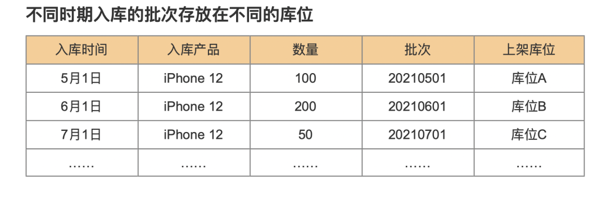

  
通过库位来区分批次所在  
从上面的案例可以知道，如果入库的时候不对商品贴批次码却又要区分商品具体的批次，那么我们就需要将批次和上架的库位关联，通过库位去查询对应的商品的批次是什么。  
接下来可能又会遇到另一个问题：**新的批次上架的时候，怎么能避免不上架到已经有该批次的库位呢？如果两个批次都上架到了同一个库位那不就是分不清了？**  
是的，为了解决这种同一个商品的批次混放在同一个库位上的情况出现，于是我们就需要在库位的控制信息上配置相关的混放策略，是支持批次混放，还是支持商品混放。  
  

库位配置和控制信息

  
当库位勾选了“允许混放批次”，就意味着同一个商品的不同批次可以混放在这里。反之，如果取消勾选，那就意味着不允许混放批次，可以通过库位来区分对应的批次。  
如果仓库不想贴批次码，然后又希望做到比较严格的批次管理，那么就需要关闭“允许混放批次”的配置，这样可以确保在一个库位上不会有混着的批次。  
不允许混放批次看起来比较可以实现很好的批次管控，但是也带来了另一个问题，那就是库位的数量是有限的，如果每个批次都要放在不同的库位，很容易导致库位不足的情况出现，所以为了解决这个问题，就会在库位的控制信息中开启“允许混放产品”，**意思是同一个库位可以放不同的商品，但是不能放相同的商品，而商品的批次则无所谓了**。  
  

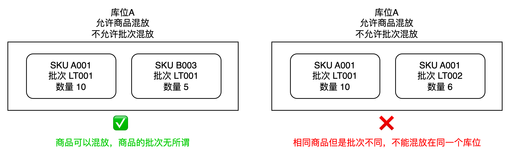

库位的商品混放和批次混放

  
当波次生成的时候，需要分配商品所在的库位的库存，那么就需要先查询一下要先出库的商品的批次是哪个？通过这个批次可以查询到它对应的库位是什么，然后把库位都找到之后，接下来就是第2步，确认要出库的库位了。  
  

  
由于一个批次可能会存放在多个库位上，所以找到了库位之后还需要确认最终要去哪些库位上拣货，这里就需要调用“库位分配策略”，一般来说有这么几种：  
1最少库位原则，减少走动，优先去货物多的库位上拣货，这样可以减少走动量；  
2清空库位原则，优先把货物少的库位都拣空，清空掉这些零碎的库位；  
3数量匹配原则，优先分配最接近出库数量的库位，确保一次能拣货完成；  
这里我们以“清空库位原则”为例，当商品批次存放在多个库位上的时候，优先推荐货物少的库位，把这些库位都拣空，于是我们可能会需要去多个库位上拣同一个批次的商品。  
**怎么确定拣货路径？**  
一个波次会包含多个商品，一个商品会根据策略（先进先出）确定有多个批次，而每个批次可能会放在多个库位上，于是就会呈现出下图所示的结构关系。  
  

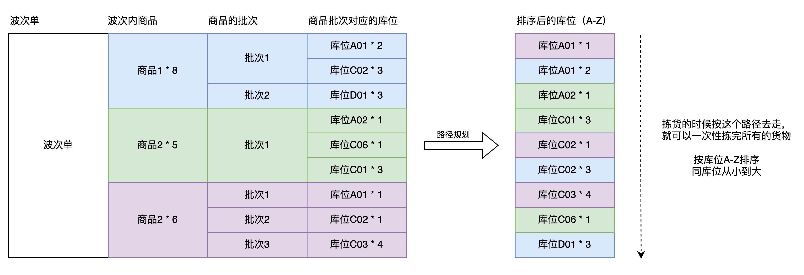

波次-商品-批次-库位的关系

  
分波完成之后，最终会锁定“商品批次对应的库位”上的库存，相当于系统告诉拣货员，如果你要完成这个波次拣货，那么你就要去这些库位上拣完对应的数量。  
如果拣货员，拿到了拣货任务之后直接就按推荐的库位去拣货，就会遇到一个头痛的问题：**有一些商品在A库位，有一些在B库位，这些库位可能分的很散，如果不对这些库位排序的话就会走很多“回过路”和“冤枉路”**。  
于是，为了提升拣货的效率，降低拣货员来回走冤枉路的几率，系统还需要对这些推荐出来的库位进行排序，也称之为拣货路径的规划。  
要了解拣货路径这个概念，我们得要先从货架和库位的摆放讲起，这样才能更加深刻地理解这个路径的概念。  
  

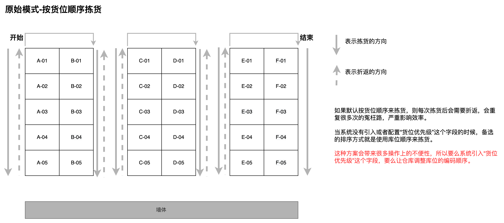

  
为了简化理解，可以把货架当做只有一层，然后一个货架有5个库位，例如“A-01到A-05”表示的就是A货架的第1个库位到第5个库位。  
如果我们按原始模式（库位顺序）来拣货，则需要先从A-01拣到A-05，然后再折返回去从B-01拣到B-05，以此类推。这种方式显然走了很多回头路，每次都需要折返，会让拣货员走很多冤枉路，效率也很低。  
既然库位这样摆放会导致走折返路，那有朋友就会想，我能不能改变一下库位的摆放顺序，把它变成这个样子呢？  
  

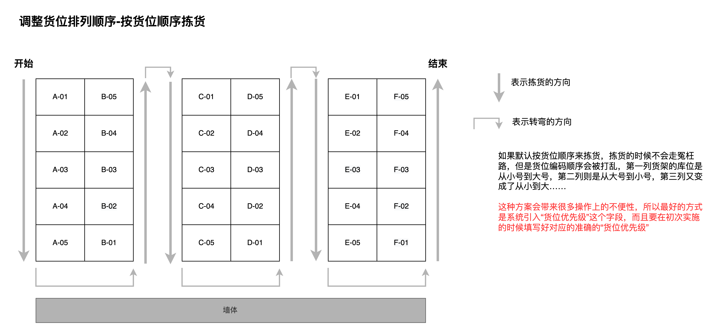

  
这种方式看似解决了上面的问题，但是又遇到了另一个问题，就是仓库的货架摆放和编码规则一下是这样，一下是那样，没有什么规律可言。而且很多时候仓库实际的库位编码是已经确定好了的，如果要对仓库的编码全部调整去适配系统的逻辑，显然是不太现实的。所以这种方案看似很好用，但是实操起来的时候压根跑不通。**因为WMS是信息化系统，它需要兼容多个仓库，多种业务模式，所以肯定是用系统去适配实际的业务场景的，而不能反过来让仓库去改自己的布局来适配WMS。**  
  

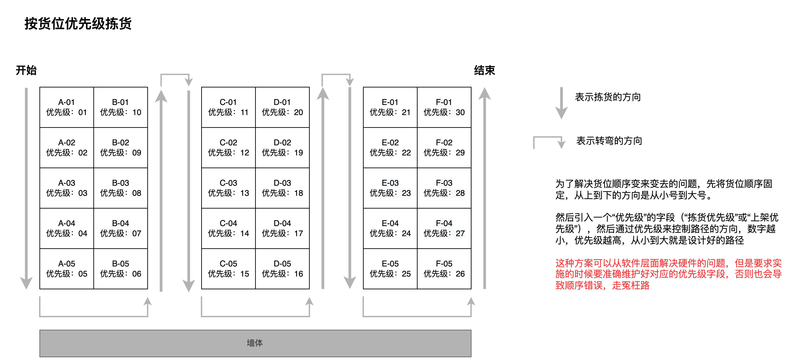

U型拣货路径

  
为了解决实际的库位编码顺序不能实际调整的问题，我们可以在库位管理上增加一个控制字段，叫作“优先级”，虽然库位编码不能变，但是“优先级”这个字段是可以随意调整的，只需要配置对应的优先级数字，就可以定义库位的拣货优先级了。这种拣货路径画出来之后很像是一个U型，所以也称之为U型拣货路径。  
除了U型的拣货防止之外，也可以让拣货员在货架的通道内同时拣两个货架的货物，最后呈现出来的形状就是Z型，而多个通道之间的关系路线像是S型，所以就我称之为“S+Z型拣货路径”，有一些系统就称之为“S型”或者“Z型”。  
  

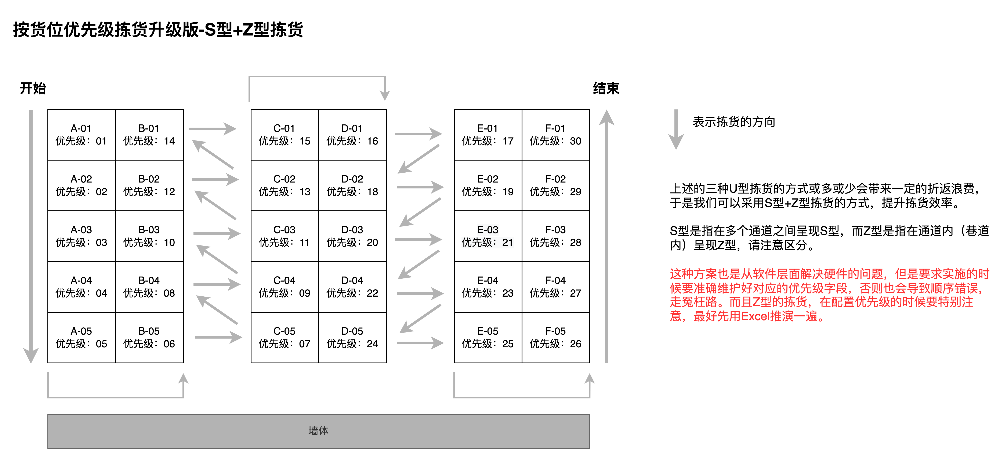

S+Z型拣货

  
为了能达到这种软件层面控制硬件的效果，我们在创建库位的时候需要维护好相关的优先级字段，这样在生成拣货路径的时候才可以参考这个优先级输出合适的拣货路径。  
  

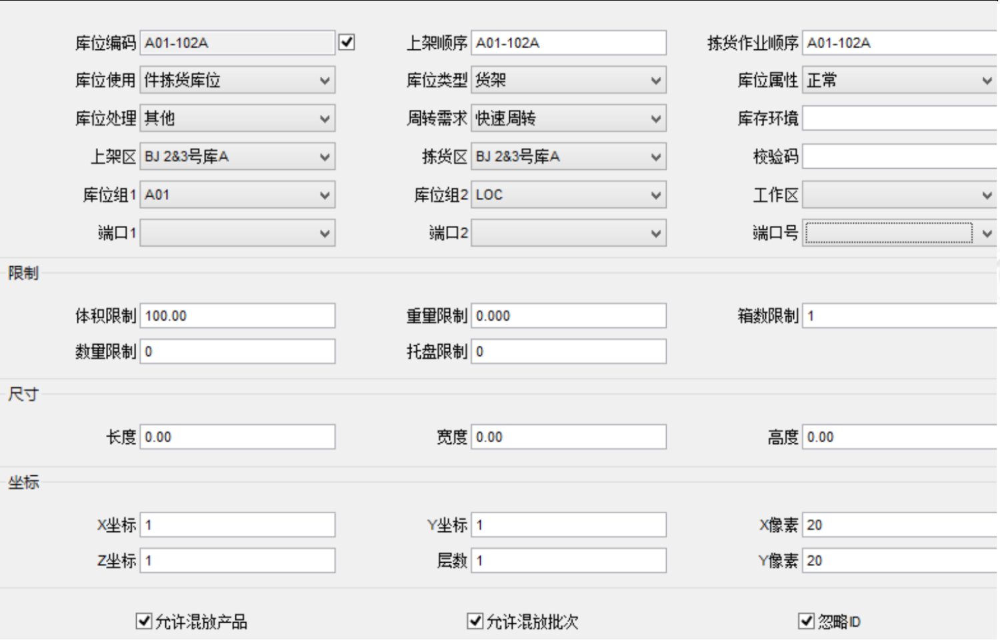

富勒WMS-库位设置

  
  

菜鸟大宝WMS-库位设置

  
**拣货扣减库存的逻辑**  
在设计WMS的波次和拣货的产品方案的时候，除了要搞懂这些业务知识之外，还有一个很关键的点就是要梳理清楚期间库存的变化逻辑，因为库存对于WMS来说非常重要，也是WMS这款产品灵魂所在。  
在上一篇出库的业务流程中，我们大概介绍了一下“先波后分”和“先分后波”的库存分配逻辑，但是其中的一些细节没有展开讲，我们在这里稍微拆解一下。  
**1****先波后分逻辑**  
“先波后分”的意思在分波的时候去推荐波次内的商品所要拣货的库位是什么，然后锁定对应的库位库存。  
当WMS接收到了上游的出库单/订单的时候，WMS先会在仓库层占用对应的库存，防止后续又推送很多单过来，但是仓库中已经没有库存了，这一次的锁定是第一次的锁定，也是进单锁定，锁的是WMS层的账面库存。  
WMS接收了这些出库单之后就会进行分波，在分波的时候就会根据上面提到的“商品分配策略”和“库位分配策略”去确认最终要拣货的商品批次以及对应的库位，然后再占用这个库位上的商品批次库存。  
当分波完成之后，库存也会占用成功，如果库位库存占用失败，那么分波也是要失败的，这两者要同步完成。  
库位库存占用之后，拣货员就会根据指示前往对应的库位拣货，当拣货员提交了拣货数量之后就需要扣减库位库存分配预占的部分，将这一部分拣货的数量转移到拣货容器中（增加拣货暂存库位），具体变化示意图可以看下方的图片。  
当波次内所有的商品都拣货完成之后，则分波的时候分配预占的库位库存都会被扣减，库位的实际可用库存还是保持不变，然后这部分实物已经放在了拣货容器中，对应的实物库存也就进入了拣货暂存库位上。  
等到WMS确认出库的时候，需要将拣货暂存库位的库存清空（扣减），因为实物已经不在拣货容器中了，可能已经打包成了包裹或者已经交付给了物流商，同时由于之前进单的时候锁定了WMS层的库存，那么此时也需要将锁定的部分转为扣减，因为WMS的实物也是真实的减少了。

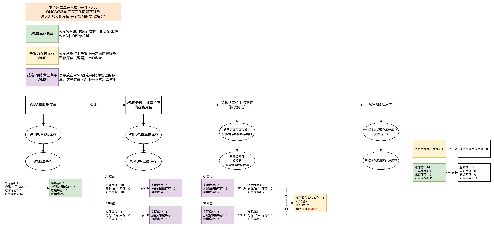

先波后分的库存变化讲解

  
以上就是“先波后分”的业务逻辑导致的库存变化，大多数仓库都会采用“先波后分”的方式，当然也有一些是用的“先分后波”，所以接下来我们来讲讲“先分后波”是怎么做的。  
**2****先分后波逻辑**  
“先分后波”的意思在分波前就应分配好了出库单/订单中的商品要去什么库位拣货，然后再进行分波，分波的时候就只是聚合成拣货单，而不需要再分配对应的库位了。  
当WMS接收到了上游的出库单/订单的时候，WMS先会在仓库层占用对应的库存，防止后续又推送很多单过来，但是仓库中已经没有库存了，这一次的锁定是第一次的锁定，也是进单锁定，锁的是WMS层的账面库存。  
然后完成了第一层的锁定之后，立马就是对出库单/订单的商品进行库位推荐，也是按照“商品分配策略”和“库位分配策略”进行判断确认，然后分配预占库位层的库存。  
完成了这些之后WMS的出库单/订单才算接收成功，然后再进行分波处理，这个时候分波主要就是为了规划路径，就不需要再去预占分配库位库存了。  
分波完成之后，拣货员还是根据指示前往对应的库位拣货，然后后续的库存变化逻辑和“先波后分”就是完全一样，就不再重复赘述了。  
  

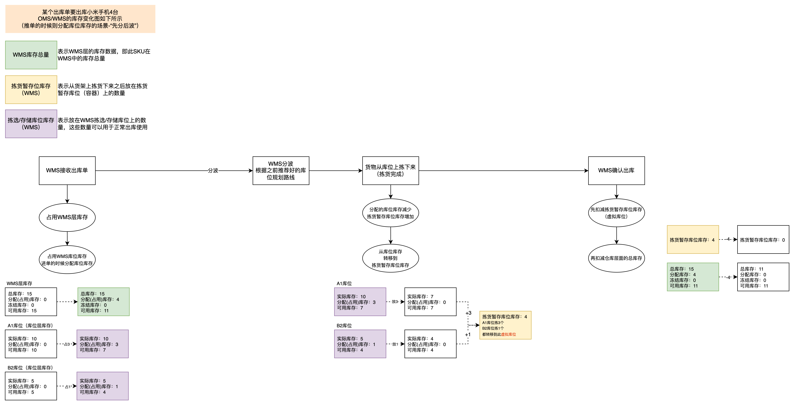

先分后波的库存变化讲解

  
**3****先波后分和先分后波的对比**  
通过上面的讲解，我们可以更加清晰地了解“先波后分”和“先分后波”的区别是什么，其中最大的区别就是：  
分配预占库位层的库存的时机不一样，“先波后分”是在分波的时候进行分配预占，而“先分后波”则是在进单的时候就进行预占。  
除了库位层的库存分配预占的时机和还有分配预占的取消方式这两点不一样之外，其他的库存变化逻辑，例如拣货下架，确认出库等都是一样的。  
先波后分在分配策略和效率提升上有更大的空间，因为分配结果就是作业员需要执行的库位，这里可以做的很复杂，比如用到算法。而先分后波因为分配是针对订单的，所以策略相对固定，无法考虑整体作业效率的提升。  
特别是在一些波次拆分较细的场景下，先分后波会导致同一库位的货品被拆分到多个波次，导致作业效率较低（海外仓大件仓这个场景特别明显），好处就是系统处理逻辑相对更简单。  
**无论是国内仓还是海外仓WMS，选择先波后分的还是占大多数。**  
**拣货异常处理**  
**1****拣货缺货**  
由于仓库中有大量的货物进进出出，而且仓库管理的水平又参差不齐，所以会导致仓库实物和系统记录的数据不太符的情况出现。  
当我们采用“先分后波”的库存分配逻辑时，虽然WMS在进单的时候就锁定了WMS层的库存，然后在分波的时候也成功预占了库位上的库存，但是当拣货员实际去拣货的时候还是可能会出现实物不足的情况。  
  

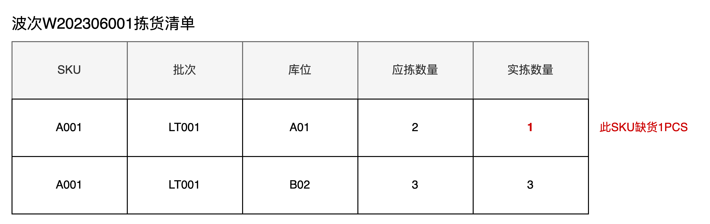

拣货缺货

  
我们把此类现象称之为“拣货缺货的异常场景”，也可以简称为”拣货缺货”。  
系统是推荐去A01库位拣货2个A001产品，但是拣货员到了之后发现A01库位上只有1个产品，另一个怎么都找不到，这个时候就是属于“库位缺货”了。此时拣货员可以在PDA上标记缺货，然后PDA会重新分配新的库位。  
  

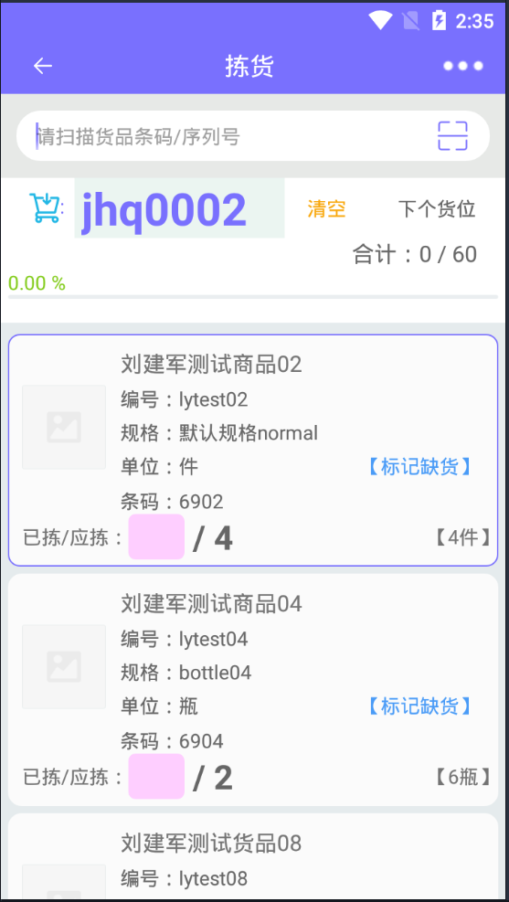

  
  

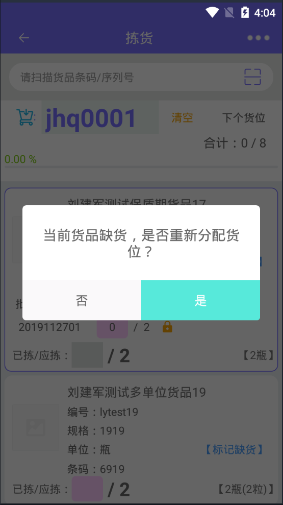

  
“当发现货位上面的库存不足时，点击【标记缺货】，提供是否重新分配货位的选项，点击【否】不重新分配货位，则含有缺货货品的发货单会从波次中剔除，同时发货单增加标记“波次配货标记缺货”；点击【是】系统重新分配货位，分配成功则继续进行拣货操作，分配失败则含有缺货货品的发货单会从波次中剔除，同时发货单增加标记“波次配货标记缺货”。”  
以上操作摘自吉客云WMS的操作手册。  
当拣货员标记缺货之后，系统会提示是否要重新推荐库位，如果选择不重新推荐，则系统会标识该货品所属的订单是属于缺货的订单，等后续复核验货的时候会自动拦截并提示该订单缺货，需要走缺货处理流程。由于一个波次中会有多个订单，所以此时需要知道到底是哪个订单的货物被推荐到了该库位，如果有多个订单的都在同一个库位的时候，则需要设置好指定逻辑，到底是哪个订单缺货，一般会使用“最小化异常订单的逻辑”，也就是使数量多的订单缺货。  
  

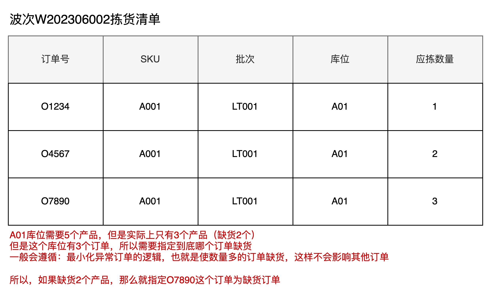

  
**根据上述的情况，所以建议大家在做波次锁定库位库存的时候，需要按波次中的订单逐个去轮询订单内的商品并分配其库位库存，而不是把波次内的商品聚拢后再统一去分配库位库存。**  
一般来说从波次中剔除订单处理起来会比较麻烦，所以遇到了拣货缺货的场景，还是建议把拣货流程往下推进，等到下一个流程再做处理。此时可以选择了重新推荐库位，可能会有两种情况：  
1重新推荐成功；  
2重新推荐失败；  
如果重新推荐成功，则拣货员去对应的新库位拣货即可；如果推荐失败，则意味着系统中可能没有其他库位有库存了，这种是属于“仓库缺货”的场景，也可以按上面提到的逻辑，指定具体的缺货订单，然后等到了复核的时候再拦截处理。  
  

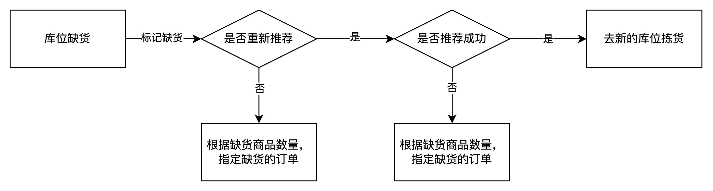

库位缺货处理逻辑

  
当拣货时标记了缺货之后，就会对该库位的临时性的冻结，然后生成对应的盘点计划，及时提醒作业人员这个地方的库存可能不准确，需要尽快去盘点处理，录入准确的库存数量。  
当重新推荐了新的库位拣货时，需要预配占用新库位的库存，而旧库位的库存预配占用则会释放。  
**2拣货取消**  
如果在拣货的时候，该波次内的某个订单已经被取消了，此时刚好该订单明细的拣货任务没有开始，也就是没有拣到该订单，那么就可以从波次中剔除该订单，订单的明细内容就不需要去拣货了，可以有效减少人力损耗。  
如果出库单已经开始拣货了，那么未拣货的明细可以从拣货清单中剔除，也可以减少人力损耗。而已经拣货下拉的内容，则在复核的时候拦截，然后做返库上架的动作即可。  
**小结**  
WMS的拣货细节有非常多，这个也是WMS很核心、很有难度的一个模块，由于我之前做海外仓的项目居多，对于拣货的更深的内容钻研的也不是很多，所以建议大家如果有这方面更深的业务研究时可以多看看富勒WMS相关的内容。  
但如果是刚入门WMS的新手朋友或者之前也没有做过复杂、有深度的业务场景的朋友，我建议还是可以把本文的内容先吃透，掌握波次怎么分配库存，怎么规划拣货路径开始，怎么扣减库存这些，而拣货缺货则是可简单、可复杂的设计，如果需要降低系统设计难度或者工作量等，可以把拣货缺货处理和拣货取消处理都设计的简单一些。