仓库是对货物进行存储管理的，除了要确保商品保管完好之外，确保商品的数量准确也是非常重要的一个指标。货物在仓库中会进进出出，不同的业务场景可能都会涉及到实物的操作，这些操作带来的数量的变化都需要被系统记录起来，这些就是我们常听说的库存流水或者库存记录。  
库存数据是WMS的重中之重，也是反应仓库管理水平的一个关键指标，对于WMS的产品经理来说，在日常设计产品方案的时候，无论是入库，还是出库，亦或是库内操作等，基本上考虑到对库存的影响。理解库存的底层逻辑，设计一套通用的库存模型（库存计算逻辑）是WMS搭建的基石，“底座”搭牢固了，后续系统才能更稳固地拓展和迭代。  
**常见的几种库存维度**  
在WMS中，常见的库存维度有：  
1SKU库存，即仓库中的某个SKU一共有多少库存；  
2库位库存，即某个库位上一共有多个SKU，分别的库存有多少，也可以称之为“产品-库位库存”；  
3批次库存，即某个SKU一共有多少批次，分别每个批次的库存有多少，也可以称之为“产品-批次库存”；  
4库位-批次库存，是最细粒度的库存，即某个库位上存放了哪些SKU，这些SKU的批次分别有多少库存，也可以称之为“库位-批次库存”；  
  

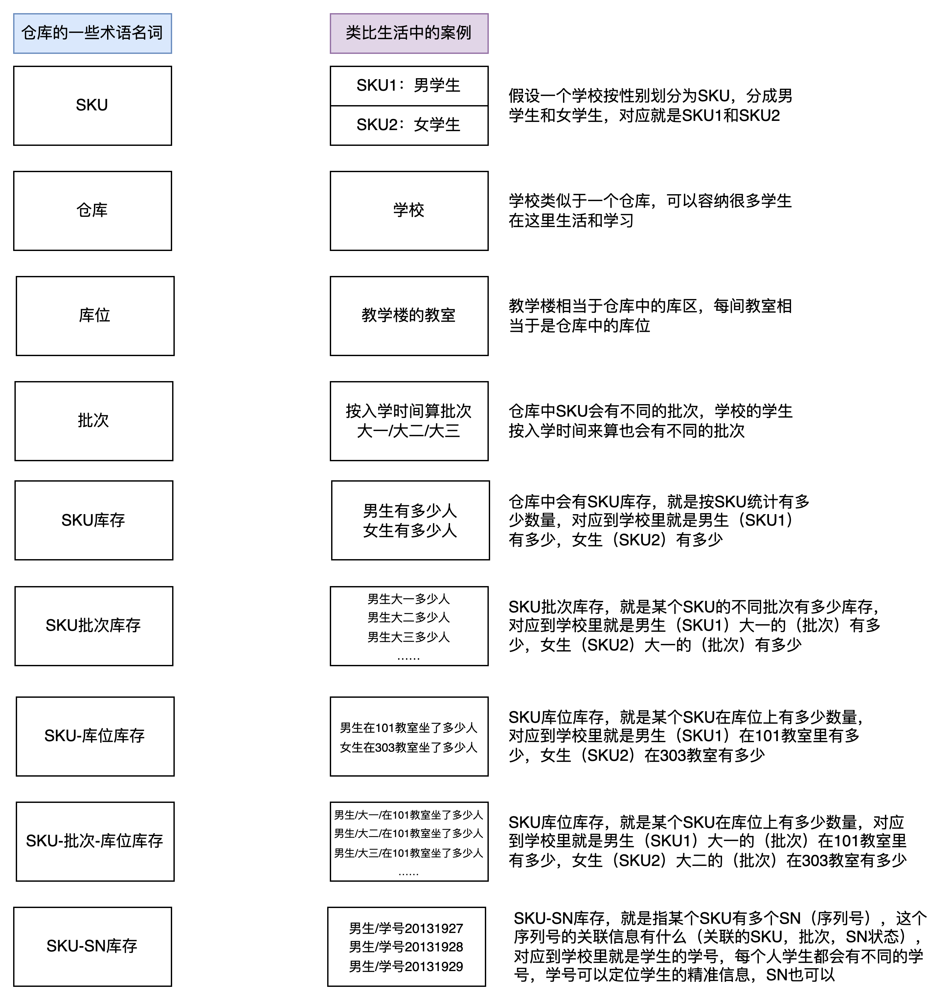

  
  

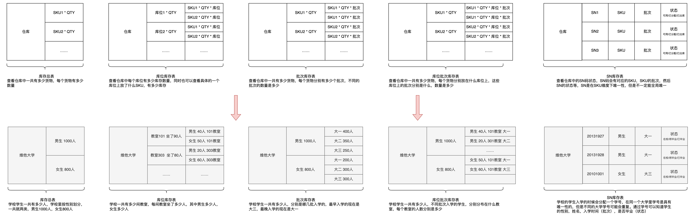

  
由于库存的统计维度不一样，在WMS中查询库存的时候也会有多种查询的维度或者展示的维度，例如富勒WMS中就会有：  
1按客户查询  
2按产品查询  
3按库位查询  
4按产品/库位查询  
5按批次查询  
6按批次/库位/跟踪号查询  
  

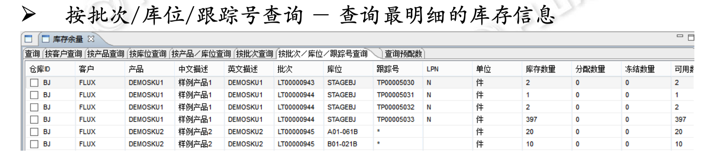

富勒WMS-库存查询

  
对于非常简单的仓库来说，业务场景没有那么复杂，而且也没那么精细化的管理粒度，一般来说只需要这两个即可：  
1按产品查询  
2按产品/库位查询  
  

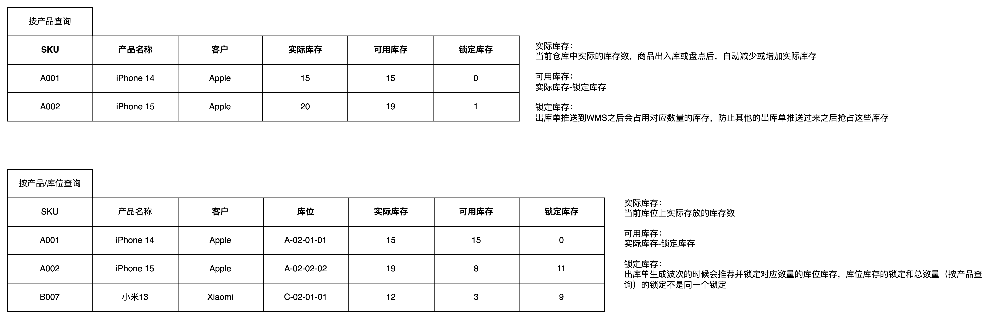

简单仓库常见的两种库存查询模式

  
在上一章我们讲解“先波后分”和“先分后波”的逻辑的时候，有提到“WMS层库存”或者“账面库存”，还有一个是“库位库存”。  
严谨来说，WMS接收了OMS的出库单之后，锁定的库存是“按产品查询”中的库存，也就是SKU层库存或者叫作WMS层总库存也可以，然后在分波的时候去分配具体的库存库存时，锁定的库存是“按产品/库位查询”中的库存，也就是“库位层库存”。  
但是如果有一些仓库做的比较细节一些，例如需要考虑“批次管理”的维度，那么库位层的锁定就需要再继续下钻一层，到达“**批次/库位/产品库存层**”。  
  

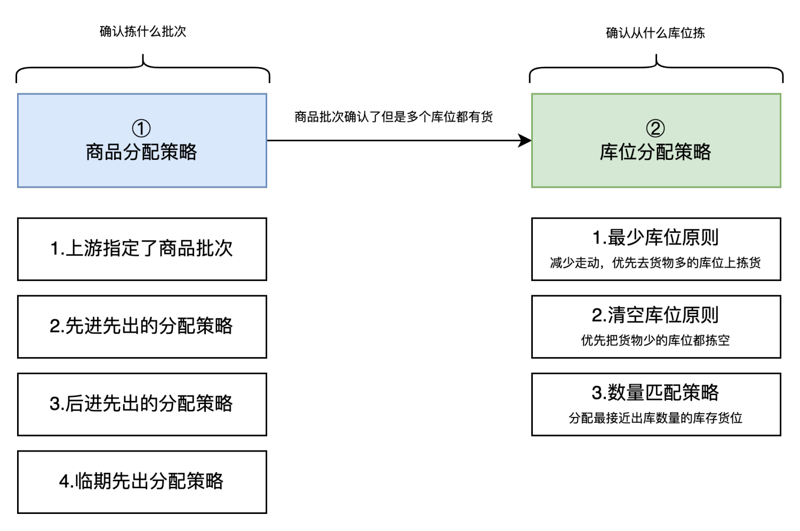

分波的时候分配库存的逻辑

  
通过上面的库存分配逻辑图可以知道，我们锁定库存的时候要先确认批次，然后再确认库存。所以，如果是对于需要管理到批次维度的仓库来说，上面的两个库存维度查询是不够的，需要再增加一层更细的维度，所以就会变成这样：  
1按产品查询  
2按产品/库位查询  
3按产品/库位/批次  
  

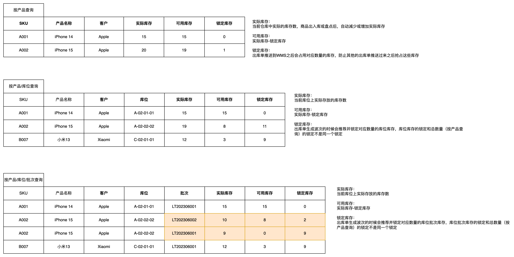

批次管理的仓库常见的三种库存查询维度

  
**WMS的库存结构**  
由于WMS中的库存会有几个不同的维度，所以WMS的库存结构中的字段也是不太一样的，这里我重点以最细的库存维度为例，简单拆解一下库存结构中的字段含义和产品设计中的一些注意事项等。  
  

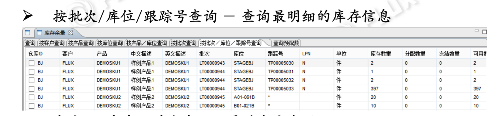

富勒最细的库存明细

  
  

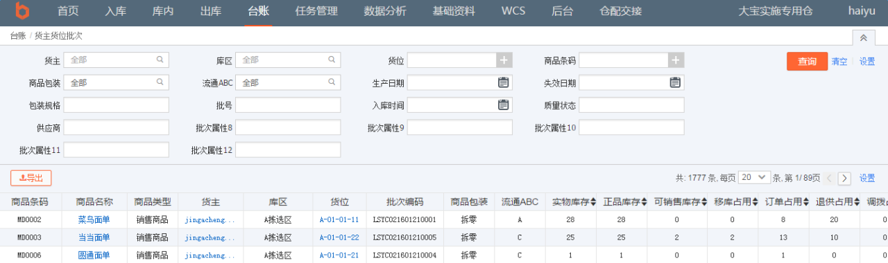

菜鸟大宝WMS最细的库存明细

  
  

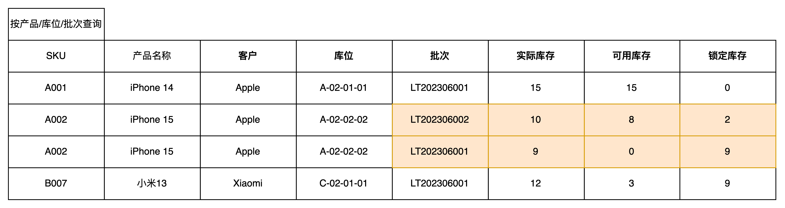

WMS库存结构说明

  
  

| **字段** | **字段说明** |
| --- | --- |
| SKU | 货品的编码 |
| 产品名称 | 货品的名称，如果是海外仓可能会有中文名和英文名两个字段 |
| 客户 | 货品属于哪个客户，有一些WMS中也称之为货主 |
| 库位 | 货物放在什么库位上 |
| 批次 | 货物是什么批次，批次是入库上架的时候自动生成的，国内仓会根据货品的供应商，生产日期，收货时间等批次属性自动生成批次号，而海外仓的批次属性一般就按收货时间即可 |
| 实际库存 | 货物放在库位上的真实库存，如果拣货了或者上架了，那么实物库存都应该对应变化 |
| 可用库存 | 货物在库位上可用的库存，由于一些单据会占用一些库存，所以剩余的部分才是可用的 |
| 锁定库存 | 被一些单据占用了的库存，一般来说是分波的时候推荐库位的时候分配锁定的那一部分 |

了解了WMS最细的库存结构表之后，还需要注意的就是关于库存流水这一块的展示。理论上来说，按什么维度来展示库存，那么就会有什么维度的库存流水。  
  

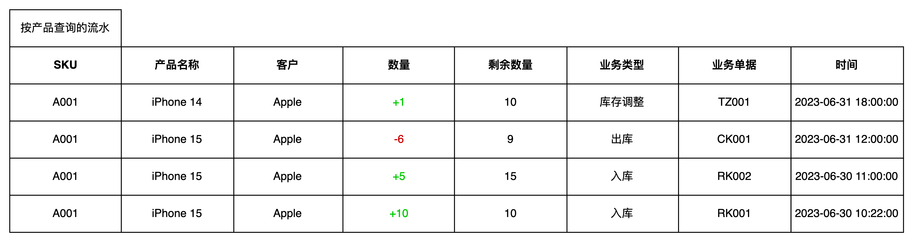

按产品查询的流水

  
这种维度的库存流水结构可以很清晰的看到某个SKU在一段时间内的库存变化，但是如果想要了解更细节的内容，例如批次是什么，库位是什么那么这种流水的呈现方式就不太能满足相关的业务需求了，所以我们还需要做一个更细的库存流水，建议直接一步到位：**精细到产品/库位/批次层面的库存流水**。  
  

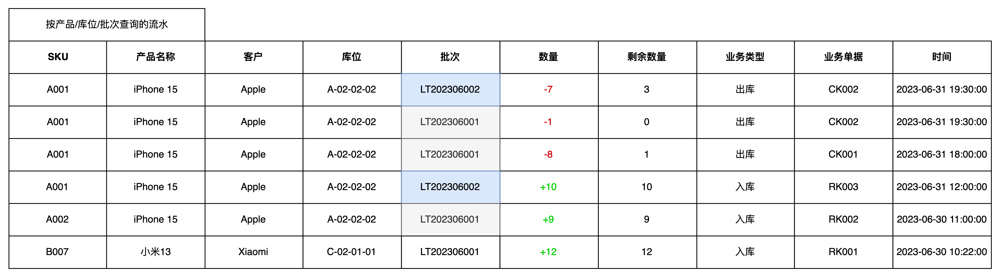

按产品/库位/批次查询的流水

  
**WMS的批次说明**  
对于国内仓来说，批次是商品很重要的一个属性，可以用来精细化管理更细维度的商品，所以在入库的时候会根据不同的批次属性来生成多种不一样的批次。同一个商品，只要批次属性不太一样，那么就会生成不太一样的批次号。例如富勒WMS和菜鸟WMS都支持自定义多个批次属性，然后收货的时候根据这些批次属性去生成不同的内部批次号。  
  

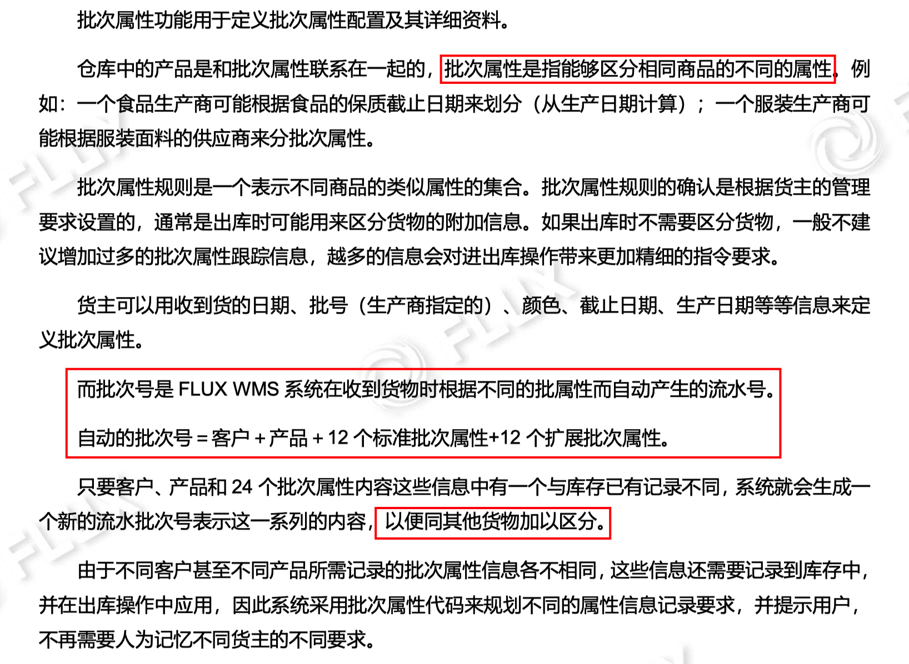

  
批次属性是挂在商品维度的，所以批次号也是挂在商品维度下 。这意味着不同的商品也可以用相同的批次号，例如iPhone14的批次号是LT001，而OPPO Reno10的批次号也可以是LT001，因为它们是不同的商品。  
当然有一些仓库为了让批次号减少重复性，也可以设计一套生成规则来控制不同的商品的批次号不重复，这也是可以的。  
  

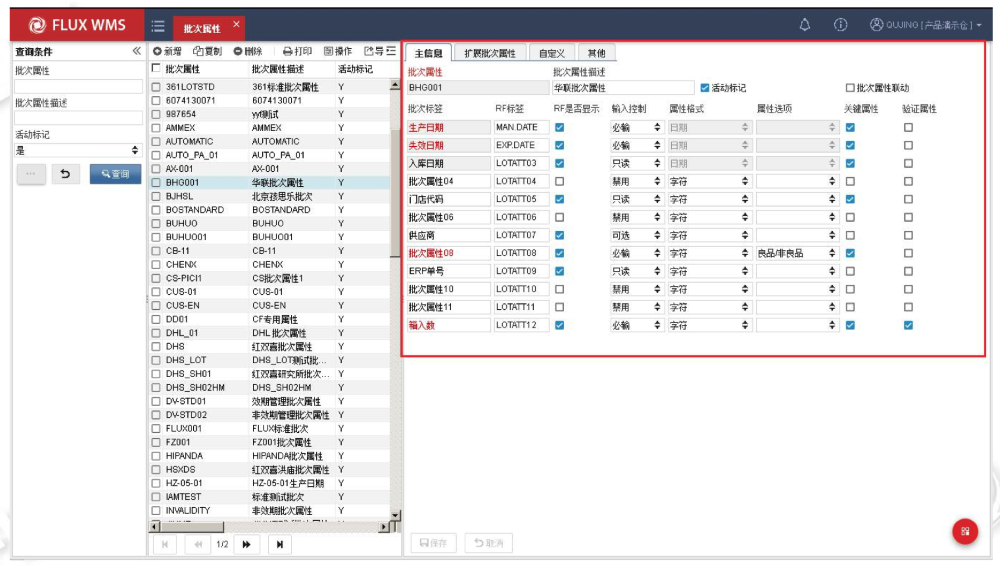

富勒WMS的批次管理

  
但是对于海外仓WMS来说，商品的批次管理用途场景比较少，可能用的最多的场景就是用来“先进先出”和“计算库龄”，因为海外仓计算仓租的时候一般是用梯度计费，所以库龄时间越长那么仓租就越贵，而商品的库龄主要就是从批次维度来区分，同一个商品的不同批次会有不同的库龄时长。  
**WMS的库存变化说明**  
WMS的业务场景比较多，而且大多数业务场景都会伴随着库存的变化，所以要掌握WMS的核心知识，就要在业务场景的基础上，一步一步梳理了解库存的变化是什么。在产品方案设计的时候，也可以使用表格将一些高频的业务场景及其库存变化的逻辑展示出来，这样交付给研发的时候就比较清晰。  
  

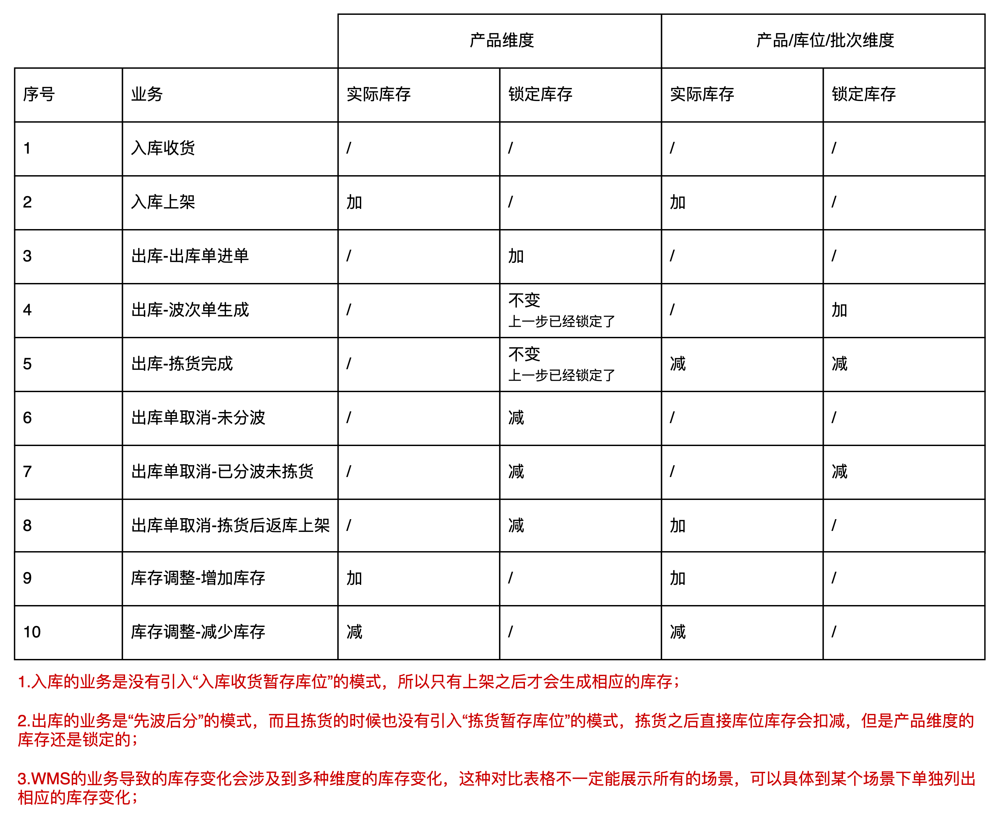

  
由于表格展示这些逻辑时可能会遇到一些特殊场景不好展示，所以还是建议和OMS的库存篇所讲的一样，借助业务流程+库存的变化注释来说明其中的逻辑。之前我整理过类似的图片发在了知识星球中，在这里我把WMS入库和出库的库存变化示意图摘录出来，帮助大家更好地理解业务和库存的变化。  
**1****入库的库存变化示意图**  
  

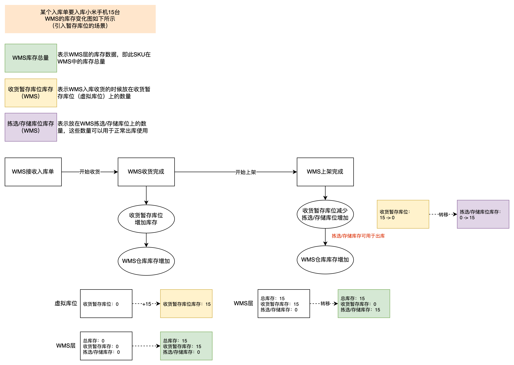

引入暂存库位的场景

  
  
  

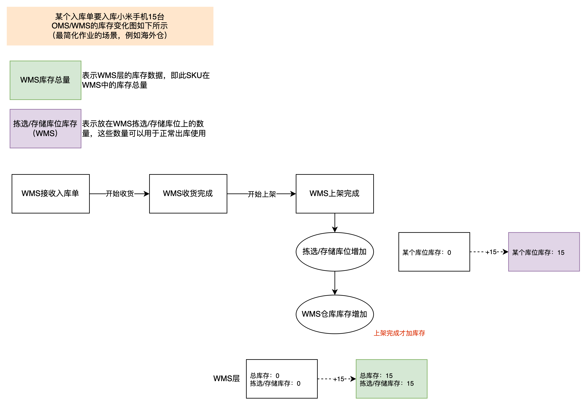

最简化作业的场景

  
**2****出库的库存变化示意图**  
  

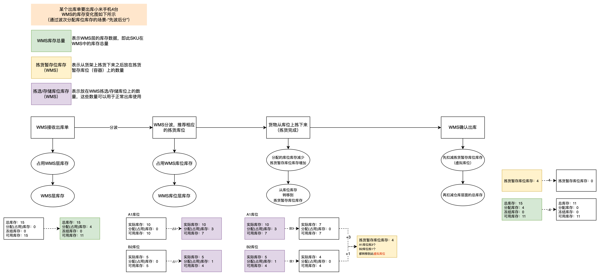

先波后分的场景

  
  

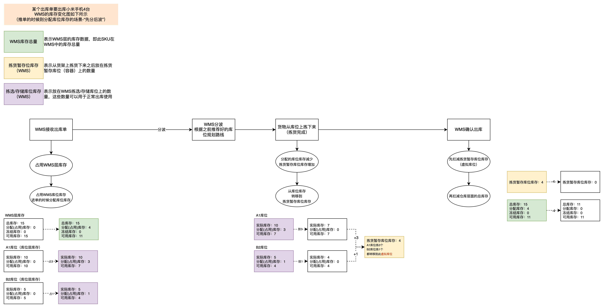

先分后波的场景

  
**3****OMS&WMS的库存变化示意图**  
  

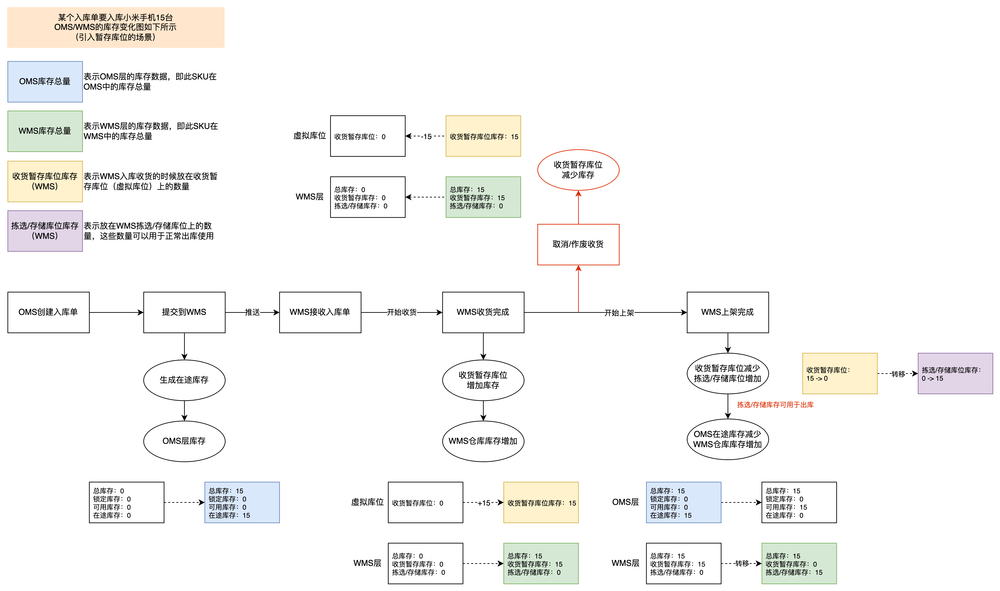

OMS&WMS入库（引入暂存库位的场景）

  
  

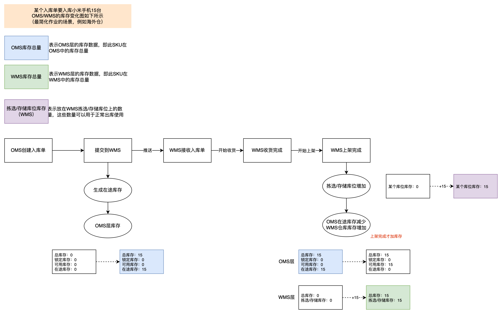

OMS&WMS入库（最简化作业的场景）

  
  

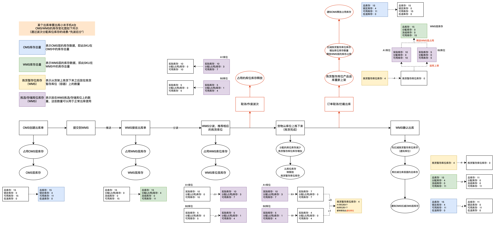

OMS&WMS出库（先波后分的场景）

  
  

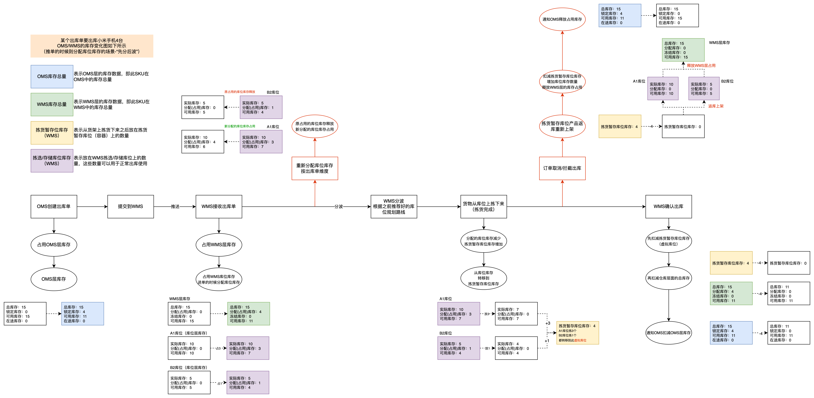

OMS&WMS出库（先分后波的场景）

  
**小结**  
库存管理是供应链类系统中非常重要的一个模块，WMS中的管理的是实物的库存，相对来说业务复杂度等会比其他类型的系统更高一些，所以对于WMS产品经理来说，一定要花时间深入钻研库存模块的一些底层逻辑，争取搭建一套灵活的，强大的，数据准确的库存架构模型。  
关于这一块的设计，可以多参考国内例如富勒WMS，菜鸟WMS等成熟的产品，有很多最佳实践可以直接借鉴并学习。对于海外仓来说，系统中的库存模块相对来说都比较孱弱，因为业务场景没有那么丰富，业务要求也没有那么精细化，所以反而对于一些入门学习WMS的朋友来说是一个好机会，因为可以从易到难逐步进阶成长。  
针对海外仓一些比较特殊的业务要求，不一定非要遵循所谓的「行业标准」。产品经理也不要过多的纠结某些功能和操作在国内仓库是见不到的，这种操作是否不科学，不合理。而是应该关注业务本身，以及海外仓暴露出的高频痛点，怎么用国内较为先进的仓储系统设计方案移植到海外仓系统中。  
库存模块还有很多知识可以讲解，但是为了让大家更聚焦在核心的重难点上，所以我做了一些取舍，重点只是讲了出入库相关的库存业务。在后续的库存操作模块中，我也会继续补充一些其他的库存相关业务和产品方案设计的介绍。