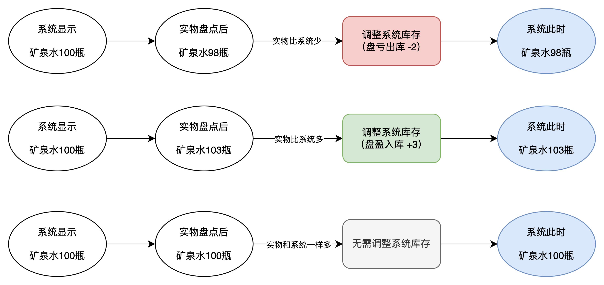
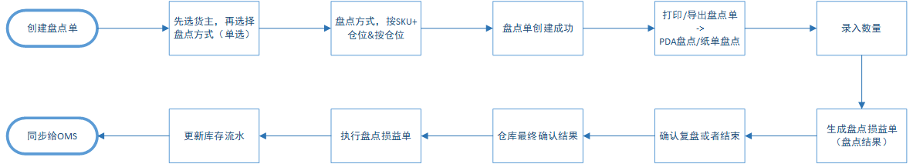
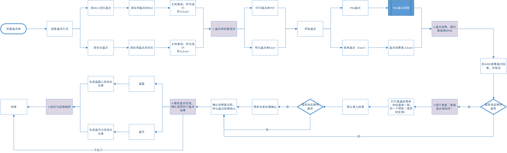
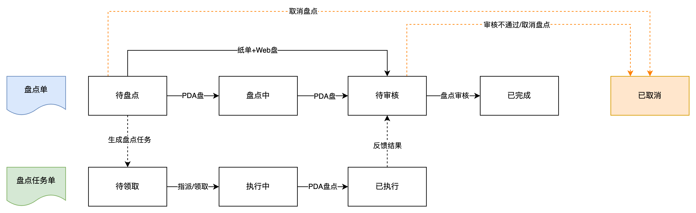
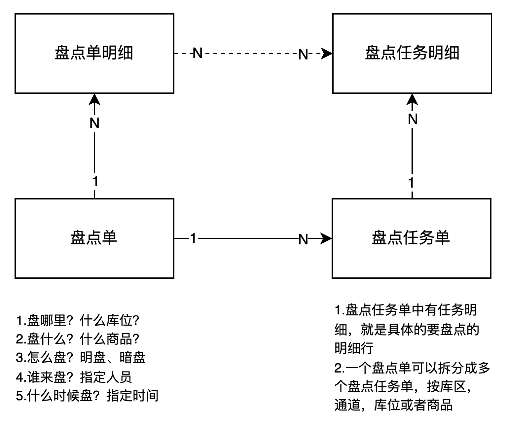

仓库每天都会有货物的进进出出，在库内的货物会时常会需要移动、调整等，久而久之就会出现实物和系统中的数据不吻合的情况，我们称之为“库存不准确”或者是“库存差异”。  
如果出现了库存差异，而且差异量还蛮大，那么就会造成很多损失，例如订单缺货，库存积压，货物丢失等，为了让仓库中的实际货物和系统记录的数据保持一致，仓库就会对实物进行盘点。  
WMS的盘点是指对仓库存储的货物进行清点和核对的过程，盘点的目的是为了确认仓库里的实际物品数量与系统记录的数量是否一致。盘点过程中，我们会逐个检查货物，并记录每个货物的数量。我们可以使用计数器、扫描仪或手动记录等方式来完成这个过程。一旦完成盘点，我们会将实际的库存数量与系统中的记录进行对比，以发现并纠正任何数量不匹配的情况。  
**盘点业务中的一些名词**  
最早的时候我接触盘点的时候或者要做盘点这个功能的时候也是找了挺多资料和信息的，结果发现越看越迷糊，然后越看越觉得纠结，感觉太多名词，也太多方案了，不确定自己到底要选择哪个好，生怕做出来的东西少了点什么，所以就会想什么都做上去。如果你也需要做盘点相关的功能，那么我的建议是：**选择“最合适当前业务的方案”，如果无法判断当前的业务适合哪一种，那么就会选择“最简单、最灵活的方案”**。  
**1****明盘和暗盘**  
用户在盘点过程中如果知道库位上有什么商品，有多少数量，那么这种方式就叫明盘，也就是系统会展示具体的信息给盘点人员。如果用户在盘点的时候只知道有什么商品，但是不知道有多少数量，那么这种方式就叫做暗盘或者盲盘。  
我理解明盘和暗盘的主要区别还是在于效率和管理上，例如明盘的时候可以看到有多少数量，那么点数的时候有参考性，效率就会比较高，可以快速对着盘点单输入内容，但是缺点就是可能会有人作弊、偷懒，快速跳过一些货品。而暗盘则明显效率很慢，需要逐个扫描，而且也不知道什么时候是个头，盘点的结果比较精准，也不容易让人作弊，但是缺点就是数据整理比较麻烦，效率也不高。  
**2****静态盘点和动态盘点**  
静态盘点就是指在仓库停止作业后发起的盘点，一遍就是仓库下班后或者不上班的时候进行盘点，此时因为仓库没有作业，就不会有入库、出库的任务，所以库存数据就比较准确。而动态盘点就是指仓库在正常运转的时候，也可以进行盘点，这个时候库存随时会发生变化，在计算盘点数据的时候就要考虑实际的正常业务对库存的影响。  
一般来说，静态盘点适合大面积的盘点，例如月末，季度末的盘点，这样仓库停工了之后可以专注在盘点任务上；而动态盘点则适合小范围的库位或者商品的盘点，因为仓库不能停工，所以就只能边作业边盘点。  
也有一种比较偷懒的方式，那就是盘点的时候对待盘点的库位和商品进行锁定，而且这种锁定的优先级是最高的，意味着人为使得“短暂停工”，然后对这些锁定的库位和商品进行盘点。这种方式一般用在仓库快下班的时候或者快上班的时候，赶紧盘点完，然后再正常作业。  
**3****循环盘点、动碰盘点、指定盘点**  
循环盘点：由于仓库的库存往往非常多，一次全盘往往需要耗费数天甚至更长时间，于是产生了循环盘点。即基于SKU的ABC分类（基于价值或出入库频率划分），设定不同类别的盘点频率与周期，系统自动生成盘点任务。譬如A类SKU每星期盘点一次，B类SKU每月盘点一次，C类SKU每季度盘点一次。  
动碰盘点：针对一定时期内发生过变动（交易）的库存进行盘点。不同的仓库动碰的维度存在差异，有的采用的是基于SKU动碰，也就是某个SKU的库存发生了变化，那么就需要盘点；有的则是基于库位动碰，也就是某个库位发生了库存的变化，那么就需要盘点。  
指定盘点：设定一些查询条件查询库存进行盘点，譬如指定货主、品类、SKU、库区、库位等。  
仔细分析一下就会发现，无论是上面的哪一类盘点方式，本质其实就是“**过滤出待盘点的对象**”，如果从系统设计的角度出发，其实就是筛选条件不一样。所以如果遵循简单设计的原则来看，直接用指定盘点的方式是最简单的，输入一些查询条件，然后人工去选择要盘点的对象（可能是库位，可能是SKU）。  
**4****盘亏、盘盈、盘平**  
盘亏：意思是就是指盘点之后，实物比系统中的要少，账面上有100，但是实物只有98，类似于“亏了”，所以叫做盘亏。  
盘盈：意思是就是指盘点之后，实物比系统中的要多，账面上有100，但是实物却有103，类似于“赚了”，所以叫做盘盈。  
盘平：意思是就是指盘点之后，实物和系统中的数据一样，账面上有100，实物也是100，类似于“平手”，所以叫做盘平。  
  

  
一般来说，无论是盘盈了，还是盘亏了，都会称之为“库存差异”，而库存差异了，就需要执行差异的调整。由于实物是具象的，不能凭空出现，也不能凭空消失，所以就只能通过调整系统中记录的数据来保持一致。  
如果盘亏了，那么就让系统“出库”一些，扣减一些库存，以使得系统库存和实物库存一致；如果盘盈了，那么就让系统“入库”一些，增加一些库存，以使得系统库存和实物库存一致。  
**盘点的本质是****对实物进行清点，然后和账面数据比对；根据实物清点结果，对账面数据进行调整，达到账实相符。**  
所以新手如果要做这一块的产品功能设计的时候，一定要记得抓住本质来设计，否则很容易走歪路，然后陷入无休止的修修补补中。  
例如看竞品，别人有明盘和暗盘，我要不要也这样做呢？别人有动态盘点和静态盘点，我是否也要跟着做一个呢？别人盘点的时候可以Excel导入，那我是不是也要做呢……  
这就是我早些年做盘点功能的时候踩的最大的一个坑，一直想把盘点功能做的很全，很完善。结果发现很多功能设计完成之后，压根过不了评审。或者做Demo方案的时候，仓库压根就不认可这么多复杂的操作方式，于是只能被打回去重新思考到底业务的需求是什么，海外仓的特色是什么，盘点功能的边界应该怎么定义。  
**盘点流程**  
  

  
盘点流程图  
盘点的主线流程基本上都是大同小异，因为本质就是清点实物，然后调整系统账面数据。所以难点一般会在一些小细节和业务判断上，同时还有海外仓库的操作系统和管理方式。  
**1\. 创建盘点单**  
创建盘点单的时候我精简了盘点的方式，最后就保留了两种方式：  
1按SKU+仓位盘点，系统标记出需要盘点的SKU在哪个库位分别有多少数量；  
2按仓位盘点，系统标记出需要盘点的仓位有几种SKU，分别有多少数量；  
全部都是明盘，没有考虑暗盘这种方式（各位可以视具体业务而定），这两种方式是仓库盘点最常见的，能满足绝大多数的盘点需求。  
把选择权更多地给仓库，想盘点哪个客户的，哪个SKU就盘点哪个，想盘点什么库位就盘点什么库位，一切都由仓库自己来决定。系统要做的就是精准地将位置和信息带出来，然后提供给仓库盘点人员即可。  
**2\. 初盘**  
上面说到了，盘点的本质就是将实物数据和系统的账面数据进行比对，然后去调整系统的账面数据，以达到账实相符。  
如果实物比账面数据多，那么就是「盘盈」，意味着库存调整单是需要增加库存，类似于系统平白无故多「赚」了一些数量。  
如果实物比账面数据少，那么就是「盘亏」，意味着库存调整单是需要扣减库存，类似于系统中平白无故「丢失」了一些数量。  
而初盘的意思就是第一次盘点，初次盘点。初盘之后还有复盘，甚至还有些仓库会有终盘，就是对复盘之后再盘点。  
初盘之后再复盘的原因是考虑到人为清点会有可能点错数的情况，如果一次清点就做了调整，有可能人为误差因素太大。所以会考虑初盘之后，再来一次复盘，以减少初盘一次带来的误差率。  
**3\. 复盘**  
对初盘结果再次盘点，就称为复盘，也可以叫做二次盘点或者二盘。关于复盘有一个逻辑是需要特别注意的：**那就是复盘，到底还需要盘哪些？**  
如果我们不做过多的考虑，那么复盘肯定就是对初盘的一次重复动作，也就是说初盘盘了10个SKU，20个仓位，那么复盘也需要盘点10个SKU，20个仓位。  
但是从实际的调研和仓库反馈来看，仓库有些时候并不想重复性地对已经确认了数据的内容再次盘点，这样会浪费自己的时间，同时又感觉做了很多无用功。但如果只对有差异的内容进行复盘，那么又会发现如果仓库想对一些不太确定的SKU再次盘点，系统却没有办法支持录入复盘数据了，也会挺头痛的。  
所以推荐的解决方案是：**复盘的时候可以对所有数据进行操作，额外增加了一个筛选按钮，就是「只展示有差异的内容」。**这样的话可以只对有差异的内容进行盘点，而没有差异的内容盘点数据自动默认采用初盘的数据；如果要对全部的内容盘点，系统也留了一个口子，不至于让仓库没有入口录入数据。  
**4\. 确认盘点结果**  
当复盘之后，绝大多数情况下可以确保实际清点的数量应该是准确的，所以就可以对复盘结果进行确认了。确认之后可以执行盘点差异处理，从而对进行库存调整，增加一条盘盈的流水或者盘亏的流水。  
确认盘点结果可以考虑做一个授权功能或者审核功能，尽量确保这个动作的完成是有一定的门槛的，毕竟对系统账面数据进行了调整，所以还是要让操作人员有一定的敬畏心和谨慎感。当然如果可以采用管理的手段来规避这种查错那是最好的，因为系统终究只是工具，如果一味地想要通过工具来约束人其实并不可取，反而容易增加成本，让系统复杂度暴增。  
**5\. 盘点的详细流程**  
最后我在这里放一个详细版的盘点流程图，其实最早期的版本应该会有更多的功能，随着对业务的把控程度越来越清晰，就做了很多删减。  
  

盘点详细流程图

  
**难点与踩坑点**  
**1****分类和业务分支复杂**  
前面讲到，盘点有很多种类和方式，如果一味的想要求全，满足所有的功能，那么就会导致分支线会弄的比较复杂。  
例如当前我只用了两种盘点方式，但是涉及到初盘，复盘和确定执行与不执行，最后再兼容不同的盘点设备，这一套下来，工作量其实就挺多的。  
而且盘点功能其实只是WMS的库存模块的一个小功能，如果一开始采用了太多种类的盘点方式，那么最后可能就会演变成比较复杂的分支。产品设计的方案太复杂，开发成本较高，仓库使用的学习成本也很高。  
**2****盘点锁定库存和实际库存**  
仓库盘点的时候，应不应该停止作业？这个问题不同的人有不同的答案，但是结果肯定是：**不作业的时候再做盘点会对产品设计要求更少。**  
当在仓库作业的时候盘点，创建盘点单获取实时数据的时候是一个值，在实际到了库位进行盘点的时候可能又变成了另外一个值。为了避免这种数据的动态增减，我们可以考虑对正在作业中的SKU或者库位做冻结，**不允许盘点这一块的数据**。  
那么什么时候释放这些作业中锁定的库存数据又是一个问题，是下架了就释放还是出库了再释放。如果是下架了就释放，那么如果有订单拦截取消又要返库怎么办？如果是出库了就释放，那么这个单临时不出库，一直放在待发货区不出库，那么短期内就没办法对某些SKU盘点了。  
所以盘点怎么处理锁定库存也算是一个难点，一定要考虑清楚系统对库存的锁定和释放的时机，然后结合业务来设计。  
我自己的经验是倾向于让仓库盘点的时候不作业，这样的数据是最准确的。我只统计在库位的库存，而不管是否锁定还是冻结，只要不在库位我就不统计，那么前提最好是：**仓库已经正常作业完，现在没有入库和出库的操作。**  
**3****产品边界的问题**  
上面说了关于盘点的方式和种类有很多，然后盘点库存统计的时机也有很多种方式，盘点需要几次才能确认结果，盘点的时候用PDA还是纸质单还是Excel，盘点能否支持多人同时作业，多设备共同提交……这些都是产品边界的问题，一开始最好做加法，然后慢慢地发掘之后做减法。  
产品边界问题不只是在盘点上会遇到，在其他的产品功能设计的时候也会遇到。而我自己就是因为在盘点的时候踩了这个坑，所以我的记忆比较深刻。盘点功能从设计到开发到最后上线，足足比我预估的时间晚了2个迭代，这里面最大的原因就是我对产品边界的把控不到位。  
有些功能做到一半才感觉好像用处不太大，考虑的太多了；也有一些功能做到一半才发现没考虑周全，例如货品的料区问题，于是又要紧急规划将一些遗漏的点重新补上。  
**产品边界这个坑，是做盘点功能给我最大的一个教训，也算是一个最大的收获。**  
**4****盘点单是否要拆分成任务单？**  
国内一些比较知名的电商WMS，例如富勒，大宝，吉客云等基本上在做盘点功能的时候都会引入一个盘点任务的概念，盘点单和盘点任务之间的实体关系图我画了一个简化后的图来表示。  
  

盘点单和盘点任务单的关系

  
对于海外仓WMS来说，如果业务单量没有达到较大的值，仓库中的货品种类和货架、库位数量等没有达到一定的量级，我都是建议先不要考虑设计“盘点任务单”这个概念，因为对仓库执行层来说稍微重了一些。实际上我接触的一些小的海外仓，大家在盘点的时候一般都是要么线下各自分任务，张三盘点A区，李四盘点B区，然后分别提交数据汇总在一起，这种方式简单粗暴，效果也还好。  
如果引入任务单的概念，那么就需要考虑盘点单中的待盘点明细要怎么拆分为不同的任务单，这些任务怎么分配给操作员，然后任务单的什么时候汇总到盘点单中等，这里涉及的工作量就稍微大了一些。  
  

  
实际上是否引入任务单，还是要看当前的业务情况和系统情况来决定，我之所以在这里提到这个东西，是我发现很多朋友在做海外仓的时候会受限于国内仓的思维。  
看到富勒有这个功能，然后就觉得好像自己的仓库也要加上这个功能，于是乎就会看到一些海外仓做得特别复杂，而且又不太高效。  
根据我目前对海外仓的理解和认知来看，如果不是那几个特别大的、知名的海外仓公司，其他的海外仓系统功能都不太建议做太复杂，适度才是最好的，而不是全都要。  
“所有重要的东西都不是重要的，只有必要的东西才是重要的”  
**小结**  
盘点功能是WMS库存模块的一个辅助性功能，辅助仓库调整系统账面库存，以达到账实相符的要求。海外仓的盘点和国内电商仓库的盘点应该也是大同小异，主要区别还是在仓库管理和实际业务的区别。**毕竟系统是给人用的，使用的人都不同，那么使用方式自然也会有所不同了。**  
大家总在说B端产品应该更加注重业务，吃透业务，理清逻辑；而C端产品则需要更加关注拉新留存，商业价值，用户体验和用户价值。很多话都是说的，听的千篇一律，却难有，少有万里挑一的触动。  
当我回过头去反思自己做WMS的产品设计的时候，我发现我对业务的理解还是很片面，总觉得自己看到的就是最真实的，最全面的。而背后的，冰山下的却没怎么去挖掘，花费了较多的时间和精力去对比竞品，去分析同行的设计初衷……  
所以，哪怕是看起来简单的8个字：**吃透业务，理清逻辑**。实际做起来也是需要费一番苦心和光阴，所以B端产品还是应该侧重点在**业务**。理解了业务，吃透了业务，那么距离一枚优秀的B端产品，就又更近了一步。