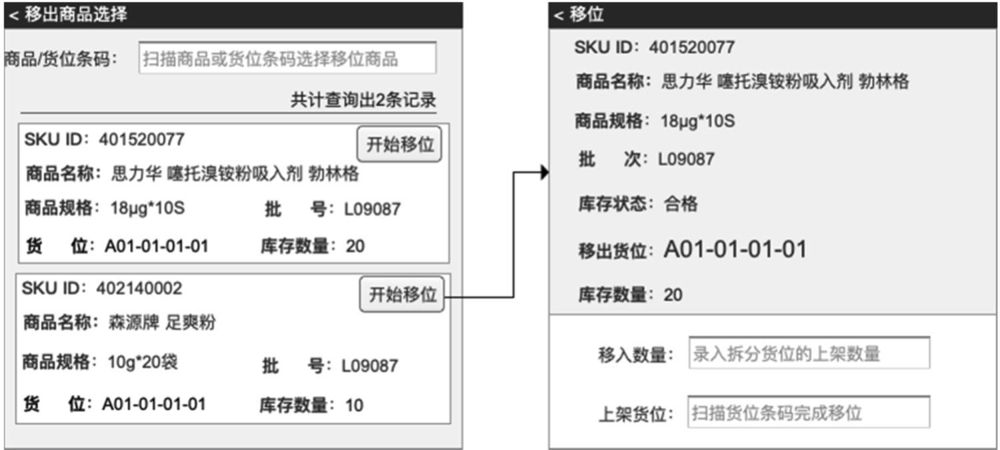
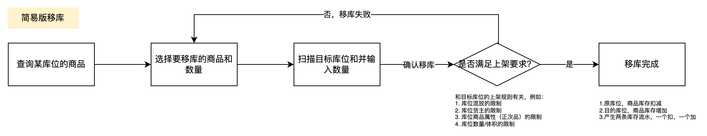
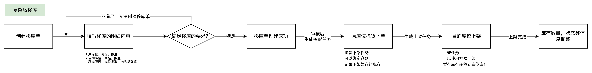
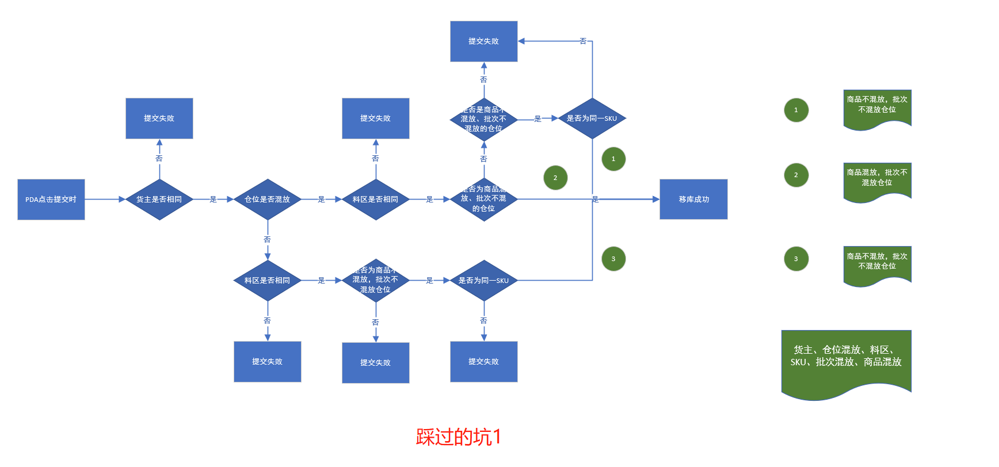
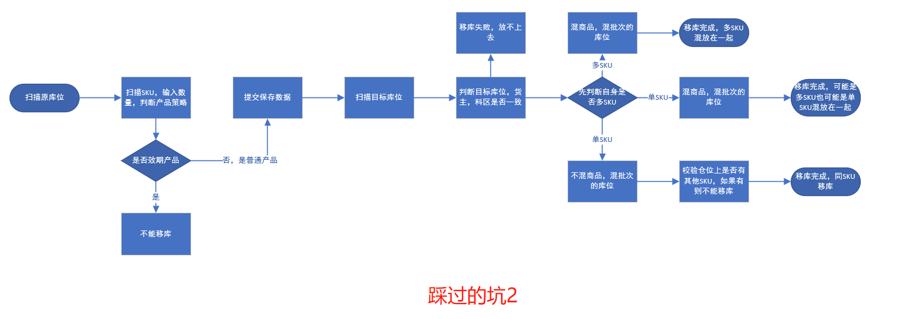
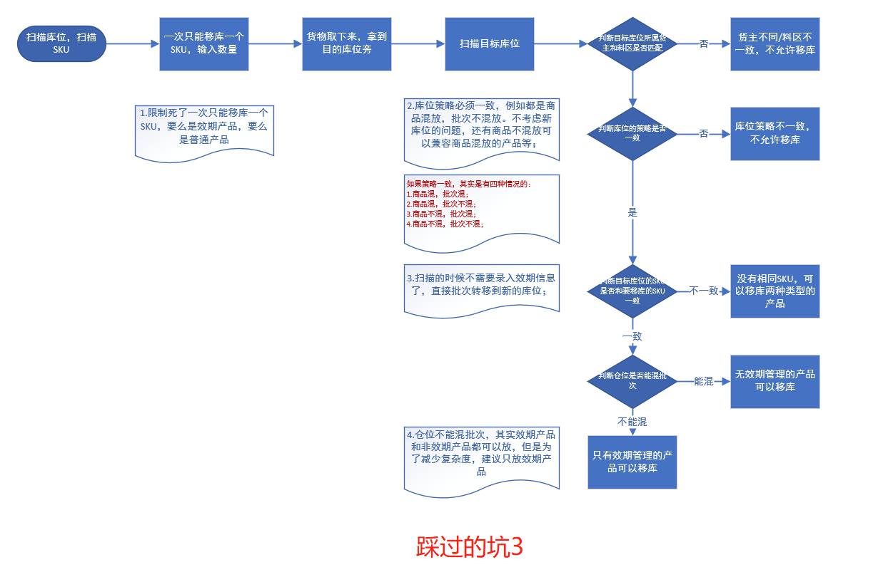
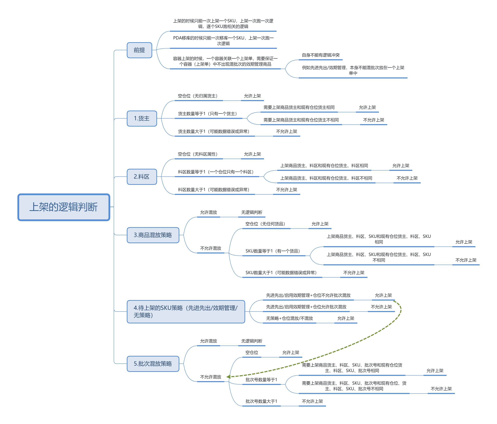

WMS的移库功能在不同的仓库或者不同的系统定义不一样，有些地方把移库当成两个仓库间货物的转移，有些地方把移库当成不同的库区间的货物转移，例如从拆零区到整箱区或者从高货值区转移到低货值区等。  
而本文所提到的移库其实就是指货位（库位）间转移，将货物从库位A移库到库位B，然后库位A的货品库存数量扣减扣减，库位B的货品库存数量增加。  
看似很简单的功能，但是结合到实际业务中，也让我踩了挺多坑。所以我特地花了一些时间整理出此篇文章，复盘一下我在设计该功能的时候遇到了哪些问题，收获了哪些感悟。  
**简易版的移库**  
很多海外仓没有做效期管理，也没有做批次管理，所以基本上对货物的管控粒度都是在SKU层面。如果需要移库的时候，直接用PDA扫描需要移库的库位和商品、输入移库数量，然后再扫描目标库位和商品、输入移除库数量即可。移库完成之后，原库位的商品库存扣减，而目标库位的商品库存增加，同时会生成两条库存流水，具体的操作示意图如下所示：  
  

摘自《实战供应链》

  
  

简易版移库

  
简易版的移库主要是因为管理粒度在SKU，所以在移库的时候，只需要判断目标库位上架要求是否符合，符合就可以移库成功，一般来说会有这么一些判断：1\. 库位混放的限制，库位是否限制了商品混放，商品是否能放到这个位置； 2\. 库位货主的限制，库位是否限制了货主，例如该库位只能放某个货主的货物； 3\. 库位商品属性（正次品）的限制，库位是否限制了正次品属性，如果属性不一样，就不能上架； 4\. 库位数量/体积的限制，库位是否限制了数量或者体积，如果移库之后导致超过了数量和体积，则不能上架；  
由于之前做海外仓的时候，有很多上架约束都做得比较简单，所以我们当时就重点考虑了“货主和料区”是否和源库位一致，只要一致就可以移库，没有其他额外的判断逻辑。  
**货主为什么要一致？**  
这个各个仓库的管理要求不一样，我们不允许一个库位放两个货主的货物是因为两个货主的货物可能会一样（你卖iPhone，我也可以卖iPhone），为了避免这种货物识别可能带来的风险，所以我们是只允许一个库位放一个货主的货物的。  
**料区是什么？为什么要一致？**  
这个也和仓库的管理要求有关系，有些仓库对货物的品质管控只要求区分良品，残次品或者其他粒度。而我们对品质的管控要求细一些，除了要求好坏之分的话，还会有更细的粒度。  
例如退货回来的货物区分售后良品，售后不良品；所以一个库位只能放一个料区的货物，将良品放在一起，残次品放在另外的库位，那么移库的时候，一个良品库位的货物也就只能移库到其他良品的库位上了。  
而库位的商品混放和批次混放我们是默认开启的，然后也没有做库位数量/体积的限制，所以基本上移库的时候就不需要考虑这个因素了，这里是由于当时的仓库业务而决定的，读者朋友应该结合自己当前的业务进行判断处理。  
**复杂版移库**  
在海外仓中，大多数时候使用简单版的PDA移库就可以解决业务的需求，但是这个简易版的方式虽然好用，但是也有一定的局限性：  
1一次只能移库一个商品，效率不是很高；  
2只能使用PDA，如果不用PDA而是用纸单操作，则可能数据更新会延迟，会有风险；  
3原库位下架之后如果不及时移库上架，会导致有一部分库存系统是记录不到的，有丢失风险；  
为了满足更加丰富的移库场景，有一些WMS还会设计“复杂版移库”的方案，这一块我实际没做过，但是我找了一些资料给大家拆解一下，也试着去拓展一下自己的知识面。  
  

复杂版移库

  
复杂版移库也称之为“两步移库法”，主要的操作流程大概是这样的：  
1先在WMS端创建移库单，填写要移库的信息，相当于提前做好计划；  
2移库单审核通过之后会先生成移库下架的任务，等同于拣货下架，然后操作员执行任务完成下架；  
3移库下架完成之后再自动生成移库上架的任务，等同于收货上架，然后操作员执行任务完成上架；  
4移库完成之后，任务完结，移库单也完结，库存也会有两条记录；  
除了上述的流程之外，复杂版移库还可以追加一些其他功能，例如说货物属性的转移和变化，将正品库位的货物移库到次品库位上，同时也将货物的属性从正品转为次品。这个操作一般需要用到复杂版的移库方式，也就是要用移库单去承载，而不是直接用PDA操作。  
快速移位是一种短平快的做法，可以快速将某个商品从A库位移到B库位上去，但是也会有一定的风险，就是系统可能无法监控到位，例如说在Web端去执行了这个单据之后，还需要仓库人员去实际的货物上处理。而创建库存移位单则是一种相对来说更加保险的做法，因为可以有相关的单据可以溯源，同时也可以增加更加精细化的控制操作。  
无论是快速移库还是创建库存移库单的方式，核心还是要关注“下架和上架的规则”和“库存的变化”，库存不足不能移库下架，上架的库位有限制那就不能移库上架，然后移库成功之后，库存会产生两条流水，一条下架的，一条上架的，两条流水都是关联到一个业务单据上（移库单）。  
**移库功能设计的几个踩坑点**  
之前做移库的时候，我是采用的第一种“简易版的移库”方式进行设计的，当时的仓库是海外仓，然后主要存储的货物是手机相关的3C类电子产品，在设计这套解决方案的时候重点考虑了我们当时的业务要求：  
1不同货主的货物不能混放在一个库位上；  
2同一货主的商品可以混放在一个库位上；  
3有一些特殊的库位会设置批次不混分，也就是相同商品但是批次不同就不能放在一起；  
4库位会有库位属性（称之为：料区），货品也会有货品属性，例如放在好料区（库位）的货物就是好料，而放在坏料区（库位）的货物就是坏料，货品的属性不同是不能放在同一个库位（料区）上的；  
然后结合上述的背景，我来分析一下当时我都踩了什么坑，然后现在我又是怎么去理解这个场景和系统功能的。  
**踩坑一：说移库只想到了移库**  
在当时我在梳理移库的流程时，我就钻入了一个思维误区中，认为移库和上架、下架这些操作是不一样的，是独立的一种业务模式。所以在设计移库的功能的时候，只想到了移库，然后满脑子就是在关注移库可能会需要什么操作，然后应该加入哪些规则和策略，最后分析了一通之后发现太乱了。既要考虑货物的来源库位，货主，数量等，又要考虑目标库位的料区，货主，还有货品混放策略等。  
现在来看，**移库的本质和核心其实就是上架**，只是包装了一层外衣。难点其实依然是在上架的时候对SKU和库位策略的判断，如果只盯着移库去设计，很容易走进死胡同，发现怎么设计都会有欠缺，都是只见树木不见森林。  
  

  
**踩坑二：上架的方式与逻辑判断的方式**  
除了一开始踩进了移库这一个牛角尖的坑之外，还有一个很重要的坑，那就是关于上架的方式和逻辑判断的方式也碰壁了。  
按常规来讲，移库应该是会涉及到同时移库多个产品的，这也意味着上架的时候会上架多个产品，现实的上架确实也会如此。  
然后我在考虑SKU策略和仓位策略的时候就犯难了，例如一个库位的策略是商品不混放且批次混放，那么我在上架的时候得要先考虑我待上架的产品首先有没有混放（意思是自身有没有混）。如果没有混，那么放上去的时候又要考虑已有的产品和要放上去的产品是否混放。如果这个也没有混，最后再判断批次是否混放，直到都满足才可以上架。  
这样一来，如果一次性上架很多个SKU，那么商品不混放的库位压根就上不了。如果在移库的时候，仓库发现这个库位上去了，那个也上不了，很容易就崩溃，效率也不高。  
然后我就在开始思考，是不是要先考虑移库的时候源库位和目标库位的库位属性是否一致，是否要区分普通货物移库和批次货物移库。顺着这个思路，我就踩了第三个坑。  
  

  
**踩坑三：思考的方向变成了源库位和SKU**  
因为考虑到不同的产品和仓位策略上架的逻辑判断太多，我本能的觉得这样肯定不对，所以我决定把思路放在源库位和SKU上试试。  
移库前先比对两者的库位策略是否一致，不一致就不允许移库了，如果一致才可以移库。但是这样还是会有一个问题，那就是本来库位的策略大家都是不允许商品混放，但是因为新的SKU移库过来了，那么就打破了本来的库位策略，所以判断条件还是有那么多。  
于是我继续思考是不是还要先考虑SKU的组合的问题，例如移库只能一次移库一个，这样的话判断的时候就可以很容易的将待移库的SKU和目标库位的SKU进行对比，看看是否有没有破坏目标库位的策略。这样的话，判断条件确实是简单了一些，说明这思路是对的。  
但是如果普通上架或者容器上架的时候，面临同时有多个SKU的时候怎么办？这个办法还是很麻烦，而且感觉不对劲，于是我将我的思考结果和疑惑点记录下来，跟我们的开发大佬沟通了一下，这才解开了我的疑惑。  
  

  
**解惑时刻**  
当我把记录的疑惑跟开发大佬沟通的时候，他指出了一个很重要的点，也是我一直思考碰壁的地方：**移库的本质其实也是上架的策略，而上架的策略其实就是上架一个SKU判断一次策略！**  
这句话直接给了我解题的思路，瞬间打通了之前阻塞的环节，而且他还告诉我在前两天的时候他其实都已经理出来了逻辑而且核心代码都写好了，只不过这个是上架的策略，而我当时没有怎么关注，还一心扑在移库上。  
然后我们一起就着他画出来是思维导图进行了一波推演，发现这个方案确实是正确的，而且是通用型的，很多我没有想通的点，其实就是因为我踩了坑。  
  

  
上架的逻辑判断  
对着上方的逻辑图再走一遍流程会发现，不论是移库还是上架其实本质都是上架策略的判断，这是可以通用的。  
1首先判断货主和料区是否一致，这个前面提到过，属于常规性必做的判断。  
2其次判断商品混放策略，上面讲到了每次上架都判断一次这个逻辑，所以并不需要考虑本身待上架的产品内部是否混放的问题。商品混放策略直接拿待上架的这个SKU和已经在库位上的SKU判断即可，如果可以通过则进行下一个批次策略的判断。  
3在判断批次策略的时候先判断SKU的自身的策略，是批次管理的货还是普货。如果是批次管理，那么就只能放在不允许混放批次的库位，然后再判断待上架的批次和已上架的批次是否相同；如果是普货，则任意都可以放。  
上面的逻辑分析图基本上就可以覆盖所有的与上架策略有关的场景，理清楚了核心的业务逻辑，剩下的就是一些锦上添花的辅助工作了。  
**小结**  
本来一开始我的工作任务是对移库功能进行优化和调整，但是随着业务的演变，一些规则和要求的加入之后，移库变得不是那么简单就能搞定的了。本以为是一次简单的业务逻辑调整，但是碰壁之后才发现原来是我自己对一些本质的东西没有抓住。通过这次小小的复盘，让我get到了这么些感悟，分享给大家：  
1**抓住问题的核心很重要，也很难**。很多表面因素看起来似乎是问题的症结，但是随着深入的探索和思考往往会发现，游于表面的分析和摸索其实很费时间，不仅容易走偏，还始终输出不了什么成果。  
2方向不对，努力就会白费，业务建模的时候要先整理好关联的对象，然后尝试从不同的对象身上找到切入点。移库的设计方向应该是从库位出发，而不是货品。我因为一开始从库位出发碰壁了太多，所以调转了方向去研究货品，结果发现越跑越远。  
3产品设计过程中，思维碰撞和交流特别重要，尤其是遇到困难和疑惑的时候，及时记录并及时沟通，探讨解决是一个高效的方式，如果沉溺于自我世界之中，很容易低效又返工。遇到一些不了解，想不通的东西，可以尝试约产品同事、开发同事、测试同事去聊一下，也许碰撞一下之后就会有新的灵感。  
4对业务的理解往往产品的思维和开发的思维不一样，但是产品如果过多的夹在技术思维和业务思维很容易两者都容易受限，不如先抛开技术思维而只专注于业务层去设计，随后再和开发讨论技术思维是否能支撑业务方面的设计。**这一点对技术转产品的人来说很致命，技术转产品，很多人以为优势很大，但是背后的劣势也很明显，切记不要一开始就带着技术思维去思考业务问题，很容易把自己局限起来**。