很多初次接触供应链或者仓库的新手，都很容易对“批次”这个概念搞晕，或者说以为自己懂了批次，但是实际上可能还没有吃透“批次”背后更深层次的逻辑。  
批次是WMS里面很核心，很基础的知识点，如果刚开始时候的没有搞懂批次，那么你后续的学习过程中都会比较吃力，甚至可能会走歪，把自己学懵逼了。所以本节的内容，我尽量会用通俗易懂的语言跟大家解释一下什么是批次，批次在仓库中的运用场景，在产品设计的时候关于批次有什么特别要注意点。  
**什么是批次？**  
在WMS系统中，批次号一般是指相同商品的库存需要做一些更精细化的区分管理，而采用的一种标记划分的手段。也就是说同一个商品的库存，可能会有若干个不同的批次号，不同的批次号可以表示一些差异的特性。  
例如说，仓库上个礼拜陆续入库了好几单的“维他柠檬茶”，虽然都是同一个SKU，但是由于每一单中的“维他柠檬茶”生产日期/失效日期不一样，为了区分这些相同SKU但是效期不一样的库存，就会引入一个“批次号”字段，通过“批次号”来区分一些差异的特性。  
在供应链系统中，批次号，内部批次号，批次等词汇表达的都是同一个意思，指得都是同一个商品的库存但是有一些细微的区分，为了更好地展示这些区分，就会引入一个“批次号”或者“内部批次号”等字段。  
  

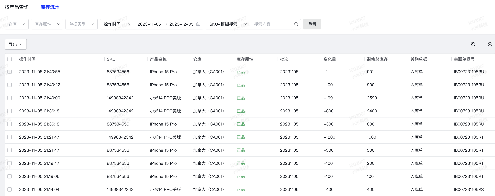

库存流水中的批次

  
  

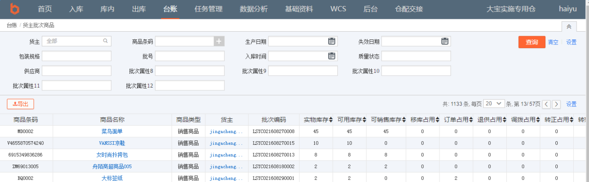

库存中的批次

  
**什么是批次属性**  
通过上面的小案例，我们知道了什么是批次，也知道了在库存中会用“批次号”来区分同一个商品但是有一些细微不同特性的库存。  
那么，接下来我们就要思考一个问题？  
什么是细微不同的特性呢？怎么定义这些不同的特性呢？  
不同的采购入库单，采购的供应商不一样，所以也可以通过“供应商”来区分不同的批次。  
不同的采购入库单，采购的时间不一样，入库的时间不一样，这期间可能厂商生产的工艺可能发生了升级，所以也可以通过“入库日期”来区分不同的批次。  
相同的采购入库单，但是有一些商品在生产日期/失效日期上会有一些差异，所以也可以用“生产日期/失效日期”来区分不同的批次。  
……  
供应商，入库日期，生产日期，失效日期等这些决定了“批次号”不一样的属性，就被称之为：**批次属性**。  
仓库中的产品是和批次属性联系在一起的，批次属性是指能够区分相同商品的不同的属性。例 如：一个食品生产商可能根据食品的保质截止日期来划分（从生产日期计算）；一个服装生产商可 能根据服装面料的供应商来分批次属性。  
批次属性规则是一个表示不同商品的类似属性的集合。批次属性规则的确认是根据货主的管理 要求设置的，通常是出库时可能用来区分货物的附加信息。如果出库时不需要区分货物，一般不建 议增加过多的批次属性跟踪信息，越多的信息会对进出库操作带来更加精细的指令要求。  
货主可以用收到货的日期、批号（生产商指定的）、颜色、截止日期、生产日期等等信息来定 义批次属性。  
而批次号是 FLUX WMS 系统在收到货物时根据不同的批属性而自动产生的流水号。  
自动的批次号＝客户＋产品＋12 个标准批次属性+12 个扩展批次属性。  
只要客户、产品和 24 个批次属性内容这些信息中有一个与库存已有记录不同，系统就会生成一 个新的流水批次号表示这一系列的内容，以便同其他货物加以区分。  
由于不同客户甚至不同产品所需记录的批次属性信息各不相同，这些信息还需要记录到库存中， 并在出库操作中应用，因此系统采用批次属性代码来规划不同的属性信息记录要求，并提示用户， 不再需要人为记忆不同货主的不同要求。  
  

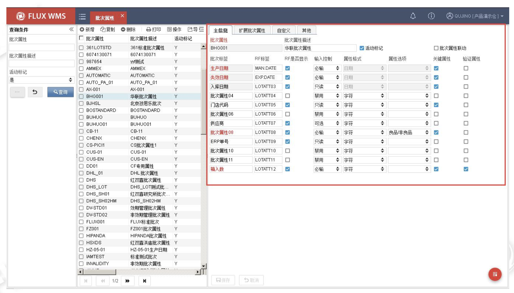

富勒的批次属性管理

  
通过上面富勒的案例，我们可以知道，当仓库收货的时候，为了区分不同的批次，可以通过配置的批次属性来控制。  
**针对同一个SKU来说，只要在收货的时候发现批次属性中有一个属性不一样，那么就会生成一个新的“批次”。**批次属性配置的越多，那么就意味着仓库的一次收货入库可能会生成很多个批次（同一个SKU），对应的就要对批次进行精细化管理，那么成本也会变得很高。所以一般的仓库，在维护批次属性的时候，不会搞太多，这样仓库在收货的时候要采集的信息也会很多，生成的批次号也会很多，不利于仓库实际的管理。  
  

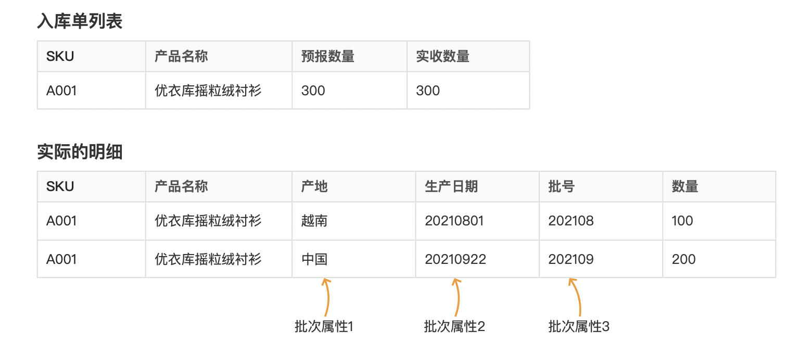

相同SKU的不同的批次属性

  
一般来说，仓库的批次属性配置中，最常用的三个是：  
1入库日期，不同的入库日期生成的批次号不一样；  
2生产日期/失效日期，一般生产日期/失效日期是只需要知道一个即可，因为可以结合“保质期天数”算出另外一个，同一个商品，有不同的生产日期，也意味着失效日期也不一样；  
3良品/不良品，由于入库收货的时候会做一些简单的质检，很多仓库也会根据库存的状态（良品/不良品）去用不同的批次号做区分；  
  

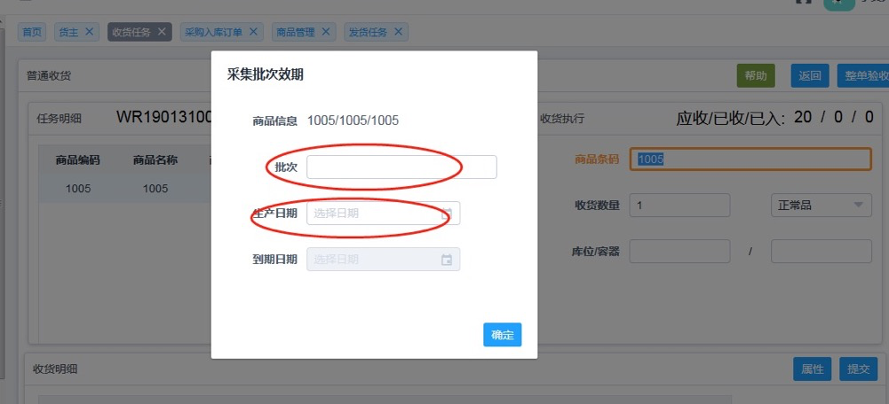

  
摘自C-WMS操作手册  
**批次和批号是区别是什么？**  
细心的朋友在看上面的“相同SKU的不同的批次属性”这张图的时候，会发现这里有一个“批号”，然后它在图里被标记为一种“批次属性”。  
于是可能就会产生一个疑问：**批次和批号听起来很像，它们是一个东西吗？**  
实际上在WMS中，批次和批号是两个不同的概念，虽然看文字实在是很像，但是如果我们换过另外一种称呼来看这两组词，就会发现还是有不一样的点。  
WMS中的批次一般称之为“内部批次号”，而批号则一般称之为“外部批号”或者“生产批号”，我们这里以“生产批号”来举例，会更加容易理解。  
“内部批次号”就是上面我们讲到的，WMS为了区分相同的商品库存但是有一些细微区别而生成的批次号，这个是WMS根据批次属性，结合自定义的编码规则生成的。字符类型，文本长度等都是自定义的，一般WMS会用“LT”或者“BN”开头，LT是“Lot”的缩写，有表示批次的意思。  
  

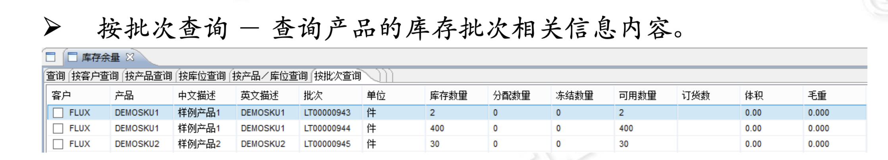

WMS的批次库存查询

  
“生产批号”是产品生产的时候在外包装上印刷的一串文本，一般以数字居多，常见于药品，保健品，化妆品等对产品质量要求有要求的行业。生产批号一般是没有条码的，往往和生产日期和有效期等字段印刷在一起，所以仓库在入库采集信息的时候，可以很方便地采集这几个字段。  
  

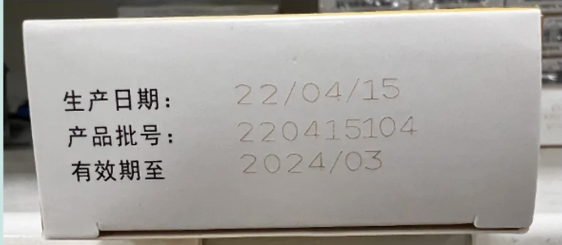

产品批号示意图

  
经过了上面的案例讲解，我们可以知道“批号”一般是指“生产批号”或者“产品批号”，它来源于产品的外包装，是生产厂家定义并赋予在实物上的。而“批次号”一般是指“内部批次号”，它一般是WMS自己根据规则生成的，是用来区分库存的一个标识字段。  
**批次管理的价值和业务场景**  
知道了什么是批次，什么是批次属性，批次和批号的区别之后，接下来我们聊聊，什么是批次管理，为什么要做批次管理。  
前面我们反复提过，批次是指相同商品的库存需要做一些细微的区分，而采用的一种管理方式。那从业务层面上看，我们为什么需要做批次管理呢？它有哪些好处和价值呢？它的应用场景又有哪些呢？  
**1****更精细化的管控需求**  
仓库在管理库存的时候，一般都是“货主+SKU”的维度，这个维度比较粗糙，不利于一些精细化的管理。所以仓库往往会采用多种库存维度的管理并行的方式，给合适的商品选择合适的管理维度才是最科学的。从管理的颗粒度上，从粗到细，依次是：  
1“货主+SKU”维度  
2“货主+SKU+批次”维度  
3“货主+SKU+批次+SN”维度  
  

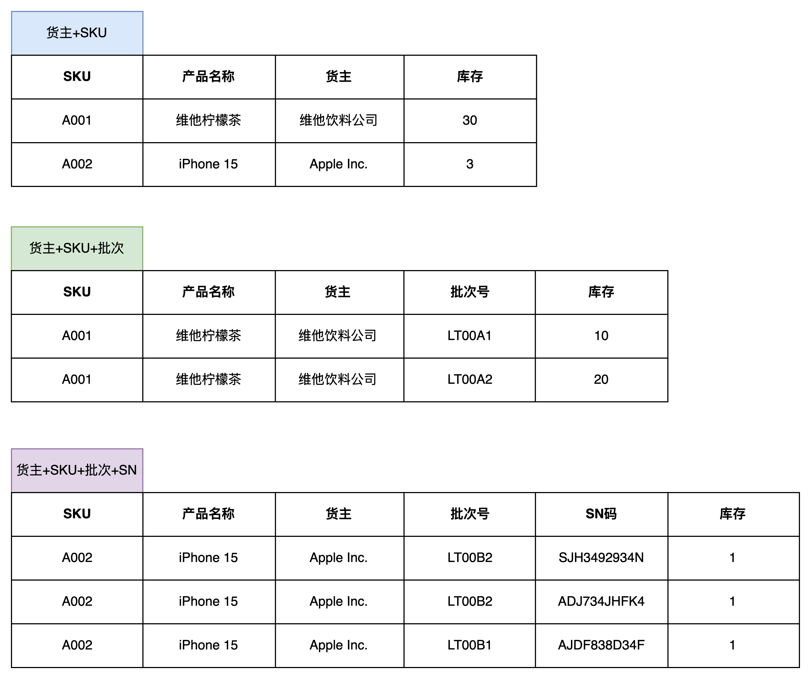

三种库存管理的粒度

  
引入批次号之后，可以将一些商品库存的附带的其他信息很好的关联上，例如说该批次对应的供应商，采购单号，采购单价，入库日期，生产/失效日期等，这些在仓库精细化作业的时候都可以发挥出相应的作用。  
**2****满足仓库“先进先出”的要求**  
一般来说，大多数仓库的库存周转策略都是会考虑“先进先出”，这是最符合大多数商品流转的实际要求的。  
但是有了批次管理之后，其实除了“先进先出”，也可以做到“先进后出”，例如说茅台酒，名贵的茶叶等，这些商品新生产的和之前生产的SKU可能都是一样的，但是生产日期不一样，旧的批次往往比新的批次更值钱，所以在出库的时候采用“先进后出”，那么剩余在仓库的这部分库存可能还会随着时间的积累而升值。  
**3****提高仓库库存的控制能力**  
通过批次管理，企业可以对货物的生产日期、保质期、供应商等信息进行精确记录和跟踪，以便于对货物的保质期进行精准的监控。例如说，可以通过批次号来跟进不同批次货物的保质期情况，避免将临近过期或者已经过期的货物发到客户手上，也可以及时将一些临近过期的货品标识预警，让业务尽快处理这些货品。  
批次管理也可以提升仓库的服务质量，通过批次管理，可以快速地查询货物的信息和状态，及时响应客户的需求，提高客户的满意度。尤其是一些客户对批次管理要求比较高的时候，可能还会有“指定外部批号出库”，“指定某个采购单批次出库”或者是“指定某个供应商的批次出库”场景，这个时候批次管理就可以很好地满足这一类需求。  
**4****追溯的价值**  
我们偶尔会听过一些“汽车召回”，“手机召回”，“XX产品召回”的案例，在这种召回案例中，一般不会把所有的产品都召回，而是会指明“某某时间段生产的产品”，“某某产地生产的产品”，“某某批次的产品”。  
所以，批次号很核心的一个作用就是用来“追溯”。如果是根据“SKU”维度去召回，那么涉及到的SKU数量太多了；如果是根据“SKU+SN”的维度，那么SN（序列号）精确到PCS，就太精细化了，成本很高；这个时候使用“SKU+批次号”就比较合适，因为批次号往往就是代表这一批商品具有一些相同的特性，例如都是同一个工厂生产，同一个时间段生产的，同一个种生产工艺等。  
大家在日常购买药物的时候可以看药品的包装盒，一般都会有相关的“生产批号”，它很重要的一个价值就是用来溯源。当发生一些召回事件或者基于质量追溯的需要时，就可以通过“生产批号”来帮助定位产品的流向。  
**WMS的批次号和库龄“无直接关系”**  
库龄是指仓库中的货物在仓库中存放的时间，一般是用天来统计。  
之前我一直认为库龄和批次号是必然的关系，如果要统计库龄那么就一定要先生成批次号。例如在入库上架的时候，根据上架日期生成批次号，然后和仓位关联，批次库存就会增加；在出库的时候，再根据库位的信息带出批次号，然后扣减对应的批次库存。这样一增一减之后，批次会动态的变化，然后每日固定一个时间点去统计当前的批次库存，最后就可以算不同的批次的库龄是多少了。  
这个方案是对的，可行的。但是我的理解太狭隘了，为了实现不同时期入库上架的商品有不同的库龄，**不一定非要引入批次号，只需要记录入库/上架日期即可**。  
将上架日期看做是一个和批次号同级别的字段，每次上架和下架的时候都对应的增加或扣减，也能达到计算库龄目的。  
  

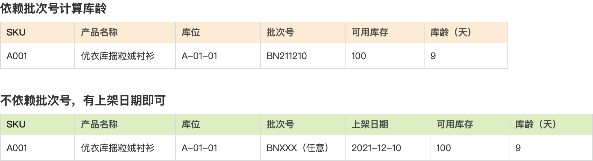

  
引入「上架日期」  
也就是说：**上架日期不等同于批次号。**  
而之所以我说之前的方案是对的，是因为在WMS的**批次属性**中，经常会把入库日期或者上架日期当作一个系统预设的批次属性。所以在误打误撞之间，按上架日期来生成批次号，也实现了计算库龄的作用。  
仓库启用了批次管理之后，再去做相关的库龄统计就比较简单了，只需要在“批次号”的维度上关联入库/上架日期，这样就可以知道某个SKU的不同批次分别入库/上架增加库存的时间，然后再根据统计的时间去扣减即可得出批次在库的库龄。  
P.S：有一些WMS是入库的时候增加库存，同时生成批次号。而有一些WMS则是上架增加库存，再生成批次号。所以批次记录表中的关联信息可能有些时候会取入库日期，有些时候会取上架日期。  
  

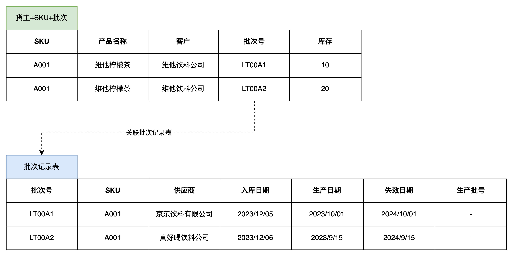

批次库存和批次记录表的关系

  
**WMS批次设计中的一些细节**  
之前第一次做WMS的批次产品设计的时候，由于业务设计的比较简单，再加上自己对WMS的批次了解也不是很深，所以我还踩了不少坑。这些坑都是因为对相关业务知识的掌握不够深，理解的不够透彻，还有一些是被竞品带偏了，接下来我就稍微总结一下设计中要注意的细节。  
**1****不要直接用日期格式去做批次号**  
第一次做WMS的批次管理的时候，因为没什么经验，对批次号的理解也比较浅层，所以我就用上架日期去做批次号，同时也没有把批次号单独用一个关联表记录起来，而是直接把批次号挂在了库存的上。  
  

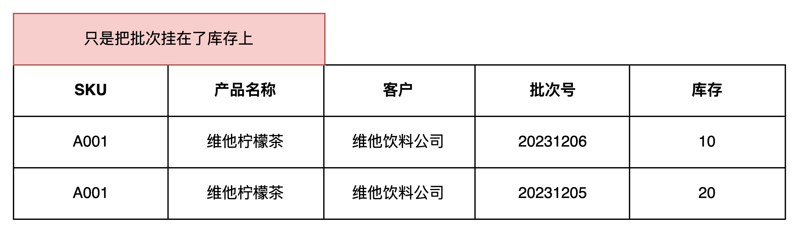

  
当我想要做先进先出的时候，我就先定位到SKU，然后通过批次号的编码格式去做排序，找到更早（更小）的批次号。例如上图“20231206”就是大于“20231205”，所以如果要先进先出，则应该先出“20231205”这个批次的库存。  
这种方案的设计是最简单的，但是也非常容易踩坑，例如有一次我们因为某个原因要调整“批次号”的编码规则，我们把编码规则变成了“BN+YYYYMMDD+001”递增这种方式，结果系统就出现了不同规则的批次号。  
  

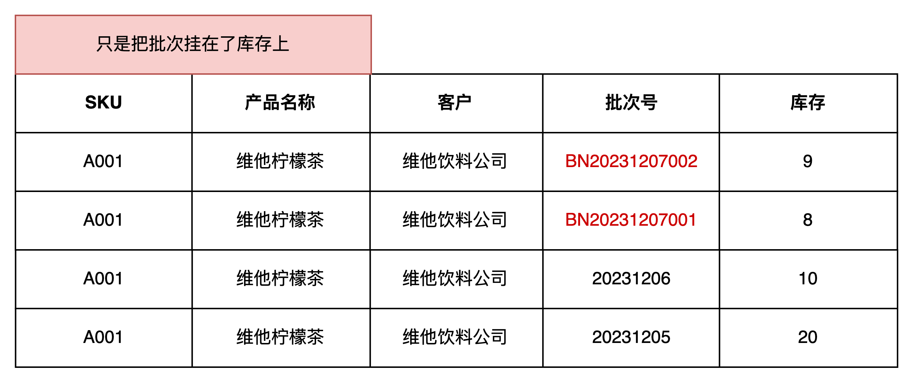

  
当系统需要去做先进先出的时候，这个时候用批次号去排序比较就会出现问题，因为编码规则不一样了，排序的逻辑也错乱了……  
这是我在批次管理上踩过的第一坑，当时为了修复这些数据，花费了非常多的时间，真的让我记忆犹新。惨痛的教训也让我意识到了：**批次号一定是要单独关联自己的一些信息，例如说创建时间，不能直接用批次号本身去排序比较大小，这样去做先进先出一定是会出问题的。**  
**2****为每个商品的不同批次定义不同的批次号**  
之前为了简单化处理批次号，我都会用最简单的批次号生成规则，即“LT+YYYYMMDD”的方式去生成批次号。只要是同一天上架的商品，它们的批次号都是一样的，即使SKU不同，也是会有相同的批次号。  
  

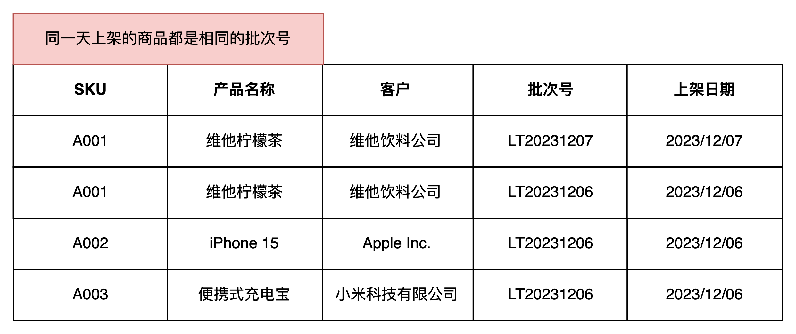

  
这种设计方案，如果只是用来做“先进先出”，“统计批次库龄”那么问题不是很大，因为同一天入库上架的商品，它们的批次号相同，上架日期也相同，在做先进先出和统计批次库龄的时候完全可以满足，而且批次号生成还比较简单清爽，不会给用户造成太多的困扰。  
但是这种方式也有一个比较大的弊端，那就是通过“批次号”去反查一些附带的信息时就会出现很多条信息，可能是相同的SKU，也可能是不同的SKU，这样在需要批次溯源或者其他精细化的批次管理的时候就会造成困扰。  
所以，我个人踩坑之后得出的结论是：**建议为每个商品的不同批次定义不同的批次号。**  
  

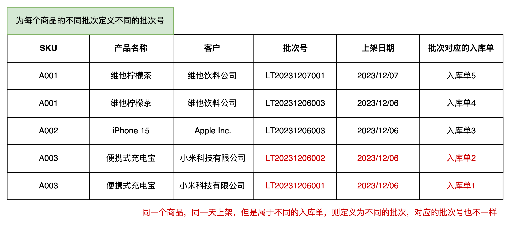

  
**3****批次号单独用批次记录表管理**  
基于上面第1个踩坑的设计，我个人建议一定是要单独用一个批次记录表去存储批次号相关的内容，而不是把批次号只关联在库存表上，最后的关联关系是这样的。  
  

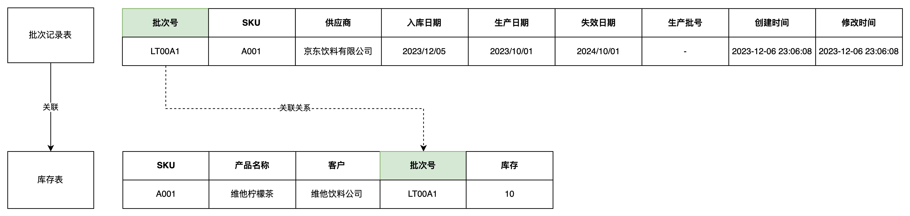

  
有了批次记录表之后，就可以知道这个批次的创建时间和修改时间，还有批次管理的一些批次属性等。  
如果是要参考富勒的批次属性配置的玩法，那么对应的还会有“批次属性配置表”，然后它们的关系会变成如下图所示：  
  

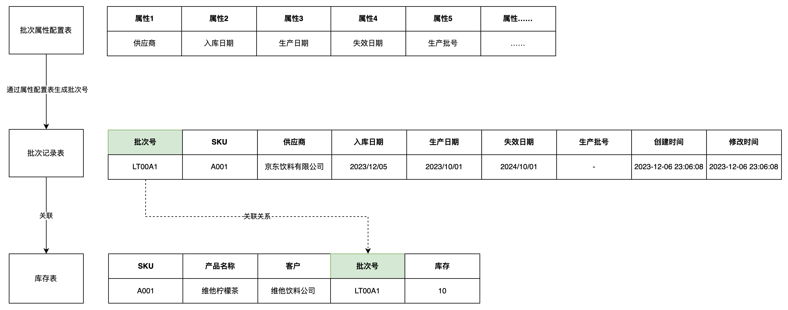

  
**4****海外仓不需要太复杂的批次属性配置**  
货主可以用收到货的日期、批号（生产商指定的）、颜色、截止日期、生产日期等等信息来定义批次属性。  
而批次号是 FLUX WMS 系统在收到货物时根据不同的批属性而自动产生的流水号。  
自动的批次号＝客户＋产品＋12 个标准批次属性+12 个扩展批次属性。  
只要客户、产品和 24 个批次属性内容这些信息中有一个与库存已有记录不同，系统就会生成一 个新的流水批次号表示这一系列的内容，以便同其他货物加以区分。  
  

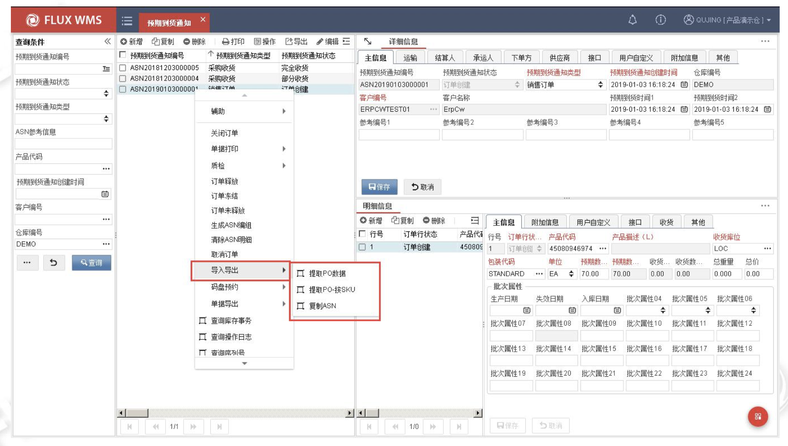

  
富勒的批次属性配置表太丰富了，最多可以支持24个批次属性。批次属性越丰富，意味着批次管理的维度就越精细，同时也意味着系统设计的难度更大，用户使用和学习的成本也越高。  
对于海外仓来说，一般用到最多的批次属性就是：  
1入库日期/上架日期，不同日期入库的商品是不同的批次，可以用来统计批次的库龄，计算仓租；  
2生产日期/失效日期，针对一些需要效期管理的商品，可以用效期的字段来区分不同的批次，便于后续的效期管理业务；  
其他的基本上就很少用到了，所以如果是为了高效率的设计海外仓WMS的批次，我建议可以引入“批次属性配置”这个模块，但是不要搞太多的“批次属性”，降低用户的理解和学习成本，同时也是结合实际业务做一些产品设计上的减法。  
**毕竟，不是越复杂的产品就越好，而是越合适的产品才是越好的。**