对于海外仓来说，除了满足货物最基本的出入库需求之外，还会接到很多相关的特有场景化的需求，这些场景一般和货主的业务模式有关系，和货主的商品类型和管理要求也有关系。本文就来拆解一下，海外仓针对“商品的效期”和“商品的唯一码”是怎么管理的，对应的WMS应该设计哪些业务管理流程和功能模块才能支撑相关的业务。  
**一、什么是唯一码管理？**  
唯一码管理是指货品在仓库的流转过程中，需要记录每件货品单独的唯一编码，与相应的单据关联，以便于打通一些增值业务。唯一码管理功能不算太复杂，但是仓库实操的成本比较高，收益可能并不太显著，所以并非所有的仓库都有此功能，算是WMS的一项可选的增值服务。WMS唯一码管理的用途和意义一般有以下几种：  
1方便售后，对于一些高价值类的货物，用户发起售后之后，可以用唯一码来判断货物的销售渠道（是从平台A还是平台B），避免以次充好，诈骗商家；  
2防止串货，有一些货物会有限定的销售区域，不同的唯一码对应的可销售的区域不同，用来限制经销商在不同区域乱出货，扰乱市场（国内的OPPO和VIVO就有这样的制度）；  
3异常追溯，当某些货物出现异常或者问题的时候，通过唯一码来确认工厂生产的批次或对应的采购渠道等，方便定位问题，追查异常；  
常见的唯一码一般在3C电子数码产品上用的很多，例如说序列号（Serial No.）或者是IMEI，唯一溯源码等都可以算作是唯一码。  
  

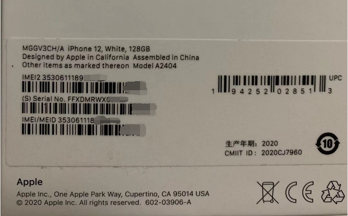

iPhone12的包装盒背面序列号

  
一般来说，海外仓记录唯一码主要是用于售后服务跟踪，防止以次充好，欺诈售后。  
例如从eBay买了一个有问题的14天机，然后从Amazon买一个新机器，再将有问题的14天机器退回Amazon，要求退款。如果Amazon没有办法证明此手机是从FBA仓库发出的，那么可能说不清到底是发的机器有问题还是用户在欺诈商家。  
**二、唯一码管理的几个特殊点**  
从本质上来讲，唯一码管理就是在货品SKU的粒度上，再对货品进一步细化，逐个记录唯一码，所以只需要在入库和出库环节分别记录并对应上即可。但是由于实际的业务场景的变化，有些操作并不能如理想环境中那般行得通，从我的实际经历来看，一般有以下几个特殊点需要特别注意。  
**特殊点一：各个仓库的策略不同**  
一般来说海外仓系统都是会分布多个站点，布局在不同的国家或者地区，这就导致了有很多操作需要因地制宜做定制化。例如有些地区的仓库，人工费用极高，如果是要在入库的时候逐个扫描PCS数，那么费用就很贵。客户不太愿意承受这么高的报价，但是又想要用唯一码管理的功能。所以业务方就会希望系统能在这方面开个口子，做一些灵活性的调整，所以就导致各个仓库的策略就会有所不同。例如同一个客户的货物，在A仓可能需要入库扫描，出库也扫描；但是在B仓，因为费用的问题，入库不扫描，只是出库扫描。或者在C仓扫描的时候只是记录唯一码，而在D仓的时候则需要校验严格的格式。在设计系统流程、方案的时候，一定要考虑仓库不同带来的策略不同这个点，做到提前心里有数。  
  

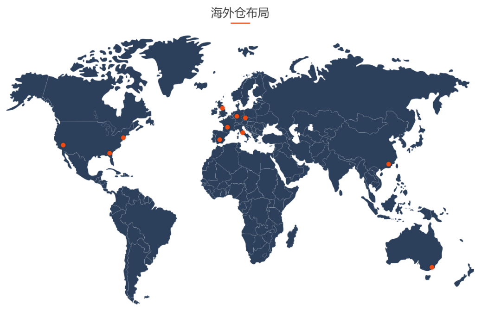

截图自谷仓官网

  
**特殊点二：产品类型不同扫描方式也不同**  
如果需要唯一码管理的产品肯定会在产品外包装上印刷对应的可扫描的唯一码，如果仓库的管理策略上启用唯一码管理，那么在入库收货，出库复核的时候库的时候需要逐个扫描。对于海外仓库来说，人工成本是需要特别关注，精打细算的。如果逐个扫描，那么收货时间就会很长，需要花费特别久的时间。但是客户又希望能做到扫描唯一码，需要这些数据用来做售后服务。  
于是业务方就想出了与逐PCS扫描所不同的扫描方式，即：**批量扫描**。例如3C类产品（手机），一箱一共有10PCS或者20PCS，如果打板到仓，那么逐件扫描，则需要拆板，拆箱，费时费力。解决方案是，工厂出厂的时候可以将一整箱的唯一码做成一个二维码，然后张贴在外箱上。在收货的时候可以逐箱清点，扫描的时候也可以直接扫描外箱的二维码，一次带出整箱所有的唯一码，效率翻番。  
所以如果是标准化的产品需要做唯一码管理，则可以把箱子内的唯一码合并成外箱二维码，这样仓库就可以批量扫描，效率提升很多；而非标准化的产品则需要拆箱，逐个扫描，效率低下，要尽量避免。  
**特殊点三：唯一码的格式千奇百怪**  
需要唯一码管理的产品，一般产品本身会带有出厂时预设好的IMEI或SN码（Serial No.） ，但是因为有些产品的包装盒在设计之初，没有考虑到仓库实际作业的场景，导致背面有多个条码，很容易扫描错误。例如下图中的魅族的手机包装盒背面，有5个可扫描的条码，除了右侧的EAN码（69码）比较容易扫描之外，剩下的4个码，排列在一起，很容易扫描错误。  
  

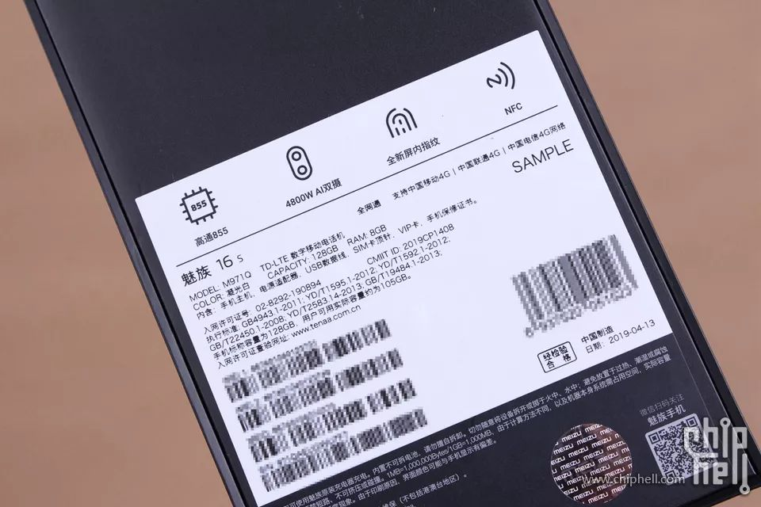

  
如果唯一码的扫描策略没有开启校验格式和长度，那么扫描错了系统也不会报错，可能扫描的码并不是唯一的，后续再想要追查数据就比较难了。所以为了避免类似问题，同时也防止仓库作业的时候出错，一般会开启对唯一码的格式校验的策略，而格式校验规则取决于客户的唯一码格式。  
有些客户是用IMEI，有些客户是自己自定义的SN，还有一些可能是奇奇怪怪的码。针对上述情况，我之前在唯一码管理上改了好几次版，最后采用了下图的这种校验策略的配置。优势是可以精确化配置到单独的SKU，支持多种场景；劣势就是配置比较繁琐，得要逐个商品都提前维护好相应的策略，后续的作业才能顺畅。  
  

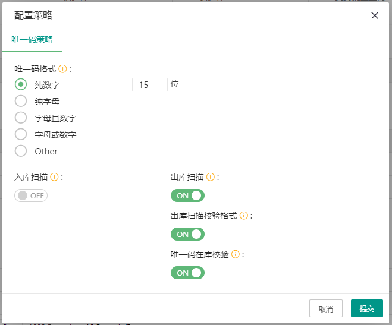

唯一码策略配置

  
**三、唯一码管理的流程**  
WMS中的唯一码管理一般分为以下几个大流程：  
1OMS创建货品的时候开启唯一码管理，且在WMS中配置唯一码的校验策略（也可以将策略配置会放在上游的OMS中）；  
2在WMS入库收货的时候，判断货品是否开启了唯一码管理且需要入库扫描。如果是，则清点数量时候逐个扫描货品上的唯一码，扫描的时候再根据校验策略进行判断；  
3在订单出库复核的时候，判断货品是否开启了唯一码管理且需要出库扫描。如果是，则需要逐个扫描订单中的货品上的唯一码，扫描的时候再根据校验策略进行判断；  
4在订单发起退件的时候，仓库收到了退件单，在扫描货品的时候也需要根据货品的唯一码管理策略来判断是否需要扫描唯一码。如果需要扫描，再与出库订单的关联唯一码进行匹配，判断唯一码是否正确；  
  

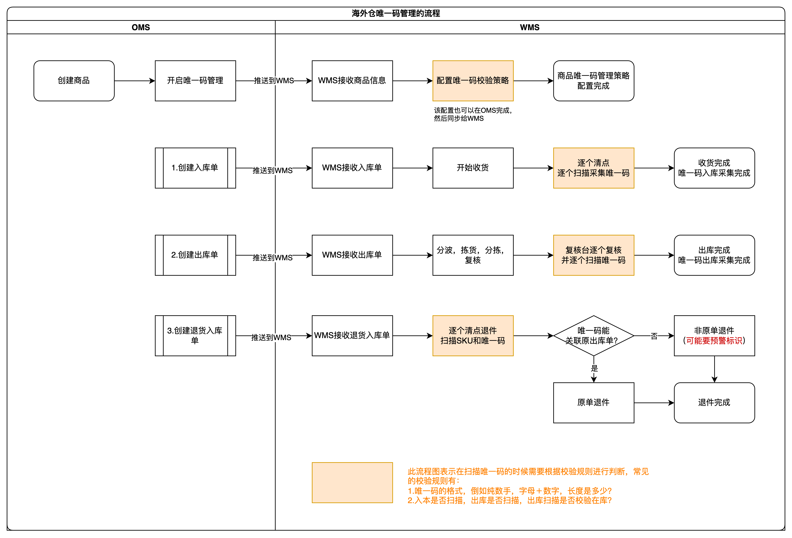

海外仓唯一码管理的流程图

  
海外仓的唯一码管理一般不会做到“按唯一码出库”这种粒度，因为普通的唯一码管理成本已经算高，如果要精确到指定唯一码出库，一方面需要对上游系统打通，另外一方面也对仓库的管理要求很高，成本特别高。  
**所以一般的唯一码管理的粒度就是做到出入库记录唯一码，到时候退货的时候可以用唯一码关联对应上原出库订单即可。**  
一般来说，如果开启了唯一码管理，那么后期客户不需要对唯一码管理了，则可以关闭唯一码管理，把某些SKU当成普货来处理。但是如果关闭了唯一码管理之后，再次开启的时候，则需要考虑做相应的限制了。在库的一些产品可能因为之前关闭了唯一码管理，所以没有扫描记录唯一码，而如果又开启了唯一码管理，则出库扫描的时候，触发【唯一码在库校验】则会报错。  
开启后又关闭一般问题不大，但是如果之前有历史数据的情况下，关闭后又要开启，那就容易导致数据错乱，一定要提前做好限制，避免后续雪球越滚越大。  
如果所有的仓库对某个SKU的管理策略都是一样的，那么这条管理策略可以放在OMS上来维护，然后同步给所有的仓库端，这种做法最简单，而且也把一些维护的工作量转移给了货主端。但是如果不同的仓库对同一个SKU的管理策略不一样，那么这条管理策略就只能分别存放在不同的仓库端WMS里面了。  
这意味着，用户开启了唯一码管理策略之后，如果不同的仓库有不同的策略，还需要联系相关业务人员单独在不同的WMS中配置不同的策略。从实际的作业情况来看，很多时候业务人员会忘记提前配置好WMS的唯一码策略，导致仓库作业的时候报错后才发现。为了避免此类问题频繁发生，建议前期尽量标准化货品审核流程，新品引入流程等，多培训相关的业务人员，做好走查表，避免遗漏。  
唯一码管理在退货场景下的使用也很高频，一般来说如果不是唯一码管理的产品，在退件收货的时候，只需要核对SKU正确，数量正确即可。但如果是唯一码管理的产品，在退件的流程上会比较繁琐，因为需要逐个扫描唯一码，然后判断唯一码与出库订单的关联关系。  
此时需要确保SKU正确，唯一码正确，数量正确。  
如果有唯一码不正确的情况下，还需要考虑部分正确的是否可以先上架还是要等到所有的异常都被审核处理了之后再上架。这一系列操作都会导致退件的处理流程被切割得很琐碎，再加上海外仓还有时差、语言、文化等方面的制约，导致退件的处理成本居高不下。很多电商卖家对售后的成本无可奈何，为了保持品牌口碑，维持用户体验，会选择以换代修或者有问题的产品干脆直接再重新补发一个。**所以在设计退货流程的时候，要考虑针对唯一码产品的退货设计一条单独的业务流，确保这些商品的退件处理效率不会被其他普货给影响了**。  
**四、什么是效期管理？**  
**五、效期管理的流程**  
WMS中的效期管理一般分为以下几个大流程：  
1创建货品的时候开启效期管理，这样货品信息流转到下游系统的时候，可以根据这个配置来区分普货和效期货；  
2在WMS入库收货的时候，如果是开启了效期管理的货品，则需要逐个检查效期信息是否一致，然后在收货的时候要录入数量和对应的效期信息。一般来说，一次性到货的产品效期信息都是一样的，但是也有可能有不同的效期，如果有不同的效期则需要想办法区分收货，然后分别录入不同的效期信息进去；  
3收货录入的效期信息的SKU，在上架的时候要记录跟踪对应的库位，同一个库位不允许放相同SKU但是效期信息不同的货品。所以在入库上架的时候，往往会对SKU生成一个入库批次，一个批次的SKU上架到一个库位或者多个库位，后续这些库位就不能上相同的SKU但是效期不同的批次了；如果仓库库位比较紧张，也可以考虑同库位混放不同的SKU，这样可以大大地节省仓库端的空间资源；  
4效期信息会记录在批次属性表中，也就是和批次号关联，然后再用商品的批次号和库位关系绑定。在出库分波要推荐库位的时候，就可以根据相关的库存周转策略（先进先出、临期先出）去推荐相应的库位；  
5系统在策略的配置上要形成闭环，这样才能保证数据不会混乱。例如上架的时候同库位要禁止混放同SKU但效期不同的货物，这样才能确保拣货的时候可以做到一一对应。推荐使用“批次属性”管理的方式，为不同效期，不同时期入库的商品SKU都分配不同的批次号，这样在库位混放的时候直接校验批次号是否一致即可；  
  

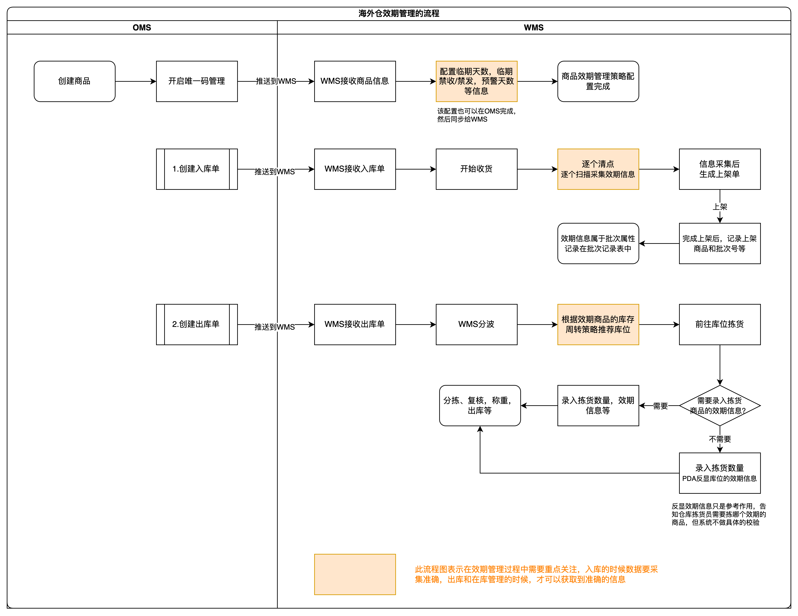

海外仓效期管理的流程图

  
海外仓的效期管理也受限于成本和时效的问题，之前我做效期管理的时候，没有在拣货的时候反显出要拣货的SKU的效期信息，更没有要求拣货员录入拣货商品的效期信息。这种方案比较简单粗暴，但还是有一定的风险性，很容易误操作。所以我建议，如果考虑成本和作业效率的因素，那么**最起码还是要在PDA上显示一下拣货的商品效期信息，让拣货员可以对比参考一下**。如果有条件，有资源的话建议做得严格一些，在拣货的时候都需要录入效期信息，这样系统校验一下就可以确保拣货的商品和推荐的商品的一致的，就不会发错货物了。同时仓库日常管理也需要严谨一些，定期的盘点，排查，把临期商品尽快转移到“临期处理区”。  
**六、效期管理的难点和踩坑点**  
效期管理比唯一码管理要稍微复杂一些，一方面是业务流程闭环比唯一码要长，唯一码更多的是记录和订单的关系，而效期管理则涉及到比较精细的批次和库位的对应关系等，另外一方面是效期信息没有唯一码信息那么标准化，没有固定条码可扫描，无形中就增加了许多复杂度。还有一方面就是效期管理对仓库运营管理的要求也比较高，因为效期产品的发货是比较严谨的，不允许出大错的。  
**难点一：效期信息识别率低**  
效期管理其实本质上也是批次管理，但是商品实物上没有批次号，只是含有一些不规则的效期信息而已，这对仓库的实际作业会带来很多的困难，增加很多成本。从实际的业务场景来看，效期信息其实并不太好识别。比如我们生活中经常会发现要找一个产品是否过期了，要翻看整个产品的四周，花费不小的力气才能找到过期时间。而仓库中这样的产品有很多品类，不同的品类效期信息放的位置不一样，而且表达形式也不一样（英式日期，美式日期，还有一些日期缩写等），甚至一些产品只有生产日期和保质期，需要自己手动计算失效日期是什么时候……  
  

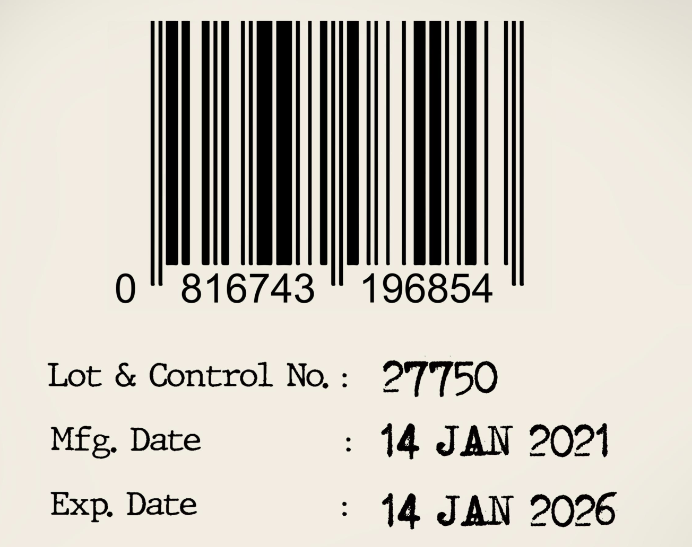

  
  

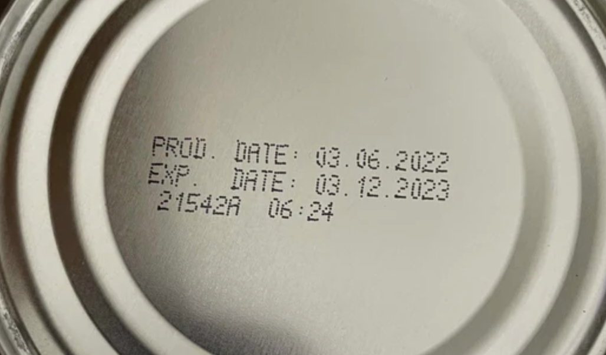

  
**难点二：效期产品容错率低**  
效期产品往往都是一些受时间影响而呈现出严重的“两极分化”影响的产品，在保质期内的产品大家可以接受，但是超过了保质期甚至是临近失效期，那么用户接受度就直线下降。所以对于效期产品来说，库存的周转率要求更高，同时对系统的严谨性要求也更高。  
前些年，海外仓普遍管理比较混乱，错发，漏发，被用户投诉的事情时有发生，而效期产品即使没有错发，但是发的货物效期不对，也会给商家带来不小的麻烦。仓库对管理效期产品的容错率很低，基本上不允许犯错，一旦犯错，面临的赔偿和损失就很大。  
对于产品经理而言，在产品规划设计的时候要考虑更加周全的场景，同时也要融入一些容错机制，例如临期禁发功能，设定一个安全时间区域，距离产品过期还有2个月的时候就禁止发货，然后仓库定期去盘点这些即将过期的产品，确保系统数据的准确性，以及不发临期或过期的产品给用户。  
**难点三：依旧是成本问题**  
海外仓的人工成本高昂是一个永远逃不开的话题，所以在设计一些系统功能的时候，往往会更加倾向于“宁愿麻烦所有人，也不要麻烦仓库”的原则。  
效期产品与普货产品相比，在收货的时候多了检查效期信息和录入效期信息的步骤，在上架的时候多了禁止库位混放的限制，在拣货的时候多了必须强制使用系统推荐的库位的要求，在库内管理的时候多了一些临效期产品处理和盘盈盘亏亏的特殊处理，在退货入库的时候多了对效期是否有效的判断逻辑……  
这些多出来的步骤和环节，其实最后都会反馈到成本上。所以我在主导效期功能的研发过程中，砍掉了很多初稿设计时的复杂功能，砍掉了很多为防备一些异常情况而做的应急方案，因为成本是设计海外仓系统必须要时刻重视的一个因素。  
有些WMS功能做得很简洁，新用户初次使用的时候会发现很舒服，简单易用好上手；而一些WMS功能做得很复杂，走一步卡一步，新人需要专业的实施工程师培训好多次才能上手摸透。**不能说简洁的WMS就一定好用，因为业务决定了系统的复杂度，过于简单的系统支撑不了那么多业务，最终也没法使用**。也不能说复杂的WMS就一定不好用，随着业务的增长，人力成本的增加，一些刻板的规矩可能反而更能提升作业的效率。  
**踩坑点一：非必填的失效日期**  
最开始设计效期功能的时候，我们需要在OMS端创建货品的时候开启效期管理（标记此货品为效期产品），然后在创建入库单的时候要求客户填写效期信息（生产日期非必填，失效日期必填），因为这样在仓库端WMS收到货物的时候可以根据预报的信息来核对实物是否相符，最后确定是否要收货。  
入库的时候要求必填失效日期，这个想法是正确的，但却是不方便执行的。最大的原因就是上面提到的人工成本的问题，以及我对上游客户端不熟悉的问题。人工成本是因为海外仓库收货的时候不太有那么多时间逐个去清点，比对实物是否和预报的一致，他们更希望能直接从一些外箱上直接看到信息，然后就录入到系统。  
上游客户端不熟悉是因为我当时以为所有的上游系统，自己要做效期产品的业务，那么肯定知道自己采购的（发往仓库的）这一批货物的效期信息分别是什么。但是实际上并非如此，海外仓卖家供应链管理能力有高有低，鱼龙混杂，哪怕是一个生产日期和失效日期，他们也并非都知道，反而是寄希望于仓库端帮忙录入，然后反馈给他们，然后再用这个数据去和供应商核对。基于上述两点，OMS创建入库单必填失效日期的功能，在版本即将上线前又紧急调整了一波，由必填改成了非必填，这算是踩过的很印象深刻的一个坑了。  
**踩坑点二：容易弄混的逻辑关系**  
一般来说，为了区分入库的先后顺序，仓库都会对不同的时期入库的SKU标记一个批次号，这样便于后续出库的时候可以按照先进先出的规则执行。同一个入库单下的同一个SKU，如果一起完成了收货上架，那么批次号应该是一样的。这一批的SKU可以放在同一个库位上，便于后续拣货的时候集中拿货。  
但是如果这批SKU加上了效期信息，则收货或者上架生成批次号的时候要判断此批次下的SKU是否都具有相同的效期信息，如果有不同的效期信息，则批次号不能相同。  
也就是说当“批次属性”不一样的时候，哪怕是同一批入库的相同商品，也需要分配不同的批次号。  
  

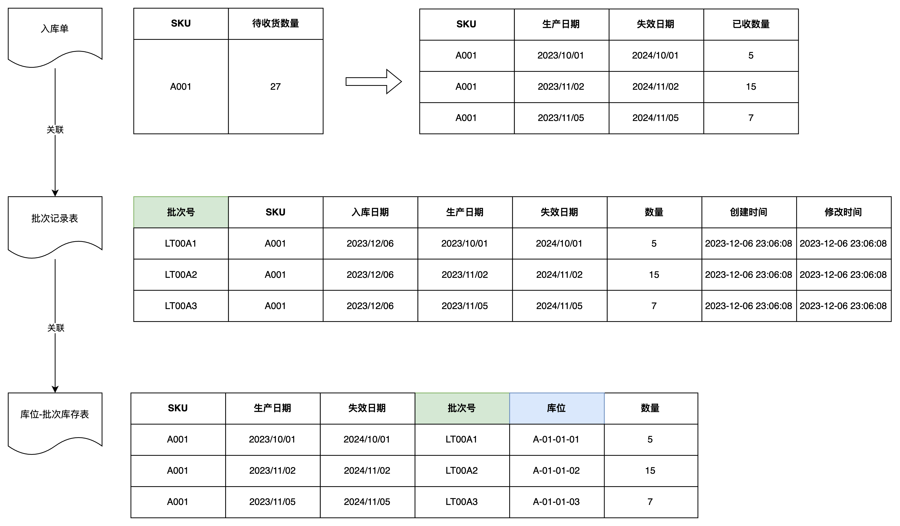

效期商品的入库单和库位库存关系

  
上述关系如果没有搞清楚，则很容易踩坑，再加上一些库位属性和库位逻辑，就更加容易弄混了。  
**踩坑点三：库存周转的规则**  
库存周转规则是出货时所考虑的产品周转排序。通常来讲，仓库在出库时货主经常会有指定的 出库要求，例如某个产品要求发货指定的生产批号，或者指定的供应商的货物。但符合要求的货物 很可能不止一个批次，或者货主没有指定具体的要求，此时就需要利用到库存周转规则，对符合要求的货物进行排序，然后按一定顺序出库。  
通常所说的产品先进先出（FIFO），就是一种常见的库存周转规则。库存周转规则是用于库存分配环节的。在产品出库操作中，每一次分配都会利用到库存周转规 则中的设置。  
  

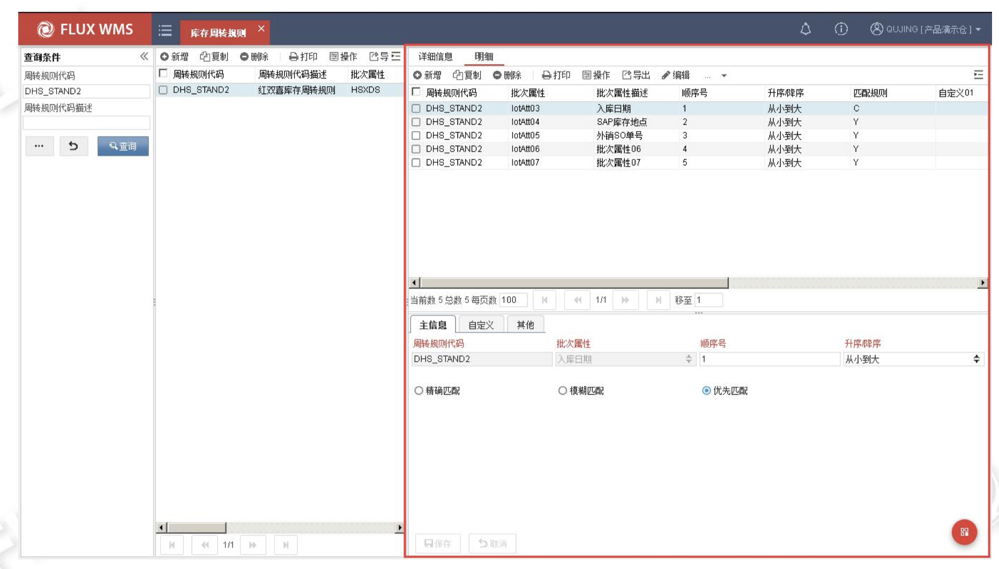

富勒库存周转规则

  
对于海外仓的效期商品管理来说，库存周转规则比较简单，一般来说就是遵循“临期先出”。也就是快要过期的批次先推荐拣货出库，而效期比较长，没那么快过期的就后面出库。  
所以，在分波的时候进行库位推荐的时候，当确定了要分配什么商品之后，接下来就要根据“批次属性”中的“失效日期”来判断商品最先出的批次号是什么，接着再考虑对应的库位是否有多个，要选择哪个。  
  

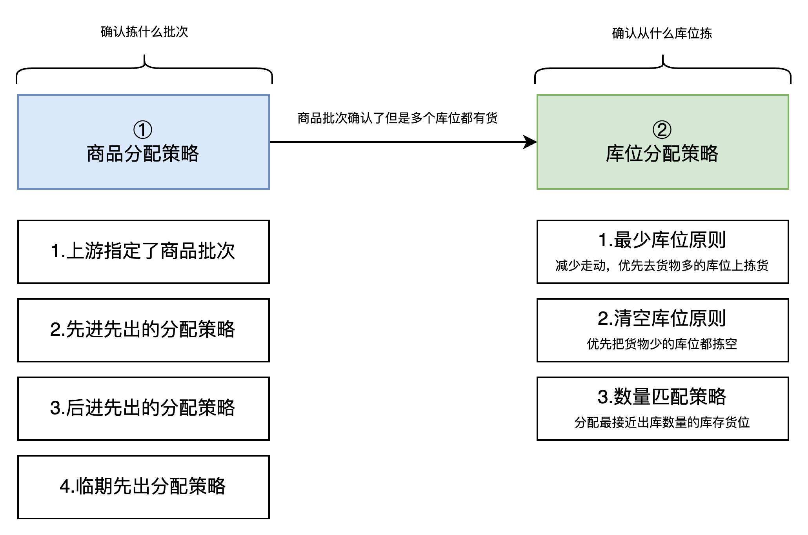

拣货推荐的逻辑

  
例如下图中的同一个商品有三个不同的批次，按照“临期先出”的规则，LT00A1这个批次的失效日期是最小的，也就是最先到期，所以要先出LT00A1这个批次，这个批次放在库位A-01-01-01上，一共有5个库存；如果出库数量大于5个，则再推荐下一个先到期的批次，也就是LT001A2，以此类推，直到拣货数量是足够满足出库单的。  
  

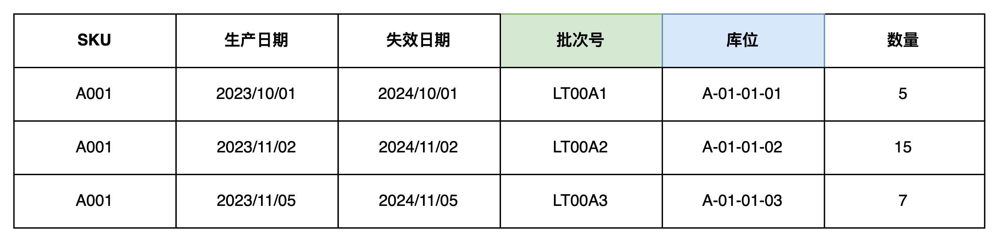

  
同一个商品的不同的批次  
**七、总结**  
本文讲解了海外仓WMS的唯一码管理和效期管理两个知识点，其中唯一码管理相对来说更简单一些，所以相关的产品设计细节就没讲太多；而效期管理则复杂多了，于是产品设计细节和难点、踩坑点就稍微讲解的更细节一些。  
针对唯一码管理来说，核心思路就是要把握：**什么时候去采集唯一码，唯一码在采集过程中可能会遇到什么困难，同时也要将唯一码作为最小化库存粒度给记录起来。**  
唯一码管理虽然没有特别高深的逻辑，但是做起来也还是有一定的复杂度，容易踩坑。而踩坑的点，主要体现在兼容不同的客户需求和多个仓库间的操作需求，同时还要保证系统的灵活性和可拓展性。海外仓WMS的需求特点就是需要兼容三方的利益，仓库方，公司方和客户方，甚至有时候还需要兼容供应商或代理商的利益。  
在多方的压力之下，产品方案的设计很难保证十全十美，更多的是体现出某种决策的偏好，例如是偏向用户，还是偏向仓库或者是偏向公司。当出现决策偏好之后，也就意味着要做好心理准备「得罪」某些相关方。  
针对效期管理而言，其本质的内核还是：**WMS的批次属性管理。包含怎么去定义批次属性，怎么生成批次号，批次号在WMS中是怎么串联出入库业务的**。  
关于WMS批次属性在上一篇文章中已经详细讲解过了，理解了批次属性的意义，也就能理解效期管理中的一些业务流程和产品设计方案了。

[4.8 海外仓WMS的批次管理介绍](https://www.yuque.com/jiaowovitamin/dgugdp/pywkhlppgbpr169c)

  
效期管理的功能应该算是WMS系统设计中属于中上难度的，很多业务逻辑和细节需要注意，而且又因为海外仓的管理水平普遍比国内电商仓库差很多，所以实际实施执行起来的时候还是存在很多问题。这也是海外仓WMS很少有人做效期管理的原因之一。