## 金蝶云·星辰进销存云解决方案

## CONTENTS

第一部分 

整体介绍 

第二部分 

采购管理 

第三部分 

销售管理 

第四部分 

库存管理 

## 整体介绍

• 第一部分 

基础数据业 

用户权限管理 

采购管理 

采购订单管理 

收、退货管理 

采购结算 

出入库管理 

库存管理 

盘点管理 

存货核算管理 

调拨管理 

销售管理 

销售订单管理 

发、退货管理 

销售结算 

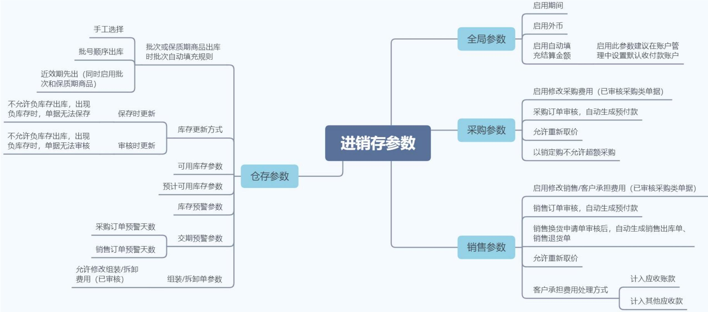

## 采购管理

• 第二部分 

<table><tr><td></td><td>金蝶云·星辰标准版</td><td>金蝶云·星辰专业版</td><td>金蝶云·星辰标准版(金蝶云APP)</td><td>金蝶云·星辰专业版(金蝶云APP)</td><td>备注</td></tr><tr><td>以销定购</td><td>√</td><td>√</td><td>×</td><td>×</td><td></td></tr><tr><td>智能补货</td><td>√</td><td>√</td><td>×</td><td>×</td><td></td></tr><tr><td>采购价格记忆</td><td>√</td><td>√</td><td>√</td><td>√</td><td></td></tr><tr><td>采购费用分摊商品成本</td><td>√</td><td>√</td><td>×</td><td>×</td><td></td></tr><tr><td>采购发票登记</td><td>√</td><td>√</td><td>×</td><td>×</td><td></td></tr><tr><td>采购退货</td><td>√</td><td>√</td><td>√</td><td>√</td><td></td></tr><tr><td>多维采购报表</td><td>√</td><td>√</td><td>√</td><td>√</td><td></td></tr><tr><td>供应商价格策略</td><td>√</td><td>√</td><td>√</td><td>√</td><td></td></tr><tr><td>合并入库</td><td>√</td><td>√</td><td>×</td><td>×</td><td></td></tr><tr><td>预付款抵扣</td><td>√</td><td>√</td><td>√</td><td>√</td><td></td></tr><tr><td>采购申请</td><td>×</td><td>√</td><td>×</td><td>√</td><td></td></tr><tr><td>受托代销</td><td>×</td><td>√</td><td>×</td><td>×</td><td></td></tr><tr><td>采购订单变更</td><td>√</td><td>√</td><td>×</td><td>×</td><td></td></tr><tr><td>暂估调整</td><td>×</td><td>√</td><td>×</td><td>×</td><td></td></tr><tr><td>入库单/退货单金额变更</td><td>√</td><td>√</td><td>×</td><td>×</td><td></td></tr><tr><td>采购限价</td><td>×</td><td>√</td><td>×</td><td>√</td><td></td></tr><tr><td>供应商价格策略按订货量设置</td><td>×</td><td>√</td><td>×</td><td>√(不支持移动端设置)</td><td></td></tr><tr><td>单据条码标签打印</td><td>×</td><td>√</td><td>×</td><td>×</td><td></td></tr><tr><td>单据操作控制</td><td>×</td><td>√</td><td>×</td><td>√</td><td></td></tr><tr><td>单据字段配置</td><td>×</td><td>√</td><td>×</td><td>√</td><td></td></tr><tr><td>打印控制</td><td>×</td><td>√</td><td>×</td><td>√(不支持移动端设置)</td><td></td></tr></table>

赊购业务 

采购订单 

现结采购业务 

采购订单 

预收款 采购业务 预付款单 

采购入库单 

付款单 

采购退货单 

采购入库单-付款 

采购订单 

采购退货单 

核销单 （预付冲应付） 

未抵扣预付款 

采购入库单 

采购退货单 

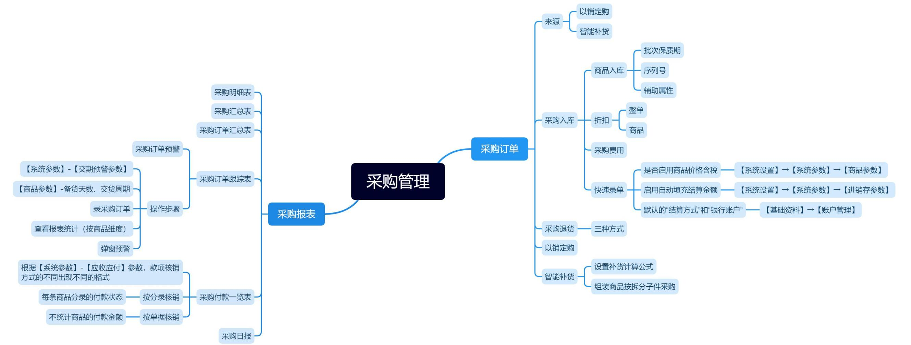

## 采购业务—采购订单

## 应用场景

n 库存不足，需要补货 

n 客户订货，需要备货 

n 记录与供应商的订货情况 

## 特性介绍

n 订单可记录定金 

n 支持分批入库和合并入库 

n 不影响库存和资金，可能会影响可 用库存 

以销订购 

采购订单 

智能补货 

预付定金 可用库存增加 

## 采购业务—采购入库单

## 应用场景

n 根据采购订单入库 

n 直接从供应商处采购入库 

n 先预付定金后入库 

n 只入库，暂不付款给供应商 

## 特性介绍特性介绍

n 订单审核后入库 

n 直接从供应商处采购入库 

n 支持费用处理 

n 支持扫码开单 

n 支持外币采购 

n 支持辅助性，批次，序列号商品入库 

采购订单 

采购入库单 

预付定金 可用库存增加 库存增加 资金增加 应付款增加 

## 采购业务—采购退货单

## 应用场景

n 发现不合格商品，退回给 供应商需要退货 

## 特性介绍

n 可直接退货，也可通过选 择关 联采购入库单退货 

采购入库单 

采购退货单 

库存增加 资金增加 应付款增加 库存减少 资金减少 应付款减少 

<table><tr><td colspan="8">以销定购 × 系统参数 序列号状态表 序列号跟踪表 销售出库单 单据新增字段</td><td></td></tr><tr><td colspan="5"></td><td>生成采购订单</td><td>刷新</td><td>出库</td><td>合并出库</td></tr><tr><td colspan="8">筛选</td><td></td></tr><tr><td>销售订单日期 2021-10-01~2021-10-...</td><td>交货日期 2021-10-01~2021-10-...</td><td>客户 客户001 ×</td><td>业务员</td><td>部门</td><td colspan="3">商品类别</td><td></td></tr><tr><td>商品品牌</td><td>商品</td><td>销售订单编号</td><td></td><td></td><td colspan="3"></td><td></td></tr><tr><td colspan="8">待采购数量为零不显示</td><td></td></tr></table>

## 采购业务—以销定购

## 应用场景

n 企业为了实现零库存或避 免库存积压，事先不采购 商品放入仓库，当接到订 单后再按照需求量进行采 购； 

## 特性介绍

n 通过已审核的销售订单查 询生成采购订单； 

查询 

<table><tr><td>√</td><td></td><td>本次采购数量</td><td>采购单位</td><td>采购单价</td><td>预计采购金额</td><td>供应商</td><td>采购部门</td><td>采购业务员</td><td>销售订单日期</td><td>销售订单编号</td><td>客户</td></tr><tr><td>√</td><td>1</td><td>1</td><td>包</td><td>22</td><td>22</td><td></td><td></td><td></td><td>2021-10-21</td><td>XSDD-20211021-00001</td><td>客户</td></tr></table>

## 已生成的采购订单

<table><tr><td></td><td>单据日期</td><td>单据编号</td><td>供应商</td><td>采购部门</td><td>业务员</td><td>数量</td><td>币别</td></tr><tr><td>1</td><td>2021-10-26</td><td>CGDD-20211026-00001</td><td colspan="3">济南华通物流</td><td>1</td><td>人民币</td></tr><tr><td></td><td></td><td></td><td></td><td></td><td></td><td></td><td></td></tr></table>

## 采购业务—智能补货

## 应用场景

n 企业为避免出现断货的情 况，需要提前补充库存 

## 特性介绍

n 提供补货方案的设置 

n 生成采购订单 

补货方案设置 

选择商品范围 

商品 周黑鸭-鸭脖 

设置补货计算公式 

仓库 

## 1. 智能补货设置

选销售订单 

商品类别 

商品标签 

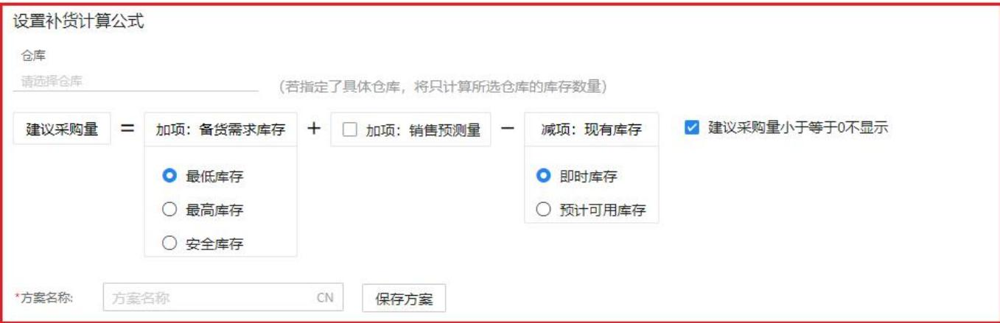

保存方案 

拆分子件采购 

生成采购订单 

退出 

生成采购申请单 

<table><tr><td colspan="7">1. 智能补货设置</td><td>2. 开始采购</td></tr><tr><td></td><td>单据编号</td><td>单据日期</td><td>申请人</td><td>数量</td><td>币别</td><td>价税合计</td><td></td></tr><tr><td>1</td><td>CGSQ-20211026-00001</td><td>2021-10-26</td><td>李娟</td><td>10.00</td><td>人民币</td><td>0.000</td><td></td></tr></table>

应场用景:介采购绍员A通过查询销售订单编号或者商品，发现客户001下了一笔100台笔记本的电脑订单，决定生成采购订单进行采购。 

通过查询出来的销售订单，可以看到客户的预定量，然后决定本次采购数量制定采购计划，点击“生成采购订单”即可。 

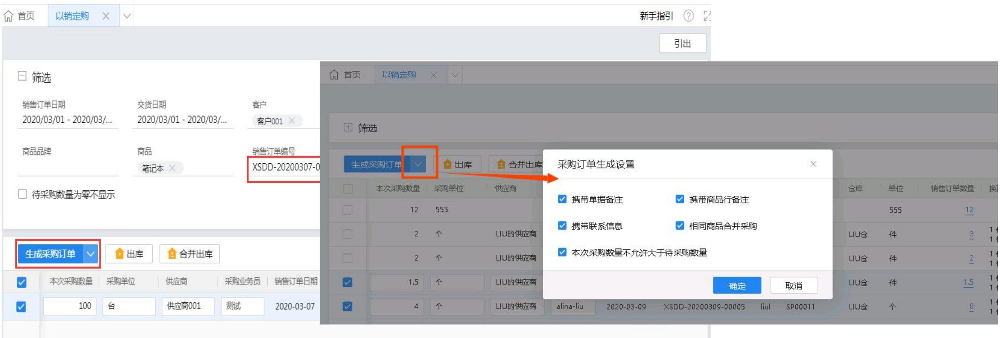

应场用景:采介购绍员A发现现有库存不足，或有客户订货，库存难以满足客户需要，要去采购。为提高效率，准确预测采购量，采购员A通过智能补货 方案和设置补货计算公式，得出目前建议采购量是50个，因此根据建议采购量去生成采购订单进行采购。 

要先选择商品或仓库，然后“设置补货计算公式”，点击“开始计算”得出补货量，点击“生成采购订单”去采购即可。 

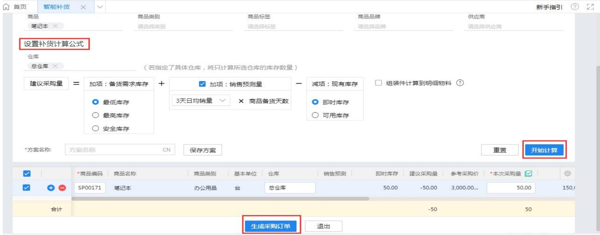

应场用景:介采购绍员A要采购一批牛奶，并且要记录商品的批次和保质期，批次和保质期在入库的时候要手动录入。 

生产日期可以选择，保质期天数是根据商品信息中设置的天数带出来的，到期日是根据生产日期和保质期天数自动算出来的， 无需手工录入。如果入库时，保质期不等于商品资料中的天数，也可以手动录入生产日期和到期日，系统会自动反算出保质 期天数。 

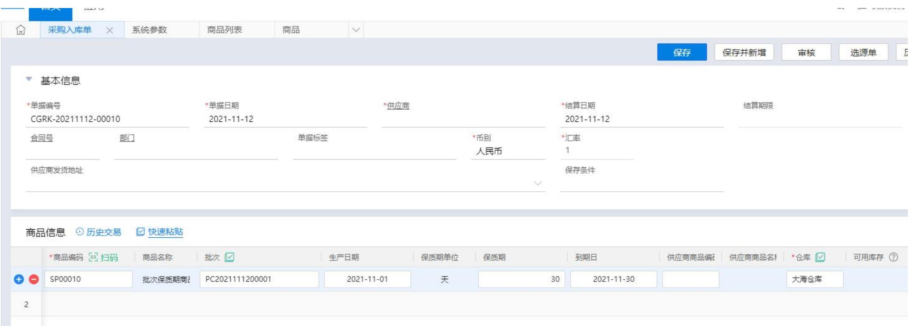

<table><tr><td></td><td>*商品编码</td><td>扫码</td><td>商品名称</td><td>批次</td><td>生产日期</td><td>保质期单位</td><td>保质期</td><td>到期日</td><td>供应商商品编码</td><td>供应商商品名称</td><td>*仓库</td><td>可用库存</td></tr><tr><td>+ -</td><td colspan="2">SP00010</td><td>批次保质期商结</td><td>PC2021111200001</td><td>2021-11-01</td><td>天</td><td>30</td><td>2021-11-30</td><td></td><td></td><td>大海仓库</td><td></td></tr><tr><td>2</td><td colspan="12"></td></tr></table>

场景:采购员A要采购一批手机，需要录手手机的序列号，便于售后跟踪，需要记录出库的每台手机的序列号。 

序列号商品入库，录入的序列号个数，与入库数量必须一致； 

序列号录入有多种方式：手工录入序列号，从仓库中选择已有的序列号，自动生成序列号，也可以从其他文档复制粘贴而来； 一个商品相同的序列号，在仓库中只能有一个。 

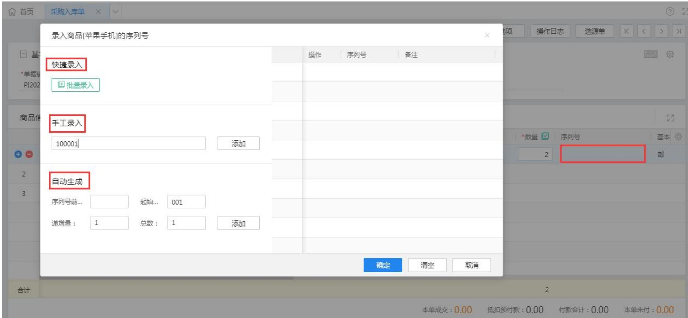

应场用景:介采购绍员A要采购一批帽子，入库的时候需要录入帽子的颜色和尺码方便区分。 

商品的颜色和尺码要提前在资料-辅助属性添加好，然后在添加商品信息的时候启用，最后在采购单上选择相应属性即可。 

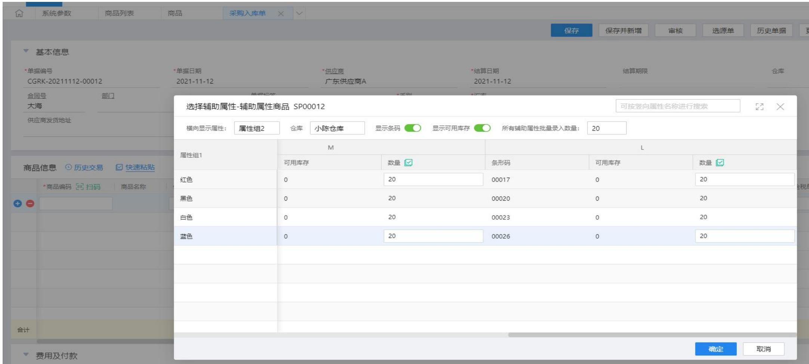

应场用景:介采购绍员A发现目前笔记本销售高峰期，于是又从供应商001追加一笔5台笔记本订单，两张订单要合并一起入库。 

合并入库的时候要先选中单据，然后点击“合并入库”即可； 

注：如果是同一家供应商则合并入库会生成一张单据，如果不是同一个供应商则根据供应商不同生成多张不同单据。 

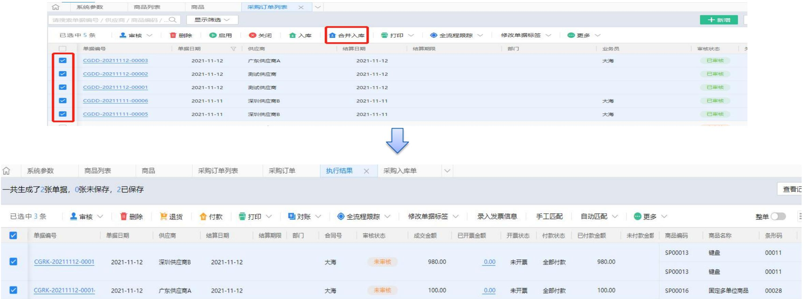

场景:采购的时候供应商分别给两种商品打了折，折后总价是980元，但是，老板觉得价格高，要把零头抹掉，需要在表单下 应用绍方整单折扣额上，填写上本次折扣金额即可。 

在商品行中，可以根据习惯选择录入折扣率或者折扣（折），都可以计算出商品的折扣额； 若是整体打折，录入表体下方的“整单折扣额”。 

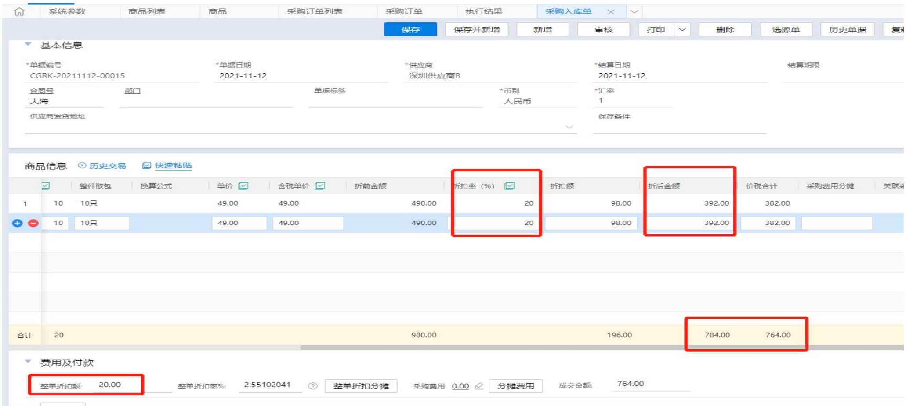

## 采购核心业务场景八：采购入库单复制

应场用景:介采购绍员A从供应商那里采购了10台128G的笔记本入库，然后得知又有相同的10台笔记本要入库，采购员A直接找到原来 的相同单据进行复制，无需手动选择供应商和商品等。 

在入库单据右上角点击“复制为”即可进行复制本单或者复制为销售类/库存类单据等，复制下推的单据日期及商品信息按本 单信息直接带过去。 

<table><tr><td colspan="21">基本信息</td></tr><tr><td colspan="3">*单据编号</td><td colspan="3">*单据日期</td><td colspan="3">*供应商</td><td colspan="3">*结算日期</td><td colspan="3">业务员</td><td rowspan="6" colspan="3">部门</td><td colspan="3">复制本单</td></tr><tr><td colspan="3">CGRK-20200319-00029</td><td colspan="3">2020-3-19</td><td colspan="3">供应商001</td><td colspan="3">2020-3-19</td><td colspan="3">采购员A</td><td colspan="3">销售订单</td></tr><tr><td>*币别</td><td colspan="2">*汇率</td><td colspan="3">应付款余额</td><td colspan="3">上次欠款</td><td colspan="3">联系信息</td><td rowspan="4" colspan="3"></td><td colspan="3">销售出库单</td></tr><tr><td>人民币</td><td colspan="2">1.0000</td><td colspan="3">80.23000000</td><td colspan="3">80.23000000</td><td colspan="3"></td><td colspan="3">调拨出库单</td></tr><tr><td rowspan="2">收货地址</td><td rowspan="2" colspan="2"></td><td rowspan="2" colspan="3"></td><td rowspan="2" colspan="3"></td><td rowspan="2" colspan="3">单据备注</td><td colspan="3">移仓单</td></tr><tr><td colspan="3">其他出库单</td></tr></table>

场景:采购员A在采购商品时候需要支付给小刘一笔100元的运费，要记录在入库单上。 

在单据下方，点击分摊费用左侧修改样式按钮，可以在费用明细单上录入本次费用，选择支出类型为运费即可，该笔运费计 算到商品成本中；点“分摊费用”，采购费用分摊到商品行中。 

采购费用支出按价税合计或按数量进行分摊到商品成本中。当本次采购的多种商品，计量单位差异较大，比如有的商品单位 是件，有的商品单位是斤，此时不适合选择“数量”的分摊方式。 

采购费用分摊：当本行付款信息金额合计等于应付金额时供应商为非必录项（现场支付给搬运工人） 

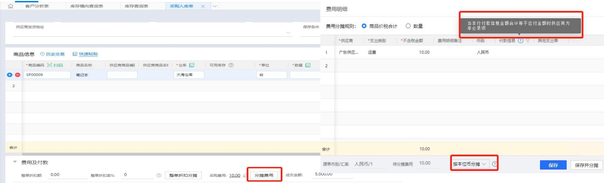

## 采购核心业务场景十：金额反算选项

应场用景：介采绍购员A买了10台笔记本电脑，原本的价格是1万一台，但运费100元需要直接加入商品货款中，总货款是100100元； 

通常销售额的计算，都是以数量和单价为依据，但是当出现只知道总金额，且用户需要反算单价的场景时，可在单据“选 项”中开启“修改价税合计后反算单价”； 

若用户并不关心单价，也可以不用开启该选项，直接修改价税合计即可。单价保持为默认的值不变。 

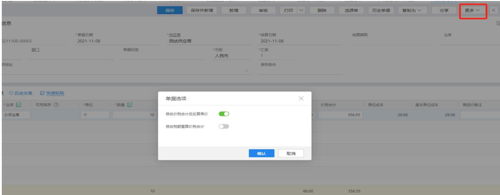

场景：采购员A从供应商那里采购一批笔记本，由于公司资金紧张，款项暂未支付，等月底再一起付款。 

这种赊购业务是很常见的，只需要在做采购入库单的时候不去录入“付款账户”“付款方式”和“付款金额”，然后去保存 或审核单据即可。 

<table><tr><td colspan="13"></td></tr><tr><td>2</td><td>SP000171</td><td>笔记本</td><td>总仓库</td><td colspan="5">台</td><td colspan="3">台</td><td>3,</td></tr><tr><td>+ -</td><td>SP000171</td><td>笔记本</td><td>总仓库</td><td colspan="5">台</td><td colspan="3">台</td><td>3,</td></tr><tr><td>4</td><td></td><td></td><td></td><td></td><td></td><td></td><td></td><td></td><td></td><td></td><td></td><td></td></tr><tr><td>5</td><td></td><td></td><td></td><td></td><td></td><td></td><td></td><td></td><td></td><td></td><td></td><td></td></tr><tr><td></td><td></td><td></td><td></td><td></td><td></td><td></td><td></td><td></td><td></td><td></td><td></td><td></td></tr><tr><td></td><td></td><td></td><td></td><td></td><td></td><td></td><td></td><td></td><td></td><td></td><td></td><td></td></tr><tr><td colspan="13">合计 10</td></tr><tr><td colspan="13">整单折扣额: 0.00 整单折扣率%: 0 整单折扣分摊 采购费用: 0.00 分摊费用</td></tr><tr><td colspan="13">抵扣预付款: 选源单 (预付款余额: 10,000.00)</td></tr><tr><td colspan="13">支付货款: 付款账户 付款方式 0.00 多账户付款 付款抹零: 0.00</td></tr></table>

应场用景:介采购绍员A在采购时之前没有付过订金，需要在采购时一次性付清账款。 

若之前有预付款定金，在入库可以选择填写“多账户付款”，再在“支付货款”中，填写本次付的货款。 

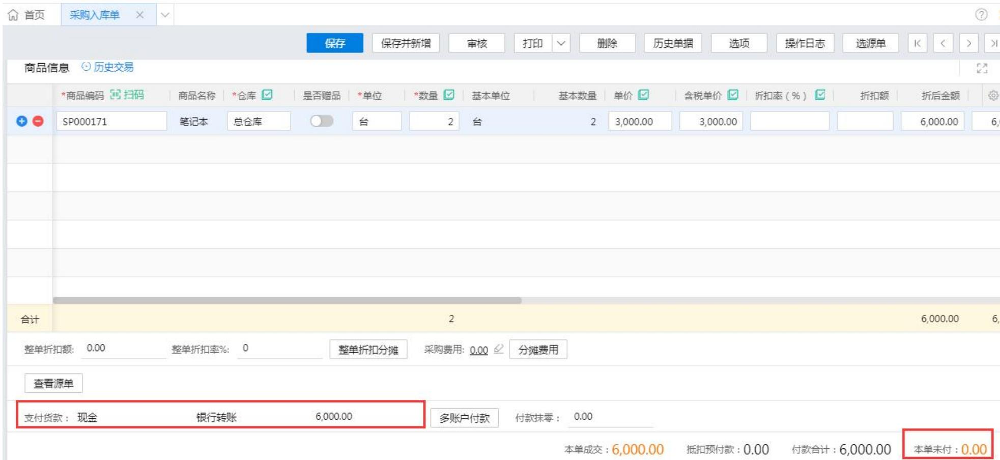

应场用景:介采购绍员A去给供应商001下单的时候，根据供应商的要求，预付了10000元订金。订金可以生成预付款单。 

在订单中，录入付出订金的账户、收款方式，订金金额，并生成预付款单。注意：生成的预收单审核后，才说明订金已到账。 

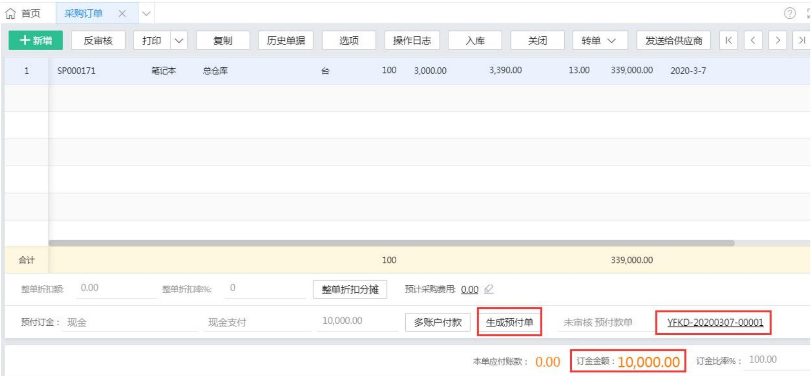

应场用景:介采购绍员A在采购时提前付了预付款，然后在到货入库的时候可以直接抵扣之前的预付款。 

在采购入库单上点击“选源单”系统会带出来之前的付款单，然后在付款单上填写“本次核销金额”后再保存或审核单据即 可。 

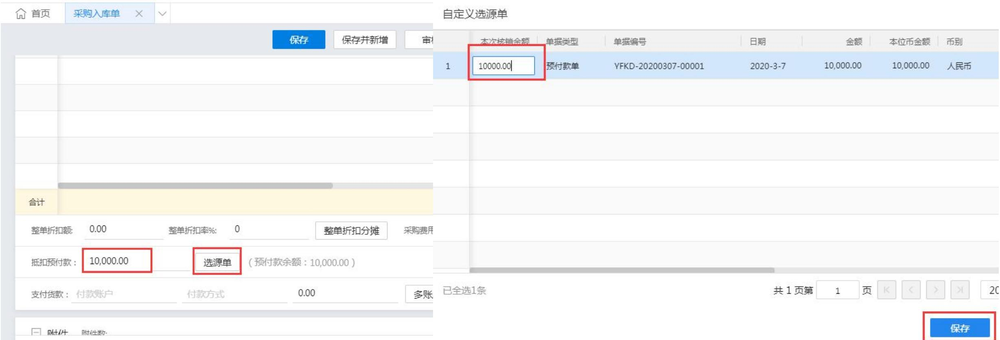

附什附仕数

抵扣预付款：10,000.00

应场用景:介采购绍员A在收到商品入库时发现有两台笔记本屏幕质量有问题，确认是商品本身的问题，确认要退货。 

【采购管理】→【采购退货单】，手工录入供应商，退货商品及数量、金额。 

录入采购退货单时，选择供应商后，点“选源单”找到该供应商的所有采购出库单，选择要退货的商品； 

在采购入库单列表，选择要退货的商品，点“退货”也可生成采购退货单。 

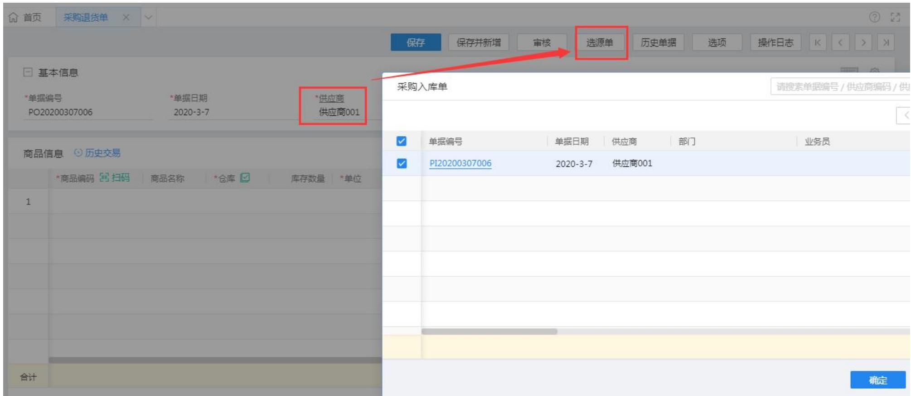

应场用景:介采购绍员A在收到商品入库时发现有部分商品有质量问题要退货，这些商品在多张单据上，想要一起做退货处理。 

在采购入库单列表，选择多张单据，点击“退货”，系统会自动合并生成退货单，执行结果上可以看到退货执行情况。 

如果选择退货的供应商是同一家，则会生成一张退货单；供应商不同，则根据不同供应商生成不同的多张退货单。 

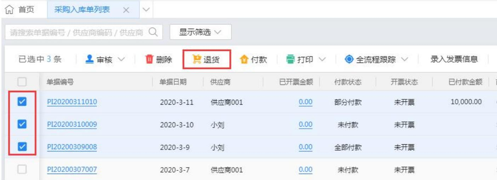

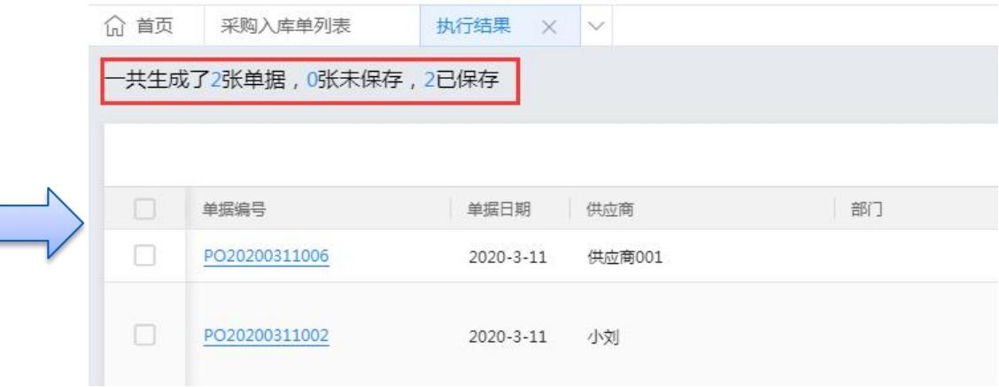

场应景用:采介购绍员A将商品入库以后，要把发票开出来给供应商报账。 

在单据列表页面，选择单据（已审核），点击“录入发票信息”，按照格式填写好发票信息，点击保存即可。 注意：不可选择不同供应商开票，可以选择相同供应商一起开票。 

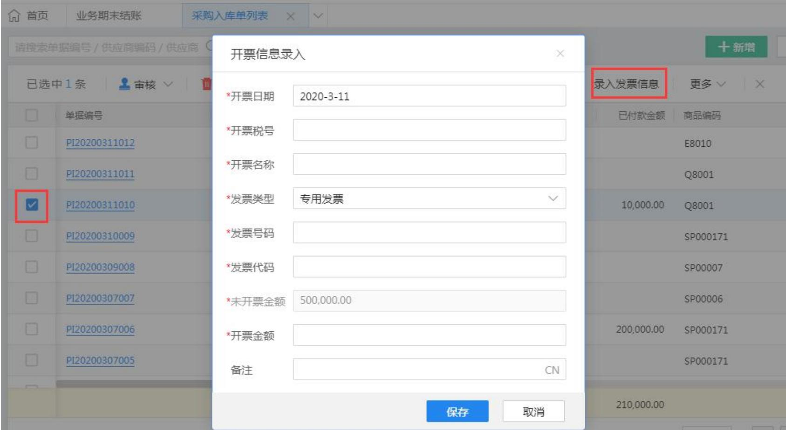

场景：企业销售的商品是组合件商品时，当收到销售订单后，需要先去采购子件，再将采购回来的子件组装件组合成组件。 在计算子件的采购量时，需要同步考虑子件的在途量，子件在销售订单中的需求量以及子件自己的库存等因素。 

选择出来进行补货的商品为组合件商品，可以查看该组合件商品的组装模板； 

若需要对该组合件的子件进行采购，需要进行第二步补货量计算“拆分子件采购” 

第二步计算会根据组合件的需求量，即第一步中的“本次采购量”基础上进行计算，在对最终的子件补货量进行采购 

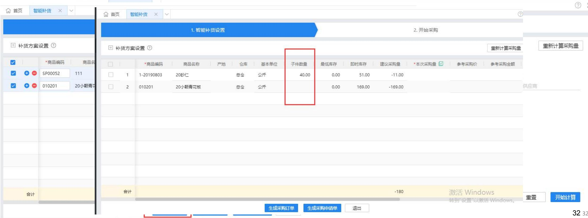

## 采购核心业务场景十九：采购订单交期预警

场景:对于有交期预警需求的用户，需要查询临近交货日期的订单和数据时，可以到订单预警报表进行查询和统计，以便及时向 供应商要货入库，避免超期。 

在采购管理—采购订单跟踪表中，可以统计出到达交期预警范围内的商品，同时，为及时提醒对交期预警范围商品进行业务处 理，系统提供了当出现交期预警商品时，会在登录后首页右侧的预警弹窗中展示预警信息，可在报表右上角勾选开启和关闭； 注：剩余备货天数为负数时，说明已经超过预计交货日期；执行比例为100%的商品证明已经完成入库业务，勾选显示交期预 警商品统计时，不会在报表中展示； 

<table><tr><td colspan="16">采购订单跟踪表</td></tr><tr><td colspan="16"></td></tr><tr><td colspan="16">发现交期预警商品,登录时首页弹窗提醒 引出 刷新 打印 列设置 退出</td></tr><tr><td colspan="16">筛选 审核状态:全部;是否赠品:全部;统计类型:按单据统计;显示小计:否</td></tr><tr><td rowspan="3" colspan="2">*单据日期2020-10-23~2020-10-30</td><td rowspan="3" colspan="3">预计交货日期请选择</td><td rowspan="3" colspan="3">审核状态全部</td><td rowspan="3" colspan="3">入库状态</td><td rowspan="3" colspan="3">行入库状态</td><td rowspan="2" colspan="2">关闭状态</td></tr><tr></tr><tr><td>显示更多</td><td>重置 查询</td></tr><tr><td>单据编号</td><td>单据日期</td><td>供应商</td><td>商品编码</td><td>商品名称</td><td>仓库</td><td>单位</td><td>数量</td><td>价税合计</td><td>已入库数量</td><td>未入库数量</td><td>执行比例(%)</td><td>预警天数</td><td>剩余备货天数</td><td></td><td></td></tr><tr><td>CGDD-20201030-00001</td><td>2020-10-30</td><td>老李家</td><td>SP00002</td><td>麦片</td><td>成品仓</td><td>个</td><td>100.00000</td><td>1,100.00000000</td><td>0.00000</td><td>100.00000</td><td></td><td>3</td><td>1</td><td></td><td></td></tr><tr><td>CGDD-20201023-00003</td><td>2020-10-23</td><td>第3个</td><td>CS0003</td><td>引入测试3</td><td></td><td>个</td><td>15.00000</td><td></td><td>0.00000</td><td>15.00000</td><td></td><td>3</td><td>-7</td><td></td><td></td></tr><tr><td>CGDD-20201023-00002</td><td>2020-10-23</td><td>第2个</td><td>SP00003</td><td>西瓜</td><td></td><td>个</td><td>2.00000</td><td></td><td>0.00000</td><td>2.00000</td><td></td><td>3</td><td>-7</td><td></td><td></td></tr><tr><td>CGDD-20201023-00001</td><td>2020-10-23</td><td>第1个</td><td>CS0002</td><td>引入测试2</td><td></td><td>个</td><td>10.00000</td><td></td><td>0.00000</td><td>10.00000</td><td></td><td>3</td><td>-7</td><td></td><td></td></tr><tr><td></td><td></td><td></td><td></td><td></td><td></td><td></td><td>127</td><td>1,100.00000000</td><td>0</td><td>127</td><td></td><td></td><td></td><td></td><td></td></tr></table>

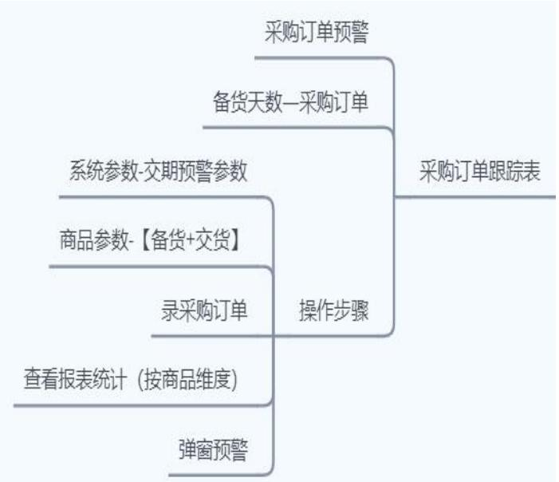

## 销售管理

• 第三部分 

## 标准版和专业版功能对比（销售管理）

<table><tr><td></td><td>金蝶云·星辰标准版</td><td>金蝶云·星辰专业版</td><td>金蝶云·星辰标准版(金蝶云APP)</td><td>金蝶云·星辰专业版(金蝶云APP)</td><td>备注</td></tr><tr><td>销售价格记忆</td><td>√</td><td>√</td><td>√</td><td>√</td><td></td></tr><tr><td>客户价格策略</td><td>√</td><td>√</td><td>√</td><td>√</td><td></td></tr><tr><td>客户承担费用</td><td>√</td><td>√</td><td>√</td><td>√</td><td></td></tr><tr><td>订单锁库</td><td>√</td><td>√</td><td>×</td><td>×</td><td></td></tr><tr><td>销售毛利计算</td><td>√</td><td>√</td><td>√</td><td>√</td><td></td></tr><tr><td>多维度的销售报表</td><td>√</td><td>√</td><td>√</td><td>√</td><td></td></tr><tr><td>企业经营利润表</td><td>√</td><td>√</td><td>√</td><td>√</td><td></td></tr><tr><td>销售发票登记</td><td>√</td><td>√</td><td>√</td><td>√</td><td></td></tr><tr><td>合并出库</td><td>√</td><td>√</td><td>×</td><td>×</td><td></td></tr><tr><td>预收款抵扣</td><td>√</td><td>√</td><td>√</td><td>√</td><td></td></tr><tr><td>客户经营</td><td>√</td><td>√</td><td>√</td><td>√</td><td></td></tr><tr><td>车销</td><td>√</td><td>√</td><td>√</td><td>√</td><td></td></tr><tr><td>访销</td><td>√</td><td>√</td><td>√</td><td>√</td><td></td></tr><tr><td>销售报价单</td><td>×</td><td>√</td><td>×</td><td>×</td><td></td></tr><tr><td>销售换货申请</td><td>×</td><td>√</td><td>×</td><td>√</td><td></td></tr><tr><td>销售退货申请</td><td>×</td><td>√</td><td>×</td><td>×</td><td>金蝶云APP(待规划)</td></tr><tr><td>委托代销</td><td>×</td><td>√</td><td>×</td><td>×</td><td></td></tr><tr><td>销售订单变更</td><td>√</td><td>√</td><td>×</td><td>×</td><td></td></tr><tr><td>出库单/退货单金额变更</td><td>√</td><td>√</td><td>×</td><td>×</td><td></td></tr><tr><td>销售限价</td><td>×</td><td>√</td><td>×</td><td>√</td><td></td></tr><tr><td>客户价格策略按销量设置</td><td>×</td><td>√</td><td>×</td><td>√(不支持移动端设置)</td><td></td></tr><tr><td>单据条码标签打印</td><td>×</td><td>√</td><td>×</td><td>×</td><td></td></tr><tr><td>单据操作控制</td><td>×</td><td>√</td><td>×</td><td>√</td><td></td></tr><tr><td>单据字段配置</td><td>×</td><td>√</td><td>√(销售订单、销售出库单)</td><td>√</td><td></td></tr><tr><td>打印控制</td><td>×</td><td>√</td><td>×</td><td>√(不支持移动端设置)</td><td></td></tr></table>

赊销业务 

销售订单 

现结销售业务 

销售订单 

预收款 销售业务 预收款单 

收款单 

销售出库单 

销售退货单 

销售出库单-付款 

销售订单 

销售退货单 

核销单 （预收冲应收） 

未抵扣预收款 

销售出库单 

销售退货单 

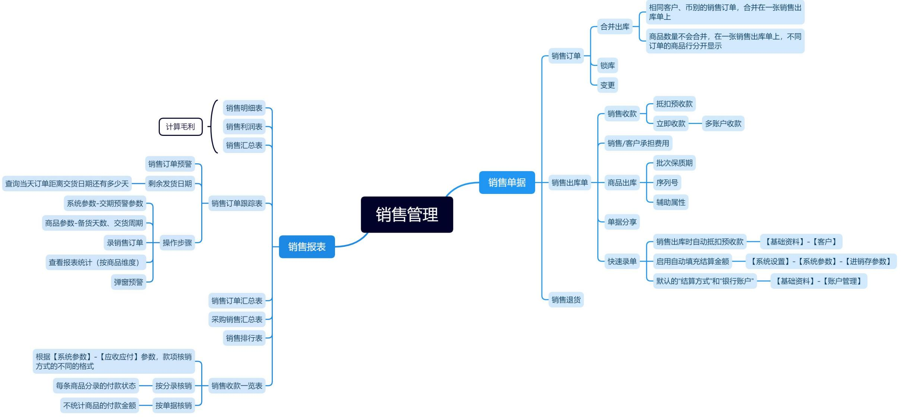

## 应用场景

n 与客户签订销售合同 

n 记录客户的购买意向 

## 特性介绍

n 订单审核后才能出库 

n 订单上可以记录订金 

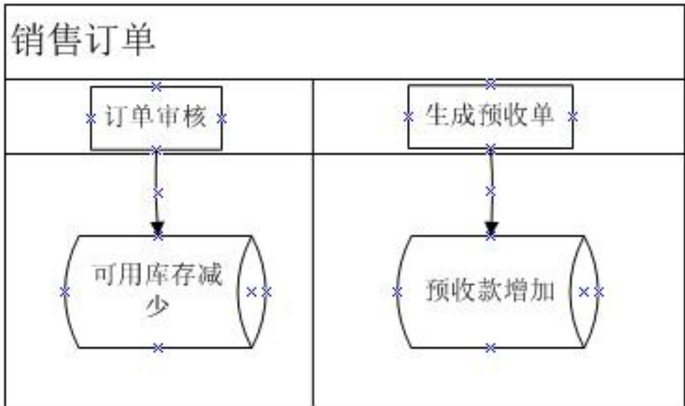

n 一张订单可以分批出库，也可以与其他订单合并出库 

n 订单不影响实际库存，但可以影响可用库存 

## 应用场景

n 按销售订单出库 

n 客户现场购买现场支付 

n 只发货暂不收款 

n 先收款后发货 

## 特性介绍

n 支持多辅助属性商品，批次商品、序 列号商品出库 

n 支持多计量单位商品销售（固定换算） 

n 支持外币销售 

n 支持扫码开单 

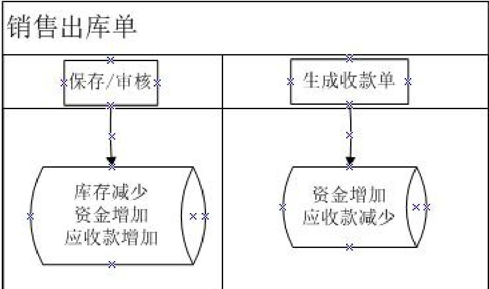

## 应用场景

n 客户需要退货 

n 客户需要换货 

## 特性介绍

n 支持按原销售出库单退货和 直接退货 

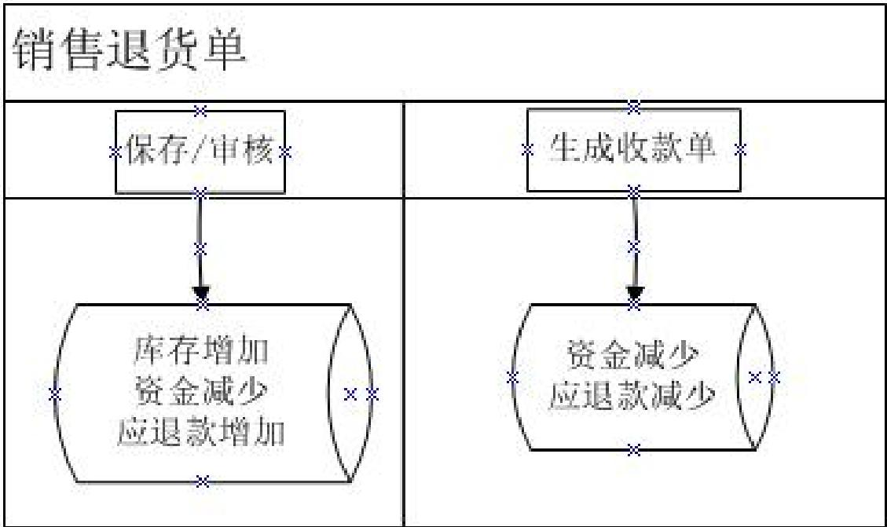

<table><tr><td>单据类型</td><td>原单据名称</td><td>目前已支持的单据类型</td></tr><tr><td rowspan="3">销售类单据</td><td>销售订单</td><td>复制本单采购订单采购入库单其他入库单其他出库单移仓单调拨出库单</td></tr><tr><td>销售退货单</td><td>复制本单采购退货单移仓单销售订单其他出库单采购订单</td></tr><tr><td>销售出库单</td><td>复制本单采购订单销售订单采购入库单调拨出库单其他入库单其他出库单移仓单</td></tr></table>

<table><tr><td>删除</td><td>选源单</td><td>历史单据</td><td>复制为^</td><td>分享</td><td>更多✓</td></tr><tr><td></td><td></td><td></td><td>复制本单</td><td></td><td></td></tr><tr><td></td><td></td><td></td><td>采购订单</td><td></td><td></td></tr><tr><td></td><td></td><td></td><td>销售订单</td><td></td><td>仓库</td></tr><tr><td></td><td>*结算日期2021-11-15</td><td></td><td>采购入库单</td><td></td><td></td></tr><tr><td></td><td>*币别人民币</td><td>*汇率1</td><td>调拨出库单</td><td></td><td>上次欠款</td></tr><tr><td></td><td></td><td></td><td>其他入库单</td><td></td><td></td></tr><tr><td></td><td>3454</td><td></td><td>其他出库单</td><td></td><td>发货客户</td></tr><tr><td>✓</td><td></td><td></td><td>移仓单</td><td></td><td></td></tr></table>

目前已支持的单据复制类型请查看下方链接： 进销存不同单据间复制 https://vip.kingdee.com/link/s/MU1Nw 

场景一：一次性发货出库 

场景二：分批发货出库 

场景三：合并出库 

<table><tr><td colspan="2">销售订单列表</td><td colspan="2">销售订单</td><td colspan="2">销售出库单</td><td></td><td></td><td></td><td></td><td></td><td></td><td></td><td></td><td></td><td></td></tr><tr><td colspan="2">请搜索单据编号/商品编码/商品名...</td><td colspan="4">显示筛选</td><td></td><td></td><td></td><td></td><td></td><td></td><td></td><td></td><td></td><td></td></tr><tr><td>已选中3条</td><td>审核</td><td>删除</td><td>启用</td><td>关闭</td><td>出库</td><td>合并出库</td><td>锁库</td><td>以销定购</td><td>打印</td><td>全流程跟踪</td><td colspan="5">修改单据标签整单</td></tr><tr><td colspan="2">单据编号</td><td colspan="2">客户</td><td>单据日期</td><td>客户编码</td><td>客户分类</td><td>结算日期</td><td>结算期限</td><td>部门</td><td>业务员</td><td>币别</td><td>汇率</td><td colspan="3">审核</td></tr><tr><td colspan="2">XSDD-20211022-00001</td><td colspan="2">客户001</td><td>2021-10-22</td><td>A00001</td><td>重点客户</td><td>2021-11-21</td><td>30天</td><td>销售部</td><td>李娟</td><td>人民币</td><td>1</td><td colspan="3">已审核</td></tr><tr><td colspan="2">XSDD-20211021-00001</td><td colspan="2">客户001</td><td>2021-10-21</td><td>A00001</td><td>重点客户</td><td>2021-11-20</td><td>30天</td><td>销售部</td><td>李娟</td><td>人民币</td><td>1</td><td colspan="3">已审核</td></tr><tr><td colspan="2">XSDD-20211018-00001</td><td colspan="2">客户001</td><td>2021-10-18</td><td>A00001</td><td>重点客户</td><td>2021-11-17</td><td>30天</td><td>销售部</td><td>李娟</td><td>人民币</td><td>1</td><td colspan="3">已审核</td></tr><tr><td colspan="2">XSDD-20211015-00001</td><td colspan="2">客户001</td><td>2021-10-15</td><td>A00001</td><td>重点客户</td><td>2021-11-14</td><td>30天</td><td>销售部</td><td>李娟</td><td>人民币</td><td>1</td><td colspan="3">已审核</td></tr></table>

场景：九州商贸在客户下达订单后，需要对客户订单的库存进行锁定，不能挪为他用，若商品启用批次，需要能针对 批次进行锁定。部分商贸型企业，根据现有库存量和采购在途量来录销售订单并对订单进行锁定（基于可用库存进行 锁定，举例场景可用库存=即时库存+采购在途） 

<table><tr><td>仓库编码</td><td>仓库名称</td><td>仓位名称</td><td>批次</td><td>单位</td><td>即时库存</td><td>可锁库数量</td><td>已锁库数量</td><td>当前锁库数量</td><td>*需锁库数量</td><td>基</td></tr><tr><td>CK0001</td><td>FKC-不允许</td><td>0409005</td><td>↑</td><td>2.00000000</td><td>2.00000000</td><td></td><td></td><td></td><td>↑</td><td></td></tr><tr><td>CK0001</td><td>FKC-不允许</td><td>0409006</td><td>↑</td><td>2.00000000</td><td>2.00000000</td><td></td><td></td><td></td><td>↑</td><td></td></tr><tr><td>CK0001</td><td>FKC-不允许</td><td>0409004</td><td>↑</td><td>2.00000000</td><td>2.00000000</td><td></td><td></td><td></td><td>↑</td><td></td></tr><tr><td>CK0002</td><td>FKC-允许</td><td>234324</td><td>↑</td><td>5.00000000</td><td>5.00000000</td><td></td><td></td><td></td><td>↑</td><td></td></tr><tr><td>CK0006</td><td>仓库一号</td><td>F-1</td><td>1</td><td>↑</td><td>200.00000000</td><td>200.00000000</td><td></td><td></td><td>↑</td><td></td></tr></table>

## 客户下单

## 订单锁库

## 订单出库

锁库释放 

1、支持辅助属性、批次、保质期支持锁定到对应的明细，序列号商品锁定总量； 

2、支持锁定到仓库、仓位,支持按单据单位或基本单位锁定； 

3、支持按整单或按分录进行锁库，手动锁库或自动分配； 

4、支持多次锁库（订单解锁后、订单未完全出库）； 

5、锁库基于可用库存锁定，锁库后可用库存减少，出库或手动解锁后释放（锁库数量≤可用库 存，锁库数量≤订单数量）； 

6、报表体现：锁库表及预计可用库存表； 

相关知识： 销售订单锁库使用指南 https://vip.kingdee.com/link/s/MUBuk 

场景：百年家居收到客户李先生预定一套衣柜的订单，收到订金1000后，通知工厂开始生产。 

在销售订单中，录入收到订金的账户、收款方式，订金金额，并生成预收单。注意：生成的预收单审核后，才说明 订金已到账。预收单在销售订单审核前，审核后生成都可以。 

<table><tr><td colspan="12">深圳市九州商贸有限公司</td></tr><tr><td>首页</td><td>销售订单列表</td><td>销售订单</td><td>×</td><td></td><td></td><td></td><td></td><td></td><td></td><td></td><td></td></tr><tr><td></td><td></td><td></td><td></td><td></td><td></td><td></td><td></td><td></td><td></td><td></td><td></td></tr><tr><td>1</td><td></td><td></td><td></td><td></td><td></td><td></td><td></td><td></td><td></td><td></td><td></td></tr><tr><td></td><td></td><td></td><td></td><td></td><td></td><td></td><td></td><td></td><td></td><td></td><td></td></tr><tr><td></td><td></td><td></td><td></td><td></td><td></td><td></td><td></td><td></td><td></td><td></td><td></td></tr><tr><td></td><td></td><td></td><td></td><td></td><td></td><td></td><td></td><td></td><td></td><td></td><td></td></tr><tr><td></td><td></td><td></td><td></td><td></td><td></td><td></td><td></td><td></td><td></td><td></td><td></td></tr><tr><td>合计</td><td></td><td></td><td></td><td></td><td></td><td></td><td></td><td></td><td></td><td></td><td></td></tr><tr><td colspan="12">整单折扣额: 0.00 整单折扣率%: 0 整单折扣分摊 预计销售费用: 0.00</td></tr><tr><td colspan="12">预收订金: 现金 银行转账 1,000.00 多账户收款 生成预收单</td></tr></table>

场景：客户李先生在下衣柜订单时曾支付过一笔订金，在衣柜制作完成发货时，只需要支付尾款。 

若客户有预收款余额，在发货时可以选择填写“抵扣预收款”；在客户资料中设置自动抵扣后，会自动填充抵扣预 收款金额。 

在“收取货款”中，填写本次收到的货款。 

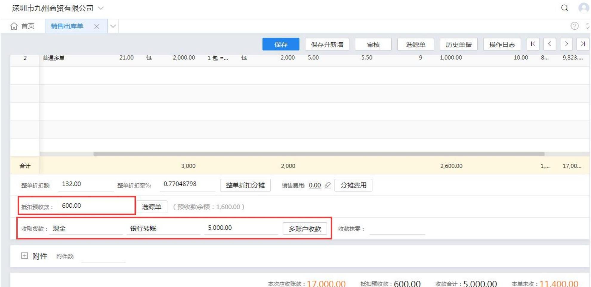

场景：外贸企业在采购销售过程中会发生包含国内和国外不同币别的费用；有的费用是当时就已经支付了，不需 要挂在其他应付款账上 

一张采购或销售单中的费用，可以是多种不同的币别 

在录入采购或销售单时，可以直接填写支付的费用金额 

参数为单据审核后允许修改费用时，可以手工调整商品行的费用分摊金额 

费用明细 

## 费用分摊规则：商品价税合计 数量

<table><tr><td></td><td>*供应商</td><td>*支出类别</td><td>税率(%)</td><td>税额</td><td>*金额</td><td>本位币金额</td><td>价税合计</td><td>费用明细备注</td><td>币别</td><td>汇率</td><td>付款信息</td><td>其他支出单</td></tr><tr><td>1</td><td>供应商</td><td>运费</td><td></td><td></td><td>100.00</td><td></td><td></td><td></td><td>美元</td><td></td><td></td><td></td></tr><tr><td>+ -</td><td>武二</td><td>运费</td><td></td><td></td><td>200.000</td><td></td><td></td><td></td><td>人民币</td><td></td><td></td><td></td></tr></table>

场景：在发生销售业务时，企业可能会代客户预先支付一笔费用，比如代垫的运费等，这笔费用需要向客户收回。 

在录入销售出库单时，可同步记录帮客户垫付的费用； 

垫付费用的币别可以与销售业务的币别不相同； 

支持同时垫付多笔不同类型的费用； 

不同企业的对账方式不同，可选择代垫的费用是计入其他应收款，还是合并计入本次销售业务的应收账款。 

https://vip.kingdee.com/link/s/MUXXJ 

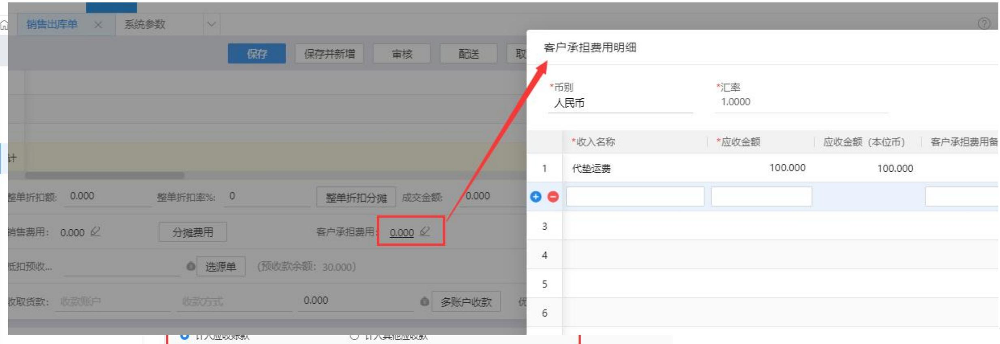

场景：客户万里商贸购买了固定包装为1包10个的口罩265个。 

若某商品是固定多单位核算的商品，在出库时，为了方便仓库拣货，会体现为整件散包的显示形式。在开单时，可 以输入单位个的数量，换算为整件散包，也可直接输入26包5个。 

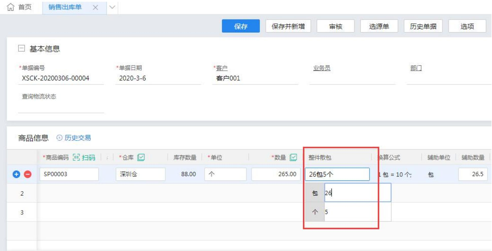

<table><tr><td></td><td>*商品编码</td><td>扫码</td><td>仓库</td><td>库存数量</td><td>单位</td><td>数量</td><td>整件散包</td><td>换算公式</td><td>辅助单位</td><td>辅助数量</td></tr><tr><td>+ -</td><td>SP00003</td><td>深圳仓</td><td>88.00</td><td>个</td><td>265.00</td><td>26包5个</td><td>包 1包 = 10个;</td><td>包</td><td>26.5</td><td></td></tr><tr><td>2</td><td></td><td></td><td></td><td></td><td></td><td>包 26个</td><td></td><td></td><td></td><td></td></tr><tr><td>3</td><td></td><td></td><td></td><td></td><td></td><td>个 5</td><td></td><td></td><td></td><td></td></tr><tr><td></td><td></td><td></td><td></td><td></td><td></td><td></td><td></td><td></td><td></td><td></td></tr></table>

场景：九州商贸销售了一批奶粉，在出库时，需要将生产日期最早的库存先发出。 

在系统参数——进销存参数——仓库参数中，设置“近效期先出”，则选择商品后，可自动带出最近到期的批次； 也可手工点开批次选择窗口，选择实际出库的批次； 

批次商品出库，只能是出库有库存的批次，不允许负库存出库。 

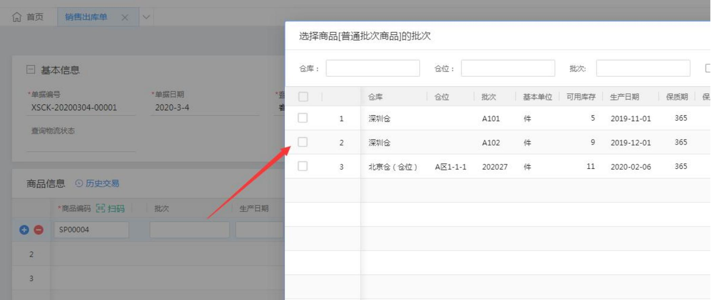

## 销售核心业务场景九：序列号商品销售

场景：九州商贸销售了10台手机，为了售后保修，需要记录出库的每台手机的序列号。 

序列号商品出库，录入的序列号个数，与出库数量必须一致； 

序列号录入有多种方式：手工录入序列号，从仓库中选择已有的序列号，自动生成序列号，也可以从其他文档复制粘贴 而来； 

序列号商品出库，只能是出库有库存的序列号，不允许负库存出库； 

一个商品相同的序列号，在仓库中只能有一个。 

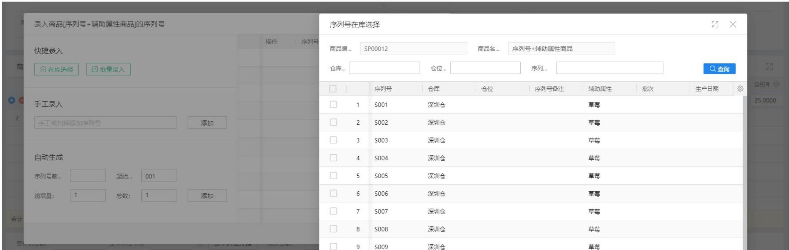

场景：九州商贸销售了10件衣服，其中2件是红色S码，8件是蓝色M码 

需要在基础资料——辅助属性里增加属性分类“颜色”“尺码”，属性值新增红色，蓝色；S，M。该商品启用辅 助属性管理，并选择颜色尺码两种属性。在商品入库时，根据实际属性的数量入库，在销售时，需要选择明细的属 性值并录入数量。 

本系统支持多属性二维表格录入方式； 

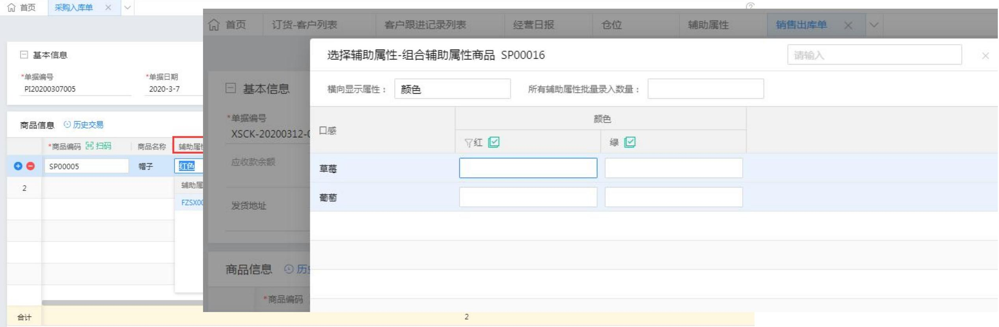

场景：做完销售业务单据以后需要将单据内容分享给业务相关的同事和客户，做进一步确认或者告知。 

可以打开单据上“分享”按钮，复制链接或二维码给到对方进行微信扫描，或者PC端打开链接查看单据信息。 

支持单据：销售订单（采购订单），销售出库单（采购入库单）和销售退货单（采购退货单） 

支持微信和PC端打开查看 

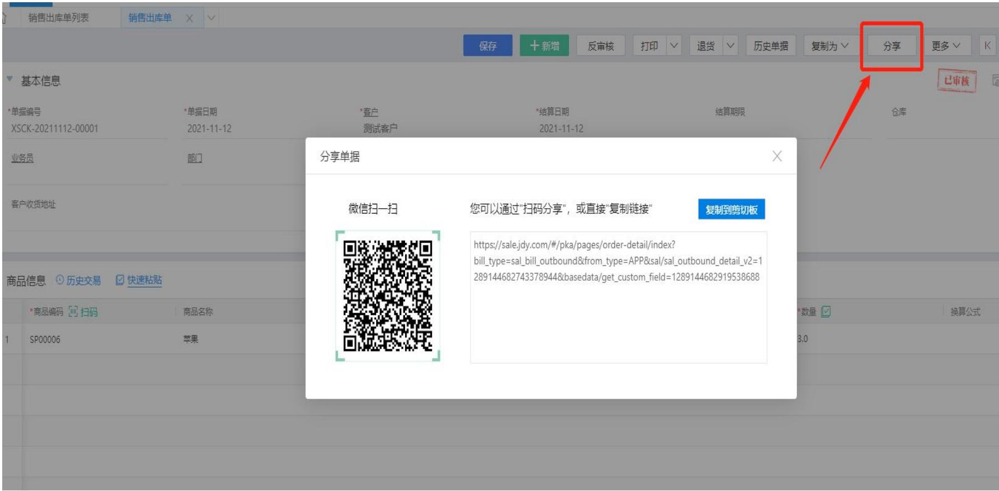

<table><tr><td>单据日期: 2021-11-12</td></tr><tr><td>单据编号: XSCK-20211112-00001 复制</td></tr><tr><td>制单人: 何伟龙</td></tr><tr><td>币别: 人民币</td></tr><tr><td>上次欠款: 760</td></tr><tr><td>应收款余额:760</td></tr></table>

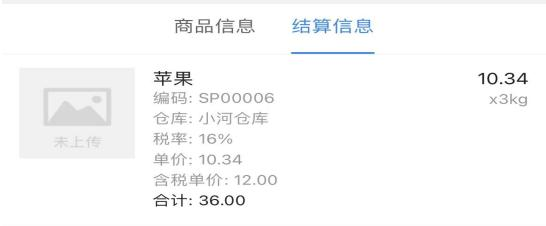

<table><tr><td>优惠后金额</td><td>36.00</td></tr><tr><td>本次应收</td><td>36.00</td></tr><tr><td>收款</td><td>36.00</td></tr></table>

系统提供欠款客户预警。在系统参数——基础资料参数中，设置客户未交易的天数；在销售管理——经营日报中， 能查看客户流失预警数，点击可联查到客户分析表。在客户分析表中，可以看到每个客户的所有交易汇总情况。 

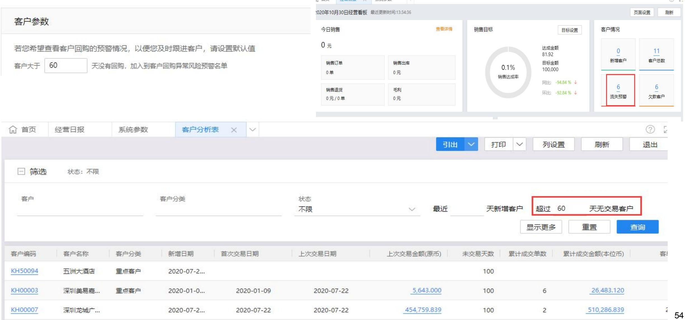

系统提供滞销商品预警。在系统参数——基础资料参数中，设置定义为滞销商品的无销售天数；在销售管理——经 营日报中，能查看滞销商品预警数，点击可联查到滞销商品表。在滞销商品表中，可以看到每个商品的库存情况及 无交易天数。 

当修改了系统参数的无无交易天数，需要在次日才能看到新的滞销商品清单。 

滞销商品：1天内无入库记录，且无销售记录的商品②（报表数据非实时更新，默认每晚执行定时任务自动更新) 

<table><tr><td>商品类别</td><td>规格型号</td><td>品牌</td><td>无销售天数</td><td>上次销售日期</td><td>上次入库日期</td><td>基本单位</td><td>即时库存</td><td>整件散包</td><td>参考零售总金额</td><td>参考批发总金额</td></tr><tr><td></td><td></td><td></td><td>39</td><td></td><td>2020-09-21</td><td>个</td><td>4,000</td><td>4个</td><td></td><td></td></tr><tr><td></td><td></td><td></td><td>16</td><td></td><td>2020-10-14</td><td>斤</td><td>30.00</td><td>30斤</td><td></td><td></td></tr><tr><td>休闲食品</td><td></td><td></td><td>100</td><td>2020-07-22</td><td>2020-07-22</td><td>盒</td><td>5,206.00</td><td>5206盒</td><td>577,866.000</td><td>577,866.000</td></tr><tr><td>休闲食品</td><td></td><td></td><td>100</td><td>2020-07-22</td><td>2020-07-22</td><td>盒</td><td>5,157.00</td><td>5157盒</td><td>149,553.000</td><td>134,082.000</td></tr><tr><td>休闲食品</td><td></td><td></td><td>100</td><td>2020-07-22</td><td>2020-09-17</td><td>包</td><td>5,198.00</td><td>5198包</td><td>166,336.000</td><td>150,742.000</td></tr></table>

场用景介: 用绍户在开展完销售业务以后，想要及时查看销售利润和利润率等情况，便于统计业绩给业务员算提成和经营决策。 

在销售管理—销售利润表中，用户可以查看整单或明细的销售利润和利润率情况，也可以按照客户，业务员，最后收款日期， 和单据日期，制单人等维度进行查询统计，同时，销售利润表支持引出和打印等. 

“销售收入”为每行的实际不含税金额。 

<table><tr><td>单据日期</td><td>单据编号</td><td>单据类型</td><td>审核状态</td><td>业务员</td><td>客户编码</td><td>客户名称</td><td>折扣额</td><td>折后金额</td><td>税额</td><td>价税合计</td><td>实际不含税金额</td><td>销售费用</td><td>成本</td><td>销售毛利</td><td>毛利率(%)</td><td>制单人</td></tr><tr><td>2020-10-29</td><td>XSCK-20201029-00001</td><td>销售出库单</td><td>已审核</td><td>小辉</td><td>KH00003</td><td>朱卫东</td><td>10.0000</td><td>980.0000</td><td></td><td>980.0000</td><td>980.0000</td><td>50.0000</td><td>800.0000</td><td>130.0000</td><td>13.27</td><td>mofy</td></tr><tr><td>2020-10-29</td><td>XSCK-20201029-00002</td><td>销售出库单</td><td>已审核</td><td>小辉</td><td>KH00003</td><td>朱卫东</td><td></td><td>24.0000</td><td></td><td>24.0000</td><td>24.0000</td><td></td><td>20.0000</td><td>4.0000</td><td>16.67</td><td>mofy</td></tr><tr><td>2020-10-29</td><td>XSCK-20201029-00003</td><td>销售出库单</td><td>已审核</td><td>小辉</td><td>KH00003</td><td>朱卫东</td><td></td><td>240.0000</td><td></td><td>240.0000</td><td>240.0000</td><td></td><td>200.0000</td><td>40.0000</td><td>16.67</td><td>mofy</td></tr><tr><td></td><td></td><td></td><td></td><td></td><td></td><td>合计</td><td>10.0000</td><td>1,244.0000</td><td></td><td>1,244.0000</td><td>1,244.0000</td><td>50.0000</td><td>1,020.0000</td><td>174.0000</td><td>13.99</td><td></td></tr></table>

场景:对于有交期预警需求的用户，需要查询临近销售日期的订单和数据时，可以到销售订单预警报表进行查询和统计，以便及时 备货出库。 

在销售管理—销售订单跟踪表中，可以统计出到达交期预警范围内的商品，同时，为及时提醒对临近发货日期的商品进行业务处 理，系统提供了当出现交期预警商品时，登录官网首页弹窗提醒的功能，可以在报表右上角勾选开启和关闭；注：剩余发货天数 为负数时，说明已经超过预计发货日期；执行比例为100%的商品证明已经完成出库业务，勾选显示交期预警商品统计时，不会 在报表中展示； 

<table><tr><td>单据编号</td><td>单据日期</td><td>客户</td><td>商品编码</td><td>商品名称</td><td>仓库</td><td>单位</td><td>数量</td><td>含税单价</td><td>价税合计</td><td>已出库数量</td><td>未出库数量</td><td>未出库金额</td><td>预警天数</td><td>剩余发货天数</td></tr><tr><td>XSDD-20201030-00002</td><td>2020-10-30</td><td>阿里巴巴</td><td>SP00003</td><td>西瓜</td><td>成品仓</td><td>个</td><td>1.00000</td><td>100.000000000</td><td>100.00000000</td><td></td><td>1.00000</td><td>90.90909091</td><td>3</td><td>1</td></tr><tr><td>XSDD-20201030-00001</td><td>2020-10-30</td><td>阿里巴巴</td><td>SP00003</td><td>西瓜</td><td>成品仓</td><td>个</td><td>1.00000</td><td>100.000000000</td><td>100.00000000</td><td></td><td>1.00000</td><td>90.90909091</td><td>3</td><td>3</td></tr><tr><td>XSDD-20201026-00001</td><td>2020-10-26</td><td>阿里巴巴</td><td>SP00002</td><td>麦片</td><td>成品仓</td><td>个</td><td>1.00000</td><td></td><td></td><td></td><td>1.00000</td><td></td><td>3</td><td>-4</td></tr><tr><td>XSDD-20201023-00001</td><td>2020-10-23</td><td>阿里巴巴</td><td>CS0002</td><td>引入测试2</td><td></td><td>个</td><td>1.00000</td><td>205.000000000</td><td>205.00000000</td><td></td><td>1.00000</td><td>181.41592920</td><td>3</td><td>-7</td></tr><tr><td>XSDD-20201014-00001</td><td>2020-10-14</td><td>徐先生</td><td>SP00092</td><td>单位修改</td><td>负库存仓</td><td>件</td><td>2.00</td><td></td><td></td><td></td><td>2.00</td><td></td><td>3</td><td>-16</td></tr><tr><td>XSDD-20201005-00001</td><td>2020-10-05</td><td>编码1</td><td>SP00115</td><td>批次出库测试-3</td><td></td><td>个</td><td>3.00000</td><td></td><td></td><td></td><td>3.00000</td><td></td><td>3</td><td>-25</td></tr><tr><td>XSDD-20201005-00001</td><td>2020-10-05</td><td>编码1</td><td>SP00114</td><td>批次出库测试-2</td><td></td><td>个</td><td>3.00000</td><td></td><td></td><td></td><td>3.00000</td><td></td><td>3</td><td>-25</td></tr><tr><td></td><td></td><td></td><td></td><td></td><td></td><td></td><td>12</td><td></td><td>405.00000000</td><td></td><td>12</td><td>363.23411102</td><td></td><td></td></tr></table>

## 库存管理

• 第四部分 

标准版和专业版功能对比（库存管理）

<table><tr><td></td><td>金蝶云·星辰标准版</td><td>金蝶云·星辰专业版</td><td>金蝶云·星辰标准版(金蝶云APP)</td><td>金蝶云·星辰专业版(金蝶云APP)</td><td>备注</td></tr><tr><td>其它出入库</td><td>√</td><td>√</td><td>√</td><td>√</td><td></td></tr><tr><td>异地/同价/异价调拨</td><td>√</td><td>√</td><td>√</td><td>√</td><td></td></tr><tr><td>组装拆卸</td><td>√</td><td>√</td><td>×</td><td>×</td><td></td></tr><tr><td>盘点</td><td>√</td><td>√</td><td>√</td><td>√</td><td></td></tr><tr><td>成本调整</td><td>√</td><td>√</td><td>×</td><td>×</td><td></td></tr><tr><td>库存预警</td><td>√</td><td>√</td><td>×</td><td>√</td><td></td></tr><tr><td>多维成本核算</td><td>√</td><td>√</td><td>×</td><td>×</td><td></td></tr><tr><td>仓位管理</td><td>√</td><td>√</td><td>√</td><td>√</td><td></td></tr><tr><td>浮动多单位</td><td>×</td><td>√</td><td>×</td><td>√</td><td></td></tr><tr><td>多人盘点</td><td>×</td><td>√</td><td>×</td><td>√</td><td></td></tr></table>

## 库存管理

## 基础设置

•商品 

•仓库和仓位 

•参数设置 

## 库存初始化

•录入期初库存 

## 出入库业务

•入库业务 

采购入库 

销售退货 

其他入库 

•出库业务 

销售出库 

采购退货 

其他出库 

•在库业务 

移仓单 

调拨出库 

调拨入库 

组装拆卸 

## 库存盘点

•盘点 

盘点单 

盘盈单 

盘亏单 

## 期末处理

•成本核算 

成本调整单 

无成本单据查询 

出库成本核算 

•业务期末结账 

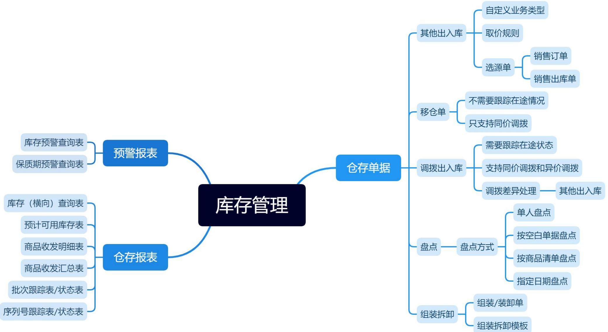

## 应用场景

n 采购、销售调拨等以外的产 生的出入库业务，如损耗、 借入等 

## 特性介绍

n 其他出/入库类型可自定义 

n 可自定义其他入库单取价 规则 

n 其他出入库支持选单（电 子商品返修，实现快速录 单） 

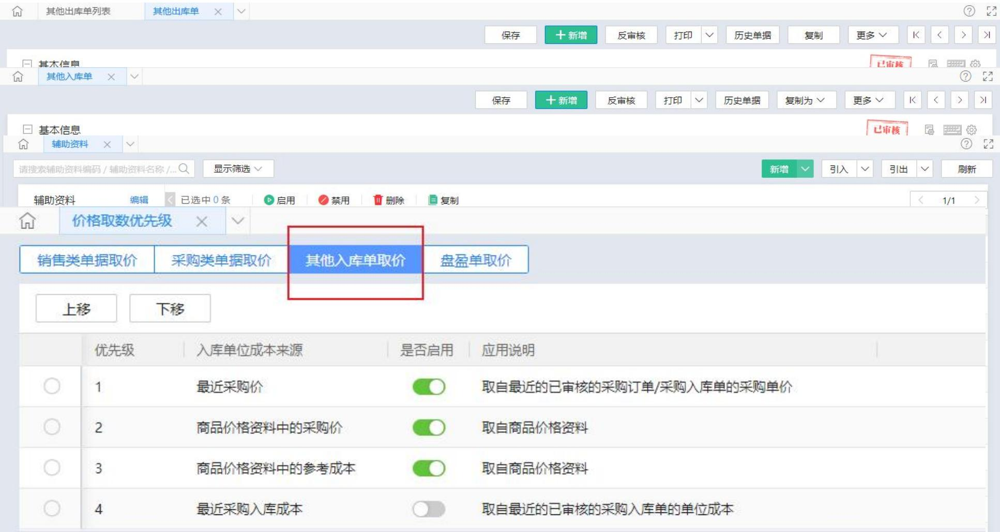

场景： A商品提供了保修服务，客户购买了A商品，损坏，退回维修，修好后寄回给客户。 

## 处理方法：

第一步，在辅助资料其他入库类型中增加“维修入库”，在辅助资料其他出库类型中增加“维修出库”； 

第二步，新增其他入库单，业务类型选择“维修入库”，录入维修入库的商品，此处提供选源单(销售出库单)功能； 

第三步，新增其他出库单，业务类型选择“维修出库”，录入维修出库的商品，此处提供选源单(其他入库单)功能； 

<table><tr><td>账务处理</td><td>商品资料</td><td>价格设置</td><td>业务资料</td></tr><tr><td>财务报表</td><td>商品信息</td><td>商品价格资料</td><td>客户</td></tr><tr><td>出纳管理</td><td>计量单位</td><td>客户价格资料</td><td>客户跟进记录</td></tr><tr><td rowspan="2">资产管理</td><td>商品品牌</td><td>供应商价格资料</td><td>供应商</td></tr><tr><td>标签中心</td><td>价格取数优先级</td><td>部门</td></tr><tr><td>基础资料</td><td>辅助属性</td><td>采购销售限价</td><td>职员</td></tr><tr><td rowspan="7">系统设置</td><td>客户商品编码</td><td></td><td>仓库</td></tr><tr><td>供应商商品编码</td><td></td><td>仓位</td></tr><tr><td>条码生成规则</td><td></td><td>收入类别</td></tr><tr><td>条码标签打印</td><td></td><td>支出类别</td></tr><tr><td></td><td></td><td>辅助资料</td></tr><tr><td></td><td></td><td>结算期限</td></tr><tr><td></td><td></td><td>物流公司</td></tr></table>

<table><tr><td>辅助资料</td><td>编辑</td><td>已选中0条</td><td>启用</td><td>禁用</td><td>删除</td><td>复制</td></tr><tr><td>查找...</td><td></td><td></td><td>类别名称</td><td>辅助资料编码</td><td>辅助资料名称</td><td>状态 备注</td></tr><tr><td>全部</td><td></td><td></td><td>其他入库类型</td><td>DBCYCL01</td><td>调拨差异处理</td><td>可用</td></tr><tr><td>价格等级</td><td></td><td></td><td>其他入库类型</td><td>JR001</td><td>借入</td><td>可用</td></tr><tr><td>交货方式</td><td></td><td></td><td>其他入库类型</td><td>QTRKLX01</td><td>其他入库</td><td>可用</td></tr><tr><td>退货原因</td><td></td><td></td><td>其他入库类型</td><td>WXRK</td><td>维修入库</td><td>可用</td></tr><tr><td>其他入库类型</td><td></td><td></td><td></td><td></td><td></td><td></td></tr><tr><td>其他出库类型</td><td></td><td></td><td></td><td></td><td></td><td></td></tr><tr><td>零售业务类型</td><td></td><td></td><td></td><td></td><td></td><td></td></tr></table>

在企业经营业务中，存在仓库间或仓位间的库存调配，例如，商品从A仓调到B仓，如果仓库相隔不远， 则不需要跟踪商品在途情况；如果仓库相隔较远，需要物流配送，为保证调出仓和调入仓的库存准确性，调 入仓库确认收货后才更新调入仓的库存，同时处理收货差异；对于需要独立核算的仓库（如连锁门店业务）， 总仓向分仓调拨时则会采取加价调拨的形式（异价调拨）。 

星辰通过移仓单和调拨单来处理调拨业务： 

对于不需要处理在途或者仓库内仓位间商品的调动采用移仓单处理 

对于需要处理在途或异价调拨的业务则采用调拨出/入库单处理 

## 调出仓

## 调入仓

商品：批次、保质期、序列号等 库存：在途、错发、漏发、丢失 成本：同价调拨、异价调拨 

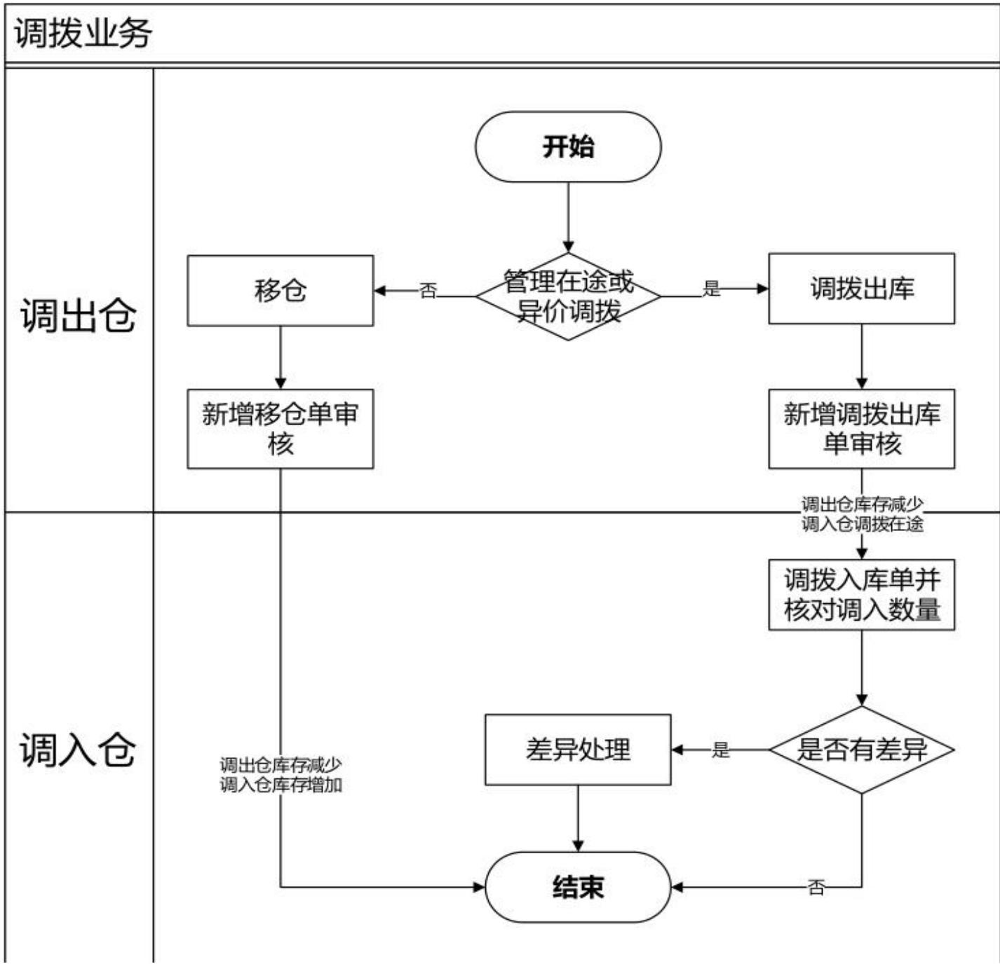

库存更新参数为 审核更新库存

## 应用场景

n 商品报废的移仓 

n 店间调货 

## 特性介绍

n 扣减调出仓库存的同时增 加调入仓库存 

n 没有在途库存 

n 只支持同价调拨 

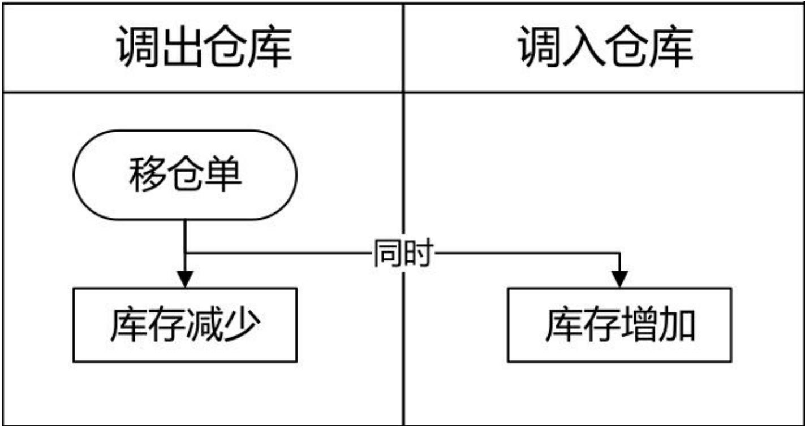

移仓单 

场景:华星光电是一家加工企业，内部经常会有原料或成品在仓库之间的调拨。材料部需要把原材料A调拨到加工仓库去加工，只需 要做一个移仓单就可以实现原料的内部调拨了。 

移仓单主要用于公司内部仓库之间的调拨，不牵涉到货物在途的管理。 

<table><tr><td colspan="13">基本信息</td></tr><tr><td colspan="3">*单据编号</td><td colspan="3">*单据日期</td><td colspan="3">调出部门</td><td colspan="4">调入部门</td></tr><tr><td colspan="3">YCD-20200519-00002</td><td colspan="3">2020-5-19</td><td colspan="3">材料部</td><td colspan="4">材料部二</td></tr><tr><td colspan="13">商品信息</td></tr><tr><td></td><td>*调出仓库</td><td>*调入仓库</td><td>*商品编码</td><td>扫码</td><td>商品名称</td><td>*单位</td><td>*数量</td><td>单位成本</td><td>成本</td><td colspan="3">商品行备注</td></tr><tr><td>1</td><td>原材料仓库</td><td>加工仓库</td><td colspan="2">SP00028</td><td>原材料A</td><td>kg</td><td>100.000</td><td>20.0000</td><td>2,000.0000</td><td colspan="3"></td></tr><tr><td></td><td></td><td></td><td></td><td></td><td></td><td></td><td></td><td></td><td></td><td></td><td></td><td></td></tr></table>

## 应用场景

n 需要管理在途的异地调拨 

n 须门店确认收货后更新库存 

n 调入仓库分批入库 

n 总部加价调拨给门店 

## 特性介绍

n 调出仓出库扣减调出仓库存，调入 仓产生在途库存 

n 调入仓确认收货才更新库存 

n 支持同价/异价调拨 

n 可以处理收货差异 

## 调拨出/入库

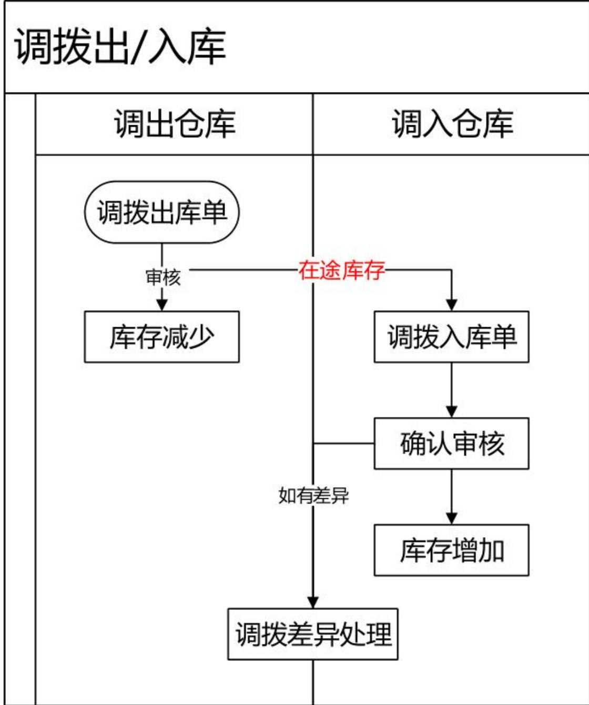

场景:总仓库管理员小王收到一号仓库管理员关于商品苹果X的要货申请，由于和一号仓库在不同的城市，因此，总仓库管理员需要 先做一个调拨出库单，等到一号仓库管理员收到货入库后调拨才真正的完成。 

调拨单多用于仓库在不同地方之间的调拨，调拨出库有同价调拨和异价调拨两种类型，可以根据实际情况进行选择，异价调拨多用 于仓库不在同一个地方的情况，需要将运费等计算到成本内。 

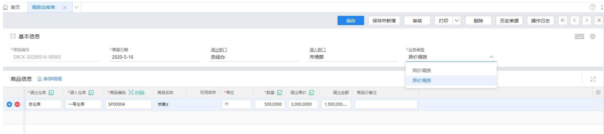

场景:一号仓管员接到总仓库调拨来的货品苹果X，入库时，通过选择总仓库管理员做的调拨出库单，然后核对数量，即可快 速录单入库。 

调拨入库可以通过选择已有的调拨出库单入库，调拨入库的调拨类型和调拨出库的调拨类型是保持一致，不可修改的。 

<table><tr><td colspan="13"></td><td>保存</td><td>保存并新增</td><td>审核</td><td>选择出库单</td><td>历史单据</td><td>操作日志</td></tr><tr><td colspan="19">基本信息</td></tr><tr><td colspan="4">*单据编号DBRK-20200516-00002</td><td colspan="4">*单据日期2020-5-16</td><td colspan="4">调出部门总经办</td><td colspan="3">调入部门市场部</td><td colspan="4">*业务类型异价调拨</td></tr><tr><td colspan="19">商品信息</td></tr><tr><td></td><td>*调出仓库</td><td>*调入仓库</td><td>*商品编码</td><td>商品名称</td><td>可用库存</td><td>*单位</td><td>*数量</td><td>单位成本</td><td>成本</td><td>调入单价</td><td>调入金额</td><td>商品行备注</td><td></td><td></td><td></td><td></td><td></td><td></td></tr><tr><td>+ -</td><td>总仓库</td><td>一号仓库</td><td>SP00004</td><td>苹果X</td><td>597.0000</td><td>个</td><td>500.0000</td><td>3,000.0000</td><td>1,500,000.0000</td><td>3,000.0000</td><td>1,500,000.0000</td><td></td><td></td><td></td><td></td><td></td><td></td><td></td></tr><tr><td></td><td></td><td></td><td></td><td></td><td></td><td></td><td></td><td></td><td></td><td></td><td></td><td></td><td></td><td></td><td></td><td></td><td></td><td></td></tr><tr><td></td><td></td><td></td><td></td><td></td><td></td><td></td><td></td><td></td><td></td><td></td><td></td><td></td><td></td><td></td><td></td><td></td><td></td><td></td></tr><tr><td></td><td></td><td></td><td></td><td></td><td></td><td></td><td></td><td></td><td></td><td></td><td></td><td></td><td></td><td></td><td></td><td></td><td></td><td></td></tr><tr><td></td><td></td><td></td><td></td><td></td><td></td><td></td><td></td><td></td><td></td><td></td><td></td><td></td><td></td><td></td><td></td><td></td><td></td><td></td></tr><tr><td></td><td></td><td></td><td></td><td></td><td></td><td></td><td></td><td></td><td></td><td></td><td></td><td></td><td></td><td></td><td></td><td></td><td></td><td></td></tr><tr><td>合计</td><td></td><td></td><td></td><td></td><td></td><td></td><td>500</td><td></td><td>1,500,000.0000</td><td></td><td>1,500,000.0000</td><td></td><td></td><td></td><td></td><td></td><td></td><td></td></tr></table>

场景:一号仓管员在收到总仓库管理员调来的苹果X时候发现少了15台，只有485台，于是在调拨入库单将入库数量改为485台后 审核入库。然后，对15台未收到货的商品通过调拨差异处理表进行处理，只需要在调拨差异处理单上将未入库的15台手机通过其 他入库单处理即可。 

通过其他入库进行处理后原调拨仓库的数量会相应增加，通过其他出库处理后原调拨仓库数量会相应减少。 

<table><tr><td>首页</td><td colspan="14">调拨差异处理表</td><td></td><td></td></tr><tr><td colspan="15">请搜索单据编号/商品编码/商品名...</td><td></td><td></td></tr><tr><td colspan="15">显示筛选</td><td></td><td></td></tr><tr><td colspan="2">已选中1条</td><td colspan="2">生成其他入库</td><td colspan="11">生成其他出库</td><td></td><td></td></tr><tr><td></td><td></td><td>调拨出库日期</td><td>业务类型</td><td>调拨状态</td><td>调拨出库单编号</td><td>调拨入库单编号</td><td>差异处理状态</td><td>差异处理结果</td><td>调出仓库</td><td>调入仓库</td><td>商品编码</td><td>商品名称</td><td>单位</td><td>出库数量</td><td>入库数量</td><td>差异数量</td></tr><tr><td>1</td><td>2020-5-16</td><td>异价调拨</td><td>部分入库</td><td>DBCK-202005</td><td>DBRK-20200516-00002</td><td>未处理</td><td></td><td></td><td>总仓库</td><td>一号仓库</td><td>SP00004</td><td>苹果X</td><td>个</td><td>500.0000</td><td>485.0000</td><td>-15.0000</td></tr><tr><td>2</td><td>2020-5-16</td><td>异价调拨</td><td>全部入库</td><td>DBCK-202005</td><td>DBRK-20200516-00001</td><td>已处理</td><td colspan="2">QTCK-20200516-00003</td><td>一号仓库</td><td>二号仓库</td><td>SP00001</td><td>001</td><td>个</td><td>10.0000</td><td>20.0000</td><td>10.0000</td></tr><tr><td></td><td></td><td></td><td></td><td></td><td></td><td></td><td></td><td></td><td></td><td></td><td></td><td></td><td></td><td></td><td></td><td></td></tr><tr><td></td><td></td><td></td><td></td><td></td><td></td><td></td><td></td><td></td><td></td><td></td><td></td><td></td><td></td><td></td><td></td><td></td></tr></table>

## 应用场景

n 企业定期对仓库中的商品进行 清点，达到掌握商品库存和损 益的目的 

## 特性介绍

n 支持全盘、抽盘 

n 支持锁盘 

n 支持指定日期盘点 

n 支持商品按批次/保质期/序列号盘 点，也支持这类商品按总量盘点 

场景：一般情况下，企业的盘点工作都是由多人完成，在系统外由多人盘点完成后，汇总最终盘点数据，录入或导 入到系统中，只需要一张盘点单就能得到盈亏数据，进行【盈亏处理】，我们称之为单人盘点。 

第一步，系统外完成实物盘点； 

第二步，系统内创建单人盘点单； 

第三步，手工录入或者引入盘点数据； 

第四步，在盘点单中进行盈亏处理， 

生成盘盈、盘亏单； 

第五步，审核盘盈、盘亏单，更新库存。 

若是要按照商品清单盘点，则第二步要先于第 一步执行，在系统中创建单人盘点单，获取商 品清单，打印出来后，根据清单进行人工盘点 记录数据，然后将盘点结果录入到系统的盘点 单中。 

（盘点单目前已支持覆盖更新，若要更新系统 中已创建的盘点单，需要先引出原来的盘点单， 在EXCEL中编辑盘点数，再执行【覆盖新增】 即可更新已有的盘点单数据。） 

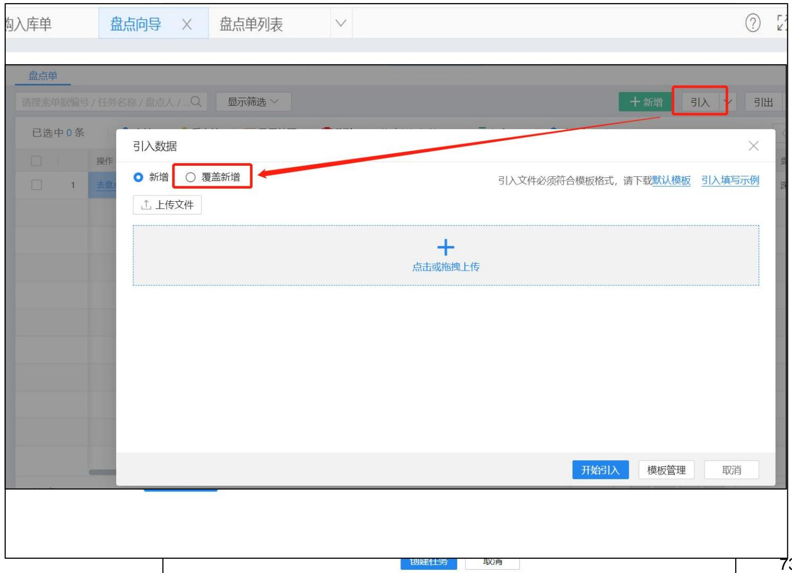

场景一：企业A主营手机，每部手机都有一个序列号，出入库时，需要按照序列号来管理，但盘点时，只需要盘点总量，不需要按 照序列号来盘点。 

场景二：企业B，主营商品启用了序列号，存在部 份价值较大的商品，在盘点时需要按照序列号来盘 点。 

## 说明：

Ø 不按序列号盘点时，盈亏数直接用账存数和盘点 数比较，若有盈亏数，将提示在下游单据中补录 序列号或重新盘点 

Ø 按序列号盘点时，盈亏数用账存的序列号与盘点 的序列号比较，产生盈亏差异。存在账存数与盘 点数相等，而序列号不一致产生盈亏数的情况 

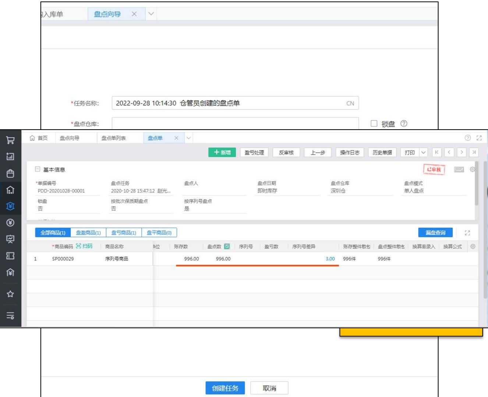

场景一：为了有效管控商品的出入库，在盘点期间，暂停仓库的出、入库业务，可选择【锁盘】，此系统中不允许录入出入库单 据，若有出入库业务发生，可手工记录，事后补录。 

场景二：企业C，每月末最后一天都要进行盘点，可以选择“指定日期盘点”，生成盘点单，获取指定日期的账存数据，这样，若 当天晚上盘点不完，在第二天完成盘点后，录入盘点数，会与指定日期的账存数相比较，生成盈亏。 

场景三：商品A、B、C，价值较大，每天都要盘点，其他价值较小的商品只需要每月盘点，可以选择按商品清单盘点，只盘点商 品A、B、C，即抽盘。 

场景四：企业D主营食品，商品按批次和保质期来管理，但是盘点时，并不按批次和保质期盘点，可不勾选“按批次和保质期盘 点”，直接录入商品的总数量，若有差异，在进行盈亏处理时补录。 

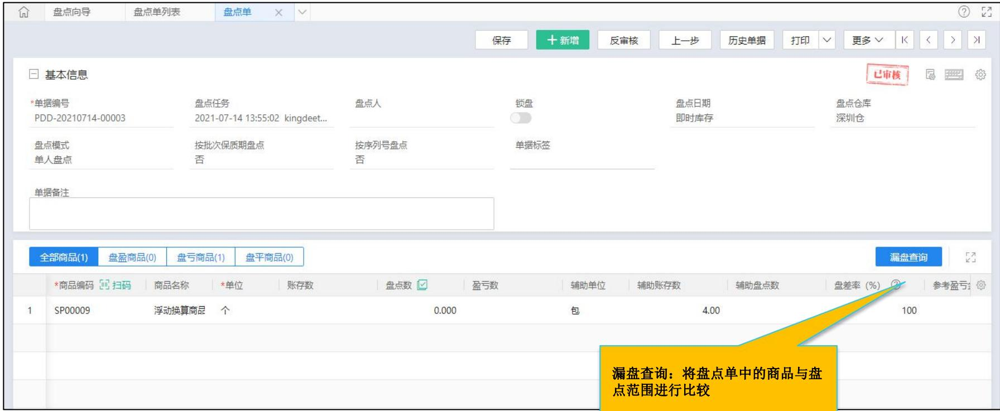

场景：为了解决盘点单商品行数过多，打开慢或者打不开的问题，对盘点单/分量盘点单的性能做了优化，优化为分页显示。 

应用流程：如图所示，在盘点单、分量盘点单单据详情界面中，增加了分页功能，如果商品行数超过每页显示的条数，用户需要 点击下一页、上一页或指定页码来切换显示。 

注意：分页后，列标题上的漏斗过滤功能，只针对当前页进行过滤，不是对单据中的所有商品行过滤，如漏斗过滤当前页查询不 到结果，需要切换右下角分页进行查询。 

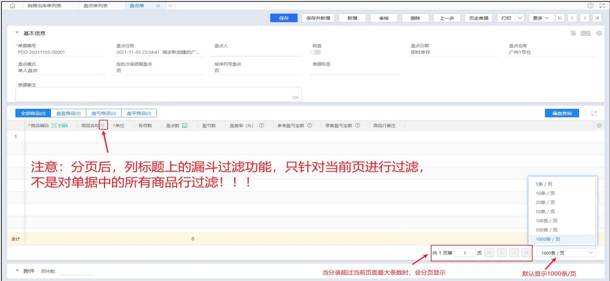

场景一：在盘点单通过【盈亏处理】生成盘盈单。 

场景二：系统外确定商品实际库存比账面库存多，直接新增盘盈单。 

<table><tr><td>盘点向导</td><td>盘点单列表</td><td>盘点单</td><td>盘盈单列表</td><td>盘盈单</td><td>保存</td><td>+新增</td><td>反审核</td><td>打印</td><td>√</td><td>历史单据</td><td>复制</td><td>更多</td><td>&lt;</td><td>&gt;</td><td>&gt;</td></tr><tr><td colspan="16">基本信息</td></tr><tr><td>*单据编号</td><td>*单据日期</td><td>部门</td><td>单据标签</td><td>仓库</td><td></td><td></td><td></td><td></td><td></td><td></td><td></td><td></td><td></td><td></td><td></td></tr><tr><td>PYD-20210310-00005</td><td>2021-03-10</td><td></td><td></td><td>负仓库</td><td></td><td></td><td></td><td></td><td></td><td></td><td></td><td></td><td></td><td></td><td></td></tr><tr><td colspan="16">单据备注</td></tr></table>

场景一：在盘点单通过【盈亏处理】生成盘亏单。 

场景二：系统外确定商品实际库存比账面库存少，直接新增盘亏单。 

<table><tr><td></td><td>商品图片</td><td>*商品编码</td><td>扫码</td><td>商品名称</td><td>条形码</td><td>商品类别</td><td>规格型号</td><td>品牌</td><td>注册证号</td><td>生产许可证</td><td>产地</td><td>*仓库</td><td>可用库存</td><td>?</td><td>*单位</td><td>盘亏数</td><td>整件散</td></tr><tr><td>1</td><td colspan="3">SP00009</td><td colspan="2">浮动换算商品</td><td colspan="6">demo</td><td colspan="3">深圳仓</td><td colspan="3">个</td></tr><tr><td></td><td colspan="17"></td></tr><tr><td></td><td colspan="17"></td></tr><tr><td></td><td colspan="17"></td></tr></table>

组装场景：需要采购原材料或配件后，将多种原材料或配件通过加工或组装的方式，变为一种新的产品销售； 

拆卸场景：多种原材料或配件，经过加工后，可同时生产出不同的几种商品。 

<table><tr><td></td><td>系统参数</td><td>采购入库单</td><td>组装拆卸模板列表</td><td>组装单列表</td><td>组装单</td><td>×</td><td>保存</td><td>+新增</td><td>反审核</td><td>打印</td><td>历史单据</td><td>保存为模板</td><td>复制</td><td>更多</td><td>√</td></tr><tr><td colspan="16">基本信息</td></tr><tr><td colspan="2">*单据编号</td><td colspan="2">*单据日期</td><td colspan="2">部门</td><td colspan="3">单据标签</td><td colspan="3">业务员</td><td colspan="4">仓库</td></tr><tr><td colspan="2">ZZD-20211116-00001</td><td>系统参数</td><td>采购入库单</td><td>组装拆卸模板列表</td><td>组装单列表</td><td>组装单</td><td>拆卸单列表</td><td>拆卸单</td><td>×</td><td>√</td><td></td><td></td><td></td><td></td><td></td></tr><tr><td></td><td></td><td></td><td></td><td></td><td></td><td></td><td></td><td></td><td>保存</td><td>+新增</td><td>反审核</td><td>打印</td><td>历史单据</td><td>保存为模板</td><td>复制</td></tr><tr><td colspan="16">商品信息 库存明细</td></tr><tr><td colspan="16">基本信息</td></tr><tr><td colspan="3">*单据编号</td><td colspan="2">*单据日期</td><td colspan="3">部门</td><td colspan="3">单据标签</td><td colspan="3">业务员</td><td colspan="2">仓库</td></tr><tr><td colspan="3">CXD-20211116-00001</td><td colspan="2">2021-11-16</td><td colspan="3"></td><td colspan="3"></td><td colspan="3"></td><td colspan="2"></td></tr><tr><td colspan="16">拆卸成本差异</td></tr><tr><td colspan="16">商品信息 库存明细</td></tr><tr><td></td><td>*类型</td><td>*商品编码</td><td>商品名称</td><td>*仓库</td><td>可用库存?</td><td>*单位</td><td>*数量</td><td colspan="2">参考单位成本</td><td>商品成本?</td><td>拆卸费用分摊</td><td>成本?</td><td colspan="3">单位成本</td></tr><tr><td>1</td><td>组件</td><td>SP00031</td><td>拆卸单组件</td><td>大海仓库</td><td>100</td><td>个</td><td>1</td><td colspan="2">2.00</td><td></td><td></td><td></td><td></td><td></td><td></td></tr><tr><td>2</td><td>子件</td><td>SP00032</td><td>拆卸单子件1</td><td>大海仓库</td><td>100</td><td>个</td><td>1</td><td colspan="2">1.00</td><td></td><td></td><td></td><td></td><td></td><td></td></tr><tr><td>3</td><td>子件</td><td>SP00033</td><td>拆卸单子件2</td><td>大海仓库</td><td>100</td><td>个</td><td>2</td><td></td><td></td><td></td><td></td><td></td><td></td><td></td><td></td></tr><tr><td>合计</td><td></td><td></td><td></td><td></td><td></td><td></td><td></td><td></td><td></td><td></td><td></td><td></td><td></td><td></td><td></td></tr><tr><td colspan="16">组装费用: 10.00 分摊费用</td></tr></table>

场景：成品和配件的配比关系基本不变，可设置组装/拆卸模版，每次只需修改成品数量，即可自动计算可拆成配件多少。 

批量修改组装拆卸模版：某些子件停产需要替换或者新增或者删减； 

按子件采购：当组装成品时，不确定组装所需的原材料库存是否足够，可在组装拆卸模版中通过“子件采购”计算所需子件数量， 缺料数量，并即时采购； 

按子件领料：当组装成品时，不确定要领用多少材料，可在组装拆卸模版中通过“子件领料”计算所需子件数量，并做领料出库。 

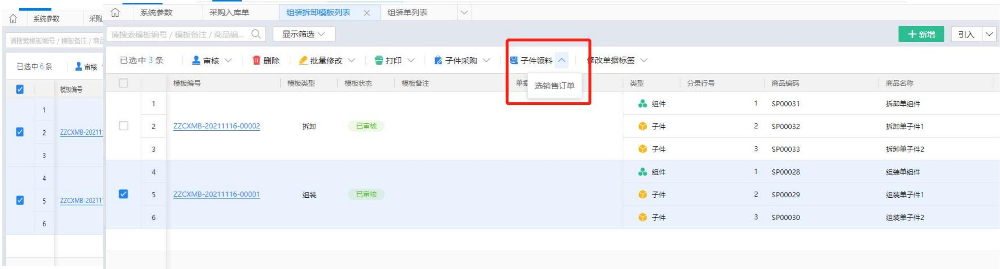

## 应用场景

n 企业使用库存查询表查询即 时库存或者指定日期库存 

## 特性介绍

n 支持查询即时库存或查询指 定日期库存 

n 可按商品/仓库进行展示库存 

n 可按即时/可用库存范围进行 查询商品库存 

n 校对库存用于重算即时库存 

n 勾选计算成本可以查询商品 结存成本（需进行出库核算） 

n 有多个仓库的情况下，横向 库存查询展示比较简单直观 

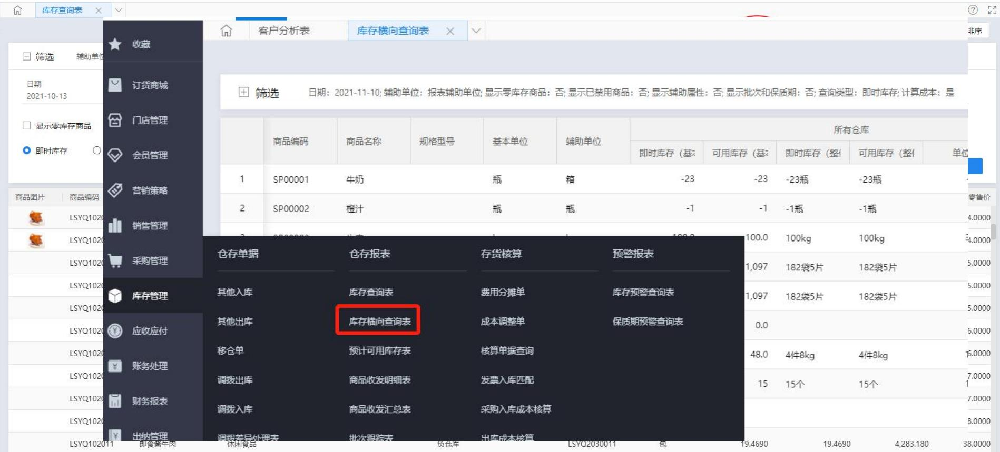

按商品统计按仓库统计 

## 应用场景

n 用于企业查询预计的可用库 存情况 

## 特性介绍

显示零库存商品显示已禁用商品显示辅助属性 显示仓位显示批次和保质期仅显示即时库存和预计可用库存显示小计⑦ 

<table><tr><td></td><td>即时库存(基本)</td><td>预计可用库存(基本)</td><td>⑦</td><td>采购在途(基本)</td><td>调拨在途(基本)</td><td>销售占用(基本)</td><td>销售锁定(基本)</td><td>第三方占用(基本)</td><td>即时库存(辅助)</td><td>预计可用库存(辅助)</td><td>采购在途(辅助)</td><td>调拨在途(辅助)</td></tr><tr><td>1</td><td>0.00</td><td>0.00</td><td>0.00</td><td>0.00</td><td>5.00</td><td>0.00</td><td>0.00</td><td>0.00</td><td>0.00</td><td>0.00</td><td>0.00</td><td>0.00</td></tr><tr><td>2</td><td>14.00</td><td>19.00</td><td>5.00</td><td>0.00</td><td>3.00</td><td>0.00</td><td>0.00</td><td>14.00</td><td>19.00</td><td>5.00</td><td>0.00</td><td></td></tr><tr><td>3</td><td>-3.00</td><td>-3.00</td><td>0.00</td><td>0.00</td><td>0.00</td><td>0.00</td><td>0.00</td><td>-3.00</td><td>-3.00</td><td>0.00</td><td>0.00</td><td></td></tr><tr><td>4</td><td>34.000</td><td>34.000</td><td>0.000</td><td>0.000</td><td>0.000</td><td>0.000</td><td>0.000</td><td>34.000</td><td>34.000</td><td>0.000</td><td>0.000</td><td></td></tr><tr><td>5</td><td>0.00</td><td>0.00</td><td>0.00</td><td>0.00</td><td>1.00</td><td>0.00</td><td>0.00</td><td>0.00</td><td>0.00</td><td>0.00</td><td>0.00</td><td></td></tr><tr><td>6</td><td>4.000</td><td>4.000</td><td>0.000</td><td>0.000</td><td>0.000</td><td>0.000</td><td>0.000</td><td>1.33</td><td>1.33</td><td>0.00</td><td>0.00</td><td></td></tr><tr><td>7</td><td>5.00</td><td>5.00</td><td>0.00</td><td>0.00</td><td>0.00</td><td>0.00</td><td>0.00</td><td>5.00</td><td>5.00</td><td>0.00</td><td>0.00</td><td></td></tr></table>

n 支持查询即时库存或查询指定日期库存 

n 可按商品/仓库进行展示库存 

n 可按即时/可用库存范围进行查询商品库存 

n 全方位展示库存商品状态（调拨在途、待出库、待入库、采购在途、第三方占用等） 

<table><tr><td rowspan="2">商品图片</td><td rowspan="2">商品编码</td><td rowspan="2">商品名称</td><td rowspan="2">单据编号</td><td rowspan="2">单据日期</td><td rowspan="2">审核状态</td><td rowspan="2">仓库</td><td rowspan="2">仓位</td><td rowspan="2">单位</td><td rowspan="2">换算公式</td><td colspan="6">入库</td></tr><tr><td>数量</td><td>辅助数量</td><td>单位成本</td><td>基本单位数量</td><td>基本单位成本</td><td>成本</td></tr><tr><td></td><td>SP00006</td><td>普通辅助属性商品</td><td colspan="13"></td></tr><tr><td></td><td>SP00006</td><td>普通辅助属性商品</td><td>CGRK-20210904-00176</td><td>2021-09-04</td><td>已审核</td><td>深圳仓</td><td colspan="3">↑</td><td>2.000</td><td>10.0000</td><td>2.000</td><td>10.0000</td><td>20.000</td><td></td></tr><tr><td></td><td>SP00006</td><td>普通辅助属性商品</td><td>YCD-20210915-00001</td><td>2021-09-15</td><td>未审核</td><td>深圳仓</td><td colspan="3">↑</td><td></td><td></td><td></td><td></td><td></td><td></td></tr><tr><td></td><td>SP00006</td><td>普通辅助属性商品</td><td>YCD-20210915-00001</td><td>2021-09-15</td><td>未审核</td><td>上海仓</td><td colspan="3">↑</td><td>1.000</td><td></td><td>1.000</td><td></td><td></td><td></td></tr><tr><td></td><td>SP00006</td><td>普通辅助属性商品</td><td colspan="13"></td></tr><tr><td></td><td>SP00006</td><td>普通辅助属性商品</td><td>CGRK-20210904-00176</td><td>2021-09-04</td><td>已审核</td><td>深圳仓</td><td colspan="3">↑</td><td>2.000</td><td>15.0000</td><td>2.000</td><td>15.0000</td><td>30.000</td><td></td></tr><tr><td></td><td>SP00006</td><td>普通辅助属性商品</td><td>YCD-20210915-00001</td><td>2021-09-15</td><td>未审核</td><td>深圳仓</td><td colspan="3">↑</td><td></td><td></td><td></td><td></td><td></td><td></td></tr><tr><td></td><td>SP00006</td><td>普通辅助属性商品</td><td>YCD-20210915-00001.</td><td>2021-09-15</td><td>未审核</td><td>上海仓</td><td colspan="3">↑</td><td>2.000</td><td></td><td>2.000</td><td></td><td></td><td></td></tr><tr><td></td><td>SP00039</td><td>批次+组合辅助</td><td colspan="13"></td></tr><tr><td></td><td>SP00039</td><td>批次+组合辅助</td><td>YCD-20210915-00001</td><td>2021-09-15</td><td>未审核</td><td>深圳仓</td><td colspan="3">↑</td><td></td><td></td><td></td><td></td><td></td><td></td></tr><tr><td></td><td>SP00039</td><td>批次+组合辅助</td><td>YCD-20210915-00001</td><td>2021-09-15</td><td>未审核</td><td>上海仓</td><td colspan="3">↑</td><td>1.000</td><td></td><td>1.000</td><td></td><td></td><td></td></tr></table>

## 应用场景

n 用于查看商品的出入库交易 记录，包括库存数量和成本 

n 若发现账面库存不对，可根 据此表的交易记录定位出错 的时间和单据 

## 特性介绍

n 可展示已审核、未审核的 单据 

n 可按时间段查询库存交易 和结存数 

## 应用场景

n 用于查看商品在各类型的单 据中的总的交易数量及结存 数 

## 特性介绍

n 单据的汇总数据可由用户指定是 否包含未审核的单据 

n 支持多种汇总依据 

n 请注意，期初库存、期末库存不 受单据审核状态的影响，只受系 统参数“库存更新方式”的影响。 

<table><tr><td rowspan="2"></td><td rowspan="2">商品类别</td><td rowspan="2">商品编码</td><td rowspan="2">商品名称</td><td rowspan="2">条形码</td><td rowspan="2">规格型号</td><td rowspan="2">商品品牌</td><td rowspan="2">基本单位</td><td rowspan="2">辅助单位</td><td rowspan="2">换算公式</td><td colspan="4">期初库存</td><td></td></tr><tr><td>基本单位数量 ⑦</td><td>辅助数量</td><td>整件散包</td><td>成本</td><td>基本单</td></tr><tr><td>160</td><td></td><td>00012</td><td>辅助属性排序测试</td><td></td><td></td><td></td><td>个</td><td>个</td><td></td><td>34.000</td><td>34.000</td><td>34个</td><td>90.000</td><td></td></tr><tr><td>161</td><td>休闲食品</td><td>LSYQ102031</td><td>进口咀嚼羊奶片</td><td>LSYQ2030031</td><td></td><td></td><td>包</td><td>包</td><td></td><td>5,208.00</td><td>5,208.00</td><td>5208包</td><td>195,652.432</td><td></td></tr><tr><td>162</td><td>休闲食品</td><td>LSYQ102012</td><td>进口蜜饯</td><td>LSYQ2030012</td><td></td><td></td><td>包</td><td>包</td><td></td><td>5,395.00</td><td>5,395.00</td><td>5395包</td><td>110,783.494</td><td></td></tr><tr><td>163</td><td>啤酒</td><td>LSYQ102086</td><td>重庆山城啤酒</td><td>LSYQ2030086</td><td></td><td></td><td>箱</td><td>箱</td><td></td><td>5,281.00</td><td>5,281.00</td><td>5281箱</td><td>456,901.930</td><td></td></tr><tr><td>164</td><td>白酒</td><td>LSYQ102068</td><td>金贵特曲</td><td>LSYQ2030068</td><td></td><td></td><td>瓶</td><td>瓶</td><td></td><td>5,066</td><td>5,066</td><td>5066瓶</td><td>356,639.870</td><td></td></tr><tr><td>165</td><td></td><td>SE00048</td><td>钉子</td><td></td><td></td><td></td><td>斤</td><td>件</td><td>1件=10斤</td><td>100.00</td><td>10.00</td><td>10件</td><td>1,000.000</td><td></td></tr><tr><td>166</td><td></td><td>SE00047</td><td>钢材</td><td></td><td></td><td></td><td>吨</td><td>件</td><td>1件≈10吨</td><td>100</td><td>10.00</td><td>100吨</td><td>1,000.000</td><td></td></tr><tr><td>167</td><td>红酒</td><td>LSYQ102069</td><td>长城干红</td><td>LSYQ2030069</td><td></td><td></td><td>瓶</td><td>瓶</td><td></td><td>5,176</td><td>5,176</td><td>5176瓶</td><td>369,683.480</td><td></td></tr><tr><td>168</td><td>休闲食品</td><td>LSYQ102009</td><td>长沙臭豆腐</td><td>LSYQ2030009</td><td></td><td></td><td>包</td><td>包</td><td></td><td>5,275.00</td><td>5,275.00</td><td>5275包</td><td>95,243.794</td><td></td></tr><tr><td>169</td><td>白酒</td><td>LSYQ102066</td><td>隆中对酒</td><td>LSYQ2030066</td><td></td><td></td><td>瓶</td><td>瓶</td><td></td><td>5,066</td><td>5,066</td><td>5066瓶</td><td>347,611.000</td><td></td></tr><tr><td>170</td><td>茶叶</td><td>LSYQ102047</td><td>雅安蛾眉毛峰</td><td>LSYQ2030047</td><td></td><td></td><td>袋</td><td>袋</td><td></td><td>5,110.0000</td><td>5,110.0000</td><td>5110袋</td><td>265,078.786</td><td></td></tr><tr><td>171</td><td>白酒</td><td>LSYQ102058</td><td>雷司令干白</td><td>LSYQ2030058</td><td></td><td></td><td>瓶</td><td>瓶</td><td></td><td>5,056</td><td>5,056</td><td>5056瓶</td><td>311,495.580</td><td></td></tr><tr><td>172</td><td>啤酒</td><td>LSYQ102081</td><td>青岛啤酒</td><td>LSYQ2030081</td><td></td><td></td><td>箱</td><td>箱</td><td></td><td>5,266.00</td><td>5,266.00</td><td>5266箱</td><td>433,350.290</td><td></td></tr><tr><td>173</td><td></td><td>SP100002</td><td>饮料</td><td>666</td><td></td><td></td><td>瓶</td><td>包</td><td>1箱=24瓶
1包=6瓶</td><td>8</td><td>1.33</td><td>1包2瓶</td><td></td><td></td></tr><tr><td>174</td><td>白酒</td><td>LSYQ102059</td><td>香格里拉蒙秘青裸干酒</td><td>LSYQ2030059</td><td></td><td></td><td>瓶</td><td>瓶</td><td></td><td>5,054</td><td>5,054</td><td>5054瓶</td><td>316,010.010</td><td></td></tr><tr><td>175</td><td>茶叶</td><td>LSYQ102042</td><td>黄山毛峰</td><td>LSYQ2030042</td><td></td><td></td><td>盒</td><td>盒</td><td></td><td>5,016.00</td><td>5,016.00</td><td>5016盒</td><td>243,703.510</td><td></td></tr><tr><td>176</td><td>糕点</td><td>LSYQ102018</td><td>黑芝麻核桃营养糕</td><td>LSYQ2030018</td><td></td><td></td><td>包</td><td>包</td><td></td><td>17,148.00</td><td>17,148.00</td><td>17148包</td><td>535,300.082</td><td></td></tr><tr><td>177</td><td></td><td></td><td>合计</td><td></td><td></td><td></td><td></td><td></td><td></td><td>836585.9141</td><td>516849.260...</td><td></td><td>23,600,296.936</td><td></td></tr></table>

筛选 汇总依据：商品；类别汇总级次：1；审核状态：全部：显示辅助属性：否；无发生额不显示：否；余额为0不显示：否：显示禁用商品：否：辅助单位：报表辅助单位 

<table><tr><td colspan="4">采购入库</td><td colspan="4">采购退货</td><td colspan="4">盘盈</td><td colspan="4">调拨入库</td></tr><tr><td>基本单位数量</td><td>辅助数量</td><td>整件散包</td><td>成本</td><td>基本单位数量</td><td>辅助数量</td><td>整件散包</td><td>成本</td><td>基本单位数量</td><td>辅助数量</td><td>整件散包</td><td>成本</td><td>基本单位数量</td><td>辅助数量</td><td>整件散包</td><td>成本</td></tr><tr><td></td><td></td><td></td><td></td><td></td><td></td><td></td><td></td><td></td><td></td><td></td><td></td><td></td><td></td><td></td><td></td></tr><tr><td></td><td></td><td></td><td></td><td></td><td></td><td></td><td></td><td></td><td></td><td></td><td></td><td>10.00</td><td>10.00</td><td>10包</td><td>205....</td></tr><tr><td></td><td></td><td></td><td></td><td></td><td></td><td></td><td></td><td></td><td></td><td></td><td></td><td></td><td></td><td></td><td></td></tr><tr><td></td><td></td><td></td><td></td><td></td><td></td><td></td><td></td><td></td><td></td><td></td><td></td><td></td><td></td><td></td><td></td></tr></table>

## 应用场景

n 对于启用批次，需要跟踪批 次商品出入库的全流程及各 批次库存状态及保质期情况 

## 特性介绍

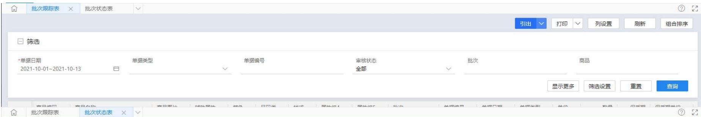

筛选 辅助单位：报表辅助单位：显示零库存商品：否；显示已禁用商品：否；显示小计：否；显示辅助属性：否

<table><tr><td colspan="3">批次</td><td colspan="2">商品</td><td colspan="2">商品类别</td><td colspan="3">商品标签</td><td colspan="2">商品条码</td><td colspan="3">规格型号</td></tr><tr><td colspan="15">□显示零库存商品 □显示已禁用商品 □显示小计 ⑦ □显示辅助属性</td></tr><tr><td></td><td></td><td></td><td></td><td></td><td></td><td></td><td></td><td></td><td></td><td></td><td></td><td></td><td></td><td></td></tr><tr><td rowspan="2">位 可用库存</td><td rowspan="2">辅助单位</td><td colspan="2">辅助单位</td><td colspan="2">整件散包</td><td rowspan="2">保质期</td><td rowspan="2">保质期单位</td><td rowspan="2">生产日期</td><td rowspan="2">到期日</td><td rowspan="2">剩余天数</td><td rowspan="2">文本自定义</td><td rowspan="2">条码123</td><td rowspan="2">数值自定义</td><td></td></tr><tr><td>即时库存</td><td>可用库存</td><td>即时库存</td><td>可用库存</td><td></td></tr><tr><td>1</td><td>5.00</td><td>件</td><td>5.00</td><td>5.00</td><td>5件</td><td>5件</td><td>365</td><td>天</td><td>2021-03-02</td><td>2022-03-01</td><td>139</td><td></td><td></td><td></td></tr><tr><td>2</td><td>1.00</td><td>件</td><td>1.00</td><td>1.00</td><td>1件</td><td>1件</td><td>365</td><td>天</td><td>2019-11-21</td><td>2020-11-19</td><td>-328</td><td></td><td></td><td></td></tr><tr><td>3</td><td>11.00</td><td>件</td><td>11.00</td><td>11.00</td><td>11件</td><td>11件</td><td>365</td><td>天</td><td>2020-02-06</td><td>2021-02-05</td><td>-250</td><td></td><td></td><td></td></tr><tr><td>4</td><td>6.00</td><td>件</td><td>6.00</td><td>6.00</td><td>6件</td><td>6件</td><td>365</td><td>天</td><td>2021-03-10</td><td>2022-03-09</td><td>147</td><td></td><td></td><td></td></tr><tr><td>5</td><td>4.00</td><td>件</td><td>4.00</td><td>4.00</td><td>4件</td><td>4件</td><td>365</td><td>天</td><td>2020-01-15</td><td>2021-01-13</td><td>-273</td><td></td><td></td><td></td></tr><tr><td>6</td><td>3.00</td><td>件</td><td>3.00</td><td>3.00</td><td>3件</td><td>3件</td><td>365</td><td>天</td><td>2020-05-01</td><td>2021-04-30</td><td>-166</td><td></td><td></td><td></td></tr><tr><td>7</td><td>2.00</td><td>件</td><td>2.00</td><td>2.00</td><td>2件</td><td>2件</td><td>365</td><td>天</td><td>2019-11-01</td><td>2020-10-30</td><td>-348</td><td></td><td></td><td></td></tr></table>

n 查询批次商品的当前库存状态、来源及去向 

n 跟踪批次对应的保质期时间 

n 支持查询批次距离到期日的天数（负数即已过期） 

<table><tr><td>*单据日期2020/04/01 - 2020/04/02</td><td>序列号</td><td>仓库</td><td>在库状态全部</td><td>商品</td><td>审核状态全部</td></tr><tr><td>商品类别</td><td>商品品牌</td><td>供应商</td><td>全部在库已出库调拨在途待入库待出库</td><td>客户</td><td>单据编号</td></tr><tr><td>业务员</td><td>制单人</td><td>最后修改人</td><td></td><td></td><td></td></tr></table>

<table><tr><td rowspan="36">首页</td><td rowspan="36">序列号状态表</td><td rowspan="36">序列号跟踪表</td><td rowspan="36" colspan="101"></td><td></td><td></td><td></td><td></td><td></td><td></td><td></td><td></td></tr><tr><td></td><td></td><td></td><td></td><td></td><td></td><td></td><td></td></tr><tr><td></td><td></td><td></td><td></td><td></td><td></td><td></td><td></td><td></td><td></td><td></td><td></td><td></td><td></td><td></td></tr><tr><td></td><td></td><td></td><td></td><td></td><td></td><td></td><td></td><td></td><td></td><td></td><td></td><td></td><td></td><td></td><td></td><td></td><td></td><td></td><td></td><td></td><td></td></tr><tr><td></td><td></td><td></td><td></td><td></td><td></td><td></td><td></td><td></td><td></td><td></td><td></td><td></td><td></td><td></td><td></td><td></td><td></td><td></td><td></td><td></td><td></td><td></td><td></td><td></td><td></td></tr><tr><td></td><td></td><td></td><td></td><td></td><td></td><td></td><td></td><td></td><td></td><td></td><td></td><td></td><td></td><td></td><td></td><td></td><td></td><td></td><td></td><td></td><td></td><td></td><td></td><td></td><td></td><td></td><td></td><td></td><td></td><td></td></tr><tr><td></td><td></td><td></td><td></td><td></td><td></td><td></td><td></td><td></td><td></td><td></td><td></td><td></td><td></td><td></td><td></td><td></td><td></td><td></td><td></td><td></td><td></td><td></td><td></td><td></td><td></td><td></td><td></td><td></td><td></td><td></td><td></td><td></td><td></td><td></td></tr><tr><td rowspan="9" colspan="58">单位</td><td></td><td></td><td></td><td></td><td></td><td></td><td></td><td></td><td></td><td></td></tr><tr><td></td><td></td><td></td><td></td><td></td><td></td><td></td><td></td><td></td><td></td><td></td><td></td><td></td><td></td><td></td><td></td><td></td><td></td><td></td><td></td><td></td><td></td><td></td><td></td><td></td><td></td><td></td><td></td><td></td><td></td><td></td><td></td><td></td></tr><tr><td></td><td></td><td></td><td></td><td></td><td></td><td></td><td></td><td></td><td></td><td></td><td></td><td></td><td></td><td></td><td></td><td></td><td></td><td></td><td></td><td></td><td></td><td></td><td></td><td></td><td></td><td></td><td></td><td></td><td></td><td></td><td></td><td></td><td></td><td></td><td></td><td></td><td></td><td></td></tr><tr><td></td><td></td><td></td><td></td><td></td><td></td><td></td><td></td><td></td><td></td><td></td><td></td><td></td><td></td><td></td><td></td><td></td><td></td><td></td><td></td><td></td><td></td><td></td><td></td><td></td><td></td><td></td><td></td><td></td><td></td><td></td><td></td><td></td><td></td><td></td><td></td><td></td><td></td><td></td><td></td><td></td><td></td><td></td></tr><tr><td></td><td></td><td></td><td></td><td></td><td></td><td></td><td></td><td></td><td></td><td></td><td></td><td></td><td></td><td></td><td></td><td></td><td></td><td></td><td></td><td></td><td></td><td></td><td></td><td></td><td></td><td></td><td></td><td></td><td></td><td></td><td></td><td></td><td></td><td></td><td></td><td></td><td></td><td></td><td></td><td></td><td></td><td></td><td></td><td></td><td></td><td></td></tr><tr><td></td><td></td><td></td><td></td><td></td><td></td><td></td><td></td><td></td><td></td><td></td><td></td><td></td><td></td><td></td><td></td><td></td><td></td><td></td><td></td><td></td><td></td><td></td><td></td><td></td><td></td><td></td><td></td><td></td><td></td><td></td><td></td><td></td><td></td><td></td><td></td><td></td><td></td><td></td><td></td><td></td><td></td><td></td><td></td><td></td><td></td><td></td><td></td></tr><tr><td></td><td></td><td></td><td></td><td></td><td></td><td></td><td></td><td></td><td></td><td></td><td></td><td></td><td></td><td></td><td></td><td></td><td></td><td></td><td></td><td></td><td></td><td></td><td></td><td></td><td></td><td></td><td></td><td></td><td></td><td></td><td></td><td></td><td></td><td></td><td></td><td></td><td></td><td></td><td></td><td></td><td></td><td></td><td></td><td></td><td></td><td></td><td></td><td></td><td></td><td></td></tr><tr><td></td><td></td><td></td><td></td><td></td><td></td><td></td><td></td><td></td><td></td><td></td><td></td><td></td><td></td><td></td><td></td><td></td><td></td><td></td><td></td><td></td><td></td><td></td><td></td><td></td><td></td><td></td><td></td><td></td><td></td><td></td><td></td><td></td><td></td><td></td><td></td><td></td><td></td><td></td><td></td><td></td><td></td><td></td><td></td><td></td><td></td><td></td><td></td><td></td><td></td><td></td><td></td><td></td></tr><tr><td></td><td></td><td></td><td></td><td></td><td></td><td></td><td></td><td></td><td></td><td></td><td></td><td></td><td></td><td></td><td></td><td></td><td></td><td></td><td></td><td></td><td></td><td></td><td></td><td></td><td></td><td></td><td></td><td></td><td></td><td></td><td></td><td></td><td></td><td></td><td></td><td></td><td></td><td></td><td></td><td></td><td></td><td></td><td></td><td></td><td></td><td></td><td></td><td></td><td></td><td></td><td></td><td></td><td></td></tr><tr><td rowspan="8" colspan="46">全部</td><td></td><td></td><td></td><td></td><td></td><td></td><td></td><td></td><td></td><td></td><td></td><td></td><td></td><td></td><td></td><td></td><td></td><td></td><td></td><td></td><td></td><td></td><td></td><td></td><td></td><td></td><td></td><td></td><td></td><td></td><td></td></tr><tr><td></td><td></td><td></td><td></td><td></td><td></td><td></td><td></td><td></td><td></td><td></td><td></td><td></td><td></td><td></td><td></td><td></td><td></td><td></td><td></td><td></td><td></td><td></td><td></td><td></td><td></td><td></td><td></td><td></td><td></td><td></td><td></td><td></td><td></td><td></td><td></td><td></td><td></td><td></td><td></td><td></td><td></td><td></td><td></td><td></td><td></td><td></td><td></td><td></td><td></td><td></td><td></td><td></td><td></td></tr><tr><td></td><td></td><td></td><td></td><td></td><td></td><td></td><td></td><td></td><td></td><td></td><td></td><td></td><td></td><td></td><td></td><td></td><td></td><td></td><td></td><td></td><td></td><td></td><td></td><td></td><td></td><td></td><td></td><td></td><td></td><td></td><td></td><td></td><td></td><td></td><td></td><td></td><td></td><td></td><td></td><td></td><td></td><td></td><td></td><td></td><td></td><td></td><td></td><td></td><td></td><td></td><td></td><td></td><td></td><td></td><td></td></tr><tr><td></td><td></td><td></td><td></td><td></td><td></td><td></td><td></td><td></td><td></td><td></td><td></td><td></td><td></td><td></td><td></td><td></td><td></td><td></td><td></td><td></td><td></td><td></td><td></td><td></td><td></td><td></td><td></td><td></td><td></td><td></td><td></td><td></td><td></td><td></td><td></td><td></td><td></td><td></td><td></td><td></td><td></td><td></td><td></td><td></td><td></td><td></td><td></td><td></td><td></td><td></td><td></td><td></td><td></td><td></td><td></td><td></td></tr><tr><td></td><td></td><td></td><td></td><td></td><td></td><td></td><td></td><td></td><td></td><td></td><td></td><td></td><td></td><td></td><td></td><td></td><td></td><td></td><td></td><td></td><td></td><td></td><td></td><td></td><td></td><td></td><td></td><td></td><td></td><td></td><td></td><td></td><td></td><td></td><td></td><td></td><td></td><td></td><td></td><td></td><td></td><td></td><td></td><td></td><td></td><td></td><td></td><td></td><td></td><td></td><td></td><td></td><td></td><td></td><td></td><td></td><td></td><td></td><td></td></tr><tr><td></td><td></td><td></td><td></td><td></td><td></td><td></td><td></td><td></td><td></td><td></td><td></td><td></td><td></td><td></td><td></td><td></td><td></td><td></td><td></td><td></td><td></td><td></td><td></td><td></td><td></td><td></td><td></td><td></td><td></td><td></td><td></td><td></td><td></td><td></td><td></td><td></td><td></td><td></td><td></td><td></td><td></td><td></td><td></td><td></td><td></td><td></td><td></td><td></td><td></td><td></td><td></td><td></td><td></td><td></td><td></td><td></td><td></td><td></td><td></td><td></td><td></td><td></td></tr><tr><td></td><td></td><td></td><td></td><td></td><td></td><td></td><td></td><td></td><td></td><td></td><td></td><td></td><td></td><td></td><td></td><td></td><td></td><td></td><td></td><td></td><td></td><td></td><td></td><td></td><td></td><td></td><td></td><td></td><td></td><td></td><td></td><td></td><td></td><td></td><td></td><td></td><td></td><td></td><td></td><td></td><td></td><td></td><td></td><td></td><td></td><td></td><td></td><td></td><td></td><td></td><td></td><td></td><td></td><td></td><td></td><td></td><td></td><td></td><td></td><td></td><td></td><td></td><td></td><td></td><td></td><td></td></tr><tr><td></td><td></td><td></td><td></td><td></td><td></td><td></td><td></td><td></td><td></td><td></td><td></td><td></td><td></td><td></td><td></td><td></td><td></td><td></td><td></td><td></td><td></td><td></td><td></td><td></td><td></td><td></td><td></td><td></td><td></td><td></td><td></td><td></td><td></td><td></td><td></td><td></td><td></td><td></td><td></td><td></td><td></td><td></td><td></td><td></td><td></td><td></td><td></td><td></td><td></td><td></td><td></td><td></td><td></td><td></td><td></td><td></td><td></td><td></td><td></td><td></td><td></td><td></td><td></td><td></td><td></td><td></td><td></td><td></td></tr><tr><td rowspan="2" colspan="43">全部</td><td></td><td></td><td></td><td></td><td></td><td></td><td></td><td></td><td></td><td></td><td></td><td></td><td></td><td></td><td></td><td></td><td></td><td></td><td></td><td></td><td></td><td></td><td></td><td></td><td></td><td></td><td></td><td></td><td></td><td></td><td></td><td></td><td></td><td></td><td></td><td></td></tr><tr><td></td><td></td><td></td><td></td><td></td><td></td><td></td><td></td><td></td><td></td><td></td><td></td><td></td><td></td><td></td><td></td><td></td><td></td><td></td><td></td><td></td><td></td><td></td><td></td><td></td><td></td><td></td><td></td><td></td><td></td><td></td><td></td><td></td><td></td><td></td><td></td><td></td><td></td><td></td><td></td><td></td><td></td><td></td><td></td><td></td><td></td><td></td><td></td><td></td><td></td><td></td><td></td><td></td><td></td><td></td><td></td><td></td><td></td><td></td><td></td><td></td><td></td><td></td><td></td><td></td><td></td><td></td><td></td><td></td><td></td></tr><tr><td colspan="42">全部</td><td></td><td></td><td></td><td></td><td></td><td></td><td></td><td></td><td></td><td></td><td></td><td></td><td></td><td></td><td></td><td></td><td></td><td></td><td></td><td></td><td></td><td></td><td></td><td></td><td></td><td></td><td></td><td></td><td></td><td></td><td></td><td></td><td></td><td></td><td></td><td></td><td></td></tr><tr><td colspan="42">全部</td><td></td><td></td><td></td><td></td><td></td><td></td><td></td><td></td><td></td><td></td><td></td><td></td><td></td><td></td><td></td><td></td><td></td><td></td><td></td><td></td><td></td><td></td><td></td><td></td><td></td><td></td><td></td><td></td><td></td><td></td><td></td><td></td><td></td><td></td><td></td><td></td><td></td></tr><tr><td colspan="15">全部</td><td colspan="38">全部</td><td></td><td></td><td></td><td></td><td></td><td></td><td></td><td></td><td></td><td></td><td></td><td></td><td></td><td></td><td></td><td></td><td></td><td></td><td></td><td></td><td></td><td></td><td></td><td></td><td></td><td></td><td></td><td></td><td></td><td></td><td></td><td></td><td></td><td></td><td></td><td></td><td></td><td></td><td></td><td></td></tr><tr><td colspan="15">全部</td><td colspan="24">全部</td><td></td><td></td><td></td><td></td><td></td><td></td><td></td><td></td><td></td><td></td><td></td><td></td><td></td><td></td><td></td><td></td><td></td><td></td><td></td><td></td><td></td><td></td><td></td><td></td><td></td><td></td><td></td><td></td><td></td><td></td><td></td><td></td><td></td><td></td><td></td><td></td><td></td><td></td><td></td><td></td><td></td><td></td><td></td><td></td><td></td><td></td><td></td><td></td><td></td><td></td><td></td><td></td><td></td><td></td></tr><tr><td colspan="15">全部</td><td colspan="31">全部</td><td></td><td></td><td></td><td></td><td></td><td></td><td></td><td></td><td></td><td></td><td></td><td></td><td></td><td></td><td></td><td></td><td></td><td></td><td></td><td></td><td></td><td></td><td></td><td></td><td></td><td></td><td></td><td></td><td></td><td></td><td></td><td></td><td></td><td></td><td></td><td></td><td></td><td></td><td></td><td></td><td></td><td></td><td></td><td></td><td></td><td></td><td></td></tr><tr><td colspan="15">全部</td><td colspan="28">全部</td><td></td><td></td><td></td><td></td><td></td><td></td><td></td><td></td><td></td><td></td><td></td><td></td><td></td><td></td><td></td><td></td><td></td><td></td><td></td><td></td><td></td><td></td><td></td><td></td><td></td><td></td><td></td><td></td><td></td><td></td><td></td><td></td><td></td><td></td><td></td><td></td><td></td><td></td><td></td><td></td><td></td><td></td><td></td><td></td><td></td><td></td><td></td><td></td><td></td><td></td></tr><tr><td colspan="15">全部</td><td colspan="25">全部</td><td></td><td></td><td></td><td></td><td></td><td></td><td></td><td></td><td></td><td></td><td></td><td></td><td></td><td></td><td></td><td></td><td></td><td></td><td></td><td></td><td></td><td></td><td></td><td></td><td></td><td></td><td></td><td></td><td></td><td></td><td></td><td></td><td></td><td></td><td></td><td></td><td></td><td></td><td></td><td></td><td></td><td></td><td></td><td></td><td></td><td></td><td></td><td></td><td></td><td></td><td></td><td></td><td></td></tr><tr><td colspan="15">全部</td><td colspan="24">全部</td><td></td><td></td><td></td><td></td><td></td><td></td><td></td><td></td><td></td><td></td><td></td><td></td><td></td><td></td><td></td><td></td><td></td><td></td><td></td><td></td><td></td><td></td><td></td><td></td><td></td><td></td><td></td><td></td><td></td><td></td><td></td><td></td><td></td><td></td><td></td><td></td><td></td><td></td><td></td><td></td><td></td><td></td><td></td><td></td><td></td><td></td><td></td><td></td><td></td><td></td><td></td><td></td><td></td><td></td></tr><tr><td>客户</td><td></td><td></td><td></td><td></td><td></td><td></td><td></td><td></td><td></td><td></td><td></td><td></td><td></td><td></td><td></td><td></td><td></td><td></td><td></td><td></td><td></td><td></td><td></td><td></td><td></td><td></td><td></td><td></td><td></td><td></td><td></td><td></td><td></td><td></td><td></td><td></td><td></td><td></td><td></td><td></td><td></td><td></td><td></td><td></td><td></td><td></td><td></td><td></td><td></td><td></td><td></td><td></td><td></td><td></td><td></td><td></td><td></td><td></td><td></td><td></td><td></td><td></td><td></td><td></td><td></td><td></td><td></td><td></td><td></td><td></td><td></td><td></td><td></td><td></td><td></td><td></td><td></td><td></td><td></td><td></td><td></td><td></td><td></td><td></td><td></td><td></td><td></td><td></td><td></td><td></td><td></td><td></td><td></td><td></td><td></td><td></td><td></td><td></td><td></td><td></td></tr><tr><td>序列号跟踪表</td><td>×</td><td></td><td></td><td></td><td></td><td></td><td></td><td></td><td></td><td></td><td></td><td></td><td></td><td></td><td></td><td></td><td></td><td></td><td></td><td></td><td></td><td></td><td></td><td></td><td></td><td></td><td></td><td></td><td></td><td></td><td></td><td></td><td></td><td></td><td></td><td></td><td></td><td></td><td></td><td></td><td></td><td></td><td></td><td></td><td></td><td></td><td></td><td></td><td></td><td></td><td></td><td></td><td></td><td></td><td></td><td></td><td></td><td></td><td></td><td></td><td></td><td></td><td></td><td></td><td></td><td></td><td></td><td></td><td></td><td></td><td></td><td></td><td></td><td></td><td></td><td></td><td></td><td></td><td></td><td></td><td></td><td></td><td></td><td></td><td></td><td></td><td></td><td></td><td></td><td></td><td></td><td></td><td></td><td></td><td></td><td></td><td></td><td></td><td></td><td></td></tr></table>

## 应用场景

n 3C数码等行业，掌握序列号 的在库状态并跟踪每个序列 号的详细出入库情况。 

筛选单据日期.开始：2020-04-01;审核状态：全部：在库状态：全部 

## 特性介绍

n 详细展示序列号的库存状态 （在库、出库、待入库、待出库、 调拨在途 

n 全流程追溯序列号的出入库 过程（从供应商到客户） 

<table><tr><td>商品编码</td><td>商品名称</td><td>辅助属性</td><td>批次</td><td>到期日</td><td>序列号</td><td>单据日期</td><td>仓库</td><td>单据类型</td><td>单据编号</td><td>客户</td><td>供应商</td><td>在库状态</td><td>审核状态</td></tr><tr><td>SP00067</td><td>序列号</td><td></td><td></td><td></td><td>kg003</td><td>2020-04-02</td><td>生鲜仓</td><td>销售出库</td><td>XSCK-20200402-00001</td><td>万事利</td><td></td><td>已出库</td><td>已审核</td></tr><tr><td>SP00067</td><td>序列号</td><td></td><td></td><td></td><td>kg004</td><td></td><td>生鲜仓</td><td>商品期初</td><td></td><td></td><td></td><td></td><td></td></tr><tr><td>SP00067</td><td>序列号</td><td></td><td></td><td></td><td>kg004</td><td>2020-04-02</td><td>生鲜仓</td><td>销售出库</td><td>XSCK-20200402-00001</td><td>万事利</td><td></td><td>已出库</td><td>已审核</td></tr><tr><td>SP00067</td><td>序列号</td><td></td><td></td><td></td><td>kg005</td><td></td><td>生鲜仓</td><td>商品期初</td><td></td><td></td><td></td><td></td><td></td></tr><tr><td>SP00067</td><td>序列号</td><td></td><td></td><td></td><td>kg005</td><td>2020-04-02</td><td>生鲜仓</td><td>销售出库</td><td>XSCK-20200402-00001</td><td>万事利</td><td></td><td>已出库</td><td>已审核</td></tr><tr><td>SP00067</td><td>序列号</td><td></td><td></td><td></td><td>kg006</td><td></td><td>生鲜仓</td><td>商品期初</td><td></td><td></td><td></td><td></td><td></td></tr><tr><td>SP00067</td><td>序列号</td><td></td><td></td><td></td><td>kg006</td><td>2020-04-02</td><td>生鲜仓</td><td>采购退货</td><td>CGTH-20200402-00007</td><td></td><td>大明</td><td>待出库</td><td>未审核</td></tr><tr><td>SP00067</td><td>序列号</td><td></td><td></td><td></td><td>kg007</td><td></td><td>生鲜仓</td><td>商品期初</td><td></td><td></td><td></td><td></td><td></td></tr><tr><td>SP00067</td><td>序列号</td><td></td><td></td><td></td><td>kg007</td><td>2020-04-02</td><td>生鲜仓</td><td>采购退货</td><td>CGTH-20200402-00008</td><td></td><td>武汉加油</td><td>待出库</td><td>未审核</td></tr><tr><td>SP00067</td><td>序列号</td><td></td><td></td><td></td><td>kg008</td><td></td><td>生鲜仓</td><td>商品期初</td><td></td><td></td><td></td><td>在库</td><td></td></tr><tr><td>SP00067</td><td>序列号</td><td></td><td></td><td></td><td>kg009</td><td></td><td>生鲜仓</td><td>商品期初</td><td></td><td></td><td></td><td>在库</td><td></td></tr></table>

场景:对于有库存预警功能需求的用户，可以启用库存预警，设置最高、最低和安全库存，登录软件时，超出预警库存将会在首 页和库存预警表提示，并直接从库存预警表下推到采购订单，满足库存管理业务需求。 

在库存管理—库存预警查询表中，可以统计出当前库存状况，对于库存不足的商品可以选中分录点击右上角生成采购订单及时 备货；如果勾选了右上角【登录时首页预警提醒】当出现预警商品时，登录时首页会有预警提醒； 

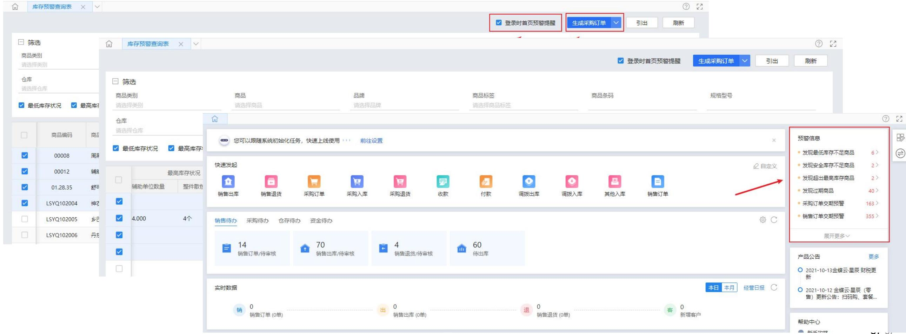

场景: 对于食品，餐饮，海鲜批发等行业，在进行保质期管理时，为避免商品过保质期导致无法销售，系统提供了保质期预警查 询表，对有保质期需要的商品进行预警提醒。 

在库存管理—保质期预警查询表中，可以查询预警期间内的商品和过期商品；同时，为及时提醒对临近保质期商品进行业务处 理，系统提供了出现进入保质期预警期内的商品首页预警提醒的功能，可以在报表右上角勾选开启和关闭；此外，报表支持引 出和打印功能； 

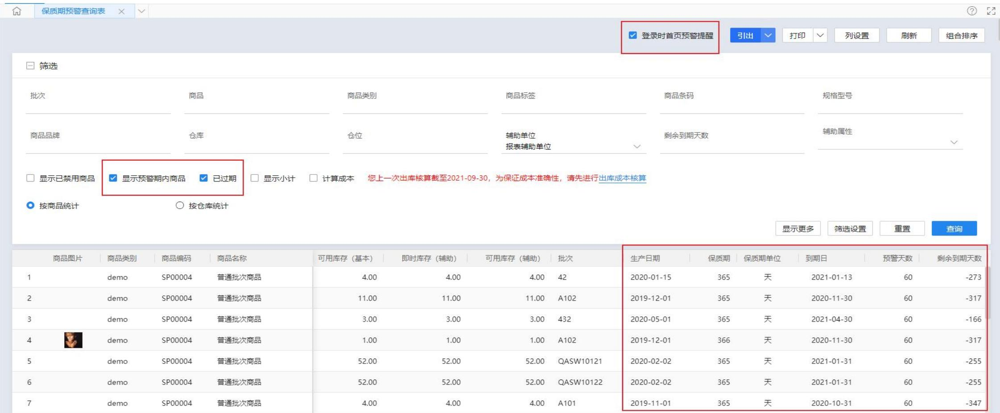

<table><tr><td></td><td>商品图片</td><td>商品类别</td><td>商品编码</td><td>商品名称</td><td>可用库存(基本)</td><td>即时库存(辅助)</td><td>可用库存(辅助)</td><td>批次</td><td>生产日期</td><td>保质期</td><td>保质期单位</td><td>到期日</td><td>预警天数</td><td>剩余到期天数</td></tr><tr><td>1</td><td></td><td>demo</td><td>SP00004</td><td>普通批次商品</td><td>4.00</td><td>4.00</td><td>4.00</td><td>42</td><td>2020-01-15</td><td>365</td><td>天</td><td>2021-01-13</td><td>60</td><td>-273</td></tr><tr><td>2</td><td></td><td>demo</td><td>SP00004</td><td>普通批次商品</td><td>11.00</td><td>11.00</td><td>11.00</td><td>A102</td><td>2019-12-01</td><td>365</td><td>天</td><td>2020-11-30</td><td>60</td><td>-317</td></tr><tr><td>3</td><td></td><td>demo</td><td>SP00004</td><td>普通批次商品</td><td>3.00</td><td>3.00</td><td>3.00</td><td>432</td><td>2020-05-01</td><td>365</td><td>天</td><td>2021-04-30</td><td>60</td><td>-166</td></tr><tr><td>4</td><td></td><td>demo</td><td>SP00004</td><td>普通批次商品</td><td>1.00</td><td>1.00</td><td>1.00</td><td>A102</td><td>2019-12-01</td><td>366</td><td>天</td><td>2020-11-30</td><td>60</td><td>-317</td></tr><tr><td>5</td><td></td><td>demo</td><td>SP00004</td><td>普通批次商品</td><td>52.00</td><td>52.00</td><td>52.00</td><td>QASW10121</td><td>2020-02-02</td><td>365</td><td>天</td><td>2021-01-31</td><td>60</td><td>-255</td></tr><tr><td>6</td><td></td><td>demo</td><td>SP00004</td><td>普通批次商品</td><td>52.00</td><td>52.00</td><td>52.00</td><td>QASW10122</td><td>2020-02-02</td><td>365</td><td>天</td><td>2021-01-31</td><td>60</td><td>-255</td></tr><tr><td>7</td><td></td><td>demo</td><td>SP00004</td><td>普通批次商品</td><td>4.00</td><td>4.00</td><td>4.00</td><td>A101</td><td>2019-11-01</td><td>365</td><td>天</td><td>2020-10-31</td><td>60</td><td>-347</td></tr></table>

## ขอบคุณ 感謝 Thanks ありがとう terima kasih 谢谢

## 特别声明

• 没有金蝶软件国际软件集团有限公司的特别许可，任何人不能以任何形式或为任何目的复制或传播本文档的任何部分。本文档中包含的信息如 有更改，恕不另行通知。 

• 由金蝶软件（中国）有限公司和其分销商所销售的某些软件产品包含有其它软件供应商版权所有的软件组件。 

• Microsoft®、WINDOWS®、NT®、EXCEL®、Word®、PowerPoint® 和SQL Server® 是微软公司的注册商标。 

IBM®、DB2®、DB2 通用数据库、OS/2®、Parallel Sysplex®、MVS/ESA、AIX®、S/390®、AS/400®、OS/390®、OS/400®、 iSeries、pSeries、xSeries、zSeries、z/OS、AFP、Intelligent Miner、WebSphere®、Netfinity®、Tivoli®、Informix 和Informix® 动 态ServerTM 是国际商业机器公司在美国或其他公司的商标。 

ORACLE® 是ORACLE 公司的注册商标。 

• UNIX®是UNIX INTERNATIONAL CO.,LIMTED的注册商标、OSF/1® 和Motif® 是Open Group 的注册商标。 

Citrix®、Citrix 徽标、ICA、Program Neighborhood® 、MetaFrame® 、WinFrame® 、VideoFrame® 、MultiWin®以及此处引用的 Citrix 产品名是Citrix Systems 公司的商标或注册商标。 

• HTML是HATEMOGLU TEKSTIL GIYIM SANAYI VE TICARET A.S.的注册商标，DHTML、XML和XHTML 是W3C®、World Wide Web 协 会、计算机科学实验室的商标或注册商标，PureXML是国际商业机器公司的注册商标。 

JAVA® 是甲骨文美国有限公司的注册商标。 

JAVASCRIPT®是甲骨文美国有限公司的注册商标，由其技术开发和实施商Netscape 许可使用。 

Apusic ®是深圳市金蝶中间件有限公司的注册商标。 

• 本文档提到的金蝶® 、金蝶KIS ® 、K/3 ®、金蝶EAS ® 、友商网 ®和其它金蝶 产品和服务以及它们各自的徽标是金蝶软件（中国）有限 公司在中国和世界其它一些国家的商标或注册商标。本文档提到的所有其它产品和服务名称是它们各自公司的商标。 