以下是MySQL中对User对象的定义： 

```sql
CREATE TABLE `tbl_user` (
    `id` int(11) NOT NULL auto_increment,
    `enablement_enabled` tinyint(1) NOT NULL,
    `enablement_end_date` datetime,
    `enablement_start_date` datetime,
    `password` varchar(32) NOT NULL,
    `tenant_id_id` varchar(36) NOT NULL,
    `username` varchar(25) NOT NULL,
    KEY `k_tenant_id_id` (`tenant_id_id`),
    UNIQUE KEY `k_tenant_id_username` (`tenant_id_id`, `username`),
    PRIMARY KEY (`id`)
) ENGINE=InnoDB; 
```

第一列，id，即为委派标识。最后一行将id作为表的主键。这里我们可以区分出委派标识和领域标识。其中的两列——tenant_id_id和username——提供了领域标识，它们联合起来形成了一个唯一键k_tenant_id_username。 

领域标识不需要作为数据库的主键。这里我们只将委派标识id作为了主键，Hibernate也能正常地工作。 

委派主键还可以作为外键与其他表关联，这样提供了引用一致性。这可能出自数据管理上的需求或者为了支持一些工具。引用一致性对于Hibernate来说是重要的，特别是当保存any-to-any（比如1:M）的数据模型时。另外，在从数据库中读取聚合时，引用一致性还支持SQL的联合查询。 

## 标识稳定性

在多数情况下, 我们都不应该修改实体的唯一标识, 这样可以在实体的整个生命周期中保持标识的稳定性。 

我们可以通过一些简单的措施来确保实体标识不被修改。此时，我们可以将标识的setter方法向客户隐藏起来。我们也可以在setter方法种添加逻辑以确保标识在已经存在的情况下不会再被更新，比如可以使用一些断言语句： 

```java
public class User extends Entity {
    ...
    protected void setUsername(String aUsername) {
    if (this.username != null) {
    throw new IllegalStateException(
    "The username may not be changed.");
    }
} 
```

```txt
if (aUsername == null) {
    throw new IllegalArgumentException(
    "The username may not be set to null.");
}
this.username = aUsername;
} 
```

在上面的例子中，username属性是User实体的领域标识，该属性只能进行一次修改，并且只能在User对象之内修改。setter方法setUsername()实现了自封装性，并且对客户端不可见。当实体的公有方法自委派给该setter方法时，该方法将对username属性进行检查，看它是否已经被赋值过。如果是，表明该User对象的领域标识已经存在，此时程序将抛出IllegalStateException异常。 

## 白板时间

- 对于你当前领域中的一些实体，列出它们的名字。 

这些实体的领域标识和委派标识分别是什么？我们是否可以使用更好的标识生成方式？ 

- 考虑一下, 对于不同的实体, 哪种标识生成方式是最佳的方式——用户提供、程序生成、持久化机制生成还是另外的限界上下文生成? 为什么? 

- 再思考一下, 对于这些实体, 应该采用及早标识生成方式呢, 还是延迟生成方式? 为什么? 

我们应该顾及到标识的稳定性。同时，这也是我们可以进一步改进的地方。 

以上这个setter方法并不会阻碍Hibernate对对象的重建，因为对象在创建时，它的属性都是使用默认值，并且采用无参数构造函数，因此username属性的初始值为null。然后，Hibernate将调用setter方法，由于username属性此时为null，该setter方法得以正确地执行，username属性也将被赋予正确的标识值。 

我们可以通过一个测试来保证只能对领域标识做一次修改： 

```java
public class UserTest extends IdentityTest {
    public void testUsernameImmutable() throws Exception {
    try {
    User user = this.userFixture();
    user.setUsername("testusername");
    fail("The username must be immutable after initialization.");
    } catch (IllegalStateException e) {
    // 所期待的异常
    }
    }
    ...
} 
```

上面的测试向我们演示了User模型的工作方式。同时它验证了：程序不允许对已有的领域标识进行修改，否则将抛出异常。 

## 发现实体及其本质特征

接下来, 让我们看看SaaSOvation团队都学到了什么…… 

一开始, CollabOvation团队便遇到了陷阱,他们在Java代码中进行了大量的实体-关系建模。他们将太多的关注点放在了数据库、表、列和对象映射上。这样导致的结果是: 他们所创建的模型实际上只是含有大量getter和setter的贫血领域模型[Fowler, Anemic]。他们应该在DDD上有更多的思考。那时正值他们将安全处理机 


制从核心域中分离之际，他们学到了如何使用通用语言来更好地辅助建模。在本节中，我们将看到新组建的身份与访问上下文团队是如何从CollabOvation团队身上学到经验教训的。 

限界上下文中的通用语言向我们提供了设计领域模型的概念术语。通用语言不是平白产生的，它必须通过与领域专家详细讨论之后才能得到。在通用语言的术 语中，名词用于给概念命名，形容词用于描述这些概念，而动词则表示可以完成的操作。但是，如果我们认为对象就是一组命名的类和在类上定义的操作，除此之外并不包含其他内容，那么，我们就错了。在领域模型中还可以包含很多其他内容。团队讨论和规范文档可以帮助我们创建更有意义的通用语言。到最后，团队可以直接使用通用语言来进行对话，而此时的模型也能够非常准确地反映通用语言。 

如果一些特定的领域场景会在今后继续使用，这时可以用一个轻量的文档将它们记录下来。简单形式的通用语言可以是一组术语和一些简单的用例场景。但是，如果我们就此认为通用语言只包含术语和用例场景，那么我们又错了。在最后，通用语言应该直接反映在代码中，而要保持设计文档的实时更新是非常困难的，甚至是不可能的。 

## 揭开实体及其本质特征的神秘面纱

让我们来看一个非常简单的例子。在身份与访问上下文中，SaaSOvation团队成员知道他们应该创建一个User模型。诚然，这里的建模例子并不是来自于核心域(2)，但是之后我们会转到核心域中。 

以下是团队成员根据软件需求（不是通过用例或用户故事）对于User的理解，这种理解大致能反映出通用语言，但是还有改进的空间： 

- User存在于某个Tenant之下，并受该Tenant控制 

- 必须对系统中的User进行认证 


- User可以处理自己的个人信息，包括名字和联系方式等 

- User的个人信息可以被其本人和Manager修改 

- User的安全密码是可以修改的 

团队成员应该仔细地读，仔细地听。一旦他们发现“修改”这个词时，他们便应该知道此时的User是一个实体。当然，“修改”也可以被定义为“替换一个值”，而不是“改变一个实体”。另外，请注意“认证”这个词，它暗示着团队所开发的系统需要提供查找功能。如果你有一大堆东西，而你需要从中找出一件东西，那么你便需要一个唯一标识将它与其他东西区分开来。在身份与访问上下文中，对于某个租户下的多个用户，查找功能可以精确地定位其中的一个用户。 

但是上面提到的“受该租户控制”又是什么意思呢？这是不是意味着这里的实体应该为Tenant，而不是User呢？对此，我们需要对聚合(10)展开讨论，请参考第10章。简单而言，答案既是，也不是。回答为“是”，是说确实存在一个Tenant实体；回答为“不是”，是说User实体同样也是存在的。Tenant和User都是实体。要理解Tenant和User为什么分别表示两种不同聚合的根(10)，请参考第10章。是的，User和Tenant是两种不同类型的聚合，但是SaaSOvation的团队成员起初并没有意识到这点。 

一个User应该具有唯一的标识，以区别于其他User。一个User同时还应该支持在其生命周期中的各种修改。显然，此时的User是一个实体。这里，我们并不关心如何对User的内部进行建模。 

团队成员需要对以上的第一条需求做个澄清： 

- User存在于某个Tenant之下，并受该Tenant控制 

团队本来可以添加一些注释或者修改一下用词，以此来说明这里的意思是“Tenant拥有User”，但是他们并没有这么做。此时，团队成员们需要格外小心，因为他们不应该陷入技术和战术建模这样的细节中。最后，他们对User的描述做了以下修改： 

- Tenant可以邀请多个User进行注册 

- Tenant可以处于激活状态或失活状态 

- 系统必须对User进行认证，并且只有当Tenant处于激活状态时才能对User进行认证 

• .... 

惊喜吧，通过更多的讨论，团队成员可以进一步修改用词，同时使需求更加明晰。他们发现先前的“Tenant控制User”的说法并不完整。事实上是一个User向一个Tenant进行注册，并且只有在接受到邀请的时候才能注册。另外值得一提的是，一个Tenant可以处于激活状态和失活状态，并且只有在Tenant处于激活状态的情况下，才能对User进行认证。 

以上关于User的解释并没有提及由谁来管理User的生命周期，但是却清楚地表明：不管是谁拥有User，都有可能存在一个User不可用的情况。这些是SaaSOvation成员需要考虑的重要场景。 

现在看来，团队成员已经有了通用语言的一套术语。但是，他们依然没有提炼出一套好的定义。 

他们有了一些已知的实体对象，如图5.5所示。接下来，我们应该知道如何区分这些不同的实体，另外还应该知道应该向这些实体中加入哪些属性。 

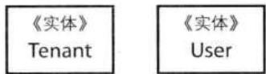


图5.5 先前所发现的2个实体：Tenant和User。


团队成员决定使用应用程序生成的UUID来作为Tenant的唯一标识。他们使用了长文本的标识值，这不仅可以保证实体的唯一性，还可以增加订阅方访问时的安全性，因为要伪造一个UUID是困难的。同时，还可以将属于不同Tenant的实体显式地区分开来。这样一来，系统中的每一个实体都拥有唯一标识，要对这些实体进行查找也变得非常简单。 

Tenant的唯一标识本身并不是实体，而只是一种值对象而已。问题是，这个标识值需要有特殊的类型呢，还是可以使用简单的字符串？ 

似乎没有必要在标识上实现无副作用函数(6)，它只是一个16进制数所对应的字符串文本而已。但是，实体的唯一标识会用在很多地方，它可以用在不同限界上下文的所有实体上。在这种情况下，使用一个强类型的实体标识是有好处的。通过定义TenantId值对象，SaaSOvation团队可以保证所有订阅方所持有的实体都能使用正确的标识。图5.6展示了这样的建模过程，其中同时包含有Tenant和User实体。 

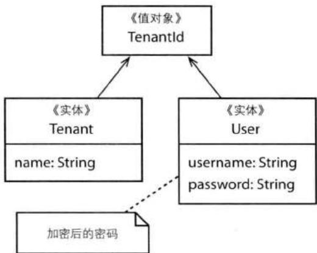


图5.6 在发现并命名实体之后，找到那些起唯一标识作用的属性。


Tenant实体必须有个名字，它的name属性可以是简单的字符串，因为name并没有特殊的行为。Tenant中的name属性有助于查询操作，比如帮助中心的服务人员可以通过name属性来查找出需要服务的Tenant。因此，name属性是必要的，并且是Tenant实体的“本质特征”。同时，我们也可以将唯一性约束加在name属性上，但这并不是我们目前的重点。 

我们还可以向Tenant中添加另外的属性，比如售后支持联系人信息、支付信息等，但是这些都是业务层面的概念，而不是安全层面的。对于身份与访问上下文来说，团队成员能有以上认识，已经非常不错了。 

售后支持可以通过另一个限界上下文来管理。在通过name找到对应的Tenant之后，系统便可以使用Tenant的唯一标识TenantId了。该TenantId可以进一步用于售后支持上下文中、付账上下文或者客户关系管理上下文。售后支持联系人、租户地址和租户联系人与安全没有什么关系。另外，将名字name属性加在Tenant上也可以售后支持人员快速地为客户提供服务。 

在Tenant之后，团队将关注点转向了User实体。什么可以作为User实体的唯一标识呢？多数身份系统都为User定义了一个唯一的用户名username。一个username由什么组成并不重要，只要它能够在一个Tenant中唯一地表示一个User即可（相同的username可以出现在不同的Tenant中）。通常来说，username由用户自己指定。如果订阅租户对于用户名做出了限制，或者用户名由联合安全集成机制所决定，那么注册用户需要服从这些限制。对于SaaSOvation团队来说，他们简单地在User实体上定义了一个username属性。 

SaaSOvation团队需要满足的另一个需求是用户需要提供安全密码。对此，团队成员向User实体添加了password属性。他们认为，password属性绝对不能使用可读文本来表示，而是需要对password属性进行加密。由于在将password赋给User之前，password属性需要加密，这暗示着需要某种形式的领域服务（Domain Service, 7）。之前，团队成员已经在通用语言的术语中为领域服务预留了一个位置。现在，是时候使用它了。此时的术语包括： 

- 租户：一个有名字的企业订阅方，它提供身份与访问服务，同时还包括其他的在线服务。租户向用户发出注册邀请，并处理用户注册过程。 

- 用户：一个租户下的注册用户，包含有个人名字和联系信息。一个用户拥有唯一的用户名和密码。 

- 加密服务：对密码或其他敏感信息进行加密。 

还有一个问题没有解决: password应该作为User唯一标识的一部分吗? 毕竟, password也用于对User实体的查找。如果是, 我们可能希望将username和password合为一个值对象,比如名为SecurityPrincipal, 这样可以更加清晰地表达安全概念。这是一个很有趣的想法,但是它忽略了一个重要的需求: 密码是可以修改的。另外, 有时在查找User的时候, 我们并不需要提供密码(考虑一些检查用户角色的情形, 我们不能每次在检查用户的安全权限时都提供密码)。此时的密码并不是实体标识。当然, 我们依然可以在单个认证查询中同时包含username和password属性信息。 

但是，创建一个SecurityPrincipal值对象的想法本身则是一个不错的建模主张，我们将在后面进行讨论。此外，我们还遗漏了另外一些概念，比如如何发出注册邀请，如何提供用户名和联系方式的一些细节信息等。SaaSOvation团队将在下一个迭代中处理到这些。 

## 挖掘实体的关键行为

在识别出实体的重要属性之后, SaaSOvation团队开始转向实体的行为…… 

SaaSOvation团队回顾了一下先前的需求, 现在他们开始考虑Tenant和User的行为: 

- Tenant可以处于激活状态或失活状态 

当我们思考激活 (Activate) 或禁用 (Deactivate) 一个Tenant时, 我们想的可能是一个布尔开关, 至于如何实现这个开关在这里并不重要。如果我们将一个activate属性添加在Tenant类图中, 别人在看到这张类图时, 她/他能够知道activate表示什么意思吗? 在Tenant类中, 下面的属性能够表达出它的意图吗? 

```txt
public class Tenant extends Entity {
    ...
    private boolean active;
    ... 
```

上面的activate恐怕并不能完全地表达出它的意图。在开始的时候，我们将关注点放在对身份和查询有用的属性上，之后我们希望通过相似的方法加入一些与服务相关的信息。 

团队也许会定义一个setActive(boolean)的方法，虽然这个方法并不能很好地表达需求术语。这里并不是说公有的setter方法不合适，而是说只有在符合通用语言的情况下才 


能使用setter方法，也或者，只有当我们不必使用多个setter方法来完成单个请求时，才有道理使用setter方法。多个setter方法使意图充满了歧义，同时也使发布领域事件变得更加复杂，因为一个领域事件应该对应于逻辑上的单个命令。 

考虑到通用语言, 团队成员意识到领域专家使用的是 “激活” 和 “冻结” 这两个动作。为了准确地体现这些术语, 他们将 setter 方法改成了 activate () 和 deactivate() 方法。 

以下代码是一个意图展现接口 (Intention Revealing Interface) [Evans], 它符合 SaaSOvation 团队所处理的通用语言: 

```java
public class Tenant extends Entity {
    ...
    public void activate() {
    // TODO: 实现
    }

    public void deactivate() {
    // TODO: 实现
    }
    ... 
```

为了更好地表达出Tenant的意图, 他们首先编写了测试代码: 

```java
public class TenantTest ... {
    public void testActivateDeactivate() throws Exception {
    Tenant tenant = this.tenantFixture();
    assertTrue(tenant.isActive());
    tenant.deactivate();
   =False(tenant.isActive());
    tenant.activate();
    assertTrue(tenant.isActive());
    }
} 
```

此时，团队对于Tenant类的质量有了充足的信心。通过编写测试，他们意识到还需要另一个方法——isActivate()。以上3个方法如图5.7所示。通用语言中的术语也随之增加： 

- 激活租户：通过该操作激活一个租户，激活后再对租户的当前状态进行确认。 

- 禁用租户：通过该操作禁用一个租户，在禁用一个租户时，用户可能还没有被认证。 

- 认证服务: 协调对用户的认证过程, 首先需要保证他们所属的租户处于激活状态。 

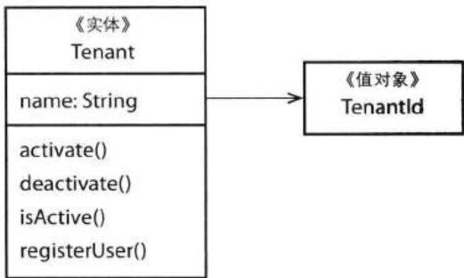


图5.7 在第一个迭代中, Tenant中被加入了一些不合适的行为。处于复杂性考虑, 有些行为被省略了, 当然, 我们可以在之后加入。


最后一条术语表明，SaaSOvation团队发现了另外一个领域服务。在对User实例进行匹配之前，他们需要调用Tenant的isActivate()方法来检查租户的活跃状态。我们也可以通过以下需求看出该认证服务的必要性： 

- 系统必须对User进行认证，并且只有当Tenant处于激活状态时才能对User进行认证 

可以看出，提供User的username和password信息只是认证用户的其中一个步骤，因此我们需要一个更高层面的认证协调者。领域服务便能很好地完成这样的任务。我们可以在后面再加入额外的细节，对于SaaSOvation团队来说，此时重要的是提出AuthenticationService这个概念，并将其加入到通用语言中。看来测试驱动的确有用啊！ 

团队同时考虑到了以下需求： 

## - 通过邀请, 租户允许用户进行注册

当他们开始仔细分析这项需求时, 他们发现该需求比先前所想象的要复杂。这里似乎需要存在一个诸如Invitation的对象, 但是需求并没有向他们提供足够的信息, 管理邀请的行为 也不清晰。因此，SaaSOvation团队决定推迟这个建模过程，等到有了领域专家和早期客户提供更多的输入信息时才继续。然而，他们还是创建了registerUser()方法，该方法对于创建User实例来说非常重要（请参考下文的“创建”一节）。 

对于他们先前对User类的理解: 

- User处理自己的信息，包括名字和联系方式 

- User个人的信息可以被其本人和Manager修改 

- User的安全密码是可以被修改的 

这里我们使用两种经常联合使用的安全模式——用户和基本身份（Fundamental Identity） $^{1}$ 。很明显，“个人”的概念伴随着“User”概念。基于以上对User的理解，团队提出了一些组合概念和与之相关的行为。 

团队创建了一个Person类，以避免将过多的职责放在User类上。上面的“个人的”一词使得团队将“个人”加入到通用语言中： 

- 个人：包含并管理用户的个人信息，包括名字和联系方式等。 

这里的Person是实体还是值对象呢？同样，“修改”一词是关键。我们似乎没有必要在一个用户修改电话号码时就将整个Person对象替换掉，因此SaaSOvation团队将其建模成了实体，如图5.8所示。该Person实体包含了两个值对象——ContactInformation和Name，这些都是比较模糊的概念，之后在必要的时候我们将对其进行重构。 

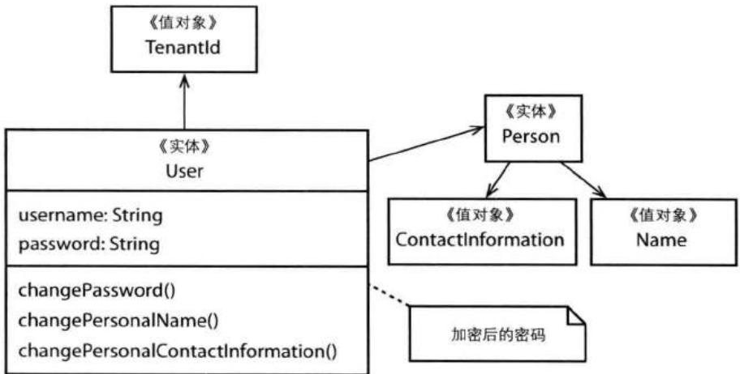


图5.8 User的基本行为导致了更多的关联关系。团队成员们还创建了一些额外的对象。


这里，我们还需要思考一下如何管理用户的名字和联系信息。客户端可以访问到User中的Person对象吗？团队中的一员质疑到一个User是否总是一个Person。如果一个User表示的是一个外部的系统，又该怎么办呢？虽然这并不是当前的需求，但是这样的考虑是有价值的。如果我们允许客户访问Person，那么客户端代码可能需要做出相应的重构。 

反之，如果团队成员将Person的行为直接放在User上，这可能会避免一些麻烦。在编写了测试来模拟对User的使用后，他们发现这样做是正确的，修改之后的User对象如图5.8所示。 

还有另外的考虑。SaaSOvation团队是应该完全地将Person暴露给外界呢，还是应该向客户隐藏起来？现在，团队决定将Person暴露给外界，目的是为了获得查询信息。之后，他们会对此进行重新设计以服务于Principal接口，而Person和System分别是两种特殊的Principal。当团队有了更深的理解之后，他们将做出这样的重构。 

团队保持了以往的节奏, 此时团队开始考虑最后一条需求所反映的通用语言: 

## - User的安全密码是可以被修改的

User 拥有一个 changePassword() 行为方法。该方法反映了以上需求，领域专家对此也表示满意。客户是绝对不能访问到密码的，哪怕是加密之后的密码也不行。在设置了密码之后，该密码是不会暴露在聚合边界之外的。所有需要和安全认证打交道的代码都必须通过 AuthenticationService。 

团队还意识到，在成功执行所有的修改行为之后都需要向外发布领域事件。和上文提到的“邀请用户注册”一样，这比团队先前所想象的要复杂。但是，他们的确意识到了事件的必要性。事件至少可以完成两项功能。首先，有了事件，我们可以对对象的整个生命周期进行跟踪（稍后讨论）。其次，事件可以通知外界订阅方完成同步操作，从而使这些订阅方具有潜在的自治性。 

这些话题将在事件(8)和集成限界上下文(13)中进行讨论。 

## 角色和职责

建模的一个方面便是发现对象的角色和职责。通常来说，对角色和职责分析是可以应用在领域对象上的。这里我们特别关注的是实体的角色和职责。 

对于“角色”这个概念, 我们需要一些上下文来理解。在身份与访问上下文中, 一个角色是一个实体, 同时是身份安全领域中的一个聚合根。客户可以询问一个 用户是否拥有一种安全角色。该“角色”和我现在要讲的“角色”是两个全然不同的概念。我们这里所讨论的，是模型中的对象可以扮演什么样的角色。 

## 领域对象扮演多种角色

在面向对象编程中, 通常由接口来定义实现类的角色。在正确设计的情况下, 一个类对于每一个它所实现的接口来说, 都存在一种角色。如果一个类没有显式的角色——即该类没有实现任何显式接口, 那么在默认情况下它扮演的即是本类的角色。也即, 该类的公有方法表示该类的隐式接口。比如, 上面的User类并没有实现任何接口, 但是它依然扮演了一种角色, 即User角色。 

我们可以使一个对象同时扮演User和Person的角色，虽然这并不是我所建议的，但就目前而言，让我们假设这是一个好的主意。这样一来，我们便没有必要在User中引用一个Person了，而是只需创建一个对象来同时扮演这两种角色即可。 

那我们为什么要这么做呢？通常是因为两个或多个对象既有相似之处，又有不同之处。此时，这些对象上重叠的属性可以通过一个实现了多个接口的对象来表示。比如，我们可以创建一个 HumanUser 对象，该对象既是一个 User，又是一个 Person: 

```swift
public interface User {
    ...
}

public interface Person {
    ...
}

public class HumanUser implements User, Person {
    ...
} 
```

以上代码看似合乎情理的, 但是它也可能使事情变得复杂。如果两个接口都是复杂的, 那么 HumanUser 对象实现起来将是困难的。另外, 如果 User 不是一个人, 而是一个系统又该怎么办呢? 此时我们可能需要 3 个接口, 而要设计一个实现了这 3 个接口的对象将变得更加困难。我们可能需要创建一个通用的 Principal 来简化这个问题: 

```txt
第5章 实体
public interface Principal {
    ...
}
public class UserPrincipal implements User, Principal {
    ...
} 
```

有了以上代码, 我们可以直接到运行时才决定一个Principal的类型。一个人对应的Principal和一个系统对应的Principal在实现上是不同的。一个系统不需要拥有像人一样的联系信息。另外, 我们还可以通过委派的方式来实现以上两个接口, 此时我们需要在运行时检查存在哪种类型的Principal, 再将逻辑委派给这个实际的Principal对象: 

```java
public interface User {
    ...
}

public interface Principal {
    public Name principalName();
    ...
}

public class PersonPrincipal implements Principal {
    ...
}

public class SystemPrincipal implements Principal {
    ...
}

public class UserPrincipal implements User, Principal {
    private Principal personPrincipal;
    private Principal systemPrincipal;
    ...
    public Name principalName() {
    if (personPrincipal != null) {
    return personPrincipal.principalName();
    } else if (systemPrincipal != null) {
    return systemPrincipal.principalName();
    } else {
    throw new IllegalStateException("The principal is unknown.");
    }
    }
    ...
} 
```

以上代码设计存在多个问题，其中之一便是对象分裂症（Object Schizophrenia） $^{2}$ 。对象的行为通过技术上的转向和分发来进行委派。无论是personPrincipal，还是systemPrincipal，它们都不具有UserPrincipal实体的身份标识，而UserPrincipal才是行为的最初执行对象。对象分裂症描述的是：委派对象根本不知道原来被委派对象的身份标识，因此我们无法知道委派对象的真正身份。虽然并不是所有的委派对象都需要知道被委派对象的身份标识，但是在有些情况下的确是必要的。我们可以向principalName()传入一个UserPrincipal对象的引用，但这使设计变得更加复杂，并且需要改变Principal接口，因此显然是不好的。就像[Gamma et al]中提到的一样，“委派只有在使问题简化而不是复杂化时，才是好的。” 

这里，我们并不打算解决这个建模难题，它只是向我们展示在建模对象角色时可能遇到的问题，并且提醒大家在这个时候应该额外小心。有一些好的工具可以帮助我们改进，比如 Qi4j[Öberg]。 

正如Udi Dahan[Dahan, Roles]所倡导的, 它可以帮助我们设计更好的角色接口。以下两项需求有助于我们设计出好的接口: 

- 向一个客户添加订单。 

- 使客户成为优先 (Preferred) 客户。 

Customer类实现了两个细粒度的角色接口：IAddOrdersToCustomer和IMakeCustomerPreferred。每一个接口都只定义了单个操作，如图5.9所示。我们甚至还可以使Customer实现另外的接口，比如IValidator。 

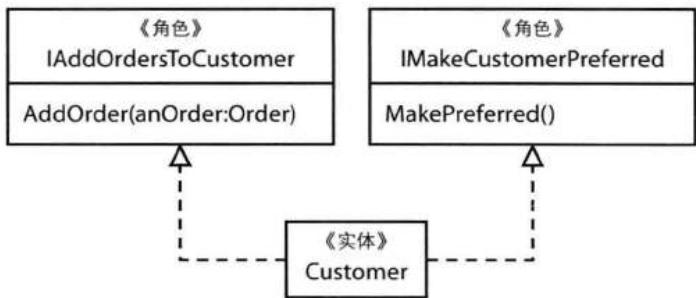


图5.9 在C#.NET命名规范中，Customer实体实现了2个对象角色，即IAddOrdersToCustomer和IMakeCustomerPreferred。


在聚合(10)中我们提到, 我们并不希望创建一个拥有大量对象的集合, 比如向Customer中添加大量的订单。但是, 这并不是我们当前的重点, 这里的重点是演示对象角色的使用。 

接口名字中的前缀“I”是.NET编程中的一种常见风格。这里的“I”除了表示“接口”之外，还表示“我”的意思，从而有助于提高代码的可读性，比如：“我将订单添加给客户”和“我将客户变成优先客户。”在没有前缀“I”的情况下，接口的可读性可能没有那么好：AddOrdersToCustomer和MakeCustomerPreferred。我们也有可能更倾向于使用名词和形容词来命名接口，这种方式显然也是适用的。 

想想这种风格能给我们带来了哪些好处？实体的角色可以在不同的用例之间发生转变。将一个新的Order实例添加到Customer，或者使Customer变成优先客户，在这两种情况下一个Customer所扮演的角色是不同的。同时，这种风格还有技术上的好处，不同的用例所使用的Customer获取策略可能是不同的： 

```matlab
IMakeCustomerPreferred customer =
    session.Get<IMakeCustomerPreferred>(customerId);
customer.MakePreferred();
...
IAddOrdersToCustomer customer =
    session.Get<IAddOrdersToCustomer>(customerId);
customer.AddOrder(order); 
```

通过使用泛型, 持久化机制从基础设施中查找不同的获取策略。如果某个接口没有特殊的获取策略, 那么将使用默认的获取策略。在使用特定的获取策略时, 所获取的Customer能够满足特定的用例。 

当然，还存在其他的特定于某个用例的行为可以与角色联系起来，比如验证功能，在实体被持久化时，它可以充当验证器的角色对自身进行数据验证。 

好的接口设计也有助于实现类，比如Customer，将功能实现在其自身上，而没有必要将实现委派给其他类，对象分裂症也由此得到避免。 

很自然地，你可能会问到，将Customer的行为通过角色进行划分是否能给领域建模带来好处呢？我们可以将前面的Customer和图5.10中的Customer做个对比，哪个更好呢？当需要调用MakePreferred()方法时，图5.10中的Customer是否更容易引导客户端错误地调用成AddOrder()方法？恐怕不见得，但是这并不是唯一的评判标准。 

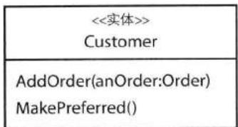


图5.10 这里，先前实现了不同接口的Customer变成了实现单个接口的实体。


角色接口最实用之处可能也是其最简单之处。通过接口，我们可以将实现细节隐藏起来，从而不至于将实现细节泄漏到客户端中。我们所设计的接口应该刚好能够满足客户端的需求，不多也不少。实现类可以比接口复杂得多，它可以拥有大量的支撑性属性，外加这些属性的getter和setter方法。但是，客户端是看不到这些实现细节的。比如，有些工具或框架可能强制性地要求在类上创建公有方法，而我们并不希望客户端调用这些公有方法。即便如此，领域模型接口也不会被技术上的实现细节所影响。显然，这是一个领域建模方面的好处。 

不管采用哪种设计方式, 我们都应该确保领域语言优先于技术实现。在DDD 中, 业务领域的模型才是最重要的。 

## 创建实体

当我们新建一个实体时, 我们希望通过构造函数来初始化足够多的实体状态, 这一方面有助于表明该实体的身份, 另一方面可以帮助客户端更容易地查找该实体。在使用及早生成唯一标识的策略时, 构造函数至少需要接受一个唯一标识作为参数。如果我们还有可能通过其他方式对实体进行查找, 比如名字或描述信息, 那么我们应该将这些参数也一并传给构造函数。 

有时一个实体维护了一个或多个不变条件（Invariant）。不变条件即是在整个实体生命周期中都必须保持事务一致性的一种状态。不变条件主要是聚合所关注的，但是由于聚合根通常也是实体，故这里我们也稍作提及。如果实体的不变条件要求该实体所包含的对象都不能为null状态，或者由其他状态计算所得，那么这些状态需要作为参数传递给构造函数。 

每一个User对象都必须包含tenantId、username、password和person属性。换句话说，在User对象得到正确实例化之后，这些属性绝对不能为null。User对象的构造函数和实例变量对应的setter方法保证了这一点： 

```dart
public class User extends Entity {
    ...
    protected User(TenantId aTenantId, String aUsername,
    String aPassword, Person aPerson) {
    this();
    this.setPassword(aPassword);
    this.setPerson(aPerson);
    this.setTenantId(aTenantId);
    this.setUsername(aUsername);
    this.initialize();
    }
    ...
    protected void setPassword(String aPassword) {
    if (aPassword == null) {
    throw new IllegalArgumentException(
    "The password may not be set to null.");
    }
    this.password = aPassword;
    }

    protected void setPerson(Person aPerson) {
    if (aPerson == null) {
    throw new IllegalArgumentException(
    "The person may not be set to null.");
    }
    this.person = aPerson;
    }

    protected void setTenantId(TenantId aTenantId) {
    if (aTenantId == null) {
    throw new IllegalArgumentException(
    "The tenantId may not be set to null.");
    }
    this.tenantId = aTenantId;
    }

    protected void setUsername(String aUsername) {
    if (this.username != null) {
    throw new IllegalStateException(
    "The username may not be changed.");
    }
    if (aUsername == null) {
    throw new IllegalArgumentException(
    "The username may not be set to null.");
    }
    this.username = aUsername;
    }
} 
```

User对象展示了一种自封装性。在构造函数对实例变量赋值时，它把操作委派给了实例变量所对应的setter方法，这样便保证了实例变量的自封装性。实例变量的自封装性使用setter方法来决定何时给实例变量赋值。每一个setter方法都“代表着实体”对所传进的参数做非null检查，这里的断言称为守卫（Guard）（请参考“验证”一节）。在“标识稳定性”一节中我们讲到，setter方法的自封装性技术可能会变得非常复杂。 

对于那些非常复杂的创建实体的情况，我们可以使用工厂，请参考工厂（Factories, 11）。在上面的例子中，你是否注意到User对象的构造函数被声明为了protected?Tenant实体即为User实体的工厂，也是同一个模块中唯一能够访问User构造函数的类。这样一来，只有Tenant能够创建User实例： 

```txt
public class Tenant extends Entity {
    ...
    public User registerUser(
    String aUsername,
    String aPassword,
    Person aPerson) {

    aPerson.setTenantId(this.tenantId());
    User user =
    new User(
    this.tenantId(),
    aUsername,
    aPassword,
    aPerson);

    return user;
    }
    ...
} 
```

这里的registerUser()便是工厂。该工厂简化了对User的创建，同时保证了TenantId在User和Person对象中的正确性。此外，该工厂是能够反映通用语言的。 

## 验证

验证的主要目的在于检查模型的正确性，检查的对象可以是某个属性，也可以是整个对象，甚至是多个对象的组合。我们将对模型进行三个级别的验证。虽然有很多种验证方式，包括专门用于验证的框架和类库等，但这里我们并不会讲到这些。我们要讨论的主要是一些通用的验证方法。 

验证可以达到不同的目的。即便领域对象的各个属性都是合法的，这也并不表示该对象作为一个整体是合法的。两个合法属性组合起来有可能使整个对象不合法。同样的道理，单个对象的合法性并不能保证对象组合的合法性。两个合法实体对象的组合有可能是不合法的。因此，我们需要采用不同级别的验证来处理这些情况。 

## 验证属性

我们如何确保属性处于合法状态呢? 正如我在本书其他地方所讲, 我强烈建议使用自封装 (Self-Encapsulation) 来验证属性。 

Martin Fowler曾说：“自封装性要求无论以哪种方式访问数据，即使从对象内部访问数据，都必须通过getter和setter方法”[Fowler, Self Encap]。这种方式有诸多优点。首先它为对象的实例变量和类变量提供了一层抽象。其次，我们可以方便地在对象中访问其所引用对象的属性。重要的是，自封装性使验证变得非常简单。 

事实上，我并不愿意将自封装性称为验证。在一些开发者看来，验证是一个单独的关注点，因此应该将该职责放在验证类上，而不是领域对象上。我是同意这一点的。此外，我还想谈谈断言（Assertion），这是一种契约式设计（Design-by-Contract）方式。 

从定义来看，在契约式设计中，我们可以指定前置条件、后置条件和组件中的不变条件。这种设计方法首先由Bertrand Meyer所提出，并在他开发的Eiffel语言中得到了充分的体现。在Java和C#语言中，我么也可以进行契约式设计，请参考《Design Patterns and Contracts》[Jezequel et al.]。这里我们只讨论前置条件，它为对象提供了一个保护层，因此也可以看作是一种验证形式： 

```java
public final class EmailAddress {

    private String address;

    public EmailAddress(String anAddress) {
    super();
    this.setAddress(anAddress);
    }

    private void setAddress(String anAddress) {
    if (anAddress == null) {
    throw new IllegalArgumentException(
    "The address may not be set to null.");
    }
    if (anAddress.length() == 0) {
    throw new IllegalArgumentException( 
```

```txt
"The email address is required.");
}
if (anAddress.length() > 100) {
    throw new IllegalArgumentException(
    "Email address must be 100 characters or less.");
}
if (!java.util.regex.Pattern.matches(
    "\w+([+-.]\w+) *@\w+([-.]\w+) *\.\w+([-.]\w+)*", anAddress)) {
    throw new IllegalArgumentException(
    "Email address and/or its format is invalid.");
}
this.address = anAddress;
}
...
} 
```

在上面的代码中，setAddress()方法中存在4个前置条件。所有的前置条件都对anAddress参数进行断言： 

- anAddress不能为null。 

- anAddress不能为空字符串。 

- anAddress的长度不能大于100。 

- anAddress需要满足电子邮件格式。 

只有所有这些前置条件都通过了, anAddress才能被赋给address属性。否则,程序将抛出IllegalArgumentException异常。 

EmailAddress类并不是一个实体，而是值对象。这里我们使用该值对象是有原因的。首先它向我们展示了一个很好的前置条件验证的例子，从null检查到格式检查。其次，EmailAddress是Person实体的属性——Person实体持有ContactInformation值对象，ContactInformation进而持有EmailAddress，因此EmailAddress和其他直接声明在Person中的简单属性一样，都是Person实体的属性。在为其他简单属性创建setter方法时，我们可以采用完全相同的方式对它们进行验证。在将一个整体值对象赋给实体时，只有当值对象中的所有较小属性得到验证时，我们才能保证对整体值对象的验证。 

## 牛仔的逻辑

LB: “我还以为刚才和那位夫人进行了一场合法的争论（Argument）呢，哪知道她突然向我抛出了非法争论异常。” 


有些开发者认为这种前置条件检查是一种防御式编程（Defensive Programming）。其中一些人并不同意这种多级检查的验证方式，另有些认为对null和空字符串的检查是可以接受的，但是没有必要验证字符串长度、数值范围和格式等信息。另外，还有人认为将对字符串长度和数值范围的验证放在数据库中是最好的办法，因为这些功能并不属于领域对象。 

有时我们没有必要对字符串的长度做出检查, 此时可以定义一个拥有足够宽度的数据库列, 比如在Microsoft SQL Server数据库中, 我们可以使用max关键字来定义一个文本列: 

```sql
CREATE TABLE PERSON (
    ...
    CONTACT_INFORMATION_EMAIL_ADDRESS_ADDRESS
    NVARCHAR(max) NOT NULL,
    ...
) ON PRIMARY
GO 
```

这里并不是说我们希望一个E-mail地址有1,073,741,822个字符这么长，而是定义一个足够大的范围，使得任何实际的E-mail地址都不会超出该范围。 

然而，对于有些数据库来说，这种方法便不见得可行了。在MySQL中，最大的行宽为65,535字节，请注意，这里是行宽，而不是列宽。如果我们将其中一个列定义为最大宽度为65,535的VARCHAR类型，那么其他的列便没有存放空间了。根据数据库中所定义VARCHAR列的数量，我们需要对每一列的宽度进行限制。在这种情况下，我们可能需要将某些列定义为TEXT类型，因为TEXT列和BLOB列存储在不同的块中。因此，对于不同的数据库，我们需要找到适当的限制列宽的方法，以避免在领域模型中对字符串长度进行验证。 

如果对象的属性有可能超过列宽, 那么此时在模型中进行长度验证便是有必要的了。思考一下, 如果将以下错误转换成一个领域中的错误, 这将有多大的实际意义? 

ORA-01401: inserted value too large for column 

我们甚至都不知道到底是哪个列超出了范围，此时最好的方式便是将长度验证放在前置条件中。另外，长度检查并不见得只是对数据库的列宽做出约束。最终，我们还是要根据各种领域需求来限制字符串长度，比如当需要集成的遗留系统对字符串长度有约束时。 

有时我们还需要考虑诸如区间范围检查之类的验证。即便是非常简单的格式检查，比如E-mail地址格式，对于保护实体的合法性来说也是有意义的。在单个实体验证通过的情况下，要再对由不同实体组成的整体对象或组合对象进行验证，也将变得更加简单。 

## 验证整体对象

虽然有时实体中的所有单个属性都是合法的，但是这并不意味着整个实体就是合法的。要验证整个实体，我们需要访问整个对象的状态——所有对象属性。此时我们可能还需要使用规范(Specification)[Evans & Fowler, Spec]或者策略(Strategy)[Gamma et al.]来进行验证。 

Ward Cunningham在他的Checks模式语言中[Cunningham, Checks]讨论了多种验证方法，其中验证整体对象的一种方法为延迟验证(Deferred Validation)。Ward解释道：“这是一种到最后一刻才进行验证的方法。”之所以需要延迟，是因为我们需要进行非常详细的验证，比如对复杂对象的验证，甚至对对象组合的验证。我们将在稍后的“验证对象组合”一节中讲到延迟验证。在本节中，我们主要讲解Ward所谓的“简单活动验证(the checks of simpler activities)”。 

由于验证逻辑需要访问实体的所有状态, 有人可能会直接将验证逻辑嵌入到实体对象中。这里我们需要注意了, 更多的时候验证逻辑比领域对象本身变化还快, 而将验证逻辑嵌入在领域对象中也使领域对象承担了太多的职责。 

此时我们可以创建一个单独的组件来完成模型验证。在Java中设计单独的验证类时，我们可以将该类放在和实体相同的模块（包）中，将属性的getter方法声明在包级别（即用protected修饰），这样验证类便能访问到这些属性了。当然，将属性声明为public也是可以的。但是，声明为private便不行了，因为此时验证类无法访问到领域对象的属性状态。如果验证类和领域对象不在相同的包中，那么所有属性的getter方法都应该声明为public，而这并不是我们希望看到的情形。 

验证类可以实现规范模式或策略模式。当发现非法状态时，验证类将通知客户方或者记录下验证结果以便后用（比如，在批处理完成之后）。验证过程应该收集到所有的验证结果，而不是在一开始遇到非法状态时就抛出异常。考虑以下的例子： 

```java
public abstract class Validator {
    private ValidationNotificationHandler notificationHandler;
    ...
    public Validator(ValidationNotificationHandler aHandler) {
    super();
    this.setNotificationHandler(aHandler);
    }

    public abstract void validate();

    protected ValidationNotificationHandler notificationHandler() {
    return this.notificationHandler;
    }

    private void setNotificationHandler(
    ValidationNotificationHandler aHandler) {
    this.notificationHandler = aHandler;
    }
} 
```

```java
public class WarbleValidator extends Validator {

    private Warble warble;

    public Validator(
    Warble aWarble,
    ValidationNotificationHandler aHandler) {
    super(aHandler);
    this.setWarble(aWarble);
    }

    public void validate() {
    if (this.hasWarpedWarbleCondition(this.warble())) {
    this.notificationHandler().handleError("The warble is warped.");
    }
    if (this.hasWackyWarbleState(this.warble())) {
    this.notificationHandler().handleError("The warble has a wacky state.");
    }
    ...
    }
} 
```

在上例中, WarbleValidator在初始化时传入了一个ValidationNotificationHandler。任何时候, 当发现非法状态时, WarbleValidator都会调用ValidationNotificationHandler来处理。ValidationNotificationHandler是一个通用实现, 它拥有一个 handleError()方法, 该方法接受一个String类型的验证通知消息。我们也可以为ValidationNotificationHandler创建不同的方法来处理不同的非法状态: 

```java
class WarbleValidator extends Validator {
    public void validate() {
    if (this.hasWarpedWarbleCondition(this.warble())) {
    this.notificationHandler().handleWarpedWarble();
    }
    if (this.hasWackyWarbleState(this.warble())) {
    this.notificationHandler().handleWackyWarbleState();
    }
    }
    ...
} 
```

这样一来，我们便将错误消息、消息键值或者消息通知与验证过程进行了解耦。还有更好的方法，将验证通知封装在方法中： 

```java
class WarbleValidator extends Validator {

    public Validator(
    Warble aWarble,
    ValidationNotificationHandler aHandler) {
    super(aHandler);
    this.setWarble(aWarble);
    }

    public void validate() {
    this.checkForWarpedWarbleCondition();
    this.checkForWackyWarbleState();
    ...
    }

    protected checkForWarpedWarbleCondition() {
    if (this.warble()...) {
    this.warbleNotificationHandler().handleWarpedWarble();
    }
    }

    protected WarbleValidationNotificationHandler
    warbleNotificationHandler() {
    return (WarbleValidationNotificationHandler)
    this.notificationHandler();
    }
} 
```

在这个例子中, 我们使用了一个特定的ValidationNotificationHandler。在传入WarbleValidator时, 它是一个标准类型, 然后在使用时我们将其强制转换成一个特定的WarbleValidationNotificationHandler类型。对于使用什么样的ValidationNotificationHandler类型, 验证类和客户端应该达成一致。 

客户端如何保证对实体的验证确实发生了呢? 验证过程又从何处开始呢? 

要将validate()方法应用在所有需要验证的实体上, 我们可以使用层超类型: 

```java
public abstract class Entity extends IdentifiedDomainObject {

    public Entity() {
    super();
    }

    public void validate(ValidationNotificationHandler aHandler) {
    }
} 
```

任何继承自Entity的类都可以安全地调用validate()方法。如果具体的实体类拥有自身的验证逻辑，该验证逻辑将被执行，否则validate()方法不做任何事情。同时，我们应该只在需要进行验证的实体中才定义validate()方法。 

然而, 实体应该进行自我验证吗? 拥有validate()方法并不表示需要实体自行执行验证过程。此时实体可以将验证过程交给单独的验证类: 

```java
public class Warble extends Entity {
    ...
    @Override
    public void validate(ValidationNotificationHandler aHandler) {
    (new WarbleValidator(this, aHandler)).validate();
    }
    ...
} 
```

每一个专有的Validator都会执行特定的验证过程。实体类不用知道验证过程是如何发生的。单独的Validator也将验证逻辑的变化与实体对象本身的变化分离开来，并且有助于对复杂验证过程的测试。 

## 验证对象组合

正如Ward Cunningham所说，在需要对复杂对象进行验证时，我们可以使用延迟验证。这里我们关注的并不只是某个单独的实体是否合法，而是多个实体的组合是否全部合法，包括一个或多个聚合实例。要达到这样的目的，我们需要创建继承自Validator的不同验证类实例。但是，最好的方式是把这样的验证过程创建成一个领域服务。该领域服务可以通过资源库读取那些需要验证的聚合实例，然后对每个实例进行验证，可以是单独验证，也可以和其他聚合实例组合起来验证。 

在任何时候, 我们都需要决定是否可以展开验证。有时某个聚合或一组聚合可能处于临时的、中间的状态。此时我们可以在聚合上创建一个状态标识来避免对这些状态的验证。当验证条件成熟时, 模型通过发送领域事件的方式通知客户方: 

```java
public class SomeApplicationService ... {
    ...
    public void doWarbleUseCaseTask(...) {
    Warble warble =
    this.warbleRepository.warbleOfId(aWarbleId);

    DomainEventPublisher
    .instance()
    .subscribe(new DomainEventSubscriber<WarbleTransitioned>() {
    public void handleEvent(DomainEvent aDomainEvent) {
    ValidationNotificationHandler handler = ...;
    warble.validate(handler);
    ...
    }
    public Class<WarbleTransitioned>
    subscribedToEventType() {
    return WarbleTransitioned.class;
    }
    });
    warble.performSomeMajorTransitioningBehavior();
    }
} 
```

当客户方接收到事件时, 其中的WarbleTransitioned表示可以进行验证了。而在这之前, 客户方是不会进行验证的。 

## 跟踪变化

根据实体的定义, 我们没有必要在整个生命周期中对状态的变化进行跟踪, 而是只需要跟踪那些持续改变的状态。然而, 有时领域专家可能会关心发生在模型中的一些重要事件, 此时我们便应该对实体的一些特殊变化进行跟踪了。 

跟踪变化最实用的方法是领域事件和事件存储。我们为领域专家所关心的所有状态改变都创建单独的事件类型，事件的名字和属性表明发生了什么样的事件。当命令操作执行完后，系统发出这些领域事件。事件的订阅方可以接收发生在模型上的所有事件。在接收到事件后，订阅方将事件保存在事件存储中。 

领域专家并不会关心发生在模型中的所有变化，但这却是技术团队所应该关心的。这主要是出于技术上的原因，请参考事件源 (Event Sourcing, 4) 模式。 


## 本章小结

本章我们主要学习了与实体相关的知识, 其中包括: 

- 我们学习了4种主要的生成实体唯一标识的方法。 

- 我们了解到实体标识生成时间的重要性，还学习了委派标识。 

- 我们学习了如何保证实体标识的稳定性。 

- 我们讨论了如何通过通用语言来发现实体的本质特征，还讨论了实体的属性和行为。 

- 除了核心行为之外, 我们还学习了通过角色来建模实体的优缺点。 

- 最后, 我们学习了如何创建实体, 如何验证实体和如何跟踪实体变化。 

在下一章中, 我们将讲到战术建模的另一个重要概念——值对象。 

# 第6章 值对象

付出的是价格, 获得的是价值。
—Warren Buffett 

值对象虽然经常被掩盖在实体的阴影之下，但它却是非常重要的DDD部件。值对象的常见例子包括数字，比如3、10和293.51；或者文本字符串，比如“hello, world”和“Domain-Driven Design”；或者日期、时间；还有更加详细的对象，比如某人的全名，其中包含姓氏、名字和头衔；再比如货币、颜色、电话号码和邮寄地址等。当然还有更加复杂的值对象。在本章中，我们将讨论那些能够反映通用语言概念的值对象。 

## 认识值类型的优点

值类型用于度量和描述事物，我们可以非常容易地对值对象进行创建、测试、使用、优化和维护。 

我们应该尽量使用值对象来建模而不是实体对象，你可能对此非常惊讶。即便一个领域概念必须建模成实体，在设计时也应该更偏向于将其作为值对象容器，而不是子实体容器。这并不是源自于无端的偏好，而是因为我们可以非常容易地对值对象进行创建、测试、使用、优化和维护。 

## 本章学习路线图

- 学习如何将一个领域概念建模成值对象。 

- 学习如何通过值对象来简化集成的复杂性。 

- 学习以值对象来创建领域标准类型。 

- 学习SaaSOvation是如何学到值对象的重要性的。 

- 学习SaaSOvation是如何测试、实现和持久化值对象的。 

一开始，SaaSOvation公司的团队滥用了实体建模。事实上，在用户和权限等概念进入协作领域之前，实体建模并没有给他们带来什么坏处。在项目启动时，他们采用了常用的建模方式，即将领域模型中所有的属性都映射到对应的数据库表中，并且为所有的属性创建setter和getter方法。由于每个对象都有一个数据库主 


键, 各个实体被组织在了一个庞大且复杂的对象网中。这种建模方式是一种数据建模方式, 它在很大程度上受到了关系型数据库的影响, 认为所有的东西都需要范式化, 并且通过外键进行关联引用。后来, SaaSOvation团队成员们才知道, 全然面向实体的思维方法不仅没有必要, 而且还浪费开发时间。 

在设计得当的情况下, 我们可以对值对象实例进行创建和传递, 甚至在使用完之后将其直接扔掉。我们不用担心客户端对值对象的修改。一个值对象的生命周期可长可短, 它就像一个无害的过客在系统中来来往往。 

从这个角度来看待值对象是一个很大的转变, 就像从没有垃圾回收机制的语言转变到有垃圾回收机制的语言一样。 

那么, 我们如何确定一个领域概念应该建模成一个值对象呢? 此时我们需要密切关注值对象的特征。 

当你只关心某个对象的属性时，该对象便可作为一个值对象。为其添加有意义的属性，并赋予它相应的行为。我们需要将值对象看成不变对象，不要给它任何身份标识，还应该尽量避免像实体对象一样的复杂性。[Evans, p.99] 

虽然创建一个值对象类型非常简单,但是有时甚至连有经验的DDD开发者都面临这样一个难题:是应该建模成实体呢还是值对象?和如何实现值对象一道,我希望在本章中教你理清这些含糊的概念。 

## 值对象的特征

首先，在将领域概念建模成值对象时，我们应该将通用语言考虑在内，这是建模值对象的首要原则，该原则将贯穿本章始末。 

当你决定一个领域概念是否是一个值对象时,你需要考虑它是否拥有以下特征: 

- 它度量或者描述了领域中的一件东西。 

- 它可以作为不变量。 

- 它将不同的相关的属性组合成一个概念整体 (Conceptual Whole)。 

- 当度量和描述改变时, 可以用另一个值对象予以替换。 

- 它可以和其他值对象进行相等性比较。 

- 它不会对协作对象造成副作用[Evans]。 

对于以上特征, 我们将在下文中做详细讲解。在使用这种方法分析模型时, 你会发现很多领域概念都可以设计成值对象, 而不是你先前认为的实体对象。 

## 度量或描述

当你的模型中的确存在一个值对象时, 不管你是否意识到, 它都不应该成为你领域中的一件东西, 而只是用于度量或描述领域中某件东西的一个概念。一个人拥有年龄, 这里的年龄并不是一个实在的东西, 而只是作为你出生了多少年的一种度量。一个人拥有名字, 同样这里的名字也不是一个实在的东西, 而是描述了如何称呼这个人。 

该特征和下面的“概念整体”特征是紧密联系在一起的。 

## 不变性

一个值对象在创建之后便不能改变了。例如，在使用Java或C#编程时，我们使用构造函数来创建值对象实例，此时传入的参数包含了该值对象的所有状态所需的数据信息。所传入的参数既可以作为该值对象的直接属性，也可以用于计算出新的属性。在下面的例子中，一个值对象将另外一个值对象作为属性： 

```java
private BusinessPriorityRatings ratings;
public BusinessPriority(BusinessPriorityRatings aRatings) {
    super();
    this.setRatings(aRatings);
    this.initialize();
}
... 
```

光凭初始化是不能保证值对象的不变性的。在值对象初始化之后，任何方法都不能对该对象的属性状态进行修改。在上面的例子中，只有setRatings()和initialize()方法可以修改对象的状态，而它们只在对象构建过程中才被使用。方法setRatings()被声明为private，外界不能直接调用。 $^{2}$ 

此外, BusinessPriority必须保证除了构造函数之外, 其他方法均不能调用setter 方法。之后我们还会讲到如何测试值对象的不变性。 

根据需要, 有时我们可以在值对象中维持对实体对象的引用。在这种情况下我们需要谨慎行事。当实体对象的状态发生改变时, 引用它的值对象也将发生改变, 由此违背了值对象的不变性。因此, 在值对象中引用实体时, 我们的出发点应该是不变性、表达性和方便性。否则, 如果实体对象有可能违背值对象的不变性, 那么我们便没有理由在值对象中引用实体对象。在本章的后续内容中, 我们将讲到值对象的无副作用特征。 

## 挑战你的假设

如果你认为一个值对象必须通过行为方法进行改变,那么你得问问自己这是否有必要。在这种情况下可以用其他值对象来替换吗?使用值对象替换可以简化设计。 

有时将一个对象设计成不变对象是没有意义的, 此时往往意味着该对象应该建模成一个实体对象, 请参考实体 (5)。 

## 概念整体

一个值对象可以只处理单个属性，也可以处理一组相关联的属性。在这组相关联的属性中，每一个属性都是整体属性所不可或缺的组成部分，这和简单地将一组属性组装在对象中是不同的。如果一组属性联合起来并不能表达一个整体上的概念，那么这种联合并无多大用处。 

就像Ward Cunningham在他的整体值对象模式[Cunningham, Whole Value aka Value Object]中提到 $^{3}$ ，值对象{50,000,000美元}具有两个属性，一个是50,000,000，一个是美元。单独一个50,000,000可能表示另外的意思，而单独一个“美元”更不能表示该值对象。只有当这两者联合起来才是一个表达货币度量的概念整体。因此我们并不希望将表示50,000,000的amount和表示美元的currency看作两个相对独立的属性，比如： 

```txt
//不正确建模的ThingOfWorth
public class ThingOfWorth {
    private String name; //描述属性
    private BigDecimal amount; //描述属性
    private String currency; //描述属性
    // ...
} 
```

在上面的例子中, ThingOfWorth的客户端必须知道什么时候应该同时使用amount和currency, 并且还应该知道应该如何使用这两个属性, 原因在于这两个属性并没有组成一个概念整体。我们需要更好的方式。 

要正确地表达货币度量, 我们不应该将以上两个属性分离开来, 而应该将它们建模成一个整体值对象: $\{50,000,000美元\}$ 。下面的代码创建了一个整体值对象: 

```java
public final class MonetaryValue implements Serializable {
    private BigDecimal amount;
    private String currency;

    public MonetaryValue Bahrain an Amount, String aCurrency) {
    this.setAmount(an Amount);
    this.setCurrency(aCurrency);
    }
    ...
} 
```

这并不是说MonetaryValue就是完美的，我们还可以用Currency值对象类型来表示货币单位。这里我们可以将currency属性从String类型替换成Currency类型。同时，我们还可以使用Factory和Builder[Gamma et al.]来创建该值对象，但是我们这里的重点在于讲解整体值对象。 

在一个领域中，概念的整体性是非常重要的，因此作为整体值对象的MonetaryValue已经不再单单是一个起描述作用的描述属性（Attribute）了，而是一个资产属性（Property）。诚然，一个值对象可以拥有一个或多个描述属性（比如MonetaryValue拥有两个描述属性），但是对于持有该值对象实例的对象来说，该值对象便是一个资产属性。因此，一个价值50,000,000美元的物品——ThingOfWorth——将拥有一个名为worth的资产属性——该属性即为一个表示{50,000,000美元}的值对象。请注意，这个资产属性的名字——worth——和该值对象类型的名字——MonetaryValue——只有在创建好了限界上下文(2)和通用语言之后才能确定。以下是一个改进后的例子： 

```txt
//正确建模的ThingOfWorth
public class ThingOfWorth {
    private ThingName name; //资产属性
    private MonetaryValue worth; //资产属性
    // ...
} 
```

这里，一个ThingOfWorth对象拥有一个类型为MonetaryValue、名为worth的资产属性。该worth值对象即表示一种整体概念。 

上面的代码还存在一点变化, 这可能是你意料之外的。ThingOfWorth中的name和worth同样重要, 因此我们用ThingName类型取代了原来的String类型。虽然用String类型在一开始看来已经足够, 但是在随后的迭代中, 它将带来问题。围绕着name展开的领域逻辑有可能从ThingOfWorth模型中泄露出去, 如下面的代码所示: 

//有客户端处理命名相关逻辑 

```txt
String name = thingOfWorth.name();
String capitalizedName =
    name.substring(0, 1).toUpperCase()
    + name.substring(1).toLowerCase(); 
```

在上面的代码中，客户端自己试图解决name的大小写问题。通过定义ThingName类型，我们可以将与name有关的所有逻辑操作集中在一起。以上面的例子来说，ThingName可以在初始化时对name进行格式化，而不用客户端自身来处理。此时，ThinsOfWorth并没有直接包含3个毫无意义的描述属性，而是包含了2个具有专属类型的资产属性。 

值对象的构造函数用于保证概念整体的有效性和不变性。我们希望值对象的构造函数可以一次性地构建好整个值对象。在初始化完成之后，我们便不允许对值对象做进一步修改了。上文中的BusinessPriority和MonetaryValue展示了这么一个过程。 

还存在另一个层面的对基本值类型（比如String、Integer或Double）的滥用。有些编程语言（比如Ruby）允许我们简单地向一个类添加新的行为。此时，你可能会琢磨着使用浮点数来表示货币。如果需要计算不同货币之间的汇率，我们只需要向Double类加上convertToCurrency(Currency aCurrency)行为方法即可。这可以是一种很炫的语言特性，但是在这种场景下使用语言特性就一定是一个好主意吗？首先，和货币相关的行为很有可能丢失在通用的浮点数计算中。另外，单单从Double类中我们也不能看出货币的概念。因此，我们需要向编程语言的默认类型中添加大量的信息来理解货币概念。毕竟，你需要传入一个Currency对象来通知Double类应该兑换成什么样的货币。更重要的是，Double类型丝毫没有表达出你的领域概念，由于没有使用通用语言，你很快就丢失掉了领域关注点。 

## 挑战你的假设

如果你试图将多个属性加在一个实体上, 但这样却弱化了各个属性之间的关系, 那么此时你便应该考虑将这些相互关联的属性组合在一个值对象中了。每个值对象都是一个内聚的概念整体, 它表达了通用语言中的一个概念。如果其中一个属性表达了一种描述性概念, 那么我们应该把与该概念相关的所有属性集中起来。如果其中一个或多个属性发生了改变, 那么可以考虑对整体值对象进行替换。 

## 可替换性

在你的模型中, 如果一个实体所引用的值对象能够正确地表达其当前的状态, 那么这种引用关系可以一直维持下去。否则, 我们需要将整个值对象替换成一个新的值对象实例。 

值对象的可替换性可以通过数字的替换性来理解。假设领域中有一个名为total的概念，该概念用整数表示。如果total的当前值被设成了3，但是之后需要重设为4，此时我们并不会将整数3修改成整数4，而是简单地将total的值重新赋值为4。 

```txt
int total = 3;
//稍后…
total = 4; 
```

这种替换值的方法是非常显然的, 但是它却向我们展示了很重要的一点。在上例中, 我们只是将total的值从3替换成了4。这并不是过度简化, 而正是值对象替换工作方式。考虑下面一种更复杂的值对象替换: 

```javascript
FullName name = new FullName("Vaughn", "Vernon");
// 稍后…
name = new FullName("Vaughn", "L", "Vernon"); 
```

首先，name通过firstName和lastName进行初始化，随后name变量被替换成了另一个FullName值对象实例，该实例中包含了firstName、middleName和lastName。这里，我们并没有使用FullName的某个方法来改变其自身的状态，因为这样破坏了值对象的不变性。我们使用了简单的替换将另一个FullName实例的引用重新赋给了name变量（这种方式的表达性并不强，我们将在下文讲到更好的替换方法）。 

## 挑战你的假设

在有些情况下, 值对象的属性将发生改变, 如果此时你开始倾向于创建实体对象, 那么你便需要挑战自己的假设了。思考一下, 可以对整个值对象进行替换吗? 考虑上文中的替换例子, 你可能会认为创建一个新的值对象实例并不实用, 并且缺乏表达性。即便你所处理的值对象非常复杂而又经常改变, 我们依然可以对其进行替换。在下文中, 我们将用一个例子来演示对整体值对象的替换, 该替换过程是无副作用的、简单的, 并且是富有表达性的。 

## 值对象相等性

在比较两个值对象例时, 我们需要检查这两个值对象的相等性。在整个系统中, 有可能存在很多相等的值对象实例, 但它们并不表示相同的实例引用。相等性通过比较两个对象的类型和属性来决定。如果两个对象的类型和属性都相等, 那么这两个对象也是相等的。进而, 如果两个或多个值对象实例是相等的, 我们便可以用其中一个实例来替换另一个实例。 

以下代码测试两个FullName值对象的相等性： 

```java
public boolean equals(Object anObject) {
    boolean equalObjects = false;
    if (anObject != null &&
    this.getClass() == anObject.getClass()) {
    FullName typedObject = (FullName) anObject;
    equalObjects =
    this.firstName().equals(typedObject.firstName()) && 
```

```javascript
this.lastName().equals(typedObject.lastName());
}
return equalObjects;
} 
```

一个FullName值对象实例中的每一个属性都与另一个FullName实例中的对应属性进行比较。如果两个对象中所有的属性都相等，那么我们便认为这两个值对象相等。由于FullName在创建时便对firstName和lastName进行了非null验证，这里在equals()方法中我们便没有必要再进行非null验证了。另外，我们使用了属性的自封装性，即通过调用查询方法来获取某个属性。在Java中，equals()方法和hashCode()方法通常同时出现，我们将在下文中讲到hashCode()方法。 

思考一下, 值对象的哪些特征可以用来支持聚合 (10) 的唯一标识性。我们需要值对象的相等性, 比如在通过实体标识查询聚合时便会用到。同时, 不变性也是重要的。实体的唯一标识是不能改变的, 这可以部分地通过值对象的不变性达到。此外, 我们还可以从值对象的概念整体特性中得到好处, 因为实体的唯一标识是根据通用语言来命名的, 并且需要在一个实例中包含所有的可以表示唯一标识的属性。然而, 这里我们并不需要值对象的可替换性, 因为我们不会替换聚合根的唯一标识。尽管如此, 我们依然可以在聚合中使用值对象。此外, 如果实体的唯一标识需要一些无副作用的行为, 这些行为便可以在值对象上实现。 

## 挑战你的假设

问问自己，你所设计的概念是否必须用实体来实现，是否从值对象中得到了足够的支持？如果该概念不需要唯一标识，那么请将其建模成一个值对象。 

## 无副作用行为

一个对象的方法可以设计成一个无副作用函数（Side-Effect-Free Function）[Evans]。这里的函数表示对某个对象的操作，它只用于产生输出，而不会修改对象的状态。由于在函数执行的过程中没有状态改变，这样的函数操作也称为无副作用函数。对于不变的值对象而言，所有的方法都必须是无副作用函数，因为它们不能破坏值对象的不变性。你可以将这种特性看作是不变性的一部分，但是我更倾向于将该特性从不变性中分离出来，因为这样做可以强调出值对象的一大好处。否则，我们可能只会将值对象看成一个属性容器，而忽略了值对象模式的一个功能强大的特性——无副作用函数。 

## 函数式编程

函数式编程语言通常都强制性地保留了这种特性。事实上，纯函数式语言只允许有无副作用行为存在，并且要求所有的闭包只能接受和产生不变的值对象。 

Bertrand Meyer在他的命令查询分离 (CQS, 请参考Martin Fowler的[Fowler, CQS]) 原则中, 将无副作用函数描述为查询方法。一个查询方法即向某个对象问一个问题。根据定义, 问题不应该对答案进行修改。 

在下面的例子中, 通过在一个FullName对象上调用无副作用方法将该对象本身替换成另一个实例: 

```javascript
FullName name = new FullName("Vaughn", "Vernon");
//稍后…
name = name.withMiddleInitial("L"); 
```

这和先前“可替换性”一节中的例子所产生的结果是一样的，但是代码更具表达性。这个无副作用的withMiddleInitial()方法的实现如下： 

```java
public FullName withMiddleInitial(String aMiddleNameOrInitial) {
    if (aMiddleNameOrInitial == null) {
    throw new IllegalArgumentException(
    "Must provide a middle name or initial.");
    }

    String middle = aMiddleNameOrInitial.trim();

    if (middle.isEmpty()) {
    throw new IllegalArgumentException(
    "Must provide a middle name or initial.");
    }

    return new FullName(
    this.firstName(),
    middle.substring(0, 1).toUpperCase(),
    this.lastName());
} 
```

在上例中, withMiddleInitial()方法并没有修改值对象的状态, 因此它不会产生副作用。该方法通过已有的firstName和lastName, 外加传入的middleName创建了一个新的FullName值对象实例。此外, withMiddleInitial()方法还捕获到了重要的领域业务逻辑, 从而避免了将这些逻辑泄漏到客户端。 

## 当值对象引用实体对象

一个值对象允许对传入的实体对象进行修改吗？如果值对象中的确有方法会修改实体对象，那么该方法还是无副作用的吗？该方法容易测试吗？我会说，既容易，也不容易。因此，如果一个值对象方法将一个实体对象作为参数时，最好的方式是，让实体对象使用该方法的返回结果来修改其自身的状态。 

然而，这种方式存在一个问题。例如，在Scrum中，我们有个实体对象Product，该对象被值对象BusinessPriority所使用： 

```javascript
float priority = businessPriority.priorityOf(product); 
```

你能看出有什么不妥吗？我们至少可以看出以下问题： 

- 这里的BusinessPriority值对象不仅依赖于Product，还试图去理解该实体的内部状态。我们应该尽量地使值对象只依赖于它自己的属性，并且只理解它自身的状态。虽然在有些情况下这并不可行，但这是我们的目标。 

- 阅读本段代码的人并不知道使用了Product的哪些部分。这种表达方法并不明确，从而降低了模型的清晰性。更好的方式是只传入需要用到的Product属性。 

- 更重要的是，在将实体作为参数的值对象方法中，我们很难看出该方法是否会对实体进行修改，测试也将变得非常困难。因此，即便一个值对象承诺不会修改实体，我们也很难证明这一点。 

有了以上的分析, 我们需要对以上的值对象进行改进。要增加一个值对象的健壮性, 我们传给值对象方法的参数依然应该是值对象。这样我们可以获得更高层次的无副作用行为。要实现这样的目标并不困难: 

```typescript
float priority =
    businessPriority.priority(
    product.businessPriorityTotals()); 
```

在上例中, 我们只需要将Product实体的BusinessPriorityTotals值对象传给priority()方法即可。你可能会认为priority()方法应该返回一个值对象类型, 而不是float类型。这是正确的, 特别是当priority是通用语言中的正式概念的时候。这种决定来自于持续改进模型的结果。通过分析, SaaSOvation的团队成员认为不应该由Product实体自身来计算priority, 而应该将该功能交给领域服务(7), 在本章后面, 你将看到这种更好的解决方案。 

如果你打算使用语言提供的基本值对象（例如primitive或wrapper），而不使用特定的值对象，那么你便是在欺骗自己的模型了。我们是无法将领域特定的无副作用函数分配给语言提供的基本值对象的。任何领域特有行为都将从值中分离出来。即便编程语言允许我们向基本值对象中添加新的行为，这能够在深层次上捕获领域概念吗？ 

## 挑战你的假设

如果你认为一个方法不能达到无副作用的要求，并且该方法肯定会修改该对象实例的状态，那么你应该挑战你的假设了。此时可以使用对象替换吗？上文中的例子便是一个非常简单的替换方案。在该例中，我们将原有属性和新传入属性结合起来创建一个新的值对象实例。在一个系统中，很少出现每个对象都是值对象的情况，有些对象必须通过实体进行建模。我们应该仔细地将值对象的特征和实体对象特征进行对比。通过思考和讨论，一个团队是能得到正确结论的。 

当SaaSOvation的团队成员阅读了无副作用函数[Evans]和整体值对象的相关材料之后，他们意识到应该更多地使用值对象。通过理解消化上文中所讲到的值对象特征，他们知道了如何更好地在领域中去发现那些自然存在的值对象。 

## 所有东西都是值对象吗？

到现在, 你可能倾向于将所有东西都看成值对象。这总比将所有东西看作实体好。此时你需要注意的是, 有些真正简单的属性是没有必要特殊对待的。例如, 对于有些布尔类型或数值类型的值对象来说, 它们已经能够自给了, 并不需要额外的功能支持, 也并不和实体中的其他属性相关联。这些简单的属性称为意义整体。你可能还是会“错误地”将这些单一的属性封装成值对象类型。当你发现这样做有些过度时, 你需要重构了。 

## 最小化集成

在所有的DDD项目中, 通常存在多个限界上下文, 这意味着我们需要找到合适的方法对这些上下文进行集成。当模型概念从上游上下文流入下游上下文中时, 尽量使用值对象来表示这些概念。这样的好处是可以达到最小化集成, 即可以最小化下游模型中用于管理职责的属性数目。使用不变的值对象使得我们做更少的职责假设。 

## 为什么要如此负责任？

使用不变的值对象使得我们做更少的职责假设。 

重用限界上下文(2)中的一个例子: 上游的身份与访问上下文会影响下游的协作上下文, 如图6.1所示。在身份与访问上下文中, 两个聚合分别为User和Role。在协作上下文中, 我们关心的是一个User是否拥有一个特定的Role, 比如Moderator。协作上下文使用它的防腐层(3)向身份与访问上下文的开放主机服务(3)提出查询。如果这个集成的查询过程表明某个User拥有Moderator角色, 协作上下文便会创建一个代表性的Moderator对象。 

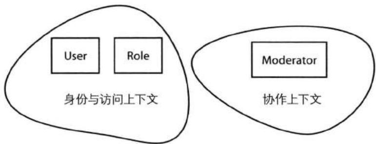


图6.1 协作上下文中的Moderator对象基于身份与访问上下文中的User和Role对象。User和Role是聚合，但Moderator则是值对象。


Moderator和其他Collaborator的子类如图6.2所示，这些对象被建模成了值对象。这些值对象的实例通过静态方式创建，并且和一个Forum聚合关联。这里的重点在于，上游的身份与访问上下文对下游的协作上下文的影响被最小化了。虽然上游上下文需要处理许多对象属性，但是它传给下游的Moderator却只包含了通用语言中的关键性属性。此外，Moderator并不包含Role聚合中属性，而是通过自身的名字表明一个用户所扮演的角色。我们选择静态创建Moderator的方式，并且没有必要使下游中的值对象与上游保持同步。这种考虑了服务质量(Quality Of Service)的契约可以大大地减轻下游上下文的负担。 

当然, 有时下游上下文中的对象必须和远程上下文中的聚合保持最终一致性。在这种情况下, 我们可以在下游上下文中设计一个聚合, 因为该聚合实体可以用于维护状态变化。但是, 我们应该尽量地避免这种建模方式, 在有可能的情况下使用值对象来完成限界上下文之间的集成, 这对于许多需要消费标准类型的上下文来说都是适用的。 

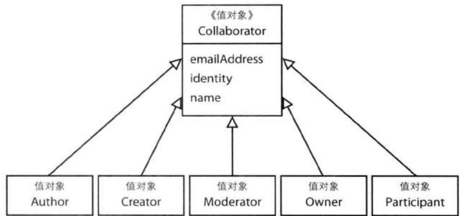


图6.2 值对象Collaborator的类层级。只有少数几个属性来自上游上下文中，因为此时的类名已经能够表示出“角色”的概念了。


## 用值对象表示标准类型

在许多的应用和系统中, 都会使用到标准类型 (Standard Type)。标准类型是用于表示事物类型的描述性对象。系统中既有表示事物的实体和描述实体的值对象, 同时还存在标准类型来区分不同的类型。我并不知道工业上是否存在一个标准的名字来表达这样的概念, 但是我却听说过类型码 (type code) 和查阅对象 (lookup)。类型码并没有传达足够的信息, 而查阅对象需要查询什么我们也不知道。为了使这个概念更加清晰, 可以考虑几个用例场景。在有些场景下, 这个概念被建模成了动力类型 (Power Types)。 

你的通用语言定义了一个PhoneNumber值对象，同时需要为每个PhoneNumber对象制定一个类型。“这个号码是家庭电话、移动电话、工作电话还是其他类型的电话号码？”不同类型的电话号码类型需要建模成一种类的层级关系吗？为每一个类型创建一个类对于客户端使用来说是非常困难的。此时，你需要的是使用标准类型来描述不同类型的电话号码，比如Home、Mobile、Work或者Other。 

正如先前所讨论的，在一个金融领域中，我们需要一个Currency值对象来表示一个MonetaryValue对象的货币类型。在这个例子中，一个标准类型可以用于表示AUD、CAD、CNY、EUR、GBP、JPY和USD等货币类型。使用标准类型可以避免伪造货币。虽然一个不正确的货币类型可能被赋给MonetaryValue，但是一个不存在的货币类型是不能的。如果使用字符串属性来表示货币类型，那么便有可能导致一种不正确的状态。想想如果将表示美元的dollar拼写成了doolar，结果会怎么样？ 

你也可能在制药行业里工作，你所开发的药剂具有不同的给药途径。某种药剂（实体）可能拥有很长的生命周期，从概念设计、研究、开发、测试、生产、改进到终止使用。我们可以使用标准类型来管理这些不同的阶段，当然也可以使用不同的限界上下文来管理。另一方面，对于给药途径，使用标准类型便是更好的方法了，比如静脉注射、口服或者局部施用等。 

根据标准化程度, 这些类型可能只能用在应用程序级别, 也或者可以在不同的系统间共享, 更或者可以成为一种国际标准。 

标准化程度有时会影响到对标准类型的获取, 同时还有可能影响到标准类型在模型中的使用方式。 

我们可以将这些概念建模成实体，因为它们在自己的限界上下文中都拥有自己的生命周期。在不考虑创建方式和由什么样的标准组织维护的情况下，在作为消费方的限界上下文中，我们应该尽可能地在将这些概念建模成值对象。这是一种很好的做法，因为这些概念本来就是用来度量和描述事物的，而值对象便是建模度量和描述概念的最佳方式。再者，一个{静脉注射}实例和另一个{静脉注射}表示的是相同的概念，它们是可以互换的，进而说明它们是可以相互代替的，并且可以进行相等性比较。因此，在限界上下文中，如果没有必要维护一个描述类型对象的生命周期，那么请将其建模成值对象。 

为了维护方便，最好是为标准类型创建单独的限界上下文。在这样的上下文中，这些标准类型便是实体了，拥有持久化的生命周期，并且还含有属性，比如identity、name和description。可能还有其他属性，但是这里的3个属性对于消费上下文来说是最常见的。通常来说，我们只会使用其中一个属性，这也是最小化集成的目标。 

作为一个简单例子, 考虑一个表示两种成员类型的标准类型。成员类型分别为USER和GROUP（可以嵌套），在Java中可以使用枚举来表示该标准类型： 

```java
package com.saasovation.identityaccess.domain.model.identity;
public enum GroupMemberType {
    GROUP {
    public boolean isGroup() {
    return true;
    }
    },
    USER {
    public boolean isUser() {
    return true;
    }
} 
```

```java
}
};
public boolean isGroup() {
    return false;
}
public boolean isUser() {
    return false;
} 
```

一个GroupMember值对象实例在初始化时接受一个GroupMemberType标准类型。当一个User或一个Group被指派给了某个Group，完成指派操作的聚合应该创建正确的GroupMember： 

```txt
protected GroupMember toGroupMember() {
    GroupMember groupMember =
    new GroupMember(
    this.tenantId(),
    this.username(),
    GroupMemberType.USER); //枚举标准类型
    return groupMember;
} 
```

Java的枚举是实现标准类型的一种简单方法。枚举提供了一组有限数量的值对象，它是非常轻量的，并且无副作用。但是该值对象的文本描述在什么地方呢？对于此，存在两种答案。通常来说，没有必要为标准类型提供描述信息，只需要名字就足够了。为什么？文本描述通常只在用户界面层(4)中才能用到，此时可以用一个显示资源和类型名字匹配起来。很多时候用于显示的文本都需要进行本地化（比如在多语言环境中），因此将这种功能放在模型中并不合适。通常来说，在模型中使用标准类型的名字便是最好的方式。另外一种答案是，在枚举中已经存在描述信息了，比如上面的USER和GROUP。你可以调用toString()方法来获得标准类型的文本描述。 

这个简单的由Java枚举所表示的标准类型也是一种优雅的状态[Gamma et al.]对象。GroupMemberType的isGroup()和isUser()方法实现了所有状态的默认行为，即在默认状态下，这两个方法都返回false，这种默认行为是合适的。然后在每一个状态定义中，相应的方法被重载以表示正确的状态。当标准类型的状态为GROUP时，isGroup()方法将返回true；而当标准类型的状态为USER时，isUser()方法则将返回true。状态的改变通过把当前枚举替换成另一个枚举来实现。 

以上的枚举向我们展示了一些基本的行为，根据领域的需要，状态模式的实现可以变得非常复杂。本书中另一个重要的标准类型是BacklogItemStatusType，其中包含了PLANNED、SCHEDULED、COMMITTED、DONE和REMOVED状态。在本书的3个示例限界上下文中，我们都将使用到这种标准类型。 

## 状态模式是有害的？

有人并不看好状态模式, 他们的一个抱怨是: 状态模式需要创建一个抽象基类, 其中包含了需要支持的所有行为 (比如GroupMemberType的最后2个方法), 然后为每个实际状态创建一个实体类来覆盖抽象类的行为。在Java中, 我们需要为抽象类和实际状态类分别创建一个类 (通常是一个类文件)。不管你是否喜欢这种做法, 这就是状态模式的工作方式。 

我同意，为所有的状态创建单独的类会使系统变得复杂。对于实体状态类来说，有些行为来自于自身，有些行为继承自抽象基类，这一方面在子类和父类之间形成了紧耦合，另一方面使代码的可读性变差。但是，使用Java的枚举则是非常简单的，与通过状态模式来创建标准类型相比，枚举可能是更好的方法。我认为这里我们同时得到了两种方法的好处。一方面我们获得了一个非常简单的标准类型，另一方面又能有效地表示当前的状态。 

如果你不喜欢使用Java的枚举来表示标准类型, 你仍然可以使用某个值对象实例来表示。然而, 如果你并不打算使用状态模式, 那么枚举可能是最简单的方法。当然, 除了枚举和状态模式之外, 还有另外的方式可以实现标准类型。 

我们还可以使用聚合来表示标准类型，其中每一个聚合实例代表一种类型。但是，此时我们需要慎重考虑。作为消费方的限界上下文并不会维护标准类型。被大范围使用的标准类型应该在一个单独的限界上下文中进行维护。在向消费上下文提供标准类型的聚合时，我们应该保证这些聚合的不变性。这时，我们需要思考，这个不变的聚合实体还是一个真正意义上的实体吗？如果不是，我们应该将其建模成一个共享的值对象实例。 

一个共享的不变值对象可以从持久化存储中获取，此时可以通过标准类型的领域服务(7)或工厂(11)来获取值对象。我们应该为每组标准类型创建一个领域服务或工厂（比如一个服务处理电话号码类型、一个服务处理邮寄地址类型，另一个服务处理货币类型），如图6.3所示。服务或工厂将按需从持久化存储中获取标准类型，而客户方并不知道这些标准类型是来自数据库中的。另外，使用领域服务或工厂还使得我们可以加入不同的缓存机制，由于值对象在数据库中是只读的，并且在整个系统中是不变的，缓存机制也将变得更加简单和安全。 

总的来说, 我还是建议尽量使用枚举来表示标准类型, 即便你认为某个标准类型更像一种状态模式。如果存在大量的标准类型实例, 我们可以考虑通过代码 生成来创建枚举。例如，代码生成工具将从数据库中读取标准类型，然后为每一个标准类型（数据库中的一条记录）创建对应的枚举。 

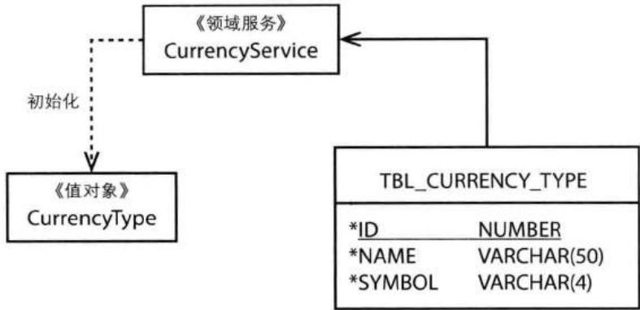


图6.3 领域服务可以用于提供标准类型。在本例中，CurrencyService从数据库中读取某个CurrencyType的状态。


如果你打算用常规的值对象来表示标准类型, 那么此时可以使用领域服务或工厂来静态地创建值对象实例。这种方式在动机上和前面的方法存在相似之处, 但是在实现上却与共享值对象是不同的。在这种情况下, 领域服务或工厂将为每一种标准类型提供静态创建的不变值对象实例。由于是静态的, 数据库中标准类型的改变不会自动反映到代码中。如果你希望这两者是同步的, 那么你应该创建一些定制化的方案来查询并更新模型的状态。这样做可能减少值对象作为标准类型所带来的好处 $^{4}$ 。因此, 你可以在设计早期做出一个决定: 这些静态创建的值对象在消费限界上下文中是永远不会被更新的。 

## 测试值对象

为了强调测试驱动，在实现值对象之前，让我们先来看看测试。通过模拟客户端对值对象的使用，这些测试可以驱动出对领域模型的设计。 

这里, 我们所关心的并不仅仅是单元测试的各个方面, 而是演示客户端是如何使用我们的领域模型的。在设计领域模型时, 从客户端的角度思考有助于捕获关键的领域概念。否则, 我们便是在从自己的角度设计模型, 而不是业务的角度。 

## 最好是采用示例代码

我们可以这么看待这种测试风格：如果我们要为自己的模型编写一个用户手册，我们便可以通过这些测试代码来展示客户端对领域模型的使用。 

当然，也不是说我们就不应该编写单元测试，对于团队所要求的所有类型的测试，我们都应该完成。但是，每种测试的关注点是不同的。单元测试和行为测试有它们自己的关注点，而下面的模型测试则有另外的关注点。 

这里我们选择的值对象来自于敏捷项目管理上下文的核心域(2)，它是演示模型测试的好例子。 

在该限界上下文中，领域专家会说“待定项的业务优先级”。为了建模这部分通用语言，我们创建了一个名为BusinessPriority的类。该类用于衡量每一个待定项的业务价值[Wiegers]，它返回的是成本百分比，或者当前待定项与其他待定项的比较成本。同时，BusinessPriority还向外提供了开发某个待定项的总价值，或者开发当前待定项与其他待定项的比较价值。此外，该类还提供了当前待定项与其他待定项相比起来的业务优先级。 


这些测试在开发的过程中需要逐步改进, 最终的测试代码如下: 

```java
package com.saasovation.agilepm.domain.model.product;
import com.saasovation.agilepm.domain.model.DomainTest;
import java.text.NumberFormat;

public class BusinessPriorityTest extends DomainTest {

    public BusinessPriorityTest() {
    super();
    }
    ...
    private NumberFormat oneDecimal() {
    return this.decimal(1);
    }

    private NumberFormat twoDecimals() {
    return this.decimal(2);
    }

    private NumberFormat decimal(int aNumberOfDecimals) {
    NumberFormat fmt = NumberFormat.getInstance(); 
```

```txt
第6章 值对象
fmt.setMinimumFractionDigits(aNumberOfDecimals);
fmt.setMaximumFractionDigits(aNumberOfDecimals);
return fmt;
} 
```

该测试类中存在一些帮助函数。由于团队需要测试各个计算过程的精确性，他们提供了一些NumberFormat对象来确保计算结果中保留小数的数目： 

```java
public void testCostPercentageCalculation() throws Exception {

    BusinessPriority businessPriority = new BusinessPriority( new BusinessPriorityRatings(2, 4, 1, 1));

    BusinessPriority businessPriorityCopy = new BusinessPriority(businessPriority);

    assertEquals(businessPriority, businessPriorityCopy);

    BusinessPriorityTotals totals = new BusinessPriorityTotals(53, 49, 53 + 49, 37, 33);

    float cost = businessPriority.costPercentage(totals);

    assertEquals(this.oneDecimal().format(cost), "2.7");

    assertEquals(businessPriority, businessPriorityCopy);
} 
```

在测试值对象的不变性时，团队成员想出了一个好主意：每个测试首先创建一个BusinessPriority实例，然后通过复制构造函数创建一个与之相等的复制实例。测试的第一个断言保证了复制构造函数所创建的实例和原来的实例是相等的。 

接下来，创建一个BusinessPriorityTotals实例，并将其赋给totals变量。有了该变量，他们便可以调用cosePercentage()查询方法，然后将查询结果赋给cost变量。再验证cost的值为2.7，该值是他们手工计算出来的期望值。最后，他们需要验证costPercentage()方法是无副作用的，即验证businessPriority和businessPriorityCopy依然是相等的。通过以上测试，团队成员便知道如何计算成本百分比，并且知道返回的结果是什么样子。 

之后，他们需要测试优先级，总价值和价值百分比，他们可以使用和以上测试相同的测试模板： 

```java
public void testPriorityCalculation() throws Exception {

    BusinessPriority businessPriority = new BusinessPriority( new BusinessPriorityRatings(2, 4, 1, 1));

    BusinessPriority businessPriorityCopy = new BusinessPriority(businessPriority);

    assertEquals(businessPriorityCopy, businessPriority);

    BusinessPriorityTotals totals = new BusinessPriorityTotals(53, 49, 53 + 49, 37, 33);

    float calculatedPriority = businessPriority.priority(totals);

    assertEquals("1.03", this.twoDecimals().format(calculatedPriority));

    assertEquals(businessPriority, businessPriorityCopy);
}

public void testTotalValueCalculation() throws Exception {

    BusinessPriority businessPriority = new BusinessPriority( new BusinessPriorityRatings(2, 4, 1, 1));

    BusinessPriority businessPriorityCopy = new BusinessPriority(businessPriority);

    assertEquals(businessPriority, businessPriorityCopy);

    float总产值 = businessPriority.totalValue();

    assertEquals("6.0", this.oneDecimal().format(totalValue));

    assertEquals(businessPriority, businessPriorityCopy);
}

public void testValuePercentageCalculation() throws Exception {

    BusinessPriority businessPriority = new BusinessPriority( new BusinessPriorityRatings(2, 4, 1, 1));

    BusinessPriority businessPriorityCopy = new BusinessPriority(businessPriority);

    assertEquals(businessPriority, businessPriorityCopy);

    BusinessPriorityTotals totals = 
```

```matlab
new BusinessPriorityTotals(53, 49, 53 + 49, 37, 33);
float valuePercentage =
    businessPriority.valuePercentage(totals);
assertEquals("5.9", this.oneDecimal().format(valuePercentage));
assertEquals(businessPriorityCopy, businessPriority); 
```

## 测试应该具有领域含义

在创建测试时, 我们应该保证领域专家能够读懂这些测试, 即测试应该具有领域含义。 

在获得足够帮助的情况下, 非技术的领域专家通过阅读以上的测试代码是能够理解 BusinessPriority 的使用方式的, 他们也能从中看出, BusinessPriority 的确表达出了通用语言的意图。 

重要的是，对值对象的每次操作都没有破坏它的不变性。客户代码可以计算任何数量待定项的优先级、对它们进行排序、比较，或者调整每个待定的BusinessPriorityRatings。 

## 实现

我是喜欢这个BusinessPriority示例的，因为它向我们展示了值对象的所有特征。除了展示不变性、概念整体、可替换性、相等性和无副作用行为之外，BusinessPriority还向我们展示了如何将值对象用作策略模式[Gamma et al.]。 

有了以上的测试，团队成员们知道了客户端是如何使用BusinessPriority对象的，他们按照测试中的断言实现了BusinessPriority类： 


```java
private static final long serialVersionUID = 1L;
private BusinessPriorityRatings ratings;
public BusinessPriority(BusinessPriorityRatings aRatings) {
    super();
    this.setRatings(aRatings);
}
public BusinessPriority(BusinessPriority aBusinessPriority) {
    this(aBusinessPriority.ratings());
} 
```

团队成员决定使该值对象实现Serializable接口。有时，一个值对象实例是需要序列化的，比如当和某个远程系统通信时。另外，当需要对值对象持久化时，序列化也是有帮助的。 

BusinessPriority自身维护了一个类型为BusinessPriorityRatings的值对象属性ratings。该属性描述了一个待定项的业务价值，它向BusinessPriority提供了benefit、cost、penalty和risk等排名信息，使得我们可以在BusinessPriority上进行不同类型的计算。 

通常来说, 我至少都会为值对象创建两个构造函数。第一个构造函数接受用于构建对象状态的所有属性参数, 它是主要的构造函数。该构造函数首先初始化默认的对象状态, 对于基本属性的初始化通过调用私有的setter方法实现。该私有的setter方法向我们展示了一种自委派性, 这是我所推荐的。 

## 保持值对象的不变性

只有主构造函数才能使用自委派性来设置属性值，除此之外，其他方法都不能使用setter方法。由于值对象中的所有setter方法都是私有的，消费方是没有机会直接调用这些setter方法的。这是保持值对象不变性的两个重要因素。 

第二个构造函数用于将一个值对象复制到另一个新的值对象，即复制构造函数。该构造函数采用浅复制(Shallow Copy)的方式，因为它也是将构造过程委派给主构造函数的，先从原对象中取出各个属性值，再将这些属性值作为参数传给主构造函数。当然，我们也可以采用深复制(Deep Copy)或者克隆(clone)的方式，即为每个所引用的属性都创建一份其自身的备份。然而，这种方式既复杂，也没有必要。当需要深度复制时，我们才考虑添加该功能。但是对于不变的值对象来说，在不同的实例间共享属性是不会出现什么问题的。 

复制构造函数对于单元测试来说是非常重要的。在测试值对象时，我们希望验证它的不变性。就像前面所展示的一样，在单元测试开始时，创建一个值对象实例，并通过复制构造函数创建该实例的一份备份，同时验证这两个实例的相等性。接下来，测试值对象的无副作用行为方法。如果所有的验证都通过了，最后我们需要验证这两个实例依然是相等的。 

现在, 我们来实现值对象的策略部分: 

```java
public float costPercentage(BusinessPriorityTotals aTotals) {
    return (float) 100 * this.ratings().cost() /
    aTotals.totalCost();
}

public float priority(BusinessPriorityTotals aTotals) {
    return
    this.valuePercentage(aTotals) /
    (this.costPercentage(aTotals) +
    this.riskPercentage(aTotals));
}

public float riskPercentage(BusinessPriorityTotals aTotals) {
    return (float) 100 * this.ratings().risk() /
    aTotals.totalRisk();
}

public float总产值() {
    return this.ratings().benefit() + this.ratings().penalty();
}

public float valuePercentage(BusinessPriorityTotals aTotals) {
    return (float) 100 * this.totalValue() / aTotals.totalValue();
}

public BusinessPriorityRatings ratings() {
    return this.ratings;
} 
```

有些计算方法需要一个类型为BusinessPriorityTotals的参数。该值对象提供了有关待定项成本和风险的总体描述，它对于计算某个待定项的优先级百分比来说是有必要的。这些行为都不会改变实例的自身状态。在各个行为方法执行完毕之后，我们都会在测试中验证状态的不变性。 

在当前的策略模式中，并不存在独立接口 (Fowler, P of EAA)，因为此时只有一种实现。在将来，可能会有更多的实现，比如该敏捷项目管理软件可能会让用户自己提供优先级计算算法，每种算法策略都对应着各自的实现。 

这些无副作用方法的名字是重要的。虽然所有的方法都返回值对象（因为它们都是CQS查询方法），但是团队成员故意没有使用JavaBean的命名规范，即为方法加上“get”前缀。这种方式使得代码与通用语言保持一致。使用getValuePercentage()只是一个技术上的用法，但是valuePercentage()则是一种流畅的、可读的语言表达。 

## 流畅的Java表达式到哪里去了？

我认为JavaBean规范对于对象设计来说存在负面影响，同时它也没有体现出领域驱动设计的原则。让我们来看看JavaBean规范之前的那些API。比如java.lang.String, String类中只有为数不多的查询方法使用了get前缀。多数查询方法的命名都是非常流畅的，比如charAt()、compareTo()、concat()、contains()、endsWith()、indexOf()、length()、replace()、startsWith()、substring()等。这里并没有多少JavaBean的坏味道。当然，只是这一个例子是不能说明问题的。然而，JavaBean规范出来之后的API的确缺少了很多流畅性。一种流畅的、可读的语言表达方式是值得拥有的。 

对于一些使用了JavaBean规范的工具，我们是有解决办法的。比如，Hibernate支持字段级别的访问（对象属性），因此在使用Hibernate时，我们可以根据自己的需要来命名方法的名字，而不会对持久化造成影响。 

然而，对于其他的一些工具，要使用富有表达性的接口可能就会有问题了。比如在使用Java EL或OGNL时，你很有可能得不到期望的结果。当然，我们还可以使用其他的方式，比如数据传输对象(Data Transfer Object, DTO) [Fowler, P of EAA]，该对象提供了getter方法，它将值对象的属性通过getter方法暴露给用户界面。DTO是一个常用的模式，但是从技术上来说并没有多大必要，因此，DTO也不见得是最好的选择。此时，我们可以考虑使用展现模型(Presentation Model)，我们将在应用程序(14)中对此做详细讲解。由于展现模型实现了适配器模式[Gamma et al.]，它可以向使用EL的视图层提供getter方法。如果以上方法都失败了，那么你不得不回到原地，乖乖地在领域对象中使用getter方法。 

即便如此，在设计值对象时，我们也不应该完全地遵循JavaBean规范。比如，JavaBean规范要求我们提供公有的setter方法，而这将违背值对象的不变性特征。 

下面一组方法包含了标准的equals()、hashCode()和toString()方法： 

```java
@Override
public boolean equals(Object anObject) {
    boolean equalObjects = false;
    if (anObject != null &&
    this.getClass() == anObject.getClass()) {
    BusinessPriority typedefObject = (BusinessPriority) anObject;
    equalObjects =
    this.ratings().equals(typedObject.ratings());
    }
    return equalObjects;
}

@Override
public int hashCode() {
    int hashCodeValue =
    + (169065 * 179)
    + this.ratings().hashCode();

    return hashCodeValue;
}

@Override
public String toString() {
    return
    "BusinessPriority"
    + " ratings = " + this.ratings();
} 
```

这里的equals()方法用于检查不同值对象的相等性。通常来说，在比较相等性时，我们将省略掉对非null的检查。传入的参数对象必须与当前对象具有相同的类型。在类型相同时，equals()方法会对两个对象所有的属性进行比较，当它们之间每组对应的属性都相等时，两个整体值对象则相等。 

根据Java标准，hashCode()方法和equals()方法拥有相同的契约，即如果两个对象是相等的，那么它们的hashCode()方法也应该返回相同的结果。 

对于 toString() 方法来说，并没有什么特别之处。它为值对象的状态创建一条人类可读的描述信息。根据需要，你可以对该描述信息进行格式化。 

BusinessPriority还剩下几个方法: 

```java
protected BusinessPriority() {
    super();
}
private void setRatings(BusinessPriorityRatings aRatings) { 
```

```javascript
if (aRatings == null) {
    throw new IllegalArgumentException(
    "The ratings are required.");
}
this.ratings = aRatings;
} 
```

无参数构造函数是为一些框架准备的，比如Hibernate。由于该构造函数总是隐藏起来的，我们没有必要担心客户端会使用该构造函数来创建非法对象实例。在构造函数和setter/getter被隐藏的情况下，Hibernate依然可以工作。这个无参数的构造函数使得Hibernate或其他工具能够对对象进行重建，比如重建保存在持久化存储中的对象实例。这些工具首先通过无参数构造函数初始化一个空对象，再通过setter方法向该空对象中填入属性值。对于Hibernate，我们可以将其配置成直接设置属性值，而不用使用setter方法。这里的BusinessPriority便是如此，我们并没有完全遵循JavaBean规范。需要注意的是，客户端使用的是公有的构造函数，而不是这个隐藏的构造函数。 

最后，BusinessPriority提供了对ratings的setter方法。这里我们可以看到自封装/自委派的一大好处。一个对象的setter和getter方法并不见得只局限于设置对象的属性值，还可以进行断言[Evans]操作，这对于通常的软件开发和DDD模型来说都是很重要的。 

对参数的合法性进行断言称为守卫，此时的断言保护着对象，使其处于一种合法的状态。守卫断言能够，并且应该用于任何有可能接受错误参数的地方。在本例中，setRatings()方法首先检查所传入的aRatings参数是否为null，如果是，则抛出IllegalArgumentExceptionException异常。诚然，该setter方法在一个BusinessPriority实例的生命周期中只会使用一次，但是这里的守卫断言依然是有用的。你还会在别处看到自委派的好处。特别地，实体(5)一章在讨论验证时对此做了详细的讲解。 

## 持久化值对象

有很多种方式可以用于持久化值对象。通常来讲，持久化过程即是将对象序列化成文本格式或者二进制格式，然后将其保存到计算机磁盘中。然而，由于我们关注的并不是单个值对象自身的持久化，我不会将重点放在通用持久化机制上，而是如何持久化包含有值对象的聚合实例。在接下来的讨论中，我们假设一个父实体包含有多个值对象，这些值对象是需要被持久化的。另外，我们假设对聚合实体的 读取和保存通过资源库(12)完成, 聚合所包含的值对象随着该聚合的持久化而持久化。 

对象-关系映射（ORM，比如Hibernate）持久化机制是流行的。但是，使用ORM将每个类映射到一张数据库表，再将每个属性映射到数据库表中的列会增加程序的复杂性。当下，NoSQL数据库和键值对存储越来越受到人们的欢迎，因为它们具有高性能、可伸缩性、容错性和高可用性等优点。键值对存储可以在很大程度上简化对聚合的持久化。在本章中，我们依然使用ORM持久化机制。对于NoSQL和键值对存储，我们将在资源库(12)中做详细讲解。 

但是，在讲解对值对象的ORM持久化之前，有一点我们需要好好理解。让我们先来看看当数据建模（相比领域建模而言）对你的领域模型造成不利影响时会发生什么情况，我们又可以做些什么。 

## 拒绝由数据建模泄漏带来的不利影响

多数时候，在持久化值对象时（比如使用ORM和关系型数据库），我们都是通过一种非范式的方式完成的，即所有的属性和实体对象都保存在相同的数据库表中。这样可以优化对值对象的保存和读取，并且可以防止持久化逻辑泄漏到模型中。 

但是，有时值对象需要以实体的身份进行持久化。换句话说，某个值对象实例会单独占据一张表中的某条记录，而该表也是专门为这个值对象类型而设计的，它甚至拥有自己的主键列。比如，当聚合中维持了一个值对象的集合时，便会发生这种情况。在这种情况下，一个值对象被当成了数据库实体而被持久化。 

这是否意味着我们应该将领域对象建模成实体而不是值对象呢？当然不是。当你面临这种阻抗失配时，你应该从领域模型的角度，而不是持久化的角度去思考问题。要达到这样的目的，问问自己以下几个问题： 

1. 我当前所建模的概念表示领域中的一个东西呢, 还是只是用于描述和度量其他东西? 

2. 如果该概念起描述作用, 那么它是否满足先前所提到的值对象的几大特征? 

3. 将该概念建模成实体是不是只是持久化机制上的考虑？ 

4. 将该概念建模成实体是不是因为它拥有唯一标识, 我们关注的是对象实例的个体性, 并且需要在其整个生命周期中跟踪其变化? 

如果你的答案是“描述, 是的, 是的, 不是”, 那么此时你应该使用值对象。我们不应该使持久化机制影响到对值对象的建模。 

## 数据建模是次要的

根据领域模型来设计数据模型，而不是根据数据模型来设计领域模型。 

在可能的情况下, 尽量根据领域模型来设计数据模型, 而不是根据数据模型来设计领域模型。采用前者, 我们是在从领域模型的角度看待问题。而采用后者, 我们则是从持久化的角度看待问题, 此时的领域模型只是对数据模型的映射而已。采用面向领域模型的思维方式——DDD思维方式——而不是数据模型思维方式, 这样我们可以免除由数据模型泄漏所造成的影响。更多关于DDD思维方式的讨论, 请参考实体 (5)。 

当然，有时我们需要考虑数据库的引用一致性（比如外键关联）。毫无疑问地，你希望为键值列建立适当的索引。同时，你可能也需要使用一些商业智能化报表工具来操作业务数据。事实上，你是可以通过其他方式来完成这样的功能的。很多人都认为，报表和商业智能化应该由专门的数据模型进行处理，而不是生产环境中的数据。跟随这种战略层次的思维方式，我们根据领域模型所创建的数据模型将能更好地满足DDD原则。 

无论你使用什么技术来完成数据建模，数据库实体、主键、引用完整性和索引都不能用来驱动你对领域概念的建模。DDD不是关于如何根据范式来组织数据的，而是在一个一致的限界上下文中建模一套通用语言。在这个过程中，你应该尽量地避免数据模型从你的领域模型中泄漏到客户端中，对此我们将在下一节中进行讲解。 

## ORM与单个值对象

向数据库中保存单个值对象是非常直接的。这里我们使用Hibernate和MySQL为例，基本的思路是将值对象与其所在的实体对象保存在同一张表中，值对象的每一个属性保存为一列，换句话讲是通过一种非范式的方式将单个值对象与实体对象保存在相同的数据库记录中。此时采用标准的命名约定是有好处的。 

在使用Hibernate保存值对象实例时, 我们可以使用component映射元素, 该元素可以用于将值对象直接映射到实体对象的数据库表中。这是一种优化的序列化技术, 此时我们依然可以将值对象包含在SQL查询语句中。在下面的示例代码中, 实体对象BacklogItem引用了一个BusinessPriority值对象: 

```twig
<component name="businessPriority" class="com.saasovation.agilepm.domain.model.product.BusinessPriority"> 
```

```xml
<component name="ratings" class="com.saasovation.agilepm.domain.model.product.BusinessPriorityRatings">
    <property
    name="benefit"
    column="business_priority_ratings_benefit"
    type="int"
    update="true"
    insert="true"
    lazy="false"
    />
    <property
    name="cost"
    column="business_priority_ratings_cost"
    type="int"
    update="true"
    insert="true"
    lazy="false"
    />
    <property
    name="penalty"
    column="business_priority_ratings_penalty"
    type="int"
    update="true"
    insert="true"
    lazy="false"
    />
    <property
    name="risk"
    column="business_priority_ratings_risk"
    type="int"
    update="true"
    insert="true"
    lazy="false"
    />
</component>
</component> 
```

以上的例子很好地演示了对单个值对象的映射，同时该值对象还包含了一个子值对象。BusinessPriority包含一个名为ratings的值对象，除此之外，并无其他属性。因此，在映射配置中，一个component元素嵌套了另一个component元素，外层表示BusinessPriority，内层表示BusinessPriorityRatings。由于BusinessPriority不再包含其他属性，外层的component并没有映射配置。在内层component中，我们为ratings值对象进行映射配置。最终，我们将BusinessPriorityRatings的4个整数型属性分别保存在表tbl_backlog_item的4个列中。这里我们映射了两个component元素，一个没有属性映射，一个拥有4个属性映射。 

请注意，以上各个property元素中的列名都使用了标准的命名约定。该命名约定表示了从最上层的值对象到下层单个属性的路径指向过程。比如，对于benefit属性，逻辑上的指向路径应该为： 

```txt
businessPriority.ratings.benefit 
```

为了使用单个列名来表示该路径, 我们使用: 

```txt
business_priority_ratings_benefit 
```

当然, 你也可以使用其他的方式来表示该路径, 比如将 “驼峰” 式命名规范与下画线一同使用: 

```txt
businessPriority_ratings_benefit 
```

在本书中, 我将全部采用下画线的方式, 因为这种方式和传统的SQL列名相吻合, 而不是对象名。上例所对应的MySQL数据库定义如下: 

```sql
CREATE TABLE `tbl_backlog_item` (
    ...
    `business_priority_ratings_benefit` int NOT NULL,
    `business_priority_ratings_cost` int NOT NULL,
    `business_priority_ratings_penalty` int NOT NULL,
    `business_priority_ratings_risk` int NOT NULL,
    ...
) ENGINE=InnoDB; 
```

Hibernate映射和数据库表定义一道向我们提供了优化的、可查询的持久化对象。由于值对象属性通过非范式的方式保存在与实体对象相同的记录中，我们没有必要使用联合查询来获取实体对象，即便对于存在深层嵌套的值对象也是如此。在使用HQL时，Hibernate可以简单地将对象属性表达式映射到SQL查询表达式，比如： 

```txt
businessPriority.ratings.benefit 
```

将变成： 

```txt
business_priority_ratings_benefit 
```

这样一来，虽然在对象和关系型数据库之间存在阻抗失配，我们依然可以在它们之间找到一种合适的映射方式。 

## 多个值对象序列化到单个列中

使用ORM将多个值对象的集合映射到数据库中是困难的。我们这里所说的集合是指实体对象所引用的List或者Set，这些集合中可以包含零个、一个或多个值对象元素。当然困难也不是克服不了，但是这里的对象-关系阻抗失配表现得更加明显。 

一种方式是将整个集合序列化成某种形式的文本, 然后将此文本保存到单个数据库列中。这种方式是存在缺点的, 但有时和它的好处相比起来, 缺点就不那么突出了, 此时我们便可以考虑采用这种方式。以下是这种方式的一些潜在缺点: 

- 列宽。有时我们不能决定集合中元素的最大数量，或者序列化后的最大数据量。比如，有些对象集合可以包含任意多个元素——即没有数量上限。另外，集合中的每个元素序列化之后的字符宽度也是不可确定的。比如当值对象中存在String类型的属性时，便有可能发生这种情况，因为String类型并没有字符数量上限。因此，不管是以上的哪种情况，最终序列化后的数据都有可能超过数据库的列宽。对于那些最大列宽比较狭窄的数据库来说，这尤其是个问题。例如，对于MySQL的InnoDB引擎来说，VARCHAR类型的最大宽度为65,535个字符。另外，对于单条记录，InnoDB引擎所规定的最大宽度也是65,535个字符。因此，在保存整个实体时，我们需要保留足够大的空间。在Oracle数据库中，VARCHAR2/NVARCHAR2类型的最大宽度为4,000。如果我们不能预先确定序列化后文本的宽度，那么我们应该避免采用这种方案。 

- 必须查询。由于值对象集合被序列化到扁平化的文本中，此时值对象的属性便不能用于SQL查询语句了。如果其中的任何一个属性存在查询必要，那么我们也不能使用这种方案。有可能这并不是一个充分的理由，因为从一个集合中查询一个或多个属性是比较少见的情况。 

- 需要自定义类型。要采用这种方案，我们必须自定义一个Hibernate类型来处理对每个集合的序列化和反序列化。就我个人而言，这和其他缺点相比起来并不那么突出，因为我们只需要一种自定义类型的实现便可以支持集合中的每种值对象类型。 

这里我并没有提供一个Hibernate自定义类型的例子, 但是Hibernate社区向我们展示了很多这样的例子, 感兴趣的读者可以参考一下。 

## 使用数据库实体保存多个值对象

在使用诸如Hibernate这样的ORM工具来保存值对象集合时，一种直接方式便是使用数据模型。在“拒绝由数据建模泄漏带来的不利影响”一节中我们曾讲到，在采用这种方式时，我们不能因为某个概念非常符合数据库实体而将其建模成领域模型中的实体。有时，是对象-关系阻抗失配需要我们采用这种方法，但这种方法绝非DDD原则。如果存在更好的持久化风格，我们应该首先考虑将领域概念建模成值对象，而绝不是采用数据库实体。 

要实现这种方案, 我们可以采用层超类型[Fowler, P of EAA]。就我个人而言, 我比较喜欢称之为委派身份标识(主键)。然而, 由于Java中的每个对象在JVM中都已经存在一个唯一标识, 因此你可能会倾向于直接使用该标识。而我认为不管我们采用哪种方法, 在处理对象-关系阻抗失配时, 我们都需要为自己做出的技术选择找到充足的理由。 

下面是我所倾向于使用的一种委派主键的方式, 其中使用了两层的层超类型: 

```java
public abstract class IdentifiedDomainObject
    implements Serializable {

    private long id = -1;

    public IdentifiedDomainObject() {
    super();
    }

    protected long id() {
    return this.id;
    }

    protected void setId(long anId) {
    this.id = anId;
    }
} 
```

第一层层超类型是IdentifiedDomainObject。该抽象基类提供了一个基本的委派主键，该主键对客户端是不可见的。由于getter和setter方法都被声明为了protected，客户端根本就没有机会知道这些方法的存在。当然，你还可以进一步将这些方法声明为private。对于Hibernate而言，它可以通过反射机制直接访问到这里的委派主键。 

接下来, 我们定义另一层层超类型, 该层超类型是值对象专属的: 

```java
public abstract class IdentifiedValueObject extends IdentifiedDomainObject {
    public IdentifiedValueObject() {
    super();
    }
} 
```

你可能会认为这里的IdentifiedValueObject类只是起标记作用，因为它并没有什么行为。我认为这有文档说明上的好处，因为它显式地指出了建模意图。IdentifiedDomainObject还应该有另外一个专属于实体的抽象子类Entity，请参考实体(5)。我是喜欢这种方法的，当然你也可以根据自己的喜好去除这里多余的类。 

现在, 每一个值对象类型都可以方便地获得一个隐藏的委派主键, 示例代码如下: 

```java
public final class GroupMember extends IdentifiedValueObject {
    private String name;
    private TenantId tenantId;
    private GroupMemberType type;

    public GroupMember(
    TenantId aTenantId,
    String aName,
    GroupMemberType aType) {
    this();
    this.setName(aName);
    this.setTenantId(aTenantId);
    this.setType(aType);
    this.initialize();
    }
    ...
} 
```

GroupMember是一个值对象，聚合实体Group维护了一个GroupMember的集合。我们可以通过值对象的委派主键来标定某个GroupMember的实例，此时我们可以自由地将其映射成数据库实体，而同时在领域模型中将其建模成值对象。Group类的部分代码如下： 

```java
public class Group extends Entity {
    private String description;
    private Set<GroupMember> groupMembers;
    private String name;
    private TenantId tenantId;

    public Group(
    TenantId aTenantId,
    String aName,
    String aDescription) {
    this();
    this.setDescription(aDescription);
    this.setName(aName);
    this.setTenantId(aTenantId);
    this.initialize();
    }
    ...
    protected Group() {
    super();
    this.setGroupMembers(new HashSet<GroupMember>(0));
    }
} 
```

一个Group类型的实例会逐渐向groupMembers集合中添加GroupMember值对象实例。请记住，在执行整个集合替换时，请记得在替换之前调用Collection类的clear()方法，这样做可以保证背后的Hibernate的Collection实现类及时地从数据库中删除那些过期的数据。下面的代码并不是Group类的一个方法，这里只是用于演示如何进行全集合替换： 

```java
public void replaceMembers(Set<GroupMember> aReplacementMembers) {
    this.groupMembers().clear();
    this.setGroupMembers(aReplacementMembers);
} 
```

从以上代码中我们几乎看不出ORM向领域模型的泄漏，因为我们使用了一个通用的Collection类。另外，客户端也看不到这个类。此时，我们并不用过于关注集合内容与数据库的同步。要删除一个值对象，我们只需要调用Collection类上的remove()方法。这个过程中并不存在ORM泄漏。 

下一步, 我们来看看如何对集合进行映射: 

```txt
<hibernate-mapping>
    <class name="com.saasovation.identityaccess.domain.model.>
    identity.Group"
    table="tbl_group" lazy="true">
    ...
    <set name="groupMembers" cascade="all,delete-orphan"
    inverse="false" lazy="true">
    <key column="group_id" not-null="true" />
    <one-to-many class="com.saasovation.[ccc]
    identityaccess.domain.model.identity.GroupMember" />
    </set>
    ...
    </class>
</hibernate-mapping> 
```

这里的groupMembers集合与数据库实体精确地映射起来, 以下是完整的GroupMember映射: 

```xml
<hibernate-mapping>
    <class name="com.saasovation.identityaccess.domain.model."
    identity.GroupMember"
    table="tbl_group_member" lazy="true">
    <id
    name="id"
    type="long"
    column="id"
    unsaved-value="-1">
    <generator class="native"/>
    </id>
    <property
    name="name"
    column="name"
    type="java.lang.String"
    update="true"
    insert="true"
    lazy="false"
    />
    <component name="tenantId"
    class="com.saasovation.identityaccess.domain.model."
    identity.TenantId">
    <property
    name="id"
    column="tenant_id_id"
    type="java.lang.String"
    update="true"
    insert="true"
    lazy="false"
    />
</hibernate-mapping> 
```

</component>
<property
    name="type"
    column="type"
    type="com.saasovation.identityaccess.infrastructure." $^{1}$ persistence.GroupMemberTypeUserType"
    update="true"
    insert="true"
    not-null="true"
/>
</class>
</hibernate-mapping> 

请注意表示持久化委派主键的<id>元素。最后是MySQL中数据表的定义： 

```sql
CREATE TABLE `tbl_group_member` (
    `id` int(11) NOT NULL auto_increment,
    `name` varchar(100) NOT NULL,
    `tenant_id_id` varchar(36) NOT NULL,
    `type` varchar(5) NOT NULL,
    `group_id` int(11) NOT NULL,
    KEY `k_group_id` (`group_id`),
    KEY `k_tenant_id_id` (`tenant_id_id`),
    CONSTRAINT `fk_1_tbl_group_member_tbl_group`
    FOREIGN KEY (`group_id`) REFERENCES `tbl_group` (`id`),
    PRIMARY KEY (`id`)
) ENGINE=InnoDB; 
```

这里的GroupMember映射和数据库表定义给人的印象是：我们的确是在处理实体。数据库表中存在id，并且存在一个单独的表与tbl_group表联合，该表维持了一个到tbl_group表的外键关联。但是，这里处理的实体只是出于数据模型的角度。在领域模型中，GroupMember显然是一个值对象。在领域模型中，我们采用了适当的方法将那些与持久化相关的信息隐藏起来。客户端是觉察不到任何持久化泄漏的，而即便是开发者，也很难从代码中找出持久化泄漏的痕迹。 

## 使用联合表保存多个值对象

Hibernate还提供一种以联合表的方式持久化集合数据，这种方式并不需要值对象表现出数据模型的实体特征。这种方式简单地将值对象的集合元素保存到一个单独的数据库表中，然后在该表中维护一个到领域实体所对应表的外键关联，该外键指向实体的数据库id。这样一来，所有的集合元素都可以通过实体id进行查询，然后用于重建该值对象集合。这种方式的好处在于，我们不需要隐藏委派 主键便可以实现对数据库的联合查询。在Hibernate中, 我们可以使用<composite-element>来达到这样的目的。 

这种方式看似非常完美，或者正是我们所需要的。然而，这种方式也是存在缺点的，其中之一便是即便我们的值对象并不需要委派主键，我们依然会用到对数据库表的联合操作，因为我们需要在两张表之间满足数据库范式。诚然，在“使用数据库实体保存多个值对象”一节中采用的方式也需要表间联合，但是那种方式并不存在“使用联合表保存多个值对象”的第二个缺点，即…… 

如果保存值对象的集合是Set类型，那么值对象的每一个属性都不应该为null。原因在于，为了从Set中删除某个值对象，所有用于标定该值对象唯一性的属性都会被用作联合主键的一部分，进而完成对值对象的查找和删除。当然，如果你知道所有属性都没有为null的时候，这种方式是可行的。 

第三个缺点在于所映射的值对象可能还包含嵌套的集合，而这并不是<composite-element>能处理的情况。如果你的值对象不包含嵌套的集合，并且满足这种映射风格的需求，那么可以考虑采用这种方式。 

最后, 我发现这种方式存在太大的限制性, 因此我们应该尽量避免采用这种方式。相反, 采用隐藏委派主键的方式将值对象集合映射成一对多的关系要简单得多。当然, 你可能有不一样的看法, 此时你需要选择最适合自己的方式。 

## ORM与枚举状态对象

如果你发现枚举是建模标准类型和状态对象的好方式，那么你应该找到一种方式来持久化该枚举。对于Hibernate来说，Java的枚举需要一项专门的持久化技术。不幸的是，Hibernate目前还不提供对枚举属性的直接支持。因此，要对我们自己模型中的枚举进行持久化，我们需要创建一个自定义的类型。 

回想一下, 前面的GroupMember有一个GroupMemberType: 

```java
public final class GroupMember extends IdentifiedValueObject {
    private String name;
    private TenantId tenantId;
    private GroupMemberType type;

    public GroupMember(
    TenantId aTenantId,
    String aName,
    GroupMemberType aType) {
    this();
    this.setName(aName);
    this.setTenantId(aTenantId);
    }
} 
```

```javascript
this.setType(aType);
this.initialize();
}
...
} 
```

这里的GroupMembrType枚举标准类型包括GROUP和USER, 定义如下: 

```java
package com.saasovation.identityaccess.domain.model.identity;
public enum GroupMemberType {

    GROUP {
    public boolean isGroup() {
    return true;
    }
    },
    USER {
    public boolean isUser() {
    return true;
    }
    };

    public boolean isGroup() {
    return false;
    }

    public boolean isUser() {
    return false;
    }
} 
```

持久化Java枚举的一种简单方式是保存枚举所对应的文本展现。然而，这种方式需要我们创建一个Hibernate的自定义类型。这里我并不演示Hibernate社区所提供的EnumUserType，而是向大家提供一个wiki链接：http://community.jboss.org/wiki/Java5EnumUserType。 

在我写本书时, 该wiki页向我们提供了多种方式, 同时还包含了实现多种枚举类型的示例代码, 包括使用Hibernate的参数化类型来避免为每一种枚举类型都创建一个自定义类型、分别使用字符串和数字来表示枚举类型, 甚至还含有一种由Gavin King改进过后的实现方式, 该方式允许将枚举作为类型鉴别器或者数据表id。 

采用以上方法的其中一种, 我们可以对GroupMemberType做如下映射: 

<hibernate-mapping>
    <class name="com.saasovation.identityaccess.domain.model." $^{1}$ identity.GroupMember" table="tbl_group_member" lazy="true">
    ...
    <property
    name="type"
    column="type"
    type="com.saasovation.identityaccess.infrastructure." $^{2}$ persistence.GroupMemberTypeUserType"
    update="true"
    insert="true"
    not-null="true"
    />
    </class>
</hibernate-mapping> 

请注意, 这里<property>元素的类型被设成了GroupMemberTypeUserType的全路径名称。这只是一种选择, 你也可以采用自己喜欢的方式。在对应的MySQL表定义中, 包含有表示该枚举的列: 

```sql
CREATE TABLE `tbl_group_member` (
    ...
    `type` varchar(5) NOT NULL,
    ...
) ENGINE=InnoDB; 
```

这里的type列类型为VARCHAR，最大长度为5个字符，对于GROUP和USER来说，这已经足够了。 


## 本章小结

在本章中, 你学到了尽量使用值对象的重要性, 因为值对象易于开发、测试和维护。 

- 你学到了值对象的特征并且如何使用值对象。 

- 你学到了如何使用值对象来简化集成的复杂性。 

- 你学习了使用值对象来表示领域标准类型以及如何实现。 

- 你了解到了SaaSOvation团队是如何将建模重点转向值对象的。 

- 从SaaSOvation项目中,你获得了如何测试、实现和持久化值对象。 

接下来, 我们将学习领域服务和无状态操作, 这些都是领域模型的一部分。 

## 第7章 领域服务

有时，它不见得是件东西。 

—Eric Evans 

领域中的服务表示一个无状态的操作, 它用于实现特定于某个领域的任务。当某个操作不适合放在聚合(10)和值对象(6)上时, 最好的方式便是使用领域服务了。有时我们倾向于使用聚合根上的静态方法来实现这些这些操作, 但是在DDD中, 这是一种坏味道。 

## 本章路线图

- 学习如何在领域模型中使用领域服务。 

- 学习什么是领域服务。 

- 学习何时应该使用领域服务。 

- 从SaaSOvation项目的两个例子中学习如何对领域服务进行建模。 

坏味道? 这正是SaaSOvation的开发者们在重构聚合时所遇到的问题。让我们看看他们是如何应对这些问题的…… 

在项目的早些时候，项目成员们在Product中维护了一个BacklogItem实例的集合。这种建模方式使得他们可以计算一个Product的总业务优先级： 


在当时，这种设计方式是非常完美的，businessPriorityTotals()方法只需要遍历所有的BacklogItem实例，然后计算出总的业务优先级。并且，这种方式适当地使用了值对象BusinessPriorityTotals。 

但是，我却不这么认为。通过对聚合(10)的分析我们知道，这里的Product对象过于庞大，而BacklogItem本身就应该成为一个聚合。因此，上面的实例方法businessPriorityTotals()已经不再适用于这种场景。 

由于Product不再包含BacklogItem集合，团队成员们的第一反应便是使用一个资源库BacklogItemRepository来获取所需的BacklogItem实例，这是一种好的做法吗？ 

事实上，团队中的高级开发者并不建议这么做。一个基本的原则是，我们应该尽量避免在聚合中使用资源库(12)。那么，将businessPriorityTotals()方法声明为静态方法，然后将BacklogItem集合作为参数传入，如何呢？这样，我们几乎不用对该方法做多少修改，只需要传入新的参数即可： 

```java
public class Product extends ConcurrencySafeEntity {
    ...
    public static BusinessPriorityTotals businessPriorityTotals(Set<BacklogItem> aBacklogItems) {
    ...
    }
    ...
} 
```

请思考, Product是创建该静态方法的最佳位置吗? 看来要将该方法放在合适的地方并不是一件易事。由于该方法只使用了每个BacklogItem中的值对象, 将该方法放在BacklogItem上似乎更合适。但是, 这里计算所得的业务价值却是属于Product的, 而不是BacklogItem。进退两难啊! 

此时，团队中的高级开发者发话了。他指出，这些问题用一个单一的建模工具就可以解决，即领域服务（Domain Service）。那么，领域服务是如何工作的呢？ 

让我们先了解一些背景知识，再回过头来看看这个建模场景，看看SaaSOvation团队做了什么样的决定。 

# 什么是领域服务（首先，什么不是领域服务）

当我们在软件开发领域中听到“服务”这个词时，自然地我们可能会想到一个远程客户端与某个复杂的业务系统交互的场景，该场景基本上描述了SOA(4)中的一个服务。有多种技术和方法可以实现SOA服务，最终这些服务强调的都是系统层面的远程过程调用(RPC)或者面向消息的中间件(MoM)。这些技术使得我们可以通过服务与分布在不同地方的系统进行业务交互。 

以上这些都不是领域服务。 

另外，请不要将领域服务与应用服务混杂在一起了。在应用服务中，我们并不会处理业务逻辑，但是领域服务却恰恰是处理业务逻辑的。如果你还是不明白它们之间的区别，请参考应用程序（14）。简单来讲，应用服务是领域模型很自然的客户方，进而也是领域服务的客户方。在本章后面，我们将对此进行演示。 

虽然领域服务中有“服务”这个词，但它并不意味着需要远程的、重量级的事务操作 $^{1}$ 。 

## 牛仔的逻辑

LB: “在你吃东西之前，请仔细看看你吃的是什么。重要的不是看它现在是什么，而是它之前是什么。” 


领域模型中的服务的确是一种非常好的建模工具。现在，我们已经知道领域服务不是什么了，那么，它到底又是什么呢？ 

有时，它不见得是一件东西……当领域中的某个操作过程或转换过程不是实体或值对象的职责时，此时我们便应该将该操作放在一个单独的接口中，即领域服务。请确保该领域服务和通用语言是一致的；并且保证它是无状态的。[Evans, pp. 104, 106] 

通常来说, 领域模型主要关注于特定于某个领域的业务, 同样, 领域服务也具有相似的特点。由于领域服务有可能在单个原子操作中处理多个领域对象, 这将增加领域服务的复杂性。 

那么, 在什么情况下, 一个操作不属于实体 (5) 或者值对象呢? 要给出一个全面的原因列表是困难的, 这里我罗列了以下几点。你可以使用领域服务来: 

- 执行一个显著的业务操作过程。 

- 对领域对象进行转换。 

- 以多个领域对象作为输入进行计算, 结果产生一个值对象。 

需要明确的是, 对于最后一点中的计算过程, 它应该具有“显著的业务操作过程”的特点。这也是领域服务很常见的应用场景, 它可能需要多个聚合作为输入。当一个方法不便放在实体或值对象上时, 使用领域服务便是最佳的解决方法。请确保领域服务是无状态的, 并且能够明确地表达限界上下文中的通用语言(1)。 

## 请确定你是否需要一个领域服务

请不要过于倾向于将一个领域概念建模成领域服务，而是只有在有必要的时候才这么做。一不小心，我们就有可能陷入将领域服务作为“银弹”的陷进。过度地使用领域服务将导致贫血领域模型[Fowler, Anemic]，即所有的业务逻辑都位于领域服务中，而不是实体和值对象中。下面的例子为我们展示了仔细思考的重要性。以这些例子为指导，你将学到应该在什么情况下使用领域服务。 

让我们来看一个需要建立领域服务的例子。考虑身份与访问上下文，我们需要对一个User进行认证。回忆一下，在实体(5)章节中，我们曾遇到了一个建模场景，那时团队决定将问题延后。那时所说的“延后”便是现在了： 

- 系统必须对User进行认证，并且只有当Tenant处于激活状态时才能对User进行认证。 

我们来看看为什么领域服务在此时是必要的。我们可以简单地将该认证操作放在实体上吗？从客户的角度来看，我们可能会使用以下代码来实现认证过程： 

```txt
// client finds User and asks it to authenticate itself
boolean authentic = false;
User user =
    DomainRegistry
    .userRepository()
    .userWithUsername(aTenantId, aUsername); 
```

```txt
if (user != null) {
    authentic = user.isAuthentic(aPassword);
}
return authentic; 
```

对于以上设计, 我认为至少存在两个问题。首先, 客户端需要知道某些认证细节, 他们需要找到一个User, 然后再对该User进行密码匹配。这种方法也不能显式地表达通用语言。这里, 我们询问的是一个User “是否被认证了”, 而没有表达出“认证”这个过程。在有可能的情况下, 我们应该尽量使建模术语直接地表达出团队成员的交流用语。但是, 还有更糟糕的。 

这种建模方式并不能准确地表达出团队成员所指的“对User进行认证”的过程。它缺少了“检查Tenant是否处于激活状态”这个前提条件。如果一个User所属的Tenant处于非激活状态，我们便不应该对该User进行认证。或许我们可以通过以下方法予以解决： 

```txt
//客户端查找User，然后User完成自我认证
boolean authentic = false;
Tenant tenant =
    DomainRegistry
    .tenantRepository()
    .tenantOfId(aTenantId);
if (tenant != null && tenant.isActive()) {
    User user =
    DomainRegistry
    .userRepository()
    .userWithUsername(aTenantId, aUsername);
    if (user != null) {
    authentic = tenant督促ncate(user, aPassword)
    }
}
return authentic; 
```

这种方式的确对Tenant的活跃性做了检查，同时我们也将User的isAuthentic()方法换成了Tenant的authenticate()方法。 

然而，这种方式也是有问题的。请看看我们带给客户端的额外负担，此时客户端需要知道更多的认证细节，而这些是他们不应该知道的。当然，我们可以将 

Tenant的isActive()方法放在authenticat()方法中, 但是我得说, 这并不是一个显式的模型。同时, 这将带来另外一个问题, 即此时的Tenant需要知道如何对密码进行操作。回忆一下该认证过程的另一个需求: 

- 必须对密码进行加密，并且不能使用明文密码。 

对于以上解决方案, 我们似乎给模型带来了太多的问题。对于最后一种方案, 我们必须从以下四种解决办法中选择一种: 

1. 在Tenant中处理对密码的加密，然后将加密后的密码传给User。这种方法违背了单一职责原则[Martin, SRP]。 

2. 由于一个User必须保证对密码的加密，它可能已经知道了一些加密信息。如果是这样，我们可以在User上创建一个方法，该方法对明文密码进行认证。但是，在这种方式下，认证过程变成了Tenant上的门面（Facade），而实际的认证功能全在User上。另外，User上的认证方法必须声明为protected，以防止外界客户端对认证方法的直接调用。 

3. Tenant依赖于User对密码进行加密，然后将加密后的密码与原有密码进行匹配。这种方法似乎在对象协作之间增加了额外的步骤。此时，Tenant依然需要知道认证细节。 

4. 让客户端对密码进行加密, 然后将其传给Tenant。这样导致的问题在于, 客户端承载了它本不应该有的职责。 

以上这些方法都无济于事，同时客户端依然非常复杂。强加在客户端上的职责应该在我们自己的模型中予以处理。只与领域相关的信息决不能泄漏到客户端中去。即使客户端是一个应用服务，它也不应该负责对身份与访问权限的管理。 

## 牛仔的逻辑

AJ: “当你发现自己在一个洞穴中时, 第一件要做的事便是停止凿洞。” 


回想一下，客户端需要处理的唯一业务职责是：调用单个业务操作，而由该业务操作去处理所有的业务细节： 

```txt
//应用服务只用于协调任务
UserDescriptor userDescriptor =
DomainRegistry
 Month party
 .authenticationService()
 Month party
 .authenticate(aTenantId, aUsername, aPassword); 
```

以上方式是简单的，也是优雅的。客户端只需要获取到一个无状态的AuthenticationService，然后调用它的authenticate()方法即可。这种方式将所有的认证细节放在领域服务中，而不是应用服务。在需要的情况下，领域服务可以使用任何领域对象来完成操作，包括对密码的加密过程。客户端不需要知道任何认证细节。此时，通用语言也得到了满足，因为我们将所有的领域术语都放在了身份管理这个领域中，而不是一部分放在领域模型中，另一部分放在客户端中。 

领域服务方法返回一个UserDescirptor值对象，这是一个很小的对象，并且是安全的。与User相比，它只包含3个关键属性： 

```cs
public class UserDescriptor implements Serializable {
    private String emailAddress;
    private TenantId tenantId;
    private String username;

    public UserDescriptor(
    TenantId aTenantId,
    String aUsername,
    String anEmailAddress) {
    ...
    }
    ...
} 
```

该UserDescriptor对象可以存放在一次Web会话(Session)中。对于作为客户端的应用服务来说，它可以进一步将该UserDescriptor返回给它自己的调用者。 

## 建模领域服务

根据创建领域服务的目的, 有时对领域服务进行建模是非常简单的。你需要决定你所创建的领域服务是否需要一个独立接口[Fowler, P of EAA]。如果是, 你的领域服务接口可能与以下接口相似: 

```java
package com.saasovation.identityaccess.domain.model.identity;
public interface AuthenticationService {
    public UserDescriptor authenticate(
    TenantId aTenantId,
    String aUsername,
    String aPassword);
} 
```

该接口和那些与身份相关的聚合（比如Tenant, User和Group）定义在相同的模块(9)中，因为AuthenticationService也是一个与身份相关的概念。当前，我们将所有与身份相关的概念都放在identity模块中。该接口定义本身是简单的，只有一个authenticate()方法。 

对于该接口的实现类, 我们可以选择性地将其存放在不同的地方。如果你正使用依赖倒置原则 (4) 或六边形 (4) 架构, 那么你可能会将这个多少有些技术性的实现类放置在领域模型之外。比如, 技术实现类可以放置在基础设施层的某个模块中。 

以下是对该接口的实现： 

```java
package com.saasovation.identityaccess.infrastructure.services;

import com.saasovation.identityaccess.domain.model.DomainRegistry;
import com.saasovation.identityaccess.domain.model.identity.
AuthenticationService;
import com.saasovation.identityaccess.domain.model.identity.Tenant;
import com.saasovation.identityaccess.domain.model.identity.TenantId;
import com.saasovation.identityaccess.domain.model.
identity.User;
import com.saasovation.identityaccess.domain.model.
identity.UserDescriptor;

public class DefaultEncryptionAuthenticationService
    implements AuthenticationService {

    public DefaultEncryptionAuthenticationService() {
    super();
    }

    @Override
    public UserDescriptor authenticate(
    TenantId aTenantId,
    String aUsername,
    String aPassword) {
    if (aTenantId == null) { 
```

```dart
throw new IllegalArgumentException(
    "TenantId must not be null.");
if (aUsername == null) {
    throw new IllegalArgumentException(
    "Username must not be null.");
}
if (aPassword == null) {
    throw new IllegalArgumentException(
    "Password must not be null.");
}

UserDescriptor userDescriptor = null;

Tenant tenant =
DomainRegistry
.tenantRepository()
.tenantOfId(aTenantId);

if (tenant != null && tenant.isActive()) {
    String encryptedPassword =
    DomainRegistry
.encryptionService()
.encryptedValue(aPassword);

    User user =
DomainRegistry
.userRepository()
.userFromAuthenticCredentials(
    aTenantId,
    aUsername,
    encryptedPassword);

    if (user != null && user.isEnabled()) {
    userDescriptor = user.userDescriptor();
    }
}

return userDescriptor;
} 
```

该方法首先对null参数进行检查。如果在正常情况下认证失败，那么该方法返回的UserDescriptor将为null。 

在对一个User进行认证时, 我们首先根据aTenantId从Tenant的资源库中取出对应的Tenant。如果Tenant存在并且处于激活状态, 下一步我们将对传入的明文密码进行加密。加密的目的在于, 我们需要通过加密后的密码来获取一个User。在获取一个User时, 我们不但需要传入aTenantId和username, 还需要传入加密后的密 码进行匹配（对于两个明文相同的密码，加密后也是相同的）。User的资源库将根据这三个参数来定位一个User。 

如果用户提交的aTenantId、username和password都是正确的，我们将获得相应的User实例。但是，此时我们依然不能对该User进行认证，我们还需要处理最后一条需求： 

- 只有在一个User被激活后，我们才能对该User进行认证。 

即便我们通过资源库找到了一个User, 该User也有可能处于未激活状态。通过向User添加激活功能, Tenant可以从另一个层面来控制对User的认证。因此, 认证过程的最后一步即是检查所获取到的User实例是否为null和是否处于激活状态。 

## 独立接口有必要吗

由于这里的AuthenticationService并没有一个技术上的实现, 我们真的有必要为其创建一个独立接口并将其与实现类分离在不同的层和模块中吗? 这是没有必要的。我们只需要创建一个实现类即可, 其名字与领域服务的名字相同。 

```java
package com.saasovation.identityaccess.domain.model.identity;
public class AuthenticationService {
    public AuthenticationService() {
    super();
    }

    public UserDescriptor authenticate(
    TenantId aTenantId,
    String aUsername,
    String aPassword) {
    ...
    }
} 
```

对于领域服务来说，以上的例子同样是可行的。我们甚至会认为这样的例子更加合适，因为我们知道不会再有另外的实现类。但是，不同的租户可能有不同的安全认证标准，所以产生不同的认证实现类也是有可能的。然而此时，SaaSOvation的团队成员决定弃用独立接口，而是采用了上例中的实现方法。 

## 给领域服务的实现类命名

在Java世界中, 常见的命名实现类的方法便是给接口名加上Impl后缀。按照这种方法, 我们的认证实现类为AuthenticationServiceImpl。此外, 实现类和接口通常被放在相同的包下。这是一种好的做法吗? 

事实上，如果你采用这种方式来命名实现类，这往往意味着你根本就不需要一个独立接口。因此，在命名一个实现类时，我们需要仔细地思考。这里的AuthenticationServiceImpl并不是一个好的实现类名，而DefaultEncryptionAuthenticationService也不见得能好到哪里去。基于这些原因，SaaSOvation的团队成员决定去除独立接口，而直接使用AuthenticationService作为实现类。 

如果领域服务具有多个实现类, 那么我们应该根据各种实现类的特点进行命名, 而这往往又意味着在你的领域中存在一些特定的行为功能。 

有人认为采用相似的名字来命名接口和实现类有助于代码浏览和定位。但是，还有人则认为将接口和实现类放在相同的包中会使包变得很大，这是一种糟糕的模块设计，因此他们偏向于将接口和实现类放在不同的包中，我们在依赖倒置原则(4)中便是这么做的。比如，可以将接口EncryptionService放在领域模型中，而将MD5EncryptionService放在基础设施层中。 

对于非技术性的领域服务来说, 去除独立接口是不会破坏可测试性的, 因为这些领域服务所依赖的所有接口都可以注入进来, 或者通过服务工厂 (Service Factory) 进行创建。请记住, 非技术性的领域服务, 比如计算性的服务等, 都必须进行正确性测试。 

可以理解, 这是一个具有争议性的话题, 我也知道有很大一部分人依然采用Impl后缀的方式来命名实现类。即便如此, 我们仍然有强烈的理由不这么做。当然, 选择权在你自己手上。 

有时，领域服务总是和领域密切相关，并且不会有技术性的实现，或者不会有多个实现，此时采用独立接口便只是一个风格上的问题。Fowler在[Fowler, P of EAA]中说，独立接口对于解偶来说是有用处的，此时客户端只需要依赖于接口，而不需要知道具体的实现。但是，如果我们使用了依赖注入或者工厂[Gamma et al.]，即便接口和实现类是合并在一起的，我们依然能达到这样的目的。换句 话说，以下的DomainRegistry可以在客户端和服务实现之间进行解耦，此时的DomainRegistry便是一个服务工厂。 

```txt
//DomainRegistry在客户端与具体实现之间解耦
UserDescriptor userDescriptor =
    DomainRegistry
    .authenticationService()
    .authenticate(aTenantId, aUsername, aPassword); 
```

或者, 如果你使用的是依赖注入, 你也可以得到同样的好处: 

```java
public class SomeApplicationService ... {
    @Autowired
    private AuthenticationService authenticationService;
    ...
} 
```

依赖倒置容器（比如Spring）将完成服务实例的注入工作。由于客户端并不负责服务的实例化，它并不知道接口类和实现类是分开的还是合并在一起的。 

与服务工厂和依赖注入相比，有时他们更倾向于将领域服务作为构造函数参数或者方法参数传入 $^{2}$ ，因为这样的代码拥有很好的可测试性，甚至比依赖注入更加简单。也有人根据实际情况同时采用以上三种方式，并且优先采用基于构造函数的注入方式。本章中有些例子使用了DomainRegistry，但这并不是说我们应该优先考虑这种方式。互联网上很多源代码例子都倾向于使用构造函数注入，或者直接将领域服务作为方法参数传入。 

## 一个计算过程

让我们来看一个计算过程的例子,该例子来自于敏捷项目管理上下文。该例子中的领域服务从多个聚合的值对象中计算所需结果。就目前来看,我们没有必要使用独立接口。该领域服务总是采用相同的方式进行计算。除非有需求变化,不然我们没有必要将接口和实现分离开来。 

## 牛仔的逻辑

LB: “我的公马每次能给我挣5,000美元，现在我打算把那些母马也加到服务中来。” 

AJ: “看来那匹马已经进入它的领域了。” 


回忆一下, SaaSOvation的开发者们曾经在Product上创建了静态方法来完成计算过程, 以下是接下来发生的事…… 

团队中的高级开发者同时指出，采用领域服务比静态方法更好。此时的领域服务和当前的静态方法完成相似的功能，即计算并返回一个BusinessPriorityTotals值对象。但是，该领域服务还需要完成额外的工作，包括找到一个Product中所有未完成的BacklogItem，然后单独计算它们的BusinessPriority。以下是实现代码： 


```java
package com.saasovation.agilepm.domain.model.product;

import com.saasovation.agilepm.domain.model.DomainRegistry;
import com.saasovation.agilepm.domain.model.tenant.Tenant;

public class BusinessPriorityCalculator {

    public BusinessPriorityCalculator() {
    super();
    }

    public BusinessPriorityTotals businessPriorityTotals(
    Tenant aTenant,
    ProductId aProductId) {
    int totalBenefit = 0;
    int totalPenalty = 0;
    int totalCost = 0;
    int totalRisk = 0;

    java.util.Collection<BacklogItem> outstandingBacklogItems = DomainRegistry
    .backlogItemRepository()
    .allOutstandingProductBacklogItems( 
```

```txt
aTenant,
aProductId);

for (BacklogItem backlogItem : outstandingBacklogItems) {
    if (backlogItem.hasBusinessPriority()) {
    BusinessPriorityRatings ratings =
    backlogItem.businessPriority().ratings();

    totalBenefit += ratings.benefit();
    totalPenalty += ratings.penalty();
    totalCost += ratings.cost();
    totalRisk += ratings.risk();
    }
}

BusinessPriorityTotals businessPriorityTotals =
    new BusinessPriorityTotals(
    totalBenefit,
    totalPenalty,
    totalBenefit + totalPenalty,
    totalCost,
    totalRisk);

return businessPriorityTotals;
} 
```

BacklogItemRepository用于查找所有未完成的BacklogItem实例。一个未完成的BacklogItem是拥有Planned, Scheduled或者Committed状态的BacklogItem，而状态为Done或Removed的BacklogItem则是已经完成的。我们并不推荐将资源库对BacklogItem的获取放在聚合实例中，相反，将其放在领域服务中则是一种好的做法。 

有了一个Product下所有未完成的BacklogItem，我们便可以对它们进行遍历，并计算出BusinessPriority的总和。计算所得的总和进一步用于实例化一个BusinessPriorityTotals，然后返回给客户端。领域服务不一定非常复杂，即使有时的确会出现这种情况。上面的例子则是非常简单的。 

请注意，在上面的例子中，我们绝对不能将业务逻辑放到应用层中。即使你认为这里的for循环非常简单，它依然是业务逻辑。当然，还有另外的原因： 

```txt
BusinessPriorityTotals businessPriorityTotals = new BusinessPriorityTotals(
    totalBenefit, 
```

```txt
totalPenalty,
totalBenefit + totalPenalty,
totalCost,
totalRisk); 
```

在实例化BusinessPriorityTotals时，它的totalValue属性由totalBenefit和totalPenalty相加所得。这是和领域密切相关的业务逻辑，自然不能泄漏到应用层中。当然，你可能会说，可以将totalBenefit和totalPenalty作为两个参数分别传给应用服务。然而，虽然这是一种改进模型的方式，但这也并不意味着将剩下的计算逻辑放在应用层就是合理的。 

虽然我们不会将业务逻辑放在应用层,但是应用层却可以作为领域服务的客户端: 

```java
public class ProductService ... {
    private BusinessPriorityTotals productBusinessPriority(
    String aTenantId,
    String aProductId) {
    BusinessPriorityTotals productBusinessPriority = DomainRegistry
    .businessPriorityCalculator()
    .businessPriorityTotals(
    new TenantId(aTenantId),
    new ProductId(aProductId));
    return productBusinessPriority;
    }
} 
```

在上例中，应用层中的一个私有方法负责获取一个Product的总业务优先级。该方法可能只需要向ProductService的客户端（比如用户界面）提供BusinessPriorityTotals的部分数据即可。 

## 转换服务

在基础设施层中, 更加技术性的领域服务通常是那些用于集成目的的服务。正是这个原因, 我们将与此相关的例子放在了集成限界上下文 (13) 中, 其中你将看到领域服务接口、实现类、适配器[Gamma et al.]和不同的转换器。 

## 为领域服务创建一个迷你层

有时我们可能希望在实体和值对象之上创建一个领域服务的迷你层。正如我先前所说，这样做可能会导致贫血领域模型这种反模式。 

但是，对于有些系统来说，为领域服务创建一个不至于导致贫血领域模型的迷你层是值得的。当然，这取决于领域模型的特征。对于本书的身份与访问上下文来说，这样的做法是非常有用的。 

如果你正工作在这样的领域里，并且你决定为领域服务创建一个迷你层，请注意这样的迷你层和应用层中的服务是不同的。在应用服务中，我们关心的是事务和安全，但是这些不应该出现在领域服务中。 

## 测试领域服务

我们希望对领域服务进行测试，并且希望从客户端的角度对领域服务进行建模，同时我们希望测试能够反映出领域服务的使用方式。 

## 此时进行测试是否为时已晚？

在前面的章节中, 我正式向大家介绍了测试驱动开发, 也向大家展示了一些例子。在本章中我并没有这么做, 单单只是因为我希望尽早地与大家讨论对领域服务的实现。但是, 这的确也说明测试先行的策略并不总是必要的, 虽然不这样做可能会遗漏一些建模关注点。 

以下测试展示了如何正确地使用AuthenticationService, 首先我们测试认证成功的场景: 

```java
public class AuthenticationServiceTest extends IdentityTest {

    public void testAuthenticationSuccess() throws Exception {

    User user = this.getUserFixture();

    DomainRegistry
    .userRepository()
    .add(user);

    UserDescriptor userDescriptor = DomainRegistry
    .authenticationService()
    .authenticate(
    user.tenantId(), 
```

```txt
user.username(),
FIXTURE_PASSWORD);

assertNotNull(userDescriptor);
assertEquals(user.tenantId(), userDescriptor.tenantId());
assertEquals(user.username(), userDescriptor.username());
assertEquals(user.person().emailAddress(),
    userDescriptor.emailAddress());
} 
```

上面的例子向我们展示了应用服务的客户端是如何使用AuthenticationService的。这是一个顺利的使用场景，此时一个User得到了成功的认证。 

请注意, 这里的资源库可以是真实产品环境下的资源库, 也可以是内存资源库, 还可以是模拟 (mock) 资源库。当然, 采用哪种类型的资源库只是一个选择问题。 

接下来,我们需要测试认证失败的场景: 

```java
public void testAuthenticationTenantFailure() throws Exception {

    User user = this.getUserFixture();

    DomainRegistry
    .userRepository()
    .add(user);

    TenantId bogusTenantId =
    DomainRegistry.tenantRepository().nextIdentity();

    UserDescriptor userDescriptor =
    DomainRegistry
    .authenticationService()
    .authenticate(
    bogusTenantId, //假冒的
    user.username(),
    FIXTURE_PASSWORD);

    assertNull(userDescriptor);
} 
```

在上例中, 由于我们传入的TenantId和创建User时的TenantId不一样, 认证过程将失败。此外, 如果我们传入的username不合法, 认证过程也将失败: 

```txt
User user = this.getUserFixture();

DomainRegistry
  .userRepository()
  .add(user);

UserDescriptor userDescriptor =
    DomainRegistry
    .authenticationService()
    .authenticate(
    user.tenantId(),
    "bogususername",
    user.password());

assertNull(userDescriptor);
} 
```

在上例中, 由于我们传入了一个错误的username, 认证过程也将失败。最后, 还有另外一个认证失败的场景: 

```java
public void testAuthenticationPasswordFailure() throws Exception {

    User user = this.getUserFixture();

    DomainRegistry
    .userRepository()
    .add(user);

    UserDescriptor userDescriptor =
    DomainRegistry
    .authenticationService()
    .authenticate(
    user.tenantId(),
    user.username(),
    "passwOrd");

    assertNull(userDescriptor);
} 
```

在上例中, 我们传入了一个错误的password, 认证过程同样会失败。在所有失败的认证过程中, 返回的UserDescriptor都将是null。客户端需要知道这样的细节, 因为返回的null表示对一个User的认证不成功。同时, 它表示认证失败并不是一个异常性错误, 而是该领域中本来就存在的一种可能。否则, 我们需要从领域服务中抛出AuthenticationFailedException异常。 

事实上，我们还缺少了几个测试用例。对于一个Tenant处于失活状态和一个User处于未激活状态的场景，请读者自行完成测试。在此之后，你可以继续为BusinessPriorityCalculator编写测试。 


## 本章小结

在本章中, 我们讨论了什么是领域服务, 什么不是领域服务, 并且分析了何时应该采用领域服务。另外还有: 

- 你学到了不要滥用领域服务。 

- 你学到了滥用领域服务将导致贫血领域模型这种反模式。 

- 你学到了如何实现领域服务。 

- 你学到了使用独立接口的优缺点。 

- 你学习了敏捷项目管理上下文中的一个示例计算过程。 

- 最后，你学到了通过测试来展示对领域服务的使用。 

接下来, 我们将学习一种新的DDD战术建模工具——领域事件。 

## 领域事件

历史就是人们认同的过去所发生的事件。 

—Napoleon Bonaparte 

使用领域事件 (Domain Event) 来捕获发生在领域中的一些事情。领域事件是一个功能强大的建模工具，一旦你使用了它，你便无法释手了。在一开始使用领域事件时，你要做的是对不同的事件进行定义。 

## 本章学习路线图

- 学习什么是领域事件，什么时候并且为什么要使用领域事件。 

- 学习如何将领域事件建模成对象，何时应该为领域事件创建唯一的身份标识。 

- 学习一个轻量级的发布-订阅[Gamma et al.]模式。 

- 学习哪些组件用于发布事件，哪些组件用于订阅事件。 

- 学习为什么我们需要一个事件存储、如何实现事件存储、如何使用事件存储。 

- 学习SaaSOvation团队是如何通过不同的方式将领域事件发布给自治系统的。 

## 何时/为什么使用领域事件

[Evans]书中并没有给出领域事件的正式定义。这种模式是在该书出版之后才提出来的。在讨论领域事件之前，让我们先来看看当前对领域事件的定义： 

领域专家所关心的发生在领域中的一些事件。 

将领域中所发生的活动建模成一系列的离散事件。每个事件都用领域对象来表示……领域事件是领域模型的组成部分，表示领域中所发生的事情。[Evans, Ref, p.20] 

我们如何确定哪些事件对领域专家是重要的呢？在我们与领域专家讨论时，我们需要仔细地听，找到领域事件的线索。考虑以下领域专家所说的关键词汇： 

- “当……” 

- “如果发生……” 

- “当……的时候，请通知我” 

- “发生……时” 

当然，对于“当……的时候，请通知我”，这里的通知本身并不能构成一个事件，而只是表明我们需要向外界发出通知。另外，领域专家可能还会说“如果发生这样的事情，它并不重要；如果发生那样的事情，它就很重要了（将“这样”和“那样”用你自己领域中的事件予以替换）。”根据你的组织文化，可能还有更多的事件用语。 

## 牛仔的逻辑

AJ: “当我需要我的马时, 我只是吆喝: ‘过来过来!’, 然后马就跑过来了。 


有时，从领域专家的话中，我们看不出领域事件的迹象，但是业务需求依然有可能需要领域事件。领域专家有可能意识不到这些需求，只有在跨团队讨论之后他们才能意识到这些。发生这样的事情往往是由于领域事件需要发布到外部系统中，比如发布到另一个限界上下文中(2)。由于这样的事件由订阅方处理，它将对本地和远程上下文产生深远的影响。 

## 领域专家和领域事件

虽然领域专家在起初可能意识不到所有类型的领域事件,但是通过讨论之后,他们是应该能够了解到其中的原因的。当团队成员对领域事件达成一致之后,领域事件便是通用语言的正式组成部分了。 

当领域事件到达目的地之后——无论是本地系统还是外部系统——我们通常都将领域事件用于维护事件的一致性。这是有意而为之的，并且是根据设计而来的。这样可以消除两阶段提交（全局事务），还可以支持聚合(10)原则。聚合的其中一个原则是，在单个事务中，只允许对一个聚合实例进行修改，由此产生的其他改变必须在单独的事务中完成。因此，本地限界上下文中的其他聚合实例便可以通过 领域事件的方式予以同步。另外，领域事件还可以用于使远程依赖系统与本地系统保持一致。本地系统和远程系统的解耦有助于提高双方协作服务的可伸缩性。 

图8.1向我们展示了领域事件的产生、存储、分发和使用。领域事件既可以由本地限界上下文所消费，也可以由外部的限界上下文消费。 

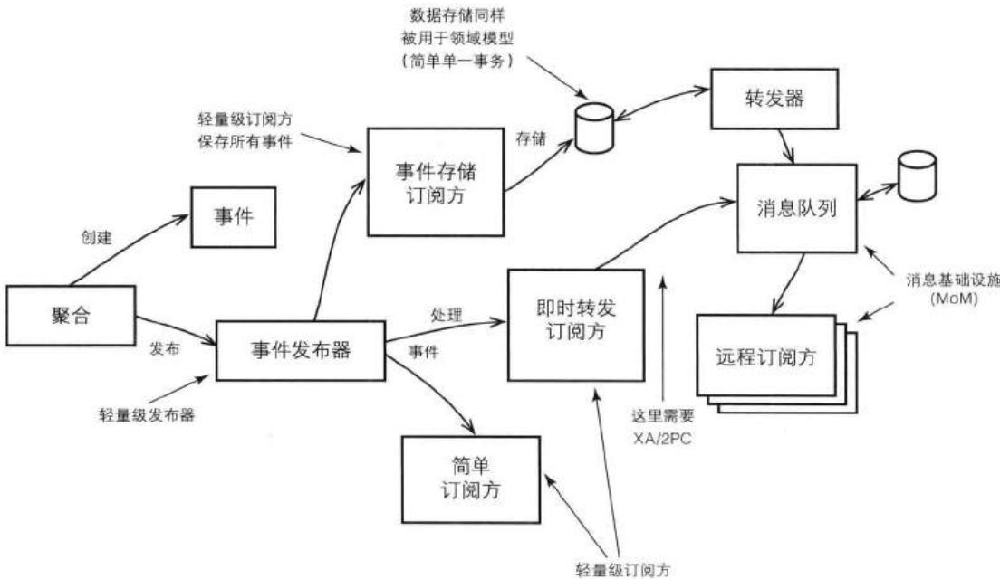


图 8.1 聚合创建并发布事件。订阅方可以先存储事件，然后再将其转发到远程的订阅方中；或者不经存储，直接转发。除非消息中间件共享了模型的数据存储，不然即时转发需要 XA（两阶段提交）。


现在，让我们来考虑一下系统中的批处理过程。在系统的非高峰时期，批处理过程通常进行一些系统维护工作，比如删除过期的对象、创建新的对象以支持新的业务需求、或者通知用户所发生的重要事件等。这样的批处理过程通常需要复杂的查询，并且需要庞大的事务支持。如果这些批处理过程存在冗余又会怎么样呢？ 

那么，让我们重新思考一下。对于系统中发生的每一件事情，我们都用事件的形式予以捕获，然后将事件发布给订阅方处理，这能达到简化系统的目的吗？答案是肯定的。它可以消除先前批处理过程中的复杂查询，因为我们能够准确地知道在何时发生了什么事情，限界上下文也由此知道“接下来应该做什么”。在接收到领域事件时，系统可以予以立即处理。这样一来，原本批量集中处理的过程可以分散成许多粒度较小的处理单元，业务需求也由此得到更快地满足，用户也可以及时地进行下一步操作。 

聚合上的每一个命令方法都会产生事件吗?与何时需要使用领域事件同等重要的是,我们需要知道何时不应该使用领域事件。出于技术实现和协作系统上的考虑,有时领域事件可以提供比领域专家所要求的更多的功能,比如可以用于事件源(4,附录A)。 

我们将在集成限界上下文(13)中对此进行探讨,这里我们只讨论领域事件的核心方面。 

## 建模领域事件

让我们看看敏捷项目管理上下文中的一条需求： 

允许将每一个待定项提交到冲刺中。只有在待定项位于发布计划中时，才能进行提交。如果待定项已经提交到了另外的冲刺中，必须先将其回收才能进行新的提交。提交待定项时，通知对应的冲刺和相关兴趣方。 


在建模领域事件时, 我们应该根据限界上下文中的通用语言来命名事件及其属性。如果事件由聚合上的命令操作产生, 那么我们通常根据该操作方法的名字来命名领域事件。对于上面的例子, 当我们向一个冲刺提交待定项时, 我们将发布与之对应的领域事件: 

命令方法: BacklogItem#commitTo(Sprint aSprint) 

事件输出: BacklogItemCommitted 

事件的名字表明了聚合上的命令方法在执行成功之后所发生的事情：“待定项提交完毕。”当然，我们还可以创建更详细的事件名字，比如BacklogItemCommittedToSprint。但是，在Scrum的通用语言中，待定项只能提交到冲刺中。换句话说，待定项是不能提交到发布中的。因此，使用原先的 

BacklogItemCommitted已经足够了, 并且更加简捷。如果你倾向于使用更详细的事件命名, 也是可以的, 这只是一个选择问题。 

在聚合发布事件时, 请注意我们应该使事件的名字反映过去发生的事情, 即该事件并不是当前发生的, 而是先前发生的。 

在有了正确的事件名后, 我们还需要什么样的事件属性呢? 首先, 我们需要一个时间戳来表示事件发生的时间。在Java中, 可以使用java.util.Date类来表示。 

```java
package com.saasovation.agilepm.domain.model.product;
public class BacklogItemCommitted implements DomainEvent {
    private Date occurredOn;
} 
```

所有的领域事件都将实现DomainEvent接口，该接口定义了一个occurredOn()方法： 

```java
package com.saasovation.agilepm.domain.model;
import java.util.Date;
public interface DomainEvent {
    public Date occurredOn();
} 
```

接下来，团队成员还需要考虑其他有意义的属性。考虑一下，是谁导致了领域事件的产生。这通常包括产生该领域事件的聚合和其他参与操作的聚合，也有可能是其他任何类型的数据属性。 

分析之后, 我们可以得到以下BacklogItemCommitted事件: 

```java
package com.saasovation.agilepm.domain.model.product;
public class BacklogItemCommitted implements DomainEvent {
    private Date occurredOn;
    private BacklogItemId backlogItemId;
    private SprintId committedToSprintId;
    private TenantId tenantId;
} 
```

团队成员认为，BacklogItem和Sprint的身份标识对于BacklogItemCommitted事件来说是最关键的。BacklogItem是事件的发起方，而Sprint则是事件的参与方。当然，他们还讨论了更多的话题。该需求特别指出，当BacklogItem被提交到Sprint之后，该Sprint应该得到通知。因此，位于同一个限界上下文中的事件订阅方应该及时地通知Sprint，但前提条件是BacklogItemCommitted事件中存在SprintId。 


此外，在一个多租户环境中，记录TenantId也是有必要的，虽然TenantId不会作为参数传给命令方法，但是它却是本地和远程限界上下文所必需的。在本地上下文中，我们需要TenantId来查询BacklogItem和Sprint。同样，在远程上下文中，我们需要TenantId来查出领域事件的作用对象。 

我们如何建模由事件提供的行为操作呢？通常来说，这是非常简单的，因为领域事件通常都被设计成不变的。事件所携带的属性能够反映出该事件的来源。多数事件的构造函数都只允许全状态初始化，同时，事件对象还提供了访问不同属性的getter方法。 

基于此，ProjectOvation团队做了以下实现： 

```java
package com.saasovation.agilepm.domain.model.product;

public class BacklogItemCommitted implements DomainEvent {

    public BacklogItemCommitted(
    TenantId aTenantId,
    BacklogItemId aBacklogItemId,
    SprintId aCommittedToSprintId) {
    super();
    this.setOccurredOn(new Date());
    this.setBacklogItemId(aBacklogItemId);
    this.setCommittedToSprintId(aCommittedToSprintId);
    this.setTenantId(aTenantId);
    }

    @Override
    public Date occurredOn() {
    return this.occurredOn; 
```

```java
}
public BacklogItemId backlogItemId() {
    return this.backlogItemId;
}

public SprintId committedToSprintId() {
    return this.committedToSprintId;
}

public TenantId tenantId() {
    return this.tenant;
}
...
} 
```

在该事件发布时, 本地上下文的订阅方可以用该事件来通知相应的Sprint: 

```txt
MessageConsumer.instance(messageSource, false)
.receiveOnly(
    new String[] { "BacklogItemCommitted" },
    new MessageListener(Type.TEXT) {
    @Override
    public void handleMessage(
    String aType,
    String aMessageId,
    Date aTimestamp,
    String aTextMessage,
    long aDeliveryTag,
    boolean isRedelivery)
    throws Exception {
    //第一条消重之后的消息，以aMessageId标定
    ...
    //从JSON中获取到tenantId、sprintf和backlogItemId
    ...
    Sprint sprint =
    sprintfRepository.sprintById(tenantId, sprintf);
    BacklogItem backlogItem =
    backlogItemRepository.backlogItemId(tenantId, backlogItemId);
    sprint.commit(backlogItem);
    }
}); 
```

根据系统需求，在处理了BacklogItemCommitted消息之后，Sprint与刚才所提交的BacklogItem达到了最终一致性。我们将在本章后续内容中讨论订阅方是如何接收领域事件的。 

团队成员意识到, 这种方式还存在一个小问题。Sprint如何处理更新事务呢? 我们可以让消息处理器来处理事务。但是, 无论如何我们都需要相应地重构代码。最好的方式是将事务处理委派给应用服务 (14). 


这是一种很自然的选择, 同时这种方式能够很好地融入六边形架构(4)中。如此一来, 代码将变成: 

```java
MessageConsumer.instance(messageSource, false)
    .receiveOnly(
    new String[] { "BacklogItemCommitted" },
    new MessageListener(Type.TEXT) {
    @Override
    public void handleMessage(
    String aType,
    String aMessageId,
    Date aTimestamp,
    String aTextMessage,
    long aDeliveryTag,
    boolean isRedelivery)
    throws Exception {
    //从JSON中获取到tenantId、sprintf和backlogItemId
    String tenantId = ...
    String sprintfId = ...
    String backlogItemId = ...

    ApplicationServiceRegistry
    .sprintfService()
    .commitBacklogItem(
    tenantId, sprintf, backlogItemId);
    }
}); 
```

在上面的例子中, 我们没有必要消除对事件的重复提交, 因为向Sprint提交BacklogItem是一个幂等操作。如果某个BacklogItem已经提交给了Sprint, 当再次提交时, Sprint将予以忽略。 

除了事件的来源信息, 如果订阅方还需要进行更多的操作, 那么我们可以向事件中添加额外的状态和行为。这样, 订阅方便不用回头再对聚合进行查询, 而只需要对所接收到的事件进行查询即可。富有行为和状态的领域事件在事件源中更加常见, 因为那些需要持久化并进而发布到外部限界上下文的领域事件需要更多的额外状态, 请参考附录A。 

## 白板时间

- 列出你领域中已经存在但是还未被捕获的领域事件。 

- 想想如何将这些事件显现在自己的领域模型中。 

最容易识别出的便是当一个聚合依赖于另外一个聚合的时候，此时我们需要保证它们之间的最终一致性。 

正如在值对象 (6) 中所讨论的, 我们需要确保这些额外的事件行为是无副作用的, 这样可以保证对象的不变性。 

## 创建具有聚合特征的领域事件

有时，领域事件并不由聚合中的命令方法产生，而是直接由客户方所发出的请求产生。此时，领域事件可以建模成一个聚合，并且可以拥有自己的资源库。但是，又由于领域事件表示的是发生在过去的事情，因此资源库是不能对事件进行删除的。 

和聚合一样，由这种方式所创建的事件应该成为模型结构的一部分。因此，它们不再仅仅表示过去发生的事情。 

此时的领域事件依然应该设计成不变的, 但是它们将拥有唯一标识。对于领域事件而言, 我们可以使用事件属性来表示唯一标识。然而, 即便事件的唯一标识可以由一组属性来决定, 最好的方式还是采用生成的唯一标识, 请参考实体 (5)。这样, 如果设计有变化, 我们依然可以保证事件的唯一性。 

由这种方式所创建的事件可以通过消息设施进行分发，同时又可以将其添加到资源库中。客户方可以通过调用领域服务（7）来创建事件，然后将其添加到资源库中，再通过消息设施进行发布。在这种情况下，资源库和消息设施必须使用相 同的持久化实例（数据源），或者使用全局事务（即XA和两阶段提交），以此来保证对事件的成功提交。 

在消息设施成功存储事件之后，它将异步地将事件发送给消息队列监听器、话题订阅方或者Actor Model中的Actor等。如果消息设施所使用的存储和模型所使用的存储是分离的，并且消息设施不支持全局事务，那么在调用领域服务时，事件必须已经存在于消息存储中。消息转发组件将对消息存储中的每一个事件进行处理，然后通过消息设施将事件发布出去。对此，我们将在本章后续内容做详细讨论。 

## 身份标识

这里，我们再讨论一下领域事件为什么需要唯一标识。有时，我们需要对不同的事件进行区分。在创建、发布事件的限界上下文中，我们几乎没有理由对不同事件进行比较。但是，如果我们的确需要对不同的事件进行比较，我们应该怎么办呢？再者，如果此时的事件被设计成了聚合，我们又该怎么办呢？ 

对于领域事件来说, 使用属性来表示唯一标识似乎已经足够了, 就像值对象一样。使用事件的名字、产生事件的聚合标识和事件时间戳已经足以对不同的事件进行区分了。 

当领域事件被建模成了聚合；或者我们需要对不同的事件进行比较，但是事件的属性又不足以区分事件时，我们便需要为事件创建唯一标识。当然，还有其他的原因。 

当我们需要将领域事件发布到外部限界上下文中时，为事件创建唯一标识也是有必要的。在有些情况下，单条消息可能会被多次分发，比如，在消息设施确定消息发出之前，消息发布器便瘫痪了。 

不管是什么原因导致了对消息的重新分发，消息订阅方都需要检查出重复的消息，并且将其忽略掉。为了达到这样的目的，有些消息设施在消息头中加入了唯一性的消息标识，此时我们自己的领域模型是不能生成这样的标识的。即便消息设施不会自动地向消息中加入唯一标识，消息的发送方也会向事件本身或者消息中加入这样的标识信息。不管采用哪种方法，远程的订阅方都有机会知道一条消息是否是重复发送的。 

有必要为领域事件提供equals()和hashCode()方法吗?有,但是通常来说,只有当事件用于本地限界上下文中时,我们才这么做。对于通过消息设施发送的事件,有时订阅方接收的并不是事件对象本身,而是以XML、JSON或键值对等表示的事 件数据。另一方面，当一个事件被设计成聚合并且保存在资源库中时，那么事件应该为这些数据展现形式提供相应的方法支持。 

## 从领域模型中发布领域事件

我们应该避免将领域模型暴露给任何类型的消息中间件。这些消息中间件只存在于基础设施层中。虽然有时领域模型会间接地与基础设施层打交道，但是它们绝不会显式地耦合起来。我们所采用的方法将彻底地避免对基础设施的使用。 

一种简单高效的发布领域事件的方法便是使用观察者(Observer)模式[Gamma et al.], 这种方法可以在领域模型和外部组件之间进行解耦。出于命名的原因, 我将使用“发布-订阅”来表示该模式, 这也是[Gamma et al.]书中给观察者模式的别名。我这里给出的例子是非常轻量级的, 因为无论是订阅事件还是发布事件, 其中都没有网络的参与。消息的订阅方和发布方位于相同的进程空间中, 并且运行在相同的线程中。当事件发布时, 每一个订阅方都会同步地得到通知。这也意味着所有的订阅方都运行在相同的事务中, 也许它们都被相同的应用服务所管理, 而应用服务则是领域模型的直接客户。 

为了更好地理解DDD中的领域事件, 我们将分别讨论对消息的发布和订阅。 

## 发送方

也许使用领域事件最常见的便是，由聚合创建一个事件，然后将其发布出去。此时的发送方位于模型的某个模块(9)中，但是它并没有表达出多少领域概念，而是向聚合中添加了一个简单的服务，该服务用于通知订阅方所发生的领域事件。以下是一个DomainEventPublisher，顾名思义，该类用于发布领域事件，请参考图8.2。 

```java
package com.saasovation.agilepm.domain.model;

import java.util.ArrayList;
import java.util.List;

public class DomainEventPublisher {

    @SuppressWarnings("unchecked")
    private static final ThreadLocal<List> subscribers = new ThreadLocal<List>();

    private static final ThreadLocal<Boolean> publishing = new ThreadLocal<Boolean>() { 
```

```java
protected Boolean initialValue() {
    return Boolean.FALSE;
}

public static-domainEventPublisher instance() {
    return new-domainEventPublisher();
}

public-domainEventPublisher() {
    super();
}

@SuppressWarnings("unchecked")
public <T> void publish(final T aDomainEvent) {
    if (publishing.get()) {
    return;
    }
    try {
    publishing.set(Boolean.TRUE);
    List<DomainEventSubscriber<T>> registeredSubscribers = subscribers.get();
    if (registeredSubscribers != null) {
    Class<?> eventType = aDomainEvent.getClass();
    for (DomainEventSubscriber<T> subscriber : registeredSubscribers) {
    Class<?> subscribedTo = subscriber.subscribedToEventType();
    if (submittedTo == eventType ||
    subscribedTo == DomainEvent.class) {
    subscriber.handleEvent(aDomainEvent);
    }
    }
    }
    } finally {
    publishing.set(Boolean.FALSE);
    }
}

public-domainEventPublisher reset() {
    if (!publishing.get()) {
    subscribers.set(null);
    }
    return this;
}

@SuppressWarnings("unchecked")
public <T> void subscribe(DomainEventSubscriber<T> aSubscriber) {
    if (publishing.get()) {
    return;
    }
    List<DomainEventSubscriber<T>> registeredSubscribers = 
```

```java
subscribers.get();
if (registeredSubscribers == null) {
    registeredSubscribers =
    new ArrayList<DomainEventSubscriber<T>>( );
    subscribers.set(registeredSubscribers);
}
registeredSubscribers.add(aSubscriber);
} 
```

由于每一个用户请求都将在单独的线程中予以处理，我们将通过线程来区分消息发送方。因此，对于上例中的两个ThreadLocal变量，subscribers和publishing，每个线程都会拥有自己的实例。当订阅方通过subscribe()方法向DomainEventPublisher进行注册时，该订阅方将被加入到所属线程的List中。每个线程都可以有多个注册的订阅方。 

根据不同的应用服务器，有些服务器可能会维护一个线程池，不同的请求有可能重用同一个线程。对于在先前请求线程中注册的订阅方，我们不希望它在同一个线程的下一个请求到来时依然处于注册状态。当系统接收到一个新的用户请求时，我们应该调用reset()方法来清除掉先前的订阅方。这样保证了只有在执行了reset()之后注册的订阅方才能处理事件。在展现层（即图8.2中的“User Interface”），我们可以使用过滤器(filter)来拦截每个请求。该拦截组件将调用reset()方法： 

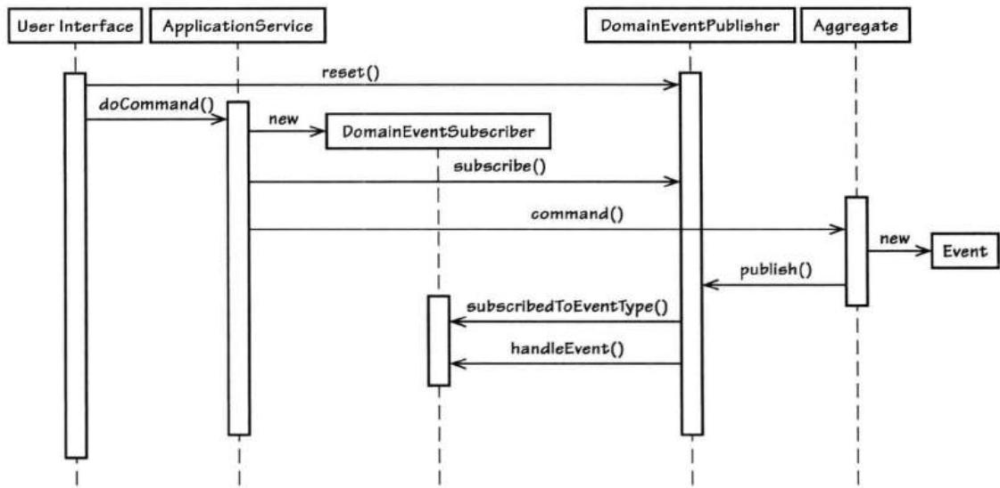


图8.2 轻量级观察者、用户界面（14）、应用服务和领域模型（1）之间的序列交互，这是一个抽象视图。


```javascript
//在Web过滤器组件中，用户请求抵达
DomainEventPublisher.instance().reset();
...
//稍后，同一个请求对应的应用服务
DomainEventPublisher.instance().subscribe(subscriber); 
```

随着代码的执行——图8.2中的两个分离组件——线程中只能有一个注册的订阅方。通过subscribe()方法的实现我们知道，只有当发送方没有进行发送操作时，我们才能注册订阅方。这可以避免线程同步问题，比如两段代码同时修改一个List。 

当一个订阅方在处理事件时, 如果它反过来再向发送方中添加一个新的订阅方, 那么上面的线程同步问题便是非常明显的。 

接下来，让我们来看看聚合是如何发送一个事件的。继续前面的例子，当BacklogItem的commitTo()方法执行成功之后，它将发布一个BacklogItemCommitted事件： 

```java
public class BacklogItem extends ConcurrencySafeEntity {
    ...
    public void commitTo(Sprint aSprint) {
    ...
    DomainEventPublisher
    .instance()
    .publish(new BacklogItemCommitted(
    this.tenantId(),
    this.backlogItemId(),
    this.sprintId());
    )
    ...
} 
```

在DomainEventPulisher执行publish()方法时，它将依次遍历所有注册的订阅方。此时，DomainEventPulisher将调用每个订阅方的subscribedToEventType()方法来判断该订阅方是否可以处理一个特定类型的事件。如果订阅方返回的是DomainEvent.class，则表明该订阅方可以处理任何类型的领域事件。所有有资格处理事件的订阅方都将使用handleEvent()方法来处理事件。在过滤或通知完所有的订阅方之后，发布过程执行完毕。 

和subscribe()方法一样，publish()方法在发布事件时是不允许嵌套请求的。所以在执行publish()方法，我们首先需要检查Boolean类型的线程变量publishing，只有在该变量为false时，我们才执行发布操作。 

对事件的发布如何延伸到远程的限界上下文，从而支持自治性服务呢？我们将在本章的后面进行讨论，这里我们只将关注点放在本地限界上下文的订阅方上。 

## 订阅方

由什么组件向领域事件注册订阅方呢? 通常来说, 这种功能由应用服务 (14) 完成, 有时也由领域服务完成。订阅方可以是任何类型的组件, 只要它和发布事件的聚合位于相同的线程中, 并且在发布事件之前可以完成注册即可。这意味着, 事件订阅方是在使用领域模型的方法执行流中进行注册的。 

## 牛仔的逻辑

LB: “我想订阅一份《The Fence Post》，以便在本书中有更多可说的。” 


在使用六边形架构时, 由于应用服务是领域模型的直接客户, 它可以作为注册订阅方的理想场所, 即在应用服务调用聚合方法产生事件之前, 它可以先对订阅方进行注册。以下是应用服务注册订阅方的一个例子: 

```java
public class BacklogItemApplicationService ... {
    public void commitBacklogItem(
    Tenant aTenant,
    BacklogItemId aBacklogItemId,
    SprintId aSprintId) {

    DomainEventSubscriber subscriber =
    new DomainEventSubscriber<BacklogItemCommitted>() {
    @Override
    public void handleEvent(BacklogItemCommitted aDomainEvent) {
    //在这里处理事件
    }
    @Override
    public Class<BacklogItemCommitted> subscribedToEventType() {
    return BacklogItemCommitted.class;
    }
    } 
```

```txt
DomainEventPublisher.instance().subscribe(subscriber);

BacklogItem backlogItem =
    backlogItemRepository
    .backlogItemId(aTenant, aBacklogItemId);

Sprint sprint = sprintRepository.sprintById(aTenant, aSprintId);

backlogItem.commitTo(sprint);
} 
```

在上例中，BacklogItemApplicationService是一个应用服务，它拥有一个commitBacklogItem()服务方法。该方法将实例化一个匿名的DomainEventSubscirber。然后，应用服务的任务协调器向DomainEventPublisher注册该DomainEventSubscirber。最后，commitBacklogItem()方法通过资源库获取到BacklogItem和Sprint，再执行BacklogItem的commitTo()方法。当该方法执行完后，它将发布一个BacklogItemCommitted事件。 

上例并没有包含订阅方如何处理事件的代码。订阅方可以向外发送一封E-mail以告知BacklogItemCommitted事件的发生；也可以将该事件存放在事件存储中；或者通过消息设施将该事件转发出去。对于后两种情形，我们并不会创建一个特定于用例的应用服务，而是设计一个订阅组件予以处理。在“事件存储”一节中，你将看到这样的例子。在该例中，一个具有单一职责的组件负责将领域事件保存到事件存储中。 

## 对于事件处理器, 你要小心了

应用服务控制着事务。不要在事件通知过程中修改另外一个聚合实例，因为这样破坏了聚合的一大原则：在一个事务中，只对一个聚合进行修改。 

事件订阅方不应该在另一个聚合上执行命令方法，因为这样将破坏“在单个事务中只修改单个聚合实例”的原则，请参考聚合(10)。正如[Evans]所讲，所有聚合实例之间的最终一致性必须通过异步的方式予以处理。 

通过消息设施转发事件可以异步地将事件发送到不同的订阅方。每一个订阅方都可以在各自单独的事务中修改额外的聚合实例。这些额外的聚合实例可以位于相同的限界上下文中，也可以位于不同的限界上下文中。将事件分发到不同限界上下文的子域中，这里的“子域”强调了领域事件中的“领域”一词。换句话说，这 里的事件是领域范围内的概念，而不是限界上下文中的概念。事件发布的契约应该放在整个企业范围之内，或者更大的范围。但是，大范围的事件分发并不意味着我们不能在相同的限界上下文中对事件进行分发。请参考图8.1。 

有时，有必要使用领域服务来注册事件订阅方。这样的动机可能和让应用服务来注册订阅方一样，但是此时我们可能有特定于领域的原因。 

## 向远程限界上下文发布领域事件

有多种方法可以将本地限界上下文中产生的事件发送到远程限界上下文中。首先，可以使用消息机制。需要明确的是，这里讨论的概念要比先前的发布-订阅概念宽泛得多。这里我们讨论的是那些轻量级的发布-订阅机制无法处理的情况。 

存在多种消息组件，它们通常称为中间件。在开源社区有ActiveMQ、RabbitMQ、Akka、NserviceBus和MassTransit等。另外还存在很多商业化的消息中间件产品。当然，我们也可以通过REST资源的方式自己实现一套消息机制，此时，作为订阅客户方的自治系统将与消息的发布系统彻底分离，他们所请求的每一条消息通知都是先前没有处理过的。以上所有的消息系统都采用发布-订阅模式[Gamma et al.]，它们都有各自的优缺点。各个开发团队可以根据自身的预算、功能需求和质量需求而采用最适合自己的消息系统。 

在不同的限界上下文之间采用这些消息系统时, 我们必须保证最终一致性。在一个模型中的改变可能需要很长一段时间才能反映到另一个模型中。此外, 根据各个系统的吞吐量和它们对其他系统的影响程度, 在某个时间点, 所有交互系统作为一个整体有可能根本就无法达到最终一致性。 

## 消息设施的一致性

对于最终一致性, 我们至少需要在两种存储之间保持最终一致性: 领域模型所使用的持久化存储和消息设施所使用的持久化存储。这样保证了在持久化领域模型时, 相应的领域事件也总能够得以发布。如果这两者没有得到同步, 有可能导致模型处于不正确的状态。 

那么, 我们如何保证领域模型存储和事件存储之间一致性呢? 有三种基本的方式: 

1. 领域模型和消息设施共享持久化存储（比如，数据源）。在这种情况下，对模型的修改和对事件的提交发生在同一个本地事务中。这种方式的优点在于性 能很高，而缺点在于消息系统的存储区域（比如数据库表）必须和领域模型位于同一个数据库中。当然，如果你的领域模型和消息机制不能共享持久化存储，这种方式便不合适了。 

2. 领域模型的持久化存储和消息持久化存储由全局的XA事务（两阶段提交）所控制。这种方式的优点在于模型和消息所使用的持久化存储可以分开；缺点在于全局事务需要额外的支持，但不见得所有的存储机制都支持全局事务。全局事务的成本是很高的，而性能却很差。有可能出现的情况是，要么领域模型存储不支持XA事务，要么消息存储不支持XA事务，要么两者都不支持。 

3. 在领域模型的持久化存储中, 创建一个特殊的存储区域 (比如一张数据库表), 该区域用于存储领域事件。这便是一个事件存储 (Event Store), 对此我们将在本章后面予以讨论。这种方式和方式1相似, 但是, 此时的事件存储区域不再由消息机制所拥有和控制, 而是你的限界上下文。同时, 你需要创建一个消息外发组件将事件存储中的所有消息通过消息机制发送出去。这种方式的优点在于: 模型修改和事件提交可以同时位于单个本地事务中。另一个额外的优点是, 我们可以发布基于REST的事件通知。使用这种方式时, 消息机制所使用的消息存储是完全私有的。在将领域事件保存到事件存储之后, 我们需要使用一个消息中间件来发送消息。因此, 这种方式的缺点是, 我们可能需要定制开发一个消息转发组件来发送消息, 同时客户方需要对消息进行消重处理 (请参考“事件存储”)。 

在本书的例子中, 我们采用了方式3。虽然这种方式存在一些缺点, 但是在“事件存储”中我们将看到, 这种方式也是存在很多优点的。当然, 我的选择并不能看作是唯一正确的选择, 每种方式都存在自身的优缺点, 你的团队需要根据实际情况做出适合于自己的选择。 

## 自治服务和系统

通过使用领域事件, 我们可以将任何企业系统设计成自治服务和系统。这里的自治服务表示一个设计良好的业务服务, 我们可以将其看成一个系统或者应用程序。在整个企业范围之内, 这些自治服务相互独立的完成各自的功能。自治服务可能拥有多个服务接口端点, 表明该自治服务向远程客户方提供了多种技术上的服务接口。自治服务可以避免对远程过程调用 (RPC) 的使用, 这可以带来更高程度的独立性。 

远程系统有可能不可用或者处于超负荷状态，此时RPC可能会影响客户方的成功调用。随着RPC API的增加，这种风险也将随之增大。因此，避免对RPC的使用可以大大地简化系统之间的依赖，并且可以减少由远程系统不可用所带来的彻底请求失败。 

在与远程系统交互时，客户方可以不用主动地发起请求调用，而是可以通过异步的消息来达到更高层次的独立性——自治性。当携带远程限界上下文中领域事件的消息抵达之后，本地上下文将对该事件做出相应的处理，比如调用本地聚合上的命令方法等。但是，这并不意味着我们只是简单地将消息中的对象复制到自己的业务系统中。诚然，数据复制是不可避免的，比如我们至少需要复制远程上下文中聚合的唯一标识。然而，我们几乎没有可能对远程上下文所传来的对象进行整体复制。如果发生了这样的建模错误，请参考限界上下文(2)和上下文映射图(3)，这两个章节向我们解释了这样做为什么是错误的，并且如何避免这些错误。事实上，在领域事件设计正确的情况下，它们极少会携带远程上下文中的某个对象的所有信息。 

领域事件将携带有限的命令参数和聚合状态，这些信息足以使作为订阅方的限界上下文做出相应的操作。否则，该事件在领域范围之内的契约应该进行修改，结果将导致一个新的事件契约版本，或者一个完全不同的事件。 

有时，RPC是不可避免的。有些遗留系统可能只向客户方提供了RPC的调用方式。另外，有时将一个外部限界上下文中的概念翻译成本地上下文中的概念是存在困难的，而从不同事件中抽取信息以达到这样的翻译目的又会增加复杂度。如果你希望尽可能全面地将外部模型复制到本地模型中，那么此时便可以考虑使用RPC。当然，这不能成为一种优选的解决方案，我建议尽量不要使用RPC。如果RPC确实是不可避免的，此时要么采用RPC，要么可以说服外部模型的团队简化他们的设计。应该承认的是，后一种方法是非常困难的。 

## 容许时延

发送事件和接收事件之间的时间延迟会导致问题吗？需要肯定的是，我们应该细心地应对这种情况，因为数据的不同步可能导致非常严重的负面影响。我们必须知道多长的时间延迟是可以接受的，多长是可能导致问题的。对于此，领域专家可能是非常清楚的。可能令开发者感到惊讶的是，数秒钟、数分钟、数小时甚至好几天的事件时延都是可以接受的。当然，这种说法并不总是对的，但是我们应该知道，长时间的事件延迟是有可能发生的。 

有时，回答以下问题有助于我们更好地理解事件时延：在没有计算机之前业务是如何开展的，如今，将我们手中的计算机扔掉，我们的业务又将如何开展？也许最简单的基于纸张的系统也不见得有多好的最终一致性。因此，自动化的计算机系统也是有理由存在事件延时的。 

设想一个用于计划团队未来活动的子域。当任何一个团队活动被批准时，系统都将发布一个TeamActivityApproved领域事件。在该事件发布之前，还可能存在其他已经发布的事件。另一个限界上下文将等待所有的事件到达之后才启动团队活动。 

我们知道，一项活动在启动之前，必须提前两周得到批准。因此，事件延时并不是一个大问题，数分钟、数小时甚至数天的延时都是可以接受的。比如，由于系统失效导致了事件延迟了几个小时，这种故障对于该场景来说是完全可以接受的。 

## 牛仔的逻辑

AJ: “肯塔基人经常说‘一小会儿’，对吧？” 

LB: “对, 纽约人说的是‘一分钟’。” 


有些业务服务可能需要更高的吞吐量，此时我们需要好好地考虑最大容许时延，系统的架构应该满足在事件时延上的需求。对于自治服务和支持它们的消息设施来说，我们应该在可用性和可伸缩性上下足功夫，以便更好地完成那些非功能性的需求。 

## 事件存储

对于单个限界上下文的所有领域事件来说, 为它们维护一个事件存储是有好处的。考虑一下, 如果你要存储由每个模型的命令方法所产生的离散领域事件, 你将怎么做? 你有可能: 

1. 将事件存储作为一个消息队列来使用，该消息队列的作用是将所有的领域事件通过消息设施发布出去。这种方法是本书中首要使用的方法，它允许在不同的限界上下文之间进行集成，此时远程的订阅方将对领域事件做出反应以满足自身上下文的需求（请参考“向远程限界上下文发布领域事件”一节）。 

2. 将相同的事件存储用于基于REST的事件通知（在逻辑上，这和第1点是相同的，但在实际使用时却存在不同）。 

3. 检查由模型的命令方法所产生的所有结果的历史记录。这可以用于跟踪bug，不只是跟踪自己模型中的bug，还可以跟踪客户方中的bug。因此，此时的事件存储不再只是一个简单的审计日志。审计日志对于调试来说是有用的，但是却很少包含由聚合命令方法所产生的完整结果。 

4. 使用事件存储中的数据来进行业务预测和分析。很多时候，业务人员只有在需要使用这些数据的时候才能意识到这些历史数据的重要性，而在没有事件存储来维护这些数据的时候，他们便捉襟见肘了。 

5. 当从资源库中获取一个聚合实例时, 使用事件来重建该聚合实例。对于事件源来说, 这是一个必要的组成部分。重建聚合通过顺序地应用发生在该聚合上的所有事件来完成。你可以将任意数量的事件用于聚合重建 (比如, 以100个事件进行分组)。 

6. 撤销对聚合的操作。为了达到这一点，我们可以在重建聚合时避免应用某一些事件（比如通过移除事件或使事件过期等方式）。另外，我们还可以添加一些事件补丁或者插入一些额外的事件来修复系统中的bug。 

根据使用初衷的不同，事件存储将表现出不同的特征。由于本书中使用的例子主要是关于以上的第1点和第2点，我们在使用事件存储时将主要关注于顺序地将事件序列化到事件存储中。当然，这并不意味着我们就无法享受到第3点和第4点的好处，因为这两点是建立在第1点和第2点基础之上的。因此，在有了第1点和第2点之后，我们可以进而享受到由第3点和第4点的好处。然而，在本章中，我们不会谈及到上面的第5点和第6点。 

要达到上面的第1点和第2点, 我们需要几个步骤, 请参考图8.3。我们首先将讨论图8.3中的不同步骤和其中所包含的组件。我们将通过SaaSOvation团队的经历来讲解。 

不管是出于什么原因而使用事件存储，我们首先要做的便是创建事件的订阅方。SaaSOvation团队成员决定通过面向切面（Aspect-Oriented）的方式在每个应用层的执行流中插入对订阅方的注册功能。 

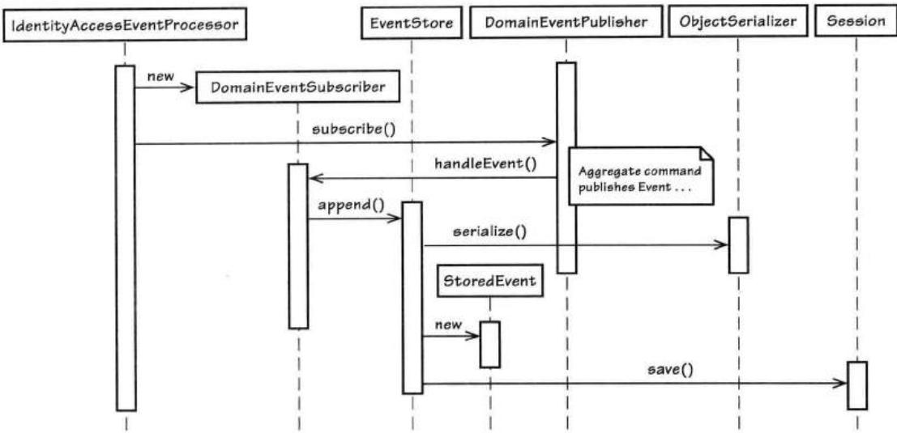


图8.3 IdentityAccessEventProcessor 通过匿名的方式订阅了模型中的所有事件。它将处理逻辑委派给 EventStore, EventStore 将把每一个事件序列化成 StoreEvent，然后保存。


以下是SaaSOvation团队在身份与访问上下文中的实现代码. 它保证了所有的领域事件都能得到保存。 


```java
@Aspect
public class IdentityAccessEventProcessor {
    ...
    @Before(
    "execution(* com.saasovation.identityaccess.application.*.*(..))")
    public void listen() {
    DomainEventPublisher
    .instance()
    .subscribe(new DomainEventSubscriber<DomainEvent>() {
    public void handleEvent(DomainEvent aDomainEvent) {
    store(aDomainEvent);
    }

    public Class<DomainEvent> subscribedToEventType() { 
```

```java
return DomainEvent.class; //所有领域事件
    }
    });
private void store(DomainEvent aDomainEvent) {
    EventStore.instance().append(aDomainEvent);
} 
```

以上是一个非常简单的事件处理器，在其他限界上下文中我们也可以采用相似的方法。该事件处理器使用了一个切面（Spring AOP）来拦截所有的应用层方法。当执行一个应用层方法时，消息处理器将对模型中所发布的所有事件进行监听。事件处理器向当前线程中的DomainEventPublisher实例注册了一个DomainEventSubscriber。通过subscribedToEventType()方法所返回的DomainEvent.class我们知道，该DomainEventSubscriber可以处理任何类型的领域事件。在执行handleEvent()方法时，该DomainEventSubscriber将委派给store()方法，store()方法进而委派给EventStore实例的append()方法。 

## 下面是EventStore的append()方法:

```java
package com.saasovation.identityaccess.application.eventStore;
...
public class EventStore ... {
    ...
    public void append(DomainEvent aDomainEvent) {
    String eventSerialization = EventStore.objectSerializer().serialize(aDomainEvent);
    StoredEvent storedEvent = new StoredEvent(
    aDomainEvent.getClass().getName(),
    aDomainEvent.occurredOn(),
    eventSerialization);
    this.session().save(storedEvent);
    this.setStoredEvent(storedEvent);
    }
} 
```

这里的store()方法将对DomainEvent实例进行序列化，然后将其用于创建新的StoredProcedure实例，最后将该StoredProcedure保存到事件存储中。以下是StoredProcedure类的部分代码： 

```java
package com.saasovation.identityaccess.application.eventStore;
...
public class StoredEvent {
    private String eventBody;
    private long eventId;
    private Date occurredOn;
    private String typeName;

    public StoredEvent(
    String aTypeName,
    Date anOccurredOn,
    String an EventBody) {
    this();
    this工作报告 (an EventBody);
    this OkurredOn (an OccurredOn);
    this.setTypeName(aTypeName);
    }
    ...
} 
```

每一个StoredProcedure实例都有一个唯一的序列号eventId，该序列号由数据库自动产生。StoredProcedure的eventBody包含了DomainEvent的序列化数据。在该例中，我们使用了[Gson]库将DomainEvent序列化成了JSON格式的数据，当然你也可以采用其他格式。StoredProcedure的typeName保存了领域事件的实际类名，而occurredOn则和DomainEvent中的occurredOn相同。 

所有的StoredEvent对象都将持久化到MySQL数据库中。此时，数据库应该为序列化后的事件数据保留足够的存储空间，这里我们使用了具有65,000字符宽度的varchar来保存序列化数据，这对于当前的事件实例来说已经足够了。 

```sql
CREATE TABLE `tbl_stored_event` (
    `event_id` int(11) NOT NULL auto_increment,
    `event_body` varchar(65000) NOT NULL,
    `occurred_on` datetime NOT NULL,
    `type_name` varchar(100) NOT NULL,
    PRIMARY KEY (`event_id`)
) ENGINE=InnoDB; 
```

以上, 我们在一个较高层次上向大家展示了用于事件存储的必要组件。在本章后面, 我们将讨论更多的细节。接下来, 让我们看看其他系统是如何使用这些存储事件的。 

## 转发存储事件的架构风格

一旦领域事件被保存在了事件存储中, 我们便可以对这些事件进行转发以通知其他系统。我们将讨论两种转发事件的架构风格。一种是基于REST资源的方式, 一种是基于消息中间件的方式。 

诚然，基于REST的方式并不是一种真正意义上的转发技术。但是，它可以达到和发布-订阅风格相同的效果，就比如，一个E-mail客户方可以作为一个“订阅方”，它所订阅的便是由E-mail服务器所“发布”的E-mail信件。 

## 以REST资源的方式发布事件通知

在那些具有基本发布-订阅功能的系统环境中，采用REST风格的事件通知是最合适的。在这些环境中，一个发布方发布的事件存在着多个消费方。另一方面，如果你试图通过消息队列的方式来使用REST事件通知，就会出问题了。以下是REST风格事件通知的优缺点： 

- 如果多个客户方都可以通过单个URI来请求相同的事件通知，那么此时REST便是合适的。一个事件通知可以拥有任意多的消费方。虽然REST使用的是“拉”的方式，而不是“推”的方式 $^{2}$ 。 

- 如果一个或多个消费方需要从多个发布方中获取资源以顺序地完成一系列任务，那么此时你便会感到REST所带来的痛苦了。这实际上描述了一个消息队列，许多发送方同时为一个或多个消费方服务，此时事件的接收顺序是重要的。对于实现消息队列来说，“拉”的方式并不是一个好的选择。 

与那些典型的消息设施相比，采用REST来发布事件通知是一种截然不同的风格。其中，“发布方”并不会持有注册的“订阅方”，因为REST不会对事件进行“推送”。相反，这种方式需要REST的客户方通过一个公认的URI来“拉取”事件通知。 

让我们再从一个高的层次来考虑REST。如果你理解Web领域中Atom的工作机制，那么你便能更好地理解基于REST的消息通知方式了，因为它们非常相似。事实上，REST消息通知即是建立在Atom概念之上的。 

客户方通过HTTP的GET方法来请求所谓的当前日志(Current Log)。这里的当前日志表示所发布事件通知的最新版本。客户方所接收到的当前日志包含了若干数量的事件通知，通知数量不能超过标准上限。在本书的例子中，我们将每个当前日志所包含的通知数量设成20。客户方将依次遍历当前日志中所有的事件通知，从中找出那些还没有被本地限界上下文所处理的事件通知。 

那么，客户方在本地如何处理事件通知呢？它将根据事件类型把序列化数据翻译成本地限界上下文中的模型。在这个过程中，可能还会涉及到获取本地上下文中的聚合实例，然后根据事件信息在本地聚合实例上执行命令操作。当然，客户方必须按照顺序对事件进行处理，因为越老的事件越早发生。否则，在本地模型中有可能出现bug。 

在我们的实现中，当前日志中最多包含19个事件通知。当当前日志中的事件达到20条之后，多余的将被自动地存档。如果在前一个日志存档之后不再有事件通知，那么新的当前日志将为空。 

## 存档日志到底是什么？

存档日志没有什么神秘的。它只是表明：一个存档日志不能再被其所在的系统修改。同时，这也告诉客户方：无论他们请求多少次存档日志，所获得的数据都是相同的。 

另一方面，对于当前日志来说，在事件通知的数量达到最大上限之前，都是可以修改的。当日志中的事件通知达到上限之后，当前日志将被存档。当然，修改当前日志的唯一方法便是向其中加入新的事件通知。 

在事件加入到日志中之后，该事件便不能再修改了，这主要是为了向客户方做出保证。 

因此，当前日志中可能不会包含最新的或最老的事件通知。老的事件通知有可能存在于先前的存档日志中。这主要和日志的填充频率和客户方的请求频率有关。图8.4向我们展示了一个通知日志链。 

在图8.4中, 假设通知1到通知58已经被消费方处理过了, 而通知59到通知65还未被处理过。当客户方通过URI发出请求时, 他将收到当前日志: 

//iam/notifications 

在客户方的数据库中, 保存了最近一次处理的通知号, 在本例中即为58。客户方应该知道需要处理的下一个通知号, 而不是服务器端。客户方将从上到下依次 遍历整个当前日志，以查找58号事件通知。它并没有找到该通知，于是再在先前的日志（即存档日志）中进行查找。先前日志通过超媒体链接的方式出现在当前日志中。使用超媒体链接的一种方式便是添加一个消息头： 

```txt
HTTP/1.1 200 OK
Content-Type: application/vnd.saasovation.idovation+json
...
Link: <http://iam/notifications/61,80>; rel=self
Link: <http://iam/notifications/41,60>; rel=previous
... 
```

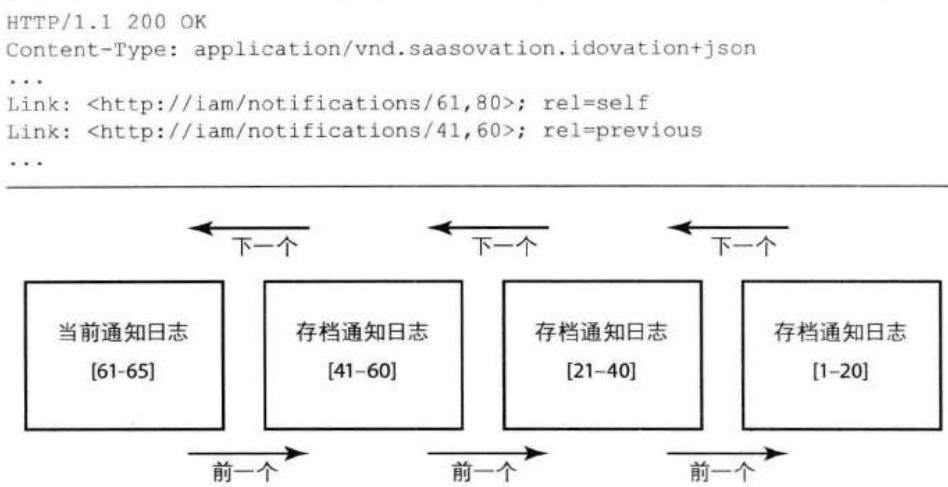


图8.4当前日志和存档日志组成了所有事件的一个虚拟数组，从最早的事件到最近的事件。这里的事件1-65都是过期事件。每一个存档日志所能包含的最大通知数为20，而当前日志中只包含了5个通知。 

## URI为什么没有反映出当前日志中实际包含的内容？

请注意, 就本例来说, 虽然当前日志中只包含了61-65号通知, 但是URI依然包含了整个事件通知范围, 即从61到80, 比如: 

```javascript
Link: <http://iam/notifications/61,80>; rel=self 
```

这是因为，REST资源必须在其整个生命周期中保持稳定性。这有助于资源访问的一致性，另外还有利于缓存的正常工作。 

对于包含了“rel=previous”的Link来说，该URI也用于HTTP的GET请求，它将获取当前日志的前一个存档日志： 

```txt
//iam/notifications/41,60 
```

通过该存档日志，客户方将找到与58号通知处于相同日志的事件通知（60、59、58）。由于客户方已经处理了58号通知，他将先找到并处理相同存档日志中的59号事件通知，然后是60号。此时，客户方已经处理完该存档日志中的所有事件通知。接下来，客户方将遍历“rel=next”资源，即当前日志： 

```txt
HTTP/1.1 200 OK
Content-Type: application/vnd.saasovation.idovation+json
...
Link: <http://iam/notifications/61,80>; rel=next
Link: <http://iam/notifications/41,60>; rel=self
Link: <http://iam/notifications/21,40>; rel=previous
... 
```

客户方将从当前日志中找到第61、62、63、64和65号事件通知，然后依次进行处理。到此，客户方已经处理完当前日志中的所有事件通知，这时它将停止事件处理，因为在当前日志中不会出现“rel=next”链接消息头。 

一段时间之后，客户方将重复该处理过程。此时如果再次请求当前日志，日志中有可能将出现一些新的事件通知。客户方可能需要向前查找，以找到最近一次处理过的事件通知，在本例中即为65。和以前一样，当客户方找到65号通知之后，它将按顺序处理比65号通知更新的事件通知。 

任何数量的客户限界上下文都可以请求通知日志。事实上，任何限界上下文都可能向发布事件的限界上下文发出请求，请求的内容甚至可以包括从最开始到现在所产生的所有事件通知。当然，客户方限界上下文需要足够的安全权限才能访问发布事件的限界上下文。 

但是, 这种 “拉” 的方式是否会使Web服务器处于超负荷状态呢? 如果REST资源采用了有效的缓存机制, 那么这便不是一个问题了。比如, 客户方可以对当前日志进行缓存, 缓存时长大约1分钟: 

```txt
HTTP/1.1 200 OK
Content-Type: application/vnd.saasovation.idovation+json
...
Cache-Control: max-age=60
... 
```

在缓存时长之内, 如果客户方再次发出请求, 那么客户方的缓存将直接返回先前已经获取到的当前日志。当缓存过期时, 客户方将再次从服务器端获取最新的当前日志。存档日志可以拥有更长的缓存时长, 因为它们不会改变, 比如: 

```txt
HTTP/1.1 200 OK
Content-Type: application/vnd.saasovation.idovation+json
...
Cache-Control: max-age=3600
... 
```

客户方可以将当前日志的max-age作为一个定时器使用，因为没有必要向缓存的资源发出GET请求。这种方式对于客户方和服务器端来说都是有益的。在缓存没有过期之前，服务器是不会收到来自客户方的请求的。因此，在适当采用缓存的情况下，客户方并不会对服务器的性能和可用性造成影响。这也显示出Web的好处——通过内建的缓存机制可以增强系统的性能和可伸缩性。 

当然，服务器也可以提供缓存。对于事件通知日志来说，服务器缓存可以工作得很好，因为存档日志不会改变。客户方对存档日志的请求不止是可以获取到资源，同时，如果其他客户方再对相同的资源发出请求，服务器将直接返回缓存中的资源。此时的缓存不需要刷新存档日志，因为存档日志是不变的。 

好啦！以上已经够详细了，在集成限界上下文中(13)你将学到更多的细节知识。对于基于REST的事件通知，我建议读者参考一下[Parastatidis et al., RiP]，其中包含了对基于Atom的通知日志的优缺点讨论，同时还有一些参考实现。此外，Jim Webber在他的演讲[Webber, REST & DDD]中提供了更详尽的讨论。Stefan Tilkov在InfoQ上发表的文章[Tilkov, RESTful Doubts]是较早讨论REST事件通知的资料之一。你也可以参考我的演讲[Vernon, RESTful DDD]。 

## 通过消息中间件发布事件通知

在采用REST发布事件通知时，我们需要自己处理很多细节，而在采用消息中间件时，比如RabbitMQ，我们便不用去处理这些细节了，消息中间件将为我们处理。此外，消息系统同时支持发布-订阅的事件通知方式和消息队列方式。在这两种方式中，消息系统都是通过“推送”的方式来发送事件通知消息的。 

考虑一下将事件存储中的事件通过消息中间件发布出去的情形。我们将采用发布-订阅的方式，RabbitMQ称为扇出交换器（Fanout Exchange）。我们需要一系列的组件依次完成以下操作： 

1. 对于某个扇出交换器来说，从事件存储中查找出所有还没有被发布的领域事件对象，再将这些对象按照唯一标识升序排列。 

2. 依次遍历这些领域事件对象，并将它们发送给扇出交换器。 

3. 当消息系统成功发布事件通知之后，在扇出交换器中对该领域事件进行跟踪。 

我们不会等待订阅方的接收确认信号。当消息系统通过扇出交换器发布消息时，订阅系统有可能处于停机状态。每一个订阅系统都需要自己负责处理所接收到 的消息，并保证其自身模型中的领域行为得到了正确的调用。对于消息系统来说，我们只是确保对消息的投递。 

## 白板时间

- 为两个需要集成的限界上下文绘制一份上下文映射图，请确保该映射图能够显示出两个上下文之间的连接关系。 

- 标注出这两个上下文之间的集成关系, 比如防腐层 (3)。 

- 看看你将如何集成这两个限界上下文。你会使用RPC、REST事件通知还是消息设施？ 

请记住，当与遗留系统集成时，我们的选择是非常少的。 

## 实现

在决定了发布事件的架构风格之后, SaaSOvation团队开始将重点转向实现上…… 

发布事件通知的核心行为位于应用服务NotificationService中。这样团队可以自己管理事务。此外，需要强调的是，事件通知是一个应用程序级别上的关注点，而不是领域的关注点，即便这些事件通知是源自于领域模型的也是如此。 


没有必要为NotificationService创建一个独立接口[Fowler, P of EAA]。此时，对事件通知的发布只有一个实现，因此SaaSOvation的团队成员们决定采用尽量简单的方式。另外，每一个简单的类都有一个公有的接口： 

```txt
@Transactional(readOnly=true)
public NotificationLog currentNotificationLog() {
    ...
}

@Transactional(readOnly=true)
public NotificationLog notificationLog(String aNotificationLogId) {
    ...
}

@Transactional
public void publishNotifications() {
    ...
}
...
} 
```

前两个方法用于查找NotificationLog实例，这些实例将以REST资源的方式提供给客户方。第三个方法将单个Notification实例通过消息机制发布出去。团队成员们首先将实现前两个查询方法，再实现第三个方法。 

## 发布NotificationLog

回想一下，存在两种类型的通知日志——当前日志和存档日志。因此，NotificationService为每种类型的日志都提供了查询方法： 

```java
public class NotificationService {
    @Transactional (readOnly=true)
    public NotificationLog currentNotificationLog() {
    EventStore eventStore = EventStore.instance();

    return this.findNotificationLog(
    this.calculateCurrentNotificationLogId(eventStore),
    eventStore);
    }

    @Transactional (readOnly=true)
    public NotificationLog notificationLog(String aNotificationLogId) {
    EventStore eventStore = EventStore.instance();

    return this.findNotificationLog(
    new NotificationLogId(aNotificationLogId),
    eventStore);
    }
} 
```

两个方法都返回一个NotificationLog对象，它们首先从事件存储中找到一系列的DomainEvent实例，再将每个实例包装成Notification，然后将不同的Notification组装到同一个NotificationLog中。当一个NotificationLog实例创建成功之后，它便可以通过REST资源的方式提供给客户方了。 

由于当前日志可能一直处于改变状态，在每次请求时都需要重新计算日志标识。计算代码如下： 

```java
public class NotificationService {
    ...
    protected NotificationLogId calculateCurrentNotificationLogId( EventStore anEventStore) {
    long count = anEventStore.countStoredEvents();

    long remainder = count % LOG_NOTIFICATION_COUNT;

    if (remainder == 0) {
    remainder = LOG_NOTIFICATION_COUNT;
    }

    long low = count - remainder + 1;

    // 虽然当前有可能不存在一整套的通知，但是日志的id应该是崭新的
    long high = low + LOG_NOTIFICATION_COUNT - 1;

    return new NotificationLogId(low, high);
    }
    ...
} 
```

另一方面，对于存档日志来说，我们只需要一个NotificationLogId用于表示通知的标识范围即可。回想一下，事件通知的标识是通过文本的方式来表示的，并且表示了一个范围，比如21-40。因此，NotificationLogId的构造函数可以通过以下方式实现： 

```java
public class NotificationLogId {
    ...
    public NotificationLogId(String aNotificationLogId) {
    super();
    }
} 
```

```txt
String[] textIds = aNotificationLogId.split(",");
this.setLow(Long.parseLong(textIds[0]));
this步步High(Long.parseLong(textIds[1]));
}
...
} 
```

无论是查询当前日志还是存档日志，我们现在都有了相应的NotificationLogId，该NotificationLogId将用于findNotificationLog()方法： 

```java
public class NotificationService {
    ...
    protected NotificationLog findNotificationLog(
    NotificationLogId aNotificationLogId,
    EventStore anEventStore) {

    List<StoredEvent> storedEvents = 
    anEventStore.allStoredEventsBetween(
    aNotificationLogId.low(),
    aNotificationLogId.high());

    long count = anEventStore.countStoredEvents();

    boolean archivedIndicator = aNotificationLogId.high() < count;

    NotificationLog notificationLog = 
    new NotificationLog(
    aNotificationLogId.encoded(),
    NotificationLogId.encoded(
    aNotificationLogId.next(
    LOG_NOTIFICATION_COUNT)),
    NotificationLogId.encoded(
    aNotificationLogId.previous(
    LOG_NOTIFICATION_COUNT)),
    this nitificationsFrom(storedEvents),
    archivedIndicator);

    return notificationLog;
    }

    ...
    protected List<Notification> notificationsFrom(
    List<StoredEvent> aStoredEvents) {
    List<Notification> notifications = 
    new ArrayList<Notification>(aStoredEvents.size());

    for (StoredEvent storedEvent : aStoredEvents) {
    DomainEvent domainEvent = 
    EventStore.toDomainEvent(storedEvent);

    Notification notification = 
```

```java
new Notification(
    domainEvent.getClass().getSimpleName(),
    storedEvent.eventId(),
    domainEvent.occurredOn(),
    domainEvent);

    notifications.add(notification);
    }

    return notifications;
    }
    ...
} 
```

有趣的是, 这里我们没有必要持久化Notification或者整个日志, 而是在每次需要的时候新建这些对象实例。这样带来的好处是显然的, 即我们可以在请求时对NotificationLog进行缓存, 从而有助于提高系统的性能和可伸缩性。 

上面的findNotificationLog()方法使用EventStore组件来查询StoredEvent实例，下面的代码展示了EventStore对StoredEvent的查找： 

```java
package com.saasovation.identityaccess.application.eventStore;
...
public class EventStore ... {
    ...
    public List<StoredEvent> allStoredEventsBetween(
    long aLowStoredEventId,
    long aHighStoredEventId) {

    Query query =
    this.session().createQuery(
    "from StoredEvent as _obj_ "
    + "where _obj_.eventId between ? and ? "
    + "order by _obj_.eventId");

    query.setParameter(0, aLowStoredEventId);
    query.setParameter(1, aHighStoredEventId);

    List<StoredEvent> storedEvents = query.list();

    return storedEvents;
    }
    ...
} 
```

最后，在Web层，我们发布当前日志和存档日志： 

```java
@Path("/notifications")
public class NotificationResource {

    ...
    @GET
    @Produces({ OvationsMediaType.NAME })
    public Response getCurrentNotificationLog(
    @Context UriInfo aUriInfo) {

    NotificationLog currentNotificationLog =
    this.notificationService()
    .currentNotificationLog();

    if (currentNotificationLog == null) {
    throw new WebApplicationException(
    Response.Status.NOT_FOUND);
    }

    Response response =
    this.currentNotificationLogResponse(
    currentNotificationLog,
    aUriInfo);

    return response;
}

@GET
@Path("{notificationId}")
@Produces({ OvationsMediaType.ID_OVATION_NAME })
public Response getNotificationLog(
    @PathVariable("notificationId") String aNotificationId,
    @Context UriInfo aUriInfo) {

    NotificationLog notificationLog =
    this.notificationService()
    .notificationLog(aNotificationId);

    if (notificationLog == null) {
    throw new WebApplicationException(
    Response.Status.NOT_FOUND);
    }

    Response response =
    this.notificationLogResponse(
    notificationLog,
    aUriInfo);

    return response;
} 
```

当然, 我们也可以使用MessageBodyWriter来生成返回结果, 但是这种方法会稍微复杂一些。 

以上我们便讨论了以REST资源的方式发布当前日志和存档日志。 

## 发布基于消息的事件通知

NotificationService提供一个单一的方法来通过消息设施发布DomainEvent: 

```java
public class NotificationService {
    ...
    @Transactional
    public void publishNotifications() {
    PublishedMessageTracker publishedMessageTracker = this.publishMessageTracker();

    List<Notification> notifications = this.listUnpublishedNotifications(
    publishedMessageTracker .mostRecentPublishedMessageId());

    MessageProducer messageProducer = this.messageProducer();

    try {
    for (Notification notification : notifications) {
    this.publish(notification, messageProducer);
    }

    this.trackMostRecentPublishedMessage(
    publishedMessageTracker,
    notifications);
    } finally {
    messageProducer.close();
    }
    }
} 
```

上面的publishNotification()方法首先获取到一个PublishedMessageTracker对象。该对象的作用是持久化已经被发布的事件： 

```java
package com.saasovation.identityaccess.application.notify;
public class PublishedMessageTracker {
    private long mostRecentPublishedMessageId;
    private long trackerId;
    private String type;
} 
```

请注意，PublishedMessageTracker并不属于领域模型，而是属于应用程序。该对象拥有一个唯一标识trackerId。属性type描述了事件所要发布到的话题/通道(topic/channel)。而mostRecentPublishedMessageId则表示了所发布DomainEvent的唯一标识，该DomainEvent将被序列化成StoredProcedure，然后再进行持久化。因此，它维护了最近发布的事件实例的eventId。在所有的Notification消息发送完毕之后，publishNotifications()方法将保存PublishedMessageTracker，其中含有最近发布事件的唯一标识。 

事件标识eventId和type属性使得我们可以在不同时间将同一个事件通知发布到任意数量的话题/通道中。我们只需要创建一个新的PublishedMessageTracker，其中的type属性表示了话题/通道的名称，然后从第一个StoredProcedure开始发布。以下是publishedMessageTracker()方法： 

```java
public class NotificationService {
    private static final String EXCHANGE_NAME =
    "saasovation.identity_access";
    ...
    private PublishedMessageTracker publishedMessageTracker() {
    Query query =
    this.session().createQuery(
    "from PublishedMessageTracker as _obj_ "
    + "where _obj_.type = ?");

    query.setParameter(0, EXCHANGE_NAME);

    PublishedMessageTracker publishedMessageTracker =
    (PublishedMessageTracker) query.uniqueResult();

    if (publishedMessageTracker == null) {
    publishedMessageTracker =
    new PublishedMessageTracker(EXCHANGE_NAME);
    }

    return publishedMessageTracker;
    }
    ...
} 
```

当前的实现并不支持多通道（Multichannel），但是通过简单的重构，我们便可以达到支持多通道的目的。 

接下来，listUnpublishedNotification()方法用于查询所有尚未被发布的Notification实例： 

```java
public class NotificationService {
    ...
    protected List<Notification> listUnpublishedNotifications(
    long aMostRecentPublishedMessageId) {
    EventStore eventStore = EventStore.instance();

    List<StoredEvent> storedEvents =
    eventStore.allStoredEventsSince(
    aMostRecentPublishedMessageId);

    List<Notification> notifications =
    this nitificationsFrom(storedEvents);

    return notifications;
    }
    ...
} 
```

在现实情况下, 该方法将返回那些eventId大于aMostRecentPublishedMessageId的StoredProcedure, 返回结果将用于创建一个新的Notification实例集合。 

现在, 我们回到主要的publishNotifications()方法。对于封装了DomainEvent的Notification实例集合来说, publishNotifications()方法将遍历该集合, 然后分别调用publish()方法来逐一发布Notification: 

```javascript
...
for (Notification notification : notifications) {
    this.publish(notification, messageProducer);
} 
```

该方法通过RabbitMQ来发布单个Notification实例, 但是它使用了一个简单的类库使其接口更加具有面向对象的特征: 

```java
public class NotificationService {
    ...
    protected void publish(
    Notification aNotification,
    MessageProducer aMessageProducer) {
    MessageParameters messageParameters =
    MessageParameters.durableTextParameters(
    aNotification.type(),
    Long.toString(aNotification.notificationId()),
    aNotification.occurredOn());
    )
} 
```

```txt
String notification =
NotificationService
.objectSerializer()
距離(aNotification);

aMessageProducer.send(notification, messageParameters);
...
} 
```

这里的publish()方法首先创建一个MessageParameters实例，然后将JSON格式的DomainEvent通过MessageProducer $^{3}$ 发送出去。MessageParameters包含了一些需要和消息体一起发送的参数值，其中包含了事件的type属性、消息ID和领域事件的时间戳occuredOn。这些参数使得订阅方可以在不解析JSON消息体的情况下获取到该事件通知的一些重要信息。这里的消息ID为消息消重提供了支持，对此我们将在本章后面进行讨论。 

再考虑以下用于消息发布的方法： 

```java
public class NotificationService {
    ...
    private MessageProducer messageProducer() {

    //当交换器不存在时，创建一个交换器
    Exchange exchange =
    Exchange.fanOutInstance(
    ConnectionSettings.instance(),
    EXCHANGE_NAME,
    true);

    //创建一个消息发布器以转发事件
    MessageProducer messageProducer =
    MessageProducer.instance(exchange);

    return messageProducer;
    }
    ...
} 
```

上面的messageProducer()被publishNotifications()方法所调用，它的作用在于确保扇出交换器是存在的，并且获取一个用于发布消息的MessageProducer实例。RabbitMQ支持扇出交换器的幂等性，即在第一次使用扇出交换器时，RabbitMQ将为我们创建一个新的扇出交换器，后续使用时我们将使用先前创建的那个扇出交换器。我们并不会保留处于打开状态的MessageProducer实例，而是在每次发布时重新创建一个连接，这样可以避免整体性的发布失败。当然，如果不断地重复连接造成了性能上的瓶颈，那么我们就得注意了。但是，就现在而言，我们可以依赖于两次发布操作之间的暂停时间来解决由不断连接所导致的问题。 

说到发布操作之间的暂停时间，在以上代码中我们并没有看到这是如何实现的。有几种不同的方式都可以实现这样的功能，比如，可以使用一个JMX的TimerMBean。 

在展示定时功能之前，有一点我们需要注意。Java的MBean标准也使用了“通知”一词，但是这和我们发布领域事件时所用到的“通知”是不同的。在Java的MBean中，在每次定时事件发生时，一个监听器都将得到通知。对于这两种不同的“通知”，读者要心中有数。 

在设定好定时器的时间间隔之后, 我们向MBeanServer注册一个NotificationListener: 

```java
mbeanServer.addNotificationListener(
    timer.getObjectName(),
    new NotificationListener() {
    public void handleNotification(
    Notification aTimerNotification,
    Object aHandback) {
    ApplicationServiceRegistry
    .notificationService()
    .publishNotifications();
    }
},
null,
null); 
```

在上例中, handleNotification()方法将调用NotificationService上的publishNotifications()方法。只要TimerMBean不断地触发,那么领域事件便会不断地通过扇出交换器发布出去。 

使用由应用服务器所管理的定时器还有额外的好处: 我们不用单独创建一个组件来监视事件发布的整个过程。比如, 如果 publishNotifications() 方法的某次 执行由于种种原因而失败，TimerMBean依然会继续运行，然后在定时间隔到达时重新触发publishNotifications()方法。系统管理员会照看那些由基础设施（比如RabbitMQ）导致的错误，一旦问题解除，消息将得以继续发送。除了以上提到的TimberMBean之外，还有其他的定时工具，比如[Quartz]。 

到现在为止, 我们依然没有处理消息消重的问题。什么是消息消重? 消息订阅方为什么需要支持消息消重? 

事件消重 在有些环境中, 消息系统可能多次向订阅方发送消息, 在这种情况下, 我们便需要对事件进行消重。有多种原因可能导致消息的重复发送。其中一种是: 

1. RabbitMQ将一条新建的消息发送到一个或多个订阅方。 

2. 订阅方处理该消息。 

3. 在订阅方发回确认信号之前，订阅方失败。 

4. RabbitMQ重新发送消息。 

另一可能便是: 当从事件存储中发送消息时, 消息系统并不与事件存储共享持久化机制, 而全局的XA事务又没有控制事件存储和消息系统之间的原子提交。本章前面的“通过消息中间件发布事件通知”一节便是这种情形。以下描述了重复发送消息的情形: 

1. NotificationService查找并发布3个先前未被发布的Notification实例，然后通过PublishedMessageTracker更新发送记录。 

2. RabbitMQ接收到所有3条消息，并准备将它们发送给订阅方。 

3. 但是，应用服务器出现故障，NotificationServcie出现问题，造成对PublishedMessageTracker的修改并未得到提交。 

4. RabbitMQ将消息发送给订阅方。 

5. 应用服务器的故障解除, 消息发布过程重新启动, NotificationService继续发送未发布的事件, 其中也包括那3条未被PublishedMessageTracker记录的事件。 

6. RabbitMQ将所接收到的事件发送给订阅方, 于是先前那3条消息便出现了重复。 

在以上场景中, 我随机性地使用了3个事件, 当然我们也可以使用1条、2条或者更多数量的消息。这里的重复消息的数量并不多, 重点是为了向大家展示对消息的重复投递是有可能发生的。当由于种种原因而导致消息重复时, 对消息的消重便是有必要的了, 对此, 请参考幂等接收器[Hohpe & Woolf]。 

## 幂等操作

幂等操作即进行多次重复操作和只进行一次操作所产生的结果相同。 

处理重复消息的一种方式便是将订阅方的处理过程变成幂等操作过程。订阅方对消息的处理对于其自己的领域模型来说应该是幂等的。设计幂等领域对象的问题在于：太困难、太不实用、甚至是不可能的。另外，如果我们试图将事件本身设计成幂等操作，这也会给我们带来很多麻烦。首先，消息的发送方必须完全了解所有消息接收方的业务场景，其次，如果接收方由于延迟、重试等原因而导致了错误的消息接收顺序，那么这也将带来问题。 

当领域对象无法满足幂等操作的要求时，我们可以转而将订阅方/接收方设计成幂等的。比如，消息接收方在接收到重复的消息时可以拒绝处理。首先，我们必须确认所使用的消息系统是否支持这样的功能。如果不是，接收方必须自己跟踪哪些消息已经被处理过了。一种方式便是在订阅方的持久化机制中保存消息的话题/交换器名称和一个唯一的消息ID——就像PublishedMessageTracker所采用的方式一样。然后，在处理消息之前，我们首先对已经处理的消息进行查询。如果发现所接收到的消息已经被处理过，那么订阅方可以简单地将其忽略掉。对消息的跟踪并不是领域模型的一部分，而只是一个技术上的解决方案。 

在使用常用的消息中间件产品时, 只保存最近处理的消息是不够的, 因为消息的到达可能是无序的。因此, 如果一个消重查询在检查那些ID小于最近一次所处理消息的ID的消息时, 它有可能忽略掉一部分消息。另外, 我们需要考虑的是, 有时我们可能会忽略掉那些已经处理过的并且过期的消息, 比如那些位于数据库垃圾回收过程中的消息。 

在使用基于REST的事件通知时，消重并不是一个多大的问题。接收方只需要保存最近处理的消息通知标识，因为此时的接收方只会处理那些发生在最近处理消息之后的消息。每一个通知日志中的消息顺序和通知标识顺序是相反的。 

在两种情况下——消息中间件订阅方和基于REST的消息客户方——我们都应该保证：对跟踪信息的修改和本地模型状态的修改必须一同提交。否则，对模型的修改和对跟踪信息的修改将无法达到一致。 

# OWN IT!

## 本章小结

在本章中, 我们学习了领域事件的定义, 以及何时应该采用领域事件。 

- 你学到了什么是领域事件, 什么时候并且为什么要使用领域事件。 

- 你学到了如何将领域事件建模成对象,何时应该为领域事件创建唯一标识。 

- 你学到了什么时候一个领域事件应该具有聚合特征，以及何时应该使用基于值对象的领域事件。 

- 你学到了在模型中如何使用轻量级的发布-订阅组件。 

- 你学到了哪些组件用于发布消息，哪些组件用于订阅消息。 

- 你学到了为什么需要一个事件存储，如何实现并使用事件存储。 

- 你学到了将领域事件发布到外部限界上下文的两种方式：基于REST的消息通知和消息中间件的方式。 

- 你学到了如何在订阅系统中对消息进行消重处理。 

接下来, 我们将转移学习方向, 我们将在下一章中学习如何将领域对象组织在模块中。 

## 第9章 模块

胜利的秘诀在于组织好民众。 

—Marcus Aurelius 

如果你正使用Java或者C#, 那么你应该对模块 (Module) 已经非常熟悉了。在Java中, 模块称为包; 在C#中, 模块称为命名空间。在Ruby中, 我们可以通过module关键字来达到创建命名空间的效果。将模块映射到特定编程语言中的术语是简单的。这里, 我不会花太多时间从技术上去解释模块的功能, 对此你可能早已经知道了。 

## 本章学习路线图

- 学习传统的模块和新的部署模块化之间的区别。 

- 学习通过通用语言(1)来命名模块的重要性。 

- 学习机械式模块是如何给建模带来阻碍的。 

- 学习SaaSOvation团队是如何设计模块的。 

- 学习模块在领域模型之外所扮演的角色，以及何时应该使用新的模块而不是新的限界上下文。 

## 通过模块完成设计

在DDD中, 模型中的模块表示了一个命名的容器, 用于存放领域中内聚在一起的类。将类放在不同模块中的目的在于达到松耦合性。由于DDD中的模块并不是一个通用的存储区域, 因此对其进行适当的命名是重要的。事实上, 模块名是通用语言的重要组成部分。 

模块应该包含一组具有高内聚性的概念集合，这样做的好处是可以在不同的模块之间实现松耦合。否则，我们应该修改模型以重新划分这些概念。……由于模块名是通用语言的一部分，模块名应该反映出它们在领域中的概念。[Evans, pp.110, 111] 

在设计模块时, 有几条简单的原则, 如表9.1所示。 


表9.1 设计模块的简单原则


<table><tr><td>原则</td><td>采用原则的原因?</td></tr><tr><td>模块应该和领域概念保持协调一致</td><td>通常,对于一个或一组内聚的聚合(10)来说,我们都相应地创建一个模块。</td></tr><tr><td>根据通用语言来命名模块</td><td>这也是DDD的一个基本目标。</td></tr><tr><td>不要机械式的根据通用的组件类型和模式来创建模块</td><td>如果我们将所有的聚合放在一个模块中,将所有的领域服务(7)放在一个模块中,又将所有的工厂(11)放在另一个模块中,那么我们是得不到什么好处的。这有悖于DDD设计原则,同时还会限制我们创建富含行为的领域模型。此时,我们的关注点不是在领域上,而是在当前的组件和模式上。</td></tr><tr><td>设计松耦合的模块</td><td>模块间的松耦合性与类间的松耦合性具有相同的好处。这样有利于我们维护和重构一些模块层面上的概念,比如OSGi和Jigsaw。</td></tr><tr><td>当同层模块(Peer Module)间出现耦合时,我们应该杜绝循环依赖(同层模块即位于相同层次的模块,或者在设计中具有相似权重的模块)</td><td>要使不同的模块完全独立是不可能的。但是,如果我们消除同层模块之间的双向依赖,我们便可以减少它们之间的耦合度(比如产品依赖于开发团队,但是开发团队却不依赖于产品)。</td></tr><tr><td>在父模块和子模块之间放松原则(父模块即位于较高层次的模块,子模块即位于较低层次的模块,比如parent.child)</td><td>要消除父模块和子模块之间的依赖的确是困难的。但是在有可能的情况下,我们依然应该避免它们之间的循环依赖,只有在无法避免时才引入循环依赖(比如,父模块中的对象创建一个子模块中的对象,而子模块对象又需要维护对父模块对象的引用)。</td></tr><tr><td>不要将模块设计成一个静态的概念,而是与模型中的对象一道进行建模</td><td>如果模型概念将随时间而改变,这往往意味着对应的模块也应该随之而变。当你发现概念名和模块名不再匹配时,你应该对模块进行重构。诚然,这是痛苦的,但是和那些糟糕的模块命名相比,这些痛苦是值得的。</td></tr></table>

我们应该将模块看作模型中的一等公民，在设计和命名上应该给予和实体(5)、值对象(6)、领域服务和领域事件(8)同等的重视程度。这意味着在有必要为模块重命名时，我们就应该为其重命名，并且按需地、及时地将领域概念添加到模块中。 

我想，没有人愿意看到自己厨房的抽屉里杂乱无章地放着各种刀叉、勺子、螺丝刀、插线板和榔头等。此时，估计你也不再想用里面的刀叉来用食了。另外，你也不想翻来覆去地在抽屉里去找螺丝刀了，因为你怕一不小心被刀子给割伤。 

相比之下，如果我们只在抽屉里整齐地存放刀叉、勺子等进餐用具，而将螺丝刀、榔头等工具分类存放在车库的不同抽屉里，你是不是会乐意得多？所有的东西都被很好地组织起来。有了这些组织良好的模块，我们不再需要从存放餐具的抽屉里去找杯具和茶碟之类的东西。我们完全可以预知，杯具和茶碟应该放在另一个属于它们自己的抽屉里。同时，那些锋利的刀具也另有专门的存放地点。 

另一方面，我们也不会机械式地对厨房物品进行分类，比如将一些坚硬的东西放在一个抽屉里，而将所有易碎的东西放在另一个抽屉里。我们才不会因为花瓶和茶杯都是易碎的而将它们放在一起呢。 

如果我们要对一个厨房进行建模，很自然地，我们希望创建一个名为placesettings的模块，其中包含Fork、Spoon和Knife等对象。另外，我们还可以将Serviette放入其中，表明该模块不只是存放金属器具的地方。另一方面，如果我们分别创建名为pronged、scooping和blunt的模块，那么这样的用处并不大。 

需要注意的是，软件的当前进展正迈向一个更高层次的模块化。这种趋势将那些松耦合的，但是具有逻辑内聚性的软件分成具有版本号的部署单元。在Java世界中，我们依然考虑的是JAR这种文件格式，但是我们希望将版本号也加入其中，比如OSGi捆绑包 (bundle) 或者Java 8 的Jigsaw模块。因此，众多的高层模块、它们的版本号和依赖关系都可以通过捆绑包/模块予以管理。这种模块/捆绑包和DDD中的模块稍有不同，但是它们之间是可以互补的。比如，根据DDD中的模块划分将领域模型中存在松耦合关系的各个部分封装到不同的捆绑包中是有好处的。毕竟，将你的软件封装成OSGi捆绑包或Jigsaw模块得益于DDD模块之间的松耦合性。 

## 牛仔的逻辑

LB: “你可能会问, 这家加气站为什么能将他们的休息室打扮得如此干净整洁。” 

AJ: “LB, 是因为如果这间休息室遭龙卷风袭击, 那么他们可以获得10,000美元的补偿。” 


在本章中, 我们主要讨论如何使用DDD模块。现在, 思考实体、值对象、领域服务和领域事件各自的目的, 这将有助于我们对模块的设计。 

## 模块的基本命名规范

在Java和C#中，模块都具有一种层级形式 $^{1}$ 。层级中不同层通过圆点分开。通常，模块名都以你自己的公司/组织名称开头，其中还包含因特网域名。在使用因特网域名时，通常以顶级域名开头，然后是你公司/组织的域名： 

```txt
com.saasovation // Java
SaaSOvation // C# 
```

唯一的顶级模块名可以避免与第三方模块的命名冲突。如果你对基本的命名规范存在疑问，可以参考Java包的命名标准 $^{2}$ 。 

很有可能的是, 你的公司已经规定好了顶级模块名的命名规范, 因此请保持命名规范的一致性。 

## 领域模型的命名规范

接下来的一层模块名定位了一个限界上下文。在模块名中加入限界上下文的名称是有好处的。 

以下是SaaSOvation团队对三个模块的命名： 

```txt
com.saasovation.identityaccess
com.saasovation.collaboration
com.saasovation.agilepm 
```


在此之前，他们考虑了以下的命名方式，但是和上面的命名方式相比，价值并不大。虽然他们使用了限界上下文的全称，但是这样却有可能带来没必要的噪音： 

```txt
com.saasovation.identityandaccess
com.saasovation.agileprojectmanagement 
```

1. Java的包和C#的命名空间是有区别的。如果你使用的是C#, 这里的命名规范依然适用, 但是你可能需要根据C#的语言特性做些修改。 

2. http://java.sun.com/docs/books/jls/second_edition/html/packages.doc.html#26639)。 

有趣的是, 他们并没有在模块名中使用商业产品名 (名牌)。品牌的名字有可能改变, 而有时产品名和限界上下文并没有多大的联系。因此, 限界上下文的名称更加重要, 因为这是团队成员们的讨论用语。使用限界上下文的名称作为模块名的目的在于反映通用语言。如果团队使用以下名称, 他们并达不到反映通用语言的目的: 

```txt
com.saasovation.idovation
com.saasovation.collabovation
com.saasovation.projectovation 
```

第一个模块名, com.saasovation.idovation, 几乎与其所在的限界上下文没有联系。第二个要稍好一点。第三个比第一个也好不到什么地方去, 但至少包含有 “project” 一词。无论如何, SaaSOvation的团队成员都认为, 这些名字都无法与它们各自对应的限界上下文很好地匹配起来。再者, 如果业务层决定更改产品的名字, 那么这些模块名也将变得过时。因此, 团队成员们决定采用第一种方法。 

接下来, 他们又向模块名中添加了另一层重要的名字, 该层用于定位领域中某个特定的模块。 

```txt
com.saasovation.identityaccess.domain
com.saasovation.collaboration.domain
com.saasovation.agilepm.domain 
```

这种命名规范与传统的分层架构(4)和六边形架构(4)是兼容的。当下,一个使用分层的系统通常会用到六边形架构和依赖注入的风格。在使用六边形架构时,应用程序包含了一个“内在”的部分,其中包含了领域模型。这和其他架构风格相似。 

以上的 “domain” 部分可能并不直接包含实际的接口/类，而是作为更低层模块的容器。以下是 “domain” 的下一层： 

```txt
com.saasovation.identityaccess.domain.model
com.saasovation.collaboration.domain.model
com.saasovation.agilepm.domain.model 
```

在该层中, 我们定义模型中的类。接口类和抽象类也位于其中。 

SaaSOvation团队喜欢在该模块中放入一些通用的接口, 比如那些用于发布事件的类, 还有实体和值对象的抽象基类: 

```txt
ConcurrencySafeEntity
DomainEvent
DomainEventPublisher
DomainEventSubscriber
DomainRegistry
Entity
IdentifiedDomainObject
IdentifiedValueObject 
```

如果你喜欢将领域服务放在domain.model之外, 那么你可以为其创建一个与model同层的模块: 

```txt
com.saasovation.identityaccess.domain.service
com.saasovation.collaboration.domain.service
com.saasovation.agilepm.domain.service 
```

当然，将领域服务放在该模块中并不是必需的。此时，我们可以将领域服务看成是位于模型之上的一个迷你层，或者是环绕模型的一层[Evans, p.108, “Granularity”]。但是，请注意，这种方式可能会导致贫血领域模型，请参考领域服务（7）。 

如果你不打算将模型和领域服务放在分离的包中, 那么你也可以将所有的模型模块直接放在domain下: 

```gitattributes
com.saasovation.identityaccess.domain.conceptname 
```

这种方式的确消除了多余的一层。但是，如果之后你又决定将一些领域服务放在domain.service子模块中，你该怎么办呢？那时，你可能会失望于先前没有创建domain.model这个子模块。 

然而，我们还需要考虑到另一个更重要的方面。请记住，我们并不是开发一个领域。领域（2）表示的是我们所工作的一个业务范围。事实上，我们开发的是一个领域中的模型。因此，在命名模型中的一个最终模块时，使用domain.model是最合适的。当然，这同样只是一个选择问题。 

## 敏捷项目管理上下文中的模块

SaaSOvation公司当前正工作于敏捷项目管理核心域(2)，让我们看看他们是如何设计模块的。 

SaaSOvation的ProjectOvation团队选用了3个顶层模块：tenant、team和project。以下是tenant模块： 

```txt
com.saasovation.agilepm.domain.model.tenant
<<value object>>TenantId 
```

该模块中包含了值对象TenantId，TenantId表示某个租户的唯一标识，该标识来自于身份与访问上下文。模型中的所有其他模块都依赖于tenant模块。我们需要将一个租户所对应的对象与另一个租户的对象分离开来。但是，这些模块之间的依赖是非循环依赖，即tenant模块并不依赖于其他模块。 

上面的team模块包含了聚合类以及一个用于管理产品团队的领域服务： 

```txt
com.saasovation.agilepm.domain.model.team
<<service>> MemberService
<<aggregate root>> ProductOwner
<<aggregate root>> Team
<<aggregate root>> TeamMember 
```

该模块中含有3个聚合类和一个领域服务接口。Team类维护了一个ProductOwner实例，同时还拥有一个TeamMember的集合。ProductOwner和TeamMember实例由MemberService所创建。所有这三个聚合根实体都引用了tenant模块中的TenantId： 

```java
package com.saasovation.agilepm.domain.model.team;
import com.saasovation.agilepm.domain.model.tenant.TenantId;
public class Team extends ConcurrencySafeEntity {
    private TenantId tenantId;
} 
```

这里的MemberService作为防腐层(3)的前端,它的作用在于从身份与访问上下文中同步TeamMember。同步过程采用静默方式,即不需要用户请求。当一个TeamMember在远程上下文中注册时,该MemberService将主动地调用同步方 法。该同步过程与远程系统能够保持最终一致性，只是其中有短暂的时延。同时，MemberService还用于更新TeamMember的细节信息，比如名字和E-mail地址等。 

敏捷项目管理上下文拥有一个名为product的父模块，它包含3个子模块： 

```txt
com.saasovation.agilepm.domain.model.product
<<aggregate root>> Product
...
com.saasovation.agilepm.domain.model.product.backlogitem
<<aggregate root>> BacklogItem
...
com.saasovation.agilepm.domain.model.product.release
<<aggregate root>> Release
...
com.saasovation.agilepm.domain.model.product.sprint
<<aggregate root>> Sprint
... 
```

这是Scrum的核心模型所在的地方, 其中有Product、BacklogItem、Release和Sprint。在聚合(10)中我们将学到为什么要将不同的概念建模成不同的聚合。 

SaaSOvation的团队成员们非常喜欢这种自然的模块命名方式，因为它与通用语言有很好的对应关系：“产品”、“产品待定项”、“产品发布”和“产品冲刺”。 

这里出现了4个聚合——他们为什么没有将这4个聚合直接放在product模块中呢？除了这4个聚合之外，还存在其他聚合，比如Product所包含的ProductBacklogItem实体、BacklogItem所包含的Task实体、Release所包含的ScheduledBacklogItem实体和Sprint所包含的CommittedBacklogItem实体。有些聚合还 


有可能发布领域事件。这些类总计起来将近60个，要将它们放在同一个模块中显然是不合适的。 

和ProductOwner、Team和TeamMember一样，Product、BacklogItem、Release和Sprint都引用了TenantId。此外，还存在额外的依赖。比如Product： 

```java
public class Product extends ConcurrencySafeEntity {
    private ProductId productId;
    private TeamId teamId;
    private TenantId tenantId;
    ...
} 
```

再看看BacklogItem: 

```java
package com.saasovation.agilepm.domain.model.product.backlogitem;
import com.saasovation.agilepm.domain.model.tenant.TenantId;
public class BacklogItem extends ConcurrencySafeEntity {
    private BacklogItemId backlogItemId;
    private ProductId producld;
    private TeamId teamId;
    private TenantId tenantId;
    ...
} 
```

对TenantId和TeamId的依赖是非循环依赖，它们都是单向的。但是，从BacklogItem对ProductId引用来看，我们似乎只是在backlogitem模块和product模块之间引入了单向依赖，而事实上它们却是双向依赖。每个Product都作为创建BacklogItem（还包括Release和Sprint）的工厂。因此，它们之间的依赖是双向的。这里的3个子模块都以product模块作为父模块，所以我们可以放松依赖原则。在这种情况下，我们应该优先考虑模块的组织结构，而不是松耦合性。再重申一遍，BacklogItem、Release和Sprint都自然地从属于Product，因此我们没有必要再次撕开聚合边界。 

然而，通过继承一个通用的标识类型，它们之间是可以实现松耦合的。此时，BacklogItem、Release和Sprint对Product的引用通过通用的Identity完成。 

```java
public class BacklogItem extends ConcurrencySafeEntity {
    private Identity backlogItemId;
    private Identity productId;
    private Identity teamId;
    private Identity tenantId;
} 
```

诚然，在使用以上方式时，SaaSOvation团队获得了更好的松耦合性。但是，这种做法也有可能给程序带来bug，比如我们将无法对不同的Identity进行区分。 

敏捷项目管理上下文还将进一步发展下去。SaaSOvation公司打算支持其他敏捷方法和工具。这将对当前的模型造成影响，至少会影响到对新模块的创建，当然，也有可能影响到对既有模块的修改。不管如何，SaaSOvation公司的团队都决定直面挑战，勇往直前。 

接下来，让我们看看系统的其他地方是如何使用模块的。 

## 其他层中的模块

在不考虑架构(4)的情况下,你总需要为架构中的非模型组件创建模块并为其命名。这里,我们讨论一个分层架构(4)中的模块命名规范,当然,这些规范也可以用于其他架构风格。 

在一个典型的分层架构中, 我们将系统分为以下不同的层: 用户界面层、应用层、领域层和基础设施层。根据每层中组件的不同, 它们中的模块也会不同。 

让我们首先看看用户界面层(14)和其中的REST资源。可能的情况是，REST资源通过XML、JSON和HTML等数据展现形式向GUI和系统客户端提供服务。对于GUI而言，REST资源是不会为其创建展现布局的，而只是创建一些数据标记格式（XML、HTML），另外就是创建一些序列化的数据格式（XML、JSON和协议缓存等）。在客户端，用于图形布局的数据可能通过另外的渠道获取。因此，在支持REST的用户界面层中，我们至少需要两个模块： 

com.saasovation.agilepm.resources
com.saasovation.agilepm.resources.view 

REST资源由resources包维护，而那些只与展现相关的数据由view（或者称为presentation）包中的组件提供。根据系统所需的REST资源数量，你可能需要在每个主模块中创建多个子模块。需要记住的是，一个资源提供类可以服务于多个URI，你可能有多个这样资源提供类，此时可以将它们全部放在主模块中。之后，如果新的需求需要进一步为它们划分子模块，修改起来也是简单的。 

应用层可能还有另外的模块，比如一种服务对应一个模块： 

```txt
...
com.saasovation.agilepm.application.tenant 
```

与组织REST资源的原则一样, 只有在需要的时候才为应用层划分子模块。比如, 在身份与访问上下文中只存在为数不多的应用服务, 于是SaaSOvation团队决定将它们置放与主模块中: 

com.saasovation.identityaccess.application 

当然，你可能会倾向于使用第一种更加模块化的设计，那也是可以的。当应用服务变多时，我们便需要仔细考虑了。 

## 先考虑模块, 再是限界上下文

对于何时应该对领域模型进行分离, 何时将领域模型建模成一个整体, 我们应该仔细地思考与对待。有时, 通用语言可以很好地帮助我们做出正确的选择。但是另外的时候, 其中的术语将变得非常含糊。在这种情况下, 我们并不清楚如何划分上下文边界。此时, 我们可以首先将它们放在一起, 使用模块来对模型进行划分, 而不是限界上下文。 

但是，这并不意味着我们就应该限制对限界上下文的创建。我们应该通过通用语言的需求来划分模型边界。你应该知道，限界上下文不是用来代替模块的。使用模块的目的在于组织那些内聚在一起的领域对象，对于那些内聚性不强或者没有内聚性的领域对象来说，我们应该将它们划分在不同的模块中。 


## 本章小结

在本章中, 我们学习了对领域模型的模块化, 为什么它是重要的, 以及如何创建模块。 

- 你学到了传统的模块和部署模块之间的不同。 

- 你学到了根据通用语言来命名模块的重要性。 

- 你学到了对模块的不当设计, 或者机械式的设计将给我们的建模带来负面影响。 

- 你学到了如何设计敏捷项目管理上下文中的模块。 

- 你学到了如何为模型之外的系统创建模块。 

- 最后你了解到了: 我们应该优先考虑使用模块而不是限界上下文, 除非通用语言为我们展示出了明确的边界。 

接下来, 我们将学习DDD中最不容易理解的工具——聚合。 

## 聚合

宇宙由一些永恒的物体聚合而成, 这些物体通过某种因果关系联系在一起, 这种关系独立于物体本身, 并且存在于客观的空间和时间中。 

—Jean Piaget 

将实体 (5) 和值对象 (6) 在一致性边界之内组成聚合 (Aggregate) 乍看起来是一件轻松的任务, 但在DDD众多的战术性指导中, 该模式却是最不容易理解的。 

## 本章学习路线图

- 以SaaSOvation为例，学习对聚合的不当建模所带来的负面影响。 

- 学习设计聚合的经验原则，并形成一套最佳实践。 

- 根据真实的业务规则，掌握如何在一致性边界中对真正的不变条件进行建模。 

- 学习一个聚合为什么应该通过标识 (identity) 去引用另一个聚合。 

- 了解在聚合边界之外使用最终一致性的重要性。 

- 学习聚合的实现技术，包括“告诉而非询问”（Tell Don't ask）原则和迪米特法则（Law of Demeter）。 

让我们首先来看看一些常见的问题。聚合只是将一些共享父类、密切关联的对象聚集成一个对象树吗？如果是这样，对于存在于这个树中的对象有没有一个实用的数目限制？既然一个聚合可以引用另一个聚合，我们是否可以深度地递归遍历下去，并且在此过程中修改对象呢？聚合的不变条件和一致性边界究竟是什么意思？最后一个问题的答案将在很大程度上影响我们对前面所有问题的解答。 

有很多途径都将导致我们建立不正确的聚合模型。一方面，我们可能为了对象组合上的方便而将聚合设计得很大。另一方面，我们设计的聚合又可能因为过于贫瘠而丧失了保护真正不变条件的目的。我们应该同时避免这两个极端，转而将注意力集中在业务规则上。 

# 在Scrum核心领域中使用聚合

在本章中，你将看到SaaSOvation团队是如何使用聚合的，特别是在ProjectOvation项目的敏捷项目管理上下文中。ProjectOvation遵从传统的Scrum项目管理模型，其中包括产品、产品负责人、团队、待定项、计划发布和冲刺等，这些术语组成了最初的通用语言(1)。这是一个部署在SaaS平台上的基于订阅的应用程序，每一个订阅方都是一个租户。租户是通用语言中的另一个术语。 

该公司召集了一群Scrum专家和开发者。然而，由于他们缺乏DDD经验，难免会犯一些错误。通过艰难的学习，他们学会了如何设计聚合。他们的经验也是值得我们学习的。 


该领域中的概念要比先前协作上下文的核心域(2)中的概念复杂得多；同时，对性能和可伸缩性的要求也更高。为了解决这样的问题，聚合便是一种很好的DDD战术工具。 

他们应该如何选择最佳的对象树呢？聚合模式讨论的是对象组合和信息隐藏，这是团队成员们已经知道的。此外，聚合模式还包含了一致性边界和事务，这是团队成员们所忽略了的地方。虽然他们采用的持久化机制可以帮助他们完成对数据的原子提交，但这却将是一个使他们打退堂鼓的致命错误。事情是这样发生的，他们根据通用语言达成了以下一致： 

- 产品拥有待定项，发布和冲刺。 

- 为新的待定项制定计划。 

- 为产品发布制定进度表。 

- 为产品冲刺制定进度表。 

- 一个计划好的待定项可以被安排在发布中。 

- 位于发布中的待定项可以提交到冲刺中。 

基于以上条款，团队成员们建立起了一个模型，并开始了他们的第一次设计尝试。 

## 第一次尝试: 腰肿的聚合

团队特别强调“一个产品拥有什么”，这在很大程度上影响了他们对聚合的设计。 

对于那些喜欢对象组合的团队成员来说, 他们强调应该将相关联的对象组成对象树, 并且将这些对象的生命周期放在一起来维护。因此, 他们设计出了以下一致性原则: 

- 如果一个待定项提交到了冲刺中, 那么我们不能将该待定项其从系统中移除。 

- 如果一个冲刺中含有待定项，那么我们不能将该冲刺从系统中移除。 

- 如果一个发布中含有待定项, 那么我们不能将该发布从系统中移除。 

- 如果一个待定项位于发布中，那么我们不能将该待定项从系统中移除。 

如此，Product首先被建模成了一个非常大的聚合。此时的Product作为一个根(root)对象而存在，它包含了所有的BacklogItem、Release和Sprint，而Product的接口设计避免了客户端对其所包含数据的意外删除。 

此时Product的实现代码如下, 对应的UML图请参考图10.1: 

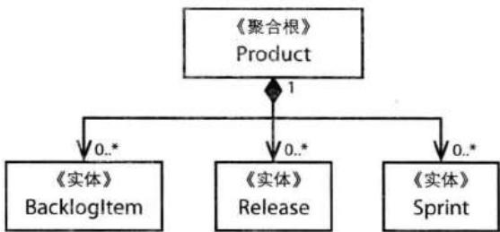


图10.1 Product被建模成了一个臃肿的聚合


```java
public class Product extends ConcurrencySafeEntity {
    private Set<BacklogItem> backlogItems;
    private String description;
    private String name;
    private ProductId productId;
    private Set<Release> releases;
    private Set<Sprint> sprints;
    private TenantId tenantId;
} 
```

这个巨大的聚合看似诱人，但是却不实用。当系统运行于多租户环境中时，时常会出现事务失败的情况。让我们再进一步看看客户端是如何与这个技术性模型交互的。在持久化时，我们使用了乐观并发（optimistic concurrency）的方式以避免多个客户端同时修改一个Product实例。在实体(5)中我们讲到，持久化对象携带有一个递增的版本号，该版本号随着每次对该对象的修改而增加。如果对象在数据库中的版本号大于在客户端中的版本号，服务器将拒绝客户端的请求。 

考虑以下一种常见的同时操作对象的情形： 

- 两个用户，Bill和Joe，都获取到了版本号为1的同一个Product，然后各自开始工作。 

- Bill创建并提交了一个新的BacklogItem，此时Product的版本号更新为2。 

- Joe创建了一个新的Release，当他试图保存Product时，提交失败，因为此时Joe手中Product的版本号依然是1。 

通常来说，持久化机制都是通过这种方式来处理并发的 $^{1}$ 。你可能会说，可以通过修改默认并发配置的方式来解决这个问题，此时，你得重新思考了。事实上，当我们并发地修改一个聚合时，这种方式对于保护聚合不变条件来说是非常重要的。 

从以上的例子可以看出, 即便在只有两个用户的情况下, 系统都是有可能出现一致性问题的。随着用户的增多, 这个问题也将越来越明显。在Scrum中, 多个用户同时修改一个聚合的情况是很常见的, 比如在召开冲刺计划会议的时候, 或者在一个冲刺执行的过程中。这种在一个时刻只能成功处理一个用户请求的情况是完全不能接受的。 

对新BacklogItem的创建绝不能影响对新Release的创建。Joe的提交为什么会失败？究其根源，是因为在设计这个庞大的Product聚合时，我们的思维被一些错误的不变条件所占据，而不是真正的业务规则。这些错误的不变条件只是开发者人工引入的约束而已。此外，除了事务问题，这种设计还会影响到系统的性能和可伸缩性。 

## 第二次尝试: 多个聚合

现在，让我们来看看另一种方法，如图10.2所示，该方法使用了4个分离的聚合类。它们之间通过ProductId关联起来，ProductId是Product的唯一标识。此时，Product作为其他3个聚合类的父聚合而存在。 

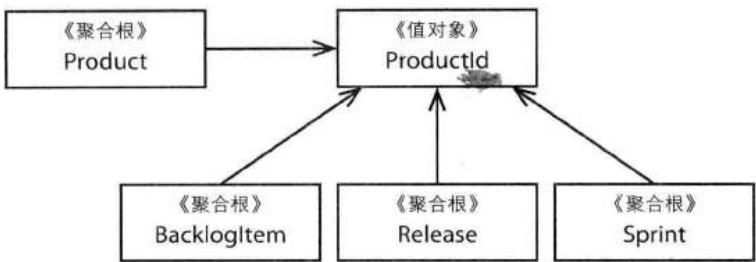


图10.2 Product和相关概念被建模成了不同的聚合类型


在将一个大的Product聚合拆分成4个相对较小的聚合时, Product类的方法签名也将发生改变。对于先前那个庞大的Product, 它的方法签名如下: 

```java
public class Product ... {
    ...
    public void planBacklogItem(
    String aSummary, String aCategory,
    BacklogItemType aType, StoryPoints aStoryPoints) {
    ...
    }
    ...
    public void scheduleRelease(
    String aName, String aDescription,
    Date aBegins, Date anEnds) {
    ...
    }

    public void scheduleSprint(
    String aName, String aGoals,
    Date aBegins, Date anEnds) {
    ...
    }
    ...
} 
```

以上所有的方法都是CQS命令方法[Fowler, CQS]; 即它们将修改Product的状态, 比如向集合中添加新元素, 因此这些方法的返回类型为void类型。在采用多个聚合时, Product的实现如下: 

```java
public class Product ... {
    ...
    public BacklogItem planBacklogItem(
    String aSummary, String aCategory,
    BacklogItemType aType, StoryPoints aStoryPoints) {
    ... 
```

```groovy
public Release scheduleRelease(
    String aName, String aDescription,
    Date aBegins, Date anEnds) {
    ...
}

public Sprint scheduleSprint(
    String aName, String aGoals,
    Date aBegins, Date anEnds) {
    ...
} 
```

此时, 这些方法变成了CQS查询方法; 并且扮演了工厂(11)的角色, 即每个方法都创建一个新的聚合实例然后予以返回。现在, 当客户端计划一个待定项时, 应用层(14)将变成: 

```java
public class ProductBacklogItemService ... {
    ...
    @Transactional
    public void planProductBacklogItem(
    String aTenantId, String aProductId,
    String aSummary, String aCategory,
    String aBacklogItemType, String aStoryPoints) {

    Product product = productRepository.productId(
    newTenantId(aTenantId),
    newProductId(aProductId));

    BacklogItem plannedBacklogItem = product.planBacklogItem(
    aSummary,
    aCategory,
    BacklogItemType.valueOf(aBacklogItemType),
    StoryPoints.valueOf(aStoryPoints));

    backlogItemRepository.add(plannedBacklogItem);
    }
    ...
} 
```

这样，通过将BacklogItem分开处理，我们解决了先前的事务问题。多个用户请求可以同时创建任何数量的BacklogItem、Release和Sprint实例。这是非常简单的。 

然而，对客户端来说，这4个较小的聚合却多少会带来一些不便。或许，我们可以对先前的大聚合进行优化，以消除由并发带来的问题。在Hibernate中，我们可以将optimistic-lock设置成false，这样便可以消除先前多米诺式的事务问题。既然对BacklogItem、Release和Sprint的实例数目没有限制，那么我们为什么不允许客户端顺其自然地向Product中添加这些实例呢？要维护一个庞大的聚合还存在哪些额外的成本？问题在于，随着时间的增长，这样的聚合将变得难以控制。在深入讨论之前，让我们先来看看SaaSOvation团队所需的最重要的建模原则。 

## 原则: 在一致性边界之内建模真正的不变条件

要从限界上下文(2)中发现聚合, 我们需要了解模型中真正的不变条件。只有这样, 我们才能决定什么样的对象可以放在一个聚合中。 

这里的不变条件表示一个业务规则，该规则应该总是保持一致的。存在多种类型的一致性，其中之一便是事务一致性，事务一致性要求立即性和原子性。同时，还存在最终一致性。在讨论不变条件时，我们讨论的是事务一致性。我们可能有以下不变条件： 

```txt
c = a + b 
```

当a等于2, b等于3时, c必定等于5。根据这条规则, 如果c不为5, 那么我们便违背了系统的不变条件。为了保持c的一致性, 我们应该在模型中为这些属性设计了一个边界: 

```txt
AggregateType1 {
    int a;
    int b;
    int c;
    operations ...
} 
```

在上例中，聚合边界之内的所有内容组成了一套不变的业务规则，任何操作都不能违背这些规则。边界之外的任何东西与该聚合都是不相关的。因此，聚合表达了与事务一致性边界相同的意思（在该例中，AggregateType1拥有3个int类型的属性，当然，任何聚合都可以拥有不同类型的属性）。 

对于一个典型的持久化机制来说, 我们通常使用单事务 $^{2}$ 来管理一致性。在提交事务时, 边界之内的所有内容都必须保持一致。对于一个设计良好的聚合来说, 无论由于何种业务需求而发生改变, 在单个事务中, 聚合中的所有不变条件都是一致的。而对于一个设计良好的限界上下文来说, 无论在哪种情况下, 它都能保证在一个事务中只修改一个聚合实例。此外, 在设计聚合时, 我们必须将事务分析也考虑在内。 

在一个事务中只修改一个聚合实例，这听起来可能过于严格。但是，这却是设计聚合的重要经验原则，也是我们为什么要使用聚合的原因。 

## 白板事件

- 在白板上列出你系统中所有的大聚合。 

- 在每个聚合名旁边记下笔记，包括该聚合之所以成为大聚合的原因、这将导致什么样的问题。 

- 另起一栏，列出那些在同一个事务中进行修改的聚合。 

- 在每个聚合名旁边记下笔记，看看不变条件是否影响了对聚合边界的设计。 

前面我们提到，在设计聚合时，我们需要慎重地考虑一致性，这意味着每次客户请求应该只在一个聚合实例上执行一个命令方法。如果客户所请求的业务过多，那么有可能出现一次请求修改多个聚合实例的情况。 

因此，在设计聚合时，我们主要关注的是聚合的一致性边界，而不是创建一个对象树。现实世界中的有些不变条件可能比这更加复杂。但是即便如此，通常情况下的不变条件所需要的建模代价并不大，所以，要设计出小的聚合是可能的。 

## 原则: 设计小聚合

现在，我们可以全面地回答前面的问题了：要维护一个庞大的聚合还存在哪些额外的成本？对于大聚合，即便我们可以保证事务的成功执行，它依然有可能限制系统的性能和可伸缩性。SaaSOvation公司的产品在上市之后，必将有大量的租户。随着每个租户对ProjectOvation的深入使用，SaaSOvation公司需要运行更多的敏捷项目，另外还需要管理更多的项目资产。这样导致的结果是，ProjectOvation系统中将存在大量的产品、待定项、发布和冲刺等。系统性能和可伸缩性虽然是非功能性需求，但是我们绝不应该予以忽视。 

考虑一下系统性能和可伸缩性，假定一个存在了1年多的敏捷项目，其中已经包含有数以千计的待定项，如果一个租户的某个用户只是需要将一个待定项添加到产品中，会发生什么情况？假设我们使用了延迟加载的持久化机制（比如Hibernate），我们几乎不用同时加载待定项、发布和冲刺。但是，为了添加一个待定项，我们依然需要先将所有的待定项集合元素加载到内存里，而这个数目是巨大的。对于那些不支持延迟加载的持久化机制来说，问题就更糟了。即便我们将内存使用考虑在内，有时我们仍然需要加载多个集合，比如将某个待定项加入到发布中，或者将某个待定项提交到冲刺中。此时，所有的待定项、发布或冲刺都需要加载进内存。 

为了清晰起见，请参考图10.3。请不要被图中的“0..*”所欺骗了，对象之间的关联数目几乎不可能为0，并且还会随着时间不断增加。为了完成一项基本的操作，我们可能需要将成百上千个对象一同加载进内存中，而这只是一个租户中的一个团队成员操作一个产品的情况。ProjectOvation将拥有成百上千的租户，每个租户都有多个团队和多个产品。随着时间的增加，这种情况将变得更糟。 

如果我们要设计小的聚合, 那么, 这里的 “小” 是什么意思呢? 最极端的情况是, 一个聚合只拥有全局标识和单个属性, 当然, 这并不是我们所推荐的做法 (除非这正是需求所在)。好的做法是, 使用根实体 (Root Entity) 来表示聚合, 其中只包含最小数量的属性或值类型属性 $^{3}$ 。这里的 “最小数量” 表示所需的最小属性集合, 不多也不少。 

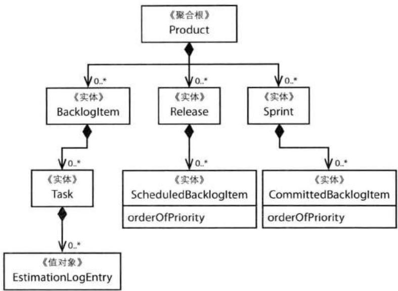


图10.3 对于这种Product模型来说, 许多基本的操作都需要加载多个对象集合


哪些属性是所需的呢？简单的答案是：那些必须与其他属性保持一致的属性——虽然这不是领域专家所指定的原则。比如，一个Product拥有name和description属性，这里的name和description是需要保持一致的，将它们放在两个不同的聚合中显然是没有意义的。当我们修改name的时候，很有可能也会同时修改description。如果你只修改了其中之一，你很有可能是在修改语法上的错误，或者使description能够更加匹配name。虽然领域专家并不会将此作为一个显式的业务规则，但是它却是一个隐式的规则。 

在聚合中, 如果你认为有些被包含的部分应该建模成一个实体, 此时你该怎么办呢? 首先, 思考一下, 这个部分是否会随着时间而改变, 或者该部分是否能被全部替换。如果可以全部替换, 那么请将其建模成值对象, 而非实体。有时, 建模成实体也是有必要的。但是很多情况下, 许多建模成实体的概念都可以重构成值对象。优先选用值对象并不意味着聚合就是不变的, 因为当值对象属性被替换成其他值时, 根实体也就随之改变了。 

将聚合的内部建模成值对象有很多好处的。根据你所选用的持久化机制，值对象可以随着根实体而序列化，而实体则需要单独的存储区域予以跟踪。此外，实体还会带来某些不必要的操作，比如，在使用Hibernate时，我们需要对多张表进行联合查询。对单张表进行读取要快得多，而使用值对象也更加方便与安全。再者，由于值对象是不变的，测试起来也相对简单，对此请参考值对象(6)。 

在一个使用Qi4j[Öberg]的金融项目中，Niclas Hedhman $^{4}$ 的团队将系统中70%的聚合都设计成了包含值类型属性的根实体。其余的30%也只包含2~3个实体。当然，这并不是说所有的领域模型都存在一个70/30的比例，而是说大量的聚合都可以建模成单个实体——根实体。 

在[Evans]中，Eric Evans讨论了一个聚合包含多个实体的情况。一个订单限制了其中所包含物品的最大数目。当多个用户同时添加物品时，情况就变得玄乎了。在单次添加物品时，系统不允许超过最大物品数，但是多个用户同时添加时，这些物品合起来却有可能超过最大物品数。这里，我并不会复述原书中的解决方法，而是强调在多数情况下，业务模型的不变条件要比那个例子简单得多。这种认识有助于我们设计小的聚合。 

小聚合不仅有性能和可伸缩性上的好处, 它还有助于事务的成功执行, 即它可以减少事务提交冲突。这样一来, 系统的可用性也得到了增强。在你的领域中, 迫使你设计大聚合的不变条件约束并不多。当你遇到这样的情况时, 可以考虑添加实体或者是集合, 但无论如何, 我们都应该将聚合设计得尽量小。 

## 不要相信每一个用例

在交付用例规范时，业务分析人员扮演着非常重要的角色。他们将大量的精力放在了那些大而细的规范上，而这将在很大程度上影响我们的设计。此时，我们应该知道，以这种方式产生的用例并没有表达出领域专家的意图。对于每一个用例，我们依然需要用当前模型来进行验证，其中便包括聚合。此时容易出现的一个问题是，某个用例需要修改多个聚合实例。在这种情况下，我们需要搞清楚的是，对用户需求的实现是否分散在多个事务中，还是单个事务？如果是后者，那么我需要注意了。无论写得多好，这样的用例都不能准确地反映出模型中真正的聚合。 

假设你的聚合边界与真实的业务约束是一致的，如果业务分析人员给了你如图10.4中的用例需求，问题也将随之而来。考虑不同的提交顺序，你会发现在有些情况下，3次请求中的2次都会失败 $^{5}$ 。对于你的设计来说，这能说明什么呢？这个问题的答案将引导你更深层次地去理解自己的领域。试图保持多个聚合实例间的一致性通常意味着我们缺少了某些聚合不变条件。为了满足新的业务规则，你可能会将多个聚合组合在一起而创建一个新的概念（当然，有可能只是将原有聚合中的某些部分提取出来，然后创建一个新的聚合）。 

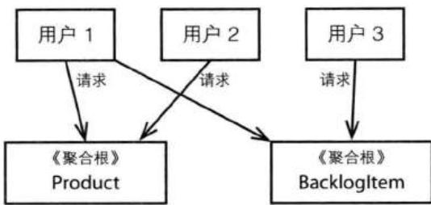


图10.4 当3个用户同时访问同一个聚合实例时, 有可能产生并发竞争, 从而导致大量的事务失败。


因此，新的用例可能引导我们重新对聚合进行建模，但是此时你依然需要谨慎行事。从多个聚合中创建一个新的聚合可能会引出一个全新的概念，该概念拥有全新的名字。但是，如果对这个新概念的建模导致了一个大的聚合，这样显然是不好的。那么，此时我们还可以采用什么方法呢？ 

一个用例可能要求在单个事务中维持聚合的一致性，但是，这并不意味着我们就必须这么做。通常来说，在这种情况下，业务目标都是可以通过聚合间的最终一致性来实现的。因此，我们需要带着批判性的态度来审查用例，并在必要的时候敢于挑战自己的假设。你的团队可能需要重新编写用例。新的用例需要包含最终一致性，并且应该包含可接受的更新延迟时间。对此，我们将在本章后面进行讨论。 

## 原则: 通过唯一标识引用其他聚合

在设计聚合时, 我们可能希望使用对象组合, 因为这样我们可以对聚合中的对象树进行深度遍历。但是, 这并不是使用聚合模式的动机。[Evans]写道, 一个聚合可以引用另一个聚合的根聚合。然而, 我们需要注意的是, 此时被引用的聚合不应该放在引用聚合的一致性边界之内。同时, 这种引用方式也并非创建了一个整体性的聚合。让我们看看图10.5中的例子。 

在Java中, 对象之间的关联可以通过以下方式实现: 

```java
public class BacklogItem extends ConcurrencySafeEntity {
    ...
    private Product product;
    ...
} 
```

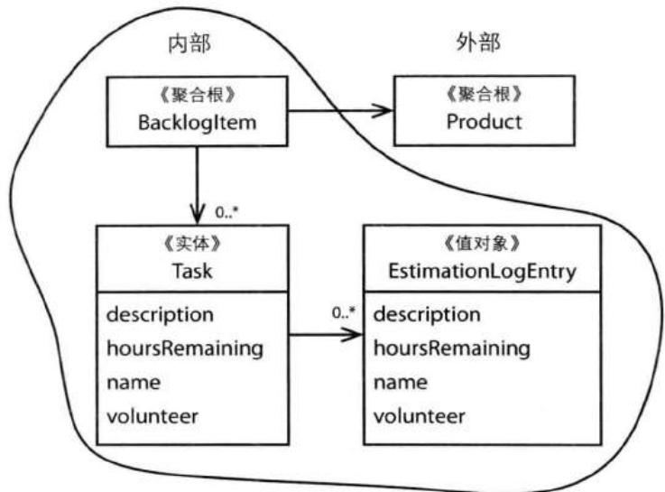


图10.5 这里有2个聚合, 而不是1个。


在上例中, 一个BacklogItem直接关联了一个Product。 

结合前文已经讨论的和接下来即将讨论的, 以上实现方式隐含着以下几点: 

1. 引用聚合 (BacklogItem) 和被引用聚合 (Product) 不可以在同一个事务中进行修改。 

2. 如果你试图在单个事务中修改多个聚合, 这往往意味着此时的一致性边界是错误的。发生这样的情况通常是因为我们遗漏了某些建模点, 或者尚未发现通用语言中的某个概念。 

3. 如果你试图采用第2点, 但却遇到了先前所讲的有关大聚合的种种麻烦, 那么此时你可能需要使用最终一致性 (请参考本章后续章节), 而不是原子一致性。 

在不持有对象引用的情况下, 我们是不能修改其他聚合的, 因此我们可以避免在同一个事务中修改多个聚合。但是, 这种方式的缺点在于限制性太强, 因为在领域模型中我们总需要对象之间的关联关系来完成一些任务。那么, 此时我们应该怎么办呢? 

## 通过标识引用使多个聚合协同工作

我们应该优先考虑通过全局唯一标识来引用外部聚合, 而不是通过直接的对象引用, 如图10.6所示。 

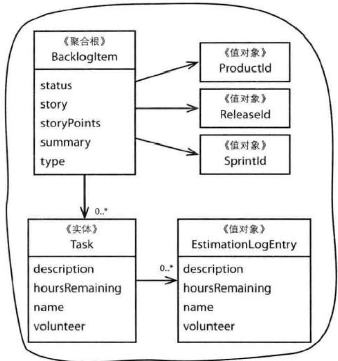


图10.6 通过唯一标识, BacklogItem聚合间接地引用边界之外的对象。


因此, 我们可以对BacklogItem做个重构: 

```java
public class BacklogItem extends ConcurrencySafeEntity {
    ...
    private ProductId productId;
    ...
} 
```

自然地，通过这种方式创建的聚合也会变得更小，因为此时所关联的聚合是不会即时加载的。模型的性能也将随之变好，因为它需要更少的加载时间和更小的内存。更小的内存使用量不止在内存分配上有好处，对于垃圾回收也是有好处的。 

## 建模对象导航性

通过标识引用并不意外着我们完全丧失了对象导航性。有些人习惯在聚合中使用资源库（12）来定位其他聚合。这种技术称为失联领域模型(Disconnected Domain Model)，而事实上这只是延迟加载的一种形式。此外，我们还推荐另一种方法：在调用聚合行为方法之前，使用资源库或领域服务(7)来获取所需要的对象。在客户端中，应用服务可以对此做出控制，然后分发给聚合： 

```java
public class ProductBacklogItemService ... {
    ...
    @Transactional
    public void assignTeamMemberToTask(
    String aTenantId,
    String aBacklogItemId,
    String aTaskId,
    String aTeamMemberId) {

    BacklogItem backlogItem =
    backlogItemRepository.backlogItemId(
    new TenantId(aTenantId),
    new BacklogItemId(aBacklogItemId));

    Team ofTeam =
    teamRepository.teamById(
    backlogItem.tenantId(),
    backlogItem.teamId());

    backlogItem.assignTeamMemberToTask(
    new TeamMemberId(aTeamMemberId),
    ofTeam,
    new TaskId(aTaskId));
    }
    ...
} 
```

通过应用服务来处理依赖关系可以避免在聚合中使用资源库或领域服务。然而，如果要处理特定于领域的复杂依赖关系，在聚合的命令方法中使用领域服务却是最好的方法。这里再次重申一遍，不管使用哪种方式在一个聚合中引用另外的聚合，我们都不能在同一个事务中修改多个聚合实例。 

## 牛仔的逻辑

LB: “当我在夜里行路时, 我有两个参考点。当我闻到鲜牛肉的味道时, 我知道我正朝着屠宰场走去; 当我闻到烤牛肉的味道时, 我便知道我回家了。” 


在模型中只使用唯一标识来引用对象的缺点在于: 在客户端的用户界面 (14) 层, 要组装多个聚合并予以显示将变得非常困难, 我们不得不使用多个资源库。此时, 如果对聚合的查询导致了性能问题, 那么我们可以考虑theta联合查询或者CQRS。比如, Hibernate就支持theta联合查询。而如果CQRS和theta联合查询都不能满足我们的需求, 那么就需要在标识引用和直接引用之间折中考虑了。 

如果以上所有的建议有损模型的使用方便性, 那么我们可以转而考虑它们的其他好处——小聚合可以增强模型的性能和可伸缩性, 另外它还有助于创建分布式系统。 

## 可伸缩性和分布式

当在一个聚合中引用其他聚合时，由于我们使用了标识引用而不是直接引用，此时我们便可以大规模地对聚合进行持久化。正如Amazon的Pat Helland在他的论文“Life beyond Distributed Transactions: An Apostate's Opinion”[Helland]中所说，通过持续地对聚合数据存储进行再分配，我们几乎可以得到无限的伸缩性。Helland将我们这里的聚合称为实体，但是它所描述的依然是聚合的概念，只是使用了不同的名字：一个拥有事务一致性的组合单元。有些NoSQL的持久化机制本身便支持Helland所提出的分布式存储。在使用分布式存储时，甚至在通过相似的方式使用SQL数据库时，通过标识来引用聚合扮演着重要的角色。 

当然，这里的分布式不只是关于存储的。在一个核心域中，通常存在多个限界上下文，使用标识引用使得我们可以将分布式的领域模型关联起来。在使用事件驱动架构时，基于消息的领域事件(8)包含了聚合标识，这样的领域事件将在整个企业范围之内传播。外部限界上下文中的消息订阅方将使用聚合标识在他们自己的领域模型中展开操作。标识引用形成了一种远程关联或者合作者(partner)关系。分布式操作通过双方活动(two-party activiy)进行管理[Helland]，但是在发布-订阅 [Buschmann et al.]或者观察者模式[Gamma et al.]中，却是多方 (multi-party) 的。分布式系统中的事务并不是原子性的，各个系统中的聚合通过事件达到一致性。 

## 原则: 在边界之外使用最终一致性

在[Evans]对聚合模式的定义中, 有一条经常被忽略。如果单次用户请求需要修改多个聚合实例, 而此时我们又需要保证模型的一致性时, 这一条便非常重要了: 

任何跨聚合的业务规则都不能总是保持处于最新状态。通过事件处理、批处理或者其他更新机制，我们可以在一定时间之内处理好他方依赖。[Evans, p.128] 

因此，当在一个聚合上执行命令方法时，如果还需要在其他的聚合上执行额外的业务规则，那么请使用最终一致性。在一个大规模、高吞吐量的企业系统中，要使所有的聚合实例完全一致是不可能的。认识到这一点，你便知道在较小规模的系统中使用最终一致性也是有必要的。 

问问你的领域专家，对于修改不同聚合实例之间的时间延迟，他们是否能够容忍。有时，领域专家甚至比开发者更能接受这种延迟。因为他们能意识到，在他们的业务中，延迟是客观存在的，而开发人员则总是期待着原子性操作。领域专家通常能回忆起在那个没有计算机的时代，他们的业务操作是什么样子。那时，总是存在各种各样的延迟，而一致性绝非立即之事。因此，领域专家通常是愿意接受那些有理由的延迟的——数秒钟、数分钟、数小时甚至数天的时间都是可以的。 

在DDD中, 有一种很实用的方法可以支持最终一致性, 即一个聚合的命令方法所发布的领域事件及时地发送给异步的订阅方: 

```java
public class BacklogItem extends ConcurrencySafeEntity {
    ...
    public void commitTo(Sprint aSprint) {
    ...
    DomainEventPublisher
    .instance()
    .publish(new BacklogItemCommitted(
    this.tenantId(),
    this.backlogItemId(),
    this.sprintId());
    }
    ...
} 
```

在接收到事件之后, 每个订阅方都会获取自己的聚合实例, 然后在该聚合上完成相应的操作。每个订阅方都在单独的事务中进行操作, 也即满足了“在一次事务中只修改一个聚合实例”的原则。 

如果一个订阅方与其他客户端发生了并发竞争而使修改失败怎么办？此时，订阅方并不会向消息机制发回成功确认信号，所以消息会重发，然后开始一个新的事务重新触发更新操作。这个过程将持续进行直到一致性得到满足或者达到重试上限为止 $^{6}$ 。如果更新彻底失败，此时我们可以做个妥协，或者发出失败报告。 

在上面的例子中，当BacklogItemCommitted领域事件发出之后，订阅方会做出什么反应呢？回忆一下，BacklogItem已经维护了一个Sprint的唯一标识，要在它们之间维护双向关联并无多大意义。在接收到事件之后，订阅方会创建一个CommittedBacklogItem，然后传给Sprint。由于每个CommittedBacklogItem都拥有一个ordering属性，此时Sprint便可以为每个BacklogItem排序，该顺序与Product和Release中的BacklogItem顺序是不同的，另外，这里的顺序和BacklogItem的BusinessPriority是没有关系的。因此，Product和Release所维护的关联是相似的，即它们分别维护了ProductBacklogItem和ScheduledBacklogItem。 

## 白板时间

- 回到你先前所列的大聚合列表。 

- 想想如何拆分这些大聚合。在拆分后的小聚合中，圈出那些真正的不变条件，并做好笔记。 

- 描述一下, 你将如何保证这些小聚合之间的最终一致性。 

上面的例子向我们展示了如何在单个限界上下文中使用最终一致性，这种方式同样可以应用到那些分布式系统中。 

## 谁的任务？

在有些场景下, 我们很难决定是否应该使用事务一致性还是最终一致性。那些使用传统DDD手法的人可能更倾向于事务一致性, 而那些使用CQRS的人则更 倾向于采用最终一致性。但是哪种方法才是正确的呢？坦白地说，以上两种倾向都没有给出一个特定于领域的答案，而只是技术上的偏好而已。那么，是否有更好的方式来帮助我们选择呢？ 

## 牛仔的逻辑

LB: “我儿子告诉我说他在互联网上学到了如何使奶牛更加高产，我告诉他说那是公牛的任务。” 


在与Eric Evans讨论了之后，我得到了一个简单而实用的指导原则。对于一个用例，问问是否应该由执行该用例的用户来保证数据的一致性。如果是，请使用事务一致性，当然此时依然需要遵循其他聚合原则。如果需要其他用户或者系统来保证数据一致性，请使用最终一致性。以上原则不仅有助于我们做出决定，还能帮助我们更深入地了解自己的领域。它向我们展示了真正的系统不变条件：那些必须使用事务一致性的不变条件。通过领域来理解问题比纯粹的技术学习更有价值。 

对于聚合来说，以上原则是非常重要的。当然，由于我们还需要考虑其他因素，这个原则并不见得总是我们的最终选择。但无论如何，该原则通常能帮助我们更深层次地去了解自己的模型。在本章后面，当SaaSOvation的团队成员重新审视他们的聚合边界时，他们便使用了这个原则。 

## 打破原则的理由

对于有经验的DDD开发者来说, 有时他们可能会选择在单个事务中更新多个聚合实例。但是, 这么做的前提是: 他们有充足的理由。那么, 会有什么样的理由呢? 

## 理由之一: 方便用户界面

有些时候，出于方便考虑，用户界面可能允许用户一次性地给多个对象定义共有的属性，然后再对它们进行批量处理。比如，在Scrum中，团队成员可能会一次性地创建多个待定项。在用户界面中，他们可以先填入那些公有的待定项属性，然后再分别填入各个待定项的特有属性。所有的待定项将一次性地进行处理： 

```java
public class ProductBacklogItemService ... {
    ...
    @Transactional
    public void planBatchOfProductBacklogItems(
    String aTenantId, String productId,
    BacklogItemDescription[] aDescriptions) {

    Product product =
    productRepository.productId(
    newTenantId(aTenantId),
    newProductIdARDS);
    for (BacklogItemDescription desc : aDescriptions) {
    BacklogItem plannedBacklogItem =
    product.planBacklogItem(
    desc.summary(),
    desc.category(),
    BacklogItemType.valueOf(
    desc.backlogItemType(),
    StoryPoints.valueOf(
    desc.storyPoints()));
    backlogItemRepository.add(plannedBacklogItem);
    }
    }
    ...
} 
```

这会违背聚合的不变条件吗？在此例中，答案是否定的，因为重复创建单个待定项和批量创建多个待定项并无什么区别。我们所创建的实例都是整体性的聚合实例，它们会自行管理自己的不变条件。因此，在这种情况下，我们是有理由打破原则的。 

## 理由之二: 缺乏技术机制

最终一致性需要使用诸如消息、定时器或者后台线程之类的技术。如果你的项目并未采用这些技术，你应该怎么办呢？有人可能认为这非常奇怪，但是我的确遇到过这样的问题。在没有消息机制、没有定时器、没有后台线程的情况下，我们能做什么呢？ 

一不小心，我们就可能陷入设计大聚合的陷阱中。虽然这种方式满足了单一事务原则，但是，就像先前所讨论的，它将在很大程度上降低系统的性能和可伸缩性。为了避免这样的情况，我们可能会大规模地修改系统中的聚合，这样，我们便是在修改模型来解决问题。我们知道，项目规范不是轻易就能修改的，所以此时留 给我们的空间并不大。虽然这并不是DDD的做法，但是它的确是有可能发生的。此时，我们是没有理由修改模型的。在这种情况下，我们可以考虑在单个事务中修改多个聚合实例。但是，我们不应该急切地做出这样的决定，而是应该慎重行事。 

## 牛仔的逻辑

AJ: “如果你认为规则是用来打破的, 那么请找一个好的修理师。” 


再考虑一下另一个可以打破原则的因素: 用户-聚合亲和度 (user-aggregate affinity)。思考是否存在这么一种业务流: 在某个时间, 对于一组聚合实例, 只有一个用户在处理它们。保证用户-聚合亲和度使我们更有理由在单个事务中修改多个聚合实例, 因为这样不会违背聚合的不变条件, 同时还可以避免事务冲突。即便在这种情况下, 并发冲突也是有可能发生的。然而, 要从并发冲突中恢复也是很直接的。因此, 有时在单个事务中修改多个聚合是能够正常工作的。 

## 理由之三: 全局事务

此外, 我们还需要考虑遗留技术和企业政策所带来的影响。在这种情况下, 我们通常需要使用全局的两阶段提交事务。但是, 至少从短期看来, 我们是不可能消除全局事务的。 

即便我们必须使用全局事务，这也并不意味着我们必须在本地限界上下文中一次性地修改多个聚合实例。如果可以避免全局事务，我们至少可以在自己的模型中消除事务竞争，从而满足聚合原则。全局事务的负面影响在于，我们的系统很难有好的伸缩性。 

## 理由之四: 查询性能

有时，最好的方式还是在一个聚合中维护对其他聚合的直接引用，这有利于提高资源库的查询性能。当然，此时我们需要多方位权衡。在本章后面的一个例子中，我们便采用了直接引用对象这种方式。 

## 遵循原则

有很多因素都需要我们做出妥协，比如用户界面上的考虑、技术限制、生硬的企业政策等。当然，我们不应该去找各种借口来打破聚合原则。从长远看来，遵循聚合原则对整个项目是有益的。我们将尽可能地保证一致性，并且致力于创建高性能的、高可伸缩性的系统。 

## 通过发现, 深入理解

接下来，你将看到聚合原则是如何影响SaaSOvation团队设计他们的Scrum模型的。你将看到产品团队如何重新思考他们的设计。这些有助于他们深入理解自己的模型。 

## 重新思考设计

在对大的Product聚合进行拆分之后，BacklogItem也变成了聚合，如图10.7所示。SaaSOvation团队在BacklogItem中维护了一个Task的集合。每一个BacklogItem都有一个全局的唯一标识BacklogItemId。BacklogItem对其他聚合的引用都是通过标识引用完成的，包括Product、Release和Sprint。此时的BacklogItem已经足够小了。 

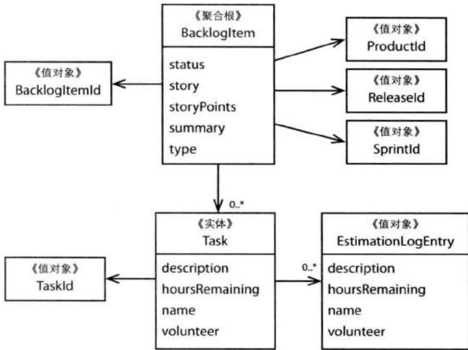


图10.7 BacklogItem聚合全貌。


现在, 他们都知道了应该设计小的聚合, 问题就在于, 他们是否会把事情做得过度? 

在上一个迭代中，团队成员们从大聚合Product中拆出了较小的BacklogItem聚合，他们感觉非常不错。但是，还有一些问题他们应该考虑，比如文本类型的story属性。在敏捷项目中，一个用户故事的描述通常不会太长。但是，有一个编辑器组件却允许用户输入很长的描述，此时的story属性可能包含成百上千个字节。因此，我们有必要考虑一下这种情况。 


这种情况同时也出现在图10.1和图10.3所示的Product中，现在，团队正致力于缩小限界上下文中的每个聚合。关键的问题来了：在BacklogItem和Task之间是否存在真正的不变条件？或者我们应该将它们拆分开来，然后形成各自的聚合？保持原有设计的成本何在？ 

做出决定的关键在于正确地使用通用语言。以下是团队成员提出的不变条件： 

- 当BacklogItem中的Task有进展时，团队成员需要估计该Task的剩余时间。 

- 当某个团队成员估计某个Task的剩余时间为零时, BacklogItem将检查所有的Task, 如果所有的Task的剩余时间都为零, 那么该BacklogItem的状态将被标记为完成。 

- 当某个团队成员估计出某个Task的剩余时间不为零，而此时BacklogItem已经被标记为完成状态，那么该BacklogItem的状态将被自动调回。 

这看起来的确是一个不变条件，BacklogItem的状态将自动调整，并且完全依赖于所包含Task的所有剩余时间。如果我们需要在BacklogItem和所有Task的总剩余时间之间保持一致，那么图10.7所表示的聚合一致性边界则是正确的。然而，我们依然需要考虑这种设计所带来的性能和可伸缩性影响。此时，我们可以将其与另一种情况进行比较：在BacklogItem与所有Task的总剩余时间之间维持最终一致性。 

有人可能认为, 这是使用最终一致性的一个典型场景。但是, 我们还不能轻易地得出这样的结论。让我们先看看在使用事务一致性时的情况如何, 然后再讨论最终一致性。最后, 得出自己的结论。 

## 估算聚合成本

在图10.7中，每一个Task都拥有一个EstimationLogEntry实例的集合。一个EstimationLogEntry记录了团队成员对Task剩余时间的一次估计。在实际使用中，一个BacklogItem将拥有多少个Task，而一个Task又将拥有多少个EstimationLogEntry呢？对于此，我们很难给出确切的答案，因为这取决于Task的复杂程度和一个Sprint的持续时间。但是，我们依然可以通过back-of-the-envelope (BOTE) 这种粗略的方法予以估算[Bentley]。 

一个Task的剩余时间通常会在团队成员完成一天的工作之后进行重新估算。让我们假设，多数的Sprint都会持续2～3周的时间。当然，有些Sprint可能会持续很长时间，但是通常来说2～3周已经足够了。因此，让我们将一个Sprint的持续时间设为10～15天。在不需要特别精确的情况下，我们可以将Sprint的持续时间设为12天，因为实际上持续2周的Sprint比持续3周的Sprint更多。 

接下来, 让我们考虑一下分配给每个Task的小时数。我们必须将任务分为一些可管理的单元。通常情况下, 我们给每个Task分配的小时数在4 ~ 16小时之间。经常地, 如果一个Task的剩余时间超过了12小时, 那么Scrum专家便会建议对该Task做进一步拆分。但是, 这里我们将Task的剩余时间设成了12小时, 这样有助于对Task时间的均等分配, 比如对于一个持续12天的Sprint, 我们可以每天给每个Task分配1小时的工作时间。 

到这里，我们还是没有解决这个问题：一个BacklogItem可以包含多少个Task？要回答这个问题也是困难的。我们假设，系统中的每一个层(4)或者六边形端口适配器(4)都需要2~3个Task。比如，用户界面层(14)需要3个Task；应用层(14)需要2个Task；领域层需要3个Task；基础设施层(14)也需要3个Task。这样一来，我们便有11个Task了。这个数目可能正好，或者还是有点少，但是我们已经对各种Task进行了估算。让我们给每一个BacklogItem分配12个Task。此时，又由于我们为每个Task预估了12个EstimationLogEntry，那么一个BacklogItem将总共包含144个集合元素。虽然这可能多于常规，但是它至少给我们提供了一个默认的预估值。 

我们还需要考虑另一个不变条件。如果Scrum专家建议采用较小的Task，那么以上估算就得随之改变了。将Task的数目上调成24，而将每个Task所包含的EstimationLogEntry数目下调成6，此时我们所得到的依然是144个对象。然而，这种方法将导致的问题是：在所有的估算请求中，我们需要加载更多的Task，从而会消耗更多的内存。团队可以尝试不同的分配组合，然后观察每种组合对性能的影响。但是，作为开始，他们将维持先前的分配方式。 

## 常见用例场景

现在, 是考虑常见的用例场景的时候了。要一次性地加载所有的144个对象, 这样的用户请求频率会有多高? 这种情况会发生吗? 看来似乎没有发生的可能, 但是我们需要核实。如果不会发生这样的情况, 那么我们依然需要知道加载对象数目的平均期望值。另外, 是否存在因为多个用户同时访问而产生并发竞争的情况? 

在以下场景中, 我们使用了Hibernate作为持久化机制。此外, 每一种实体类型都维护了用于乐观并发的版本号。这是可行的, 因为对状态的更新是通过根实体BacklogItem来管理的。当状态自动更改时, 根实体的版本号也将随之更新。因此, 对某个Task的修改不会影响到其他的Task, 并且不会影响到根实体, 除非对Task的修改将导致根实体状态的变化 (在使用基于文档的存储时, 由于每次集合的更改都会导致对根实体的修改, 因此, 对于下面的分析, 我们需要回过头来重新考虑)。 

在刚创建一个BacklogItem时，它并不包含任何Task。通常来说，直到召开冲刺计划会议时，Scrum团队才会开始创建Task，然后将Task添加到相应的BacklogItem中。此时，他们没有必要争着添加Task，比如两个成员比赛，看谁能以更快的速度添加Task。如果真是这样，结果将导致并发冲突，两个请求当中只有一个能够成功（与先前的同时向Product中添加内容是一个道理）。然而，这两个成员立即便会意识到，这种方式反而降低了效率。 

如果的确存在多个用户同时添加Task的情况，那么我们的分析将大作修改。此时，我们应该考虑将BacklogItem和Task分成两个不同的聚合。另一方面，这也正是将Hibernate的optimistic-lock设置成false的时候。允许同时添加多个Task对于有些场景来说是有意义的，特别是当这样做并不会带来性能和可伸缩性问题的时候。 

如果Task的预估算剩余时间为零, 我们依然不会遇到并发竞争的情况, 但是这将导致EstimationLogEntry的BOTE数目变成13。同时添加多个Task并不会修改BacklogItem的状态。只有当总共剩余时间从非零变成零时, 或者从零变成非零时, BacklogItem的状态才会改变——这是两个不常见的事件。 

每天都对剩余时间进行估算会造出问题吗? 在一个Sprint的第一天, 其中所包含的EstimationLogEntry数通常为零。该天结束时, 每个团队成员都会将相应Task的剩余时间减1。这将向Task中添加一个新的EstimationLogEntry, 但是此时BacklogItem的状态并没有改变。对于某个Task来说, 是不会出现并发竞争的, 因为只有一个成员修改该Task的剩余时间数。只有在第12天时, 我们才会修改BacklogItem的状态。另外, 其他Task也不会造成BacklogItem状态的改变。只有在最后一次估算时, 即第144次估算, 才有可能导致BacklogItem状态的变化。 

通过以上分析, 团队成员们意识到了很重要的一点。即便他们修改用例场景, 将任务完成时间缩短一半 (6天), 他们依然无法改变任何东西。不管怎么样, 只有在最后一次估算时, 根实体的状态才会发生改变。这看来是一种安全的设计, 虽然此时的内存消耗依然是一个问题。 

## 内存消耗

现在，让我们来讨论一下内存消耗。有一点非常重要：每次估算都是按天进行的，并且采用了值对象来保存。如果一个团队成员在一天中进行了反复的估算，那么只有最后一次估算得以保留。后一次估算的值对象将替换掉同一天中的前一次估算。此时，还没有跟踪错误估算的需求，基本的假设是：某个Task所包含的EstimationLogEntry数目不应该超过Sprint所持续的天数。当然，如果Task在先于冲刺计划会议之前（比如提前1天或好几天）就创建好了，那么此时的假设也应该随之更改，另外，我们还需要重新估算在先前那些天中，一个Task所消耗的小时数。每多1天，EstimationLogEntry也应该随之增加。 

在每次重新估算时，所有Task和EstimationLogEntry的内存使用情况如何呢？对于一次请求，当采用延迟加载时，我们至多会一次性地向内存中加载12+12个集合对象。这是因为，在访问Task集合时，所有的12个Task实例都将加载到内存中；而要向某个Task添加EstimationLogEntry，我们则需要加载整个EstimationLogEntry集合，即另外的12个对象。最终，我们需要加载一个BacklogItem、12个Task和12个EstimationLogEntry，即最多25个对象。这样的内存消耗量并不大，此时的BacklogItem也是一个小聚合。另一方面，加载所有25个对象的情况也只会发生在冲刺的最后一天。在冲刺的执行过程中，BacklogItem会更小。 

延迟加载会造成性能上的影响吗? 可能会, 因为此时我们事实上需要两次延迟加载, 一次是加载Task, 另一次则是加载EstimationLogEntry。对此, 团队成员需要进行性能测试。 

还有另外一点：为了帮助团队做出正确的计划，Scrum允许团队进行计划试验。[Sutherland]提到，有经验的团队可以通过用户故事点数(story point)而不是Task时间来估算速度。在他们定义Task时，他们可以为每个Task只分配1小时的时间。在冲刺执行过程中，对于每个Task，他们只会重新估算一次，即当Task完成时将时间由1小时改成零。使用用户故事点数可以减少一个Task中的EstimationLogEntry数目，并且可以优化对内存的消耗。 

之后，ProjectOvation的开发者们将使用真实的产品数据来分析一个BacklogItem所包含的Task数和EstimationLogEntry的数目。 

对于测试BOTE估算来说, 先前的分析已经足够了。然而, 在没有明确结果的情况下, 他们认为依然存在很多不可预测的因素, 这些因素足以使他们采用另外的设计。 


## 探索另外的设计

有没有更好的设计比前面的用例场景能更好地处理聚合边界呢？ 

团队成员希望找到一种方式将Task设计成单独的聚合，他们的方案如图10.8所示。这样做的好处在于，他们将12个EstimationLogEntry从BacklogItem中彻底分离出来，对于延迟加载来说，这也是有好处的。事实上，这使得他们在加载EstimationLogEntry时可以采用即时加载的方式。 

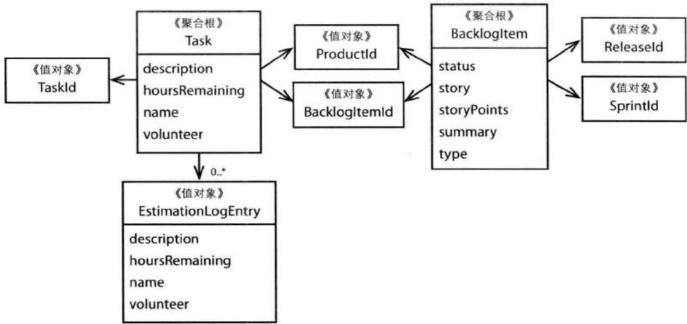


图10.8 Backloglem和Task被设计成单独的聚合。


开发者们达成了一致：不要在同一个事务中同时修改Task和BacklogItem。他们需要决定的是：是否可以在一个可接受的时间范围之内对BacklogItem的状态进行更新。这样做的结果是：他们可能会弱化不变条件的一致性，因为此时的一致性不再通过事务来达到。这是可以接受的吗？他们与领域专家进行了讨论，得知这种情况是可以接受的。 

## 实现最终一致性

这样看来，他们便有理由在不同的聚合之间使用最终一致性了。 

当执行Task的estimateHoursRemaining()命令方法时, 它将发布相应的事件。在这之前, 该方法已经具备这样的功能了, 但是他们这里需要考虑的是使用事件来达到最终一致性。该事件具有以下属性: 

```java
public class TaskHoursRemainingEstimated implements DomainEvent {
    private Date occurredOn;
    private TenantId tenantId;
    private BacklogItemId backlogItemId;
    private TaskId taskId;
    private int hoursRemaining;
} 
```

一个特定的订阅方将对该事件进行监听, 当事件到达时, 它会委派给领域服务来协调对一致性的处理。该领域服务将: 

- 通过BacklogItemRepository获取指定的BacklogItem。 

- 通过TaskRepository获取BacklogItem所关联的所有Task实例。 

- 执行BacklogItem的estimateTaskHoursRemaining()命令方法，传入的参数包含有领域事件中的hoursRemaining和所有获取到的Task实例。根据传入的参数，BacklogItem可能会自动更新自身的状态。 

团队应该找到一种方法来优化以上过程。在每次重新估算剩余时间的时候，上面的3个步骤需要将所有的Task实例加载进内存。在使用BOTE估算时，144次估算中的143次都是没有必要的。当然，优化起来也是比较简单的。与其使用资源库来获取所有的Task实例，他们可以简单地使资源库直接返回所有Task的剩余时间： 

```java
public class HibernateTaskRepository implements TaskRepository {
    ...
    public int totalBacklogItemTaskHoursRemaining(
    TenantId aTenantId,
    BacklogItemId aBacklogItemId) {

    Query query = session.createQuery(
    "select sum(task.hoursRemaining) from Task task "
    + "where task.tenantId = ? and "
    + "task.backlogItemId = ?");
    ...
    }
} 
```

最终一致性可能会在一定程度上使用户界面变得复杂。在事件延迟的几百个毫秒期间，用户界面如何显示新的状态呢？它们应该在用户界面层中加入业务逻辑以决定当前的状态吗？这样做将导致智能UI这种反模式。或许它们可以显示老的状态，然后让用户自行处理显示上的不一致性。但是，这很有可能被看成是一个bug，或者至少是很烦人的。 

在显示状态时, 它们可以通过 “拉取” 的方式使用 Ajax, 但是这却是非常低效的。由于显示组件并不确切地知道何时应该检查状态更新, 多数 Ajax 请求都是没有必要的。在使用 BOTE 估算时, 144 次重新估算中的 143 次都不会导致 BacklogItem 状态的变化, 因此, 这些请求对于 Web 层来说是多余的。更好的方式是采用 Comet (即 Ajax 推送)。虽然这是一个不错的挑战, 但是对于团队成员来说, 这却是一项全新的技术。 

另一方面，最好的方式可能也是最简单的方式。它们可以在界面上直接告诉用户：此时的状态是不正确的。用户界面将定期检查状态并刷新。这样一来，改变之后的状态可能会在下一次界面刷新时予以显示。这是安全的。当然，团队成员还需要进行用户验收测试，但是这种方式看起来是很有希望的。 

## 这是Scrum团队成员的任务吗?

到这里, 我们还忽略了一个很重要的问题: 应该由谁来负责维护BacklogItem与所有Task剩余时间之间的一致性? 当Scrum的团队成员将最后一个Task的剩余 时间设置为零后, BacklogItem将变成完成状态。问题在于, 他们会关心这些吗? 他们知道自己所工作的Task就是最后一个Task吗? 可能吧, 也许每个团队成员都应该承担这样的职责。 

另一方面，如果一个项目还存在其他利益相关方，又该怎么办呢？比如，产品负责人有可能需要检查一个BacklogItem的状态，也或者有人想率先使用部署在持续集成服务器上的系统功能。对于由程序自动完成的状态转换，如果其他人表示满意，那么他们可以手动地将状态设成完成。这显然改变了游戏规则，因为，此时不管是事务一致性还是最终一致性都是没有必要的。一个Task可能会从其所属的BacklogItem中分离出来，因为这是新的用例所允许的。然而，如果真的应该由Scrum团队成员来发起对BacklogItem状态的改变，这就意味着Task应该包含在BacklogItem之内以允许事务一致性。有趣的是，对于这个问题，也没有明确的答案。这或许意味着，我们应该将该功能以一个可选择的偏好设置提供给客户。将Task包含在BacklogItem之内可以解决一致性问题，同时，这种方式能够同时支持对BacklogItem状态的自动更新和手动更新。 

这次练习是很有意义的，它揭示出了领域中另一个崭新的方面。看来，SaaSOvation的团队应该为系统添加一个工作流偏好设置。他们不会立即实现这个功能，但是他们会在之后的讨论中提出来。通过询问“谁的责任？”这个问题，SaaSOvation的团队成员们进一步理解了他们的领域。 


后来，其中一个开发者提出了一个非常实用的建议，该建议可以作为另一种分析问题的途径。如果他们特别关心由story属性所带来的负面影响，那么他们为什么不对此做些什么呢？他们可以减少story属性的存储空间，然后再引入一个useCaseDefiniton属性。此外，还可以采用延迟加载的方式，因为多数时间story属性是不会被用到的。也或者，他们甚至可以为story属性创建一个单独的聚合，在需要的时候才进行加载。此时便是打破原则的好时候啦，即不再通过对象标识来引用外部聚合，而是直接维护对象引用，然后在ORM中将其设置成延迟加载。 

## 决定的时候到了

这种层面的分析不能够一直持续下去，总会到做决定的时候。现在我们决定走这条路，并不意味这之后我们就不能走其他的路。此时，开放的思想限制了实用性。 

基于以上所有分析，团队并不打算将Task从BacklogItem中分离出来。他们还不清楚这样的分离是否会带来风险，比如不变条件将得不到保护，或者用户无法看到实时的状态等。当前的聚合已经相当小了。即便在最坏的情况下，也只有50个对象加载进内存，而这所消耗的内存并不算大。因此，他们决定暂时保留先前的做法。这是有很多好处的，首先风险并不大，因为目前的实现方案已经工作得很好；另外，如果之后他们决定将Task从BacklogItem中分离出来，它依然可以工作。 

将来，在有必要的情况下，他们依然会考虑对BacklogItem和Task的拆分。在对当前的设计方案进行了性能测试、负载测试和用户验收测试之后，他们应该知道什么样的方案是更好的。在产品环境中，BOTE估算可能是错误的，因为产品环境中的聚合实例很有可能比想象中的多。在这种情况下，对BacklogItem和Task的拆分便是毫无疑问的了。 

如果你是ProjectOvation团队的一员, 你会选择哪种设计方案? 不要回避像先前案例研究中那样的发现讨论会议, 这样的会议通常只会持续30分钟, 最坏的情况也不过60分钟。但是, 如果你想在更深层次上了解自己的领域, 那么这些时间是值得的。 

## 实现

这里, 我们主要强调那些有助于增强实现健壮性的因素。但是, 我们还应该全面地在实体 (5)、值对象 (6)、领域服务 (8)、模块 (9)、工厂 (11) 和资源库 (12) 中对聚合的实现进行探讨。 

## 创建具有唯一标识的根实体

将实体建模成聚合根 (Aggregat Root)。在前面的例子中, Product、BacklogItem、Release和Sprint都可以作为根实体。如果我们将Task从BacklogItem中分离, 那么Task也是一个根实体。 

对Product实体的优化最终导致了以下根实体： 

```java
public class Product extends ConcurrencySafeEntity {
    private Set<ProductBacklogItem> backlogItems;
    private String description;
    private String name;
    private ProductDiscussion productDiscussion;
    private ProductId productId;
    private TenantId tenantId;
} 
```

这里的ConcurrencySafeEntity是一个层超类型[Fowler, P of EAA], 它用于管理委派标识和乐观并发的版本号, 请参考实体 (5)。 

先前，我们并没有讨论到ProductBacklogItem。这里，Product维护了一个ProductBacklogItem的集合。这是故意而为之的。但是，ProductBacklogItem和前面所讨论的BacklogItem是不同的。ProductBacklogItem集合的作用在于维护一个有序的待定项集合。 

每个聚合根必须拥有一个全局的唯一标识。Product的唯一标识以值对象ProductId表示。ProductId是和领域相关的标识，它和ConcurrencySafeEntity中的委派标识是不一样的。关于领域模型的唯一标识，请参考实体（5）。ProductRepository的实现中包含了nextIdentity()方法来生成以UUID所表示的ProductId： 

```java
public class HibernateProductRepository implements ProductRepository {
    ...
    public ProductId nextIdentity() {
    return new ProductId(java.util.UUID.randomUUID()
    .toString().toUpperCase());
    }
    ...
} 
```

使用nextIdentity()方法，客户端中的应用服务便可以创建一个具有全局唯一标识的Product实例： 

```java
public class ProductService ... {
    ...
    @Transactional
    public String newProduct(
    String aTenantId, aProductName, aProductDescription) {
    Product product =
    new Product(
    new TenantId(aTenantId),
    this.productRepository.nextIdentity(),
    "My Product",
    "This is the description of my product.",
    new ProductDiscussion(
    new DiscussionDescriptor(
    DiscussionDescriptor.UNDEFINED_ID),
    DiscussionAvailability.NOT_REQUESTED));
    this.productRepository.add(product);
    return product.productId().id();
    }
    ...
} 
```

在上例中, 应用服务使用了ProductRepository来同时生成实体标识和持久化Product实例。其中的newProduct()方法返回一个用String类型表示的ProductId。 

## 优先使用值对象

我们应该尽量地将根实体所包含的其他聚合建模成值对象，而不是实体。在不至于对模型或基础设施造成明显影响的情况下，采用值对象全部替换的方式是最好的选择。 

当前的Product包含了2个简单属性和3个值对象属性。其中的description和name都是String类型，它们是可以被全部替换的。另外，productId和tenantId值对象被建模成了稳定的标识，即在Product创建之后，它们将不再改变。它们支持标识引用，而不是直接对象引用。事实上，Product所引用的Tenant甚至都不在相同的限界上下文中，因此只能使用标识引用。Product中的productDiscussion是一个具有最终一致性的值对象属性。在Product创建之初，用户可能会要求创建产品Discussion，但是只有在一段时间之后，该Discussion才会存在。另外，产品Discussion必须在协作上下文中进行创建，在创建完成之后，本地上下文将在Product中为productDiscussion设置标识和状态。 

我们将ProductBacklogItem建模成了一个实体，而非值对象。这是有原因的。正如在值对象(6)中所讨论的，由于我们采用了Hibernate来访问数据库，对于值对象集合来说，Hibernate必须为其中的元素创建数据库实体。对集合元素的重新排序将删除或替换大量的ProductBacklogItem实例，这将对基础设施造成严重影响。作为实体，ProductBacklogItem允许对ordering属性的任意修改，只要这是产品负责人所需的。然而，如果我们打算从Hibernate转向MySQL的键值对存储，我们可以轻易地将ProductBacklogItem变成值对象。在使用键值对或文档存储时，聚合实例通常都被序列化成一个值展现予以存储。 

## 使用迪米特法则和“告诉而非询问”原则

在实现聚合时, 我们可以采用迪米特法则 (Law of Demeter) [Appleton, LoD] 和告诉而非询问原则 (Tell, Don't Ask) [PragProg, TDA], 它们都强调信息隐藏。让我们仔细了解一下这两个高层次的指导原则: 

- 迪米特法则：强调了“最小知识”原则。考虑一个客户端对象需要调用系统中其他对象的行为方法的场景，此时我们可以将后者称为服务对象。在客户端对象使用服务对象时，它应该尽量少地知道服务对象的内部结构。客户端对象不应该知道任何关于服务对象属性的信息。客户端对象可以根据表层接口调用服务对象上的命令方法。然而，客户端对象不应该渗入到服务对象的内部。如果客户端所需服务位于服务对象的内部，那么此时客户端对象便不应该访问这样的服务。对于服务对象来说，它只应该提供表层接口，在接口方法被调用时，它将操作委派给内部方法以完成功能。 

对迪米特法则做一个简单的总结: 任何对象的任何方法只能调用以下对象中的方法: (1) 该对象自身, (2) 所传入的参数对象, (3) 它所创建的对象, (4) 自身所包含的其他对象, 并且对那些对象有直接访问权。 

- 告诉而非询问原则：一个对象不应该被告知如何执行操作。对于客户端来说，这里的“非询问”表示：客户端对象不应该首先询问服务对象，然后根据询问结果调用服务对象中的方法，而是应该通过调用服务对象的公共接口的方式来“告诉”服务对象所要执行的操作。该原则和迪米特原则存在相似之处，但是使用起来更加简单。 

有了以上原则, 让我们看看如何将它们用在Product中: 

```java
public class Product extends ConcurrencySafeEntity {
    public void reorderFrom(BacklogItemId anId, int anOrdering) {
    for (ProductBacklogItem pbi : this.backlogItems()) {
    pbi.reorderFrom(anId, anOrdering);
    }
    }

    public Set<ProductBacklogItem> backlogItems() {
    return this.backlogItems;
    }
    ...
} 
```

Product要求客户端执行其reorderFrom()方法，该方法将进一步执行每个ProductBacklogItem的命令方法以修改自身状态。这是一个很好的例子。但是，这里的backlogItems()方法也是公有的。这是否违背了“信息隐藏”的总原则呢，因为我们将ProductBacklogItem集合也暴露给了客户端？这的确会将ProductBacklogItem集合暴露给客户端，但是客户端只能在这些集合元素上进行查询操作。由于ProductBacklogItem接口上的限制，客户端并不能从中了解到Product的内部。客户端所获得的信息被最小化了。对于客户端来说，它也只会将所得到的ProductBacklogItem集合用于查询，此外，这些ProductBacklogItem可能并不能反映出Product的确切状态。客户端决不能直接执行ProductBacklogItem中的命令方法，以下是ProductBacklogItem的实现： 

```java
public class ProductBacklogItem extends ConcurrencySafeEntity {
    ...
    protected void reorderFrom(BacklogItemId anId, int anOrdering) {
    if (this.backlogItemId().equals(anId)) {
    this.setOrdering(anOrdering);
    } else if (this.ordering() >= anOrdering) {
    this.setOrdering(this.ordering() + 1);
    }
    }
    ...
} 
```

ProductBacklogItem唯一可以修改状态的方法被声明成了protected。因此，该方法对于客户端来说是不可见的，更不用说调用了。在实际应用中，只有Product能够调用ProductBacklogItem的命令方法。客户端只能使用Product的recorderFrom()公有方法。在调用时，Product将委派给所有的ProductBacklogItem以完成实际的功能。 

由于应用了以上设计原则，Product的实现对于其自身来说也达到了“最小知识”的目的。另外，以这种方式实现的Product也更利于测试和维护。 

我们需要在迪米特法则和“告诉而非询问”原则之间进行权衡。前者的限制性更强，它只允许客户端通过聚合根进行访问。另一方面，“告诉而非询问”原则则允许客户端访问聚合根的内部，但是它也要求对聚合状态的修改应该属于聚合本身，而不是客户端。因此，在多数情况下，“告诉而非询问”原则将更加适用。 

## 乐观并发

接下来，我们需要考虑在何处放置乐观并发的版本号。在我们定义聚合时，最安全的方法便是只为根实体创建版本号。每次在聚合内部执行状态修改命令时，根实体的版本号都会随之增加。对于前面的例子来说，Product将拥有一个version属性，当执行describeAs()、initiateDiscussion()、rename()或者reorderFrom()方法时，version属性都会增加。这样可以避免多个客户在同一个Product内部同时修改属性状态。根据聚合的设计方式，有时这是很难控制的，甚至是没有必要的。 

假设我们使用了Hibernate，当Product的name、description或者productDiscussion属性被修改时，version将自动增加。这是很自然的，因为这些属性是根实体所直接持有的。然而，如果我们修改了backlogItems中任何一个元素的顺序，此时的version应该增加吗？事实上，这是不可以的，或者至少不能自动地增加version值。Hibernate并不会将对ProductBacklogItem的修改看作是对Product的修改。要解决这个问题，我们可以修改Product的reorderFrom()方法，手动地增加version的值： 

```java
public class Product extends ConcurrencySafeEntity {
    public void reorderFrom(BacklogItemId anId, int anOrdering) {
    for (ProductBacklogItem pbi : this.backlogItems()) {
    pbi.reorderFrom(anId, anOrdering);
    }
    this.version(this.version() + 1);
    }
    ...
} 
```

以上实现的一个问题在于: 无论reorderFrom()方法是否产生了修改状态的效果, version的值总是会增加的。此外, 这种方式使基础设施泄漏到了模型中, 这并不是领域建模的一个好做法。那么, 我们还可以做些什么呢? 

## 牛仔的逻辑

AJ: “我在想，婚姻就像乐观并发一样。当一个男人结婚时，他很乐观地认为女方不会改变；而当一个女人结婚时，她很乐观地认为男人一定会改变。” 


事实上，对于上面的Product和ProductBacklogItem来说，当修改backlogItems时，我们没有必要修改根实体Product的版本号。由于ProductBacklogItem自身也是实体，它们可以维护自己的version属性。如果2个客户同时修改同一个ProductBacklogItem的顺序，那么后一个提交的客户将失败。实际上，这种情况几乎不会发生，因为只有产品负责人才会对待定项重新排序。 

为每个实体创建版本号并不对所有的场景都适用。有时，唯一可以保护不变条件的做法便是直接修改根实体的版本号。当然，在可能的情况下，更简单的方法是修改根实体上的属性。在这种情况下，当我们对根实体进行深度修改时，直接位于根实体之下的某些属性也总能得到修改，进而使得Hibernate增加根实体的version值。回想一下，在先前的BacklogItem和Task的例子中，我们已经采用了这种方法，即当所有Task的剩余时间变成零时，BacklogItem的status属性也将随之改变。 

然而，这种方式也不是对所有场景都适用。在不适用的场景下，我们可能会求助于持久化机制，比如，当Hibernate发现聚合的有些部分被修改时，我们可以使用钩子（Hook）手动地修改根实体。但是，这样做也是有问题的。此时，我们需要在根实体和它所包含的子对象中维持双向关联。当Hibernate将对象生命周期事件发送到某个监听器时，该双向关联使得从子对象中去引用根实体。请不要忘记了，正如[Evans]所说，在多数情况下，使用双向关联都是不被鼓励的。而如果这样做只是为了支持乐观并发，那么就更不应该了，因为乐观并发只是一个基础设施层面上的关注点。 

虽然我们并不希望由基础设施相关的因素来影响我们的建模决定，我们依然可以选择一种没那么痛苦的做法。当对根实体的修改变得非常困难并且成本很高时，通常这意味着我们需要对根实体进行拆分了。此时，根实体应该只包含一些简单属性和值对象属性。当聚合只由一个根实体组成时，无论聚合的那部分发生了改变，根实体都能得到修改。 

最后，我们应该知道的是，如果整个聚合是通过单个值进行持久化的，并且该值本身可以避免并发冲突，那么前面的场景便不是问题了。在使用 

MongoDB、Riak、Oracle的Coherence分布式网格和VMware的GemFire时，我们便可以采用这种方式。比如，当一个聚合根实现了Coherence的Versionable接口，同时它的资源库采用了VersionedPut处理器，那么在进行并发冲突检测时，Coherence总会并且只会使用该聚合根。 

## 避免依赖注入

通常来说，向聚合中注入资源库或者领域服务是有害的。这样做的原因可能是希望在聚合内部查找一个所依赖对象的实例，所依赖的对象可能是另一个聚合，也有可能是一系列的聚合。在前面的“原则：通过唯一标识引用其他聚合”一节中我们已经讲到，对于所依赖的对象，我们应该在聚合命令方法执行之前进行查找，然后再将其传入命令方法。使用失联领域模型并不是一种值得推荐的方法。 

此外，在一个高吞吐量、高性能的领域中，内存吃紧，垃圾回收周期漫长，此时如果我们再将资源库和领域服务注入到聚合中，结果会怎么样？将会有多少额外的对象引用产生？有人可能会说，这并不足以对他们的运行环境造成影响，但是他们的运行环境可能并不是我们这里所描述的情形。无论如何，如果可以采用其他设计原则予以避免，那么我们就不应该给系统增加不必要的负担。比如，我们可以在调用聚合命令方法之前查找到所依赖的对象。 

当然，以上只是告诫大家不要在聚合中注入资源库和领域服务，而在其他多数情况下，依赖注入都是很适合的。比如，我们可以向应用服务中注入资源库和领域服务。 

## 本章小结

在本章中, 你学到了遵循聚合设计原则的重要性。 

- 你学到了大聚合的负面影响。 

- 你学到了如何在一致性边界之内建模真正的不变条件。 

- 你学到了设计小聚合的优势。 

- 你学到了应该优先考虑通过标识引用其他聚合。 

- 你学到了在聚合边界之外使用最终一致性的重要性。 

- 你学到了不同的实现方法，包括如何使用“告诉而非询问”原则和迪米特法则。 

如果我们遵循聚合的设计原则, 那么我们便可以获得很好的一致性, 并且创建出高性能和高伸缩性的系统, 同时还可以捕获到业务领域中的通用语言。 

## 第11章 工厂

我忍受不了这个脏兮兮的工厂了, 我们还是走吧!
但是要多加小心, 我的孩子!
不要迷失了自我, 也不要过度兴奋!
保持冷静!
—Willy Wonka 

在DDD中众多模式中，工厂（Factory）可能是最为大家所知的模式了。在设计模式[Gamma et al.]中，存在抽象工厂（Abstract Factory）、工厂方法（Factory Method）和创建者（Builder）等模式。这里，我并不是在掩盖[Gamma et al.]和[Evans]的光环。在本章中，我们所关注的是如何在领域模型中使用工厂。 

## 本章学习路线图

- 学习为什么工厂可以创建具有表达性的、符合通用语言（1）的模型。 

- 学习SaaSOvation团队是如何将工厂方法作为聚合(10)的行为方法的。 

- 学习如何使用工厂方法来创建其他类型的聚合。 

- 学习在与其他限界上下文(2)集成并将外部对象翻译成本地对象时,如何将领域服务当作工厂来使用。 

## 领域模型中的工厂

考虑使用工厂的主要动机： 

将创建复杂对象和聚合的职责分配给一个单独的对象，该对象本身并不承担领域模型中的职责，但是依然是领域设计的一部分。工厂应该提供一个创建对象的接口，该接口封装了所有创建对象的复杂操作过程，同时，它并不需要客户去引用那个实际被创建的对象。对于聚合来说，我们应该一次性地创建整个聚合，并且确保它的不变条件得到满足。[Evans, p. 138] 

除了创建对象之外，工厂并不需要承担领域模型中的其他职责。一个只用于创建某种聚合的对象并不会拥有其他的职责，甚至不会被看作是模型中的一等公民。 

它只是一个工厂而已。一个含有工厂方法的聚合根的主要职责是完成它的聚合行为，而工厂方法只是其中之一。 

在本书的例子中, 我们将更多地使用后一种方式。本书示例中大部分聚合的创建过程都并不复杂。但是, 我们必须考虑到创建过程中的一些重要细节, 否则, 所创建的聚合将处于不正确状态。考虑一下, 在多租户环境中, 如果一个聚合被创建在了一个错误的租户之下 (即该聚合持有了错误的TenantId), 那么结果将是灾难性的。我们需要将每个租户所持有的数据与其他租户分离开来。在聚合根中使用适当的工厂方法可以保证这一点, 同时也方便了客户端, 因为此时客户端只需要传入基本的参数——通常只是些值对象 (6), 这样我们也达到了向客户端隐藏创建细节的目的。 

另外，在聚合上使用工厂方法也有助于更好地表达通用语言，而这是使用构造函数所不能达到的。 

## 牛仔的逻辑

LB: “我曾经在一个消防栓工厂工作。在工厂附近，你几乎找不到停车的地方。” 


在本书的示例限界上下文中, 的确存在需要复杂创建过程的情况, 比如在集成限界上下文 (13) 中就出现了。在那种情况下, 领域服务 (7) 扮演了工厂的角色, 它用于创建不同类型的聚合和值对象。 

在一个类层级中, 如果我们需要创建不同类型的对象, 那么我们可以使用抽象工厂, 这也是该模式的典型应用场景。此时, 客户端只需要传入一些基本的参数, 抽象工厂将通过这些参数来确定需要创建的实际类型。在本书的例子中, 并不存在特定于领域的类层级, 因此本章不会讲到对抽象工厂的使用。如果你有这样的需求, 可以参考一下资源库 (12) 中相关的讨论。如果你决定在自己的设计中采用类层级, 那么请准备好承担它有可能导致的后果。 

## 聚合根中的工厂方法

在本书的3个示例限界上下文中, 聚合根实体中都存在工厂方法, 请参考表11.1。 


表11.1 聚合中的工厂方法


<table><tr><td>限界上下文</td><td>聚合</td><td>工厂方法</td></tr><tr><td>身份与访问上下文</td><td>Tenant</td><td>offerRegistrationInvitation()</td></tr><tr><td></td><td></td><td>provisionGroup()</td></tr><tr><td></td><td></td><td>provisionRole()</td></tr><tr><td></td><td></td><td>registerUser()</td></tr><tr><td>协作上下文</td><td>Calendar</td><td>scheduleCalendarEntry()</td></tr><tr><td></td><td>Forum</td><td>startDiscussion()</td></tr><tr><td></td><td>Discussion</td><td>post()</td></tr><tr><td>敏捷项目管理上下文</td><td>Product</td><td>planBacklogItem()</td></tr><tr><td></td><td></td><td>scheduleRelease()</td></tr><tr><td></td><td></td><td>scheduleSprint()</td></tr></table>

在聚合(10)中, 我们讨论到了Product上的工厂方法。比如, planBacklogItem()方法用于创建新的BacklogItem, BacklogItem本身也是一个聚合, 它将返回给客户端。 

为了展示对工厂方法的设计, 让我们看看协作上下文中的3个工厂方法。 

## 创建CalendarEntry实例

让我们先来看看对工厂的设计。在Calendar中，一个工厂方法用于创建CalendarEntry实例。CollabOvation团队向我们展示了该实现过程。 

下面的测试向我们展示了对Calendar中工厂方法的使用： 


```java
public class CalendarTest extends DomainTest {
    private CalendarEntry calendarEntry;
    private CalendarEntryId calendarEntryId;

    public void testCreateCalendarEntry() throws Exception {

    Calendar calendar = this.calendarFixture();

    DomainRegistry.calendarRepository().add(calendar);

    DomainEventPublisher
    .instance()
    .subscribe(
    new DomainEventSubscriber<CalendarEntryScheduled>() {
    public void handleEvent(
    CalendarEntryScheduled aDomainEvent) {
    calendarEntryId = aDomainEvent.calendarEntryId();
    }
    public Class<CalendarEntryScheduled>
    subscribedToEventType() {
    return CalendarEntryScheduled.class;
    }
    });

    calendarEntry =
    calendar.scheduleCalendarEntry(
    DomainRegistry
    .calendarEntryRepository()
    .nextIdentity()
    new Owner(
    "jdoe",
    "John Doe",
    "jdoe@lastnamedoe.org"),
    "Sprint Planning",
    "Plan sprint for first half of April 2012.",
    this.tomorrowOneHourTimeSpanFixture(),
    this.oneHourBeforeAlarmFixture(),
    this.weeklyRepetitionFixture(),
    "Team Room",
    new TreeSet<Invitee>(0));

    DomainRegistry.calendarEntryRepository().addCCAlendarEntry);

    assertNotNullCCAlendarEntryId);
    assertNotNullCCAlendarEntry);
} 
```

在上例中, scheduleCalendarEntry()方法需要9个参数。之后你还会发现, CalendarEntry的构造函数需要11个参数。我们将在下文中讨论这种方式的好处。在创建好一个新的CalendarEntry之后, 客户端需要将其添加到资源库中, 否则, 该CalendarEntry将被垃圾收集器所回收。 

测试中的第一个断言语句验证所发布事件中的CalendarEntryId不能为null，这样可以表示事件的成功发送。在本例中，我们并不关心是否有客户端订阅了该事件，而是在于测试CalendarEntryScheduled事件的确发布出去了。 

新创建的CalendarEntry实例也不能为null。当然，我们还可以加入更多的断言，但是对于工厂方法的设计和客户的使用来说，本例中的2个断言已经足够了。 

接下来, 让我们看看工厂方法的实现: 

```java
package com.saasovation.collaboration.domain.model.calendar;

public class Calendar extends Entity {

    ...
    public CalendarEntry scheduleCalendarEntry(
    CalendarEntryId aCalendarEntryId,
    Owner anOwner,
    String aSubject,
    String aDescription,
    TimeSpan aTimeSpan,
    Alarm anAlarm,
    Repetition aRepetition,
    String aLocation,
    Set<Invitee> anInvitees) {
    CalendarEntry calendarEntry =
    new CalendarEntry(
    this.tenant(),
    this.calendarId(),
    aCalendarEntryId,
    anOwner,
    aSubject,
    aDescription,
    aTimeSpan,
    anAlarm,
    aRepetition,
    aLocation,
    anInvitees);

    DomainEventPublisher
    .instance()
    .publish(new CalendarEntryScheduled(...));

    return calendarEntry;
    }
    ...
} 
```

Calendar创建了一个新的聚合实例，即 CalendarEntry。在 CalendarEntryScheduled事件发布之后，该实例将被返回给客户端（事件发布细节对本例来说并不重要）。你会发现，在该工厂方法中，我们并没有提供守卫措施。对于工厂方法来说，这也是没有必要的，因为所有值对象的构造函数、CalendarEntry的构造函数，还有这些构造函数自委派的setter方法已经提供了这样的守卫措施（更多有关自委派和守卫的知识，请参考实体(5)）。当然，如果你想提供双重守卫，也是可以的。 

团队成员采用了能够表达通用语言的工厂方法名。这样，领域专家和团队成员都可以使用相同的语言进行交流： 

日历计划日历条目。 

如果我们只是采用了CalendarEntry的构造函数，那么这将减弱模型的表达性，同时我们也无法对领域中的那部分通用语言进行建模。在使用工厂方法时，聚合的构造函数对客户端来说是隐藏的。我们将构造函数声明为了protected，这迫使客户端只能通过Calendar的scheduleCalendarEntry()工厂方法来创建CalendarEntry: 


```dart
public class CalendarEntry extends Entity {
    ...
    protected CalendarEntry(
    Tenant aTenant, CalendarId aCalendarId,
    CalendarEntryId aCalendarEntryId, Owner anOwner,
    String aSubject, String aDescription, TimeSpan aTimeSpan,
    Alarm anAlarm, Repetition aRepetition, String aLocation,
    Set<Invitee> anInvitees) {
    ...
    }
    ...
} 
```

虽然工厂方法存在诸多优势, 但是它却有可能带来性能上的影响。在创建CalendarEntry之前, 我们必须先从持久化存储中获取到Calendar实例。对于其他聚合来说, 也存在相同的问题。当然, 与工厂方法的优势比起来, 这样的性能损耗很可能是值得的。但是, 随着该限界上下文吞吐量的增加, 团队成员们需要仔细衡量这有可能带来的后果。 

```java
package com.saasovation.collaboration.domain.model.forum;

public class Forum extends Entity {

    public Discussion startDiscussion(
    DiscussionId aDiscussionId,
    Author anAuthor,
    String aSubject) {
    if (this.isClosed()) {
    throw new IllegalStateException("Forum is closed.");
    }

    Discussion discussion = new Discussion(
    this.tenant(),
    this.forumId(),
    aDiscussionId,
    anAuthor,
    aSubject);

    DomainEventPublisher 
```

使用工厂方法的另一个好处在于, CalendarEntry构造函数所需的其中2个参数不用客户端传入。该构造函数需要11个参数, 但是客户端只需要传入9个参数, 这样便减轻了客户端的负担。此外, 这9个参数中的多数参数都可以很容易地创建出来 (需要承认的是, 这里的Invitee集合要复杂一些, 但是这并不是工厂方法的错。团队成员们应该设计一种能够更方便地创建该集合的方式, 这有可能意味着创建一个单独的工厂类)。 

另外，创建CalendarEntry所需的Tenant和CalendarId都由工厂方法提供。这样，我们可以保证CalendarEntry实例是为正确的Tenant所创建的，并且关联了正确的Calendar。 

让我们再看看协作上下文中的另一个例子。 

## 创建Discussion实例

对于Forum中的工厂方法来说, 它和Calendar中的工厂方法拥有相似的动机和实现, 因此, 我们没有必要再深入讨论。但是, 此处使用工厂方法还有一个额外的好处。 

考虑以下Form中的startDiscussion()方法: 

```txt
第11章 工厂
. instance()
 . publish(new DiscussionStarted(...));
return discussion;
} 
```

除了创建Disscussion之外，如果一个Forum处于关闭状态，那么该工厂方法将对这种情况进行保护。Forum提供了Tenant和ForumId。因此，在Discussion构造函数所需的5个参数中，客户端只需要传入3个参数即可。 

该工厂方法同时也表达出了协作上下文中的通用语言。Forum中的startDiscussion()方法很好地表达出了领域专家的意图： 

作者启动论坛中的讨论。 

对于客户端来说，便非常简单了： 

```javascript
Discussion discussion = agilePmForum.startDiscussion(
    this.discussionRepository.nextIdentity(),
    new Author("jdoe", "John Doe", "jdoe@saasovation.com"),
    "Dealing with Aggregate Concurrency Issues");

assertNotNull (discussion);
...
this.discussionRepository.add (discussion); 
```

的确简单, 这也是领域建模者所追求的目标。 

这里的工厂方法模式可以不断地重复使用。总的来说，它拥有以下好处：有效地表达限界上下文中的通用语言；减轻客户端在创建新聚合实例时的负担；确保所创建的实例处于正确的状态。 

## 领域服务中的工厂

对于将领域服务作为工厂来说, 由于它和集成限界上下文 (13) 相关, 我将在那章中做详细讨论, 其中我的关注点主要集中在对防腐层 (3)、发布语言 (3) 和开 放主机服务(3)的集成上。这里,我所强调的是工厂本身以及如何将领域服务设计成工厂。 

SaaSOvation团队提供了协作上下文中的另一个例子——CollaborationService，该工厂用于创建Collaborator实例： 


```java
package com.saasovation.collaboration.domain.model.collaborator;
import com.saasovation.collaboration.domain.model.tenant.Tenant;
public interface CollaboratorService {

    public Author authorFrom(Tenant aTenant, String anIdentity);
    public Creator creatorFrom(Tenant aTenant, String anIdentity);
    public Moderator moderatorFrom(Tenant aTenant, String anIdentity);
    public Owner ownerFrom(Tenant aTenant, String anIdentity);

    public Participant participantFrom(
    Tenant aTenant,
    String anIdentity);
} 
```

该领域服务类将身份与访问上下文中的对象翻译成协作上下文中的对象。在限界上下文(2)中我们讲到，CollabOvation团队在讨论协作时，他们并不会触及到“用户”这个概念，而是讨论不同的角色，比如作者、创建者、主持者、拥有者和参与者等。为了达到这样的目的，团队需要和身份与访问上下文进行交互，并将其中的用户和角色对象相应地翻译成自己上下文中的协作对象。 

由于继承自抽象基类Collaborator的新对象都通过领域服务进行创建，此时的领域服务实际上扮演了工厂的角色。以下是该领域服务的其中一个接口的实现： 

```java
implements CollaboratorService {

    public UserRoleToCollaboratorService() {
    super();
    }

    @Override
    public Author authorFrom(Tenant aTenant, String anIdentity) {
    return 
    (Author)
   企业在RoleAdapter
    .newInstance()
    .toCollaborator(
    aTenant,
    anIdentity,
    "Author",
    Author.class);
    }
} 
```

由于这是一个技术上的实现, 该类将被放置于基础设施层的模块 (9) 中。 

在以上实现中，UserInRoleAdapter把Tenant和一个标识——用户的名字——转换成了一个Author实例。该适配器类[Gamma et al.]将和身份与访问上下文的开放主机服务进行交互，以确认一个给定的用户是否拥有Author角色。如果是，该适配器将委派给CollaboratorTranslator类，该类把发布语言的返回结果翻译成本地模型中的Author类。这里的Author和其他Collaborator子类都是简单的值对象： 

```java
package com.saasovation.collaboration.domain.model.collaborator;
public class Author extends Collaborator {
    ...
} 
```

和构造函数、equals()、hashCode()和 toString()方法不同的是，每一个子类都从父类Collaborator中获得了所有的状态和行为： 

```java
package com.saasovation.collaboration.domain.model.collaborator;
public abstract class Collaborator implements Serializable {
    private String emailAddress;
    private String identity;
    private String name; 
```

```java
public Collaborator(
    String anIdentity,
    String aName,
    String anEmailAddress) {
    super();
    this.setEmailAddress(anEmailAddress);
    this.setIdentity(anIdentity);
    this.setName(aName);
    }
...
} 
```

在协作上下文中，用户名作为Collaborator的标识，即identity属性。另外，emailAddress和name都是简单的String类型实例。在该模型中，团队决定尽可能地保持这些概念的简单性。比如，对于用户名来说，他们决定使用单个String来表示用户的全名。通过使用基于领域服务的工厂，我们得以将两个限界上下文的生命周期和概念术语进行分离。 

在UserInRoleAdapter和CollaboratorTranslator中是存在一定复杂度的。简言之，UserInRoleAdapter只负责与外部上下文的通信，而CollaboratorTranslator则只负责翻译和创建新实例。更多细节，请参考集成限界上下文(13)。 


## 本章小结

在本章中, 我们学到了在DDD中使用工厂的原因, 以及如何将工厂加入到模型中。 

- 你知道了为什么工厂有利于创建具有表达性的模型——即表达限界上下文中的通用语言。 

- 你学习了如何将聚合的行为方法设计成工厂方法。 

- 你学到了如何使用工厂方法来创建不同类型的聚合实例，并且保证聚合状态的正确性。 

- 你学到了如何将领域服务设计成工厂，甚至包括与其他限界上下文的交互，以及将外部对象翻译成本地对象。 

接下来, 我们将学习如何通过两种主要的持久化风格来设计资源库, 同时还包括如何实现资源库。 

# 第12章 资源库

此地无银三百两，隔壁王二不曾偷。 

—中国古代民间故事 

资源库通常表示一个安全的存储区域，并且对其中所存放的物品起保护作用。当你从资源库中取出一个物品时，你希望该物品和其先前存放时的状态是一样的。有时，你有可能会从资源库中移除某些物品。 

这个基本的原则对于DDD的资源库 (Repository) 来说也是适用的。通常我们将聚合 (10) 实例存放在资源库中, 之后再通过该资源库来获取相同的实例。如果你修改了某个聚合, 那么这种改变将被资源库所持久化。如果你从资源库中移除了某个实例, 那么从那以后你将无法重新获取该实例。 

对于每种需要进行全局访问的对象，我们都应该创建另一个对象来作为这些对象的提供方，就像是在内存中访问这些对象的集合一样。为这些对象创建一个全局接口以供客户端访问。为这些对象创建添加和删除方法……此外，我们还应该提供能够按照某种指定条件来查询这些对象的方法……只为聚合创建资源库……[Evans, p. 151] 

这些像集合一样的对象都是和持久化相关的。每一种聚合类型都将拥有一个资源库。通常来说，聚合类型和资源库之间存在着一对一的关系。然而有时，当两个或多个聚合位于同一个对象层级中时，它们可以共享同一个资源库。在本章中，我们将分别对这两种情况进行讨论。 

## 本章学习路线图

- 学习资源库的两种类型以及如何选用。 

- 学习如何通过Hibernate、TopLink、Coherence和MongoDB来实现资源库。 

- 学习为什么需要向资源库添加额外的行为。 

- 学习为类型层级设计资源库时所面临的挑战。 

- 学习资源库和数据访问对象 (DAO) [Crupi et al.] 之间的基本区别。 

- 学习测试资源库的不同方法，以及如何利用资源库来进行测试。 

严格来讲, 只有聚合才拥有资源库。如果一个限界上下文 (2) 中没有使用聚合, 那么使用资源库也没有多大意义。如果你只是随机地、直接地获取和使用实体 (5), 而不用考虑聚合的事务边界, 那么你可以不考虑使用资源库。然而, 对于那些不怎么关心DDD原则的人来说, 他们可能只是从技术上使用DDD模式, 此时他们可能会采用资源库, 而不是DTO。此外, 有些人会考虑直接使用持久化机制的Session或者Unit of Work [P of EAA]。这些并不是建议你避免使用聚合, 而事实上恰恰相反。当然, 这也只是一个选择问题。 

在我看来，存在两种类型的资源库设计，即面向集合 (collection-oriented) 的设计和面向持久化 (persistence-oriented) 的设计。有时，面向集合的设计方式可能是你所需的，而有时面向持久化的设计则是最好的方式。在本章中，我将首先讲到面向集合的资源库，然后再讲面向持久化的资源库。 

## 面向集合资源库

我们可以将面向集合的资源库看成是一种传统的方式，因为它体现了原生DDD资源库模式的基本思想。这种资源库模拟了一个集合，或者至少模拟了集合上的标准接口。此时，从资源库的接口来看，我们根本看不出其背后还存在着持久化机制，也感觉不到我们是在向存储区域中保存数据。 

面向集合资源库需要持久化机制提供一些特殊的功能，因此，它有可能并不适合你。如果你的持久化机制无法满足面向集合资源库这种设计方式，那么请参考后面一节内容。我将讨论到在什么情况下，使用面向集合的资源库是最佳的方式。但是，首先我们需要了解一些背景知识。 

考虑一个标准集合的工作方式。在Java或C#中，或者其他多数面向对象语言中，我们都可以将对象添加到集合中，这些对象将一直驻留在集合里，直到被删除为止。要对集合中的对象元素进行修改，我们只需要从集合中获得一个对象的引用，然后让对象自己修改自身的状态。在这个过程中，我们并没有在集合本身上做特殊的操作。修改之后的对象依然位于集合之中，但此时该对象的状态和它先前在集合中状态已经不同了。 

让我们再通过几个例子来进一步理解。比如，对于java.util.Collection，以下是该类的部分定义： 

```java
package java.util;

public interface Collection ... {
    public boolean add(Object o);
    public boolean_all(Collection c);
    public boolean remove(Object o);
    public boolean removeAll(Collection c);
    ...
} 
```

如果我们希望向集合中添加一个对象, 我们可以使用add()方法。之后, 如果我们想删除该对象, 可以调用remove()方法, 同时将该对象的引用作为参数传入。在下面的测试中, 对于某种新建的集合, 我们希望它能够用来存放Calendar实例: 

```txt
assertTrue (calendarCollection.add(calendar));
assertEquals(1, calendarCollection.size());
assertTrue (calendarCollection.remove(calendar));
assertEquals(0, calendarCollection.size()); 
```

上面的例子已经足够简单了。在Java中，java.util.Set及其实现类java.utilicz可作为资源库所模拟的集合。每个添加到Set中的对象都必须是唯一的。如果你向Set中添加一个已经存在的对象，那么该对象将不会被添加。因此，我们根本不需要重复地添加相同的对象。在下面的测试中，我们验证了向集合中重复添加相同的对象是没有效果的： 

```txt
Set<Calendar> calendarSet = new HashSet<Calendar>();
assertTrue(calendarSet.add(calendar));
assertEquals(1, calendarSet.size());
assertFalse(calendarSet.add(calendar));
assertEquals(1, calendarSet.size()); 
```

以上的所有的断言都能够通过, 因为即使同一个Calendar实例被添加了两次, 在第二次添加时, 它并不会修改Set的状态, 这对于面向集合的资源库来说也是如此。对于一个面向集合的资源库CalendarRepository, 如果我们先后两次向其中添 加同一个Calendar聚合实例, 那么第二次添加并不会对该资源库产生影响。每一个聚合都拥有一个全局的唯一标识, 该标识位于根实体 (5, 10) 中。正是由于该唯一标识, 类似于Set的资源库才能避免对同一个聚合实例的多次添加。 

对于资源库所模拟的Set集合来说，理解它的工作方式是重要的。无论使用了那种类型的持久化机制，我们都不允许将同一个聚合实例多次添加到资源库中。 

此外, 如果要对资源库中的一个对象进行修改, 我们并不需要 “重新保存” 该对象。重新考虑集合的情形, 要修改其中的一个对象, 我们只需要先从集合中获取到该对象的引用, 然后在该对象上执行行为方法即可。 

## 面向集合资源库精要

一个资源库应该模拟一个Set集合。无论采用什么类型的持久化机制，我们都不应该允许多次添加同一个聚合实例。另外，当从资源库中获取到一个对象并对其进行修改时，我们并不需要“重新保存”该对象到资源库中。 

作为演示, 让我们对java.utilicz进行扩展, 并向扩展类中添加一个方法, 该方法根据唯一标识查找对象实例。我们将该扩展类命名成CalendarRepository, 在本质上它只是一个内存中的HashSet: 

```java
public class CalendarRepository extends HashSet {
    private Set<CalendarId, Calendar> calendars;

    public CalendarRepository() {
    this.calendars = new HashSet<CalendarId, Calendar>();
    }

    public void add(Calendar aCalendar) {
    this.calendars.add(aCalendar.calendarId(), aCalendar);
    }

    public Calendar findCalendar(CalendarId aCalendarId) {
    return this.calendars.get(aCalendarId);
    }
} 
```

通常来说, 我们并不会因为要创建一个资源库而去扩展HashSet类, 这里我们只是举一个例子而已。在该例中, 我们可以将一个Calendar实例添加到一个特定的Set中, 之后再对其进行查找和修改: 

```txt
CalendarId calendarId = new CalendarId(...); 
```

```javascript
Calendar calendar =
    new Calendar(calendarId, "Project Calendar", ...);
CalendarRepository calendarRepository = new CalendarRepository();
calendarRepository.add(calendar);

// 稍后...

Calendar calendarToRename =
    calendarRepository.findCalendar(calendarId);

calendarToRename.rename("CollabOvation Project Calendar");

// 再稍后...

Calendar calendarThatWasRenamed =
    calendarRepository.findCalendar(calendarId);

assertEquals("CollabOvation Project Calendar",
    calendarThatWasRenamed.name()); 
```

请注意这里的calendarToRename实例，在修改该实例时，我们调用了它自身的rename()方法。之后，当我们再次从资源库中获取该实例时，它的名字也随之变成了先前修改之后的名字。这里，我们并没有让CalendarRepository去保存对Calendar实例的修改。CalendarRepository中并不存在一个save()方法，因为这没有必要。我们没有理由去保存对calendarToRename实例的修改，因为此时的集合依旧维护了对该实例的引用，而修改将直接作用在该实例上。 

当然，这也是有底线的，即一个面向集合的资源库应该真正地模拟一个集合，而不应该让持久化机制通过公有接口泄漏到客户端中。因此，我们的目标应该是设计并实现一个类似于HashSet的面向集合资源库，但是采用的不再是内存的java.utilinaryHashset，而是真正的持久化数据存储。 

正如你所想，这需要背后的持久化机制提供一些特殊的功能支持。此时的持久化机制必须能够隐式地跟踪发生在每个持久化对象上的改变。有多种方法都可以达到这样的目的，包括： 

1. 隐式读时复制 (Implicit Copy-on-Read) [Keith & Stafford]: 在从数据存储中读取一个对象时, 持久化机制隐式地对该对象进行复制, 在提交时, 再将该复制对象与客户端中的对象进行比较。详细过程如下: 当客户端请求持久化机制从数据存储中读取一个对象时, 该持久化机制一方面将获取到的对象返回给客户端, 一方面立即创建一份该对象的备份 (除去延迟加载部分, 这些部分可以在之后实际加载时再进行复制)。当客户端提交事务时, 持久化机制把该复制对象与客户端中的对象进行比较。所有的对象修改都将更新到数据存储中。 

2. 隐式写时复制Implicit Copy-on-Write) [Keith & Stafford]: 持久化机制通过委派来管理所有被加载的持久化对象。在加载每个对象时，持久化机制都会为其创建一个微小的委派并将其交给客户端。客户端并不知道自己调用的是委派对象中的行为方法，委派对象会调用真实对象中的行为方法。当委派对象首次接收到方法调用时，它将创建一份对真实对象的备份。委派对象将跟踪发生在真实对象上的改变，并将其标记为“肮脏的”（dirty）。当事务提交时，该事务检查所有的“肮脏”对象并将对它们的修改更新到数据存储中。 

以上两种方式之间的优势和区别可能会根据具体情况而不同。对于你的系统来说，如果两种方案都存在各自的优缺点，那么此时你便需要慎重考虑了。当然，你可以选择自己最喜欢的方式，但是这不见得是最安全的选择。 

无论如何，这两种方式都有一个相同的优点，即它们都可以隐式地跟踪发生在持久化对象中的变化，而不需要客户端自行处理。这里的底线是，持久化机制，比如Hibernate，能够允许我们创建一个传统的、面向集合的资源库。 

另一方面，即便我们能够使用诸如Hibernate这样的持久化机制来创建面向集合的资源库，我们依然会遇到一些不合适的场景。如果你的领域对性能要求非常高，并且在任何一个时候内存中都存在大量的对象，那么持久化机制将会给系统带来额外的负担。此时，你需要考虑并决定这样的持久化机制是否适合于你。当然，在很多情况下，Hibernate都是可以工作得很好的。因此，虽然我是在提醒大家这些持久化机制有可能带来的问题，但这并不意味着你就不应该采用它们。对任何工具的使用都需要多方位权衡。 

## 牛仔的逻辑

LB: “当我的狗长了肠虫时, 我的兽医便会给它开一些 Repository。”1 


此时，你可以考虑使用另外一些高性能的ORM工具来创建面向集合资源库，其中一种工具便是Oracle的TopLink，此外还有EclipseLink。TopLink提供了Unit of Work的功能，这和Hibernate的Session并非全然不同。然而，TopLink的Unit of Work并不提供隐式读时复制功能，而是采用了显式写前复制(Explicit 