# 实现 IMPLEMENTING DOMAIN-DRIVEN DESIGN 领域驱动设计

Vaughn Vernon 著 

滕云 译 

张逸 审 

· 涵盖DDD各个方面 

·大量示例代码 

·案例研究贯穿全书 

· 理论和实践紧密结合 

· 程序员进阶佳作 

# 实现领域驱动设计

# IMPLEMENTING DOMAIN-DRIVEN DESIGN

Vaughn Vernon 著 

滕云 译 

张逸 审 

電子工業出版社 

Publishing House of Electronics Industry
北京·BEIJING 

## 内容简介

领域驱动设计（DDD）是教我们如何做好软件的，同时也是教我们如何更好地使用面向对象技术的。它为我们提供了设计软件的全新视角，同时也给开发者留下了一大难题：如何将领域驱动设计付诸实践？Vaughn Vernon 的这本《实现领域驱动设计》为我们给出了全面的解答。 

本书分别从战略和战术层面详尽地讨论了如何实现 DDD，其中包含了大量的最佳实践、设计准则和对一些问题的折中性讨论。全书共分为 14 章，在 DDD 战略部分，本书向我们讲解了领域、限界上下文、上下文映射图和架构等内容，战术部分包括实体、值对象、领域服务、领域事件、聚合和资源库等内容。一个虚构的案例研究贯穿全书，这对于实例讲解 DDD 实现来说非常有用。 

本书在 DDD 的思想和实现之间建立起了一座桥梁，架构师和程序员均可阅读，同时也可以作为一本 DDD 参考书。 

Authorized translation from the English language edition, entitled IMPLEMENTING DOMAIN-DRIVEN DESIGN, 1E, by VERNON, VAUGHN, published by Pearson Education, Inc., publishing as Addison-Wesley Professional. Copyright ©2013 Pearson Education, Inc. 

All rights reserved. No part of this book may be reproduced or transmitted in any form or by any means, electronic or mechanical, including photocopying, recording or by any information storage retrieval system, without permission from Pearson Education, Inc. 

CHINESE SIMPLIFIED language edition published by PEARSON EDUCATION ASIA LTD., and PUBLISHING HOUSE OF ELECTRONICS INDUSTRY Copyright ©2014. 

本书简体中文版专有出版权由 Pearson Education 培生教育出版亚洲有限公司授予电子工业出版社。未经出版者预先书面许可，不得以任何方式复制或抄袭本书的任何部分。 

本书简体中文版贴有 Pearson Education 培生教育出版集团激光防伪标签，无标签者不得销售。 

版权贸易合同登记号 图字：01-2014-0513 

图书在版编目（CIP）数据 

实现领域驱动设计/（美）弗农（Vernon.V.）著：滕云译.一北京：电子工业出版社，2014.3 

书名原文：Implementing domain-driven design 

ISBN 978-7-121-22448-5 

I.①实… II.①弗… ②滕… III.①软件设计 IV.①TP311.5 

中国版本图书馆 CIP 数据核字(2014)第 021688 号 

策划编辑：张春雨 

责任编辑：张春雨 

印刷：北京丰源印刷厂 

装订：河北省三河市路通装订厂 

出版发行：电子工业出版社 

北京市海淀区万寿路173信箱 邮编：100036 

开 本：787×980 1/16 印张：36.5 字数：817.6 千字 

印 次：2014年3月第1次印刷 

定 价：99.00 元 

凡购买电子工业出版社图书有缺损问题，请向购买书店调换。若书店售缺，请与本社发行部联系，联系及邮购电话：（010）88254888。 

质量投诉请发邮件至 zlts@phei.com.cn，盗版侵权举报请发邮件至 dbqq@phei.com.cn。 

服务热线：（010）88258888。 

## 译者序

2013年秋天的某个周末，我在公司翻译本书。对面一个刚入职的大学毕业生向我问起一个关于软件建模的问题，我给她讲到了实体、领域服务和限界上下文等概念。语毕，我立即有两点感触：第一，我已经被DDD深深影响了；第二，即便是对于那些小的软件项目，DDD依然有用武之地。 

通常的看法是，DDD更适合于大型的软件系统，这也使很多软件开发者对DDD敬而远之。其实不然，DDD首先作为一种思想而存在着，它无关系统大小，而是教我们如何做好软件。像实体、值对象这样的概念，我相信大家都在自己的项目中或多或少地用到，这些概念并不只存在于大型系统中，而是对任何系统皆然，因为它们体现了软件模型的本质所在。 

曾经有一段时间，我希望在软件开发技能上有另一个层次的提高，于是我选择了DDD。在看完Eric Evans那本DDD开山之作之后，我了解了不少，也迷茫了许多。和其他人一样，我更希望看到一些实际的DDD例子。在网上搜索一番，我发现了本书；读完示例章节，我便爱不释手了。 

在我看来，DDD绝非是什么标新立异之物，我更倾向于将其看成是软件发展的自然结果。就像在20世纪六七十年代出现了软件危机之后，面向对象成为了人们的救赎；瀑布式开发过程遇到瓶颈时，敏捷被搬上了舞台；而DDD则是对传统的以数据为中心的建模方式的反思结果。另外，我们还有“OO Done Right”的说法，即DDD是以正确的方式来使用面向对象的。 

我很看重事物发展过程的“自然”面。你把一组随机数交给一个中学生排序，估计她/他也是能琢磨出一种排序算法的，此时的排序算法很可能就是我们在大学里才学到的直接排序法。我想很多人也都在程序中创建过一些服务类，并且将事务边界放在这些类的方法上，那么此时，我们所创建的便是DDD所称为的应用服务（Application Service）。于是我们看到，很多知识都可以通过我们自己的自然逻辑思考而获得。但是，我们和那些大牛的区别在于，他们有能力将这些知识概念化、理论化、抽象化和系统化。对于本书的作者Vaughn Vernon来说，也是如此。 

如果说Eric Evans的《领域驱动设计》为我们提出了一些高屋建瓴的思想，那么本书便把这些思想落到了实处。而在本书中，作者也多次引用了《领域驱动设计》的相关章节。除此之外，本书还大量地引用了Gamma等人的《设计模式》和Martin Fowler的《企业应用架构模式》。所以，本书不只是关于软件建模的，而 是正如本书的赞美者之一Randy Stafford所说，它还可以用于更加宽阔的软件架构领域。 

在收到电子工业出版社的张春雨编辑寄来的英文原著时，我便开始盘算：一本600页的书，每天翻译一页，我需要将近两年；每天翻译两页，也得十个月……一次次的组合之后，我已经厌倦了。于是不管三七二十一，白天工作，晚上翻译，平时工作，假期翻译。结果，四个月完工。 

退却的时候也是有的，并且总会有这样或那样的借口：“今天不在状态”、“明天再翻译也不迟”，诸如此类，凡此种种。每当此时，我便想起在故乡的山坡上顶着烈日当午、弯腰锄地汗流滴土的父亲，于是再次打开已经合上的笔记本电脑…… 

感谢我的父母赋予我的精神动力，使我得以顺利地完成本书的翻译。 

在翻译的过程中, 我得到了我的同事, 在DDD方面颇有建树的张逸 $^{1}$ 的大力帮助。忘不了的, 是那些在下班路上和他一起探讨聚合、CQRS的日子。 

感谢郑晔 $^{2}$ 和格茸扎西在我还没有开始翻译本书时便主动提出帮我审校。另外，还要感谢澳大利亚的Mark Ryall和加拿大的Rick Harcus向我提供的有关英语语言文化上的帮助。 


2013年10月 成都 

## 本书赞誉

“在《实现领域驱动设计》中，Vaughn不仅为DDD领域做出了卓越的贡献，还为更宽阔的企业应用架构领域写上了厚重的一笔。例如，在架构和资源库等核心章节中，Vaughn向我们展示了如何将DDD与各种架构风格和持久化技术融合在一起——包括SOA、REST、NoSQL和数据网格等——其中很多都是在Eric Evans那本DDD开山之作出版之后才出现的。另外，书中还讲到了对实体、值对象、聚合、领域服务、事件、工厂和资源库的实现，其中包括大量的例子。一言以蔽之，我认为这本书非常全面。对于那些希望提升自己技能的软件开发者来说，《实现领域驱动设计》将是一本绝佳的好书。” 

——Randy Stafford，自由架构师，Oracle Coherence产品部 

“领域驱动设计是一套非常强大的思想工具，它深远地影响着软件开发团队的效率。问题在于，许多开发者在应用这套思想工具时会不时地迷失方向，他们需要更实际的指导建议。在本书中，Vaughn将理论与实践联系在了一起。除了为我们讲解那些易被误解的DDD概念之外，Vaughn还讲到了一些新的概念，比如命令/查询职责分离（CQRS）和事件源等。对于那些希望实际应用DDD的人来说，这是一本必读之作。” 

——Udi Dahan, NServiceBus创始人 

“多年以来，DDD的开发者们都希望获得一些更实际的帮助。Vaughn缝合了理论和实践之间的间隙，向大家提供了一套完整的DDD实现参考。他向我们展示了如何在当前软件项目中使用DDD，并且向我们提出了大量的实际建议。” 

—Alberto Brandolini, DDD导师 (由Eric Evans和Domain Language, Inc颁发证书) 

“《实现领域驱动设计》清晰地向我们展示了DDD的核心话题。本书的写作风格非常友好，就像一个值得信赖的导师在给你讲课一样。读完本书，你将能够应用DDD的各个重要概念。我在阅读本书的时候，在很多章节中都做上了着重标记……我会经常地参考并推荐本书。” 

——Paul Rayner, 首席咨询师, DDD导师 (由Eric Evans和Domain Language, 

Inc颁发证书), DDD Denver创始人。 

“在我所教的DDD课程中，很重要的一点便是如何将所有的DDD理论付诸实践。有了本书，DDD社区便有了可供参考的资料。《实现领域驱动设计》包含了创建DDD系统的方方面面，从具体的实现细节到高层的设计思想。这是一本了不起的DDD参考书，同时也是Eric Evans那本DDD开山之作的极佳伴侣。” 

——Patrik Fredriksson, DDD导师 (由Eric Evans和Domain Language, Inc颁发证书) 

“如果你关心软件工艺——你也应该这么做——那么领域驱动设计便是非常重要的一项技能，而《实现领域驱动设计》则向我们提供了一条迈向成功的捷径。本书详尽地讨论了DDD的战略模式和战术模式，使开发者能够立即将理论付诸实践。今后的业务软件系统将从本书中受益匪浅。” 

——Dave Muirhead, 首席咨询师, Blue River Systems 集团 

“DDD既有理论,也有实践,这些都是每个开发者应该了解的,而本书则很好地弥补了理论与实践之间的差距。强烈推荐本书!” 

——Rickard O berg, Java开发者, Neo Technology公司 

“在《实现领域驱动设计》中，Vaughn采用了自顶向下的方法，首先讲到了DDD的战略模式，比如限界上下文和上下文映射图，然后讲到了战术模式，比如实体、值对象和领域服务等。案例研究贯穿全书，要从中有所学，你需要在该案例研究上下足功夫。如果你这么做了，你便能看到将DDD应用于复杂领域的意义所在。书中包含了大量的旁注、图标和示例代码。如果你希望使用当下最常见的架构风格来创建一个DDD系统，那么Vaughn的这本《实现领域驱动设计》便是我所推荐的。” 

—Dan Haywood,《Domain-Driven Design with Naked Objects》作者 

“本书采用了一种自顶向下的方式来讲解DDD，这种方式将DDD的战略模式和战术模式自然地衔接起来。在本书中，Vaughn强调了业务领域的价值，同时也给出了技术上的讨论。因此，DDD在软件开发中的角色也变得非常清晰。很多时候，我的团队，包括我本人，在应用DDD时都会遇到这样那样的麻烦。有了《实现领域驱动设计》的指导，我们得以克服种种挑战，进而将付出立即转化为业务价值。” 

—Lev Gorodinski, 首席架构师, DrillSpot.com 

## 序

在本书中, Vaughn Vernon以一种特有的方式向我们展示了领域驱动设计 (Domain-Driven Design, DDD) 的各个方面, 其中包括对新概念的解释、新的例子和原创的话题组织方式。我相信, 这种新颖的方式可以帮助大家掌握DDD的各种微妙之处, 特别是非常抽象的聚合和限界上下文。不同的人习惯用不同的方式来理解这些概念, 而在缺少多种解释的情况下, 想要了解这些微妙的抽象概念是非常困难的。 

本书包含了在过去9年中出现在各种论文和讲稿中的对DDD的深层剖析，而这些是在之前的书籍中没有的。本书将领域事件与实体和值对象一道看作是模型的基础部件。另外，书中还讨论了“大泥球”（Big Ball of Mud）架构和如何将其放置在上下文映射图（Context Map）中。Vaughn还向我们阐述了六边形架构（Hexagonal Architecture），这种新兴的架构与分层架构相比，能够更好地描述我们要完成的事情。 

我是在将近两年前第一次接触到本书内容的，那时Vaughn已经开始撰写本书有一段时间了。在第一次DDD峰会上，我们中的几个编写了关于DDD的若干话题，比如有关DDD的新知识，或者DDD社区所期待的一些针对性建议等。Vaughn负责写聚合部分，这一写便是一个有关聚合的文章系列，并且写得非常出色，最后，这个系列成为了本书中的一个章节。 

在那次峰会上，与会人员们一致认为：一套更加具有规约性的DDD模式是大有裨益的。诚实地讲，对于软件开发中的任何问题，答案都是“得看情况”。然而，这对于那些希望学到实际应用技术的人来说却没多大用处。人们需要更加实际的指导。经验法则不见得一定要放之四海而皆准，但在通常情况下，他们可以工作得很好，也应该被首先尝试。出于自身的果决性，这些经验法则蕴含着解决问题的思想方法。Vaughn的这本《实现领域驱动设计》将各种明晰的建议很好地融合在一起，同时又给出了一些折中性的讨论，从而避免了将这些建议过于简单化。 

一些额外的DDD模式，比如领域事件，已经成为了DDD的主流模式，人们也学会了如何应用这些模式，并尝试着在新架构和新技术中采用这些模式。在我的《领域驱动设计：软件核心复杂性应对之道》出版9年后，有太多关于DDD的新知识需要谈及，Vaughn的这本书则是最全面的阐述。 

—Eric Evans 

Domain Language, Inc. 

## 前言

所有的计算都表明它不工作，唯一的做法是：使其工作。
——Pierre-Georges Latécoère
早期法国航空企业家 

是的，我们将使其工作。然而，在软件开发过程中采用领域驱动设计却是困难的。即便是有能力的开发者，也很难找到实现领域驱动设计的正确方法。 

## 起飞，着陆

在我小的时候，我的父亲学习过驾驶小型飞机。我们经常会全家出去飞行，有时会飞到另一个机场，在那里吃过午饭后再返回。当父亲时间有限而他依然想飞时，父亲便带上我一起在机场上空盘旋，起飞，着陆，再起飞，再着陆。 

也会有些长途飞行，这时我们会带上一张由父亲先前绘制好的路线图。我们几个小孩便当起了领航员：将图上的标志对应着陆地上的地标，以确保我们没有跑偏航线。这是一件很有趣的事情，因为要识别远在地面上的物体是很有挑战性的。事实上，我敢肯定父亲根本不用我们领航便知道我们处于什么方位——他能看到仪表盘上的所有信息，并且他拥有仪表飞行执照。 

空中的景观的确改变了我的视野。不时地，父亲和我会飞过我们乡下的房子。在几百英尺的高空中，我体会到了另一种“家”的概念，而这在之前是没有过的。当我们飞过自家的房子时，母亲和我的姐妹们便会跑到院子里向我们挥手。我知道那是她们，即便我看不清楚她们是谁。谈话肯定是不行的，连大声喊都不行，她们是听不见的。我还可以看到将我家和外面公路分开的护栏，平时我们会像走平衡木一样在护栏上面走来走去。从空中看，它们就像被细心编排过的小树枝一样。我们 家的院子很大，每每到了夏天，我都会开着割草机一排一排地修理院子里的草坪。而在空中时，我只能看到一片绿色，小草的叶子肯定是看不清楚的。 

我喜欢在空中的时刻，直到现在我还不时回想起这些时刻，好像那个降落飞机的黄昏就发生在不久以前一样。虽然如此，在地面上的感觉依然是无法取代的，因为它给我一种脚踏实地的感觉。 

## 着陆于领域驱动设计

一开始接触领域驱动设计（DDD）就像一个小孩之于飞行一样。天空中的景色是令人惊叹的，但有时我们却因为过于陌生而搞不明白它们到底是什么。要从甲地到乙地显得如此的遥远。然而，DDD的“成年人”们却总知道他们所处的方位，因为他们在很早之前便绘制好了路线图，并且能够完全按照仪表进行相应的操作。而还有很多人找不到“在地面上”的感觉，此时我们需要的是“稳定着陆”的能力，然后找到一张地图给我们指引方向。 

Eric Evans的《领域驱动设计：软件核心复杂性应对之道》是一本经得住时间考验的经典之作。我坚定地相信，在接下来的几十年里，本书依然会是开发者的实用指导。和其他模式一样，该书为我们建立起了一种高屋建瓴式的宽阔视野。然而，对于如何实现DDD，我们可能将面对更多的挑战。通常来说，我们更渴望看到一些具体的例子。 

我的目标之一便是帮助你来一个“软着陆”，保全飞机，然后沿着一条周知的线路带你回家。这将帮助你如何更好地去实现DDD，并且通过你所熟悉的工具和技术给出示例演示。当然，任何一个人都不可能一直呆在家里，所以我还会带领你到新的地带去冒险，这些地带你可能从来没有去过。冒险之路是险峻的，但是在正确的战术应对下，征服这些困难是可能的。在这条冒险之路上，你将学到另外的架构和模式来集成多个领域模型。你将接触到先前没有被研究过的集成方法，并且学到如何开发自治性服务。 

我将向你提供一张对短途旅行和长途旅行均适用的地图, 它可以帮助你更好地享受沿途风景, 同时又不至于迷失途中。 

# 对照地形, 绘制飞行图

在软件开发的过程中, 我们经常做的一件事便是将一种东西映射到另一种东西。我们将对象映射到数据库, 映射到用户界面, 或者映射到不同的应用层展现 (包括作为消费方的其他系统或应用程序)。在所有这些映射中, 我们很自然地希望在Evans提出的高层模式和具体实现之间存在一种映射。 

即便你已经接触过DDD，你依然有很多可以获益的地方。有时，DDD首先被看作是一套技术工具集，有人将此称为DDD-Lite。我们可能已经对实体、服务等DDD概念非常熟悉了，并且大胆地尝试着设计聚合，还通过资源库来管理持久化。这些模式是大家相对熟知的，使用起来很容易，我们甚至还使用了值对象。以上这些都属于战术设计模式范畴，也即更加偏向技术层面。这些模式可以很好地帮我们解决软件问题。而同时，对于战术性模式，我们依然有许多需要学习的。我将战术模式映射到实现层面。 

你曾了解过战术建模之外的东西吗? 你曾了解过被称为DDD “另一半” 的战略设计模式吗? 如果你还没有使用过限界上下文和上下文映射图, 那么你很有可能也没有使用过通用语言。 

如果说Evans在软件开发社区有一项发明，那便是通用语言。通用语言是一种团队协作模式，用于捕捉特定业务领域中的概念和术语。一个特定领域的软件模型通过不同的名词、形容词和动词来表达，这些词汇是开发团队正式使用的，而团队中应该包含一个或多个领域专家。然而，将通用语言仅限定于一些词汇则是错误的。就像自然语言反映人们的思想一样，DDD的通用语言反映了领域专家对于软件系统的思维模型。通用语言和那些战略和战术性的建模模式同等重要，在有些情况下甚至更具有持久性。 

简单地讲，DDD-Lite将导致劣质的领域对象，因为通用语言、限界上下文和上下文映射图的作用太大了，你从其中获得的并不只是一套团队共用的语言。在限界上下文中用通用语言来表述一个领域模型可以增加业务价值，并且使我们确信所开发软件的正确性。即使从技术的角度，它也可以帮助我们创建更好的领域模型，这样的模型行为丰满，业务纯净，并且可以减少犯错误的可能性。因此，我将战略设计模式映射到了可理解的实际例子中。 

本书对于DDD的映射可以帮助你同时体会到战略设计和战术设计的好处。通过一些具体的例子，你将感受到这些DDD映射的业务价值和技术展现力。 

## xxiv 前言

如果我们对于DDD的所有实践都只是停留在“地面上”，那将是令人失望的。过度地拘泥于细节将使我们丧失在空中俯瞰的机会。所以，不要将自己局限在地面的细节上，要勇敢地飞翔在空中，居高临下。搭上战略设计的航班，去了解限界上下文和上下文映射图，你将获得更广阔的视野。当你从DDD的航班中获益时，我的目的也就达到了。 

## 各章概要

以下是各章的主要内容以及你将如何从中获益。 

## 第1章: DDD入门

本章向你介绍DDD的好处，并且教你如何尽可能多地去实现DDD。你将学到当你在应对复杂的软件系统时，DDD可以为你的项目和团队带来什么。同时，你将了解到通常的DDD替代方案以及这些方案为什么会导致问题。作为对DDD的基础讲解，本章将教你如何在项目中开始采用DDD，还有如何向你的领域专家和技术团队推销DDD。在DDD的武装下，你将学会如何迎接挑战，勇往直前。 

本章将介绍关于一个公司及其团队的案例研究，虽然该公司是虚构的，但是他们所面临的DDD挑战却是真实存在的。该公司旨在开发一个新的多租户SaaS (Software as a Service, 软件即服务) 软件产品。不出所料，在使用DDD时，他们犯了一些常见的错误。不过还好，他们发现了这些错误，并解决了一些问题，因此项目还算没有偏离正轨。该团队需要开发一套基于Scrum的项目管理软件。该案例还会在本书的后续章节中连续讲到。每一种战略和战术模式都将教给这个团队。在这个过程中，团队有误入歧途的时候，但最终他们将向着成功的DDD实践昂首阔步。 

## 第2章: 领域、子域和限界上下文

领域、子域和核心域分别是什么？限界上下文是什么，我们为什么要使用它，并且如何使用？这些问题将在这个SaaS项目团队犯错误的时候给予解答。在他们的第一个DDD项目中，他们并不了解子域、限界上下文和通用语言这些概念。事实上，他们根本不知道什么是战略设计，只是采用了战术设计来解决一些技术问题。这样他们在开始设计领域模型的时候便遇到了不少问题。幸运的是，他们及时地意识到了这些问题，项目还有挽回的余地。 

本章还讲到了如何使用限界上下文对模型进行分离，这是非常重要的；同时还讲到了一些模型分离不当的反例，并且给出了有效的实现建议。在采用了这些建议之后，该团队的成员们重新创建了两个不同的限界上下文。这种合理的模型分离带来的好处是引出了第三个限界上下文——核心域，这将是本书使用的主要例子。 

对于那些苦于单单从技术层面应用DDD的人来说，本章应该能引起你的共鸣。如果你还是DDD战略设计的外行，那么本章将为你指明方向。 

## 第3章: 上下文映射图

上下文映射图帮助我们理解业务领域、模型间的边界，以及这些模型之间的集成方式。 

上下文映射图绝对不只是绘制系统架构图这么简单，它处理的是不同限界上下文之间的关系，以及如何在不同的模型之间映射对象。对于在复杂的业务系统中使用好限界上下文，这是至关重要的。在第2章中，团队成员们在首次尝试限界上下文时碰到了问题。本章中，他们将学着如何利用上下文映射图来解决这些问题。这样的结果是产生了两个体面的限界上下文，这两个上下文将被另外一个负责核心域的团队所使用。 

## 第4章: 架构

我们都知道分层架构，但它是开发DDD软件的唯一方式吗，也或许还存在另外的方式？在本章中，我们将讲到：六边形架构（端口和适配器）、面向服务架构、REST、CQRS、事件驱动（管道和过滤器，长时处理过程，事件源）和数据网格，其中好几种架构都将被该团队成员所采用。 

## 第5章: 实体

在DDD的战术模式中, 我们将首先讲到实体。团队成员们一开始过于强调实体的作用而忽视了值对象。受到数据库和持久化框架的影响, 实体被该团队滥用了, 此时他们开始讨论如何避免大范围地使用实体。 

在本章中, 你将看到很多优秀的实体设计例子。同时, 本章还将讲到如何使用实体来表达通用语言, 以及如何对实体进行测试、实现和持久化。 

## 第6章: 值对象

早些时候，团队成员们错过了采用值对象的好机会。他们过于注重为实体创建一些单一的属性，这种方式是欠妥的，更好的方式是将这些单一的属性聚合成一个不变的整体。本章将从不同的角度讲解如何设计值对象，以及在什么时候采用值对象会优于实体。同时，本章还包含了一些其他话题，比如值对象在集成中的角色和对标准类型的建模等。然后，本章讲到了如何设计以领域为中心的测试，如何实现值对象。此外，本章还讲到了在聚合中存储值对象时，如何避免持久化机制所带来的不利影响。 

## 第7章: 领域服务

本章将讲到，在领域模型中，什么时候应该将一个概念建模成粒度适中，并且无状态的领域服务。你将学到何时应该使用领域服务而不是实体或值对象，以及如何使用领域服务来处理业务逻辑和技术上的集成。团队成员们向我们展示了何时应该使用领域服务，以及如何设计领域服务。 

## 第8章: 领域事件

Eric Evans并没有在他的书中正式介绍领域事件，领域事件是在他那本书出版之后才进入人们视野的。在本章中，你将学到为什么领域事件如此有用，以及使用领域事件的不同方法。领域事件甚至被用来辅助集成和自治性服务。在软件系统中，我们经常使用一些技术层面的事件机制，但本章将着重讲解领域事件与这些事件机制的区别。本章还将指导你如何设计并实现领域事件，包括一些可行的方案和对这些方案的权衡选择。然后，本章将讲到如何创建一个发布-订阅机制；如何利用事件来集成整个企业软件中的各个订阅方；如何创建和管理事件存储；如何处理消息机制所面临的常见挑战等。 

## 第9章: 模块

对于模型中的对象, 我们应该如何将他们组织在大小适中的容器中呢? 我们又如何保证不同容器中的对象之间只存在有限的耦合? 另外, 我们如何对这些容器进行命名以体现通用语言? 除了包和命名空间之外, 我们如何使用由语言和框架提供的现代模块化机制, 比如OSGi和Jigsaw? 在本章中, 你将看到SaaS团队成员是如何在不同的项目中使用模块的。 

## 第10章: 聚合

在DDD的战术模式中，聚合可能是最不容易理解的了。然而，在遵循一定的经验法则的情况下，我们是能够更简单、更快地实现聚合的。在本章中你将学到：如何利用聚合在不同的小规模对象集群间创建一致性边界，从而降低模型的复杂性。由于在细枝末节上花了太多精力，SaaS团队成员们在设计聚合时总是磕磕绊绊。我们将仔细研究该团队所面临的挑战，并且分析错误的原因以及他们的应对策略。结果，团队成员们对他们的核心域有了更深层次的理解。我们将看到，在合理的事务处理和保证最终一致性（Eventual Consistency）的前提下，该团队更正了他们所犯的错误，并且在一个分布式环境中设计出了更具有伸缩性和更高效的模型。 

## 第11章: 工厂

工厂已经在[Gamma et al.]中被大量地谈及了, 为什么还要讲呢? 本章并不打算重蹈覆辙, 而是将重点放在 “工厂应该存在于何处” 这个问题上。在本章中, 我们将讲到在DDD中实现工厂的技巧。团队成员在他们的核心域中创建的工厂可以简化客户端接口, 并且对模型的消费方起到保护作用, 从而避免了在多租户环境中引入灾难性的bug。 

## 第12章: 资源库

资源库只是一个数据访问对象 (Data Access Object, DAO) 吗? 如果不是, 它们之间有什么区别呢? 我们为什么应该将资源库看成是对集合的模拟而非数据库呢? 在本章中, 我们将讲到如何利用ORM来实现资源库, 其中有两种ORM方案, 一种采用基于网格的分布式缓存, 另一种则采用NoSQL的键值对存储。团队成员们可以采用任何一种作为他们的持久化机制。 

## 第13章: 集成限界上下文

到现在为止, 你已经了解了战略层次的上下文映射图和多种战术层次的模式。本章将讲到, 在DDD中, 我们如何通过上下文映射图来集成不同的模型。在团队对核心域和其他辅助性的限界上下文进行集成时, 我们将给出相应的建议和指导。 

## 第14章: 应用程序

对于每一个核心域的通用语言, 我们都设计了相应的模型, 并且进行了足够的测试, 模型工作正常。然而, 客户应该如何使用我们的模型呢? 他们应该使用DTO 将数据在模型和用户界面之间传输吗? 或者存在其他方案可以实现模型和展现组件间的数据传递? DDD中的应用服务和基础设施是如何工作的? 对于这些问题, 本章都将做出解答。 

## 附录A: 聚合与事件源: A+ES

事件源是一种持久化聚合的重要技术，同时也是事件驱动架构的基础。事件源通过一系列的事件来表示聚合的所有状态。通过有序的事件重放，我们可以重新构建聚合的状态。当然，使用事件源的前提是：它能够简化对数据的持久化，并且能够捕捉到那些具有复杂行为属性的概念。 

## Java和开发工具

本书中的绝大多数例子都是使用Java语言编写的。我本来可以用C#的，但是我有意识地使用了Java。 

首先，我认为Java社区正在抛弃好的软件设计和开发实践。现在，对于多数Java项目而言，要在其中找到一个好的领域对象恐怕是困难的。在我看来，Scrum和敏捷被人们看成了优良设计的替代品，而其中的产品待定项（Product Backlog）被看成了设计本身。多数敏捷人士并不会过多地去思考这些待定项是否会影响到业务模型。我得说明，Scrum的本意绝对不是要取代设计。不管有多少项目经理想将你捆绑在持续交付这条路上，我得说Scrum并不仅仅是要取悦于那些甘特图（Gantt chart）的追随者们。然而，太多的时候，情况的确是这样的。 

我认为这是个很大的问题, 所以我想鼓励Java社区重新回到领域建模中来, 同时我会通过本书向大家说明, 设计是可以使我们获益的。 

此外，在.NET社区中已经有很好的DDD资源了，比如Jimmy Nilsson的《领域驱动设计与模式实战》[Nilsson]。由于Jimmy的出色工作和其他人对Alt.NET的倡导，.NET社区中正掀起一阵优秀设计的开发浪潮，这是Java社区需要注意的。 

其次，我意识到C#.NET人员在理解Java代码上并不存在什么困难。由于很多DDD社区的人都在使用C#.NET，而本书的早期校对人员也都是C#程序员，但是我从来就没有收到他们的抱怨。因此，我便不用顾虑这些了。 

在我写这本书时，业内正将目光从关系型数据库转向基于文档和键值对的存储方案。这是有原因的，Martin Fowler将这些存储方案称为“面向聚合存储”。这种命名是恰当的，它很好地描述了在DDD中使用NoSQL的好处。 

但是，就我从事咨询的经验来看，很多开发者还是认定了关系型数据库和对象-关系映射。因此我想，NoSQL追随者们应该能够理解我在书中包含对象-关系映射的章节。然而，我的确得承认，这可能会招致那些认为存在对象-关系阻抗失配(Object-Relational Impedance)的人的鄙视。这无所谓，对此我表示接受，因为绝大多数人在他们的日常工作中都还得面对这种对象-关系阻抗失配。 

当然，在第12章“资源库”中，我同样提供了基于文档的、键值对的和数据网格的存储方案。在多处地方，我都讨论到了NoSQL对聚合设计的影响。NoSQL趋势很有可能持续下去，那些对象-关系型的开发者们应该注意了。在本书中你将看到，我能够同时理解两个阵营的观点，并且对于双方的观点我都同意。这些都是技术趋势所导致的摩擦，而这对于积极的变革是有必要的。 

## 致谢

非常感谢Addison-Wesley出版社给我机会出版本书。正如我之前在上课和演讲时所说，我将Addison-Wesley看成是一个懂得DDD价值的出版商。在本书的编辑过程中，Christopher Guzikowski和Chris Zahn (Dr. Z)给了我很大的支持。那天，Christopher Guzikowski打电话给我，说他希望我成为他的签约作家。我是不会忘记那一天的，我也不会忘记Christopher Guzikowski对我的鼓励。当然，是Dr. Z将本书的文本变成了可出版的状态。感谢我的出版编辑Elizabeth Ryan协调本书的出版细节。同时，我还要感谢我的技术编辑，Barbara Wood。 

回到从前, Eric Evans花了他职业生涯里的5年时间完成了DDD的定义工作。没有他的努力, 没有从SmallTalk和模式社区中迸发出来的智慧, 许多开发者都只能依旧苦苦摸索, 最终交付劣质的软件。可悲的是, 这样的问题太常见了。正如Eric所说, 那些劣质的软件以及开发团队无创新式的枯燥性几乎使他离开软件领域。因此, 我们欠Eric一个大大的感谢。 

Eric邀请我参加了2011年的DDD峰会。会毕，大家一致认为，DDD的领导层应该提供一套指导以帮助更多的开发者在DDD上取得成功。那时，我已经写本书有很长一段时间了，并且我们充分地体会到了开发者们所缺少的东西。我自告奋勇，决定写一个文章系列来介绍有关聚合的“经验法则”。之后，我将这个名为“高效聚合设计（Effective Aggregate Design）”的文章系列当成了本书第10章的基础。当该系列文章在dddcommunity.org网站上发布时，我才知道，人们对这样的指导真是如饥似渴。感谢那些DDD领导层中审阅了这个文章系列的同仁们，并感谢他们为本书提供的建议和反馈。Eric Evans和Paul Rayner对该文章系列做了多次细致的审阅。另外，我还从Udi Dahan、Greg Young、Jimmy Nilsson、Niclas Hedhman和Rickard Oberg处获得了反馈。 

特别感谢DDD社区的资深成员，Randy Stafford。几年前，我在丹佛举行DDD演讲，Randy也参加了。之后，他敦促我更多地参与到更大的DDD社区中去。一段时 间之后，Randy将我介绍给了Eric Evans，由此我得以在DDD社区中与大家一起讨论问题。我的一些想法并不那么容易达到，而Eric则说服我们将关注点放在一些具有近期价值的东西上。正是有了那次讨论，才有了后来2011年的DDD峰会。虽然Randy由于忙于Oracle Coherence相关工作而无法参与本书的撰写，我想以后我是可以和他合作来写点什么的。 

非常感谢Rinat Abdullin、Stefan Tilkov和Wes Williams，他们都为本书撰写了一些专题内容。要了解有关DDD的一切几乎是不可能的，要在软件开发的各个领域都成为专家更不可能。这也是为什么我邀请他们撰写本书的第4章和附录A中的专题。感谢Stefan Tilkov在REST方面给我的帮助，感谢Wes Williams在GemFire上的经验，也感谢Rinat Abdullin与我们分享有关事件源和聚合实现方面的知识。 

本书早期审阅者之一是Leo Gorodinsk。我第一次见到Leo是在丹佛。他根据自己的项目中采用DDD的经历向本书提出了很多宝贵的反馈。我也希望本书能够像他帮助我一样帮助他。我将Leo看成是DDD未来的一部分。 

还有很多人都为本书的至少一章提出了反馈。其中，那些更具批评性的反馈提供者有Gojko Adzic、Alberto Brandolini、Udi Dahan、Dan Haywood、Dave Muirhead和Stefan Tilkov。特别是，Dan Haywood和Gojko Adzic提供了很多早期的反馈，其中主要是关于本书“最难读”的那些内容。我很高兴他们能够忍耐下去并且帮我做出更正。Alberto Brandolini在战略设计，特别是上下文映射图方面的洞见使得我将关注点集中在这些概念的核心上。Dave Muirhead在面向对象设计、领域建模、对象持久化和内存数据网格方面——包括GemFire和Coherence——都拥有非常丰富的经验。本书中对对象持久化历史和实现细节的讲解便是受他的影响而完成的。除了在REST方面的贡献，Stefan Tilkov还在SOA、管道和过滤器方面向我提供了额外的支持。最后，Udi Dahan帮助我澄清了有关CQRS、长时处理过程（即Sagas）和NServiceBus方面的概念。其他为本书提供了有价值反馈的还有：Rinat Abdullin、Svein Arne Ackenhausen、Javier Ruiz Aranguren、William Doman、Chuck Durfee、Craig Hoff、Aeden Jameson、Jiwei Wu、Josh Maletz、Tom Marrs、Michael McCarthy、Rob Meidal、Jon Slenk、Aaron Stockton、Tom Stockton、Chris Sutton和Wes Williams。 

Scorpio Steele为本书提供了非常棒的插图。Scorpio使IDDD团队的每一个人都成为了超级英雄。我的朋友Kerry Gilbert为本书做了非技术性的审阅。其他人的帮助使得本书在技术上是正确的，而Kerry则在行文语法方面给了我很大的帮助。 

我的父母为我的写作提供了灵感，在我这一生中，他们一直在支持着我。我的父亲——本书“牛仔的逻辑”幽默片段中的AJ——并不只是一个牛仔。不要搞错了。成为一个不错的牛仔已经非常好了，而我的父亲则在很多方面都展现出了他的才艺。除了喜欢飞行之外，我的父亲还是一个优秀的土木工程师、土地测量员，一个有天赋的谈判高手。另外，他还依旧喜欢着数学，并且研究星系。在我10岁的时候，我父亲就教我如何求解直角三角形。谢谢您，父亲，在我很小的时候就教给我这些。还要感谢我的母亲，她总是在我面临挑战时给予我鼓励和支持。 

虽然本书是献给我的妻子Nicole和我们的儿子Tristan的，我还是想在这里再特别提及一下。他们使得我坚持写下去并最终完成本书。没有他们的支持和鼓励，这些都是不可能的。太感谢你们了，我亲爱的Nicole和Tristan。 

## 关于作者

Vaughn Vernon是一个经验丰富的软件工匠，在软件设计、开发和架构方面拥有超过25年的从业经验。他提倡通过创新来简化软件的设计和实现。从20世纪80年代开始，他便开始使用面向对象语言进行编程；在20世纪90年代早期，他便在领域建模中应用了领域驱动设计，那时他使用的是Smalltalk语言。他在很多业务领域都有从业经验，包括航空、环境、地理、保险、医学和电信等领域。同时，Vaughn在技术上也取得了很大的成功，包括开发可重用的框架和类库等。他在全球范围之内提供软件咨询和演讲，此外，他还在许多国家教授《实现领域驱动设计》的课程。你可以通过www.VaughnVernon.co访问到他的最新研究成果。他的Twitter：@VaughnVernon。 

## 如何使用本书

Eric Evans在他那本《领域驱动设计》中向我们展示了一整套模式语言。模式语言是相互关联的众多软件模式的一个集合，任何一种模式都会引用并依赖于其他一种或多种模式。这意味着什么呢？ 

这意味着当你在阅读本书时，某个章节中出现的有些DDD模式并不会在该章节中讲到，甚至在该章节之前都没有被谈及到。不要担心，继续往下读，被引用的模式将在本书的其他章节中做详细讲解。 

在本书中, 我将使用下表中的行文惯例: 


表G.1 本书的行文惯例


<table><tr><td>出现文本</td><td>含义</td></tr><tr><td>模式名字(#)</td><td>1.该模式是第一次出现在本书中,或者2.该模式已经在本章中出现了,并且非常重要。</td></tr><tr><td>限界上下文(2)</td><td>表示所引用的限界上下文在第2章中有详细的讲解。</td></tr><tr><td>限界上下文</td><td>表明限界上下文已经在本章中出现过了,这里我并不会每次引用一个模式时都将其标为粗体并后加章号。</td></tr><tr><td>[REFERENCE]</td><td>表明对参考文献的引用</td></tr><tr><td>[Evans]或[Evans,Ref]</td><td>表明对于被引用的模式,你可以参考Evans的著作以获得更多信息。[Evans]表示他那本经典的《领域驱动设计》,[Evans,Ref]并不表示引用Evans那本书本身,而是另外的引用源,该引用源也引用了Evans书中模式,并且在此基础上有更新和扩展。</td></tr><tr><td>[Gamma et al.]和[Fowler, P of EAA]</td><td>[Gamma et al.]表示Gamma等人所著的那本经典的《设计模式》。[Fowler, P of EAA]表示Martin Flowler的《企业应用架构模式》。在本书中,我会经常引用到这两本书,虽然我还引用了其他的,但这两本是主要的。</td></tr></table>

## xxxviii 如何使用本书

在阅读的过程中, 如果遇到对某个模式的引用, 比如限界上下文, 此时你通常可以在另外某个章节找到对该模式的讲解。 

如果你已经读过[Evans], 并且对其中的模式有一定的了解, 那么本书可以帮助你进一步澄清DDD的概念, 然后引导你对既有的模型进行改进。此时你可能并不需要一个总览式的介绍。但是, 如果你还是DDD的新手, 那么下面的内容将为你讲到不同的DDD模式是如何协同工作的, 并且如何更好地使用本书, 接着往下读吧。 

## DDD总览

早些时候, 我讲到了DDD的通用语言 (Ubiquitous Language, 1)。通用语言作用于某个限界上下文 (Bounded Context, 2), 它对于领域建模是非常重要的, 你应该好好地熟悉一下。请记住, 不管你是在战术上还是战略上设计软件模型, 你都应该保证: 在一个特定的限界上下文中只使用一套通用语言, 并且保证它的清晰性和简洁性。 

## 战略建模

限界上下文是一种概念上的边界，领域模型便工作于其中。同时，限界上下文为通用语言提供了一套环境，项目成员便通过通用语言来表达软件模型，如图G.1所示。 

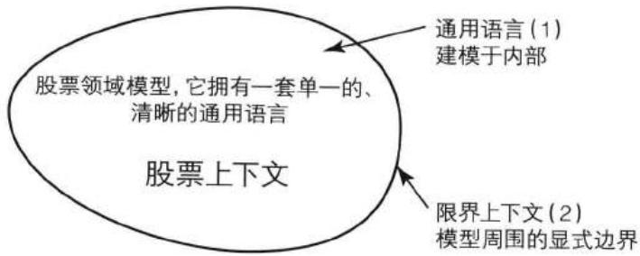


图G.1 限界上下文和通用语言


在战略设计的过程中, 你将发现上下文映射图 (Context Map, 3) 是非常有用的, 如图G.2所示。你的团队将使用上下文映射图来理解项目的范围。 

以上我们简要地了解了DDD的战略设计, 这是我们必须好好理解的概念。 

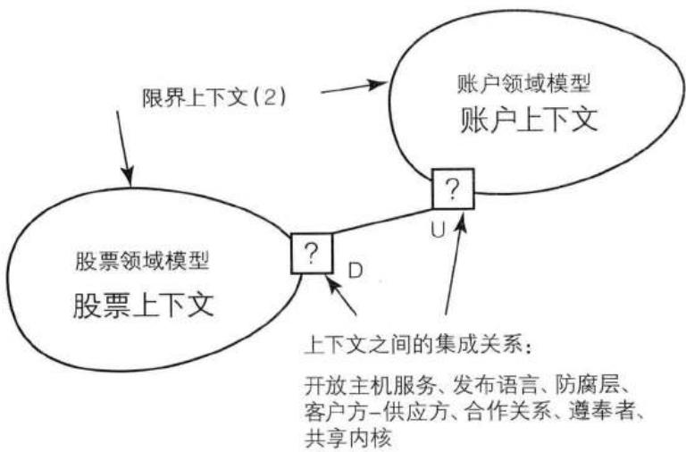


图G.2 上下文映射图展示限界上下文之间的关系


## 架构

有时，一个新的限界上下文或上下文映射图可能需要一种新的架构（Architecture, 4）。你应该牢记：通过战略和战术设计而成的领域模型应该是架构中立的。当然，在模型周围和模型之间则是存在架构的。一种能够支撑限界上下文的架构是六边形（Hexagonal）架构，它可以辅助其他架构风格，比如面向服务（Service-Oriented）架构、REST和事件驱动（Event-Driven）等。六边形架构如图G.3所示，从表面看，这种架构有点复杂，但是事实上却恰恰相反。 

有时我们过于强调架构而忽略了DDD建模的重要性。架构固然是好的，但是架构并非一成不变。此时我们须要正确地处理优先级，将重点放在领域模型上，因为领域模型将产生更多的业务价值，并且更具有持久性。 

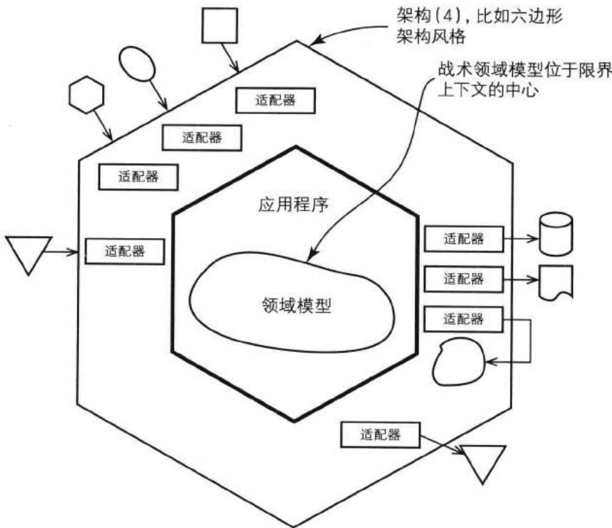


图G.3 六边形架构风格, 领域模型位于软件的中心


## 战术建模

我们在限界上下文中进行DDD的战术建模。战术设计的一个重要模式是聚合(Aggregate, 10)，如图G.4所示。 

聚合可以由单个实体（Entity, 5）组成，也可以由一组实体和值对象（Value Object, 6）组成，此时我们必须在聚合的整个生命周期中保证事务上的一致性。有效地对聚合进行建模是重要的，同时聚合又是DDD中最不容易理解的概念之一。你可能会问，既然聚合如此重要，那为什么要将其放在本书的后面呢？首先，本书中战术模式的出现顺序和[Evans]一样，此外，由于聚合以其他战术模式为基础，所以我们会先讲到实体、值对象等基本模式，再讲解聚合。 

聚合实例通过资源库（Repository, 12）进行持久化，另外，对聚合的查找和获取也通过资源库完成，如图G.4所示。 

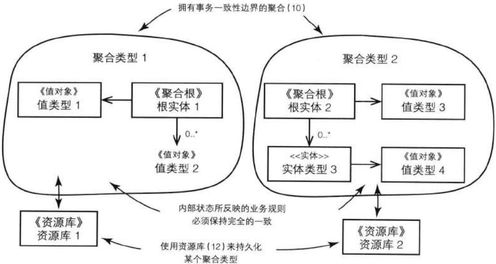


图 G.4 两个聚合类型, 它们拥有各自的事务一致性边界


在领域模型中, 有些业务操作并不能自然地放在实体或值对象上, 此时我们可以使用无状态的领域服务 (Domain Service, 7), 如图G.5所示。 

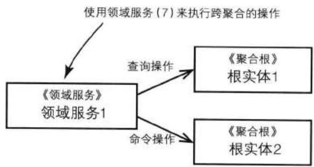


图G.5 领域服务执行特定于领域的操作, 其中可能涉及到多个领域对象


领域事件（Domain Event, 8）表示领域模型中发生的重要事件。有多种方式可以对领域事件进行建模。在对聚合进行命令操作时，聚合本身将发布领域事件，如图G.6所示。 

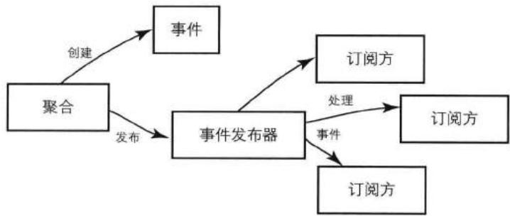


图G.6 领域事件可以由聚合发布


我们通常忽略了模块（Module，9），但是正确地设计模块同样是重要的。简单来讲，我们可以将模块看成是Java中的包或C#中的命名空间。请记住，如果只是机械式地设计模块，而不是根据通用语言，那么我们将得不偿失。模块中包含的领域对象应该是内聚在一起的，如图G.7所示。 

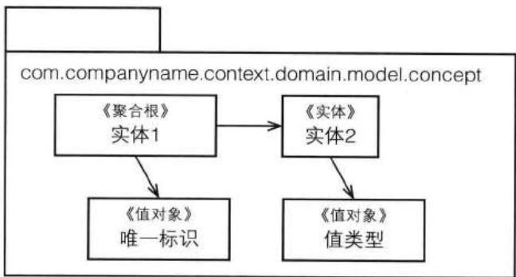


图 G.7 一个模块包含并组织内聚在一起的领域对象


好吧，现在来熟悉一下“牛仔的逻辑”幽默片段，以下便是一则： 

## 牛仔的逻辑

AJ: “不要担心你的嘴巴包不下这块大肥肉，你的嘴巴可比你想象的大多了。” 

LB: “你说的是‘头脑’吧，J。你的头脑比想象的大多了才对。” 


## 目录

序....xix
前言....xxi
致谢....xxxi
关于作者....xxxv
如何使用本书....xxxvii
第1章 DDD入门....1
我能DDD吗?....2
为什么我们需要DDD....5
如何DDD....17
使用DDD的业务价值....22
1.你获得了一个非常有用的领域模型....22
2.你的业务得到了更准确的定义和理解....23
3.领域专家可以为软件设计做出贡献....23
4.更好的用户体验....23
5.清晰的模型边界....24
6.更好的企业架构....24
7.敏捷、迭代式和持续建模....24
8.使用战略和战术新工具....24
实施DDD所面临的挑战....25
虚构的案例,真实的实践....33
本章小结....36
第2章 领域、子域和限界上下文....37
总览....37
工作中的子域和限界上下文....38
将关注点放在核心域上....42
战略设计为什么重要....45
现实世界中领域和子域....48 

理解限界上下文....53
限界上下文不仅仅只包含模型....57
限界上下文的大小....59
与技术组件保持一致....61
示例上下文....62
协作上下文....63
身份与访问上下文....69
敏捷项目管理上下文....71
本章小结....73

第3章 上下文映射图....75
上下文映射图为什么重要....75
绘制上下文映射图....77
产品和组织关系....79
映射3个示例限界上下文....82
本章小结....97

第4章 架构....99
采访一个成功的CIO....100
分层....104
依赖倒置原则....107
六边形架构(端口与适配器)....110
面向服务架构....114
REST....117
REST作为一种架构风格....117
RESTful HTTP服务器的关键方面....118
RESTful HTTP客户端的关键方面....119
REST和DDD....120
为什么是REST?....121
命令和查询职责分离——CQRS....121
CQRS的各个方面....123
处理具有最终一致性的查询模型....128
事件驱动架构....129 

管道和过滤器....131  
长时处理过程(也叫Saga)....134  
事件源....140  
数据网织和基于网格的分布式计算....143  
数据复制....144  
事件驱动网织和领域事件....145  
持续查询....145  
分布式处理....146  
本章小结....148  

第5章 实体....149  
为什么使用实体....149  
唯一标识....151  
用户提供唯一标识....152  
应用程序生成唯一标识....153  
持久化机制生成唯一标识....156  
另一个限界上下文提供唯一标识....160  
标识生成时间....161  
委派标识....163  
标识稳定性....165  
发现实体及其本质特征....167  
揭开实体及其本质特征的神秘面纱....168  
挖掘实体的关键行为....172  
角色和职责....176  
创建实体....181  
验证....183  
跟踪变化....192  
本章小结....192  

第6章 值对象....193  
值对象的特征....194  
度量或描述....195  
不变性....195 

概念整体....196
可替换性....199
值对象相等性....200
无副作用行为....201
最小化集成....204
用值对象表示标准类型....206
测试值对象....210
实现....214
持久化值对象....219
拒绝由数据建模泄漏带来的不利影响....220
ORM与单个值对象....221
多个值对象序列化到单个列中....224
使用数据库实体保存多个值对象....225
使用联合表保存多个值对象....229
ORM与枚举状态对象....230
本章小结....233

第7章 领域服务....235
什么是领域服务（首先，什么不是领域服务）....237
请确定你是否需要一个领域服务....238
建模领域服务....241
独立接口有必要吗....244
一个计算过程....246
转换服务....249
为领域服务创建一个迷你层....250
测试领域服务....250
本章小结....253

第8章 领域事件....255
何时/为什么使用领域事件....255
建模领域事件....258
创建具有聚合特征的领域事件....263
身份标识....264 

从领域模型中发布领域事件....265
发送方....265
订阅方....269
向远程限界上下文发布领域事件....271
消息设施的一致性....271
自治服务和系统....272
容许时延....273
事件存储....274
转发存储事件的架构风格....279
以REST资源的方式发布事件通知....279
通过消息中间件发布事件通知....283
实现....284
发布NotificationLog....285
发布基于消息的事件通知....290
本章小结....297

第9章 模块....299
通过模块完成设计....299
模块的基本命名规范....302
领域模型的命名规范....302
敏捷项目管理上下文中的模块....305
其他层中的模块....308
先考虑模块,再是限界上下文....309
本章小结....310

第10章 聚合....311
在Scrum核心领域中使用聚合....312
第一次尝试:臃肿的聚合....313
第二次尝试:多个聚合....314
原则:在一致性边界之内建模真正的不变条件....317
原则:设计小聚合....319
不要相信每一个用例....321
原则:通过唯一标识引用其他聚合....322 

通过标识引用使多个聚合协同工作....324
建模对象导航性....325
可伸缩性和分布式....326
原则: 在边界之外使用最终一致性....327
谁的任务?....328
打破原则的理由....329
理由之一: 方便用户界面....329
理由之二: 缺乏技术机制....330
理由之三: 全局事务....331
理由之四: 查询性能....331
遵循原则....332
通过发现, 深入理解....332
重新思考设计....332
估算聚合成本....334
常见用例场景....335
内存消耗....336
探索另外的设计....337
实现最终一致性....338
这是Scrum团队成员的任务吗?....339
决定的时候到了....341
实现....341
创建具有唯一标识的根实体....342
优先使用值对象....343
使用迪米特法则和“告诉而非询问”原则....344
乐观并发....346
避免依赖注入....348
本章小结....349
11章 工厂....351
领域模型中的工厂....351
聚合根中的工厂方法....352
创建CalendarEntry实例....353
创建Discussion实例....357 

领域服务中的工厂....358  
本章小结....361  

第12章 资源库....363  

面向集合资源库....364  
Hibernate实现....369  
TopLink实现....377  
面向持久化资源库....379  
Coherence实现....381  
MongoDB实现....386  
额外的行为....391  
管理事务....393  
警告....397  
类型层级....397  
资源库 vs 数据访问对象 (DAO)....400  
测试资源库....401  
以内存实现进行测试....404  
本章小结....407  

第13章 集成限界上下文....409  

集成基础知识....409  
分布式系统之间存在根本性区别....411  
跨系统边界交换信息....411  
通过REST资源集成限界上下文....417  
实现REST资源....418  
使用防腐层实现REST客户端....421  
通过消息集成限界上下文....428  
从Scrum的产品负责人和团队成员处得到持续通知....428  
你能处理这样的职责吗？....434  
长时处理过程，以及避免职责....439  
长时处理过程的状态机和超时跟踪器....450  
设计一个更复杂的长时处理过程....460 

当消息机制或你的系统不可用时....464
本章小结....465

第14章 应用程序....467
用户界面....469
渲染领域对象....470
渲染数据传输对象....471
使用调停者发布聚合的内部状态....471
通过领域负载对象渲染聚合实例....472
聚合实例的状态展现....473
用例优化资源库查询....474
处理不同类型的客户端....474
渲染适配器以及处理用户编辑....475
应用服务....478
示例应用服务....478
解耦服务输出....485
组合多个限界上下文....487
基础设施....489
企业组件容器....490
本章小结....494

附录A 聚合与事件源: A+ES....495
应用服务内部....496
命令处理器....505
Lambda语法....508
并发控制....510
A+ES所带来的结构自由性....513
性能....513
实现事件存储....516
关系型持久化....520
BLOB持久化....522
专注的聚合....523
读模型投射....524 

与聚合设计一道使用....527
增强事件....527
工具和模式....529
事件序列器....530
事件不变性....531
值对象....531
协议生成....534
单元测试和需求规范....535
事件源和函数式语言....536
参考文献....539 

# 第1章 DDD入门

设计不只是感观，设计就是产品的工作方式。 

——Steve Jobs 

我们都致力于开发高质量的软件。通过测试，我们可以消除软件系统中大量的bug。然而，即便我们的软件中没有bug，也不能表示我们设计的软件模型本身就是好的。软件中存在少量的瑕疵是无可厚非的，而同时，我们是可以设计出能够准确表达业务意图的软件模型的。 

领域驱动设计 (DDD) 作为一种软件开发方法, 它可以帮助我们设计高质量的软件模型。在正确实现的情况下, 我们通过DDD完成的设计恰恰就是软件的工作方式。本书便是帮助你如何正确实现DDD的。 

你可能是个DDD新手；也可能做过一些DDD尝试而目前正苦苦地挣扎着；还有可能你已经成功地运用了DDD。不管如何，你都希望通过本书来提高自己的DDD技能，我相信你是可以的。以下是本章的学习路线图： 

## 本章学习路线图

- 了解DDD可以为你的项目和团队带来哪些好处 

- 如何确定你的项目是否适合采用DDD 

- 了解DDD的常见替代方案和它们将导致问题的原因 

- 学习DDD的基础 

- 学习如何向你的管理层、领域专家和技术成员推销DDD 

- 了解使用DDD时所面临的挑战 

- 看看一个正在学习采用DDD的团队是如何工作的 

那么，你应该期待从DDD中得到什么呢？首先，DDD不应该是一个仪式性的过程，更不应该成为你项目进度的阻碍。此时你可以采用敏捷开发方法，或者寻找另外的方法来帮你更深层次地了解自己的业务领域。我们的目标应该是创造一个可测试的、可伸缩的、组织良好的软件模型。 

DDD同时提供了战略上的和战术（Tactical）上的建模工具来帮助我们设计高质量的软件模型。 

## 我能DDD吗？

你是可以实施DDD的, 如果你: 

- 有开发卓越软件的激情和毅力 

- 渴望学习和进步 

- 有能力理解软件模式，并懂得如何应用这些模式 

- 有发掘不同设计方法的能力和耐性 

- 勇于改变现状 

- 看重细节, 希望亲自试验 

- 希望编写更好的代码 

DDD不是没有学习曲线，而且学习曲线有可能很陡。不用着急，本书将尽可能地为你降低学习曲线，我的目的就是挖掘你成功的潜能，帮助你和你的团队实现DDD。 

DDD首先并不是关于技术的，而是关于讨论、聆听、理解、发现和业务价值的，而这些都是为了将知识集中起来。如果你了解公司的业务，那么你至少可以为DDD的通用语言（Ubiquitous Language）做出贡献。当然，你可能需要学习更多的业务知识。由于你对业务概念的理解，你已经开始走在DDD的康庄大道上了。 

多年的软件开发经验能够帮助我更好地实现DDD吗?可能会。然而,你的开发经验并没有教给你向领域专家聆听和学习的能力。在实施DDD的过程中,你最好将那些不怎么使用技术语言的人加进自己的团队,此时你得仔细地聆听他们,还应该尊重他们的观点,并且相信他们比你了解得更多。 

## 将领域专家引入到团队是大有好处的。

在实施DDD的过程中, 你最好将那些不怎么使用技术语言的人加进自己的团队。就像你会向他们学习一样, 他们也会向你学习。 

可能你最希望看到的便是: 领域专家同样得听你的。大家都是同一个团队的成员。领域专家不见得就知道所有的业务, 他们也得学习。就像你会向他们学习一样, 他们也会向你学习。你向领域专家提出的问题有可能暴露出他们不知道的地方。你将直接帮组团队更好地理解业务, 甚至确定业务。 

这样一来，团队中的所有成员都在学习和成长——是DDD使之成为了可能。 

## 但是，我们还没有领域专家

领域专家并不是一个职位，他可以是精通业务的任何人。他们可能了解更多的关于业务领域的背景知识，他们可能是软件产品的设计者，甚至有可能是销售员。 

如果你发现有人比你更加了解业务知识, 找到他们, 聆听他们, 并向他们学习。 

现在, 我们已经开了一个好头。我并不是说技术不重要, 而是说在本书中你得掌握领域建模中更高层次的概念。如果你的能力能够位于理解《Head First设计模式》[Freeman et al]和《设计模式》[Gamma et al]之间, 或者你还学了一些更高级的模式, 那么你已经具备很好的DDD基础了。在本书中, 我将尽量顾及到各个层次的学习者。 

## 什么是领域模型？

领域模型是关于某个特定业务领域的软件模型。通常，领域模型通过对象模型来实现，这些对象同时包含了数据和行为，并且表达了准确的业务含义。 

不同角色的人都可以从DDD中获益,看看自己属于以下角色的哪一种: 

- 新手，初级开发者：“我还年轻，有很多点子，对写代码充满了热情。但是我所在的那个项目简直让人崩溃，我才不想一毕业就被那些重复性的工作纠来缠去。这个项目的架构为什么如此复杂？这到底是怎么呢？我修改了一点代码，却破坏了更多的代码。有人知道这本来应该是什么样子吗？现在，我还得添加一些复杂的新特性。我在遗留代码之上添加了一个适配器来屏蔽那些难看的遗留代码，但是没有用。我相信除了整天写代码和调试外，还有更好的办法。于是有人向我介绍DDD，听说DDD是领域模型中的‘四人帮（Gang of Four）’，不错不错。” 

- 中级开发者：“在过去的几个月中，我加入了一个新的项目，这次轮到我来做出改变了。那时，当我和高级开发人员在一起工作时，我发现我缺少对事物的洞察力。有时团队非常涣散，但是我又不知道其中的原因，我决定改变团 队成员们的做事方式。我需要一种能够助我成功的软件开发技术。一个高级架构师向我推荐DDD，我打算了解了解。 

听起来你已经是个高级开发者了，继续往下读。你超前思考的态度自然会得到回报的。 

- 高级开发者, 架构师: “我曾在多个项目中都使用过DDD, 不过目前所在项目还未使用。我喜欢DDD战术模式的威力, 但是我还打算应用更多的DDD模式, 比如战略设计等。在阅读[Evans]时, 我发现通用语言的功能非常强大。我已经与团队成员和管理层讨论过采用DDD的事情了, 但其中有些中高级开发者对DDD在项目中的前景并不看好, 而管理层也不是那么热衷于DDD。我是最近才加入公司的, 虽然我是团队带头人, 但是整个团队似乎并不愿意被一些新奇玩意儿打断了开发进度。不管如何, 我是不会放弃的。虽然其他开发者对DDD没有信心, 但是我是能做到的。我决定将领域专家引入到团队中来, 使他们跟技术人员一起工作。” 

这就是一个领导应该做的。本书包含了很多关于战略设计的例子。 

- 领域专家：“我已经在IT部门帮他们解决业务问题好长一段时间了，我希望开发者们能够更好地理解他们所做的事情。他们总是认为我们业务人员是愚蠢的。但是他们不知道的是，如果不是我们，他们早就丢了工作。开发者总会以一些奇怪的方式来讨论我们的软件，如果我说这是A，他们却说这是B，好像我们需要有本词典才能交流一样。如果我们试图纠正他们的错误叫法，他们就不愿意合作了。我们在这上面浪费了太多的时间。软件为什么不能像真正的业务专家所想象的那样工作呢？” 

你说对了。软件开发的最大问题之一便是业务人员和技术人员需要某种翻译才能交流。本章将对此做出讨论。你将看到，DDD将业务人员和技术人员放在同一个层面上。惊讶吧，你已经使一些开发者向你靠近了，多帮帮他们。 

- 项目经理：“我们要交付软件，但结果并不总是让人舒心，有时开发时间拖得太长了。开发者在谈论到领域时总是各执一词，莫衷一是。我不确定我们是否需要另一种银弹般的技术或者方法。之前我们不是没有尝试过，但是每次都失败了，结果还是得回到原来的位置。我总是说，我们应该放弃幻想，准备战斗，但是团队成员并不这么认为。他们工作非常努力，我总觉得欠他们些什么，于是听听他们的意见吧。他们都是聪明之人，并且都希望做出些改变。对于我来说，如果我上面的管理层同意，我是完全允许开发者们花 时间学习的。团队成员们希望有个集中化的业务知识体系，我想我可以以此说服我的老板。这样一来，我自己的工作也将变得简单，我还可以促进团队和业务专家之间的合作与互信。” 

多好的项目经理啊！ 

不管你是谁，有一点是重要的：要在DDD之路上取得成功，你肯定得学习，并且大量地学习。学习不是什么问题，你是聪明的，并且一直都在学习。然而，我们都面临这样一种困境： 

就个人来讲，我时刻都在准备着学习，但是我并不喜欢被人教。 

——Winston Churchill 

在本书中, 我会尽量将知识传递变成一件愉悦之事, 并且保证你在DDD上有所收获。 

你可能又有问题了：“为什么我们需要DDD呢？” 

## 为什么我们需要DDD

事实上，在前面我已经提到了一些应该采用DDD的原因。冒着有悖DRY原则（Don't repeat yourself, 不要做重复的事情）的风险，我重新说说我们需要采用DDD的原因。 

- 使领域专家和开发者在一起工作，这样开发出来的软件能够准确地传达业务规则。当然，对于领域专家和开发者来说，这并不表示单单地包容对方，而是将他们组成一个密切协作的团队。 

- “准确传达业务规则”的意思是说，此时的软件就像如果领域专家是编码人员时所开发出来的一样。 

- 可以帮助业务人员自我提高。没有任何一个领域专家或者管理者敢说他对业务已经了如指掌了，业务知识也需要一个长期的学习过程。在DDD中，每个人都在学习，同时每个人又是知识的贡献者。 

- 关键在于对知识的集中, 因为这样可以确保软件知识并不只是掌握在少数人手中。 

- 在领域专家、开发者和软件本身之间不存在“翻译”，意思是当大家都使用相同的语言进行交流时，每人都能听懂他人所说。 

- 设计就是代码, 代码就是设计。设计是关于软件如何工作的, 最好的编码设计来自于多次试验, 这得益于敏捷的发现过程。 

- DDD同时提供了战略设计和战术设计两种方式。战略设计帮助我们理解哪些投入是最重要的；哪些既有软件资产是可以重新拿来使用的；哪些人应该被加到团队中？战术设计则帮助我们创建DDD模型中各个部件。 

就像其他高回报率的投入一样，DDD需要我们在时间和精力上都有所投入。但是，考虑到我们在开发软件的过程中经常遇到的各种问题和挑战，这样的投入是值得的。 

## 难以捉摸的业务价值

开发能够传递真正业务价值的软件和开发普通的软件是不同的。具有真正业务价值的软件能够很好地符合业务战略，并且可以将竞争优势融合到解决方案中。此时的软件并不是关于技术的，而是关于业务的。 

业务知识从来就没有被集中过。开发团队必须在多方之间权衡各种需求，并确定其中的优先级。同时，团队成员的技能也是良莠不齐的。在获得所有的信息之后，团队所面临的问题在于：如何确定某种需求确实能够传递真正的业务价值？还有，我们如何去发现并暴露出这些业务价值，如何安排它们之间的优先级，并且如何实现它们？ 

在开发过程中, 最大的鸿沟之一便存在于领域专家和开发者之间。通常来说, 领域专家将关注点放在交付业务价值上, 而开发者则将注意力放在技术实现上。当然, 并不是说开发者的动机是错误的, 而是说开发者的眼光被自然而然地吸引到了实现层面上。即便让领域专家和开发者一同工作, 他们之间的协作也只是表面的, 这时在所开发的软件中便产生了一种映射: 将业务人员所想的映射到开发者所理解的。这样一来, 软件便不能完全反映出领域专家的思维模型。随着时间的推移, 这种鸿沟将增加软件的开发成本。而随着开发者转到其他项目或者离职, 本应该驻留在软件中的领域知识也就丢失了。 

另一个问题发生在当多个领域专家之间存在分歧的时候。这是很有可能发生的，因为每个专家只是熟悉某个或者某些特定的领域。另外，在某个领域里找不到真正的专家也是可能的，此时，有人可能对该领域有所了解，但是他更像一个业务分析员。这些问题将导致相互矛盾的软件模型。 

更糟的是，软件的技术实现可能错误地改变软件的业务规则。比如，ERP软件通常需要修改业务操作以满足某个特定用户的需求，因此ERP的成本不能单以使用许可和维护费用来计算，对业务规则的修改所产生的成本远远大于前两者。另外一个相似的例子是当开发团队将业务需求翻译成软件功能的时候。这对于业务、用户和合作方来说都是一笔很大的成本。还有，技术上的翻译和解释是没有必要的，并且在使用适当开发方式的情况下是可以避免的。解决方案才是主要的投入。 

## DDD如何帮助我们

DDD作为一种软件开发方法,它主要关注以下三个方面: 

1. DDD将领域专家和开发人员聚集到一起，这样所开发的软件能够反映出领域专家的思维模型。这并不意味这我们将精力都花在了对“真实世界”的建模上，而是交付最具业务价值的软件。有时在实用和理想之间存在冲突，根据它们的互异程度，在DDD中我们将选择实用性。 

领域专家将和开发人员一起创建一套适用于领域建模的通用语言。通用语言必须在全队范围之内达成一致；所有成员都使用通用语言进行交流，通用语言也是对软件模型的直接反映。请注意，虽然团队中同时包含领域专家和开发人员，但并不是“我们”和“他们”的关系，团队中只有“我们”的概念。 

通用语言也有助于促使原本存在分歧的领域专家们达成一致意见。此外，通过将领域知识传达给所有的团队成员，包括开发人员，整个团队也将更具凝聚力。我们甚至可以认为，这是每个公司都应该有的对于知识型工作者的起码训练。 

2. DDD关注业务战略。虽然说战略(Strategic)设计自然地包含了战术设计,但是战略设计关注更多的则是业务的战略方向。它帮助我们定义不同团队之间的组织关系,并在这些关系有可能导致项目失败的时候提供早期预警。DDD的战略设计用于清楚地界分不同的系统和业务关注点,这样可以保护每个业务层面的服务。更进一步,这将指引我们如何实现面向服务架构(service-oriented architecture)或者业务驱动(business-driven architecture)架构。 

3. 通过使用战术设计建模工具，DDD满足了软件真正的技术需求。这些战术设计工具使开发人员能够按照领域专家的思维模型开发软件。同时，所开发出来的软件是可测试的，能够尽量避免错误，能执行服务层面协议（Service-Level Agreement, SLA），具有很好的伸缩性，并且允许分布式计算。DDD的 最佳实践同时包含了高层的架构性实践和底层设计实践，关注业务规则和数据不变性，并且可以对业务规则起到保护作用。 

通过这种方式开发软件，你和你的团队将能成功地交付真正的业务价值。 

## 处理领域复杂性

在使用DDD时, 我们首先希望将它应用在最重要的业务场景下。对于那些可以轻易替换的软件来说, 你是不会有所投入的。相反, 值得你投入的是那些重要的、复杂的东西, 因为这些东西将为你带来可观的回报。正因如此, 我们将这样的模型命名为核心域 (Core Domain, 2), 而那些相对次要的称为支撑子域 (Supporting Subdomain, 2)。那么现在, 我们需要搞明白的是, “复杂” 到底是什么意思? 

## DDD的作用是简化, 而不是复杂化

在使用DDD时, 我们应该采用最简单的方式对复杂领域进行建模, 而不是使问题变得更加复杂。 

不同的业务领域对于复杂的定义是不一样的。另外，不同的公司所面临的挑战不一样；成熟度不一样；软件开发能力也不一样。因此，与其去定义什么是复杂的，还不如定义什么是重要的。这时，你的团队和管理层应该做出决定：你们开发的软件系统是否值得做出DDD投入。 

DDD计分卡: 使用表1.1来决定你的项目是否值得做出DDD投入。如果你的项目情况在某行的描述范围之内, 那么请在右边的列中记上相应的分数, 最后将这些分数相加得到总分。如果得分为7分或者以上, 那么, 你应该考虑使用DDD了。 

<table><tr><td colspan="4">你的项目是否得到7分或者7分以上?</td></tr><tr><td>如果你的项目......</td><td>得分</td><td>备注</td><td>你的打分</td></tr><tr><td>如果你的软件完全以数据为中心,所有操作都通过对数据库的CRUD完成,那么你并不需要DDD。此时你的团队只需要一个漂亮的数据库表编辑器。换言之,你可以指望着用户对你的数据进行直接操作,包括更新和删除数据。你并不需要提供用户界面。如果你甚至可以用一个简单的数据库开发工具来完成开发,那么,你完全没有必要在DDD上浪费时间和金钱。</td><td>0</td><td>这似乎是一个傻瓜化的问题,但是要分清简单和复杂的区别却不是那么容易的。并不是说只要不是纯粹的CRUD软件,便可以采用DDD。因此我们需要采用另外的方法来判别简单和复杂......</td><td></td></tr><tr><td>如果你的系统只有25到30个业务操作,这应该是相当简单的。这意味着你的程序中不会多于30个用户故事(user story)或用例流(use case flow),并且每个用例流仅包含少量的业务逻辑。如果你可以使用Ruby on Rails或者Groovy和Grails来快速地开发出这样的系统,并且你没有感觉到由复杂性和业务变化所带来的痛苦,那么你是不需要使用DDD的。</td><td>1</td><td>澄清一下,我是说25到30个业务方法,而不是说25到30个拥有多个方法的服务接口,后者可能是复杂的。</td><td></td></tr><tr><td>当你的系统中有30到40个用户故事或者用例流时,此时软件的复杂性便暴露出来了,你可以考虑采用DDD了。</td><td>2</td><td>通常情况下,复杂性并不能被及时发现。我们开发者很容易低估软件的复杂性。我们希望使用Ruby on Rails来开发软件并不代表我们就必须使用Ruby on Rails。而长远看来,这是不利的。</td><td></td></tr></table>


表1.1 DDD计分卡


<table><tr><td colspan="4">你的项目是否得到7分或者7分以上?</td></tr><tr><td>如果你的项目......</td><td>得分</td><td>备注</td><td>你的打分</td></tr><tr><td>即便我们的软件目前并不复杂,但是之后呢?在真正的用户开始使用软件之前,我们是无法预测软件的复杂性的,但是在右边的“备注”栏中有一项可以帮助我们应对这种情况。请注意,如果有暗示说明系统已经足够复杂,这往往意味着我们的系统实际上比目前更加复杂,采用DDD吧。</td><td>3</td><td>这时我们有必要和领域专家一起探讨那些复杂的用例。如果领域专家......1. 已经要求加入更复杂的功能。这表明软件已经开始变得复杂,此时单纯的CRUD是不能满足需求的。2. 认为既有的功能没什么可以探讨的。此时我们的软件可能并不那么复杂。</td><td></td></tr><tr><td>软件的功能在接下来的几年里将不断变化,而你并不能预期这些变化只是些简单的改变。</td><td>4</td><td>DDD可以帮助你管理软件的复杂性,随着时间的推移,你可以对软件模型进行重构。</td><td></td></tr><tr><td>你不了解软件所要处理的领域(2)。你的团队中也没有人曾经从事过该领域的开发工作。此时,软件很有可能是复杂的,因此你们应该讨论复杂等级。</td><td>5</td><td>你需要和领域专家一起工作了。你肯定也在前面的计分行中打了分,采用DDD吧。</td><td></td></tr></table>

通过对以上DDD计分卡打分, 我们可以得出以下结论: 

当我们在复杂性问题上犯错时，我们很难轻易地扭转颓势。 

这意味着我们应该在项目计划早期便对简单性和复杂性做出判断，这将为我们节约很多时间和开销，并免除很多麻烦。 

一旦我们做出了重要的架构决策，并且已经在该架构下进行了深入地开发，通常我们也被绑定在这个架构下了，所以在决定时一定要慎重。 

如果你对以上几点产生了共鸣，表明你已经在认真地思考问题了。 

## 贫血症和失忆症

贫血症严重危害着人类健康，并且伴随有危险的副作用。当贫血领域对象(Anemic Domain Object) [Fowler, Anemic]被首次提出来时，它并不是一个博得赞美的词汇，它描述的是一个缺少内在行为的领域对象。奇怪的是，人们对于贫血领域对象的态度褒贬不一。问题在于，多数开发者认为这样的领域对象是正常的，他们并没有意识到这是一个严重的问题。 

你是否想知道你所建模型的健康状况呢？如果你突然患上了技术上的“忧郁症”，这里你可以做个自我检查。你可能心情愉悦，也可能无比恐惧。通过表1.2中的步骤开始检查吧。 


表1.2 领域对象病历


<table><tr><td></td><td>Yes / No</td></tr><tr><td>你的领域对象中是不是主要是些公有的getter和setter方法,并且几乎没有业务逻辑,或者甚至完全没有业务逻辑——对象嘛,主要就是用来容纳属性值的?</td><td></td></tr><tr><td>软件组件经常使用的领域对象是否包含了系统主要的业务逻辑,并且多数情况下你需要调用那些getter和setter?你可能会将这样的客户代码称为服务层(Service Layer)或者应用层(Application Layer)(4,14)代码。也或者,如果这描述的是你的用户界面,请回答“Yes”,然后好好反省一下,告诫自己一定不要再这么做了。</td><td></td></tr><tr><td colspan="2">提示:正确的答案是:要么两项均为“Yes”,要么均为“No”。</td></tr></table>

如果你对以上两个问题的回答都是“No”，表明你的领域对象是健康的。 

如果都是“Yes”，表明你的领域对象已经病得不轻了，这便是贫血对象。好消息是，你是可以获得帮助的，继续往下读吧。 

如果你对其中一个回答“Yes”，而另一个回答“No”，你可能是在自欺或者患上了由贫血症导致的神经系统紊乱，此时你应该怎么办呢？回到第一个问题重新来一遍，不要着急，要确保对两个问题都回答“Yes”。 

正如[Fowler, Anemic]所说，贫血领域对象是不好的，因为你花了很大的成本来开发领域对象，但是从中却获益甚少。比如，由于存在对象-关系阻抗失配(Object-Relational Impedance)，开发者需要将很多时间花在对象和数据存储之间的映射上。这样的代价太大，而收益太小。我得说，你所说的领域对象根本就不是领域对象，而只是将关系型数据库中的模型映射到了对象上而已。这样的领域对象更像是活动记录（Active Record）[Fowler, P of EAA]，此时你可以对架构做个简化，然后使用事务脚本（Transaction Script）[Fowler, P of EAA]进行开发。 

## 为什么会有贫血领域对象

如果说贫血领域对象是由设计不当造成的,为什么还有如此多的人认为他们的领域对象是健康的呢?其中一个原因是:贫血领域对象反映了一种自然的过程式的编程风格,但我并不认为这是首要原因。软件业中有很多开发者都是学着示例代码做开发的,这并不是什么坏事,只要示例代码本身是好的。然而,通常情况是,示例代码只是用尽可能简单的方式来展示某个特定的概念或者API特性,而并不强调要遵循多好的设计原则。一些极度简化的示例代码总是包含了大量的getter和setter,于是这些getter和setter随着示例代码每天被程序员们原封不动地来回复制。 

还有历史的影响。Microsoft的Visual Basic对我们现在的软件开发产生了很大的影响。我并不是说Visual Basic是门不好的语言和集成开发环境（IDE），因为它的确是种高效的开发方式，并且在某些方面对软件开发产生过正面的影响。当然，有些人可能会拒绝Visual Basic的直接影响，但是最终它却间接地影响着每一个程序员。请注意表1.3中的时间线。 


表1.3 从富有行为的对象到贫血对象的时间线


<table><tr><td>1980s</td><td>1991</td><td>1992–1995</td><td>1996</td><td>1997</td><td>1998–</td></tr><tr><td>由于Smalltalk和C++,对象开始产生影响</td><td>Visual Basic属性和属性列表</td><td>可视化工具和IDE遍地开花</td><td>JavaJDK 1.0发布</td><td>JavaBean规范</td><td>Java和.NET平台均出现了大量的通过反射机制处理对象属性的工具</td></tr></table>

这里, 我想谈及的是对象属性和属性列表带来的影响。对象属性和属性列表都得益于getter和setter的支持, 而Visual Basic的窗体设计器将getter和setter 变得过于流行了。你需要做的只是将自定义控件拖到窗体上，然后编辑控件的属性列表，大功告成，一个功能完备的窗体程序开发完毕。如果直接采用C语言的Windows API来开发相同的窗体，可能需要几天时间，而采用Visual Basic只是几分钟的事情。 

那这和贫血领域对象有什么关系呢? JavaBean标准最早是用来辅助Java的可视化设计工具的, 旨在将Microsoft的Active X开发方式带到Java平台。Java此举希望开创一个第三方自定义控件市场, 就像Visual Basic一样。此后不久, 几乎所有的框架和类库都涌入到了JavaBean潮流中, 其中包括Java本身的SDK/JDK和第三方类库, 比如Hibernate。在.NET平台推出之后, 这样的趋势还在继续。 

有趣的是，在早期的Hibernate版本中，所有需要持久化的领域对象都必须暴露公有的getter和setter，不管是对于简单类型的属性，还是对复杂类型皆如此。这意味着，即便你希望将自己的POJO（Plain Old Java Object）设计成富含行为的对象，你都必须将对象的内部暴露给Hibernate以保存或重建对象。诚然，你可以隐藏公有的JavaBean接口，但是多数开发者都懒得这样做，或者甚至都不知道为什么应该这么做。 

## 我应该考虑在DDD中使用对象-关系映射 (Object-Relational Mapping, ORM) 吗?

前面主要是从历史的角度对Hibernate进行了批评。现在，Hibernate已经不需要对象暴露getter和setter了，它甚至可以对对象属性进行直接操作。我将在后面的章节中讲到在使用Hibernate或其他持久化机制时如何避免贫血对象。 

此外，多数的Web框架依然只支持JavaBean规范。如果你想将一个Java对象显示在网页上，该Java对象最好是支持JavaBean规范的。如果你想将HTML表单中的数据传到一个Java对象中，该Java对象也最好是支持JavaBean规范的。 

市场上的几乎每种框架都要求对象暴露公有属性。这样一来，多数开发者只能被动地接受那些贫血对象。于是我们便到了“到处都是贫血对象”的地步。 

## 看看贫血对象都对你的模型做了些什么

好吧, 我们同意这已经是烦人的即成事实。但是这些无处不在的贫血对象和失忆症又有什么关系呢? 当你在阅读一个贫血领域对象的示例代码时, 比如应用服务 (4, 14) 中的事务脚本, 你通常会看到类似如下的代码片段: 

```java
@Transactional
public void saveCustomer(
    String customerId,
    String customerFirstName, String customerLastName, 
```

```txt
String streetAddress1, String streetAddress2,
String city, String stateOrProvince,
String postalCode, String country,
String homePhone, String mobilePhone,
String primaryEmailAddress, String secondaryEmailAddress) {

Customer customer = customerDao.readCustomer(customerId);

if (customer == null) {
    customer = new Customer();
    customer.setCustomerId(customerId);
}

customer.setCustomerFirstName(customerFirstName);
customer.setCustomerLastName(customerLastName);
customer.setStreetAddress1(streetAddress1);
customer.setStreetAddress2(streetAddress2);
customer.setCity(city);
customer.setStateOrProvince(stateOrProvince);
customer.setPostalCode(portalCode);
customer.setCountry(country);
customeristedHomePhone(homePhone);
customer.setMobilePhone(mobilePhone);
customer.setPrimaryEmailAddress(primaryEmailAddress);
customer.setSecondaryEmailAddress(secondaryEmailAddress);

customerDao.saveCustomer(customer); 
```

## 刻意保持例子的简单

必须得承认，以上代码并不表示一个有趣的领域，但是却帮助我们看到了一个欠妥的设计，我们可以将其重构成更好的模型。这里我们关注的并不是如何保存Customer数据，而是如何向模型中添加业务价值，即便就这个例子本身来说意义并不大。 

以上代码完成了什么功能呢？事实上，以上代码的功能是相当强大的。不管一个Customer是新建的还是先前存在的；不管是Customer的名字变了还是他搬进了新家；不管是他的家用电话号码变了还是他有了新的移动电话；也不管他是改用Gmail还是有了新的E-mail地址，这段代码都会保存这个Customer。哇，好厉害的方法啊！ 

情况真是这样的吗? 其实, 我们并不知道saveCustomer()方法的业务场景。为什么一开始会创建这个方法? 有人知道它的本来意图吗, 还是它原本就是用来满足不同业务需求的? 几周或几个月之后, 我们便将这些忘得一干二净了。你不相信? 那请看看该方法的下一个版本: 

```java
java
@Transactional
public void saveCustomer(
    String customerId,
    String customerFirstName, String customerLastName,
    String streetAddress1, String streetAddress2,
    String city, String stateOrProvince,
    String postalCode, String country,
    String homePhone, String mobilePhone,
    String primaryEmailAddress, String secondaryEmailAddress) {

    Customer customer = customerDao.readCustomer(customerId);

    if (customer == null) {
    customer = new Customer();
    customer.setCustomerId(customerId);
    }

    if (customerFirstName != null) {
    customer.setCustomerFirstName(customerFirstName);
    }
    if (customerLastName != null) {
    customer.setCustomerLastName(customerLastName);
    }
    if (streetAddress1 != null) {
    customer.setStreetAddress1(streetAddress1);
    }
    if (streetAddress2 != null) {
    customer.setStreetAddress2(streetAddress2);
    }
    if (city != null) {
    customer.setCity(city);
    }
    if (stateOrProvince != null) {
    customer.setStateStateOrProvince(stateOrProvince);
    }
    if (postalCode != null) {
    customer.setPostalCode(portalCode);
    }
    if (country != null) {
    customer.setCountry(country);
    }
    if (homePhone != null) {
    customer.setHomePhone(homePhone);
    }
    if (mobilePhone != null) {
    customer.setMobilePhone(mobilePhone);
    }
    if (primaryEmailAddress != null) {
    customer.setPrimaryEmailAddress(primaryEmailAddress);
    }
    if (secondaryEmailAddress != null) { 
```

```javascript
customer.setSecondaryEmailAddress (secondaryEmailAddress);
}
customerDao.saveCustomer(customer); 
```

我得说，以上方法还算不上糟糕到了极点。很多时候数据-映射（data-mapping）代码将变得非常复杂，此时大量的业务逻辑便不能反映在代码里了。 

现在，除了customerId之外，所有的参数都是可选的，我们至少可以在某些业务场景下使用该方法。但是，我们就能说这是好的代码吗？我们如何测试这段代码以保证在错误的业务场景下该段代码不应该保存一个Customer呢？ 

都不用讨论过多的细节我们便知道，在很多情况下该方法是不能正常工作的。可能数据库约束会防止对非法状态的保存，但你是不是又得去查看数据库啦？你会在Java对象属性和数据库表的列名之间辗转反侧，然后可能发现你缺少数据库约束或者约束并不完全。 

你可能会查看很多客户代码，然后比较代码历史，找出saveCustomer()的来龙去脉。你会发现，没有人能够解释这个方法为什么会成为现在这个样子，也没有人知道究竟有多少客户代码在正确地使用saveCustomer()方法。要自己去搞明白这里面的缘由，你得花上几个小时甚至几天的时间。 

## 牛仔的逻辑

AJ: “这哥们儿疑惑了,他不知道是应该吃土豆呢,还是吃牛肉?” 


这个时候，领域专家是帮不上忙的，因为他们看不懂代码。即便领域专家能够看懂代码，他可能也会被这段代码搞得一头雾水。我们难道就不能用另外一种方式来改善这段代码吗？如果可以，怎么修改？ 

上面的saveCustomer()至少存在三大问题: 

1. saveCustomer()业务意图不明确。 

2. 方法的实现本身增加了潜在的复杂性。 

3. Customer领域对象根本就不是对象，而只一个数据持有器 (data holder)。 

我们将这种情况称为“由贫血症导致的失忆症。”在实际项目中，这种症状发生得太多了。 

## 等等！

这时你可能在想，“我们的设计都是在白板上进行的啊。我们会绘制设计框图，只有大家都达成一致时，我们才开始编码实现。” 

如果情况是这样, 那么请不要将设计和实现分开。记住, 在实施DDD时, 设计就是代码, 代码就是设计。换句话说, 白板图并不是设计, 而只是我们讨论模型的一种方式。 

现在你可能有些担心，“我要如何才能做到更好的设计呢？”用不着担心，你会成功的，继续读下去。 

## 如何DDD

让我们暂时撇开关于实现细节的讨论, 现在来看看DDD最具威力的特性之一: 通用语言。通用语言和限界上下文 (Bounded Context,2) 同时构成了DDD的两大支柱, 并且它们是相辅相成的。 

## 上下文术语

就现在来说,可以将限界上下文看成是整个应用程序之内的一个概念性边界。这个边界之内的每种领域术语、词组或句子——也即通用语言,都有确定的上下文含义。在边界之外,这些术语可能表示不同的意思。我们将在第2章中对限界上下文做深入探讨。 

## 通用语言

通用语言是团队共享的语言。领域专家和开发者使用相同的通用语言进行交流。事实上，团队中每个人都使用相同的通用语言。不管你在团队中的角色如何，只要你是团队的一员，你都将使用通用语言。 

## 那么，你认为你已经知道了什么是通用语言了？

很明显，通用语言是一种业务语言。 

抱歉，不是。 

通用语言必须采用工业标准术语。 

不完全是。 

通用语言是领域专家专用的。 

对不起，不是。 

通用语言是团队自己创建的公用语言，团队中同时包含领域专家和软件开发人员。对了。 

自然地，领域专家对通用语言有很大的影响，因为他们最了解业务，并且深受工业标准的影响。但是，通用语言更多地是关于业务本身如何思考和运作的。此外，很多时候，不同领域专家会在概念和术语上产生分歧，他们甚至也会犯错，因为他们也无法了解每种业务用例。因此，当领域专家和开发者一起创建领域模型的时候，他们有时会达成一致，有时会做一些妥协，但最终目的都是为了创造最适合项目的通用语言。团队成员们妥协的绝对不应是通用语言的质量，而是概念、术语和含义。然而，最初的一致并不表示始终一致，就像其他语言一样，通用语言也会随着时间推移而不断演化改变。 

要使开发者和领域专家一样了解业务没有什么窍门。通用语言也不是强加在开发者身上的晦涩业务术语。通用语言是由整个团队共同创建的一门语言，其中包括领域专家、开发者、业务分析员等。在开始的时候，通用语言可能只包含由领域专家使用的术语，但是随着时间推移，通用语言将不断壮大成长。 

在表1.4中, 对于 “注射流感疫苗” 这个业务用例, 我们不仅要完成建模, 还应该让团队使用相同的通用语言。当团队讨论到业务模型时, 他们会说: “护士给病人注射标准剂量的流感疫苗。” 


表1.4 分析“注射流感疫苗”的最佳模型


<table><tr><td colspan="2">哪种更能描述业务?虽然第2栏和第3栏的业务描述有些相似,但是它们的代码呢?</td></tr><tr><td>可能的业务描述</td><td>生成的代码</td></tr><tr><td>“谁管呢?写代码就行了。”哎,不着边际。</td><td>patient.setShotType(ShotTypes.TYPE_FLU);patient.setDose(dose);patient.setNurse(nurse);</td></tr><tr><td>“我们给病人注射流感疫苗。”好点了,但丢失了某些重要的概念。</td><td>patient.giveFluShot();</td></tr><tr><td>“护士给病人注射标准剂量的流感疫苗。”这才是我们想要的。</td><td>Vaccine vaccine = vaccines.standardAdultFluDose();nurse.administerFluVaccine(patient, vaccine);</td></tr></table>

由于通用语言最初只来自于领域专家，分歧是难免的。然而，这正是创建最佳通用语言的自然过程。在这个过程中，团队成员通过讨论、参考资料、引用标准、查阅词典等对通用语言进行改进。有时我们发现，有些我们曾经认为能很好表达业务的词汇不再适用了，而另外的一些词汇具有更好的效果。 

那么，你该如何掌握通用语言呢？这里有一些试验性的方法： 

- 同时绘制物理模型图和概念模型图，并标以名字和行为。虽然这些图并不是正式的设计图，但它们却包含了软件建模的某些方面。即使你的团队在使用统一建模语言（Unified Modeling Language, UML）来完成正式建模，也不要得意忘形，因为这样可能反而不利于团队的讨论，最终将阻碍通用语言的产生。 

- 创建一个包含简单定义的术语表。将你能想到的术语都罗列出来，包括好的和不好的，并注明好与不好的原因。在你给术语下定义时，你在不经意间就会创造出一些可重用的词汇，因为此时你使用的是领域中的通用语言。 

- 如果你不喜欢术语表, 可以采用其他类型的文档, 但记得将那些 “不正式” 的模型图也包含进去。同样, 这里最终的目的也是发现通用语言中的术语和词组。 

- 由于团队中有些人工作在术语表上，还有些人工作在文档上，此时你需要找到团队的其他人员来检查你的成果。分歧肯定是有的，你应该对此有所准备。 

以上是建立通用语言的一些理想化步骤，这样建立起来模型肯定不能直接用来指导开发，而只是建立通用语言的起步而已。此后，改进之后的通用语言将反映到系统的源代码中，比如Java、C#或者Scala等。以上的模型图和文档并未表明通用语言会随着时间而扩大。在通用语言开发早期，这些材料可能会对我们产生鼓舞，但是时间一久，它们也将变得过时。这也是为什么只有团队的交流和代码才能持续到最后的原因，也只有这两者才能实时地反映通用语言。 

由于团队交流和代码才是对通用语言的持续表达, 你应该试着抛弃那些模型图、术语表和文档。虽然这并不是DDD所要求的, 但是这样做的确很实用, 因为我们很难将项目文档和软件系统保持同步。 

有了以上认识, 我们便可以重新设计saveCustomer()方法了。我们将修改Customer, 使其能够反映出它应该支持的业务操作: 

```java
public interface Customer {
    public void changePersonalName(
    String firstName, String lastName);
    public void postalAddress(PostalAddress postalAddress);
    public void relocateTo(PostalAddress changedPostalAddress);
    public void changeHomeTelephone(Telephone telephone);
    public void disconnectHomeTelephone();
    public void changeMobileTelephone(Telephone telephone);
    public void disconnectMobileTelephone();
    public void primaryEmailAddress(EmailAddress@emailAddress);
    public void secondaryEmailAddress(EmailAddress@emailAddress);
} 
```

当然，以上的Customer并不是一个完美的模型，然而在实施DDD时，对设计的反思正是我们所期望的。作为一个团队，我们可以自由地讨论什么样的模型才是最好的，在对通用语言达成了一致之后，才开始着手开发。然而，即便我们可以对通用语言进行一遍又一遍地提炼，此时上面的例子已经能够反映出一个Customer应该支持的业务操作了。 

另外, 我们还应该知道, 对领域模型的修改也将导致对应用层的修改。每一个应用层的方法都对应着一个单一的用例流: 

```java
@Transactional
public void changeCustomerPersonalName(
    String customerId,
    String customerFirstName,
    String customerLastName) {

    Customer customer = customerRepository.customerOfId(customerId);

    if (customer == null) {
    throw new IllegalStateException("Customer does not exist.");
    }

    customer.changePersonalName(customerFirstName, customerLastName);
} 
```

这和最开始的saveCustomer()例子是不同的，在那个例子中，我们使用了同一个方法来处理多个用例流。在这个新的例子中，我们只用一个应用层方法来修改Customer的姓名，除此之外，该方法别无其他业务功能。因此，在使用DDD时，我们应该对照着模型的修改相应地修改应用层。同时，这也意味着用户界面所反映的用户操作也变得更加狭窄。但是无论如何，这个特定的应用层方法不再要求我们在用户姓名参数之后跟上10个null了。 

对这个新例子你还算满意吧？通过阅读代码你便能理解它的业务意图。你还可以通过测试来保证它的功能，即只修改Customer的姓名。 

因此，我们使用通用语言来捕捉特定核心业务领域中的概念和术语，它是一种团队模式。软件模型包含名词、形容词、动词和一些富有含义的语句等，团队成员便通过这些语言进行交流。软件实现和测试中也使用和团队语言一样的通用语言。 

## 是通用, 不是万能

我想, 关于通用语言, 有必要再做一点澄清。在理解通用语言时, 我们必须牢牢记住以下几点: 

- 这里的“通用”意思是“普遍的”，或者“到处都存在的”。通用语言在团队范围内使用，并且只表达一个单一的领域模型。 

- “通用语言”并不表示全企业、全公司或者全球性的万能的领域语言。 

- 限界上下文和通用语言间存在一对一的关系。 

- 限界上下文是一个相对较小的概念，通常比我们起初想象的要小。限界上下文刚好能够容纳下一个独立的业务领域所使用的通用语言。 

- 只有当团队工作在一个独立的限界上下文中时，通用语言才是“通用”的。 

- 虽然我们只工作在一个限界上下文中, 但是通常我们还需要和其他限界上下文打交道, 这时可以通过上下文映射图 (3) 对这些限界上下文进行集成。每个限界上下文都有自己的通用语言, 而有时语言间的术语可能有重叠的地方。 

- 如果你试图将某个通用语言运用在整个企业范围之内，或者更大的、夸企业的范围内，你将失败。 

当你开始一个项目，而该项目已经在使用DDD了，此时你需要将你正在开发的独立限界上下文识别出来，这样便在你的领域模型周围加上了一个显式的边界。此时，你应该在这个限界上下文中使用其专属的通用语言。对于那些不包含在通用语言中的概念，你应该拒绝使用。 

## 使用DDD的业务价值

如果你的经验和我相当, 你就应该知道软件开发者不应该只是热衷于技术, 而是应该将眼界放得更宽。我认为不管使用什么技术, 我们的目的都是提供业务价值。而如果我们采用的技术确实产生了业务价值, 人们就没有理由拒绝我们在技术上的建议。 

如果我们提供的技术方案比其他方案更能够产生业务价值, 那么我们的业务能力也将增强。 

## 业务价值最重要吗？

当然啦, 我甚至都在想是不是应该将“使用DDD的业务价值”这一节再往前放一些。更确切地讲, 该章节的题目叫“如何向你的老板推销DDD”更为合适。我并不希望你将本书看作只是些理论, 而是希望本书对你的公司具有实际的指导意义。 

让我们来看看DDD所带来的一些非常理想化的业务价值。记得将这些分享给你的管理层、领域专家和技术人员。我们可以将DDD的业务价值大致总结为以下几点： 

1. 你获得了一个非常有用的领域模型 

2. 你的业务得到了更准确的定义和理解 

3. 领域专家可以为软件设计做出贡献 

4. 更好的用户体验 

5. 清晰的模型边界 

6. 更好的企业架构 

7. 敏捷、迭代式和持续建模 

8. 使用战略和战术新工具 

## 1. 你获得了一个非常有用的领域模型

DDD强调将精力花在对业务最有价值的东西上。我们并不过度建模，而是关注业务的核心域。有些模型是用来支撑核心域的，它们同样是重要的。但是，这些起支撑作用的模型在优先级上没有核心域高。 

当我们将关注点放在自己的业务和别人业务的区别上时, 我们便能更好地理解自己的任务所在, 同时我们将更具竞争优势。 

## 2.你的业务得到了更准确的定义和理解

业务人士能够更好地理解业务本身。我甚至听说通用语言曾经出现在某些公司的市场营销材料中。 

随着业务模型的不断改善,人们对业务的理解也将更加深刻。在团队讨论的过程中,一些业务细节被不断地暴露出来,这些细节有助于掌握业务价值。 

## 3.领域专家可以为软件设计做出贡献

当人们对自己的核心业务有了更深的了解时，业务价值自然就出来了。领域专家并不总是同意某些概念和术语。有时，分歧源自于领域专家们在其他公司工作时所积累起来的经验，而有时分歧则源自于公司内部。不管如何，当领域专家们在一起工作时，他们最终将达成一致意见，这对于整个公司来说都是件好事。 

开发者和领域专家共享同一套交流语言，领域专家将知识传递给开发者。开发者总是会离开的，有可能去接触一个新的核心域，也有可能跳槽到其他公司，这时培训和工作移交也将变得更加简单，而“只有少数人才了解模型”的情况将大大减少。领域专家、剩下的开发者和新进人员可以继续使用通用语言进行交流。 

## 4. 更好的用户体验

用户体验可以更好地反映出领域模型的好坏。 

如果软件留下太多的地方让用户自己去理解，用户往往需要经过培训才能做出操作决定。实际上，用户只是将他们所理解的转移到表单（form）中的数据而已。数据将被存储起来，如果用户不知道数据的用途，那么结果也将是错误的。 

当用户体验是按照领域专家心中的模型来设计时，就不会出现以上的问题了。这时软件本身便能对用户起到培训作用，而不需要业务人员来提供培训。效率提高了，培训减少了——这就是业务价值。 

接下来我们看看技术为业务创造的价值。 

## 5. 清晰的模型边界

我们并不鼓励技术团队将精力单纯地放在编码和算法上，而是期望他们能够面向业务。明确的目标产生高效的解决方案，而要达到这样的目的往往需要更好地理解项目的限界上下文。 

## 6.更好的企业架构

一旦限界上下文得到了较好的理解和仔细的划分，那么团队的所有成员应该知道限界上下文间的集成是必要的。上下文之间的边界和关系是明晰的。当不同上下文的模型间存在依赖关系时，我们将使用上下文映射图来集成不同的限界上下文，而这又有助于我们全面地了解整个企业的架构。 

## 7.敏捷、迭代式和持续建模

“设计”这个词可能并不能取悦业务管理层。然而，DDD并不是一个重量级的设计方法和开发过程。DDD并不是画模型图，而是将领域专家的思维模型转化成有用的业务模型。DDD不是创建一个真实世界的模型，而是模仿现实。 

团队的工作遵循敏捷方法——迭代式的，增量式的。任何一种敏捷方法，只要团队认为合适，都可以用于DDD项目。通过DDD创建出来的模型便是可工作的软件。团队会对模型做持续的改进，直到业务层没有新的需求为止。 

## 8. 使用战略和战术新工具

限界上下文为团队创建了一个建模边界，成员在边界内部为特定的业务领域创建解决方案。在单个限界上下文中团队成员共享一套通用语言。不同的团队有时各自负责一个限界上下文，此时可以使用上下文映射图在战略层面上对限界上下文进行界分和集成。在某个建模边界内部，团队将使用战术建模工具：聚合（Aggregate, 10）、实体（Entity, 5）、值对象（Value Object, 6）、领域服务（Domain Service, 7）和领域事件（Domain Event, 8）等。 

## 实施DDD所面临的挑战

在实施DDD的过程中, 挑战是不可避免的。那么, 有人成功过吗? DDD都有哪些常见的挑战, 我们又如何处理它们? 我将讨论以下三点最常见的挑战: 

- 为创建通用语言腾出时间和精力 

- 持续地将领域专家引入项目 

- 改变开发者对领域的思考方式 

使用DDD最大的挑战之一便是: 我们需要花费大量的时间和精力来思考业务领域, 研究概念和术语, 并且和领域专家交流, 以发现、捕捉和改进通用语言。如果你想完全采用DDD来最大化业务价值, 你需要做出很多努力, 并且花费很多时间。事实就是这样的。 

要将领域专家引入你的项目恐怕也不是一件易事。但是不管有多么困难，这是你必须做的。如果你连一个领域专家都找不到，那么你根本无法对一个领域有深入的理解。当你找到领域专家的时候，此时开发者应该表现出主动。开发者应该找领域专家交谈并仔细聆听，然后将你们的谈话转化成软件代码。 

如果你所工作的领域和业务相去甚远，领域专家所了解的也只是一些边边角角，那么此时你应该将这种问题暴露出来。在我曾经工作的一个项目里，真正的领域专家很难找到，有时他们还会到处出差，我得等上好几周才能和他们开上一次会。在一些小型的公司里，领域专家通常是CEO或者副总裁，他们的事情太多了，这时你也别指望他们能做好你的领域专家。 

## 牛仔的逻辑

AJ: “如果你逮不到那头公牛，你就得挨饿咯！” 


引入领域专家需要创造性…… 

## 如何在项目中引入领域专家

咖啡。使用这种通用语言： 


“Hi, Sally, 我给你泡了一杯泡沫牛奶咖啡，你有时间聊聊……？” 

学习C级经理使用的通用语言：“……利润……收入……竞争优势……市场优势。” 

△ 

多数开发者在采用DDD时都需要转变自己思考问题的方式。作为开发者，我们都是技术思想者，技术实现对于我们来说并不是什么难事。我并不是说技术地思考不好，只是说有时少从技术层面去思考会更好。这么多年来，我们都习惯了单从技术层面完成软件开发，那么现在，是时候考虑一种新的思考方式了。为你的业务领域开发一门通用语言便是一个好的出发点。 

牛仔的逻辑 

LB: “那家伙的靴子太小了, 如果他不换双新的, 他的脚指头可能要受罪了。” 

AJ: “对, 如果他不听的话, 就有他好受的了。” 


在DDD中, 我们会谈及到对概念的命名。对于概念命名而言, 我们有更高层面的要求。当我们对一个领域进行建模时, 我们需要仔细地考虑什么样的对象做什么样的事情, 这是关于对象行为设计的。我们希望对对象行为的命名能够传达准确的业务含义, 也即反映通用语言。要达到这样的目的, 肯定不是先在类上定义属性, 然后向客户端代码暴露getter和setter那么简单。 

现在让我们来看看一个更有趣的领域，这个领域比之前那个Customer例子更具挑战性。这里，我刻意重复一下先前所讲的。 

如果我们只是对领域模型提供getter和setter会怎么样？答案是，结果我们只是在创建纯数据模型。看看下面的两个例子，自己思考一下，哪一个在设计上是欠妥的，哪一个对客户代码更有益。在这两个例子中是一个Scrum模型，我们需要将一个待定项(Backlog Item)提交到冲刺(Sprint)中去。这样的事情你可能一直在做，因此对这个领域你应该是很熟悉的。 

第一个例子, 通常的做法, 使用属性访问的方式: 

```java
public class BacklogItem extends Entity {
    private SprintId sprintf;
    private BacklogItemStatusType status;
    ...
    public void setSprintId(SprintId sprintf) {
    this.sprintId = sprintf;
    }

    public void CSRStatus(BacklogItemStatusType status) {
    this.status = status;
    }
    ...
} 
```

客户代码如下： 

```txt
//客户端通过设置sprintf和status将一个BacklogItem提交到Sprint中
backlogItem.setSprintId(sprintId);
backlogItem.status(BacklogItemStatusType.COMMITTED); 
```

第二个例子使用了领域对象的行为, 这种行为表达出了领域中的通用语言: 

```java
public class BacklogItem extends Entity {
    private SprintId sprintf;
    private BacklogItemStatusType status;
    ...

    public void commitTo(Sprint aSprint) {
    if (!this.isScheduledForRelease()) {
    throw new IllegalStateException(
    "Must be scheduled for release to commit to sprint.");
    }

    if (this.isCommittedToSprint()) {
    if (!aSprint.sprintId().equals(this.sprintId())) {
    this.uncommitFromSprint();
    }
    }

    this.elevateStatusWith(BacklogItemStatus.COMMITTED);

    this.setSprintId(aSprint.sprintId());

DomainEventPublisher 
```

```txt
第1章 DDD入门
. instance()
.publish(new BacklogItemCommitted(
    this.tenant(),
    this.backlogItemId(),
    this.sprintId());
}
... 
```

此时的客户代码如下： 

```javascript
//客户端通过特定于领域的行为将BacklogItem提交到Sprint中
backlogItem.commitTo(sprint); 
```

第一个例子采用的是以数据为中心的方式，此时客户代码必须知道如何正确地将一个待定项提交到冲刺中。这样的模型是不能称为领域模型的。如果客户代码错误地修改了sprintf，而没有修改status会发生什么呢？或者，如果在将来有另外一个属性需要设值时又该怎么办？我们需要认真分析客户代码来完成从客户数据到BacklogItem属性的映射。 

这种方式同时也暴露了BacklogItem的数据结构，并且将关注点集中在数据属性上，而不是对象行为。你可能会反驳道：“setSprintId()和setStatus()就是行为啊。”问题在于，这里的“行为”没有真正的业务价值，它并没有表明领域模型中的概念——此处即“将待定项提交到冲刺中”。开发者在开发客户代码时，他并不清楚到底需要为BacklogItem的哪些属性设值，而这样的属性有可能存在很多，因为这是一个以数据为中心的模型。 

现在, 我们来看看第二个例子。有别于第一个例子, 它将行为暴露给客户, 行为方法的名字清楚地表明了业务含义。这个领域的专家在建模时讨论了以下需求: 

允许将每一个待定项提交到冲刺中。只有在一个待定项位于发布计划 (Release) 中时才能进行提交。如果一个待定项已经提交到了另外一个冲刺中，那么需要先将其回收。提交完成时，通知相关客户方。 

在第二个例子中，客户代码并不需要知道提交BacklogItem的实现细节。实现代码所表达的逻辑恰好能够描述业务行为。我们很容易地添加了几行代码，以确保在发布计划之外的待定项是不能被提交的。诚然，在第一个例子中，你可以修改setter以达到同样的目的，但此时该setter的职责便不单一了，它需要了解BacklogItem对象的内部状态，而不再只是对sprintf和status属性赋值。 

这里还有一个微小的区别。如果一个待定项已经被提交到了另外的冲刺中，那么我们应该先从那个冲刺中回收该待定项。这一点也是重要的，因为当一个待定项从冲刺中回收时，将有领域事件发出以通知客户方： 

允许从冲刺中回收任何一个待定项，回收时通知相关客户方。 

此时，我们并不需要关心如何发布回收事件，因为uncommitFrom()方法会为我们处理这些。而commitTo()方法甚至都不知道发布回收事件这码事，它只需要知道，在将待定项提交给一个新的冲刺时，必须先将该待定项从它当前所在的冲刺中回收。另外，commitTo()的领域行为还包括：在提交待定项完毕后，以事件形式通知相关客户方。如果不是这个富含行为的BacklogItem，我们得在客户代码中发布领域事件，这显然是一种领域逻辑的泄漏。 

很明显，在第二个例子中，我们对BacklogItem有了更多的思考，但同时我们也获得更多的回报。沿着这条路往下走，我们将越走越容易。到后来，我们肯定会需要更多的思考、付出和团队协作，但是这并不会使DDD变得笨重。 

## 白板时间

- 对于你目前正在工作的业务领域，思考一下模型中的通用术语和业务操作。 

- 将术语写在白板上。 

- 然后，将项目中所用到的短语也写下来。 

- 与真正的领域专家交流一下, 看看哪些词汇是可以改善的 (记得带上咖啡哦)。 

## 为领域建模正名

通常来说, 战术建模比战略建模复杂。因此, 如果你打算采用DDD的战术模式 (聚合、领域服务、值对象和领域事件等) 来建立领域模型的话, 你需要更仔细的思考和更大的投入。那么, 我们有什么理由依然要采用战术建模呢? 我们又拿什么标准来衡量在DDD上的投入是值得的呢? 

你可能已经在盘算，这将把你带到一个陌生的领地，你发现你得好好研究一下周边的情况。你的团队可能会学着既有的线路图，甚至开辟一条新路来决定自己 的战略设计方案。你可能会仔细捉摸这片新的领地，然后试图使其为你所用。然而，不管你事先做了多少准备，这都将是一条荆棘丛生之路。 

如果你发现你需要在战略的岩石上攀爬，那么你得找到一套合适的战术工具来辅助你。站在低处往上看，你有可能看到一些特别的挑战和危险地带。然而，如果不爬到那样的高度，你又是看不清楚的。你可能需要在坚硬的岩石上打孔插钉，但是也可以找到那些自然形成的裂缝。你可能还需要带上锁环以保证安全。你可以沿着一条路线顺直而上，也可以打点布阵、步步为营。有时随着岩石形状的走势，你可能需要往回撤，再重新设计路线。有人认为攀岩是种危险的运动，但是那些尝试过的人会告诉你，攀岩实际上比驾驶汽车和飞机还安全。攀岩者需要知道如何使用工具和运用好技能，并且能够根据岩石状况做出相应的反应。 

如果说开发一个业务子域 (Subdomain, 2) 就像攀岩一样困难, 那么我们需要随身携带DDD的战术模式来武装自己。对于满足核心域标准的业务来说, 我们不应该将战术模式拒之门外。半途而废的项目时有发生, 而正确的战术模式可以帮助我们减少这种情况的发生。 

这里是一些实际的指导意见, 我会先讲高层次的, 然后讲更具体的: 

- 如果一个限界上下文被当成核心域来开发, 那么从战略上来说, 这个限界上下文对业务的成功是极其重要的。核心模型是不易理解的, 需要不断地尝试和重构。通过持续改进, 我们可以延长它的效用生命, 这样的做法显然是值得的。当然, 这个限界上下文不见得始终是你的核心域。即便如此, 如果它是复杂的, 创新性的, 并且需要在不断的变化中持续存在很长时间, 我们还是建议在该限界上下文中使用战术模式。这里, 我们假设你的核心域是值得配置最好的开发者的。 

- 一个领域, 对于消费方来说有可能成为通用子域 (Generic Subdomain, 2) 或者支撑子域, 但是却有可能成为你自己的核心域。我们并不站在最终消费方的角度来评价一个领域。如果你正在开发的限界上下文是你主要的业务, 那么它便是你的核心域, 而不管消费方是如何看待的。此时, 一定记得使用战术模式。 

- 如果你正开发一个支撑子域，但是由于种种原因，该支撑子域不能从第三方的通用子域直接获得，那么此时战术模式将帮上你大忙。在这种情况下，你需要考虑团队成员的技能水平，还有模型是否具有创新性。如果此时的模 型增加了特定的业务价值，而且不只是拥有技术上的绚丽，那么该模型就可以认为是创新性的。如果团队有能力实施战术设计，这个支撑子域又是创新性的，并且将持续存在很长时间，那么此时便是采用战术设计的大好时机。尽管如此，这并不能使该子域称为核心域，因为在业务人士眼中，这样的领域只是支撑性的。 

对于有丰富DDD经验的开发者来说，上面的指导建议可能就不够了。如果你的团队经验丰富，其中的开发者又确信战术建模是种好的选择，那么此时他们的意见可能就更值得相信。诚实的开发者，不管经验丰富与否，都会在特定的情况下明确地指出领域建模是否为最佳的选择。 

业务领域的类型本身并不自动地决定应该选择哪种开发方式。你的团队应该考虑一些重要的问题，然后做出决定。请考虑以下因素，这些因素和上面提到的高层次指导是有对应关系的。 

- 团队是否有领域专家，如果有，你如何围绕领域专家组织自己的团队？ 

- 虽然就目前来说, 你的业务领域是简单的, 但它将来会变得复杂吗? 对于复杂的系统来说, 使用事务脚本是存在风险的。当领域变得复杂时, 是否有可能将系统重构到富含行为的领域模型? 

- DDD的战术模式是否可以简化与其他限界上下文的集成，不管是第三方的还是定制开发的？ 

- 使用事务脚本是否的确可以减少代码量？（经验表明，不管是对于哪种开发方式，事务脚本都不能减少代码量。这可能是由于在项目计划阶段，领域复杂性并没得到正确的认识所致。因此，我们需要在领域复杂性上下足功夫。） 

- 你项目的进度安排是否允许在战术模式上有所投入？ 

- 在核心域上的战术投入能否消除架构变化所带来的影响? 事务脚本是做不到这一点的 (和领域模型层相比, 其他层更易受到架构变化的影响)。 

- 客户是否的确能从这种持续设计和开发的方式中获益，或者有现成的产品就能满足他们的需求？换句话说，我们是否应该一开始就考虑定制化开发？ 

- 使用DDD的战术开发模式会比其他开发方式更加困难吗，比如事务脚本？（这个问题很大程度上取决于团队成员的技能水平和是否有领域专家。） 

- 如果团队已经具备了实施DDD的条件，我们还会刻意地选择另一种开发方式吗？有些开发者已经将模型的持久化变得很实用了，比如使用ORM、全聚合序列化和持久化、事件存储（Event Store）、或者战术DDD框架等。但是我们也不能排除还有热衷于其他开发方式的开发者。 

上面的列表项并没有先后顺序，而你自己也可以制定另外的衡量标准。你应该知道哪些开发方法对你来说是最好的，同时还应该全景式地了解你的业务和技术。有一点需要记住：你最终得取悦你的客户，而不是技术开发者，所以你得慎重地做出选择。 

## DDD并不笨重

在我看来，DDD绝非是充满繁文缛节的笨重开发过程。事实上，DDD能够很好地与敏捷项目框架结合起来，比如Scrum。DDD也倾向于“测试先行，逐步改进”的设计思路。在你开发一个新的领域对象时，比如实体或值对象，你可以采用以下步骤进行： 

1. 编写测试代码以模拟客户代码是如何使用该领域对象的。 

2. 创建该领域对象以使测试代码能够编译通过。 

3. 同时对测试和领域对象进行重构，直到测试代码能够正确地模拟客户代码，同时领域对象拥有能够表明业务行为的方法签名。 

4. 实现领域对象的行为, 直到测试通过为止, 再对实现代码进行重构。 

5. 向你的团队成员展示代码，包括领域专家，以保证领域对象能够正确地反映通用语言。 

你可能会想：“这和我之前采用的测试驱动开发没什么区别啊。”对，他们可能有细微的区别，但是基本思路是一样的。测试代码并不能保证我们的领域对象就是无懈可击的。之后，我们还会添加另外的测试代码。首先，我们关注的是客户代码如何使用领域对象，此时的测试代码驱动着模型的设计。这种方式和敏捷开发并没有多大区别。因此，即便你并不认为上面的步骤是敏捷，但它们的确表明，DDD采用的是一种“敏捷的”方式进行软件开发的。 

在这之后, 你会添加更多的测试, 从多个角度确保新建领域对象的正确性。此时你关注的是领域对象对于领域概念的表达力, 而测试代码本身便是通用语言在程序中的表达。在开发人员的帮助下, 领域专家可以通过阅读测试代码来检验领域对象是否满足业务需求。这也意味着测试数据应该是真实的, 因为这样可以增加测试代码的业务表达力。否则, 领域专家是很难对你的实现做出评判的。 

以上的开发步骤将不断重复，直到领域模型满足本次迭代的计划任务为止。这种方法是敏捷的，同时，它也是极限编程（Extreme Programming）所倡导的。因此，使用敏捷并不会消除DDD的模式和实践，而相反，它们可以很好地结合起来。当然，在实施DDD时，你也可以不采用测试驱动开发，而是对既有的模型编写测试。但无论如何，从客户的角度来设计领域模型是大有好处的。 

## 虚构的案例, 真实的实践

当我在考虑如何以最好的方式向读者展示现代DDD的实践指导时，我希望对每个知识点都做周到的解释。这意味着我不但需要解释“怎么做”，还需要解释“为什么这么做”。通过案例研究，我可以阐述为什么我会给出这样那样的建议，以及DDD是如何解决我们日常遇到的困难的。 

有时, 我们可以了解一下其他团队所面临的问题和他们在DDD上所犯的错误, 而这比单纯地讲解DDD更加容易。通过学习别人的经验教训, 我们可以对自己做出评判, 避开潜在的错误, 向着正确的方向迈进。 

我并不打算以我曾经工作过的实际项目作为本书案例（当然这也是我不能公开讨论的），而是采用一个虚构的案例，但是里面却包含了真实的经验和实践。在这个虚构案例中，我将展示实现DDD的最好方式及其原因。 

在这个虚构的案例中是一个虚构的公司，公司里有一个虚构的开发团队，他们有真实的业务章程，并且有一个真实的软件系统需要开发部署，而他们所面临的DDD挑战和问题也是真实存在的。我发现这种案例是很有效的，同时我也希望你能从中获益。 

在这个团队进行开发的不同阶段, 我们将看到他们所面临的种种问题, 同时我们还将看到他们是如何解决这些问题并且逐步走向成功的。该团队所开发核心域的复杂性对于讲解DDD是足够的。另外, 不同限界上下文之间存在依赖关系, 这将有助于我们学习限界上下文的集成。然而, 其中的三个示例模型并不能覆盖到DDD 战略设计的各个方面。我并不刻意回避那些看似不相关的地方，而是在有必要给出建议的时候就给出建议。 

那么现在，请允许我介绍这家虚构的公司，它的团队和软件项目。 

## SaaSOvation, 它的产品和对DDD的使用

这个公司叫做SaaSOvation。正如它的名字所暗示，该公司旨在开发一系列SaaS (Software as a Service, 软件即服务) 产品，这些产品作为一种服务被订阅用户使用。公司计划先后开发两套产品。 

旗舰产品名为CollabOvation，这是一套企业协作(collaboration)软件，并且加入了社交网络的功能。该产品的功能包括论坛 (forum)、共享日历 (shared calendar)、博客 (blog)、即时消息 (instant message)、wiki、留言板 (message 


board）、文档管理(document management)、通知(announcement)和提醒(alert)、活动跟踪(activity tracking)和RSS等。所有的这些协作工具都旨在满足企业业务的需求，帮助他们在项目中提高工作效率。在这个经济步伐不断加快的时代里，业务协作对于企业氛围的营造起着重要的作用。任何有助于提高生产率、鼓励知识分享和增进团队协作的实践都是企业成功的促成因素。 

CollabOvation希望给客户带来有价值的产品: 而对于开发者, 他们所面对的挑战也是富有意义的。 

第二套产品名为ProjectOvation，这是该公司的开发团队主要关注的核心域。ProjectOcation主要用于敏捷项目的管理，使用Scrum作为项目管理方式，并且采用增量式的管理框架。该产品采用传统的Scrum项目管理模型，其中包括产品（product）、产品负责人（product owner）、团队（team）、待定项（backlog item）、计划发布（planned release）和冲刺（sprint）。对待定项的评估通过对业务价值的分析来确定。 

CollabOvation和ProjectOvation并不是两套互不相关的产品。SaasOvation公司非常看重敏捷软件开发过程中的团队协作。因此，CollabOvation可以作为ProjectOvation的增值服务。毫无疑问，在项目计划和团队讨论中使用协作工具将是一个不错的选择。SaasOvation公司预测， $60\%$ 的ProjectOvation用户将使用CollabOvation所提供的功能，这将在很大程度上增加CollabOvation的销量。一旦建立起了销售渠道，而用户团队也意识到了协作工具的好处，他们很有可能购买整套CollabOvation产品。基于此，SaasOvation公司进一步做出预测，至少 $35\%$ 的ProjectOvation用户会全面使用CollabOvation，这还只是一个很保守的预测。 

首先启动的项目是CollabOvation。该团队中有为数不多的几个“老兵”，但大量的是些中级开发人员。在项目组的早期会议中，他们决定采用DDD。其中一个高级开发者在他上家公司中使用过非常有限的DDD。在他谈到自己DDD经验之后，我们可以看出他并没有全面地使用DDD，他使用的其实是DDD-Lite。 

DDD-Lite是DDD战术模式的一个子集，它并不强调对通用语言的使用。此外，DDD-Lite通常也忽略了限界上下文和上下文映射图。更多的，DDD-Lite是关于技术实现层面的，虽然这也是有好处的，但是好处并没有与DDD战略模式一同使用时那么大。SaaSOvation决定采用DDD-Lite，然而不久之后他们就遇到问题了，因为他们并不了解子域和限界上下文。 

更糟糕的是，SaaSOvation虽然避开了DDD-Lite的陷阱，但这纯属侥幸，因为他们的两套核心产品自然地形成了各自的限界上下文。这也使得CollabOvation模型和ProjectOvation模型得到了正式地分离，但是这也是偶然的，并不意味着团队就是了解限界上下文的，而这也是为什么该团队在一开始就遇到了问题的原因。不学就得落后啊。 

通过调查SaaSOvation对DDD的不完整使用，我们可以学到很多。该团队从他们所犯的错误中学到了如何使用DDD的战略设计。同时，我们还可以从CollabOvation团队所做的修改调整中受益匪浅。前人栽树，后人乘凉，之后的ProjectOvation团队也从CollabOvation的回顾会议中学到不少。完整的故事，请参考子域(2)、限界上下文(2)和上下文映射图(3)。 


## 本章小结

好吧，现在我们有了一个好的开始。我想到现在你应该知道，你的团队是可以从高级的软件开发实践中获得成功的。 

当然，我们也不是在将问题过于简单化。实现DDD需要团队同心协力。如果DDD是简单的，那么任何人都可以写出好代码，但事实却并非如此。因此，为学习DDD做好准备吧。 

到现在为止，你学到了： 

- DDD可以为我们的团队带来什么。 

- 如何确定自己的项目是否适合采用DDD。 

- 常见的DDD替代方案以及它们为什么会导致问题。 

- DDD的基础，并准备在自己的项目中做个尝试。 

- 如何向管理层、领域专家和技术人员推销DDD。 

- 如何面对DDD所带来的挑战。 

在接下来的两章中, 我将讲到DDD的战略设计, 之后的第4章是关于DDD软件架构的, 这些章节对于你学习本书后面的战术建模非常重要。 

# 第2章 领域、子域和限界上下文

我需要的音符正好这么多，
一个不多，一个不少。
——电影《莫扎特传》中莫扎特如是说 

在本章中, 你需要好好地理解以下三个概念: 

- 什么是领域 

- 什么是子域 

- 什么是限界上下文 

虽然以上这些概念出现在[Evans]的后半部分, 但这并不表明它们是次要的。要成功地实现DDD, 你需要正确地掌握这些概念。 

## 本章学习路线图

- 理解领域、子域和限界上下文。 

- 理解战略设计的重要性。 

- 学习一个真实的领域，其中包含多个子域。 

- 理解限界上下文。 

- 看看SaaSOvation是如何开始采用战略设计的。 

## 总览

从广义上讲, 领域 (Domain) 即是一个组织所做的事情以及其中所包含的一切。商业机构通常会确定一个市场, 然后在这个市场中销售产品和服务。每个组织都有它自己的业务范围和做事方式。这个业务范围以及在其中所进行的活动便是领域。当你为某个组织开发软件时, 你面对的便是这个组织的领域。这个领域对于你来说应该是明晰的, 因为你在这个领域中工作。 

有一点需要注意的是，“领域”这个词可能承载了太多含义。领域既可以表示整个业务系统，也可以表示其中的某个核心域或者支撑子域。在本书中，我将尽可能地区分这些概念。当谈及到业务系统中的某个方面时，我会使用诸如“核心域”或者“子域”以示区别。 

由于 “领域模型” 包含了 “领域” 这个词, 我们可能会认为应该为整个业务系统创建一个单一的、内聚的、全功能式的模型。然而, 这并不是我们使用 DDD 的目标。正好相反, 在 DDD 中, 一个领域被分为若干子域, 领域模型在限界上下文中完成开发。事实上, 在开发一个领域模型时, 我们关注的通常只是这个业务系统的某个方面。试图创建一个全功能的领域模型是非常困难的, 并且很容易导致失败。就像本章中所讲到的一样, 对领域的拆分将有助于我们成功。 

那么, 既然领域模型不能包含整个业务系统, 我们应该如何来划分领域模型呢? 

几乎所有软件的领域都包含多个子域，这和软件系统本身的复杂性没有太大关系。有时，一个业务系统的成功取决于它所提供的多种功能，而将这些功能分开对待是有好处的。 

## 工作中的子域和限界上下文

对于如何使用子域，让我们先来看一个非常简单的例子——一个零售商在线销售产品的例子。要在这个领域中开展业务，该零售商必须向买家展示不同类别的产品，允许买家下单和付款，还需要安排物流。在这个领域中，零售商的领域可以分为4个主要的子域：产品目录（Product Catalog）、订单（Order）、发票（Invoicing）和物流（Shipping）。图2.1的上半部分表示了这样一个电子商务系统。 

这看来是非常简单的, 但是, 如果我们再向其中加入一个额外的细节, 以上这个例子将变得复杂起来。思考一下, 如果我们向以上的电子商务系统中再加入一个库存 (Inventory) 系统, 如图2.1所示, 情况会变得如何? 接下来, 让我们来看看图2.1所展示的物理子系统和逻辑子域。 

该零售商的领域中只包含了三个物理系统，其中有两个是内部系统。这两个内部系统表示两个限界上下文。不幸的是，由于现在多数软件系统并没有采用DDD，这导致了少数的几个子系统承担了太多的业务功能。 

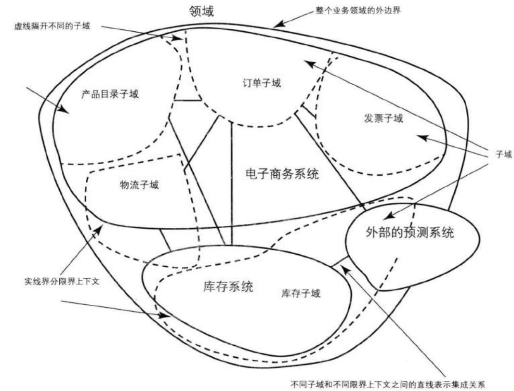


图2.1 一个含有子域和限界上下文的领域


在上面的电子商务限界上下文中，我们的确可以找出多个隐式的领域模型，即便它们并没有被很好地分离出来。事实上，这些领域模型被融合成了一个软件模型，这是不幸的。对于该零售商来说，与其自己开发，还不如从第三方购买这么一个限界上下文，因为这样所带来的问题可能会少一些。然而，不管是谁来维护这个系统，它都将承受这个大而全的电子商务模型所带来的负面影响。随着各个逻辑模型中不断加入新的功能，它们之间的复杂关系对于每一个模型都将是阻碍，特别是需要引入另外一个逻辑模型的时候。这些问题的原因通常都是由于软件的关注点没有得到清晰的划分所致。 

更不幸的是, 很多软件开发者都认为将所有东西都放在一个系统里面是一件好事。他们会想: “我对电子商务系统了如指掌, 我相信这个系统可以满足任何人的需求。” 这是具有欺骗性的, 因为不管你向系统中添加多少功能, 你都无法满足 每一个潜在客户的需求。此外，如果不通过子域对软件模型进行划分，事情将变得更加烦琐，因为系统中的各个部分都是紧密联系在一起的。 

然而，通过使用DDD战略设计工具，我们可以按照实际功能将这些交织的模型划分成逻辑上相互分离的子域，从而在一定程度上减少系统的复杂性。逻辑子域的边界在图2.1中以虚线表示。这里，我们将第三方的模型也做了清晰地划分，但这不是我们的重点，我们的重点在于说明应该存在什么样的分离模型。在不同的逻辑子域之间或者不同的物理限界上下文之间均画有连线，这表示它们之间存在集成关系。 

现在，让我们将视线从技术复杂性转向这个零售商的业务复杂性。该零售商的资金和仓库容量均有限。对于那些销量不佳的产品，该零售商不敢过量投入。显然，如果有产品没有按照计划销售出去，那么该零售商的流动资金将出现问题。因此，它只能用有限的房间来存储那些销量好的产品。 

这还没完，还有另外一个问题。如果有些产品销量好于预期，那么该零售商便没有足够的库存，此时顾客将不得不到别处购买商品。当然，有些产品生产商会自己负责产品的物流，但是这样对于零售商来说成本更大，并且会带来一些不良后果。另一种节约成本的做法是，对于本地售出产品采用自留库存，而对于偏远地区则采用生产商直接发货的方式。这样，该零售商便不至于在库存清空时捉襟见肘了。事实上，导致库存清空的原因并不是产品销售得异常好，而是该零售商没有找到一种最优的库存管理方式。如果经常发生产品不能及时送达客户的情况，那么该零售商将损失很大一部分竞争优势。 

库存问题不仅是小型零售商的问题，大型零售商同样面临这样的问题。各个零售商家都根据准确的需求来囤积产品，从而减少成本，优化销售业务。但是，在库存问题面前，小型零售商比大型零售商更加脆弱。 

一种好的做法是，根据过去的销售趋势来制定未来的库存计划。零售商可以采用一个预测引擎，根据库存和销售历史来分析产品的需求量，从而达到优化库存系统的目的。 

对于小型零售商来说，增加预测引擎可能意味着开发一个新的核心域，这并不是一个容易解决的问题，但是可以大大增加竞争优势。事实上，图2.1中的第三个限界上下文便是一个外部预测系统。订单子域和库存限界上下文向预测系统提供历史销售数据。此外，我们还需要产品目录子域来提供全局的产品条形码，这将有助于预测系统在全球范围之内对产品的销售情况进行比较。这样一来，预测系统便可以精确地计算出产品的需求量，并指导零售商制定正确的库存计划。 

如果这个新的解决方案是一个核心域，那么开发团队将从周围的逻辑子域以及集成体系中受益。因此，在该核心域的项目启动时，图2.1中已有的集成体系对于掌握项目情况来说将起到关键作用。 

子域并不是一定要做得很大，并且包含很多功能。有时，子域可以简单到只包含一套算法，这套算法可能对于业务系统来说非常重要，但是并不包含在核心域之中。在正确实施DDD的情况下，这种简单的子域可以以模块（Module, 9）的形式从核心域中分离出来，而不需要包含在笨重的子系统组件中。 

在实施DDD的时候, 我们致力于将限界上下文中领域模型所用到的每一个术语都进行限界划分。这种限界主要是语言层面上的上下文边界, 也是实现DDD的关键。 

## 牛仔的逻辑

LB: “有护栏相隔时, 我和邻居相处得很好, 护栏坏了之后, 情况就变了。” 

AJ: “对的，你需要将你的护栏造成和马一样高。” 


需要注意的是，一个限界上下文并不一定只包含在一个子域中，但这是可能的。在图2.1中，只有库存限界上下文包含在了一个子域中。显然，这表明这个电子商务系统在开发的时候并没有正确地采用DDD。在这个系统中，我们识别出了4个子域，然而还可能有更多的子域。另一方面，库存系统看起来的确符合“一个子域对应一个限界上下文”的标准。库存系统这种清晰的模型有可能是采用了DDD的结果，也有可能是种偶然，对此我们需要深入地研究。但无论如何，我们都可以使用这个库存系统来开发新的核心域。 

在图2.1中，哪种类型的限界上下文在语言表达层面上设计得更好呢？换句话说，哪种限界上下文拥有非歧义的领域特定术语？在上面的电子商务系统中，当我们谈到其中有4个子域时，我们可以非常确定地认为有些术语在这些子域中是存在冲突的。比如，“顾客”这个术语可能有多种含义。在浏览产品目录的时候，“顾客”表示一种意思；而在下单的时候，“顾客”又表示另一种意思。原因在于：当浏览产品目录时，“顾客”被放在了先前购买情况、忠诚度、可买产品、折扣和物流方式这样的上下文中。而在下单时，“顾客”的上下文包括名字、产品寄送地址、订单总价和一些付款术语。单单从这个例子我们便可以看出，在这个电子商务系统中，“顾 客”并没有一个清晰的含义。我们甚至还可以找到很多像“顾客”这样拥有多重含义的术语。在一个好的限界上下文中，每一个术语应该仅表示一种领域概念。 

然而，我们同样不能保证库存系统的模型就是完全清晰的，并且使用了完全非歧义的领域语言。即使是在关注点分离明显的限界上下文中，也会存在和上面的“顾客”相似的情况，因为库存件可能用在不同的环境下。比如，有的库存件已经被订购了，有的正在运送途中，有的正保存在仓库中，而有的正被移出仓库。已经被订购但还无法销售的产品称为延期订单件；保存在仓库中的产品称为积压件；刚被购买的产品称为即将发送件；而被损坏的库存产品称为无用件。 

在图2.1中, 我们看不出以上这些库存概念。在DDD中, 我们不能靠猜测, 而应该对每个概念都给出明确的定义, 并将这些明确的定义用在交流和建模中。领域专家对这些概念的解释有助于在不同的限界上下文中分离这些概念。 

从表面看来, 我们可以得出结论: 库存系统比电子商务系统具有更高的DDD 健康指数, 原因可能是库存系统的开发团队并没有使用一个库存件来表示所有的概念。虽然目前我们还不明确这一点, 但是我们可以肯定的是: 库存系统模型比电子商务系统模型更容易集成。 

图2.1进一步表明，一个企业的限界上下文并不是孤立存在的。即便有第三方的电子商务系统可以提供一个全方位式的模型，它也不能完全满足零售商的需求。不同子域之间的实线表示集成关系，这也表明不同的模型是需要协同工作的。集成的方式有很多种，我们将在上下文映射图(3)中学到不同的集成方案。 

以上，我们在一个高层面上对一个简单的业务领域进行了总结。我们简要地学习了一个核心域，并且了解了核心域对于DDD的重要性。接下来，我们需要深入学习核心域。 

## 将关注点放在核心域上

了解了子域和限界上下文，现在我们来看看关于领域的另一个抽象视图，如图2.2所示。该抽象视图可以表示任何一个领域，甚至有可能是你正在工作的领域。和图2.1相比，我去除了那些具体的名字，你可以根据自己的项目情况进行填补。我们会持续改进并且扩大业务目标，这将反映在不断变化的子域和子域模型中。图2.2仅仅表示某个时刻，从某个角度看的业务领域，这样的领域可能并不会驻留多久。 

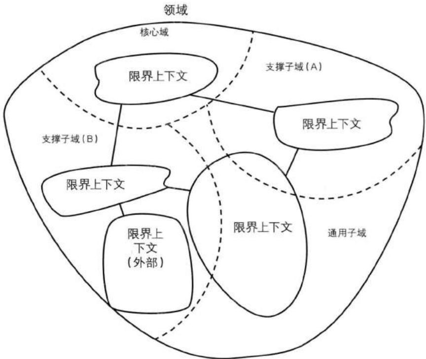


图 2.2 一个抽象的业务领域, 其中包含了子域和限界上下文


## 白板时间

- 在一栏中列出你日常工作中的子域，然后在另一栏中列出限界上下文。子域和限界上下文有相交的地方吗？如果有，这并不是什么坏事，因为这正是企业级软件的本来面目。 

- 以图2.2为模板，根据你自己的软件项目填入相应的名字，包括子域、限界上下文和集成关系。 

这困难吗? 有可能, 因为图2.2中的模板可能并没有反映出你工作领域的边界。 

- 再来一次，画出能表示你的领域、子域和限界上下文的框图。你可以参考图2.2，但是所画框图应该表示你自己的领域。 


## 第2章 领域、子域和限界上下文

当然，你不用了解所有的子域和限界上下文，特别是当你的领域非常复杂的时候。但是，你可以将那些你每天都会接触到的子域和限界上下文识别出来。不管怎样，先试试再说，不要害怕犯错误。你会在下一章的上下文映射图中学到好的实践方法，如果你想现在就跳到下一章去也是可以的。总之，不要担心现在还不完美，我们首先需要了解基本概念。 

现在, 看看图2.2上半部分的领域边界, 你会看到一个叫核心域的子域。对于核心域, 我们在前面的章节中已经讲到了, 它是整个业务领域的一部分, 也是业务成功的主要促成因素。从战略层面上讲, 企业应该在核心域上胜人一筹。我们应该给予核心域最高的优先级、最资深的领域专家和最优秀的开发团队。在实施DDD的过程中, 你将主要关注于核心域。 

图2.2中还展示了另外两种子域：支撑子域和通用子域。有时，我们会创建或者购买某个限界上下文来支撑我们的业务。如果这样的限界上下文对应着业务的某些重要方面，但却不是核心，那么它便是一个支撑子域。创建支撑子域的原因在于它们专注于业务的某个方面，否则，如果一个子域被用于整个业务系统，那么这个子域便是通用子域。我们并不能说支撑子域和通用子域是不重要的，它们是重要的，只是我们对它们的要求并不像核心域那么高。 

## 白板时间

- 为了巩固你对核心域概念的掌握, 你可以温习一遍先前所绘的框图, 看看自己能否识别出核心域。 

- 接下来，看看自己能否识别出支撑子域和通用子域。 

## 记住: 向领域专家提问!

即便在开始时你会犯下错误,但这种练习可以帮助你仔细地思考哪些是最重要的,哪些是起辅助作用的,哪些是无关紧要的。 

对于你所绘框图中的子域和限界上下文, 你需要和领域专家进行讨论。 


你不但可以从领域专家那里学到很多，同时你还能学到聆听的技巧，这也是正确实施DDD的标志。 

到此, 我们总览式地学习了DDD战略设计的基础。 

## 战略设计为什么重要

到现在，你已经学习了DDD的一些术语及其含义，但是我还没有怎么讲到为什么它们如此重要。我确实认为它们是重要的，同时，我也希望你在这一点上相信我。接下来，我会对此做出解释。让我们来看看SaaSOvation公司的项目进展情况，他们遇到麻烦啦。 

在开始采用DDD的时候, 协作项目组便开始偏离正确的轨道了, 原因在于他们并不了解战略设计, 甚至连战略设计的基础都不了解。就像多数开发者一样, 他们将关注点放在了实体(5)和值对象(6)上, 从而缺少 


一种更广阔的视野。他们将不同的核心概念杂揉在一起，导致他们将两个模型创建成了一个。不久之后，他们便感到痛苦了，如图2.3所示。他们还没有完全达到实施DDD的目标。 

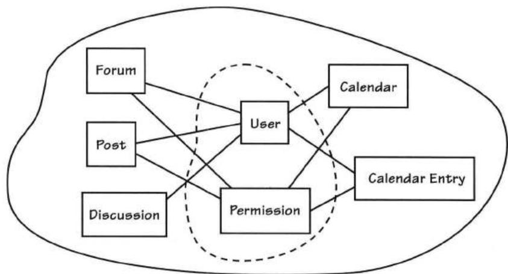


图 2.3 团队不了解基本的战略设计，这导致在协作模型中产生了不相匹配的概念。虚线之内表示问题所在。


团队中有些人指出：“是不是因为用户（User）和权限（Permission）与协作概念存在着紧密的耦合？我们应该跟踪谁做了什么事情。”这时，一个高级开发者指出：“问题不单单在于耦合，到最后，论坛、讨论、日历和日历条目都会在一定程度上与协作人员发生耦合，这是事实。问题出在我们使用的语言。”他进一步指出，问题在于论坛和讨论等概念与错误的语言概念耦合起来了。用户和权限与协作活动没有任何关系，并且与协作的通用语言也风牛马不相及。用户和权限是与身份（Identity）和访问（Access）相关的概念，即是与安全（Security）相关的。在协作上下文（Collaboration Context）中出现的每一种概念都必须与协作存在语言层面上的关联，而现在它们没有。“我们应该关注的是协作概念，比如作者（Author）和主持者（Moderator），这些才是协作活动中的正确概念和语言。” 

## 如何命名限界上下文

你注意到了这里使用的“协作上下文”一词吗？在本书中我们将以这种方式来命名限界上下文，即“模型名+上下文”。这里的“协作上下文”表明它是包含有协作领域对象的限界上下文。同时，我们还有身份与访问上下文（Identity and Access Context）和敏捷项目管理上下文（Agile Project Management Context）。 

重申一遍，SaaSOvation的开发者在一开始并没有意识到用户和权限是与协作工具无关的概念。诚然，他们的软件中是有用户的，但是我们应该将不同的用户种类区别对待，因为在不同的上下文中他们所完成的任务是不一样的。在协作工具中，我们更关注的是用户的角色，而不是他们是谁或者他们的权限如何。然而，在当前这个例子中，SaaSOvation的开发人员将协作模型与用户和权限完全揉合在一起了，如果系统对用户或权限的处理方式有所修改，这也将导致对协作模型的修改。事实上，这正是他们所遇到的问题——开发团队决定从权限管理方式切换成基于角色的访问管理方式。在决定切换时，他们才意识到这个由错误的战略建模所带来的问题。 

开发人员现在明白了，论坛和“谁可以发表帖子，还有在什么条件下可以发表”其实没有多大关系。论坛只需要知道“有作者正在发表帖子，或者有作者曾经发表过帖子”就可以了。于是团队成员学到了：决定谁可以做什么事情其实是由另外一个完全不同的模型来负责的，在协作模型中，我们只需要知道这样的问题已经被回答过就行了。在论坛中，我们关注的是：一个作者发起一次讨论。这里的“论坛”和“作者”便是通用语言中的两个清楚概念，使用该通用语言的协作模型便是协作上下文。用户和权限，或者其他相似的概念，比如角色，应该属于完全不同的上下文，并且需要和协作上下文分离。 

开发团队可以轻易地得出结论: 此时需要做的只是将用户和权限带来的紧耦合去除就可以了。毕竟, 将用户和权限分离到另外的模块并没有什么错误的地方。这可以帮助团队将 这些概念放到同一个限界上下文的另外一个子域中——一个逻辑上的安全子域。然而，最好的方式是将用户和权限放在支撑子域或者通用子域中，因为另外的核心域也可能会用到相似的功能。 

因此，这种周全的考虑可以帮助他们避免更多潜在的问题。他们先前的做法还很有可能导致大泥球（Big Ball of Mud, 3）架构。这里的问题并不仅仅是由于用户和权限没有得到适当的模块化。虽然模块化是一种重要的DDD建模工具，但是它并没有解决语言上的问题。 

让这个高级开发者担心的是，项目当前的情形很有可能导致一种散漫的思维模式。当团队面对协作模型之外的一套概念时，核心域将变得越来越模糊。结果，他们得到的只是一个并不能反映协作通用语言的隐式模型。团队真正需要理解的是他们正在开发的领域、子域和限界上下文，他们需要战略建模的思维模式。 

## 别啊, 怎么又是“设计”这个词!

你可以认为“设计”在敏捷中是个丑陋的词汇，但是这种看法却不适用于DDD。在敏捷中使用DDD是很自然的一种做法。我们需要将设计敏捷化，而设计不见得就一定是笨重的。 

好了, 到这里, SaaSOvation的团队成员学到了不少。他们展开了很多研讨, 最后知道了处理领域和子域的重要性, 我们将在后续章节中学到他们是如何做到这一点的。 

## 向DDD社区看齐

本书的SaaOvation例子提供了3个限界上下文。这些限界上下文可能和你自己领域存在不同。这些例子展示的是非常典型的建模场景。然而，并不是所有人都同意将用户和权限从核心域中分离。可能在有些时候将它们放在核心域里面是有道理的。和通常一样，这只是一个团队自己的选择。但是，据我自己的经验，这是那些DDD新手们经常会遇到的问题之一，结果他们把实现搞得一团糟。另一种常见的错误是，将协作模型和敏捷项目管理模型混为一谈。这些只是常见问题中的一小部分，另外的建模错误我们将在其他章节中讲到。 

这些常见的建模错误是由于团队缺乏对通用语言和限界上下文的理解造成的。因此，即便你并不同意SaaSOvation例子中那些特殊问题，这些问题及其解决 方法对于所有的DDD项目都是适用的，因为他们都关注于某个特定限界上下文中的通用语言。 

我的目标是通过最简单的例子讲解实现DDD的基本原则。如果这些例子妨碍到了我的教授和读者的学习，那我是负担不起的。如果我讲到：身份及访问管理、协作和敏捷项目管理都有自己的语言，那么读者便可以从这些例子的着重点中获益。每个团队都可以自己选择如何去发现适合自己领域的语言，并传达领域专家的思维模型。这里我们假定，SaaSOvation开发团队最终得出的结论是正确的。 

关于子域和限界上下文，我所有的指导建议都和DDD社区紧密地保持一致。其他的DDD领导者可能有不同的关注点。然而，我所讲的是适用于任何团队的DDD基础。澄清对于DDD的一些模糊认识是我的主要目标，而你的目标则是将本书中的DDD指导建议切实地应用在自己的项目中。 

## 现实世界中领域和子域

领域中还同时存在问题空间 (problem space) 和解决方案空间 (solution space)。在问题空间中, 我们思考的是业务所面临的挑战, 而在解决方案空间中, 我们思考如何实现软件以解决这些业务挑战。以下是如何将这两者应用到我们已经学过的知识中: 

- 问题空间是领域的一部分，对问题空间的开发将产生一个新的核心域。对问题空间的评估应该同时考虑已有子域和额外所需子域。因此，问题空间是核心域和其他子域的组合。问题空间中的子域通常随着项目的不同而不同，他们各自关注于当前的业务问题，这使得子域对于问题空间的评估非常有用。子域允许我们快速地浏览领域中的各个方面，这些方面对于解决特定的问题是必要的。 

- 解决方案空间包括一个或多个限界上下文，即一组特定的软件模型。这是因为限界上下文即是一个特定的解决方案，它通过软件的方式来实现解决方案。 

通常，我们希望将子域一对一地对应到限界上下文。这种做法显式地将领域模型分离到不同的业务板块中，并将问题空间和解决方案空间融合在一起。在实践中，这种做法并不总是可能的，但通过新的努力，我们是可以做到这一点的。让我们考虑一个遗留系统，它有可能是个大泥球，其中子域和限界上下文存在相交的地方，就像图2.1中所示一样。在一个大型的企业中，通过对问题空间的评估，我们可以减少错误，进而降低成本。我们可以在概念上使用两个或者多个子域来分解限界上下文，或者将多个限界上下文包含在同一个子域中。为了澄清问题空间和解决方案空间的区别，让我们来看一个例子。 

让我们来看看一个大型的ERP系统。严格地讲，我们可以将一个ERP系统想象成一个单一的限界上下文。然而，由于ERP系统提供许多模块化的业务服务，将不同的模块看成不同的子域是有好处的。比如，我们可以将库存模块和采购模块拆分成不同的逻辑子域。我们将它们分别命名为库存子域（Inventory Subdomain）和采购子域（Purchasing Subdomain），在下文中，我们将讲到为什么这种划分是有用的。 

图2.4表示一个ERP系统的领域，也是图2.2中所示模板的一个实例。该企业计划开发一个特定的领域模型来降低成本，该模型可以为采购人员提供决策工具。从多年人工处理过程中积累起来的算法将通过软件实现自动化。这个新的核心域可以大大地提高该企业的竞争优势。为了能准确地管理库存，可以借助图2.1中的预测系统。 

在我们实施某个解决方案之前, 我们需要对问题空间和解决方案空间进行评估。为了保证你的项目朝着正确的方向行进, 你需要先回答以下问题: 

- 这个战略核心域的名字是什么,它的目标是什么? 

- 这个战略核心域中包含哪些概念？ 

- 这个核心域的支撑子域和通用子域是什么？ 

- 如何安排项目人员？ 

- 你能组建出一支合适的团队吗？ 

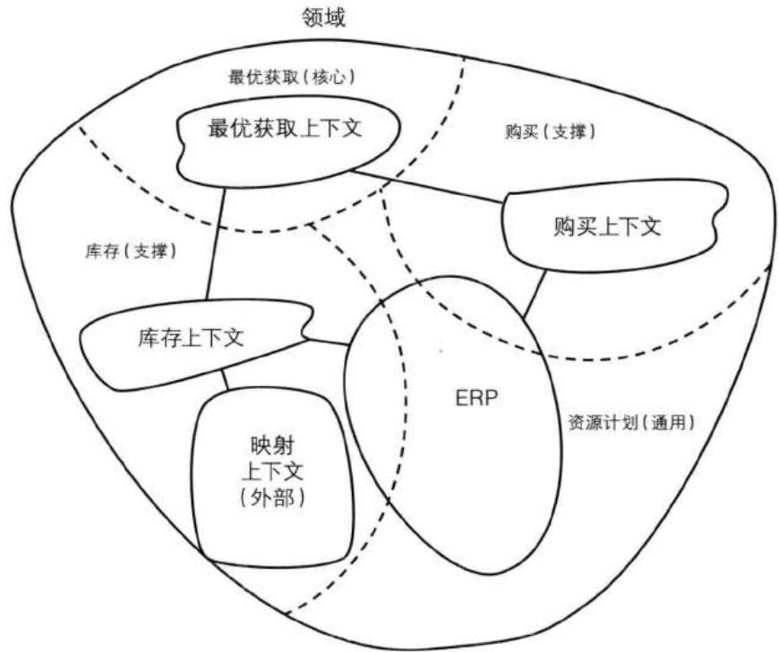


图2.4 与购买和库存相关的核心域以及其他子域。该图只显示了特定于问题空间的子域，并不是整个领域。


如果你不了解核心域的目标及其所需的支撑子域，那么你是不能从核心域中得到好处的，同时你也无法避免由此带来的陷阱。因此，我们需要全面地对问题空间进行评估，并确保所有的利益相关方在核心域的目标上都达成一致。 

## 白板时间

看看你白板上的内容，然后想想：你的问题空间是什么？再回想一下：问题空间由战略核心域及其支撑子域组成。 

在理解了问题空间之后, 我们来看看解决方案空间。对于问题空间的评估也是有益于理解解决方案空间的。解决方案空间在很大程度上受到现有系统和技术的影响。这里, 我们应该根据分离的限界上下文仔细地思考, 考虑以下问题: 

- 有哪些软件资产是已经存在的, 它们可以重用吗? 

- 哪些资产是需要创建的, 或者从别处获得? 

- 这些资产是如何集成在一起的？ 

- 还需要什么样的集成？ 

- 假设已经有了现有资产和那些需要被创建的资产,我们还需要做些什么? 

- 核心域和那些支撑项目的成功几率如何？会不会出现由于其中一个失败而导致整个项目失败的可能？ 

- 在哪些地方我们使用了完全不同的术语？ 

- 限界上下文之间在哪些地方存在概念重叠？ 

- 这些重叠的概念在不同的限界上下文之间是如何映射和翻译的？ 

- 哪些限界上下文包含了核心域中的概念，其中使用了哪些[Evans]中的战术模式？ 

请记住，开发核心域的解决方案是一种关键性业务投入。 

在图2.4中，用于捕获决策工具和算法的采购模型表示了核心域的解决方案。该领域模型将在最优获取上下文 (Optimal Acquisitions Context) 中实现，该上下文与最优获取核心域 (Optimal Acquisitions Core Domain) 存在着一对一的关系。由于只对应于一个子域，同时又拥有优秀的领域模型，这个最优获取上下文将会是业务领域中最好的限界上下文之一。 

除了最优获取上下文，还有采购上下文 (Purchasing Context)。该上下文用于辅助最优获取上下文，以改进采购过程中的技术细节。这些改进并不显露最优采购上下文中的特定信息，只是简化了最优采购上下文和ERP的交互，也即是一个用于操作ERP接口的便捷模型。这个新的采购上下文和先前的ERP采购模块同属于采购（支撑）子域。 

整个ERP采购模块是一个通用子域，你甚至可以购买另外的采购系统来替换该子域，只要它满足你的业务需求即可。然而，在采购子域中，我们将该采购模块与采购上下文共同使用，这使得该模块多少有些支撑子域的意味。 

## 你所不能改变的

在一个典型的不健康的企业系统里，你通常会面临如图2.1和图2.4所示的情形。在设计欠佳的软件里，子域和限界上下文之间很难存在一对一的映射关系。这种劣质软件的大量存在已经成为事实，并且是你所不能改变的事实。你只能盼着在项目中通过合适的手段实施DDD，但最终你都需要和那些“不健康”的领域进行集成。因此，当你在分析某个“不健康”限界上下文中的多个隐式模型时，请好好温习一下本章前面所教给你的那些技能。 

在图2.4中, 最优获取上下文还需要和库存上下文 (Inventory Context) 进行交互。库存系统用于管理仓库中的物件, 它使用ERP的库存模块, 该模块位于库存 (支撑) 子域中。为了给货递合同方提供方便, 库存上下文还采用了第三方的地图服务。对于库存上下文而言, 地图服务并没有什么特别之处, 你可以选择多种地图服务。地图服务本身只是一个通用子域, 它被支撑子域所消费。 

请记住这些从最优获取上下文的角度所看到的关键点。虽然在问题空间中地图服务是库存子域的一部分，但是在解决方案空间中，地图服务并不属于库存上下文。在解决方案空间中，即便地图服务由基于组件的API提供，它依然属于另外一个限界上下文。库存管理和地图服务所使用的通用语言是相互排斥的，这意味着它们属于两个不同的限界上下文。当库存上下文需要使用外部的地图上下文（Mapping Context）时，它们之间的数据交换需要一定程度的翻译才能完成。 

另一方面，从地图服务提供商的角度来看，地图子域便是他们的核心域了。他们拥有自己的领域和业务模型，同时他们需要不断改进自己的领域模型以保持竞争力。如果你是某个地图服务提供商的CEO，你需要采取不同方法留住自己的客户。然而，对于库存系统来说，地图服务始终还是个通用子域，你完全可以转向另外的地图服务提供商。 

## 白板时间

在你自己的解决方案空间中, 限界上下文是什么? 此时你可以参考先前所绘的框图。随着我们对限界上下文讲解的深入, 你可能感到有些惊讶了。因此, 你应该为有可能的改进做好准备, 毕竟, 我们采用的是敏捷方法。 

为了平衡各个知识点, 接下来我们将讲到在解决方案空间中, 限界上下文作为一种建模工具的重要性。在上下文映射图 (3) 中, 我们将主要讲解如何通过集成限界上下文的方式来完成不同通用语言间的映射。 

## 理解限界上下文

不要忘了, 限界上下文是一个显式的边界, 领域模型便存在于这个边界之内。领域模型把通用语言表达成软件模型。创建边界的原因在于, 每一个模型概念, 包括它的属性和操作, 在边界之内都具有特殊的含义。如果你是建模团队中的一员, 你便应该知道这些概念的确切含义。 

## 限界上下文是显式的. 充满语义的

限界上下文是一个显式边界，领域模型便存在于边界之内。在边界内，通用语言中的所有术语和词组都有特定的含义，而模型需要准确地反映通用语言。 

在很多情况下, 在不同模型中存在名字相同或相近的对象, 但是它们的意思却不同。当模型被一个显式的边界所包围时, 其中每个概念的含义便是确定的了。因此, 限界上下文主要是一个语义上的边界, 我们应该通过这一点来衡量对一个限界上下文的使用正确与否。 

有些项目试图创建一个“大而全”的软件模型，其中每个概念在全局范围之内只有一种定义。这是一个陷阱。首先，要使所有人都对某个概念的定义达成一致几乎不可能。有些项目太庞大，太复杂，以致于你根本无法将所有的利益相关方聚集到一起，更不用提达成一致了。即便是那些规模相对较小的公司，要维持一个全局性的，并且经得住时间考验的概念定义也是困难的。因此，最好的方法是去正视这种不同，然后使用限界上下文对领域模型进行分离。 

限界上下文并不旨在创建单一的项目资产，它并不是一个单独的组件、文档、或者框图 $^{1}$ 。因此，它并不一个是JAR或者DLL，但是这些可以用来部署限界上下文，我们会在后面讲到。 

让我们来看看一个账户 (Account) 模型在银行上下文 (Banking Context) 和文学上下文 (Literary Context) 中的不同, 如表2.1所示。 


表2.1 账户的不同含义


<table><tr><td>限界上下文</td><td>含义</td><td>例子</td></tr><tr><td>银行上下文</td><td>账户表示一个客户在银行的存款状态,并记录每次交易信息。</td><td>支票账户和储蓄账户</td></tr><tr><td>文学上下文</td><td>账户表示用文字记录的在一段时间之内发生的一系列事件。</td><td>Amazon.com售出图书《Into Thin Air: A Personal Account of the Mt. Everest Disaster》</td></tr></table>

在图2.5中，光凭名字我们根本无法区分两个账户的意思。只有通过它们所在的限界上下文我们才能看出它们之间的区别。 

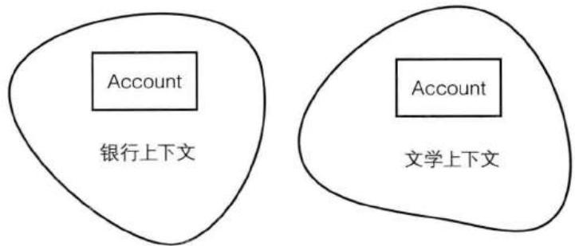


图2.5 不同限界上下文中的Account对象具有完全不同的含义。


这两个上限界上下文可能并不属于同一个领域，这里我只是想说明：上下文才是王道。 

## 上下文才是王道

上下文才是王道，特别是在实施DDD的时候。 

在金融领域，我们经常谈到证券(security)。证券交易管理委员会(Securities and Exchange Commission, SEC)限制证券只能和股票(equities)一起使用。现在让我们考虑这种情况：期权合同(futures contract)作为一种商品，它并不被SEC所管理。然而，有些金融公司却将期权当作一种证券，并且用标准类型(Standard Type, 6)Futures来表示。 

这是表示期权的最好方式吗？这取决于它所处的领域。有人认为期权显然是一种证券，另有人则持反面意见。上下文同时也是具有文化属性的。对于一个经营期权的公司，在通用语言中以证券来表示期权在文化上是合理的。 

在通常情况下, 我们所面对的都是一些区别甚小的概念定义。原因在于: 在一个上下文中, 团队通常根据通用语言来命名某个概念。我们并不会随意地命名一个概念以刻意地保持与其他上下文的不同。比如两个银行上下文, 一个用于支票账户, 另一个用于储蓄账户 $^{2}$ 。在支票上下文 (Checking Context) 中, 我们不必使用支票账户 (Checking Account); 在储蓄上下文 (Saving Context) 中我们也不必使用储蓄账户 (Saving Account)。两个概念都可以使用账户 (Account) 来表示, 因为限界上下文已经对此做了区分。当然, 我们并没有规定不能使用更具体的名字, 这只是团队自己的选择而已。 

当需要集成时, 我们必须在不同的限界上下文之间进行概念映射。在DDD中, 这可能是复杂的, 因此我们应该特别留意。在上下文边界之外, 我们通常不会使用该上下文之内的对象实例, 但是不同上下文中彼此关联的对象可能共享一些状态。 

再看另一个例子, 该例中同一个领域的不同限界上下文使用了相同的概念名。考虑一个图书出版机构, 它需要处理图书生命周期的不同阶段。粗略地讲, 我们可以认为这些不同的阶段对应于以下不同的上下文环境: 

- 概念设计, 计划出书 

- 联系作者, 签订合同 

- 管理图书的编辑过程 

- 设计图书布局，包括插图 

- 将图书翻译成其他语言 

- 出版纸质版或电子版图书 

- 市场营销 

- 将图书卖给销售商或直接卖给读者 

- 将图书发送给销售商或读者 

在以上所有阶段中, 我们可以用一个单一的概念对图书建模吗? 显然不行。在每个阶段中, “图书”都有不同的定义。一本书只有在和作者签订了合同之后才能拥有书名, 而书名可能在编辑过程进行修改。在编辑过程中, 图书包含了一系列的稿件, 其中包括注释和校正等, 之后会有一份最终稿件。页面布局由专门的图形设计师完成。图书印刷方使用页面布局和封面板式印制图书。市场营销员不需要编辑稿件或图书印制成品, 他们可能只需要图书的简介即可。对于图书的售后物流, 我们需要的是图书的标识码、物流目的地、数目、尺寸和重量等。 

想象一下, 如果我们使用一个单一模型来处理所有这些阶段会发生什么? 概念混淆、意见分歧和争论是不可避免的, 我们所交付的软件也没有多大价值。即便有时我们可能会得到一个正确的公共模型, 但这种模型并不具有持久性。 

为了解决这个问题, 我们应该为每个阶段创建各自的限界上下文。在每个限界上下文中, 都存在某种类型的图书 (Book)。在几乎所有的上下文中, 不同类型的图书对象将共享一个身份标识 (identity), 这个标识可能是在概念设计阶段创建的。 

然而，不同上下文中的图书模型却是不同的。当某个限界上下文的团队说到图书时，该“图书”正好能表示该上下文所需要的意思。如此这般，我们根据不同的需求很自然地创建了不同类型的图书，但这并不表示这种建模过程就是可以轻易达到的。不管如何，在使用显式限界上下文的情况下，我们可以定期地、增量式的交付软件，同时所交付的软件又能满足特定的业务需求。 

这里, 让我们快速浏览一下SaaSOvation的协作团队是如何解决图2.3中的建模问题的。 

前面已经提到，协作上下文的领域专家并没有从用户和权限的角度去描述协作工具的使用者，而是以他们所扮演的角色进行描述，比如作者、拥有者、参与者和主持者等。个人的联系方式可能出现在该上下文中，但我们并不需要所有的联系信息。另一方面，只有在身份与访问上下文中我们才会谈及到用户。在该上下文中，用户对象包含了某人的用户名和一些详细信息，其中便包含了该用户的联系方式。 

然而，我们也不会凭空创建一个Author对象，因为每一个协作者(collaborator)都需要事先进行资格认证才能使用协作软件。在身份与访问上下文中，我们将验证拥有某种角色的用户是否存在，验证信息将随着请求传给身份与访问上下文。要创建一个协作对象，比如一个Moderator，我们将使用对应用户的一部分属性，另外还需要一个角色名。如何从另一个限界上下文中获取对象状态（本书后续章节将对此做详细讲解）并不重要，重要的是，两个不同的概念既有相似之处，又有不同之处，不同之处由限界上下文决定。在图2.6中，一个限界上下文中的User和Role信息被另一个限界上下文用来创建Moderator对象。 

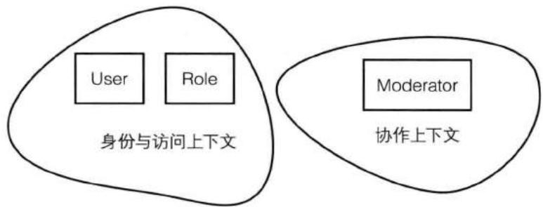


图2.6 协作上下文中的Moderator对象是基于身份与访问上下文中的User和Role对象的。


## 白板时间

- 在你自己的领域中, 看看你能否在不同的限界上下文中识别出那些区别微小的概念。 

- 看看这些概念是不是得到了正确的分离，或者你只是简单地将相应代码从一个地方复制到另一个地方。 

通常情况下, 你是可以识别出那些概念分离正确的情况的, 因为有些相似的对象拥有不同的属性和行为, 此时我们可以认为上下文边界的划分是合理的。然而, 如果你在不同的限界上下文中看到了完全相同的对象, 这通常意味着你的模型是错误的, 除非这些限界上下文使用了共享内核 (Shared Kernel, 3)。 

## 限界上下文不仅仅只包含模型

一个限界上下文并不是只包含领域模型。诚然，模型是限界上下文的主要“公民”。但是，限界上下文并不只局限于容纳模型，它通常标定了一个系统、一个应用程序或者一种业务服务 $^{3}$ 。有时，限界上下文所包含的内容可能比较少，比如，一个通用子域便可以只包含领域模型。 

当模型驱动着数据库Schema的设计时，此时的数据库Schema也应该位于该模型所处的上下文边界之内。这是因为数据库Schema是由建模团队设计、开发并维护的。这也意味着数据库中表和列的名字应该和模型的名字保持一致。比如，对于模型中包含的BacklogItem类，它拥有值对象属性backlogItemId和businessPriority: 

```java
public class BacklogItem extends Entity {
    ...
    private BacklogItemId backlogItemId;
    private BusinessPriority businessPriority;
    ...
} 
```

在数据库中对应的表定义为: 

```sql
CREATE TABLE `tbl_backlog_item` (
    ...
    `backlog_item_id_id` varchar(36) NOT NULL,
    `business_priority_ratings_benefit` int NOT NULL,
    `business_priority_ratings_cost` int NOT NULL,
    `business_priority_ratings_penalty` int NOT NULL,
    `business_priority_ratings_risk` int NOT NULL,
    ...
) ENGINE=InnoDB; 
```

另一方面，如果数据库Schema已经存在，或者另有一个专门的数据建模团队要求有别于模型的数据库Schema设计，此时的Schema便不能和模型位于同一个限界上下文中了。 

如果用户界面 (User Interface, 14) 被用于渲染模型，并且驱动着模型的行为设计时，同样，该用户界面也应该属于模型所在的上下文边界之内。但是，这并不表示我们应该在用户界面中对领域进行建模，因为这样将导致贫血领域对象。我们应该拒绝使用智能UI反模式 (Smart UI Anti-Pattern) [Evans]，或者任何试图将领域概念带到领域模型之外的举措。 

通常情况下, 一个系统/应用程序的使用者并不只是人, 还可能是另外的计算机系统。系统中有可能存在诸如Web服务 (Web services) 之类的组件。我们也可以使用REST资源来与模型交互, 此时的REST资源即被称为开放主机服务 (Open Host Service, 3, 13)。或者, 我们可以使用SOAP或消息服务端点。在以上所有情况中, 那些面向服务的组件都应该位于上下文边界之内。 

用户界面和面向服务端点都会将操作委派给应用服务（14）。应用服务包含了不同类型的服务，比如安全和事务管理等。对于模型来说，应用服务扮演的是一种门面模式Façade [Gamma et al.]。同时，应用服务还具有任务管理功能，它将来自用例流（Use Case Flow）的请求转换成领域逻辑的执行流。应用服务也是位于上下文边界之内的。 

## 更多关于架构和应用程序的知识

请参考架构(4)以了解不同的DDD架构风格。另外,应用服务将在应用程序(14)中做详细讲解。这两个章节都包含了有用的架构框图和代码示例。 

限界上下文主要用来封装通用语言和领域对象，但同时它也包含了那些为领域模型提供交互手段和辅助功能的内容。需要注意的是，对于架构中的每个组件，我们都应该将其放在适当的地方。 

## 白板时间

- 看看白板上的每一个限界上下文, 你能想到有哪些非领域模型的组件可以放在限界上下文之内吗? 

- 如果存在用户界面和应用服务，请确保它们是位于上下文边界之内的（要表示不同的组件，可以参考图2.8、图2.9和图2.10）。 

- 如果你的数据库Schema，或者其他持久化存储方案，是根据模型来设计的，那么请确保它们也是位于上下文边界之内的（要表示数据库Schema，可以参考图2.8、图2.9和图2.10）。 

## 限界上下文的大小

限界上下文中可以包含多少领域模型中的基础部件呢，比如模块（9）、聚合（10）、领域事件（8）和领域服务（7）等？这好像是在问“一个字符串应该有多长？”一样。限界上下文应该足够大，以能够表达它所对应的整套通用语言。 

核心领域之外的概念不应该包含在限界上下文中。如果一个概念不属于你的通用语言，那么一开始你就不应该将其引入到模型中。此外，如果有外部概念“偷偷潜入”了你的限界上下文，你需要将其清除，它们可能属于另外的支撑或者通用子域，或者根本就不属于某个模型。 

请注意, 不要将本应该属于核心域的概念给清除掉了。你的模型应该能够完全地展现上下文中的通用语言, 而不能遗漏任何重要的概念。此时, 我们需要做出正确的判断, 你可以借助诸如上下文映射图 (3) 这样的工具。 

在电影《莫扎特传》中有这么一个场景：奥地利皇帝约瑟夫二世告诉莫扎特，说他刚才演奏的音乐作品很不错，就是音符太多了。莫扎特巧妙地回答道：“我需要的音符正好这么多，一个不多，一个不少。”这种回答也适用于我们现在所讲的限界上下文。限界上下文所包含的领域模型概念应该恰如其分，不多也不少。 

要做到这一点并不是什么易事，莫扎特可以像给朋友写信一样创作交响乐，而要创建一个恰到好处的限界上下文就不是这么简单了。任何时候，我们都有可能错失改进领域模型的机会。在每个迭代中，我们都应该对先前的假设提出挑战，这使得我们向模型中添加或删除一些概念，或者改变概念的行为和协作方式等。但是主要的问题是：我们总是面临这样的挑战。在使用DDD原则时，我们会认真地思考应该添加哪些概念，又应该删除哪些概念。使用限界上下文和上下文映射图这样的工具可以帮助我们分析出哪些概念的确应该属于核心域。我们并不随意地采用非DDD的分离原则。 

## 领域模型的优美旋律

如果我们的模型是音乐,那么它所表现的则是完整性、纯洁性、力量、优雅和美。 

如果对限界上下文的限制过于严格，那么我们可能丢失一些上下文概念。相反，如果向模型中添加过多的概念，我们可能搞不清楚哪些概念是重要的。那么我们的目标是什么呢？如果我们的模型是音乐，那么它应该表现出的是完整性、纯洁性、力量、优雅和美。其中的“音符”——模块、聚合、事件和服务——的数量正好是设计所要求的那么多。模型的“听众”不会问及到像“为什么中间会有一些奇怪的音符？”这样的问题。同时，它们也不会因为丢失了某些“音符”而感到不解。 

那么，哪些因素会导致我们创建大小不正确的限界上下文呢？我们可能错误地采用架构来指导设计开发，而不是通用语言。一些平台、框架或者基础设施通常是用来打包和部署组件的，它们可能影响我们对限界上下文的设计，此时我们会从技术层面而不是语义边界来考虑问题。 

另一个可能的陷阱是：根据开发任务的分配来拆分限界上下文。技术带头人和项目经理可能会想，小规模任务对于开发者来说将更加容易完成。这可能是有道理的，但是，为了分配任务而拆分限界上下文是一种错误的上下文建模方式。事实上，我们没有必要为了管理技术资源而创建一些假 (fake) 的上下文边界。 

这里有一个重要的问题: 领域专家所采用的语言是如何划定上下文边界的? 

如果创建限界上下文只是为了架构组件或开发者资源这样的考虑，那么此时的通用语言将变得四分五裂，其表达力也会丧失殆尽。因此，我们应该考虑领域专家所讲的通用语言，将核心域中的概念自然地组织成单一的限界上下文。这样一来，你便可以自然地识别出那些单一的、内聚的模型组件。你应该将这些组件放在限界上下文之内。 

有时, 我们可以使用模块来避免创建一些微小的限界上下文。通过分析分散在不同限界上下文中的服务, 你可能会发现, 模块可以将多个限界上下文减少到一个。模块也可以用来拆分开发者的任务职责, 因此我们可以使用更加战术化的手段来管理团队的任务分配。 

## 白板时间

- 为你当前的模型绘制一个限界上下文。 

即便你还没有一个显式的模型, 你也应该从通用语言的角度考虑问题。 

- 在这个限界上下文内，填上主要的领域概念的名字。看看你能否发现那些被遗漏的概念，再看看哪些概念不应该出现在上下文中。对于这两个问题，你会怎么解决？ 

## 采用语言驱动来实施DDD时, 你得小心

这里的底线是: 如果你没有采用语言驱动, 那么你就不算在和领域专家一起工作来创建限界上下文。认真考虑一下限界上下文的大小, 不要急于将其小型化。 

## 与技术组件保持一致

将限界上下文想成是技术组件并无大碍，只是我们需要记住：技术组件并不能定义限界上下文。让我们来看看一些构成和部署限界上下文的常见做法。 

当使用IDE时，比如Eclipse或者IntelliJ IDEA，一个限界上下文通常就是一个工程项目。当使用Visual Studio和.NET时，在同一个解决方案中将用户界面、应用服务和领域对象分离在不同的子项目中是合理的。项目的源代码可以只包含领域模型，也可以包含一些周边的层(4)或六边形(4)区域等。对于项目的划分是很灵活的。在使用Java时，顶层包名通常表示限界上下文中顶层模块的名字。对于上文中提到的例子，我们可以采用以下方式来定义包名： 

com.mycompany.optimalpurchasing 

限界上下文的源代码结构可以根据架构职责做进一步分解。下面是一些二级包名： 

com.mycompany.optimalpurchasing.presentation 

com.mycompany.optimalpurchasing.application 

## 第2章 领域、子域和限界上下文

com.mycompany.optimalpurchasing.domain.model 

com.mycompany.optimalpurchasing.infrastructure 

请注意, 即便存在这种模块化的拆分, 团队依然应该只工作在一个限界上下文中。 

## 一个团队，一个限界上下文

将一个团队分配给一个限界上下文并不会限制团队的组织灵活性。这并不是说团队不能按需安排，也不是说一个团队中的成员不能到其他团队工作。一个公司应该按照实际需要做出人事安排，这意味着我们需要组建一支组织良好的团队，在该团队中，领域专家和开发者只关注于一个限界上下文的通用语言。如果你将多个团队分配给同一个限界上下文，那么每个团队都会使用各自的通用语言，这显然是不好的。 

两个团队可能会合作设计一个共享内核，而共享内核并不是一个典型的限界上下文。这种上下文映射模式使两个团队产生紧密的联系，进而需要两个团队对模型的改变进行不断交流。这种建模方法并不常见，并且我们应该尽量避免这种情况。 

在使用Java时, 我们可能从技术层面上将一个限界上下文放在一个JAR文件中, 包括WAR或EAR文件。这种做法可能受到了模块化的影响。松耦合的领域模型应该放在不同的JAR文件中, 这样我们可以按照版本号对领域模型进行单独部署。对于大型的模型来说, 这种做法是非常有用的。将单个大模型分成多个JAR文件也有助于版本管理, 比如使用OSGi或者Java 8的Jigsaw模块。因此, 不同的高层模块, 包括它们的版本和依赖都可以通过捆包/模块 (bundles/modules) 进行管理。对于上文中的例子, 至少存在4个以DDD的二级模块表示的捆包/模块。 

对于Windows本地应用程序的限界上下文来说，比如.NET平台，部署可以通过不同的DLL文件完成。这里我们可以将DLL文件等效于上述的JAR文件，对模型的分离也可以采用相似的方式。所有的公共语言运行时（Common Language Runtime, CLR）模块都是通过程序集（Assembly）进行管理的。程序集的版本号和其所依赖程序集的版本号都记录在程序集清单（Assembly Manifest）中。请参考[MSDN Assemblies]。 

## 示例上下文

我们的SaaSOvation团队所选择的3个限界上下文最终将与各自所对应的子域形成一对一的关系。然而在项目开始时，他们并没有做到这一点。在汲取了经验教训之后，最终的结果如图2.7所示。 

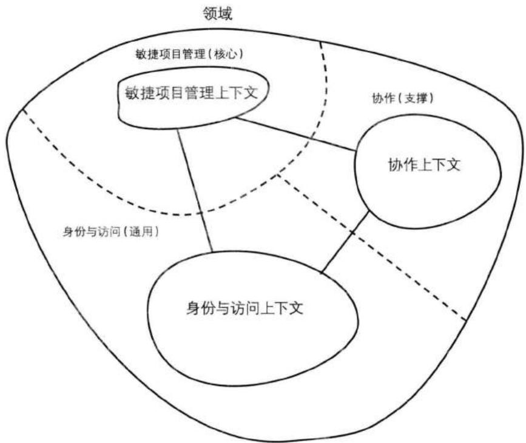


图 2.7 一个拥有清晰子域的示例限界上下文


接下来我们将讲到，这3个模型是如何形成一个实际的、现代的企业级解决方案的。在实际应用中，一个项目总会有多个限界上下文，它们之间的集成对于当今的企业来说是一个重要的环节。除了限界上下文和子域，我们还需要掌握上下文映射图来解决集成(13)问题。 

让我们来看看示例DDD项目中的这3个限界上下文 $^{5}$ 。他们分别是协作上下文、身份与访问上下文和敏捷项目管理上下文。 

## 协作上下文

在当今这个经济急步向前的时代下，业务协作工具对于创建一个协作式的工作环境来说是非常重要的。任何有助于增加工作效率、增进知识传递、促进观点共享的方法都是企业成功的促成因素。企业总想寻找最好的在线协作软件， 不管是用于大众社交的协作软件，还是目标用户相对较少的专业化协作工具，而SaaSOvation也希望从这个市场中分到一杯羹。 

负责设计和实现协作上下文的核心团队需要在第一次软件发布中包括以下功能：论坛、共享日历、博客、即时消息、wiki、留言板、文档管理、通知与提醒、活动跟踪和RSS订阅。虽然核心团队要开发的功能很多，但是每一个协作工具都可以单独使用。但无论如何，这些工具都属于同一个限界上下文，因为它们都是协作的一部分。遗憾的是，本书不能向读者讲解所有的协作工具，我们将选择性地讲解部分协作工具的领域模型，即论坛和共享日历，如图2.8所示。 

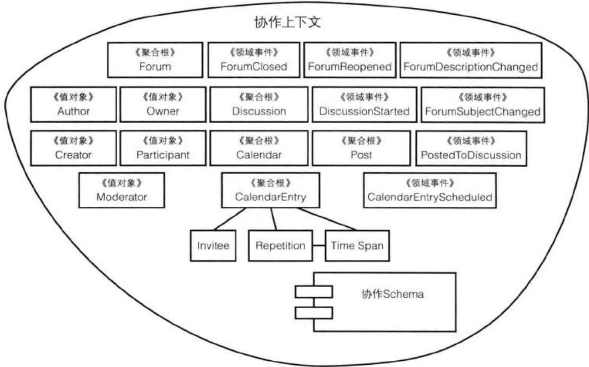


图2.8 协作上下文。通用语言决定哪些组件应该位于边界之内。有些模型未予显示，用户界面（UI）和应用层组件也未予显示。


在项目启动时, 协作项目组成员只采用了战术DDD, 当然他们正在学习更好的DDD实践。事实上, 他们所使用的DDD只能算是DDD-Lite, 即使用战术模式来解决技术上的问题。诚然, 他们正试图在协作项目中使用通用语言, 但是他们不知道的是: 此时施加给模型的 限制太大，而他们还不能突破这些限制。因此，他们错误地将安全和权限相关的逻辑引入了协作模型中。而现在，团队成员已经意识到，他们并不像以前那样期待着将安全和权限逻辑加入模型中了。 


早些时候，他们并没有过多地去考虑这种危险。然而，在没有对安全管理进行集中化的情况下，发生这种情况是预料之中的。团队成员们将两个模型混合成了一个，不久之后他们便尝到了苦头。在实现代码中，他们在核心业务逻辑中去检查客户的权限： 

```java
public class Forum extends Entity {

    public Discussion startDiscussion(
    String aUsername, String aSubject) {
    if (this.isClosed()) {
    throw new IllegalStateException("Forum is closed.");
    }

    User user = userRepository.userFor(this.tenantId(), aUsername);

    if (!user.hasPermissionTo(Permission.Forum.StartDiscussion)) {
    throw new IllegalStateException(
    "User may not start forum discussion.");
    }

    String authorUser = user.username();
    String authorName = user.person().name().asFormattedName();
    String authorEmailAddress = user.person().emailAddress();

    Discussion discussion = new Discussion(
    this.tenant(), this.forumId(),
    DomainRegistry.discussionRepository().nextIdentity(),
    authorUser, authorName, authorEmailAddress,
    aSubject);

    return discussion;
    }
    ...
} 
```

## 我刚才看到火车残骸（Train Wreck）了吗？

有些开发者将同一行中的多个方法调用链称为“火车残骸”，比如user.person().name().asFormattedName();而另外有人则认为这种方式具有很好的代码表现力。我并不站在他们的任何一边，这里我的关注点在混乱的领域模型上，“火车残骸”则是另一个话题了。 

以上代码所展现的确实是一种不好的设计。我们不应该在这里引用User，更不用说资源库（Repository, 12）了，甚至连Permission都不应该在此出现。原因在于，团队成员错误地将这些概念设计成了协作模型的一部分。另外，这种错误的设计导致他们忽略了本应该存在的建模概念——Author。他们并没有把有关联的属性放在一个值对象中，而是使用一些分离的数据元素来解决问题。此时，团队成员所思考的并不是协作模型，而是一个与安全相关的模型。 

这并不是一个孤立的现象, 每一个协作对象都存在相似的问题。这时, “大泥球”的风险似乎不可避免. 还好, 团队成员决定修改代码了。此外, 团队成员还希望从权限管理转向基于角色访问的安全管理方式, 他们应该怎么做呢? 

作为敏捷开发方法的使用者和敏捷项目管理工具的开发者, 团队成员并不害怕及时地对代码进行重构。现在的问题是: 他们应该采用哪种DDD模式来解决目前所面临的问题? 

团队中有人花额外的时间详细了解了[Evans]中的战术模式，结论是，这些模式并不是他们需要的答案。他们尝试过照着那些模式创建由实体和值对象组成的聚合，同时也使用了资源库和领域服务（Domain Service, 7）。然而，他们缺少的是另外一些重要的东西，这可能使他们将关注点转向[Evans]的后半部分。 

最终，他们采取了这种做法，然后他们发现了一些功能强大的技术。当看到“Part III: Refactoring toward Deeper Insight”[Evans]时，他们发现，DDD所能提供的远比他们先前所想象的要多。现在，他们知道应该给予通用语言更多的关注了。通过和领域专家一起工作，他们可以创造更接近自己思维模型的软件。然而，这依然没有解决如何将安全相关逻辑从协作领域模型中分离出来的问题。 

[Evans]这本书中进一步讲到了“Part IV: Strategic Design”。团队中的一员从中找到了解决方法。其中一种工具便是上下文映射图，这可以使它们更好地理解当前项目所处的状态。虽然画一个上下文映射图非常简单，但这却是很大一个进步，最终清除了开发团队面临的障碍。 

现在，团队成员希望做一些临时性的改进来增强领域模型的稳定性，他们有如下选择： 

1. 他们可以将模型重构成职责层 (Responsibility Layers) [Evans], 即将安全和权限功能下放到比当前模型更低的一个逻辑层。这并不是最好的解决办法, 职责层主要用于大型模型。虽然这些层得到了正确的分离, 他们依然应该保留在模型中, 因为他们都是核心域的一部分。另一方面, 团队所处理的概念并没有得到适当地定义, 况且这些概念原本就不应该属于核心域。 

2. 另一种方法是采用隔离内核 (Segregated Core) [Evans]。要达到这样的目的，我们可以在整个协作上下文中搜索对安全和权限相关逻辑的引用，然后将身份和访问组件分离到另一个单独的包中。当然，这并不能生成一个单独的限界上下文，但是却可以使团队朝着这样的目标更进一步。这种做法正是团队所需要的，因为这种模式就是这样定义的：“使用隔离内核的时机是当你有一个非常重要的限界上下文，但是其中模型的关键部分却被大量的起辅助作用的功能所掩盖了。”这里的安全和权限管理功能显然只是起辅助作用的。团队成员最终意识到，他们需要一个单独的身份与访问上下文作为协作上下文的通用子域。 

要着手创建隔离内核并不简单，它可能需要数周的时间。如果措施采取不当，或者未得到及时重构，结果可能导致代码库变得越来越糟糕，修改代码也将变得异常困难。公司的领导层认为，将软件功能分离到新的业务服务可能孵化出一个新的SaaS产品，因此他们对这种做法给予了肯定。 

重要的是, 该团队现在明白了限界上下文和内聚领域模型的价值。采用额外的战略模式, 他们可以将可重用的模型分离到单独的限界上下文中, 并在不同的限界上下文之间进行合适的集成。 

可以想象，未来的身份与访问上下文和当前嵌入式的安全和权限管理机制是不同的。为了重用而设计将迫使团队将关注点转向更加通用的模型上。开发这个通用模型需要另一个专门的团队，该团队和协作上下文团队是不同的，但在组建之初有可能从限界上下文调入一些成员。这个专门的团队也可以使用不同的实现战略，比如可以采用第三方产品和特定于客户的集成等。但是，对于嵌入式的安全管理机制来说，这种方式太不可达了。 

由于开发隔离内核只是一个临时性的步骤, 我们这里并不关注它的结果。简单来讲, 隔离内核就是将所有与安全和权限相关的类迁移到一个单独的模块中。然后, 在调用核心领域逻辑之前, 使用应用服务去检查用户的安全权限。这样, 在核心域中只需要实现和协作行为相关的功能。应用服务负责安全权限检查和对象转换: 

```java
public class ForumApplicationService ... {
    ...
    @Transactional
    public Discussion startDiscussion(
    String aTenantId, String aUsername,
    String aForumId, String aSubject) {
    Tenant tenant = new Tenant(aTenantId);
    ForumId forumId = new ForumId(aForumId);

    Forum forum = this.forum(tenant, forumId);

    if (forum == null) {
    throw new IllegalStateException("Forum does not exist.");
    }
} 
```

```javascript
Author author =
    this.collaboratorService.authorFrom(
    tenant,
    anAuthorId);

Discussion newDiscussion =
    forum.startDiscussion(
    this.forumETAwnigationService(),
    author,
    aSubject);

this.discussionRepository.add(newDiscussion);

return newDiscussion; 
```

Forum对象变成： 

```java
public class Forum extends Entity {
    ...
    public Discussion startDiscussionFor(
    ForumNavigationService aForumNavigationService,
    Author anAuthor,
    String aSubject) {
    if (this.isClosed()) {
    throw new IllegalStateException("Forum is closed.");
    }

    Discussion discussion = new Discussion(
    this.tenant(),
    this.forumId(),
    aForumNavigationService.nextDiscussionId(),
    anAuthor,
    aSubject);

    DomainEventPublisher
    .instance()
    .publish(new DiscussionStarted(
    discussion.tenant(),
    discussion.forumId(),
    discussion.discussionId(),
    discussion.subject()));
    return discussion;
    }
    ...
} 
```

以上代码移除了User和Permission，并将关注点完全限制在协作活动上。当然，这依然不能算是完美的实现，但它至少为将来重构成单独的限界上下文做好了准备。现在，协作上下文的团队将所有与安全和权限相关的模块和类型从该上下文中移除，然后逐渐采用新的身份与访问上下文。他们将安全管理机制集中化和重用化的目标指日可待了。 

我们可以做这么一个假设：团队在项目启动时选择了另外一个方向，通过为每种协作工具（比如将论坛和日历分开建模）创建各自的限界上下文，团队得到了一系列的微小型限界上下文。这种情况是如何产生的呢？由于多数协作工具并不与其他工具产生耦合，每一种工具都可以被部署成一个自治的组件。通过将每一种协作功能放在单独的限界上下文中，团队可以创建多个自然部署单元。然而，对于部署来说，创建这么多个领域模型却是没有必要的，这顶多满足了通用语言的建模原则。 

事实上，协作项目团队维持了单个模型，而为每一个协作工具创建了单独的JAR文件。使用Jigsaw模块化功能，他们为每种工具都创建了基于版本的部署单元。除了这些自然分离的JAR文件之外，团队还需要另一个JAR文件用于部署共享的模型对象，比如Tenant、Moderator、Author和Participant等。这种方式有助于建立一套统一的通用语言，同时对架构和应用程序管理来说也是有益的。 

有了这样的理解, 让我们来看看身份与访问上下文是如何产生的。 

## 身份与访问上下文

现在，多数企业级应用程序都需要某种形式的安全和权限组件，这样的组件用以对用户进行认证和授权。正如我们在前面所分析的，一种幼稚的做法是将这样的组件嵌入到每一个离散的系统中，这将导致每一个系统都产生筒仓效应（silo effect）。 

## 牛仔的逻辑

LB: “你的谷仓并没有上锁, 但是没有人偷你的粮食?”
AJ: “我的狗Tumbleweed帮我管理着权限呢, 这是我自己的筒仓效应。” 


LB: “我并不认为你理解了本书。” 

## 第2章 领域、子域和限界上下文

一个系统的用户并不能轻易地和其他系统的用户发生关联，即便是同一个人使用不同的系统也是如此。为了避免“谷仓”中的粮食溢出到整个业务范围内，架构师需要对安全和权限的管理进行集中化处理。要达到这样的目标，我们可以购买一套身份和访问管理系统，也可以自己开发一套。至于选择哪种方案，这取决于该系统的复杂性、时间和成本等因素。 

要纠正CollabOvation项目的身份和权限管理需要多个步骤。首先，团队需要使用隔离内核[Evans]模式对系统进行重构，请参考“协作上下文”一节。这个步骤确保CollabOvation中已经没有与安全和权限相关的逻辑。然而，他们得出了另外的结论：身份和访问管理最终应该位于它们自己的上下文边界内，这将需要更多的工作。 


这构成了一个新的限界上下文——身份与访问上下文。通过采用标准的DDD集成技术，该上下文可以被其他限界上下文所使用。对于消费方来说，身份与访问上下文是一个通用子域，该产品被命名为IdOvation。 

如图2.9所示，身份与访问上下文向多租户订阅方提供支持。在开发一个SaaS产品时，这是无须多说的。每一个租户及其拥有的每一个对象资产都有唯一的身份标识，这在逻辑上将不同的租户分离开来。系统的使用者只能在收到邀请时自行向系统注册。系统通过认证服务来保证安全访问，而密码通常是被高度加密过的。用户群和嵌套群可以在整个组织范围之内完成复杂的身份管理。通过基于角色的权限机制来管理对系统资源的获取，这种方式是简单的、优雅的，同时又是功能强大的。 

更进一步，当有我们关心的状态由于模型行为而发生改变时，系统将发布领域事件（8）。这些领域事件通常采用“名词+动词”的形式来命名，动词应该是英文中的过去分词形式，比如tenantProvisioned、UserPasswordChanged和PersonNameChanged等。 

在下一章的“上下文映射图”中, 我们会讲到如何使用DDD的集成模式将身份与访问上下文用于其他两个示例上下文。 

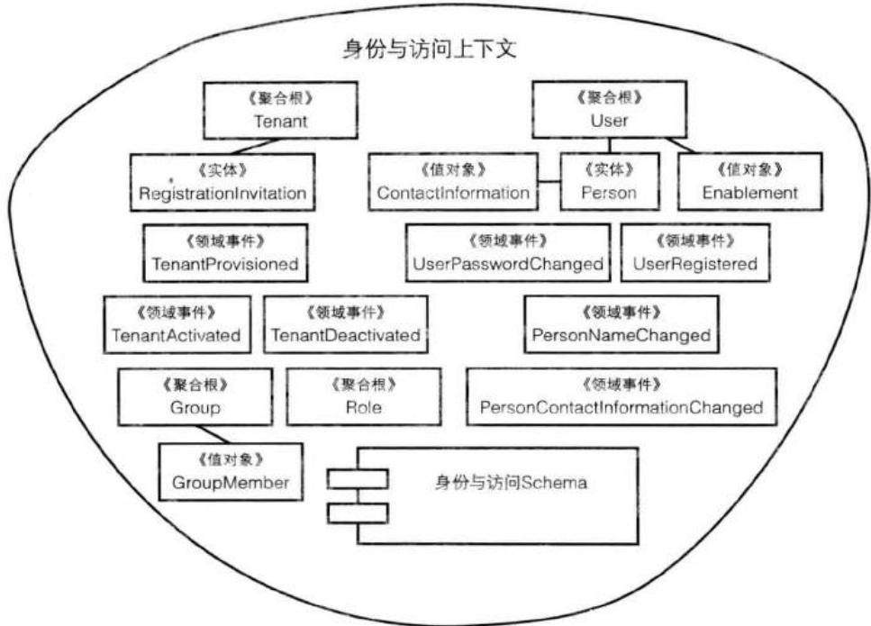


图 2.9 身份与访问上下文。边界之内的所有模型都遵循通用语言。在该限界上下文中还存在其他的组件，有些位于模型层中，有些位于其他层中，这里未予显示。同样，用户界面 (UI) 和应用层组件也未予显示。


## 敏捷项目管理上下文

敏捷开发提倡的一些轻量级方法使其迅速地流行起来，特别是2001年敏捷宣言出来之后。当初，SaaSOvation公司决定在CollabOvation项目之后再开发一套敏捷项目管理系统，下面是该系统的项目进展情况…… 

在过去的三个季度中，CollabOvation产品取得了可观的销售业绩，SaaSOvation公司的收入也好于预期，此时公司启动了ProjectOvation项目。这是一个新的核心域，CollabOvation团队的顶尖开发人员将被调到ProjectOvation项目中以传授DDD经验。 


ProjectOvation产品关注于敏捷项目的管理，使用Scrum作为迭代和增量式的项目管理框架。ProjectOvation遵循传统的Scrum项目管理模型，其中包括产品、产品负责人、团队、待定项、计划发布和冲刺等。对待定项的评估通过对业务价值的分析来确定。 

CollabOvation和ProjectOvation并不会朝着两个完全不同的方向发展下去。SaaSOvation公司及其董事会非常看好在敏捷软件开发中引入协作工具的前景。因此，CollabOvation的功能将作为附加服务加到ProjectOvation中，此时的CollabOvation便是ProjectOvation的一个支撑子域。Scrum的产品负责人和团队成员将对发布和冲刺计划进行讨论，同时他们还将使用共享日历等。预计在将来，ProjectOvation项目还会加入协作资源计划功能，但是首先要满足的是那些首要的敏捷管理功能。 

ProjectOvation的技术负责人一开始打算将ProjectOvation功能作为CollabOvation模型的扩展，采用的方法是在源代码控制系统(Revision Control System, RCS)中新建一个分支(branch)。这种做法是一个很严重的错误。 

幸运的是, 技术人员从先前混乱的 “协作上下文” 中得到了经验教训, 他们认为将敏捷项目管理模型和协作模型合并在一起是一个很大的错误。可以看到, 此时的团队已经开始采用 DDD 的战略设计来思考问题了。 

如图2.10所示，在采用了战略设计之后，ProjectOvation团队认为软件的消费方应该是产品负责人和产品团队，这是合理的。毕竟，这些才是Scrum参与者所扮演的项目角色。用户和角色在另外的身份与访问上下文中进行管理。通过使用该上下文，订阅者通过自助式的服务来管理他们自己的身份和访问信息。软件中的管理功能使得项目管理者，比如产品负责人，确定项目的团队成员。在角色管理适当的情况下，产品负责人和团队成员都可以在敏捷项目管理上下文中进行创建。 

对ProjectOvation的一个需求是：通过一系列自治的应用服务来完成业务操作。开发团队希望ProjectOvation对其他限界上下文的依赖程度尽可能的小。总体上来说，ProjectOvation是可以自行完成操作的，即便是IdOvation和CollabOvation由于种种原因不能工作了，ProjectOvation是可以自行运行的。当然，在这种情况下，有些信息可能无法得到及时同步，但系统至少是可以工作正常的。 

## 上下文赋予每个术语特定的含义

一个基于Scrum的产品可以包含多个待定项实例。这里的产品和我们在电子商务网站上购买的产品是不同的。我们是如何知道这一点的呢？因为有上下文。在敏捷项目管理上下文中，我们知道产品所表示的意思，而在在线商店上下文中，我们知道，产品表示另外的意思。我们并不需要将产品命名为ScrumProduct，因为我们已经处于敏捷项目管理上下文中了。 

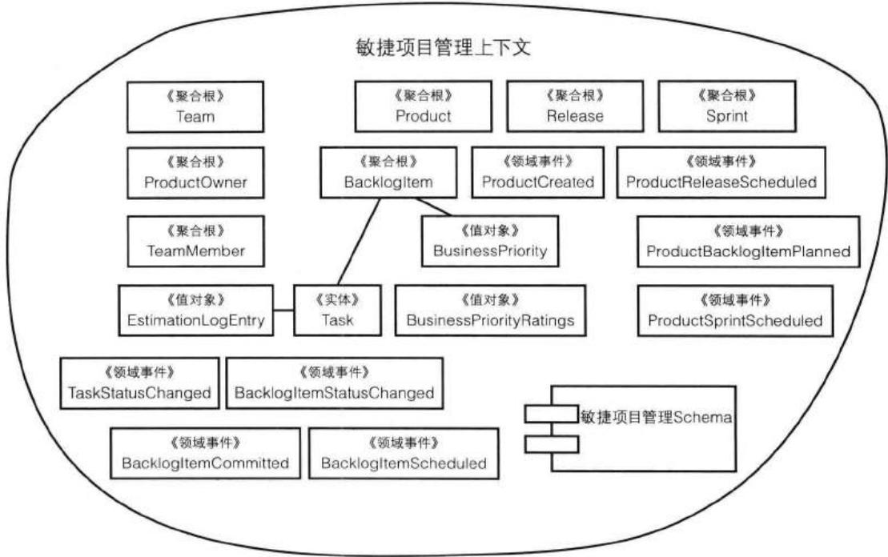


图 2.10 敏捷项目管理上下文。此时的通用语言主要关注于基于Scrum的产品、迭代和发布等。出于可读性，有些组件，比如UI和应用层组件并未予以显示。


基于SaaSOvation开发团队所获得的经验，PorjectOvation的核心域已经可以开始开发了，该核心域中包含了产品、待定项、任务、冲刺和发布等。此外，我们感兴趣的还有他们在对聚合(10)进行建模时所学到的经验教训。 


## 本章小结

在本章中, 我们讨论了DDD战略设计的重要性。 

- 你学习了领域、子域和限界上下文。 

- 你学习了问题空间和解决方案空间。 

- 你学到了如何利用限界上下文来分离模型。 

- 你学到了如何正确处理限界上下文的大小, 如何构建可以部署的限界上下文。 

- 你感受到了SaaSOvation在设计协作上下文早期所面临的痛苦，同时看到了CollabOvation团队是如何走出这种困境的。 

- 你看到了示例项目中的核心域和敏捷项目管理上下文是如何形成的。 

在下一章中, 我们将深入学习上下文映射图。上下文映射图是一种重要的战略建模工具。可能在本章中你已经对上下文映射图有了粗略的了解。当我们讨论到不同的领域时, 上下文映射图是不可避免的。接下来, 我们将学习更多有关上下文映射图的细节。 

## 第3章

# 上下文映射图

无论你选择做什么，总有人说你是错的，又总有这样那样的困难诱使你相信批评你的人是对的。要找到一条正确之路并坚持到最后，你需要的是勇气。 

—Ralph Waldo Emerson 

一个项目的上下文映射图 (Context Map) 可以用两种方式来表示。比较容易的一种是画一个简单的框图来表示两个或多个限界上下文之间的映射关系。该框图表示了不同的限界上下文在解决方案空间中是如何通过集成相互关联的。另一种更详细的方式是通过限界上下文集成的源代码实现来表示。对于这两种表示方法，在本章中我们都会讨论到，但对于第二种方法的详细讲解请参考集成限界上下文 (Integrating Bounded Contexts, 13)。 

请注意, 本章主要关注于解决方案空间, 在上一章中我们已经对问题空间做了大量的讲解。 

## 本章学习路线图

- 学习为什么绘制上下文映射图有助于项目成功。 

- 学习绘制上下文映射图。 

- 学习常见的组织关系和系统关系，看看它们是如何影响你的项目的。 

- 学习SaaSOvation团队是如何利用上下文映射图来控制他们的项目的。 

## 上下文映射图为什么重要

在开始采用DDD时, 首先你应该为你当前的项目绘制一个上下文映射图, 其中应该包含你项目中当前的限界上下文和它们之间的集成关系。图3.1表示一个抽象的上下文映射图, 我们将不断地向里面添加细节内容。 

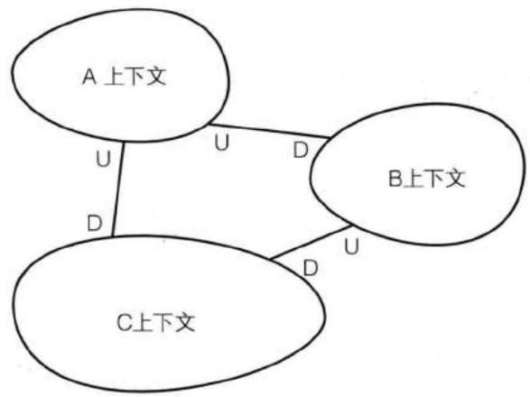


图3.1 一个抽象领域的上下文映射图。图中显示了3个限界上下文以及它们之间的集成关系。U表示上游 (Upstream)，D表示下游 (Downstream)


以上这个简单的框图便可以作为你团队的上下文映射图。其他团队在实施DDD时应该创建他们自己的上下文映射图。上下文映射图主要帮助我们从解决方案空间的角度看待问题。 

## 又是新术语？

这里我们引入了大泥球、客户方-供应方(Customer-Supplier)和遵奉者(Conformist)等概念。耐心一点，我们将在本章后面对这些概念做详细的解释。 

比如，当你为一个大型企业进行限界上下文之间的集成时，你可能需要与大泥球进行交互。大泥球的维护团队才不关心你的项目呢，因为你依赖于他们的API。因此，他们并不会深入到你的上下文映射图中，也不会关心你是如何使用他们的API的。然而，你的映射图依然需要反映出和他们的集成关系，因为这样可以使你了解到映射图的内部，并且可以指明在哪些地方需要与其他团队进行交流。这样的理解对你团队的成功是有帮助的。 

## 交流渠道

前面, 我们已经讲到了与一个库存系统的交互。除了解决集成问题之外, 上下文映射图还可以促进团队间的交流。 

假定你期望大泥球维护团队提供一套新的API。然而，他们却并不打算这么做，或者他们根本就不知道你的想法。此时你的团队和大泥球维护团队的关系便成了客户方-供应方的关系。由于大泥球团队决定维持现状，你的团队不得不陷入一种遵奉者关系中。这样的关系可能导致你的项目延期交付或者彻底失败。尽早绘制上下文映射图，这样可以迫使你仔细思考你的项目和你所依赖项目之间的关系。 

识别出项目中的每一个模型并确定它的限界上下文……为每个限界上下文命名，该名字应该是通用语言的一部分。描述模型之间的连接点，将模型间的翻译转换显式地勾勒出来。[Evans, p.345] 

CollabOvation团队应该在建模之初就使用上下文映射图。虽然他们几乎是从零开始的，但以映射图的形式对项目做出假设可以帮助他们更好地分离限界上下文。同时，他们应该将一些显著的建模元素列在白板 


上，然后从语言层面对这些元素进行分组。这样可以迫使他们识别出语言边界，然后创建一个简单的上下文映射图。然而当时，他们对于战略建模一无所知。他们需要在战略建模上有所突破，后来，他们的确做到了。在之后的ProjectOvation中，他们尝到了战略建模的甜头。 

接下来, 让我们看看如何快速地生成一个可用的上下文映射图。 

## 绘制上下文映射图

上下文映射图表现的是项目当前的状态, 如果项目会在将来发生变化, 你可以到那时才对上下文映射图做相应的更新。关注于当前的项目状态可以帮助你了解你正处的位置, 并帮助你决定如何走出下一步。 

绘制一个上下文映射图并不复杂。通常，首选在白板上手绘映射图，此时你可以采用[Brandolini]的风格。如果你打算使用一个绘图工具来绘制上下文映射图，请注意不要把图画得太正式了。 

回到图3.1中，图中限界上下文的名字和彼此之间的集成关系只是占位符而已，在真实的上下文映射图中，我们将代之以实际的名字。图3.1中同时还展示了上游（upstream）和下游（downstream）两种集成关系，在本章后面我们将对此做详细讲解。 

## 白板时间

为你的的项目绘制一个简单的框图，其中包含不同的限界上下文、它们之间的关系、各个上下文的团队、上下文之间的集成和必要的翻译等。 

请注意,你的软件所实现的只是框图之内的内容。如果你想获得更多的信息,可以参考那些与你的限界上下文有集成关系的系统。 

有时, 我们希望对上下文映射图的某些特定部分进行放大, 以向里面加入更多的细节。这只是从另外一个角度来看待同一个限界上下文。除了边界、关系和翻译, 我们可能希望加入其他的一些内容, 比如模块 (9)、聚合 (10), 或者团队的分布信息等。我们将在本章后面讲到这些。 

所绘制的所有映射图，包括文字，都可以装订在同一份参考文档中，只要这对团队是有价值的。在这个过程中，我们应该避免那些繁文缛节性的仪式，保持简单和敏捷。向框图中加入过多的细节对团队并无多大帮助，交流才是关键，我们应该将交流对话也加入到上下文映射图中。 

## 这不是企业架构

上下文映射图并不是一种企业架构，也不是系统拓扑图。 

上下文映射图并不是一种企业架构，也不是系统拓扑图。但是，它可以用于高层次的架构分析，指出诸如集成瓶颈之类的架构不足。上下文映射图展现了一种组织动态能力（organizational dynamic），它可以帮助我们识别出有碍项目进展的一些管理问题。 

## 牛仔的逻辑

AJ: “我的夫人对我说，‘我刚才在外面的草场上和奶牛呆了一会儿，你看见我了吗？’我说，‘没有。’接下来这一周，她都没有跟我说话。” 


这些框图可以贴在墙上一个显著的位置，这样团队成员都可以看到。如果团队经常使用wiki，这些框图也可以在wiki中进行维护，否则，大可不必这么做。有这么一种说法，wiki是葬送信息的地方。不管你将这些框图放在什么地方，上下文映 射图都只是默默地呆在那里，除非团队成员经常去关注这些框图并围绕着展开讨论。 

## 产品和组织关系

这里, 我们简单重复一下SaaSOvation公司正在开发的3个产品: 

1. CollabOvation——一款社交协作产品。该产品允许注册用户发布对业务有价值的内容，发布方式是一些流行的基于Web的工具，比如论坛、共享日历、博客和wiki等。这是SaaSOvation公司的旗舰产品，也是该公司的第一个核心域(2)（即使当时他们还并不知道“核心域”这个DDD术语）。开发团队后来从CollabOvation中提取出了IdOvation模型（第2点）。对于CollabOvation来说，IdOvation是一个通用子域(2)，而CollabOvation本身又作为ProjectOvation（第3点）的支撑子域(2)。 

2. IdOvation——一款可重用的身份和访问管理产品。IdOvation为注册用户提供安全的、基于角色的访问管理。这些功能一开始和CollabOvation（第1点）混合在一起，这样导致的问题是：实现受到了限制，功能不可重用。SaaSOvation对CollabOvation进行了重构，引入了一个新的、清晰的限界上下文。SaaSOvation公司决定支持多个租户，这种功能对于SaaS产品来说是至关重要的。对于消费方来说，IdOvation扮演着通用子域的角色。 

3. ProjectOvation——一个款敏捷项目管理产品。这是SaaSOvation公司的新核心域。ProjectOvation采用基于Scrum的项目运行框架，用户可以创建项目管理资产，同时对项目资产进行分析和设计，还能跟踪项目进度。和CollabOvation一样，ProjectOvation将IdOvation作为一个通用子域来使用。该产品的一大创新是将CollabOvation（第1点）引入了敏捷项目管理，这样用户可以围绕Scrum的产品、发布、冲刺和待定项展开讨论。 

## 终于轮到定义了!

我们马上将对前面提到的组织模式和集成模式进行定义…… 

这些限界上下文之间的关系如何，不同开发团队之间的关系又如何？在DDD中，存在多种组织模式和集成模式，其中，有一种模式存在于任意两个限界上下文之间。以下的定义在很大程度上来自于[Evans, Ref]。 

- 合作关系 (Partnership): 如果两个限界上下文的团队要么一起成功, 要么一起失败, 此时他们需要建立起一种合作关系。他们需要一起协调开发计划 和集成管理。两个团队应该在接口的演化上进行合作以同时满足两个系统的需求。应该为相互关联的软件功能制定好计划表，这样可以确保这些功能在同一个发布中完成。 

- 共享内核 (Shared Kernel): 对模型和代码的共享将产生一种紧密的依赖性, 对于设计来说, 这种依赖性可好可坏。我们需要为共享的部分模型指定一个显式的边界, 并保持共享内核的小型化。共享内核具有特殊的状态, 在没有与另一个团队协商的情况下, 这种状态是不能改变的。我们应该引入一种持续集成过程来保证共享内核与通用语言 (1) 的一致性。 

- 客户方-供应方开发(Customer-Supplier Development): 当两个团队处于一种上游-下游关系时, 上游团队可能独立于下游团队完成开发, 此时下游团队的开发可能会受到很大的影响。因此, 在上游团队的计划中, 我们应该顾及到下游团队的需求。 

- 遵奉者 (Conformist): 在存在上游-下游关系的两个团队中, 如果上游团队已经没有动力提供下游团队之所需, 下游团队便孤军无助了。出于利他主义, 上游团队可能向下游团队做出种种承诺, 但是有很大的可能是: 这些承诺是无法实现的。下游团队只能盲目地使用上游团队的模型。 

- 防腐层 (Anticorruption Layer): 在集成两个设计良好的限界上下文时, 翻译层可能很简单, 甚至可以很优雅地实现。但是, 当共享内核、合作关系或客户方-供应方关系无法顺利实现时, 此时的翻译将变得复杂。对于下游客户来说, 你需要根据自己的领域模型创建一个单独的层, 该层作为上游系统的委派向你的系统提供功能。防腐层通过已有的接口与其他系统交互, 而其他系统只需要做很小的修改, 甚至无须修改。在防腐层内部, 它在你自己的模型和他方模型之间进行翻译转换。 

- 开放主机服务 (Open Host Service): 定义一种协议, 让你的子系统通过该协议来访问你的服务。你需要将该协议公开, 这样任何想与你集成的人都可以使用该协议。在有新的集成需求时, 你应该对协议进行改进或者扩展。对于一些特殊的需求, 你可以采用一次性的翻译予以处理, 这样可以保持协议的简单性和连贯性。 

- 发布语言 (Published Language): 在两个限界上下文之间翻译模型需要一种公用的语言。此时你应该使用一种发布出来的共享语言来完成集成交流。发布语言通常与开放主机服务一起使用。 

- 另谋他路 (SeparateWay): 在确定需求时, 我们应该做到坚决彻底。如果两套功能没有显著的关系, 那么它们是可以被完全解耦的。集成总是昂贵的, 有时带给你的好处也不大。声明两个限界上下文之间不存在任何关系, 这样使得开发者去另外寻找简单的、专门的方法来解决问题。 

- 大泥球 (Big Ball of Mud): 当我们检查已有系统时, 经常会发现系统中存在混杂在一起的模型, 它们之间的边界是非常模糊的。此时你应该为整个系统绘制一个边界, 然后将其归纳在大泥球范围之列。在这个边界之内, 不要试图使用复杂的建模手段来化解问题。同时, 这样的系统有可能会向其他系统蔓延, 你应该对此保持警觉。 

在与身份与访问上下文集成时，协作上下文和敏捷项目管理上下文均没有采用另谋他路的手法。诚然，在上下文范围之内，另谋他路的手法可以应用在特殊的系统上，同时它也可以用于一些个例。比如，一个团队可能拒绝使用集中式的安全管理系统，但他们依然会与另外类型的安全管理系统集成。 

SaaSOvation的不同团队之间存在着客户方-供应方关系。SaaSOvation公司的管理层绝对不会允许一个团队迫使另一个团队成为遵奉者。并不是说遵奉者关系所带来的影响总是负面的，而是客户方-供应方关系要求供应方向客户方提供支持，这种团队关系有助于SaaSOvation获得整体性的成功。当然，客户方也不总是正确的，这时团队之间需要的是礼尚往来。总的来说，团队应该好好地保持这种积极的组织关系。 

在集成时, 他们将会用到开放主机服务和发布语言, 有可能还会用到防腐层。虽然这两者都会在限界上下文之间创建开放的标准, 但是它们并不矛盾。通过使用下游上下文中的基本原则, 他们依然可以得到由独立翻译 $^{1}$ 所带来的好处, 并且不会像与大泥球集成时那样复杂。翻译层将变得简单、优雅。 

在上下文映射图中, 我们使用以下缩写来表示各种关系: 

- ACL表示防腐层 

- OHS表示开放主机服务 

- PL表示发布语言 

在阅读下一节时, 你可以回头参考第2章, “领域、子域和限界上下文”。第2章中关于这3个示例限界上下文的框图在这里也是有用的。由于描述的是高层次概念, 这些框图同样可以作为上下文映射图的一部分。 

## 映射3个示例限界上下文

现在, 让我们看看SaaSOvation公司的开发团队都在做些什么…… 

当CollabOvation团队意识到自己已经陷入僵局时，他们开始向[Evans]求助。在众多的战略设计模式中，他们发现了一种名为“上下文映射图”的工具非常实用。同时，他们还在网上发现了一篇文章[Brandolini]，该文中对上下文映射图做了扩展性的讲解。由于上下文映射图建议只对已有的系统进行映射，他们立即开始把映射图用于协作上下文，如图3.2所示。 


从团队设计的第一张映射图可以看出，他们已经知道应该创建一个名为“协作上下文”的限界上下文。从图中怪异的边界又可以看出，他们可能希望创建第二个限界上下文，但是却不知道如何将这个上下文从核心域中分离出来。 

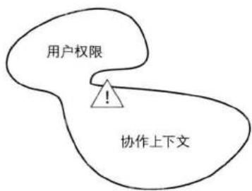


图3.2 协作上下文中的三角形表示一些不受欢迎的概念, 其中的感叹号表示一些不纯净的区域。


在图3.2中，位于图上方的狭窄通道（警告标志处）可能成为一些外部概念肆意进出之所。这里并不是说上下文边界一定得密不透风，而是：对于任何上下文边界，开发团队都希望协作上下文能够完全地控制所进所出，还包括进出的原因。否则，该上下文中便会出现一些不受欢迎的“拜访者”。对于模型而言，这些“拜访者”通常会导致混淆和bug。建模人员应该是友好的，但是友好的前提是秩序与和 谐。任何进入边界的外部概念都应该持有充分的理由，甚至需要和边界内的模型保持良好的兼容性。 

有了这样的分析，团队成员不仅对当前的模型有了更好的理解，同时还知道了如何迈出项目的下一步。一旦团队成员意识到安全、用户和权限并不属于协作上下文，他们便会采取相应的措施。他们需要将这些概念从核心域中分离出来，使这些概念只有在得到同意的时候才能进入核心域。 


这是对于DDD项目很重要的贡献。限界上下文的通用语言维持了所有模型的纯洁性，这一点，通用语言实至名归。语言上的分离有助于各个团队将精力集中在各自的限界上下文上。 

在对子域进行了分析, 或对问题空间进行了评估之后, 团队所绘制的上下文映射图如图3.3所示。从一个限界上下文中分离出了两个子域。由于子域和限界上下文最好是保持一对一的关系, 我们应该将原先的协作上下文分离成两个限界上下文。 

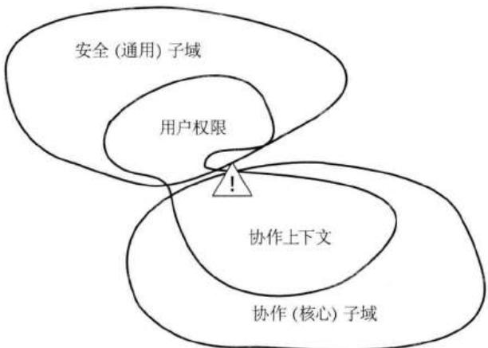


图3.3 团队对子域的分析导致了两个子域的产生：协作核心域和安全通用子域。


对子域和边界的分析要求我们做出决定。当人们需要使用CollabOvation的功能时，他们扮演的是参与者、作者和主持者等角色。有了这样的角色分离，我们便可以绘制一个更高层次的上下文映射图，如图3.4所示。团队使用了分离内核[Evans]对系统进行了重构。 

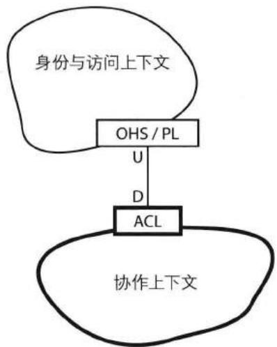


图3.4 原有核心域的边界和集成点以粗线标记。这里的IdOvation作为下游CollabOvation的通用子域。


在理解充分的情况下, 要绘制上下文映射图并不难, 但是通常来说, 我们并不会将映射图中的所有内容都显示出来。在迭代过程中, 思考和讨论可以帮助我们改进上下文映射图, 比如对集成点进行改进, 这将有助于描述限界上下文之间的关系。 

在上面3个上下文映射图中，前2个表明了团队的确从战略设计中有所收获。团队成员需要在原先的CollabOvation项目中抽出与身份和访问相关的内容，进而形成如图3.4所示的上下文映射图。团队成员只绘制了核心域、协作上下文、新的通用子域，还有身份与访问上下文。他们并没有把未来的敏捷项目管理上下文也包含在内，而加入该上下文对团队并无益处。此时，他们只需要对已有系统进行更正和改进。今朝有酒今朝醉，明日愁来明日忧。 

## 白板时间

- 对于你自己的限界上下文，你能识别出那些不该属于其中的概念吗？如果是，绘制一个新的上下文映射图，将这些概念放在另一个上下文中，再在图中标明两个限界上下文之间的关系。 

- 对于上文中的9种DDD组织和集成关系, 你会选择哪一种, 为什么? 

当下一个ProjectOvation项目启动时，团队将使用这个新的核心域——敏捷项目管理上下文来增强已有的上下文映射图，如图3.5所示。此时，我们已经能看出哪些方面正在计划当中了，即便它们还没有编码实现。 


团队成员还不大理解新上下文中的细节，但是通过讨论，他们是可以做到这点的。在项目早期采用战略设计可以帮助所有的团队成员了解他们的职责。由于第3个映射图是对前两个的改进，我们将把关注点放在该映射图上。SaaSOvation公司将领队开发人员分配到了新的PorjectOvation项目。作为最“富有”的上下文，这个新的核心域就应该是最优秀的开发者工作的地方。 

SaaSovation的开发团队已经对核心的模型分离有了很好的理解。与CollabOvation相似，当ProjectOvation的用户创建产品、计划发布、冲刺，或者工作在待定项上时，他们扮演的是产品负责人或者团队成员的角色。身份与访问上下文已经从核心域中分离出去了。对于协作上下文也是这种情况，此时的协作上下文对于ProjectOvation来说只是一个支撑子域。任何时候，这个新的模型都受到了上下文边界的保护，外部概念需要通过翻译才能进入核心域中。 

看看图3.5中框图的细节, 他们并不是系统架构图。如果是, 我们应该将新核心域——敏捷项目管理上下文放在最上部或者中间位置才对。但是此处, 它却位于底部, 表示这个核心模型位于其他系统的下游。 

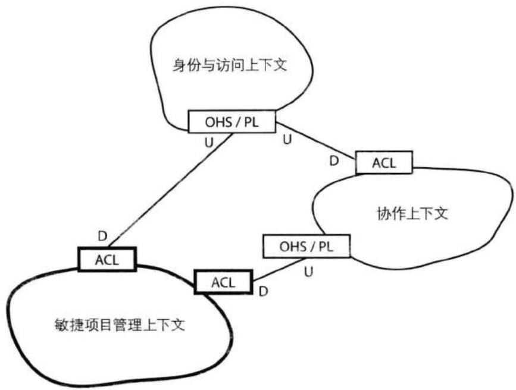


图3.5 当前核心域的边界和集成点以粗线标记。CollabOvation支撑子域和IdOvation通用子域为上游。


这种细微的差别还表明了另一点：上游模型会对下游模型产生影响，不管是正面的还是负面的，就像河流一样。考虑一个城市向河流中倾倒的污染物，这些污染物可能对本城市的影响很小，但是下游城市便深受其害了。映射图中框图的上下关系表明了上游模型对下游模型的影响，同时字母U和D显式地指出了它们之间的关系。有了这些字母标签，上下文的位置关系就不那么重要了，但是，这些位置关系依然能给我们营造一种好的视觉效果。 

## 牛仔的逻辑

LB: “当你口渴时,记得在牛群的上游喝水。” 


身份与访问上下文位于最上游, 它对协作上下文和敏捷项目管理上下文均会产生影响。同时, 协作上下文又是敏捷项目管理上下文的上游, 因为后者的模型依赖于前者的模型和服务。在限界上下文 (2) 中我们提到, ProjectOvation将自治地运行, 而 不会依赖于周边系统。这并不是说自治服务就可以完全独立于上游模型，而是我们的设计应该尽可能地限制实时依赖性。虽然ProjectOvation是自治的，但是它依然属于其他系统的下游。 

拥有自治服务的应用程序并不表示需要将上游系统的数据库复制到下游系统中。数据库复制将迫使本地系统承担过多的职责，它需要创建一个共享内核，而这并不是真正意义上的自治。 

在第三个映射图中, 请注意上游系统的连接框, 它们都标以OHS/PL, 分别表示开放主机服务和发布语言。所有下游系统的连接框都标以ACL, 即防腐层。对于它们的技术实现将在集成限界上下文(13)中讲到。简单地讲, 这些集成模式将采用以下技术: 

- 开放主机服务: 该模式可以通过REST实现。通常来讲, 我们可以将开放主机服务看成是远程过程调用 (RemoteProcedureCall, RPC) 的API。同时, 它也可以通过消息机制实现。 

- 发布语言：发布语言可以通过多种方式实现，但最常见的是使用XML Schema。在使用REST服务时，发布语言用来表示领域概念，此时可以使用XML和JSON。发布语言也可以使用Google的协议缓冲（Protocol Buffer）来表示。如果你打算发布Web用户界面，你也可以使用HTML。使用REST的好处在于每个客户端都可以指明使用哪种发布语言，同时还可以指明资源的展现方法。REST的另一个优点是超媒体（Hypermedia）展现，即HATEOAS（Hypermedia As The Engine Of Application State）。超媒体赋予发布语言以动态性和可交互性，使得客户端可以访问一系列彼此链接的资源。发布语言既可以使用标准的媒体类型进行发布，也可以使用自定义类型。同时，发布语言还可以用于事件驱动架构（Event-Driven Architecture, 4），其中领域事件（Domain Event, 8）以消息的形式发送到订阅方。 

- 防腐层：在下游上下文中，我们可以为每个防腐层定义相应的领域服务（Domain Service, 7）。同时，你也可以将防腐层用于资源库 (12) 接口。在使用REST时，客户端的领域服务将访问远程的开放主机服务，远程服务器以发布语言的形式返回，下游的防腐层将返回内容翻译成本地上下文的领域对象。比如，协作上下文向身份与访问上下文请求“具有Moderator角色的用户”。所返回的数据可能是XML格式或JSON格式，然后防腐层将这些数据翻译成协作上下文中的Moderator对象，该对象是一个值对象。这个Moderator实例反映的是下游模型中的概念，而不是上游模型。 

以上3个模式是非常常见的。这里我并不打算对每种集成模式都做讲解，我们将看到，即便我们只是选择性地讲解了少数几种模式，我们依然能够看出这些模式在应用上的不同。 

剩下的问题是: 以上便是创建上下文映射图的全部吗? 可能吧。高层视角已经为我们提供了有关项目整体的大量信息。然而, 我们可能会对这些集成关系和上下文间连接的内部感到好奇。当我们对上下文映射图进行放大时, 以上3种集成模式的内部结构将会变得清晰起来。 

让我们往后退一步。由于协作上下文是第一个核心域，让我们把它放大来看看。首先我们将接触到一些简单的集成方式，然后再是更高级的。 

## 协作上下文

现在, 让我们看看CollabOvation项目的进展情况…… 

协作上下文作为SaaSOvation公司的第一个核心域，开发团队已经对其有很好的理解了。这里，他们使用的集成方式比较简单，但是在可靠性和自治性上还稍逊一筹。要将此上下文映射图进行放大是相对容易的。 


身份与访问上下文通过REST的方式向外发布服务。作为该上下文的客户，协作上下文通过传统的类似于RPC的方式获取外部资源。协作上下文并不会永久性地记录下从身份与访问上下文中获取来的数据，而是在每次需要数据时重新向远程系统发出请求。显然，协作上下文高度依赖于远程服务，它不具有自治性。但就目前而言，SaaSOvation公司是愿意采取这种方式进行集成的。与一个通用子域进行集成属于SaaSOvation意料之外的事情，而为了满足交付计划的需求，他们不敢将时间浪费在实现软件的自治性上，而是采用了一种相对简单的方案。由于之后的ProjectOvation项目将使用自治性服务，CollabOvation到时可以借鉴ProjectOvation的做法。 

在图3.6所示的放大后的上下文映射图中,下游系统中的边界对象 (boundary object) 采用同步的方式向上游系统获取资源。当获取到远程模型数据之后,边界对象取出所需数据,再将其翻译成适当的值对象实例。在图3.7中,翻译图 

(Translation Map) 将所获数据转化成一个值对象。这里，身份与访问上下文中一个具有Moderator角色的User被翻译成了协作上下文中的Moderator值对象。 

## 白板时间

对于你自己项目的限界上下文，为你所感兴趣的一个集成点创建一个翻译图。 

如果翻译过于复杂，并且需要大量的数据复制和同步，从而使得翻译前后的模型存在很大的相似度，此时你该怎么办？你可能过多地使用了外部上下文中的数据，从而导致自己的模型混淆不清。 

不幸的是, 如果由于远程系统不可用而导致同步请求失败, 那么本地系统也将跟着失败。此时本地系统将通知用户所发生的问题, 并告诉用户稍后重试。 

系统集成通常依赖于RPC。从高层面上看，RPC与编程语言中的过程调用非常相似。一些程序库和工具使得RPC极具吸引力，使用起来也非常简单。然而，和在相同进程空间中进行过程调用不同的是，远程调用更容易产生有损性能的时间延迟，并且有可能导致调用彻底失败。网络和远程系统的加载过程都是RPC产生延迟的原因。当RPC的目标系统不可用时，用户对你系统的请求也将失败。 

虽然REST并不是真正意义上的RPC，但它却具有与RPC相似的特征。彻底的系统失败并不多见，但它却是一个潜在的问题。CollabOvation团队急切地希望解决这个问题。 

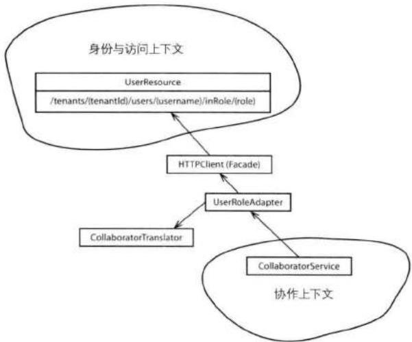


图3.6 协作上下文和身份与访问上下文集成时的防腐层和开放主机服务。


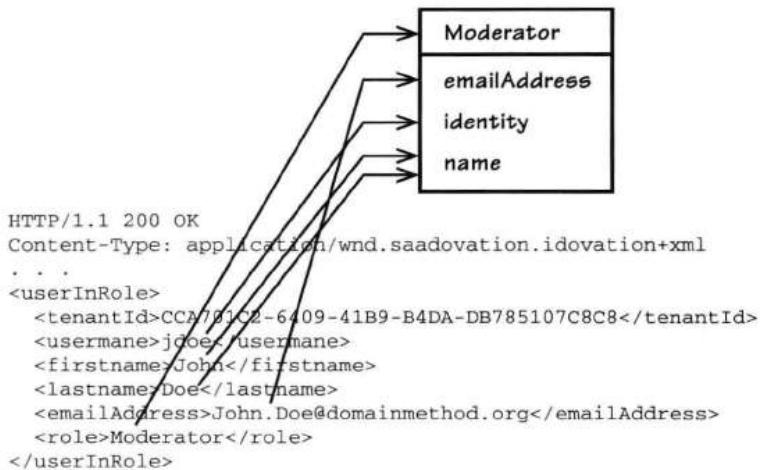


图3.7 如何将展现状态 (XML) 映射到本地模型中的值对象。


## 敏捷项目管理上下文

由于敏捷项目管理上下文是新的核心域，让我们重点关注一下。让我们将该上下文以及它与其他模型的连接关系放大来看看。 

为了达到比RPC更高的自治性, 敏捷项目管理上下文的团队将尽量限制对RPC的使用, 此时他们可以选择异步请求, 或者事件处理等方式。 

如果系统所依赖的状态已经存在于本地, 那么我们将获得更大的自治性。有人可能认为这只是对所有的依赖对象进行缓存, 但这不是DDD的做法。DDD的做法是: 在本地创建一些由外部模型翻译而成的领域对象, 这些对象保留着本地模型所需的最小状态集。为了初始化这些对象, 我们只需要有限的RPC调用或REST请求。然而, 要与远程模型保持同步, 最好的方式是在远程系统中采用面向消息的通知 (notification) 机制。消息通知可以通过服务总线进行发布, 也可以采用消息队列或者REST。 

## 做一个极简主义者

被同步的状态应该是本地模型所需远程模型的最小属性集。这里并不只是限制我们的对数据的需求，还应该对概念进行恰当的建模。 

限制对远程模型状态的使用是值得的，即使考虑到对本地模型本身的设计时也是如此。例如，我们并不希望将ProductOwner和TeamMember分别映射到UserOwner和UserMember，因为这样它们承担了远程User对象的过多特征属性，从而在不经意间导致了一种“杂交”状态。 

```txt
application/vnd.saasovation.idovation+json 
```

## 和身份与访问上下文集成

在图3.8中我们看到，对于身份与访问上下文中的领域事件，系统将以URI的方式向外发布事件通知。这种功能是通过NotificationResource提供的，它向外发布REST资源。这里的通知资源是一组被发布的领域事件。对于消费方来说，每个事件总是可用的。消费方应该避免对事件的重复消费。 

一个自定义的媒体类型表明客户可以请求两种资源： 

```handlebars
application/vnd.saasovation.idovation+json
//iam/notifications
//iam/notifications/{notificationId} 
```

通过第一个资源URI, 客户可以 (使用HTTPGET请求) 获取到当前的通知日志 (一个固定大小的通知集合)。对于自定义的媒体类型: 

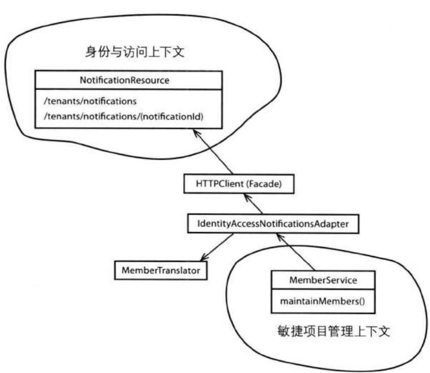


图3.8 敏捷项目管理上下文和身份与访问上下文集成时的防腐层和开放主机服务。


可以看出，这里的URI是全新的，并且是稳定的，因为它不会改变。无论当前的通知日志中包含了什么样的内容，该URI都会将其发布。当前日志是在身份与访问上下文模型中最近产生的事件的一个集合。通过第二个URI，客户可以获得先前存档的所有事件通知。为什么我们同时需要当前日志和存档日志呢？请参考领域事件(8)和集成限界上下文(13)中有关基于订阅源(feed)通知的工作机制。 

事实上，ProjectOvation团队并不打算全盘使用REST。比如，他们目前正与CollabOvation团队协商是否可以使用消息机制，例如RabbitMQ。但就目前来说，它们和身份与访问上下文的集成依然是基于REST的。 

现在, 让我们先忽略技术细节, 看看映射图中各个交互对象所扮演的角色。图3.9表示集成过程的序列图, 对其解释如下: 

- MemberService是一个领域服务，它向本地模型提供ProductOwner和TeamOwner对象，同时作为基本防腐层的接口。maintainService()方法用于周期性地检查身份与访问上下文所发出的通知。该方法不由模型的正常客户调用，而是由通知组件周期性地调用，在图3.9中，MemberSynchronizer表示这样的通知组件，它会把请求委派给MemberService。 

- MemberService进一步把请求委派给IdentityAccessNotificationAdapter，该类在领域服务和远程的开放主机服务之间扮演者适配器的角色。该适配器作为远程系统的客户端而存在。与远程NotificationResource的交互并没有显示在图3.9中。 

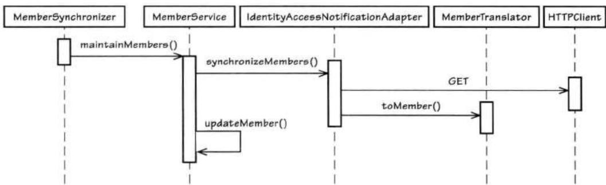


图3.9 敏捷项目管理上下文和身份与访问防腐层的内部工作机制。


- 一旦适配器从远程的开放主机服务获取到了数据，它将调用MemberTranslator的toMember()方法将发布语言中的媒体数据翻译成本地系统的领域对象Member。如果该对象在本地系统已经存在，则更新该对象。MemberService的updateMember()方法用于更新一个Member对象，此时它把更新操作委派给了自己。Member的子类有ProductOwner和TeamMember，它们反映了本地系统中的上下文概念。 

我们不应该将重点放在技术实现或集成产品上，而应该放在限界上下文之间的分离上，这样我们可以保持每个上下文的纯洁性，同时将一个上下文中的数据用在另一个上下文的概念中。 

以上框图和辅助性文本向我们展示了如何创建一个上下文映射图文档。该文档不必非常详尽，但需要提供足够的背景信息和概念解释，以使得团队的新成员能够迅速上手。然而，请记住，只有在对团队有用的情况下，我们才创建上下文映射图文档。 

与协作上下文集成接下来，让我们看看敏捷项目管理上下文是如何与协作上下文集成的。同样，我们关注的是系统的自治性，但这给集成带来了更多的困难与挑战。 

ProjectOvation将使用CollabOvation所提供的附加功能，比如论坛讨论和共享日历等。ProjectOvation用户并不直接与CollabOvation交互。对于某个租户来说，ProjectOvation必须决定出哪些CollabOvation的功能是对该租户可用的。然后，ProjectOvation将协调对CollabOvation资源的创建。 

考虑如下“创建产品”的用例： 

1. 用户提供该产品的描述信息 

2. 用户希望展开团队讨论 

3. 用户向ProjectOvation发出产品创建请求 

4. ProjectOvation 创建该产品，同时为其创建论坛（Forum）和讨论 (Discussion) 

Forum和Discussion必须在协作上下文中进行创建，这与身份与访问上下文不同。在后者中，一个租户在是已经存在的，而用户、用户群和角色等信息也已经被定义好了，事件通知对于外界来说也是可用的。也就是说，在身份与访问上下文中，对象是先前存在的。而对于敏捷项目管理上下文来说，对象是不会预先存在的，直到被请求时为止。这对于实现系统自治性来说是一个潜在的障碍，因为我们依赖于协作上下文来远程地创建资源。 

## Discussion为什么会在两个上下文中使用

这是一个有趣的现象, 因为在两个上下文中, Discussion只是名字相同而已, 其类型和实例对象都是不同的, 因此Discussion在两个上下文中的状态和行为也是不同的。 

在协作上下文中, Discussion是一个聚合, 它管理一系列的Post。而在敏捷项目管理上下文中, Discussion只是一个值对象, 它维护了对协作上下文中某个Discussion的引用。请注意, 在第13章中, 当团队在实现集成时, 他们发现应该为敏捷项目管理上下文中不同种类的Discussion采用强类型。 

在使用领域事件(8)和事件驱动架构(Event-Driven Architecture, 4)时, 我们应该仔细思考最终一致性 (Eventual Consistency)。本地系统产生的事件通知并不是只能由远程系统消费。在ProjectOvation中, 当ProductInitiated事件产生时, 该事件将由本地系统进行处理。本地系统要求Forum和Discussion在远程完成创建, 这可以通过RPC或消息机制完成, 当然这取决于CollabOvation支持哪种类型的通信方式。在使用RPC时, 如果远程的CollabOvation系统不可用, PorjectOvation将定期重试直到成功为止。如果采用消息机制, ProjectOvation将向CollabOvation发出消息, 在资源创建成功之后, CollabOvation同样会以消息的形式返回。当ProjectOvation接收到返回的消息时, 它将使用新建Discussion的标识引用来更新本地的Product对象。 

如果项目负责人或团队成员试图使用一个不存在的Discussion时会发生什么情况呢？我们可以认为这是一个bug吗？这将导致系统处于不稳定状态吗？有时我们可能由于没有预先付款而导致协作功能不可用，但这并不是一个技术原因。对最终一致性的处理绝非什么东拼西凑之事，我们应该将其考虑在建模范围之内。 

处理资源不可用的一个好办法便是将其显现出来。考虑以下由标准类型实现的状态(State)模式[Gamma et al.]。此时的状态是一个值对象(6): 

```txt
public enum DiscussionAvailability {
    ADD_ON_NOT_ENABLED, NOT_REQUESTED, REQUESTED, READY;
}

public final class Discussion implements Serializable {
    private DiscussionAvailability availability;
    private DiscussionDescriptor descriptor;
    ...
}

public class Product extends Entity {
    ...
    private Discussion discussion;
    ...
} 
```

在该设计中, 由DiscussionAvailability定义的状态对象将对值对象Discussion起保护作用。当有人试图参加关于一个Product的讨论时, 该设计将正确地处理Discussion的状态。如果状态不为READY, 参与者将得到以下信息之一: 

要使用团队协作功能，你需要购买附加功能。 

产品负责人还没有请求创建产品讨论。 

讨论启动失败，请稍后再试。 

如果状态为READY,那么我们允许所有的团队成员都参与讨论。 

有趣的是，从以上的第一条信息可以看出，PorjectOvation将协作功能作为了可选项显示在用户界面上，即便这些功能还未被购买也是如此，这对于市场营销是有好处的，因为这种方式可以时常提醒用户购买CollabOvation附加功能。显然，使用资源可用性状态的好处并不只是技术上的，还有商业上的。 

此时, ProjectOvation团队还不清楚采用哪种方式与CollabOvation进行集成。在讨论了客户方-供应方关系之后, 他们得到了图3.10。敏捷项目管理上下文可以使用第二个防腐层来处理与协作上下文之间的集成。图3.10中显示了主要的边界对象, 它们和图3.8中的边界对象相似。事实上并不存在单个CollaborationAdapter, 此处它只是一个占位符而已, 表示有可能的多个适配器。 

敏捷项目管理上下文在本地有DiscussionService和SchedulingService，它们是领域服务，用于管理协作系统中的讨论和日历条目。具体的实现机制由双方团队协商而定，这将在集成限界上下文(13)中讲到。 

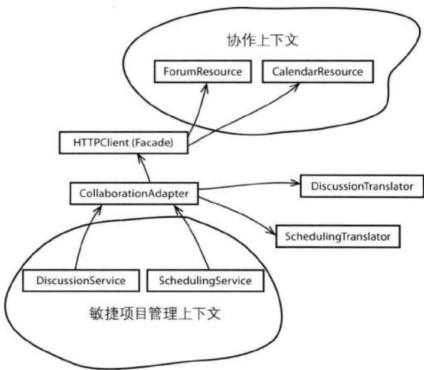


图3.10 敏捷项目管理上下文和协作上下文集成时的防腐层和开放主机服务。


现在，ProjectOvation团队部分地理解了他们当前的模型。那么，当CollabOvation创建好了一个讨论并将结果返回到ProjectOvation后，ProjectOvation又应该如何处理呢？此时，ProjectOvation将使用异步组件——不管是RPC客户端还是消息处理器——来调用Product的attachDiscussion()方法，传入的参数为一个新创建的Discussion值对象。所有依赖于远程资源的本地聚合都会通过这种方式处理。 

以上的例子已经向我们展示了上下文映射图的某些细节。然而，我们的讲解应该稍稍收敛一下了，因为一不注意就有可能处于收效递减的地步。也许我们还应该引入模块(9)，但是我们会在另外的章节中对模块做单独讲解。我们应该将有助于团队交流的高层次元素加入上下文映射图中，而不是冗繁的细节。 

你创建的上下文映射图应该可以贴在墙上，这样所有团队成员都可以看到；或者你可以将映射图上传到项目的wiki中。团队应该经常性地围绕上下文映射图展开讨论，并对其进行改进。 

# OWN IT!

## 本章小结

在本章中, 我们学习了上下文映射图。 

- 我们讨论了什么是上下文映射图，如何简单地创建上下文映射图。 

- 我们详细地了解了SaaSOvation的3个限界上下文和它们的上下文映射图。 

- 我们放大式地学习了这些上下文之间的集成。 

- 我们学习了防腐层中的边界对象以及它们之间的交互。 

- 我们学习了如何在REST资源和本地领域模型之间创建翻译图。 

有些项目可能并不需要达到本章所讲到的细节程度, 而有些项目却可能需要更多的细节。 

对此，我们需要做一个平衡。需要记住的是，对于一个非常详细的上下文映射图，我们很有可能无法对其进行实时更新。将映射图贴在墙上是有好处的，这样可以方便团队成员之间的交流。保持简单性和敏捷性，拒绝繁文缛节，这样我们所创建的上下文映射图将对项目起推动作用，而不是阻碍作用。 

# 第4章 架构

建筑应该反映时代特征与地理特征，同时追求永恒。 

—Frank Gehry 

DDD的一大好处便是它并不需要使用特定的架构。由于核心域(2)位于限界上下文(2)中,我们可以在整个系统中使用多种风格的架构 $^{1}$ 。有些架构包围着领域模型,能够全局性地影响系统,而有些架构则满足了某些特定的需求。我们的目标是选择适合于自己的架构和架构模式。 

在选择架构风格和架构模式时，我们应该将软件质量考虑在内，而同时，避免滥用架构风格和架构模式也是重要的。质量驱动的架构选择是种风险驱动方式[Fairbanks]，即我们采用的架构是用来减少失败风险的，而不是增加失败风险。因此，我们必须对每种架构做出正确的评估。 

对架构风格和模式的选择受到功能需求的限制，比如用例或用户故事。换句话说，在没有功能需求的情况下，我们是不能对软件质量做出评判的，亦不能做出正确的架构选择。这也说明用例驱动架构在当今的软件开发中依然适用。 

## 本章学习路线图

- 听听SaaSOvation的CIO是如何做项目回顾的。 

- 学习使用依赖注入原则 (DIP) 和六边形 (Hexagonal) 架构来改进分层架构 (Layers Architecture)。 

- 学习六边形架构对SOA和REST的支持。 

- 学习数据网织 (DataFabric) 或基于网格的分布式缓存 (Grid-Based Distributed Cache) 和事件驱动风格。 

- 学习DDD世界的新架构模式——CQRS。 

- 学习SaaSOvation所采用的架构。 

## 架构并不酷

本章讲到的架构风格和架构模式并不是什么“很酷”的工具以致于我们应该处处使用。我们应该在有需要时，在能够降低失败风险时才采用这些架构。 

[Evans]将关注重点放在了分层架构上，如此一来，SaaSOvation得出结论：只有采用分层架构时，DDD才是有效的。后来，团队花了不少时间才了解到，即便在[Evans]那个分层架构横行的时代，DDD的适用性也比他们所想象的要强。 


当然，分层架构的原则依然可以作为我们的决策指导，但是我们不会止步不前，我们将在必要时采用更现代的架构和模式，这也意味着DDD的用途是非常广阔的。 

值得肯定的是, SaaSOvation并不需要使用所有的架构, 但是团队需要在众多架构中做出正确的选择。 

## 采访一个成功的CIO

为使你简单了解如何选择正确的架构，接下来让我们穿越到未来和SaaSOvation公司的CIO谈谈。SaaSOvation公司一开始是很寒碜的，但是正确的架构选择帮助他们一步一步走向了成功。让我们接通TechMoney节目的主持人Maria Finance-Ilmundo…… 

Maria: 今晚, 我将独家采访SaaSOvation公司的CIO, Mitchell Williams。我们将继续“认识你的架构风格”系列。今晚的主题是如何正确地选择架构。欢迎Mitchell。 

Mitchell: 非常高兴又来到这里，Maria。 

Maria: 你可以给我们讲讲在你项目的早些时候所采用的架构吗, 以及为什么会采用这些架构? 

Mitchell: 当然。大家可能不会相信，我们一开始打算开发桌面应用程序，将数据保存在中央数据库。当时我们采用了分层架构。 

Maria: 这有用吗? 

Mitchell: 我认为是有用的, 特别是我们只处理单个应用层, 外加中央数据库。这是一种简单的客户端-服务器风格。 

Maria: 但是后来你们改变了架构, 是吗? 

Mitchell: 是的。我们有了新的合作伙伴，然后双方决定采用SaaS的订阅模型。我们募集到了充足的资金，同时我们决定在开发敏捷项目管理系统之前，先开发一套协作工具。这有两方面的好处，一方面，我们加入了火热的协作工具市场，另一方面又为将来的敏捷项目管理系统提供了附加功能。你知道，在软件项目中使用协作工具可以在很大程度上提高交付能力。 

Maria: 有意思。这样的决定给你们带来了什么？ 

Mitchell: 随着软件复杂性的增加, 我们需要引入单元测试和功能测试来保证软件质量。为了做到这一点, 我们在分层架构中使用了依赖倒置原则 (Dependency Inversion Principle, DIP)。这是非常重要的, 这样我们可以在测试中轻易地替换掉UI层和基础设施层, 而将关注点放在应用程序和领域逻辑上。事实上, 我们得以单独地开发UI组件而不用考虑数据持久化。DIP并没有彻底改变系统的分层架构, 团队成员也很接受这种方式。 

Maria: 哇, 将UI与持久化真正分离! 这看来是有风险的。这样难吗? 

Mitchell: 其实也不是特别难。事实证明，DDD的战术模式并没有伤及我们。由于我们采用了聚合模式和资源库，在开发时我们可以采用内存持久化，因为我们使用了相同的资源库接口，之后我们又可以方便地切换到其他持久化机制。 

Maria: 帅呆啦。 

Mitchell: 嗯。 

Maria: 然后呢? 

Mitchell: 然后就万事大吉啦。我们成功地交付了CollabOvation和ProjectOvation，并且开始盈利。 

Maria: 哦，原来如此。 

Mitchell: 请不要搞错了。之后我们决定支持移动设备，因为移动终端太火了。这样我们需要使用REST。订阅用户开始提出诸如联合身份验证等需求，再比如复杂的项目和时间管理等工具。 

Maria: 神奇! 这样看来火的不只是移动设备, 你能继续谈谈吗? 

Mitchell: 开发团队决定转向六边形架构以应对新需求。他们发现端口和适配器这种方式可以满足要求。同时他们决定采用新的输出端口类型，比如像NoSQL和消息机制等，以上这些都需要云计算的支持。 

Maria: 你们当时有信心吗? 

Mitchell: 当然。 

Maria: 佩服。一旦你没有被击倒，那么你所做的选择将双倍地补偿你。 

Mitchell: 非常对。那时我们每个月都有好几百个新租户。我们添加了一个服务将协作工具中的遗留数据迁移到云上。开发团队决定采用Mule's Collection Aggregator, 通过SOA的方式来聚合数据。 

Maria: 哦, 这样看来, 你们不是为了使用SOA而使用SOA, 而是在真正需要时才使用的。完美! 在行业中我们还没有看到如此成功的例子。 

Mitchell: 是的, Maria。这也确实是我们一直采用的方式, 也是我们的成功范式。比如, 在整个开发过程中, 我们及时地引入了TrackOvation。这是一个用于跟踪defect的软件工具, 它与ProjectOvation集成起来使用。随着ProjectOvation功能的增加, 软件界面也越来越复杂。产品负责人的管理界面上堆满了有关项目产品和defect的各种信息。由于不同的人对界面风格有不同的偏好, 这使得界面管理更加复杂了。另外, 我们还需要支持移动设备。这时, 开发团队考虑加入CQRS架构模式。 

Maria: CQRS? 这是不是太复杂了? 我们还是尽量远离它吧。 

Mitchell: 不, 一旦团队有合理的理由使用CQRS来减少命令和查询之间的摩擦冲突, 他们就会不再回头了。 

Maria: 是的。那时是不是正值订阅用户开始要求分布式处理功能？ 

Mitchell: 对。如果我们不能在这一点上见招拆招，那不久我们就会被复杂性所淹没。有些功能需要一系列的分布式处理过程，ProjectOvation可不想让用户久等。他们引入了一套完整的事件驱动架构，使用管道和过滤器（Pipe and Filter）模式来完成此功能。 

Maria: 但这并不是你们解决复杂性的终点, 是吗? 

Mitchell: 嗯, 解决复杂性是没有终点的。然而, 如果你拥有一个优秀的团队,解决复杂性就变得简单多了。事实上, 事件驱动架构可以大大地简化系统的复杂性。 

Maria: 对, 我们继续。接下来是我最喜欢的部分。你知道…… 

Mitchell: 正确的架构使得我们急速成长壮大, 以致于RoaringCloud在收购我们时给出的价格为……嗯, 这是一个记录。 

Maria: 绝对是个记录, 每股50美元, 一共30个亿! 

Mitchell: 你的记忆力真好啊！好的架构对集成也有促进作用。RoaringCloud 向ProjectOvation迁移了大量的订阅用户，这对ProjectOvation来说是一个很大的压力。于是我们将管道和过滤器分布化和并行化，这需要新加入长时处理过程（long-running process），有时也加Sagas。 

Maria: 不错。这好玩吗？ 

Mitchell: 确实很好玩。 

Maria: 并且似乎这种趣味永远不会消失, 好戏还在后头。 

Mitchell: 你知道的。由于RoaringCloud在业界处于垄断地位，政府已经开始整顿这个行业了。新出台的法律要求RoaringCloud跟踪对系统的每一次改变。事实上，解决这个问题的最好方式便是事件源 (Event Sourcing)。 

Maria: 这太不可思议了, 太……太不可思议了。 

Mitchell: 应该这么说: 这是一个太不可思议的好问题。 

Maria: 最让我感到惊讶的是, 这么多年来, 你们系统的核心始终是基于DDD的。显然, DDD没有伤害你们, 也正是因为采用了DDD, 你们才得以免除很多困难。 

Mitchell: 事实上恰恰相反。我相信是因为我们及早地采用了DDD，然后花时间彻底地了解了DDD才使得我们应对业务的重重困难，最终取得胜利。 

Maria: 好吧，我们就聊到这里吧。再次感谢你，Mitchell。至此，我们学到了如何选择正确的架构。这里是“认识你的架构风格。” 

Mitchell: 这是我的荣幸, Maria。非常感谢你能邀请我。 

以上的采访为我们展示了如何选择正确的架构，并且如何及时地采用这些架构，我们将在接下来的章节中做详细讲解。 

## 分层

分层架构模式[Buschmann et al.]被认为是所有架构的始祖。它支持N层架构系统，因此被广泛地应用于Web、企业级应用和桌面应用。在这种架构中，我们将一个应用程序或者系统分为不同的层次。 

在分层架构中，我们将领域模型和业务逻辑分离出来，并减少对基础设施、用户界面甚至应用层逻辑的依赖，因为它们不属于业务逻辑。将一个复杂的系统分为不同的层，每层都应该具有良好的内聚性，并且只依赖于比其自身更低的层。[Evans, Ref, P.16] 

图4.1所示为一个典型的DDD系统所采用的传统分层架构，其中核心域只位于架构中的其中一层，其上为用户界面层（User Interface）和应用层（Application Layer），其下是基础设施层（Infrastructure Layer）。 

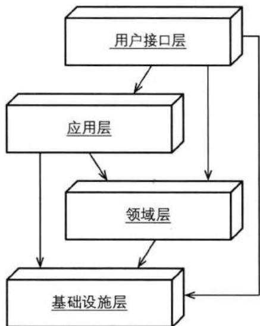


图4.1 DDD所使用的传统分层架构


分层架构的一个重要原则是：每层只能与位于其下方的层发生耦合。分层架构也分为几种：在严格分层架构（Strict Layers Architecture）中，某层只能与直接位于其下方的层发生耦合；而松散分层架构（Relaxed Layers Architecture）则允许任意上方层与任意下方层发生耦合。由于用户界面层和应用服务通常需要与基础设施打交道，许多系统都是基于松散分层架构的。 

事实上，较低层也是可以和较高层发生耦合的，但这只局限于采用观察者(Observer)模式或者调停者(Mediator)模式[Gamma et al.]的情况。较低层是绝对不能直接访问较高层的。例如，在使用调停者模式时，较高层可能实现了较低层定义的接口，然后将实现对象作为参数传递到较低层。当较低层调用该实现时，它并不知道实现出自何处。 

用户界面只用于处理用户显示和用户请求，它不应该包含领域或业务逻辑。有人可能会认为，既然用户界面需要对用户输入进行验证，那么它就应该包含业务逻辑。事实上，用户界面所进行的验证和对领域模型的验证是不同的。在实体(Entites, 5)中我们会讲到，对于那些粗制滥造的，并且只面向领域模型的验证行为，我们依然应该予以限制。 

如果用户界面使用了领域模型中的对象, 那么此时的领域对象仅限于数据的渲染展现。在采用这种方式时, 可以使用展现模型 (Presentation Model, 14) 对用户界面与领域对象进行解耦。 

由于用户可能是人, 也可能是其他的系统, 有时用户界面层将采用开放主机服务 (13) 的方式向外提供API。 

用户界面层是应用层的直接客户。 

应用服务（Application Services, 14）位于应用层中。应用服务和领域服务（Domain Services, 7）是不同的，因此领域逻辑也不应该出现在应用服务中。应用服务可以用于控制持久化事务和安全认证，或者向其他系统发送基于事件的消息通知，另外还可以用于创建邮件以发送给用户。应用服务本身并不处理业务逻辑，但它却是领域模型的直接客户。应用服务是很轻量的，它主要用于协调对领域对象的操作，比如聚合(10)。同时，应用服务是表达用例和用户故事(user story)的主要手段。因此，应用服务的通常用途是：接收来自用户界面的输入参数，再通过资源库(12)获取到聚合实例，然后执行相应的命令操作，比如： 

```java
@Transactional
public void commitBacklogItemToSprint(
    String aTenantId, String aBacklogItemId, String aSprintId) {
    TenantId tenantId = new TenantId(aTenantId);

    BacklogItem backlogItem =
    backlogItemRepository.backlogItemOfId(
    tenantId, new BacklogItemId(aBacklogItemId));

    Sprint sprint = sprintRepository.sprintOfId(
    tenantId, new SprintId(aSprintId));

    backlogItem.commitTo(sprint);
} 
```

如果应用服务比上述功能复杂许多, 这通常意味着领域逻辑已经渗透到应用服务中了, 此时的领域模型将变成贫血模型。因此, 最佳实践是将应用层做成很薄的一层。当需要创建新的聚合时, 应用服务应该使用工厂 (Factory, 11) 或聚合的构造函数来实例化对象, 然后采用资源库对其进行持久化。应用服务还可以调用领域服务来完成和领域相关的任务操作, 但此时的操作应该是无状态的。 

当领域模型用于发布领域事件 (Domain Events, 8) 时, 应用层可以将订阅方注册到任意数量的事件上, 这样的好处是可以对事件进行存储和转发。同时, 领域模型只需要关注自己的核心逻辑; 领域事件发布器 (Domain Event Publisher, 8) 也可以保持轻量化, 而不用依赖于消息机制的基础设施。 

我们将在另外的章节中讲到领域模型对业务逻辑的处理。然而，在传统的分层架构中，却存在着一些与领域相关的挑战。在分层架构中，领域层或多或少地需要使用基础设施层。这里我并不是说核心的领域对象会直接参与其中，而是说领域层中的有些接口实现依赖于基础设施层。 

比如, 资源库接口的实现需要基础设施层提供的持久化机制。那么, 如果我们将资源库接口直接实现在基础设施层会怎样呢? 由于基础设施层位于领域层之下, 从基础设施层向上引用领域层则违反了分层架构的原则。遵从分层架构原则并不意味着领域对象需要与基础设施层发生直接耦合, 此时我们可以采用模块 (9) 的方式来隐藏技术实现细节: 

com.saasovation.agilepm.domain.model.product.impl 

在模块 (9) 章节中, 我们会讲到, MongoDBProductRepository 将被放置在以上的包中。然而, 这并不是解决问题的唯一办法, 我们还可以将资源库的接口实现放在应用层中, 这样便可以维持分层架构的原则, 如图 4.2 所示。 

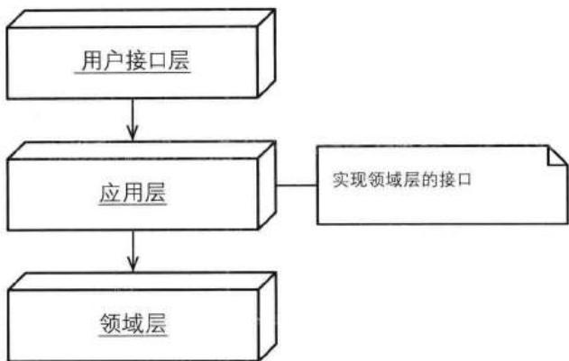


图4.2 对于领域层中定义的接口，其实现可以放在应用层中。


还有更好的方法，请参考下文的“依赖倒置原则”。 

在传统的分层架构中，基础设施层位于底层，持久化和消息机制便位于该层中。这里的消息包含了消息中间件所发的消息、基本的电子邮件（SMTP）或者文本消息（SMS）。可以将基础设施层中所有的组件和框架看作是应用程序的低层服务，较高层与该层发生耦合以重用技术上的基础设施。即便如此，我们依然应该避免核心的领域模型对象与基础设施层发生直接耦合。 

SaaSOvation的开发团队发现，将基础设施层放在最底层是存在缺点的。比如，此时领域层中的一些技术实现是令人头疼的，因为他们违背了分层架构的基本原则。再者，很难为这样的实现编写测试。他们应该如何应对呢？ 


如果我们调整一下分层架构中各层的顺序, 结果会有所改观吗? 

## 依赖倒置原则

有一种方法可以改进分层架构——依赖倒置原则（Dependency Inversion Principle, DIP），它通过改变不同层之间的依赖关系达到改进目的。依赖倒置原则由Robert C. Martin提出[Martin, DIP]，正式的定义为： 

高层模块不应该依赖于低层模块，两者都应该依赖于抽象。 

抽象不应该依赖于细节，细节应该依赖于抽象。 

根据该定义, 低层服务 (比如基础设施层) 应该依赖于高层组件 (比如用户界面层、应用层和领域层) 所提供的接口。在架构中采用依赖倒置原则有很多种表达方式, 这里我们将采用图4.3中的方式。 

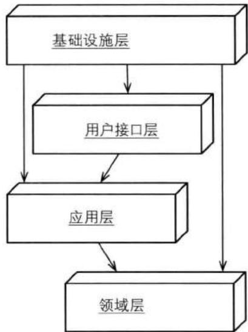


图4.3 在使用依赖倒置原则时的一种分层方式。我们将基础设施层放在所有层的最上方，这样它可以实现所有其他层中定义的接口。


## 依赖倒置原则真的可以支持所有的层吗？

有人认为，在依赖倒置原则中只存在两层，一层位于最上方，一层位于最下方。上方层将实现由下方层定义的抽象接口。按此对图4.3进行调整，基础设施层将位于最上方，用户界面层、应用层和领域层将作为相同的一层，并且位于下方。对此，你可以保留自己的意见。不要担心，我们将在六边形[Cockburn]或端口和适配器架构中对此做详细讲解。 

对于图4.3中的架构, 我们可以在领域层中定义资源库接口, 然后在基础设施层中实现该接口: 

```java
public class HibernateBacklogItemRepository
    implements BacklogItemRepository {
    ...
    @Override
    @SuppressWarnings("unchecked")
    public Collection<BacklogItem> allBacklogItemsComittedTo(
    Tenant aTenant, SprintId aSprintId) {
    Query query =
    this.session().createQuery(
    "from -BacklogItem as _obj_ "
    + "where _obj_.tenant = ? and _obj_.sprintId = ?");

    query.setParameter(0, aTenant);
    query.setParameter(1, aSprintId);

    return (Collection<BacklogItem>) query.list();
    }
    ...
} 
```

我们应该将关注点放在领域层上，采用依赖倒置原则，使领域层和基础设施层都只依赖于由领域模型所定义的抽象接口。由于应用层是领域层的直接客户，它将依赖于领域层接口，并且间接地访问资源库和由基础设施层提供的实现类。应用层可以采用不同的方式来获取这些实现，包括依赖注入（Dependency Injection）、服务工厂（Service Factory）和插件（Plug In）[Fowler, P of EAA]。本书的所有例子都采用Spring提供的依赖注入功能，有时也会采用DomainRegistry类所提供的服务工厂。事实上，DomainRegistry也是使用Spring来完成对bean的查找的，这些bean实现了由领域模型所定义的接口，包括资源库和领域服务。 

有趣的是, 当我们在分层架构中采用依赖倒置原则时, 我们可能会发现, 事实上已经不存在分层的概念了。无论是高层还是低层, 它们都只依赖于抽象, 好像把整个分层架构给推平了一样。如果我们将分层架构推平, 再向其中加入一些对称性会变得如何? 请继续往下读。 

## 六边形架构（端口与适配器）

在六边形架构 $^{2}$ 中，Alistair Cockburn提出了一种具有对称性特征的架构风格[Cockburn]。在这种架构中，不同的客户通过“平等”的方式与系统交互。需要新的客户吗？不是问题。只需要添加一个新的适配器将客户输入转化成能被系统API所理解的参数就行了。同时，系统输出，比如图形界面、持久化和消息等都可以通过不同方式实现，并且是可互换的。这是可能的，因为对于每种特定的输出，都有一个新建的适配器负责完成相应的转化功能。 

至此，我们有充足的理由认为，这将是一种具有持久生命力的架构。 

现在，很多声称使用分层架构的团队实际上使用的是六边形架构。这是因为很多项目都使用了某种形式的依赖注入。并不是说依赖注入天生就是六边形架构，而是说使用依赖注入的架构自然地具有了端口与适配器风格。我们将对此做详尽的解释。 

我们通常将客户与系统交互的地方称为“前端”；同样，我们将系统中获取、存储持久化数据和发送输出数据的地方称为“后端”。但是，六边形架构提倡用一种新的视角来看待整个系统，如图4.4所示。该架构中存在两个区域，分别是“外部区域”和“内部区域”。在外部区域中，不同的客户均可以提交输入；而内部的系统则用于获取持久化数据，并对程序输出进行存储（比如数据库），或者在中途将输出转发到另外的地方（比如消息）。 

## 牛仔的逻辑

AJ: “我的那些马确实很喜欢它们的六边形蓄栏, 因为当我带上马鞍要骑它们时, 它们有更多的角落可以跑躲。” 


在图4.4中，每种类型的客户都有它自己的适配器[Gamma et al.]，该适配器用于将客户输入转化为程序内部API所能理解的输入。六边形每条不同的边代表了不同种类型的端口，端口要么处理输入，要么处理输出。图4.4中有3个客户请求 均抵达相同的输入端口（适配器A、B和C），另一个客户请求使用了适配器D。可能前3个请求使用了HTTP协议（浏览器、REST和SOAP等），而后一个请求使用了AMQP协议（比如RabbitMQ）。端口并没有明确的定义，它是一个非常灵活的概念。无论采用哪种方式对端口进行划分，当客户请求到达时，都应该有相应的适配器对输入进行转化，然后端口将调用应用程序的某个操作或者向应用程序发送一个事件，控制权由此交给内部区域。 

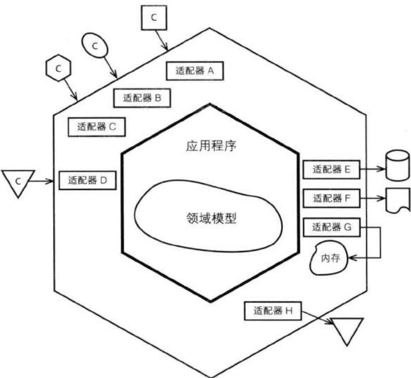


图4.4六边形架构也称为端口与适配器。对于每种外界类型，都有一个适配器与之相对应。外界通过应用层API与内部进行交互。


## 我们不必自己实现端口

通常来说，我们都不用自己实现端口。我们可以将端口想成是HTTP，而将适配器想成是Java的Servlet或JAX-RS的REST请求处理类。或者，我们可以为NServiceBus或RabbitMQ创建消息监听器，在这种情况下，端口是消息机制，而适配器则是消息监听器，因为消息监听器将负责从消息中提取数据，并将数据转化为应用层API（领域模型的客户）所需的参数。 

## 按照功能需求来设计内部区域中的应用程序

在使用六边形架构时, 我们应该根据用例来设计应用程序, 而不是根据需要支持的客户数目来设计。任何客户都可能向不同的端口发出请求, 但是所有的适配器都将使用相同的 API。 

应用程序通过公共API接收客户请求。应用程序边界，即内部六边形，也是用例（或用户故事）边界。换句话说，我们应该根据应用程序的功能需求来创建用例，而不是客户数量或输出机制。当应用程序通过API接收到请求时，它将使用领域模型来处理请求，其中便包括对业务逻辑的执行。因此，应用层API通过应用服务的方式展现给外部。再次提醒大家，这里的应用服务是领域模型的直接客户，就像在分层架构中一样。 

以下代码表示通过JAX-RS发布的RESTful资源。当请求到达HTTP的输入端口时，相应的适配器将对请求的处理委派给应用服务： 

```java
@Path("/tenants/{tenantId}/products")
public class ProductResource extends Resource {

    private ProductService productService;
    ...
    @GET
    @Path("{productId}")
    @Produces({ "application/vnd.saasovation.projectovation+xml" })
    public Product getProduct(
    @PathVariable("tenantId") String aTenantId,
    @PathVariable("productId") String aProductId,
    @Context Request aRequest) {

    Product product = productService.product(aTenantId, aProductId);

    if (product == null) {
    throw new WebApplicationException(
    Response.Status.NOT_FOUND);
    }

    return product; //通过MessageBodyWriter序列化到XML
    }
    ...
} 
```

JAX-RS所提供的Java注解构成了适配器的大部分功能，它们负责解析资源路径，并将资源参数转化为String类型参数。ProductService实例是注入进来的，请求便是通过该ProductService将处理委派到应用程序内部的。之后，Product对象将被序列化成XML，然后放在Response中，再由HTTP输出端口发出。 

## JAX-RS并不是我们的关注点

JAX-RS只是使用应用程序和领域模型的一种方式。在这里，JAX-RS并不重要，我们完全可以使用Restfulie或者Node.js来完成相同的功能。但不管采用哪种方式，不同的适配器都会将输入委派给相同的API。 

对于图4.4中右侧的端口和适配器，我们应该如何看待呢？我们可以将资源库的实现看作是持久化适配器，该适配器用于访问先前存储的聚合实例，或者保存新的聚合实例。正如图中的适配器E、F和G所展示的，我们可以通过不同的方式实现资源库，比如关系型数据库、基于文档的存储、分布式缓存和内存存储等。如果应用程序向外界发送领域事件消息，我们将使用适配器H进行处理。该适配器处理消息输出，而刚才提到的处理AMQP消息的适配器则是处理消息输入的，因此应该使用不同的端口。 

六边形架构的一大好处在于, 我们可以轻易地开发用于测试的适配器。整个应用程序和领域模型可以在没有客户和存储机制的条件下进行设计开发。在测试时, 我们可以方便地对ProductService进行替换, 而无须考虑它是应该支持HTTP/REST呢, 还是SOAP呢, 或者是消息端口。任何测试客户都可以在用户界面还未完成之前进行开发。在选择持久化机制之前, 我们可以在测试中采用内存资源库来模拟持久化。更多的内存持久化实现细节, 请参考资源库(12)。如此一来, 我们可以在核心领域上进行持续开发, 而不需要考虑那些支撑性的技术组件。 

如果你采用的是严格分层架构，那么你应该考虑推平这种架构，然后开始采用端口与适配器。如果设计得当，内部六边形——也即应用程序和领域模型——是不会泄漏到外部区域的，这样也有助于形成一种清晰的应用程序边界。在外部区域，不同的适配器可以支持自动化测试和真实的客户请求，还有存储、消息和其他输出机制等。 

当SaaSOvation的开发团队考虑了六边形架构的优点之后，他们决定从分层架构转向六边形架构。事实上，这并不困难，只是需要从不同的角度来看待和使用Spring框架而已。 


六边形架构的功能如此强大，以致于它可以用来支持系统中的其他架构。比如，我们可能采用SOA架构、REST或者事件驱动架构；也有可能采用CQRS；或者数据网织或基于网格的分布式缓存；还有可能采用Map-Reduce这种分布式并行处理方式。以上这些架构我们会在后续章节中讲到。六边形架构为这些架构提供了坚实的支撑基础。当然，能够提供这种基础的不只是六边形架构，但是在本章剩下的内容中，我们都假设使用这种架构。 

## 面向服务架构

面向服务架构 (Service-Oriented Architecture, SOA) 对于不同的人来说具有不同的意思。这对于讨论SOA架构来说可能是一种挑战，因此我们最好能找到一些共同的基础，或者至少应该给出一些定义以便讨论。我们可以考虑由Thomas Erl[Erl]所定义的一些SOA原则。服务除了拥有互操作性外，还具有以下8种设计原则，如表4.1所示。 


表 4.1 服务设计原则


<table><tr><td>服务设计原则</td><td>描述</td></tr><tr><td>1.服务契约</td><td>通过契约文档,服务阐述自身的目的与功能</td></tr><tr><td>2.松耦合</td><td>服务将依赖关系最小化</td></tr><tr><td>3.服务抽象</td><td>服务只发布契约,而向客户隐藏内部逻辑</td></tr><tr><td>4.服务重用性</td><td>一种服务可以被其他服务所重用</td></tr><tr><td>5.服务自治性</td><td>服务自行控制环境与资源以保持独立性,这有助于保持服务的一致性和可靠性</td></tr><tr><td>6.服务无状态性</td><td>服务负责消费方的状态管理,这不能与服务的自治性发生冲突</td></tr><tr><td>7.服务可发现性</td><td>客户可以通过服务元数据来查找服务和理解服务</td></tr><tr><td>8.服务组合性</td><td>一种服务可以由其他的服务组合而成,而不管其他服务的大小和复杂性如何</td></tr></table>

我们可以将这些原则和六边形架构结合起来，此时服务边界位于最左侧，而领域模型位于中心位置，如图4.5所示。消费方可以通过REST、SOAP和消息机制获取服务。请注意，一个六边形架构系统支持多种类型的服务端点（endpoint），这依赖于DDD是如何应用于SOA的。 

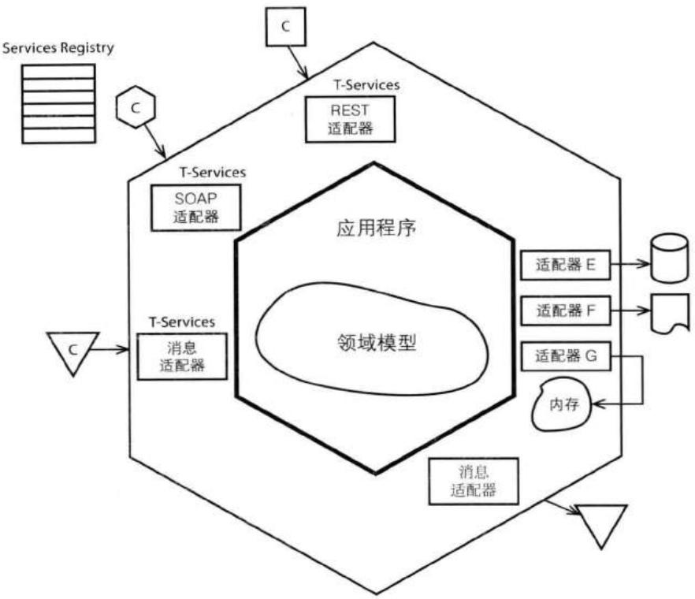


图4.5 一个支持SOA的六边形架构，其中包括REST、SOAP和消息服务。


由于对于SOA的定义和SOA的价值存在不同的观点，即便你不同意图4.5也是可以理解的。Martin Fowler将这种情况称为“面向服务歧义”[Fowler, SOA]。因此，这里我不会试图消除对SOA的歧义理解，但我会讲到将DDD应用于SOA的一种方式，此时我主要关注SOA宣言 $^{3}$ 中出现的首要原则。 

首先, 让我们看看其中一位宣言贡献者[Tilkov, Manifesto]的观点。该贡献者的评论有助于我们理解SOA到底是什么: 

SOA宣言给我的感觉是，我既可以将服务看作一系列的SOAP/WSDL接口，也可以将其看成为一组REST资源……本宣言并不试图给SOA下定义，而是找出我们都同意的SOA的价值和原则。 

Stefan的评论是值得注意的，在某个问题上达成一致对我们是有帮助的。我们甚至可以在这一点上达成一致：业务服务可以由任意数目的技术服务来提供。 

技术服务可以是REST资源、SOAP接口或者消息类型。业务服务强调业务战略，即如何对业务和技术进行整合。然而，定义单个业务服务与定义单个子域(2)或限界上下文是不同的。在我们对问题空间和解决方案空间进行评估时，我们会发现，此两者均包含有业务服务。因此，图4.5所示的只是单个限界上下文的架构，该限界上下文可以提供一系列的技术服务，包括REST资源、SOAP接口或者消息类型，而这些技术服务只是整个业务服务的一部分。在SOA的解决方案空间中，我们希望看到多个限界上下文，而不管这些上下文使用的是六边形架构还是其他架构。SOA和DDD均没有必要制定如何对技术服务进行设计和部署，因为存在很多种这样的方式。 

在使用DDD时, 我们所创建的限界上下文应该包含一个完整的, 能很好表达通用语言的领域模型。在限界上下文 (2) 中我们已经提到, 我们并不希望架构对领域模型的大小产生影响。但是, 如果一个或多个技术服务端点, 比如REST资源、SOAP接口或消息类型被用于决定限界上下文的大小, 那么上述情况是有可能发生的, 结果是将导致许多非常小的限界上下文和领域模型, 这样的模型中很有可能只包含一个实体对象, 并且该实体作为某个单一聚合的根对象而存在。 

虽然这种方式在技术上具有优点, 但是它却没有达到战略DDD所要求的目标。对于通用语言来说, 这种方式会起分化破坏作用。而根据SOA宣言, 非自然地分化限界上下文并不是SOA精神所在: 

## 1. 业务价值高于技术策略

## 2. 战略目标高于项目利益

就像限界上下文(2)中所讲到的, 技术组件对于划分模型来说并没有那么重要。 

SaaSOvation的开发团队不得不上很困难但又很重要的一课——将通用语言作为驱动更适合于DDD。他们所有的3个限界上下文所反映的都是SOA的目标，包括SOA的业务服务和技术服务。 


在限界上下文(2)、上下文映射图(3)和集成限界上下文(13)中提到的3个示例模型分别表示了某个能很好反映通用语言的领域模型。每一个领域模型由一组SOA开放服务所包围，这些服务是满足业务目标的。 

## REST

## 由Stefan Tilkov撰写

在过去几年里，REST (Representational State Transfer) 成为了一种被广泛使用，甚至被滥用的架构流行语。和SOA一样，不同的人对于REST有不同的理解。有人认为REST就是使用HTTP来直接发送XML的，但并不采用SOAP规范；还有人采用相似的方法来解释道：REST就是用HTTP来发送JSON数据的；还有人则认为在使用REST时我们需要将URI查询参数传递给方法。以上所有对于REST的解释都是错误的。但和SOA不同的是，Roy T. Fielding在他的博士论文中对REST做出了权威的概念定义。 

## REST作为一种架构风格

在使用REST之前，我们首先需要理解什么是架构风格。架构风格之于架构就像设计模式之于设计一样。它将不同架构实现所共有的东西抽象出来，使得我们在谈及到架构时不至于陷入技术细节中。分布式系统架构存在着多种架构风格，包括客户端-服务器架构风格和分布式对象风格。Field论文的前几个章节对有些架构风格做了解释，包括强加在每种风格上的各种约束。你可能会认为该论文中对于架构风格的概念解释和约束有些理论化。在这一点上，你可能是正确的。这些理论构成了Field所提出的REST架构风格的基础。REST本来就应该是属于Web架构的一种架构风格。 

当然，Web——体现为URI、HTTP和HTML——先于Field的博士论文而出现。但是，Field是制定HTTP1.1标准的主要贡献者之一，他对Web在发展过程中的设计决策也产生过巨大的影响 $^{4}$ 。这样看来，REST是对Web架构的理论扩展。 

那么现在, 我们为什么将REST作为构建系统的另一种方式呢? 或者更严格地说, 是构建Web服务的一种方式。原因在于, 和其他技术一样, 我们可以通过不同 的方式来使用Web协议。有些使用方式符合设计者的初衷，而有些就不见得了。比如，关系型数据库管理系统（RDBMS）便是一例。你可以根据原本的架构风格来使用RDBMS，即定义不同的数据库表，再定义不同的列、外键关联、视图和约束等。你也可以只创建一张表，其中只含有两列，一列为表示“键”，一列表示“值”，然后将序列化之后的对象保存在值列中。此时，你依然在使用RDBMS，但是你却使用不到多少RDMBS提供的功能，比如查询、组合、排序和分组等。 

同样的道理, Web协议既可以按照它原先的设计初衷为人所用——此时便是一种遵循REST架构风格的方式——也可以通过一种不遵循其设计初衷的方式为人所用。因此, 在我们没有获得由使用 “REST” 风格的HTTP所带来的好处时, 另一种不同的分布式系统架构可能是合适的, 就像在保存拥有唯一键的数值时, NoSQL/键值对存储方式是一种更好的选择一样。 

## RESTful HTTP服务器的关键方面

那么，对于采用 “RESTful HTTP” 的分布式系统来说，它具有哪些关键方面呢？让我们先来看看服务器端。请注意，在我们讨论服务器端时，无论客户是操作 Web 浏览器的某个人，还是由编程语言开发的客户端程序，对它们都是同等处理的，没有什么区别。 

首先，就像其名字所指出的，资源是关键的概念。作为一个系统设计者，你决定哪些有意义的“东西”可以暴露给外界，并且给这些“东西”一个唯一的身份标识。通常来说，每种资源都拥有一个URI，更重要的是，每个URI都需要指向某个资源——即你向外界暴露的“东西”。比如，你可能会做出这样决定：每一个客户、产品、产品列表、搜索结果和每次对产品目录的修改都应该分别作为一种资源。资源是具有展现(representation)和状态的，这些展现的格式可能不同。客户通过资源的展现与服务器交互，格式可以为XML、JSON、HTML或二进制数据。 

另一个关键方面是无状态通信，此时我们将采用具有自描述功能的消息。比如，HTTP请求便包含了服务器所需的所有信息。当然，服务器也可以使用其本身的状态来辅助通信，但是重要的是：我们不能依靠请求本身来创建一个隐式上下文环境（对话）。无状态通信保证了不同请求之间的相互独立性，这在很大程度上提高了系统的可伸缩性。 

如果你将资源看作对象——这是合理的——那么你应该问问它们应该拥有什么样的接口。这个问题的答案是REST的另一个关键面，它将REST与其他架构风格区别开来。你可以调用的方法集合是固定的。每一个对象都支持相同的接口。在 

RESTful HTTP中, 对象方法便可以表示为可以操作资源的HTTP动词, 其中最重要的有GET、PUT、POST和DELETE。 

虽然乍一看这些方法将会转化成CRUD操作，但是事实却并非如此。通常，我们所创建的资源并不表示任何持久化实体，而是封装了某种行为，当我们将HTTP动词应用在这些资源上时，我们实际上是在调用这些行为。在HTTP规范中，每种HTTP方法都有一个明确的定义。比如，GET方法只能用于“安全”的操作：(1)它可能完成一些客户并没有要求的动作行为；(2)它总是读取数据；(3)它可能被缓存起来。 

SOAP风格Web服务的主要推动者之一Don Box曾经说，HTTP的GET方法是分布式系统中最优化的方法。由此可知，Web之所以具有这么好的性能和可伸缩性，恰恰是得益于这种常见的HTTP GET方法。 

有些HTTP方法是幂等(idempotent)的，即我们可以安全地对失败的请求进行重试。这些方法包括GET、PUT和DELETE等。 

最后，通过使用超媒体（Hypermedia），REST服务器的客户端可以沿着某种路径发现应用程序可能的状态变化。这就是Fielding在他的博士论文中所提到的HATEOAS（Hypermedia as the Engine of Application State）。简单来讲，就是单个资源并不独立存在。不同资源是相互链接在一起的。这并不意外，毕竟，这就是Web被称为Web的原因。对于服务器来说，这意味着在返回中包含对其他资源的链接，由此客户便可以通过这些链接访问到相应的资源。 

## RESTful HTTP客户端的关键方面

RESTful HTTP客户端可以通过两种方式在不同资源之间进行转移，一种是上面所提到的超媒体，一种是服务器端的重定向。服务器端和客户端将协同工作以动态地影响客户端的分布式行为。由于URI包含了对地址进行解引用（dereference）的所有信息——包括主机名和端口——客户端可以根据超媒体链接访问到不同的应用程序，不同的主机，甚至不同公司的资源。 

在理想情况下，REST客户端将从单个众所周知的URI开始访问，然后通过超媒体链接继续访问不同的资源。这种Web浏览器显示HTML页面是一样的，HTML中包含了各种链接和表单，浏览器根据用户输入与不同的Web应用程序交互，此时它并不需要知道Web应用程序的接口或实现。 

然而，浏览器并不能算是一个自给自足的客户端，它需要由人来做出实际决定。但是一个程序客户端却可以模拟人来做出决定的，其中甚至包含了一些硬编 码逻辑。它可以跟随不同的链接访问不同的资源，同时它将根据不同的媒体类型发出不同的请求。 

## REST和DDD

RESTful HTTP是具有诱惑力的, 但是我们并不建议将领域模型直接暴露给外界, 因为这样会使系统接口变得非常脆弱, 原因在于对领域模型的每次改变都会导致对系统接口的改变。要将DDD与RESTful HTTP合并起来使用, 我们有两种方式。 

第一种方法是为系统接口层单独创建一个限界上下文，再在此上下文中通过适当的策略来访问实际的核心模型。这是一种经典的方法，它将系统接口看作一个整体，通过资源抽象将系统功能暴露给外界，而不是通过服务或者远程接口。 

让我们看一个实际的例子。我们创建一个系统来管理工作组，其中包括任务、计划/预约和子工作组管理等。我们将创建一个纯净的、不受架构影响的领域模型，该模型能正确地反映通用语言，并准确地实现业务逻辑。如果要为这个领域模型发布一个接口，我们便可以通过REST资源的形式向外提供一个远程接口。这些资源反映了客户所需的用例，它们和领域模型是存在区别的。但是，每一种资源归根结底都创建自核心域，比如核心域中的聚合等。 

当然，我们也可以简单地使用领域对象来作为JAX-RS的方法参数，比如我们可以将/:user/:task映射到getTask()方法，该方法返回一个Task对象。这样看起来是简单的，但却隐藏着一个很大的问题。对Task对象的任何修改都将立即反映到远程接口上，结果有可能使客户端调用失败。而即便我们所做的修改与外界没有任何关系，我们依然不能排除客户端调用失败的可能性。 

因此，第一种方法是应该被优先考虑的，因为它在核心域和系统接口模型之间完成了解耦，这使得我们可以先对领域模型进行修改，然后再决定哪些修改应该反映到系统接口模型上。请注意，在这种方法中，系统接口模型通常是根据领域模型来设计的，但是更好、更自然的方法应该是根据用例来设计。另外，我们还可以为这种方式自定义一种媒体类型。 

另一种方法用于需要使用标准媒体类型的时候。如果某种媒体类型并不用于支持单个系统接口，而是用于一组相似的客户端-服务器交互场景，此时我们可以创建一个领域模型来处理每一种媒体类型。这样的领域模型甚至可以在服务器和客户端之间进行重用，虽然有些REST和SOA的拥护者认为这是一种反模式（Anti-pattern）。请注意：这种方法本质上即为DDD中的共享内核(3)或者发布语言(3)。 

这也是一种由外向里的、横切式的方法。在上面提到的工作组例子中，有多种常用的格式可以用于领域模型。比如ical格式，这是一种通用格式。在本例中，我们首先选择一种媒体类型，即ical，然后再根据这种格式创建领域模型。该模型可以用于任何能够理解ical格式的系统，比如服务器程序，或者Android客户端。在采用这种方法时，服务器需要处理多种类型的媒体类型，而同一种媒体类型又可以用于多个服务器。 

如何在以上两种方法之间进行选取呢？这在很大程度上取决于系统设计者对可重用性上的要求。第一种方法比较适合更加专属的系统，而第二种方法更适合那些通用的系统。 

## 为什么是REST?

从我的经验看来，符合REST原则的系统将具有更好的松耦合性。通常来讲，添加新资源并在已有资源中创建到新资源的链接是非常简单的。要添加新的格式同样如此。另外，基于REST的系统也是非常容易理解的，因为此时系统被分为很多较小的资源块，每一个资源块都可以独立地测试和调试，并且每一个资源块都表示了一个可重用的入口点。HTTP设计本身以及URI成熟的重写与缓存机制使得RESTful HTTP成为一种不错的架构选择，该架构具有很好的松耦合性和可伸缩性。 

## 命令和查询职责分离——CQRS

从资源库中查询所有需要显示的数据是困难的, 特别是在需要显示来自不同聚合类型与实例的数据时。领域越复杂, 这种困难程度越大。 

因此，我们并不期望单单使用资源库来解决这个问题。因为我们需要从不同的资源库获取聚合实例，然后再将这些实例数据组装成一个数据传输对象（Data Transfer Object, DTO) [Fowler, P of EAA]。或者，我们可以在同一个查询中使用特殊的查找方法将不同资源库的数据组合在一起。如果这些办法都不合适，我们可能需要在用户体验上做出妥协，使界面显示生硬地服从于模型的聚合边界。然而，很多人都认为，这种机械式的用户界面从长远看来是不够的。 

那么，有没有一种完全不同的方法可以将领域数据映射到界面显示中呢？答案是CQRS (Cammand-Query Responsibility Segregation) [Dahan, CQRS; Nijof, CQRS]。CQRS是将紧缩 (Stringent) 对象（或者组件）设计原则和命令-查询分离 (CQS) 应用在架构模式中的结果。 

Bertrand Meyer对CQRS模式有以下评述： 

一个方法要么是执行某种动作的命令，要么是返回数据的查询，而不能两者皆是。换句话说，问题不应该对答案进行修改。更正式的解释是，一个方法只有在具有参考透明性（referentially transparent）时才能返回数据，此时该方法不会产生副作用。[Wikipedia, CQS] 

在对象层面，这意味着： 

1. 如果一个方法修改了对象的状态, 该方法便是一个命令 (Command), 它不应该返回数据。在Java和C#中, 这样的方法应该声明为void。 

2. 如果一个方法返回了数据, 该方法便是一个查询 (Query), 此时它不应该通过直接的或间接的手段修改对象的状态。在Java和C#中, 这样的方法应该以其返回的数据类型进行声明。 

这样的指导原则是非常直接明了的, 同时具有实践和理论基础作为支撑。但是, 在DDD的架构模式中, 我们为什么应该使用CQRS呢, 又如何使用呢? 

在领域模型中——比如限界上下文(2)中所讨论的领域模型——我们通常会看到同时包含有命令和查询的聚合。同时，我们也经常在资源库中看到不同的查找方法，这些方法对对象属性进行过滤。但是在CQRS中，我们将忽略这些看似常态的情形，我们将通过不同的方式来查询用于显示的数据。 

现在，对于同一个模型，考虑将那些纯粹的查询功能从命令功能中分离出来。聚合将不再有查询方法，而只有命令方法。资源库也将变成只有add()或save()方法（分别支持创建和更新操作），同时只有一个查询方法，比如fromId()。这个唯一的查询方法将聚合的身份标识作为参数，然后返回该聚合实例。资源库不能使用其他方法来查询聚合，比如对属性进行过滤等。在将所有查询方法移除之后，我们将此时的模型称为命令模型(Command Model)。但是我们仍然需要向用户显示数据，为此我们将创建第二个模型，该模型专门用于优化查询，我们称之为查询模型(Query Model)。 

## 这不是增加了复杂性吗？

你可能会认为: 这种架构风格需要大量的额外工作, 我们解决了一些问题, 但同时又带来了另外的问题, 并且我们需要编写更多的代码。 

但无论如何，不要急于否定这种架构。在某些情况下，新增的复杂性是合理的。请记住，CQRS旨在解决数据显示复杂性问题，而不是什么绚丽的新风格以使你的简历增光添彩。 

## 其他名字

请注意，在有些情况下，CQRS可以拥有不同的名字。这里的查询模型也被称为读模型，同样，命令模型也被称为写模型。 

因此，领域模型将被一分为二，命令模型和查询模型分开进行存储。最终，我们得到的组件系统如图4.6所示。 

## CQRS的各个方面

接下来, 让我们依次了解CQRS模式的各个方面。我们先从客户端和查询模型开始, 再了解命令模型。 

## 客户端和查询处理器

客户端（图4.6最左侧）可以是Web浏览器，也可以是定制开发的桌面应用程序。它们将使用运行在服务器端的一组查询处理器。图4.6并没有显示服务器的架构层次。不管使用什么样的架构层，查询处理器都表示一个只知道如何向数据库执行基本查询（比如SQL）的简单组件。 

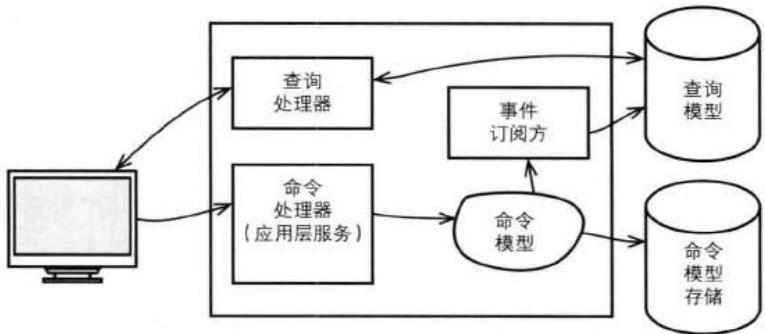


图4.6 在CQRS中，来自客户端的命令通过单独的路径抵达命令模型，而查询操作则采用不同的数据源，这样的好处在于可以优化对查询数据的获取，比如用于展现、用于接口或报告的数据。


这里并不存在多么复杂的分层，查询组件至多是对数据存储（比如数据库）进行查询，然后可能将查询结果以某种格式进行序列化。如果客户端运行的是Java或者C#，那么它可以直接对数据库进行查询。然而，这可能需要大量的数据库连接，此时使用数据库连接池则是最佳办法。 

如果客户端可以处理数据库结果集（比如JDBC），此时我们可能不需要对查询结果进行序列化，但我依然建议使用。这里存在两种不同的观点。一种观点是客户直接处理结果集，或者是一些非常基本的序列化数据，比如XML和JSON。另一种观点认为应该将返回数据转换成DTO让客户端处理。这可能只是一个偏好问题，但是任何时候我们引入DTO和DTO组装器（DTO Assembler）[Fowler, P of EAA]，系统的复杂性都会随之增加。因此，每个团队应该选择最适合自身的方法。 

## 查询模型（读模型）

查询模型是一种非规范化数据模型, 它并不反映领域行为, 只是用于数据显示 (也有可能是生成数据报告)。如果数据模型是SQL数据库, 那么每张数据库表便是一种数据显示视图, 它可以包含很多列, 甚至是所显示数据的一个超集。表视图可以通过多张表进行创建, 此时每张表代表整个显示数据的一个逻辑子集。 

## 创建足够多的视图

值得一提的是，创建CQRS数据视图可以是非常廉价的，特别是在使用单种形式的事件源（Event Sourcing）时（请参考本章后面的“事件源”小节或附录A），此时所有的事件都将被持久化，这样在任何时候我们都可以重新发布显示数据，我们也可以从头重建单个显示视图，或者将整个查询模型转向另外的持久化机制。事件源使我们可以简单地创建和维护显示视图以响应UI变化，这样我们可以在不考虑数据库表结构的前提下获得更直观的用户体验。 

比如，要在用户界面上显示用户、经理和管理者等信息，我们纵然可以只创建一张数据库表来包含所有这些信息。但是，如果为每种类型的用户分别创建一个显式视图，我们便可以将每种安全角色的数据进行分离，由此以用户类型为单位来显示安全信息。要显示常规用户信息，我们可以选择该常规用户所对应数据库表视图的所有列；要显示经理信息，我们则可以选择经理所对应数据库表视图的所有列。这样一来，常规用户将不能看到经理用户的数据信息。 

此时的选择语句只需要提供数据库表视图的主键即可。下面的SQL语句表示了一个查询处理器选择一种产品的某个常规用户的所有数据列： 

SELECT * FROM vw_usr_product WHERE id = ? 

顺便提一下, 这里使用的表视图命名规范并不值得推荐, 但这并不是我们的重点。这里的主键表示某种聚合类型或者多聚合组合类型的唯一标识。在本例中, 主键id表示命令模型中某个Product的唯一标识。数据模型的设计应该遵循 “一张表对应一种用户界面显示类型” 的原则, 不同的安全角色应该对应有不同的表视图。但是, 我们应该从实际出发, 具体情况具体分析。 

## 具体情况具体分析

如果存在25个证券营销人, 但是根据SEC规则, 他们相互之间都不能看到彼此的销售信息, 那么此时我们应该创建25个表视图吗? 这里使用一个过滤器可能更加合适, 否则我们需要创建太多的表视图。 

具体实施起来这可能是困难的，因为我们可能需要将多张表或者多个表视图联合起来查询。联合查询可能是有必要的，或者至少比过滤器更加实用，特别是当领域中存在大量的安全角色时。 

## 数据库的表视图不是会造成重复吗？

在执行更新时, 一个基本的数据库表视图是不会产生重复的。一个视图只对应于一个查询, 在本例中甚至连联合查询都不会用到。只有具体化 (materialized) 视图才存在更新重复, 因为此时的视图数据需要复制到另外的地方以供选择查询语句使用。在设计数据库表和视图时我们应该多留意, 以使对查询模型的更新达到最优化。 

## 客户端驱动命令处理

用户界面客户端向服务器发送命令（或者间接地执行应用服务）以在聚合上执行相应的行为操作，此时的聚合即属于命令模型。提交的命令包含了行为操作的名称和所需参数。命令数据包是一个序列化的方法调用。由于命令模型拥有设计良好的契约和行为，将命令匹配到相应的契约是很直接的事情。 

要达到这样的目的，用户界面客户端必须收集到足够的数据以完成命令调用。这表明我们需要慎重考虑用户体验设计，因为用户体验设计需要引导用户如何正确地提交命令，此时最好的方法是使用一种诱导式的，任务驱动式的用户界面设计[Inductive UI]，这种方法会把不必要的数据过滤掉，然后执行准确的命令调用。因此，设计出一种演绎式的，能够生成显式命令的用户界面是可能的。 

## 命令处理器

客户端提交的命令将被命令处理器 (Command Processor) 所接收。命令处理器可以有不同的类型风格，这里我们将分别讨论它们的优缺点。 

我们可以使用分类风格 (categorized style)，此时多个命令处理器位于同一个应用服务中。在这种风格中，我们根据命令类别来实现应用服务。每一个应用服务都拥有多个方法，每个方法处理某种类型的命令。该风格最大的优点是简单。分类风格命令处理器易于理解，创建简单，维护方便。 

我们也可以使用专属风格 (dedicated style)，此时每种命令都对应于某个单独的类，并且该类只有一个方法。这种风格的优点是：每个处理器的职责是单一的，命令处理器之间相互独立，我们可以通过增加处理器种类来处理更多的命令。 

专属风格可能发展成为消息风格 (messaging style)，其中每个命令将通过异步的消息发送到某个命令处理器。消息风格使得每个命令处理器可以处理某种特殊的消息类型，同时我们可以通过增加单种处理器的数量来缓解消息负载。但是，消息风格并不能作为默认的命令处理方式，因为它的设计比其他两种都复杂。因此，我们应该首先考虑使用前两种同步方式的命令处理器，只有在有伸缩性需要的情况下才采用异步方式。可能有人会认为，异步方式可以在不同系统间进行解耦，因此系统具有更高的弹性。这种偏见往往容易导致消息风格命令处理器的产生。 

无论采用哪种风格的命令处理器, 我们都应该在不同的处理器间进行解耦, 不能使一个处理器依赖于另一个处理器。这样, 对一种处理器的重新部署不会影响到其他处理器。 

命令处理器通常只完成有限的功能。如果处理器拥有创建功能，那么它会创建一个新的聚合实例，然后将该实例添加到资源库中。通常地，命令处理器将从资源库中获取聚合实例，再调用该实例的行为方法： 

```java
@Transactional
public void commitBacklogItemToSprint(
    String aTenantId, String aBacklogItemId, String aSprintId) {
    TenantId tenantId = new TenantId(aTenantId);

    BacklogItem backlogItem =
    backlogItemRepository.backlogItemOfId(
    tenantId, new BacklogItemId(aBacklogItemId));

    Sprint sprint = sprintRepository.sprintOfId(
    tenantId, new SprintId(aSprintId));

    backlogItem.commitTo(sprint);
} 
```

当该命令处理器执行结束后, 一个聚合实例将被更新, 同时命令模型还将发布一个领域事件。对于更新查询模型来说, 这样的领域事件是至关重要的。值得注意的是, 就像在领域事件 (8) 和聚合 (10) 中所讲, 所发布的领域事件还可能导致另一些受同一个命令所影响的聚合实例的同步更新, 最终, 这些聚合实例都将与本次事务所修改的聚合实例保持最终一致性。 

## 命令模型（写模型）执行业务行为

命令模型上每个方法在执行完成时都将发布领域事件(8)。以BacklogItem为例： 

```java
public class BacklogItem extends ConcurrencySafeEntity {
    public void commitTo(Sprint aSprint) {
    DomainEventPublisher
    .instance()
    .publish(new BacklogItemCommitted(
    this.tenant(),
    this.backlogItemId(),
    this.sprintId());
    }
    ...
} 
```

## 事件发布器背后是什么？

这里的DomainEventPublisher是一个轻量级的基于观察者（Observer）模式[Gamma et al.]的组件，更多的细节请参考领域事件(8)。 

在命令模型更新之后, 如果我们希望查询模型也得到相应的更新, 那么从命令模型中发布的领域事件便是关键所在。在使用事件源时, 领域事件也被用于持久化修改后的聚合 (本例中的BacklogItem)。然而, 事件源并不一定与CQRS一起使用。除非事件日志包含在业务需求之中, 不然命令模型是可以通过ORM等方式进行持久化的。不管如何, 我们都需要发布领域事件以更新查询模型。 

## 当命令不发布领域事件

有时，对命令的执行并不会发布领域事件。比如，如果命令是通过“至少一次”的消息进行提交的，而同时应用程序又支持幂等操作，那么重新发出的消息将被忽略掉。 

另外，考虑一下当应用程序对命令进行验证的情况。所有的认证客户端都知道命令规则，此时它们将成功通过命令验证。但是，对于那些不知道命令规则的客户端来说——比如恶意攻击方——提交不合法的命令将失败，此时系统将丢弃这些命令。 

## 事件订阅器更新查询模型

一个特殊的事件订阅器用于接收命令模型所发出的所有领域事件。有了领域事件，订阅器会根据命令模型的更改来更新查询模型。这意味着，每种领域事件都应该包含有足够的数据以正确地更新查询模型。 

对查询模型的更新应该是同步的呢, 还是异步的? 这取决于系统的负荷, 也有可能取决于查询模型数据库的存储位置。数据的一致性约束和性能需求等因素对此也有很大的影响作用。 

如果要同步更新查询模型，查询模型和命令模型通常需要共享一个数据库，这时我们会在同一个事务过程中处理更新。这种方式可以保证两种模型的数据达到完全一致性。但是，这也需要更多的处理时间来更新不同的数据库表，而这有可能会违背服务层协议（service-level agreement，SLA）。如果系统有可能长期处于超负荷状态，并且对查询模型的更新过程又很冗长，那么此时我们应该考虑异步更新。在异步更新中，用户界面有可能无法及时地反映出对命令模型的修改，因此这对最终一致性也带来诸多挑战。更新延迟时间是不可预测的，但是异步更新却有可能满足其他的服务层协议。 

有时在创建新的用户界面视图时，我们需要同时创建显示数据。我们可以像前文中提到的那样创建数据库表和表视图，然后通过各种方法将数据添加到新创建的表中。此时，如果命令模型是通过事件源进行持久化的，或者如果存在完整的历史事件存储，那么我们可以回放这些历史事件来更新数据。请注意，只有在适当的事件已经存在的情况下，这种方式才是可用的。否则，只有在今后有新的命令进入系统时，我们才能向数据库表中插入数据。 

如果命令模型采用ORM作为持久化机制，那么我们可以用命令模型的数据存储来填充新建的查询模型表。此时我们可以引入常见的数据仓库（或者报表数据库）技术，比如提取-转换-加载（Extract-Transform-Load，ETL）。首先提取出命令模型中的数据，然后按照用户界面所需进行转换，再将转换结果加载到查询模型存储中。 

## 处理具有最终一致性的查询模型

如果查询模型需要满足最终一致性——即在命令模型更新之后，查询模型会得到相应的异步更新——那么用户界面可能有些额外的问题需要处理。比如，当上一个用户提交命令之后，下一个用户是否能够及时地查看到更新后的查询模型数据？这可能与系统负荷等因数有关。但是，我们最好还是假定：在用户界面所查看到的数据永远都不能与命令模型保持一致。因此，我们需要为最坏的情况考虑。 

一种方式是让用户界面临时性的显示先前提交给命令模型的参数，这使得用户可以及时地看到将来对查询模型的改变。这种方式有可能是唯一能够避免用户界面显示陈旧数据的方式。 

但是，对于某些用户界面，以上方式可能并不现实。而即便是现实的，同样有可能发生在用户界面中显示陈旧数据的情况，比如在一个用户进行操作的刹那，另一个用户却正试图查看数据。那么，我们应该如何应对呢？ 

另一种方法[Dahan, CQRS]是显式地在用户界面上显示出当前查询模型的日期和时间。要达到这样的目的，查询模型的每一条记录都需要维护最后更新时的日期和时间。这是很容易的，通常可以借助于数据库触发器。有了最近更新的日期和时间，用户界面便可以通知用户数据的新旧程度。如果用户认为数据过于陈旧，他们可以发出更新数据的请求。有人对这种方法给予了高度的评价，因为它是一种有效的模式；而有人则提出了尖锐的批评，认为这只是一种诡计。对于这两种不同的观点，我们应该通过用户验收测试来决定这种方法是否适用于你自己的系统。 

然而，有时命令模型和查询模型之间的不同步并不是什么大的问题。我们也可以通过其他方式来予以克服，比如Comet（即Ajax Push）；或者通过另一种静默更新的方式，比如观察者[Gamma et al.]或者分布式缓存/网格（比如Coherence或Gemfire）的事件订阅。我们甚至还可以通过另一种极其简单的方式来处理事件延迟：通知用户他们的请求已经被处理，但是还需要一些处理时间。对于事件延迟是否真的会造成问题，我们需要仔细地考虑。如果是，那么我们需要找到最好的方法予以解决。 

和其他模式一样，CQRS也存在诸多的竞争对手，而在做选择时我们应该额外小心。如果用户界面并不过于复杂或者我们只需要在单个视图中处理聚合，那么引入CQRS反而会增加额外的复杂性。 

## 事件驱动架构

事件驱动架构 (Event-Driven Architecture, EDA) 是一种用于处理事件的生成、发现和处理等任务的软件架构。[Wikipedia, EDA] 

图4.4所示的六边形架构表示了一个事件驱动架构系统的例子。事件驱动架构不见得必须与六边形架构一同使用，但是对于理解事件驱动架构来说，引入六边形架构是有好处的。对于一个新启动的项目来说，我们应该优先考虑采用六边形架构。 

在图4.4中，三角形表示了限界上下文所使用的消息机制。输入事件所使用的端口和其他客户端所使用的端口是不同的。同样，输出事件也将使用另一个不同的端口。在前文中我们已经提到，处理消息的端口可以是使用AMQP协议的消息机制，这种方式有别于使用HTTP协议的其他客户端。无论采用哪种类型的消息机制，我们都使用“三角形”来表示事件的进出。 

进出六边形的事件可能有不同的类型，而我们需要特别关心的是领域事件。除此之外还可能有系统事件，比如用于系统日志和监控的事件等。但是在DDD中，我们需要关注的是领域事件。 

我们可以引入多个六边形来表示整个企业范围内的事件架构，如图4.7所示。再次提醒，这里并不是说每个系统都必须使用六边形架构，而重点在于阐述如何将事件驱动架构用于多个六边形架构系统。你完全可以将这里的六边形架构替换成分层架构或其他架构。 

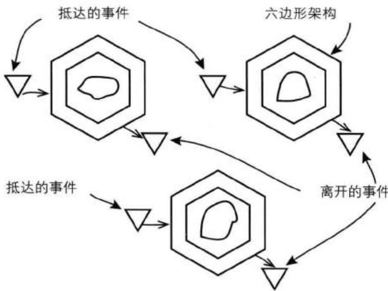


图4.7 在一个事件驱动架构中融入了六边形架构风格。该事件驱动架构通过消息机制完成对所有系统的解耦。


一个系统的输出端口所发出的领域事件将被发送到另一个系统的输入端口，此后输入端口的事件订阅方将对事件进行处理。对于不同的限界上下文来说，不同的领域事件具有不同含义，也有可能没有任何含义 $^{5}$ 。在一个限界上下文处理某个事件时，应用程序API将采用该事件中的属性值来执行相应的操作。应用程序API所执行的命令操作将反映到命令模型中。 

有可能出现这样一种情况：在一个多任务处理过程中，某种领域事件只能表示该过程中的一部分。只有在所有的参与事件都得到处理之后，我们才能认为这个多任务处理过程完成了。但是，这个过程是如何开始的？它是如何分布在整个企业范围之内的？我们如何跟踪处理进度？这些问题我们将在“长时处理过程”一节 中一一回答。这里，我们可以先学习一些基础知识。基于消息的系统通常呈现出一种管道和过滤器风格。 

## 管道和过滤器

以下的shell命令便是一种最简单的管道和过滤器： 

```shell
$ cat phone_numbers.txt | grep 303 | wc -1
3
$ 
```

上面的Linux命令用于在phone_numbers.txt文件中统计含有电话区号“303”的所有文本行的数量。该命令同时使用了管道和过滤器： 

1. cat命令工具用于向标准输出流(Standard Output Stream)输出phone_numbers.txt文件中的内容。通常来说，标准输出流与终端相连。但是在使用了“|”符号之后，输出将会通过管道转向下一个命令工具。 

2. 下一步, grep命令从标准输出流中读取数据, 此时的标准输出流即是cat命令的输出结果。grep命令的参数表示匹配合有“303”的所有行。grep命令查找到的所有结果都将输出到标准输出流。和cat命令一样, grep命令的输出流通过管道被转向到下一个wc命令。 

3. 最后, wc命令读取标准输出流, 此时即grep命令的输出结果。wc命令的命令行参数为“-1”, 表示统计所读行的数量。wc命令的结果将输出到终端, 此时为3, 表明grep命令查找到了3个含有“303”的文本行。请注意, 此时的输出直接显示在了终端, 因为在wc命令之后没有另外的管道了。 

在Windows下, 我们可以使用以下命令来达到相同的效果: 

```batch
C:\fancy_pim> type phone_numbers.txt | find /c "303"
3
C:\fancy_pim> 
```

思考一下，在以上的命令工具中都发生了些什么。每个工具都接收一个数据集，对其进行处理，再输出另一个数据集。输出数据集和输入数据集是不同的，因为每一个命令都充当着过滤器的作用。在整个过滤过程完成之后，输出数据和输入数据可能完全不一样了。在本例中，最原始的输入是一个文本文件，但最终的输出则只有一个数字“3”。 

我们如何将上例中的基本原则用于事件驱动架构呢？事实上，我们是可以发现一些共性的。接下来，我们将围绕管道和过滤器消息模式[Hohpe, Woolf]展开讨论。这里需要注意的是，用于消息的管道和过滤器与上面命令行例子并不完全一样。比如，一个事件驱动架构的过滤器可能并不需要过滤任何数据，它可以用于执行某些操作，但是不会修改消息数据。但是，事件驱动架构中的管道和过滤器却与上面的命令行例子拥有某些相同的特征。下面我们将讲到这些特征，如果你是一个高级读者，请“过滤”掉下面的一节。 

表4.2包含了基于消息的管道和过滤器处理过程的基本特征。 


表4.2 基于消息的管道和过滤器处理过程的基本特征


<table><tr><td>特征</td><td>描述</td></tr><tr><td>管道是消息通道</td><td>过滤器通过输入管道接收数据,通过输出管道发送数据。实际上,管道即是一个消息通道。</td></tr><tr><td>端口连接过滤器和管道</td><td>过滤器通过端口连接到输入和输出管道。端口使得六边形架构成为首选的架构。</td></tr><tr><td>过滤器即是处理器</td><td>过滤器可以对消息进行处理,而不见得一定对消息进行过滤</td></tr><tr><td>分离处理器</td><td>每个过滤处理器都是一个分离的组件。</td></tr><tr><td>松耦合</td><td>每个过滤处理器都相对独立地参与处理过程,处理器组合可以通过配置完成。</td></tr><tr><td>可换性</td><td>根据用例需求,我们可以重新组织不同处理器的执行顺序,这同样是通过配置完成的。</td></tr><tr><td>过滤器可以使用多个管道</td><td>在命令行例子中,过滤器只从一个管道中读写数据,但是消息过滤器可以从不同的管道中读写数据,这表示了一种并行的处理过程。</td></tr><tr><td>并行使用同种类型的过滤器</td><td>对于最繁忙的和最慢的过滤器来说,我们可以并行地采用多个相同类型的过滤器来增加处理量。</td></tr></table>

现在, 如果我们将上例中的cat, grep和wc看成是事件驱动架构中的不同组件会发生什么情况? 如果要通过创建消息发送方和接收方这样的组件来完成上例中的电话号码过滤功能, 我们又应该怎么做? (这里我并不是演示如何使用消息组件来替换命令行, 而是演示如何使用消息机制来达到相同的目标。) 

以下是管道和过滤器的工作流程, 如图4.8所示: 

1. 我们可以从PhoneNumbersPublisher组件开始，该组件读取phone_number.txt中的数据，然后创建一个含有所有文本行的事件消息并发送该消息，事件名为AllPhoneNumbersListed。一旦消息发送出去，整个处理过程便开始了。 

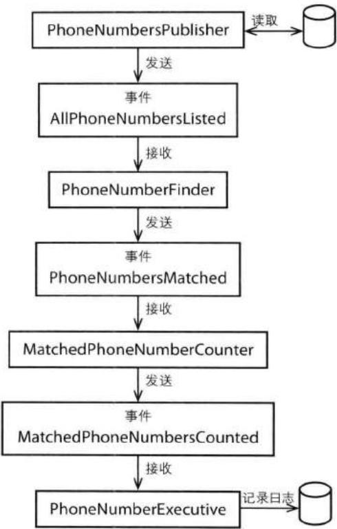


图4.8 对于发送的事件，由过滤器进行处理，这个过程组成了一个管道。


2. 通过配置，一个名为PhoneNumberFinder的消息处理组件将订阅AllPhoneNumbersListed事件。该消息处理组件是整个处理流程中的第一个过滤器。该过滤器查找出包含有“303”的所有文本行，然后创建一个名为PhoneNumberMatched的事件，该事件包含所有的查找结果。接下来，过滤器将发出一个新的事件，整个处理流程继续。 

3. 一个名为MatchedPhoneNumberCounter的消息处理组件订阅了PhoneNumbersMatched事件。该消息处理组件是第二个过滤器，它的职责是统计所接收事件中的电话号码数量，再把结果以新的事件形式——MatchedPhoneNumberCounted事件发布出去。该事件中包含了count属性，在本例中count的值为3。 

4. 最后，Matched PhoneNumbersCounted事件的订阅方——PhoneNumberExecutive组件将记录下最终的结果，包括电话号码数量、消息接收的日期和时间： 

3 phone numbers matched on July 15, 2012 at 11:15 PM 

到此，整个处理流程执行完毕 $^{6}$ 。 

以上的流程处理是灵活的。如果我们需要向其中新加入一个过滤器，我们只需要创建一种新的事件即可。我们应该慎重地配置各个处理器的作用顺序。当然，这并不像命令行例子那么简单。然而，通常来说，我们并不会经常性地改变领域事件的处理流程。虽然上面的例子本身没有多大意义，但却向我们展示了事件驱动架构中的管道和过滤器的工作机制。 

如果你已经厌倦了上面的例子, 那说明有可能你已经掌握了管道和过滤器的相关知识, 但是还有很多人并没有像你那么高级。上面的例子主要是向读者解释管道和过滤器中的不同概念。在真实的企业应用里, 我们将通过这种模式将一个大问题分解成若干个较小的步骤来完成, 这使得分布式处理更容易理解和管理。 

在真实的DDD应用场景中，领域事件的名字将反映业务操作。在上例中的第1步，所发出的事件表示某个限界上下文中某个聚合的行为输出。第2步到第4步可以发生在相同的限界上下文中，也可以发生在不同的上下文中，它们将接收上一步所发出的事件，处理之后再发布新的事件以通知下一步。同时，这3个步骤还可以创建和修改相应上下文中的聚合。这些都是在管道和过滤器架构中处理领域事件的常见输出。 

就像领域事件 (8) 所讲的, 这些并不是简单的事件通知。他们显式地对业务过程进行建模, 这对于整个领域范围内的订阅方来说是有好处的。当然, 我们还可以对这种同步式的、逐步式的处理方式进行扩展, 以使其同时处理多个任务。 

## 长时处理过程 (也叫Saga)

我们可以对上面的管道和过滤器的例子进行扩展，从而得到另一种事件驱动的、分布式的并行处理模式——长时处理过程(Long-Running Process)。一个长时处理过程有时也称为Saga，但是这个名字可能与另一个已有的模式存在冲突。关于Saga的一个早期描述可以参考[Garcia-Molina & Salem]。为了消除混淆和歧义，在本书中我将使用“长时处理过程”这个名称，有时为了简单甚至直接使用“过程”。 

## 牛仔的逻辑

LB: “我认为Saga就像连续剧Dallas和Dynasty一样!” 

AJ: “对于你们所有的德国读者来说, Dynasty即是Der Denver Clan。” 


作为对前一个例子的扩展, 我们只需添加一个过滤器——TotalPhoneNumberCounter, 便可以创建一个并行的处理流程。该过滤器订阅了AllPhoneNumberListed事件, 它与PhoneNumberFinder几乎同时接收到AllPhoneNumberListed事件。这个新的过滤器目的很简单, 即统计所有的电话号码数量。和先前的例子不同的是, 此时的长时处理过程将由PhoneNumberExecutive来启动, 同时它还将对处理过程进行跟踪。PhoneNumberExecutive可以重用PhoneNumbersPublisher, 也可以不再重用, 让我们重点看看PhoneNumberExecutive有哪些新的功能。PhoneNumberExecutive可以通过应用服务或者命令处理器的形式实现, 它将跟踪长时处理过程的各个阶段。同时, PhoneNumberExecutive它还知道一个长时处理过程何时执行完毕, 并在这些过程执行完毕之后, 再执行其他任务。长时处理过程请参考图4.9: 

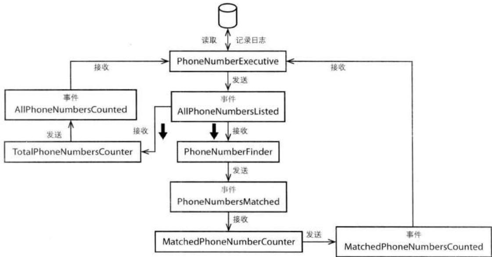


图4.9 长时处理过程启动多个并行的处理过程，然后对其进行跟踪。图中大的箭头表示并行处理的开始，之后两个过滤器将接收到相同的事件。


## 设计长时处理过程的不同方法

设计长时处理过程有三种方法： 

- 将处理过程设计成一个组合任务, 使用一个执行组件对任务进行跟踪, 并对各个步骤和任务完成情况进行持久化。我们将详尽地讨论这种方法。 

- 将处理过程设计成一组聚合，这些聚合在一系列的活动中相互协作。一个或多个聚合实例充当执行组件并维护整个处理过程的状态。这种方式被 Amazon 的 Pat Helland 所提倡 [Helland]。 

- 设计一个无状态的处理过程, 其中每一个消息处理组件都将对所接收到的消息进行扩充——即向其中加入额外的数据信息——然后再将消息发送到下一个处理组件。在这种方法种, 整个处理过程的状态包含在每条消息中。 

现在，由于两个过滤器组件同时订阅了最初的事件，它们将几乎同时接收到该事件。原有的过滤器功能不变，即匹配含有“303”的文本行。新的过滤器将统计所有的文本行，在执行完毕时发出AllPhoneNumbersCounted事件，该事件中包含了所有电话号码的总数量。例如，如果总共有15个电话号码，那么该事件的count属性值即为15。 

PhoneNumberExecutive同时订阅了MatchedPhoneNumbersCounted和AllPhoneNumbersCounted事件。只有在两个领域事件都被PhoneNumberExecutive接收到时，整个并行处理过程才算完成，此时两个并行处理的结果将合二为一。PhoneNumbersExecutive所生成的日志记录为： 

3 of 15 phone numbers matched on July 15, 2012 at 11:27 PM 

日志输出在原来的基础上包含了电话号码的总数信息。虽然这里演示的例子非常简单，但是它们却是并行运行的。同时，由于有些订阅组件被部署在不同的计算节点上，此时的并行处理过程也是分布式的。 

然而，这个长时处理过程还存在一个问题。PhoneNumberExecutive无法知道所接收到的两个领域事件是否来自同一个并行处理过程。处理过程并行启动，完成事件无序地产生，那么PhoneNunmberExecutive如何知道是哪个处理过程执行 完毕了呢？在电话号码统计这个例子中，出现这个问题可能并不严重。但是，当处理真实的企业业务领域时，这样的问题却有可能是灾难性的。 

解决这个问题的第一步是在每个领域事件中加入处理过程的身份标识。这个标识可以和引发处理过程的领域事件的标识相同，比如AllPhoneNumberListed事件。此时我们可以使用UUID，请参考实体(5)和领域事件(8)。PhoneNumberExecutive只有在接收到具有相同标识的领域事件时才会输出日志记录。然而，PhoneNumberExecutive并不会等待所有事件的到达，它也是一个事件订阅方，在事件到达时将自动启动相应的处理过程。 

## 执行器和跟踪器？

有人认为执行器和跟踪器这两种概念合并成一个对象——聚合——是最简单的方法。此时，我们在领域模型中实现这样一个聚合，再通过该聚合来跟踪长时处理过程的状态。这是一种解放性的技术，我们不需要开发一个单独的跟踪器来作为状态机，而事实上这也是实现基本长时处理过程的最好方法。 

在六边形架构中，端口-适配器的消息处理组件将简单地将任务分发给应用服务（或命令处理器），之后应用服务加载目标聚合，再调用聚合上的命令方法。同样，聚合也会发出领域事件，该事件表明聚合已经完成了它的处理任务。 

这种方式很像Pat Helland所提倡的方法。他将此称为合伙活动 (Partner Activity) [Helland]，这也是在“设计长时处理过程的不同方法”一节中所提到的第二种方法。然而，将执行器和跟踪器分开讨论是一种更有效的方法。 

在实际的领域中, 一个长时处理过程的执行器将创建一个新的类似聚合的状态对象来跟踪事件的完成情况。该状态对象在处理过程开始时创建, 它将与所有的领域事件共享一个唯一标识。同时, 将处理过程开始时的时间戳保存在该状态对象中也是有好处的 (原因请参考本章后续内容)。长时处理过程的状态对象如图4.10所示。 

当并行处理的每个执行流运行完毕时，执行器都会接收到相应的完成事件。然后，执行器根据事件中的过程标识获取到与该过程相对应的状态跟踪对象实例，再在这个对象实例中修改该执行流所对应的属性值。 

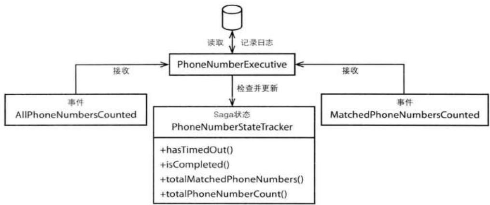


图4.10 PhoneNumberStateTracker作为长时处理过程的状态对象，它用于跟踪处理进度。PhoneNumberStateTracker是一个聚合。


长时处理过程的状态实例通常有一个名为isCompleted()的方法。每当某个执行流执行完成，其对应的状态属性也将随之更新，随后执行器将调用isCompleted()方法。该方法检查所有的并行执行流是否全部运行完毕。当isCompleted()返回true时，执行器将根据业务需要发布最终的领域事件。如果该长时处理过程是更大的并行处理过程的一个分支，那么向外发布该事件便是非常有必要的了。 

有些消息机制可能并不能保证消息的单次投递 (Single Delivery) $^{7}$ 。对于一个领域事件有可能被多次投递的情况，我们可以通过长时处理过程的状态实例来消除重复。那么，这是否需要消息机制提供额外的特殊功能呢？让我们看看在没有这些特殊功能的时候应该如何处理。 

当一个完成事件到达时，执行器将检查该事件中相应的状态属性，该状态属性表示该事件是否已经存在。如果状态已经被设值，那么该事件便是一个重复事件，执行器将忽略该事件，但是还是会对该事件做出应答 $^{8}$ 。另一种方式是将状态对象设计成幂等的。这样，如果执行器接收到了重复消息，它将同等对待，即执行器依然会使用该消息来更新处理过程的状态，但是此时的更新不会产生任何效果。在以上两中方法中，虽然只有第二种方法将状态对象本身设计成幂等的，但是在结果上他们都能达到消息传输的幂等性。关于事件消重的更多讨论，请参考领域事件(8)。 

对于跟踪有些长时处理过程来说, 我们需要考虑时间敏感性。在过程处理超时, 我们既可以采用被动的, 亦可以采取主动。回忆一下, 状态跟踪器可以包含处理过程开始时的时间戳。如果再向跟踪器添加一个最大允许处理时间, 那么执行器便可以管理那些对时间敏感的长时处理过程了。 

被动超时检查由执行器在每次并行执行流的完成事件到达时执行。执行器根据状态跟踪器来决定是否出现超时，比如调用名为hasTimedOut()的方法。如果执行流的处理时间超过了最大允许处理时间，状态跟踪器将被标记为“遗弃”状态。此时，执行器甚至可以发布一个表明处理失败的领域事件。被动超时检查的一个缺点是，如果由于某些原因导致执行器始终接收不到完成领域事件，那么即便处理过程已经超时，执行器还是会认为处理过程正处于活跃状态。如果还有更大的并发过程依赖于该过程处理，那么这将是不可接受的。 

主动超时检查可以通过一个外部定时器来进行管理。比如，一个JMX的TimerMBean实例便可以用来获取一个被Java管理的定时器。在处理过程开始时，定时器便被设以最大允许处理时间。定时时间到时，定时监听器将访问状态跟踪器的状态。如果此时的状态显示处理还未完毕，那么处理状态将被标记为“遗弃”状态。如果此时处理过程已经完毕，那么我们可以终止定时。主动超时检查的一个缺点是，它需要更多的系统资源，这可能加重系统的运行负担。同时，定时器和完成事件之间的竞态条件有可能会造成系统失败。 

长时处理过程通常和分布式并行处理联系在一起，但是它与分布式事务没有什么关系。长时处理过程需要的是最终一致性。我们应该慎重地设计长时处理过程，在基础设施或处理过程本身失败的时候，我们应该能够采取适当的修复措施。只有在执行器接收到整个处理过程成功的通知时，我们才能认为处理过程的各个参与方达到了最终一致性。诚然，对于有些长时处理过程来说，整个处理过程的成功并不需要所有的并行执行流都成功。还有可能出现的情况是，一个处理过程在成功完成之前可能会延迟好几天的时间。但是，如果一个处理过程被搁浅，那么所有的参与系统都将处于一种不一致的状态，此时做出一些补偿是必要的。但是，补偿可能增加处理过程的复杂性。还有可能是，业务需求是允许失败情况发生的，而此时采用工作流方案可能更加合适。 

SaaSOvation公司在不同的限界上下文之间采用了事件驱动架构。ProjectOvation团队将使用最简单形式的长时处理过程来管理为Product实例创建Discussion的过程。他们首选六边形架构，以在整个企业范围之类发布领域事件。 


值得注意的事, 长时处理过程的执行器可以发布一个或者多个事件来触发并行处理流程。同时, 事件的订阅方也不见得只能有两个, 而是可以有多个。换句话说, 在一个长时处理过程中, 可能存在许多彼此分离的业务处理过程同时运行。因此, 上面的简单例子只是向大家演示了长时处理过程的基本概念。 

当与遗留系统的集成存在很大的时间延迟时，采用长时处理过程将非常有用。当然，即便时间延迟和遗留系统并不是我们的主要关注点，我们依然能从长时处理过程中得到好处，即由分布式和并行处理所带来的优雅性，这样也有助于我们开发高可伸缩性、高可用性的业务系统。 

有些消息机制中已经内建了对长时处理过程的支持，这可以大大提高这些软件本身的采用率。其中一个例子便是[NServiceBus]，在NServiceBus中，长时处理过程被称为Saga。另一个例子是[MassTransit]。 

## 事件源

有时，我们的业务可能需要对发生在领域对象上的修改进行跟踪。此时的跟踪有不同的层次，而每个层次又对应有不同的方法。通常来说，业务人员可能只关心某些实体的创建时间、最后修改时间和是谁做的修改等信息。这是一种非常简单的跟踪方式，而对于领域模型中每次单独的改变，这种方式并没有提供任何信息。 

随着人们要求更多的变化跟踪，业务层也需要更过的元数据。业务层开始关心每一次单独操作，甚至希望得到某个业务操作的执行时间。这些需求要求维护一份审计日志（Audit Log）。然而，审计日志也是存在局限的，虽然它包含了系统中的一些事件发生信息，甚至可以用于系统调试，但是我们并不能检查单个领域对象在改变前和改变后的状态。那么，如果我们希望从变化跟踪中得到更多的信息，应该怎么办呢？ 

作为程序员, 我们已经接触过一些优秀的变化跟踪工具, 其中最常见的非源代码库莫属了, 比如CVS、Subversioin、Git或Mercurial等。这些源代码管理工具都有一个相同的功能: 它们都知道如何跟踪对每一个源代码文件的修改。这些工具使得我们从头到尾浏览对一个文件的修改。当把所有的源文件都提交给这些工具管理时, 我们便可以跟踪软件在整个开发过程中的各种变化。 

现在, 如果我们将这种概念应用在单个实体上, 然后用在单个聚合上, 再用于模型中的每个聚合, 那么我们便能体会到在对象层面上跟踪变化的好处, 进而体会到变化跟踪对于整个系统的好处。因此, 我们希望有种方式能够记录下诸如 “创建聚合” 这样的操作。有了所有操作的历史数据, 我们甚至可以支持临时模型。这 个层面上的变化跟踪便是事件源 (Event Sourcing) 的核心 $^{9}$ 。事件源模式如图4.11所示。 

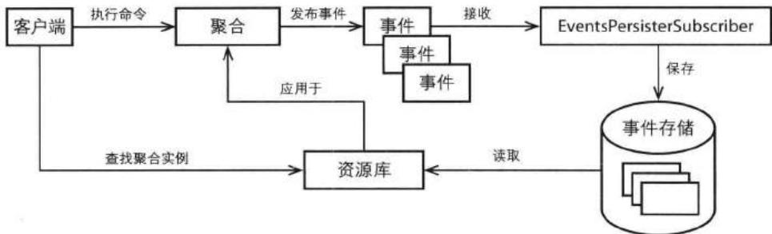


图4.11 从高层次看事件源，由聚合发布的事件被保存到事件存储中，同时这些事件被用于跟踪模型的状态变化。资源库从事件存储中读取事件，并将这些事件应用于对聚合状态的重建。


事件源存在多种定义，在此做些澄清是有必要的。我们这里所说的事件源是指：对于某个聚合上的每次命令操作，都有至少一个领域事件发布出去，该领域事件描述了操作的执行结果。每一个领域事件都将被保存到事件存储（Event Store, 8）中。每次从资源库中获取某个聚合时，我们将根据发生在该聚合上的历史事件来重建该聚合实例，事件的作用顺序应该与它们的产生顺序相同 $^{10}$ 。换句话说，第一个发生的事件将最先起作用，根据事件信息，聚合执行相应的操作以更新自身的状态。接着，第二个发生的事件进一步修改聚合状态。这样依次进行，直到所有的事件都被“重放”为止。此时，聚合的状态应该和最后一次命令执行后的状态相同。 

## 移动的目标？

业界对于事件源的定义并没有达成统一，直到我写这本书时，这个问题都还没有解决。就像其他新技术一样，我们将不断地对事件源进行改进。本书所展现的是事件源在用于DDD时的一些核心方面，同时包含了事件源有可能的一些发展方向。 

随着时间的增长, 发生在聚合实例上的事件将越来越多, 那么, 重放这些成百上千的事件是否会对模型的处理造成影响呢? 对于那些业务操作繁忙的模型来说, 这种影响至少是存在的。 

为了避免这种瓶颈, 我们可以通过聚合状态 “快照” 的方式来进行优化。我们可以创建一个聚合内存状态的快照, 此时的快照反映了聚合在事件存储历史中某个事件发生后的状态。为了达到这样的目的, 我们需要利用该事件及其发生前的所有事件来重建聚合实例, 之后对聚合状态进行序列化, 再把序列化之后的快照保存在事件存储中。这样一来, 我们便可以先通过聚合快照来实例化某个聚合, 接着再 “重放” 比快照更新的事件来修改聚合的状态, 最终使聚合达到最后一个事件发生后的状态。 

快照并不是随意创建的，而是可以在所发生的事件达到某个数量时才创建的。根据项目的实际情况，团队可以自行确定一个数量值。比如，我发现当两个快照之间的事件数在50到100个之间时，我们可以获得最优的聚合获取性能。 

更多的，我们将事件源看成是一种技术解决方案。在没有事件源的情况下，我们同样可以创建能够发布领域事件的领域模型。作为一种持久化机制，事件源可以取代ORM。但同时，事件源和ORM又存在很大的不同。事件通常以二进制的方式保存在事件存储中，这使得事件源不能用于查询操作。事实上，为事件源所设计的资源库只需要一个接受聚合唯一标识为参数的查询方法。因此，我们需要另外一种方法来支持查询，通常将CQRS和事件源一同使用 $^{11}$ 。 

事件源为我们提供了设计领域模型的新思路。从最基本的层面来看，事件历史可以用来消除系统中的bug，对调试也有很大的益处。事件源有助于获得高吞吐量的领域模型，从而极大地提高事务处理效率。比如，向单张数据库表中追加事件是非常快的。另外，事件源还有助于提高CQRS查询模型的伸缩性，因为此时查询模型的数据源可以在事件存储更新之后得到静默更新。这样做的另外一个好处是，我们可以复制多个查询模型的数据源实例以满足更多的新增客户。 

然而，技术上的优势并不总能提高业务上的优势。无论如何，让我们考虑以下几种由事件源的技术优势所带来的业务优势： 

- 用新的或者修改后的事件向事件存储打补丁可以修正许多问题。这对于业务来说可能不那么显而易见，但是这些补丁可以在很大程度上减少由模型中的bug所带来的系统问题。 

- 除了补丁之外, 我们可以通过重放一组事件的方式来重做或撤销对模型的修改。 

- 有了所有事件的历史信息，业务层便可以考虑很多诸如“如果……会怎么样？”的问题。即通过重放一组发生在聚合上的事件，业务层可以得到很多问题的答案。通过模拟这些虚拟的业务场景，业务层可以从中获得不少好处，而这也是实现业务智能化的一种方式。 

附录A为我们详尽地阐述了如何在聚合上实现事件源，同时还讲解了在CQRS中如何创建视图投射（View Projection）。更多信息请参考[Dahan, CQRS]和[Nijof, CQRS]。 

## 数据网织和基于网格的分布式计算

## 由Wes William撰写

随着软件系统越来越复杂, 用户越来越多, 需求也更加地 “大数据” 化, 传统的数据库可能会成为系统的性能瓶颈。面临这种现实的企业别无其他选择, 只能在计算能力上寻求解决。数据网织 (Data Fabric) ——有时也称为网格计算 $^{12}$ ——可以满足这种性能上的需求。 

## 牛仔的逻辑

AJ: “你想用一杯酒来交换一些信息吗？” 

LB: “不好意思，J。我们这里只接受缓存。” 


数据网织的一个好处是它对领域模型提供了自然的支持，几乎消除了所有的阻抗失配。事实上，分布式缓存可以非常容易地对领域模型进行持久化，此时可以将它看成是一种聚合存储（Aggregate Store） $^{13}$ 。简单地说，在数据网织中，聚合即 是基于图的缓存中的值部分 $^{14}$ ，而聚合的唯一标识则是标识键。这里的键即是聚合的唯一标识。聚合的状态将被持久化为二进制数据或文本数据，这些数据便是值部分的内容： 

```txt
String key = product.productId().id();
byte[] value = Serializer Ignalize(product);
// region (GemFire) or cache (Coherence)
region.put(key, value); 
```

因此, 数据网织能够很好地在技术层面上与领域模型保持一致, 从而在很大程度上缩短开发周期 $^{15}$ 。 

上例向我们展示了数据网织是如何将领域模型存放在缓存中的。那么，有了这样的数据网织，我们将如何使用长时处理过程来支持CQRS架构和事件驱动架构呢？ 

## 数据复制

考虑一个内存数据缓存, 我们可以立刻想到由缓存失败造成系统状态丢失的种种可能性。这是一个真实存在的问题, 但是在允许数据复制的数据网织中, 这并不是什么大问题。 

在使用 “一个缓存对应一个聚合” 的策略时, 让我考虑一下由数据网织提供的内存缓存。在这种情况下, 某个聚合类型的资源库由一个专门的缓存提供支持。只支持单个节点的缓存是很容易失效的。然而, 一个具有多节点缓存的数据网织则是可靠的。根据节点有可能的失效数目, 你可以选择不同层次的数据冗余性。由于多个缓存节点的存在, 失效的几率将随之变小。同时你可以从数据冗余性中获得更高的性能, 因为性能受到节点数目的影响。 

对于缓存冗余性的工作机制, 这里有一个例子: 其中一个节点作为主缓存, 其他节点作为二级缓存。如果主缓存失效, 其中一个二级缓存将会成为新的主缓存。当先前失效的主缓存恢复之后, 新主缓存中的数据将被复制到恢复后的缓存中, 此时该恢复后的缓存将变为二级缓存。 

这种做法的另一个好处是, 它可以保证对数据网织所发出事件的正确投递。因此, 在聚合更新之后, 数据网织所发出的事件是不会丢失的。显然, 对于保存核心的领域模型来说, 缓存冗余性和数据复制扮演着重要的角色。 

## 事件驱动网织和领域事件

数据网织可以很好地支持事件驱动架构风格，因为它能确保对事件的投递。大多数数据网织都有内建的事件支持，即可以对缓存层面和入口层面上所发生的操作自动地发出事件通知。这些事件不应该和领域事件产生混淆。比如，一个缓存层面的事件用于通知诸如“重新初始化缓存”这样的操作；一个入口层面的事件描述诸如“创建入口和更新入口”等操作。 

数据网织是支持开放架构的，因此应该有种方法可以从聚合中直接发布领域事件。此时，领域事件可能需要继承框架中的某种事件类型，比如GemFire中的EntryEvent，但是相比起这些领域事件所提供的强大功能来说，这种继承只是很小的代价。 

那么, 我们究竟应该如何在数据网织中使用领域事件呢? 就像在领域事件 (8) 中所讨论到的一样, 此时的聚合应该使用一个简单的DomainEventPublisher组件。对于数据网织的缓存来说, 这个发布组件可能只是简单地将事件放在某个特定的缓存中。此后, 缓存事件 (Cached Event) 将通过同步或异步的方式送达订阅方。因此, 为了不浪费内存, 我们可以在得到所有订阅方的应答之后, 将缓存事件从缓存图中移除掉。当然, 当事件被发送到消息队列或用于刷新CQRS的查询模型时, 这个事件只会得到一次应答。 

对于领域事件的订阅方来说, 他们可以将事件用于同步地更新其他相关的聚合, 由此最终一致性也得到了保证。 

## 持续查询

有些数据网织支持一种名为持续查询 (Continuous Query) 的事件通知。客户端可以向数据网织注册一个查询，当对缓存的修改可能影响到查询结果时，客户端将自动接收到事件通知。持续查询可以用于用户界面组件，此时用户界面组件可以监听那些有可能影响用户视图的修改。 

CQRS可以很好地与持续查询相结合，此时我们假设查询模型由数据网织维护。此时，我们不用等到视图表更新，而可以直接通过持续查询来及时地更新视图。在下面的例子中，一个客户端注册了一个GemFire持续查询事件： 

```txt
CqAttributesFactory factory = new CqAttributesFactory();
CqListener listener = new BacklogItemWatchListener();
factory.addCqListener(listener);
String continuousQueryName = "BacklogItemWatcher";
String query = "select * from /queryModelBacklogItem qmbli " + "where qmbli.status = 'Committed'";
CqQuery backlogItemWatcher = queryService.newCq(continuousQueryName, query, factory.create()); 
```

现在，数据网织便可以通过客户端中的一个回调对象来更新CQRS查询模型，该回调对象由CqListner创建。同时，所传给回调对象的数据还包含了新增的或更新的元数据。 

## 分布式处理

数据网织的另一个功能是, 它可以在所有复制缓存范围内完成分布式处理, 然后将处理结果聚合到一起发给客户端。这使得数据网织可以用于事件驱动的、分布式的并行处理过程中, 比如长时处理过程。 

为了演示以上功能, 我们来看看GemFire和Coherence的一些实现细节。此时, 长时处理过程的执行器可以实现为GemFire中的一个函数 (Function), 或者Coherence中入口处理器 (Entry Processor)。这两者都实现了命令模式(Command) [Gamma et al.], 用于在分布式的复制缓存中执行命令。(你也可以将此想为领域服务, 但是它并不会以领域为中心) 为了使概念一致, 我们将此功能统一称为函数。一个函数可以选择性地使用一个过滤器来去除掉那些不满足条件的聚合实例。 

让我们来看看一个实现了长时处理过程的函数是如何处理先前的电话号码例子的。这个处理过程将在复制缓存中并行执行，使用的是GemFire函数： 

```java
public class PhoneNumberCountSaga extends FunctionAdapter {
    @Override
    public void execute(FunctionContext context) {
    Cache cache = CacheFactory.getAnyInstance();
    QueryService queryService = cache.getQueryService();

    String phoneNumberFilterQuery = (String) context.getArguments();
    ... 
```

## //伪代码

// -执行函数以获取MatchedPhoneNumbersCounted。 

//-通过调用aggregator.sendResult(MatchedPhoneNumbersCounted)将答//案发送给聚合器。 

//-执行函数以获取AllPhoneNumbersCounted。 

//-通过调用aggregator.sendResult(AllPhoneNumbersCounted)将答案发送给聚合器。 

//-聚合器从每个分布式的函数返回中自动地收集答案，然后将聚合 

//之后的单一答案发送给客户端 

客户端可以通过以下方式来并行地执行一个长时处理过程： 

```txt
PhoneNumberCountProcess phoneNumberCountProcess =
    new PhoneNumberCountProcess();

String phoneNumberFilterQuery =
    "select phoneNumber from /phoneNumberRegion pnr "
    + "where pnr.areaCode = '303'";

Execution execution =
    FunctionService.onRegion(phoneNumberRegion)
    .withFilter(0)
    .withArgs(phoneNumberFilterQuery)
    .withCollector(new PhoneNumberCountResultCollector());

PhoneNumberCountResultCollector resultCollector =
    execution.execute(phoneNumberCountProcess);

List allPhoneNumberCountResults = (List) resultsCollector.getResult(); 
```

当然, 我们可以将以上处理过程变得更加复杂, 也可以将其简化。这也说明, 一个长时处理过程不见得一定是事件驱动的, 而是可以通过其他并行处理方式来完成的。关于基于数据网织的分布式和并行处理的更多内容, 请参考[GemFire Functions]。 


## 本章小结

在本章中, 我们学习了DDD的若干种架构风格和架构模式。这并不是一个关于DDD架构的详尽清单, 因为还有很多种架构选择。比如, 我们并没有将MapReduce考虑在内, 那是我们将在未来讨论的一个话题。 

- 我们讨论了传统的分层架构，并且学习了如何使用依赖倒置原则来改进分层架构。 

- 我们学习了六边形架构，这是DDD的首选架构。 

- 我们学习了如何将DDD应用在SOA、REST、数据网织环境中。 

- 我们学习了CQRS，并且了解了它是如何简化应用程序的某些方面的。 

- 我们学习了事件驱动是如何工作的，包括管道和过滤器、长时处理过程和事件源。 

接下来, 我们将转向DDD的战术建模。 

# 第5章 实体

我才是Chevy Chase……而你不是。 

—Chevy Chase 

开发者趋向于将关注点放在数据上，而不是领域上。这对于DDD新手来说也是如此，因为在软件开发中，数据库依然占据着主导地位。我们首先考虑的是数据的属性（对应数据库的列）和关联关系（外键关联），而不是富有行为的领域概念。这样做的结果是将数据模型直接反映在对象模型上，导致那些表示领域模型的实体（Entity）包含了大量的getter和setter方法。另外，还存在大量的工具可以帮助我们生成这样的实体模型。虽然在实体模型中加入getter和setter并不是什么大错，但这却不是DDD的做法。 

SaaSOvation的开发者便陷入了这样的陷阱中, 我们需要汲取他们的经验教训。 

## 本章学习路线图

- 当对具有“唯一性”的事物进行建模时，为什么需要考虑使用实体。 

- 学习如何生成实体的唯一标识。 

- 学习如何从实体设计中捕获通用语言。 

- 学习如何表达实体的角色和职责。 

- 学习如何对实体进行验证和持久化。 

## 为什么使用实体

当我们需要考虑一个对象的个性特征, 或者需要区分不同的对象时, 我们引入实体这个领域概念。一个实体是一个唯一的东西, 并且可以在相当长的一段时间内持续地变化。我们可以对实体做多次修改, 故一个实体对象可能和它先前的状态大不相同。但是, 由于它们拥有相同的身份标识 (identity), 它们依然是同一个实体。 

随着对象的改变, 我们可能会跟踪这样的改变过程, 比如什么时候发生了改变, 发生了什么改变, 是谁做出的改变等。也或者, 当前对象中已经包含了足够的先前状态的改变信息, 此时我们便没有必要显式地对对象状态进行跟踪。即便我们并不打算跟踪对象的每一个变化细节, 我们也应该慎重对待在对象整个生命周期中所发生的合法改变。唯一的身份标识和可变性 (mutability) 特征将实体对象和值对象 (Value Objects, 6) 区分开来。 

有时，实体并不见得是一种适当的建模工具，而我们对实体的使用也有可能是不恰当的。很多时候，一个领域概念应该建模成值对象，而不是实体对象。这也意味着DDD并不总能满足我们的业务需求，一个基于CRUD（译注：Create、Retrieve、Update、Delete，即增删改查）的软件系统可能更加合适，同时又可以为你节约了时间和金钱。但问题是，购买一套基于CRUD的软件系统通常并不能为你节约这两种宝贵的资源。 

我们将太多的投入放在开发数据库表编辑器上。但是如果工具选择不当，一个基于CRUD的系统可能是非常昂贵的。在有理由使用CRUD时，对语言和框架的选择就很重要了，此时可以选择Groovy和Grails、Ruby on Rails等。 

## 牛仔的逻辑

AJ: “我刚才踩在什么样的CRUD（渣滓）上了？” 

LB: “是奶牛馅饼，J！” 

AJ: “我知道馅饼是什么,有苹果馅饼和樱桃馅饼。” 


LB: “常言道，不要在热天踢到奶牛馅饼上。还好你没有。” 

另一方面，如果我们将CRUD应用在了错误的系统上——那些更复杂的，需要采用DDD的系统——就有我们后悔的了。随着软件复杂性的增加，我们就越能体会到由错误的工具选择所带来的限制。由于只从数据出发，CRUD系统是不能创建出好的业务模型的。 

在可以使用DDD的情况下, 我们会将数据模型转变为实体模型。 

我们通过标识对对象进行区分，而不是属性，此时我们应该将标识作为主要的模型定义。同时我们需要保持简单的类定义，并且关注对象在其生命周期中的连续性和唯一标识性。我们不应该通过对象的状态形式和历史来区分不同的实体对象……对于什么是相同的东西，模型应该给出定义。[Evans, p.92] 

在本章中, 我们将学到如何正确地使用和设计实体。 

## 唯一标识

在实体设计早期, 我们将刻意地把关注点放在能体现实体身份唯一性的主要属性和行为上, 同时还将关注如何对实体进行查询。另外, 我们还会刻意地忽略掉那些次要的属性和行为。 

在设计实体时, 我们首先需要考虑实体的本质特征, 特别是实体的唯一标识和对实体的查找, 而不是一开始便关注实体的属性和行为。只有在对实体的本质特征有用的情况下, 才加入相应的属性和行为[Evans, p.93]。 

那么,首先我们应该怎么做呢?找到多种能够实现唯一标识性的方式是非常重要的,同时我们还应该考虑如何在实体的生命周期内维持它的唯一性。 

实体的唯一标识并不见得一定有助于对实体的查找和匹配。将唯一标识用于实体匹配通常取决于标识的可读性。比如，如果系统提供根据人名查找功能，但此时一个Person实体的唯一标识极有可能不是人名，因为存在大量重名的情况。另一方面，如果一个系统提供根据公司税号的查找功能，此时税号便可以作为Company实体的唯一标识，因为政府为每个公司分配了唯一的税号。 

值对象可以用于存放实体的唯一标识。值对象是不变 (immutable) 的，这可以保证实体身份的稳定性，并且与身份标识相关的行为也可以得到集中处理。这样，我们便可以避免将身份标识相关的行为泄漏到模型的其他部分或者客户端中。 

以下是一些常用的创建实体身份标识的策略，从简单到复杂依次为： 

- 用户提供一个或多个初始唯一值作为程序输入，程序应该保证这些初始值是唯一的。 

- 程序内部通过某种算法自动生成身份标识，此时可以使用一些类库或框架，当然程序自身也可以完成这样的功能。 

- 程序依赖于持久化存储，比如数据库，来生成唯一标识。 

- 另一个限界上下文 (2)（系统或程序）已经决定出了唯一标识，这作为程序的输入，用户可以在一组标识中进行选择。 

接下来, 我们将依次讨论以上策略。通常来说, 每一种技术方案都存在副作用, 其中之一便出现在将关系型数据库用于对象持久化的时候, 这样的副作用将泄漏到领域模型中。在讨论实体的身份标识创建策略时, 我们将考虑标识生成的时 间、关系型数据的引用标识和ORM在标识创建过程中的作用等。另外，我们还会考虑如何保证唯一标识的稳定性。 

## 用户提供唯一标识

让用户手动地输入对象标识看起来是一种很直接的做法。这时用户将输入一些可识别的数值或符号，或者从一系列已有的标识中选择其中之一，然后创建实体对象。诚然，这是一种非常简单的方法，但是这种方法也可能变得复杂。 

复杂性之一便是需要用户自己生成高质量的标识。此时标识可能是唯一的，但却有可能是不正确的。在多数情况下，标识必须是不变的，因此用户不能对标识进行修改。但是情况并不总是如此，有时赋予用户修改标识值的权力是有好处的。例如，如果我们将Forum和Discussion的名字作为唯一标识，那么在发生拼写错误时怎么办，或者用户之后决定采用新的名字又该怎么办？如图5.1所示。要改变这些标识值，我们需要付出多大的代价？虽然用户提供的身份标识看似一种节约成本的做法，但也有可能不是。此时我们可以依赖用户来提供唯一的、正确的并且稳定的对象标识吗？ 

要避免上述问题, 我们需要重新讨论一下设计。开发团队需要采用无故障的方法来保证用户输入的的确是唯一的身份标识。虽然基于工作流的标识审批过程对于高吞吐量的领域来说并没有多大帮助, 但是它对于生成具有可读性的身份标识来说却是必需的。如果这种方式生成的标识会在将来继续使用, 而工作流也是可能的, 那么添加一个额外的阶段来保证身份标识的质量是值得的。 

我们通常将一些用户输入作为实体的属性, 这些属性可以用于对象匹配, 但是我们并不将这样的属性作为唯一身份标识。简单属性可以作为实体状态的一部分, 他们更容易修改, 在这种情况下, 我们需要考虑另外的方法来生成实体的唯一标识。 

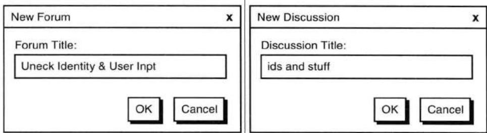


图5.1 Forum的名字拼写错误，Discussion的名字长度小于所要求的。


## 应用程序生成唯一标识

有很多可靠的方法都可以自动生成唯一标识, 但是如果应用程序处于集群环境或者分布在不同的计算节点中, 我们就需要额外小心了。有些方法可以生成完全唯一的标识, 比如UUID (Universally Unique Identifier) 或者GUID (Globally Unique Identifier)。以下是生成唯一标识的另一种方法, 其中每一步生成的结果都将添加到最终的文本标识中: 

1. 计算节点的当前时间，以毫秒记 

2. 计算节点的IP地址 

3. 虚拟机 (Java) 中工厂对象实例的对象标识 

4. 虚拟机 (Java) 中由同一个随机数生成器生成的随机数 

以上可以产生一个128位的唯一值。通常该唯一值通过一个32字节或36字节的16进制数的字符串来表示。在使用36字节时，我们可以用连字符（-）来连接以上各个步骤所生成的结果，比如f36ab21c-67dc-5274-c642-1de2f4d5e72a。在不用连字符时，该标识即为32字节。但无论如何，这都是一个很大的唯一标识，并且不具有可读性。 

在Java世界里，以上方法被标准的UUID生成器所替代了(自从Java 1.5)，相应的Java类是java.util.UUID。该类支持4种不同的唯一标识生成算法，这些算法都基于Leach-Salz变量。使用Java标准API，我们可以简单地生成伪随机的唯一标识： 

```java
String rawId = java.util.UUID.randomUUID().toString(); 
```

以上代码使用了第4类算法，该算法采用高度加密的伪随机数生成器，而该生成器又基于java.security.SecureRandom生成器。第3类算法采用对名字加密的方法，它使用了java.security.MessageDigest类。我们可以通过以下方式生成一个基于名字的UUID： 

```java
String rawId = java.util.UUID.nameUUIDFromBytes("Some text".getBytes()).toString(); 
```

另外, 我们还可以对所生成的伪随机数进行加密: 

```javascript
SecureRandom randomGenerator = new SecureRandom(); 
```

```javascript
int randomNumber = randomGenerator.nextInt(); 
```


## 第5章 实体

```txt
String randomDigits = new Integer(randomNumber).toString();
MessageDigest encryptor = MessageDigest.getInstance("SHA-1");
byte[] rawIdBytes = encryptor.digest(randomDigits.getBytes()); 
```

接下来，剩下的工作只是将rawIdBytes数组转换成16进制数的字符串表示即可。此时我们可以先将随机数转换成字符串类型，再将该字符串传给UUID的nameUUIDFromBytes()工厂[Gamma et al.]方法。 

除此之外，还有另外的身份标识生成工具，比如java.rmi.server.UID和java.rmi.dgc.VMID，但这些工具不及java.util.UUID，这里我们不予讨论。 

UUID是一种快速生成唯一标识的方法，它不需要与外界交互，比如持久化机制。即便需要在1秒钟之内多次创建实体，UUID生成器也是可以应付的。对于有性能要求的领域来说，我们可以将UUID实例缓存起来，使其在背后不间断地向缓存中填入新的UUID值。如果缓存中的UUID实例由于服务器重启而丢失，在不同的唯一标识之间是不会存在缺口的，因为所有的标识都是随机的，因此重新向缓存中填入UUID值并不会对系统造成影响。 

对于如此大的唯一标识，有时从内存使用的角度来看可能并不实际。这时我们可以采用由持久化机制生成的8字节长标识。或者甚至4字节长的标识都已经足够了。这些方法我们将在下文中讨论。 

通常来说, 我们并不会在用户界面上显示UUID: 

f36ab21c-67dc-5274-c642-1de2f4d5e72a 

如果UUID可以隐藏起来, 或者我们可以使用可读性的引用技术, 那么我们便可以使用完整的UUID。比如, 我们可以通过E-mail或者其他消息机制来发送具有URI的超媒体资源。此时, 超媒体链接中的文本部分便可以用于隐藏UUID, 就像HTML中“<a>text<a>"里的text一样。 

根据UUID能够表达实体的唯一程度, 我们可以只使用UUID中的其中一部分来标记实体。在聚合(10)边界之内, 我们可以将缩短后的标识作为实体的本地标识。本地标识表示在同一个聚合中, 一个实体的标识只需要和该聚合中的其他实体区分开来即可。而另一方面, 作为聚合根(Aggregate Root)的实体则需要全局的唯一标识。 

对于我们自己创建的标识生成器来说, 我们依然可以使用UUID的某些部分。比如对于APM-P-08-14-2012-F36AB21C, 该25字节的标识表示在敏捷项目管理上下文 (APM) 中创建的一个Product, 创建时间为2012年8月14日。额外的F36AB21C 即为UUID的第一部分, 该部分用于区分同一天所创建的不同Product。这样的标识一方面满足了可读性要求, 一方面又提供了很好的全局唯一性。当然, 用户并不是唯一的受益者, 当这样的标识从一个限界上下文传到另一个限界上下文时, 开发者可以立即识别出实体的出处。对于SaaSOvation来说, 我们还可以向标识中加入租户信息。 

将这样的标识作为String来维护并不是一个好办法，此时使用一个值对象更加合适： 

```txt
String rawId = "APM-P-08-14-2012-F36AB21C"; // 即将生成
ProductId productId = newProductId(rawId);
...
Date productCreationDate = productId.creationDate(); 
```

客户可以询问标识的细节信息，比如一个Product的创建时间等，这样的信息已经方便地包含在标识中。客户并不需要知道原始的标识格式，此时聚合根Product可以通过creationDate()方法向外界暴露该Product的创建时间，而客户并不需要知道对创建时间的获取细节。 

```java
public class Product extends Entity {
    private ProductId productId;
    ...
    public Date creationDate() {
    return this.productId().creationDate();
    }
    ...
} 
```

我们也可以通过第三方的类库和框架来生产实体的唯一标识。比如Apache Commons项目提供了一个Commons Id组件，该组件提供了5种标识生成器。 

有些持久化存储，比如NoSQL的Riak和MongoDB，也可以用于生成唯一标识。通常我们使用HTTP的PUT方法向Riak保存一个对象，此时我们需要提供一个键值： 

```txt
PUT /riak/bucket/key
[object serialization] 
```

但是，在使用POST方法保存对象时却不需要提供键值，此时Riak将自动为对象生成一个唯一标识。此外，我们还需要考虑标识及早生成和延迟生成之间的区别，我们将在本章后续内容中对此进行讨论。 

对于程序生成的标识来说,什么样的对象可以作为创建标识的工厂对象呢?对于聚合根的唯一标识,我们可以采用资源库(12)来生成唯一标识: 

```java
public class HibernateProductRepository
    implements ProductRepository {
    ...
    public ProductId nextIdentity() {
    return new ProductId(
    java.util.UUID.randomUUID().toString().toUpperCase());
    }
    ...
} 
```

将唯一标识的生成放在资源库中是一种自然的选择。 

## 持久化机制生成唯一标识

将唯一标识的生成委派给持久化机制是有特别的好处的。如果我们向数据库获取一个序列值 (Sequence) 或递增值，结果总是唯一的。 

根据标识的所需范围，数据库可以生成2字节、4字节和8字节的唯一标识。在Java中，2字节整数可以表示32,767种不同的标识值；4字节整数可以表示2,147,483,647种标识值；而一个8字节的整数则可以表示9,223,372,036,854,775,807种不同的标识值。 

性能可能是这种方法的一个缺点。从数据库中获取标识比直接从应用程序中生成标识要慢得多。一种解决方法是将数据库序列缓存在应用程序中，比如缓存在资源库中。这固然是一种好的方法，但是如果服务器节点需要重启，那么我们将失去很大一部分标识值区间。如果丢失的区间是不能接受的，又或者你只需要相对较小的标识值（2字节整数），这样的缓存机制便不实用了，并且也没有必要。当然，我们可以找回丢掉的标识值区间，但是这有可能引入新的麻烦。 

如果可以使用延迟生成的方式, 那么缓存标识便不是什么问题了。以下是如何使用Hibernate和Oracle的序列来生成标识: 

```txt
<id name="id" type="long" column="product_id">
    <generator class="sequence">
    <param name="sequence">product_seq</param>
    </id>
</id> 
```

```txt
</generator>
</id> 
```

在采用MySQL的自增列时配置如下: 

```erb
<id name="id" type="long" column="product_id">
    <generator class="native"/>
</id> 
```

这种方式的性能是很好的，同时配置Hibernate映射也是简单的。但是这种方式在标识生成时间上可能存在一些不足，对此我们将稍后讨论。本节余下部分将讨论及早生成标识策略。 

## 顺序很重要

有时，标识的生成和赋值时间对于实体来说是重要的。 

及早标识生成和赋值发生在持久化实体之前。 

延迟标识生成和赋值发生在持久化实体的时候。 

以下资源库支持及早标识生成, 它的作用是通过查询来生成下一个可用的 Oracle 序列值: 

```java
public ProductId nextIdentity() {
    Long rawProductId = (Long)
    this.session()
    .createSQLQuery(
    "select product_seq.nextval as product_id from dual")
    .addScalar("product_id", Hibernate.LONG)
    .uniqueResult();

    return new ProductId(rawProductId);
} 
```

由于Hibernate将Oracle生成的序列值映射成了BigDecimal实例，我们必须通知Hibernate将product_id转化成Long类型。 

对于不支持序列的数据库来说，比如MySQL，我们应该怎么办呢？MySQL支持自增列。通常来说，只有在向MySQL中插入数据时，MySQL才会产生自增值。然而，我们依然有办法使MySQL的自增功能像Oracle的序列一样工作： 


## 第5章 实体

```sql
mysql> CREATE TABLE product_seq (nextval INT NOT NULL);
Query OK, 0 rows affected (0.14 sec)

mysql> INSERT INTO product_seq VALUES (0);
Query OK, 1 row affected (0.03 sec)

mysql> UPDATE product_seq SET nextval=LAST_INSERT_ID(nextval + 1);
Query OK, 1 row affected (0.03 sec)
Rows matched: 1 Changed: 1 Warnings: 0

mysql> SELECT LAST_INSERT_ID();
+----+
| LAST_INSERT_ID() |
+----+
|    1 |
+----+
1 row in set (0.06 sec)

mysql> SELECT * FROM product_seq;
+----+
| nextval |
+----+
|    1 |
+----+
1 row in set (0.00 sec) 
```

在MySQL中, 我们创建了一个名为product_seq的表。接着向该表中插入了一行数据, 此时nextval列中有唯一一条记录0。以上两个步骤为Product实体创建了一个模拟序列值生成器。之后的两个步骤展示了如何生成单个序列值。我们通过使nextval列自加1的方式来更新该列——product_seq表中的唯一列。更新语句使用了MySQL的一个函数——LAST_INSERT_ID来增加nextval列中的值。首先执行的是表达式参数, 执行结果赋给了nextval列。在LAST_INSERT_ID()函数中, 表达式参数nextval+1保持稳定, 当之后的SELECT LAST_INSERT_ID()语句执行时, nextval列中的值将作为结果集返回。最后, 作为测试, 我们可以使用SELECT *FROM product_seq来保证nextval的当前值就是函数的返回值。 

Hibernate 3.2.3 使用 org.hibernate.id.enhanced.SequenceStyleGenerator 来生成序列值，但是它只支持延迟标识生成（当向数据库中插入实体时）。要使资源库支持及早标识生成，我们需要自己创建一个 Hibernate 或 JDBC 查询语句。下面是在 ProductRepository 资源库中实现的 nextIdentity() 方法，该方法为 MySQL 提供及早标识生成功能： 

```txt
public ProductId nextIdentity() {
    long rawId = -1L;
    try {
    PreparedStatement ps =
    this.connection().prepareStatement(
    "update product_seq "
    + "set next_val=LAST_INSERT_ID(next_val + 1)");
    ResultSet rs = ps.executeQuery();
    try {
    rs.next();
    rawId = rs.getLong(1);
    } finally {
    try {
    rs.close();
    } catch (Throwable t) {
    // 忽略
    }
    }
    } catch (Throwable t) {
    throw new IllegalStateException(
    "Cannot generate next identity", t);
    }
    return new ProductId(rawId);
} 
```

在使用JDBC时, 我们没有必要使用另外的查询语句来获取LAST_INSERT_ID()函数的执行结果, 因为update语句已经为我们做了这件事情了。之后我们从ResultSet中取出long类型的数值, 再用该数值创建一个ProductId值对象用来表示实体标识。 

另外, 我们还可以从Hibernate中直接获得JDBC连接, 这是有点痛苦的, 但却是可能的: 

```java
private Connection connection() {
    SessionFactoryImplementor sfi =
    (SessionFactoryImplementor)sessionFactory;
    ConnectionProvider cp = sfi.getConnectionProvider();
    return cp.getConnection();
} 
```

如果没有Connection对象, 我们便不能使用PreparedStatement来获取到ResultSet, 当然也不能使用序列了。 

在使用Oracle、MySQL和其他数据库的序列功能时, 我们可以在插入操作之前创建更加紧凑、更有保证的唯一标识。 

## 另一个限界上下文提供唯一标识

如果另一个限界上下文用于给实体标识赋值, 那么我们需要对每一个标识进行查找、匹配和赋值。有关DDD集成方面的知识请参考上下文映射图(3)和集成限界上下文(13)。 

其中最重要的是精确匹配。此时用户需要提供一种或多种属性，比如账户、用户名和E-mail地址等，以精确定位需要匹配的结果。 

通常来说，匹配的输入是模糊的，这样将导致多个查询结果，此时用户需要手动地进行选择，如图5.2所示。用户输入了模糊的查找信息，通过调用外部限界上下文的API，返回的结果可能是0个、1个或多个匹配对象。接着，用户需要在结果中选择某个特定的对象。所选对象的身份标识将作为本地标识。外部实体的一些额外的属性也有可能被复制到本地实体中。 

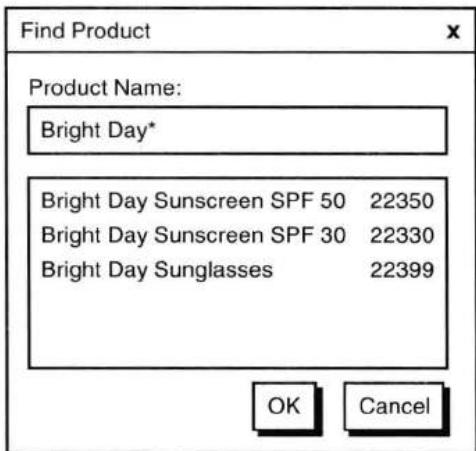


图 5.2 从外部系统中获取需要查找的唯一标识。用户界面中可以显示唯一标识（本图即如此），也可以不显示。


在这种方式中, 对象同步可能是个问题。外部对象的改变将如何影响本地对象呢? 我们如何知道所关联的对象已经改变了呢? 这个问题可以通过事件驱动架构 

(4) 和领域事件 (8) 予以解决。本地限界上下文订阅外部系统中的领域事件, 当本地上下文接收到外部系统的事件通知时, 它将相应地更新本地对象。有时同步事件可能由本地上下文发出, 外部系统在接受到该事件时同样会做相应的更新操作。 

要达到这样的目的并不容易, 但是这样做能够创建出更加具有自治性的系统。在自治系统中, 我们可以将对象查找限定在本地对象中。这并不是说将外部对象缓存在本地系统中, 而是将外部概念翻译成本地限界上下文中的概念, 请参考上下文映射图 (3)。 

这是最为复杂的标识创建策略。要维护本地实体，我们不但需要考虑由本地领域行为所导致的改变，还需要将外部系统也考虑在内。所以在使用这种策略时，我们应该持保守态度。 

## 标识生成时间

实体唯一标识的生成既可以发生在对象创建的时候，也可以发生在持久化对象的时候。有时我们需要及早地生成实体标识，而有时标识生成时间则不那么重要。在需要考虑标识生成时间时，我们应该知道需要将哪些因素考虑在内。 

让我们先考虑一种最简单的情形，此时我们允许在持久化对象时——即向数据库中插入数据时才生成实体标识，如图5.3所示。客户端只需要初始化一个Product对象，然后将其加入到资源库中。在新建Product时，客户端并不需要实体标识，这是好的，因为此时标识并不存在。只有在该Product被持久化之后，实体标识对于客户端才可用。 

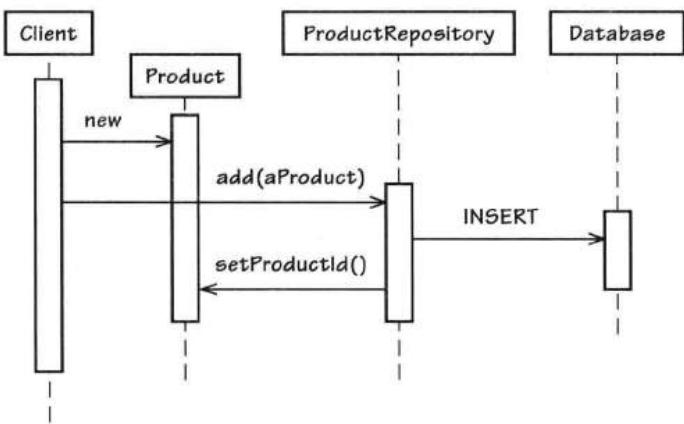


图5.3 生成唯一标识最简单的方式便是: 在持久化对象时, 通过数据存储生成。


那么，标识创建时间为什么重要呢？考虑一下当客户端需要向外界发布领域事件的情形。在Product初始化完成之后，系统将产生一个领域事件，该事件将保存在事件存储(8)中。最后，所存储的事件将被外部限界上下文中的订阅方所接收。在图5.3中，在客户端将Product加到ProductRepository之前，领域事件有可能已 经被订阅方接收到了。因此，此时领域事件中并不包含新建Product的实体标识。为了正确地创建领域事件，我们应该及早生成实体标识，如图5.4所示。客户端向ProductRepository获取下一个实体标识，然后将该标识作为参数传递给Product的构造函数。 

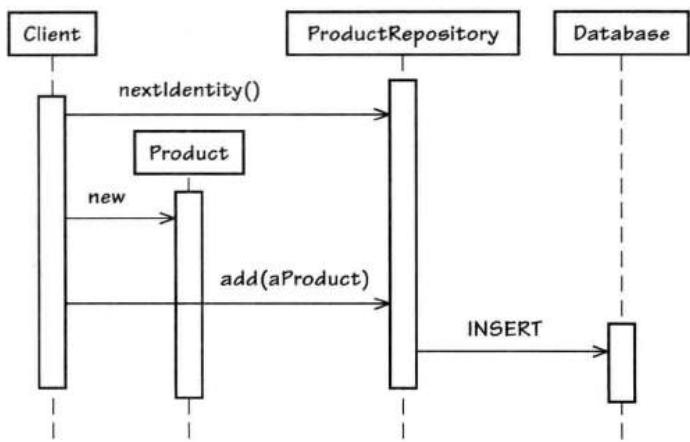


图5.4 此时的唯一标识从资源库中获取得到，并在实例化对象时赋给该对象。生成唯一标识的实现细节被资源库隐藏了。


将标识生成延迟到实体持久化时还有另外一个问题。当两个或多个实体需要加入到集合java.util.Set中时，由于此时它们都还没有实体标识，它们的默认标识值都是相等的（比如都为null，或者0，或者1）。如果实体的equals()方法比较的是实体标识，此时所有新建实体对象都被认为是同一个对象。所以只有第一个对象被保留下来，所有其他对象都被排除在集合之外。这将导致一个严重的bug，并且是一个难以查找的bug。 

要避免这样的问题, 我们有两种方法。一种方法是及早地生成实体标识, 另一种是修改实体的equals()方法, 使该方法比较对象的属性, 而不是实体标识。如果选择修改equals()方法, 此时对实体的实现就像一个值对象一样, 同时我们还需要相应地修改hashCode()方法: 

```java
public class User extends Entity {
    ...
    @Override
    public boolean equals(Object anObject) {
    boolean equalObjects = false;
    if (anObject != null &&
    this.getClass() == anObject.getClass()) {
    User typedefObject = (User) anObject;
    }
} 
```

```java
equalObjects =
    this.tenantId().equals(typedObject.tenantId()) &&
    this.username().equals(typedObject.username());
}
return equalObjects;
}

@Override
public int hashCode() {
    int hashCode =
    + (151513 * 229)
    + this.tenantId().hashCode()
    + this.username().hashCode();

    return hashCode;
}
... 
```

在一个多租户环境中，TenantId也被认为是User唯一标识的一部分。如果两个User拥有不同的TenantId，那么这两个User一定是不同的。 

对于刚才向集合中添加对象的例子来说, 我更倾向于及早地生成实体标识这种做法。因为实体的equals()和hashCode()方法最好是基于对象的唯一标识, 而不是其他属性。 

## 委派标识

有些ORM工具，比如Hibernate，通过自己的方式来处理对象的身份标识。Hibernate更倾向于使用数据库提供的机制，比如使用一个数值序列来生成实体标识。如果我们自己的领域需要另外一种实体标识，此时这两者将产生冲突。为了解决这个问题，我们需要使用两种标识，一种为领域所使用，一种为ORM所使用，在Hibernate中，这被称为委派标识（Surrogate Identity）。 

创建一个委派标识是非常直接的事情——在实体上创建一个属性来保存委派标识即可。通常来说，委派标识采用long和int类型。同时，我们还需要相应地在数据库中创建一个列来保存该委派标识，并加上主键约束。然后，在实体的Hibernate映射定义中加入<id>元素。请注意，此时的委派标识和领域中的实体标识没有任何关系，委派标识只是为了迎合ORM而创建的。 

对外界来说, 我们最好将委派标识隐藏起来, 因为委派标识并不是领域模型的一部分, 而将委派标识暴露给外界可能造成持久化漏洞。虽然一些持久化漏洞是不可避免的, 但通过向优秀的开发者学习, 我们可以尽量避免这些漏洞。 

此时, 我们可以使用层超类型 (Layer Supertype) [Fowler, P of EAA]: 

```java
public abstract class IdentifiedDomainObject
    implements Serializable {

    private long id = -1;

    public IdentifiedDomainObject() {
    super();
    }

    protected long id() {
    return this.id;
    }

    protected void setId(long anId) {
    this.id = anId;
    }
} 
```

这里的IdentifiedDomainObject便是层超类型，这是一个抽象基类，通过protected关键字，它向客户端隐藏了委派主键。所有实体都扩展自该抽象基类。在实体所处的模块(9)之外，客户端根本就不用关心id这个委派标识。我们甚至可以将protected换为private。Hibernate既可以通过getter和setter方法来访问属性，也可以通过反射机制直接访问对象属性，故无论是使用protected还是private都是无关紧要的。另外，层超类型还有其他好处，比如支持乐观锁，请参考聚合(10)。 

在Hibernate中, 我们需要将委派标识id映射到数据库表的某一列。在下面的例子中, User对象的id属性被映射到数据库表中名为id的列上: 

```xml
<hibernate-mapping default-cascade="all">
    <class
    name="com.saasovation.identityaccess.domain.model.identity.User"
    table="tbl_user" lazy="true">
    <id
    name="id"
    type="long"
    column="id"
    unsaved-value="-1">
    <generator class="native"/>
    </id>
    ...
    </class>
</hibernate-mapping> 
```