Copy-before-Write) [Keith & Stafford]。这里的“显式”表示，在修改对象之前，客户端必须通知Unit of Work。在接到通知之后，Unit of Work便会克隆相应的领域对象以做好修改准备（Unit of Work称为“编辑 (edit)”，本章后面将讨论到）。这种方式的好处在于，TopLink只有在需要的时候才会占用内存。 

## Hibernate实现

不管是对于面向集合的资源库，还是面向持久化的资源库，在创建的时候都有两个主要的步骤。首先，我们需要定义公有接口；其次，我们至少需要提供一种实现。 

对于面向集合的资源库来说, 我们首先需要定义能够模拟集合的接口, 然后再使用一种持久化机制来实现该接口, 比如Hibernate。接口的定义通常与下面的 CalendarEntryRepository 相似: 

```java
package com.saasovation.collaboration.domain.model.calendar;

public interface CalendarEntryRepository {
    public void add(CalendarEntry aCalendarEntry);
    public void的安全(
    Collection<CalendarEntry> aCalendarEntryCollection);
    public void remove(CalendarEntry aCalendarEntry);
    public void removeAll(
    Collection<CalendarEntry> aCalendarEntryCollection);
    ...
} 
```

将接口定义与它将存储的聚合放在相同的模块（9）中。在本例中，CalendarEntryRepository与CalendarEntry放在相同的模块（Java包）中。实现类将被放置在另外的包中，对此，我们将之后讨论。 

CalendarEntryRepository中的方法与集合（比如java.util.Collection）提供的方法非常相似。要添加一个新的CalendarEntry实例，我们可以调用该资源库的add() 方法。多个CalendarEntry实例可以通过addAll()方法予以添加。在CalendarEntry实例被添加之后，它们将被保存到数据存储中。之后，我们便可以通过唯一标识重新获取这些实例。与add()和addAll()方法相对应的是remove()和removeAll()方法，它们用于从集合中删除一个或多个实例。 

就个人来讲, 我并不喜欢使这些方法返回Boolean类型的结果, 因为对于一个添加方法来说, 有时返回true并不能保证对实例的成功添加。因此, 对于资源库来说, 返回void可能是更好的方式。 

有时，在单个事务中对多个聚合实例进行添加或删除并不合适。在这样的情况下，请不要使用addAll()和removeAll()方法。这些方法只是为了使用上的方便而已。对客户端来说，它可以通过循环调用add()或remove()的方式来添加或删除多个聚合实例。因此，去除addAll()和removeAll()并不能真正达到我们的目的，除非我们创建某种机制，能够在单个事务中检查到对多个实例的添加或删除。这样做需要我们在每次事务中重新初始化资源库，这样的成本是很高的，因此，我不会对此做进一步讨论。 

有时，对于有些类型的聚合实例来说，我们不允许在正常的用例中进行删除。此外，我们也可能需要将那些不再使用的对象实例保留更久的时间，比如用作参考或者出于历史原因。因此，要从系统中删除一些对象可能是非常困难的，甚至是不可能的。从业务角度来讲，删除对象是不明智的，而有时甚至是非法的。在这样的情况下，你可以将聚合实例标记为失活的（disabled）、不可用的（unusable），或者从领域的角度对其进行逻辑删除。此时，你可以不把那些删除方法放在资源库的公有接口中，或者可以在删除方法中只将聚合实例设置成不可用的。另外，你还可以通过代码检查（code review）来避免对聚合实例的删除，此时，你将对客户端代码进行仔细的检查，并保证其中不包含对删除方法的调用。当然，这只是一个选择问题，但是前一种方法要简单得多。毕竟，公有接口中的所有方法都是可用的。如果我们在逻辑上不允许进行删除操作，但是公有接口中却提供了删除方法，那么此时我们应该实现逻辑删除，而不是物理删除。 

资源库接口的另一个重要方面是查找方法： 

```java
public interface CalendarEntryRepository {
    ...
    public CalendarEntry calendarEntryOfId(
    Tenant aTenant,
    CalendarEntryId aCalendarEntryId);

    public Collection<CalendarEntry> calendarEntriesOfCalendar(
    Tenant aTenant,
    CalendarId aCalendarId);

    public Collection<CalendarEntry> overlappingCalendarEntries(
    Tenant aTenant,
    CalendarId aCalendarId,
    TimeSpan aTimeSpan);
} 
```

在上例中，calendarEntryOfId()方法允许我们通过唯一标识来获取相应的CalendarEntry聚合实例。该方法使用了显式的标识类型，即CalendarEntryId。接下来是calendarEntriesOfCalendar()方法，该方法通过传入的Calendar唯一标识查找出该Calendar中的所有CalendarEntry实例。最后是overlappingCalendarEntries()方法，该方法在calendarEntriesOfCalendar()方法的基础之上筛选出那些位于一个时间范围之内的CalendarEntry实例（时间范围通过TimeSpan表示）。 

最后, 你可能会问: CalendarEntry的全局唯一标识是如何设置的? 该功能也可以通过资源库的公共接口来完成: 

```java
public interface CalendarEntryRepository {
    public CalendarEntryId nextIdentity();
    ...
} 
```

任何需要创建新CalendarEntry实例的方法都将使用nextIdentity()来获取该新实例的CalendarEntryId: 

```javascript
CalendarEntry calendarEntry =
    new CalendarEntry(tenant, calendarId,
    calendarEntryRepository.nextIdentity(),
    owner, subject, description, timeSpan, alarm,
    repetition, location, invitees); 
```

对于实体唯一标识的创建，请参考实体（5），其中包含了如何创建领域标识和委派标识，另外还讨论了标识创建时间的重要性。 

现在, 让我们来看看该资源库的实现。对于资源库的实现类来说, 我们可以将其放在另外的模块中。有些人喜欢在聚合和资源库的模块之下新创建一个模块 (Java包), 即: 

```java
package com.saasovation.collaboration.domain.model.calendar.impl;
public class HibernateCalendarEntryRepository
    implements CalendarEntryRepository {
    ...
} 
```

这种方式使得我们可以在领域层中对资源库实现类进行管理, 但是此时的实现类需要位于一个特殊的包中。这样, 你可以将领域概念与持久化相关概念分离 开来。在上例中，我们将资源库接口定义放在了与聚合相同的包中，而将资源库的实现类放在了impl子包中，这种方式被大量的Java项目所采用。然而，在协作上下文中，团队成员们将实现类放在了基础设施层中： 

```java
package com.saasovation.collaboration.infrastructure.persistence;
public class HibernateCalendarEntryRepository
    implements CalendarEntryRepository {
    ...
} 
```

这种方式使用了依赖倒置原则(4)。此时，从逻辑上讲，基础设施层位于所有层之上，并且向下单向地引用领域层。 

这里的HibernateCalendarEntryRepository是一个Spring中的Bean，它拥有一个无参构造函数，此外它还依赖于另一个基础设施层的对象，该对象是被注入进来的： 

```java
import com.saasovation.collaboration.infrastructure
.persistence.SpringHibernateSessionProvider;

public class HibernateCalendarEntryRepository
    implements CalendarEntryRepository {

    public HibernateCalendarEntryRepository() {
    super();
    }
    ...
    private SpringHibernateSessionProvider sessionProvider;

    public void setSessionProvider(
    SpringHibernateSessionProvider aSessionProvider) {
    this.sessionProvider = aSessionProvider;
    }

    private org.hibernate.Session session() {
    return this.sessionProvider.session();
    }
} 
```

这里的SpringHibernateSessionProvider类也位于基础设施层的com. saasovation.collaboration.infrastructure.persistence模块中, 它将被注入到每一个基于Hibernate的资源库中。每个需要使用Hibernate的Session对象的方法都将调用 session()来获取Session对象；而session()方法则使用注入进来的sessionProvider来获得一个线程绑定的Session实例（请参考本章后续内容）。 

以下是对add()、addAll()、remove()和removeAll()方法的实现： 

```java
package com.saasovation.collaboration.infrastructure.persistence;

public class HibernateCalendarEntryRepository
    implements CalendarEntryRepository {

    ...
    @Override
    public void add(CalendarEntry aCalendarEntry) {
    try {
    this.session().saveOrUpdate(aCalendarEntry);
    } catch (ConstraintViolationException e) {
    throw new IllegalStateException(
    "CalendarEntry is not unique.", e);
    }
    }

    @Override
    public void的安全(Collection<CalendarEntry> aCalendarEntryCollection) {
    try {
    for (CalendarEntry instance : aCalendarEntryCollection) {
    this.session().saveOrUpdate(instance);
    }
    } catch (ConstraintViolationException e) {
    throw new IllegalStateException(
    "CalendarEntry is not unique.", e);
    }
    }

    @Override
    public void remove(CalendarEntry aCalendarEntry) {
    this.session().delete(aCalendarEntry);
    }

    @Override
    public void removeAll(Collection<CalendarEntry> aCalendarEntryCollection) {
    for (CalendarEntry instance : aCalendarEntryCollection) {
    this.session().delete(instance);
    }
    }
    ...
} 
```

这些方法的实现都非常简单, 每个方法都通过调用session()来获取Hibernate 的Session实例 (正如前面所讨论的一样)。 

你可能会感到好奇的是，add()和addAll()使用了Session的saveOrUpdate()方法。如果在客户端发生了多次添加同一个CalendarEntry的情况，这里的saveOrUpdate()方法给人一种确实在更新既有对象的感觉，但这却是一种假象。事实上，从Hibernate 3之后，任何形式的显式更新都是没有效果的。原因在于，正如上文所讲，更新是随着对象状态的变化而隐式完成的。因此，除非所添加的对象是全新的，不然该saveOrUpdate()方法是没有任何效果的。 

添加对象的方法可能会产生ConstraintViolationException异常，此时我们捕获了该异常并且将其封装成一个对客户更友好的IllegalStateException异常。当然，我们也可以创建一个具有领域含义的异常，这只是一个选择问题。这里的关键在于隐藏底层的持久化细节，我们希望把客户端与这些细节隔离开来，包括异常。 

此外, remove()和removeAll()方法便非常简单了, 我们只需要调用Seesion的delete()方法即可。但是, 在身份与访问上下文中, 存在一个一对一映射的例子, 此时我们应该小心了。对于这种关系, 我们并不能级联式地进行删除, 因此必须同时显式地删除位于关联关系两端的对象: 

```java
package com.saasovation.identityaccess.infrastructure.persistence;

public class HibernateUserRepository implements UserRepository {

    ...
    @Override
    public void remove(User aUser) {
    this.session().delete(aUser.person());
    this.session().delete(aUser);
    }

    @Override
    public void removeAll(Collection<User> aUserCollection) {
    for (User instance : aUserCollection) {
    this.session().delete(instance.person());
    this.session().delete(instance);
    }
    }
    ...
} 
```

在上例中, 一个User包含了一个Person。首先, 我们应该删除Person对象, 然后再删除聚合根User对象。如果只删除了User, 而没有删除Person, 那么在相应的数据库表中, Person将变成“孤儿 (Orphan)”。因此, 通常来说, 我们应该避免使用一 对一关联，而应该使用多对一的单向关联。然而，我故意地使用了一对一的双向关联，是因为我想向大家展示这种关联关系所带来的更大的麻烦。 

需要注意的是, 我们有多种方式都可以处理这种情况。有人可能会依赖于 ORM所提供的生命周期事件来完成对象的级联删除。我刻意地没有使用这种方式, 因为我强烈反对由聚合来管理持久化, 同时我强烈地提倡只使用资源库来处理持久化。当然, 有关这两者的争论非常激烈, 并且还在继续。因此, 在选择时, 你需要多方权衡。但是请记住, DDD专家是不会首先考虑使用聚合来管理持久化的。 

回到HibernateCalendarEntryRepository, 其中的查找方法的实现如下: 

```java
public class HibernateCalendarEntryRepository
    implements CalendarEntryRepository {

    @Override
    @SuppressWarnings("unchecked")
    public Collection<CalendarEntry> overlappingCalendarEntries(
    Tenant aTenant, CalendarId aCalendarId, TimeSpan aTimeSpan) {
    Query query =
    this.session().createQuery(
    "from CalendarEntry as _obj_ " +
    "where _obj_.tenant = :tenant and " +
    "_obj_.calendarId = :calendarId and " +
    "((_obj_.repetition_timeSpan.begins between " +
    ":tsb and :tse) or " +
    " (_obj_.repetition_timeSpan.ends between " +
    ":tsb and :tse))");

    query.setParameter("tenant", aTenant);
    query.setParameter("calendarId", aCalendarId);
    query.setParameter("tsb", aTimeSpan.begins(), Hibernate.DATE);
    query.setParameter("tse", aTimeSpan.ends(), Hibernate.DATE);

    return (Collection<CalendarEntry>) query.list();
    }

    @Override
    public CalendarEntry calendarEntryById(
    Tenant aTenant,
    CalendarEntryId aCalendarEntryId) {
    Query query =
    this.session().createQuery(
    "from CalendarEntry as _obj_ " +
    "where _obj_.tenant = ? and _obj_.calendarEntryId = ?");

    query.setParameter(0, aTenant);
    query.setParameter(1, aCalendarEntryId); 
```

```java
return (CalendarEntry) query.uniqueResult();
)

@Override
@SuppressWarnings("unchecked")
public Collection<CalendarEntry> calendarEntriesOfCalendar(
    Tenant aTenant, CalendarId aCalendarId) {
    Query query =
    this.session().createQuery(
    "from CalendarEntry as _obj_" +
    "where _obj_.tenant = ? and _obj_.calendarId = ?");

    query.setParameter(0, aTenant);
    query.setParameter(1, aCalendarId);

    return (Collection<CalendarEntry>) query.list();
    }
    ...
} 
```

以上3个查找方法都通过Session来创建Query对象。对于Hibernate来讲，我们通常使用HQL来进行查询，因此，团队成员们也采用了这种方式来创建查询条件。在执行查询时，它要么返回单个对象，要么返回一个对象集合。这里相对复杂的是overlappingCalendarEntries()方法，该方法返回位于一个时间范围之内（以TimeSpan表示）的所有CalendarEntry实例。 

最后是nextIdentity()方法的实现： 

```java
public class HibernateCalendarEntryRepository
    implements CalendarEntryRepository {
    ...
    public CalendarEntryId nextIdentity() {
    return new CalendarEntryId(
    UUID.randomUUID().toString().toUpperCase());
    }
    ...
} 
```

该方法并没有使用持久化机制或者数据存储来生产唯一标识，而是采用了相对较快并且可靠的UUID生成器。 

## TopLink实现

TopLink同时提供了Session和Unit of Work。但是，这和Hibernate是不同的，即Hibernate的Session同时也是一个Unit of Work $^{2}$ 。让我们先看看如何单独地使用TopLink中的Unit of Work，然后再看如何将其使用在资源库中。 

在没有资源库时, 我们可以通过以下方式来使用TopLink: 

```matlab
Calendar calendar = session.readObject(...);
UnitOfWork unitOfWork = session.acquireUnitOfWork();
Calendar calendarToRename = unitOfWork.registerObject(calendar);
calendarToRename.rename("CollabOvation Project Calendar");
unitOfWork.commit(); 
```

在修改对象时, 我们必须显式地通知UnitOfWork, 因此, 这种方式将更加高效。上例中的registerObject()方法返回一个对原有Calendar实例的备份。在进行编辑/修改操作时, 我们事实上是在操作该复制对象, 即上例中的calendarToRename。这样一来, TopLink便能够对修改进行跟踪。当UnitOfWork中的commit()方法执行时, 所有发生在对象上的修改都将提交到数据库中 $^{3}$ 。 

要向TopLink资源库中添加新对象是非常简单的: 

```txt
...
public void add(Calendar aCalendar) {
    this.unitOfWork().registerNewObject(aCalendar);
} 
```

在上例中, 所使用的registerNewObject()方法表明aCalendar是一个新实例。此时, 如果aCalendar是一个已经存在的实例, 那么add()方法将失败。当然, 我们也可 以使用registerObject()方法, 该方法与Hibernate的saveOrUpdate()方法具有相似的功能 (请参考前文)。不管采用哪种方式, 我们都能实现面向集合的资源库。 

但是，当我们要修改一个已有的聚合实例时，我们依然需要先对该实例进行复制。要达到这样的目的，我们需要找到一种简便的方式将该聚合实例注册到UnitOfWork中。但是到目前为止，我们还没有为其提供相应的资源库接口，因为我们不希望在资源库接口中包含与持久化相关的信息。此时，我们可以采用以下两种方式： 

```txt
public Calendar editingCopy(Calendar aCalendar);
//或者
public void useEditingMode(); 
```

在第一种方式中, editingCopy()方法首先获取到一个UnitOfWork, 然后注册Calendar实例, 最后返回对该实例的备份: 

```txt
public Calendar editingCopy(Calendar aCalendar) {
    return (Calendar) this.unitOfWork().registerObject(aCalendar);
} 
```

这也向我们展示了registerObject()方法的工作原理。当然，这种方式可能并不是你所期望的，但是它的确没有在资源库接口中透露与持久化相关的信息，并且是一种非常清晰的做法。 

在第二种方式中, 我们通过useEditingMode()方法将资源库转到编辑模式。在该方法执行之后, 所有的查找方法都会自动地将所查找到的对象注册到一个UnitOfWork中, 然后返回复制对象。此时, 我们使用资源库似乎只是为了对聚合进行修改一样。但是, 这正是使用资源库的正确方法——要么只读, 要么读取就是为了修改。同时, 这种方式也反映出, 资源库所处理的聚合拥有良好的边界, 并且倾向于事务一致性。 

要使用TopLink来实现面向集合资源库有很多种方式, 但以上是最值得使用的方式。 

## 面向持久化资源库

如果持久化机制不支持对对象变化的跟踪，无论是显式的还是隐式的，那么采用面向集合资源库便不再适用了。此时，我们可以考虑使用面向持久化资源库，这是一种基于保存操作的资源库。在使用内存数据网织(4)或者NoSQL键值对存储时，每次新建聚合或修改聚合之后，我们都需要调用资源库中的save()方法或者与之类似的方法。 

即便你所使用的ORM工具提供了对面向集合资源库的支持, 我们依然有理由使用面向持久化的资源库。如果你使用的是面向集合资源库, 但之后你决定从关系型数据库转向键值对存储, 你应该怎么办呢? 此时你不得不大规模地修改自己的应用层, 在所有更新聚合的地方, 你都得改成使用save()方法。另外, 资源库中的add()和addAll()方法也没用了, 因此你可能还会删除掉此两方法。如果你所选用的持久化机制在将来很有可能进行更换, 那么请设计更加灵活的接口以备将来之需。这样做的风险在于, 你当前的ORM工具可能会诱使你忘却使用save()方法, 因为该方法只有在更改了持久化机制之后才是必需的 $^{4}$ 。另一方面, 它的好处便是: 在将来你可以非常方便地更换持久化机制。 

## 面向持久化资源库精要

在向数据存储中添加新建对象或修改既有对象时, 我们都必须显式地调用put()方法, 该方法将以新的值来替换先前关联在某个键上的原值。这种类型的数据存储可以极大地简化对聚合的读写。正因如此, 这种数据存储也称为聚合存储 (Aggregate Store) 或面向聚合数据库 (Aggregate-Oriented Database)。 

在使用内存数据网织时, 比如GemFire或Oracle的Coherence, 内存中使用的是一个类似于java.unit HHashMap的Map实现, 其中的每一个元素都被称为一个条目 (entry)。相似地, 在使用NoSQL数据存储时, 比如MongoDB或Riak, 我们更像是在使用集合, 而不是数据库中的表、行或列。它们以键值对的方式存储数据, 也具有Map的特征, 但是它们使用的是磁盘而不是内存来做存储介质。 

虽然这里提到的两种持久化机制都大致地模拟了Map集合, 但是在保存新建对象或修改既有对象时, 我们都必须显式地调用put()方法, 该方法将以新的值来 替换先前关联在某个键上的原值。即便被修改的对象和既有的对象在逻辑上表示同一个对象，这样的替换依然会发生，因为这些持久化机制通常不会提供Unit of Word，或者并不提供事务边界以对原子的写操作进行控制。相反，每一个put()和putAll()方法都表示一个单独的逻辑事务。 

这些数据存储可以极大地简化对聚合的基本读写操作。比如，如果要将一个Product（敏捷项目管理上下文）添加到Coherence中，然后再进行读取，我们可以采用以下方式： 

```javascript
cache.put(product.productId(), product);
//稍后
product = cache.get膠(productId); 
```

这里的Product实例将通过Java标准的序列化机制自动地序列化到Coherence的Map中。但是，这个简单的接口可能是具有欺骗性的。如果你对性能有很高的要求，那么你还需要多做一点事情。在没有向Coherence注册定制化的持久化机制时，Coherence将默认使用Java标准的序列化机制，但通常来说这并不是一个好的选择，因为在序列化时，Java会向每一个对象添加额外的字节，同时它的性能也相对较低 $^{5}$ 。因此，即便你购买了一套非常高性能的数据网织产品，但是由于采用了劣质的序列化机制，那么你不得不降低数据网织所能缓存对象的数目，此时你已经享受不到该数据网织所带给你的高性能了。因此请记住，在使用数据网织时，分布式也随之被引入到了系统中。此时，在设计领域模型时，我们不得不将新的因素考虑在内，即我们需要使用一个定制化的序列化机制。这样一来，你至少需要在实现层面上做出不同的选择。 

因此，在使GemFire、Coherence、MongoDB或者Riak时，我们需要一种快速且紧凑的持久化机制在聚合对象和序列化数据之间相互转换。需要肯定的是，要实现这样的目标并不困难。比如，要为GemFire或Coherence创建一个优化的序列化机制就像在ORM中添加映射配置信息这样简单。当然，这也并不是只调用Map中的put()和get()方法这么简单。 

接下来, 让我们来看看如何通过Coherence来实现面向持久化资源库, 之后我还会谈及到MongoDB。 

## Coherence实现

和面向集合资源库一样, 我们首先需要定义接口, 然后才是实现。在下面的面向持久化资源库接口中, 我们定义了一些基于保存操作的方法, 这些方法将用于 Oracle 的 Coherence 数据网格: 

```java
package com.saasovation.agilepm.domain.model.product;
import java.util.Collection;
import com.saasovation.agilepm.domain.model.tenant.Tenant;
public interface ProductRepository {
    public ProductId nextIdentity();
    public Collection<Product> allProductsOfTenant(Tenant aTenant);
    public Product产品研发(Tenant aTenant, ProductId aProductId);
    public void remove(Product aProduct);
    public void removeAll(Collection<Product> aProductCollection);
    public void save(Product aProduct);
    public void saveAll(Collection<Product> aProductCollection);
} 
```

这里的ProductRepository并非与前面的CalendarEntryRepository全然不同。它们之间的不同之处在于保存聚合的方式。在本例中，我们使用了save()和saveAll()方法，而不是add()和addAll()方法。但是从逻辑上来说，它们都完成相似的功能。最大的不同在于客户端对这些方法的使用。在使用面向集合风格时，聚合实例只有在新创建的时候才会使用add()或addAll()方法；然而在使用面向持久化风格时，无论是创建聚合还是修改聚合，我们都必须使用save()或saveAll()方法： 

```javascript
Product product = new Product(...);
productRepository.save(product);
//稍后
Product product =
    productRepository.productId(tenantId, productId);
product.reprioritizeFrom(backlogItemId, orderIdPriority);
productRepository.save(product); 
```

除此之外，具体的细节都在实现中。因此，让我们看看以Coherence实现的资源库： 

```java
package com.saasovation.agilepm.infrastructure.persistence;

import com.tangosol.net.CacheFactory;
import com.tangosol.net.NamedCache;

public class CoherenceProductRepository
    implements ProductRepository {
    private Map<Tenant, NamedCache> caches;

    public CoherenceProductRepository() {
    super();
    this.caches = new HashMap<Tenant, NamedCache>();
    }
    ...

    private synchronized NamedCache cache(TenantId aTenantId) {
    NamedCache cache = this.caches.get(aTenantId);

    if (cache == null) {
    cache = CacheFactory.getCache(
    "agilepm.Product." + aTenantId.id(),
    Product.class.getClassLoader());

    this.caches.put(aTenantId, cache);
    }

    return cache;
    }
    ...
} 
```

在敏捷项目管理上下文中, 开发团队决定将资源库的技术实现放在基础设施层中。 

在无参构造函数中，出现了Coherence的一个关键类，NamedCache。请注意import语句中的CacheFactory和NamedCache类，它们都是与创建和使用缓存相关的。这两个类同时位于com.tangosol.net包中。 

上例中的私有方法cache()用于获取NamedCache。该方法使用了延迟创建的方式，即在第一次调用该方法时，才现场创建一个NamedCache予以返回。这主要是因为，每一个Tenant都有属于它自己的NameCache，而只有当资源库中某个公有方法被调用之后，该资源库才能访问到对应的TenantId。对于Coherence来说，存在着多种命名缓存的设计策略。在本例中，开发团队决定采用以下命名空间来命名一个NamedCache： 

1. 第一层采用限界上下文的简称: agilepm 

2. 第二层是聚合名: Product 

## 3. 第三层是每个Tenant的唯一标识: TenantId

这是有很多好处的。首先，对于由Coherence管理的每一个限界上下文、聚合和Tenant，我们都可以对其进行单独地优化与伸缩。另外，多个Tenant之间相互完全分离，因此在查询时，一个Tenant不会意外地包含另一个Tenant中的数据。这和在MySQL表中为每个Tenant创建唯一的标识具有相同的效果，而在本例中效果更加明显。再者，当需要查找某个Tenant下所有的聚合实例时，我们并不需要进行查询，而只需要从Coherence缓存中返回所有的条目即可，请参考下文中的allProductOfTenant()方法。 

每一个NamedCache都被存放在名为caches的Map中，之后在获取该NamedCache时，我们只需要传入相应的TenantId即可。 

关于Coherence的配置和优化, 还有很多需要讲的, 请参考[Seovic]。我们继续资源库的实现: 

```java
public class CoherenceProductRepository
    implements ProductRepository {
    ...
    @Override
    public ProductId nextIdentity() {
    return new ProductId(
    java.util.UUID.randomUUID()
    .toString()
    .toUpperCase());
    }
    ...
} 
```

这里的nextIdentity()方法与CalendarEntryRepository中的nextIdentity()采用了相同的实现方式，即通过一个UUID来实例化一个ProductId。该ProductId将进一步用于Coherence缓存： 

```java
public class CoherenceProductRepository
    implements ProductRepository {
    ...
    @Override
    public void save(Product aProduct) {
    this.cache(aProduct.tenantId()) 
```

```java
.put(this.idOf(aProduct), aProduct);
}

@Override
public void saveAll(Collection<Product> aProductCollection) {
    if (!aProductCollection.isEmpty()) {
    TenantId tenantId = null;

    Map<String, Product> productsMap =
    new HashMap<String, Product>(aProductCollection.size());

    for (Product product : aProductCollection) {
    if (tenantId == null) {
    tenantId = product.tenantId();
    }
    productsMap.put(this.idOf(product), product);
    }

    this.cache(tenantId).putAll(productsMap);
    }
}
...
private String idOf(Product aProduct) {
    return this.idOf(aProduct.productId());
}

private String idOf(ProductId aProductId) {
    return aProductId.id();
} 
```

通过save()方法，我们向数据网格中保存一个新建的或修改后的Product实例。该方法将先通过cache()方法获得Tenant所对应的NamedCache，再将Product实例存放到该NamedCache中。请注意idOf()方法，该方法具有两个版本，一个以Product为参数，一个以ProductId为参数。两个idOf()方法都以String的形式返回Product的唯一标识，即ProductId。因此这里的NamedCache是一个以String为键，以Product为值的Map，它实现了java.util.Map接口。 

另外，saveAll()方法可能比你想象的要复杂一点。为什么不直接遍历aProductCollection，然后对每一个元素调用save()方法呢？我们是可以这么做的，但是对于这里的Coherence缓存来说，每次调用NamedCache的put()方法都需要一次网络通信。因此，最好的方式是先将所有的Product实例存放在一个本地的HashMap中，再通过putAll()方法一次性地提交。这样，我们只需要进行一次网络通信，从而达到了优化的目的。 

```java
public class CoherenceProductRepository
    implements ProductRepository {
    ...
    @Override
    public void remove(Product aProduct) {
    this.cache(aProduct.tenant()).remove(this.idOf(aProduct));
    }

    @Override
    public void removeAll(Collection<Product> aProductCollection) {
    for (Product product : aProductCollection) {
    this.remove(product);
    }
    }
    ...
} 
```

以上的remove()方法并无特别之处。但是，对于removeAll()方法来说，你可能会认为我们也应该像saveAll()一样一次性完成操作。然而，这样做是不行的，因为标准的java.util.Map并不提供这样的功能，进而Coherence也无法做到这一点。因此，我们不得不规规矩矩地遍历aProductCollection，然后对其中的每一个元素调用remove()方法。这种方式的风险在于，在删除的过程中，如果Coherence失效，那么我们无法删除aProductCollection中的所有元素。此时，你可能会思考着是否应该提供removeAll()方法。我认为这是多虑的，因为像GemFire和Coherence这样的数据网织已经具备了很好的可用性和冗余机制。 

最后，让我们看看查找方法： 

```java
public class CoherenceProductRepository
    implements ProductRepository {
    ...
    @SuppressWarnings("unchecked")
    @Override
    public Collection<Product> allProductsOfTenant(Tenant aTenant) {
    Set<Map.Entry<String, Product>> entries = this.cache(aTenant).entrySet();

    Collection<Product> products = new HashSet<Product>(entries.size());

    for (Map.Entry<String, Product> entry : entries) {
    products.add(entry.getValue());
    }

    return products;
} 
```

```java
}
@Override
public Product productivity(Tenant aTenant, ProductId aProductId) {
    return (Product) this.cache(aTenant).get(this.idOf(aProductId));
}
...
} 
```

这里的productId()只需要调用NamedCache中的get()便可以获取到相应的Product实例。 

在上文中, 我们已经提到了allProductsOfTenant()方法。在该方法中, 我们需要做的只是从NamedCache中取出所有的Product实例即可, 不存在什么过滤条件。由于每个Tenant都拥有属于自己的缓存, 因此我们并不需要进行查询操作。 

以上便是CoherenceProductRepository的实现。我们使用了Coherence将数据保存在网格缓存中，然后再对所保存的数据进行获取。我们并没有讨论到与Coherence相关的配置、缓存索引、高性能序列化机制等问题，因为这些不属于资源库的职责，如果读者对此感兴趣，请参考[Seovic]。 

## MongoDB实现

和其他资源库实现一样，在使用MongoDB时我们也需要做出一些基本的考虑。事实上，MongoDB实现和Coherence相似。在使用MongoDB时，我们主要考虑以下几点： 

1. 将聚合实例序列化成MongoDB格式，再将MongoDB格式数据反序列化成聚合实例。MongoDB使用了一种特殊的JSON格式：BSON，这是一种二进制的JSON格式。 

2. 由MongoDB生成唯一标识, 再将其赋给聚合。 

3. 获取到MongoDB的节点/集群。 

4. 对每种类型的聚合使用一个单独的集合。某种聚合的所有实例必须以序列化文档（键值对）的形式保存在属于它们自己的集合中。 

接下来，让我们一步一步来实现MongoDB资源库。这里，我们将再次采用ProductRepository，此时你可以将其与Coherence的实现进行比较。 

```java
public class MongoProductRepository extends MongoRepository<Product> implements ProductRepository { public MongoProductRepository() { super(); this.serializer(new BSONSerializer<Product>(Product.class)); } ... } 
```

MongoProductRepository维护了一个BSONSerializer实例，它用于序列化和反序列化所有的Product实例（Product由超类MongoRepository持有）。我并不会对BSONSerializer做详细的讨论。总的来说，BSONSerializer是一个定制化的序列化类，它负责在MongoDB的DBObject实例和Product实例之间进行相互转换。 

在基本的序列化和反序列化中，BSONSerializer将直接访问对象的字段属性。这样，我们的领域对象不用实现JavaBean所规定的setter和getter方法，从而避免了导致贫血领域对象[Fowler, Anemic]。由于我们不会通过方法来访问对象字段，在有些情况下我们可能需要将一个版本的聚合迁移到另一个版本。此时，我们可以在反序列化时通过覆盖原有字段映射的方式予以解决： 

```java
public class MongoProductRepository extends MongoRepository<Product> implements ProductRepository {

    public MongoProductRepository() {
    super();

    this.serializer(new BSONSerializer<Product>(Product.class));

    Map<String, String> overrides = new HashMap<String, String>();
    overrides.put("description", "summary");
    this.serializer().registerOverrideMappings(overrides);
    }
    ...
} 
```

在上例中, 我们假设Product在先前拥有一个名为description的字段, 之后该字段被重命名为summary。要解决这个问题, 我们可以运行一个迁移脚本对MongoDB中所有的Product实例进行转化。但是, 这种做法是比较困难的, 并且非常耗时。另一种做法是, 在反序列化时, 利用BSONSerializer将BSON格式中所有 名为description的字段映射为summary。之后，在序列化时，由于我们使用的是新的summary字段，MongoDB中保持的数据也将相应地更新为summary字段。当然，这也意味着，对于那些没有进行读取进而保存的Product，它们将继续持有原来的description字段。因此，对于这种延迟迁移的做法，我们应该慎重权衡。 

接下来, 我们需要MongoDB生成对象的唯一标识: 

```java
public class MongoProductRepository extends MongoRepository<Product> implements ProductRepository { public ProductId nextIdentity() { return new ProductId(new ObjectId().toString()); } ... } 
```

此时, 我们依然使用nextIdentity()方法, 但是在实现中, 我们传入一个新建的ObjectId (转化为String类型) 来实例化一个ProductId。主要原因在于, 我们希望MongoDB使用与聚合本身相同的唯一标识。因此, 当我们在序列化一个Product时, 可以将该唯一标识映射到特殊的MongoDB_id键上: 

```java
public class BSONSerializer<T> {
    ...
    public DBOject serialize(T anObject) {
    DBOject serialization = this.toDBObject(anObject);
    return serialization;
    }

    public DBOject serialize(String aKey, T anObject) {
    DBOject serialization = this.serialize(anObject);
    serialization.put("_id", new ObjectId(aKey));
    return serialization;
    }
    ...
} 
```

第一个serialize()方法不支持这样的_id映射，客户端可以在这两个方法中自行选取。接下来，让我们看看save()方法的实现： 

```java
public class MongoProductRepository extends MongoRepository<Product> implements ProductRepository { @Override public void save(Product aProduct) { this.databaseCollection( this.collectionName(aProduct. tenantId())) .save(thisbergerize(aProduct)); } ... } 
```

和Coherence相似，在保存Product时，我们为每个Tenant都创建了单独的Product集合，并通过TenantId进行获取。该集合以MongoDB的DBCollection类表示。在MongoRepository抽象基类中，我们定义了databaseCollection()方法来获取该DBCollection对象： 

```txt
public abstract class MongoRepository<T> {
    ...
    protected DBCollection databaseCollection(
    String aDatabaseName,
    String aCollectionName) {
    return MongoDBProvider
    .database(aDatabaseName)
    .getCollection(aCollectionName);
    }
    ...
} 
```

在上例中, 我们通过MongoDatabaseProvider获取到一个数据库连接, 该连接以一个DB类型的对象表示。然后, 通过调用DB对象的getCollection()方法来获取一个DBCollection。在MongoProductRepository的实现中, 该DBCollection的名字由文本 “product” 和Tenant的唯一标识组成。在敏捷项目管理上下文中, 我们为数据库命名为agilepm, 这和Coherence对缓存的命名相似: 

```java
public class MongoProductRepository extends MongoRepository<Product> implements ProductRepository { ... protected String collectionName(TenantId aTenantId) { return "product" + aTenantId.id(); } 
```

```txt
protected String databaseName() {
    return "agilepm";
} 
```

与先前的SpringHibernateSessionProvider相似，这里的MongoDatabaseProvider用于获取一个数据库实例。 

除了用于save()方法外，DBCollection还用于对Product的查找： 

```java
public class MongoProductRepository extends MongoRepository<Product> implements ProductRepository { @Override public Collection<Product> allProductsOfTenant( TenantId aTenantId) { Collection<Product> products = new ArrayList<Product>(); DBCursor cursor = this.databaseCollection( this.databaseName(), this.collectionName(aTenantId)).find(); while (cursor.hasNext()) { DBObject dbObject = cursor.next(); Product product = this.deserialize(dbObject); products.add(product); } return products; } @Override public Product producOfId( TenantId aTenantId, ProductId aProductId) { Product product = null; BasicDBObject query = new BasicDBObject(); query.put("productId", new BasicDBObject("id", aProductId.id()); DBCursor cursor = this.databaseCollection( this.databaseName(), 
```

```javascript
this.collectionName(aTenantId)).find(query);
if (cursor.hasNext()) {
    product = this.deserialize(cursor.next());
}
return product;
} 
```

同样，这里的allProductsOfTenant()也与Coherence中的实现相似。要获取一个Tenant下所有的Product实例，我们只需调用DBCollection中的find()方法。在productId()方法中，我们向find()方法传入了一个DBObject对象，该对象描述了需要查找的Product实例。在两个查找方法中，我们都使用了DBCursor对象。在allProductsOfTenant()中，DBCursor用于返回所有的实例；而在productId()中，DBCursor返回的是第一个实例，而此时的查找结果中也只包含了一个实例。 

## 额外的行为

对于资源库来说, 除了前文讲到的那些典型的行为之外, 我们还可以向资源库接口中添加一些额外的行为。其中之一便是计算聚合实例的总数。你可能会将该行为方法命名为count(), 但是由于一个资源库应该尽可能地模拟一个集合, 因此我们可以考虑使用以下方法: 

```java
public interface CalendarEntryRepository {
    ...
    public int size();
} 
```

这里的size()方法和java.util.Collection中的一模一样。在使用Hibernate时，该方法可以实现为： 

```java
public class HibernateCalendarEntryRepository
    implements CalendarEntryRepository {
    ...
    public int size() {
    Query query =
    this.session().createQuery(
    "select count(*) from CalendarEntry");
    }
} 
```

```txt
int size = ((Integer) query.uniqueResult()).intValue();
return size;
} 
```

在数据存储（包括数据库或数据网格）中，我们可能还需要执行一些计算过程来满足某些非功能性需求。比如，我们需要将数据从数据存储中搬移到业务逻辑执行的地方，而有时这是一个非常漫长的过程。这时，我们可能需要将代码迁移到数据存储中，比如使用数据库的存储过程或者数据网格的条目处理器（entry processor），Coherence便提供了这样的功能。然而，这些功能最好应该放在领域服务（7）中，因为领域服务正是用于处理那些无状态的、特定于领域的操作。 

有时, 如果我们要获取聚合根下的某些子聚合, 我们不用先从资源库中获取到聚合根, 然后再从聚合根中获取这些子聚合, 而是可以直接从资源库中返回。在有些情况下, 这种做法是有好处的。比如, 某个聚合根拥有一个很大的实体类型集合, 而你需要根据某种查询条件返回该集合中的一部分实体。当然, 只有在聚合根中提供了对该实体集合的导航时, 我们才能这么做, 否则, 我们便违背了聚合的设计原则。我建议不要因为客户端的方便而提供这种访问方式。更多的时候, 采用这种方式是由于性能上的考虑, 比如从聚合根中访问子聚合将带来性能瓶颈的时候。此时的查找方法和其他查找方法具有相同的基本特征, 只是它直接返回聚合根下的子聚合, 而不是聚合根本身。无论如何, 请慎重使用这种方式。 

另外, 我们还有可能在资源库中创建一些特殊的查找方法。比如, 如果我们需要在用户界面中显示数据, 而这些数据来自于多个聚合, 此时我们不用先分别获取到每个聚合, 再从中提取出所需数据, 而是可以使用用例优化查询 (Use Case Optimal Query) 的方法直接查询所需要的数据。此时, 我们可以直接在持久化机制上执行查询, 然后将查询结果放在一个值对象 (6) 中予以返回。 

从资源库中返回值对象而非聚合实例并不奇怪。比如，前面我们所使用的size()方法便是如此，该方法以简单值对象的形式返回聚合实例的数目。对于用例优化查询来说也是一样的，只是此时我们返回的是一个相对复杂的值对象而已。 

在使用用例优化查询时, 如果你发现你必须创建多个查询方法, 那么这很有可能是一种坏味道, 这意味着你对聚合边界的划分是错误的。 

然而, 如果的确发生了这样的情况, 并且你确认对聚合边界的设计是正确的, 那么此时你便应该考虑使用CQRS(4)了。 

## 管理事务

对事务的管理绝对不应该放在领域模型和领域层中 $^{6}$ 。通常来说，与领域模型相关的操作都非常细粒度的，以致于无法用于管理事务，另外，领域模型也不应该意识到事务的存在。那么，对事务的管理应该放在什么地方呢？ 

通常来说, 我们将事务放在应用层 (14) 中 $^{7}$ 。[Gamma et al.]。然后为每个主要的用例创建一个门面 [Gamma et al.], 门面中的业务方法通常都是粗粒度的, 常见的情况是每一个用例流对应一个业务方法。业务方法对用例所需操作进行协调。当用户界面层 (14) 调用门面中的一个业务方法时, 该方法都将开始一个事务。同时, 该业务方法将作为领域模型的客户端而存在。在所有的操作完成之后, 门面中的业务方法将提交事务。在这个过程中, 如果发生错误/异常, 那么业务方法将对事务进行回滚。 

我们可以通过声明式的方法来管理事务, 也可以自行编码。无论采用哪种方式, 对事务的管理过程都与以下执行过程相似: 

```java
public class SomeApplicationServiceFacade {
    ...
    public void doSomeUseCaseTask() {
    Transaction transaction = null;

    try {
    transaction = this.session().beginTransaction();
    //使用领域模型
    transaction.commit();
    } catch (Exception e) {
    if (transaction != null) {
    transaction.rollback();
    }
    }
    }
} 
```

要将对领域模型的修改添加到事务中, 我们必须保证资源库实现与事务使用了相同的Session或Unit of Work。这样, 在领域层中发生的修改才能正确地提交到数据库中, 或者回滚。 

有很多方法都可以完成对事务的管理，我并不会一一列举。这里我主要讨论在一些企业级Java容器和依赖反转容器中是如何管理事务的，比如Spring。在Spring中，我们可以通过以下方式来管理事务： 

```xml
<tx:annotation-driven transaction-manager="transactionManager"/>
<bean
    id="sessionFactory"
    class="org.springframework.orm.hibernate3.LocalSessionFactoryBean">
    <property name="configLocation">
    <value>classpath:hibernate.cfg.xml</value>
    </property>
</bean>

<bean
    id="sessionProvider"
    class="com.saasovation.identityaccess.infrastructure .persistence.SpringHibernateSessionProvider"  
    autowire="byName">
</bean>

<bean
    id="transactionManager"
    class="org.springframework.orm.hibernate3 .HibernateTransactionManager">
    <property name="sessionFactory">
    <ref bean="sessionFactory"/>
    </property>
</bean>

<bean
    id="abstractTransactionalServiceProxy"
    abstract="true"
    class="org.springframework.transaction.interceptor .TransactionProxyFactoryBean">
    <property name="transactionManager">
    <ref bean="transactionManager"/>
    </property>
    <property name="transactionAttributes">
    <props>
    <prop key="*">PROPAGATION_REQUIRED</prop>
    </props>
    </property>
</bean> 
```

在上例中，sessionFactory用于获取一个Hibernate提供的Session，sessionProvider将该sessionFactory与当前线程关联起来。当基于Hibernate的资源库需要为当前线程获取一个Session实例时，它将通过sessionProvider来完成。另外，transactionManager通过sessionFactory来获取并管理Hiberante事务。余下的abstractTransactionalServiceProxy是可选的，它的作用是为需要事务管理的bean提供委派。最上面的annotation-driven使得我们通过Java注解的方式来声明事务，这种方式比显式的配置更加方便： 

```txt
<tx:annotation-driven transaction-manager="transactionManager"/> 
```

如此一来，在门面的业务方法中，我们便可以使用@Transactional注解来声明事务： 

```java
public class SomeApplicationServiceFacade {
    ...
    @Transactional
    public void doSomeUseCaseTask() {
    //使用领域模型
    }
} 
```

与先前的事务管理例子相比, 此时的业务方法更加清晰, 这也使得我们将关注点放在业务操作本身上。在这种方法中, 当业务方法执行时, Spring将自动地启动一个事务, 当方法执行完成时, 事务要么提交, 要么回滚。 

在身份与访问上下文中, 我们可以找到sessionProvider的源代码: 

```java
package com.saasovation.identityaccess.infrastructure.persistence;

import org.hibernate.Session;
import org.hibernate.SessionFactory;

public class SpringHibernateSessionProvider {

    private static final ThreadLocalita<Session> sessionHolder = new ThreadLocalita<Session>();

    private SessionFactory sessionFactory;

    public SpringHibernateSessionProvider() {
    super();
    } 
```

```java
public Session session() {
    Session threadBoundsession = sessionHolder.get();
    if (threadBoundsession == null) {
    threadBoundsession = sessionFactory.openSession();
    sessionHolder.set(threadBoundsession);
    }
    return threadBoundsession;
}

public void setSessionFactory(SessionFactory aSessionFactory) {
    this.sessionFactory = aSessionFactory;
} 
```

在Spring配置中，由于该sessionProvider被声明为autowire="byName"，在实例化时，它的setSessionFactory()方法将自动地找到名为“sessionFacotry”的bean实例，并将其作为参数传入。在本章的前面，我们给出了基于Hibernate的资源库示例代码，其中便有对SpringHibernateSessionProvider的使用： 

```java
package com.saasovation.identityaccess.infrastructure.persistence;

public class HibernateUserRepository
    implements UserRepository {

    @Override
    public void add(User aUser) {
    try {
    this.session().saveOrUpdate(aUser);
    } catch (ConstraintViolationException e) {
    throw new IllegalStateException("User is not unique.", e);
    }
    }

    private SpringHibernateSessionProvider sessionProvider;

    public void setSessionProvider(
    SpringHibernateSessionProvider aSessionProvider) {
    this.sessionProvider = aSessionProvider;
    }

    private org.hibernate.Session session() {
    return this.sessionProvider.session();
    }
} 
```

以上代码片段摘自身份与访问上下文中的HibernateUserRepository。该类也是一个Spring所管理的bean，并且使用了与sessionProvider相同的autowire机制。当setSessionProvider()方法调用时，它将找到名为“sessionProvider”的bean，并将其作为参数传入。这里的sessionProvider即SpringHibernateSessionProvider类的实例。在执行add()方法（或者其他持久化方法）时，它通过调用session()方法获取一个Session，session()方法进而使用注入的sessionProvider来获得一个线程绑定的Session实例。 

虽然我只讨论了Hibernate的事务管理，但这些原则同样适用于TopLink、JAP或者其他的持久化机制。对于其中任何一个持久化机制，我们都需要在整个业务操作中访问相同的Session、Unit of Work和由应用层所管理的事务。此时，依赖注入是一个很好的选择。但是，在没有依赖注入的情况下，我们依然可以找到很多方式来实施事务管理，甚至可以通过手动的方式将这些对象绑定到当前线程中。 

## 警告

我认为有必要给读者一个警告: 不要过度地在领域模型上使用事务。我们必须慎重地设计聚合以保证正确的一致性边界。有时, 在测试环境下, 在单个事务中修改多个聚合可能工作得很好, 但是在产品环境下, 却有可能出现由并发所导致的事务失败。在聚合 (10) 中, 我们讨论了如何准确地定义一致性边界以保证事务的成功, 读者可以自行参考。 

## 类型层级

在使用面向对象语言来开发领域模型时, 我们通常喜欢通过继承来创建类型层级。此时, 我们将默认状态和行为放在基类中, 然后创建子类对其进行扩展。为什么不呢? 这似乎是避免重复的绝佳方式。 

对于共享基类的聚合类来说, 我们可以为每一种实际的聚合类型创建一个资源库, 也可以在单个资源库中创建不同的实际聚合类。对于对继承的使用来说, 这两者是不同的。因此, 本节不会讨论所有的聚合类型都扩展自同一个层超类型 [Fowler, P of EAA] 的情况。 

我这里想讨论的是一组数目相对较少的聚合类型，它们都扩展自一个特定于领域的超类。这些关联密切的聚合所组成的类型层级具有可互换性和多态性的特征。此时，我们使用单个资源库来保存和获取层级中的不同聚合类型，而客户端无 须知道他们所使用的实际类型。这也体现了Liskov替换原则（Liskov Substitution Principle, LSP）[Liskov]。 

打个比方，你的系统需要使用外部系统提供的各种服务，而你需要处理它们之间的关系。你决定创建一个抽象基类ServiceProvider。由于每种服务既存在共同之处，又存在不同之处，因此你需要创建多个不同的实际服务类，比如WarbleServiceProvider和WonkleServiceProvider。你希望通过一种通用的方法来访问这些服务： 

```javascript
//领域模型的客户端
serviceProviderRepository.providerOf(id)
    .scheduleService(date, description); 
```

这样看来，在很多情况下，创建特定于领域的聚合类型层级的作用似乎并不大。原因在于：通常来说，资源库所提供的查找方法可以返回任何一个聚合子类的实例。这意味着查找方法所返回的应该是这些聚合子类的共有超类，就像本例中的ServiceProvider一样；而不是某个特定的子类，比如WarbleServiceProvider或WonkleServiceProvider。考虑一下，如果查找方法返回了某个特定的子类，情况会怎么样？此时，客户端需要知道什么样的唯一标识（或者其他描述属性）对应着什么样的特定实例。否则，这将导致类型不匹配，或者ClassCastException异常。即便你能正确地处理这种情况，由于此时的聚合很有可能并不完全地满足Liskov替换原则，你依然需要知道各个子类所提供的特殊操作。 

要解决唯一标识和聚合类型之间的对应问题, 你可能会想到通过唯一标识来判断应该返回什么类型的聚合。当然, 你可以这么做, 但是这同样会导致问题。客户端将负责唯一标识和聚合类型之间的映射。另外, 在客户端与特定操作之间也产生了耦合。此时的客户端代码将与以下代码相似: 

```javascript
//领域模型的客户端
if (id.identifiesWarble()) {
    serviceProviderRepository.warbleOf(id)
    .scheduleWarbleService(date, warbleDescription);
} else if (id.identifiesWonkle()) {
    serviceProviderRepository.wonkleOf(id)
    .scheduleWonkleService(date, wonkleDescription);
} ... 
```

有时，这种方式并不是有可能产生异常这么简单，它往往意味着一种代码坏味道。诚然，如果你从这样的类型层级中获得了极大的好处，那么这种一次性的使用场景也许是一个很好的折中。然而，对于目前这个并不自然的例子，使用ServiceDescription和scheduleServie()方法的内部实现似乎已经足够了。请思考：为不同的聚合类型提供单独的资源库究竟给我们带来了什么好处？在聚合子类较少的情况下，为它们使用单独的资源库可能是最好的方式。但是，随着聚合子类数目的增加，而同时它们又具有完全的可互换性时，使用一个共享的资源库便更合适了。 

多数情况下, 这个问题都可以通过在聚合中维护一个描述属性来彻底解决。请参考值对象 (6) 中对标准类型的讨论。此时, 我们只需要设计单个聚合类型, 在其内部通过不同的标准类型来实现不同的行为。在使用显式标准类型的情况下, 我们只需要创建一个实际的ServiceProvider聚合类, 然后在scheduleService()方法中根据标准类型来分发服务。同时, 我们需要确保这些逻辑不能泄露到客户端中。要达到这样的目的, 我们可以在scheduleService()方法中包含该领域特定的选择逻辑, 比如: 

```java
public class ServiceProvider {
    private ServiceType type;
    ...
    public void scheduleService(
    Date aDate,
    ServiceDescription aDescription) {
    if (type.isWarble()) {
    this.scheduleWarbleService(aDate, aDescription);
    } else if (type.isWonkle()) {
    this.scheduleWonkleService(aDate, aDescription);
    } else {
    this.scheduleCommonService(aDate, aDescription);
    }
    }
    ...
} 
```

如果内部的分发逻辑变得凌乱，我们总能通过设计更小的层级予以处理。事实上，如果你喜欢，标准类型本身便可以通过状态模式[Gamma et al.]来实现。在这种情况下，不同的标准类型将实现各自的特有行为。当然，这同样也意味着我们可以设计单个ServiceProviderRepository来保存不同类型的标准类型。 

另外, 我们还可以通过基于角色的接口来解决这个问题。比如, 我们可以设计一个SchedulableService接口, 然后让多个聚合类型都实现该接口。有关角色和职 责的讨论，请参考实体（5）。这里，虽然我们也使用了继承，但是由继承所致的多态行为并不会泄漏到客户端中。 

## 资源库 vs 数据访问对象 (DAO)

有时，资源库和数据访问对象——即DAO——被当作同义词看待。它们都提供了对持久化机制的抽象。然而，ORM工具同样也提供了对持久化机制的抽象，但是它既不是资源库，也不是DAO。因此，我们不能将所有的持久化抽象都称为DAO，而是需要确定这种模式是否得到了真正的实现。 

资源库和DAO是不同的。一个DAO主要从数据库表的角度来看待问题，并且提供CRUD操作。Martin Fowler在[Fowler, P of EAA]中将DAO相关设施与领域模型分离开来对待。他指出，诸如表模块（Table Module）、表数据网关（Table Data Gateway）和活动记录（Active Record）这样的模式应该用于事务脚本程序中。这是因为，这些与DAO相关的模式通常只是对数据库表的一层封装。而另一方面，资源库和数据映射器（Data Mapper）则更加偏向于对象，因此通常被用于领域模型中。 

在DAO模式中所执行的CRUD操作都是可以放在聚合中来实现的，因此，我们应该尽量避免在领域模型中使用这些DAO模式。在正常情况下，我们总是希望由聚合本身来管理业务逻辑。 

在前文中, 我的确也说过, 在有些情况下可以使用存储过程或数据网格的条目处理器来完成一些非功能性的操作。根据你所工作的领域, 这更像是一种规则, 而不是例外。但是, 如果不存在这样的的非功能性需求, 那么我建议你不要使用它们。更多的时候, 在数据存储中放置以及执行业务逻辑是与DDD背道而驰的。当然, 我得说, 使用数据网织函数/条目处理器并不会真正地分裂领域建模的目标。比如, 它们也是可以通过Java来实现的, 并且能够表达通用语言(1), 同时满足领域建模的目标。它们与核心模型唯一的不同在于执行场所的不同, 而这并不具有分裂性。而另一方面, 大量地使用存储过程则是具有分裂性的了, 因为此时, 建模团队并不能很好地理解存储过程所使用的语言。此外, 通常来说它们也看不到存储过程的实现, 而这些正是有悖于DDD目标的。 

通常来说，你可以将资源库当作DAO来看待。但是请注意一点，在设计资源库时，我们应该采用面向集合的方式，而不是面向数据访问的方式。这有助于你将自己的领域当作模型来看待，而不是CRUD操作。 

## 测试资源库

我们可以从两个方面对资源库进行测试。首先，我们需要测试资源库本身是能正确工作的。其次，我们还要测试对资源库的使用，以保证能够正确地保存和获取聚合实例。对于前者，我们必须使用产品环境下的资源库实现。对于后者，我们既可以使用产品实现，也可以使用内存实现。接下来，我将首先讨论前一种测试，然后再讨论后一种。 

让我们看看以Coherence实现的ProductRepository: 

```java
public class CoherenceProductRepositoryTest extends DomainTest {

    private ProductRepository productRepository;
    private TenantId tenantId;

    public CoherenceProductRepositoryTest() {
    super();
    }
    ...
    @Override
    protected void setUp() throws Exception {
    this.setProductRepository(new CoherenceProductRepository());
    this.tenantId = new TenantId("01234567");
    superCop-up();
    }

    @Override
    protected void tearDown() throws Exception {
    Collection<Product> products =
    this.productRepository()
    .allProductsOfTenant(tenantId);

    this.productRepository().removeAll(products);
    }

    protected ProductRepository productRepository() {
    return this.productRepository;
    }

    protected void setProductRepository(
    ProductRepository aProductRepository) {
    this.productRepository = aProductRepository;
    }
} 
```

对于每一个测试, 我们都需要事先做一些准备, 测试完毕之后再做一些清理工作。在准备时, 我们创建了一个CoherenceProductRepository, 然后创建一个假的TenantId实例。 

在清理时, 我们从缓存中移除掉所有的Product实例, 这些实例是在测试过程中加入缓存的。对于Coherence来说, 这是非常重要的一步。否则, 这些Product实例将在余下的测试中继续存在, 从而有可能导致余下测试的断言失败, 比如计算实例数目。 

然后, 我们开始测试资源库的行为: 

```java
public class CoherenceProductRepositoryTest extends DomainTest {
    ...
    public void testSaveAndFindOneProduct() throws Exception {

    Product product =
    new Product(
    tenantId,
    this.productRepository().nextIdentity(),
    "My Product",
    "This is the description of my product.");

    this.productRepository().save(product);

    Product readProduct =
    this.productRepository()
    .productId(tenantId, product.productId());

   胆固醇(readProduct);
    assertEquals(readProduct.tenantId(), tenantId);
    assertEquals(readProduct.productId(), product.productId());
    assertEquals(readProduct.name(), product.name());
    assertEquals(readProduct.description(), product.description());
    }
} 
```

正如测试方法名所表示的，这里我们先保存一个Product实例，然后再对其进行查找。首先，我们需要实例化一个Product 并将其保存到资源库中。在没有发生异常的情况下，我们便可以认为保存操作执行成功。但是，要确认这一点，我们只有通过一种方式，即从资源库中找到该实例，再将其与原来的Product实例进行比较。我们通过调用productOfId()方法来查找一个Product实例，该方法接受一个Product的唯一标识作为参数。之后，我们先检查所返回的Product实例是否为 null。如果不是，再将该Product实例的tenantId、productId、name和description属性分别与原有Product中相对应的属性进行比较。 

接下来, 我们测试对多个聚合实例的保存和查找: 

```txt
public class CoherenceProductRepositoryTest extends DomainTest {
    ...
    public void testSaveAndFindMultipleProducts() throws Exception {

    Product product1 =
    new Product(
    tenantId,
    this.productRepository().nextIdentity(),
    "My Product 1",
    "This is the description of my first product.");

    Product product2 =
    new Product(
    tenantId,
    this.productRepository().nextIdentity(),
    "My Product 2",
    "This is the description of my second product.");

    Product product3 =
    new Product(
    tenantId,
    this.productRepository().nextIdentity(),
    "My Product 3",
    "This is the description of my third product.");

    this.productRepository()
    .saveAll(Arrays.asList(product1, product2, product3));

    assertNotNull(this.productRepository()
    .productId(tenant, product1.productId()));
    assertNotNull(this.productRepository()
    .productId(tenant, product2.productId()));
    assertNotNull(this.productRepository()
    .productId(tenant, product3.productId"));

    Collection<Product> allProducts =
    this.productRepository().allProductsOfTenant(tenant);

    assertEquals(allProducts.size(), 3);
} 
```

在上例中, 我们首先实例化3个Product实例, 然后调用saveAll()方法一次性地将它们保存到资源库中。之后, 我们依然通过productOfId()方法来分别查找单个实例, 如果资源库所返回的3个实例都不为null, 那么我们便可以认为对这3个Product实例的持久化都是正确的。 

## 牛仔的逻辑

AJ: “我姐姐告诉我，她的丈夫给她说：‘在我死后，记得将我保存的所有东西都卖掉。’我姐问他为什么。他说：‘我不想在你再婚之后，这些东西落到一个懦夫的手中。’我姐告诉她说：‘不要担心，我不会再嫁给另一个懦夫的。’” 


资源库中还有一个方法没有被测试到，即allProductsOfTenant()方法。在资源库的缓存已完全清空的情况下，在测试执行时，我们应该能够成功地读取这3个Product实例。因此，所返回的Collection便不应该为null，即便其中的内容并不是你所期望的。这样一来，测试的最后一步便是判断所返回实例的数目，我们断言此时的数目应该为3。 

现在, 我们已经有一个测试来展示客户端对资源库的使用, 接下来我们将以更加优化的方式来测试客户端对资源库的使用。 

## 以内存实现进行测试

对于准备一个完整的资源库实现来说, 如果存在困难, 或者速度太慢, 那么我们可以考虑使用另一种方式。另外, 在领域建模早期, 你也有可能面临一些麻烦, 比如持久化机制并不可用, 或者数据库的Schema还未准备好等。此时, 我们便可以使用一个内存版本的资源库。 

创建内存资源库可以是非常简单的, 但同时也存在一些挑战。说它是简单的, 是因为我们可以用一个HashMap来实现资源库。对于一个Map来说, 调用put()和remove()方法都是非常直接的。我们只需要将全局的唯一标识作为每个聚合的键, 而将聚合实例作为相应的值。事实上, 在这种情况下, 整个ProductRepository的实现都是简单的: 

```java
package com.saasovation.agilepm.domain.model.product.impl;

public class InMemoryProductRepository implements ProductRepository {

    private Map<ProductId, Product> store;

    public InMemoryProductRepository() {
    super();
    this.store = new HashMap<ProductId, Product>();
    }

    @Override
    public Collection<Product> allProductsOfTenant(Tenant aTenant) {
    Set<Product> entries = new HashSet<Product>();
    for (Product product : this.store.values()) {
    if (product.tenant().equals(aTenant)) {
    entries.add(product);
    }
    }

    return entries;
    }

    @Override
    public ProductId nextIdentity() {
    return new ProductId(java.util.UUID.randomUUID()
    .toString().toUpperCase());
    }

    @Override
    public Product productOfId(Tenant aTenant, ProductId aProductId) {
    Product product = this.store.get(aProductId);

    if (product != null) {
    if (!product.tenant().equals(aTenant)) {
    product = null;
    }
    }

    return product;
    }

    @Override
    public void remove(Product aProduct) {
    this.store.remove(aProduct.productId());
    }

    @Override
    public void removeAll(Collection<Product> aProductCollection) {
    for (Product product : aProductCollection) {
    this.remove(product);
    }
} 
```

```java
}
@Override
public void save(Product aProduct) {
    this.store.put(aProduct.productId(), aProduct);
}

@Override
public void saveAll(Collection<Product> aProductCollection) {
    for (Product product : aProductCollection) {
    this.save(product);
    }
} 
```

对于productId()方法来说, 我们需要稍微注意一下。要正确地实现该查找方法, 在通过ProductId获取到Product实例时, 我们必须检查该Product的TenantId与传入的aTenant参数是否相同, 如果不同, 我们将返回null。 

我们几乎可以原封不动地将CoherenceProductRepositoryTest复制成InMemoryProductRepositoryTest，唯一的区别只是在于setUp()方法： 

```java
public class InMemoryProductRepositoryTest extends TestCase {
    ...
    @Override
    protected void setUp() throws Exception {
    this.setProductRepository(new InMemoryProductRepository());
    this.tenantId = newTenantId("01234567");

    superCopUp();
    }
    ...
} 
```

这里，在setUp()方法中，我们实例化了一个InMemoryProductRepository，而不是CoherenceProductRepository。除此之外，其他的测试方法都是一样的。 

对于内存资源库来说, 有可能存在的挑战在于实现更加复杂的查找方法, 此时所传入的查询参数将更难处理。在这种情况下, 你可能需要谋求另外的解决方法。比如, 在setUp()方法中, 我们可以预先向资源库中存放一些满足查询条件的聚合实例, 然后让查找方法只返回这些实例。 

内存资源库的另一个好处在于: 当你需要测试面向持久化资源库接口的save()方法时, 你可以在save()方法中计算对其本身的调用次数。在每次测试执行完后, 你可以验证资源库中的save()方法调用次数和客户端所需要的调用次数是相等的。例如，对于一个必须显式调用save()方法的应用服务来说，我们便可以采用这种方法。 


## 本章小结

在本章中, 我们深入地学习了如何实现资源库。 

- 你学习了面向集合和面向持久化的资源库，以及对它们的选取。 

- 你学到了如何通过Hibernate、TopLink、Coherence和MongoDB来实现资源库。 

- 你学到了为什么需要为资源库接口添加额外的行为。 

- 你学到了在使用资源库时，如何管理事务。 

- 你学到了为类型层级设计资源库时所面临的挑战。 

- 你学到了资源库与DAO的基本区别。 

- 你学到了如何测试资源库本身，以及如何测试对资源库的使用。 

接下来, 我们将学习集成限界上下文。 

# 集成限界上下文

心智连接是我们最重要的学习工具，它是人类智力的本质所在，它帮助我们弥补先天不足，它启发我们看清模式、关系和上下文环境。 

—Marilyn Ferguson 

一个项目中通常存在着多个限界上下文(2)，并且我们需要在它们之间进行集成。在上下文映射图(3)中，我们讨论了限界上下文之间的常见关系，并且讨论到了如何通过DDD的原则来正确处理它们之间的关系。如果你对领域(2)、子域(2)和限界上下文还不甚了解，那么请重温本书相关章节，因为本章所讲的都是建立在那些基本概念之上的。 

在本书前面我们已经讨论到，上下文映射图存在两种主要形式。一种是通过绘制一些简单的框图来展示它们之间的集成关系；另一种则是通过代码来实现这些集成关系。在本章中，我们主要讨论第二种形式。 

## 本章学习路线图

- 温习有关集成限界上下文的基础知识。 

- 学习通过REST资源的方式来集成限界上下文，以及这种方式的优缺点。 

- 学习使用消息来集成限界上下文。 

- 学习在不同限界上下文中维护重复信息时所面临的挑战。 

- 通过示例进一步掌握集成限界上下文的设计方法。 

## 集成基础知识

有多种直接的方式可以完成限界上下文之间的集成。 

其中一种便是在一个限界上下文中暴露应用程序编程接口(API)，然后在另一个限界上下文中通过远程过程调用(RPC)的方式访问该API。此时的API可以通过SOAP协议暴露给其他限界上下文，也可以直接在HTTP中使用XML（这种方式与REST不同）。事实上，我们有多种方式创建这样的远程API，SOAP只是其中 最流行的方式之一, 因为它支持过程调用的风格, 这是我们程序员能够非常容易理解的。 

另一种直接的集成方式便是使用消息机制。在消息机制中，每一个需要交互的系统都使用消息队列或者发布-订阅[Gamma et al.]机制。当然，我们同样可以将消息看作是某种形式的API，但是更好的方式是将消息机制看成是一种服务接口。有大量的技术都支持通过消息来集成限界上下文，详情请参考[Hohpe & Woolf]。 

第三种集成限界上下文的方式是使用RESTful HTTP。有人认为REST也是某种形式的RPC，其实并非如此。诚然，REST和RPC的确存在相似之处，比如它们都是从一个系统向另一个系统发出请求的。但是，在REST的请求中并不包含过程调用中的参数。在架构(4)中我们已经讲到，REST用于交换和更改资源，这些资源通过URI的方式进行定位，每种资源的URI都是唯一的。在每种资源上，我们可以执行不同种类的操作。RESTful HTTP提供了一些方法，比如GET、PUT和DELETE。虽然从表面上看，这些方法只支持CRUD操作，但是如果多思考一下你便知道，我们可以通过这4个方法的意图对不同的操作进行分类。比如，GET方法可以包含不同类型的查询操作，而PUT方法则用于聚合(10)上的命令操作。 

当然，以上并不意味着只存在三种集成限界上下文的方法。你还可以通过共享文件和数据库的方式进行集成，但是此时我只能说，你也太不与时俱进了。 

## 牛仔的逻辑

AJ: “在马鞍上你最好坐得低一点，那匹马不好对付。要驯服它，你得与时俱进才行。” 


虽然上面我提到了三种主要的集成限界上下文的方式，但是在本章中，我只会讨论到其中的两种。我将重点讲解通过消息机制来集成限界上下文，另外就是使用RESTful HTTP的方式。对于RPC来说，通过简单地创建过程式的API，我们也能达到前两种方式的集成效果。另外，当我们需要支持自治性服务（即自治性应用程序）时，RPC便没有这么好的适应性了。此时，如果RPC的提供方失效，那么客户方的调用也将失败。 

这将引出一个极其重要的话题，对于每一个做集成的开发人员来说，这都是值得注意的。 

## 分布式系统之间存在根本性区别

对于那些不熟悉分布式系统原则的开发者来说，他们经常容易忽略掉分布式系统的内在复杂性，此时，问题也就接踵而至了。特别是对于RPC来说，没有分布式开发经验的人总认为远程过程调用和进程内调用是一样的。在这样的假设下，他们经常会面临犹如多米诺骨牌似的系统失败，因为任何一个系统组件的失败都将导致级联反应，从而使其他系统也跟着失败。因此，任何一个分布式开发者都应该知道以下分布式计算原则： 

- 网络是不可靠的。 

- 总会存在时间延迟，有时甚至非常严重。 

- 带宽是有限的。 

- 不要假设网络是安全的。 

- 网络拓扑结构将发生变化。 

- 知识和政策在多个管理员之间传播。 

- 网络传输是有成本的。 

- 网络是异构的。 

与 “Fallacies of Distributed Computing” [Deutsch] 相比, 我故意更改了说法。我将它们称为原则, 是为了强调分布式系统的复杂性及其所面临的挑战, 而不是单单罗列一些常见的错误。 

## 跨系统边界交换信息

多数时候, 我们都需要一个外部系统为我们自己的系统提供服务, 此时我们会向该服务传递一些信息数据, 同时外部服务还有可能返回数据。因此, 我们需要一种可靠的方式在两个系统之间传递这些信息数据。所传信息数据的结构应该能被所有的系统所消费。要达到这样的目的, 大多数人都会选择一些标准的信息数据结构。 

以参数或消息的形式传送的信息数据只是一些机器能读懂的数据结构, 它可以生成多种数据格式。在交互的系统之间, 我们需要创建某种形式的契约, 甚至创建能够解析和翻译这些数据结构的机制, 以使这些数据能够被正确地消费。 

有多种方式都可以生成信息数据的结构，比如XML、JSON，或者像协议缓存这样的特殊格式。每一种方式都有各自的优缺点，其中的影响因素包括丰富性、紧凑性、类型转换的性能、对象转换的灵活性和易用性等。在考虑到分布式计算原则时，比如“网络传输是有成本的”，有些方式的成本可能是非常昂贵的。 

在使用这些中间格式时, 我们都希望将所有的接口和类部署到所有的系统中, 然后使用工具将这些中间格式的数据转化成类型安全的对象。这种方式的优点在于, 消费系统和源系统都是通过相同的方式来使用这些对象的。 

当然，部署这些接口和类也是存在复杂性的；同时这种方式还意味着，如果出现了新版本的接口和类定义，那么消费方系统需要重新编译以保证与源系统的兼容性。此外，将外部对象直接当作本地对象来使用也是存在危险的，而这也违背了DDD的战略设计原则。有人认为，此时可以使用一个共享内核(3)。然而，当在系统间共享对象时，由于对这些对象的访问过于方便，你很有可能适得其反。无论如何，在不考虑复杂性和潜在危险性的情况下，在这种方式中使用任何强类型对象都是一种很好的折中。 

此外，我还遇到过很多正挣扎于此的人，他们希望有一种更简单、更安全的方式，而同时又不完全地损失类型安全性。让我们看看这样一种方式。 

我们可以设计一种契约, 该契约用于在不同系统之间创建可交换的信息结构, 而消费方在使用这些信息数据时, 它并不用将这些数据反序列化成某种类型的对象实例。我们可以用一种标准的方式来定义这样的契约, 此时的契约便是某种形式的发布语言 (3)。其中一种标准方式便是自定义一种媒体类型。无论你是否会根据RFC 4288来注册这样的媒体类型, 这里重要的是这种媒体类型所体现出的规范。该规范定义了生产方和消费方之间的绑定契约, 在这种契约的框架下, 双方系统不需要共享接口和类。 

当然，这种方式也不是尽善尽美的。你将无法像接口/类一样在对象上使用属性访问器，同时你也得不到IDE的支持，比如代码自动补全等功能。这些都并不是什么大的缺点。此外，你将无法获得在有事件类时的一些函数/方法操作。但是，我并不认为这是一个缺点，它反而可以作为一种保护措施。作为消费方的限界上下文需要关心的只应该是数据属性，而不是外部模型所提供的功能。消费方中的端口适配器(4)应该将自己的领域模型与外部模型隔离开来，同时所传入的事件数据必须遵循本地限界上下文中的类型定义。任何计算和处理过程都应该在生产方限界上下文中完成，然后向消费方提供足够的事件数据。 

举个例子, SaaSOvation公司需要在不同的限界上下文中交换数据。他们可以使用REST资源的方式, 也可以在不同的服务系统之间发送含有事件(8)的消 息。REST资源的其中一种表现形式称为通知（notification），而基于事件的消息也是通过Notification对象的形式发送给订阅方的。换句话讲，在两种情况下都由Notification持有事件，而这两者将被格式化成单一的结构。此时，为通知和事件创建的自定义的媒体类型规范将含有以下契约： 

- 类型: Notification 格式: JSON 

- notificationId: 长整型唯一标识 

- typeName: Notification的类型名，比如com.saasovation.agilepm.domain.model.product.backlogItem.BacklogItemCommitted 

- version: Notification的版本, 整型数 

- occurredOn: Notification包含的事件所发生的日期/时间 

- event: JSON格式的事件数据, 请参考具体的事件类型 

对typeName使用全类名（包含包名）使得订阅方能够精确地区分不同的Notification类型。紧跟着该Notification规范的应该是不同类型的事件类型规范。比如，对于BacklogItemCommitted事件，它的类型规范如下： 

- 事件类型: com.saasovation.agilepm.domain.model.product.backlogItem.BacklogItemCommitted 

- eventVersion: 事件的版本号, 以整型数表示, 与Notification的version相同 

- occurredOn: 事件发生的日期/时间, 与Notification的occurredOn相同 

- backlogItemId: BacklogItemId, 以字符串表示 

- committedToSprintId: SpringId, 以字符串表示 

- tenantId:TenantId，包含了字符串形式的id属性 

- 事件细节: 请参考具体的事件类型 

当然，我们还可以为每一种事件类型提供事件细节。有了Notification和所有的事件类型，我们便可以安全地使用一个NotificationReader来读取某个通知，如以下测试所示： 


```javascript
DomainEvent domainEvent = new TestableDomainEvent(100, "testing");
Notification notification = new Notification(1, domainEvent);
NotificationSerializer serializer =
NotificationSerializer.instance();
String serializedNotification = serializer Ignalize(notification);
NotificationReader reader =
new NotificationReader(serializedNotification);
assertEquals(1L, reader.notificationId());
assertEquals("1", reader.notificationIdAsString());
assertEquals(domainEvent.occurredOn(), reader.occurredOn());
assertEquals(notification.typeName(), reader.typeName());
assertEquals(notification.version(), reader.version());
assertEquals(domainEvent.eventVersion(), reader.version()); 
```

在上例中, 对于每个序列化的Notification对象, NotificationReader都为其提供了类型安全的访问方式以读取不同的数据成分。 

下一个测试展示了如何从Notification的事件细节中读取各个特殊的数据成分。我们可以通过类似于XPath的方式，或者以点（.）分开的方式来读取各个属性值，另外还可以使用以逗号分开的属性名的方式进行读取。每一个属性都可以用String类型表示，而对于那些原始类型，我们可以直接使用实际类型（比如int、long、boolean和double等）： 

```txt
TestableNavigableDomainEvent domainEvent =
    new TestableNavigableDomainEvent(100, "testing");

Notification notification = new Notification(1, domainEvent);

NotificationSerializer serializer = NotificationSerializer.instance();

String serializedNotification = serializer.serialize(notification);

NotificationReader reader =
    new NotificationReader(serializedNotification);

assertEquals("") + domainEvent.eventVersion(),
    reader.eventStringValue("eventVersion"));
assertEquals("") + domainEvent.eventVersion(),
    reader.eventStringValue("/eventVersion"));
assertEquals(domainEvent.eventVersion(),
    reader.eventIntegerValue("eventVersion").intValue());
assertEquals(domainEvent.eventVersion(), 
```

```javascript
reader.eventIntegerValue("/eventVersion").intValue());
assertEquals("") + domainEventperfestedEvent().eventVersion(),
    reader.eventStringValue("nestedEvent", "eventVersion"));
assertEquals("") + domainEventperfestedEvent().eventVersion(),
    reader.eventStringValue("/nestedEvent/eventVersion"));
assertEquals(domainEventperfestedEvent().eventVersion(),
    reader.eventIntegerValue("nestedEvent", "eventVersion").intValue());
assertEquals(domainEventperfestedEvent().eventVersion(),
    reader.eventIntegerValue("/nestedEvent/eventVersion").intValue());
assertEquals("") + domainEventperfestedEvent().id(),
    reader.eventStringValue("nestedEvent", "id"));
assertEquals("") + domainEventperfestedEvent().id(),
    reader.eventStringValue("/nestedEvent/id"));
assertEquals(domainEventperfestedEvent().id(),
    reader.eventLongValue("nestedEvent", "id").longValue());
assertEquals(domainEventperfestedEvent().id(),
    reader.eventLongValue("/nestedEvent/id").longValue());
assertEquals("") + domainEventperfestedEvent().name(),
    reader.eventStringValue("nestedEvent", "name"));
assertEquals("") + domainEventperfestedEvent().name(),
    reader.eventStringValue("/nestedEvent/name"));

assertEquals("") + domainEventperfestedEvent().occurredOn().getTime(),
    reader.eventStringValue("nestedEvent", "occurredOn"));
assertEquals("") + domainEventperfestedEvent().occurredOn().getTime(),
    reader.eventStringValue("/nestedEvent/occurredOn"));
assertEquals(domainEventperfestedEvent().occurredOn(),
    reader.eventDateValue("nestedEvent", "occurredOn"));
assertEquals(domainEventperfestedEvent().occurredOn(),
    reader.eventDateValue("/nestedEvent/occurredOn"));
assertEquals("") + domainEvent.occurredOn().getTime(),
    reader.eventStringValue("occurredOn"));
assertEquals("") + domainEvent.occurredOn().getTime(),
    reader.eventStringValue("/occurredOn"));
assertEquals(domainEvent.occurredOn(),
    reader.eventDateValue("occurredOn"));
assertEquals(domainEvent.occurredOn(),
    reader.eventDateValue("/occurredOn")); 
```

在上例中, TestableNavigableDomainEvent 持有了一个 TestableDomainEvent, 这使得我们可以测试对那些深度属性的导航访问。不同的属性都通过类似于 XPath 语法的方式进行读取, 同时我们还测试了以不同的类型来读取每个属性值。 

由于Notification和其所包含的事件实例总会携带一个版本号，此时我们便可以通过版本号来读取特定于某个版本的特殊属性。当然，此时，我们依然可以将Notification当作最老的版本（即版本1）予以接收。 

因此，如果我们仔细地设计每一种事件类型，那么对于多数消费方来说便不会出现不兼容的问题。在事件发生变化时，他们并不需要做相应的修改，或者重新编译。当然，作为服务方来说，我们依然需要考虑到版本的兼容性，在做修改时应该顾及到消费方。虽然有时这是难于做到的，但是在大多数情况下，这是可能的。 

这种方式的另外一个好处在于, 事件中可以不只是包含原始类型或者字符串, 而是可以包含更复杂的值对象 (6)。比如, 对于上例中的BacklogItemId、SprintId和TenantId来说, 我们可以通过以下方式进行访问: 

```java
NotificationReader reader =
    new NotificationReader(backlogItemCommittedNotification);
String backlogItemId = reader.eventStringValue("backlogItemId.id"));
String sprintfId = reader.eventStringValue("sprintf.id"));
String tenantId = reader.eventStringValue("tenantId.id")); 
```

这些值对象在数据结构中被冻结了，这意味着此时的事件不仅是不变的，并且从长远来看都是固定的。如果事件中包含了新版本的值对象，这并不会妨碍消费方访问那些既有Notification实例中的老版本的值对象。值得指出的是，对于版本经常改变的事件来说，使用协议缓存将更加简单，而NotificationReader将变得笨重且复杂。 

以上，我只是提供了一种反序列化方式，这种方式不需要到处部署事件类型和其他依赖组件。对有些人来说，这是一种优雅的方式；而另外有些人却认为这是一种危险的、笨拙的方式。更多的时候，人们使用的是部署接口与类的方式。这里，我提供的是一条鲜有人走的道路。 

## 牛仔的逻辑

LB: “你知道吗, J, 牛仔在年轻的时候通常是一些坏榜样, 但是年老之后, 他们却能好好地教导别人。” 


无论是哪种方式——部署接口/类，还是定义媒体类型契约——对于项目的某些阶段来说，它们有可能是适用的。比如，在项目开始时，我们可以使用部署接口和 类的方式, 但是在产品环境下, 使用低耦合的自定义媒体类型契约则更好。当然, 在实践中, 这不见得对每个团队都适用。有些团队在一开始便认定了其中一种方式, 之后就不改了。 

出于简单性考虑，在本章余下的例子中，我们都将使用NotificationReader。当然，至于是否要使用自定义的媒体类型契约和NotificationReader，选择权在你自己。 

## 通过REST资源集成限界上下文

当一个限界上下文以URI的方式提供了大量的REST资源时, 我们便可称其为开放主机服务 (3): 

为系统所提供的服务定义一套协议。开放该协议以使其他需要集成的系统能够使用。在有新的集成需求时，对协议进行改进和扩展。[Evans] 

我们完全可以把HTTP方法——GET、PUT、POST和DELETE——以及它们所操作的资源看作是开放的服务。此时，HTTP和REST便组成了交互系统之间的开放协议；而几乎取之不竭的URI又使得这些协议能够处理新的集成需求。因此，这是一种功能强大的集成限界上下文的方式。 

虽然如此，由于在请求服务时，REST服务的提供方都必须直接参与，因此使用这种方式的客户端并不是完全自治的。如果提供REST服务的限界上下文不可用，那么客户端限界上下文也无法完成集成操作。 

当然，也不是完全没有办法，我们至少可以通过某些手段来减少REST对自治性的阻碍。即便REST是你唯一的集成方式，你依然可以通过定时器或者消息机制来营造一种暂时的解耦。此时，你的系统可以在定时器触发时，或者事件抵达时，与远程系统交互。如果远程系统不可用，那么定时器所获得的服务数据便可以作为替补；或者在使用消息时，我们可以向消息提供方回复否定应答，以使其重新发布消息。诚然，这种方式将增加你团队的负担，但这是你所要付出的代价。 

当SaaSOvation公司的开发团队决定将身份与访问上下文的功能提供给客户方时，他们选择了RESTful HTTP, 他们认为这种方式的好处在于不用向客服方暴露自身领域 


模型的结构和行为细节。他们需要通过REST资源的方式向外提供Tenant的身份与访问相关的数据信息。 

在身份与访问上下文中, 他们通过HTTP的GET方法向外提供用户和用户群的身份标识,以及与他们相关的角色信息。比如, 如果客户方想知道某个租户下的某个用户是否扮演了某个角色, 它可以通过以下URI向身份与访问上下文发送GET请求: 

```txt
/tenants/{tenantId}/users/{username}/inRole/{role} 
```

如果该用户的确扮演了role这个角色，那么在返回中将包含HTTP的状态码200，即表示成功，否则将返回表示无内容的状态码204。这是一种简单的RESTful HTTP设计。 

接下来, 让我们看看这是如何实现的, 以及客户方是如何以符合通用语言 (1) 的方式来消费这些资源的。 

## 实现REST资源

当SaaSOvation公司将REST原则应用于身份与访问上下文中时, 他们学到了很重要的一课。让我们来看看他们的这段旅程。 

当身份与访问上下文的团队考虑着如何向集成方提供开放主机服务时，他们认为可以简单地以REST链接资源的方式将领域模型暴露出去。这意味着客户方可以通过HTTP GET的方式获得一个租户资源，然后访问其中的用户、用户群和角色等信息。这是一种好的方式吗？在一开始看来，这似乎是一种很自然的方式。毕竟，此时客户方被赋予了最大的灵活性，他们知道领域模型的各个方面。对于一个用户是否扮演某个角色的问题，他们可以在自己的限界上下文中做出判断。 

那么，对于这种设计方式，我们可以采用哪种DDD的上下文映射模式呢？事实上，这并不是一种开放主机服务，而更像是共享内核或者遵奉者（3），这使得消费方和身份与访问上下文中的领域模型紧密地耦合起来。我们应该尽量地避免这种情况，因为它违背了DDD的根本目标。 

令人欣慰的是，团队成员们获得了一些好的建议，从而避免了将领域模型直接暴露给客户方。他们学到了如何从集成方所需用例（或者用户故事）的角度来看待问题。这是符合开放主机服务的部分定义的：“在有新的集成需求时，对协议进行改进和扩展。”这意味着他们只需要提供集成方当前之所需，而这种需求便是通过用例所驱动出来的。 

SaaSOvation公司的团队采取了这个建议，他们意识到，集成方真正关心的只是一个用户是否扮演某个角色。向集成方隐藏领域模型的细节也增加了团队的生产力，并且可以增加那些依赖方限界上下文的可维护性。此时，User的REST资源应该包含： 

```java
@Path("/tenants/{tenantId}/users")
public class UserRepository {

    ...
    @GET
    @Path("{username}/inRole/{role}")
    @Produces({ OvationsMediaType.ID_OVATION_TYPE })
    public Response getUserInRole(
    @PathVariable("tenantId") String aTenantId,
    @PathVariable("username") String aUsername,
    @PathVariable("role") String aRoleName) {

    Response response = null;

    User user = null;

    try {
    user = this.accessService().userInRole(
    aTenantId, aUsername, aRoleName);
    } catch (Exception e) {
    //跳过异常
    }

    if (user != null) {
    response = this.userInRoleResponse(user, aRoleName);
    } else {
    response = Response.noContent().build();
    }

    return response;
    }
    ...
} 
```

在六边形 (4) 或端口与适配器架构中, UserResource类是RESTful HTTP端口的适配器, 该端口通过JAX-RS实现。此时, 消费方可以通过以下方式发出请求: 

```txt
GET /tenants/{tenantId}/users/{username}/inRole/{role} 
```

该适配器会把功能委派给AccessService，这是一个应用服务(14)，它位于六边形内部，并向外提供API。作为领域模型的直接客户，AccessService负责管理用 例和事务。该用例包括查找一个User是否存在，如果存在，再判断该User是否扮演了某个指定的角色： 

```java
package com.saasovation.identityaccess.application;
...
public class AccessService ... {
    ...
    @Transactional (readOnly=true)
    public User userInRole(
    String aTenantId,
    String aUsername,
    String aRoleName) {

    User userInRole = null;

    TenantId tenantId = new TenantId(new TenantId(aTenantId));

    User user =
    DomainRegistry
    .userRepository()
    .userWithUsername(tenantId, aUsername);

    if (user != null) {
    Role role =
    DomainRegistry
    .roleRepository()
    .roleNamed(tenantId, aRoleName);

    if (role != null) {
    GroupMemberService groupMemberService =
    DomainRegistry.groupMemberService();

    if (role.isInRole(user, groupMemberService)) {
    userInRole = user;
    }
    }
    }

    return userInRole;
} 
```

应用服务将分别找到User和Role聚合。当Role的查询方法isInRole()被调用时，我们传入了一个GroupMemberService。GroupMemberService并不是一个应用服务，而是一个领域服务(7)，它帮助Role执行一些与领域相关的检查和查询，因为这些职责并不属于Role本身。 

UserResource中的Response包含了一个User及其所扮演的角色名，此时团队成员使用了一个自定义的媒体类型： 

```java
package com.saasovation.common.media;

public class OvationsMediaType {
    public static final String COLLAB_OVATION_TYPE = "application/vnd.saasovation.collabovation+json";

    public static final String ID_OVATION_TYPE = "application/vnd.saasovation.idovation+json";

    public static final String PROJECT_OVATION_TYPE = "application/vnd.saasovation.projectovation+json";
} 
```

如果一个User的确扮演了某个指定的角色, 那么UserRole适配器将在HTTP应答中包含以下JSON数据: 

```txt
HTTP/1.1 200 OK
Content-Type: application/vnd.saasovation.idovation+json
...
{
    "role":"Author","username":"zoe",
    "tenantId":"A94A8298-43B8-4DA0-9917-13FFF9E116ED",
    "firstName":"Zoe","lastName":"Doe",
    "emailAddress":"zoe@saasovation.com"
} 
```

当消费方在获取到该REST资源时, 他们将把这些资源翻译成本地限界上下文中的领域对象。 

## 使用防腐层实现REST客户端

对于客户方来说, 虽然身份与访问上下文所提供的JSON展现数据非常有用, 但是当我们考虑到DDD的目标时, 客户方的限界上下文是不会原封不动地消费这些JSON数据的。在前面的章节中我们已经讲到, 如果消费方是协作上下文, 该上下文的开发团队对原生的用户和角色信息并不会感兴趣, 他们关心的是更加特定于自身领域的角色。此时, 单纯地使用User和Role领域对象对他们来说已经不再适用。 

那么，要使User-Role形式的数据能够服务于协作上下文，我们又应该怎么做呢？让我看看图13.1所示的上下文映射图，其中的UserRole适配器已经在前一节中讲到了。从图中可以看出，我们需要为协作上下文创建一些特定的接口和类，即CollaboratorService、UserInRoleAdapter和CollaboratorTranslator。同时还有HttpClient，这是通过JAX-RS实现中的ClientRequest和ClientResponse来提供的。 

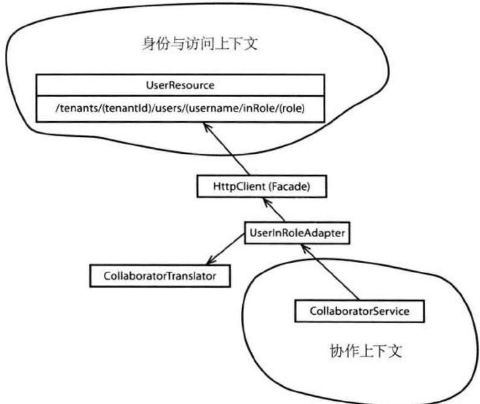


图13.1 身份与访问上下文中的开放主机服务与协作上下文中的防腐层，它们用于集成这两个限界上下文。


这里的CollaboratorService、UserInRoleAdaptor和CollaboratorTranslator便组成了一个防腐层(3)，该防腐层是协作上下文和身份与访问上下文交互的方式，同时它还负责将User-Role形式的数据翻译成Collaborator值对象。 

以下是CollaboratorService, 它组成了防腐层的基本操作: 

```java
public interface CollaboratorService {
    public Author authorFrom(Tenant aTenant, String anIdentity);
    public Creator creatorFrom(Tenant aTenant, String anIdentity);
    public Moderator moderatorFrom(Tenant aTenant, String anIdentity);
    public Owner ownerFrom(Tenant aTenant, String anIdentity);
    public Participant participantFrom( 
```

```txt
Tenant aTenant, String anIdentity); 
```

对于CollaboratorService的客户端来说，它根本看不到对远程系统的访问，以及是如何将远程系统的发布语言翻译成本地对象的。在本例中，我们的确使用到了独立接口[Fowler, P of EAA]，因为该接口的实现是技术性的，并且不应该位于领域层中。 

CollaboratorService中的所有工厂(11)方法都是相似的。它们都用于创建抽象类Collaborator的某个子类。当然，前提是一个以anIdentity标定的User的确位于aTenant下，并且扮演了以下角色类型的其中一种：Author、Creator、Moderator、Owner和Participant。让我们看看authorFrom()工厂方法的实现： 

```java
package com.saasovation.collaboration.infrastructure.services;
import com.saasovation.collaboration.domain.model.collaborator.Author;
public class TranslatingCollaboratorService
    implements CollaboratorService {
    ...
    @Override
    public Author authorFrom(Tenant aTenant, String anIdentity) {
    Author author =
    this.userInRoleAdapter
    .toCollaborator(
    aTenant,
    anIdentity,
    "Author",
    Author.class);
    return author;
    }
    ...
} 
```

请注意, 这里的TranslatingCollaboratorService位于基础设施层的某个模块 (9) 中。虽然我们将独立接口CollaboratorService当作领域模型的一部分, 并将它放置在了六边形的内部, 但是它的实现却是技术性的, 并且被放置在了六边形架构的外部, 即端口和适配器所在的位置。 

作为技术实现的一部分，在防腐层中通常会有一个特定的适配器[Gamma et al.]和翻译器。再回头看看图13.1，你将看到其中的适配器UserInRoleAdapter和翻 译器CollaboratorTranslator。这个特定的UserInRoleAdapter负责与远程系统的交互以请求所需的User-Role资源： 

```java
package com.saasovation.collaboration.infrastructure.services;

import org.jboss.resteasy.client.ClientRequest;
import org.jboss.resteasy.client.ClientResponse;

public class UserInRoleAdapter {

    public <T extends Collaborator> T toCollaborator(
    Tenant aTenant,
    String anIdentity,
    String aRoleName,
    Class<T> aCollaboratorClass) {

    T collaborator = null;

    try {
    ClientRequest request =
    this.buildRequest(aTenant, anIdentity, aRoleName);

    ClientResponse<String> response =
    request.get(String.class);

    if (response.status() == 200) {
    collaborator =
    new CollaboratorTranslator()
    .toCollaboratorFromRepresentation(
    response.getEntity(),
    aCollaboratorClass);
    } else if (response.status() != 204) {
    throw new IllegalStateException(
    "There was a problem requesting the user: "
    + anIdentity
    + " in role: "
    + aRoleName
    + " with resulting status: "
    + response Strength());
    }

    } catch (Throwable t) {
    throw new IllegalStateException(
    "Failed because: " + t.getMessage(), t);
    }

    return collaborator;
    }
    ...
} 
```

如果GET请求得到了成功(状态码200)的应答, 表明该UserInRoleAdapter获取到了相应的User-Role资源。之后, CollaboratorTranslator负责将该资源翻译成Collaborator的子类对象: 

```java
package com.saasovation.collaboration.infrastructure.services;

import java.lang.reflect.Constructor;
import com.saasovation.common.media.RepresentationReader;

public class CollaboratorTranslator {
    public CollaboratorTranslator() {
    super();
    }

    public <T extends Collaborator> T toCollaboratorFromRepresentation(
    String aUserInRoleRepresentation,
    Class<T> aCollaboratorClass)
throws Exception {

    RepresentationReader reader =
    new RepresentationReader(aUserInRoleRepresentation);

    String username = reader.stringValue("username");
    String firstName = reader.stringValue("firstName");
    String lastName = reader.stringValue("lastName");
    String emailAddress = reader.stringValue("emailAddress");

    T collaborator =
    this.newCollaborator(
    username,
    firstName,
    lastName,
    emailAddress,
    aCollaboratorClass);

    return collaborator;
}

private <T extends Collaborator> T newCollaborator(
    String aUsername,
    String aFirstName,
    String aLastName,
    String aEmailAddress,
    Class<T> aCollaboratorClass)
throws Exception {

    Constructor<T> ctor =
    aCollaboratorClass.getConstructor(
    String.class, String.class, String.class); 
```

```java
T collaborator =
    ctor.newInstance(
    aUsername,
    (aFirstName + " " + aLastName).trim(),
    aEmailAddress);
return collaborator;
} 
```

该CollaboratorTranslator的toCollaboratorFromRepresentation()方法接受两个参数：User-Role资源的文本展现(String类型)和Collaborator的某个子类的Class类型。首先，RepresentationReader——和先前的NotificationReader相似——负责读取JSON数据展现中的4个属性。此时，我们可以非常自信地这么做，因为SaaSOvation公司自定义的媒体类型在生产方系统和消费方系统之间形成了一种绑定契约。在CollaboratorTranslator获取到了所需的String类型属性时，它将用这些属性来创建Collaborator值对象，在本例中即为Author: 

```java
package com.saasovation.collaboration.domain.model.collaborator;

public final class Author
    extends Collaborator {

    public Author(
    String anIdentity,
    String aName,
    String anEmailAddress) {
    super(anIdentity, aName, anEmailAddress);
    }
    ...
} 
```

如果要将Collaborator值对象实例和身份与访问上下文保持同步，我们并不需要做额外的工作。因为Collaborator是不变的，我们不能对其进行修改，而只能完全替代。下面的例子演示了应用服务如何获取到一个Author，然后将其交给Forum来开始一个新的Discussion： 

```java
package com.saasovation.collaboration.application;
...
public class ForumService ... { 
```

```java
@Transactional
public Discussion startDiscussion(
    String aTenantId,
    String aForumId,
    String anAuthorId,
    String aSubject) {

    Tenant tenant = new Tenant(aTenantId);
    ForumId forumId = new ForumId(aForumId);

    Forum forum = this.forum(tenant, forumId);

    if (forum == null) {
    throw new IllegalStateException("Forum does not exist.");
    }

    Author author =
    this.collaboratorService.authorFrom(
    tenant, anAuthorId);

    Discussion newDiscussion =
    forum.startDiscussion(
    this.forumETAwnigationService(),
    author,
    aSubject);

    this.discussionRepository.add(newDiscussion);

    return newDiscussion;
} 
```

如果一个Collaborator的名字或者E-mail地址在身份与访问上下文中发生改变，该改变并不会自动地更新到协作上下文中。但是，这种情况很少发生，因此团队成员们决定维持既有的简单设计，而不用同步本地上下文和远程上下文。然而，在敏捷项目管理上下文中，我们将看到不同的设计目标。 

还有其他方式可以实现防腐层，比如资源库(12)。但是，由于资源库通常是用来持久化和重建聚合的，将其用于创建值对象似乎就不合适了。当然，如果我们的目的就是要通过防腐层创建聚合，那么资源库便是一种自然的选择。 

## 通过消息集成限界上下文

在使用消息进行集成时, 任何一个系统都可以获得更高层次的自治性。只要消息基础设施工作正常, 即使其中一个交互系统不可用, 消息依然可以得到发送和投递。 

在DDD中，增强系统自治性的一种方式便是使用领域事件。当一个系统中发生一些显著性的事情时，它将为此发布领域事件。在每个系统中，都存在着多个甚至大量的事件，在创建这些事件时，我们需要考虑到事件的唯一性以便对每个事件进行记录。当事件发生时，系统将通过消息机制将这些事件发送到对事件感兴趣的相关方。当然，以上只是对于事件的高层总览。如果你错过了本书前面章节对事件细节的探讨，那么请参考架构(4)、领域事件(8)和聚合(10)等章节。 

## 从Scrum的产品负责人和团队成员处得到持续通知

在敏捷项目管理上下文中，对于每个订阅的租户来说，系统都需要为其维护一组Scrum的产品负责人和团队成员。在任何时候，产品负责人都可以创建新的产品，然后添加团队成员。那么，这个Scrum项目管理系统如何知道什么样的人扮演着什么样的角色呢？答案是，它不会单干的。 

事实上，敏捷项目管理上下文将通过身份与访问上下文来管理不同的角色，这是一种自然的选择，也是合适的选择。在身份与访问上下文中，每一个订阅的租户都会创建2个Role实例：ScrumProductOwner和ScrumTeamMember。每一个需要扮演某种角色的User都会被指派给相应的Role。在该限界上下文的应用服务中，我们通过以下方式来实现： 

```java
package com.saasovation.identityaccess.application;
...
public class AccessService ... {
    ...
    @Transactional
    public void assignUserToRole(AssignUserToRoleCommand aCommand) {
    TenantId tenantId =
    new TenantId(aCommand.getTenantId());
    User user =
    this.userRepository
    .userWithUsername(
    tenantId, 
```

```java
aCommand.getUsername());
if (user != null) {
    Role role =
    this.roleRepository
    .roleNamed(
    tenantId,
    aCommand.getRoleName());
    if (role != null) {
    role.assignUser(user);
    }
} 
```

非常好！但是，敏捷项目管理上下文又如何知道是谁扮演了ScrumTeamMember或者ScrumProductOwner呢？答案是：当Role中的assignUser()方法执行完毕时，它将发布一个事件： 

```java
package com.saasovation.identityaccess.domain.model.access;
public class Role extends Entity {
    public void assignUser(User aUser) {
    if (aUser == null) {
    throw new NullPointerException("User must not be null.");
    }
    if (!this.tenantId().equals(aUser.tenantId())) {
    throw new IllegalArgumentException(
    "Wrong tenant for this user.");
    }

    this.group().addUser(aUser);

    DomainEventPublisher
    .instance()
    .publish(new UserAssignedToRole(
    this.tenantId(),
    this.name(),
    aUser.username(),
    aUser.person().name().firstName(),
    aUser.person().name().lastName(),
    aUser.person().emailAddress());
    }
    ...
} 
```

这里的UserAssignedToRole事件包含有一个User的名字和E-mail地址，最终它将被投递到所有感兴趣的相关方。当敏捷项目管理上下文收到该事件时，它将相应地创建一个新的TeamMember或者ProductOwner。这并不是一个多难的用例，但是它的实现细节却比我们想象中的要复杂。让我们深入其中去看看。 

对于RabbitMQ来说，有多种方式来监听其发出的通知。我们已经有一个简单的面向对象的类库来方便RabbitMQ的Java客户端。现在，我们再多加一个简单的类，该类将一个普通的消费方变为一个交换器队列的消费方： 

```java
package com.saasovation.common.port.adapter.messaging.rabbitmq;
public abstract class ExchangeListener {

    private MessageConsumer messageConsumer;
    private Queue queue;

    public ExchangeListener() {
    super();
    this.attachToQueue();
    this.registerConsumer();
    }

    protected abstract String exchangeName();

    protected abstract void filteredDispatch(
    String aType, String aTextMessage);

    protected abstract String[] listensToEvents();

    protected String queueName() {
    return this.getClass().getSimpleName();
    }

    private void attachToQueue() {
    Exchange exchange = Exchange.fanOutInstance(
    ConnectionSettings.instance(),
    this.exchangeName(),
    true);

    this.queue = Queue.individualExchangeSubscriberInstance(
    exchange,
    this.exchangeName() + "." + this.queueName());
    }

    private Queue queue() { 
```

```java
return this.queue;
}

private void registerConsumer() {
    this.messageConsumer = MessageConsumer.instance(this.queue(), false);

    this.messageConsumer.receiveOnly(
    this.listensToEvents(),
    new MessageListener(MessageListener.Type.TEXT) {

    @Override
    public void handleMessage(
    String aType,
    String aMessageId,
    Date aTimestamp,
    String aTextMessage,
    long aDeliveryTag,
    boolean isRedelivery)
    throws Exception {
    filteredDispatch(aType, aTextMessage);
    }
    });
    }
} 
```

这里的ExchangeListener是一个抽象基类。子类在扩展该抽象基类时只需要添加少许的代码即可。首先，子类需要保证正确地调用了抽象基类的构造函数。之后便是实现三个抽象方法了，即exchangeName()、filteredDispatch()和listensToEvents()，其中的两个实现起来都非常简单。 

要实现exchangeName()方法，我们只需要返回某个具体类在获取通知时所使用的交换器名称即可。要实现listensToEvents()方法，我们需要返回一个String类型的数组，其中包含了该具体类希望接收的通知类型。多数消息监听器都只处理一种类型的通知，因此listensToEvents()方法所返回的String数组中通常只包含一个元素。余下的filteredDispatch()方法是最复杂的，因为它负责处理所接收到的消息。让我们看看处理UserAssignedToRole事件的TeamMemberEnablerListener: 

```java
package com.saasovation.agilepm.infrastructure.messaging;
public class TeamMemberEnablerListener extends ExchangeListener {
    @Autowired
    private TeamService teamService;
    public TeamMemberEnablerListener() { 
```

```groovy
super();
}

@Override
protected String exchangeName() {
    return Exchanges.IDENTITY_ACCESS_EXCHANGE_NAME;
}

@Override
protected void filteredDispatch(
    String aType,
    String aTextMessage) {
    NotificationReader reader =
    new NotificationReader(aTextMessage);

    String roleName = reader.eventStringValue("roleName");

    if (!roleName.equals("ScrumProductOwner") &&
    !roleName.equals("ScrumTeamMember")) {
    return;
    }

    String emailAddress = reader.eventStringValue("emailAddress");
    String firstName = reader.eventStringValue("firstName");
    String lastName = reader.eventStringValue("lastName");
    String tenantId = reader.eventStringValue("tenantId.id");
    String username = reader.eventStringValue("username");
    Date occurredOn = reader.occurredOn();

    if (roleName.equals("ScrumProductOwner")) {
    this.teamService.enableProductOwner(
    new EnableProductOwnerCommand(
    tenantId,
    username,
    firstName,
    lastName,
    emailAddress,
    occurredOn));
    } else {
    this.teamService.enableTeamMember(
    new EnableTeamMemberCommand(
    tenantId,
    username,
    firstName,
    lastName,
    emailAddress,
    occurredOn));
    }
}

@Override
protected String[] listensToEvents() { 
```

```txt
return new String[] {
    "com.saasovation.identityaccess.domain.model."
    access.UserAssignedToRole"
    };
} 
```

在上例中，ExchangeListener的默认构造函数得到了正确的调用，exchangeName()方法返回的是身份与访问上下文在发布事件时所使用的交换器的名字，而listensToEvents()所返回的数组中只包含了UserAssignedToRole事件的全类名。请注意，发布方和订阅方都应该使用事件的全类名，其中包含了事件所在的模块名和事件本身的类名。这样，如果不同的限界上下文使用了相同的事件类名，我们依然可以进行区分。 

最后，真正包含大量行为的是filteredDispatch()方法。正如该方法的名字所暗示的，在调用应用层API之前，它将对通知进行过滤。在本例中，它将过滤掉那些不包含ScrumProductOwner和ScrumTeamMember角色的UserAssignedToRole事件。另一方面，如果UserAssignedToRole的确包含了以上两种角色，那么filteredDispatch()方法将从通知中提取出UserAssignedToRole事件的细节信息，并将操作进一步分发给应用层的TeamService。TeamService中的enableProductOwner()方法和enableTeamMember()方法都以一个命令对象为参数，分别是EnableProductOwnerCommand和EnableTeamMemberCommand。 

乍看起来, 每个UserAssignedToRole事件似乎都会导致新成员的创建。但是, 每个User都可能被指派成任何一个Role, 之后还有可能解除指派, 再重新指派。因此, 可能发生的情况是: 在所接收的通知中, 一个User所表示的成员已经存在了。对此, 以下是TeamService的解决方法: 

```java
package com.saasovation.agilepm.application;
...
public class TeamService ... {
    @Autowired
    private ProductOwnerRepository productOwnerRepository;
    @Autowired
    private TeamMemberRepository teamMemberRepository;
    ...
    @Transactional
    public void enableProductOwner( 
```

```txt
EnableProductOwnerCommand aCommand) {
TenantId tenantId = new TenantId(aCommand.getTenantId());

ProductOwner productOwner =
    this.productOwnerRepository.productOwnerOfIdentity(
    tenantId,
    aCommand.getUsername());

if (productOwner != null) {
    productOwner.enable(aCommand.getOccurredOn());
} else {
    productOwner =
    new ProductOwner(
    tenantId,
    aCommand.getUsername(),
    aCommand.getFirstName(),
    aCommand.getLastName(),
    aCommand.getEmailAddress(),
    aCommand.getOccurredOn());

    this.productOwnerRepository.add(productOwner);
}
} 
```

在上例中，enableProductOwner()方法将检查一个特定的ProductOwner是否已经存在。如果已经存在，那么我们假设该ProductOwner需要重新激活，因此我们执行了相关的命令操作。如果不存在，那么我们创建一个新的聚合实例，然后将其添加到资源库中。对于TeamMember来说，我们也是这么处理的，因此enableTeamMember()方法和enableProductOwner()方法的实现方式相同。 

## 你能处理这样的职责吗？

以上方法看来不错，并且也足够简单。我们有了ProductOwner和TeamMember聚合类型，它们都包含有外部限界上下文中User类的一些信息。但是，你有没有意识到，此时的聚合承担了多少职责？ 

回想一下，在协作上下文中，要包含来自User的信息，开发团队使用的是一些不变的值对象（请参考“使用防腐层实现REST客户端”）。正因为这些值对象是不变的，开发团队根本不用担心对共享信息的更新。当然，这也是一个问题，即在共享信息更新之后，协作上下文中的相应对象将得不到更新。因此，敏捷项目管理开发团队选择了另一条路。 

然而，要保持对聚合的实时更新是存在诸多挑战的。为什么？难道不是监听对User实例的修改，然后相应地修改ProductOwner和TeamMember吗？当然是，并且我们也必须这么做。但是，我们所使用的消息基础设施将给我们带来一些挑战。 

比如，在身份与访问上下文中，如果一个管理者错误地将Joe Johnson所扮演的ScrumTeamMember角色解除了，情况会怎么样？当然，我们会收到一个事件通知，然后调用TeamService将Joe Johnson所对应的TeamMember转为失活状态。等一等，几秒钟之后，该管理者意识到了错误，她真正应该被操作的User是Joe Jones，而不是Joe Johnson。因此，她立即将ScrumTeamMember角色再次指派给Joe Johnson，然后解除Joe Jones所扮演的ScrumTeamMember角色。之后，敏捷项目管理上下文将接收到相应的通知，万事大吉。也或者，万事真的就大吉了吗？ 

对于这个用例来说，我们做出了错误的假设，即假设通知的接收顺序和它们在身份与访问上下文中的产生顺序相同。但是，事实却不总是如此。对于Joe Johnson来说，如果我们先接收到了UserAssignedToRole事件，再接收到UserUnassignedToRole事件，情况又会如何呢？在所有事件处理完后，Joe Johnson所对应的TeamMember将依然处于失活状态。此时，有人可能需要向敏捷项目管理上下文的数据库中打些补丁，或者管理者需要玩弄一些小技巧将Joe Johnson重新激活。这种情况是有可能发生的，并且比我们所想象的发生频率更高。那么，我们应该如何避免这种情况呢？ 

让我们仔细看看传给TeamServiceAPI的命令对象，比如EnableTeamMemberCommand和DisableTeamMemberCommand。这两个命令对象都需要提供一个Data对象，即occurredOn属性。事实上，所有的命令对象都是如此设计的。我们将使用该occurredOn属性来确保ProductOwner和TeamMember是以正确的时间顺序来处理命令操作的。对于前面的UserAssignedToRole先于UserUnassignedToRole被接收的情况，我们看看如何处理： 

```java
package com.saasovation.agilepm.application;
...
public class TeamService ... {
    ...
    @Transactional
    public void disableTeamMember(DisableTeamMemberCommand aCommand) {
    TenantId tenantId = new TenantId(aCommand.getTenantId());
    TeamMember teamMember =
    this.teamMemberRepository.teamMemberOfIdentity(tenantId, 
```

```txt
aCommand.getUsername());
if (teamMember != null) {
    teamMember.disable(aCommand.getOccurredOn());
} 
```

请注意, 当我们调用TeamMember的disable()命令方法时, 我们需要传入命令对象中的occurredOn属性。TeamMember将使用该属性来确保命令的正确执行: 

```java
package com.saasovation.agilepm.domain.model.team;
...
public abstract class Member extends Entity {
    ...
    private MemberChangeTracker changeTracker;
    ...
    public void disable(Date asOfDate) {
    if (this.changeTracker().canToggleEnabling(asOfDate)) {
    this.setEnabled(false);
    this.setChangeTracker(
    this.changeTracker().enablingOn(asOfDate));
    }
    }

    public void enable(Date asOfDate) {
    if (this.changeTracker().canToggleEnabling(asOfDate)) {
    this.setEnabled(true);
    this.setChangeTracker(
    this.changeTracker().enablingOn(asOfDate));
    }
    }
    ...
} 
```

以上聚合行为是由一个抽象基类提供的，即Member。其中的disable()和enable()方法都通过一个changeTracker来决定是否应该执行命令操作，此时的asOfDate参数即为所传入的occurredOn属性值。值对象MemberChangeTracker维护了最近一次操作的相关信息： 

```java
package com.saasovation.agilepm.domain.model.team;
public final class MemberChangeTracker implements Serializable {
    private Date emailAddressChangedOn;
    private Date enablingOn;
    private Date nameChangedOn; 
```

```txt
...
public boolean canToggleEnabling(Date asOfDate) {
    return this.enablingOn().before(asOfDate);
}
...
public MemberChangeTracker enablingOn(Date asOfDate) {
    return new MemberChangeTracker(
    asOfDate,
    this.nameChangedOn(),
    this.emailAddressChangedOn());
}
...
} 
```

如果MemberChangeTracker的canToggleEnabling()方法返回true，即允许下一步操作，那么原有的MemberChangeTracker实例将被enablingOn()方法返回的新实例所替代。对于PersonNameChanged和PersonContactInformationChanged事件来说，它们也是有可能无序抵达的，因此它们也将分别拥有相应的nameChangedOn和emailAddressChangedOn属性。对于PersonContactInformationChanged事件来说，更多的时候可能是关于更改电话号码或邮寄地址的，而不是E-mail地址： 

```java
package com.saasovation.agilepm.domain.model.team;
...
public abstract class Member extends Entity {
    ...
    public void changeEmailAddress(
    String anEmailAddress,
    Date asOfDate) {
    if (this.changeTracker().canChangeEmailAddress(asOfDate) &&
    !this.emailAddress().equals(anEmailAddress)) {
    this.setEmailAddress(anEmailAddress);
    this.setChangeTracker(
    this.changeTracker().emailAddressChangedOn(asOfDate));
    }
    }
    ...
} 
```

这里，我们检查E-mail地址是否发生了改变。如果没有，那么我们将不予跟踪。而如果的确跟踪了，那么真正包含有E-mail修改信息的事件将被忽略掉。 

MemberChangeTracker还使得Member的子类的命令操作是幂等的，即如果同一份通知被消息基础设施投递了多次，那么多余的通知将被忽略掉。 

当然，我们也可以认为引入MemberChangeTracker是聚合设计的一个错误，因为它与Scrum所使用的通用语言毫无关系。这是事实，但是，我们并没有把MemberChangeTracker暴露到聚合边界之外。这只是一个实现上的细节而已，客户端根本意识不到这个MemberChangeTracker的存在，它唯一需要提供的只是occurredOn属性值。另外，这也正是Pat Helland在描述如何处理分布式系统之间的合作者关系时所采用的实现细节。特别地，请参考[Helland]的第5节，“Activities: Coping with Messy Messages.” 

现在, 让我们回到对新职责的处理…… 

对于在不同限界上下文间维护复制性信息来说，虽然以上只是一个非常基本的例子，但是其中的职责分离却并非琐碎之事，至少在使用消息机制时是这样的。因为此时我们需要考虑到消息无序抵达的情况和多次投递的情况 $^{1}$ 。另外，在身份与访问上下文中的所有操作都只会对Member的部分属性产生影响。意识到这一点，我们便可以总结出以下事件： 

- PersonContactInformationChanged 

- PersonNameChanged 

- UserAssignedToRole 

- UserUnassignedFromRole 

还有另外的一些事件也是重要的： 

- UserEnablementChanged 

- TenantActivated 

- TenantDeactivated 

以上事实所强调的是: 在有可能的情况下, 我们应该最小化不同限界上下文之间的信息复制, 甚至彻底消除。当然, 要完全避免信息复制是不可能的。服务层协议 (SLA) 并不能保证每次对远程数据的获取都能成功。这也是为什么SaaSOvation 的团队需要在本地上下文中维护User的名字和E-mail等信息。然而, 对于那些位于 我们自己职责之下的外部信息来说，信息量越少，我们的工作也越简单。这也是集成限界上下文的“最小化信息”原则。 

当然，对于Tenant和User的唯一标识，我们是无法避免重复的，因为它们是必要的。这也是集成限界上下文的首要方法之一。另外，共享唯一标识是安全的，因为它们不会改变。我们甚至可以通过禁用聚合和软删除的方式来保证那些被引用的对象从不消失，比如Tenant、User、ProuductOwner和TeamMember便使用了这样的方法。 

以上提醒并不表示领域事件就不应该包含信息属性。需要肯定的是，领域事件必须包含足够的信息以通知消费方完成相应的操作。此外，消费方的限界上下文可以使用事件数据来执行计算操作或者得出其他状态，即此时消费方并不用维护事件数据本身，也不用保持与远端系统的同步。 

## 长时处理过程，以及避免职责

如果我们将前一节所描述的看成是一个负责任的成年人，那么本节将带你回归到青年时代。你知道，成年人需要承担各种各样的职责。父母需要购买汽车，然后为汽车购买保险，再掏钱给汽车加油，最后还得花钱维修。作为年轻人来说，我们只是使用父母的汽车就行了，而不用担心花销。你想让一个青少年掏钱给父母买车、加油、维修然后购买保险，几乎是不可能的。他们只是让父母承担所有的责任，自己却逍遥自在去了。 

在本节中, 我们将讲到长时处理过程 (4), 对于在不同限界上下文之间复制信息时所要求的职责来说, 我们将予以拒绝。我们将使那些记录数据的系统自行处理自己的信息。 

在上下文映射图(3)中, 我们展示了一个“创建产品”的用例: 

前提条件: 协作功能可用（附加功能需要购买）。 

1. 用户提供Product的描述信息。 

2. 用户希望为该Product创建一个Discussion。 

3. 用户发出创建Product的请求。 

4. 系统创建一个Product，连同Forum和Discussion。 

你可能会注意到, 先前关于Discussion (第3章) 的通用语言在这里被进一步改善了。敏捷项目管理团队认为应该区分开两种类型的Discussion, 于是 有了ProductDiscussion和BacklogItemDiscussion（在本节中，我们只关注于ProductDiscussion）。这两个值对象都具有相同的状态和行为，但是这样的区分有助于类型的安全性，从而避免了开发者将错误的Discussion添加到Product和BacklogItem中。而在实际应用中，它们却是一样的。这两个值对象都维护了自身的可见性信息，同时还包含协作上下文中Discussion聚合的唯一标识。 

需要指出的是, 虽然敏捷项目管理上下文中的值对象Discussion和协作上下文中的聚合Discussion拥有相同的名字, 但是这并不是一个错误。因此, 我们并没有将值对象Discussion重新命名为ProductDiscussion以示区分。从上下文映射的角度来看, 维持Discussion值对象原有的名字是完全可以的, 因为限界上下文已经对这两个对象进行了区分。在敏捷项目管理上下文中创建两个类型不同的值对象完全是出于本地模型的考虑。 

让我们首先来看看创建Product的应用服务： 

```java
package com.saasovation.agilepm.application;
...
public class ProductService ... {
    @Autowired
    private ProductRepository productRepository;

    @Autowired
    private ProductOwnerRepository productOwnerRepository;
    ...
    @Transactional
    public String newProductWithDiscussion(
    NewProductCommand aCommand) {

    return this.newProductWith(
    aCommand.getTenantId(),
    aCommand_productOwnerId(),
    aCommand.getName(),
    aCommand.getDescription(),
    this.requestDiscussionIfAvailable());
    }
    ...
} 
```

事实上，有两种方式都可以创建一个新的Product。第一种方式不需要创建Discussion，这里未予显示。上例所示的是第二种方式，它需要在创建Product时，连同创建一个ProductDiscussion。两个内部方法，newProductWith()和requestDiscussionIfAvailable()，在这里也未予以显示。后者用于检查 

CollabOvation的附加功能是否可用。如果可用，那么它将返回REQUESTED；否则返回ADD_ON_NOT_ENABLED。方法newProductWith()将调用Product的构造函数，该构造函数如下所示： 

```java
package com.saasovation.agilepm.domain.model.product;
...
public class Product extends ConcurrencySafeEntity {
    ...
    public Product(
    TenantId aTenantId,
    ProductId aProductId,
    ProductOwnerId aProductOwnerId,
    String aName,
    String aDescription,
    DiscussionAvailability aDiscussionAvailability) {

    this();

    this.setTenantId(aTenantId);
    this.setProductId(aProductId);
    this.setProductOwnerId(aProductOwnerId);
    this.setName(aName);
    this.setDescription(aDescription);

    this.setDiscussion(
    ProductDiscussion.fromAvailability(aDiscussionAvailability));

    DomainEventPublisher
    .instance()
    .publish(new ProductCreated(
    this.tenantId(),
    this.productId(),
    this_productOwnerId(),
    this.name(),
    this.description(),
    this.discussion().availability().isRequested()));
    }
    ...
} 
```

客户端需要传入一个DiscussionAvailability参数，该参数拥有以下状态值：ADD_ON_NOT_ENABLED、NOT_REQUESTED和REQUESTED。另外，状态值READY表示完成状态。对于在前两种状态下所创建的ProductDiscussion对象，它将维护一份原有状态的属性，也即此时所创建的产品并没有与之关联的讨论。对于第三种状态REQUESTED，所创建的ProductDiscussion对象将拥有 

PENDING_SETUP状态。以下是ProductDiscussion的工厂方法，该方法被Product的构造函数所使用： 

```java
package com.saasovation.agilepm.domain.model.product;
public final class ProductDiscussion implements Serializable {
    public static ProductDiscussion fromAvailability(
    DiscussionAvailability anAvailability) {
    if (anAvailability.isReady()) {
    throw new IllegalArgumentException(
    "Cannot be created ready.");
    }

    DiscussionDescriptor descriptor =
    new DiscussionDescriptor(
    DiscussionDescriptor.UNDEFINED_ID);

    return new ProductDiscussionubescriptor, anAvailability);
    }
    ...
} 
```

只要此时的请求不是为了达到READY状态, 那么这便是有问题的, 此时我们将得到一个未定义的DiscussionDescriptor。如果状态为REQUESTED, 那么长时处理过程将负责对Discussion的创建以及后续的初始化。问题是, 它将如何做到这一步? 回忆一下, Product构造函数所做的最后一件事情便是发布ProductCreated事件: 

```java
package com.saasovation.agilepm.domain.model.product;
...
public Product(...) {
...
DomainEventPublisher
    .instance()
    .publish(new ProductCreated(
    this.tenantId(),
    this.productId(),
    this.productOwnerIdId(),
    this.name(),
    this.description(),
    this.discussion().availability().isRequested());
}
...
} 
```

如果此时Discussion的状态为REQUEST, 那么传给ProductCreated构造函数的最后一个参数将为true, 这正是启动长时处理过程所需要的。 

在领域事件(8)中我们讲到, 每一个事件实例, 包括ProductCreated, 都会被添加到事件存储中, 该事件存储是专门为产生该事件的限界上下文创建的。所有新加事件都会由事件存储通过消息机制转发到兴趣相关方。对于SaaSOvation公司来说, 开发团队决定采用RabbitMQ。我们需要创建一个简单的长时处理过程来创建Discussion, 并且将该Discussion赋给一个Product。 

在讨论长时处理过程的细节之前, 让我们再来看看另一种请求创建Discussion的方式。有可能发生的情况是: 在Product实例创建之初, 客户端并没有发出创建Discussion的请求, 或者此时的协作附加功能刚刚被启用。之后, 产品负责人决定为该Product添加一个Discussion, 届时协作附加功能也可用了。此时, 产品负责人便可以使用以下Product的命令方法: 

```java
package com.saasovation.agilepm.domain.model.product;
public class Product extends ConcurrencySafeEntity {
    public void requestDiscussion(
    DiscussionAvailability aDiscussionAvailability) {
    if (!this.discussion().availability().isReady()) {
    this.setDiscussion(
    ProductDiscussion.fromAvailability(
    aDiscussionAvailability));
    DomainEventPublisher
    .instance()
    .publish(new ProductDiscussionRequested(
    this.tenantId(),
    this.productId(),
    thisibiaProductOwnerId(),
    this.name(),
    this.description(),
    this.discussion().availability().isRequested()));
    }
    }
    ...
} 
```

这里的requestDiscussion()方法也使用了DiscussionAvailability参数，因为客户端需要向Product证实此时协作附加功能已经被启用了。当然，客户端可以总是传入REQUESTED状态以作欺骗，但是如果此时的协作附加功能并不可用，那么这将导致一个非常严重的bug。和前面的ProductCreated一样，如果所传入的是 

REQUESTED, 那么ProductDiscussionRequested构造函数的最后一个参数将为true, 这正是启动长时处理过程所需要的: 

```java
package com.saasovation.agilepm.domain.model.product;
public class ProductDiscussionRequested implements DomainEvent {
    public ProductDiscussionRequested(
    TenantId aTenantId,
    ProductId aProductId,
    ProductOwnerId aProductOwnerId,
    String aName,
    String aDescription,
    boolean isRequestingDiscussion) {
    ...
    }
    ...
} 
```

这里的ProductDiscussionRequested事件和ProductCreated事件拥有相同的属性，因此它们可以通过同一个消息监听器进行处理。 

你可能会问，如果此时的可用性状态不为REQUESTED，那么发布该事件又有什么意义呢？这的确是有意义的，因为无论请求是否会得到处理，请求依然会发出，除非此时的状态为READY。要决定是否对事件进行响应，这是属于消息监听器的职责。也许isRequestingDiscussion=false的情况表示系统出了问题，或者协作附加功能还未就绪。因此，一些干预是有必要的。比如，此时的长时处理过程可能会向管理员发送一封E-mail。 

在敏捷项目管理上下文中, 长时处理过程所需的类与先前 (请参考上一节) 创建和维护ProductOwner和TeamMember的类相似。每个监听器都由Spring容器所管理, 在该上下文的Spring程序启动时, 这些监听器也随之初始化。第一个监听器用于从AGILEPM_EXCHANGE_NAME交换器中接收两种类型的通知, 即ProductCreated和ProductDiscussionRequested: 

```java
package com.saasovation.agilepm.infrastructure.messaging;
public class ProductDiscussionRequestedListener extends ExchangeListener {
    @Override
    protected String exchangesName() {
    return Exchanges.AGILEPM_EXCHANGE_NAME;
    } 
```

```vhdl
package com.saasovation.agilepm.infrastructure.messaging; 
```

```txt
@Override
protected String[] listensToEvents() {
    return new String[] {
    "com.saasovation.agilepm.domain.model←.
    .product.ProductCreated",
    "com.saasovation.agilepm.domain.model←.
    .product.ProductDiscussionRequested"
    );
}
...
} 
```

第二个监听器将从COLLABORATION_EXCHANGE_NAME交换器中接收DiscussionStarted事件： 

package com.saasovation.agilepm.infrastructure.messaging;
...
public class DiscussionStartedListener extends ExchangeListener {
    ...
    @Override
    protected String exchangeName() {
    return Exchanges.COLLABORATION_EXCHANGE_NAME;
    }
    ...
    @Override
    protected String[] listensToEvents() {
    return new String[] {
    "com.saasovation.collaboration.domain.model." $forum.DiscussionStarted"$ ;
    }
    ...
} 

你可能已经看出一些眉目了。当第一个监听器接收到ProductCreated或者ProductDiscussionRequested事件时，它将向协作上下文发起一个命令，以此为Product创建一个新的Forum和Discussion。当协作上下文处理完对该命令请求时，它将发布DiscussionStarted事件，该事件将进一步被第二个监听器所接收，然后在Product中创建该Discussion的唯一标识。这就是整个长时处理过程。以下是第一个监听器的filteredDispatch()方法： 

```java
public class ProductDiscussionRequestedListener extends ExchangeListener {
    private static final String COMMAND = "com.saasovation.collaboration.discussion." CreateExclusiveDiscussion";
    @Override protected void filteredDispatch(
    String aType,
    String aTextMessage) {
    NotificationReader reader =
    new NotificationReader(aTextMessage);

    if (!reader.eventBooleanValue("requestingDiscussion")) {
    return;
    }

    Properties parameters = this.parametersFrom(reader);
    PropertiesSerializer serializer =
    PropertiesSerializer.instance();
    String serialization = serializer.serialize(parameters);
    String commandId = this.commandIdFrom(parameters);

    this.messageProducer()
    .send(
    serialization,
    MessageParameters
    .durableTextParameters(
    COMMAND,
    commandId,
    new Date()))
    .close();
    }
    ...
} 
```

对于ProductCreated和ProductDiscussionRequested事件，如果requestingDiscussion属性值为false，那么filteredDispatch()方法将忽略该事件。否则，我们将通过事件状态创建一个CreateExclusiveDiscussion命令对象，然后将该命令对象发送到协作上下文的消息交换器中。 

现在, 让我们暂停一下, 看看该长时处理过程是如何设计的。在敏捷项目管理上下文中, 我们应该为本地聚合所发出的事件创建一个监听器吗? 在协作上下文中为ProductCreated创建监听器是不是更好呢? 这样, 我们只需要使用协作上下文中的监听器来管理对专属的Forum和Discussion的创建; 另外, 还可以去除敏捷项目管理上下文中的部分代码。要决定哪种方式更好, 我们需要考虑诸多因素。 

在上游限界上下文中监听下游上下文中发布的事件, 这样合理吗? 或者, 在事件驱动架构 (4) 中, 各个系统之间的确存在着上下游关系吗? 它们需要迎合这种关系吗? 可能更重要的因素在于: 如果由协作上下文来处理ProductCreated事件, 并且由此创建专属的Forum和Discussion, 这种方式是否正确? 还有多少其他的限界上下文也希望得到类似的支持? 将这些职责放在协作上下文中是否是最好的方式? 此外, 还存在另外一个因素, 它要求我们更仔细地管理长时处理过程。对此, 我们将在稍后进行讨论。 

回到前面的例子……当协作上下文接收到命令对象之后，它将调用应用服务ForumService。请注意，ForumService的API还未被设计成接收命令对象，而是单独的属性参数： 

```java
package com.saasovation.collaboration.infrastructure.messaging;
...
public class ExclusiveDiscussionCreationListener
    extends ExchangeListener {

    @Autowired
    private ForumService forumService;
    ...
    @Override
    protected void filteredDispatch(
    String aType,
    String aTextMessage) {
    NotificationReader reader =
    new NotificationReader(aTextMessage);

    String tenantId = reader.eventStringValue("tenantId");
    String exclusiveOwnerId =
    reader.eventStringValue("exclusiveOwnerId");
    String forumSubject = reader.eventStringValue("forumTitle");
    String forumDescription =
    reader.eventStringValue("forumDescription");
    String discussionSubject =
    reader.eventStringValue("discussionSubject");
    String creatorId = reader.eventStringValue("creatorId");
    String moderatorId = reader.eventStringValue("moderatorId");

    forumService.startExclusiveForumWithDiscussion(
    tenantId,
    creatorId,
    moderatorId,
    forumSubject,
    forumDescription,
    discussionSubject,
    exclusiveOwnerId);
    }
    ...
} 
```

这是合乎情理的, 但是, 这里的ExclusiveDiscussionCreationListener是否应该向敏捷项目管理上下文发送一个应答呢? 不见得。在Forum和Discussion聚合创建时, 它们都会发布一个事件, 分别为ForumStarted和DiscussioinStarted。对于所有领域事件, 协作上下文都将通过COLLABORATION_EXCHANGE_NAME交换器予以发布。因此, 敏捷项目管理上下文将收到一个DiscussionStarted事件, 此时, 它将完成以下操作: 

```java
package com.saasovation.agilepm.infrastructure.messaging;
...
public class DiscussionStartedListener extends ExchangeListener {

    @Autowired
    private ProductService productService;
    ...
    @Override
    protected void filteredDispatch(
    String aType,
    String aTextMessage) {
    NotificationReader reader =
    new NotificationReader(aTextMessage);

    String tenantId = reader.eventStringValue("tenant.id");
    String productId = reader.eventStringValue("exclusiveOwner");
    String discussionId =
    reader.eventStringValue("discussionId.id");

    productService.initiateDiscussion(
    new InitiateDiscussionCommand(
    tenantId,
    productId,
    discussionId));
    )
    ...
} 
```

该监听器使用DiscussionStarted事件中的属性来创建一个命令对象，然后将该对象传递给应用服务ProductService。ProductService中initiateDiscussion()方法的实现如下： 

```java
package com.saasovation.agilepm.application;
...
public class ProductService ... {
    @Autowired
    private ProductRepository productRepository; 
```

```java
@Transactional
public void initiateDiscussion(
    InitiateDiscussionCommand aCommand) {
    Product product =
    productRepository
    .productId(
    new TenantId(aCommand.getTenantId()), new ProductId(aCommand.getProductId()));
    if (product == null) {
    throw new IllegalStateException(
    "Unknown product of tenant id: "
    + aCommand.getTenantId()
    + " and product id: "
    + aCommand.getProductId());
    }

    product.initiateDiscussion(
    new DiscussionDescriptor(
    aCommand.getDiscussionId()));
    }
} 
```

最后执行的是Product聚合的initiateDiscussion()行为方法: 

```java
package com.saasovation.agilepm.domain.model.product;
public class Product extends ConcurrencySafeEntity {
    public void initiateDiscussion(DiscussionDescriptor aDescriptor) {
    if (aDescriptor == null) {
    throw new IllegalArgumentException(
    "The descriptor must not be null.");
    }

    if (this.discussion().availability().requested()) {
    this.setDiscussion(this.discussion()
    .nowReady(aDescriptor));
    DomainEventPublisher
    .instance()
    .publish(new ProductDiscussionInitiated(
    this.tenantId(),
    this.productId(),
    this discussion()));
    }
    }
    ...
} 
```

如果此时Product的discussion属性依然为REQUESTED状态, 那么它将转成READY状态, 并且将拥有一个DiscussionDescriptor属性, 该DiscussionDescriptor携带了协作上下文中Discussion的唯一标识。此时, Forum、Discussion和Product便达到了一致性, 虽然这是通过事件的方式完成的。 

然而，如果此时discussion的状态已经为READY，那么它的状态将不会再改变了。这是一个bug吗？不是，这样可以保证initiateDiscussion()方法是一个幂等操作。因此，我们可以做出这样的假设：如果当前discussion的状态已经为READY，那么该长时处理过程便已经完成了。也许，之后的命令调用都是由于消息的重新投递造成的，因为开发团队使用的消息机制可能会多次发送同一条消息。不管是什么原因，我们都不用担心，因为对于任何基础设施和架构所带来的影响，幂等操作都将予以忽略，并且是无害的。此外，在本例中，我们不用像先前的MemberChangeTracker一样设计一个ProductChangeTracker，因为discussion的READY状态已经足够告诉我们所有了。 

但是，总的来说，这种方式还存在一个问题。如果该长时处理过程由于消息机制的原因出现了一些问题，这时我们应该怎么办呢？我们如何确保该长时处理过程能够运行直到完毕？好吧，是我们的青少年们成长的时候啦！ 

## 长时处理过程的状态机和超时跟踪器

在长时处理过程（4）中，我们讲到了“跟踪器”的概念，现在，通过采用相似的做法，我们可以使以上处理过程更加成熟。SaaSOvation的开发者们创建了一个可重用的跟踪器概念：TimeConstrainedProcessTracker。该TimeConstrainedProcessTracker将监视那些指定完成时间已经过期了的处理过程；另外，对于那些在过期之前可以任意重试的处理过程，它也将进行监视。这种设计使得我们可以定期地对长时处理过程进行重试，或者在不进行重试（或在达到重试上限之后）的情况下彻底地超时。 

需要指出的是, 跟踪器并不是核心域的一部分, 而是属于技术子域的, 该技术子域可以被SaaSOvation公司的所有项目所重用。这意味着, 在有些情况下, 在对跟踪器进行持久化或者修改的时候, 我们不用严格地遵循聚合原则。另外, 跟踪器也是相对独立的, 并且与长时处理过程存在着一对一的关系, 因此, 并发冲突的可能性并不大。如果的确发生了并发冲突, 那么我们依然可以依赖于消息重发来解决问题。在消息投递过程中产生的任何异常都会导致监听器做出否定应答, 进而使得RabbitMQ重发消息。另外, 我们并不期待对处理过程进行大量的重试。 

Product维护了长时处理过程的当前状态, 当重试间隔抵达, 或者处理过程彻底超时时, 跟踪器将发布以下事件: 

```java
package com.saasovation.agilepm.domain.model.product;

import com.saasovation.common.domain.model.process.ProcessId;
import com.saasovation.common.domain.model.process.ProcessTimedOut;

public class ProductDiscussionRequestTimedOut extends ProcessTimedOut {

    public ProductDiscussionRequestTimedOut(
    String aTenantId,
    ProcessId aProcessId,
    int aTotalRetriesPermitted,
    int aRetryCount) {

    super(aTenantId, aProcessId,
    aTotalRetriesPermitted, aRetryCount);
    }
} 
```

每一个监听器都可以通过调用ProcessTimedOut的hasFullyTimedOut()方法来确定该事件是否属于完全超时还是重试。如果是重试，那么监听器可以调用ProcessTimedOut的allowsRetries()、retryCount()、totalRetriesPermitted()和totalRetriesReached()等方法来获取更多的事件重试信息。 

在可以接收重试和超时通知的情况下, 我们可以把Product放在一个更好的长时处理过程中。首先, 我们需要启动该处理过程, 此时我们可以使用既有的Product-DiscussionRequestedListener: 

```java
package com.saasovation.agilepm.infrastructure.messaging;
...
public class ProductDiscussionRequestedListener
    extends ExchangeListener {
    @Override
    protected void filteredDispatch(
    String aType,
    String aTextMessage) {
    NotificationReader reader =
    new NotificationReader(aTextMessage);

    if (!reader.eventBooleanValue("requestingDiscussion")) {
    return;
    }

    String tenantId = reader.eventStringValue("tenantId.id");
    String productId = reader.eventStringValue("product.id");

    productService.startDiscussionInitiation( 
```

```txt
new StartDiscussionInitiationCommand(
    tenantId,
    productId));
//将命令发送给协作上下文
...
} 
```

这里的ProductService将创建了一个跟踪器，并对其持久化。然后，ProductService将处理过程与Product关联起来： 

```java
package com.saasovation.agilepm.application;
...
public class ProductService ... {
    ...
    @Transactional
    public void startDiscussionInitiation(
    StartDiscussionInitiationCommand aCommand) {

    Product product =
    productRepository
    .productId(
    new TenantId(aCommand.getTenantId(),
    new ProductId(aCommand.getProductId()));
    if (product == null) {
    throw new IllegalStateException(
    "Unknown product of tenant id: "
    + aCommand.getTenantId()
    + " and product id: "
    + aCommand.getProductId());
    }

    String timedOutEventName =
    ProductDiscussionRequestTimedOut.class.getName();

    TimeConstrainedProcessTracker tracker =
    new TimeConstrainedProcessTracker(
    product.tenantId().id(),
    ProcessId.newProcessId(),
    "Create discussion for product: "
    + product.name(),
    new Date(),
    5L * 60L * 1000L, // retries every 5 minutes
    3, // 3 total retries
    timedOutEventName);

processTrackerRepository.add(tracker); 
```

```txt
product.setDiscussionInitiationId(
    tracker.processId().id());
}
...
} 
```

在必要的情况下, TimeConstrainedProcessTracker将每隔5分钟便进行3次重试。诚然, 通常来说我们都不会将这些数据硬编码到程序中, 但是这使得我们清楚地看到一个跟踪器是如何创建的。 

## 你发现什么问题了吗？

如果不注意, 我们这里所使用的重试规范可能会导致问题。但是, 我们将维持原有设计, 并且可以假设它是工作正常的。 

正是由于有了这个代表Product的跟踪器，我们才有充足的理由将对ProductCreated事件的处理放在敏捷项目管理上下文本地，而不是交给协作上下文。这样，在我们自己的系统中，我们便可以对长时处理过程进行管理，并且在ProductCreated事件和协作上下文中的CreateExclusiveDiscussion命令对象之间进行解耦。 

一个后台定时器将定期地检查处理过程所消耗的时间。该定时器将检查功能委派给ProcessService的checkForTimedOutProcesses()方法： 

```java
package com.saasovation.agilepm.application;
...
public class ProcessService ... {
    ...
    @Transactional
    public void checkForTimedOutProcesses() {
    Collection<TimeConstrainedProcessTracker> trackers = processTrackerRepository.allTimedOut();
    for (TimeConstrainedProcessTracker tracker : trackers) {
    tracker.informProcessTimedOut();
    }
    }
    ...
} 
```

跟踪器的informProcessTimedOut()方法将对重试或者超时进行确认。在确认之后，它将发布一个ProcessTimedOut的子类事件。 


## 第13章 集成限界上下文

接下来, 我们需要添加一个新的监听器来处理重试或者超时。在需要的情况下, 每隔5分钟便会发生3次重试。以下是ProductDiscussionRetryListener: 

```java
package com.saasovation.agilepm.infrastructure.messaging;
...
public class ProductDiscussionRetryListener extends ExchangeListener {

    @Autowired
    private ProcessService processService;
    ...
    @Override
    protected String exchangeName() {
    return Exchanges.AGILEPM_EXCHANGE_NAME;
    }

    @Override
    protected void filteredDispatch(
    String aType,
    String aTextMessage) {
    Notification notification =
    NotificationSerializer
    .instance()
    .deserialize(aTextMessage, Notification.class);

    ProductDiscussionRequestTimedOut event =
    notification.event();

    if (event.hasFullyTimedOut()) {
    productService.timeOutProductDiscussionRequest(
    new TimeOutProductDiscussionRequestCommand(
    event.tenantId(),
    event.processId().id(),
    event.occurredOn()));
    } else {
    productService.retryProductDiscussionRequest(
    new RetryProductDiscussionRequestCommand(
    event.tenantId(),
    event.processId().id()));
    }
    }

    @Override
    protected String[] listensToEvents() {
    return new String[] {
    "com.saasovation.agilepm.process."
    ProductDiscussionRequestTimedOut"
    };
    }
} 
```

该监听器只处理ProductDiscussionRequestTimedOut事件，并且可以处理重试和超时的任意组合。处理过程和跟踪器将决定所接收消息通知的次数。有两种情况将导致ProductDiscussionRequestTimedOut事件的发布，即处理过程彻底超时和重试。在这两种情况下，监听器都会将处理逻辑分发给新的ProductService。在发生彻底超时的情况时，应用服务将予以处理： 

```java
package com.saasovation.agilepm.application;
...
public class ProductService ... {
    ...
    @Transactional
    public void timeOutProductDiscussionRequest(
    TimeOutProductDiscussionRequestCommand aCommand) {
    ProcessId processId =
    ProcessId.existsProcessId(
    aCommand.getProcessId());
    TenantId tenantId = new TenantId(aCommand.getTenantId());
    Product product =
    productRepository
    .productOfDiscussionInitiationId(
    tenantId,
    processId.id());
    this.sendEmailForTimedOutProcess(product);
    product.failDiscussionInitiation();
    }
    ...
} 
```

首先，ProductService将发送一封E-mail给产品负责人以告知创建讨论失败，然后Product将被标记为“初始化讨论失败”。对于Product中新的failDiscussionInitiation()方法来说，我们需要为DiscussionAvailability定义一个新的状态：FAILED。以下是failDiscussionInitiation()方法的实现： 

```java
package com.saasovation.agilepm.domain.model.product;
public class Product extends ConcurrencySafeEntity {
    public void failDiscussionInitiation() {
    if (!this.discussion().availability().isReady()) {
    this.setDiscussionInitiationId(null);
    }
} 
```

```typescript
this.setDiscussion(
    ProductDiscussion
    .fromAvailability(
    DiscussionAvailability.FAILED));
    }
} 
```

在failDiscussionInitiation()方法中, 我们可能还缺少了一项操作: 发布一个新的DiscussionRequestFailed事件。开发团队应该考虑这样做的好处。事实上, 将前面的发送E-mail操作放在对DiscussionRequestFailed事件的处理中可能会更好。毕竟, 如果ProductService的timeOutProductDiscussionRequest()方法在发送E-mail时出现了问题, 我们应该怎么办呢? 对此, 开发团队做下了记录, 并且决定之后回来解决这个问题。 

另一方面，如果ProductDiscussionRequestTimedOut事件表明应该进行重试，那么监听器将调用ProductService的以下操作： 

```java
package com.saasovation.agilepm.application;
...
public class ProductService ... {
    ...
    @Transactional
    public void retryProductDiscussionRequest(
    RetryProductDiscussionRequestCommand aCommand) {

    ProcessId processId =
    ProcessId.existsProcessId(
    aCommand.getProcessId( );

    TenantId tenantId = new TenantId(aCommand.getTenantId( );

    Product product =
    productRepository
    .productOfDiscussionInitiationId(
    tenantId,
    processId.id( );

    if (product == null) {
    throw new IllegalStateException(
    "Unknown product of tenant id: "
    + aCommand.getTenantId()
    + " and discussion initiation id: "
    + processId.id( );
    }
} 
```

```txt
}
this.requestProductDiscussion(
    new RequestProductDiscussionCommand(
    aCommand.getTenantId(),
    product.productId().id()));
)
...
} 
```

此时, 我们通过资源库获取到Product实例。在查询时, 所传入的ProcessId将用作Product的discussionInitiationId。在获取到Product之后, 它将被ProductService用于重新请求一个讨论。 

最后，我们得到了想要的结果。在讨论成功开启之后，协作上下文将发布DiscussionStarted事件。之后，敏捷项目管理上下文的DiscussionStartedListener将监听到该事件，然后和先前一样，它会把处理逻辑分发给ProductService。然而，这一次，出现了一些新的行为： 

```java
package com.saasovation.agilepm.application;
...
public class ProductService ... {
    ...
    @Transactional
    public void initiateDiscussion(
    InitiateDiscussionCommand aCommand) {
    Product product =
    productRepository
    .productOfId(
    new TenantId(aCommand.getTenantId()), new ProductId(aCommand.getProductId()));
    if (product == null) {
    throw new IllegalStateException(
    "Unknown product of tenant id: "
    + aCommand.getTenantId()
    + " and product id: "
    + aCommand.getProductId());
    }

    product.initiateDiscussion(
    new DiscussionDescriptor(
    aCommand.getDiscussionId()));
    TimeConstrainedProcessTracker tracker =
    this.processTrackerRepository.trackerOfProcessId( 
```

```txt
ProcessId.existingProcessId(
    product.discussionInitiationId( ));
    tracker.completed( );
    }
    ...
} 
```

此时的ProductService将执行长时处理过程的收尾工作，调用completed()方法以通知跟踪器处理过程执行完毕。在此之后，跟踪器将不再对重试或超时进行监视。整个长时处理过程到此成功完成。 

虽然我们可能会对这样的结果表示满意, 但是对于协作上下文当前的设计来说, 依然存在一些小问题。一个基本的问题是: 此时协作上下文中的操作并不是幂等的。以下是这种设计的一些瑕疵以及我们应该如何应对: 

- 由于我们采用了可靠的消息机制，并且它有可能重复投递同一条消息，一旦消息被发送到交换器中，该消息必然会被监听器所监听到。如果在创建协作对象时发生了延迟，进而导致了消息的重发，那么这将导致多次发送同一个CreateExclusiveDiscussion命令对象的情况。这样的结果是：协作上下文将多次创建相同的Forum和Discussion。当然，这并不会导致对象实例的重复存在，因为Forum和Discussion的属性已经具有唯一性约束了。因此，这种多次创建对象的错误将是良性的。但是，从错误日志来看，这却有可能使人认为这样的错误是系统中的bug所致。问题在于，在已经有超时处理的情况下，我们是否应该禁用周期性重试？ 

- 虽然禁用敏捷项目管理上下文中的消息重试是一个不错的解决方案，但是这里的底线是：将协作上下文中的操作变成幂等操作。我们知道，RabbitMQ有可能多次发送同一条命令消息，因此，如果我们将协作上下文中的操作变成幂等的，那么我们就可以避免多次创建Forum和Discussion的情况。 

- 敏捷项目管理上下文在发送CreateExclusiveDiscussion命令时，是有可能失败的。如果发生失败的情况，那么我们需要保证对命令的重发直到成功为止。否则，协作上下文将不能成功地创建Forum和Discussion对象。我们可以通过多种方式来保证对命令的重发。如果消息发送失败，我们可从filteredDispatch()方法中抛出一个异常，这将引发一个否定应答。之后，RabbitMQ将重新发送ProductCreated或者ProductDiscussionRequested 事件通知，而ProductDiscussionRequestedListener将再次监听到该事件。另一种方式则是简单地重复发送过程直到成功为止，比如可以使用盖帽指数后退算法。如果RabbitMQ不可用，那么我们有可能在很长一段时间里都无法成功地对消息进行重发。因此，将否定应答和消息重发结合起来使用可能是最好的方式。毕竟，如果发生彻底超时的情况，系统将发送一封E-mail以请求人为干预。 

总的来说, 如果协作上下文中的ExclusiveDiscussionCreationListener能够将处理逻辑委派给一个幂等的应用服务, 那么这将为我们解决很多问题: 

```java
package com.saasovation.collaboration.application;
...
public class ForumService ... {
    ...
    @Transactional
    public Discussion startExclusiveForumWithDiscussion(
    String aTenantId,
    String aCreatorId,
    String aModeratorId,
    String aForumSubject,
    String aForumDescription,
    String aDiscussionSubject,
    String anExclusiveOwner) {

    Tenant tenant = new Tenant(aTenantId);

    Forum forum =
    forumRepository
    .exclusiveForumOfOwner(
    tenant,
    anExclusiveOwner);

    if (forum == null) {
    forum = this.startForum(
    tenant,
    aCreatorId,
    aModeratorId,
    aForumSubject,
    aForumDescription,
    anExclusiveOwner);
    }

    Discussion discussion =
    discussionRepository
    .exclusiveDiscussionOfOwner(
    tenant,
    anExclusiveOwner); 
```

```txt
if (discussion == null) {
    Author author =
    collaboratorService
    .authorFrom(
    tenant,
    aModeratorId);

    discussion =
    forum.startDiscussion(
    forumNavigationService,
    author,
    aDiscussionSubject);

    discussionRepository.add(discussion);
}

return discussion;
} 
```

在上例中, 我们通过exclusiveForumOfOwner()和exclusiveDiscussionOfOwner()方法分别判断对应的Forum和Discussion是否已经存在, 这样可以避免对既有聚合实例的重复创建。不错吧, 几行代码的工夫, 我们便在很大程度上改进了该事件驱动处理过程。 

## 设计一个更复杂的长时处理过程

我们可能还希望创建一个更复杂的长时处理过程。在需要多步完成的情况下，我们最好是采用一个状态机。要满足这样的需求，我们可以创建一个Process。以下是Process接口的定义： 

```java
package com.saasovation.common.domain.model.process;
import java.util.Date;

public interface Process {

    public enum ProcessCompletionType {
    NotCompleted,
    CompletedNormally,
    TimedOut
    }

    public long allowableDuration(); 
```

```java
public boolean canTimeout();
public long currentDuration();
public String description();
public boolean didProcessingComplete();
public void informTimeout(Date aTimedOutDate);
public boolean isCompleted();
public boolean isTimedOut();
public boolean notCompleted();
public ProcessCompletionType processCompletionType();
public ProcessId processId();
public Date startTime();
public TimeConstrainedProcessTracker
    timeConstrainedProcessTracker();
public Date timedOutDate();
public long totalAllowableDuration();
public int totalRetriesPermitted(); 
```

以下是Process接口提供的主要操作： 

- allowableDuration(): 在Process可以超时的情况下, 该方法返回总的持续时间或者重试之间的持续时间。 

- canTimeout(): 如果Process可以超时, 那么该方法将返回true。 

- timeConstrainedProcessTracker(): 如果Process可以超时, 该方法将返回一个新建的并且唯一的TimeConstrainedProcessTracker。 

- totalAllowableDuration(): 返回Process所允许的总持续时间。在不允许重试的情况下, 该方法的返回结果和allowableDuration()方法一样。否则, 该方法返回的是allowableDuration()与totalRetriesPermitted()的乘积。 

- totalRetriesPermitted(): 在Process允许超时和重试的情况下，该方法将返回重试的总数目。 

Process的实现类可以通过TimeConstrainedProcessTracker来监控超时或者重试。在我们创建了一个Process之后，我们便可以从中获取到一个唯一的跟踪器。在以下测试中，我们展示了这两个类是如何协同工作的，这和Product及其跟踪器的工作方式相似： 


## 第13章 集成限界上下文

```txt
Process process =
    new TestableTimeConstrainedProcess(
    TENANT_ID,
    ProcessId.newProcessId(),
    "Testable Time Constrained Process",
    5000L);

TimeConstrainedProcessTracker tracker =
    process.timeConstrainedProcessTracker();

process.confirm1();

assertFalse(process.isCompleted());
assertFalse(process.didProcessingComplete());
assertEquals(process.processCompletionType(),
    ProcessCompletionType.NotCompleted);

process.confirm2();

assertTrue(process.isCompleted());
assertTrue(process.didProcessingComplete());
assertEquals(process.processCompletionType(),
    ProcessCompletionType.CompletedNormally);
assertNull(process.timedeltaOutDate());

tracker.informProcessTimedOut();

assertFalse(process.isTimedOut()); 
```

以上测试中所创建的Process必须在5秒(5000L毫秒)中之内完成。只有在confirm1()和confirm2()方法都被调用之后，该Process才能被标记为完成。在Process内部，它知道这两个状态都必须得到确认： 

```java
public class TestableTimeConstrainedProcess extends AbstractProcess {
    ...
    public void confirm1() {
    this.confirm1 = true;

    this.completeProcess(ProcessCompletionType.CompletedNormally);
    }

    public void confirm2() {
    this.confirm2 = true;

    this.completeProcess(ProcessCompletionType.CompletedNormally);
    }
    ...
    protected boolean completenessVerified() { 
```

```txt
return this.confirm && this.confirm2;
}

protected void completeProcess(
    ProcessCompletionType aProcessCompletionType) {
    if (!this.isCompleted() && this.completenessVerified()) {
    this.setProcessCompletionType(aProcessCompletionType);
    }
    }
    ...
} 
```

即便该Process将自行调用completeProcess()方法，只有在completenessVerified()方法返回为true时，它的状态才能被标记为完成。而对于completenessVerified()方法来说，又只有当confirm1和confirm2都为true时，它才会返回true。换句话说，confirm1()和confirm2()方法都必须得到执行。因此，completenessVerified()方法允许对多个处理步骤进行确认，只有在这些步骤都完成时，整个Process才算完成。每个Process的实现类都可以定义自己的completenessVerified()方法。 

但是，在本测试的最后一步执行之后，会发生什么情况呢？ 

```typescript
...
tracker.informProcessTimedOut();
assertFalse(process.isTimedOut()); 
```

跟踪器可以从自身的内部状态中获知该Process并未超时。因此，最后一行中断言isTimeOut()方法将总是返回fales（当然，这里我们假设整个测试将在5秒钟之内完成，并且总是处于通常的测试环境中）。 

在上例中, 我们使用了一个抽象基类AbstractProcess, 该基类被作为一个适配器来使用。对于开发更加复杂的长时处理过程来说, 这个基类向我们提供了一种非常简单的方式。由于该AbstractProcess扩展自Entity基类, 我们可以很简单地将一个聚合设计成Process。比如, 我们可以使Product继承自AbstractProcess, 虽然它并不需要这样的复杂度。同样, 我们可以将这种方式用于更加复杂的处理过程, 并且使用completenessVerified()方法来决定所有的处理步骤是否全部完成。 

## 当消息机制或你的系统不可用时

在开发复杂软件系统时, 没有哪种单一的方式可以成为万能良方。每一种方式都有不足之处, 其中的一些我们已经讨论过了。对于消息系统来说, 其中一个问题是: 在一段时间之内, 它有可能是不可用的。这可能并不是一种多发的情况, 但是如果发生, 那么有几点是我们需要注意的。 

在消息机制不可用时，通知的发布方将不能通过该消息机制发布事件。这种情况将被发布客户端所检测到，此时的客户端可以退一步，减少消息的发送量，等到消息系统可用时再进行正常发送。在这个过程中，如果其中一次发送成功，那么我们便可以认为消息系统已经再次可用了。但是直到那个时候，请确保消息的发送频率小于正常情况。我们可以每隔30秒或者1分钟重试一次。请注意，如果你的系统使用了事件存储，那么你的事件在成功发送之前都将一直位于消息队列中，当消息系统重新可用时，我们可以立即对这些消息进行发送。 

对于消息监听器来说，在消息机制不可用时，它将接收不到新的事件通知。当消息系统重新可用时，你的监听器会被自动地重新激活吗，也或许你需要重新进行订阅？如果此时的消息消费方不能自动恢复，那么你需要确保重新注册该消费方。否则，你将发现你的限界上下文不再接收所依赖限界上下文发出的通知，这是你需要避免的。 

当然，问题并不总是出自消息机制。考虑以下场景：在一段时间之内，你的限界上下文变得不可用。当它再次可用时，此时的消息系统中已经收集到了大量的未投递的消息。然后，你的限界上下文重新注册消息的消费方，那么要接收并处理完所有未被处理的消息将消耗大量的时间。对于这种情况来说，你将没有什么好做的。当然，你可以增加更多的节点（集群），此时即便其中一个节点不可用，整个系统依然是可用的。此外，有些时候你根本无法避免停机的情况。比如，当你对系统代码的修改需要更新数据库，而你并不能直接向数据库中打补丁时，你便需要一些系统停机时间了。在这种情况下，你的消息处理机制便只能使劲追赶了。 

# OWN IT!

## 本章小结

在本章中, 我们学习了集成限界上下文的多种方式。 

- 你学到了在分布式计算环境中完成系统集成所需要考虑的基本问题。 

- 你学习了如何通过REST资源的方式来集成限界上下文。 

- 你学到了通过消息集成限界上下文的多个例子, 其中包括开发和管理长时处理过程。 

- 你学到了在不同限界上下文之间复制信息所面临的挑战，以及如何管理并且避免这些信息。 

- 你从简单的例子中学到了很多, 然后学习了一些更加复杂的例子, 这些例子体现了更高的设计成熟度。 

接下来, 让我们将目光转向单个限界上下文, 看看如何设计环绕着领域模型的应用程序。 

## 应用程序

一个程序只有在可用时才是好的。
—Linus Torvalds 

领域模型通常位于应用程序的中心位置。应用程序通过用户界面向外展示领域模型的概念，并且允许用户在模型上执行各种操作。用户界面使用应用服务来协调用例任务，管理事务，并执行一些必要的安全授权。另外，用户界面、应用服务和领域模型依赖于企业级的特定平台设施的支持。这些基础设施的实现细节通常包括组件容器、应用程序管理、消息系统和数据库等。 

## 本章学习路线图

- 学习用户界面渲染领域模型的几种方式。 

- 学习如何实现应用服务，以及它所提供的操作。 

- 学习将输出从应用服务中解耦的几种方式，以及不同的客户端类型。 

- 学习为什么需要在用户界面中组合多个模型，以及如何实现。 

- 学习将基础设施用于应用程序的技术实现的几种方式。 

有时, 我们所创建的模型是用来支撑应用程序的, 比如身份与访问上下文即是如此。SaaSOvation公司认为身份与访问管理相关的功能应该单独抽取出来, 并将其创建成一个支撑性的模型。同时, 该模型本身也可以作为一种产品。即便对于IdOvation来说, 它也将拥有自己的用户界面来完成一些管理和自助服务等功能。诚然, 对于通用子域 (2) 和支撑子域 (2) 来说, 有时它们可能缺少一个完备的应用程序所需的方方面面, 但是这无妨大碍。如果一个模型被用来支撑另一个模型, 那么该支撑性模型可以简单到只是一个模块 (9) 中的一组类而已。此时, 它们可能提供一些特殊的概念, 或者某些算法 $^{1}$ 。而对于另外的一些模型来说, 它们至少需要一些人为交互和应用程序组件, 这样的模型是本章的主要关注点。 

这里，我们所使用的术语“应用程序”可以与“系统”和“业务服务”交替起来使用。我并不会分析一个应用程序何时将变成一个系统，但是当一个应用程序通过集成的方式依赖于其他应用程序或者服务时，整个解决方案便可以称为一个系统。有时，应用程序和系统表示的是相同的概念，即当我们说到“应用程序”时，我们也完全可以称为“系统”。另外，一个提供多个技术服务端口的业务服务通常也可以称为系统。我并不打算对这3个概念进行严格地区分，而是希望使用单个术语来表示它们之间的共性特征。 

## 什么是应用程序？

我这里使用的“应用程序”表示那些支撑核心域(2)模型的组件, 通常包括领域模型本身、用户界面、内部使用的应用服务和基础设施组件等。至于这些组件中应该包含些什么,这是根据应用程序的不同而不同的, 并且有可能受到所用架构(4)的影响。 

当应用程序通过编程的方式向外提供服务时, 用户界面也就随之扩大了, 并且将包含一种应用程序编程接口 (API)。应用程序可以通过很多种方式向外提供服务, 但是此时所使用的接口并不是用于人为交互的, 这种类型的用户界面已经在集成限界上下文 (13) 中讲到了。在本章中, 我们将主要关注于用于人为交互的用户界面, 比如典型的图形界面。 

我将尽量避免倾向于某个特定的架构。在图14.1中，我们看不到与架构相关的信息。其中，虚线表示的是依赖注入原则（4），而实线则表示操作分发。比如，基础设施实现了用户界面、应用服务和领域模型中的抽象接口，同时它还将操作分发给应用服务、领域模型和数据存储。 

不可避免的, 图14.1将与某些架构风格发生重叠, 但是我们这里所关注的并不在于架构, 而是如何支撑一个应用程序。 

要不使用“分层”的概念是很难的，关于分层，请参考分层架构（4）。无论是哪种架构风格，“分层”都是一个非常有用的术语。比如，考虑一下应用服务所处的位置。你可以将应用服务看成是围绕着领域模型的一个环或者六边形，或者是介于用户界面和模型之间的一层，无论如何，我们都可以用“应用层”来描述这个概念性的位置。虽然在本章中我会尽量少地谈及到分层的概念，但是对于表述组件所处位置来说，分层的确是非常有用的。当然，这也并不意味着DDD只被限制在了分层架构中 $^{2}$ 。 

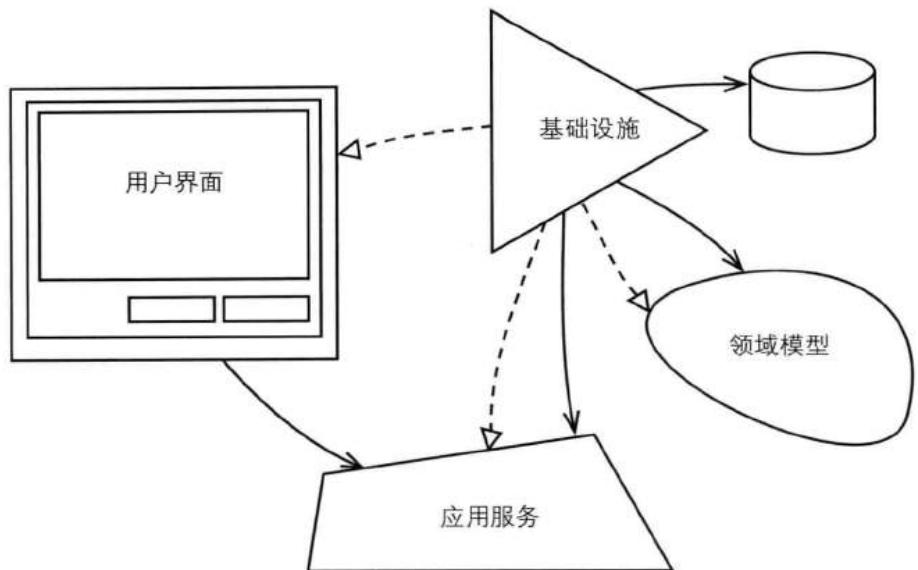


图14.1 应用程序的主要方面, 它并没有与某个特定的架构关联。它们依然强调依赖倒置原则, 此时基础设施依赖于其他方面的抽象。


接下来, 我将首先讲到用户界面, 再讲应用服务, 最后是基础设施。在每一个话题中, 我都会讲到对领域模型的处理, 但是我并不会深入地讲解模型本身, 因为本书的其他章节已经讲到了。 

## 用户界面

在Java、.NET或者其他平台中，存在着大量的人工用户界面框架。但是，这里我们关注的并不是这些。 

我们要讲的是那些更加宽泛的用户界面类型，请参考下面的列表。在该列表中，首先罗列的是那些重量级的用户界面，然后是轻量级的。在我撰写本书时，第二类的基于Web的富用户界面是最流行的，并且还将受到HTML 5的影响。第一类的应用程序，采用纯粹请求-应答式的Web用户界面，它们将作为遗留系统继续存在。 

- 纯粹请求-应答式Web用户界面，也称为Web 1.0。典型框架有Struts、Spring MVC和Web Flow、ASP.NET等。 

- 基于Web的富互联网应用 (Rich Internet Application, RIA) 用户界面，包括那些使用DHTML和Ajax的系统，也称为Web 2.0。Google GWT、Yahoo YUI、Ext JS、Adobe Flex和Microsoft Silverlight均属于这个范畴。 

- 本地客户端GUI（比如Windows、Mac和Linux的桌面用户界面），其中包括一些类库，比如Eclipse SWT、Java Swing、WinForm和WPF等。这些类库不见得一定会导致重量级的桌面应用，但这却是有可能的。本地客户端GUI可以通过HTTP访问外部服务，比如，在只将客户端安装组件作为用户界面时便是这样。 

对于以上任何一种用户界面, 首先我们都得回答以下问题: 如何将领域对象渲染到用户界面的显示中? 反之, 如何将用户操作反映到领域模型上? 

## 渲染领域对象

对于如何通过最好的方式将领域对象渲染到用户界面，业界一直存在着争论。很多时候，除了操作所需数据之外，我们还会向用户界面提供一些额外的数据。这是有好处的，因为这些额外的信息可以对用户操作起到帮助作用。这些额外数据还可以包含一些选项数据。因此，用户界面通常都需要渲染多个聚合(10)实例中的属性，尽管用户最终只会修改其中一个聚合实例，请参考图14.2。 

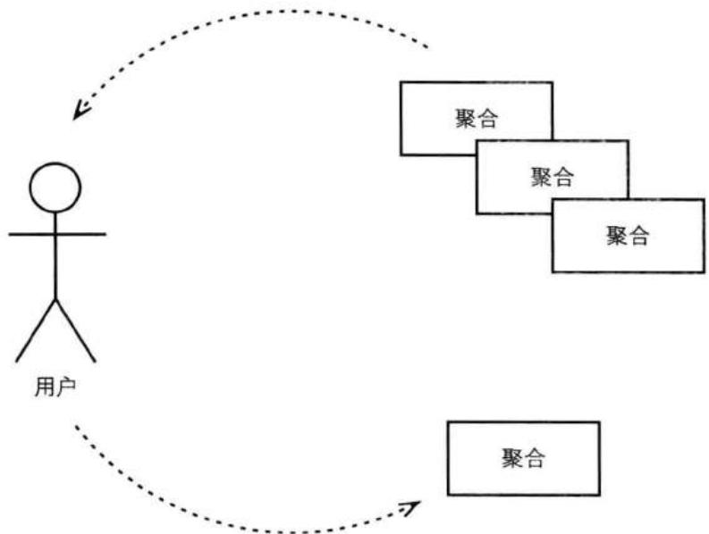


图14.2 用户界面可能需要渲染来自多个聚合实例的属性数据, 但是在提交修改时, 却只能一次修改一个实例。


## 渲染数据传输对象

一种渲染多个聚合实例的方法便是使用数据传输对象（Data Tranfer Object, DTO）[Fowler, PofEAA]。DTO将包含需要显示的所有属性值。应用服务通过资源库(12)读取所需的聚合实例，然后使用一个DTO组装器（DTOAssemble）[Fowler, P of EAA]将需要显示的属性值映射到DTO中。之后，用户界面组件将访问每一个DTO属性值，并将其渲染到显示界面中。 

在这种方式中，对数据的读和写都是通过资源库完成的。这种方式的好处在于不会存在延迟加载的问题，因为DTO组装器会直接访问聚合中需要用来创建DTO的所有数据。另外的一个好处是：它可以解决展现层（Presentation Tier）和业务层（Business Tier）存在物理分离的情况，此时我们需要对数据进行序列化，然后通过网络将其传输到展现层中。 

有趣的是，DTO模式原本就是用于在远程的展现层中显示数据的。此时，DTO在业务层中创建，再序列化，然后通过网络发送，最后在展现层中反序列化。如果你的展现层不是远程的，那么这种模式在很多时候将给你的系统带来没有必要的复杂性，即YAGNI（“You Ain’t Gonna Neet It”，你并不需要它）。它的缺点在于，我们需要创建一些与领域对象非常相似的类。另外，我们需要创建一些必须由虚拟机（比如JVM）所管理的大对象，而事实上这些对象却与单虚拟机应用架构不相匹配。 

在使用DTO时, 我们的聚合设计需要考虑到DTO组装器对聚合数据的查询。此时, 我们需要慎重考虑, 因为我们不应该暴露出太多的聚合内部结构。我们应该尽量将客户端从聚合的内部状态中完全解耦。你应该允许客户端——在本例中即DTO组装器——深度访问聚合的状态吗? 这并不是一个好的主意, 因为它使客户端与聚合实现紧密地耦合起来。 

## 使用调停者发布聚合的内部状态

要解决客户端和领域模型之间的耦合问题，我们可以使用调停者模式 [Gamma et al.]，即双分派 (Double-Dispatch) 和回调 (Callback)。此时，聚合将通过调停者接口来发布内部状态。客户端将实现调停者接口，然后把实现对象的引用作为参数传给聚合。之后，聚合双分派给调停者以发布自身状态，在这个过程中，聚合并没有向外暴露自身的内部结构。这里的诀窍在于，不要将调停者接口与任何显示规范绑定在一起，而是关注于对所感兴趣的聚合状态的渲染： 

```java
public class BacklogItem ... {
    ...
    public void provideBacklogItemInterest(
    BacklogItemInterest anInterest) {
    anInterest.informTenantId(this.tenantId().id());
    anInterest.informProductId(this.productId().id());
    anInterest.informBacklogItemId(this.backlogItemId().id());
    anInterest.informStory(this.story());
    anInterest.informSummary(this.summary());
    anInterest.informType(this.type().toString());
    ...
    }

    public void provideTasksInterest(TasksInterest anInterest) {
    Set<Task> tasks = this.allTasks();
    anInterest.informTaskCount(tasks.size());
    for (Task task : tasks) {
    ...
    }
    }
    ...
} 
```

不同的兴趣提供方可以通过其他类实现, 这就像在实体 (5) 中我们把验证逻辑委派给不同的验证类一样。 

请注意, 有些人认为这种方式完全不应该属于聚合的职责, 而还有人则认为这是对领域模型的自然扩展。一如既往地, 你需要和团队成员讨论, 然后做出适合于自己的选择。 

## 通过领域负载对象渲染聚合实例

在没有必要使用DTO时，我们可以使用另一种改进方法。该方法将多个聚合实例中需要显示的数据汇集到一个领域负载对象（Domain Payload Object, DPO）中[Vernon, DPO]。DPO与DTO相似，但是它的优点是可以用于单虚拟机应用架构中。DPO中包含了对整个聚合实例的引用，而不是单独的属性。此时，聚合实例集群可以在多个逻辑层之间传输。应用服务（请参考“应用服务”一节）通过资源库获取到所需聚合实例，然后创建DPO实例，该DPO持有对所有聚合实例的引用。之后，展现组件通过DPO获得聚合实例的引用，再从聚合中访问需要显示的属性。 

## 牛仔的逻辑

LB: “如果你从来没有从马上摔下来过, 那证明你骑马的时间还不够长。” 


这种方式的优点在于, 它简化了在不同逻辑层之间传输集群数据的过程。和DTO相比, DPO更容易设计, 并且消耗更少的内存。在创建DPO之前, 由于聚合实例必须被读到内存中, 因此之后在使用DPO时, 这些聚合实例已经存在了。 

当然，这种方式也是存在一些潜在缺点的。由于DPO与DTO相似，它照样需要聚合提供一些方法以读取聚合的状态。为了避免用户界面和模型之间的紧耦合，我们可能还需要使用前一节讲到的调停者。 

此外，我们还需要处理另一种情况。由于DPO持有的是对整个聚合实例的引用，延迟加载的对象/集合并未被加载到内存中。在创建DPO时，我们没有必要访问所有所需的聚合属性。由于在应用服务的方法结束时，事务已将随之提交，之后在展现组件中访问那些延迟加载的属性时，程序将抛出异常。 $^{3}$ 

要解决延迟加载的问题, 我们可以选择即时加载, 或者使用领域依赖求解器 (Domain Dependency Resolver, DDR) [Vernon, DDR]。这是一种策略模式 (Strategy) [Gamma et al.], 通常来说, 对于每一个用例流, 我们都会使用一种策略。对于某个用例流所需要的所有延迟加载的属性, 对应的策略都会强制性地对其进行访问。这样的策略访问作用于应用服务提交事务并返回DPO之前。我们可以对这样的策略进行硬编码以手动的访问所有延迟加载的属性, 或者可以使用简单的表达式语言, 并通过反射的机制来访问这些属性。后者的优点在于, 它可以访问那些隐藏的属性。当然, 在可能的情况下, 你也可以定制查询过程以即时地加载聚合属性。 

## 聚合实例的状态展现

如果你的程序提供了REST(4)资源,那么你便需要为领域模型创建状态展现以供客户端使用。有一点非常重要:我们应该基于用例来创建状态展现,而不是基于聚合实例。从这一点来看,创建状态展现和DTO是相似的,因为DTO也是基 于用例的。然而，更准确的是将一组REST资源看作一个单独的模型——视图模型(View Model)或展现模型(Presentation Model)[Fowler, PM]。我们所创建的展现模型不应该与领域模型中的聚合状态存在一一对应的关系。否则，你的客户端便需要像聚合本身一样了解你的领域模型。此时，客户端需要紧跟领域模型中行为和状态的变化，你也随之失去了抽象所带来的好处。 

## 用例优化资源库查询

与其读取多个聚合实例，然后再通过编程的方式将它们组装到单个容器（DTO或DPO）中，我们可以转而使用用例优化查询。此时，我们可以在资源库中创建一些查询方法，这些方法返回的是所有聚合实例属性的超集。查询方法动态地将查询结果放在一个值对象(6)中，该值对象是特别为当前用例设计的。请注意，你设计的是值对象，而不是DTO，因为此时的查询是特定于领域的，而不是特定于应用程序的。这个用例优化的值对象将被直接用于渲染用户界面。 

用例优化查询的动机与CQRS(4)相似。然而，用例优化查询依然会使用资源库，而不会直接与数据库打交道（比如使用SQL）。要了解这两者的不同，请参考资源库(12)中的相关讨论。当然，如果你打算在用例优化查询之路上继续走下去，那么你已经离CQRS很近了，此时考虑转用CQRS也是一种不错的选择。 

## 处理不同类型的客户端

如果你的应用程序必须支持多种不同类型的客户端，你该怎么办呢？这些客户端可能包括RIA、图形界面、REST服务和消息系统等。另外，各种测试也可以被认为是不同类型的客户端。此时，你的应用服务可以使用一个数据转换器（Data Transformer），然后由客户端来决定需要使用的数据转换器类型。应用层将双分派给数据转换器以生成所需的数据格式。以下是一个基于REST的客户端所使用的用户界面： 

```txt
...
CalendarWeekData calendarWeekData =
    calendarAppService
    .calendarWeek(date, new CalendarWeekXMLDataTransformer());
Response response =
    Response.ok(calendarWeekData.value())
    .cacheControl(this.cacheControlFor(30)).build(); 
```

CalendarApplicationService的calendarWeek()方法接受2个参数, 一个是Date类型的对象, 另一个是CalendarWeekDataTransformer接口的某个实现类对象。在该例中, 实现类是CalendarWeekXMLDataTransformer, 该类为CalendarWeekData创建一个XML格式的状态展现。CalendarWeekData的value()方法将以指定的数据格式返回该CalendarWeekData的状态展现, 在本例中即为String格式的XML文档。 

需要指出的是, 对于上面的例子来说, 更好的方式是对数据转换器进行依赖注入。硬编码只是为了让上面的例子更容易理解。 

CalendarWeekDataTransformer还可以有以下实现类： 

- CalendarWeekCSVDataTransformer 

- CalendarWeekDPODataTransformer 

- CalendarWeekDTODataTransformer 

- CalendarWeekJSONDataTransformer 

- CalendarWeekTextDataTransformer 

- CalendarWeekXMLDataTransformer 

对于处理不同类型的客户端来说，还有另一种方式，对此我们将在“应用服务”一节中进行讲解。 

## 渲染适配器以及处理用户编辑

有时，你需要在界面中显示领域数据，并且允许用户编辑这些数据。此时，我们可以使用一些模式来帮助我们划分职责。当然，有太多的框架可以帮助我们完成这样的任务。对于有些用户界面框架来说，我们必须采用一些特定的模式。有些时候，这些模式是好的，但另外的时候就不见得了。而另外的一些框架可能更加复杂。 

无论应用层是通过什么方式来提供领域数据的——DTO、DPO或者状态展现——也不管你使用的是什么样的展现框架，你都可以从展现模型 $^{4}$ 中获益。它的目标是分离展现与显示之间的职责。虽然展现模型可以用于Web 1.0的应用程序，但是我认为它的长处在于Web 2.0的RIA，或者桌面客户端。 

在使用这种模式时, 我们需要将视图设计成被动的, 即它们只用于显示数据和用户界面控件。在渲染视图时, 有两种方法: 

1. 根据展现模型，视图完成自我渲染。我认为这是一种更自然的方式，并且在展现模型和视图之间完成了解耦。 

2. 视图由展现模型进行渲染。这种方式在测试起来要容易一些，但是它却将展现模型与视图耦合起来。 

我们可以将展现模型看成是一种适配器[Gamma et al.]。它根据视图之所需向外提供属性和行为，由此隐藏了领域模型的细节。这也意味着，此时的展现模型不止是向外提供领域对象或DTO的属性，而是在渲染视图时，展现模型将根据模型的状态做出一些决定。比如，要在视图中显示一个特定的控件，这并不会与领域模型中的属性存在直接的关系，而是可以从这些属性中推导得出。我们不会要求领域模型对视图显示属性提供特别的支持，而是将职责分给展现模型。此时，展现模型通过领域模型的状态推导出一些特定于视图的指示器和属性值。 

使用展现模型的另一个好处在于, 如果聚合不提供JavaBean所规定的getter方法, 而用户界面框架恰恰又需要这样的getter方法, 那么展现模型可以完成这样的适配转换工作。多数基于Java的Web框架都要求对象提供公有的getter方法, 比如getSummary()和getStory()等, 但是对领域模型的设计却倾向于使用流畅的、特定于领域的表达式来反映通用语言(1)。此时, 我们将使用summary()和story()这样的方法命名, 这便与用户界面框架产生了阻抗失配。此时, 展现模型可以将summary()方法适配到getSummary()方法, 将story()方法适配到getStory()方法, 从而消除模型与视图之间的冲突: 

```java
public class BacklogItemPresentationModel extends AbstractPresentationModel {

private BacklogItem backlogItem;

public BacklogItemPresentationModel(BacklogItem aBacklogItem) { 
```

```java
super();
this.backlogItem = backlogItem;
}

public String getSummary() {
    return this.backlogItem.summary();
}

public String getStory() {
    return this.backlogItem.story();
}
... 
```

当然，展现模型可以对先前所讲的任何一种方式进行适配，包括DTO、DPO，或者用于发布聚合内部状态的调停者。 

此外，展现模型还可以跟踪用户的编辑。这并不是向展现模型添加更多的职责，因为它本来就应该具有双向的适配功能，从模型到视图，再从视图到模型。 

有一点需要注意的是，展现模型并不是围绕着应用服务或者领域模型的一个重量级门面[Gamma et al.]。诚然，当用户通过用户界面完成某个任务之后，它们通常会调用诸如“应用”或“取消”之类的操作。此时，展现模型应该能反映出这样的操作过程，即围绕着应用服务的一个最小化门面： 

```java
public class BacklogItemPresentationModel extends AbstractPresentationModel {

    private BacklogItem backlogItem;
    private BacklogItemEditTracker editTracker; //以下是注入进来的
    private BacklogItemApplicationService backlogItemAppService;

    public BacklogItemPresentationModel(BacklogItem aBacklogItem) {
    super();
    this.backlogItem = backlogItem;
    this.editTracker = new BacklogItemEditTracker(aBacklogItem);
    }
    ...
    public void changeSummaryWithType() {
    this.backlogItemAppService
    .changeSummaryWithType(
    this.editTracker.summary(),
    this.editTracker.type());
    }
    ...
} 
```

在视图中，在用户单击命令按钮之后，changeSummaryWithType()方法将被调用。对于editTracker所跟踪的编辑修改，BacklogItemPresentationModel将负责于应用服务交互以应用这些修改。在这个过程中，没有另外的旁观者来等待用户的编辑并做相应的操作。因此，我们可以认为，展现模型代表着视图向应用服务提供了一个最小化的门面，即作为高层接口的changeSummaryWithType()方法使得对BacklogItemApplicationService的使用变得更加简单。但是，我们不应该在展现模型中出现使用应用服务的细节，或者甚至直接将展现模型本身作为领域模型的应用服务。我们希望看到的是，在展现模型中简单地将处理逻辑委派给更复杂、更重量级的门面：BacklogItemApplicationService。 

以上这种方式可以很好地协调领域模型和用户界面。我们甚至可以将它看作是最强大的用户界面管理模式。但是，对于任何一种视图管理技术来说，我们依然会经常与应用服务API交互。 

## 应用服务

在有些情况下, 用户界面将使用独立的展现模型组件来汇集多个限界上下文(2), 然后将汇集后的数据组合到单个视图中。无论你的用户界面渲染了单个模型还是多个, 它都需要和应用服务交互。 

应用服务是领域模型的直接客户。至于我们可以将应用服务放在什么样的逻辑位置，请参考架构(4)。应用服务负责用例流的任务协调，每个用例流对应了一个服务方法。在使用ACID数据库时，应用服务还负责控制事务以确保对模型修改的原子提交。在本节中，我只会简要地讨论到事务控制，更多的讨论请参考资源库(12)。另外，应用服务还会处理和安全相关的操作。 

将应用服务与领域服务（7）等同起来是错误的。它们并不相同，我们将在下文中讨论到它们之间的区别。我们应该将所有的业务领域逻辑放在领域模型中，不管是聚合、值对象或者领域服务；而将应用服务做成很薄的一层，并且只使用它们来协调对模型的任务操作。 

## 示例应用服务

让我们来看看应用服务的一个示例接口和实现类,该应用服务用于管理身份与访问上下文中的Tenant。这只是一个示例,而不是最终的解决方案。 

首先是应用服务的接口： 

```java
package com.saasovation.identityaccess.application;
public interface TenantIdentityService {

    public void activateTenant(TenantId aTenantId);

    public void deactivateTenant(TenantId aTenantId);

    public String offerLimitedRegistrationInvitation(TenantId aTenantId, Date aStartsOnDate, Date anUntilDate);

    public String offerOpenEndedRegistrationInvitation(TenantId aTenantId);

    public Tenant provisionTenant(String aTenantName, String aTenantDescription, boolean isActive, FullName anAdministratorName, EmailAddress anEmailAddress, PostalAddress aPostalAddress, Telephone aPrimaryTelephone, Telephone aSecondaryTelephone, String aTimeZone);

    public Tenant tenant(TenantId aTenantId);
} 
```

以上6个应用服务方法用于创建Tenant、激活和禁用已有Tenant、邀请其他Tenant和查询Tenant等。 

领域模型中的有些对象类型被用于这些方法的签名中，这意味着用户界面需要知道这些类型，并且依赖于它们。有时，应用服务被设计成将用户界面完全地隔离于领域模型。此时，应用服务中的方法签名中将只出现原始类型（int、long和double等）和String类型，有可能还有DTO。但是，更好的方法是使用命令[Gamma et al.]对象。当然，这里并不存在对错之分，更多的是有关你自己的口味和目标。在本书中，我们对每一种风格都提供了示例展示。 

在不使用模型中的对象类型时, 我们避免了依赖和耦合, 但是却失去了强类型检查和基本的验证。在不把领域对象作为返回类型的情况下, 我们则需要提供DTO。此时, 我们需要创建一些额外的类型, 从而有可能增加系统的复杂性。另 外，由于系统不断地对DTO进行创建和垃圾回收，这有可能还会导致不必要的内存耗费。 

如果你将领域对象暴露给不同类型的客户端，那么每种客户端都需要单独地处理这些对象类型。因此，在这种情况下，耦合问题将更加严重。要解决这样的问题，我们至少可以对部分服务方法进行改进。正如之前所讨论的，我们可以使用数据转换器作为返回类型： 

```java
package com.saasovation.identityaccess.application;

public interface TenantIdentityService {

    public TenantData provisionTenant(
    String aTenantName,
    String aTenantDescription,
    boolean isActive,
    FullName anAdministratorName,
    EmailAddress anEmailAddress,
    PostalAddress aPostalAddress,
    Telephone aPrimaryTelephone,
    Telephone aSecondaryTelephone,
    String aTimeZone,
    TenantDataTransformer aDataTransformer);

    public TenantData tenant(
    TenantId aTenantId,
    TenantDataTransformer aDataTransformer);
    ...
} 
```

就现在而言, 我只会讨论向客户端暴露领域对象的情况, 并且假设只存在一个基于Web的用户界面, 因为这样可以简化示例代码。之后, 我们会回过头来讨论使用数据转换器的方式。 

考虑一下如何实现应用服务。让我们先看看一些简单的例子，它们有助于我们了解一些基本概念。需要注意的是，使用独立接口[Fowler, P of EAA]并没有多少好处。在下面的例子中，我们将应用服务的接口和实现定义在了同一个类中： 

```java
package com.saasovation.identityaccess.application;
public class TenantIdentityService {
    @Transactional
    public void activateTenant(TenantId aTenantId) {
    this.nonNullTenant(aTenantId).activate();
    }
} 
```

```java
@Transactional
public void deactivateTenant(TenantId aTenantId) {
    this.nonNullTenant(aTenantId).deactivate();
}

@Transactional(readOnly=true)
public Tenant tenant(TenantId aTenantId) {
    Tenant tenant =
    this
    .tenantRepository()
    .tenantOfId(aTenantId);

    return tenant;
}

private Tenant nonNullTenant(TenantId aTenantId) {
    Tenant tenant = this.tenant(aTenantId);

    if (tenant == null) {
    throw new IllegalArgumentException(
    "Tenant does not exist.");
    }

    return tenant;
} 
```

客户端通过调用deactivateTenant()方法来禁用一个已有的Tenant。要与实际的Tenant交互，我们需要首先通过TenantId从资源库中获取到一个Tenant实例。这里我们创建了一个内部的帮助方法nonNullTenant()来获取一个Tenant，该方法进而委派给tenant()方法。这个帮助方法对那些Tenant不存在的情况起到了守卫的作用，所有的服务方法都将通过该方法来获取一个已有的Tenant。 

方法activateTenant()和deactivateTenant()被标记以Spring的Transactional事务注解，并且是可写事务；而tenant()方法的事务则是只读的。在所有这三种情况下，当客户端从Spring容器中获取到该TenantIdentityService并调用服务方法时，事务便会启动。当这些方法正常返回时，事务将被提交。根据不同的配置，从方法中抛出的异常将导致事务的回滚。 

但是, 我们如何保证这些方法不被错误地调用呢? 比如, 来了一个恶意的攻击方? 当我们谈论到激活或禁用一个Tenant时, 这样的操作实际上只能由SaaSOvation公司通过授权的员工用户完成。对于准备 (Provision) 一个新的Tenant订阅方来说, 也是一样。 

此时, 我们可以使用Spring Security。我们需要另一个注解, PreAuthorize: 

```java
public class TenantIdentityService {

    @Transactional
    @PreAuthorize("hasRole('SubscriberRepresentative')")
    public void activateTenant(TenantId aTenantId) {
    this.nonNullTenant(aTenantId).activate();
    }

    @Transactional
    @PreAuthorize("hasRole('SubscriberRepresentative')")
    public void deactivateTenant(TenantId aTenantId) {
    this.nonNullTenant(aTenantId).deactivate();
    }

    ...

    @Transactional
    @PreAuthorize("hasRole('SubscriberRepresentative')")
    public Tenant provisionTenant(
    String aTenantName,
    String aTenantDescription,
    boolean isActive,
    FullName anAdministratorName,
    EmailAddress anEmailAddress,
    PostalAddress aPostalAddress,
    Telephone aPrimaryTelephone,
    Telephone aSecondaryTelephone,
    String aTimeZone) {

    return
    this
    .tenantProvisioningService
    .provisionTenant(
    aTenantName,
    aTenantDescription,
    isActive,
    anAdministratorName,
    anEmailAddress,
    aPostalAddress,
    aPrimaryTelephone,
    aSecondaryTelephone,
    aTimeZone);
    }
} 
```

这是一种声明式的、方法层面的安全授权，它可以阻止未授权的用户对应用服务的访问。当然，对于未被授权的用户来说，用户界面可以隐藏那些能够导航到应用服务的相关信息。但是，对于恶意的攻击者来说，隐藏是无济于事的，而上面的安全注解则能提供防卫。 

这种声明式的安全机制和IdOvation提供的安全机制是不同的。SaaSOvation的员工登录IdOvation的方式与Tenant用户是不一样的。特别地，那些拥有SubscriberRepresentative角色的员工是可以执行这些敏感的服务方法的，而对于订阅方的用户来说，则不可以。当然，这需要在IdOvation和Spring Security之间进行集成。 

现在，让我们看看provisionTenant()方法，该方法将委派给领域服务。这也向我们展示了应用服务和领域服务的区别，特别是当我们看到TenantProvisioningService领域服务的内部时，这种区别就更加明显了。在领域服务中，存在着大量的领域逻辑，但是对于应用服务则不然。我们可以设想一下以上领域服务所完成的操作（没有提供代码）： 

1. 实例化一个新的Tenant聚合，并将其添加到资源库中。 

2. 为该Tenant指派一个新的管理员，其中包括为这个新的Tenant准备一个Administrator角色，并且发布TenantAdministratorRegistered事件。 

3. 发布TenantProvisioned事件。 

如果应用服务所包含的已经超出上面的第1步, 那么此时领域逻辑便会从模型中泄露出去。对于第2步和第3步来说, 由于它们并不属于应用服务的职责, 因此我们干脆将所有3个步骤一起放在领域服务中。在使用领域服务时, 我们“将这个显著的过程……放在了领域模型中[Evans]。”同时, 应用层依然管理着事务、安全和任务委派等操作, 即将这个显著的准备Tenant的过程委派给了领域模型。 

但是，请注意provisionTenant()方法的参数列表。这里总共有9个参数，并且还可能存在更多。对于这样的情况，我们可以通过一个简单的命令[Gamma et al.]对象予以避免。命令对象即“将一个请求封装到一个对象中，从而使得我们对客户端 进行参数化，包括不同的请求、队列或者日志请求等；另外，命令对象还支持撤销操作。”换句话说，我们可以将命令对象看成是序列化的方法调用。在本例中，除了撤销操作，我们希望得到命令对象所带来的所有其他好处。以下是一个简单的命令类： 

```java
public class ProvisionTenantCommand {
    private String tenantName;
    private String tenantDescription;
    private boolean isActive;
    private String administratorFirstName;
    private String administratorLastName;
    private String emailAddress;
    private String primaryTelephone;
    private String secondaryTelephone;
    private String addressStreetAddress;
    private String addressCity;
    private String addressStateProvince;
    private String addressPostalCode;
    private String addressCountryCode;
    private String timezone;

    public ProvisionTenantCommand(...) {
    ...
    }

    public ProvisionTenantCommand() {
    super();
    }

    public String getTenantName() {
    return tenantName;
    }

    public void setTenantName(String tenantName) {
    this.tenantName = tenantName;
    }
    ...
} 
```

这里的ProvisionTenantCommand并没有使用领域对象，而是一些基本的类型。它拥有一个多参数的构造函数和一个没有参数的构造函数。公有的setter方法使得我们将UI中的字段映射到相应的ProvisionTenantCommand属性中（比如，考虑使用JavaBean或者.NETCLR属性）。你可以将命令对象看成是一个DTO，但是，命令对象所能表达的要比DTO多。由于我们根据操作来命名命令对象，它的意图将更加明显。我们可以将命令对象的实例传给应用服务的方法： 

```java
public class TenantIdentityService {
    ...
    @Transactional
    public String provisionTenant(ProvisionTenantCommand aCommand) {
    ...
    return tenant.tenantId().id();
    }
    ...
} 
```

在上例中, 我们把一个命令对象分发给了应用服务的API方法。除此之外, 我们还可以将命令对象发送到一个队列中, 然后分发给命令处理器 (Command Handler)。我们可以将命令处理器等效于应用服务的方法, 但是它的好处在于可以做到临时的解耦。在附录A中我们会讨论到, 这种方法可以获得更大的吞吐量, 并且可以增加命令处理的伸缩性。 

## 解耦服务输出

先前, 我们讨论到了数据转换器。对于不同类型的客户端, 数据转换器将提供客户端所需的特定数据类型。此时, 不同的数据转换器将实现一个共有的抽象接口。从客户端的角度, 我们可以通过以下方式来使用数据转换器: 

```txt
TenantData tenantData =
tenantIdentityService.provisionTenant(
... , myTenantDataTransformer);

TenantPresentationModel tenantPresentationModel =
new TenantPresentationModel(tenantData.value()); 
```

应用服务被设计成了具有输入和输出的API，而传入数据转换器的目的即在于为客户端生成特定的输出类型。 

现在, 让我们考虑另一种完全不同的方式: 使应用服务返回void类型而不向客户端返回数据。这将如何工作呢? 事实上, 这正是六边形架构 (4) 所提倡的, 此时我们可以使用端口和适配器的风格。对于本例, 我们可以使用单个标准输出端口, 然后为不同种类的客户端创建不同的适配器。此时, 应用层的provisionTenant()方法将变成: 

```dart
@Transactional
@PreAuthorize("hasRole('SubscriberRepresentative')")
public void provisionTenant(
    String aTenantName,
    String aTenantDescription,
    boolean isActive,
    FullName anAdministratorName,
    EmailAddress anEmailAddress,
    PostalAddress aPostalAddress,
    Telephone aPrimaryTelephone,
    Telephone aSecondaryTelephone,
    String aTimeZone) {

    Tenant tenant =
    this
    .tenantProvisioningService
    .provisionTenant(
    aTenantName,
    aTenantDescription,
    isActive,
    anAdministratorName,
    anEmailAddress,
    aPostalAddress,
    aPrimaryTelephone,
    aSecondaryTelephone,
    aTimeZone);

    this.tenantIdentityOutputPort().write(tenant);
} 
```

这里的输出端口是一个特殊的命名端口，它位于应用程序的边缘。在使用Spring时，该端口类可以被注入到应用服务中。此时，provisionTenant()方法唯一需要知道的便是调用write()方法把从领域服务中获取到的Tenant实例写到端口中。该端口可以有很多读取器，在使用应用服务之前，我们将这些读取器注册给端口。在write()方法执行后，每一个注册的读取器都会将端口的输出作为自己的输入。在读取数据时，读取器可以使用某些机制对数据进行转换，比如数据转换器。 

这并不是一种增加架构复杂性的雕虫小技，而是与其他任何端口和适配器架构——无论是软件系统，还是硬件设备——具有相同的长处。每一个组件只需要知道读进输入、调用自身行为，最后将输出写到端口中。 

粗略看来，将输出写到端口中与聚合中的纯命令方法相似。聚合的这些命令方法也没有返回值，但是它却会发布领域事件（8）。因此，对于聚合来说，事件发布 器便是输出端口。另外，如果我们使用调停者的双分派来处理对聚合状态的查询，那么这也与端口和适配器相似。 

使用端口和适配器的一个不足之处在于, 我们很难命名应用服务中的查询方法。考虑一下上面示例中的tenant()方法。此时, 该方法的名字已经不再合适, 因为它不再返回Tenant实例。但是, provisionTenant()方法的名字则可以保持不变, 因为它已经变成了一个纯命令方法, 而不需要返回值。那么, 对于tenant()方法来说, 我们应该给它起一个更好的名字: 

```txt
...
@Override
@Transactional(readOnly=true)
public void findTenant(TenantId aTenantId) {
    Tenant tenant =
    this
    .tenantRepository
    .tenantOfId(aTenantId);

    this.tenantIdentityOutputPort().write(tenant);
}
... 
```

这里的findTenant()方法是合理的, 因为查找并不隐含需要返回结果的意思。但是, 无论如何, 我们都知道了: 任何一种架构都同时存在正面的和负面的影响。 

## 组合多个限界上下文

在以上的例子中, 我们并没有谈及到单个用户界面需要多个领域模型提供数据的情况。在这种情况下, 上游模型中的概念被集成到了下游模型中, 采用的方法是将上游的概念翻译成下游模型中的术语。 

这和图14.3中所展示的是不同的。在图14.3中，我们需要将多个模型组合成一个单一的展现。图中的产品上下文(Products Context)、讨论上下文(Discussion Context)和检查上下文(Review Context)都属于外部模型。如果这样的场景出现在你自己的应用程序中，那么你需要好好考虑如何设计模块(9)结构并对其命名，以及在应用服务中如何平滑地处理不同模型之间的摩擦。 

一种方式是采用多个应用层，这种方式与图14.3中所示的不同。在这种方式中，我们需要为每个用户界面组件都提供所有的应用层，此时的用户界面组件将向领域模型靠近。基本上，这只是一种Portal-Portlet的风格而已。另外，这种方式也无法与用例流保持一致，而这却正是用户界面所关注的。 

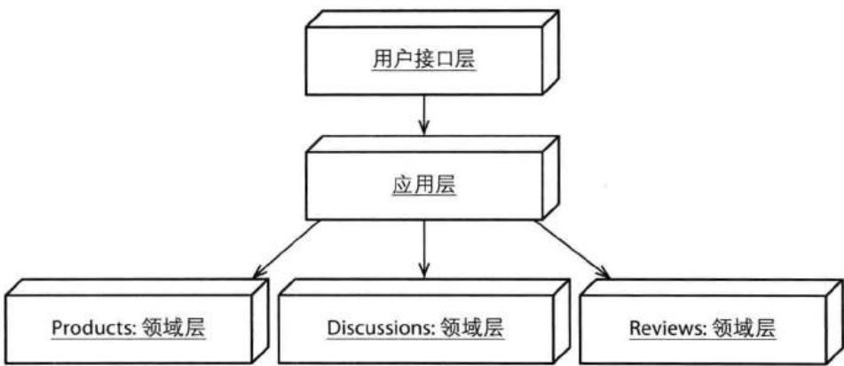


图14.3 有时，UI必须组合多个模型。这里，3个模型被同一个应用层组合在一起。


由于是应用层来管理用例, 此时最简单的方法可能是创建一个单一的应用层, 并使该应用层来组合多个模型, 如图14.3所示。另外, 又由于这个应用层中的服务并不包含领域逻辑, 它的唯一功能便是将不同模型中的聚合对象组合成用户界面所需的内聚对象。在这种情况下, 我们可以根据数据组合的目的来命名用户界面和应用层中的模块: 

com.consumerhive.productreviews.presentation 

com.consumerhive.productreviews.application 

这里的Consumer Hive向外提供产品检查和讨论。它把产品上下文从讨论上下文和检查上下文中分离出来。但是，presentation和application模块表明它们位于同一个用户界面之下。虽然该用户界面将从多个外部源中获取产品目录，但是这无妨大碍，因为讨论和检查才是它的核心域。 

说到核心域……这里你是否察觉出了些什么？这里的应用层不是成了一个拥有内建防腐层（3）的新领域模型吗？是的，它是一个新的、廉价的限界上下文。在该上下文中，应用服务对多个DTO进行合并，产生的结果有点像贫血领域对象（1）。这种方式也有点像是在通过事务脚本（1）来建模核心域。 

如果你认为Consumer Hive是将三个模型组合成一个新的领域模型(1)，并将其放在一个新的限界上下文中，那么你可通过以下方式来命名新模型中的模块： 

com.consumerhive.productreviews.domain.model.product 

com.consumerhive.productreviews.domain.model.discussion 

com.consumerhive.productreviews.domain.model.review 

最终, 你需要决定如何对这种场景进行建模。你会考虑使用战略设计甚至战术设计来创建一个新模型吗? 对于这种场景, 我们至少需要回答以下问题: 我们是将多个限界上下文组合到单个用户界面中呢, 还是创建一些新的、清晰的限界上下文? 我们应该仔细地考虑每一种情形, 而不是草率地做决定。最终, 最好的方式是那些对业务最有益的方式。 

## 基础设施

基础设施的职责是为应用程序的其他部分提供技术支持。这里，虽然我们避免对分层(4)的讨论，但是保持着依赖倒置原则的心态依然是有用的。因此，从架构上讲，无论基础设施位于什么地方，只要它的组件依赖于用户界面、应用服务和领域模型中的接口，而这些接口又需要特殊的技术支持，那么它都能工作得很好。这样，在应用服务获取资源库时，它只会依赖于领域模型中的接口，而实际使用的则是基础设施中的实现类。在图14.4中，静态的UML结构图向我们展示了这个过程。 

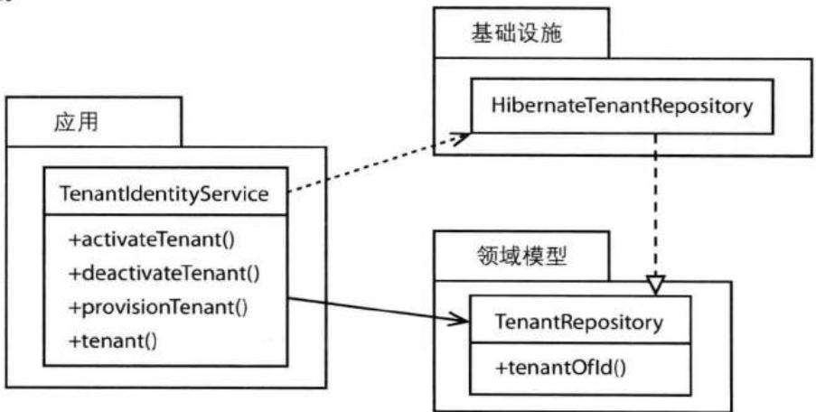


图14.4 应用服务依赖于领域模型中的资源库接口，而该接口的实现则位于基础设施中。包承担了很重要的职责。


对资源库的查找可以通过依赖注入[Fowler, DI]或者服务工厂(Service Factory)隐式地完成。本章的最后一节“企业组件容器”讨论了这两种方式。这里，我再次给出前文中关于应用服务的一个例子，从中我们可以看到如何使用服务工厂来获取资源库： 

```java
package com.saasovation.identityaccess.application;

public class TenantIdentityService {

    @Override
    @Transactional(readOnly=true)
    public Tenant tenant(TenantId aTenantId) {
    Tenant tenant =
    DomainRegistry
    .tenantRepository()
    .tenantOfId(aTenantId);

    return tenant;
    }
    ...
} 
```

对于以上的应用服务来说, 我们还可以将资源库注入到服务类中, 或者通过构造函数的方式将资源库传入。 

资源库的实现被放在了基础设施层中，因为它们负责处理数据存储，而这些不属于模型的职责。你可以使基础设施层实现那些与消息相关的接口，比如消息队列和E-mail等。如果还有一些特殊的用户界面组件来处理诸如图表之类的展现，那么它们也应该放在基础设施层中。 

## 企业组件容器

当下，企业应用服务器已经成为了商品。对于这样的服务器及其所包含的组件容器来说，似乎并没有多少创新。对于应用服务来说，我们可以使用EJB作为会话门面(Session Facades) [Crupi et al]，或者也可以使用IOC (Inversion Of Control) 容器中的简单JavaBean，比如使用Spring。对于孰优孰劣，一直存在着争论，但是这些框架却存在着一种合流之势。事实上，有些Java EE容器在内部即使用了Spring。 

## 是WebLogic还是Spring?

如果你深入到Oracle的WebLogic服务器内部，你将发现它引用了Spring框架中的一些类。它们并不是你的应用部署的一部分。此时，你使用的依然是标准EJB的Session Bean。而你所看到的Spring类只是WebLogic的EJB容器实现的一部分。这是不是就是“如果你无法击败它们，就参与到它们中呢”？ 

对于本书的三个限界上下文, 我选用了Spring框架, 但是这些例子同样可以放在其他的企业组件容器中。因此, 如果使用的不是Spring, 你也没有失去什么。在阅读这些例子时, 你依然不会有什么不适之感, 因为这些容器在逻辑上的区别非常小。 

在资源库(12)中, 我们看到了为应用服务配置事务的例子。这里, 让我们看看Spring配置的其他部分, 主要有两个Spring配置文件: 

```txt
config/spring/applicationContext-application.xml
config/spring/applicationContext-domain.xml 
```

应用服务和领域模型组件是通过AutoWired的方式联系在一起的。比如： 

```xml
<beans ...>
    <aop:aspectj-autoproxy/>
    <tx:annotation-driven transaction-manager="transactionManager"/>
    ...
    <bean
    id="applicationServiceRegistry"
    class="com.saasovation.identityaccess.application.ApplicationServiceRegistry"
    autowire="byName">
    </bean>
    ...
    <bean
    id="tenantIdentityService"
    class="com.saasovation.identityaccess.application.TenantIdentityService"
    autowire="byName">
    </bean>
    ...
</beans> 
```

这里的tenantIdentityService即我们先前讨论过的应用服务。这个bean可以被装配到其他的bean中，比如用户界面。如果你更倾向于使用服务工厂，而不是将一个bean注入到另一个bean中，你也可以使用applicationServiceRegistry，该bean用于查找所有的应用服务。你可以通过如下方式使用： 

```txt
...
ApplicationServiceRegistry
. tenantIdentityService()
.deactivateTenant (tenantId); 
```

我们是可以这么做的, 因为在该bean新建时, 它将被自动地注入到Spring的ApplicationContext中。 

对于领域模型中的组件来说, 比如资源库和领域服务等, 我们也可以使用相同的方式。此时, 注册工厂、资源库和领域服务的配置如下: 

```html
<beans ...>
    ...
    <bean
    id="authenticationService"
    class="com.saasovation.identityaccess.infrastructure.services.DefaultEncryptionAuthenticationService"
    autowire="byName">
    </bean>

    <bean
    id="domainRegistry"
    class="com.saasovation.identityaccess.domain.model.DomainRegistry"
    autowire="byName">
    </bean>

    <bean
    id="encryptionService"
    class="com.saasovation.identityaccess.infrastructure.services.MessageDigestEncryptionService"
    autowire="byName">
    </bean>

    <bean
    id="groupRepository"
    class="com.saasovation.identityaccess.infrastructure.persistence.HibernateGroupRepository"
    autowire="byName">
    </bean>

    <bean
    id="roleRepository"
    class="com.saasovation.identityaccess.infrastructure.persistence.HibernateRoleRepository"
    autowire="byName">
    </bean>

    <bean 
```

```txt
id="tenantProvisioningService"
class="com.saasovation.identityaccess.domain.model.identity.TenantProvisioningService"
autowire="byName">
</bean>

<bean
    id="tenantRepository"
    class="com.saasovation.identityaccess.infrastructure.persistence.HibernateTenantRepository"
    autowire="byName">
</bean>

<bean
    id="userRepository"
    class="com.saasovation.identityaccess.infrastructure.persistence.HibernateUserRepository"
    autowire="byName">
</bean>
</beans> 
```

我们可以通过DomainRegistry来访问任何一个Spring的bean。同时，这些bean也可以依赖注入到其他bean中。因此，应用服务可以使用服务工厂和依赖注入的任一种方式。有关这两种方式与基于构造函数的依赖设置的区别，请参考领域服务(7)。 


## 本章小结

在本章中, 我们讨论了应用程序在领域模型之外是如何工作的。 

- 你学到了将模型数据渲染到用户界面的多种方法。 

- 对于那些将应用于领域模型的用户输入，你学到了不同的接收方式。 

- 你学到了传输模型数据的不同方式, 甚至是当存在多种用户界面类型时的传输方式。 

- 你学习了应用服务以及它们的职责。 

- 你学到了将输出与特定客户类型解耦的一种方式。 

- 你学到了如何使用基础设施将技术实现隔离于领域模型。 

- 你学到了如何使用依赖倒置原则使所有的组件都只依赖于抽象，而不是实现细节。这种方式有助于组件之间的松耦合性。 

- 最后，你学到了如何在自己的应用程序中使用那些商用的应用服务器和企业组件容器。 

现在, 你已经为实现DDD打下了坚实的基础, 包括从领域模型到整个应用程序中的所有组件。 

# 聚合与事件源: A+ES

由Rinat Abdullin撰写 

事件源 (Event Sourcing) 的概念已经存在了几十年, 但是直到最近才被Greg Young用于DDD中[Young, ES], 并使其流行起来。 

事件源通过事件来表示一个聚合(10)的完整状态, 这里的事件是自聚合创建以来的一系列事件(8)。通过按照产生时的顺序重放这些事件, 我们可以重建聚合的状态。这里的前提是, 这种方式可以简化持久化, 并且允许我们捕捉那些复杂的行为概念。 

这些用于重建聚合状态的事件位于一个事件流 (Event Stream) 中, 我们只能通过追加的方式向该事件流中加入事件。当新的事件被追加到事件流尾部时, 聚合状态也将被进一步改变, 如图A.1所示 (在本附录中, 事件以一个灰色的矩形表示, 以区别于其他概念)。 

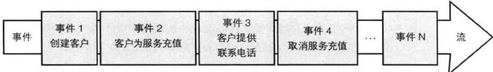


图A.1 事件流中包含了以产生顺序排列的领域事件。


通常来说, 每个聚合所对应的事件流都将被持久化到事件存储 (8) 中。各个事件流之间彼此分离, 常用的分离方式是采用根实体 (5) 的唯一标识。在本附录后面, 我们将讲到如何创建一个特定于事件源的事件存储。 

从现在起, 让我们将这种使用事件源来维护聚合状态的方式称为 A+ES (Aggregate + Event Sourcing)。 

A+ES的主要优势在于： 

- 事件源确保每次聚合改变的原因都不会丢失。在使用传统的序列化聚合到数据库的方式时，我们总是会覆盖先前的序列化状态，此时，那些先前的聚合状态将无法恢复。虽然对于业务来说，这种保留每一次聚合修改原因的 做法可能价值并不大。但是在架构(4)中我们讲到，这种方式是具有长远优势的：可靠性、短期/长期商业智能化、数据分析、全日志记录和调试等。 

- 只追加 (append-only) 特性使事件源具有很高的性能，并且支持不同的数据复制 (data replication) 方案。比如 LMAX 公司，该公司采用相似的方式成功地开发了一套低时延的股票交易系统。 

- 这种以事件为中心的聚合设计方式使得开发者将关注点集中于通用语言(1)所表达的行为上, 因为此时并不存在ORM中的阻抗失配。由此所创建的系统将拥有更高的健壮性和更大的修改容忍度。 

当然，A+ES也不是什么银弹，它也是存在缺点的： 

- 为A+ES设计事件需要我们对业务领域有很深的了解。对于任何一个DDD项目，通常只有那些复杂的模型才配得上这样的付出，此时你的公司将从中获得竞争优势。 

- 在写本书时，A+ES领域缺少工具支持和一个一致的知识体系。因此，这种方式将增加项目的成本与风险。 

- 有经验的开发者数目有限。 

- 实现A+ES几乎必然地需要某种形式的命令-查询职责分离，即CQRS(4)，因为我们很难对事件流进行查询。这将增加开发者的学习负担。 

对于那些无畏者来说，采用A+ES的确是有益处的。接下来，让我看看在面向对象世界中如何实现A+ES。 

## 应用服务内部

深入到应用服务 (4, 14) 内部可以向我们展示A+ES的总览。通常来说，我们将聚合放置在领域模型内部，而领域模型又位于应用服务的后面。此时，应用服务是领域模型的直接客户。 

在应用服务获得控制权后，它将加载聚合，并获取所需领域服务（7）以完成业务操作。当应用服务将处理逻辑委派给聚合的业务方法时，聚合方法将发布事件以作为输出。这些事件将修改聚合的状态，并且以通知的形式发布给所有的事件订阅方。聚合的业务方法可能需要一个或多个领域服务作为参数传入，这些领 域服务所返回的数据将用于修改聚合的状态。有些领域服务的操作可能会包括调用一个支付接口、请求一个唯一标识或者从一个远程系统查询数据等。图A.2展示了以上过程。 

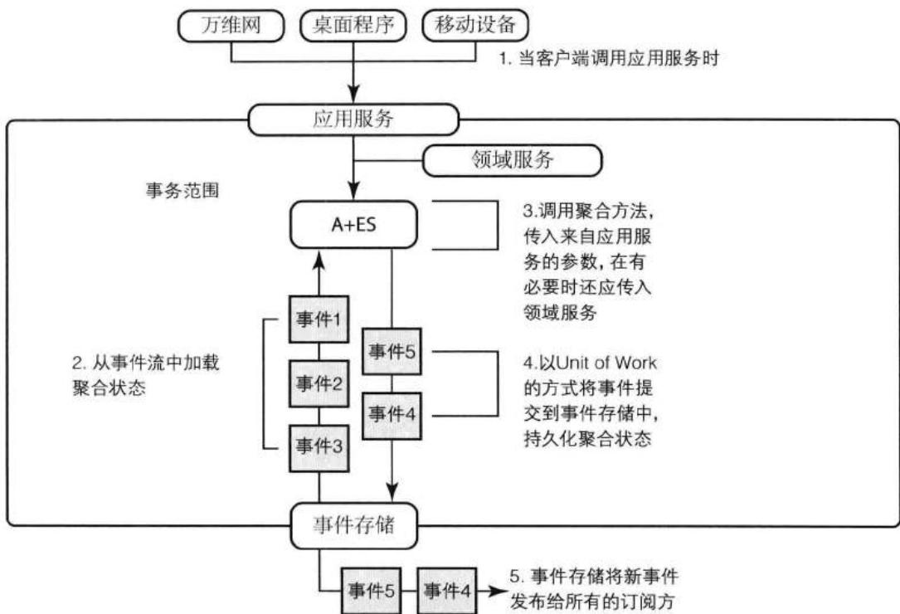


图A.2 应用服务控制对聚合的访问和使用。


以下应用服务 (C#) 向我们展示了如何实现图A.2中的各个步骤: 

```cs
{
    _eventStore = eventStore;
    _pricingService = pricing;
}

//第1步：调用应用层的LockForAccountOverdraft 方法
// Customer Application Service is called
public void LockForAccountOverdraft(
    CustomerId customerId, string comment)
{
    //第2.1步：加载Customer的事件流
    var stream = _eventStore.LoadEventStream(customerId);
    //第2.2步：通过事件流创建聚合
    var customer = new Customer(stream.Events);
    //第3步：调用聚合方法，传入参数和领域服务
    // pricing domain service
    customer.LockForAccountOverdraft(comment, _pricingService);
    //第4步：向事件流提交修改
    _eventStore.AppendToStream(
    customerId, stream.Version, customer.Changes);
}

public void LockCustomer(CustomerId customerId, string reason)
{
    var stream = _eventStore.LoadEventStream(customerId);
    var customer = new Customer(stream.Events);
    customer.Lock(reason);
    _eventStore.AppendToStream(
    customerId, stream.Version, customer.Changes);
}

//应用层的其他方法 
```

CustomerApplicationService有2个依赖：IEventStore和IPricingService，它们通过构造函数参数传入。通过构造函数参数来处理依赖是可以的，同时我们还可以使用服务工厂或者依赖注入的方式。当然，决定权在你。 

## 在哪里能找到示例代码？

```txt
本附录的所有示例代码都可以通过以下方式下载到：：
http://lokad.github.com/lokad-iddd-sample/. 
```

IEventStore接口可以非常简单, EventStream也是如此: 

```txt
public interface IEventStore
{
    EventStream LoadEventStream(Identity id); 
```

```cs
EventStream LoadEventStream(
    IIdentity id, int skipEvents, int maxCount);

void AppendToStream(
    IIdentity id, int expectedVersion, ICollection<IEvent> events);
}

public class EventStream
{
    //事件流的版本号
    public int Version;

    //事件流中的所有事件
    public List<IEvent> Events;
} 
```

该事件存储可以简单地使用关系型数据库 (Microsoft SQL、Oracle或者MySQL) 来实现，或者采用NoSQL存储（文件系统、MongoDB、RavenDB或者Azure Blob）。 

在从事件存储中加载事件时, 我们需要传入那个需要重建的聚合实例的唯一标识。让我们看看对于一个名为Customer的聚合, 这是如何实现的。虽然唯一标识可以是任意的类型, 但出于代码表达性, 我们将使用IIdentity接口, 然后让CustomerId实现该接口。 

我们需要加载某个Customer所对应的事件, 然后将这些事件作为参数传给Customer的构造函数以实例化该聚合: 

```javascript
var eventStream = _eventStore.LoadEventStream(customerId);
var customer = new Customer(eventStream.Events); 
```

如图A.3所示, 聚合将调用Mutate()方法以重放各个事件。示例代码如下: 

```txt
public partial class Customer
{
    public Customer(IEnumerable<IEvent> events)
    {
    // 将聚合恢复到最新版本
    foreach (var @event in events)
    {
    Mutate(@event);
    }
    }

    public bool ConsumptionLocked { get; private set; } 
```


## 附录A 聚合与事件源：A+ES

```java
public void Mutate(IEvent e)
{
    //根据方法签名匹配调用相应的When()方法
    ((dynamic) this).When((dynamic)e);
}

public void When(CustomerLocked e)
{
    ConsumptionLocked = true;
}

public void When(CustomerUnlocked e)
{
    ConsumptionLocked = false;
}

// etc. 
```

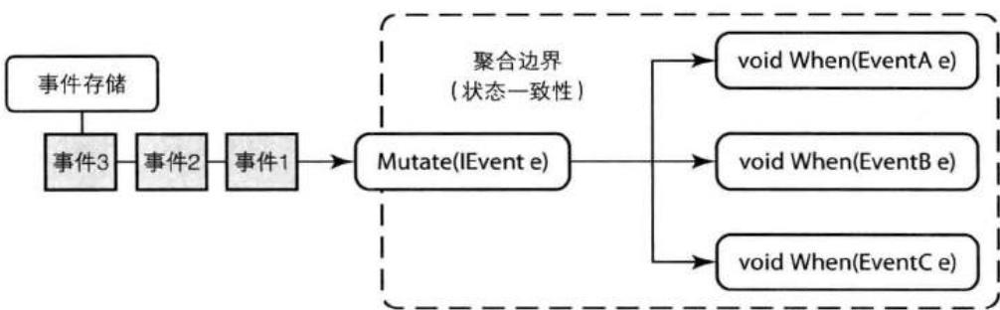


图A.3 使用事件重建聚合, 此时应该以事件产生时的顺序应用各个事件。


这里的Mutate()方法(通过.NET dynamics)根据事件类型调用相应的When()方法，在调用时，传入事件作为参数。在Mutate()方法执行完毕后，Customer实例便拥有了一个重建完整的状态。 

另外, 我们还可以创建一个查询方法来从事件存储中重建一个聚合实例: 

```txt
public Customer LoadCustomerById(CustomerId id)
{
    var eventStream = _eventStore.LoadEventStream(id);
    var customer = new Customer(eventStream.Events);
    return customer;
} 
```

以上, 我们看到了如何将事件流中的事件用于重建聚合, 此外, 这些历史事件还可以有其他的用途。我们可以将它们用于查看之前所发生的事情, 这也使得我们可以方便地对产品环境进行调试。 

业务操作是如何执行的呢？在聚合重建好之后，应用服务会把处理逻辑委派给聚合实例的一个命令方法。该聚合实例将使用其当前状态以及领域服务来执行业务操作。随着行为的执行，对聚合状态的修改将通过新的事件予以记录。之后，每个新的事件都会传给聚合的Apply()方法，如图A.4所示。 

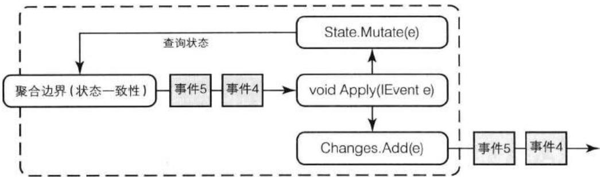


图A.4 聚合由过去的事件重建而成，聚合行为又将产生新的事件。


从下面的例子可以看出, 新的事件首先会被添加到Changes集合中, 然后再用于修改聚合的当前状态: 

```txt
public partial class Customer
{
    ...
    void Apply(IEvent event)
    {
    // 将事件追加到事件列表中，之后持久化
    Changes.Add(event);
    // 传入每个事件以修改当前内存状态
    Mutate(event);
    }
    ...
} 
```

所有添加到Changes集合中的事件都将被持久化。由于每个事件都会立即修改聚合的状态，如果一个操作拥有多个步骤，当后一个步骤执行时，聚合的状态总是最新的。 

接下来, 让我们看看Customer聚合的一些业务行为: 


```cs
public partial class Customer
{
    //聚合类的第二部分
    public List<IEvent> Changes = new List<IEvent>();

    public void LockForAccountOverdraft(
    string comment, I PricingService pricing)
    {
    if (!ManualBilling)
    {
    var balance = pricing.GetOverdraftThreshold(Currency);
    if (Balance < balance)
    {
    LockCustomer("Overdraft." + comment);
    }
    }
    }

    public void LockCustomer(string reason)
    {
    if (!ConsumptionLocked)
    {
    Apply(new CustomerLocked(_state.Id, reason));
    }
    }

    //其他业务方法未予显示
    void Apply(IEvent e)
    {
    Changes.Add(e);
    Mutate(e);
    }
} 
```

## 考虑使用两个实现类

为了使代码更加清晰, 我们可以将A+ES的实现分成两个类, 一个状态类, 一个行为类, 行为对象持有状态对象。在Apply()方法中, 这两个对象将紧密地协作。这种方法可以保证状态只能通过事件进行修改。 

在修改状态的行为执行完毕之后, 我们必须将Changes集合提交给事件存储。所有的修改都将被追加到事件流中, 此时我们应该保证不存在并发冲突。要执行并发检查是可能的, 因为我们从Load()方法中向Append()方法传入了一个并发版本变量。 

在一个最简单的实现中, 将会有一个后台处理器来捕获新追加的事件, 然后将它们发布到消息基础设施中 (比如RabbitMQ、JMS、MSMQ或者云队列), 进而发送给所有的兴趣相关方。请参考图A.5。 

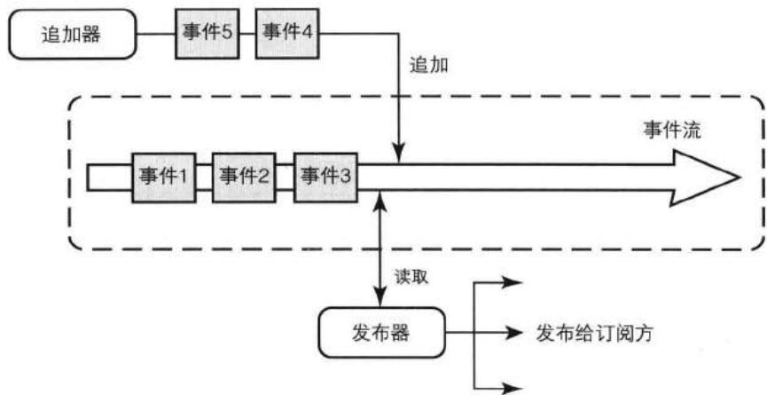


图A.5 由聚合行为产生的新事件被发布给订阅方。


我们还可以对以上实现进行改进。比如，可以对事件进行复制/克隆以增加系统的容错能力。图A.6向我们展示了一种立即复制事件的方法。 

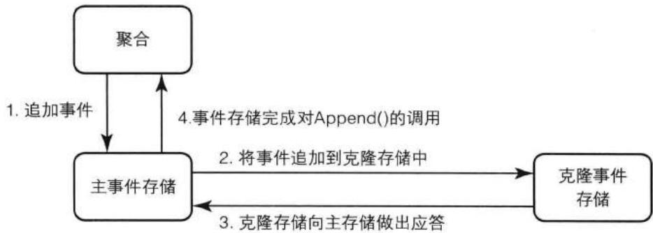


图A.6 同步写入：主事件存储将新追加的事件立即复制到克隆事件存储中。


在这种情况下, 对于主 (Master) 事件存储来说, 只有当它成功地将事件复制到克隆 (Clone) 事件存储之后, 它才会认为对事件的保存是成功的。这是一种同步写入 (write-through) 的策略。 

另一种方法是: 在主存储保存聚合修改之后, 在一个单独的线程中将事件复制到克隆存储中。这是一种延迟写入 (write-behind) 的策略, 如图A.7所示。在这种 方式下，克隆存储有可能不能与主存储保持一致，特别是在出现服务器故障或者网络速度跟不上的时候。 


图A.7 延迟写入：主事件存储最终会将新追加的事件复制到克隆事件存储中。


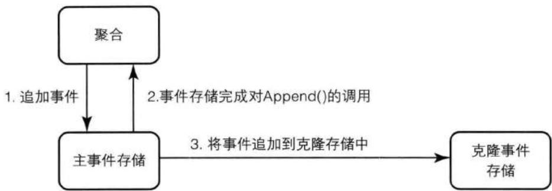


作为对以上讨论的总结, 让我们从应用服务开始依次浏览一遍执行流程: 

1. 客户端调用应用服务中的某个方法。 

2. 获取所需领域服务以执行业务操作。 

3. 根据客户端传来的聚合实例的唯一标识，获取到相应的事件流。 

4. 根据事件流中的所有事件重建聚合实例。 

5. 在聚合上执行业务操作。 

6. 聚合可能双分派给领域服务，或者其他聚合实例，然后发布新的事件作为操作的输出。 

7. 将所有新建事件追加到事件流中，此时通过事件流的版本号来防止并发冲突。 

8. 将新追加的事件通过消息设施发布到订阅方。 

我们还可以通过各种手段来改进以上A+ES的实现。比如，我们可以使用一个资源库(12)来封装对事件存储的访问或者重建聚合实例的细节。对于以上代码示例来说，要创建一个可重用的资源库基类是非常简单的。接下来，我们将主要关注两种实际的改进措施：命令处理器和Lambda。 

## 命令处理器

让我们看看使用命令(4, 14)和命令处理器来管理任务的好处。首先，看看应用服务中的LockCustomer()方法： 

```cs
public class CustomerApplicationService
{
    ...
    public void LockCustomer(CustomerId id, string reason)
    {
    var eventStream = _eventStore.LoadEventStream(id);
    var customer = new Customer(stream.Events);
    customer.LockCustomer(reason);
    _store.AppendToStream(id, eventStream.Version, customer.Changes);
    }
    ...
} 
```

现在, 设想一下为该方法名及其参数创建一个序列化的展现, 我们应该怎么做? 我们可以创建一个类, 使类名能够反映出应用操作, 再对应着原来方法的参数创建该类的实例变量。这样的类即是一个命令: 

```cs
public sealed class LockCustomerCommand {
    public CustomerId { get; set; }
    public string Reason { get; set; }
} 
```

命令契约与事件契约遵循相同的语义, 并且可以通过相似的方式在不同系统之间共享。该命令可以传给一个应用服务: 

```cs
public class CustomerApplicationService
{
    ...
    public void When(LockCustomerCommand command)
    {
    var eventStream = _eventStore.LoadEventStream(command.CustomerId);
    var customer = new Customer(stream.Events);
    customer.LockCustomer(command.Reason);
    _eventStore.AppendToStream(
    command.CustomerId, eventStream.Version, customer.Changes);
    }
    ...
} 
```

以上这个简单的重构将给系统带来长远的好处。 

由于我们可以对命令对象进行序列化，于是我们可以通过消息的形式来发送命令对象的文本或二进制展现。消息将被发送到一个消息处理器，此时即命令处理器（Command Handler）。命令处理器可以有效地替代应用服务中的方法，虽然它们只是大致上等效而已。无论如何，将客户端与应用服务解耦可以改进负载均衡，并且可以处理多个相互竞争的消费方，另外还可以支持系统分区（system partitioning）。拿负载均衡来说，我们可以在任意数目的服务器上启动相同的命令处理器（等效于应用服务）。由于命令对象被放在了消息队列中，命令消息可以发送给任何一个监听的命令处理器，如图A.8所示。（在本附录中，命令通过圆圈表示。）此时的消息分发既可以通过简单的轮叫调度（round-robin）算法完成，也可以采用更复杂的分发算法。 

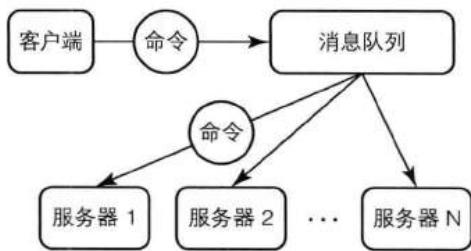


图A.8 应用命令被发送到任意数目的命令处理器。


这种方式在客户端和应用服务之间营造了一种临时的解耦，这样有助于增加系统的健壮性。首先，当应用服务不可用时（比如由于维护或者升级等原因），客户端依旧可以正常工作。此时，我们可以将命令保存在一个持久化队列中，当服务器恢复时，命令处理器（应用服务）可以继续处理这些命令对象，如图A.9所示。 

其次，在分发命令之前，我们还可以加入一些链式的处理步骤，比如日志、授权和验证等。 

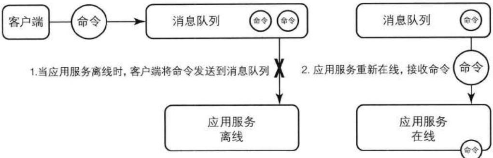


图A.9 基于消息的命令具有临时解耦的特征，命令处理器允许更灵活的系统可用性。


考虑一下增加日志步骤的情况。首先，我们创建一个应用服务接口，让实际服务类实现该接口： 

```cs
public interface IApplicationService
{
    void Execute(ICommand cmd);
}

public partial class CustomerApplicationService : IApplicationService
{
    public void Execute(ICommand command)
    {
    // 将命令对象传给相应的When()方法
    ((dynamic) this).When((dynamic) command);
    }
} 
```

## Execute()与Mutate()具有相似的实现

请注意，此时的Execute()方法与先前的Mutate()方法具有一些相似的特点。 

所有的命令处理器（应用服务）都可以实现以上的标准接口。此时，我们便可以加入一些预处理（pre-）或者后处理（post-）等执行步骤，比如通用的日志功能： 

```txt
public class LoggingWrapper : IApplicationService
{
    readonly IApplicationService _service;

    public LoggingWrapper(IApplicationService service)
    {
    _service = service; 
```

```cs
public void Execute(ICommand cmd)
{
    Console.WriteLine("Command: " + cmd);
    try
    {
    var watch = Stopwatch.StartNew();
    _service.Execute(cmd);
    var ms = watch.ElapsedMilliseconds;
    Console.WriteLine(" Completed in {0} ms", ms);
    }
    catch (Exception ex)
    {
    Console.WriteLine("Error: {0}", ex);
    }
} 
```

由于所有的应用服务都具有相同的标准接口, 我们可以加入任意数目的通用功能。以下, 我们新建了一个CustomerApplicationService对象, 然后向其中加入日志功能: 

```javascript
var customerService =
    new CustomerApplicationService(eventStore, pricingService);
var customerServiceWithLogging = new LoggingWrapper(customerService); 
```

最后，也正是由于我们将序列化的命令对象分发给不同的命令处理器，这使得我们可以在同一个地方对失败和错误进行处理。例如，对于由资源竞争所导致的并发问题，我们可以采用一个标准的恢复机制，比如对操作重试X次。重试可以基于盖帽指数后退算法策略，此时所有的重试都是统一的、可靠的，并且由单个类进行维护。 

## Lambda语法

如果你所使用的语言支持Lambda表达式, 那么我们便可将其用于简化一些重复的代码。作为演示, 先在应用服务中创建一个帮助方法: 

```java
public class CustomerApplicationService
{
    ...
    public void Update(CustomerId id, Action<Customer> execute)
    { 
```

```javascript
EventStream eventStream = _eventStore.LoadEventStream(id);
Customer customer = new Customer(eventStream.Events);
execute(customer);
_eventStore.AppendToStream(
    id, eventStream.Version, customer.Changes);
} 
```

在上例中, 参数Action<Customer> execute表示一个匿名函数 (C# 委派), 该函数可以操作任何一个Customer实例。使用Lambda表达式时的简洁性可以从以下调用Update()时所传入的参数看出: 

```cs
public class CustomerApplicationService
{
    ...
    public void When(LockCustomer c)
    {
    Update(c.Id, customer => customer.LockCustomer(c.Reason));
    }
    ...
} 
```

对于Lambda表达式，C#编译器将生成类似于以下的代码： 

```cs
public class AnonymousClass_X
{
    public string Reason;
    public void Execute(Customer customer);
    {
    Customer.LockCustomer(Reason);
    }
}

public delegate void Action<T>(T argument);

public void When(LockCustomer c)
{
    var x = new AnonymousClass_X();
    x.Reason = c.Reason
    Update(c.Id, new Action<Customer>(customer => x.Execute(customer));
} 
```

以上生成的函数接受一个Customer实例作为参数, 因此它可以多次地用于不同的Customer实例以完成行为操作。在下一节中, 我们还将看到Lambda所带来的好处。 

## 并发控制

有时, 多个线程可能同时访问聚合的事件流, 这将导致一些潜在的并发冲突, 进而使聚合处于不正确的状态。考虑一下当两个线程同时修改事件流的情形, 如图 A.10 所示。 

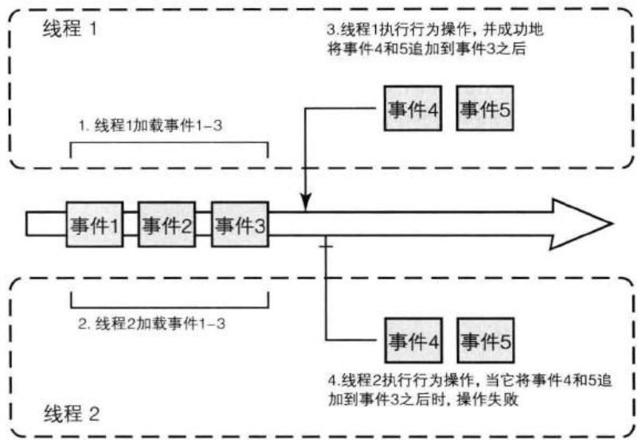


图A.10 两个线程竞争对同一个聚合实例的使用。


对于这种情形，最简单的解决方法是在第4步中抛出一个EventStoreConcurrencyException异常，并将其一路传到最终的客户端： 

```cs
public class EventStoreConcurrencyException : Exception
{
    public List<IEvent> StoreEvents { get; set; }
    public long StoreVersion { get; set; }
} 
```

在最终的客户端捕获到该异常之后，它可以告知用户手动地重试。 

相比之下, 你可能会认为采用一个标准的重试策略会更好。此时, 当事件存储抛出EventStoreConcurrencyException异常时, 我们可以立即对操作进行重试: 

```cs
while(true)
{
    EventStream eventStream = _eventStore.LoadEventStream(c.Id);
    var customer = new Customer(eventStream.Events);
    try
    {
    execute(customer);
    _eventStore.AppendToStream(
    c.Id, eventStream.Version, customer.Changes);
    return;
    }
    catch (EventStoreConcurrencyException)
    {
    //通过，然后再重试，可以有选择性的简短延迟
    }
} 
```

在这种情况下, 当并发冲突发生时, 我们可以额外地加入以下处理步骤: 

1. 线程2捕获到异常, while循环重新从头执行, 此时事件1-5被应用到Customer 实例上。 

2. 线程2将操作重新委派给Customer, 此时将产生事件6-7并追加到事件5之后。 

如果重新执行聚合行为的成本过高, 或者不便重新执行 (比如, 需要集成诸如订单或信用卡之类的第三方系统), 那么我们可以考虑另外的策略。 

如图A.11所示，另外的策略之一便是使用事件冲突决议（Event conflict resolution），它可以减少由并发所致的异常。事件冲突决议的工作原理如下： 

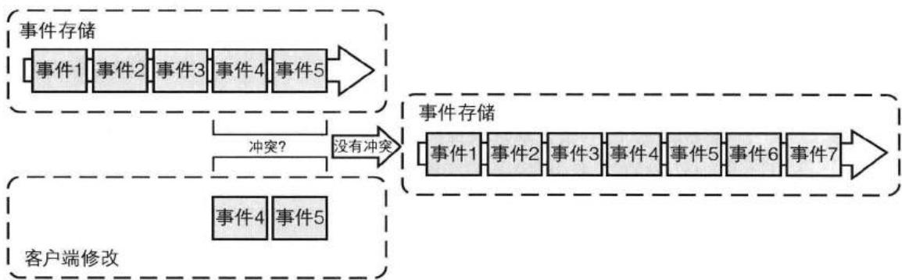


图A.11 对聚合使用事件冲突决议。


```cs
void UpdateWithSimpleConflictResolution(
    CustomerId id, Action<Customer> execute)
{
    while (true)
    {
    EventStream eventStream = _eventStore.LoadEventStream(id);
    Customer customer = new Customer(eventStream.Events);
    execute(customer);

    try
    {
    _eventStore.AppendToStream(
    id, eventStream.Version, customer.Changes);
    return;
    }
    catch (EventStoreConcurrencyException ex)
    {
    foreach (var failedEvent in customer.Changes)
    {
    foreach (var succeededEvent in ex.ActualEvents)
    {
    if (ConflictsWith(failedEvent, succeededEvent))
    {
    var msg = string.Format("Conflict between {0} and {1}", failedEvent, succeededEvent);
    throw new RealConcurrencyException(msg, ex);
    }
    }
    }
    //不存在冲突，可以追加
    _eventStore.AppendToStream(
    id, ex.ActualVersion, customer.Changes);
    }
    }
} 
```

在这种方式下, ConflictsWith()方法用于检测并发冲突, 它将比较聚合中的事件与当前事件存储中的事件。 

通常来说, 每个聚合根都应该有与之对应的冲突决议方法。但是, 以下的ConflictsWith()方法对于多数聚合来说都是适用的: 

```txt
bool ConflictsWith(IEvent event1, IEvent event2)
{
    return event1.GetType() == event2.GetType();
} 
```

这种冲突决议基于一个简单的原则：相同类型的事件通常会相互冲突，但是不同类型的事件则很少发生冲突。 

## A+ES所带来的结构自由性

A+ES最实际的优点之一便是持久化的简单性。无论聚合的结构多么复杂，它都可以通过一系列序列化的事件予以重建。随着时间的推移，新的需求被加到系统中，聚合的行为也将随之发生变化。此时，即便我们需要重新整理聚合内部实现的结构，A+ES在多数情况下都是可以应对的。 

与特定唯一标识相关联的一系列事件通常称为事件流。从本质上讲，事件流只是一个只追加式的消息列表，此时你可以选择任意序列化机制将事件序列化成字节块。这样，我们便可以通过各种方式来持久化事件流，包括关系型数据库、NoSQL存储、文件系统或者云存储等，只要这些持久化机制能够保证一致性。 

以下是A+ES持久化的主要优点, 对于那些具有很长生命周期的限界上下文(12)来说, 这些优点尤为重要: 

- 对于领域专家所提出的新行为, A+ES可以将聚合的内部状态适配到任何实际的结构展现中。 

- 我们可以在不同的主机方案之间迁移整个基础设施，这使得系统在云存储不可用时依然可以正常工作。 

- 任何聚合实例的事件流都可以被下载到开发机上，从而使得我们通过事件重放来调试系统中的错误。 

## 性能

有时，加载一个庞大的事件流可能会导致性能问题，特别是当单个事件流中包含了成百上千个事件的时候。对于单个事件流来说，以下是一些简单的处理方式： 

- 在事件流保存到事件存储之后，它们便不会改变了，因此我们可以在服务器中缓存事件流。在对聚合修改进行查询时，我们可以提供在上一次操作中最后一个事件的版本号，然后只返回在该事件之后的那些修改。这是一种以消耗内存来换取性能的方法。 

- 通过使用聚合快照 (snapshot)，我们可以避免加载和重放很大一部分事件流。此时，在加载聚合实例时，我们只需要找到该聚合的最近一次快照，然后只对那些发生在该快照之后的事件进行重放。 

如图A.12所示, 快照只是对聚合在某个时刻的全状态的序列化复制, 并且存在于事件流中。我们可以使用资源库来访问快照: 

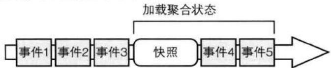


图A.12 事件流中包含了一个快照，快照之后还跟有另外两个事件。


```txt
public interface ISnapshotRepository
{
    bool TryGetSnapshotById<TAggregate>(
    IIdentity id, out TAggregate snapshot, out int version);
    void SaveSnapshot(IIdentity id, TAggregate snapshot, int version);
} 
```

在事件流中, 我们必须为每个事件快照维护一个版本。有了该快照版本, 在加载聚合实例时, 我们便可以先加载该快照, 然后重发那些发生在该快照之后的所有事件: 

```cs
//简单的文档存储接口
ISnapshotRepository _snapshots;

//事件存储
IEventStore _store;

public Customer LoadCustomerAggregateById(CustomerId id)
{
    Customer customer;
    long snapshotVersion = 0;
    if (_snapshots.TryGetSnapshotById(
    id, out customer, out snapshotVersion))
    {
    //加载快照之后的事件
    EventStream stream = _store.LoadEventStreamAfterVersion(
    id, snapshotVersion);
    //应用这些事件以更新快照
    customer.ReplayEvents(stream.Events);
    return customer;
    }
    //不存在任何快照 
```

```txt
{
    EventStream stream = _store.LoadEventStream(id);
    return new Customer(stream.Events);
} 
```

ReplayEvents()方法将重放那些发生在最近一次快照之后的所有事件。该方法执行完后，聚合便处于最新状态。请注意，只有在最后一次快照被加载之后，聚合实例的状态才将被修改。因此，我们不会只通过事件流来实例化Customer。另外，我们也不能使用Apply()方法，因为该方法不仅会修改聚合的状态，还会将事件保存到Changes集合中。将已经存在于事件流中的事件再次保存到Changes中将导致严重的bug。因此，我们需要实现一个新的ReplayEvents()方法： 

```cs
public partial class Customer
{
    ...
    public void ReplayEvents(IEnumerable<IEvent> events)
    {
    foreach (var event in events)
    {
    Mutate(event);
    }
    }
    ...
} 
```

以下是创建Customer快照的示例代码： 

```cs
public void GenerateSnapshotForCustomer(Identity id)
{
    //从头到尾加载所有事件
    EventStream stream = _store.LoadEventStream(id);
    Customer customer = new Customer(stream.Events);
    _snapshots.SaveSnapshot(id, customer, stream.Version);
} 
```

快照的创建和持久化可委派给一个后台线程。只有当在上次快照之后有额外的事件产生时，我们才可以创建新的快照。以上过程如图A.13所示。由于不同聚合拥有不同的特点，我们应该根据性能所需对每一种聚合类型的快照进行优化。 

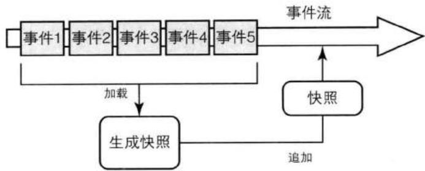


图A.13 聚合的快照在一定数目的新事件产生之后予以创建。


提升A+ES性能的另一种方法是，根据唯一标识将聚合拆分到多个进程或者机器中。这种拆分可以通过标识哈希或者其他算法完成，并且可以将聚合缓存和聚合快照联合起来使用。 

## 实现事件存储

接下来, 让我们来实现几种适用于A+ES的事件存储。这里所实现的事件存储是很简单的, 并且没有考虑到那些需要极高性能的情况, 但是对于多数领域来说, 它们已经足够了。 

虽然不同事件存储的实现方式不同, 但是它们都遵循相同的契约: 

```txt
public interface IEventStore
{
    加载事件流中的所有事件
    EventStream LoadEventStream(IIdentity id);
    //加载事件流中的某个子集
    EventStream LoadEventStream(
    IIdentity id, int skipEvents, int maxCount);
    //追加事件到事件流，
    //如果在expectedversion之后有
    //另外的事件加入，
    //则抛出OptimisticConcurrencyException 异常
    void AppendToStream(
    IIdentity id, int expectedVersion, ICollection<IEvent> events);
}

public class EventStream
{
    //事件流的版本号
    public int Version;
    //事件流中的所有事件 
```

```java
public IList<IEvent> Events = new List<IEvent>(); 
```

如图A.14所示，IEventStore的实现类是特定于项目的，它封装了一个更通用的IAppendOnlyStore。IEventStore的实现类用于处理序列化和强类型（strong typing），而IAppendOnlyStore的实现类则用于对不同存储引擎的底层访问。 

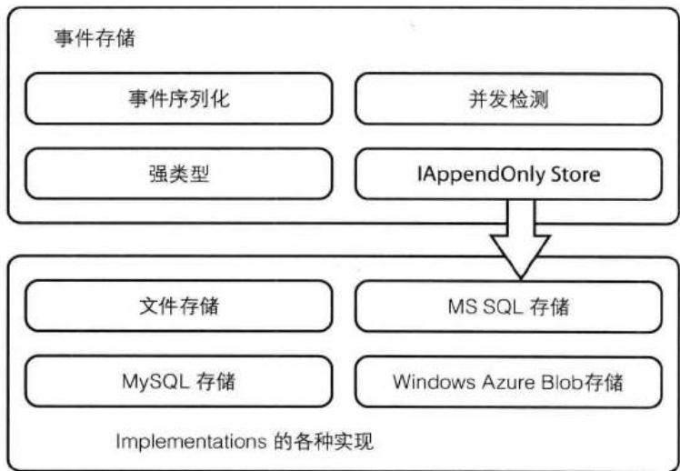


图A.14 高层的IEventStore和底层的IAppendOnlyStore。


## 事件存储源代码

你可以通过以下方式下载到事件存储的源代码 http://lokad.github.com/lokad-iddd-sample/。 

以下是底层的IAppendOnlyStore接口： 

```cs
public interface IAppendOnlyStore : IDisposable
{
    void Append(string name, byte[] data, int expectedVersion = -1);
    IEnumerable<DataWithVersion> ReadRecords(
    string name, int afterVersion, int maxCount);
    IEnumerable<DataWithName> ReadRecords(
    int afterVersion, int maxCount);

    void Close();
}

public class DataWithVersion
{ 
```

```txt
附录A 聚合与事件源：A+ES
public int Version;
public byte[] Data;
}
public sealed class Data WhitneyName {
    public string Name;
    public byte[] Data;
} 
```

可以看到，IAppendOnlyStore处理的是一些字节数组，而不是事件集合。另外，它处理的是字符形式的名字，而不是强类型的标识。EventStore类将处理前者与后者之间的转换。 

IAppendOnlyStore定义了两个ReadRecords()方法。第一个用于读取单个事件流中的事件，此时我们传入了该事件流的名字。第二个用于读取事件存储中的所有事件。两个方法都必须按照事件的发生顺序读取事件。可以看出，第一个方法用于重建单个聚合的状态；而第二个方法则被基础设施用来复制事件，并且在不使用两阶段提交的情况下发布这些事件，另外，它还可以用于重建诸如CQRS用户界面所需的读模型。 

在序列化和反序列化时——在字节与强类型的事件对象之间相互转化——我们可以使用.NET的BinaryFormatter类： 

```cs
public class EventStore : IEventStore
{
    readonly BinaryFormatter _formatter = new BinaryFormatter();

    byte[] Serialize(IEvent[] e)
    {
    using (var mem = new MemoryStream())
    {
    _formatter.Serialization(mem, e);
    return mem.ToArray();
    }
    }

    IEvent[] Deserialization(byte[] data)
    {
    using (var mem = new MemoryStream(data))
    {
    return (IEvent[])_formatter.Deserialization(mem);
    }
    }
} 
```

以下代码展示了如何通过序列化和反序列化的方式来加载一个事件流： 

```cs
readonly IAppendOnlyStore _appendOnlyStore;
...
public EventStream LoadEventStream(IIdentity id, int skip, int take)
{
    var name = IdentityToString(id);
    var records = _appendOnlyStore.ReadRecords(name, skip, take).ToList();
    var stream = new EventStream();

    foreach (var tapeRecord in records)
    {
    stream.Events.AddRange(DeserializeEvent(tapeRecord.Data));
    stream.Version = tapeRecord.Version;
    }
    return stream;
}

string IdentityToString(IIdentity id)
{
    //在本项目中，所有的id都有相应的名字
    return id.ToString();
} 
```

在使用IAppendOnlyStore时, 我们通过以下方式将新的事件追加到事件存储中: 

```cs
public void AppendToStream(
   Identity id, int originalVersion, ICollection<IEvent> events)
{
    if (events.Count == 0)
    return;
    var name = IdentityToString(id);
    var data = Serialize(eventypy<|rotate_up|>());
    try
    {
    _appendOnlyStore.Append(name, data, originalVersion);
    }
    catch (AppendOnlyStoreConcurrencyException e)
    {
    //加载服务器事件
    var server = LoadEventStream(id, 0, int.MaxValue);
    //抛出异常
    throw OptimisticConcurrencyException.Create(
    server.Version, e.ExpectedVersion, id, server.Events);
    }
} 
```

## 关系型持久化

由于关系型数据库可以保证很强的一致性, 它可以很好地用于实现只追加式的事件持久化。许多企业都采用了一种或多种关系型数据库产品, 因此对于开发者来说, 将关系型数据库作为事件存储的学习曲线是非常低的。 

MySQL是一种非常流行的开源关系型数据库，并且可以用于多种平台，因此我们将使用MySQL作为事件存储。MySQLAppendOnlyStore实现了IAppendOnlyStore，它作为一个访问层。MySQLAppendOnlyStore将二进制形式的事件保存到ES_Events表中，然后在从该表中加载持久化的事件。 

以下是ES_Events表的定义, 它用于管理一个限界上下文中每种聚合类型所对应的事件流: 

```sql
CREATE TABLE IF NOT EXISTS 'ES_Events' (
    'Id' int NOT NULL AUTO_INCREMENT, -- unique id
    'Name' nvarchar(50) NOT NULL, -- name of the stream
    'Version' int NOT NULL, -- incrementing stream version
    'Data' LONGBLOB NOT NULL -- data payload
) 
```

要在一个事务中将事件追加到特定的事件流, 我们可以通过以下步骤: 

1. 开始一个事务。 

2. 检查事件存储的版本号与所期待的版本号是否不同，如果不同，在抛出异常。 

3. 如果没有并发冲突，追加事件到事件存储中。 

4. 提交事务。 

以下是追加事件所使用的Append()方法: 

```cs
public void Append(string name, byte[] data, int expectedVersion)
{
    using (var conn = new MySqlConnection(_connectionString))
    {
    conn.Open();
    using (var tx = conn.BeginTransaction())
    {
    const string sql =
    @"SELECT COALESCE(MAX(Version), 0)
    FROM `ES_Events`
    WHERE Name = ?name";
    }
} 
```

```txt
int version;
using (var cmd = new MySqlCommand(sql, conn, tx))
{
    cmd.Parameters.AddValue工業("name", name);
    version = (int)cmd.ExecuteScalar();
    if (expectedVersion != -1)
    {
    if (version != expectedVersion)
    {
    throw new AppendOnlyStoreConcurrencyException(
    version, expectedVersion, name);
    }
    }
}

const string txt =
    @"INSERT INTO 'ES_Events' ('Name', 'Version', 'Data')
    VALUES(?name, ?version, ?data)";

using (var cmd = new MySqlCommand(txt, conn, tx))
{
    cmd.Parameters.AddValue工業("name", name);
    cmd.Parameters.AddValue工業("version", version+1);
    cmd.Parameters.AddValue工業("data", data);
    cmd.ExecuteNonQuery();
}
tx.Commit();
} 
```

从IAppendOnlyStore中读取事件是非常简单的, 我们只需要一个基本的查询。比如, 以下的ReadRecords()方法从聚合的事件流中读取出一个记录列表: 

```cs
public IEnumerable<DataWithVersion> ReadRecords(
    string name, int afterVersion, int maxCount)
{
    using (var conn = new MySqlConnection(_connectionString))
    {
    conn.Open();
    const string sql =
    @"SELECT 'Data', 'Version' FROM 'ES_Events'
    WHERE 'Name' = ?name AND 'Version'>?version
    ORDER BY 'Version'
    LIMIT 0, ?take";
    using (var cmd = new MySqlCommand(sql, conn))
    {
    cmd.Parameters.Add充值Value工業名", name);
    cmd.Parameters.Add充值Value工業名", afterVersion);
    }
} 
```

```cs
cmd.Parameters.AddWithValue("?take", maxCount);
using (var reader = cmd.ExecuteReader())
{
    while (reader.Read())
    {
    var data = (byte[])reader["Data"];
    var version = (int)reader["Version"];
    yield return new DataWithVersion(version, data);
    }
}
} 
```

在示例代码中, 你将找到以MySQL实现事件存储的源代码。同时, 示例代码中还提供了一个以Microsoft的SQL Server实现事件存储的版本。 

## BLOB持久化

使用数据库服务器（比如MySQL和MS SQL服务器）可以简化我们很多工作。它可为我们提供并发管理、文件碎片化（file fragmentation,）、缓存和数据一致性等功能。显然，在不使用数据库产品的时候，很多工作都需要我们自己完成。 

然而，如果我们的确想走出一条更艰难的路，我们依然可以得到帮助。比如，Windows Azure Blob存储和简单文件系统存储便可以为我们所用。在示例项目中，包含了这两种方式的事件存储实现。 

在不使用数据库来创建事件存储时, 我们有以下指导原则, 同时请参考图A.15。 

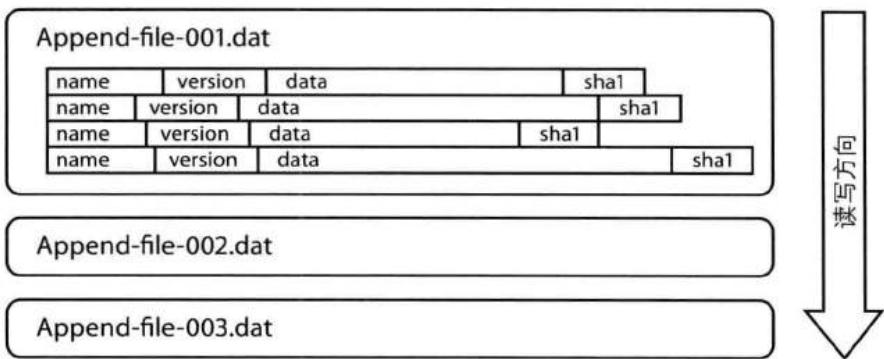


图A.15 基于文件的BLOB存储, 图中所用的策略是: 每个聚合实例对应一个文件, 每个事件对应一条记录。


1. 我们自定义的存储由一组只追加式的二进制大对象 (Binary Large Object, BLOB) 文件组成。在写进数据时，我们需要锁住这些文件；而在读取数据时，则可以并发进行。 

2. 根据你的策略, 可以只使用一个BLOB存储来保存一个限界上下文中的所有聚合类型和实例。或者, 你也可以为每一种聚合类型创建一个BLOB存储用以保存该类型的所有实例。也或者, 你还可以根据聚合实例来拆分BLOB存储, 即每个聚合实例的事件流都有自己的BLOB。 

3. 在写进组件向BLOB追加事件时, 它将打开相应的BLOB存储, 写进数据, 最后向存储中添加一个索引。 

4. 无论采用哪种策略的BLOB存储，所有的新建事件都必须通过追加的方式予以保存。每一个记录都包含一个名字、版本和二进制数据。这和使用关系型数据作为事件存储是相似的。但是，在使用BLOB时，我们需要提供一个哈希码或循环冗余检查 (cyclic redundancy check, CRC) 以在读取数据时验证它们的完整性。 

5. 在BLOB事件存储中，通过列举所有文件及其内容，我们可以简单地对所有事件流中的所有事件进行枚举操作。为了加速对数据的读取，我们可能需要维护一个内存索引，或者将事件流缓存在内存中。在使用内存缓存时，如果有新的事件被追加，那么我们需要刷新缓存。另外，聚合状态快照和文件碎片化也有助于性能提升。 

6. 当然, 为了避免由文件系统的磁盘碎片化所导致的问题, 在创建每个事件流时, 我们都可以在相应的BLOB文件中预留出足够大的一片区域。 

这种设计来源于Riak Bitcask模型。关于Riak Bitcask架构，请参考以下文章：http://downloads.basho.com/papers/bitcask-intro.pdf。 

## 专注的聚合

在采用传统的持久化机制（比如不使用事件源的关系型数据库）来开发聚合时，当我们需要向系统中添加一个新的实体，或者改进已有实体时，我们总是会遇到这样或那样的麻烦。此时，我们可能需要创建新的数据库表，定义新的映射关系和新的资源库方法。如果不这么做，那么我们所关注的可能是聚合的状态结构和行为，此时的聚合将变得很大。修改已有聚合比创建新聚合要简单得多。 

然而, 如果创建新聚合的方式更加简单, 那么你可能就会改变自己的看法了。在我看来, 在使用事件源时, 这的确如此。据我的经验来看, 在使用A+ES时所创建的聚合都是很小的, 而这也是聚合设计的首要原则之一。 

比如，对于一个将软件作为服务的公司来说，现实世界中的一个客户可以通过不同的聚合来表示，不同的聚合专注于不同的行为方面： 

- Customer:505负责账单、发票和通用的账户管理。 

- Security-Account:505维护多个具有访问权限的用户。 

- Consumer:505跟踪客户的消费记录。 

每一种聚合类型都可以在单独的限界上下文中实现，而不同的限界上下文又可以采用不同的技术和架构。比如，对于Consumer我们需要提供很高的伸缩性，每秒钟可能需要处理上千条消息。此时的事件流便可以部署在可自动伸缩的云网织(cloud fabric)中。而对于其他种类的客户聚合来说，我们则可以部署在具有较低伸缩性的环境中。 

当然，我们绝不应该毫无根据地将聚合设计得小。聚合设计应该保护真正的业务不变条件，此时聚合中可能包含多个实体和值对象。但是，在使用A+ES时，我们有更多的机会来设计小的、高效的聚合。 

事实上，有时在开始领域建模时，我们可以通过定义主要的输入命令、输出事件以及与之相关行为的方式来创建核心的通用语言。在之后的阶段才根据相似性、相关性和业务规则对概念进行分组以创建聚合。这种方式——即便只是领域建模练习中的一种开发探索——有助于我们更深地了解核心业务的概念。 

## 读模型投射

使用A+ES的一个常见问题是如何通过属性来查询聚合。事件源并没有提供一种简单的方式来回答诸如“最近一个月所有客户的订单总量是多少”这样的问题。我们可能需要加载所有的Customer实例，然后依次遍历以找出该Customer的所有Order，再计算Order的总和。这种方式是非常低效的。 

这时, 读模型投射 (Read Model Projection) 便可以帮上大忙了。在使用读模型投射时, 我们使用一组简单的领域事件订阅方来生成和更新读模型。当事件订阅方接收到新的事件时, 它们将计算一些查询结果, 然后将这些结果保存到读模型中以供之后使用。 

简单来说，一个投射和聚合实例非常相似。在事件到达时，我们使用其中的数据来构建投射的状态。每次更新之后，我们都会对读模型投射进行持久化。更新后的投射可以被多方读取，不论是同一个限界上下文中的读取方，还是不同限界上下文的。 

## 读模型投射示例代码

你可以通过以下方式访问到读模型投射的示例项目： 

http://lokad.github.com/lokad-cqrs/. 

其中的源代码向我们展示了不同的持久化场景和对读模型的自动重建等。 

以下代码向我们展示了一个读模型投射, 它将捕捉每个Customer的所有事务操作: 

```cs
public class CustomerTransactionsProjection
{
    IDocumentWriter<CustomerId, CustomerTransactions> _store;

    public CustomerTransactionsProjection(
    IDocumentWriter<CustomerId, CustomerTransactions> store)
    {
    _store = store;
    }

    public void When(CustomerCreated e)
    {
    _store.Add(e.Id, new CustomerTransactions());
    }

    public void When(CustomerChargeAdded e)
    {
    _store.UpdateOrThrow(e.Id,
    v => v.AddTx(e.ChargeName, -e.Charge, e.NewBalance, e.TimeUtc));
    }

    public void When(CustomerPaymentAdded e)
    {
    _store.UpdateOrThrow(e.Id,
    v => v.AddTx(e.PaymentName, e.Payment, e.NewBalance, e.TimeUtc));
    }
} 
```

以上的CustomerTransactionsProjection类与先前使用Lambda的应用服务相似。然而，这里的投射接受的是事件而不是命令，并且通过IDocumentWriter更新文档而不是聚合实例。 

背后的读模型只是一个简单的DTO[Fowler], 我们通过IDocumentWriter对该DTO进行序列化并将其持久化到数据存储中。该DTO的定义如下: 

```cs
[Serializable]
public class CustomerTransactions
{
    public IList<CustomerTransaction> Transactions = new List<CustomerTransaction>();

    public void AddTx(
    string name, CurrencyAmount change,
    CurrencyAmount balance, DateTime timeUtc)
    {
    Transactions.Add(new CustomerTransaction()
    {
    Name = name,
    Balance = balance,
    Change = change,
    TimeUtc = timeUtc
    });
    }
}

[Serializable]
public class CustomerTransaction
{
    public CurrencyAmount Change;
    public CurrencyAmount Balance;
    public string Name;
    public DateTime TimeUtc;
} 
```

通常, 我们使用一个文档数据库来持久化读模型, 当然你也可以使用其他持久化机制。我们可以将读模型缓存到内存中, 或者以文档的形式推送给内容分发网络 (content-delivery network, CDN), 也或者保存到关系型数据库中。 

除了具有可伸缩性之外, 读模型投射的一个主要优点在于它是可任意支配的。在应用程序的生命周期中, 我们可以对投射进行任意的添加、修改和替换。要完全地替换一个读模型, 我们可以丢掉已有的读模型数据, 再通过整个事件流来重建投射对象, 并且, 这个过程可以被自动化。 

## 与聚合设计一道使用

这种读模型投射经常被用于向不同的客户端（比如桌面客户端和Web界面）提供信息，同时它还可以用于在不同的限界上下文以及聚合之间的共享数据。考虑以下场景：一个Invoice聚合需要Cusomter的一些信息（比如名字、账单、地址和税号）来准备发票。此时，我们便可以从CustomerBillingProjection中获得这些信息，然后创建一个单独的CustomerBillingView实例。读模型通过领域服务IProvideCustomerBillingInformation向Invoice聚合提供数据信息。在背后，该领域服务将从文档存储中获取相应的CustomerBillingView实例。 

读模型投射还使得我们在不同的聚合实例之间共享信息，这种方式具有更好的松耦合性和可维护性。任何时候，如果我们想改变IProvideCustomerBillingView所返回的信息，我们都可以在不修改Customer聚合的情况下完成。我们只需要改变投射实现，然后重放所有事件以重建读模型。 

## 增强事件

A+ES的另一个更常见的问题源自于它的双重目的。事件既被用于聚合的持久化，又被用于在不同的系统之间通信。 

例如，考虑以下场景：一个项目管理系统允许客户创建新的项目，并且存档已完成的项目。假设每次一个用户存档一个项目时，我们都发布一个ProjectArchived事件。该领域事件如下： 

```cs
public class ProjectArchived {
    public ProjectId Id { get; set; }
    public UserID ChangeAuthorId { get; set; }
    public DateTime ArchivedUtc { get; set; }
    public string OptionalComment { get; set; }
} 
```

在使用A+ES时，这些信息对于重建一个存档的Project来说已经足够了。但是，对于事件发布方来说，这样的事件可能会导致一些问题。 

为什么？考虑一下ArchivedProjectsPerCustomerView所对应的读模型投射，如图A.16所示。该投射订阅了不同的事件，并且为每个客户都维护了一个存档Project的列表。为了完成任务，该投射需要一些最新的信息，比如： 

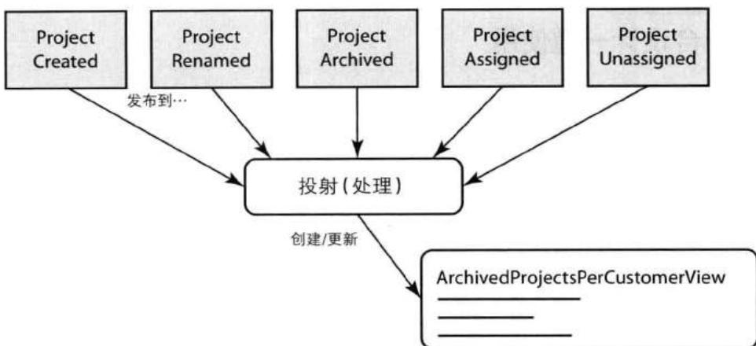


图A.16 多个领域事件被一个投射所消费，用于构建读模型的视图。


- 项目的名字 

- 客户的名字 

- 分给客户的项目 

- 项目的存档事件 

此时, 我们可以通过增强ProjectArchived事件的方式来大大简化该投射, 即向事件中加入一些额外的数据以发布更多的信息。这些额外添加的数据对于重建聚合来说用处并不大, 但却可以在很大程度上简化事件的消费方。于是, 我们得到了以下改进后的ProjectArchived事件: 

```cs
public class ProjectArchived {
    public ProjectId Id { get; set; }
    public string ProjectName { get; set; }
    public UserID ChangeAuthorId { get; set; }
    public DateTime ArchivedUtc { get; set; }
    public string OptionalComment { get; set; }
    public CustomerId Customer { get; set; }
    public string CustomerName { get; set; }
} 
```

采用增强后的ProjectArchived事件，由投射生成的ArchivedProjectsPerCustomerView将得到简化，如图A.17所示。 

领域事件的一个经验法则是这样的: 领域事件中所包含的信息应该满足80%的消费方, 虽然对于很多消费方来说, 这些信息是多余的。我们需要保证投射处理器能获得足够的信息, 其中包括: 

- 实体标识器，即事件的所有者，就如CustomerId之于Customer一样。 

- 用于显示用途的名字或其他属性，比如ProjectName和CustomerName等。 

以上只是建议而已，而不是原则。对于那些拥有多个限界上下文的企业来说，他们通常都是能工作得很好的。然而，对于那些大而全的限界上下文来说，这些建议通常没多大用处，因为那些限界上下文倾向于维护一个二级查询表和实体图。当然，现在你知道了一个事件应该包含什么样的属性。有时，一个事件应该包含哪些属性是非常明显的，对于这样的事件来说，我们并不需要进行重构。 

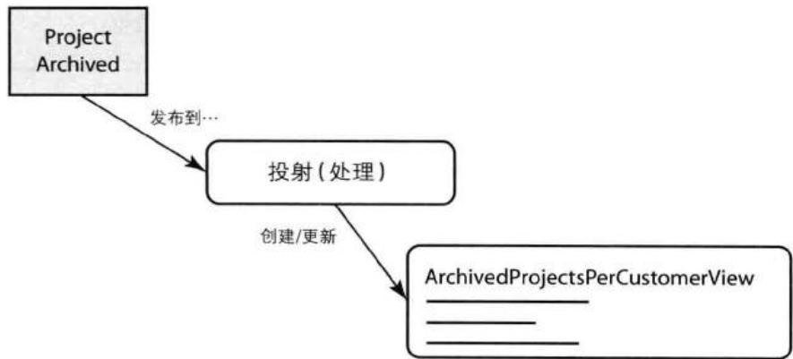


图A.17 诸如ProjectArchived这样的领域事件被投射处理器所消费，并用于创建视图和报告相关的读模型。


## 工具和模式

对于使用A+ES的系统来说，开发、构建、部署和维护都需要一套模式，这些模式可能与传统系统中的模式不同。本节将介绍一些对A+ES有用的模式、工具和实践。 

## 事件序列器

选择一个有利于版本控制和事件重命名的序列器是明智的，特别是在A+ES项目早期，领域模型变化很快的时候。考虑以下事件，该事件标有协议缓存 $^{1}$ ： 

```cs
[DataContract]
public class ProjectClosed {
    [DataMember(Order=1)] public long ProjectId { get; set;}
    [DataMember(Order=2)] public DateTime Closed { get; set;}
} 
```

现在，如果我们希望使用DataContractSerializer或JsonSerializer来序列化ProjectClosed，而不是协议缓存，那么任何重命名字段的操作都将破坏消费方。比如，假设我们将Colesed重命名为ColosedUtc。除非我们在消费方限界上下文中做了某种形式的重命名映射，否则便有可能发生错误或者产生一些脏数据： 

```cs
[DataContract]
public class ProjectClosed {
    [DataMember] public long ProjectId { get; set; }
    [DataMember(Name="Closed"] public DateTime ClosedUtc { get; set; }
} 
```

协议缓存便可以应对这样的问题，因为它通过标签而不是名字来跟踪各个契约成员。在下面的示例代码中我们将看到，客户端可以同时使用Closed和ClosedUtc作为属性名。协议缓存序列化对象的速度非常快，并且可以生成非常紧凑的二进制展现。在使用时，我们可以重命名事件的属性而不用担心向后兼容性。因此，对于一个处于发展中的领域模型来说，协议缓存可以减少开发上的摩擦。 

```cs
[DataContract]
public class ProjectClosed {
    [DataMember(Order=1)] public long ProjectId { get; set; }
    [DataMember(Order=2)] public DateTime ClosedUtc { get; set; }
} 
```

除了协议缓存，还存在另外一些跨平台的序列化工具，比如Apache Thrift、Avro和MessagePack等。 

## 事件不变性

从本质上讲, 事件流是不变的。为了使开发模式与这种概念保持一致 (还有避免不良的副作用), 事件的契约也需要是不变的。为了达到这样的目标, 在.NET平台的C#中, 我们将字段标记为只读, 并且只通过构造函数为其赋值。对于先前的ProjectClosed事件, 我们可以通过以下方式实现: 

```cs
[DataContract]
public class ProjectClosed {
    [DataMember(Order=1)] public long ProjectId { get; private set }
    [DataMember(Order=2)] public DateTime ClosedUtc { get; private set; }
    public ProjectClosed(long projectId, DateTime closedUtc)
    {
    ProjectId = projectId;
    ClosedUtc = closedUtc;
    }
} 
```

## 值对象

值对象(6)能够极大地简化我们的开发, 并且有助于创建富领域模型。在使用值对象时, 我们将一些内聚在一起的原始类型组合成一个命名的不变类型。比如, 对于Project的唯一标识来说, 我们并不使用long类型来表示, 而是使用PorjectId: 

```cs
public struct ProjectId
{
    public readonly long Id { get; private set; }
    public ProjectId(long id)
    {
    Id = id
    }
    public override ToString() {
    return string.Format("Project-{0}", Id);
    }
} 
```

这里, 我们依然使用了long类型来持有实际的标识数, 但是在使用ProjectId类型时, 我们可以将Project的唯一标识与其他类型区分开。当然, 值对象类型并不只限于对象的唯一标识。其他的值对象类型包括货币对象 (特别是在多币种系统中)、地址、E-mail、长度等。 


## 附录A 聚合与事件源: A+ES

除了能够增加事件和命令契约的表达性之外, 领域值对象可以为A+ES的实现带来很多好处, 比如静态类型检查和IDE支持等。对于下面的例子来说, 我们有可能意外地以错误的顺序将唯一标识传给ProjectAssignedToCustomer的构造函数: 

```javascript
long customerId = ...;
long projectId = ...;
var event = new ProjectAssignedToCustomer(customerId, projectId); 
```

以上错误是编译器所捕捉不到的, 我们也只能通过调试来发现这样的错误。但是, 如果我们以值对象来表示唯一标识, 那么编译器 (IDE编辑器) 便能捕捉到这样的错误: 

```javascript
CustomerId customerId = ...;
ProjectId projectId = ...;
var event = new ProjectAssignedToCustomer(customerId, projectId); 
```

对于那些具有多个字段的契约类来说, 值对象的好处将更加明显。比如, 对于以下事件: 

```cs
public class CustomerInvoiceWritten {
    public InvoiceId Id { get; private set; }
    public DateTime CreatedUtc { get; private set; }
    public CurrencyType Currency { get; private set; }
    public InvoiceLine[] Lines { get; private set; }
    public decimal SubTotal { get; private set; }

    public CustomerId Customer { get; private set; }
    public string CustomerName { get; private set; }
    public string CustomerBillingAddress { get; private set; }
    public float OptionalVatRatio { get; private set; }
    public string OptionalVatName { get; private set; }
    public decimal VatTax { get; private set; }
    public decimal Total { get; private set; }
} 
```

可以想象, 处理拥有大量属性的类将变得更加复杂 $^{2}$ 。我们可以根据领域概念对以上事件进行重构, 使其意义更明显, 更具可读性: 

```cs
public class CustomerInvoiceWritten {
    public InvoiceId Id { get; private set; }
    public InvoiceHeader Header { get; private set; }
    public InvoiceLine[] Lines { get; private set; }
    public InvoiceFooter Footer { get; private set; }
} 
```

InvoiceHeader和InvoiceFooter将由一些内聚的属性组成： 

```cs
public class InvoiceHeader {
    public DateTime CreatedUtc { get; private set; }
    public CustomerId Customer { get; private set; }
    public string CustomerName { get; private set; }
    public string CustomerBillingAddress { get; private set; }
}

public class InvoiceFooter {
    public CurrencyAmount SubTotal { get; private set; }
    public VatInformation OptionalVat { get; private set; }
    public CurrencyAmount VarAmount { get; private set; }
    public CurrencyAmount Total { get; private set; }
} 
```

我们将Currency和SubTotal属性以CurrencyAmout值对象代替。该值对象的另一个好处在于：我们可以加入一些验证逻辑，以避免以错误的货币种类来表示当前货币量。对于InvoiceFooter来说，也是如此。 

在有可能的情况下, 我们应该尽量采用值对象, 无论是对于命令对象、事件, 还是聚合。 

显然，在将值对象应用于命令和/或事件时，我们需要将它们部署在一起，甚至创建一个共享内核(3)。然而，一些高度复杂的领域可能需要设计富含业务逻辑的值对象。在这样的情况下，单单以类型安全的原因将值对象放在共享内核中可能会导致一些脆弱的模型设计。因此，将那些有助于以安全的方式序列化命令和事件的值对象与核心域(2)中的值对象区分开来对待是有好处的。这意味着我们需要创建两套值对象类，一套专用于核心域，另一套用于命令和事件类。在需要的时候，我们将在这两套值对象之间进行转换。 

当然，重复的类有可能带来一些不必要的复杂性。此时，我们可以采用另一种方法。对于序列化事件来说，另一种方式便是使用发布语言(3)对其进行标准化。在集成限界上下文(13)中也讲到，我们可以采用动态类型的方式来接收事件通知。这样，我们不必将事件类和值对象部署到消费方系统中。因此，和所有其他方式一样，对于是否使用值对象来说，我们也需要多方权衡。 

## 协议生成

要手动地维护大量的事件（和命令）契约是烦琐的，并且容易出错。更好的方式是采用领域特定语言（DSL）来定义这样的契约。在这种情况下，我们可以在构建项目时，才根据DSL来生成所需的类代码。有多种DSL语法存在，我们可以使用协议缓存的.proto格式或任何一种相似的格式。比如，你会发现以下方式是有用的： 

```txt
CustomerInvoiceWritten!(InvoiceId Id, InvoiceHeader header, InvoiceLine[] lines, InvoiceFooter footer) 
```

一个简单的代码生成器为DSL中的每一行生成相应的代码。这里的CustomerInvoiceWritten便是根据以下DSL所生成的： 

```cs
[DataContract]
public sealed class CustomerInvoiceWritten : IDomainEvent {
    [DataMember(Order=1) public InvoiceId Id
    { get; private set; }
    [DataMember(Order=2) public InvoiceHeader Header
    { get; private set; }
    [DataMember(Order=3) public InvoiceLine[] Lines
    { get; private set; }
    [DataMember(Order=4) public InvoiceFooter Footer
    { get; private set; }
    public CustomerInvoiceWriter(
    InvoiceId id, InvoiceHeader header, InvoiceLine[] lines,
    InvoiceFooter footer)
    {
    Id = id;
    Header = header;
    Lines = lines;
    Footer = footer;
    }

    // 序列化所需
    ProjectClosed() {
    Lines = new InvoiceLine[0];
    }
} 
```

这种方式具有以下实际的好处： 

- 它可以加速领域建模的迭代，由此减少了开发上的摩擦。 

- 它减少了由人为因素导致错误的可能性。 

- 紧凑的展现使得我们在一个屏幕中显示所有的事件定义，从而给我们一种总览式的视图。这些定义甚至可以当作通用语言的术语表来使用。 

- 我们可以通过一种紧凑的定义来维护和分发事件契约，而不是通过源代码或二进制的方式。因此，这种方式可以增进不同团队之间的协作。 

这种方式同样可以应用于命令契约。对于基于DSL的代码生成，你可以在示例项目中找到一个开源的实现，其中还包含了一些例子。 

## 单元测试和需求规范

考虑一下事件源对于创建单元测试的好处。我们可以简单地以“Given-When-Expect”的形式来创建测试，比如： 

1. Given先前的事件 

2. When调用聚合方法 

3. Expect以下事件或者一个异常 

先前的事件用于在单元测试开始时创建聚合状态。当我们调用聚合方法时，我们需要传入一些测试参数或者领域服务的模拟（mock）实现。最后，我们将聚合产生的事件与所期望的事件进行比较。 

这种方式有助于我们捕获和验证每个聚合的行为。同时，我们也保持了与聚合内部状态之间的解耦。另外，它还可以降低测试的脆弱性，因为开发团队可以任意地修改和优化聚合实现，只要有单元测试的保证。 

我们还可以对这种方式做个改进：对于“When”步骤来说，可以直接使用命令对象，将该命令对象传给当前被测试聚合所对应的应用服务。这使得我们将单元测试看作一种需求规范（specification），并且完全通过通用语言来表达这样的规范，而无论是采用代码还是DSL。 

由于代码非常少, 我们可以将这样的规范当作可读的用例, 由此领域专家也能够理解这些测试了。这样的用例定义有助于开发团队更好地交流那些复杂的业务行为, 进而可以提升他们的建模水平。 

以下是非常简单的以文本形式定义的需求规范： 

```ini
[Passed] Use case 'Add Customer Payment - Unlock On Payment'.  
Given:  
1. Created customer 7 Eur 'Northwind' with key c67b30 ...  
2. Customer locked  
When:  
Add 'unlock' payment 10 EUR via unlock  
Expectations:  
[ok] Tx 1: payment 10 EUR 'unlock' (none)  
[ok] Customer unlocked 
```

如果你对这种方式感兴趣, 那么可以在网上搜索 “事件源规范 (Event Sourcing Specification)” 以获取更多的信息。 

## 事件源和函数式语言

在以上的各种实现模式中, 我们主要关注于面向对象的方式, 对于诸如Java和C#这样的编程语言来, 这是非常适合的。但是, 事件源在本质上却是函数式的。因此, 它可以通过一些函数式语言来实现, 比如F#和Clojure。这使得我们编写更加简捷的代码, 同时系统性能也可以得到优化。 

对于聚合的实现来说, 如果我们要从面向对象风格转到函数式风格, 我们需要考虑以下几点: 

- 我们应该为聚合创建简单的、不变的状态记录，然后创建一组变异函数（mutating function）。这些变异函数以状态记录和事件作为参数，然后返回一个新建的状态记录。这和设计不变的值对象是相似的，即无副作用函数只根据参数返回新建的值对象。这样的函数具有Func(State, Event, State>的形式。 

- 当前的聚合状态可以被看成是将所有先前事件传给变异函数后的左折 (left fold)。 

- 聚合方法也可以转化成无状态函数, 它们可以将命令对象、领域服务和状态记录作为参数。这样的函数将返回一个或多个事件, 形式如Func<TArg1, TArg2..., State, Event[]>。 

- 事件存储可以被看成是一个函数式数据库，因为它保存的是那些用于修改聚合状态的函数参数。此时，聚合快照被称为“Memorization”，这个概念是函数式程序员所熟知的。 

在A+ES中, 如果我们使用函数式编程语言来捕获核心业务概念, 这将加速我们的领域建模过程。另外, 它也迫使我们从严格的通用语言的角度来解释一个领域, 而不是通过聚合的结构。任何更强调核心域而不是技术实现的方式都可以增加业务价值, 并且使我们获得更大的竞争优势。 

## 参考文献

[Appleton, LoD] Appleton, Brad. n.d. "Introducing Demeter and Its Laws." 

www.bradapp.com/docs/demeter-intro.html. 

[Bentley] Bentley, Jon. 2000. Programming Pearls, Second Edition. Boston, MA: Addison-Wesley. 

http://cs.bell-labs.com/cm/cs/pearls/bote.html. 

[Brandolini] Brandolini, Alberto. 2009. “Strategic Domain-Driven Design with Context Mapping.” 

www.infoq.com/articles/ddd-contextmapping. 

[Buschmann et al.] Buschmann, Frank, et al. 1996. Pattern-Oriented Software Architecture, Volume 1: A System of Patterns. New York: Wiley. 

[Cockburn] Cockburn, Alastair. 2012. "Hexagonal Architecture." http://alistair.cockburn.us/Hexagonal+architecture. 

[Crupi et al.] Crupi, John, et al. n.d. "Core J2EE Patterns." http://corej2eepatterns.com/Patterns2ndEd/DataAccessObject.htm. 

[Cunningham, Checks] Cunningham, Ward. 1994. "The CHECKS Pattern Language of Information Integrity." http://c2.com/ppr/checks.html. 

[Cunningham, Whole Value] Cunningham, Ward. 1994. "1. Whole Value." 

http://c2.com/ppr/checks.html#1. 

[Cunningham, Whole Value aka Value Object] Cunningham, Ward. 2005. "Whole Value." 

http://fit.c2.com/wiki.cgi?WholeValue. 

[Dahan, CQRS] Dahan, Udi. 2009. "Clarified CQRS." www.udidahan.com/2009/12/09/clarified-cqrs/. 

[Dahan, Roles] Dahan, Udi. 2009. “Making Roles Explicit.” www.infoq.com/presentations/Making-Roles-Explicit-Udi-Dahan. 

[Deutsch] Deutsch, Peter. 2012. “Fallacies of Distributed Computing.” http://en.wikipedia.org/wiki/Fallacies_of_Distributed_Computing. 

[Dolphin] Object Arts. 2000. “Dolphin Smalltalk; Twisting the Triad.” www.object-arts.com/downloads/papers/TwistingTheTriad.PDF. 

[Erl] Erl, Thomas. 2012. “SOA Principles: An Introduction to the Service-Oriented Paradigm.” 

http://serviceorientation.com/index.php/serviceorientation/index. 


[Evans] Evans, Eric. 2004. Domain-Driven Design: Tackling the Complexity in the Heart of Software. Boston, MA: Addison-Wesley. 


[Evans, Ref] Evans, Eric. 2012. "Domain-Driven Design Reference." http://domainlanguage.com/ddd/patterns/DDD_Reference_2011-01-31.pdf. 


[Evans & Fowler, Spec] Evans, Eric, and Martin Fowler. 2012. "Specifications." http://martinfowler.com/apsupp/spec.pdf. 


[Fairbanks] Fairbanks, George. 2011. Just Enough Software Architecture. Marshall & Brainerd. 


[Fowler, Anemic] Fowler, Martin. 2003. "AnemicDomainModel." http://martinfowler.com/bliki/AnemicDomainModel.html. 


[Fowler, CQS] Fowler, Martin. 2005. "CommandQuerySeparation." http://martinfowler.com/bliki/CommandQuerySeparation.html. 


[Fowler, DI] Fowler, Martin. 2004. “Inversion of Control Containers and the Dependency Injection Pattern.” 


[Fowler, P of EAA] Fowler, Martin. 2003. Patterns of Enterprise Application Architecture. Boston, MA: Addison-Wesley. 


[Fowler, SOA] Fowler, Martin. 2005. "ServiceOrientedAmbiguity." http://martinfowler.com/bliki/ServiceOrientedAmbiguity.html. 


[Freeman et al.] Freeman, Eric, Elisabeth Robson, Bert Bates, and Kathy Sierra. 2004. Head First Design Patterns. Sebastopol, CA: O'Reilly Media. 


[Gamma et al.] Gamma, Erich, Richard Helm, Ralph Johnson, and John Vlissides. 1994. Design Patterns. Reading, MA: Addison-Wesley. 


[Garcia-Molina & Salem] Garcia-Molina, Hector, and Kenneth Salem. 1987. "Sagas." ACM, Department of Computer Science, Princeton University, Princeton, NJ. 


[Gson] 2012. A Java JSON library hosted on Google Code. http://code.google.com/p/google-gson/. 


[Nijof, CQRS] Nijof, Mark. 2009. "CQRS à la Greg Young." http://cre8ivethought.com/blog/2009/11/12/cqrs--la-greg-young. 


[Helland] Helland, Pat. 2007. “Life beyond Distributed Transactions: An Apostate’s Opinion.” Third Biennial Conference on Innovative DataSystems Research (CIDR), January 7–10, Asilomar, CA.
www.ics.uci.edu/~cs223/papers/cidr07p15.pdf. 


[Hohpe & Woolf] Hohpe, Gregor, and Bobby Woolf. 2004. Enterprise Integration Patterns: Designing, Building, and Deploying Messaging Systems. Boston, MA: Addison-Wesley. 


[Inductive UI] 2001. Microsoft Inductive User Interface Guidelines. http://msdn.microsoft.com/en-us/library/ms997506.aspx. 


[Jezequel et al.] Jezequel, Jean-Marc, Michael Train, and Christine Mingins. 2000. Design Patterns and Contract. Reading, MA: Addison-Wesley. 


[Keith & Stafford] Keith, Michael, and Randy Stafford. 2008. "Exposing the ORM Cache." ACM, May 1.
http://queue.acm.org/detail.cfm?id=1394141. 


[Liskov] Liskov, Barbara. 1987. Conference Keynote: “Data Abstraction and Hierarchy.” http://en.wikipedia.org/wiki/Liskov_substitution_principle. “The Liskov Substitution Principle.” 


[Martin, DIP] Martin, Robert. 1996. “The Dependency Inversion Principle.” www.objectmentor.com/resources/articles/dip.pdf. 


[Martin, SRP] Martin, Robert. 2012. “SRP: The Single Responsibility Principle.” www.objectmentor.com/resources/articles/srp.pdf. 


[MassTransit] Patterson, Chris. 2008. “Managing Long-Lived Transactions with MassTransit.Saga.”
http://lostechies.com/chrispatterson/2008/08/29/managing-long-lived-transactions-with-masstransit-saga/. 


[MSDN Assemblies] 2012.
http://msdn.microsoft.com/en-us/library/51ket42z%28v=vs.71%29.aspx. 


[Nilsson] Nilsson, Jimmy. 2006. Applying Domain-Driven Design and Patterns: With Examples in C# and .NET. Boston, MA: Addison-Wesley. 


[NServiceBus] 2012.
www.nservicebus.com/.
[Öberg] Öberg, Rickard. 2012. "What Is Qi4j™?"
http://qi4j.org/. 


www.infoq.com/articles/tilkov-rest-doubts. 


[Parastatidis et al., RiP] Webber, Jim, Savas Parastatidis, and Ian Robinson. 2011. REST in Practice. Sebastopol, CA: O'Reilly Media. 


[PragProg, TDA] The Pragmatic Programmer. "Tell, Don't Ask." http://pragprog.com/articles/tell-dont-ask. 


[Quartz] 2012. Terracotta Quartz Scheduler. http://terracotta.org/products/quartz-scheduler. 


[Seović] Seović, Aleksandar, Mark Falco, and Patrick Peralta. 2010. Oracle Coherence 3.5: Creating Internet-Scale Applications Using Oracle's High-Performance Data Grid. Birmingham, England: Packt Publishing. 


[SOA Manifesto] 2009. SOA Manifesto.
www.soa-manifesto.org/. 


[Sutherland] Sutherland, Jeff. 2010. "Story Points: Why Are They Better than Hours?" http://scrum.jeffsutherland.com/2010/04/story-points-why-are-they-better-than.html. 


[Tilkov, Manifesto] Tilkov, Stefan. 2009. “Comments on the SOA Manifesto.” www.innoq.com/blog/st/2009/10/comments_on_the_soa_manifesto.html. 


[Vernon, DDR] Vernon, Vaughn. n.d. "Architecture and Domain-Driven Design." http://vaughnvernon.co/?page_id=38. 


[Vernon, DPO] Vernon, Vaughn. n.d. "Architecture and Domain-Driven Design." http://vaughnvernon.co/?page_id=40. 


[Vernon, RESTful DDD] Vernon, Vaughn. 2010. "RESTful SOA or Domain-Driven Design—A Compromise?" QCon SF 2010.
www.infoq.com/presentations/RESTful-SOA-DDD. 


[Webber, REST & DDD] Webber, Jim. "REST and DDD." http://skillsmatter.com/podcast/design-architecture/rest-and-ddd. 


[Wiegers] Wiegers, Karl E. 2012. "First Things First: Prioritizing Requirements." www.processimpact.com/articles/prioritizing.html. 


[Wikipedia, CQS] 2012. "Command-Query Separation." http://en.wikipedia.org/wiki/Command-query_separation. 


[Young, ES] Young, Greg. 2010. "Why Use Event Sourcing?" http://codebetter.com/gregyoung/2010/02/20/why-use-event-sourcing/. 


“对于那些希望提升自己技能的软件开发者来说，《实现领域驱动设计》将是一本绝佳的好书。”
——Randy Stafford，自由架构师，Oracle Coherence产品部 

“对于那些希望实际应用DDD的人来说，这是一本必读之作。” 

——Udi Dahan，NServiceBus创始人 

《实现领域驱动设计》采用一种自顶向下的方式向我们讲述了DDD的战略设计模式和战术编程工具，并使这两者之间自然地衔接起来。Vaughn Vernon向我们展示了如何将DDD实现应用于现代的软件架构，并且强调业务领域的重要性和价值，同时又不失向技术层面的折中考虑。 

本书建立在Evic Evans的《领域驱动设计》之上，通过我们所熟知的示例领域向我们讲解实际的DDD实现技术。每种设计原则都有真实的Java例子作为支撑，并且这些例子对于C#程序员来说也适用。所有的Java例子都出自于同一个案例研究：一个大型的基于Scrum的SaaS多租户系统。 

作者带领我们超越了“DDD-Lite”的局限，DDD-Lite即是将DDD单纯地作为一套技术工具集来使用。通过讲解限界上下文、上下文映射图和通用语言，作者全面地向我们展示了DDD的“战略设计模式”。通过书中所讲到的技术和例子，我们可以加快软件开发速度，提升软件质量，使我们的软件更具灵活性和可伸缩性，同时更加紧密地与软件的业务目标保持一致。 

## 本书内容包括：

- 以正确的方式带领你进入DDD世界，从而快速地从中获取价值。 

- 将DDD用于不同的架构中，包括六边形架构、SOA、REST、CQRS、事件驱动架构和基于数据网格的架构。 

· 适当地设计和实现实体——并且何时应该使用值对象而不是实体。 

· 掌握DDD的领域事件技术。 

- 通过ORM、NoSQL等实现资源库。 

作者介绍：Vaughn Vernon是一个经验丰富的软件工匠，在软件设计、开发和架构方面拥有超过25年的从业经验。他提倡通过创新来简化软件的设计和实现。从20世纪80年代开始，他便开始使用面向对象语言进行编程；在90年代早期，他便在领域建模中应用了领域驱动设计，那时他使用的是Smalltalk语言。他在全球范围之内提供软件咨询和演讲。此外，他还在许多国家教授《实现领域驱动设计》的课程。 

译者介绍：滕云，ThoughtWorks软件工程师。当初抱着“非飞行器设计专业不读”的想法考入西北工业大学，却不料学起了机械和汽车。在尝尽了“从天上掉到地下”的滋味之后，又转行软件开发。目前主要从事银行、保险等领域的企业级软件开发，感兴趣的技术领域包括Java EE、Linux、领域驱动设计和构建自动化等。个人博客：http://www.davenkin.me（无知者云）。 

## PEARSON

www.pearson.com 


