DOMAIN-DRIVEN DESIGN 

TACKLING COMPLEXITY IN THE HEART OF SOFTWARE 

# 领域驱动设计

软件核心复杂性应对之道 

★ 众多世界级软件大师鼎力推荐 

★ 凝聚领域建模专家数十年的实战经验 

★ 深度剖析构建高质量复杂系统的核心技术 


# 领域驱动设计 软件核心复杂性应对之道

DOMAIN-DRIVEN DESIGN TACKLING COMPLEXITY IN THE HEART OF SOFTWARE 

领域模型使开发人员可以表达丰富的软件功能需求，由此实现的软件可以满足用户真正的需要，因此被公认为是软件设计的关键所在，其重要性显而易见。但讲述如何将领域模型用于软件开发过程的优秀实用资料却不多见。本书正是这一领域最著名的作品，受到众多业界大师的赞美和推介，广受读者好评。 

要通过创建领域模型来加速复杂的软件开发，就需要利用大量最佳实践和标准模式在开发团队中形成统一的交流语言；不仅重构代码，而且要重构代码底层的模型；同时采取反复迭代的敏捷开发方法，深入理解领域特点，促进领域专家与程序员的良好沟通。针对这些内容，本书结合真实项目，系统地介绍了领域驱动开发的目标、意义和方法，充分讨论了复杂系统的建模与设计问题。 

本书将指导面向对象开发人员、系统分析人员和设计人员合理地组织工作，各有侧重、彼此协作，有条不紊地进行复杂系统的开发，帮助他们建立丰富而实用的领域模型，并由此创建长期适用的优质软件。 

本书英文影印版同时可供，ISBN为978-7-115-22407-1。 


Eric Evans强调要聚焦于软件的核心领域，以它来驱动开发。软件能够在市场上卖出去，是因为它封装了别的软件所没有的一些核心领域知识，这就是核心竞争力，是利润所在的地方，也是最值得下工夫的地方，再难也不能逃避。 


Addison
Wesley
www.informit.com 

图灵网站：www.turingbook.com 热线：(010)51095186  
反馈/投稿/推荐信箱：contact@turingbook.com  
有奖勘误：debug@turingbook.com 

分类建议 计算机/软件工程 

人民邮电出版社网址：www.ptpress.com.cn 


ISBN 978-7-115-23887-0 

定价:69.00元 

TURING 图灵程序设计丛书 

DOMAIN-DRIVEN DESIGN 

# 领域驱动设计

软件核心复杂性应对之道 

人民邮电出版社
北京 

图书在版编目（CIP）数据 

领域驱动设计：软件核心复杂性应对之道 /（美）
埃文斯（Evans, E.）著；赵俐等译．— 北京：人民邮电出版社，2010.11
（图灵程序设计丛书）
书名原文：Domain-Driven Design: Tackling Complexity in the Heart of Software
ISBN 978-7-115-23887-0 

I. ①领… II. ①埃… ②赵… III. ①软件设计 IV. ①TP311.5 

中国版本图书馆CIP数据核字(2010)第182491号 

## 内容提要

本书是领域驱动设计方面的经典之作。全书围绕着设计和开发实践，结合若干真实的项目案例，向读者阐述如何在真实的软件开发中应用领域驱动设计。书中给出了领域驱动设计的系统化方法，并将人们普遍接受的一些最佳实践综合到一起，融入了作者的见解和经验，展现了一些可扩展的设计最佳实践、已验证过的技术以及便于应对复杂领域的软件项目开发的基本原则。 

本书适合各层次的面向对象软件开发人员、系统分析员阅读。 

## 图灵程序设计丛书

## 领域驱动设计：软件核心复杂性应对之道

著 [美] Eric Evans  
译 赵俐 盛海艳 刘霞 等  
责任编辑 傅志红  
执行编辑 郝富强 

◆ 人民邮电出版社出版发行 北京市崇文区夕照寺街14号
邮编 100061 电子函件 315@ptpress.com.cn
网址 http://www.ptpress.com.cn
北京艺辉印刷有限公司印刷 

开本：800×1000 1/16
印张：24.5
字数：576千字 2010年11月第1版
印数：1-3500册 2010年11月北京第1次印刷
著作权合同登记号 图字：01-2010-0695号
ISBN 978-7-115-23887-0 

定价：69.00元 

读者服务热线：(010)51095186 印装质量热线：(010)67129223 反盗版热线：(010)67171154 

## 版权声明

Authorized translation from the English language edition, entitled Domain-Driven Design: Tackling Complexity in the Heart of Software, 9780321125217 by Eric Evans, published by Pearson Education, Inc., publishing as Addison-Wesley, Copyright © 2004 by Eric Evans. 

All rights reserved. No part of this book may be reproduced or transmitted in any form or by any means, electronic or mechanical, including photocopying, recording or by any information storage retrieval system, without permission from Pearson Education, Inc. 

CHINESE SIMPLIFIED language edition published by PEARSON EDUCATION ASIA LTD. and POSTS & TELECOM PRESS Copyright © 2010. 

本书中文简体字版由 Pearson Education Asia Ltd. 授权人民邮电出版社独家出版。未经出版者书面许可，不得以任何方式复制或抄袭本书内容。 

本书封面贴有 Pearson Education（培生教育出版集团）激光防伪标签，无标签者不得销售。 

版权所有，侵权必究。 

## 译者序

我最早听说Eric Evans的《领域驱动设计》是在2007年，那时我所在的项目组出于知识储备的考虑购进了一批软件设计书和相关资料。其中一篇英文的短篇技术文档与我们当时的项目非常相关，于是我们就仔细研读了一番。这篇仅有几万字的文档多次提到了Eric Evans的《领域驱动设计》，并引用了他的很多精辟观点。由于当时领域驱动设计远远没有现在这样普及，因此这些观点使我耳目一新，也给我留下了深刻的印象。随后我又经常在一些文献中看到Eric Evans的名字，更多地了解了他的领域驱动设计思想，没想到时隔几年后竟然有机会把这位大师的作品翻译出来奉献给各位读者，也算是机缘巧合了。 

相信大家对这本书都不陌生，它已经成为软件设计书中的经典。在网上搜索一下，读者对它好评如潮，我再多说一句赞美的话都是多余的。而我能想到的也唯有“经典”二字，它堪称经典中的经典。 

我们对“领域”这个概念都很熟悉，但有多少人真正重视过它呢？软件开发人员几乎总是专注于技术，把技术作为自己能力的展示和成功的度量。而直到Eric Evans出版了他的这部巨著之后，人们才真正开始关注领域，关注核心领域，关注领域驱动的设计，关注模型驱动的开发。相信在读完本书后，你会对软件设计有全新的认识。 

我曾经和一些好友探讨过以下一些问题。项目怎样开发才能确保成功？什么样的软件才能为用户提供真正的价值？什么样的团队才算是优秀的团队？现在，在仔细研读完本书后，这些问题都找到了答案。 

本书广泛适用于各种领域的软件开发项目。在每个项目的生命周期中，都会有一些重大关头或转折点。如何制定决策，如何把握项目的方向，如何处理和面对各种机会和挑战，将对项目产生决定性的影响。让我们一起跟随大师的脚步，分享他通过大量项目获得的真知灼见和开发心得吧。 

最后，衷心感谢人民邮电出版社图灵公司各位编辑在翻译工作中给予的帮助和宝贵意见，感谢热心读者魏海枫，他在百忙之中抽出时间对本书译稿做了修订工作，发现并修正了很多问题。由于译者水平有限，在翻译过程中难免还会留有一些错误，恳请读者批评指正。 

## 序

有很多因素会使软件开发复杂化，但最根本的原因是问题领域本身错综复杂。如果你要为一家人员复杂的企业提高自动化程度，那么你开发的软件将无法回避这种复杂性，你所能做的只有控制这种复杂性。 

控制复杂性的关键是有一个好的领域模型，这个模型不应该仅仅停留在领域的表面，而是要透过表象抓住领域的实质结构，从而为软件开发人员提供他们所需的支持。好的领域模型价值连城，但要想开发出好的模型也并非易事。精通此道的人并不多，而且这方面的知识也很难传授。 

Eric Evans就是为数不多的一位能够创建出优秀领域模型的人。我是在与他合作时发现他的这种才能的——发现一个客户竟然比我技术更精湛，这种感觉有些奇妙。我们的合作虽然短暂，但却充满乐趣。从那之后我们一直保持联系，我也有幸见证了本书整个“孕育”过程。 

本书绝对值得期待。 

本书终于实现了一个宏伟抱负，即描述并建立了领域建模艺术的词汇库。它提供了一个参考框架，人们可以用来解释相关活动，并将这门难学的技艺传授给他人。本书在写作过程中，也带给我很多新想法，如果哪位概念建模方面的老手没有从阅读本书中获得大量的新思想，那我反而该惊诧莫名了。 

Eric还对我们多年以来学过的知识进行了归纳总结。首先，在领域建模过程中不应将概念与实现割裂开来。高效的领域建模人员不仅应该能够在白板上与会计师进行讨论，而且还应该能与程序员一道编写Java代码。之所以要具备这些能力，一部分原因是如果不考虑实现问题就无法构建出有用的概念模型。但概念与实现密不可分的最主要原因在于，领域模型的最大价值是它提供了一种通用语言，这种语言是将领域专家和技术人员联系在一起的纽带。 

我们将从本书中学到的另一个经验是领域模型并不是按照“先建模，后实现”这个次序来工作的。像很多人一样，我也反对“先设计，再构建”这种固定的思维模式。Eric的经验告诉我们，真正强大的领域模型是随着时间演进的，即使是最有经验的建模人员也往往发现他们是在系统的初始版本完成之后才有了最好的想法。 

我衷心希望本书成为一本有影响力的著作，并希望本书能够将如何利用领域模型这一宝贵工具的知识传授给更多的人，从而为这个高深莫测的领域梳理出一个结构，并使它更有内聚力。领域模型对软件开发的控制有着巨大影响，不管软件开发是用什么语言或环境实现的。 

最后，也是很重要的一点，我最敬佩Eric的一点是他敢于在本书中谈论自己的一些不成功经历。很多作者都喜欢摆出一副无所不能的架势，有时着实让人不屑。但Eric清楚地表明他像我们大多数人一样，既品尝过成功的美酒，也体验过失败的沮丧。重要的是他能够从成功和失败中学习，而对我们来说更重要的是他能够将所有经验传授给我们。 

Martin Fowler 

2003年4月 


## 前言

至少20年前，一些顶尖的软件设计人员就已经认识到领域建模和设计的重要性，但令人惊讶的是，这么长时间以来几乎没有人写出点儿什么，告诉大家应该做哪些工作或如何去做。尽管这些工作还没有被清楚地表述出来，但一种新的思潮已经形成，它像一股暗流一样在对象社区中涌动，我把这种思潮称为领域驱动设计（domain-driven design）。 

过去10年中，我在几个业务和技术领域开发了一些复杂的系统。我在设计和开发过程中尝试了一些最佳实践，它们都是面向对象开发高手用过的领先技术。有些项目非常成功，但有几个项目却失败了。成功的项目有一个共同的特征，那就是都有一个丰富的领域模型，这个模型在迭代设计的过程中不断演变，而且成为项目不可分割的一部分。 

本书为作出设计决策提供了一个框架，并且为讨论领域设计提供了一个技术词汇库。本书将人们普遍接受的一些最佳实践综合到一起，并融入了我自己的见解和经验。面对复杂领域的软件开发团队可以利用这个框架来系统性地应用领域驱动的设计。 

## 三个项目的对比

谈到领域设计实践对开发结果的巨大影响时，我的记忆中立即就会跳出三个项目，它们就是鲜活的例子。虽然这三个项目都交付了有用的软件，但只有一个项目实现了宏伟的目标——交付了能够满足组织后续需求、可以不断演进的复杂软件。 

我要说的第一个项目完成得很迅速，它提供了一个简单实用的Web交易系统。开发人员主要凭直觉开发，但这并没有妨碍他们，因为简单软件的编写并不需要过多地注意设计。由于最初的这次成功，人们对未来开发的期望值变得极高。我就是在这个时候被邀请开发它的第二个版本的。当我仔细研究这个项目时，发现他们没有使用领域模型，甚至在项目中没有一种公共语言，而且项目完全没有一种结构化的设计。项目领导者对我的评价并不赞同，于是我拒绝了这项工作。一年后，这个项目团队陷入困境，无法交付第二个版本。尽管他们在技术的使用方面也值得商榷，但真正挫败他们的是业务逻辑。他们的第一个版本过早地变得僵化，成为一个维护代价十分高昂的遗留系统。 

要想克服这种复杂性，需要非常严格地使用领域逻辑设计方法。在我职业生涯的早期，我幸运地完成了一个非常重视领域设计的项目，这就是我要说的第二个项目。这个项目的领域复杂性与上面提到的那个项目相仿，它最初也小获成功，为贸易机构提供了一个简单的应用程序。但在 最初交付之后紧跟着又进行了连续的加速开发。每次迭代都为上一个版本在功能的集成和完善上增加了非常好的新选项。开发团队能够按照贸易商的要求提供灵活性和扩展性。这种良性发展直接归功于深刻的领域模型，它得到了反复精化，并在代码中得以体现。当团队对该领域有了新的理解后，领域模型也随之深化。开发人员之间、开发人员与领域专家之间的沟通质量都得到改善，而且设计不但没有加重维护负担，反而变得易于修改和扩展。 

遗憾的是，仅靠认真使用模型并不会使项目达到这样的良性循环。我要说的第三个项目就是这种情况，它开始制订的目标很高，打算基于一个领域模型建立一个全球企业系统，但在经过了几年的屡战屡败之后，不得不降格以求，最终“泯然众人矣”。团队拥有很好的工具，对业务也有较好的理解，也非常认真地进行了建模。但团队却错误地将开发人员的角色独立出来，导致建模与实现脱节，因此设计无法反映不断深化的分析。总之，详细的业务对象设计不能保证它们能够严丝合缝地被整合到复杂的应用程序中。反复的迭代并没有使代码得以改进，因为开发人员的技术水平参差不齐，他们没有认识到他们使用了非正式的风格和技术体系来创建基于模型的对象（这些对象也充当了实用的、可运行的软件）。几个月过去了，开发工作由于巨大的复杂性而陷入困境，而团队对项目也失去了一致的认识。经过几年的努力，项目确实创建了一个适当的、有用的软件，但团队已经放弃了当初的宏伟抱负，也不再重视模型。 

## 复杂性的挑战

很多因素可能会导致项目偏离轨道，如官僚主义、目标不清、资源缺乏，等等。但真正决定软件复杂性的是设计方法。当复杂性失去控制时，开发人员就无法很好地理解软件，因此无法轻易、安全地更改和扩展它。而好的设计则可以为开发复杂特性创造更多机会。 

一些设计因素是技术上的。软件的网络、数据库和其他技术方面的设计耗费了人们大量的精力。很多书籍都介绍过如何解决这些问题。大批开发人员很注意培养自己的技能，并紧跟每一次技术进步。 

然而很多应用程序最主要的复杂性并不在技术上，而是来自领域本身、用户的活动或业务。当这种领域复杂性在设计中没有得到解决时，基础技术的构思再好也是无济于事。成功的设计必须系统地考虑软件的这个核心方面。 

本书有两个前提： 

(1) 在大多数软件项目中，主要的焦点应该是领域和领域逻辑； 

(2) 复杂的领域设计应该基于模型。 

领域驱动设计是一种思维方式，也是一组优先任务，它旨在加速那些必须处理复杂领域的软件项目的开发。为了实现这个目标，本书给出了一整套完整的设计实践、技术和原则。 

## 设计过程与开发过程

设计书就是讲设计，过程书只是讲过程。它们之间很少互相参考。设计和过程本身就是两个 足够复杂的主题。本书是一本设计书，但我相信设计与过程这二者是密不可分的。设计思想必须被成功实现，否则它们就只是纸上谈兵。 

当人们学习设计技术时，各种可能性令他们兴奋不已，然而真实项目的错综复杂又会为他们泼上一盆冷水。他们无法用所使用的技术来贯彻新的设计思想，或者不知道何时应该为了节省时间而放弃某个设计方面，何时又应该坚持不懈直至找到一个干净利落的解决方案。开发人员可以抽象地讨论设计原则的应用，而且他们也确实在进行着这样的讨论，但更自然的做法应该是讨论如何完成实际工作。因此，虽然本书是一本有关设计的书，但我会在必要的时候穿越这条人为设置的边界，进入过程的领域。这有助于将设计原则放到一个适当的语境下进行讨论。 

虽然本书并不局限于某一种特定的方法，但主要还是面向“敏捷开发过程”这一新体系。特别地，本书假定项目必须遵循两个开发实践，要想应用书中所讲的方法，必须先了解这两个实践。 

(1) 迭代开发。人们倡导和实践迭代开发已经有几十年时间了，而且它是敏捷开发方法的基础。在敏捷开发和极限编程(XP)的文献中有很多关于迭代开发的精彩讨论，其中包括Surviving Object-Oriented Projects ([Cockburn 1998]) $^{①}$ 和Extreme Programming Explained ([Beck 1999])。 

(2) 开发人员与领域专家具有密切的关系。领域驱动设计的实质就是消化吸收大量知识，最后产生一个反映深层次领域知识并聚焦于关键概念的模型。这是领域专家与开发人员的协作过程，领域专家精通领域知识，而开发人员知道如何构建软件。由于开发过程是迭代式的，因此这种协作必须贯穿整个项目的生命周期。 

极限编程的概念是由Kent Beck、Ward Cunningham和其他人共同提出的（[Beck 2000]），它是敏捷过程最重要的部分，也是我使用得最多的一种编程方法。为了使讨论更加具体，整本书都将使用XP作为基础讨论设计和过程的交互。本书论述的原则很容易应用于其他敏捷过程。 

近年来，反对“精细开发方法学”（elaborate development methodology）的呼声渐起，人们认为无用的静态文档以及死板的预先规划和设计加重了项目的负担。相反，敏捷过程（如XP）强调的是应对变更和不确定性的能力。 

极限编程承认设计决策的重要性，但强烈反对预先设计。相反，它将相当大的精力投入到促进沟通和提高项目快速变更能力的工作中。具有这种反应能力之后，开发人员就可以在项目的任何阶段只利用“最简单而管用的方案”，然后不断进行重构，一步一步做出小的设计改进，最终得到满足客户真正需要的设计。 

这种极端的简约主义是解救那些过度追求设计的执迷者的良方。那些几乎没有价值的繁琐文档只会为项目带来麻烦。项目受到“分析瘫痪症”的困扰，团队成员十分担心会出现不完美的设计，这导致他们根本没法取得进展。这种状况必须得到改变。 

遗憾的是，这些有关过程的思想可能会被误解。每个人对“最简单”都有不同的定义。持续 重构其实是一系列小规模的重新设计，没有严格设计原则的开发人员将会创建出难以理解或修改的代码，这恰好与敏捷的精神相悖。而且，虽然对意外需求的担心常常导致过度设计，但试图避免过度设计又可能走向另一个极端——不敢做任何深入的设计思考。 

实际上，XP最适合那些对设计的感觉很敏锐的开发人员。XP过程假定人们可以通过重构来改进设计，而且可以经常、快速地完成重构。但重构本身的难易程度取决于先前的设计选择。XP过程试图改善团队沟通，但模型和设计的选择有可能使沟通更明确，也有可能会使沟通不畅。 

本书将设计和开发实践结合起来讨论，并阐述领域驱动设计与敏捷开发过程是如何互相增强的。在敏捷开发过程中使用成熟的领域建模方法可以加速开发。过程与领域开发之间的相互关系使得这种方法比任何“纯粹”真空式的设计更加实用。 

## 本书的结构

本书分为4个部分。 

第一部分“让领域模型发挥作用”提出领域驱动开发的基本目标，这些目标是后面几部分中所讨论的实践的驱动因素。由于软件开发方法有很多，因此第一部分还定义了一些术语，并给出了用领域模型来驱动沟通和设计的总体含义。 

第二部分“模型驱动设计的构造块”将面向对象领域建模中的一些核心的最佳实践提炼为一组基本的构造块。这一部分主要是消除模型与实际运行的软件之间的鸿沟。团队一致使用这些标准模式就可以使设计井然有序，并且使团队成员更容易理解彼此的工作。使用标准模式还可以为公共语言贡献术语，使得所有团队成员可以使用这些术语来讨论模型和设计决策。 

但这一部分的主旨是讨论一些能够保持模型和实现之间互相协调并提高效率的设计决策。要想达到这种协调，需要密切注意个别元素的一些细节。这种小规模的仔细设计为开发人员提供了一个稳固的基础，在此基础上就可以应用第三部分和第四部分讨论的建模方法了。 

第三部分“通过重构来加深理解”讨论如何将构造块装配为实用的模型，从而实现其价值。这一部分没有直接讨论深奥的设计原则，而是着重强调一个发现过程。有价值的模型不是立即就会出现的，它们需要对领域的深入理解。这种理解是一步一步得到的，首先需要深入研究模型，然后基于最初的（可能是不成熟的）模型实现一个初始设计，再反复改进这个设计。每次团队对领域有了新的理解之后，都需要对模型进行改进，使模型反映出更丰富的知识，而且必须对代码进行重构，以便反映出更深刻的模型，并使应用程序可以充分利用模型的潜力。这种一层一层“剥洋葱”的方法有时会创造一种突破的机会，使我们得到更深刻的模型，同时快速进行一些更深入的设计修改。 

探索本身是永无止境的，但这并不意味着它是随机的。第三部分深入阐述一些指引我们保持正确方向的建模原则，并提供了一些指导我们进行探索的方法。 

第四部分“战略设计”讨论在复杂系统、大型组织以及与外部系统和遗留系统的交互中出现 的复杂情况。这一部分探讨了作为一个整体应用于系统的3条原则：上下文、提炼和大规模结构。战略设计决策通常由团队制定，或者由多个团队共同制定。战略设计可以保证在大型系统或应用程序（它们应用于不断延伸的企业级网络）上以较大规模去实现第一部分提出的目标。 

本书通篇讨论使用的例子并不是一些过于简单的“玩具式”问题，而是全部选自实际项目。 

本书的大部分内容实际上是作为一系列的“模式”编写的。但读者无需顾忌这一方法也应该能够理解本书，对模式的风格和格式感兴趣的读者可以参考附录。 

补充材料可以参考http://domaindrivendesign.org，该网站提供了示例代码和社区讨论内容。 

## 本书面向的读者

本书主要是为面向对象软件开发人员编写的。软件项目团队的大部分成员都能够从本书的某些部分获益。本书最适合那些正在项目上尝试这些实践的人员，以及那些已经在这样的项目上积累了丰富经验的人员。 

要想从本书受益，掌握一些面向对象建模知识是非常必要的，例如UML图和Java代码，因此一定要具备基本读懂这些语言的能力，但不必精通细节。了解极限编程的知识有助于从这个角度来理解开发过程的讨论，但不具备这一背景知识也能读懂这些内容。 

一些中级软件开发人员可能已经了解面向对象设计的一些知识，也许读过一两本软件设计的书，那么本书将填补这些读者的知识空缺，向他们展示如何在实际的软件项目上应用对象建模技术。本书将帮助这些开发人员学会用高级建模和设计技巧来解决实际问题。 

高级软件开发人员或专家可能会对书中用于处理领域的综合框架感兴趣。这种系统性的设计方法将帮助技术负责人指导他们的团队保持正确的方向。此外，本书从头至尾所使用的明确术语将有助于高级开发人员与他们的同行沟通。 

本书采用记叙体，读者可以从头至尾阅读，也可以从任意一章的开头开始阅读。具有不同背景知识的读者可能会有不同的阅读方式，但我推荐所有读者从第一部分的引言和第1章开始阅读。除此之外，本书的核心是第2、3、9和14章。已经掌握一定知识的读者可以采取跳跃式阅读的方式，通过阅读标题和粗体字内容即可掌握要点。一些高级读者则可以跳过前两部分，重点阅读第三部分和第四部分。 

除了这些主要读者以外，分析员和相关的技术项目经理也可以从阅读本书中获益。分析员在掌握了领域与设计之间的联系之后，能够在敏捷项目中作出更卓越的贡献，也可以利用一些战略设计原则来更有重点地组织工作。 

项目经理感兴趣的重点是提高团队的工作效率，并致力于设计出对业务专家和用户有用的软件。由于战略设计决策与团队组织和工作风格紧密相关，因此这些设计决策必然需要项目领导者的参与，而且对项目的路线有着重要的影响。 

## 领域驱动团队

尽管开发人员个人能够从理解领域驱动设计中学到有价值的设计技术和观点，但最大的好处却来自团队共同应用领域驱动设计方法，并且将领域模型作为项目沟通的核心。这样，团队成员就有了一种公共语言，可以用来进行更充分的沟通，并确保围绕软件来进行沟通。他们将创建出一个与模型步调一致的清晰的实现，从而为应用程序的开发提供帮助。所有人都了解不同团队的设计工作之间的互相联系，而且他们会一致将注意力集中在那些对组织最有价值、最与众不同的特性的开发上。 

领域驱动设计是一项艰巨的技术挑战，但它也会带来丰厚的回报，当大多数软件项目开始僵化而成为遗留系统时，它却为你敞开了机会的大门。 

## 致谢

本书的创作历时4年多，其间经历了诸多工作形式的变化，在这个过程中很多人为我提供了帮助和支持。 

感谢那些阅读本书书稿并提出意见的人。没有这些人的反馈意见，本书将不可能出版。其中有几个团队和一些人员对本书的评阅给予了特别的关注。由Russ Rufer和Tracy Bialek领导的硅谷模式小组（Silicon Valley Patterns Group）花费了几周时间详细审阅了本书完整的第一稿。由Ralph Johnson领导的伊利诺伊大学的阅读小组也花费了几周时间审阅了本书的第二稿。这些小组长期、精彩的讨论对本书产生了深远的影响。Kyle Brown和Martin Fowler提供了细致入微的反馈意见和宝贵的建议，也给了我无价的精神支持（在我们坐在一起钓鱼的时候）。Ward Cunningham的意见帮助我弥补了一些重大的缺陷。Alistair Cockburn在早期给了我很多鼓励，并和Hilary Evans一起帮助我完成了整个出版过程。David Siegel和Eugene Wallingford帮助我避免了很多技术上的错误。VibhuMohindra和Vladimir Gitlevich不厌其烦地检查了所有代码示例。 

Rob Mee看了我对一些素材所做的早期研究，并在我尝试表达这种设计风格的时候与我进行了头脑风暴活动，帮我产生了很多新的想法。他后来又与我一起仔细探讨了后面的书稿。 

本书在写作过程中经历了一次重大转折，这完全归功于JoshKerievsky。他劝说我在写作本书时借鉴“亚历山大”模式 $^{①}$ ，后来本书正是按这种方式组织的。在1999年PLoP会议临近时的忙碌时刻，Josh还帮我收集第二部分的材料，首次将它们组织为更严密的形式。这些材料成了一粒种子，本书大部分后续内容都是围绕这些内容创作的。 

还要感谢Awad Faddoul，我有数百个小时坐在他的咖啡厅中写作。咖啡厅宁静优雅，窗外的湖面上总有片片风帆，我正是这样才坚持写下去。 

此外还要感谢Martine Jousset、Richard Paselk和Ross Venables，他们拍摄了一些非常精美的照片，用来演示一些关键概念（参见本书后面的图片说明）。 

在构思本书之前，我必须先要形成我自己对软件开发的看法和理解。这个过程得到了一些杰出人员的无私帮助，他们是我的良师益友。David Siegel、Eric Gold和Iseult White各自从不同方面帮助我形成了对软件设计的思考方式。同时，Bruce Gordon、RichardFreyberg和Judith Segal博士也从不同角度帮助我找到了项目的成功之路。 

我自己的观念就是从那时的思想体系中自然而然发展形成的。有些内容我在正文中清楚地列了出来，并且在可能的地方标明了出处。还有些可能是十分基础的知识，我甚至自己都没有意识到它们对我产生了影响。 

我的硕士论文导师Bala Subramanium博士是我在数学建模方面的引路人，当时我们用数学建模来进行化学反应动力学方面的研究。虽说建模本身没什么稀奇，但那时的工作是引导我创作本书的一部分原因。 

在更早之前，我的母亲Carol和父亲Gary对我思维模式的形成产生了很大影响。还有几位特别值得一提的教师激发了我的兴趣，帮助我打下坚实的基础，在此感谢Dale Currier（我的高中数学老师）、Mary Brown（我的高中英文写作老师）和Josephine McGlamery（我上6年级时的自然科学老师）。 

最后，感谢我的朋友和家人，以及Fernando De Leon，感谢他们一直以来给我的鼓励。 

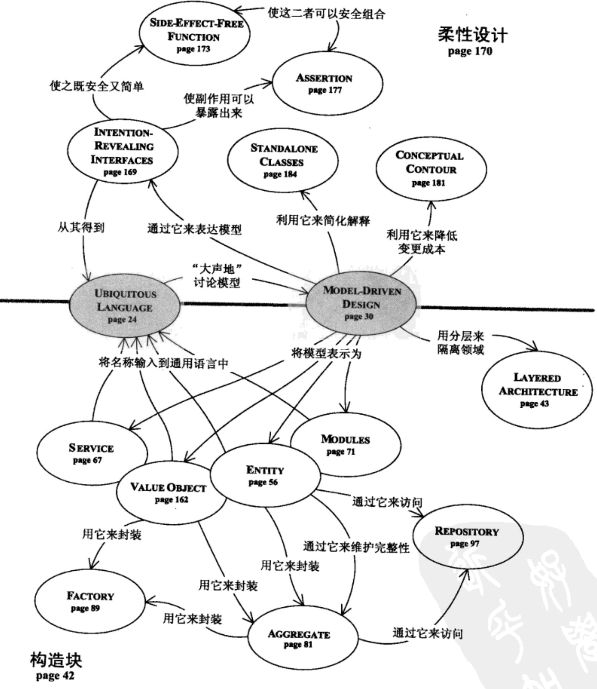


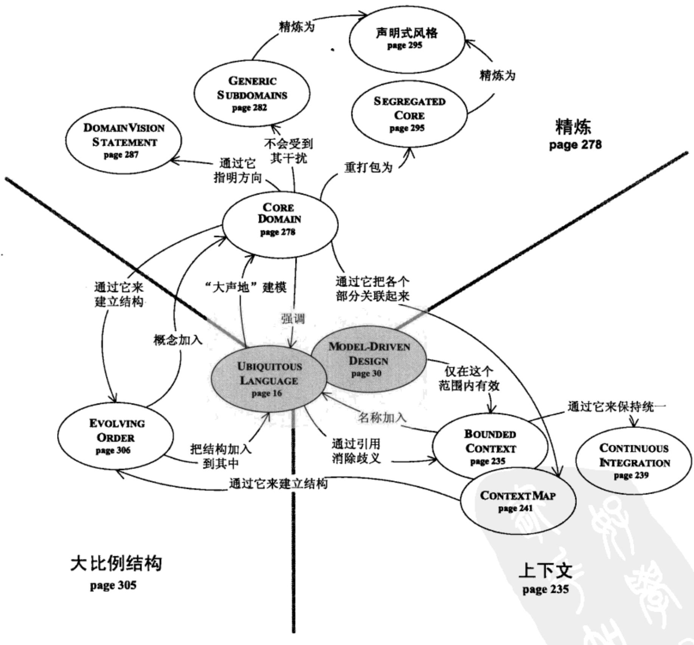


## 目录

第一部分 让领域模型发挥作用
第1章 消化知识 …… 5
1.1 有效建模的要素 …… 9
1.2 知识消化 …… 10
1.3 持续学习 …… 11
1.4 知识丰富的设计 …… 12
1.5 深层模型 …… 15
第2章 语言的交流和使用 …… 16
2.1 模式：UBIQUITOUS LANGUAGE …… 16
2.2 “大声地”建模 …… 21
2.3 一个团队，一种语言 …… 22
2.4 文档和图 …… 24
2.4.1 书面设计文档 …… 25
2.4.2 完全依赖可执行代码的情况 …… 27
2.5 解释性模型 …… 27
第3章 绑定模型和实现 …… 29
3.1 模式：MODEL-DRIVEN DESIGN …… 30
3.2 建模范式和工具支持 …… 32
3.3 揭示主旨：为什么模型对用户至关重要 …… 38
3.4 模式：HANDS-ON MODELER …… 39
第二部分 模型驱动设计的构造块
第4章 分离领域 …… 43
4.1 模式：LAYERED ARCHITECTURE …… 43
4.1.1 将各层关联起来 …… 46
4.1.2 架构框架 …… 47 

4.2 模型属于领域层……48
4.3 模式：THE SMART UI
“ANTI-PATTERN”……48
4.4 其他分离方式……50
5章 软件中所表示的模型……51
5.1 关联……52
5.2 模式：ENTITY（又称为
REFERENCE OBJECT）……56
5.2.1 ENTITY建模……59
5.2.2 设计标识操作……60
5.3 模式：VALUE OBJECT……62
5.3.1 设计VALUE OBJECT……64
5.3.2 设计包含VALUE OBJECT的
关联……67
5.4 模式：SERVICE……67
5.4.1 SERVICE与孤立的领域层……69
5.4.2 粒度……70
5.4.3 对SERVICE的访问……70
5.5 模式：MODULE（也称为PACKAGE）……71
5.5.1 敏捷的MODULE……72
5.5.2 基础设施驱动的打包存在的
隐患……73
5.6 建模范式……75
5.6.1 对象范式流行的原因……76
5.6.2 对象世界中的非对象……77
5.6.3 在混合范式中坚持使用
MODEL-DRIVEN DESIGN……78
6章 领域对象的生命周期……80
6.1 模式：AGGREGATE……81 

6.2 模式：FACTORY……89
6.2.1 选择 FACTORY 及其应用位置……91
6.2.2 有些情况下只需使用构造函数……93
6.2.3 接口的设计……94
6.2.4 固定规则的逻辑应放置在哪里……94
6.2.5 ENTITY FACTORY 与 VALUE OBJECT FACTORY……95
6.2.6 重建已存储的对象……95
6.3 模式：REPOSITORY……97
6.3.1 REPOSITORY 的查询……101
6.3.2 客户代码可以忽略 REPOSITORY 的实现，但开发人员不能忽略…102
6.3.3 REPOSITORY 的实现……103
6.3.4 在框架内工作……104
6.3.5 REPOSITORY 与 FACTORY 的关系……104
6.4 为关系数据库设计对象……106
7 章 使用语言：一个扩展的示例……108
7.1 货物运输系统简介……108
7.2 隔离领域：应用程序的引入……110
7.3 将 ENTITY 和 VALUE OBJECT 区别开……110
7.4 设计运输系统中的关联……111
7.5 AGGREGATE 边界……113
7.6 选择 REPOSITORY……113
7.7 场景走查……115
7.7.1 应用程序特性举例：更改 Cargo 的目的地……115
7.7.2 应用程序特性举例：重复业务……116
7.8 对象的创建……116
7.8.1 Cargo 的 FACTORY 和构造函数……116
7.8.2 添加一个 Handling Event……117
7.9 停下来重构：Cargo AGGREGATE 的另一种设计……118
7.10 运输模型中的 MODULE……120
7.11 引入新特性：配额检查……122 

7.11.1 连接两个系统 …… 123
7.11.2 进一步完善模型：划分
业务 …… 124
7.11.3 性能优化 …… 125
7.12 小结 …… 126

第三部分 通过重构来加深理解

第8章 突破 …… 131
8.1 一个突破的故事 …… 131
8.1.1 华而不实的模型 …… 132
8.1.2 突破 …… 133
8.1.3 更深层模型 …… 135
8.1.4 冷静决策 …… 137
8.1.5 成果 …… 138
8.2 机遇 …… 138
8.3 关注根本 …… 138
8.4 后记：越来越多的新理解 …… 139

第9章 将隐式概念转变为显式概念 …… 140
9.1 概念挖掘 …… 140
9.1.1 倾听语言 …… 140
9.1.2 检查不足之处 …… 144
9.1.3 思考矛盾之处 …… 148
9.1.4 查阅书籍 …… 148
9.1.5 尝试，再尝试 …… 150
9.2 如何为那些不太明显的概念建模 …… 150
9.2.1 显式的约束 …… 151
9.2.2 作为领域对象的过程 …… 153
9.2.3 模式：SPECIFICATION …… 154
9.2.4 SPECIFICATION的应用和实现 …… 156

第10章 柔性设计 …… 168
10.1 模式：INTENTION-REVEALING
INTERFACES …… 169
10.2 模式：SIDE-EFFECT-FREE FUNCTION …… 173
10.3 模式：ASSERTION …… 177
10.4 模式：CONCEPTUAL CONTOUR …… 181
10.5 模式：STANDALONE CLASS …… 184
10.6 模式：CLOSURE OF OPERATION …… 186
10.7 声明式设计 …… 188 

10.8 声明式设计风格 …… 190
10.9 切入问题的角度 …… 197
10.9.1 分割子领域 …… 197
10.9.2 尽可能利用已有的形式 …… 198

第 11 章 分析模式的应用 …… 206

第 12 章 将设计模式应用于模型 …… 217
12.1 模式：STRATEGY（也称为 POLICY）…… 218
12.2 模式：COMPOSITE…… 221
12.3 为什么没有介绍 FLYWEIGHT…… 226

第 13 章 通过重构得到更深层的理解…… 227
13.1 开始重构…… 227
13.2 探索团队…… 227
13.3 借鉴先前的经验…… 228
13.4 针对开发人员的设计…… 229
13.5 重构的时机…… 229
13.6 危机就是机遇…… 230

第四部分 战略设计

第 14 章 保持模型的完整性…… 233
14.1 模式：BOUNDED CONTEXT…… 235
14.2 模式：CONTINUOUS INTEGRATION…… 239
14.3 模式：CONTEXT MAP…… 241
14.3.1 测试 CONTEXT 的边界…… 247
14.3.2 CONTEXT MAP 的组织和文档化…… 247
14.4 BOUNDED CONTEXT 之间的关系…… 248
14.5 模式：SHARED KERNEL…… 248
14.6 模式：CUSTOMER/SUPPLIER DEVELOPMENT TEAM…… 250
14.7 模式：CONFORMIST…… 253
14.8 模式：ANTICORRUPTION LAYER…… 255
14.8.1 设计 ANTICORRUPTION LAYER 的接口…… 256
14.8.2 实现 ANTICORRUPTION LAYER…… 256
14.8.3 一个关于防御的故事…… 259 

14.9 模式：SEPARATE WAY……260
14.10 模式：OPEN HOST SERVICE……261
14.11 模式：PUBLISHED LANGUAGE……262
14.12 “大象”的统一……264
14.13 选择你的模型上下文策略……267
14.13.1 制定团队决策或更高层的决策……268
14.13.2 在上下文中工作……268
14.13.3 转换边界……268
14.13.4 接受那些我们无法更改的事物：描述外部系统……269
14.13.5 与外部系统的关系……269
14.13.6 正在设计的系统……270
14.13.7 满足不同模型的特殊需要……270
14.13.8 部署……271
14.13.9 权衡……271
14.13.10 当项目正在进行时……272
14.14 转换……272
14.14.1 合并 CONTEXT：SEPARATE WAY→SHARED KERNEL……273
14.14.2 合并 CONTEXT：SHARED KERNEL→CONTINUOUS INTEGRATION……274
14.14.3 逐步淘汰遗留系统……275
14.14.4 OPEN HOST SERVICE→PUBLISHED LANGUAGE……276
15章 精炼……277
15.1 模式：CORE DOMAIN……278
15.1.1 选择核心……280
15.1.2 工作的分配……280
15.2 精炼的逐步提升……281
15.3 模式：GENERIC SUBDOMAIN……282
15.3.1 通用不等于可以重用……286
15.3.2 项目风险管理……287
15.4 模式：DOMAIN VISION STATEMENT……287
15.5 模式：HIGHLIGHTED CORE……289
15.5.1 精炼文档……289 

15.5.2 标明 CORE …… 290
15.5.3 把精炼文档作为过程工具 …… 291
15.6 模式：COHESIVE MECHANISM …… 292
15.6.1 GENERIC SUBDOMAIN 与 COHESIVE MECHANISM 的比较 …… 293
15.6.2 MECHANISM 是 CORE DOMAIN 一部分 …… 294
15.7 通过精炼得到声明式风格 …… 295
15.8 模式：SEGREGATED CORE …… 295
15.8.1 创建 SEGREGATED CORE 的代价 …… 296
15.8.2 不断发展演变的团队决策 …… 296
15.9 模式：ABSTRACT CORE …… 301
15.10 深层模型精炼 …… 302
15.11 选择重构目标 …… 302
第 16 章 大比例结构 …… 303
16.1 模式：EVOLVING ORDER …… 306
16.2 模式：SYSTEM METAPHOR …… 308
16.3 模式：RESPONSIBILITY LAYER …… 309
16.4 模式：KNOWLEDGE LEVEL …… 321
16.5 模式：PLUGGABLE COMPONENT FRAMEWORK …… 328
16.6 结构应该有一种什么样的约束 …… 332
16.7 通过重构得到更适当的结构 …… 333 

16.7.1 最小化 …… 333
16.7.2 沟通和自律 …… 334
16.7.3 通过重构得到柔性设计 …… 334
16.7.4 通过精炼可以减轻负担 …… 334

第 17 章 领域驱动设计的综合运用 …… 336
17.1 把大比例结构与 BOUNDED CONTEXT
结合起来使用 …… 336
17.2 将大比例结构与精炼结合起来
使用 …… 339
17.3 首先评估 …… 339
17.4 由谁制定策略 …… 341
17.4.1 从应用程序开发自动得出
的结构 …… 341
17.4.2 以客户为中心的架构团队 …… 341
17.5 制定战略设计决策的 6 个要点 …… 342
17.5.1 技术框架同样如此 …… 344
17.5.2 注意总体规划 …… 345

结束语

附录 …… 350
术语表 …… 353
参考文献 …… 356
图片说明 …… 358
索引 …… 359 

# 第一部分 让领域模型发挥作用


上面这张图是18世纪中国描绘的世界地图。图中央占地最大的部分是中国，周围点缀着其他国家，但这些国家只是马马虎虎地表示一下。这是那个社会认为的世界模型，它有意偏向于中心部分。如果在与外国人交往时用这种眼光来看世界，肯定不会有任何好处。当然，它对现代中国也是毫无用处的。地图是模型，而每个模型都表示人们感兴趣的某方面现实或某种想法。模型是一种简化。它是对现实的解释，并把与解决问题密切相关的方面抽象出来，而忽略无关的细节。 

每个软件程序的目的都是为了执行某项活动，或是满足用户的某种需求。用户会把软件程序应用于某个主题区域，这个区域就是软件的领域。一些领域涉及物质世界，例如机票预订程序的 

领域中包括飞机乘客在内。有些领域则是无形的，例如会计程序的金融领域。软件领域一般与计算机关系不大，当然也有例外，例如源代码控制系统的领域就是软件开发本身。 

为了创建真正能为用户活动创造价值的软件，开发团队必须运用一整套与这些活动有关的知识体系。所需知识的广度可能令人望而生畏，信息量和复杂度也可能超乎想象。模型正是用于解决信息超载问题的工具。模型是一种知识形式，它对知识进行有选择的简化和有目的的结构化。适当的模型可以使人理解信息的意义，并专注于问题相关的信息。 

领域模型并非一种特殊的图，而是图要表达的思想。它绝不单单是领域专家头脑中的知识，而是经过严格组织并且精心选择的抽象知识。一张图可以表示和传达一种模型，同样，一段仔细斟酌的代码或一句英文也能实现同样的目的。 

建立领域模型并不是要尽可能建立一个符合“现实”的模型。即使对具体的、真实世界领域中的某个事物进行建模，所得到的模型也是对事物的一种模拟。它也不单单是一种为了实现某种目的而构造出来的软件机制。建模更像是制作电影——出于某种目的而概括地反映现实。即使是一部纪录片也不会原封不动地展现真实生活。就像电影制片人选择一些素材，并以一种特殊方式将它们展现给观众，从而讲一个故事或阐明一个观点一样，领域建模人员会根据模型的作用来选择特殊的模型。 

## 模型在领域驱动设计中的作用

在领域驱动的设计中，三个基本用途决定了模型的选择。 

(1) 模型和设计的核心互相影响。正是模型与实现之间的紧密联系才使模型变得有用，并确保我们在模型中所进行的分析能够转化为最终产品（即一个有用的程序）。模型与实现之间的这种紧密结合在维护和持续开发期间也会很有用，因为我们可以基于对模型的理解来解释代码。(参见第3章。) 

(2) 模型是团队所有成员所使用的交流语言的中枢。由于模型与实现之间的紧密结合，开发人员可以将模型作为一种沟通语言来讨论程序。他们可以在无需翻译的情况下与领域专家进行沟通。而且，由于语言是基于模型的，因此我们的自然语言能力可用来对模型本身进行精化。(参见第2章。) 

(3) 模型是浓缩的知识。模型是团队一致认同的领域知识组织方式和最重要元素的区分方式。模型体现了我们在选择术语、分解概念和关联概念时所采用的思考方式。共同的语言使得开发人员和领域专家在将信息组织为模型时能够有效地协作。模型与实现之间的紧密结合使得早期版本软件的经验可以作为反馈应用到建模过程中。(参见第1章。) 

接下来的三章分别考查上述三种基本用途的意义和价值，以及它们之间的关联方式。遵循这些原则就可以开发出具有丰富功能的软件，而要想在不使用模型的情况下开发出同样的软件，则需要耗费大规模的投资进行专门的开发。 

## 软件的核心

软件的核心是其为用户解决领域相关的问题的能力。所有其他特性，不管有多么重要，都要服务于这个基本目的。当领域很复杂时，这是一项艰巨的任务，要求高水平技术人员的共同努力。开发人员必须钻研领域以获取业务知识。他们必须练习建模技巧，并精通领域设计。 

然而，在大多数软件项目中，这些问题并未引起足够的重视。大部分有才能的开发人员对学习与他们的工作领域有关的知识不感兴趣，更不会下力气去扩展自己的领域建模技巧。技术人员喜欢那些能够练习技巧的可量化问题。领域工作很繁杂，而且要求掌握很多复杂的新知识，而这些新知识看似对提高计算机科学家的能力并无裨益。 

4 

相反，技术人才更愿意从事精细的框架工作，试图用技术来解决领域问题。他们把学习领域知识和领域建模的工作留给别人去做。软件核心的复杂性需要我们直接去面对和解决，如果不这样做，必将导致工作重点的偏离。 

在一次电视访谈节目中，喜剧演员John Cleese讲述了电影《巨蟒和圣杯》（Monty Python and the Holy Grail）在拍摄期间发生的一个小故事。有一个镜头他们反复拍了很多次，但就是感觉不够滑稽。最后，他停下来，与另一位喜剧演员Michael Palin（这个镜头中的另一位演员）商量了一下，他们决定稍微改变一下。随后又拍了一次，终于令他们满意了，于是收工。 

第二天早上，Cleese观看了剪辑人员为前一天工作所做的初步剪接。到了那个令他们费了好大劲的镜头时，Cleese发现剪辑人员竟然使用了先前拍摄的一个镜头，影片到这里又变得不滑稽了。 

他问剪辑人员为什么没有使用最后拍的那个镜头，剪辑人员回答说：“那个镜头不能用，因为有人闯入了镜头。”Cleese连看了两遍，仍未发现有什么不对。最后，剪辑人员将影片暂停，并指出有一小段时间在屏幕的边缘能看见一只袖子。 

影片的剪辑人员专注于准确完成自己的工作。他担心其他看到这部电影的剪辑人员会给他挑错。在这个过程中，镜头的核心作用被忽略了（“The Late Late Show with Craig Kilborn”，CBS，2001年9月）。 

幸运的是，该剧的导演很懂喜剧，他最终使用了这个镜头。同样，在一个团队中，反映了对项目深层次理解的模型开发有时也会在混乱中迷失方向，此时，理解领域核心的领导者就能够将软件项目带回到正确的轨道上来。 

本书将展示领域开发中蕴藏的巨大机会，它能够培养精湛的设计技巧。大多数软件领域是看起来纷繁芜杂的，但这实际上是一项充满乐趣的技术挑战。事实上，在很多学科中，“复杂性”都是当前最热门的一个话题，因为研究人员都在想办法解决真实世界中的复杂性。软件开发人员在面对尚未定型的复杂领域时，也会有同样的期望。创建一个避开所有复杂性的易懂模型会带来 

巨大的成就感。 

开发人员可以采用一些系统性的思考方法来透彻地理解领域并开发出有效的模型。还有一些设计技术可以使毫无头绪的软件应用程序开发工作变得井井有条。掌握这些技巧可以令开发人员身价倍增，即使是在一个最初不熟悉的领域中也是如此。 


## 消化知识

几年前，我着手设计一个用于设计印制电路板（PCB）的专用软件工具。但有一个问题是，我对电子硬件一无所知。当然，我也曾拜访过一些PCB设计师，但用不了3分钟，他们就令我晕头转向。如何才能了解足够多的知识，以便开始编写这个软件呢？当然，我并不指望在交付期限到来之前成为电子工程师。 

我们试着让PCB设计师说明软件具体应该做些什么，但我们却想错了。他们是优秀的电路设计师，但软件知识却太有限了，往往只知道如何读取一个ASCII文件、对它排序，然后添加一些注释并将它写回文件中，再生成一个报告。这些知识显然无法帮助他们大幅度提高效率。 

最初的几次会面令人气馁，但我们在他们要求的报告中也看到了一丝希望。这些报告中总是涉及net这个词以及与其相关的各种细节。在这个领域中，net实质上是一种导线，它可以连接PCB上任意数量的元件，并向它连接的所有元件传递电子信号。这样，我们就得到了领域模型的第一个元素。如图1-1所示。 

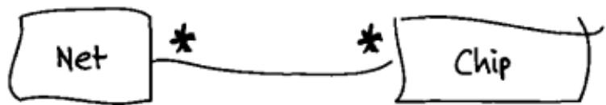


图1-1


就这样，我们一边讨论所需的软件功能，一边开始画图。我使用一种非正式的、稍加变化的对象交互图来走查 $^{①}$ 各种场景。如图1-2所示。 

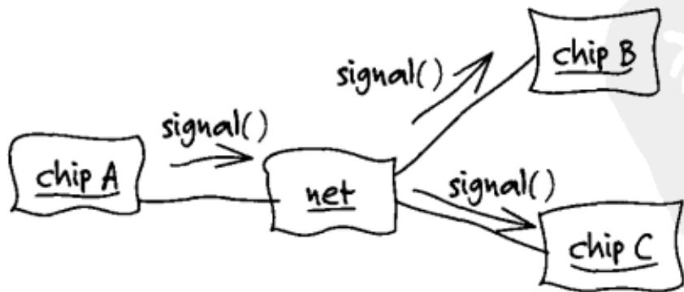


图1-2


PCB专家1：元件不一定就是芯片（chip）。 

开发人员（我）：那它们是不是只应该叫做“元件”？ 

专家1：我们将它们称作“元件实例”（component instance）。相同的元件可能有很多。 

专家2：他把“net”画成和元件实例一样的框了。 

专家1：他没有使用我们的符号。我猜想，他要把每一项都画成方框。 

开发人员：很抱歉，是这样的。我想我最好对这个符号稍加解释。 

他们不断地纠正我的错误，在这个过程中我开始学习他们的知识。我们共同消除了术语上的不一致和歧义，也消除了他们在技术观点上的分歧，在这个过程中，他们也得到了学习。他们的解释更准确和一致了，然后我们开始共同开发一个模型。 

专家1：说一个信号到达一个ref-des是不够明确的，我们必须知道信号到达了哪个引脚。 

开发人员：什么是ref-des? 

专家2：它就是一个元件实例。ref-des是我们在一个特殊工具中所使用的名称。 

专家1：总之，net将一个实例的某个引脚与另一个实例的某个引脚相连。 

8 

开发人员：一个引脚是不是只属于一个元件实例，而且只与一个net相连？ 

专家1：对，是这样。 

专家2：还有，每个net都有一个拓扑结构，也就是电路的布局，它决定了net内部各元件的连接方式。 

开发人员：嗯，这样画如何？ 

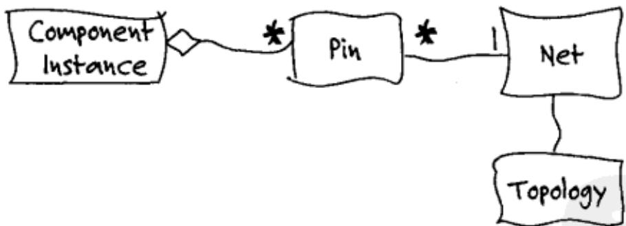


图1-3


为了让讨论更集中，接下来的一段时间我们探讨了一个特殊的特性，探针仿真（probe simulation）。探针仿真跟踪信号的传播，以便检测在设计中可能出现特定类型问题的位置。 

开发人员：现在我已经明白了net是如何将信号传播给它所连接的所有引脚（pin）的，但如何将信号传送得更远呢？这与拓扑结构（topology）有关系吗？ 

专家2：没有，是元件推送信号前进。 

开发人员：我们肯定无法对芯片的内部行为建模，因为这太复杂了。 

专家2：我们不必这样做。可以使用一种简化形式。只需列出通过元件可从某些引脚将信号推送到其他引脚即可。 

开发人员：类似于这样吗？ 

[经过反复的尝试和修改，我们终于共同绘制出了一个草图]。 

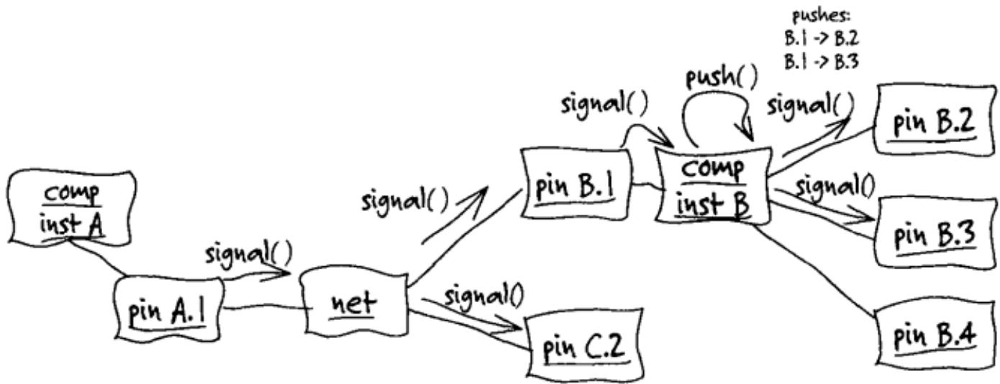


图1-4


开发人员：但你想从这种计算中知道什么呢？ 

专家2：我们要查找较长的信号延迟，也就是说，查找超过2或3跳的信号路径。这是一条经验法则。如果路径太长，信号可能无法在时钟周期内到达。 

开发人员：超过3跳……这么说我们需要计算路径长度。那么怎样算作一跳呢？ 

专家2：信号每通过一个net，就称为1跳。 

开发人员：那么我们可以沿着电路来计算跳数，每遇到一个net，跳数就加1。 

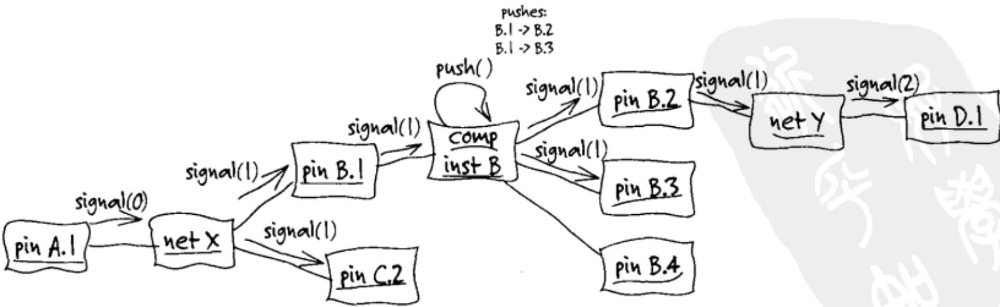


图1-5


开发人员：现在我唯一不明白的地方是“推动”是从哪儿来的。是否每个元件实例都需要存储该数据？ 

专家2：一个元件的所有实例的推动行为都是相同的。 

开发人员：那么元件的类型决定了推动行为，而每个实例的推动行为都是相同的？ 

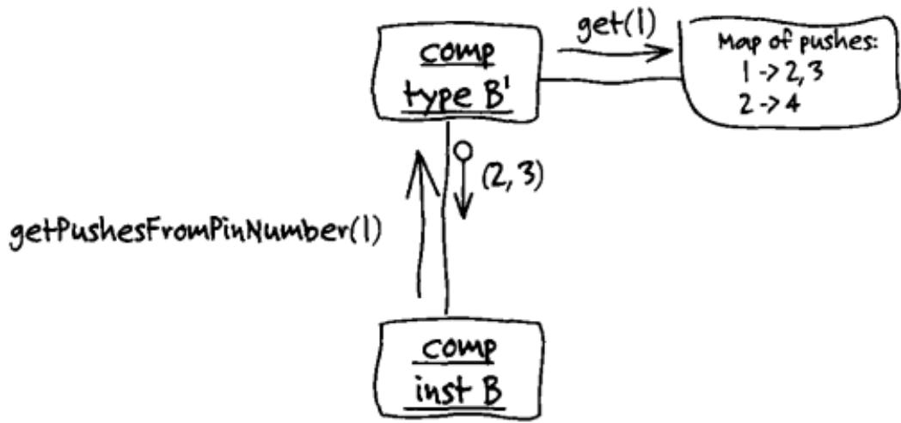


10 

图1-6 

专家2：这个图的意思我没完全明白，但我猜想每个元件存储的推动行为就差不多是这样的吧。 

开发人员：抱歉，这个地方我可能问得有点过细了。我只是想考虑得全面一些……现在，拓扑结构对它有什么影响吗？ 

专家1：拓扑结构不影响探针仿真。 

开发人员：那么可以暂不考虑它，是吗？等用到这些特性时再回来讨论它。 

就这样，我们的讨论一直进行下去（其中遇到的困难比上面显示的多得多）。我们一边进行“头脑风暴”式的讨论，一边对模型进行精化，边提问边回答。随着我对领域理解的加深，以及他们对模型在解决方案中作用的理解的加深，模型不断发展。图1-7显示了那个早期模型的类图。 

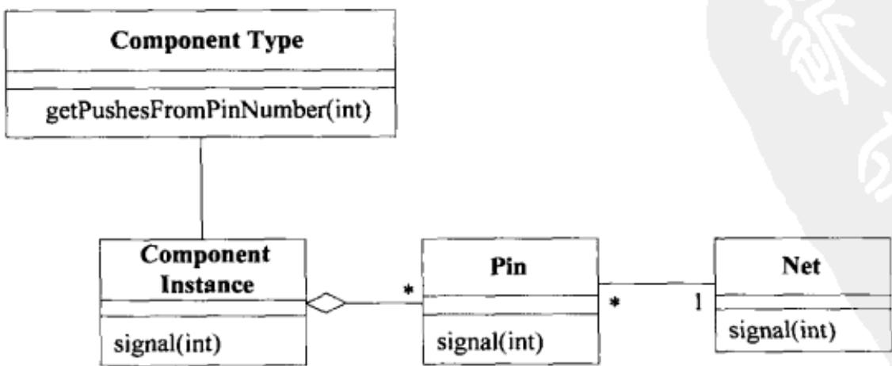


图1-7


随后，我们又拿出一部分工作时间进行了几轮这样的讨论，我觉得自己已经理解了足够多的知识，可以试着编写一些代码了。我写了一个非常简单的原型，并用一个自动测试框架来测试它。我避开了所有的基础设施。这个原型没有持久化机制，也没有用户界面（UI）。这样我就可以专注于代码的行为。只过了几天我就能够演练简单的探针仿真了。虽然它使用的是虚拟数据，而且向控制台写的是纯文本，但确实是使用Java对象对路径长度执行实际的计算。这些Java对象所反映的模型正是我和领域专家们一起开发出来的。 

这个具体的原型使得领域专家们更清楚地理解了模型的含义，以及它与最终软件之间的联系。从那时起，我们的模型讨论越来越具有互动性了，因为他们可以看到我如何将新学到的知识融合到模型中，然后反映到软件上。他们也可以从原型得到具体的反馈，从而印证自己的想法。 

11 

模型中包含与我们要解决的问题有关的PCB领域知识，这些知识远远比我们在这里演示的复杂。模型将很多同义词和语言描写中的微小差别做了统一，并排除了数百条与问题没有直接关系的事实（虽然工程师们都理解这些事实），例如元件的实际数字特性。像我这样的软件专业人员看到这张图后，几分钟内就能明白软件是做什么的。这张图就相当于一个框架，开发人员可以借助于它来组织新的信息并更快地学习，从而更准确地判断哪些部分重要，哪些部分不重要，并更好地与PCB工程师进行沟通。 

当PCB工程师提出新的功能需求时，我就让他们带我走查对象交互的场景。当模型对象无法清楚地表达某个重要场景时，我们就通过头脑风暴活动创建新的模型对象或者修改原有的模型对象，并消化理解这些模型对象中的知识。在我们精化模型的过程中，代码也随之一步步演进。几个月后，PCB工程师们得到了一个远远超乎他们期望的功能丰富的工具。 

## 1.1 有效建模的要素

以下几方面因素使上述案例得以成功。 

(1) 模型和实现的绑定。最初的原型虽然简陋，但它在模型与实现之间建立了早期链接，而且在所有后续的迭代中我们一直在维护该原型。 

(2) 获得了一种基于模型的语言。最初，工程师们不得不向我解释基本的PCB问题，而我也必须向他们解释类图的含义。但随着项目的进展，双方都能够直接使用模型中的术语，并将它们组织为符合模型结构的语句，而且无需翻译即可理解互相要表达的意思。 

(3) 开发一个蕴含丰富知识的模型。对象具有行为和强制性规则。模型并不仅仅是一种数据模式，它还是解决复杂问题不可或缺的部分。模型包含各种类型的知识。 

(4) 提炼模型。在模型日趋完整的过程中，重要的概念不断被添加到模型中，但同样重要的是，不再使用或不重要的概念则从模型中删除。当一个不需要的概念与一个需要的概念有关联时，则把重要的概念提取到一个新模型中，其他那些不要的概念就可以删去了。 

(5) 头脑风暴和实验。语言和草图，再加上头脑风暴活动，将我们的讨论变成“模型实验室”，在这些讨论中可以演示、尝试和判断上百种变化。当团队走查场景时，口头表达本身就可以作为所提议的模型的可行性测试，因为人们听到口头表达后，就能立即分辨出它是表达得清楚、简捷，还是表达得很笨拙。 

正是头脑风暴的创造力和大量实验才使我们找到了一个蕴含丰富知识的模型并对它进行提炼，在这个过程中，基于模型的语言提供了很大帮助，而且贯穿整个实现过程中的反馈循环也对模型起到了“训练”作用。这种知识消化将团队的知识转化为有价值的模型。 

## 1.2 知识消化

金融分析师要消化理解的内容是数字。他们筛选大量的详细数字，并对它们进行组合和重组，以便寻找潜在意义和重要元素的简单表示方式，也就是形成一种可用作金融决策基础的理解。 

高效的领域建模人员是知识的消化者。他们在大量信息中探寻有用的部分。他们不断尝试各种信息组织方式，努力寻找对大量信息有意义的简单视图。很多模型在尝试后被放弃或改造。只有找到一组适用于所有细节的抽象概念后，工作才算成功。这种经过提炼得到的精华是对被认为是最相关的知识的严格表示。 

知识消化并非一项孤立的活动，它一般是在开发人员的领导下，由开发人员与领域专家组成的团队来共同协作。他们共同收集信息，并通过消化而将它组织为有用的形式。信息的资料来自领域专家头脑中的知识，来自现有系统的用户，也来自技术团队以前在相关遗留系统或同领域的其他项目中积累的经验。信息的形式也多种多样，有可能是为项目编写的文档，有可能是业务中使用的文件，也有可能来自大量的讨论。早期版本或原型将经验反馈给团队，然后团队对一些解释做出修改。 

在传统的瀑布方法中，业务专家与分析员进行讨论，分析员消化理解这些知识后，对其进行抽象并将结果传递给程序员，再由程序员编写软件代码。由于这种方法完全没有反馈，因此总是失败。分析员全权负责创建模型，但他们创建的模型只是基于业务专家的意见。他们既没有向程序员学习的机会，也得不到早期软件版本的经验。知识只是朝一个方向流动，而且不会形成累积。 

有些项目使用了迭代过程，但由于没有对知识进行抽象而无法建立起知识体系。开发人员听专家们描述某项所需的特性，然后开始构建它。他们将结果展示给专家，并询问接下来做什么。如果程序员愿意进行重构，则能够保持软件足够整洁，以便继续扩展它；但如果程序员对领域不感兴趣，则他们只会学习程序应该执行的功能，而不会学习它背后的原理。虽然这样也能开发出有用的软件，但项目永远也不会从原有特性中自然地扩展出强大的新特性。 

好的程序员会自然而然地抽象并开发出一个可以完成更多工作的模型。但如果在建模时只是技术人员在唱独角戏，而没有领域专家的协作，那么得到的概念将是很幼稚的。使用这些肤浅知 识开发出来的软件只会做基本工作，而不会充分反映出领域专家的思考方式。 

在团队所有成员一起消化理解模型的过程中，他们之间的交互也会发生变化。领域模型的不断精化迫使开发人员学习重要的业务原理，而不是机械地进行功能的开发。领域专家被迫提炼自己所知道的重要知识的过程往往也是完善其自身理解的过程，而且他们会渐渐理解软件项目所必需的概念严谨性。 

所有这些因素都促使团队成员成为更合格的知识消化者。他们对知识去粗取精。他们将模型重塑为更有用的形式。由于分析员和程序员将自己的知识输入到了模型中，因此模型的组织更严密，抽象也更为整洁，从而为实现提供了更大支持。同时，由于领域专家也将他们的知识输入到了模型中，因此模型反映了业务的深层次知识，而且确保模型真正是对业务原理的抽象反映。 

模型在不断改进的同时，也成为组织信息流的工具。模型聚焦于需求分析。它与编程和设计紧密交互。它通过良性循环加深团队成员对领域的理解，使他们更透彻地理解模型，并对其进一步精化。模型永远都不会是完美的，因为它是一个不断完善的过程。模型必须对领域实用和有用。它们必须非常精确，以便使应用程序易于实现和理解。 

## 1.3 持续学习

当开始编写软件时，其实我们所知甚少。项目知识零散地分散在很多人和文档中，其中夹杂着其他一些无关信息，因此我们甚至不知道哪些知识是真正需要的知识。领域知识在技术上似乎不那么难应付，但不要被假象蒙蔽——我们并没意识到不知道的东西究竟有多少。这种无知往往会导致我们做出错误的假设。 

同时，所有项目都会丢失知识。已经学到了一些知识的人可能干别的事去了。团队可能由于重组而被拆散，这导致知识又重新分散开。被外包出去的关键子系统可能只交回了代码，而不会将知识传递回来。而且当使用典型的设计方法时，代码和文档不会以一种有用的形式表示出这些来之不易的知识，因此一旦由于某种原因人们没有口头传递知识，那么知识就丢失了。 

高效率的团队需要有意识地积累知识，并持续学习（[Kerievsky 2003]）。对于开发人员来说，这意味着既要完善技术知识，也要培养一般的领域建模技巧（例如本书中所讲的那些技巧）。但这也包括认真学习他们正在从事的特定领域的知识。 

善于自学的团队成员是团队的中坚力量，那些涉及最关键领域的开发任务要靠他们来攻克（有关这方面的更多内容，参见第15章）。这个核心团队头脑中积累的知识使他们成为更高效的知识消化者。 

读到这里，请先停一下来问自己一个问题。你是否学习了一些PCB设计知识？虽然这个示例只对该领域作了些表面处理，但当讨论领域模型时，仍需学习一些知识。我学习了大量知识，但并没有学习如何成为一名PCB工程师，因为这不是我的目的。我的目的是学会与PCB专家沟通， 学会理解与应用有关的主要概念，并学会检查所构建的内容是否合理。 

事实上，我们的团队最终发现探针仿真并不是一项重要的开发任务，因此最后删除了这个功能。连同它一起删除的还有模型中的一些部分，这些部分只是帮助我们理解如何通过元件推动信号以及如何计算跳数。这样，应用程序的核心就转移到了别处，而且模型也随之改变，将新的重点作为核心。在这个过程中，领域专家们也学到了很多东西，而且更加清楚地理解了应用程序的目标（第15章更深入地讨论这些问题）。 

尽管如此，那些早期工作还是非常重要的。关键的模型元素被保留下来，而更重要的是，早期工作开始了知识消化的过程，这使得所有后续工作更加高效：团队成员、开发人员和领域专家等都学到了知识，他们开始使用一种公共的语言，而且形成了贯穿整个实现过程的反馈循环。这样，一个发现之旅悄然开始了。 

## 1.4 知识丰富的设计

通过像PCB示例这样的模型获得的知识远远不只是“发现名词”。业务活动和规则如同所涉及的实体一样，都是领域的中心，任何领域都有各种类别的概念。知识消化所产生的模型能够反映出对知识的深层理解。在模型发生改变的同时，开发人员对实现进行重构，以便反映出模型的变化，这样，新知识就被合并到应用程序中了。 

当我们的建模不再局限于寻找实体和值对象时我们才能充分吸取知识，因为业务规则之间可能会存在不一致。领域专家在反复研究所有规则、解决规则之间的矛盾以及修改规则使其符合常识等一系列工作中，往往不会意识到他们的思考过程有多么复杂。软件是无法完成这一工作的。正是通过与软件专家紧密协作来消化知识的过程才使得规则得以澄清和充实，并消除规则之间的矛盾以及删除一些无用规则。 

## 示例 提取一个隐藏的概念

我们从一个非常简单的领域模型开始学习,基于此模型的应用程序用来预订一艘船在一次航程中要运载的货物,如图1-8所示。 


图1-8


我们可以规定这个应用程序的任务是将每件货物（Cargo）与一次航程（Voyage）关联起来，记录并跟踪这种关系。现在看来一切都还算简单。应用程序代码中可能会有一个像下面这样的方法： 

```java
public int makeBooking(Cargo cargo, Voyage voyage) {
    int confirmation = orderConfirmationSequence.next();
    voyage.addCargo(cargo, confirmation);
    return confirmation;
} 
```

由于总会有人临时取消订单，因此航运业的一般做法是接受比其运载能力多一些的货物。这称为“超订”。有时使用一个简单的容量百分比来表示，例如预订110%的载货量。有时则采用一些有利于主要客户或特定种类的货物的复杂规则。 

这是航运领域的一个基本策略，从事航运业的业务人员都知道它，但在软件团队中可能不是所有技术人员都知道这条规则。 

需求文档中包含下面这句话： 

## 允许10%的超订。

现在，类图和代码就应该像图1-9这样： 

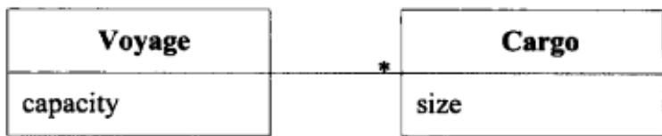


图1-9


```java
public int makeBooking(Cargo cargo, Voyage voyage) {
    double maxBooking = voyage.capacity() * 1.1;
    if ((voyage.bookedCargoSize() + cargo.size()) > maxBooking)
    return -1;
    int confirmation = orderConfirmationSequence.next();
    voyage.addCargo(cargo, confirmation);
    return confirmation;
} 
```

现在，一条重要的业务规则被隐藏在了上面这段方法代码的一个卫语句 $^{①}$ 中。第4章将介绍LAYERED ARCHITECTURE，它会帮助我们将超订规则转移到领域对象中，但现在我们主要考虑如何把这条规则更清楚地表达出来，以便让项目中的每个人都能看到它。这样就只能修改上面的代码以提供一个类似的解决方案。 

(1) 如果写成上面的代码那样，不可能会有业务专家能通过阅读这段代码来检验规则，即使在开发人员的帮助下也无法完成。 

(2) 不懂此业务的技术人员很难将需求文本与代码联系起来。 

如果规则更复杂，情况将更糟。 

我们可以改变一下设计来更好地捕获这个知识。超订规则是一个政策。政策（policy）其实是一种设计模式，也就是我们所说的STRATEGY模式 $^{①}$ （[Gamma et al. 1995]）。我们知道，使用STRATEGY的动机一般是为了替换不同的规则，虽然在这里并不需要这么做，但我们要获取的概念确实符合STRATEGY的意义，这一点在领域驱动的设计中足以成为使用STRATEGY的动机（参见第12章），如图1-10所示。 

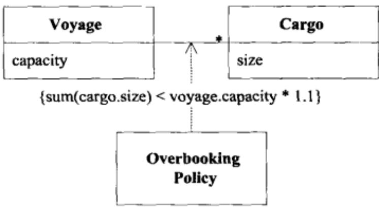


图1-10


修改后的代码如下： 

```java
public int makeBooking(Cargo cargo, Voyage voyage) {
    if (!overbookingpolicy.isallowed(cargo, voyage)) return -1;
    int confirmation = orderConfirmationSequence.next();
    voyage.addCargo(cargo, confirmation);
    return confirmation;
} 
```

新的Overbooking Policy类包含以下方法： 

```txt
public boolean isAllowed(Cargo cargo, Voyage voyage) {
    return (cargo.size() + voyage.bookedCargoSize()) <= (voyage.capacity() * 1.1);
} 
```

现在所有人都可以看出超订是一个独特的政策，而且超订规则的实现是明确且独立的。 

现在，我并不建议将这样的精细设计应用到领域的每个细节中。第15章将深入阐述如何关注重点以及如何隔离其他问题或使这些问题最小化。这个例子的目的是说明领域模型和相应的设计可用来保护和共享知识。更明确的设计具有以下优点： 

(1) 为了实现更明确的设计，程序员和其他各位相关人员都必须理解超订的本质，明白它是 

一个明确且重要的业务规则，而不只是一个普通的、不引人注意的计算问题。 

(2) 程序员可以向业务专家展示技术工件，甚至是代码，但应该是领域专家（在程序员指导下）可以理解的，以便形成反馈循环。 

## 1.5 深层模型

有用的模型很少停留在表面层次上。随着对领域和应用程序需求的理解逐步加深，我们往往会丢掉那些最初看起来很重要的表面元素，或者切换它们的角度。这时，一些在开始时不可能发现的巧妙抽象就会渐渐浮出水面，而它们恰恰切中问题的要害。 

前面的例子大体上是基于一个集装箱航运项目，这是本书列举的几个项目之一，本书还有几个示例会引用这个项目。本书所举的示例都很简单，即使不是航运专家，也能理解它们。但在一个需要团队成员持续学习的真实项目中，要想建立实用且清晰的模型则要求团队成员既精通领域知识，也要精通建模技术。 

在这个项目中，由于航运从预订货运开始，因此我们开发了一个能够描述货物和运货航线等事物的模型。这是必要且有用的，但领域专家却不这样认为。他们有自己的考虑业务的方式，这种方式是我们没有考虑到的。 

最后，在经过几个月的知识消化后，我们知道货物的处理主要是由转包商或公司中的操作人员完成的，这包括装货、卸货和运货。航运专家的观点是，各部分之间存在一系列的责任传递。法律责任和执行责任的传递有一个控制过程——从托运人传递到某个本地运输商，再从这家运输商传递到另一家运输商，最后到达收货人。通常，在办理一些重要手续时，货物停放在仓库里。在其他时间里，货物则是通过复杂的物理步骤来运输，而这些步骤与航运公司的业务决策无关。在处理航线的物流之前，必须先确定诸如提单等法律文件以及支付流程。 

对航运业务有了更深刻的认识后，我们并没有删除航线（Itinerary）对象，但模型发生了巨大改变。我们对航运业务的认识从“集装箱在各个地点之间的运输”转变为“运货责任在各个实体之间的传递”。处理这些责任传递的特性不再是一些附属于装货作业的次要特性，而是由一个独立的模型来提供支持，这个模型正是在理解了作业与责任之间的重要关系之后开发出来的。 

知识消化是一种探索，它永无止境。 

## 语言的交流和使用

领域模型是软件项目的公共语言的核心。模型是人们头脑中形成的与项目有关的概念集合，它用术语和关系反映了领域的深层含义。这些术语和相互关系提供了模型语言的语义，模型语言是专门为领域量身裁剪的，而且十分精确，以便支持技术开发。它是一条至关重要的纽带，将模型与开发活动结合在一起，并使模型与代码紧密绑定。 

这种基于模型的交流并不仅限于UML（统一建模语言）图。为了最有效地使用模型，需要充分利用各种交流手段。基于模型的交流提高了文本文档的实用性，也提高了敏捷过程中反复强调的非正式图和临时交谈（casual conversation）的实用性。它提高了代码本身和代码测试的沟通能力。 

23 

在一个项目中，语言的使用很微妙，但是非常重要…… 

## 2.1 模式：UBIQUITOUS LANGUAGE

首先写下一个句子， 

然后将它分成小段， 

再将它们打乱并重新排序。 

仿佛是巧合一样， 

短语的顺序对意思完全没有影响。 

—Lewis Carroll, "Poeta Fit, Non Nascitur" 

要想创建一种灵活的、蕴含丰富知识的设计，需要一种通用的、共享的团队语言，这种语言应该是时刻进行检验的，遗憾的是，在软件项目上很少出现这样的检验。 

## * * *

领域专家对软件开发的技术行话所知有限，但他们使用自己领域的行话，这种行话可能还具有各种不同的风格。另一方面，开发人员可能会用一些描述性的、功能性的术语来理解和讨论系统，而这些术语并不会表达出专家语言所要传达的意思。或者，开发人员可能会创建一些用于支持设计的抽象，但领域专家并不理解这些抽象。负责处理一个问题不同部分的开发人员可能会开 发出各自不同的一些设计概念和描述领域的方式。 

由于语言上存在鸿沟，领域专家们只能模糊地描述他们想要的东西。开发人员虽然努力去理解一个自己不熟悉的领域，但也只能形成模糊的认识。有少数的团队成员会学着同时说这两种语言，但由于这样的人太少了，信息流会遭遇瓶颈问题，而且他们的翻译也不准确。 

在一个没有公共语言的项目上，开发人员不得不为领域专家们做翻译。而这些领域专家还需要充当开发人员与其他领域专家之间的翻译。甚至开发人员之间还需要互相翻译。这些翻译使模型概念变得混淆，这会破坏代码的重构。这种间接的沟通掩盖了分裂的形成，不同的团队成员使用不同的术语而尚不自知。这导致软件的各个部分不能够浑然一体，因此无法开发出可靠的软件（参见第14章）。翻译工作导致各类知识和想法无法结合到一起，从而影响对模型的深入理解。 

24 

如果语言支离破碎，项目必将遭遇严重问题。领域专家使用他们自己的行话，而技术团队成员则使用自己的语言来从设计角度讨论领域。 

日常讨论所使用的术语与代码（软件项目的最重要产品）中使用的术语不一致。甚至同一个人在讲话和写东西时使用的语言也不一致，这导致的后果是，即使人们对领域有了一些深刻的描述，也转眼就忘记了，而无法记录到代码或文档中。 

翻译使得沟通不畅，并导致知识消化变得困难。 

然而任何一种行话都不能成为公共语言，因为它们无法满足所有的需求。 

所有翻译工作加在一起，开销实在是太大了，还要冒着误解的风险。项目需要一种公共语言，这种语言并不是那种最简单的、大众化的东西，而是比其强大得多。通过团队的一致努力，领域模型可以成为这种公共语言的核心，同时将团队沟通与软件实现紧密联系到一起。这种公共语言是整个团队工作中的UBIQUITOUS LANGUAGE（通用语言）。 

UBIQUITOUS LANGUAGE的词汇表包括类名称和主要操作。LANGUAGE中包含术语，有些术语用来讨论模型中已经明确的规则，还有一些术语则来自施加于模型上的高级组织原则（例如第14和第16章要讨论的CONTEXT MAP和大比例结构）。最后，团队一致应用于领域模型的模式名称使这种语言更为丰富。 

模型之间的关系成为所有语言都具有的组合规则。词和短语的意义反映了模型的语义。 

所有开发人员都应该使用基于模型的语言来描述系统中的工件、任务和功能。这个模型应该为开发人员和领域专家提供一种用于相互交流的语言，而且领域专家们还应该可以使用这种语言来讨论需求、开发计划和特性。语言的使用越普遍，理解就越容易。 

至少，我们应该将它作为目标。但最初，模型可能不太好，因此无法很好地履行这些职责。它可能不会像领域中所使用的专业行话那样具有丰富的语义。但我们又不能直接使用行话，因为它们有歧义和矛盾。模型可能会缺乏开发人员在编写代码时所表现出来的灵活性和活力，这要么是因为开发人员认为模型不必具有这些特性，要么是因为编码风格只是按部就班地传递领域概念。 

尽管知识消化过程和基于模型的语言的使用看起来在次序上没有先后之分，但其实前者是依 赖于后者的，也就是说，有助于产生更有用模型的知识消化过程依赖于整个团队对使用基于模型语言的一致承诺。团队一致使用UBIQUITOUS LANGUAGE可以暴露出模型中存在的缺点，这样团队就可以尝试并找到不恰当术语或组合词的替代词。当有些概念无法用现有语言中的词汇表达时，新的词语将被引入到讨论中。这些语言上的更改也会在领域模型中引起相应的更改，并促使团队更新类图并重命名代码中的类和方法，甚至在术语的意义改变时会导致行为也发生改变。 

通过在实现的上下文（context of implementation）中使用这种语言，开发人员能够指出不准确和矛盾的词，并和领域专家一起找到有效的替代词。 

当然，领域专家所讲的话会超出UBIQUITOUS LANGUAGE的范围，他们会解释并给出一个更广泛的上下文。但在模型的范围内，他们应该使用LANGUAGE，并在发现那些拗口、不完整或错误的地方之后要特别留意。通过一致地使用基于模型的语言并不断完善它，直到它达到非常流畅的程度，我们就可以得到一个完整的、易于理解的模型，它完全由简单元素组成，这些简单元素组合到一起表达了复杂的思想。 

因此： 

将模型作为语言的中心。确保团队在所有交流活动和代码中坚持使用这种语言。在画图、写东西特别是讲话时也要使用这种语言。 

通过尝试不同的表示方法（它们反映了不同模型）来消除难点。然后重构代码，并对类、方法和模块重新命名，以便与新模型相一致。解决交谈中的术语混淆问题，就像我们对普通词汇形成一个公认的理解一样。 

要认识到UBIQUITOUS LANGUAGE中的更改就是对模型的更改。 

领域专家应该避免使用拗口或无法表达领域理解的术语或结构，开发人员应该密切监视那些将会妨碍设计的有歧义和不一致的地方。 

有了UBIQUITOUS LANGUAGE，模型就不仅仅是一个设计工件了。它成为开发人员和领域专家共同完成的每项工作中的不可或缺的部分。LANGUAGE以动态形式传递知识。使用这种LANGUAGE进行讨论能够更清楚地表达图和代码背后的真实含义。 

## * * *

我们在这里讨论的UBIQUITOUS LANGUAGE假设只有一个模型。第14章将讨论存在不同模型（和LANGUAGE）时应该如何处理，以及如何防止模型分裂。 

UBIQUITOUS LANGUAGE是那些不以代码形式出现的设计方面的主要载体，这些方面包括把整个系统组织在一起的比例结构（参见第16章）、定义了不同系统和模型之间关系的BOUNDED CONTEXT（参见第14章），以及在模型和设计中使用的其他模式。 

## 示例 制定货运路线

下面这两段对话有着微妙但重要的差别。在每个对话场景中，注意观察讲话者有多少内容是 谈论软件的业务功能，有多少内容是从技术上谈论软件的工作机理的。用户和开发人员用的是同一种语言吗？它是否是一种可以用来讨论应用程序功能的丰富语言？ 


场景 1：最小化的领域抽象


<table><tr><td>Cargo</td></tr><tr><td>cargold</td></tr><tr><td>origin</td></tr><tr><td>destination</td></tr><tr><td>customs clearance (opt)</td></tr><tr><td>weight</td></tr><tr><td>Haz Mat Code</td></tr></table>

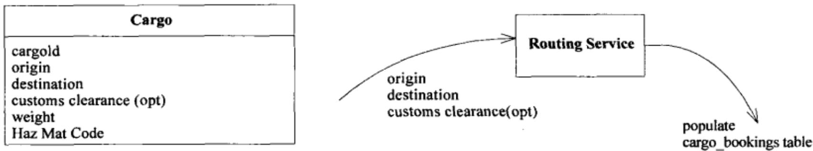


Database table: cargo_bookings 

<table><tr><td>Cargo_ID</td><td>Transport</td><td>Load</td><td>Unload</td></tr><tr><td></td><td></td><td></td><td></td></tr></table>


图2-1


用户：那么，当更改清关（customs clearance） $^{①}$ 地点时，需要重新制定整个路线计划啰。 

开发人员：是的。我们将从货运表（shipment table）中删除所有包含该货物id的行，然后将出发地、目的地和新的清关地点传递给Routing Service，它会重新填充表格。Cargo中必须有一个布尔值，用于指示货运表中是否有数据。 

用户：删除行？好，就按你说的做。但是，如果先前根本没有指定清关地点，也需要这么做吗？ 

开发人员：是的，无论何时更改了出发地、目的地或清关地点（或是第一次输入），都将检查是否已经有货运数据，如果有，则删除它们，然后由Routing Service重新生成数据。 

用户：当然，如果原有的清关数据碰巧是正确的，我们就不需要这样做了。 

开发人员：哦，没问题。Routing Service每次重新加载或卸载数据都很容易。 

用户：是的，但为新航线制定所有支持计划的工作量很大，因此我们一般不想更改路线，除非清关地点的更改要求必须更改路线。 

开发人员：哦，好的，当第一次输入清关地点时，我们需要查询表格，找到以前的清关地点，然后与新的清关地点进行比较，从而判断是否需要重新制定路线。 

用户：不必考虑出发地和目的地的变化，因为这样考虑的话总是需要更改航线。 

开发人员：好的，我明白了。 

## 场景 2：用领域模型进行讨论

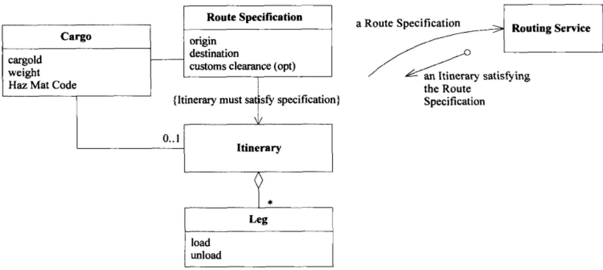


图2-2


用户：那么，当更改清关地点时，需要重新制定整个路线计划啰。 

开发人员：是的。当更改Route Specification（路线说明）的任意属性时，都将删除原有的Itinerary（航线），并要求Routing Service（路线服务）基于新的Route Specification生成一个新的Itinerary。 

用户：如果先前根本没有指定清关地点，也需要这么做吗？ 

开发人员：是的，无论何时更改了Route Spec的任何属性，都将重新生成Itinerary。这也包括第一次输入某些属性。 

用户：当然，如果原有的清关数据碰巧是正确的，我们就不需要这样做了。 

开发人员：哦，没问题。Routing Service每次重新生成一个Itinerary很容易。 

用户：是的，但为新航线制定所有支持计划的工作量很大，因此我们一般不想更改路线，除非清关地点的更改要求必须更改路线。 

开发人员：哦。那么需要在Route Specification添加一些功能。这样，当更改Route Specification中的属性时，查看Itinerary是否仍满足Specification。如果不满足，则需要由Routing Service重新生成Itinerary。 

用户：不必考虑出发地和目的地的变化，因为这样考虑的话总是需要更改Itinerary。 

开发人员：好的，但每次只做比较就简单多了。只有当不满足Route Specification时，才重新生成Itinerary。 

第二段对话表达了领域专家的更多意图。在这两段对话中，用户都使用了“itinerary”这个词，但在第二段中它是一个对象，这使得双方可以更准确、具体地进行讨论。他们明确讨论了“route specification”，而不是每次都通过属性和过程来描述它。 

这两段对话有意使用了相似的结构。实际上，第一段对话显得更啰嗦，这是由于对话双方需要不断对应用程序的特性和表达不清的地方进行解释。第二段对话使用了基于领域模型的术语，因此讨论更简洁。 

## 2.2 “大声地”建模

如果不把“讲话”与各种沟通方式配合起来使用，那么将是巨大的浪费，因为人类本身就有讲话的天赋。遗憾的是，当人们讲话时，一般并不使用领域模型的语言。 

可能开始时你并不认为上述论断是正确的，而且的确有例外情况。但下次你参加需求或设计讨论时，不妨认真听一下。你将听到人们用业务行话（或者是用外行人的语言）所做的业务描述。还会听到人们讨论技术工件和具体的功能。当然，你还会听到一些领域模型术语；人们共同使用的业务行话中的一些浅显易懂的名词在编码时通常被用作对象名称，因此这些词经常被人们提到。但你是否也稍稍听到一些对当前领域模型中的关系和交互所做的描述呢？ 

精化模型的最佳方式之一就是通过对话来研究，找出可能的模型变化，并试着大声说出对它们的多种构想。这样不完善的地方很容易被听出来。 

“如果我们向Routing Service提供出发地、目的地和到达时间，就可以查询货物的停靠地点，嗯……将它们存到数据库中。”（含糊且偏重于技术） 

“出发地、目的地……把它们都输入到Routing Service中，我们得到一个Itinerary，它包含我们所需的全部信息。”（更具体，但过于啰嗦） 

“Routing Service查找满足Route Specification的Itinerary。”（简洁） 

使用单词和短语是极为重要的，在建模时这可以增强我们的语言能力，就像画草图对于视觉和空间推理十分重要一样。我们利用分析能力进行系统性的分析和设计，并揭开代码的神秘面纱。这些思考方式互为补充，要想找到有用的模型和设计，需要将这些方式结合起来使用。在所有这些方式中，语言上的实验常常是最容易被忽视的（本书第三部分将深入探讨这种发现过程，并通过几段对话来显示它们之间的相互影响）。 

事实上，我们的大脑似乎很擅长处理口语的复杂性（在这个话题上，我也是一个门外汉，如 果读者也像我一样，可以参考Steven Pinker所著的The Language Instinct [Pinker 1994]来了解这种处理能力)。例如，当具有不同语言背景的人一起讨论商业问题时，如果他们没有一种公共语言，就会发明一种称为“混杂语”（pidgin）的公共语言。混杂语并不像讲话者的母语那样详尽，但它适合当前任务。当人们谈话时，自然会发现词语解释和意义上的差别，而且自然而然会解决这些差别。他们会发现这种语言中的晦涩之处并消除它们，从而使语言变得顺畅。 

上大学时，我曾经修过西班牙语速成课。课堂上规定不准讲英语。最初，感觉很别扭，而且需要很强的自制力。但最后我和同学们都达到了通过书面练习永远不可能达到的流利程度。 

当我们在讨论中使用领域模型的UBIQUITOUS LANGUAGE时，特别是在开发人员和领域专家一起仔细研究场景和需求的讨论中，UBIQUITOUS LANGUAGE的使用会越来越流利，而且我们还可以互相指点一些细微的差别。我们很自然地一起使用这种语言，而图和文档永远也无法实现这种效果。 

要想在软件项目上产生一种UBIQUITOUS LANGUAGE，说起来容易，做起来却难，我们必须充分利用自然赋予我们的才能来实现这个目标。正如人类的视觉和空间思维能力使我们能够通过图形快速传达和处理信息一样，我们也可以利用自然天赋来开发一种符合语法规则的、有意义的语言，从而推动模型的开发。 

因此，下面这段话可作为UBIQUITOUS LANGUAGE模式的补充： 

讨论系统时要结合模型。使用模型的元素以及模型中各元素之间的交互来大声描述场景，并且按照模型允许的方式将各种概念结合到一起。找到更简单的表达方式来讲出你要讲的话，然后将这些新的思想应用到图和代码中。 

## 2.3 一个团队，一种语言

技术人员通常认为业务专家最好不要接触领域模型，他们认为： 

“领域模型对他们来说太抽象了。” 

32 

“他们不理解对象。” 

“这样我们就不得不用他们的术语来收集需求。” 

上面只是列举了我从一个使用两种语言的团队中听到的少数几个原因。忘掉它们吧。 

当然，设计中有一些技术组件与领域专家无关，但模型的核心最好让他们参与。过于抽象？那你怎么知道抽象是否合理？你是否像他们一样深入地理解领域？有时，某些特定需求是从底层用户那里收集的，他们在描述这些需求时可能会用到一小部分更具体的术语，但领域专家能够更深入地思考他们所从事的领域。如果连经验丰富的领域专家都不能理解模型，那么模型一定是有问题的。 

最初，当用户刚开始讨论尚未建模的系统的未来功能时，他们没有模型可供使用。但当他们开始与开发人员一起仔细讨论这些新的思想时，探索共享模型的过程就开始了。最初的模型可能很笨拙且不完整，但会逐渐精化。随着新语言的演进，领域专家必须付出更多努力来适应它，并更新那些仍然很重要的旧文档。 

当领域专家使用这种LANGUAGE互相讨论，或者与开发人员进行讨论时，很快就会发现模型中哪些地方不符合他们的需要，甚至是错误的。由于基于模型的语言要求十分精确，因此领域专家（在开发人员的帮助下）也将发现他们的想法中的一些矛盾和含糊之处。 

开发人员和领域专家可以通过一步一步地使用模型对象来走查场景，从而对模型进行非正式的测试。每次讨论都是开发人员和专家一起使用模型的机会，在这个过程中，他们可以互相加深理解，并对概念进行精化。 

领域专家可以使用模式语言来编写用例，甚至可以直接利用模型来指定验收测试。 

有时，有人会反对使用模型语言来收集需求。这些人会说，难道需求不应该独立于实现它们的设计吗？这种观点忽视了所有语言都要基于某种模型这一事实。词的意义是一种难以掌握的东西。领域模型通常是从领域专家自己的行话中推导出来的，但已经经过了“清理”，以便具有更明确、更严密的定义。当然，如果这些定义与领域公认的意义有较大差别，领域专家应该反对。在敏捷过程中，需求是随着项目的前进而演变的，因为几乎不存在现成的知识可以完全确定一个适当的应用程序。用精化后的UBIQUITOUS LANGUAGE来重新组织需求应该是这种演变过程的一部分。 

33 

语言的多样性通常是必要的，但领域专家与开发人员之间不应该有语言上的分歧（第12章将讨论多个模型在同一个项目上共存的情况）。 

当然，开发人员确实会使用领域专家无法理解的一些技术术语。开发人员有很多用来讨论系统技术的行话。几乎可以肯定的是，用户也将有一些开发人员无法理解的、超出应用程序范围的专用行话。但这些是对语言的扩展，在反映独特模型的同一个领域中，他们使用的词汇应该是一致的。 

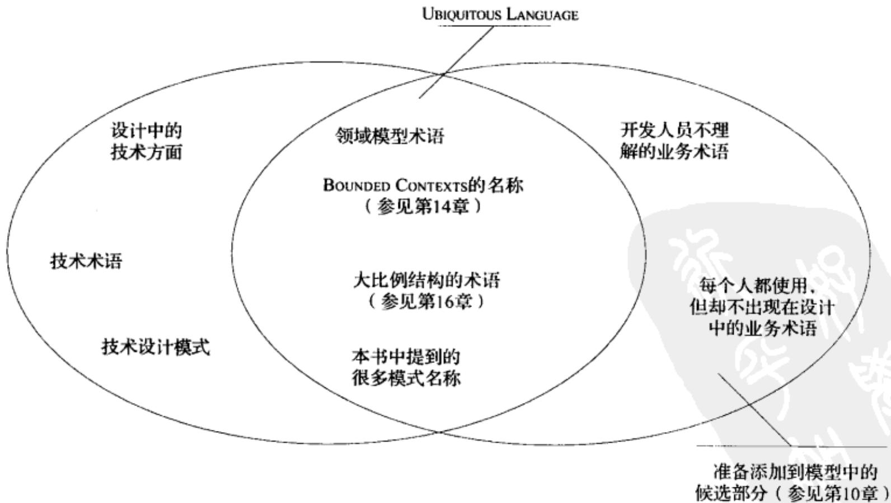


图2-3 行话的交集产生了UBIQUITOUS LANGUAGE


有了UBIQUITOUS LANGUAGE之后，开发人员之间的对话、领域专家之间的讨论以及代码本身的表达都基于同一种语言，都来自于一个共享的领域模型。 

## 2.4 文档和图

每当我参加讨论软件设计的会议时，如果不在白板或画板上画图，我就很难讨论下去。我画的大部分是UML图，其中又以类图和对象交互图为主。 

有些人天生习惯于直观一些的表现方法，图可以帮助人们掌握某些信息。UML图非常擅于表达对象之间的关系，尤其擅长显示对象交互。但它们不会给出这些对象的概念定义。在会议中，我在画图时会用语言来解释它们的意义，或者在与其他参与者讨论时进行解释。 

简单、非正式的UML图可以成为讨论的主题。以当前问题为中心，画3～5个对象，这样每个人都可以集中注意力。每个人都将看到同一个对象关系视图，更重要的是，都将使用相同的对象名称。这样口头讨论会更加高效。当人们尝试不同的想法时，可以对图进行修改，草图在某种程度上可以反映讨论的变化，这是讨论中真正重要的部分。毕竟，UML本质上是一种语言——统一建模语言。 

当人们必须要通过UML图表示整个模型或设计时，麻烦也随之而来。很多对象模型图在某些方面过于细致，同时在某些方面又有很多遗漏。说它们过于细致是因为人们认为必须将所有要编码的对象放到建模工具中。细节过多的结果是“只见树木，不见森林”。 

尽管存在所有这些细节，有关属性和关系的内容也只占到了对象模型的一半。这些对象的行为和约束并不容易表示出来。对象交互图可以演示设计中的一些复杂的要点，但却无法用这种方式来显示大部分交互，原因是工作量太大了，既有创建图的工作，也有读取图的工作。而且交互图只能暗示出模型的目的。要想把约束和断言包括进来，需要在UML图中使用文本，这些文本用括号括起来，插入到图中。 

操作名称可能会暗示出对象的行为职责，对象交互图（或序列图）中也会隐含地透露出这些职责，但不会明确地表述。因此，这项任务要靠补充文本或对话来完成。换言之，UML图无法传达模型的两个最重要的方面，一个方面是模型所表示的概念的意义，另一方面是对象应该做哪些事情。但是，这并不是大问题，因为仔细使用英语（或西班牙语或其他任何一种语言）就可以很好地完成这项任务。 

UML也不是一种十分令人满意的编程语言。我从未见过有人使用建模工具的代码生成功能实现了预期目的。如果仅仅使用UML功能来建模，得到的模型往往会遗漏最关键的部分，因为有些规则并不适合用线框图来表示。当然，代码生成器也无法使用上面所说的那些文本注释。如果一定要使用UML这样的绘图语言来编写可执行程序，那么UML图就会退化为程序本身的另一种视图，这样，“模型”的真正含义就丢失了。如果使用UML作为实现语言，则仍然需要利用其他手段来表达模型的确切含义。 

图是一种沟通和解释手段，它们可以促成头脑风暴活动。简洁的小图能够很好地实现这些目标，而整个对象模型的综合性的大图反而失去了沟通或解释能力，因为它们将读者淹没在大量细节中，使读者无法了解图的含义。鉴于此，我们应避免使用包罗万象的对象模型图，甚至不能使用包含所有细节的UML数据存储库。相反，应使用简化的图，图中只包含对象模型的重要概念部分，这些部分对于理解设计至关重要。本书中的图都是我在项目中使用过比较典型的图。它们很简单，而且具有很强的解释能力，在澄清一些要点时，还使用了一些非标准的符号。它们显示了设计约束，但它们不是面面俱到的设计规范。它们只是体现了思想的纲要。 

设计的重要细节应该在代码中体现出来。良好的实现应该是透明的，清楚地展示它的底层模型（下一章及本书其他许多章节的主题就是阐述如何做到这一点）。互为补充的图和文档能够引导人们将注意力放在核心要点上。自然的语言讨论可以消除语义上的细微差别。这就是为什么我喜欢把UML图的通常用法颠倒过来使用原因。通常的用法是以图为主，辅以文本注释。而我更愿意以文本为主，添加精心挑战的简化图作为注释。 

务必要记住模型不是图。图的目的是帮助表达和解释模型。代码可以充当设计细节的存储库。清晰的Java代码与UML具有同样的表达能力。经过仔细选择和构造的图可以帮助人们集中注意力，并起到指导作用，当然前提条件是不能强制完全用图来表示模型或设计，因为这样会削弱图的清晰表达的能力。 

## 2.4.1 书面设计文档

口头交流可以解释代码的含义，因此可作为代码精确性和细节的补充。但是，虽然口头讨论对于人们理解模型具有至关重要的意义，但书面文档也是必不可少的，任何规模的团队都需要它来提供稳定和共享的交流。但要想编写出能够帮助团队开发好的软件的书面文档却是一个不小的挑战。 

一旦文档变成持久形式，往往就会从项目进展流程中脱离出来。它会跟不上代码或项目语言的演变。 

书面文档有很多编写方法。本书第四部分将介绍几种满足特定需要的具体文档，但不会列出项目需要使用的所有文档的集合，而是给出两条用于评估文档的总体原则。 

## 文档应作为代码和口头交流的补充

每种敏捷过程在编写文档方面都有自己的原则。极限编程不主张使用过多的设计文档，而让代码解释它自己。实际运行的代码不会说谎，而其他文档则不然。运行代码所产生的行为是明确的。 

极限编程主要关注程序的活动元素以及可执行的测试。为代码添加的注释不会影响程序的行为，因此它们往往不会与活动代码及其驱动模型保持同步。同理，外部文档和图也不会影响程序的行为，因此它们也不会与代码同步。另一方面，口头交流和临时在白板上画图不会长久保留而产生混淆。完全依赖代码作为一种交流媒介可以促使开发人员保持代码的整洁和透明。 

但代码作为一种设计文档，自身也存在局限性。它可能会把读代码的人淹没在细节中。尽管代码的行为是非常明确的，但这并不意味着通过读代码就能显而易见地看出行为。而且行为的意 义可能更难表示。换言之，仅仅使用代码这一种文档形式与过度地使用UML图具有同样的基本问题。当然，团队进行大量的口头交流虽然能够为代码提供上下文和指导，但口头交流是短暂的，并且受到地理位置的限制。此外，开发人员并不是唯一一些需要理解模型的人。 

文档不应再重复表示代码已经明确表达出的内容。代码已经含有各个细节，它本身就是一种精确的程序行为说明。 

其他文档应该着重说明含义，以便使人们能够深入理解大比例结构，并将注意力集中在核心元素上。当编程语言无法直接明了地实现概念时，文档可以澄清设计意图。我们应该把书面文档作为代码和口头讨论的补充。 

## 文档应努力寻求生存之道并保持最新

我在为模型编写书面文档时，会仔细选择一个小的模型子集来画图，然后在图的周围用文字注释。我用文字定义类及其职责，并且像只有自然语言才能做到的那样把它们限定在一个语义上下文中。但图显示了在总结和简化概念并将其放入对象模型过程中所做的一些选择。这些图可以是临时性的，甚至是手绘的。手绘图的好处是节省工作量，并且人们一看就知道它们是临时的。这些优点都非常有利于交流，因为它们通常是模型思想的真实表示。 

设计文档的最大价值是解释模型的概念，帮助在代码的细节中指引方向，或许还可以帮助人们深入了解模型的使用风格。根据不同的团队思想，整个设计文档可能会十分简单，例如只是贴在墙上的一组草图，也可能会非常详尽。 

文档必须深入到各种项目活动中去。判断是否做到这一点的最简单方法，是观察文档与UBI-QUITOUS LANGUAGE之间的交互。文档是用人们（当前）在项目上讲的语言编写的吗？它是用嵌入到代码中的语言编写的吗？ 

注意听UBIQUITOUS LANGUAGE，观察它是如何变化的。如果设计文档中使用的术语不再出现在讨论和代码中，那么文档就失去了作用。或许是文档太大或太复杂了，或许是它没有突出一个十分重要的主题。人们不再阅读文档，或者对它失去了兴趣。如果文档对UBIQUITOUS LANGUAGE没有影响，那么一定是出问题了。 

相反，我们可能会听到UBIQUITOUS LANGUAGE发生了自然变化，而文档却相对滞后。这显然说明人们不再关心文档，或者认为它不重要而不去更新它。这时可以将它作为历史文件安全地归档，而继续使用这样的文档可能会产生混淆并损害项目。如果文档的角色不太重要，那么总是将它更新为最新状态将是劳动力的浪费。 

UBIQUITOUS LANGUAGE可以使其他文档（例如需求规格说明）更简洁和明确。当领域模型反映了与业务最相关的知识时，应用程序的需求成为该模型内部的场景，而UBIQUITOUS LANGUAGE可用于描述这样一个直接与MODEL-DRIVEN DESIGN有关的场景（参见第3章）。结果就是规格说明的编写更简单，因为它们不必传达模型背后隐含的业务知识。 

通过将文档减至最少，并且主要用它来补充代码和口头交流，就可以避免文档与项目脱节。 

根据UBIQUITOUS LANGUAGE及其演变来选择那些需要保持更新并与项目活动紧密交互的文档。 

## 2.4.2 完全依赖可执行代码的情况

现在我们来考查一下XP社区和其他一些人的选择，XP社区几乎完全依赖可执行代码和代码测试。本书主要讨论了如何通过MODEL-DRIVEN DESIGN使代码表达出设计的含义（参见第3章）。好的代码具有很强的表达能力，但它所传递的信息不能确保是准确的。一段代码所产生的实际行为是不会改变的。但是，方法名称可能会有歧义、会产生误导或者因为已经过时而无法表示方法的本质含义。测试中的断言是严格的，但变量和代码组织方式所表达出来的意思未必严格。好的编程风格会尽力使这种联系直接化，但这仍然主要靠开发人员的自律。只有严格地自律才能编写出“言行一致”的代码。 

消除歧义是声明式设计（参见第10章）这样的方法的最大优点，在这种设计中，程序元素的用途的陈述决定了它在程序中的实际行为。从UML生成程序的部分动机就来源于此，虽然目前看来这通常不会得到好的结果。 

尽管代码可能会产生误导，但它仍然比其他文档更基础。要想利用当前的标准技术使代码所传达的消息与它的行为和意图保持一致，要求有严格的设计规程和特定的思考方式（第三部分将详细讨论这些问题）。要有效地实现交流，代码必须基于在编写需求时所使用的同一种语言，也就是开发人员之间、开发人员与领域专家之间进行讨论时所使用的语言。 

## 2.5 解释性模型

本书的核心思想是在实现、设计和团队交流中使用同一个模型作为基础。如果各有各的模型，将会导致危险的后果。 

模型在帮助领域学习方面也具有很大价值。对设计起到推动作用的模型是领域的一个视图，但为了学习领域，还可以引入其他视图，这些视图只用作传递一般领域知识的教学工具。出于此目的，人们可以使用与软件设计无关的其他种类模型的那些图片或文字。 

使用其他模型的一个特殊原因是范围。驱动软件开发过程的技术模型必须经过严格的精简，以便用最小化的模型来实现其功能。而解释性模型则可以包含提供了上下文的那些领域方面，用于澄清范围上受到严格限制的技术模型。 

解释性模型提供了一定的自由度，可以专门为某个特殊主题定制一些表达力更强的风格。领域专家在一个领域中所使用的视觉隐喻通常呈现了更清晰的解释，这可以教给开发人员领域知识，同时使领域专家们的意见更一致。解释性模型还可以以一种不同的方式来呈现领域，各种不同角度的解释有助于人们更好地学习。 

解释性模型不必是对象模型，而且最好不是。实际上在这些模型中不使用UML是有好处的，这样可以避免人们错误地认为这些模型与软件设计是一致的。尽管解释性模型与驱动设计的模型往往有对应关系，但它们并不完全类似。为了避免混淆，每个人都必须知道它们之间的区别。 

## 示例 航运操作和路线

考虑一个用来跟踪某家航运公司货物的应用程序。模型包含一个详细的视图，它显示了如何将港口装卸（port operation）和货轮航次（vessel voyages）组合为一次货运的操作计划（“路线”）。如图2-4所示。但对外行而言，类图可能起不到多大的说明作用。 

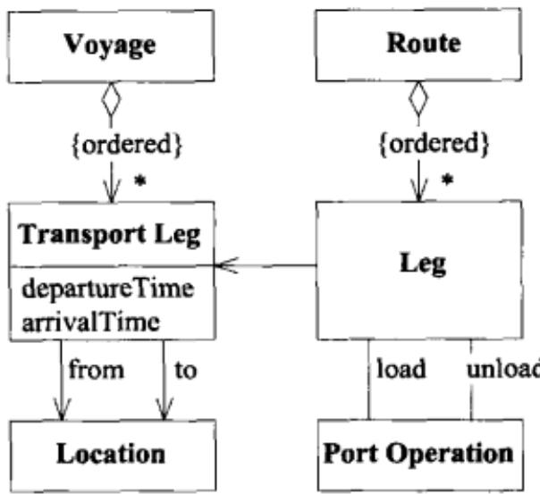


图2-4 航运路线的类图


在这种情况下，解释性模型可以帮助团队成员理解类图的实际含义。图2-5是表示相同概念的另一种方式。 

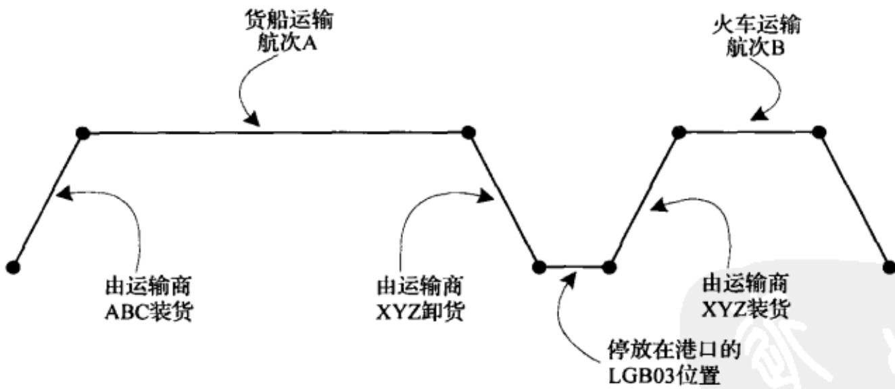


图2-5 航运路线的解释性模型


图中的每根线段都表示货物的一种状态——或者正在港口装卸（装货或卸货），或者停放在仓库里，或者正在运输途中。这个图并没有与类图中的细节一一对应，但强调了领域的要点。 

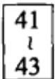


这种图连同对它所表示的模型的自然语言解释,能够帮助开发人员和领域专家理解更严格的软件模型图。把这两种图放在一起看要比单独看一种图更容易理解。 

# 绑定模型和实现

当我走进办公室，首先映入眼帘的是墙上那一大张打印出来的完整类图，它占据了一大面墙。这是我进入某个项目组的第一天，在这之前，聪明的项目组成员花费了几个月的时间进行了仔细的研究并且开发出了上面这幅详尽的领域模型。该模型中的对象一般都与三到四个其他对象有着复杂的关联，而这张关联网几乎是可以无限扩展的。在这方面，分析人员忠实地反映了领域自身的性质。 

尽管这张墙面大小的图让人吃不消，但是它所表现的模型确实抓住了一些知识点。经过一段时间的研究，我确实从中学到了不少知识（但是这种学习很难找到头绪，更像是在随意地浏览网页）。然而对类图的研究并不能让我深入地了解该应用程序的代码和设计，这让我备感困扰。 

当开发人员开始实现这个应用程序时，他们很快就发现，尽管分析人员说得头头是道，他们依然无法将这种错综复杂的关系转换成可存储、可检索的且具有事务完整性的单元。请注意，该项目使用的是对象数据库，也就是说开发人员根本不用考虑对象-关系表映射这种难题。该模型没有从根本上为应用程序的实现提供帮助。 

由于模型是“正确的”，是经过技术分析人员和业务专家反复讨论共同得到的结果，因此开发人员得出这样的结论：在这个应用程序中，无法把基于概念的对象作为设计的基础。于是他们开始进行专门针对程序开发的设计。他们的设计确实用到了一些模型中相同的类名称和数据存储属性，但是这种设计并不是建立在任何已有模型的基础上的。 

45 

这个项目建立了领域模型，但是如果它不能够直接指导正在进行的软件开发，那么这种纸上谈兵的模型又有什么意义呢？ 

几年后，在一个完全不同的项目中我又看到了完全相同的结果。该项目要用Java实现的新设计来替换之前的C++应用程序。老版本的程序根本没有进行对象建模，仅仅是把功能堆积在一起。这种老版本的设计（如果存在的话）就是在已有代码的基础上一个一个地堆积新功能，完全没有任何明显的泛化或者抽象。 

奇怪的是，这两种开发流程所完成的最终产品非常相似！它们都实现了系统功能，但是代码却很复杂，难于理解，所以难以维护。尽管有些程序实现是比较直观的，但是仅阅读代码依然无法深入了解该系统的目的所在。除了精心设计的数据结构之外，这两种开发流程都没有充分利用其开发环境中的对象范式。 

模型种类繁多，目的各有不同，即使是那些仅用于软件开发项目的模型也是如此。领域驱动设计要求模型不仅能够指导早期的分析工作，还应该成为设计的基础。这种设计方法对于代码的编写有着重要的暗示作用。不太明显的一点就是：领域驱动设计要求一种不同的建模方法…… 

## 3.1 模式：MODEL-DRIVEN DESIGN


过去用来计算星体位置的星盘 $^{①}$ 是天空模型的机械实现


## 中世纪的星象电脑

星盘是由古希腊的天文学家发明的；在中世纪，伊斯兰科学家又对它进行了改进。星盘上可旋转的铜环（又称“网环”）代表各恒星在天球上的位置。刻有当地地平坐标系的盘面是可换的，它代表的是不同纬度的星空景象。在星盘盘面上旋转网环，可以计算出全年任何时刻的天体位置。反过来，如果知道太阳或某个恒星的位置，也可以用星盘算出时间。星盘以机械化的方式实现了代表星空的面向对象模型。 

严格按照基础模型来编写代码，能够使代码更好地表达设计含义，并且使模型更符合设计。 

## * * *

那些压根儿就没有领域模型的项目，仅仅通过编写代码来实现一个又一个的功能，它们无法利用前两章所讨论的知识消化和沟通所带来的好处。如果涉及复杂的领域就会使项目举步维艰。 

另一方面，许多复杂的项目确实在尝试使用一些领域模型，但是并没有把代码的编写与模型 紧密联系起来。这些项目所设计的模型，在项目初期还可能用来做一些探索工作，但是随着项目的进展，这些模型与项目渐行渐远，甚至还会起到误导作用。所有在模型上花费的精力都无法保证程序设计的正确性，因为模型和设计是不同的。 

模型和程序设计的联系可能在很多情况下被破坏，但是二者的这种分离往往是有意而为之的。很多设计方法都提倡使用完全脱离于程序设计的分析模型，并且通常这二者是由不同的人员开发的。之所以称其为分析模型，是因为它是对业务领域进行分析的结果，它在组织业务领域中的概念时，完全不去考虑自己在软件系统中将会起到的作用。分析模型仅仅是理解工具，人们认为把它与程序实现联系在一起无异于搅浑一池清水。随后的程序设计与分析模型之间可能仅仅保持一种松散的对应关系。在创建分析模型时并没有考虑程序设计的问题，因此分析模型很有可能无法满足程序设计的需求。 

47 

在这种分析中会有一些知识消化的过程，但是在编码开始后大部分的领域知识被丢弃，开发人员不得不重新对设计进行抽象，这样就不能保证在新的程序设计中还能保留或者重现分析人员所获得的并且嵌入在模型中的领域知识。到了这一步，要维护程序设计和松散连接的模型之间的对应关系就很不合算了。 

纯粹的分析模型甚至无法实现理解领域这一主要目的，因为在程序设计和实现过程中总是会发现一些关键的知识点，而细节问题则会出人意料地层出不穷。前期模型可能会忽略一些重要的问题，却深入研究另一些不相关的问题，而且它对于其他问题的描述也可能对应用程序没有任何帮助。最后的结果就是，在编码工作开始后纯粹的分析模型被抛弃，大部分的模型都需要重新设计。即便是重新设计，如果开发人员认为分析与程序开发毫不相关，那么建模过程就不会那么规范。而如果项目经理也这么认为，那么开发团队可能没有足够的机会与领域专家进行交流。 

无论是什么原因，缺乏设计基础概念的软件充其量也只是一种机械化的产品，只实现有用的功能却无法解释操作的原因。 

如果整个程序设计或者其核心部分没有与领域模型相对应，那么这个模型就是没有价值的，软件的正确性也值得怀疑。同时，模型和设计功能之间太过复杂的对应关系也是难于理解的，在实际项目中改变设计时也无法维护这种关系。分析和设计工作全无关联，导致在这两个过程中所获得的知识无法彼此共享。 

分析工作一定要抓住领域内的基础概念，并且用易于理解和易于表达的方式描述出来。设计工作则需要指定一套可以由项目中使用的编程工具创建的组件，使项目可以在目标部署环境中高效运行，并且能够正确解决应用程序所遇到的问题。 

MODEL-DRIVEN DESIGN（模型驱动设计）不再将分析模型和程序设计分离开，而是寻求一种能够满足这两方面需求的单一模型。不考虑纯粹的技术问题，程序设计中的每个对象都反映了模型中所描述的相应概念。这就要求我们以更高的标准来选择模型，因为它必须同时实现两种完全不同的目标。 

有很多方法可以对领域进行抽象，也有很多种设计可以解决应用程序的问题。因此，绑定模型和程序设计是切实可行的。但是这种绑定不能够因为技术考虑而削弱分析的功能，我们也不能接受那些只反映了领域概念却舍弃了软件设计原则的拙劣设计。模型和设计的绑定需要的是在分析和程序设计阶段都能发挥良好作用的模型。如果模型对于程序的实现来说显得不太实用时，我们必须重新设计它。而如果模型无法忠实地描述领域的关键概念，也必须重新设计它。这样，建模和程序设计就结合为一个统一的迭代开发过程。 

将领域模型和程序设计紧密联系在一起绝对是必要的,这也使得在众多可选模型中选择最适用的模型时,又多了一条选择标准。它要求我们认真思考,并且通常会经过多次反复修改和重新构建的过程,但是通过这样的过程可以得到相应的模型。 

因此： 

软件系统各个部分的设计应该忠实地反映领域模型，以便体现出这二者之间的明确对应关系。我们应该反复检查并修改模型，在软件中更加自然地实现模型，即使想让它反映出更深层次的领域概念也应如此。我们需要的模型不但应该满足这两种需求，还应该能够支持健壮的UBIQUITOUS LANGUAGE。 

从模型中获取用于程序设计和基本任务分配的术语。程序代码就是模型的表达，修改代码可能就是改变模型。而模型的改变势必会影响到接下来相应的项目活动。 

完全依赖模型的实现通常需要支持建模范式的软件开发工具和语言，比如面向对象的编程。 

有时，不同的子系统会有不同的模型（参见第14章），但是在从需求分析到代码编写的整个开发过程中，软件系统的每一部分只能对应一个模型。 

单一模型能够减少出错的概率，因为程序设计直接来源于经过仔细考虑而创建的模型。程序设计，甚至是代码本身，都与模型密不可分。 

## * * *

要想创建出能够抓住主要问题并且帮助程序设计的单一模型并没有说的那么容易。我们不可能随手抓个模型就把它转化成可使用的设计。只有经过精心设计的模型才能促成切实可行的实现。想要使代码有效地描述模型就需要用到程序设计和实现的技巧（参见第二部分）。知识消化人员需要研究模型的各个选项，并将它们细化为实用的软件元素。软件开发于是就成了一个不断精化模型、设计和代码的统一的迭代过程（参见第三部分）。 

## 3.2 建模范式和工具支持

为了使MODEL-DRIVEN DESIGN发挥作用，一定要在可控范围内严格保证模型与设计之间的一致性。要实现这种严格的一致性，必须要运用由软件工具支持的建模范式，它可以直接模拟模型中的概念。 

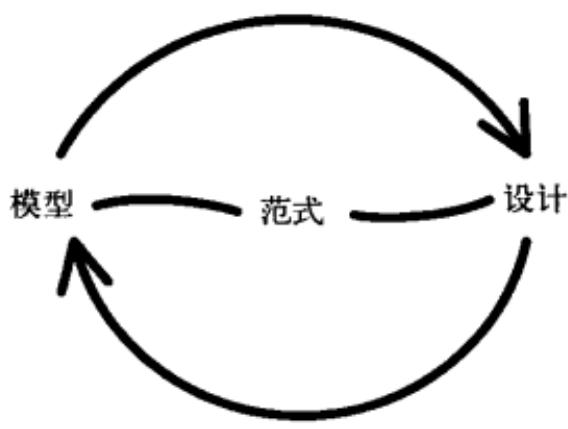


图3-1


面向对象编程之所以功能强大，是因为它基于建模范式，并且为模型构造提供了实现方式。如图3-1所示。从程序员的角度来看，对象真实存在于内存中，它们与其他对象相互联系，它们被组织成类，并且通过消息传递来完成相应的行为。尽管许多开发人员只是用对象的技术功能单纯地组织程序代码并且从中获益，但是对象设计的真正突破是用代码来描述模型中的概念。Java和许多其他编程语言都允许创建那些直接模拟概念对象模型的对象和关系。 

Prolog语言并不像面向对象语言那样被广泛使用，但是它却非常适合模型驱动设计。在MODEL-DRIVEN DESIGN中，建模范式是一种逻辑，而模型则是一组逻辑规则以及这些规则所依据的事实。 

像C这样的语言并不适用于MODEL-DRIVEN DESIGN，因为它是一种纯粹的过程语言，没有适用的建模范式。C这样的语言是过程化的，由程序员告诉电脑接下来要执行的一系列操作步骤。程序员也许会考虑到领域中的概念，但是程序本身仅仅是一组对数据进行的技术操作。最终程序可能是实用的，但是它并没有包含太多的意义。过程语言通常会支持复杂的数据类型，这些数据类型对应于领域中固有的概念，但是它们也只是被组织在一起的数据，并不能描述领域的活跃的方面。因此，用过程语言编写的软件具有复杂的函数，这些函数基于预先制定的执行路径连接在一起，而不是通过领域模型中的概念联系连接的。 

在我还没听说过面向对象编程的时候，我是通过编写Fortran程序来实现数学模型的，这也正是Fortran所擅长的领域。数学函数是这种模型中主要的概念组件，也是Fortran语言能够清晰描述的。即便如此，程序还是无法表达出函数之外的更高层次的意义。大部分非数学领域都不会用过程语言来支持MODEL-DRIVEN DESIGN，因为这些领域无法被抽象成数学函数或者过程中的操作步骤。 

51 

面向对象设计是目前大多数大型项目所使用的建模范式，也是本书中使用的主要方法。 

## 从过程设计到MODEL-DRIVEN DESIGN

第1章讲过，我们可以把PCB看作是连接各种电路元件引脚的电导体（称为net）的集合。电路板上通常都会有成千上万个net。有一种叫做PCB布局工具的专用软件，能够为所有net安排物 理布局，而不会使它们相互交叉或干扰。它的实现方法就是根据设计者规定的大量限制条件来限制布局方式以及优化路径选择。尽管PCB布局工具已经非常先进了，但是它仍然有一些缺陷。 

其中一个问题就是这些数以千计的net都各自拥有一套布局规则，PCB工程师认为根据net自身的性质可以将其分组，同组的net应该共用相同的规则。比如，有些net构成了总线。如图3-2所示。 

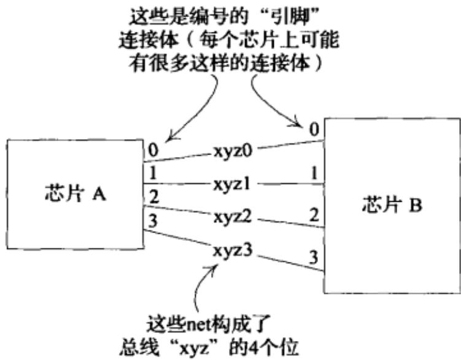


图3-2 net构成总线的示意图


工程师每次用8个、16个或者256个net组合成总线，这样布局工作就更易于管理了，不但提高了效率也减少了错误。问题是布局工具中没有类似于总线这样的概念。布局规则不得不应用于成千上万个net，每次处理一个net。 

## 机械设计

在布局工具的这种限制下，无计可施的工程师只能编写脚本来分析布局工具的数据文件，然后将规则直接插入到文件中，最后再把它们应用于整个总线。 

布局工具在net列表文件中存储每个电路接线，如下所示： 

```diff
Net Name Component.Pin
----
Xyz0 A.0, B.0
Xyz1 A.1, B.1
Xyz2 A.2, B.2
... 
```

而布线规则被存储在类似于下面格式的文件中： 

```txt
Net Name Rule Type Parameters
---- ---- ----
Xyz1 min_linewidth 5
Xyz1 max_delay 15
Xyz2 min_linewidth 5 
```

```txt
Xyz2 max_delay 15 
```

工程师为net制定严格的命名约定，这样将数据文件的内容按照字母排序，就可以使构成同一条总线的所有net都排列在一起。然后他们编写的脚本就可以解析该文件并且基于总线来修改每个net。用来解析、处理和写入文件的实际代码太过冗长晦涩，对解释这个例子没有什么帮助，所以我在下面只列出了这个处理过程中要执行的步骤。 

(1) 按照net名称将net列表文件排序； 

(2) 逐行读取文件，寻找以总线名称开头的第一行数据； 

(3) 解析名称匹配的每一行，获取每行中net的名称； 

(4) 将net名称和规则文本附加到规则文件的末尾； 

(5) 从第(3)步起重复执行，直到没有匹配该总线名称的行。 

53 

总线规则的输入文件采用如下的格式： 

<table><tr><td>Bus Name</td><td>Rule Type</td><td>Parameters</td></tr><tr><td>----</td><td>----</td><td>----</td></tr><tr><td>Xyz</td><td>max_vias</td><td>3</td></tr></table>

经过处理后，输出的是添加了net规则的文件，如下所示： 

<table><tr><td>Net Name</td><td>Rule Type</td><td>Parameters</td></tr><tr><td>...</td><td></td><td></td></tr><tr><td>Xyz0</td><td>max_vias</td><td>3</td></tr><tr><td>Xyz1</td><td>max_vias</td><td>3</td></tr><tr><td>Xyz2</td><td>max_vias</td><td>3</td></tr><tr><td>...</td><td></td><td></td></tr></table>

我猜想第一个编写这个脚本的人只有这种简单的需求，如果情况确实如此，那么使用这样的脚本是完全合理的。但实际上我们通常会用到许多脚本。当然，可以重新编写它们，共用排序及字符串匹配之类的函数，而且如果脚本语言支持通过函数调用来封装细节，那么这些脚本几乎可以像前面给出的几个步骤那样工作。但是它们依然只是对文件进行操作。虽然在使用不同的文件格式时，用net组合成总线并且给总线分配规则的概念是相同的，但是不同的文件格式（有若干种）却需要重新编写脚本。如果你想要实现更多的功能和交互，就得一一编写脚本。 

脚本的编写者试图在布局工具的领域模型中补充“总线”这个概念，他们的脚本通过排序和字符串匹配来判断总线的存在，却没有明确地定义总线概念。 

## MODEL—DRIVEN DESIGN

前面我们已经描述了领域专家思考问题时所使用的概念。现在需要将这些概念组织成模型，作为软件开发的基础。 

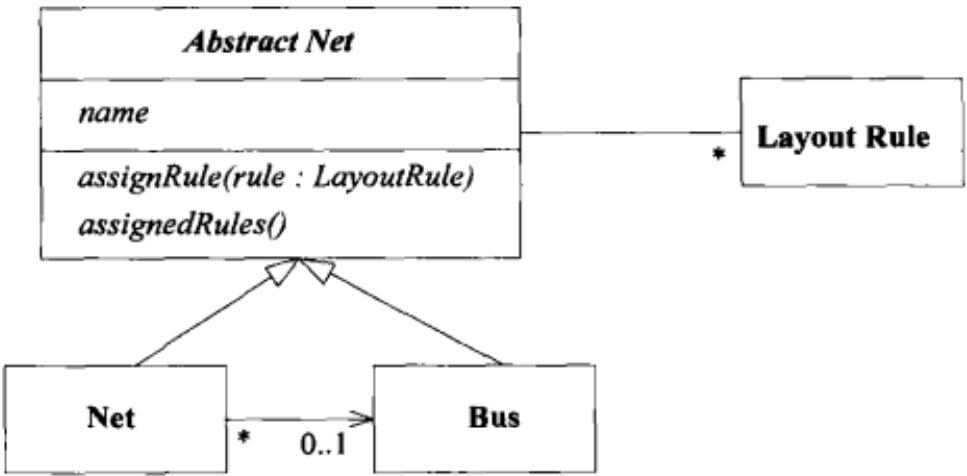


图3-3 用来高效指定布局规则的类图


用面向对象的语言实现上图的这些对象后，核心功能的实现会变得轻而易举。 

方法assignRule()可以在抽象类AbstractNet中实现。而类Net中的方法assignedRules()则分配了其自身的规则以及类Bus的规则。 

```txt
abstract class AbstractNet {
    private Set rules;

    void assignRule(LayoutRule rule) {
    rules.add(rule);
    }

    Set assignedRules() {
    return rules;
    }
}

class Net extends AbstractNet {
    private Bus bus;

    Set assignedRules() {
    Set result = new HashSet();
    result.addAll(super.assignedRules());
    result.addAll(bus.assignedRules());
    return result;
    }
} 
```

当然，程序还需要大量的支持代码，但上面的代码片段已经实现了脚本的基本功能。这个程序还需要输入/输出逻辑，我们可以将其概括为一些简单的服务。 

<table><tr><td>服务</td><td>职责</td></tr><tr><td>Net List import</td><td>读取Net列表文件,为每一行数据创建Net实例</td></tr><tr><td>Net Rule export</td><td>已知Net集合,将所有附加规则写入规则文件</td></tr></table>

我们还需要几个工具类： 

<table><tr><td>类</td><td>职责</td></tr><tr><td>Net Repository</td><td>提供通过名称访问Net的接口</td></tr><tr><td>Inferred Bus Factory</td><td>已知Net集合,利用命名约定来推断总线,并且创建总线实例</td></tr><tr><td>Bus Repository</td><td>提供通过名称访问Bus(总线)的接口</td></tr></table>

现在，启动应用程序，用输入数据来初始化Net和Bus仓库。 

```javascript
Collection nets = NetListImportService.read(aFile);
NetRepository.addAll(nets);
Collection buses = InferredBusFactory.groupIntoBuses(nets);
BusRepository.addAll(buses); 
```

上面提到的服务和仓库都可以进行单元测试。更重要的是还可以测试核心领域逻辑。下面是对最核心的行为进行的单元测试（采用了JUnit测试框架）： 

```txt
public void testBusRuleAssignment() {
    Net a0 = new Net("a0");
    Net a1 = new Net("a1");
    Bus a = new Bus("a"); //Bus is not conceptually dependent
    a.addNet(a0); //on name-based recognition, and so
    a.addNet(a1); //its tests should not be either. 
```

```javascript
NetRule minWidth4 = NetRule.create(MIN_WIDTH, 4);
a.assignRule(minWidth4); 
```

```txt
assertTrue(a0.assignedRules().contains(minWidth4));
assertEquals(minWidth4, a0.getRule(MIN_WIDTH));
assertEquals(minWidth4, a1.getRule(MIN_WIDTH)); 
```

程序应该有一个交互式的用户界面，可以列出所有总线，让用户逐个指定规则；或者可以向后兼容，从规则文件中读取规则。采用外观（façade）模式可以更容易访问任一用户界面，其实现可以由下面的代码来测试： 

```java
public void assignBusRule(String busName, String ruleType, double parameter) {
    Bus bus = BusRepository.getByName(busName);
    bus.assignRule(NetRule.create(ruleType, parameter));
} 
```

最后一行代码： 

```javascript
NetRuleExport.write(aFileName, NetRepository.allNets()); 
```

(这项服务调用每个Net的assignedRules()方法，然后将所有规则完全写入规则文件。) 

当然，如果只需要进行一次规则指定操作（就像这个例子一样），那么基于脚本的处理方式可能也同样实用。但实际上，通常会需要20个甚至更多的操作。MODEL-DRIVEN DESIGN易于扩展，能够为规则的组合设置限制条件，还能提供其他的一些增强功能。 

MODEL-DRIVEN DESIGN也为测试提供了方便。它的组件都具有定义完善的接口，可以进行单元测试。而测试脚本程序的唯一方法就是将输入/输出文件进行端到端的比较。 

记住，这样的设计不是一蹴而就的。我们需要反复研究领域知识，不断重构模型，才能将领域中重要的概念提炼成简单而清晰的模型。 

## 3.3 揭示主旨：为什么模型对用户至关重要

从理论上讲，也许你可以向用户展示任何一种系统视图，而不管底层如何实现。但实际上，系统上下层结构的不匹配轻则导致功能混乱，重则产生bug。这方面最简单的例子就是微软IE浏览器当前版本用模型的叠加来实现网站书签功能，这误导了很多用户 $^{①}$ 。 

IE浏览器用户会认为“收藏夹”是存储网站名称的列表，网站名称在不同的会话中是保持不变的。但是系统实现却将收藏夹当作一个包含URL的文件，并将文件名称存储在收藏夹列表中。这样做的问题是，如果网页标题含有对Windows系统文件名来说非法的字符，就会出现错误。假如用户想要收藏某页面并将其命名为：“Laziness: The Secret to Happiness（懒惰：幸福的秘密）”，就会弹出一个错误信息：“文件名不能包含下列任何字符：\/:*?"<>|”。用户会奇怪文件名是指什么。另一方面，如果网页标题已经包含非法字符，IE浏览器则会悄悄地把字符删除。这种数据丢失在这种情况下也许危害不大，但绝不是用户所期望的。在大多数应用中，程序悄悄地修改数据是用户无法接受的。 

MODEL-DRIVEN DESIGN要求只使用一个模型（在任何上下文中都是如此，第14章会讨论这一点）。大部分的设计建议和例子都只针对将分析模型和设计模型分离的问题，但是这里我们将涉及另外一对不同的模型：用户模型和设计/实现模型。 

当然，大多数情况下，没有经过处理的领域模型视图肯定不便于用户使用。但是在用户界面中出现与领域模型不同的“影像”将会使用户产生迷惑，除非这个“影像”完美无缺。如果网站收藏夹实际上只是快捷方式文件的集合，那么应该将这一事实告诉用户，还应该删除之前那个起误导作用的模型。这样不但能使收藏夹的功能更加清晰，用户还可以利用自己所知道的文件系统的知识来对网站收藏夹进行操作。比如，用户可以用资源管理器来重新组织已收藏的文件，而不是用浏览器内置的拙劣工具。而电脑高手还能够灵活地在文件系统的任何位置存储网页快捷方式。仅仅通过删除起误导作用的多余模型就可以让应用程序的功能更加强大且清晰。如果程序员 认为原有模型足够好，那么为什么还要让用户学习新模型呢？ 

此外，还有另外一种存储收藏文件的方式，比如将其存储在一个数据文件中，这样收藏文件就可以有自己的规则了。这些规则很可能是应用于网页的命名规则。这又是一种单独的模型。这个模型告诉用户所有关于网站的命名规则都适用于网站收藏夹。 

58 

如果程序设计基于一个能够反映出用户和领域专家所关心的基本问题的模型,那么与其他设计方式相比,这种设计可以将其含义更明确地展示给用户。让用户更了解模型,给他们更多的机会挖掘软件的潜能,也能使软件的行为合乎情理、前后一致。 

59 

## 3.4 模式：HANDS-ON MODELER

人们总是把软件开发比喻成制造业。通过这个比喻可以推断出一个结论：经验丰富的工程师做设计工作，而技能水平较低的劳动力负责组装产品。这种做法使许多项目陷入困境，原因很简单——在软件开发中设计是无处不在的。开发团队中的每个成员都有自己的职责，但是将分析、建模、设计和编程工作完全分离会对MODEL-DRIVEN DESIGN产生不良影响。 

我曾经在一个项目中负责协调不同的应用程序开发团队，帮助开发可以驱动程序设计的领域模型。但是管理层认为建模人员就应该只负责建模工作，编写代码就是在浪费这种技能，于是他们不准我编写代码或者与程序员讨论细节问题。 

开始项目进展的还算顺利。我和领域专家以及各团队的开发负责人共同工作，消化领域知识并提炼出了一个不错的核心模型。但是该模型却从来没有派上用场，原因有两个。 

其一，在将模型传递给开发人员的过程中，模型的一些意图并没有向他们说明。模型的整体效果受细节的影响很大（这将在第二和第三部分讨论），这些细节问题并不是总能在UML图或者一般讨论中遇到的。如果我能做好准备，直接与开发人员共同工作，提供一些参考代码和近距离的技术支持，那么他们也许能够理解模型中的抽象概念并据此进行开发。 

第二个原因是模型与程序实现及技术互相影响，而我无法直接获得这种反馈。例如，程序实现过程中发现模型的某部分在我们的技术平台上的工作效率极低，但是经过几个月的时间，我才一点一点获得了关于这个问题的全部信息。也许只需较少的改动就能解决这个问题，但是几个月过去了，改不改已经不重要了。因为开发人员已经自行编写出了可以运行的软件——完全脱离了模型的设计，在那些还在使用模型的地方，也仅仅是把它当作纯粹的数据结构。开发人员不分好坏地把模型全盘否定，但是他们又有什么办法呢？他们再也不愿意冒险任由呆在象牙塔里的架构师摆布了。 

与其他项目一样，这个项目的初始环境倾向于不让建模人员参与太多的程序实现。对于该项目所使用的大部分技术，我都有着大量的实践经验。在做建模工作之前，我甚至曾经在同类项目中领导过一个小的开发团队，所以我对项目开发过程和编程环境非常熟悉。但是如果不让建模人员参与程序实现，我就是有这些经历也无法有效地工作。 

如果编写代码的人员认为自己没必要对模型负责，或者不知道如何让模型为应用程序服务，那么这个模型就和程序没有任何关联。如果开发人员没有意识到改变代码就意味着改变模型，那么他们对程序的重构不但不会增强模型的作用，反而还会削弱它的效果。同样，如果建模人员不参与到程序实现的过程中，那么对程序实现的约束就没有切身的感受，即使有，也会很快忘记。MODEL-DRIVEN DESIGN的两个基本要素（即模型要支持有效的实现并抽象出关键的领域知识）已经失去了一个，因此最终模型将变得不再实用。最后一点，如果项目组的分工阻断了设计人员与开发人员之间的协作，使他们无法领悟MODEL-DRIVEN DESIGN的奥妙，那么经验丰富的设计人员则不能将自己的知识和技术传递给开发人员。 

HANDS-ON MODELER (建模人员参与程序开发) 并不意味着团队成员不能有自己的专业角色。包括极限编程在内的每一种敏捷过程都会给团队成员分配角色，其他非正式的专业角色也会自然而然地产生。但是如果把MODEL-DRIVEN DESIGN中密切相关的建模和实现这两个过程分离开，则会产生问题。 

整体设计的有效性有几个非常敏感的影响因素,那就是细粒度的设计和实现决策的质量和一致性。在MODEL-DRIVEN DESIGN中,代码是模型的表达,改变某段代码就改变了相应的模型。程序员就是建模人员,无论他们是否喜欢。所以在开始项目时,应该让程序员完成出色的建模工作。 

因此： 

任何参与建模的技术人员，不管在项目中的主要职责是什么，都必须花时间了解代码。任何负责修改代码的人员则必须学会用代码来表达模型。每一个开发人员都必须不同程度地参与模型讨论并且与领域专家保持联系。参与不同工作的人都必须有意识地通过UBIQUITOUS LANGUAGE与接触代码的人及时交换关于模型的想法。 

## * * *

将建模和编程过程完全分离是行不通的,然而大型项目依然需要技术负责人来协调高层的设计和建模,并帮助做出最困难或最关键的决策。本书的第四部分描述的就是这种决策,通过学习该部分内容可以激发灵感,找到更高效的方法来定义高级技术人员的角色和职责。 

MODEL-DRIVEN DESIGN利用模型来为应用程序解决问题。项目组通过知识消化将大量杂乱无章的信息提炼成实用的模型。而MODEL-DRIVEN DESIGN将模型和程序实现过程紧密结合。UBIQUITOUS LANGUAGE则成为开发人员、领域专家和软件产品之间传递信息的渠道。 

最终的软件产品能够在基本理解核心领域的基础上提供丰富的功能。 

如上所述，MODEL-DRIVEN DESIGN的成功离不开详尽的设计决策。在下面几章中我们将会讲述这方面的内容。 

## 第二部分 模型驱动设计的构造块

为了保证软件实现得简洁并且与模型保持一致，不管实际情况如何复杂，必须运用建模和设计的最佳实践。本书既不是一本介绍面向对象设计的书，也不是为了提出一些基本的设计原理。领域驱动设计改变了某些传统观念的侧重点。 

某些设计决策能够使模型和程序紧密结合在一起，互相提高对方的效率。这种结合要求我们注意每个元素的细节。对细节问题的精雕细刻能够打造出一个稳定的平台，开发人员可以在这个平台上运用第三部分和第四部分中要讲到的建模方法。 

本书中所讲的设计风格主要遵循“职责驱动设计”的原则，这个原则是在 [Wirfs-Brock et al. 1990] 中提出的，并在 [Wirfs-Brock 2003] 中进行了更新。同时本书也大量利用了 [Meyer 1988] 中所提出的“契约式设计”思想。它与其他被广泛采用的面向对象设计最佳实践有着基本相同的背景，这些最佳实践在[Larman 1998]等书中给出了描述。 

当项目遇到或大或小的困难时，开发人员可能会发现这些原则都无法适用于项目当前的状况。为了使领域驱动设计过程更灵活，开发人员需要理解上面这些众所周知的基本原理是如何支持MODEL-DRIVEN DESIGN的，这样才能在设计过程中做出一些折中选择，而又不脱离正确的轨道。 

下面三章的内容是按照“模式语言”（参见附录A）组织的，主要说明了细微的模型差别和设计决策是如何影响领域驱动设计过程的。 

下面的简图是一张导航图，它描述的是本部分所要讲解的模式以及这些模式彼此关联的方式。 

共用这些标准模式可以使设计有序进行，项目组成员也能够更方便地了解彼此的工作内容。同时，使用标准模式也使UBIQUITOUS LANGUAGE更加丰富，所有的项目组成员都可以使用UBIQUITOUS LANGUAGE来讨论模型和设计决策。 

开发一个好的领域模型是一门艺术。而模型中各个元素的实际设计和实现则相对系统化。将领域设计与软件系统中的其他关注点分离会使设计与模型之间的关系非常清晰。根据不同的特征来定义模型元素则会使元素的意义更加鲜明。对每个元素使用已验证的模式有助于创建出更易于实现的模型。 

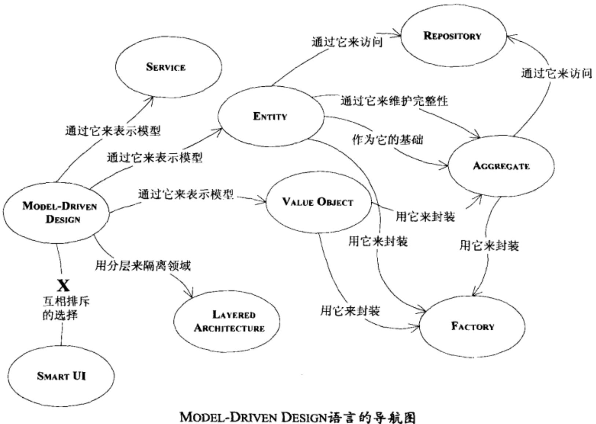


只有在充分考虑这些基本原理之后，精心设计的模型才能化繁为简，创建出项目组成员可以放心地进行组合使用的详细元素。 

在软件中，专门用于解决领域问题的那部分通常只占整个软件系统的很小一部分，这与其重要性远远不成比例。要想实现最佳的设计构思，就得去研究模型中的元素并且将它们视为一个系统。绝不能像在夜空中辨认星座一样，勉强把领域对象从许多对象中挑选出来。我们需要将领域对象与系统中的其他功能分离，这样就能够避免将领域概念和其他只与软件技术相关的概念相混淆，也不会把领域与整个软件系统混为一谈。 

分离领域的复杂技术早已出现，而且都是我们耳熟能详的，但是它对于能否成功运用领域建模原则起着非常关键的作用，所以我们要从领域驱动的视角对它进行简要的回顾。 

4.1 模式：LAYERED ARCHITECTURE 

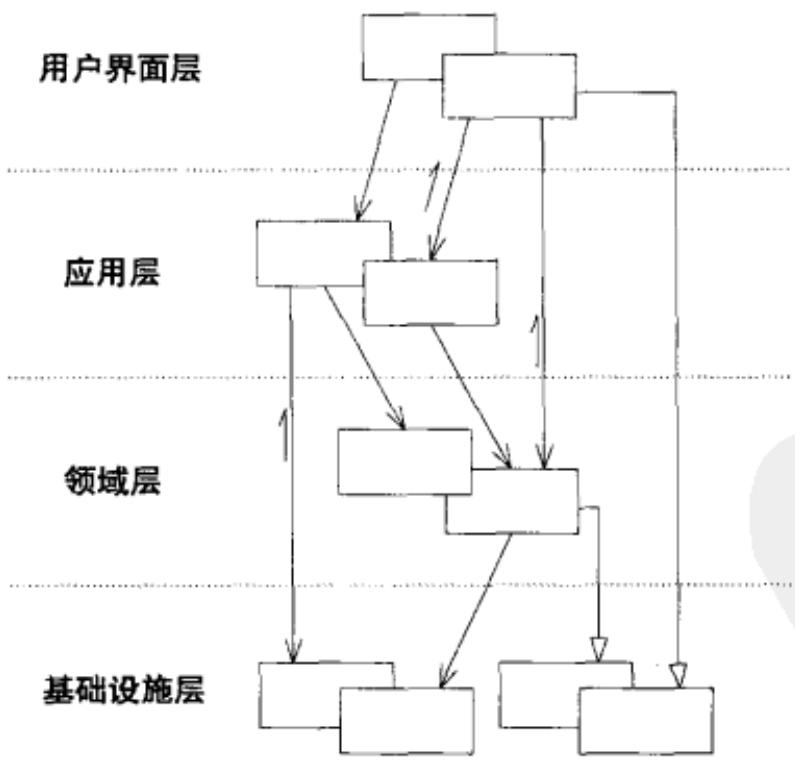


在一个运输应用程序中，要想支持从城市列表中选择运送货物目的地这样的简单用户行为，程序代码必须包括：(1) 在屏幕上绘制一个屏幕组件（widget）；(2) 查询数据库，调出所有可能的城市；(3) 解析并验证用户输入；(4) 将所选城市与货物关联；(5) 向数据库提交此次数据修改。上面所有的代码都在同一个程序中，但是只有一小部分代码与运输业务相关。 

软件程序需要通过设计和编码来执行许多不同类型的任务。它们接收用户输入，执行业务逻辑，访问数据库，进行网络通信，向用户显示信息，等等。因此程序中的每个功能都可能需要大量的代码来实现。 

在面向对象的程序中，常常会在业务对象中直接写入用户界面、数据库访问等支持代码。而一些额外的业务逻辑则会被嵌入到用户界面组件和数据库脚本的行为中。这么做是为了以最简单的方式在短期内完成开发工作。 

如果与领域有关的代码分散在大量的其他代码之中,那么查看和分析领域代码就会变得相当困难。对用户界面的简单修改实际上很可能会改变业务逻辑,而要想调整业务规则也很可能需要对用户界面代码、数据库操作代码或者其他的程序元素进行仔细的筛查。这样就不太可能实现一致的、模型驱动的对象了,同时也会给自动化测试带来困难。程序中每一个活动都有其自身的逻辑和适用的技术,因此程序本身必须简单明了,否则就会让人无法理解。 

要想创建出能够处理复杂任务的程序，需要把不同的关注点分开考虑，使设计中的每个部分都得到单独的关注。在分离的同时，也需要维持系统内部复杂的交互关系。 

分割软件系统有各种各样的方式，但是根据软件行业的经验和惯例，普遍采用LAYERED ARCHITECTURE（分层架构），特别是有几个层基本上已成了标准层。分层这种隐喻被广泛采用，大多数开发人员都对其有着直观的认识。许多文献对LAYERED ARCHITECTURE也进行了充分的讨论，有些是以模式的形式给出的（[Buschmann et al. 1996, pp.31-51]）。LAYERED ARCHITECTURE的基本原则是层中的任何元素都仅依赖于本层的其他元素或其下层的元素。向上的通信必须通过间接的传递机制进行，这些将在后面讨论。 

分层的价值在于每一层都只代表程序中的某一特定方面。这种限制使每个方面的设计都更具内聚性，更容易解释。当然，要分离出内聚设计中最重要的方面，选择恰当的分层方式是至关重要的。在这里，经验和惯例又一次为我们指明了方向。尽管LAYERED ARCHITECTURE的种类繁多，但是大多数成功的架构使用的都是包括下面这四个概念层的某个版本。 

<table><tr><td>用户界面层(或表示层)</td><td>负责向用户显示信息和解释用户指令。这里指的用户可以是另一个计算机系统,不一定是使用用户界面的人</td></tr><tr><td>应用层</td><td>定义软件要完成的任务,并且指挥表达领域概念的对象来解决问题。这一层所负责的工作对业务来说意义重大,也是与其他系统的应用层进行交互的必要渠道应用层要尽量简单,不包含业务规则或者知识,而只为下一层中的领域对象协调任务,分配工作,使它们互相协作。它没有反映业务情况的状态,但是却可以具有另外一种状态,为用户或程序显示某个任务的进度</td></tr><tr><td>领域层(或模型层)</td><td>负责表达业务概念,业务状态信息以及业务规则。尽管保存业务状态的技术细节是由基础设施层实现的,但是反映业务情况的状态是由本层控制并且使用的。领域层是业务软件的核心</td></tr><tr><td>基础设施层</td><td>为上面各层提供通用的技术能力:为应用层传递消息,为领域层提供持久化机制,为用户界面层绘制屏幕组件,等等。基础设施层还能够通过架构框架来支持四个层次间的交互模式</td></tr></table>

有些项目没有明显划分出用户界面层和应用层，而有些项目则有多个基础设施层。但是将领域层分离出来才是实现MODEL-DRIVEN DESIGN的关键。 

因此： 

给复杂的应用程序划分层次。在每一层内分别进行设计，使其具有内聚性并且只依赖于它的下层。采用标准的架构模式，只与上层进行松散连接。将所有与领域模型相关的代码放在一个层中，并把它与用户界面层、应用层以及基础设施层的代码分开。领域对象应该将重点放在如何表达领域模型上，而不需要考虑自己的显示和存储问题，也无需管理应用任务等内容。这使得模型的含义足够丰富，结构足够清晰，可以捕捉到基本的业务知识，并有效地使用这些知识。 

将领域层与基础设施层以及用户界面层分离，可以使每层的设计更加清晰。彼此独立的层更容易维护，因为它们往往以不同的速度发展并且满足不同的需求。层与层的分离也有助于在分布式系统中部署程序，不同的层可以灵活地放在不同服务器或者客户端中，这样可以减少通信开销，并优化程序性能（[Fowler 1996]）。 

## 示例 为网上银行功能分层

该应用程序能提供维护银行账户的各种功能。其中一个功能就是转账，用户可以输入或者选择两个账户号码，填写要转的金额，然后开始转账。 

为了让这个例子更容易实现，这里省略了一些主要的技术特性，特别是安全性能方面的一些特性。模型设计也尽量简化。（在现实生活中，网银的复杂性只会增加对LAYERED ARCHITECTURE的需求。）此外，这个例子中的基础设施只是为了使程序更简单和清楚一些而已——我并不建议你使用这个设计。简化后的功能所要完成的任务将会按照图4-1来分层。 

注意，负责处理基本业务规则的是领域层，而不是应用层——在这个例子中，业务规则就是“每笔贷款必须有与其数目相同的借款”。 

这个应用程序没有设定转账请求的发起方。程序中假定包含了用户输入界面，界面中有账户号码和转账金额的输入字段以及一些命令按钮。但是也可以用基于XML的电汇请求来替换，这并不会影响应用层及其下面的各层。这种解耦至关重要，这并不是因为在项目中经常需要用电汇请求来代替用户界面，而是因为关注点的清晰分离可以使每一层的设计更易理解和维护。 

事实上，图4-1本身也略微说明了不分离领域层会出现的问题。这张图需要包含从请求到事务控制的所有方面，所以不得不简化领域层来保证整个交互过程简单易懂。如果我们专注于研究独立领域层的设计，就可以构思并绘制出更好地表达领域规则的模型，也许模型中会包含分类账、贷款和借款对象，或者是现金交易对象。 

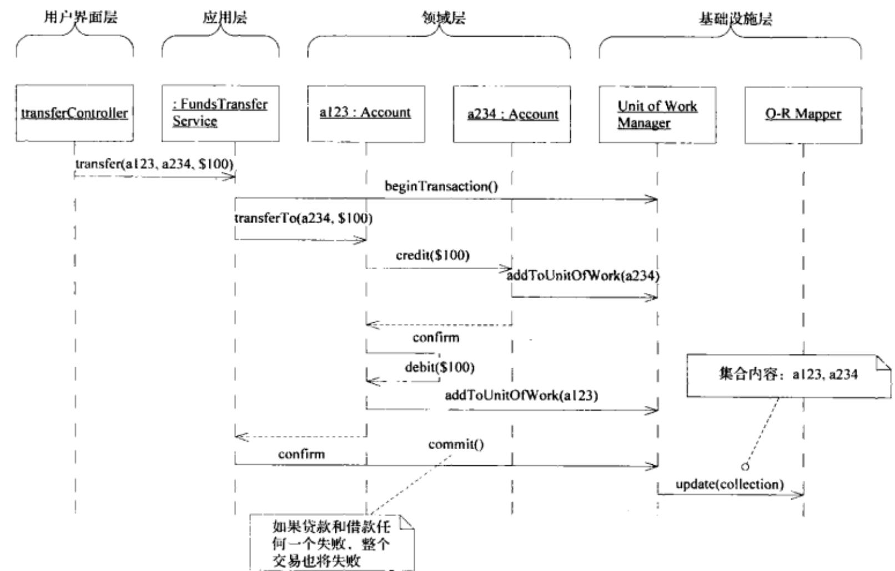


图4-1 对象所执行的任务与其所在层一致，并且与同层其他对象的联系更为紧密


## 4.1.1 将各层关联起来

到目前为止，我们的讨论主要集中在层次划分以及如何分层才能改进程序各个方面的设计上，特别是集中在领域层上。但是显然，各层之间也需要互相连接。在连接各层的同时不影响分离带来的好处，这是很多模式的目的所在。 

各层之间是松散连接的，层与层的依赖关系只能是单向的。上层可以直接使用或操作下层元素，方法是通过调用下层元素的公共接口，保持对下层元素的引用（至少是暂时的）以及采用常规的交互手段。而如果下层元素需要与上层元素进行通信（不只是回应直接查询），则需要采用另一种通信机制，使用架构模式来连接上下层，比如回调模式或OBSERVERS模式（[Gamma et al. 1995]）。 

最早将用户界面层与应用层和领域层相连的模式是MODEL-VIEW-CONTROLLER（MVC，模型-视图-控制器）框架。它是为Smalltalk语言发明的一种设计模式，创建于20世纪70年代。随后出现的许多用户界面架构都是受到它的启发而产生的。[Fowler (2002)]中讨论了这种模式以及几个实用的变体。[Larman (1998)]也在MODEL-VIEW SEPARATION模式中探讨了这些问题，他所提出的APPLICATION COORDINATOR（应用协调器）是连接应用层的一种方法。 

还有许多其他连接用户界面层和应用层的方式。对我们而言，只要连接方式能够维持领域层的独立性，保证在设计领域对象时不需要同时考虑可能与其交互的用户界面，那么这些连接方式 

就都是可用的。 

通常，基础设施层不会发起领域层中的操作，它处于领域层“之下”，不包含其所服务的领域中的知识。事实上这种技术能力最常以SERVICE的形式提供。例如，如果一个应用程序需要发送电子邮件，那么一些消息发送的接口可以放在基础设施层中，这样，应用层中的元素就可以请求发送消息了。这种解耦使程序的功能更加丰富。消息发送接口可以连接到电子邮件发送服务、传真发送服务或任何其他可用的服务。但是这种方式最主要的好处是简化了应用层，使其只专注于自己所负责的工作：知道何时该发送消息，而不用操心怎么发送。 


应用层和领域层可以调用基础设施层所提供的SERVICE。如果SERVICE的范围选择合理，接口设计完善，那么通过把详细行为封装到服务接口中，调用程序就可以保持与SERVICE的松散连接，并且不会那么复杂。 

73 

然而，并不是所有的基础设施都是以可供上层调用的SERVICE的形式出现的。有些技术组件被设计成直接支持其他层的基本功能(比如为所有的领域对象提供抽象基类)，并且提供关联机制(比如MVC及类似框架的实现)。这种“架构框架”对于程序其他部分的设计有着更大的影响。 

## 4.1.2 架构框架

如果基础设施通过接口调用SERVICE的形式来实现，那么如何分层以及如何保持层与层之间的松散连接就是相当显而易见的。但是有些技术问题要求更具侵入性的基础设施。整合了大量基础设施需求的框架通常会要求其他层以某种特定的方式实现，比如以框架类的子类形式或者带有结构化的方法签名。（子类在父类的上层似乎是违反常理的，但是要记住哪个类反映了另一个类的更多知识。）最好的架构框架既能解决复杂技术问题，也能让领域开发人员集中精力去表达模型，而不考虑其他问题。然而使用框架很容易为项目制造障碍：要么是设定了太多的假设，减小了领域设计的可选范围；要么是需要实现太多的东西，影响开发进度。 

项目中一般都需要某种形式的架构框架（尽管有时项目团队选择了不太合适的框架）。当使用框架时，项目团队应该明确其使用目的：建立一种可以表达领域模型的实现并且用它来解决重要问题。项目团队必须想方设法让框架满足这些需求，即使这意味着抛弃框架中的一些功能。例如，早期的J2EE应用程序通常都会将所有的领域对象实现为“实体bean”。这种实现方式不但影响程序性能，还会减慢开发速度。现在，取而代之的最佳实践是利用J2EE框架来实现大粒度对象，而用普通Java对象来实现大部分的业务逻辑。不妄求万全之策，而是有选择性地运用框架来解决难点问题，就可以避开框架的很多不足之处。明智而审慎地选择框架中最具价值的功能能够减少程序实现和框架之间的耦合，使随后的设计决策更加灵活。更重要的是，现在许多框架的用法都极其复杂，这种简化方式有助于保持业务对象的可读性，使其更富有表达力。 

架构框架和其他工具都在不断的发展。在新出现的框架中，越来越多的技术问题会自动得到解决或者被预先设定好解决方案。如果框架使用得当，那么程序开发人员将可以更加专注于核心业务问题的建模工作，这会大大提高开发效率和程序质量。但与此同时，我们必须要保持克制， 不要总是想着要寻找框架，因为精细的框架也可能会束缚住程序开发人员。 

## 4.2 模型属于领域层

现在，大部分软件系统都采用了LAYERED ARCHITECTURE，只是采用的分层方案存在不同而已。许多类型的开发工作都能从分层中受益。然而，领域驱动设计只需要一个特定的层存在即可。 

领域模型是一系列概念的集合。“领域层”则是领域模型以及所有与其直接相关的设计元素的表现，它由业务逻辑的设计和实现组成。在MODEL-DRIVEN DESIGN中，领域层的软件构造反映出了模型概念。 

如果领域逻辑与程序中的其他关注点混在一起。就不可能实现这种一致性。将领域实现独立
75 出来是领域驱动设计的前提。 

## 4.3 模式：THE SMART UI “ANTI-PATTERN”

上面总结了面向对象程序中广泛采用的LAYERED ARCHITECTURE模式。在项目中，人们经常会尝试分离用户界面、应用和领域，但是成功的分离却不多见，这种负面作用本身很值得讨论。 

许多软件项目都采用并且应该保持一种不那么复杂的设计方法，我称其为SMART UI（智能用户界面）。但是SMART UI是另一种设计方法，与领域驱动设计方法迥然不同且互不兼容。如果你选择了SMART UI，那么本书中所讲的大部分内容都不适合你。我感兴趣的是那些无法应用SMART UI的情况，这也是我半开玩笑地称其为“反模式”的原因。本节讨论SMART UI是为了与领域驱动模式进行对比，并帮助我们认清在本书后面章节中的哪些情况下需要选择相对而言更难于实现的领域驱动设计模式。 

## * * *

假设一个项目只需要提供简单的功能，以数据输入和显示为主，涉及业务规则很少。项目团队也没有高级对象建模师。 

如果一个经验并不丰富的项目团队要完成一个简单的项目，却决定使用MODEL-DRIVEN DESIGN以及LAYERED ARCHITECTURE，那么这个项目组将会经历一个艰难的学习过程。团队成员不得不去掌握复杂的新技术，艰难地学习对象建模。（即使有这本书的帮助，这也依然是一个具有挑战性的任务！）对基础设施和各层的管理工作使得原本简单的任务却要花费很长的时间来完成。简单项目的开发周期较短，期望值也不是很高。所以，早在项目团队完成任务之前，该项目就会被取消，更谈不上去论证有关这种方法的许多种令人激动的可行性了。 

即使项目有更充裕的时间，如果没有专家的帮助，团队成员也不太可能掌握这些技术。最后，假如他们确实能够克服这些困难，恐怕也只会开发出一套简单的系统。因为这个项目本来就不需要丰富的功能。 

经验丰富的团队则不会做出这样的选择。身经百战的开发人员能够更容易学习，进而减少管理各层所需要的时间。领域驱动设计只有应用在大型项目上才能产生最大的收益，而这也确实需 要高超的技巧。不是所有的项目都是大型项目；也不是所有的项目团队都能掌握那些技巧。 

因此，当情况需要时： 

在用户界面中实现所有的业务逻辑。将应用程序分成小的功能模块，分别将它们实现成用户界面，并在其中嵌入业务规则。用关系数据库作为共享的数据存储库。使用自动化程度最高的用户界面创建工具和可用的可视化编程工具。 

这是一种有争议的观点。设计原则（所有地方，包括本书其他地方，都在倡导的原则）应该是领域和UI彼此独立。事实上，不将领域和用户界面分离，则很难运用本书后面所要讨论的方法，因此在领域驱动设计中，可以将SMART UI看作是“反模式”。然而在其他情况下，它也是完全可行的。其实，SMART UI也有其自身的优势，在某些情况下它能发挥最佳的作用——这也是它如此普及的原因之一。在这里介绍SMART UI能够帮助我们理解为什么需要将应用程序与领域分离，而且更重要的是，还能让我们知道什么时候不需要这样做。 

优点 

☐ 效率高，能在短时间内实现简单的应用程序。 

☐ 能力较差的开发人员可以几乎不经过培训就采用它。 

□ 甚至可以克服需求分析上的不足，只要把原型发布给用户，然后根据用户反馈快速修改软件产品即可。 

□程序之间彼此独立，这样，可以相对准确地安排小模块交付的日期。额外扩展简单的功能也很容易。 

□ 可以很顺利地使用关系数据库，能够提供数据级的整合。 

□ 可以使用第四代语言工具。 

□ 移交应用程序后，维护程序员可以迅速重写他们不明白的代码段，因为修改代码只会影响到代码所在的用户界面。 

77 

## 缺点

□ 不通过数据库很难集成应用模块。 

□没有对行为的重用，也没有对业务问题的抽象。在每一次用到业务规则的操作时，都必须重写规则。 

□ 快速的原型建立和迭代都有自然的局限性，因为抽象的缺乏限制了重构的选择。 

□ 复杂的功能很快会让你无所适从，所以程序的扩展只能是增加简单的应用模块，没有很好的办法来实现更丰富的功能。 

如果项目团队有意识地应用这个模式，那么就可以避免其他方法所需要的大量开销。项目团队常犯的错误是采用了一种复杂的设计方法，却无法保证项目从头到尾始终使用它。另一种常见的也是代价高昂的错误则是为项目构建一种复杂的基础设施，并使用顶级的工具，而这样的项目根本不需要它们。 

大部分灵活的编程语言（比如Java）对于小型应用程序来说是大材小用了，并且使用它们的 

开销很大。第四代语言风格的工具就足以满足这种需要了。 

记住，在项目中使用智能用户界面后，除非重写全部的应用模块，否则不能改用其他的设计方法。使用诸如Java这类的通用语言并不能让你在随后的开发过程中放弃使用SMART UI，因此，如果你选择了这条路线，就应该采用与之匹配的开发工具。不要浪费时间去同时采用多种选择。只使用灵活的编程语言并不一定会创建出灵活的软件系统，反而有可能会开发出一个维护代价十分高昂的系统。 

同样道理，采用MODEL-DRIVEN DESIGN的项目团队从项目初始就应该采用模型驱动的设计。当然，即使是经验丰富的项目团队在开发大型软件系统时，也不得不从简单的功能着手，然后在整个开发过程中使用连续的迭代开发。但是最初试探性的工作也应该是由模型驱动的，而且要分离出独立的领域层，否则很有可能项目进行到最后就变成智能用户界面模式了。 

78 

## * * *

这里讨论SMART UI只是为了让你认清为什么以及何时需要采用诸如LAYERED ARCHITECTURE这样的模式来分离出领域层。 

除了SMART UI和LAYERED ARCHITECTURE以外，还有一些其他的设计方案。比如，[Fowler (2002)]中描述的TRANSACTION SCRIDT（事务脚本），它将用户界面从应用中分离出来，但是却并不提供对象模型。总而言之：如果一个架构能够把那些与领域相关的代码隔离出来，得到一个内聚的领域设计，同时又使领域与系统其他部分保持松散连接，那么这种架构也许可以支持领域驱动设计。 

其他的开发风格也有各自的用武之地，但是必须要考虑到各种对于复杂度和灵活性的限制。在某些条件下，将领域设计与其他部分混在一起会产生灾难性的后果。如果你要开发复杂应用软件并且决定使用MODEL-DRIVEN DESIGN，那么做好准备，咬紧牙关，雇用必不可少的专家，并且不要使用SMART UI。 

## 4.4 其他分离方式

遗憾的是，除了基础设施和用户界面之外，还有一些其他的因素也会破坏你精心设计的领域模型。你必须要考虑那些没有完全集成到模型中的领域元素。你不得不与同一领域中使用不同模型的其他开发团队合作。还有其他的因素会让你的模型结构不再清晰，并且影响模型的使用效率。在第14章中，会讨论这方面的问题，同时会介绍一些其他的设计模式，比如BOUNDED CONTEXT 和ANTICORRUPTION LAYER。非常复杂的领域模型本身是难以使用的，所以，第15章将会说明如何在领域层中从次要细节中提取出领域的基本概念。 

但是，这些都是后话。接下来，我们将会讨论一些具体细节，即如何让一个有效的领域模型和一个富有表达力的实现同时演进。毕竟，把领域隔离出来的最大好处就是可以真正专注于领域设计，而不用考虑其他的方面。 

# 软件中所表示的模型

要想在不削弱模型驱动设计的能力的前提下对实现做出一些折中，需要重新组织基本元素。我们需要将模型与实现的各个细节一一联系起来。本章主要讨论这些基本的模型元素并理解它们，以便为后面章节的讨论打好基础。 

本章的讨论从如何设计和简化关联开始。对象之间的关联很容易想出来，也很容易画出来，但实现它们却存在很多潜在的麻烦。关联也表明了详细的实现决策在MODEL-DRIVEN DESIGN中的重要性。 

本章的讨论将侧重于模型本身，但仍继续仔细考查详细的模型选择与实现问题之间的关系，我们将着重区分用于表示模型元素的三种模式：ENTITY、VALUE OBJECT和SERVICE。 

从表面上看，定义那些用来捕获领域概念的对象很容易，但要想理解其含义却很困难。这要求我们明确区分各种模型元素的含义，并与一系列设计实践结合起来，从而开发出特定类型的对象。 

一个对象是用来表示某种具有连续性和标识的事物的呢（可以跟踪它所经历的不同状态，甚至可以跨不同的实现跟踪它），还是用于描述某个事物的某种状态的属性呢？这是ENTITY与VALUE OBJECT之间的根本区别。明确地选择这两种模式中的一个来定义对象，有利于减少歧义，并帮助我们做出特定的选择，这样才能得到健壮的设计。 

领域中还有一些方面适合用动作或操作来表示，这比用对象表示更加清楚。这些方面最好用SERVICE来表示，而不应把操作的责任强加到ENTITY或VALUE OBJECT上，尽管这样做稍微违背了面向对象的建模传统。SERVICE是应客户端请求来完成某事。在软件的技术层中有很多SERVICE。在领域中也可以使用SERVICE，当对软件必须实现的某项无状态的活动进行建模时，就可以将该活动作为一项SERVICE。 

在有些情况下（例如为了将它存储在关系数据库中），我们不得不把对象模型做一些折中改变，虽然这会影响它的纯度。本章将给出一些指导原则，以便在被迫处理这种复杂局面时保持正确的方向。 

最后，MODULE的讨论将有助于理解这样一个要点——每个设计决策都应该是在深入理解领域中的某些深层知识之后做出的。高内聚、低耦合这种思想（通常被认为是一种技术标准）可应用于概念本身。在MODEL-DRIVEN DESIGN中，MODULE是模型的一部分，它们应该反映领域中的 

概念。 

本章将所有这些体现软件模型的构造块组织到一起。这些都是一些传统思想，而且一些书籍中已经介绍过从中产生的建模和设计思想。但将这些思想组织到模型驱动开发的上下文中，可以帮助开发人员创建符合领域驱动设计主要原则的详细组件，从而有助于解决更大的模型和设计问题。此外，掌握这些基本原则可以帮助开发人员在被迫做出折中设计时把握好正确的方向。 

## 5.1 关联

对象之间的关联使得建模与实现之间的交互更为复杂。 

82 

对于模型中每个可遍历的关联，在软件中都有一个具有同样属性的机制。 

一个显示了顾客与销售代表之间关联的模型有两个含义。一方面，它把开发人员所认为的两个真实的人之间的关系抽象出来。另一方面，它相当于两个Java对象之间的对象指针，或者相当于数据库查询（或类似实现）的一种封装。 

例如，一对多关联在实例变量中可以用一个集合来实现。但设计不一定要这样直接。可能没有集合，这时可以使用一种访问方法（accessor method）来查询数据库，找到相应的记录，并用这些记录来实例化对象。这两种设计方法反映了同一个模型。在设计中必须指定一种特殊的遍历机制，这种遍历的行为应该与模型中的关联一致。 

现实生活中有大量“多对多”关联，其中有很多关联自然而然是双向的。我们在模型开发的早期进行头脑风暴活动并探索领域时，也会得到很多这样的关联。但这些普遍的关联会使实现和维护变得很复杂。此外，它们也很少能表示出关系的本质。 

至少有三种方法可以使得关联更易于控制。 

(1) 规定一个遍历方向。 

(2) 添加一个限定符，以便有效地减少多重关联。 

(3) 消除不必要的关联。 

尽可能地对关系进行约束是非常重要的。双向关联意味着只有将这两个对象放在一起考虑才能理解它们。当应用程序不要求双向遍历时，可以指定一个遍历方向，以便减少相互依赖性，并简化设计。理解了领域之后就可以自然地确定一个方向。 

像很多国家一样，美国有过很多位总统。这是一种双向的、一对多的关系。然而，在提到“乔治·华盛顿”这个名字时，我们很少会问“他是哪个国家的总统？”。从实用的角度讲，我们可以将这种关系简化为从国家到总统的单向关联。如图5-1所示。这种精化实际上反映了对领域的深入理解，而且也是一个更实用的设计。它表明一个方向的关联比另一个方向的关联更有意义且更重要。也使得Person类独立于基础概念President。 

通常，通过更深入的理解可以得到一个“限定的”关系。进一步研究总统的例子就可以知道，一个国家在一段时期内只能有一位总统（内战期间或许有例外）。这个限定条件把多重关系简化为一对一关系，并且在模型中植入了一条明确的规则。如图5-2所示。1790年谁是美国总统？乔治·华盛顿。 

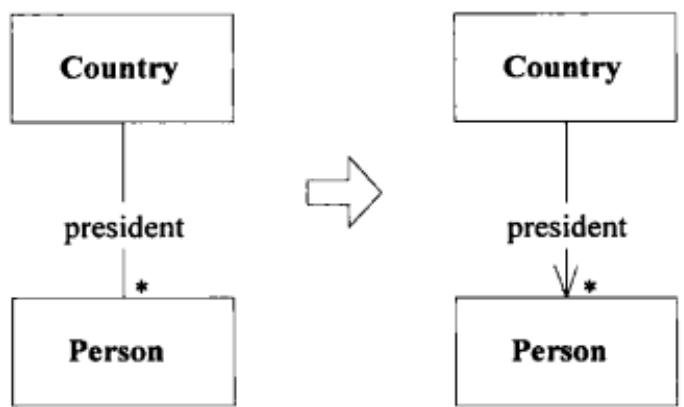


图5-1 反映了领域中自然偏向的一些遍历方向


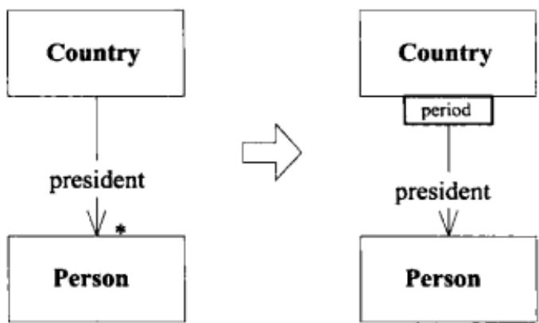


图5-2 被约束的关联可以传达更多知识，而且是更实用的设计


限定多对多关联的遍历方向可以有效地将其实现简化为一对多关联,从而得到一个简单得多的设计。 

坚持将关联限定为领域中所偏向的方向，不仅可以提高这些关联的表达力并简化其实现，而且还可以突出剩下的双向关联的重要性。当双向关联是领域的一个语义特征时，或者当应用程序的功能要求双向关联时，就需要保留它，以便表达出这些需求。 

当然，最终的简化是清除那些对当前工作或模型对象的基本含义来说不重要的关联。 

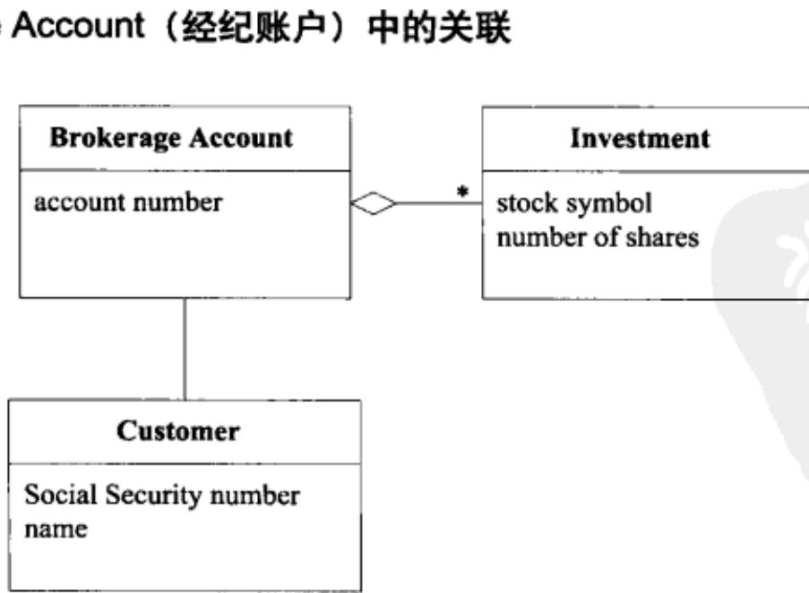


图5-3


此模型中的Brokerage Account的一个Java实现如下： 

```java
public class BrokerageAccount {
    String accountNumber;
    Customer customer;
    Set investments;
    // Constructors, etc. omitted

    public Customer getCustomer() {
    return customer;
    }

    public Set getInvestments() {
    return investments;
    }
} 
```

但是，如果需要从关系数据库取回数据，那么就可以使用另一种实现（它同样也符合模型）： 

Table: BROKERAGE_ACCOUNT 

<table><tr><td>ACCOUNT_NUMBER</td><td>CUSTOMER_SS_NUMBER</td></tr><tr><td></td><td></td></tr><tr><td></td><td></td></tr></table>

## Table: CUSTOMER

```txt
SS_NUMBER NAME   
---   
--- 
```

Table: INVESTMENT 

<table><tr><td>ACCOUNT_NUMBER</td><td>STOCK_SYMBOL</td><td>AMOUNT</td></tr><tr><td></td><td></td><td></td></tr><tr><td></td><td></td><td></td></tr></table>

```java
public class BrokerageAccount {
    String accountNumber;
    String customerSocialSecurityNumber; 
```

```txt
// Omit constructors, etc. 
```

```java
public Customer getCustomer() {
    String sqlQuery =
    "SELECT * FROM CUSTOMER WHERE" +
    "SS_NUMBER=''+customerSocialSecurityNumber+'''';
    return QueryService.findSingleCustomerFor(sqlQuery);
}
public Set getInvestments() { 
```

```txt
String sqlQuery =
    "SELECT * FROM INVESTMENT WHERE" +
    "BROKERAGE_ACCOUNT=' "+accountNumber+" ' ";
return QueryService.findInvestmentsFor(sqlQuery);
} 
```

（注意：QueryService是一个实用类，它从数据库中取回行（row）并创建对象，这里使用它是为了简单地解释这个示例，但它在实际项目中不一定是一个好的设计。） 

下面，我们通过限定Brokerage Account（经纪账户）与Investment（投资）之间的关联来简化其多重性，从而对模型进行精化。具体的限定是：每支股票只能对应于一笔投资，如图5-4所示。 

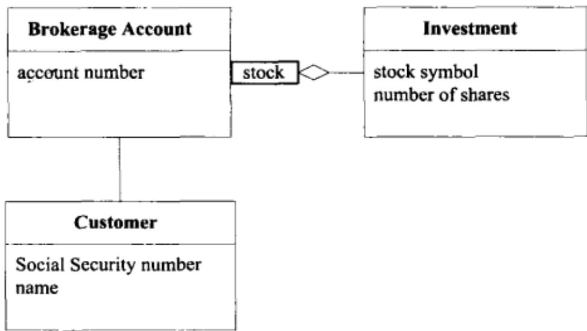


图5-4


这种简化并不适合所有的业务情形（例如，当需要同时跟踪多笔投资的时候），但不管是什么特殊规则，只要发现了关联的约束，就应该将这些约束添加到模型和实现中。它们可以使模型更精确，使实现更易于维护。 

现在，Java实现变成下面这样： 

```java
public class BrokerageAccount {
    String accountNumber;
    Customer customer;
    Map investments;

    // Omitting constructors, etc.

    public Customer getCustomer() {
    return customer;
    }

    public Investment getInvestment(String stockSymbol) {
    return (Investment) investments.get(stockSymbol);
    } 
```

```groovy
}
基于SQL的实现如下：
public class BrokerageAccount {
    String accountNumber;
    String customerSocialSecurityNumber;

    //Omitting constructors, etc.

    public Customer getCustomer() {
    String sqlQuery = "SELECT * FROM CUSTOMER WHERE SS_NUMBER='"
    + customerSocialSecurityNumber + "'";
    return QueryService.findSingleCustomerFor(sqlQuery);
    }

    public Investment getInvestment(String stockSymbol) {
    String sqlQuery = "SELECT * FROM INVESTMENT "
    + "WHERE BROKERAGE_ACCOUNT=' ' + accountNumber + "'"
    + "AND STOCK_SYMBOL=' ' + stockSymbol + "'";
    return QueryService.findInvestmentFor(sqlQuery);
    }
} 
```

仔细地简化和约束模型的关联是通往MODEL-DRIVEN DESIGN的必经之路。现在我们转向对象本身。仔细区分对象可以使得模型更加清晰，并得到更实用的实现。 

## 5.2 模式：ENTITY（又称为 REFERENCE OBJECT）


很多对象不是通过它们的属性定义的，而是通过一连串的连续事件和标识定义的。 

* * * 

一位女房东起诉了我，要求我赔偿她房屋的大部分损失。诉状上是这样说的：房间的墙上有很多小洞，地毯上满是污渍，水池里的脏物散发出的腐蚀性气体导致厨房墙皮脱落。法庭文件认定我作为承租人应该为这些损失负责，依据就是我的名字和我当时的地址。这把我完全搞糊涂了，因为我从未去过那个被损坏的房间。 

过了一会儿，我意识到这一定是认错人了。我给原告打电话，告诉她这一点，但她并不相信我。几个月以来，上一位租客一直在躲避她。如何才能证明我不是那个破坏她房屋的人呢？现在电话簿里只有一个Eric Evans名字，那就是我。 

还是电话簿成了我的救星。由于我在这所公寓里已经住了两年，于是我问她是否还有去年的电话簿。她找到了电话簿，发现有与我同名的人（我就在那个人下面），她意识到我不是她要起诉的那个人，于是向我道歉，并答应撤销起诉。 

89 

计算机并不会这样“足智多谋”。软件系统中的错误标识将导致数据破坏和程序错误。 

这里存在一些特殊的技术挑战，我们一会将会稍加说明，但首先来看一下基本问题。很多事物都是由它们的标识定义的，而不是由任何属性定义的。我们一般会认为，一个人（继续使用非技术示例）有一个标识，这个标识会陪伴他走完一生（甚至死后）。这个人的物理属性会发生变化，最后消失。他的名字可能改变。财务关系也会发生变化。没有哪个属性是一生不变的，然而，标识却是永久的。我跟我5岁时是同一个人吗？这种听上去像是纯哲学的问题在探索有效的领域模型时非常重要。稍微变换一下问题的角度：应用程序的用户是否关心现在的我和5岁时的我是不是同一个人？ 

在一个跟踪到期应收账款的软件系统中，正常的“客户”对象可能具有更丰富多彩的一面。如果按时付款的话客户信用就会提高，如果未能付款则将其移交给账单清缴机构。当销售人员将客户数据提取出来，并放到联系人管理软件中时，“客户”对象在这两个系统中就有了两个生命。无论是哪种情况，它都会以某种形式压缩成平面数据，并存储在数据库表中。当客户停止业务往来时，客户对象就“退休”了，变成归档状态，成为先前自己的一个影子。 

客户对象的这些形式都是基于不同编程语言和技术的不同实现。但当接到订单电话时，知道以下事情是很重要的：这个客户是否有拖欠的账务？这个客户是不是已经与Jack（一位销售代表）保持联络达好几个星期的那个客户？还是说他完全是一个新客户？ 

在对象的多个实现、存储形式和真实世界的参与者（例如打电话的人）之间，概念性标识必须是匹配的。属性可以不匹配，例如，销售代表可能已经在联系软件中更新了地址，而这个更新正在传送给到期应收账款软件。两个客户可能同名。在分布式软件中，多个客户可能从不同地点输入数据，这需要在不同的数据库中异步地协调这些更新事务，使它们传播到整个系统。 

对象建模有可能把我们的注意力引到对象的属性上,但实体的基本概念是一种贯穿整个生命周期（甚至会经历多种形式）的抽象的连续性。 

一些对象主要不是由它们的属性定义的。它们实际上表示了一条“标识线”（A Thread of Identity），这条线经过了一个时间跨度，而且对象在这条线上通常经历了多种不同的表示。有时，这样的对象必须与另一个具有不同属性的对象相匹配。而有时一个对象必须与具有相同属性的另一个对象区分开。错误的标识可能会破坏数据。 

主要由标识定义的对象被称作 $ENTITY^{①}$ 。ENTITY（实体）有特殊的建模和设计思路。它们具有生命周期，这期间它们的形式和内容可能发生根本改变，但其标识保持不变。为了有效地跟踪这些对象，必须定义它们的标识。它们的类定义、职责、属性和关联必须围绕标识来变化，而不会随着特殊属性来变化。即使对于那些不发生根本变化或者生命周期不太复杂的ENTITY，也应该在语义上把它们作为ENTITY来对待，这样可以得到更清晰的模型和更健壮的实现。 

当然，软件系统中的大多数“ENTITY”并不是人，也不是一般意义上的ENTITY。ENTITY可以是任何事物，只要满足两个条件即可，一是它在整个生命周期中具有连续性，二是它的一些对用户来说非常重要的不同状态不是由属性决定的。ENTITY可以是一个人、一座城市、一辆汽车、一张彩票或一次银行交易。 

另一方面，在一个模型中，并不是所有对象都是具有有意义标识的ENTITY。由于面向对象的语言在每个对象中都构建了一些“标识”操作（例如，Java中的“==”操作符），这个问题变得更加复杂。这些操作通过比较两个引用在内存中的位置（或通过其他机制）来确定这两个引用是否指向同一个对象。从这个角度讲，每个对象实例都有标识。比方说，当创建一个用于将远程对象缓存到本地的Java运行时环境或技术框架时，这个领域中的每个对象可能确实都是一个ENTITY。但这种标识机制在其他应用领域中却没什么意义。标识是ENTITY的一个微妙的、有意义的属性，我们是不能把它交给语言的自动特性来处理的。 

让我们考虑一下银行应用程序中的交易。同一天、同一个账户的两笔数额相同的存款实际上是两次不同的交易，因此它们是具有各自标识的ENTITY。另一方面，这两笔交易的金额属性可能是某个货币对象的实例。这些值没有标识，因为没有必要区分它们。事实上，两个对象可能有相同的标识，但属性可能不同，在必要的情况下甚至可能不属于同一个类。当银行客户拿银行结算单与支票记录簿进行交易对账时，这项任务就是匹配具有相同标识的交易，尽管它们是由不同的人在不同的日期记录的（银行清算日期比支票上的日期晚）。支票号码就是用于对账的唯一标识符，无论这个问题是由计算机程序处理还是手工处理。存款和取款没有标识号码，因此可能更复杂，但同样的原则也是适用的——每笔交易都是一个ENTITY，它至少以两种形式出现。 

标识的重要性并不仅仅体现在特定的软件系统中，在软件系统之外它通常也是非常重要的，银行交易和公寓租客的例子中就是如此。但有时标识只有在系统上下文中才重要，例如一个计算机进程的标识。 

因此： 

当一个对象由其标识（而不是属性）区分时，那么在模型中应该主要通过标识来确定该对象的定义。使类定义变得简单，并集中关注生命周期的连续性和标识。定义一种区分每个对象的方式，这种方式应该与其形式和历史无关。要格外注意那些需要通过属性来匹配对象的需求。在定义标识操作时，要确保这种操作为每个对象生成唯一的结果，这可以通过附加一个保证唯一性的符号来实现。这种定义标识的方法可能来自外部，也可能是由系统创建的任意标识符，但它在模型中必须是唯一的标识。模型必须定义出“符合什么条件才算是相同的事物”。 

在现实世界中，并不是每一个事物都必须有一个标识，标识重不重要，完全取决于它是否有用。实际上，现实世界中的同一个事物在领域模型中可能需要表示为ENTITY，也可能不需要表示为ENTITY。 

92 

体育场座位预订程序可能会将座位和观众当作ENTITY来处理。在分配座位时，每张票都有一个座位号，座位是ENTITY。其标识符就是座位号，它在体育场中是唯一的。座位可能还有很多其他属性，例如位置、视野是否开阔、价格等，但只有座位号（或者说某一排的一个位置）才用于识别和区分座位。 

另一方面，如果座位的分配方式是“先到先坐”（general admission），那么观众可以寻找任意的空座位来坐，这样就不需要对座位加以区分。在这种情况下，只有座位总数才是重要的。尽管座位上仍然印有座位号，但软件已经不需要跟踪它们。事实上，这时如果模型仍然将座位号与门票关联起来，那么它就是错误的，因为先到先坐没有这样的约束。在这种情况下，座位不是ENTITY，因此不需要标识符。 

## * * *

## 5.2.1 ENTITY建模

当对一个对象进行建模时，我们自然而然会考虑它的属性，而且考虑它的行为也显得非常重要。但ENTITY的最基本职责是确保连续性，以便使其行为更清楚且可预测。保持实体的简练是实现这一责任的关键。不要将注意力集中在属性或行为上，应该摆脱这些细枝末节，抓住ENTITY对象定义的最基本特征，尤其是那些用于识别、查找或匹配对象的特征。只添加那些对概念至关重要的行为和这些行为所必需的属性。此外，应该将行为和属性转移到与核心实体关联的其他对象中。在这些对象中，有些可能是ENTITY，有些可能是VALUE OBJECT（这是本章接下来要讨论的模式）。除了标识问题之外，实体往往通过协调其对象的操作来完成自己的职责。 

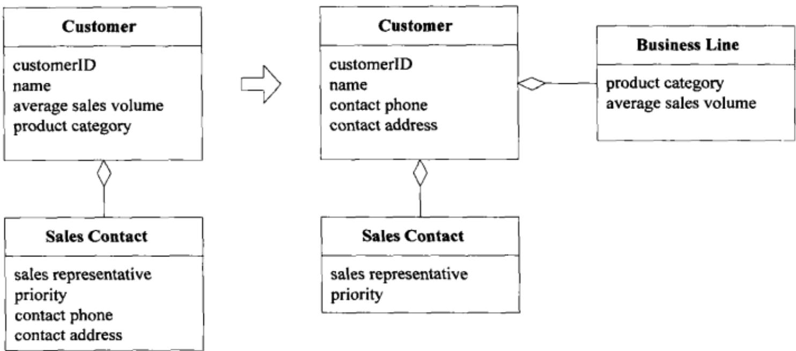


图5-5 与标识有关的属性留在ENTITY内


在图5-5中，customerID是Customer ENTITY的一个（也是唯一的）标识符，但phone number（电话号码）和address（地址）都经常用来查找或匹配一个Customer（客户）。name（姓名）没有定义一个人的标识，但它通常是确定人的方式之一。在这个示例中，phone和address属性被移到Customer中，但在实际的项目上，这种选择取决于领域中的Customer一般是如何匹配或区分的。例如，如果一个Customer有很多用于不同目的的phone number，那么phone number就与标识无关，因此应该放在Sales Contact（销售联系人）中。 

## 5.2.2 设计标识操作

每个ENTITY都必须有一种建立标识的操作方式，以便与其他对象区分开，即使这些对象与它具有相同的描述属性。不管系统是如何定义的，都必须确保标识属性在系统中是唯一的，即使是在分布式系统中，或者对象已被归档，也必须确保标识的唯一性。 

如前所述，面向对象语言有一些“标识”操作，它们通过比较对象在内存中的位置来确定两个引用是否指向同一个对象。这种标识跟踪机制过于简单了，它无法满足我们的目的。在大多数对象持久存储技术中，每次从数据库检索出一个对象时，都会创建一个新实例，这样原来的标识就丢失了。每次在网络上传输对象时，在目的地也会创建一个新实例，这也会导致标识的丢失。当系统中存在同一对象的多个版本时（例如当通过分布式数据库来传播更新的时候），问题将会更复杂。 

尽管有一些用于简化这些技术问题的框架，但基本问题仍然存在。如何才能判定两个对象是否表示同一个概念ENTITY？标识是在模型中定义的。定义标识要求理解领域。 

有时，某些数据属性或属性组合可以确保它们在系统中具有唯一性，或者在这些属性上加一些简单约束可以使其具有唯一性。这种方法为ENTITY提供了唯一键。例如，日报可以通过名称、城市和出版日期来识别。（但要注意临时增刊和名称变更！） 

当对象的属性中没有真正的唯一键时，另一种经常用到的解决方案是为每个实例附加一个在类中唯一的符号（例如一个数字或字符串）。一旦这个ID符号被创建并存储为ENTITY的一个属性，必须将它指定为不可改变。它必须永远不变，即使开发系统无法直接强制这条规则。例如，当对象被压缩为平面数据并改变结构以便保存在数据库中时，ID属性应该保持不变。有时可以利用一个技术框架来实现此目的，但如果没有这样的框架，就需要通过工程规程来约束。 

通常ID是由系统自动生成的。生成算法必须确保ID在系统中是唯一的。在并行处理系统和分布式系统中，这可能是一个难题。生成这种ID的技术超出了本书的范围。这里的目的是指出何时需要考虑这些问题，以便使开发人员能够意识到有一个问题等待他们去解决，并知道如何将注意力集中到关键问题上。关键是要认识到标识问题取决于模型的特定方面。通常，要想找到解决标识问题的方法，必须对领域进行仔细的研究。 

当自动生成ID时，用户可能永远不需要看到它。ID可能只是在内部需要，例如在一个可以按人名查找记录的联系人管理应用程序中。这个程序需要用一种简单、明确的方式来区分两个同名联系人，这就可以通过唯一的内部ID来实现。在检索出两个不同的条目后，系统将显示这两个不同的联系人，但可能不会显示ID。用户可以通过这两个人的公司、地点等属性来区分他们。 

95 

最后，在有些情况下用户会对生成的ID感兴趣。当我委托一个包裹运送服务寄包裹时，我会得到一个跟踪号，它是由运送公司的软件生成的，我可以用这个号码来识别和跟踪我的包裹。当我预订机票或酒店时，会得到一个确认号码，它是预订交易的唯一标识符。 

在某些情况下，需要确保ID在多个计算机系统之间具有唯一性。例如，如果需要在两家具有不同计算机系统的医院之间交换医疗记录，那么理想情况下每个系统对同一个病人应该使用同一个ID，但如果这两个系统各自生成自己的ID，这就很难实现。这样的系统通常使用由另外一家机构（一般是政府机构）发放的标识符。在美国，医院通常使用社会安全号码作为病人的标识符。但这样的方法也不是万无一失的，因为并不是每个人都有社会安全号码（特别是儿童和非美国居民），而且很多人会出于个人隐私原因而反对这种做法。 

在一些非正式的场合（比方说，音像出租），可以使用电话号码作为标识符。但电话可能是共用的，号码也可能会更改，甚至一个旧的电话号码可能会重新分配给一个不同的人。 

由于这些原因, 我们一般使用特别指定的标识符 (例如常飞乘客 $^{①}$ 编号), 而使用其他属性 (例如电话号码和社会安全号码 $^{②}$ ) 进行匹配和验证。在任何情况下, 当应用程序需要一个外部ID时, 都由系统的用户负责提供唯一的ID, 而且系统必须为用户提供适当的工具来处理异常情况。 

在所有这些技术问题的干扰下，人们很容易忽略一个基本的概念问题：两个对象是同一事物时意味着什么？我们很容易为每个对象分配一个ID，或是编写一个用于比较两个实例的操作，但 

如果这些ID或操作在领域中并没有显著的区别，那么只会使问题更混乱。这就是分配标识的操作通常需要人工输入的原因。例如，支票簿对账软件可以提供一些有可能匹配的账目，但它们是否真的匹配则要由用户最终决定。 

## 5.3 模式：VALUE OBJECT


很多对象没有概念上的标识，它们描述了一个事务的某种特征。


* * * 

当一个小孩画画的时候，他注意的是画笔的颜色和笔尖的粗细。但如果有两只颜色和粗细相同的画笔，他可能不会在意使用哪一支。如果有一支笔弄丢了，他可以从一套新笔中拿出一支同颜色的笔来继续画画，根本不会在意已经换了一支笔。 

问问孩子冰箱上的画都是谁画的，他会很快辨认出哪些是他画的，哪些是他姐姐画的。姐弟俩有一些实用的标识来区分自己的画，就像他们完成的这些画各自有一些实用的标识那样。但设想一下，如果孩子必须记住哪些线条是用哪支笔画的，情况该有多么复杂？如果这样的话，画画将不再是小孩子的游戏了。 

由于模型中最引人注意的对象往往是ENTITY，而且跟踪每个ENTITY的标识是极为重要的，因此我们很自然地会想到为每个领域对象都分配一个标识。实际上，一些框架确实为每个对象分配了一个唯一的ID。 

这样一来，系统就必须处理所有这些ID的跟踪问题，从而导致许多本来可能的性能优化不得不被放弃。此外，人们还需要付出大量的分析工作来定义有意义的标识，还需要开发出一些可靠的跟踪方式，以便在分布式系统之间或在数据库存储中跟踪对象。同样重要的是，盲目添加标识可能会产生误导。它会使模型变得混乱，使所有对象看起来都是同一模式。 

跟踪ENTITY的标识是非常重要的，但为其他对象也加上标识会影响系统性能并增加分析工作，而且会使模型变得混乱，因为所有对象看起来都是相同的。 

软件设计要时刻与复杂性做斗争。我们必须区别对待问题，将特殊的处理方式应用到真正需要的地方。 

然而,如果仅仅把这类对象当作没有标识的对象,那么就忽略了它们的工具价值或术语价值。事实上,这些对象有其自己的特征,对模型也有着自己的重要意义。这些是用来描述事物的对象。 

用于描述领域的某个方面而本身没有概念标识的对象称为VALUE OBJECT（值对象）。VALUE OBJECT被实例化之后用来表示一些设计元素，我们只关心这些元素是什么，而不关心它们是谁。 

## “地址”是VALUE OBJECT吗？谁会问这个问题？

在一个邮购公司的软件中，需要用地址来核实信用卡并投递包裹。但如果一个人的室友也从同一家公司订购了货物，那么是否意识到他们住在同一个地方并不重要。因此地址是一个VALUE OBJECT。 

在一个用于安排投递路线的邮政服务软件中，国家可能被组织为一个由地区、城市、邮政区、街区以及最终的个人地址组成的层次结构。这些地址对象可以从它们在层次结构中的父对象获取邮政编码，而且，如果邮政服务决定重新划分邮政区，那么所有地址都将随之改变。在这里，地址是一个ENTITY。 

在电力运营公司的软件中，一个地址对应于公司线路和服务的一个目的地。如果几个室友各自打电话申请电力服务，公司需要知道他们其实是住在同一个地方这一点。在这种情况下，地址是一个ENTITY。换种方式，模型可以将电力服务与“住处”关联起来，那么住处就是一个带有地址属性的ENTITY了，这时，地址就是一个VALUE OBJECT。 

颜色是很多现代开发系统的基础库所提供的VALUE OBJECT的一个例子,字符串和数字也是这样的VALUE OBJECT（我们不会关心所使用的是哪一个“4”或哪一个“Q”）。这些基本的例子非常简单，但VALUE OBJECT并不都这样简单。例如，调色程序可能有一个功能丰富的模型，在这个模型中，可以把功能更强的VALUE OBJECT组合起来产生其他颜色。这些颜色可能具有很复杂的算法，通过这些算法的共同计算得到新的VALUE OBJECT。 

VALUE OBJECT可以是其他对象的集合。在设计房屋规划的软件中，可以为每种窗户样式创建一个对象。我们可以将“窗户样式”连同它的高度、宽度以及修改和组合这些属性的规则一起放到“窗户”对象中。这些窗户就是由其他VALUE OBJECT组成的复杂VALUE OBJECT。它们进而又被合并到更大的设计元素中，例如“墙”对象。 

VALUE OBJECT甚至可以引用ENTITY。例如，如果我请在线地图服务为我提供一个从旧金山到洛杉矶驾车风景游路线，它可能会得出一个“路线”对象，此对象通过太平洋海岸公路连接旧金山和洛杉矶。这个“路线”对象是一个VALUE，尽管它所引用的3个对象（两座城市和一条公 

路）都是ENTITY。 

VALUE OBJECT经常作为参数在对象之间传递消息。它们常常是临时对象，在一次操作中被创建，然后丢弃。VALUE OBJECT可以用作ENTITY（以及其他VALUE）的属性。我们可以把一个人建模为一个具有标识的ENTITY，但这个人的名字是一个VALUE。 

当我们只关心一个模型元素的属性时，应把它归类为VALUE OBJECT。我们应该使这个模型元素能够表示出其属性的意义，并为它提供相关功能。VALUE OBJECT应该是不可变的。不要为它分配任何标识，而且不要把它设计成像ENTITY那么复杂。 

VALUE OBJECT所包含的属性应该形成一个概念整体 $^{①}$ 。例如，street（街道）、city（城市）和postal code（邮政编码）不应是Person（人）对象的单独的属性。它们是整个地址的一部分，这样可以使得Person对象更简单，并使它成为一个更连贯的VALUE OBJECT。如图5-6所示。 

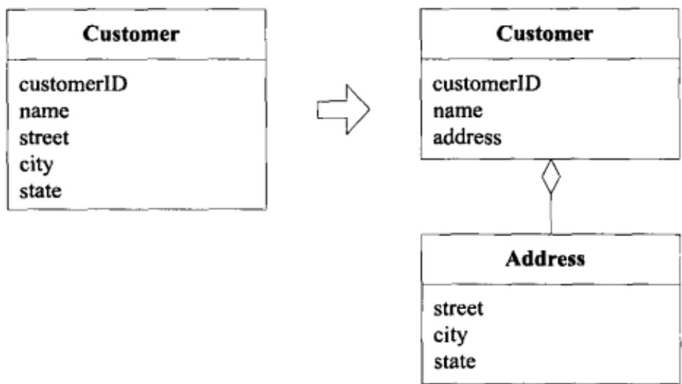


图5-6 VALUE OBJECT可以提供一个ENTITY的有关信息，它在概念上应该是一个整体


* * *


## 5.3.1 设计 VALUE OBJECT

我们并不关心使用的是VALUE OBJECT的哪个实例。由于不受这方面的约束，设计可以获得更大的自由，因此可以简化设计或优化性能。在设计VALUE OBJECT时有多种选择，包括复制、共享或保持VALUE OBJECT不变。 

两个人同名并不意味着他们是同一个人，也不意味着他们是可互换的。但表示名字的对象是可以互换的，因为它们只涉及名字的拼写。一个Name对象可以从第一个Person对象复制给第二个Person对象。 

事实上，这两个Person对象可能不需要自己的名字实例，它们可以共享同一个Name对象（其 

为优化性能而创建更多选项，这一点可能很重要，因为VALUE OBJECT可能为数众多。房屋设计软件的示例就说明了这一点。如果每个电源插座都是一个单独的VALUE OBJECT，那么在一所房屋的一个规划版本中可能就会有上百个这种VALUE OBJECT。但如果把电源插座看成是可互换的，就只需共享一个电源插座实例，并让所有电源插座都指向这个实例（FLYWEIGHT，[Gamma et al. 1995]的一个示例）。在大型系统中，这种效果可能会被放大数千倍，而且这样的优化可能决定一个系统是可用，还是由于数百万个多余对象而变得异常缓慢。这只是一个优化技巧，但是却无法应用于ENTITY。 

复制和共享哪个更划算取决于实现环境。虽然复制有可能导致系统被大量的对象阻塞，但共享可能会减慢分布式系统的速度。当在两个机器之间传递一个副本时，只需发送一条消息，而且副本到达接收端后是独立存在的。但如果共享一个实例，那么只会传递一个引用，这要求每次交互都要向发送方返回一条消息。 

100 

以下几种情况最好使用共享，这样可以发挥共享的最大价值并最大限度地减少麻烦： 

☐ 当节省数据库空间或减少对象数量是一个关键要求时； 

□ 当通信开销很低时（例如在中央服务器中）； 

□当共享的对象被严格限定为不可变时。 

在有些语言和环境中，可以将属性或对象声明为不可变的，但有些却不具备这种功能。这种声明能够体现出设计决策，但它们并不是十分重要。我们在模型中所做的很多区别都无法用当前工具和编程语言在实现中显式地声明出来。例如，我们无法声明ENTITY并自动确保其具有一个标识操作。但是，编程语言没有提供对这些概念上的区别的直接支持并不说明这些区别没有用处。这只是说明我们需要更多的约束机制来确保满足一些重要的规则（这些规则只有在实现中才是隐式的）。一些命名约定、选择性文档和大量技术问题的讨论都进一步体现了这些需求。 

只要VALUE OBJECT是不可变的，变更管理就会很简单，因为除了整体替换之外没有其他的更改。不变的对象可以自由地共享，像在电源插座的例子中一样。如果垃圾回收是可靠的，则删除操作就只是将所有指向对象的引用删除。当在设计中将一个VALUE OBJECT指定为不可变时，开发人员就可以完全根据技术需求来决定是使用复制，还是使用共享，因为他们没有后顾之忧——应用程序不依赖于对象的特殊实例。 

## 特殊情况：何时允许可变性

保持VALUE OBJECT不变可以极大地简化实现，并确保共享和引用传递的安全性。而且这样做也符合值的意义。如果属性的值发生改变，我们应该使用一个不同的VALUE OBJECT，而不是修改现有的VALUE OBJECT。尽管如此，在有些情况下出于性能考虑，仍需要让VALUE OBJECT是可变的。这包括以下因素： 

□ 如果VALUE频繁改变； 

□ 如果创建或删除对象的开销很大； 

□ 如果替换（而不是修改）将打乱集群（像前面示例中讨论的那样）； 

□ 如果VALUE的共享不多，或者共享不会提高集群性能，或其他某种技术原因。 

再次强调：如果一个VALUE的实现是可变的，那么就不能共享它。无论是否共享VALUE OBJECT，在可能的情况下都要将它们设计为不可变的。 

定义VALUE OBJECT并将它们指定为不变是一条一般规则,这样做是为了避免在模型中产生不必要的约束,从而让开发人员可以单纯地从技术上优化性能。开发人员通过显式地定义重要的约束,可以对设计做出必要的调整,同时确保不会无意更改那些重要的行为。这样的设计调整通常需要在特殊的项目上使用特殊的技术。 

## 示例 通过VALUE OBJECT来优化数据库

数据库的最基本功能是将数据存储到物理磁盘上，它的时间花在物理部件的转动和数据读取上。复杂的数据库则尝试将这些物理地址聚集到一起，以便可以在一次物理操作中从磁盘读取这些相关数据。 

如果一个对象被许多其他对象引用，其中有些对象将不会在它附近（不在同一页上），这就需要通过额外的物理操作来获取数据。通过复制（而不是共享对同一个实例的引用），可以将这种作为很多ENTITY属性的VALUE OBJECT存储在ENTITY所在的同一页上。这种存储相同数据的多个副本的技术称为非规范化（denormalization），当访问时间比存储空间或维护的简单性更重要时，通常使用这种技术。 

在关系数据库中，我们可能想把一个特殊的值放到拥有此值的ENTITY的表中，而不是将其关联到另一个单独的表。在分布式系统中，对一个位于另一台服务器上的VALUE OBJECT的引用可能导致对消息的响应十分缓慢，在这种情况下，应该将整个对象的副本传递到另一台服务器上。我们完全可以使用副本，因为处理的是VALUE OBJECT。 

## 5.3.2 设计包含 VALUE OBJECT 的关联

前面讨论的与关联有关的大部分内容也适用于ENTITY和VALUE OBJECT。模型中的关联越少越好，越简单越好。 

但是，如果说ENTITY之间的双向关联很难维护，那么两个VALUE OBJECT之间的双向关联则完全没有意义。当一个VALUE OBJECT指向另一个VALUE OBJECT时，由于没有标识，说后一个对象指回前一个对象是没有任何意义的。我们充其量可以说后一个对象指向与前一个对象等同的对象，但这可能要求我们必须在某个地方实施这个固定规则。而且，尽管我们可以这样做，并设置双向指针，但很难想出这种布局有什么用处。因此，我们应尽量完全清除VALUE OBJECT之间的双向关联。如果在你的模型中看起来确实需要这种关联，那么首先应重新考虑一下将对象声明为VALUE OBJECT这个决定是否正确。或许它拥有一个标识，而你没有注意到它。 

102 

ENTITY和VALUE OBJECT是传统对象模型的主要元素,但一些注重实效的设计人员正逐渐开始使用一种新的元素——SERVICE。 

103 

## 5.4 模式：SERVICE


有时，对象不是一个事物。 

在某些情况下，最清楚、最实用的设计会包含一些特殊的操作，这些操作从概念上讲不属于任何对象。与其把它们强制地归于哪一类，不如顺其自然地在模型中引入一种新的元素，这就是SERVICE（服务）。 

## * * *

有些重要的领域操作不适合归到ENTITY或VALUE OBJECT的类别中。这当中有些操作从本质上讲是一些活动或动作，而不是事物，但由于我们的建模范式是对象，因此要想办法将它们划归到对象这个范畴里。 

现在，一个比较常见的错误是没有努力为这类行为找到一个适当的对象，而是逐渐转为过程化的编程。但是，当我们勉强将一个操作放到不符合对象定义的对象中时，这个对象就会产生概念上的混淆，而且会变得很难理解或重构。复杂的操作很容易把一个简单对象搞乱，使对象的角色变得模糊。此外，由于这些操作常常会牵扯到很多领域对象，需要协调这些对象以便使它们工作，因此这些对象需要承担更多的职责，从而对所有这些对象产生依赖性，这使得那些本来可以一个个去理解的概念被缠杂在一起。 

有时，一些SERVICE看上去就像是模型对象，它们以对象的形式出现，除了执行一些操作之外并没有其他意义。这些“实干家”（Doer）的名字通常以“Manager”之类的名字结尾。它们没有自己的状态，而且除了所掌握的操作之外在领域中也没有其他意义。尽管如此，我们仍然应该把它们归到SERVICE这个类别中，这样可以避免它们与真正的模型对象混淆。 

一些领域概念不适合被建模为对象。如果勉强地把这些重要的领域功能归为ENTITY或VALUE OBJECT的职责，那么不是歪曲了基于模型的对象的定义，就是人为地增加了一些无意义的对象。 

SERVICE是作为接口提供的一种操作，它在模型中是独立的，它不像ENTITY和VALUE OBJECT那样具有封装的状态。SERVICE是技术框架中的一种常见模式，但它们可以在领域层中使用。 

所谓SERVICE，它强调的是与其他对象的关系。与ENTITY和VALUE OBJECT不同，它只是定义了能够为客户做什么。SERVICE是以一个活动命名，而不是以一个ENTITY命名，也就是说，它是动词而不是名词。SERVICE也可以有一个抽象的、有意图的定义，只是它使用了一种与对象不同的定义风格。SERVICE也应该有定义的职责，而且这种职责以及履行它的接口也应该作为领域模型的一部分被定义。操作名称应来自于UBIQUITOUS LANGUAGE，如果UBIQUITOUS LANGUAGE中没有这个名称，则应该将其引入到UBIQUITOUS LANGUAGE中。参数和结果应该是领域对象。 

使用SERVICE时应谨慎，它们不应该替代ENTITY和VALUE OBJECT的所有行为。但是，当一个操作实际上是一个重要的领域概念时，SERVICE很自然就会成为MODEL-DRIVEN DESIGN中的一部分。将模型中的独立操作声明为一个SERVICE，而不是声明为一个不代表任何事情的虚拟对象，可以避免对任何人产生误导。 

好的SERVICE有以下3个特征。 

(1) 与领域概念相关的操作不是ENTITY或VALUE OBJECT的一个自然的部分。 

(2) 接口是根据领域模型的其他元素定义的。 

(3) 操作是无状态的。 

这里所说的无状态是指任何客户都可以使用某个SERVICE的任何实例，而不必关心该实例的历史状态。执行SERVICE时将使用可全局访问的信息，甚至可以更改这些全局信息（也就是说，它可能具有副作用）。但SERVICE不保持影响其自身行为的状态，这一点与大多数领域对象不同。 

当领域中的某个重要的过程或转换操作不属于实体或值对象的自然职责时，应该在模型中添加一个作为独立接口的操作，并将其声明为SERVICE。定义接口时要使用模型语言，并确保操作名称是UBIQUITOUS LANGUAGE中的术语。此外，应该将SERVICE定义为无状态的。 

## * * *

## 5.4.1 SERVICE 与孤立的领域层

这种模式只重视那些在领域中具有重要意义的SERVICE，但SERVICE并不只是在领域层中使用。我们需要注意区分属于领域层的SERVICE和那些属于其他层的SERVICE，并划分责任，以便将它们明确地区分开。 

文献中对SERVICE的讨论大多是单纯从技术角度讨论，而且它们属于基础设施层。领域层和应用层的SERVICE与这些基础设施层SERVICE进行协作。例如，银行可能有一个用于向客户发送电子邮件的应用程序，当客户的账户余额小于一个特定的临界值时，这个程序就向客户发送一封电子邮件。封装了电子邮件系统的接口（也可能是其他的通知方式）就是基础设施层中的一个SERVICE。 

应用层SERVICE和领域层SERVICE可能很难区分。应用层负责安排一个通知，而领域层负责确定是否满足临界值，尽管这项任务可能并不需要使用SERVICE，因为它可以被划分到account（账户）对象的职责中。这个银行应用程序可能还负责资金转账。如果设计一个SERVICE来处理资金转账相应的借方和贷方，那么这项功能将属于领域层。资金转账在银行领域语言中是一项有意义的操作，而且它涉及基本的业务逻辑。而技术层SERVICE应该是没有任何业务意义的。 

很多领域或应用层SERVICE是在ENTITY和VALUE OBJECT的基础上建立起来的，它们的行为类似于将领域的一些潜在功能组织起来以执行某种任务的脚本。ENTITY和VALUE OBJECT往往由于粒度过细而无法提供对领域层功能的便捷访问。我们在这里会遇到领域层与应用层之间的一条很细的分界线。例如，如果银行应用程序可以把我们的交易进行转换并导出到一个电子表格文件中，以便进行分析，那么这个导出操作就是一种应用层SERVICE。“文件格式”在银行领域中是没有意义的，它也不涉及业务规则。 

另一方面，账户之间的转账功能属于一种领域层SERVICE，因为它包含重要的业务规则（例如，处理相应的借方账户和贷方账户），而且“资金转账”是一个有意义的银行术语。在这种情况下，SERVICE自己并不会做太多的事情，而只是要求两个Account对象完成大部分工作。但如果将“转账”操作强加在Account对象上将是很别扭的，因为这个操作涉及两个账户和一些全局规则。 

我们可能喜欢创建一个Funds Transfer（资金转账）对象来表示两个账户，外加一些与转账有关的规则和历史记录。但在银行间的网络中进行转账时，仍然需要使用SERVICE。此外，在大多数开发系统中，在一个领域对象和外部资源之间直接建立一个接口是很别扭的。我们可以利用一个FACADE（外观） $^{①}$ 将这样的外部SERVICE包装起来，这个外观负责接受模型的输入，也可以返回 一个“Funds Transfer”对象（作为它的结果）。但无论使用什么中间SERVICE（尽管它们不属于我们），这些SERVICE都是在履行资金转账的领域职责。 


将SERVICE划分到各个层中


<table><tr><td>应用层</td><td>资金转账应用服务□获取输入(例如一个XML请求)□发送消息给领域层服务,要求其执行□监听确认消息□决定使用基础设施SERVICE来发送通知</td></tr><tr><td>领域层</td><td>资金转账领域服务□与必要的Account(账户)和Ledger(总账)对象进行交互,执行相应的借入和贷出操作□提供结果的确认(允许转账或拒绝转账,等等)</td></tr><tr><td>基础设施层</td><td>发送通知服务□按照应用程序的指示发送电子邮件、信件和其他信息</td></tr></table>

## 5.4.2 粒度

上述对SERVICE的讨论强调的是将一个概念建模为SERVICE的表现力，但SERVICE还有其他有用的功能，它可以控制领域层中的接口的粒度，并且避免客户与ENTITY和VALUE OBJECT的耦合。 

在大型系统中，中等粒度的、无状态的SERVICE更容易被重用，因为它们在一个简单的接口背后封装了重要的功能。此外，细粒度的对象可能导致分布式系统中的消息传递的效率低下。 

如前所述，由于应用层负责对领域对象的行为进行协调，因此细粒度的领域对象可能会把领域层的知识泄漏到应用层中。这产生的结果是应用层不得不处理复杂的、细致的交互，从而使得领域知识蔓延到应用层或用户界面代码当中，而领域层会丢失这些知识。明智地引入领域层服务有助于在应用层和领域层之间保持一条明确的界限。 

这种模式有利于保持接口的简单性，便于客户控制并提供了多样化的功能。它提供了一种在大型或分布式系统中便于对组件进行打包的中等粒度的功能。而且，有时SERVICE是表示领域概念的最自然的方式。 

## 5.4.3 对 SERVICE 的访问

像J2EE和CORBA这样的分布式系统架构提供了特殊的SERVICE发布机制，这些发布机制具有一些使用上的惯例，并且增加了发布和访问功能。但是，并非所有项目都会使用这样的框架，即使在使用了它们的时候，如果只是为了在逻辑上实现关注点的分离，那么它们也是大材小用了。 

与分离特定职责的设计决策相比，提供对SERVICE的访问机制的意义并不是十分重大。一个“操作”对象可能足以作为SERVICE接口的实现。我们很容易编写一个简单的SINGLETON（[Gamma et al. 1995]）对象来实现对SERVICE的访问。从编码惯例可以明显看出，这些对象只是SERVICE接 

## * * *

每个人都会使用MODULE，但却很少有人认为它们是模型的一个相对独立的部分。这是因为代码被分割为很多块，有时是按照技术架构来分割的，有时是按照开发人员的任务来分割的。甚至那些从事大量重构工作的开发人员也倾向于使用项目早期形成的一些MODULE。 

事实上，MODULE之间应该是低耦合的，而在MODULE的内部则是高内聚的。耦合和内聚的解释使得MODULE听上去像是一种技术指标，仿佛是根据关联和交互的分布情况来机械地判断它们。然而，MODULE并不仅仅是代码的划分，而且也是概念的划分。一个人一次考虑的事情是有限的（因此才有低耦合）。不连贯的思想和“一锅粥”似的思想同样难于理解（因此才有高内聚）。 

低耦合高内聚作为通用的设计原则既适用于各种对象，也适用于MODULE，但MODULE作为一种更粗粒度的建模和设计元素，采用低耦合高内聚原则显得更为重要。这些术语由来已久，早在[Larman 1998]中就从模式角度对其进行了解释。 

只要两个模型元素被划分到不同的MODULE中，它们的关系就不如原来那样直接，这会导致我们更难理解它们在设计中的作用。MODULE之间的低耦合可以将这种负面作用减至最小，而且在分析一个MODULE的内容时，只需从那些与之交互的其他MODULE中引用很少的内容。 

109 

同时，在一个好的模型中，元素之间是可以协同工作的，而仔细选择的MODULE可以将那些具有紧密概念关系的模型元素集中到一起。将这些具有相关职责的对象元素聚合到一起，可以把建模和设计工作集中到单一MODULE中，这会极大地降低建模和设计的复杂性，使人们可以从容应对这些工作。 

MODULE和较小的元素应该共同演变，但实际上它们并不是这样。MODULE是用来组织一种早期的对象形式的。在这之后，对象在变化时不脱离现有模块定义的边界。重构MODULE需要比重构类做更多工作，这些工作也具有更大的破坏性，因此MODULE的重构不能像类的重构那么频 繁。但就像模型对象从简单具体逐渐转变为反映更深层次的本质一样，MODULE会变得微妙和抽象。让MODULE反映出对领域理解的不断变化，可以使MODULE中的对象能够更自由地演变。 

像领域驱动设计中的其他元素一样，MODULE是一种表达机制。MODULE的选择应该取决于被划分到模块中的对象的意义。当你将一些类放到MODULE中时，相当于告诉下一位看到你的设计的开发人员要把这些类放在一起考虑。如果说模型讲述了一个故事，那么MODULE就是这个故事的各个章节。模块的名称表达了其意义。这些名称应该被添加到UBIQUITOUS LANGUAGE中。你可能会向一位业务专家说“现在让我们讨论一下‘客户’模块”，这就为你们接下来的对话设定了上下文。 

因此： 

选择能够描述系统的MODULE，并使之包含一个内聚的概念集合。这通常会实现MODULE之间的低耦合，但如果效果不理想，则应寻找一种更改模型的方式来消除概念之间的耦合，或者找到一个可作为MODULE基础的概念（这个概念先前可能被忽视了），基于这个概念组织的MODULE可以以一种有意义的方式将元素集中到一起。找到一种低耦合的概念组织方式，从而可以相互独立地理解和分析这些概念。对模型进行精化，直到可以根据高层领域概念对模型进行划分，同时相应的代码也不会产生耦合。 

MODULE的名称应该是UBIQUITOUS LANGUAGE中的术语。MODULE及其名称应反映出领域的深层知识。 

仅仅研究概念关系是不够的，它并不能完全替代技术手段。这二者是相同问题的不同层次，都是必须要完成的。但是，只有以模型为中心进行思考，才能得到更深层次的解决方案，而不是随便找一个解决方案应付了事。当必须做出一个折中选择时，务必保证概念清晰，即使这意味着MODULE之间会产生更多引用，或者更改MODULE偶尔会产生“涟漪效应”。开发人员只要理解了模型所描述的内容，就可以应付这些问题。 

## * * *

## 5.5.1 敏捷的 MODULE

MODULE需要与模型的其他部分一同演变。这意味着MODULE的重构必须与模型和代码一起进行。但这种重构通常不会发生。更改MODULE可能需要大范围地更新代码。这些更改可能会对团队沟通起到破坏作用，甚至会妨碍开发工具（例如源代码控制系统）的使用。因此，MODULE结构和名称往往反映了模型的较早形式，而类则不是这样。 

在MODULE选择的早期，有些错误是不可避免的，这些错误导致了高耦合，从而使MODULE很难进行重构。而缺乏重构又会导致问题变得更加严重。克服这一问题的唯一方法是接受挑战，仔细地分析问题的要害所在，并据此重新组织MODULE。 

一些开发工具和编程系统会使问题变得更加严重。无论在实现中采用哪种开发技术，我们都要尽力避免重构MODULE，这样才能最大限度地减少与其他开发人员沟通时出现的混乱情况。 

## 示例 Java中的包编码惯例

在Java中，在个别的类中必须声明导入（依赖性）。建模人员可能认为有些包会依赖其他的包，但在Java中无法说明这一点。常见的编码惯例鼓励导入特定的类，如以下代码所示： 

```typescript
ClassA1
import packageB.ClassB1;
import packageB.ClassB2;
import packageB.ClassB3;
import packageC.ClassC1;
import packageC.ClassC2;
import packageC.ClassC3; 
```

遗憾的是，在Java中，我们不可避免地需要将数据导入到类中，但至少可以一次导入一个完整的包，这反映出包是一种高内聚的单元，同时这种导入减少了更改包名称的工作。 

```typescript
ClassA1
import packageB.*;
import packageC.*; 
```

的确，这种技术意味着把类和包混合在一起（类依赖于包），但它除了表达前面一长串类的列表之外，还表达了在特殊MODULE上建立一种依赖性的意图。 

如果一个类确实依赖于另一个包中的某个类，而且本地MODULE对该MODULE并没有概念上的依赖关系，那么或许应该移除一个类，或者考虑重新组织MODULE。 

## 5.5.2 基础设施驱动的打包存在的隐患

技术框架对打包决策有着极大的影响，有些技术框架是有帮助的，有些则要坚决反对。 

一个非常有用的框架标准是LAYERED ARCHITECTURE，它将基础设施和用户界面代码放到两组不同的包中，并且从物理上把领域层隔离到它自己的一组包中。 

但从另一个方面看，分层架构可能导致模型对象实现的分裂。一些框架的分层方法是把一个领域对象的职责分散到多个对象当中，然后把这些对象放到不同的包中。例如，当使用J2EE时，一种常见的做法是把数据和数据访问放到“实体bean”中，而把相关的业务逻辑放到“会话bean”中。这样做除了导致每个组件的实现变得更复杂以外，还破坏了对象模型的内聚性。对象的一个最基本的概念是用数据的操作逻辑来封装数据。由于我们可以把这两个组件看作是一起组成一个单一模型元素的实现，因此这种分层实现还不算是致命的。但实体bean和会话bean 通常被隔离到不同的包中，从而使情况变得更糟。从这一点来看，要想观察这两种对象并在大脑中把它们还原成单一的概念ENTITY是非常困难的。我们失去了模型与设计之间的联系。最好的做法是使用比ENTITY对象具有更大粒度的EJB，从而减少分层的副作用。但细粒度的对象通常也是分层的。 

例如，我就曾经在一个筹划得相当不错的项目上遇到过这些问题，这个项目的每个概念模型实际上被分为4层。每个层的划分都有很好的理由。第一层是数据持久层，负责处理映射和访问关系数据库。第二层负责处理对象在所有情况下的固有行为。第三层放置特定于应用程序的功能。第四层是一个公共接口，它隐藏了一、二、三层的所有实现细节。这种分层方案有些复杂，但每层都有很好的定义，而且清楚地实现了关注点的分离。我们可以在大脑中将所有物理对象连接到一起，组成一个概念对象。有时，方面的分离甚至也是有帮助的。具体来讲，把持久化代码移出来可以减少很多混乱。 

但最重要的是，这个项目的框架要求将每个层放到单独的一组包中，并根据层的标识惯例来命名。这一下子就把我们所有的注意力都吸引到分层上来。结果，领域开发人员不能创建太多的3 MODULE（每个模块都要乘以4），而且几乎不能更改模块，因为重构MODULE的工作量不允许这样做。更糟的是，由于很难跟踪定义了一个概念类的所有数据和行为（而且还要考虑分层产生的间接关系），因此开发人员没有多少精力思考模型了。这个应用最终交付使用了，但它的领域模型很“贫瘠”，只是从基本上满足了应用程序的数据库访问需求，此外通过很少的几个SERVICE提供了一些行为。这个项目从MODEL-DRIVEN DESIGN获得的益处十分有限，因为代码并没有透明地揭示模型，因此开发人员也无法充分地利用模型。 

这种框架设计是在尝试解决两个合理的问题。一个问题是关注点的逻辑划分：由一个对象负责数据库访问，另一个对象负责处理业务逻辑，等等。这种划分方法使人们更容易（在技术层面上）理解每个层的功能，而且更容易区分各个层。这种设计的问题在于应用程序的开发成本很高。本书不是讨论框架设计的书，因此不会给出此问题的替代解决方案，但它们确实存在。而且，即使没有替代方案，也值得牺牲一些优点来换取更内聚的领域层。 

这些打包方案的另一个动机是层的分布。如果代码实际上被部署到不同的服务器上，那么这种分层可能会产生很大争议。但通常并不是这样。保持一些灵活性只是为了以防万一。在一个希望充分利用MODEL-DRIVEN DESIGN的项目上，这种分层设计的牺牲太大了，除非它是为了解决一个紧迫的问题。 

在技术的驱使下过于细致的打包方案会产生如下两个代价。 

□ 如果框架的分层惯例把实现概念对象的元素分得很零散，那么代码将无法再清楚地表示模型。 

□ 人的大脑把划分后的东西还原成原样的能力是有限的，如果框架把人的这种能力都耗尽了，那么领域开发人员就无法再把模型还原成有意义的部分了。 

最好把事情变简单。要保持技术分层的最小化，选择对技术环境特别重要或真正有助于开发 

的分层方法。例如，将复杂的数据持久化代码从对象的行为方面提取出来可以使重构变得更简单。 

除非真正有必要将代码分布到不同的服务器上, 否则就把实现单一概念对象的所有代码放在同一个模块中（如果不能放在同一个对象中的话）。 

从传统的“高内聚、低耦合”标准也可以得出相同的结论。实现业务逻辑的对象与负责数据库访问的对象之间的联系非常广泛，因此它们之间的耦合度很高。 

在框架设计中，或者在公司或项目的工作惯例方面，可能还有其他一些隐患，这些隐患可能会妨碍领域模型的自然内聚性，结果破坏模型驱动的设计，但所有隐患的基本问题都是相同的。种种限制（或者只是由于所需的包太多了）使我们无法使用专门根据领域模型需要量身定做的其他打包方案。 

利用打包把领域层从其他代码中分离出来。否则，就尽可能让领域开发人员自由地采用支持他们的模型和设计选择的方式来对领域对象进行打包。 

如果代码是基于声明式设计（第10章有这方面的讨论）生成的，则是一种例外情况。在这种情况下，开发人员无需阅读代码，因此为了不碍事最好将代码放到一个单独的包中，这样就不会搞乱开发人员实际要处理的设计元素。 

随着设计规模和复杂度的增加,模块化变得更加重要。本节只是介绍了一些基本的考虑因素。本书第四部分主要介绍打包方法以及分解大的模型和设计的方法,并介绍如何抓住重点以帮助理解问题。 

领域模型中的每个概念都应该在实现元素中反映出来。ENTITY、VALUE OBJECT、它们之间的关联、领域SERVICE以及用于组织元素的MODULE都是实现与模型直接对应的地方。实现中的对象、指针和检索机制必须直接、清楚地映射到模型元素。如果没有做到这一点，就要重写代码，或者回头修改模型，或者同时修改代码和模型。 

不要在领域模型中添加任何与领域模型所表示的概念没有紧密关系的元素。模型中的设计元素的任务是表示模型。当然，其他一些与领域有关的职责也是必须要实现的，而且为了使系统工作，也必须管理其他数据，但它们不属于领域模型中的对象。第6章将讨论一些支持对象，这些对象履行领域层的技术职责，例如定义数据库搜索和封装复杂的对象创建。 

本章介绍的4种模式为对象模型提供了构造块。但MODEL-DRIVEN DESIGN并不是说必须将每个元素都建模为对象。一些工具还支持其他的模型范式，例如规则引擎。项目需要在它们之间做出符合实际的折中选择。这些其他的工具和技术是MODEL-DRIVEN DESIGN的补充，而不是要取而代之。 

## 5.6 建模范式

MODEL-DRIVEN DESIGN要求使用一种与建模范式协调的实现技术。人们曾经尝试了大量的建模范式，但在实践中只有少数几种得到了广泛应用。目前，主流的范式是面向对象设计，而且现 在的大部分复杂项目都开始使用对象。这种范式的流行有许多原因，包括对象本身的固有因素、一些环境因素，以及广泛使用所带来的一些优势。 

## 5.6.1 对象范式流行的原因

一些团队选择对象范式并不是出于技术上的原因，甚至也不是出于对象本身的原因，而是从一开始，对象建模就在简单性和复杂性之间实现了一个很好的平衡。 

如果一个建模范式过于深奥，那么大多数开发人员可能无法掌握它，因此也无法正确地运用它。如果团队中的非技术人员无法掌握范式的基本知识，那么他们将无法理解模型，这将导致UBIQUITOUS LANGUAGE的丢失。大部分人都比较容易理解面向对象设计的基本知识。尽管一些开发人员还没有完全领悟建模的奥妙，但即使是非专业人员也可以理解对象模型图。 

然而，虽然对象建模的概念很简单，但它的丰富功能足以捕获重要的领域知识。而且它从一开始就获得了开发工具的支持，使得模型可以在软件中表达出来。 

现在，对象范式已经发展很成熟并得到了广泛采用，这使得它具有明显的环境优势。项目如果没有成熟的基础设施和工具支持，可能就要在这些方面进行研发工作，这不仅会耽误应用程序的开发，分散应用程序的开发资源，还会带来技术风险。有些技术不能与其他技术很好地协同工作，而且它们可能也无法与行业标准解决方案集成，这使团队不得不重新开发一些公共的实用工具。但近年来，很多这样的问题已经通过对象范式得以解决，而且有些问题也随着对象范式的广泛采用而变得无关紧要（现在，对象技术已经成为主流，因此集成的任务已经落到其他方法的肩上，这些方法需要主动与对象技术进行集成）。大多数新技术都提供了与主流的面向对象平台进行集成的方式。这使得集成更容易，甚至允许将基于其他建模范式的子系统混合在一起（本章稍后将讨论）。 

开发者社区和设计文化的成熟也同样重要。采用新范式的项目可能很难找到精通它的开发人员，也很难找到具有用新范式创建有效模型这方面经验的人员。要想在允许时间段内培训开发人员使用新范式也往往是行不通的，因为能够最大限度地利用新范式和技术的使用模式尚未形成。或许新领域的一些开拓者已经可以有效地使用新范式，但他们尚未发布可供人们学习的知识。 

而对象范式则不同，大多数开发人员、项目经理和从事项目工作的其他专家都已经很了解它。 

下面我讲一个10年前在一个面向对象项目中发生的小故事，它说明了在工作中使用不成熟范式所产生的风险。这个项目是在20世纪90年代早期开始的，它采用了几种当时最前沿的技术，包括大规模使用面向对象数据库。当时这让人很兴奋。在项目上工作的人骄傲地告诉访客他们正在部署面向对象所支持的最大的数据库。当我加盟这个项目时，各个团队正在研究一些面向对象的设计，并且可以毫不费力地将对象存储在数据库中。但我们渐渐意识到，数据库容量的很大一部分已经被用光了，而这时还仅仅只是输入了测试数据而已！实际所需的数据库还要大几十倍。实际的事务量也要大上几十倍。是不是这个应用程序根本不适合使用面向对象的数据库？是我们使 

用不当吗？这使我们感到一头雾水。 

幸运的是，我们找到了一位精通面向对象技术的专家来帮助我们摆脱困境。我们谈妥服务价格后，他指出了三个问题根源。首先，与数据库一起提供的现成基础设施没有扩展到我们所需的规模。其次，细粒度对象的存储比我们预计的代价要大得多。第三，对象模型的有些部分之间的互相依赖性太错综复杂了，导致很少的并发事务就会产生竞争问题。 

在这位专家的帮助下,我们对基础设施进行了强化。项目团队现在知道了细粒度对象的影响,于是开始寻找更适合面向对象技术的模型。所有人员都深刻认识到对模型中的关系进行限制的重要性,我们利用这种新的理解开始设计新的模型,解除原来那些紧密联系在一起的耦合。 

除了前几个月浪费在错误路线上以外，项目的修复又损失了好几个月的时间。而且这并不是团队由于选择了不成熟的技术和没有相关经验而遭遇的第一个挫折。遗憾的是，这个项目最终被削减了，而且变得十分保守。直到今天，他们虽然仍会使用一些外来技术，但在应用范围上变得谨小慎微，这导致他们可能无法真正从这些技术中获益。 

118 

十年过去了，面向对象技术已经相对成熟。业内已经使用了很多现成的解决方案，它们可以满足大部分常见的基础设施需要。多家大型供应商和更多稳定的开源项目提供了任务关键型的工具。这些基础设施本身就已经被广泛使用，因此了解它们的人很多，相关书籍也很多，等等。人们已经相当了解这些成熟技术的局限性，因此内行的团队也不会过度使用它们。 

其他一些令人感兴趣的建模范式并没有这么成熟。有些建模范式太难掌握了，以至于只能在很小的专业领域内使用。有些建模范式虽然有潜力，但技术基础设施仍然不够协调和可靠，而且很少有人理解为这些范式创建好模型的诀窍。这些范式可能已经出现很长一段时间了，但仍然不适合用于大多数项目。 

这就是目前大部分采用MODEL-DRIVEN DESIGN的项目很明智地使用面向对象技术作为系统核心的原因。它们不会被束缚在只有对象的系统里，因为对象已经成为内业的主流技术，集成工具几乎可以把人们目前所使用的任何其他技术连接起来。 

然而，这并不意味着人们就应该永远只局限于使用对象技术。跟随主流具有一定的安全性，但这并不是一成不变的。对象模型可以解决很多实际的软件问题，但也有一些领域不适合用封装了行为的各种对象来建模。例如，涉及大量数学问题的领域或者受全局逻辑推理控制的领域就不适合使用面向对象的范式。 

## 5.6.2 对象世界中的非对象

领域模型不一定是对象模型。例如，Prolog语言中也实现了MODEL-DRIVEN DESIGN，但它的模型是由逻辑规则和事实构成的。模型范式被认为是人们所喜欢的思考领域的方式。而这些领域的模型又由范式决定。结果就得到了遵守范式的模型，这样的模型可以用支持建模风格的工具来有效地实现。 

不管在项目中使用哪种主要的模型范式，领域中都会有一些部分更容易用某种其他范式来表 达。当领域中只有极少数个别元素适合用其他范式时，开发人员可以勉强接受都用模型范式来处理它们，虽然这会产生几个蹩脚的对象（或者，在另一种极端的情况下，如果大部分问题领域都更适合用其他范式来表达，那么可以整个改为使用那种范式，并选择一个不同的实现平台）。但是，当领域的主要部分明显属于不同的范式时，明智的做法是用适合各个部分的范式对每个部分分别建模，并使用混合的工具集来为实现提供支持。当领域的各个部分之间的互相依赖性较小时，可以把用另一种范式建立的子系统封装起来，例如只有一个对象需要调用的复杂数学计算。其他时候不同方面之间的关系更为复杂，例如当对象的交互依赖于某些数学关系的时候。 

这就是将业务规则引擎或工作流引擎这样的非对象组件集成到对象系统中的动机。混合使用不同的范式使得开发人员能够用最适当的风格对特殊概念进行建模。此外，大部分系统都必须使用一些非对象的技术基础设施，最常见的就是关系数据库。但是在使用不同的范式后，要想得到一个内聚的模型就比较难了，而且让不同的支持工具共存也较为复杂。当开发人员在软件中无法清楚地辨认出一个内聚的模型时，MODEL-DRIVEN DESIGN就会离我们而去，尽管这种混合设计更需要它。 

## 5.6.3 在混合范式中坚持使用 MODEL-DRIVEN DESIGN

在面向对象的应用程序开发项目中，有时会混合使用一些其他的技术，规则引擎就是一个常见的例子。一个包含丰富知识的领域模型可能会含有一些显式的规则，然而对象范式却缺少用于表达规则和规则交互的具体语义。尽管可以将规则建模为对象（而且经常可以成功地这样做），但对象封装却使得那些针对整个系统的全局规则很难应用。规则引擎技术非常有吸引力，因为它提供了更自然、更明确的规则定义方式，能够有效地将规则范式融合到对象范式中。逻辑范式已经得到了很好的发展并且功能强大，它是对象范式的很好的补充，使其可以扬长避短。 

但人们并不总是能够从规则引擎的使用中得到预期结果。有些产品并不能很好地工作。有些则缺少一种能够显示出衔接两种实现环境的模型概念相关性的无缝视图。一个常见的结果是应用程序被割裂成两部分：一个是使用了对象的静态数据存储系统，另一个是几乎完全与对象模型失去联系的某种规则处理应用程序。 

重要的是在使用规则的同时要继续考虑模型。团队必须找到能够同时适用于两种实现范式的单一模型。虽然这并不容易，但还是可以办到的，条件就是找到一种富有表达力的实现方式来实现规则引擎。如果不这样，数据和规则就会失去联系。与领域模型中的概念规则相比，引擎中的规则更像是一些较小的程序。只有保持规则与对象之间的紧密、清晰的关系，才能确保显示出这二者所表达的含义。 

如果没有无缝的环境，就要完全靠开发人员提炼出一个由清晰的基本概念组成的模型，以便将整个设计完全放到这个模型中。 

将各个部分紧密结合在一起的最有效工具就是健壮的UBIQUITOUS LANGUAGE，它是构成整个异构模型的基础。坚持在两种环境中使用一致的名称，坚持用UBIQUITOUS LANGUAGE讨论这些名 

称，将有助于消除两种环境之间的鸿沟。 

这个话题本身就值得写一本书了。本节的目的只是想说明（在使用其他范式时）没有必要放弃MODEL-DRIVEN DESIGN，而且坚持使用它是值得的。 

虽然MODEL-DRIVEN DESIGN不一定是面向对象的，但它确实需要一种富有表达力的模型结构实现，无论是对象、规则还是工作流，都是如此。如果可用工具无法提高表达力，就要重新考虑选择工具。缺乏表达力的实现将削弱各种范式的优势。 

121 

当将非对象元素混合到以面向对象为主的系统中时，需要遵循以下4条经验规则。 

□不要和实现范式对抗。我们总是可以用别的方式来考虑领域。找到适合于范式的模型概念。 

☐ 把通用语言作为依靠的基础。即使工具之间没有严格的联系时，语言使用上的高度一致性也能防止各个设计部分的分裂。 

□不要一味依赖UML。有时固定使用某种工具（例如UML绘图工具）将导致人们通过歪曲模型来使它适合于一些容易画出来的图形。例如，UML确实有一些特性很适合表达约束，但它并不是在所有情况下都适用。有时使用其他绘图风格（可能适用于其他范式）或者简单的语言描述比牵强附会地适应某种绘图风格更好，因为后者主要针对的是对象的某种特定视图。 

□保持怀疑态度。工具是否真正有用武之地？只是有一些规则并不一定意味着必须使用规则引擎。规则也可以表示为对象，使用规则引擎可能看起来更整齐，但多个范式会使问题变得非常复杂。 

在决定使用混合范式之前，一定要确信主要范式中的各个选项都已经尝试过了。尽管有些领域概念不是以明显的对象形式表现出来的，但它们通常可以用对象范式来建模。第9章将讨论如何使用对象技术对一些非常规类型的概念进行建模。 

关系范式是范式混合的一个特例。作为一种最常用的非对象技术，关系数据库与对象模型的关系比其他技术与对象模型的关系更紧密，因为它作为一种数据持久存储机制，存储的就是对象。第6章将讨论用关系数据库来存储对象数据，并介绍在对象生命周期中将会遇到的很多挑战。 

二十。由于这一新的下降情况，巴西政府采取了一系列措施，其中包括控制出口登记，控制豆油进口的免税和押金，采取这些措施主要是为了保证向国内加工者和消弗者充分供应大豆和大豆制品。 

估计一九七九年世界菜子油的产量将比一九七八年的产量增长百分之二十以上，达到三百六十万吨的新纪录。西欧和波兰的产量下降，加拿大扩大了播种面积因而产量增长，这说明新作物提供利润的前景未必很好，但新菜子品种由于将其中的芥酸含量和油渣粕中的有毒物质大大减少，因而使越来越多的消弗者接受这些新品种。 

世界花生油的产量比前一年下降的水平略有回升，其中西非（主要是塞内加尔）阿根廷和印度花生油产量增长，但苏丹产量下降。由于西班牙和土耳其橄榄油产量增长，世界橄榄油产量也略有增长，但突尼斯，尤其是意大利的产量下降了。世界向日葵子产量略有下降，一方面是苏联因为气候不好产量下降，另一方面是由于阿根廷改种其它赢利多的作物了。世界上第二大的向日葵生产国美国再次获得创纪录的丰收，因而部分抵销了世界向日葵产量下降的数量。世界棉子油的产量也减少了，主要是由于美国的产量下降百分之二十五。 

一九七八年世界棕榈油的产量由于远东干旱增长速度放慢，一九七九年的增长速度又加快了。估计马来西亚的产量将达到二百万吨左右，一方面是由于单产较高，另一方面是由于结果树的数量不断增加。 

一九七九年在月桂油类中，世界棕榈仁油的产量增长，而椰子油的产量却下降了，主要是因为菲律宾雨量不足，下降的数量超过结果树进一步增长的数量。 

一九七九年动植物油的贸易量达到纪录水平 

一九七九年部分数据表明，世界动植物油贸易量将达到新水平，可能超过一千九百万吨。随着国际平均价格的上涨，世界出口收入（按美元价值计算）应有所增长。 

大部分西欧国家和日本一九七九年头几个月总的进口量增长了，但美国的购买 

接下来，我们将注意力转移到生命周期的开始阶段，使用FACTORY（工厂）来创建和重建复杂对象，并使用AGGREGATE来封装它们的内部结构。最后，在生命周期的中间和末尾使用REPOSITORY（存储库）来提供查找和检索持久对象并封装庞大基础设施的手段。 

尽管REPOSITORY和FACTORY本身并不是来源于领域，但它们在领域设计中扮演着重要的角色。这些结构提供了易于掌握的模型对象处理方式，使MODEL-DRIVEN DESIGN更完备。 

使用AGGREGATE进行建模，并且在设计中结合使用FACTORY和REPOSITORY，这样我们就能够以整个生命周期为一个单元系统地操纵模型对象。AGGREGATE可以划分出一个范围，这个范围内的模型元素在生命周期各个阶段都应该维护其固定规则。FACTORY和REPOSITORY在AGGREGATE基础上进行操作，将特定生命周期转换的复杂性封装起来。 

124 

## 6.1 模式：AGGREGATE


将关联减至最少的设计有助于简化对象之间的遍历，并在某种程度上限制关系的急剧增多。但大多数业务领域中的对象都具有十分复杂的联系，以至于最终会形成一个很长、很深的对象引用路径，我们不得不在这个路径上追踪对象。在某种程度上，这种混乱状态反映了现实世界，因为现实世界中就很少有清晰的边界。这在软件设计中是一个重要问题。 

假设我们从一个数据库中删除一个Person对象。连同这个对象一起删除的还有姓名、出生日期和工作描述。但地址如何处理呢？可能还有其他人住在同一地址。如果删除了地址，那些Person 对象将会引用一个被删除的对象。如果保留地址，那么垃圾地址在数据库中会累积起来。自动垃圾收集机制可以清除垃圾地址，但即使在数据库系统中可以使用这种技术上的修复，但它却忽略了一个基本的建模问题。 

即便是在考虑一个孤立的事务时，典型对象模型中的关系网也使我们难以断定一个修改会产生哪些潜在的影响。仅仅为了防备出现某种依赖性就更新系统中的每个对象，这样做也是不现实的。 

在多个客户对相同的一些对象进行并发访问的系统中，这个问题更加突出。当很多用户对系统中的对象进行查询和更新时，必须防止他们同时修改互相依赖的对象。范围错误将导致严重的后果。 

在具有复杂关联的模型中，要想保证对象更改的一致性是很困难的。不仅互不关联的对象需要遵守一些固定规则，而且紧密关联的各组对象也要遵守一些固定规则。然而，过于谨慎的锁定机制又会导致多个用户之间毫无意义地互相干扰，从而使系统不可用。 

换句话说，我们如何知道一个由其他对象组成的对象从哪里开始，又到何处结束呢？在任何具有持久化数据存储的系统中，对数据进行修改的事务必须要有一个范围，而且要有一种保持数据一致性的方式（也就是说，保持数据遵守固定规则）。数据库支持各种锁定机制，而且可以编写一些测试来验证。但这些特殊的解决方案分散了人们对模型的注意力，很快人们就会回到“走一步，看一步”的老路上来。 

实际上，要想找到一种兼顾各种问题的均衡解决方案，要求对领域有更深入的理解，例如要了解特定类的实例之间的更改频率这样的深层次因素。我们需要找到一个对象间冲突较少而固定规则联系更紧密的模型。 

尽管从表面上看这个问题属于数据库事务方面的一个技术难题，但它的根源却在模型，归根结底是由于模型中缺乏明确定义的边界。从模型得到的解决方案将使得模型更易于理解，并且使设计更易于沟通。当模型被修改时，它将引导我们对实现做出修改。 

人们已经开发出很多模式（scheme）来定义模型中的所属关系。下面这个简单但严格的系统就是从这些概念中提炼得到的，包括一组用于实现一些事务（这些事务用来修改对象及其所有者）的规则 $^{①}$ 。 

首先，我们需要用一个抽象来封装模型中的引用。AGGREGATE就是一组相关对象的集合，我们把它作为数据修改的单元。每个AGGREGATE都有一个根（root）和一个边界（boundary）。边界定义了AGGREGATE的内部都有什么。根则是AGGREGATE中所包含的一个特定ENTITY。在AGGREGATE中，根是唯一允许外部对象保持对它的引用的元素，而边界内部的对象之间则可以互相引用。除根以外的其他ENTITY都有本地标识，但这些标识只有在AGGREGATE内部才需要加以区别，因为外部对象除了根ENTITY之外看不到其他对象。 

汽车修配厂的软件可能会使用一个汽车模型。如图6-2所示。汽车是一个具有全局标识的 

ENTITY：我们需要将这部汽车与世界上所有其他汽车区分开（即使是一些非常相似的汽车）。我们可以使用车辆识别号来进行区分，车辆识别号是为每辆新汽车分配的唯一标识符。我们可能想跟踪4个轮胎的历史转数。我们可能想知道每个轮胎的里程数和磨损度。要想知道哪个轮胎在哪儿，必须将轮胎标识为ENTITY。但我们可能不会关心这些轮胎在这辆汽车上下文之外的标识。如果更换了轮胎并将旧轮胎送到回收厂，那么软件将不再需要跟踪它们，它们会成为一堆废旧轮胎中的一部分。没有人会关心它们的转动历史。更重要的是，即使轮胎被安在汽车上，也不会有人要系统中查询特定的轮胎，然后看看这个轮胎在哪辆汽车上。人们只会在数据库中查找汽车，然后临时查看一下这部汽车的轮胎情况。因此，汽车是AGGREGATE的根ENTITY，而轮胎只是处于这个AGGREGATE的边界之内。另一方面，发动机组上面都刻有序列号，而且有时是独立于汽车被跟踪的。在一些应用程序中，发动机可以是其自己的AGGREGATE根。 

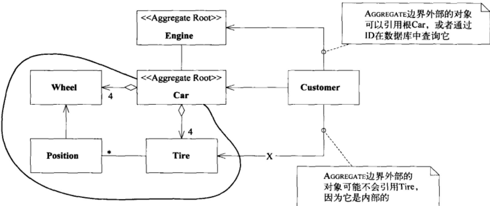


图6-2 本地标识与全局标识及对象引用


固定规则（invariant）是指在数据变化时必须保持不变的一致性规则。AGGREGATE内部的成员之间可能存在固定关系。AGGREGATE中的所有规则并不是每时每刻都被更新为最新的状态。通过事件处理、批处理或其他更新机制，在一定的时间内可以解决部分依赖性。但在每个事务完成时，必须要满足AGGREGATE内所应用的固定规则的要求，如图6-3所示。 

现在，为了实现这个概念上的AGGREGATE，需要对所有事务应用一组规则。 

☐ 根ENTITY具有全局标识，它最终负责检查固定规则。 

□ 根ENTITY具有全局标识。边界内的ENTITY具有本地标识，这些标识只有在AGGREGATE内部才是唯一的。 

☐ AGGREGATE外部的对象不能引用除根ENTITY之外的任何内部对象。根ENTITY可以把对内部ENTITY的引用传递给它们，但这些对象只能临时使用这些引用，而不能保持引用。根 可以把一个VALUE OBJECT的副本传递给另一个对象，而不必关心它发生什么变化，因为它只是一个VALUE，不再与AGGREGATE有任何关联。 

□作为上一条规则的推论，只有AGGREGATE的根才能直接通过数据库查询获取。所有其他对象必须通过关联的遍历才能找到。 

☐ AGGREGATE内部的对象可以保持对其他AGGREGATE根的引用。 

☐ 删除操作必须一次删除AGGREGATE边界之内的所有对象。(利用垃圾收集机制，这很容易做到。由于除根以外的其他对象都没有外部引用，因此删除了根以后，其他对象均会被回收。) 

□当提交对AGGREGATE边界内部的任何对象的修改时，整个AGGREGATE中的所有固定规则都必须被满足。 

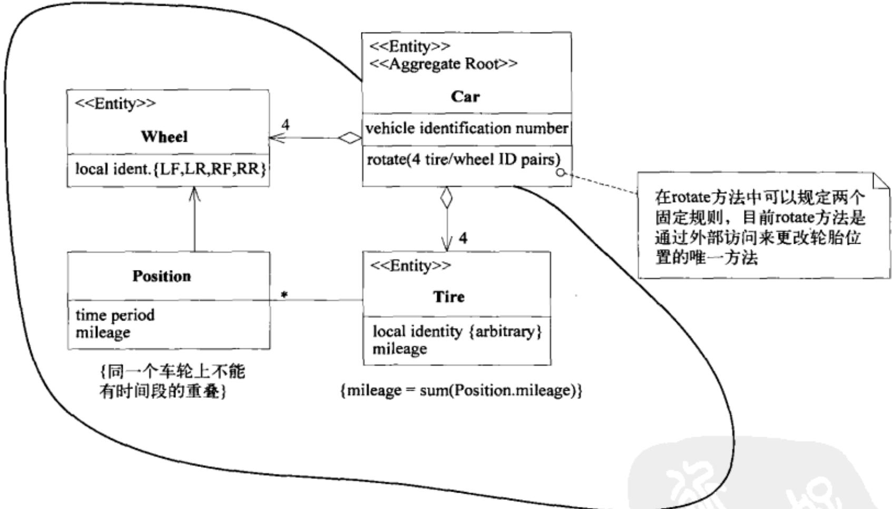


图6-3 AGGREGATE的固定规则


我们应该将ENTITY和VALUE OBJECT分门别类放到AGGREGATE中，并定义每个AGGREGATE的边界。在每个AGGREGATE中，选择一个ENTITY作为根，并通过根来控制对边界内其他对象的所有访问。只允许外部对象保持对根的引用。对内部成员的临时引用可以被传递出去，但仅在一次操作中有效。由于根控制访问，因此不能绕过它来修改内部对象。这种设计有利于确保AGGREGATE中的对象满足所有固定规则，也可以确保在任何状态变化时AGGREGATE作为一个整体满足固定规则。 

有一个能够声明AGGREGATE的技术框架是很有帮助的, 这样就可以自动实施锁定机制和其他一些功能。如果没有这样的技术框架, 团队就必须靠自我约束来使用事先商定的AGGREGATE, 并按照这些AGGREGATE来编写代码。 

129 

## 示例 采购订单的完整性

考虑一个简化的采购订单系统（见图6-4）可能具有的复杂性。 

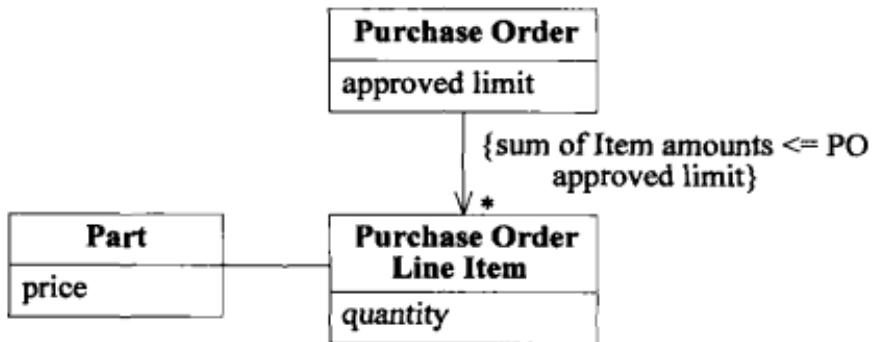


图6-4 一个采购订单系统的模型


这个图表示了一个很典型的采购订单（PO）视图，它被分解为项目（line item），一条固定规则是项目的和不能超过PO总额的限制。现有实现有以下3个互相关联的问题。 

(1) 固定规则的实施。当添加一个新的项目时，PO检查总额，如果新增项目使总额超出限制，则将PO标记为无效。正如我们将要看到的那样，这种保护机制并不充分。 

(2) 变更管理。当PO被删除或存档时，各个项目也将被一块处理，但模型并没有给出关系应该在何处停止。在不同时间更改乐器价格所产生的影响也不明确。 

(3) 数据库共享。数据库会出现由于多个用户竞争使用而带来的问题。 

多个用户将并发地输入和更新各个PO，因此必须防止他们互相干扰。让我们从一个非常简单的策略开始，当一个用户开始编辑任何一个对象时，锁定该对象，直到用户提交事务。这样，当George编辑项目001时，Amanda就无法访问该项目。Amanda可以编辑其他PO上的任何项目（包 

括George正在编辑的PO上的其他项目)，如图6-5所示。 

每个用户都将从数据库读取对象，并在自己的内存空间中实例化对象，并在这里查看和编辑对象。只有当开始编辑时，才会请求进行数据库锁定。因此，George和Amanda可以同时工作，只要他们不同时编辑一个项目即可。一切正常……直到George和Amanda开始编辑同一个PO上的不同项目，如图6-6所示。 

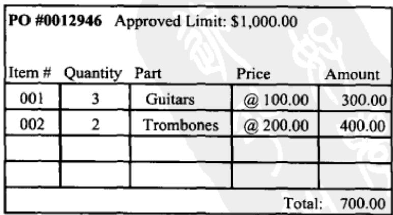


图6-5 数据库中存储的PO的初始情形


George编辑他的视图


George在他的视图中多加了一些guitar（吉他）


<table><tr><td colspan="5">PO #0012946 Approved Limit: $1000.00</td></tr><tr><td>Item #</td><td>Quantity</td><td>Part</td><td>Price</td><td>Amount</td></tr><tr><td>001</td><td>5</td><td>Guitars</td><td>@ 100.00</td><td>500.00</td></tr><tr><td>002</td><td>2</td><td>Trombones</td><td>@ 200.00</td><td>400.00</td></tr><tr><td></td><td></td><td></td><td></td><td></td></tr><tr><td></td><td></td><td></td><td></td><td></td></tr><tr><td colspan="5">Total: 900.00</td></tr></table>


Amanda在她的视图中多加了一把trombone（长号）


<table><tr><td colspan="5">PO #0012946 Approved Limit: $1,000.00</td></tr><tr><td>Item #</td><td>Quantity</td><td>Part</td><td>Price</td><td>Amount</td></tr><tr><td>001</td><td>3</td><td>Guitars</td><td>@ 100.00</td><td>300.00</td></tr><tr><td>002</td><td>3</td><td>Trombones</td><td>@ 200.00</td><td>600.00</td></tr><tr><td></td><td></td><td></td><td></td><td></td></tr><tr><td></td><td></td><td></td><td></td><td></td></tr><tr><td colspan="5">Total: 900.00</td></tr></table>


图6-6 在不同事务中同时进行的编辑


从这两个用户和整个软件的角度来看，他们的操作都没有问题，因为他们忽略了事务期间数据库其他部分所发生的变化，而且每个用户都没有修改被对方锁定的项目。


当这两个用户保存了修改之后，数据库中就存储了一个违反领域模型固定规则的PO。一条重要的业务规则被破坏了，而且没有人知道，如图6-7所示。


显然，锁定单个行并不是一种充分的保护机制。如果一次锁定一个PO，就会防止这样的问题发生，如图6-8所示。


<table><tr><td colspan="5">PO #0012946 Approved Limit: $1,000.00</td></tr><tr><td>Item #</td><td>Quantity</td><td>Part</td><td>Price</td><td>Amount</td></tr><tr><td>001</td><td>5</td><td>Guitars</td><td>@100.00</td><td>500.00</td></tr><tr><td>002</td><td>3</td><td>Trombones</td><td>@200.00</td><td>600.00</td></tr><tr><td></td><td></td><td></td><td></td><td></td></tr><tr><td></td><td></td><td></td><td></td><td></td></tr><tr><td colspan="5">Total: 1,100.00</td></tr></table>

<table><tr><td colspan="5">PO #0012946 Approved Limit: $1,000.00</td></tr><tr><td>Item #</td><td>Quantity</td><td>Part</td><td>Price</td><td>Amount</td></tr><tr><td>001</td><td>5</td><td>Guitars</td><td>@ 100.00</td><td>500.00</td></tr><tr><td>002</td><td>2</td><td>Trombones</td><td>@ 200.00</td><td>400.00</td></tr><tr><td></td><td></td><td></td><td></td><td></td></tr><tr><td></td><td></td><td></td><td></td><td></td></tr><tr><td colspan="5">Total: 900.00</td></tr></table>


图6-7 最后的PO超过了批准限额（破坏了固定规则）


George已经提交更改 


Amanda被锁定在PO #0012946之外 


Amanda获得访问权，George所做的更改被显示出来


<table><tr><td colspan="5">PO #0012946 Approved Limit: $1,000.00</td></tr><tr><td>Item #</td><td>Quantity</td><td>Part</td><td>Price</td><td>Amount</td></tr><tr><td>001</td><td>5</td><td>Guitars</td><td>@ 100.00</td><td>500.00</td></tr><tr><td>002</td><td>3</td><td>Trombones</td><td>@ 200.00</td><td>600.00</td></tr><tr><td></td><td></td><td></td><td></td><td></td></tr><tr><td></td><td></td><td></td><td></td><td></td></tr><tr><td colspan="5">Limit exceeded → Total: 1,100.00</td></tr></table>


图6-8 锁定整个PO可以确保满足固定规则


直到Amanda解决这个问题之前，程序将不允许保存这个事务，Amanda可以通过提高限额或减少一把吉他来解决此问题。这种机制防止了问题，如果人们的主要工作是对很多PO进行操作，那么这可能是一种不错的解决方案。但如果很多人同时对一个大的PO的不同项进行操作时，这种锁定机制就显得很笨拙了。 

即使假设用户在很多小的PO上工作，也会有其他操作可能破坏这条固定规则。考虑Part（部件）这一列。如果当Amanda添加订单时，有人更改了trombone（长号）的price（价格），那么这不也会破坏固定规则吗？ 

那么，我们试着除了锁定整个PO之外，再锁定Part。图6-9显示了当George、Amanda和Sam在不同的PO上工作时将会发生的情况。 

<table><tr><td colspan="5">PO #0012946 Approved Limit: $1,000.00</td></tr><tr><td>Item #</td><td>Quantity</td><td>Part</td><td>Price</td><td>Amount</td></tr><tr><td>001</td><td>2</td><td>Guitars</td><td>@ 100.00</td><td>200.00</td></tr><tr><td>002</td><td>2</td><td>Trombones</td><td>@ 200.00</td><td>400.00</td></tr><tr><td></td><td></td><td></td><td></td><td></td></tr><tr><td></td><td></td><td></td><td></td><td></td></tr><tr><td colspan="5">Total: 600.00</td></tr></table>


Amanda添加trombone，必须等待George完成工作


<table><tr><td colspan="5">Violins被锁定</td></tr><tr><td colspan="5">PO #0012932 Approved Limit: $1,850.00</td></tr><tr><td>Item #</td><td>Quantity</td><td>Part</td><td>Price</td><td>Amount</td></tr><tr><td>001</td><td>3</td><td>Violins</td><td>@ 400.00</td><td>1,200.00</td></tr><tr><td>002</td><td>2</td><td>Trombones</td><td>@ 200.00</td><td>400.00</td></tr><tr><td></td><td></td><td></td><td></td><td></td></tr><tr><td></td><td></td><td></td><td></td><td></td></tr><tr><td colspan="5">Total: 1,600.00</td></tr></table>


Sam添加trombone，必须等待George完成工作


<table><tr><td colspan="5">PO #0013003 Approved Limit: $15,000.00</td></tr><tr><td colspan="5">Item # Quantity Part Price Amount</td></tr><tr><td>001</td><td>1</td><td>Piano</td><td>@1,000.00</td><td>1,000.00</td></tr><tr><td>002</td><td>2</td><td>Trombones</td><td>@ 200.00</td><td>400.00</td></tr><tr><td></td><td></td><td></td><td></td><td></td></tr><tr><td></td><td></td><td></td><td></td><td></td></tr><tr><td colspan="5">Total: 1,400.00</td></tr></table>


图6-9 过于谨慎的锁定会妨碍人们的工作


工作变得越来越麻烦了，因为对乐器（Part）出现了很多争用情况。这样就会发生图6-10中的结果： 

这三个人都需要等待。 

现在我们可以开始改进模型，在模型中加入以下业务知识。 

(1) Part在很多PO中使用（会产生高竞争）。 

(2) 对Part的修改少于对PO的修改。 

(3) 对Price（价格）的修改不一定会传播到现有PO，它取决于修改价格时PO处于什么状态。 

<table><tr><td colspan="5">PO #0012946 Approved Limit: $1,000.00</td></tr><tr><td>Item #</td><td>Quantity</td><td>Part</td><td>Price</td><td>Amount</td></tr><tr><td>001</td><td>2</td><td>Guitars</td><td>@ 100.00</td><td>200.00</td></tr><tr><td>002</td><td>2</td><td>Trombones</td><td>@ 200.00</td><td>400.00</td></tr><tr><td>003</td><td>1</td><td>Violins</td><td>@ 400.00</td><td>400.00</td></tr><tr><td></td><td></td><td></td><td></td><td></td></tr><tr><td colspan="5">Total: 1,000.00</td></tr></table>

133 

图6-10 死锁 

当我们考虑已经被提交并存档的PO时，第3点尤为明显。它们显示的当然是填写时的价格，而不是当前价格。 

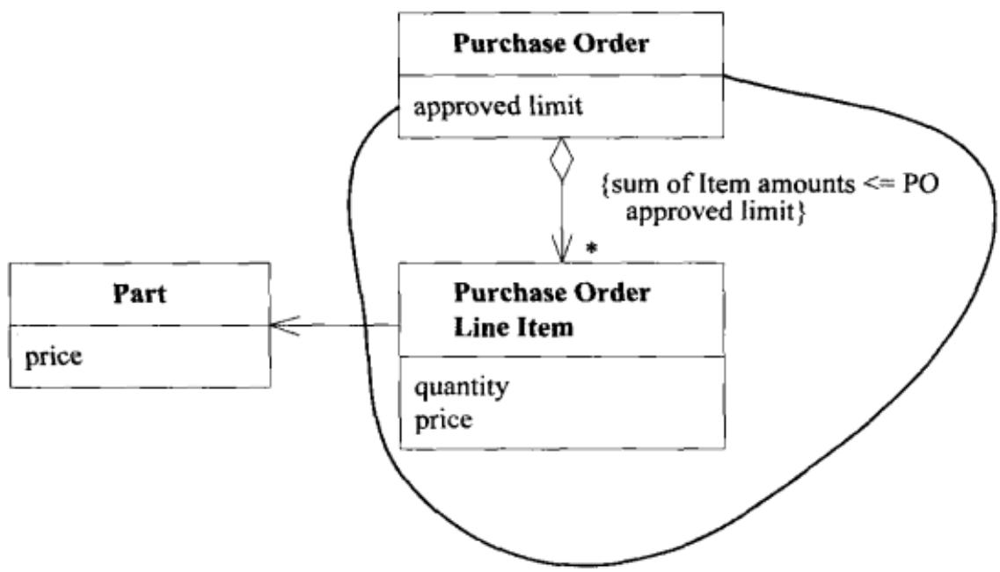


图6-11 Price被复制到Line Item中，现在可以确保满足聚合的固定规则了


按照图6-11这个模型得到的实现可以确保满足与PO和项有关的固定规则，同时对一个部件的价格的修改将不会立即影响引用这个价格的项。涉及面更广的规则可以通过其他方式来满足。例如，系统可以每天为用户列出价格过期的项的队列，这样用户就可以决定是更新还是去掉每个项。但这并不是必须一直保持的固定规则。通过减少项对Part的依赖，可以避免争用，并且能够更好地反映出业务的现实情况。同时，加强PO与项之间的关系可以确保遵守这条重要的业务规则。 

AGGREGATE强制了PO与项之间的符合业务实际的所属关系。PO和项的创建及删除很自然地被联系在一起，而Part的创建和删除却是独立的。 

AGGREGATE划分出一个范围,在这个范围内,生命周期的每个阶段都必须满足一些固定规则。接下来要讨论的两种模式FACTORY和REPOSITORY都是在AGGREGATE上执行操作,它们将特定生命周期转换的复杂性封装起来…… 

135 

## 6.2 模式：FACTORY

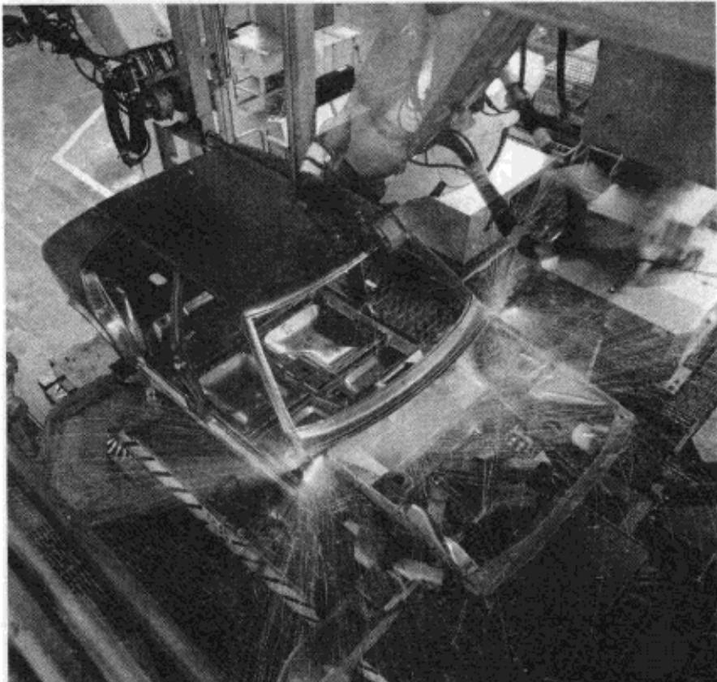


当创建一个对象或创建整个AGGREGATE时，如果创建工作很复杂，或者暴露了过多的内部结构，则可以使用FACTORY进行封装。 

## * * *

对象的功能主要体现在其复杂的内部配置以及关联方面。我们应该一直对一个对象进行提炼，直到所有与其意义或在交互中的角色无关的内容已完全被剔除为止。一个对象在它的生命周期当中要承担大量的职责。如果再让复杂对象负责其自身的创建，那么职责的过载将会导致问题产生。 

汽车发动机是一种复杂的机械装置，它由数十个零件共同协作来履行发动机的职责——使轴转动。我们可以试着设计一种发动机组，让它自己抓取一组活塞并塞到汽缸中，火花塞也可以自己找到插孔并把自己拧进去。但这样组装的复杂机器可能没有我们常见的发动机那样可靠或高效。相反，我们用其他东西来装配发动机。或许是一个机械师，或者是一个工业机器人。无论是机器人还是人，实际上都比二者要装配的发动机复杂。装配零件的工作与使轴旋转的工作完全无关。装配者的功能只是在生产汽车时才需要，我们驾驶时并不需要机器人或机械师。由于汽车的 装配和驾驶永远不会同时发生，因此将这两种功能合并到同一个机制中是毫无价值的。同理，装配复杂的复合对象的工作也最好与对象要执行的工作分开。 

但将职责转交给另一个相关方（应用程序中的客户对象）会产生更严重的问题。客户知道需要完成什么工作，并依靠领域对象来执行必要的计算。如果希望让客户来装配它所需的领域对象，那么它必须要知道对象内部结构的一些知识。为了确保满足应用于领域对象中各部分关系的所有固定规则，客户必须知道对象的一些规则。甚至调用构造函数也会使客户与它要构建的对象的某些具体类产生耦合。对领域对象实现所做的任何修改都要求客户做出相应修改，这使得重构变得更加困难。 

当让一个客户负责创建对象时，它会变得不必要的复杂，而且其职责也会模糊不清。它会破坏领域对象的封装和AGGREGATE的创建。更严重的是，如果客户是应用层的一部分，那么职责就会从领域层泄漏到应用层中。应用层与实现细节之间的这种耦合使得领域层抽象的大部分优势荡然无存，而且导致后续更改的代价变得更加高昂。 

对象的创建本身可以是一个主要操作，但被创建的对象并不适合承担复杂的装配操作。将这些职责混合在一起可能导致出现难以理解的拙劣设计。让客户直接负责创建对象又会使客户的设计陷入混乱，并且破坏被装配对象或AGGREGATE的封装，而且导致客户与被创建对象的实现之间产生过于紧密的耦合。 

复杂的对象创建是领域层的职责，然而这项任务并不属于那些用于表示模型的对象。在有些情况下，对象创建和装配会在领域中产生一次里程碑式的重要事件，例如“开一个银行账户”。但一般情况下，对象创建和装配在领域中并没有什么意义，它们只不过是实现的一种需要。为了解决这一问题，我们必须在领域设计中增加一种新的构造，它不是ENTITY、VALUE OBJECT，也不是SERVICE。这与前一章的论述相违背，因此把它解释清楚很重要。我们正在向设计中添加一些新的元素，但它们不对应于模型中的任何事物，而确实又承担领域层的部分职责。 

每种面向对象的语言都提供了一种创建对象的机制（例如，Java和C++中的构造函数，Smalltalk中的实例创建类），但我们仍然需要一种更加抽象且不与其他对象发生耦合的构造机制。这就是FACTORY，它是一种负责创建其他对象的程序元素。如图6-12所示。 

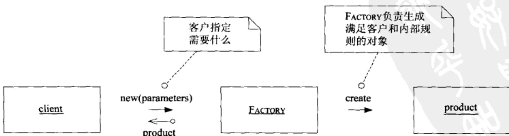


图6-12 与FACTORY的基本交互


正如对象的接口应该封装对象的实现一样(从而使客户无需知道对象的工作机理就可以使用对象的行为)，FACTORY也应该封装创建一个复杂对象或AGGREGATE所需的知识。它提供了一个反映客户目标的接口，以及一个被创建对象的抽象视图。 

因此： 

应该将创建复杂对象的实例和聚合的职责转移给一个单独的对象，这个对象本身在领域模型中可能没有职责，但它仍是领域设计的一部分。提供一个封装所有复杂装配操作的接口，而且这个接口应该不需要客户引用要被实例化的对象的具体类。在创建AGGREGATE时要把它作为一个整体，并确保它满足固定规则。 

## * * *

138 

FACTORY有很多种设计方式。[Gamma et al. 1995]中详尽论述了几种特定目的的创建模式，包括FACTORY METHOD（工厂方法）、ABSTRACT FACTORY（抽象工厂）和BUILDER（构建器）。该书主要研究了一些适用于最复杂的对象构造问题的模式。本书在这里的重点并不是深入讨论FACTORY的设计问题，而是要表明FACTORY的重要地位——它是领域设计中的重要组件。正确使用FACTORY有助于保证MODEL-DRIVEN DESIGN沿正确的轨道前进。 

任何好的工厂都需满足以下两个基本需求。 

(1) 每个创建方法都是原子方法，而且满足被创建对象或AGGREGATE的所有固定规则。FACTORY应该以一致的状态来生成对象。在生成ENTITY时，这意味着创建满足所有固定规则的整个AGGREGATE，但在创建完成后可以向聚合添加一些可选元素。在创建不变的VALUE OBJECT时，这意味着所有属性必须被初始化为正确的最终状态。如果FACTORY通过其接口收到了一个创建对象的请求，而它又无法正确地创建出这个对象，那么它应该抛出一个异常，或者调用某种其他机制，以确保不会返回错误的值。 

(2) FACTORY应该被抽象为所需的类型，而不是创建出具体的类。[Gamma et al. 1995]中的高级FACTORY模式介绍了这一话题。 

## 6.2.1 选择 FACTORY 及其应用位置

一般来说，FACTORY的作用是使创建出的对象将细节隐藏起来，而且我们把FACTORY用在那些需要隐藏细节的地方。这些决定通常与AGGREGATE有关。 

例如，如果需要向一个已存在的AGGREGATE添加元素，可以在AGGREGATE的根上创建一个FACTORY METHOD。这样就可以把AGGREGATE的内部实现细节隐藏起来，使任何外部客户看不到这些细节，同时使根负责确保AGGREGATE在被添加元素时的完整性，如图6-13所示。 

另一个示例是在一个对象上使用FACTORY METHOD，这个对象与生成另一个对象密切相关，但它并不拥有所生成的对象。当一个对象的创建主要使用另一个对象的数据（或许还有规则）时，则可以在后者的对象上创建一个FACTORY METHOD，这样就不必将后者的信息提取到其他地方来 

139 创建前者。这样做还有利于传递前者与后者之间的关系。 

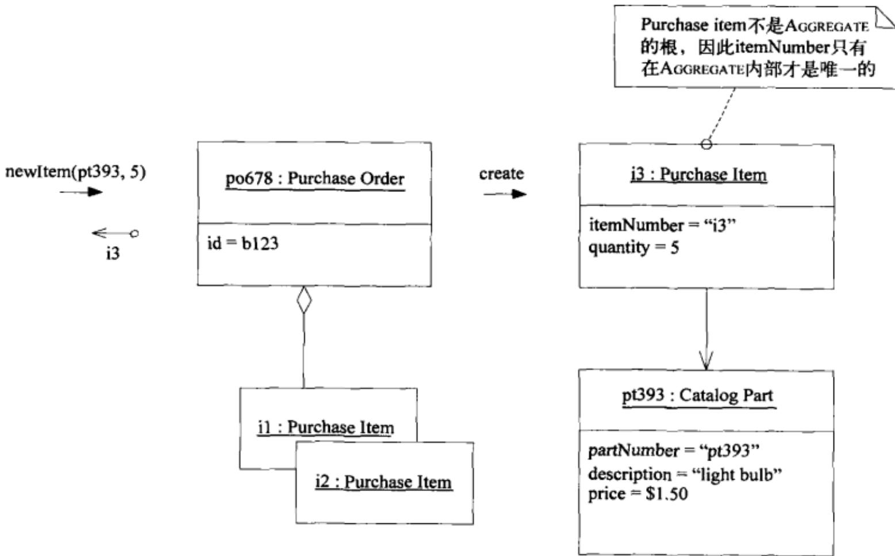


图6-13 一个FACTORY METHOD封装了AGGREGATE的扩展


在图6-14中，Trade Order不属于Brokerage Account所在的那个AGGREGATE，因为它从一开始就与交易执行应用程序进行交互，所以把它放在Brokerage Account中只会碍事。尽管如此，让Brokerage Account负责控制Trade Order的创建却是很自然的事情。Brokerage Account中含有一些将会被嵌入到Trade Order中的信息（从其自己的标识开始），而且它还包含一些规则（这些规则控制了哪些交易是允许的）。隐藏Trade Order的实现细节还会带来一些其他好处。例如，我们可以将它重构为一个层次结构，分别为Buy Order和Sell Order创建一些子类。FACTORY可以避免客户与具体类之间产生耦合。 

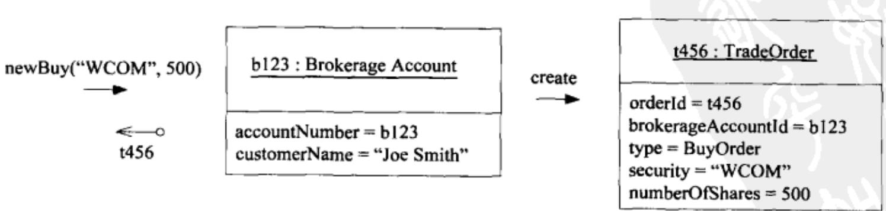


图6-14 FACTORY METHOD生成一个ENTITY，但这个ENTITY并不属于FACTORY所在的AGGREGATE


FACTORY与其产品之间是紧密耦合的，因此FACTORY应该只被关联到与产品有着紧密的自然关系的对象。当有些细节需要隐藏（无论要隐藏的是具体实现还是构造的复杂性）而又找不到一个自然的地方来隐藏它们时，必须创建一个专用的FACTORY对象或SERVICE。整个AGGREGATE通常由一个独立的FACTORY来创建，FACTORY负责把对根的引用传递出去，并确保创建出的AGGREGATE满足固定规则。如果AGGREGATE内部的某个对象需要一个FACTORY，而这个FACTORY又不适合在AGGREGATE根上创建，那么应该构建一个独立的FACTORY。但仍应遵守规则——把访问限制在AGGREGATE内部，并确保从AGGREGATE外部只能对产品进行临时引用，如图6-15所示。 

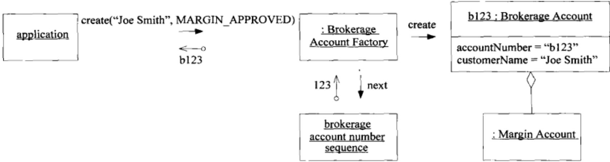


图6-15 由一个独立的FACTORY来构建AGGREGATE


## 6.2.2 有些情况下只需使用构造函数

我曾经在很多代码中看到过所有实例都是通过直接调用类构造函数来创建的，或者是使用编程语言的最基本的实例创建方式。FACTORY的引入提供了巨大的优势，而这种优势往往并未得到充分利用。但是，在有些情况下直接使用构造函数确实是最佳选择。FACTORY实际上会使那些不具有多态性的简单对象复杂化。 

在以下情况下最好使用简单的、公共的构造函数。 

☐ 类（class）是一种类型（type）。它不是任何相关层次结构的一部分，而且也没有通过接口实现多态性。 

□ 客户关心的是实现，可能是将其作为选择STRATEGY的一种方式。 

□ 客户可以访问对象的所有属性，因此向客户公开的构造函数中没有嵌套的对象创建。 

构造并不复杂。 

☐ 公共构造函数必须遵守与FACTORY相同的规则：它必须是一个原子操作，而且满足被创建对象的所有固定规则。 

不要在构造函数中调用其他类的构造函数。构造函数应该保持绝对简单。复杂的装配，特别是AGGREGATE，需要使用FACTORY。选择使用小的FACTORY METHOD的门槛并不高。 

Java类库提供了一些有趣的例子。所有集合都实现了接口，接口使得客户与具体实现之间不产生耦合。然而，它们都是通过直接调用构造函数创建的。但是，集合类本来是可以使用FACTORY 来封装集合的层次结构的。而且，客户也可以使用FACTORY的方法来请求所需的特性，然后由FACTORY来选择适当的类来实例化。这样一来，创建集合的代码就会有更强的表达力，而且在安装新的集合类时不会破坏每个Java程序。 

但在某些场合下使用具体的构造函数更为合适。首先，在很多应用程序中，实现方式的选择对性能的影响是非常敏感的，因此应用程序需要控制选择哪种实现（尽管如此，真正智能的FACTORY仍然可以满足这些因素的要求）。不管怎样，集合类的数量并不多，因此选择并不复杂。 

虽然没有使用FACTORY，但抽象集合类型仍然具有一定价值，原因就在于它们的使用模式。集合通常都是在一个地方创建，而在其他地方使用。这意味着最终使用集合（添加、删除和检索其内容）的客户仍可以与接口进行对话，从而不与实现发生耦合。集合类的选择通常由拥有该集合的对象来决定，或是由该对象的FACTORY来决定。 

## 6.2.3 接口的设计

当设计FACTORY的方法签名时，无论是独立的FACTORY还是FACTORY METHOD，都要记住以下两点。 

☐ 每个操作都必须是原子的。我们必须在与FACTORY的一次交互中把创建对象所需的所有信息传递给FACTORY。同时必须决定当某些固定规则没有被满足而导致创建失败时，将执行什么操作。可以抛出一个异常或仅仅返回null。为了保持一致，可以考虑采用一个编码标准来处理FACTORY失败。 

☐ Factory将与其参数发生耦合。如果在选择输入参数时不小心，可能会产生错综复杂的依赖关系。耦合程度取决于对参数（argument）的处理。如果只是简单地将参数插入到要构建的对象中，则依赖度就是适中的。如果从参数中选出一部分在构造对象时使用，耦合将更紧密。 

最安全的参数是那些来自较低的设计层的参数。即使在同一层中，也有一种自然的分层倾向，其中更基本的对象被更高层的对象使用（第10章将从不同方面讨论这样的分层，第16章也会论述这个问题）。 

另一个好的参数选择是与模型中的产品密切相关的对象，这样不会增加新的依赖性。在前面的Purchase Order Item示例中，FACTORY METHOD将Catalog Part作为一个参数，它是Item的一个重要的关联。这在Purchase Order类和Part之间增加了直接的依赖性。但这三个对象组成了一个关系密切的概念小组。不管怎样，Purchase Order的AGGREGATE已经引用了Part。因此将控制权交给AGGREGATE根，并封装AGGREGATE的内部结构是一个不错的折中选择。 

使用抽象类型的参数，而不是它们的具体类。FACTORY与产品的具体类发生耦合，而无需与具体的参数发生耦合。 

## 6.2.4 固定规则的逻辑应放置在哪里

FACTORY负责确保它所创建的对象或AGGREGATE满足所有固定规则，然而在把应用于一个对 象的规则移到该对象外部之前应三思。FACTORY可以将固定规则检查工作委派给产品，而且这通常是最佳选择。 

但FACTORY与它们的产品之间存在一种特殊的关系。FACTORY已经知道其产品的内部结构，而且使用FACTORY的目的也是很明确的，那就是要把产品创建出来。在某些情况下，把固定规则逻辑放到FACTORY中是有优点的，这样可以避免产品中发生混乱。对于AGGREGATE规则来说尤其如此（这些规则约束很多对象）。但固定规则逻辑却特别不适合放到那些与其他领域对象关联的FACTORY METHOD中。 

虽然原则上在每个操作结束时都应该应用固定规则，但通常对象所允许的转换可能永远也不会用到这些规则。可能ENTITY标识属性的赋值需要满足一条固定规则。但该标识在创建后可能一直保持不变。VALUE OBJECT则是完全不变的。如果一个逻辑在对象的有效生命周期内永远也不被用到，那么对象就没有必要携带这个逻辑。在这种情况下，FACTORY是放置固定规则的合适地方，这样可以使FACTORY创建出的产品更简单。 

## 6.2.5 ENTITY FACTORY 与 VALUE OBJECT FACTORY

ENTITY FACTORY与VALUE OBJECT FACTORY有两个方面的不同。由于VALUE OBJECT是不可变的，所以完成产品就是最终形式。因此FACTORY操作必须要提供产品的完整描述。而ENTITY FACTORY则只需具有构造有效AGGREGATE所需的那些属性。如果固定规则不需要细节，则可以过后再添加这些细节。 

我们来看一下为ENTITY分配标识时将涉及的问题（VALUE OBJECT不会涉及这些问题）。正如第5章所指出的那样，既可以由程序自动分配一个标识符，也可以通过外部（通常是用户）提供一个标识符。如果客户的标识是通过电话号码跟踪的，那么该电话号码必须作为参数被显式地传递给FACTORY。当由程序分配标识符时，FACTORY是控制它的理想场所。尽管唯一跟踪ID实际上是由数据库“序列”或其他基础设施机制生成的，但FACTORY知道需要什么样的标识，以及将标识放到何处。 

## 6.2.6 重建已存储的对象

到目前为止，FACTORY只是发挥了它在对象生命周期开始时的作用。到了某一时刻，大部分对象都要存储在数据库中或通过网络传输，而在当前的数据库技术中，几乎没有哪种技术能够保持对象的内容特征。大多数传输方法都要将对象转换为平面数据才能传输，这使得对象只能以非常有限的形式出现。因此，检索操作潜在地需要一个复杂的过程将各个部分重新装配成一个可用的对象。 

用于重建对象的FACTORY与用于创建对象的FACTORY很类似，主要有以下两点不同。 

(1)用于重建对象的ENTITYFACTORY不分配新的跟踪ID。如果重新分配ID，将与先前的对象ID发生冲突。因此，在重建对象的FACTORY中，标识属性必须是输入参数的一部分。 

(2) 当固定规则未被满足时，重建对象的FACTORY采用不同的处理方式。当创建新对象时，如果未满足固定规则，FACTORY应该简单地拒绝创建对象，但在重建对象时则需要更灵活的响应。如果对象已经在系统的某个地方存在（例如在数据库中），那么不能忽略这个事实。但是，同样也不能任凭规则被破坏。必须通过某种策略来修复这种不一致的情况，这使得重建对象比创建新对象更困难。 

图6-16和图6-17显示了两种重建。当从数据库中重建对象时，对象映射技术就可以提供部分或全部所需服务，这是非常便利的。当从其他介质重建对象时，如果出现复杂情况，FACTORY是一个很好的选择。 

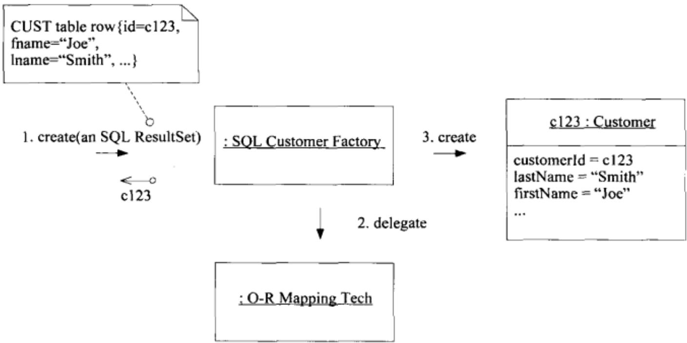


图6-16 从关系数据库中检索一个ENTITY并重建它


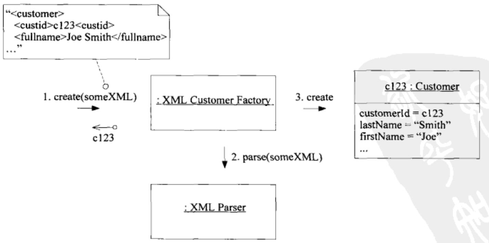


图6-17 重建以XML形式传输的ENTITY


总之，必须把创建实例的访问点标识出来，并显式地定义它们的范围。它们可能只是构造函数，但通常需要有一种更抽象或更复杂的实例创建机制。为了满足这种需求，需要在设计中引入新的构造——FACTORY。FACTORY通常不表示模型的任何部分，但它们是领域设计的一部分，能够使模型更明确地表示出对象。 

FACTORY封装了对象创建和重建时的生命周期转换。另一种大大增加了领域设计的技术复杂性的转换是对象与存储之间的互相转换。这种转换由另一种领域设计构造来完成，它就是REPOSITORY。 

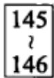


## 6.3 模式：REPOSITORY


我们可以通过对象之间的关联来找到对象。但当它处于生命周期的中间时，必须要有一个起点，以便从这个起点遍历到一个ENTITY或VALUE。 

## * * *

无论要对一个对象执行什么操作，都需要保持一个对它的引用。那么如何获得这个引用呢？一种方法是创建对象，因为创建操作将返回对新对象的引用。第二种方法是遍历一个关联。我们以一个已知对象作为起点，并向它索取一个关联的对象。这样的操作在任何面向对象的程序中都会大量用到，而且对象之间的这些链接使对象模型具有更强的表达能力。但我们必须首先获得作为起点的那个对象。 

实际上，我曾经遇到过一个项目，团队成员对MODEL-DRIVEN DESIGN怀有极大的热情，因而试图通过创建对象或遍历对象的方法来访问所有对象。他们的对象存储在对象数据库中，而且他们据此推理出已有的概念关系将提供所有必需的关联。他们只需完成充分的分析工作，以便使整个领域满足内聚的要求。这种自己强加的限制导致他们创建出的模型错综复杂，而前几章我们一直试图通过仔细地实现ENTITY和应用AGGREGATE来避免这种复杂性。这种策略并没有坚持多长时间，但团队成员一直也没有用一种更有条理的方法来取代它。他们临时拼凑了一些解决方案，也放弃了最初的宏伟抱负。 

想到这种方法的人并不多，尝试它的人就更少了，因为人们将大部分对象存储在关系数据库中。这种存储技术使人们自然而然使用第三种获取引用的方式——基于对象的属性，执行查询来找到对象；或者是找到对象的组成部分，然后重建它。 

数据库搜索是全局可访问的，它使我们可以直接访问任何对象。不必为了将对象关系网控制在可管理的范围内而使所有对象都互连起来。是提供遍历还是依靠搜索，这成为一个设计决策，需要在搜索的解耦与关联的内聚之间做出权衡。Customer对象是否应该保持所有Order的集合？是否应该通过Customer ID字段在数据库中查找Order？要想得到一个易于理解的设计，需要选择一个正确的搜索和关联组合。 

遗憾的是，开发人员一般不会过多地考虑这种精细的设计，因为他们满脑子都是大量需要用到的机制，以便很有技巧地利用它们来实现对象的存储、取回和最终的删除。 

现在，从技术的观点来看，检索一个已存储对象的过程实际上属于一种创建对象的操作，因为从数据库中检索出来的数据被用来组装新的对象。实际上，由于我们经常要编写这样的代码，这一次又一次地使我们觉得检索对象就是在创建对象。但从概念上讲，对象的检索发生在ENTITY 的生命周期的中间。Customer对象并不代表一个新的客户，因为它已经在数据库中存在，我们只是把它检索出来。为了记住这个区别，我把从已存储的数据中创建实例的过程称为重建。 

领域驱动设计的目标是通过关注领域模型（而不是技术）来创建更好的软件。假设开发人员构造了一个SQL查询，并将它传递给基础设施层中的某个查询服务，然后再根据得到的表行数据的结果集提取出所需信息，最后将这些信息传递给构造函数或FACTORY。开发人员执行这一连串操作的时候，早已不再把模型当作重点了。我们很自然地会把对象看作容器来放置查询出来的数据，这样整个设计就转向了一种数据处理风格。虽然具体的技术细节有所不同，但问题仍然存在——客户处理的是技术，而不是模型概念。诸如METADATA MAPPING LAYER（[Fowler 2002]）这样的基础设施可以提供很大帮助，利用它很容易将查询结果转换为对象，但开发人员考虑的仍然是技术机制，而不是领域。更糟的是，由于客户代码直接使用数据库，因此开发人员会试图绕过模型的一些特色功能（例如AGGREGATE，甚至是对象封装），而直接获取和操作他们所需的数据。这将导致越来越多的领域规则被嵌入到查询代码中，或者干脆丢失了。对象数据库确实消除了转换问题，但搜索机制还是很机械的，开发人员仍对他们所需的对象感兴趣。 

客户需要以一种符合实际的方式来获取对已存在的领域对象的引用。如果基础设施随随便便地就允许开发人员获得这些引用，那么他们可能会增加很多可遍历的关联，这会使模型变得非常混乱。另一方面，开发人员可能使用查询从数据库中提取他们所需的数据，或是直接提取几个具体的对象，而不是通过从AGGREGATE根开始导航来得到这些对象。这样会导致领域逻辑泄露到查询和客户代码中，而且ENTITY和VALUE OBJECT变成单纯的数据容器。大多数用于数据库访问的基础设施的技术复杂性很快就会使客户代码变得混乱，这将导致开发人员放弃领域层，最后使模型变得无关紧要。 

根据到目前为止所讨论的设计原则，我们可以在某种程度上缩小对象访问问题的范围，假设我们找到一种访问方法，它能够明确地将模型作为焦点，从而应用这些原则。初学者可以不必关心临时对象。临时对象（通常是VALUE OBJECT）只存在很短的时间，在客户操作中用到它们时才创建它们，用完就删除了。我们也不需要对那些很容易通过遍历来找到的持久对象进行查询访问。例如，人的地址可以通过Person对象获取。而且最重要的是，除了可以使用从根遍历来查找对象这种方法以外，禁止用其他方法对AGGREGATE内部的任何对象进行访问。 

149 

持久化的VALUE OBJECT一般可以通过从某个ENTITY遍历来找到，在这里ENTITY就是把对象封装在一起的AGGREGATE的根。事实上，对VALUE的全局搜索访问常常是没有意义的，因为通过属性找到VALUE OBJECT相当于用这些属性创建一个新实例。但也有例外情况。例如，我在规划旅行线路时，有时会保存几个想要去的路线，过后再回头从中选择一个来预订。这些路线就是VALUE（如果两条路线由相同的航班构成，那么我不会关心哪个是哪个），但它们已经与我的用户名关联到一起了，而且可以原封不动地将它们检索出来。另一个例子是“枚举”，在枚举中一个类型有一组严格限定的、预定义的可能值的集合。但是，对VALUE OBJECT的全局访问比对ENTITY的全局访问更少见，而且，如果确实需要在数据库中搜索一个已存在的VALUE，那么应该考虑到搜索结果可能实际上是一个ENTITY，只是尚未识别它的标识。 

从上面的讨论显然可以看出，大多数对象都不应该通过全局搜索来访问。如果很容易就能从设计中看出那些确实需要全局搜索访问的对象，那该有多好！ 

现在可以更精确地将问题重新表述如下： 

在所有持久对象中，有一小部分必须能够通过基于对象属性的搜索来全局访问。当不易通过遍历的方式来访问某些AGGREGATE根的时候，就需要使用这种访问方式。它们通常是ENTITY，有时是具有复杂内部结构的VALUE OBJECT，有时还可能是枚举VALUE。而其他对象则不宜使用这种访问方式，因为这会混淆它们之间的重要区别。毫无约束的数据库查询可能会破坏领域对象的封装和AGGREGATE。技术基础设施和数据库访问机制的暴露会增加客户的复杂度，并妨碍模型驱动的设计。 

有大量的技术可用来解决数据库访问的技术难题，例如将SQL封装到QUERY OBJECT中，或利用METADATA MAPPING LAYER进行对象和表之间的转换（[Fowler 2002]）。FACTORY可以帮助重建那些已存储的对象（本章后面将会讨论）。这些技术和很多其他技术有助于控制数据库访问的复 

杂度。 

有得必有失，我们应该注意失去了什么。我们已经不再把概念放在领域模型中思考。代码也不再表达出业务，而是对数据库检索技术进行操纵。REPOSITORY是一个简单的概念框架，它可用来封装这些解决方案，并使我们的注意力重新回到模型上。 

REPOSITORY将同一类型的所有对象表示为一个概念集合（通常是模拟的）。它的行为类似于集合，只是具有更复杂的查询功能。在添加或删除相应类型的对象时，REPOSITORY的后台机制负责将对象添加到数据库中，或从数据库中删除对象。这个定义表明，AGGREGATE把一组紧密相关的职责收集到一起，这些职责提供了对AGGREGATE根的从其生命周期开始直至结束的全程访问。 

客户使用查询方法向REPOSITORY请求对象，这些查询方法根据客户所指定的标准（通常是特定属性的值）来挑选对象。REPOSITORY检索被请求的对象，并封装数据库查询和元数据映射机制。REPOSITORY可以根据客户所要求的各种标准来挑选对象。它们也可以返回汇总信息，例如有多少个实例满足查询条件。REPOSITORY甚至能返回汇总计算，例如所有匹配对象的某个数值属性的总和，如图6-18所示。 

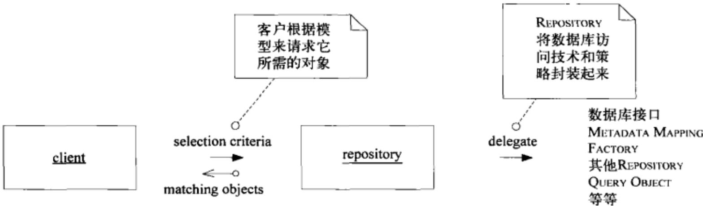


图6-18 REPOSITORY为客户执行一个搜索


REPOSITORY解除了客户的巨大负担，使客户只需与一个简单的、易于理解的接口进行对话，并根据模型向这个接口提出它的请求。要实现所有这些功能需要大量复杂的技术基础设施，但接口很简单，而且从概念上讲，接口与领域模型是紧密联系的。 

因此： 

为每种需要全局访问的对象类型创建一个对象，这个对象就相当于该类型的所有对象在内存中的一个集合的“替身”。通过一个众所周知的接口来提供访问。提供添加和删除对象的方法，用这些方法来封装在数据存储中实际插入或删除数据的操作。提供根据具体标准来挑选对象的方法，并返回属性值满足查询标准的对象或对象集合（所返回的对象是完全实例化的），从而将实际的存储和查询技术封装起来。只为那些确实需要直接访问的AGGREGATE根提供REPOSITORY。让客户始终聚焦于模型，而将所有对象存储和访问操作交给REPOSITORY来完成。 

REPOSITORY有很多优点，包括： 

□ 它们为客户提供了一个简单的模型，可用来获取持久对象并管理它们的生命周期； 

☐ 它们使应用程序和领域设计与持久化技术（多种数据库策略甚至是多个数据源）解耦； 

□ 它们体现了有关对象访问的设计决策； 

☐ 可以很容易将它们替换为“哑实现”（dummy implementation），以便在测试中使用（通常使用内存中的集合）。 

## 6.3.1 REPOSITORY 的查询

所有存储库都为客户提供了根据某种标准来查询对象的方法,但如何设计这个接口却有很多选择。 

最容易构建的REPOSITORY用硬编码的方式来实现一些具有特定参数的查询。这些查询可以是各种各样的，例如通过标识来检索ENTITY（几乎所有REPOSITORY都提供了这种查询）、通过某个特定属性值或一个复杂的参数组合来请求一个对象集合、根据值域（例如日期范围）来选择对象，甚至可以执行某些属于REPOSITORY一般职责范围内的计算（特别是利用那些底层数据库所支持的操作）。如图6-19所示。 

尽管大多数查询都返回一个对象或对象集合，但返回某些类型的汇总计算也是符合REPOSITORY概念的，例如符合条件的对象数目，或模型中所有匹配对象的某个数值属性的总和。 

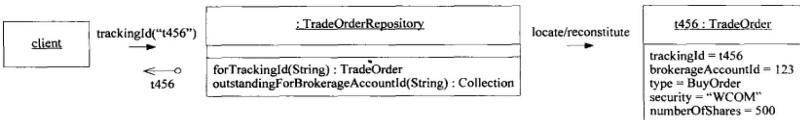


图6-19 在简单REPOSITORY中进行的硬编码查询


在任何基础设施上，都可以构建硬编码式的查询，也不需要很大的投入，因为即使它们不做这些事，一些客户也必须要做。 

在一些需要执行大量查询的项目上，可以构建一个支持更灵活的查询的REPOSITORY框架。如图6-20所示。这要求开发人员熟悉必要的技术，而且还需要有一个支持这些查询的基础设施。 

基于SPECIFICATION的查询特别适合作为一个框架来使用，通过它可以对绝大多数的REPOSITORY进行查询。客户可以使用规格来描述（也就是指定）它需要什么，而不必关心如何获得结果。在这个过程中，可以创建一个对象来实际执行筛选操作。第9章将深入讨论这种模式。 

基于SPECIFICATION的查询是一种优雅且灵活的查询方法。根据所用的基础设施的不同，它可能是一个非常适度的框架，也可能极为复杂。Rob Mee和Edward Hieatt在[Fowler 2002]一书中讨论了设计这样的REPOSITORY时所涉及的更多技术问题。 

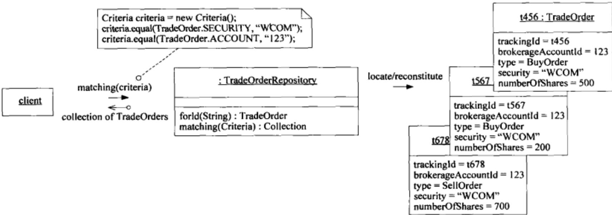


图6-20 在一个复杂的REPOSITORY中，用一种灵活的、声明式的


SPECIFICATION来表述一个搜索标准


即使一个REPOSITORY的设计采取了灵活的查询方式，也应该允许添加专门的硬编码查询。这些查询作为便捷的方法，可以封装常用查询或不返回对象（例如返回的是选中对象的汇总计算）的查询。不支持这些特殊查询方式的框架有可能会扭曲领域设计，或是干脆被开发人员弃之不用。 

## 6.3.2 客户代码可以忽略 REPOSITORY 的实现，但开发人员不能忽略

持久化技术的封装可以使得客户变得十分简单，并且使客户与REPOSITORY的实现之间完全解耦。但像一般的封装一样，开发人员必须知道在封装背后都发生了什么事情。在使用REPOSITORY时，不同的使用方式或工作方式可能会对性能产生极大的影响。 

Kyle Brown曾告诉过我他的一段经历，有一次他被请去解决一个基于WebSphere的生产应用程序的问题，当时这个程序正处于生产部署阶段。系统在运行几小时后会莫名其妙地耗尽内存。Kyle在检查代码后发现了原因：在某一时刻，系统需要将工厂中每件产品的信息汇总到一起。开发人员使用一个名为all objects（所有对象）的查询来进行汇总，这个操作对每个对象进行实例化，然后选择他们所需的数据。这段代码的结果是一次性将整个数据库装入内存中！这个问题在测试中并未发现，原因是测试数据较少。 

这是一个明显的禁忌，而一些更不容易注意到的疏忽可能会产生同样重要的问题。开发人员需要理解使用封装行为的隐含问题，但这并不意味着要熟悉实现的每个细节。设计良好的组件是可以被刻画出来的（这是第10章的重点之一）。 

正如第5章所讨论的那样，底层技术可能会限制我们的建模选择。例如，关系数据库可能对复合对象结构的深度有一个实际的限制。同样，开发人员必须在REPOSITORY的使用和它的查询实现之间建立一种双向反馈机制。 

## 6.3.3 REPOSITORY 的实现

根据所使用的持久化技术和基础设施的不同，存储库的实现也将有很大的变化。理想的实现是向客户隐藏所有内部工作细节（尽管不向客户的开发人员隐藏这些细节），这样不管数据是存储在对象数据库中，还是存储在关系数据库中，或是简单地保持在内存中，客户代码都相同。REPOSITORY将会委托相应的基础设施层服务来完成工作。将存储、检索和查询机制封装起来是REPOSITORY实现的最基本的特性，如图6-21所示。 

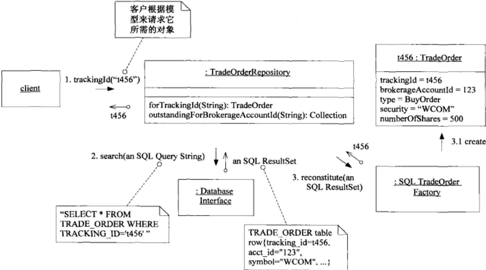


图6-21 REPOSITORY将底层数据存储封装起来


REPOSITORY概念在很多情况下都适用。可能的实现方法有很多，这里只能列出如下一些需要记住的注意事项。 

☐ 对类型进行抽象。REPOSITORY “含有” 特定类型的所有实例，但这并不意味着每个类都需要有一个 REPOSITORY。类型可以是一个层次结构中的抽象的超类（例如，TradeOrder 可以是 BuyOrder 或 SellOrder）。类型可以是一个接口（即使这个接口的实现者与该类型没有层次结构上的关联），也可以是一个具体的类。记住，由于数据库技术缺乏这样的多态性质，因此我们将面临很多约束。 

□充分利用REPOSITORY与客户解耦的优点。如果客户直接调用REPOSITORY，那么我们修改其实现的自由度就小多了。也可以利用解耦来优化性能，因为这样就可以使用不同的查询技术，或在内存中缓存对象，这样可以随时自由地切换持久化策略。通过提供一个易 于操纵的、内存中的（in-memory）哑实现，还能够方便客户代码和领域对象的测试。 

☐ 将事务的控制权留给客户。尽管REPOSITORY可以对数据库执行插入和删除数据的操作，但它一般不会提交事务。例如，在保存一个事务之后，应该提交它，而客户所处的位置使其看起来正应该负责初始化和提交工作单元。如果REPOSITORY不插手事务控制，那么事务管理就会简单得多。 

通常，项目团队会在基础设施层中添加一个框架，用来支持REPOSITORY的实现。REPOSITORY超类除了与较低层的基础设施组件进行协作以外，还可以实现一些基本的查询，特别是要实现的灵活的查询。遗憾的是，在一个类型系统中（例如Java的类型），这种方法会使返回的对象只能是Object类型，而让客户将它们转换为REPOSITORY含有的类型。当然，如果在Java中查询所返回的对象是集合时，客户不管怎样都要执行这样的转换。 

有关实现REPOSITORY的更多指南和一些支持性技术模式（例如QUERY OBJECT）可以在([Fowler 2002])一书中找到。 

## 6.3.4 在框架内工作

在实现REPOSITORY这样的构造之前，需要认真思考所使用的基础设施，特别是架构框架。这些框架可能提供了一些可用来轻松创建REPOSITORY的服务，但也可能会妨碍创建REPOSITORY的工作。我们可能会发现架构框架已经定义了一种用来实现对象持久化的等效模式，也有可能定义了一种与REPOSITORY完全不同的模式。 

例如，你的项目可能会使用J2EE。看看这个框架与MODEL-DRIVEN DESIGN之间有哪些概念上近似的地方（记住，实体bean与ENTITY不是一回事），你可能会把实体bean和AGGREGATE根当作一对类似的概念。在J2EE框架中，负责对这些对象进行访问的构造是EJB Home。但如果把EJB Home装饰成REPOSITORY的样子可能会导致其他问题。 

一般来讲，在使用框架时要顺其自然。在大方向上要保持领域驱动设计的基本要素，而一些不符的细节则不必过分苛求。注意观察领域驱动设计的概念与框架中的概念之间的相似性。这里的假设是除了使用框架之外没有别的选择。很多J2EE项目根本不使用实体bean。如果可以自由选择，那么应该选择与你所使用的设计风格相协调的框架或框架中的一些部分。 

## 6.3.5 REPOSITORY 与 FACTORY 的关系

FACTORY负责处理对象生命周期的开始，而REPOSITORY帮助管理生命周期的中间和结束。当对象驻留在内存中或存储在对象数据库中时，这是很好理解的。但通常至少有一部分对象存储在关系数据库、文件或其他非面向对象的系统中。在这些情况下，检索出来的数据必须被重建为对象形式。 

由于在这种情况下REPOSITORY基于数据来创建对象，因此很多人认为REPOSITORY就是FACTORY，而从技术角度来看的确如此。但我们最好还是从模型的角度来看待这一问题，而且前 面讲过，重建一个已存储的对象并不是创建一个新的概念对象。从领域驱动设计的角度来看，FACTORY和REPOSITORY具有完全不同的职责。FACTORY负责制造新对象，而REPOSITORY负责查找已有对象。REPOSITORY应该让客户感觉到那些对象就好像驻留在内存中一样。对象可能必须被重建（的确，可能会创建一个新实例），但它是同一个概念对象，仍旧处于生命周期的中间。 

REPOSITORY也可以委托FACTORY来创建一个对象，这种方法（虽然实际很少这样做，但在理论上是可行的）可用于从头开始创建对象，此时就没有必要区分这两种看问题的角度了，如图6-22所示。 

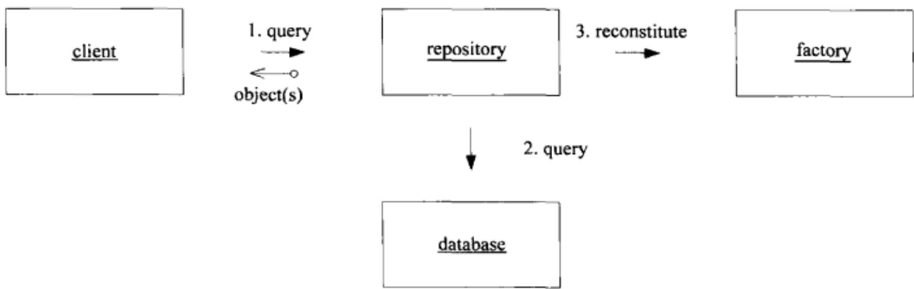


图6-22 REPOSITORY使用FACTORY来重建一个已有对象


这种职责上的明确区分还有助于FACTORY摆脱所有持久化职责。FACTORY的工作是用数据来实例化一个可能很复杂的对象。如果产品是一个新对象，那么客户将知道在创建完成之后应该把它添加到REPOSITORY中，由REPOSITORY来封装对象在数据库中的存储，如图6-23所示。 

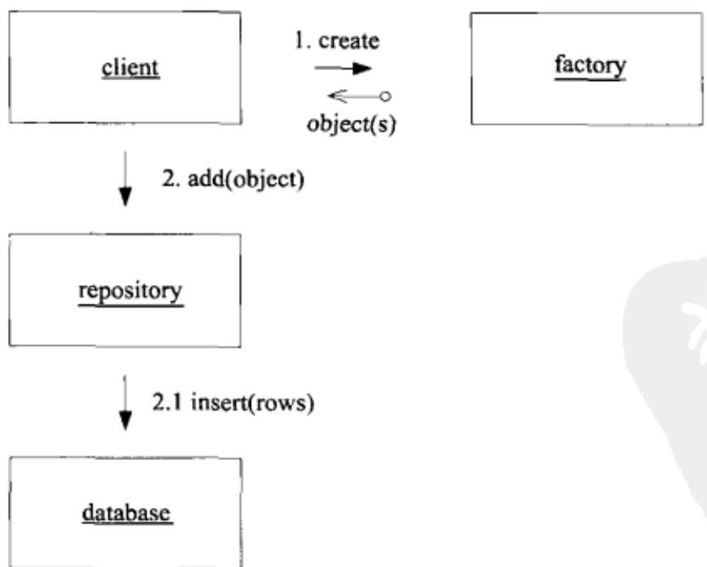


图6-23 客户使用REPOSITORY来存储新对象


另一种情况促使人们将FACTORY和REPOSITORY结合起来使用，这就是想要实现一种“查找或创建”功能，即客户描述它所需的对象，如果找不到这样的对象，则为客户新创建一个。我们最 

158 好不要追求这种功能，它不会带来多少方便。当将ENTITY和VALUE OBJECT区分开时，很多看上去有用的功能就不复存在了。需要VALUE OBJECT的客户可以直接请求FACTORY来创建一个。通常，在领域中将新对象和原有对象区分开是很重要的，而将它们明显组合在一起的框架实际上只会使局面变得混乱。 

## 6.4 为关系数据库设计对象

在以面向对象技术为主的软件系统中，最常用的非对象组件就是关系数据库。这种现状产生了一个常见的问题：将范式混合起来使用（参见第5章）。但与大部分其他组件相比，数据库与对象模型的关系要紧密得多。数据库不仅仅与对象进行交互，而且它还把构成对象的数据存储为持久化形式。已经有大量的文献对于如何将对象映射到关系表以及如何有效存储和检索它们这样的技术挑战进行了讨论。最近的一篇讨论可参见[Fowler 2002]一书。有一些相当完善的工具可用来创建和管理它们之间的映射。除了技术上的难点以外，这种不匹配可能对对象模型产生很大的影响。 

有3种常见情况： 

(1) 数据库是对象的主要存储库； 

(2) 数据库是为另一个系统设计的； 

(3) 数据库是为这个系统设计的，但它的任务不是用于存储对象。 

如果数据库模式（database schema）是专门为对象存储而设计的，那么接受模型的一些限制是值得的，这样可以让映射变得简单一点。如果在数据库模式设计上没有其他的要求，那么可以精心设计数据库结构，以便使得在更新数据时能更安全地保证聚合的完整性，并使数据更新变得更加高效。从技术上来看，关系表的设计不必反映出领域模型。映射工具已经非常精巧了，足以消除二者之间的巨大差别。问题在于多个重叠的模型显得过于复杂了。MODEL-DRIVEN DESIGN的很多原则（例如避免将分析和设计模型分开）也同样适用于这种不匹配问题。这确实会牺牲对象模型的一些丰富性，而且有时必须在数据库设计中做出一些折中（例如有些地方不能规范化）。但如果不做这些牺牲就会冒另一种风险，那就是模型与实现之间失去了紧密的耦合。这种方法并不要必须使用一种简单的、一个对象/一个表的映射。视乎映射工具的功能，可以实现一些聚合或对象的组合。但使映射保持透明这一点是至关重要的，这样就很容易通过在映射工具中检查代码或观察各个项来理解映射。 

☐ 当数据库被视作对象存储时，数据模型与对象模型的差别不应太大（不管映射工具有多么强大的功能）。可以牺牲对象关系的一点丰富性，以保证它与关系模型的紧密关联。如果有助于简化对象映射的话，不妨牺牲某些正式的关系标准（例如规范化）。 

☐ 对象系统外部的过程不应该访问这样的对象存储。它们可能会破坏对象必须满足的固定规则。此外，它们的访问将会锁定数据模型，这样使得在重构对象时很难修改模型。 

但从另一方面看，很多情况下数据是来自遗留系统或外部系统的，而这些系统从来没打算被用作对象的存储。在这种情况下，同一个系统中就会有两个领域模型共存。第14章将深入讨论这个问题。或许与另一个系统中隐含的模型保持一致有一定的道理，也可能更好的方法是使这两个模型完全不同。 

允许这种例外情况的另一个原因是性能。为了解决执行速度的问题，有时可能需要对设计做出一些非常规的修改。 

但大多数情况下关系数据库是面向对象领域中的持久化存储形式，因此简单的对应关系才是最好的。表中的一行应该包含一个对象，也可能还包含AGGREGATE中的一些附属项。表中的外键应该转换为对另一个ENTITY对象的引用。有时我们不得不违背这种简单的对应关系，但不应该由此就全盘放弃简单映射的原则。 

UBIQUITOUS LANGUAGE可能有助于将对象和关系组件联系起来，使之成为单一的模型。对象中的元素的名称和关联应该严格地对应于关系表中相应的项。尽管有些具有强大功能的映射工具使这看上去有些多此一举，但关系中的微小差别可能引发很多混乱。 

对象世界中越来越盛行的重构惯例实际上并不会对关系数据库设计造成多大的影响。此外，一些严重的数据迁移问题也使人们不愿意对数据库进行频繁的修改。这可能会阻碍对象模型的重构，但如果对象模型和数据库模型开始背离，那么很快就会失去透明性。 

最后，有些原因使我们不得不使用与对象模型完全不同的数据库模式，即使数据库是专门为我们的系统创建的。数据库也有可能被其他一些不对对象进行实例化的软件使用。即使当对象的行为快速变化或演变的时候，也可能只需要对数据库进行很少的修改。让模型与数据库之间的关联变得松散也是一种很有吸引力的选择。但这种选择往往是无意之间做出的，原因是团队没有保持数据库与模型之间的同步。如果有意选择将两个模型分开，那么它可能会产生一种更整洁的数据库模式，而不是一个为了与原有对象模型保持一致而到处都是折中处理的拙劣的数据库模式。 

# 使用语言：一个扩展的示例

前面三章介绍了一种模式语言，它可以对模型的细节进行精化，并可以严格遵守MODEL-DRIVEN DESIGN。在前面的示例中基本上是一次只应用一种模式，但在实际的项目中，必须将它们结合起来使用。本章介绍一个比较全面的示例（当然还是远远比实际项目简单）。这个示例将一步步介绍模型和设计的精化过程，由一个假想的团队来处理需求和实现问题，并开发出一个MODEL-DRIVEN DESIGN，这个示例将显示出一些适用的问题，以及如何用第二部分讨论的模式来解决它们。 

## 7.1 货物运输系统简介

假设我们正在为一家货运公司开发新的软件。最初的需求包括3项基本功能： 

(1) 跟踪客户货物的主要处理部署； 

(2)事先预约货物； 

(3) 当货物到达其处理过程中的某个位置时，自动向客户寄送发票。 

在实际的项目中，需要花费一些时间，并要经过多次迭代才能得到这种清晰的模型。本书的第三部分将深入讨论这个发现过程。但现在我们从一个已包含所需概念（且这些概念具有合理的形式）的模型开始，我们将通过对模型的细节稍作调整来支持设计。 

这个模型将领域知识组织起来，并为团队提供了一种语言。我们可以做出像下面这样的陈述。 

“一个Cargo（货物）涉及多个Customer（客户），每个Customer承担不同的角色。” 

“Cargo的运送目标已指定。” 

“由一系列满足Specification（规格）的Carrier Movement（运输动作）来完成运送目标。” 

图7-1显示的模型中的每个对象都有一个明确的意义： 

Handling Event（处理事件）是对Cargo采取的不同操作，例如将它装上船，或清关。这个类可以被细化为一个由不同种类的事件（例如装货、卸货或由收货人提货）构成的层次结构。 

Delivery Specification（运送规格）定义了运送目标，这至少包括目的地和到达日期，但也可能更为复杂。这个类遵循规格模式（参见第9章）。 

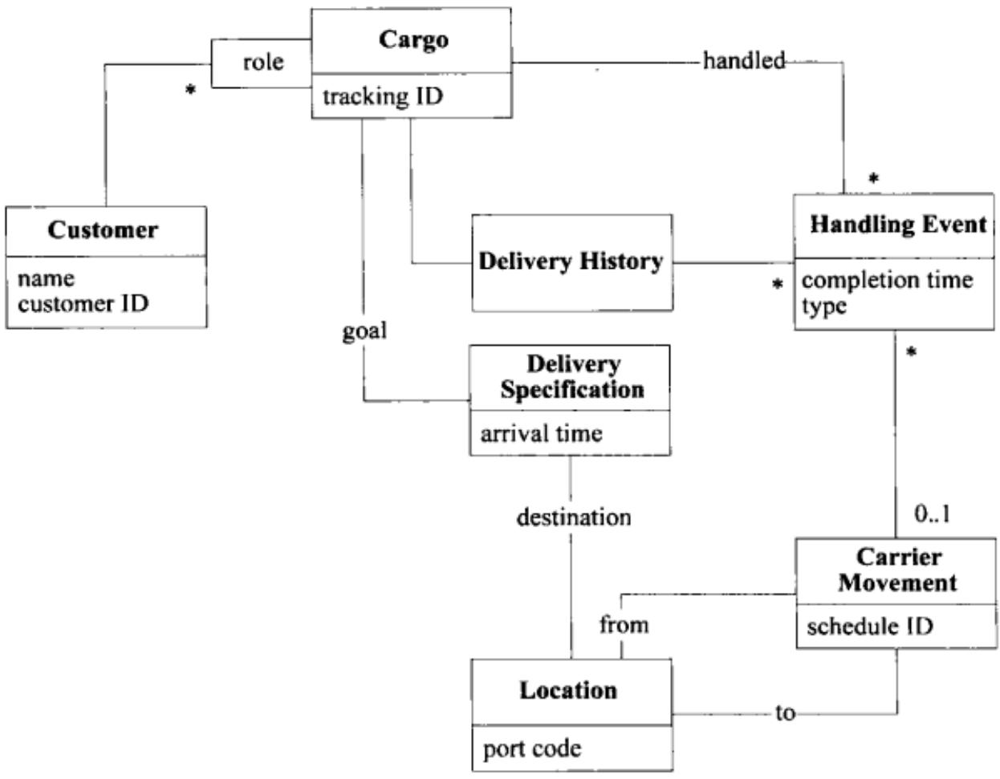


图7-1 表示货运领域模型的类图


这个职责本来可以由Cargo对象来承担，但将Delivery Specification抽象出来至少有以下3个优点。 

(1) 如果没有Delivery Specification, Cargo对象就需要负责提供用于指定运送目标的所有属性和关联的详细意义。这会使Cargo对象变得混乱，导致它难以理解或修改。 

(2) 当将模型作为一个整体来解释时，这个抽象使我们能够轻松且安全地省略掉细节。例如，Delivery Specification中可能还封装了其他标准，但这种细节级别的图可以不必显示出来。这个图告诉读者有一个运送规格，但其细节却并不是要考虑的重点（事实上，过后修改细节也很容易）。 

(3) 这个模型具有更强的表达力。Delivery Specification清楚地说明了Cargo运送的具体方式没有明确规定，但它必须完成Delivery Specification中规定的目标。 

Customer在运输中所承担的部分是按照角色(role)来划分的，例如shipper(托运人)、receiver(收货人)、payer(付款人)，等等。由于一个Cargo只能由一个Customer来承担某一给定角色，因此它们之间的关联是限定的多对一关系，而不是多对多。角色可以被简单地实现为字符串，当需要其他行为的时候，也可以将它实现为类。 

Carrier Movement表示由某个Carrier（例如一辆卡车或一艘船）执行的从一个Location（地点）到另一个Location的旅程。Cargo被装上Carrier后，通过Carrier的一个或多个Carrier Movement，就可以在不同地点之间转移。 

Delivery History（运送历史）反映了Cargo实际上都发生了什么事情，它与Delivery Specification正好相对，后者描述了目标。Delivery History对象可以通过分析最后一次装货和卸货 以及对应的Carrier Movement的目的地来计算货物的当前位置。成功的运送将会是一个满足
164
165 Delivery Specification目标的 Delivery History对象。 

将满足上述需求的所有概念都在这个模型中表示出来，并假定已经有了一些适当的机制来实现保存对象、查找相关对象等功能。这些实现问题不在模型中处理，但它们必须在设计中考虑到。 

为了建立一个健壮的实现，这个模型需要更清晰和严密一些。 

记住，一般情况下，模型的精化、设计和实现应该在迭代开发过程中一起进行。但在本章中，为了使解释更加清楚，我们从一个相对成熟的模型开始，在实现中采用构造块模式，一切修改完全由需求来驱动，以便保证模型与实际的实现紧密关联在一起。 

一般来说，当为了更好地支持设计而对模型进行精化时，也应该让模型反映出对领域的新理解。但在本章中，仍然为了使解释更加清楚，我们采用构造块模式，一切修改完全由需求来驱动，这样做仍然是为了保证模型与实际的实现紧密关联在一起。 

## 7.2 隔离领域：应用程序的引入

为了防止领域的职责与系统的其他部分的职责混杂在一起，我们应用LAYERED ARCHITECTURE把领域层划分出来。 

无需进行深入的分析，就可以识别出三个用户层的应用程序功能，我们可以将这三个功能分配给三个应用层类。 

(1) 第一个类是Tracking Query（跟踪查询），它可以访问某个 Cargo 过去和现在的处理情况。 

(2) 第二个类是Booking Application（预订应用），它允许注册一个新的Cargo，并使系统准备好处理它。 

(3) 第三个类是 Incident Logging Application（事件日志应用），它记录对 Cargo 的每次处理（提供通过 Tracking Query 找到的信息）。 

这些应用层类是协调者，它们只是负责提问，而不负责回答，回答是领域层的工作。 

## 7.3 将 ENTITY 和 VALUE OBJECT 区别开

依次考虑每个对象，看看这个对象是必须被跟踪的实体还是仅表示一个基本值。首先，我们来看一些比较明显的情况，然后考虑更含糊的情况。 

## Customer

我们从一个简单的对象开始。Customer对象表示一个人或一家公司，从一般意义上来讲它是一个实体。Customer对象显然有一个对用户来说很重要的标识，因此它在模型中是一个ENTITY。那么如何跟踪它呢？在某些情况下可以使用Tax ID（纳税号），但对象如果是跨国公司就无法使用了。这个问题需要咨询领域专家。我们与运输公司的一位业务人员讨论这个问题，发现公司已经有了一个客户数据库，其中每个Customer在第一次联系销售时被分配了一个ID号。这种ID已经在整个公司中使用，因此在我们的软件中使用这种ID号就可以与那些系统保持标识的连贯性。ID 

号最初是手工录入的。 

## Cargo

两个完全相同的货箱必须要区分开，因此Cargo对象是ENTITY。在实际情况中，所有运输公司都会为每件货物分配一个跟踪ID。这个ID是自动生成的，对用户是可见的，而且在本例中可能在预订时还要发送给客户。 

## Handling Event和Carrier Movement

我们关心这些独立事件是因为通过它们可以跟踪正在发生的事情。它们反映了真实世界的事件，而这些事件一般是不能互换的，因此它们是ENTITY。每个Carrier Movement都将通过一个代码来识别，这个代码是从运输调度表得到的。 

在与领域专家的另一次讨论中，我们发现Handling Event有一种唯一的识别方法，那就是使用Cargo ID、完成时间和类型的组合。例如，同一个Cargo不会在同一个时间既装货又卸货。 

167 

## Location

名称相同的两个地点并不是同一个位置。经纬度可以提供一个唯一键，但这并不是一个非常可行的方案，因为我们对于这个系统的大部分目的地并不用关心经纬度是多少，而且经纬度的使用相当复杂。Location更可能是某种地理模型的一部分，这个模型根据运输航线和其他特定于领域的关注点将地点关联起来。因此使用任何一种自动生成的内部标识符就足够了。 

## Delivery History

这是一个比较复杂的对象。Delivery History是不可互换的，因此它是ENTITY。但Delivery History与Cargo是一对一关系，因此它实际上并没有自己的标识。它的标识是从拥有它的Cargo处借来的。当对AGGREGATE进行建模时这个问题会变得更清楚。 

## Delivery Specification

尽管它表示了Cargo的目标,但这种抽象并不依赖于Cargo。它实际上表示某些Delivery History的假定状态。运送货物实际上就是让Cargo的Delivery History最后满足该Cargo的Delivery Specification。如果有两个Cargo去往同一地点,则它们可以用同一个Delivery Specification,但它们不共用同一个Delivery History,尽管运送历史都是从同一个状态(空)开始。因此,Delivery Specification是VALUE OBJECT。 

## Role 和其他属性

Role表示了有关它所限定的关联的一些信息，但它没有历史或连续性。因此它是一个VALUE OBJECT，可以在不同的Cargo/Customer关联中共享它。 

其他属性（例如时间戳或名称）都是VALUE OBJECT。 

## 7.4 设计运输系统中的关联

图7-1中的所有关联都没有指定遍历方向，但双向关联在设计中是容易产生问题的。此外， 

只有深刻理解领域后才能确定遍历方向，因此理解遍历方向能够使模型更深入。 

如果Customer对它所运送的每个Cargo都有一个直接的引用，那么这对一些长期、频繁托运货物的客户将会非常不便。此外，Customer这一概念并非只与Cargo相关。在大型系统中，Customer可能具有多种角色，以便与许多对象交互，因此最好不要将它限定为这种具体的职责。如果需要按照Customer来查找Cargo，那么可以通过数据库查询来完成。本章后面讨论REPOSITORY时还会回头讨论这个问题。 

如果我们的应用程序要对一系列货船进行跟踪，那么从Carrier Movement遍历到Handling Event将是很重要的。但我们的业务只需跟踪Cargo，因此只需从Handling Event遍历到Carrier Movement就能满足我们的业务需求，这也把实现简化为一个简单的对象引用，因为双向关系已经被禁用。 

图7-2解释了其他设计决策背后的原因。 

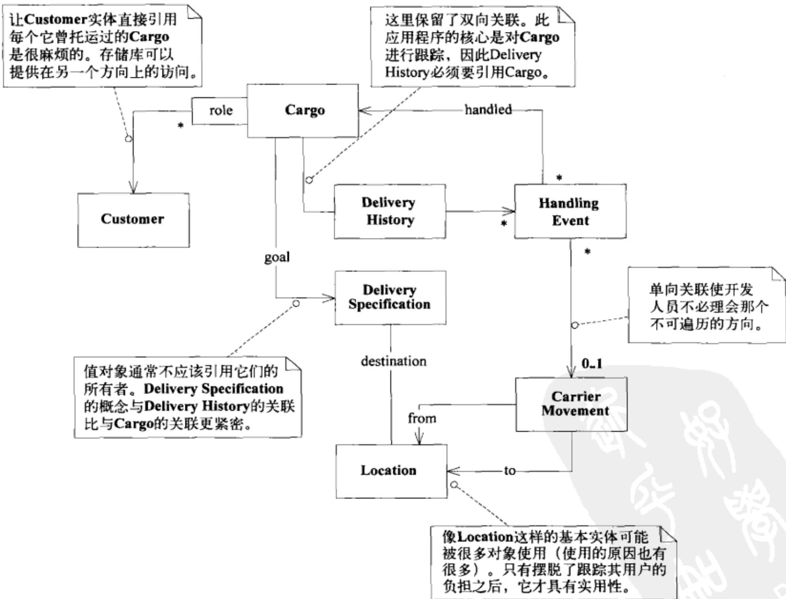


图7-2 在一些关联上对遍历方向进行了约束


在我们的模型中有一个循环引用：Cargo知道它的Delivery History，Delivery History中保存了一系列的Handling Event，而Handling Event反过又指向Cargo。很多领域在逻辑上都存在循环引用，而且循环引用在设计中有时是必要的，但它们维护起来很复杂。在选择实现时，应该避免把必须同步的信息保存在两个不同的地方，这样对我们的工作很有帮助。在这个例子中，我们可以选择一个简单但不太健壮的实现，即用Java来实现一个初步的原型，在Delivery History中提供一个List对象，并把Handling Event都放到这个List对象中。但在某些时候，我们可能不想使用集合，以便能够用Cargo作为键来执行数据库查询。在选择存储库时，我们还会讨论到这一点。如果查询历史的操作相对来说不是很多，那么这种方法可以提供很好的性能、简化维护并减少添加Handling Event的开销。如果这种查询很频繁，那么最好还是使用直接的指针。这种设计上的折中其实就是在实现的简单性和性能之间达成一个平衡。模型还是同一个模型，它包含了循环关联和双向关联。 

## 7.5 AGGREGATE 边界

Customer、Location和Carrier Movement都有自己的标识，而且被许多Cargo共享，因此，它们在各自的AGGREGATE中必须是根，这些聚合除了包含它们的属性之外，可能还包含其他比这里讨论的细节级别更低层的对象。Cargo也是一个明显的AGGREGATE根，但把它的边界画在哪里还需要仔细思考一下。 

如图7-3所示，Cargo AGGREGATE可以把一切只因Cargo存在的事物包含进来，这当中包括Delivery History、Delivery Specification和Handling Event。这很适合Delivery History，因为没人会在不知道Cargo的情况下直接去查询Delivery History。因为Delivery History不需要直接的全局访问，而且它的标识实际上只是由Cargo派生出的，因此很适合将Delivery History放在Cargo的边界之内，并且它也无需是一个AGGREGATE根。Delivery Specification是一个VALUE OBJECT，因此将它包含在Cargo AGGREGATE中也不复杂。 

Handling Event就是另外一回事了。前面已经考虑了两种与其有关的数据库查询，一种是当不想使用集合时，用查找某个Delivery History的Handling Event作为一种可行的替代方法，这种查询是位于Cargo AGGREGATE内部的本地查询；另一种查询是查找装货和准备某次Carrier Movement时所进行的所有操作。在第二种情况中，处理Cargo的活动看起来是有意义的（即使是与Cargo本身分开来考虑时也是如此），因此Handling Event应该是它自己的AGGREGATE的根。 

## 7.6 选择 REPOSITORY

在我们的设计中,有5个ENTITY是AGGREGATE的根,因此在选择存储库时只需考虑这5个实体,因为其他对象都不能有REPOSITORY。 

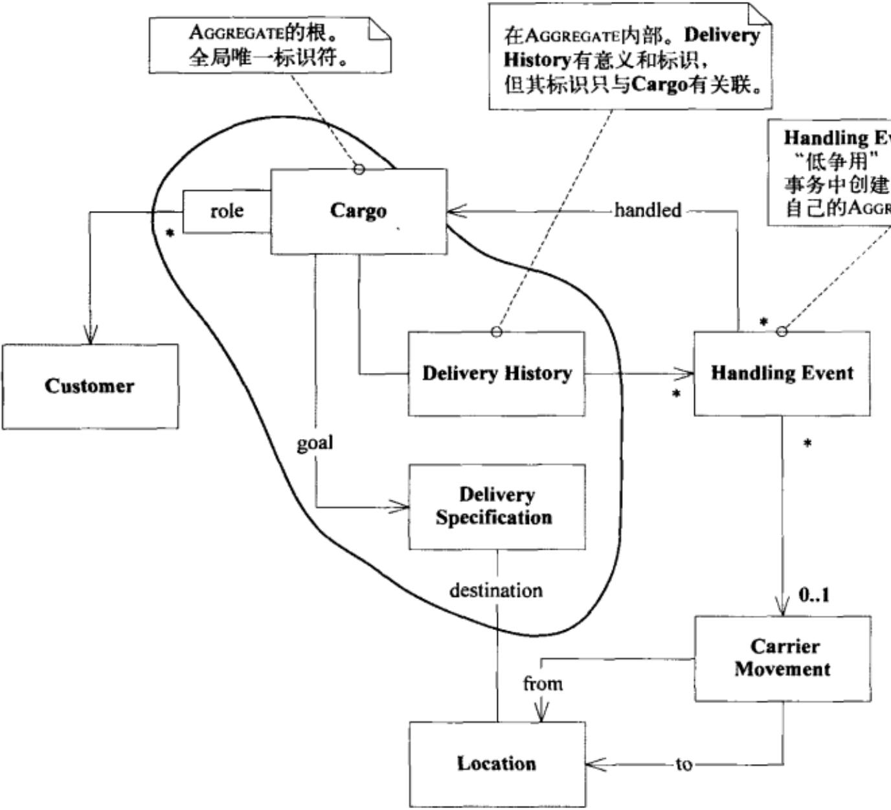


图7-3 模型中的AGGREGATE边界（注意：边界之外的ENTITY是其自己的AGGREGATE的根）


为了确定这5个实体当中哪些确实需要REPOSITORY，必须回头看一下应用程序的需求。要想通过Booking Application进行预订，用户需要选择一些承担不同角色（托运人、收货人等）的Customer。因此需要一个Customer Repository。在指定货物的目的地时还需要一个Location，因此还需要创建一个Location Repository。 

用户需要通过Activity Logging Application来查找装货的Carrier Movement，因此需要一个Carrier Movement Repository。用户还必须告诉系统哪个Cargo已经完成了装货，因此还需要一个Cargo Repository，如图7-4所示。 

我们没有创建Handling Event Repository，因为我们决定在第一次迭代中将它与Delivery History的关联实现为一个集合，而且应用程序并不需要查找在一次Carrier Movement中都装载了什么货物。这两个原因都有可能会发生变化，如果确实改变了，可以增加一个REPOSITORY。 

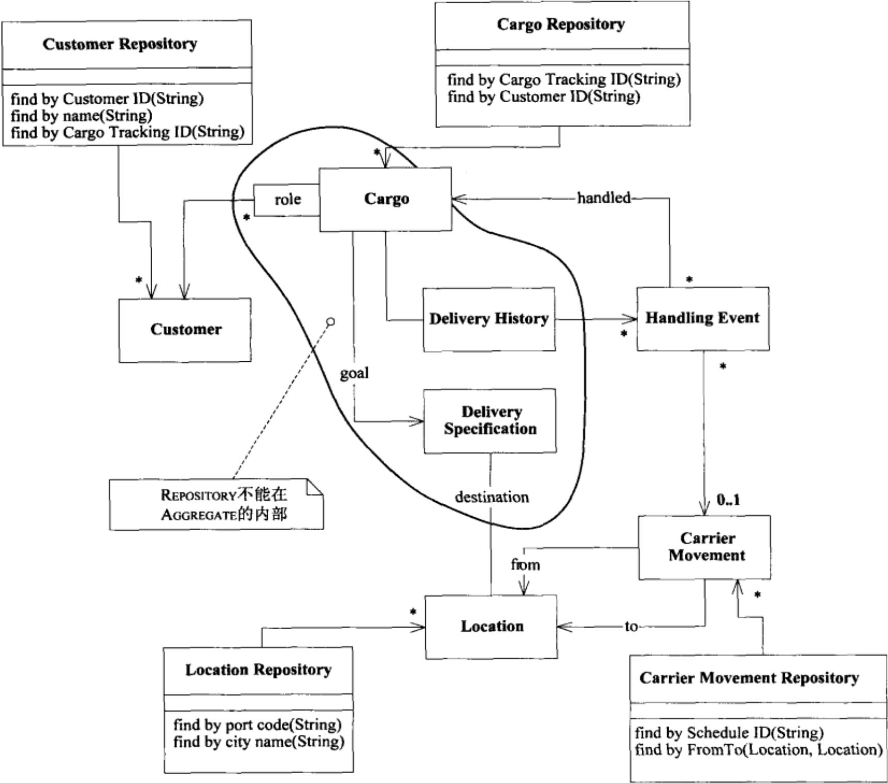


图7-4 REPOSITORY提供了对选中AGGREGATE根的访问


172 

## 7.7 场景走查

为了复核这些决策，我们需要经常走查场景，以确保能够有效地解决应用问题。 

## 7.7.1 应用程序特性举例：更改 Cargo 的目的地

有时一个Customer会打电话说：“糟了！我们原来说把货物运到Hackensack，但实际上应该运往Hoboken。”既然我们提供了运输服务，就一定要让系统能够进行这样的修改。 

Delivery Specification是一个VALUE OBJECT，因此最简单的方法是放弃它，再创建一个新的， 

然后使用Cargo上的setter方法把旧值替换成新值。 

## 7.7.2 应用程序特性举例：重复业务

用户指出，相同Customer的重复预订往往是类似的，因此他们想要将旧Cargo作为新Cargo的原型。应用程序应该允许用户在存储库中查找一个Cargo，然后选择一条命令来基于选中的Cargo创建一个新Cargo。我们将利用PROTOTYPE模式（[Gamma et al. 1995]）来设计这一功能。 

Cargo是一个ENTITY，而且是AGGREGATE的根。因此在复制它时要非常小心，其AGGREGATE边界内的每个对象或属性的处理都需要仔细考虑，下面逐个来看一下。 

□ Delivery History：应创建一个新的、空的Delivery History，因为原有Delivery History的历史并不适用。这是AGGREGATE内部的实体的常见情况。 

173 

□ Customer Roles：应该复制Map（或其他集合），Map保存了对Customer的引用（这些引用是用键值标识的），键也应该一起复制，因为它们在新的运输业务中的角色可能是相同的。但必须注意不要复制Customer对象本身。在复制之后，应该保证和原来的Cargo引用相同的一些Customer对象，因为它们是AGGREGATE边界之外的ENTITY。 

□ Tracking ID：我们必须提供一个新的Tracking ID，它应该来自创建新Cargo时的同一个来源。 

注意，我们复制了Cargo AGGREGATE边界内部的所有对象，并对副本进行了一些修改，但这并没有对AGGREGATE边界之外的对象产生任何影响。 

## 7.8 对象的创建

## 7.8.1 Cargo 的 FACTORY 和构造函数

即使为Cargo使用了一个复杂而精致的FACTORY，或像“重复业务”一节的情况一样使用另一个Cargo作为FACTORY，我们仍然需要有一个基本的构造函数。我们希望用构造函数来生成一个满足固定规则的对象，或者在所生成的对象是ENTITY的时候，至少保持其标识不变。 

做出这些决定之后，我们可以在Cargo上创建一个FACTORY方法，如下所示： 

public Cargo copyPrototype(String newTrackingID) 

或者可以为一个独立的FACTORY添加以下方法： 

```txt
public Cargo newCargo(Cargo prototype, String newTrackingID) 
```

独立的FACTORY还可以把为新的Cargo获取新的（自动生成的）ID的过程封装起来，这样它只需要一个参数： 

```java
public Cargo newCargo(Cargo prototype) 
```

这些FACTORY返回的结果是完全相同的，都是一个Cargo，其Delivery History为空，且Delivery Specification为null。 

Cargo与Delivery History之间的双向关联意味着它们必须要互相指向对方才算是完整的，因此它们必须一起被创建。记住，Cargo是AGGREGATE的根，而这个AGGREGATE包含Delivery History。因此，我们可以用Cargo的构造函数或FACTORY来创建Delivery History。Delivery History构造函数将把Cargo作为参数。这样就可以编写以下代码： 

```java
public Cargo(String id) {
    trackingID = id;
    deliveryHistory = new DeliveryHistory(this);
    customerRoles = new HashMap();
} 
```

结果得到一个新的Cargo，它带有一个指向它自己的新的Delivery History。Delivery History构造函数只供其AGGREGATE根（即Cargo）使用，这样Cargo的组成就被封装起来了。 

## 7.8.2 添加一个 Handling Event

货物在真实世界中的每次处理，都会有人使用Incident Logging Application来输入一条Handling Event记录。 


每个类都必须有一个基本的构造函数。由于Handling Event是一个ENTITY，所以必须把定义了其标识的所有属性传递给构造函数。如前所述，Handling Event是通过Cargo的ID、完成时间和事件类型的组合来唯一标识的。Handling Event唯一剩下的属性是与Carrier Movement的关联，而有些类型的Handling Event甚至没有这个属性。综上，创建一个有效的Handling Event的基本构造函数是： 

```txt
public HandlingEvent(Cargo c, String eventType, Date timeStamp) {
    handled = c;
    type = eventType;
    completionTime = timeStamp;
} 
```

在ENTITY中，那些不起到标识作用的属性通常可以过后再添加。在本例中，Handling Event的所有属性都是在初始事务中设置的，而且过后不再改变（纠正数据录入错误除外），因此为每个事件类型的Handling Event添加一个简单的FACTORY METHOD（并带有所有必要的参数）是很方便的做法，这还使得客户代码具有更强的表达能力。例如，loading event（装货事件）确实涉及一个Carrier Movement。 

```txt
public static HandlingEvent newLoading(
    Cargo c, CarrierMovement loadedOnto, Date timeStamp) {
    HandlingEvent result =
    new HandlingEvent(c, LOADING_EVENT, timeStamp);
    result.setCarrierMovement(loadedOnto);
    return result;
} 
```

模型中的Handling Event是一个抽象，它可以把各种专用的Handling Event类封装起来，包括装货、卸货、密封、存放以及其他与Carrier无关的活动。它们可以被实现为多个子类，或者通过复杂的初始化过程来实现，也可以将这两种方法结合起来使用。通过在基类（Handling Event）中为每个类型添加FACTORY METHOD，可以将实例创建的工作抽象出来，这样客户就不必知道实现的知识。FACTORY必须知道哪个类需要被实例化，以及应该如何对它初始化。 

遗憾的是，事情并不是这么简单。Cargo→Delivery History→History Event→Cargo这个引用循环使实例创建变得很复杂。Delivery History保存了与其Cargo有关的Handling Event集合，而且新对象必须作为事务的一部分被添加到这个集合中（见图7-5）。如果没有创建这个反向指针，那么对象间将发生不一致。 

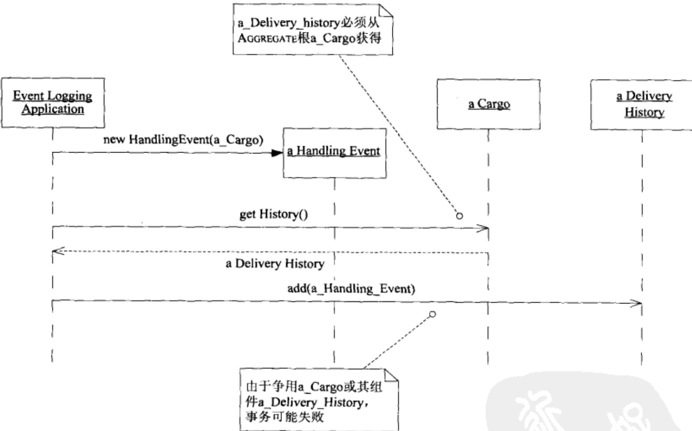


图7-5 添加一个Handling Event需要将它插入到Delivery History中


我们可以把反向指针的创建封装到FACTORY中（并将其放在领域层中——它属于领域层），但现在我们来看另一种设计，它完全消除了这种别扭的交互。 

## 7.9 停下来重构：Cargo AGGREGATE 的另一种设计

建模和设计并不总是一个不断向前的过程，如果不经常进行重构，以便利用新的知识来改进模型和设计，那么项目将会停滞不前。 

到目前为止，我们的设计中有几个蹩脚的地方，虽然这并不影响它的工作，而且设计也确实反映了模型。在设计之初看上去不太重要的问题渐渐变得棘手。让我们借助事后的认识来解决其中的一个问题，以便为以后的设计做好铺垫。 

由于在添加Handling Event时需要更新Delivery History，因此在这个事务中将会涉及Cargo AGGREGATE。如果在同一时间其他用户正在修改Cargo，那么Handling Event事务将会失败或被延迟。输入Handling Event是一项需要迅速完成的简单操作活动，因此能够在不发生争用的情况下输入Handling Event是一项重要的应用程序需求。这促使我们考虑另一种不同的设计。 

我们在Delivery History中可以不使用Handling Event的集合，而是用一个查询来代替它，这样在添加Handling Event时就不会在其自己的AGGREGATE之外引起任何完整性问题。这样修改之后，这些事务就不再受到干扰。如果有很多Handling Event正在被录入，而相对只有很少的查询，那么这种设计更加高效。实际上，如果使用关系数据库作为底层技术，那么我们可以设法在下层使用一个查询来模拟集合。使用查询来代替集合还可以减小在Cargo和Handling Event的循环引用中维护一致性的难度。 

为了使用查询，我们为Handling Event增加一个REPOSITORY。Handling Event Repository将为查询与特定Cargo有关的Event提供支持。此外，REPOSITORY还可以提供优化的查询，可用来更有效地回答特定的问题。例如，为了推断Cargo的当前状态，常常需要在Delivery History中查找最后一次报告的装货或卸货操作，如果这个查找操作被频繁地使用，那么就可以设计一个查询来只返回与最后一次报告相关的Handling Event。而且，如果需要通过一个查询来找到在某次Carrier Movement中装载的所有Cargo，那么很容易就可以增加这个查询。 

这样一来，Delivery History就不再有持久状态了，因此实际上无需再保留它。无论何时需要回答一个问题，都可以查询出Delivery History。尽管每次查询都需要重新创建ENTITY，但由于被查询的对象始终是与同一个Cargo保持关联的，因此沿着这个关联就可以查询出这个对象。 

循环引用的创建和维护也变得简单了。Cargo Factory将被简化，不再需要为新的Cargo实例创建一个空的Delivery History。数据库空间略微减少，而且持久化对象的实际数量可能减少很多（在某些对象数据库中，能容纳的持久化对象的数量是有限的）。如果在常规的使用模式下，用户在货物到达之前很少查询它的状态，那么这种设计可以避免很多不必要的工作。 

另一方面，如果我们正在使用对象数据库，则通过遍历一个关联或显式的集合来查找对象可能会比通过REPOSITORY查询快得多。如果用户在使用系统时需要频繁地列出货物处理的全部历史，而不是偶尔查询最后一次处理，那么出于性能上的考虑，使用显式的集合比较有利。此外要记住，现在并不需要查询“这次Carrier Movement上都装载了什么”，而且这个要求可能永远也不会被提出来，因此暂时不必过多地注意该选项。 

这些类型的修改和设计折中随处可见，仅仅在我们这个小的、简化的系统中，我就可以举出许多示例。但重要的一点是，这些自由的修改仅限于同一个模型内部。通过对VALUE、ENTITY以及它们的AGGREGATE进行建模（正如我们已经做的那样），已经大大减小了这些设计修改的影响。 

例如，在这个示例中，所有的修改都被封装在Cargo的AGGREGATE边界之内。它还需要增加一个Handling Event Repository，但并不需要重新设计Handling Event本身（虽然根据不同的REPOSITORY框架细节，可能需要对实现进行一些修改）。 

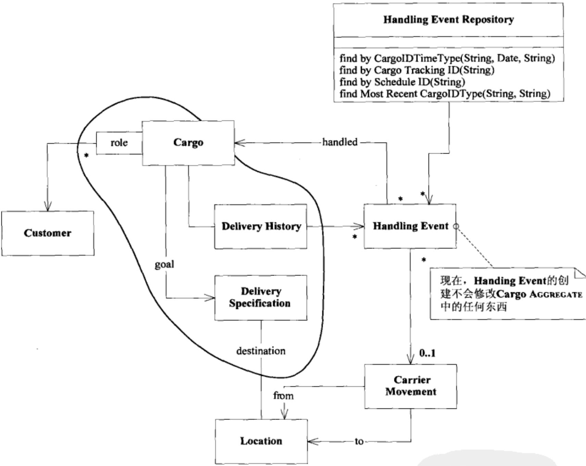


图7-6 将Delivery History中的Handling Event集合实现为一个查询，这样可以使Handling


Event的插入变得简单，而且不会与Cargo AGGREGATE发生争用


## 7.10 运输模型中的MODULE

到目前为止，我们只看到了很少的几个对象，因此MODULE化还不是问题。现在，我们来看一下运输模型的稍大一点的部分（当然，这仍然是简化的），从而了解一下将对模型产生影响的MODULE组织。 

图7-7显示了一个整齐划分后的模型，这里假设该模型是由本书的一位热心读者划分的。这 个图是第5章中所提出的由基础设施驱动的打包问题的一个变形。在本例中，对象是根据其所遵循的模式来分组的。结果那些在概念上几乎没有关系（低内聚）的对象被分到了一起，而且所有MODULE之间的关联错综复杂（高耦合）。这种打包方式也描述了一件事情，但不是描述运输，而是描述了开发人员在那个时候对模型的认识。 

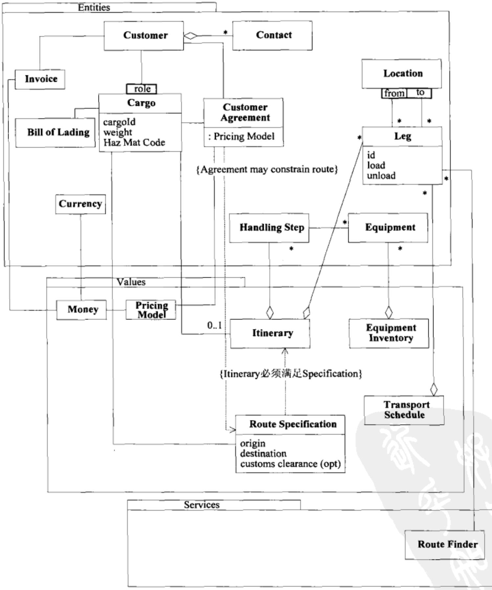


图7-7 这些MODULE并没有传达领域知识


按模式划分看起来像是一个明显的错误，但按照对象是持久对象还是临时对象来分开，或者使用任何其他划分方法，而不是根据对象的意义来划分，也同样没有什么意义。 

相反,我们应该寻找紧密关联的概念,并弄清楚我们打算向项目中的其他人员传递什么信息。在做一些较小的建模决定时,可以采用很多划分方式。图7-8显示了一个简单的例子。 

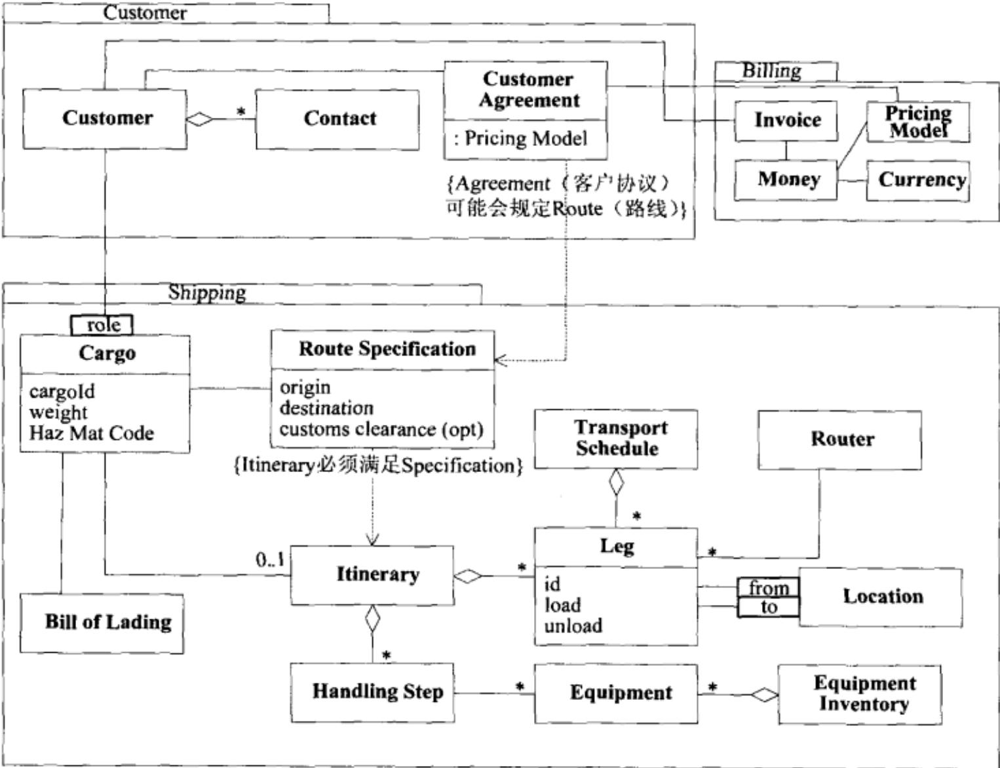


图7-8 基于广泛的领域概念的模块


图7-8中的MODULE名称成为团队语言的一部分。我们的公司给Customer（客户）Shipping（运输货物），因此向他们寄出Bill（账单），公司的销售和营销人员与Customer磋商并签署协议，操作人员负责将货物Shipping到指定目的地，后勤办公人员负责Billing（处理账单），并根据Customer协议开具发票。这就是可以通过这组MODULE描述的业务。 

当然，这种直观上的分解可以通过后续迭代来完善，甚至可以完全被取代，但它现在对MODEL-DRIVEN DESIGN大有帮助，并且使UBIQUITOUS LANGUAGE更加丰富。 

## 7.11 引入新特性：配额检查

到目前为止，我们已经完成了初始的需求和模型。现在要添加第一批重要的新功能。 

在这个假想的运输公司中，销售部门使用其他软件来管理客户关系、销售计划等。其中有一项功能是效益管理（yield management），利用此功能，公司可以根据货物类型、出发地和目的地或任何可作为分类名输入的其他因素来制定不同类型货物的运输配额。这些配额构成了各类货物的运输量目标，这样利润较低的货物就不会占满配额而导致无法运输利润较高的货物，同时避免预订量不足（没有充分利用运输能力）或过量预订（导致因频繁地超出运输能力而取消客户预订，最终损害客户关系）。 

现在，他们希望把这个功能集成到预订系统中。这样，当客户进行一个预订时，可以根据这些配额来检查是否应该接受预订。 

配额检查所需的信息保存在两个地方，Booking Application必须通过查询这些信息才能确定接受或拒绝预订。图7-9画出了一个大体的信息流草图。 

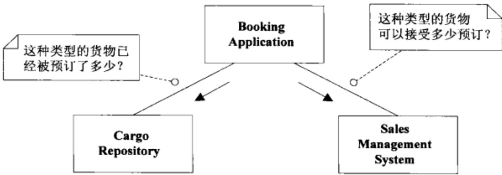


图7-9 Booking Application所使用的信息一方面来自Sales Management System


(销售管理系统)，一方面来自我们自己的领域REPOSITORY


## 7.11.1 连接两个系统

销售管理系统（Sales Management System）并不是根据这里所使用的模型编写的。如果Booking Application与它直接交互，那么我们的应用程序就必须兼容另外一个系统（即Cargo Repository）的设计，这将很难保持一个清晰的MODEL-DRIVEN DESIGN，而且将混淆UBIQUITOUS LANGUAGE。相反，我们创建另一个类，让它充当我们的模型和销售管理系统的语言之间的翻译。它并不是一种通用的翻译机制，而只是对我们的应用程序所需的特性进行翻译，并根据我们的领域模型重新对这些特性进行抽象。这个类将作为一个ANTICORRUPTION LAYER（将在第14章讨论）。 

这是连接销售管理系统的一个接口，因此首先就会想到将它叫做Sales Management Interface（销售管理接口）。但这样一来就失去了用一种更有用的语言来重新描述问题的机会。相反，让我们为每个需要从其他系统获得的配额功能定义一个SERVICE。我们用一个名为Allocation Checker（配额检查器）的类来实现这些SERVICE，这个类名反映了它在系统中的职责。 

如果还需要进行其他的集成（例如，使用销售管理系统的客户数据库，而不是我们自己的Customer REPOSITORY），则可以创建另一个翻译类来实现用于履行该职责的SERVICE。用一个更低 层的类（例如Sales Management System Interface）作为与其他程序进行对话的机制仍然是一种很有用的方法，但它并不负责翻译。此外，它将隐藏在Allocation Checker后面，因此在领域设计中并不显示出来。 

## 7.11.2 进一步完善模型：划分业务

我们已经概要描述了两个系统的交互，那么提供什么样的接口才能用来回答“这种类型的货物可以接受多少预订”这个问题呢？问题的复杂之处在于定义Cargo的“类型”是什么，因为我们的领域模型尚未对Cargo进行分类。在销售管理系统中，Cargo类型只是一组类别关键词，我们的类型只需与该列表一致即可。我们可以把一个字符串集合作为参数传入，但这样又会错过另一个机会——重新抽象那个系统的领域。我们需要在领域模型中增加货物类别的知识，以便使模型更丰富；而且需要与领域专家一起进行头脑风暴活动，以便抽象出新的概念。 

有时，分析模式可以为建模方案提供思路（第11章将会讨论到）。《分析模式》([Fowler 1996])一书介绍了一种用于解决这类问题的模式：ENTERPRISE SEGMENT（企业部门单元）。ENTERPRISE SEGMENT是一组维度，它们定义了一种对业务进行划分的方式。这些维度可能包括我们在运输业务中已经提到的所有划分方法，也包括时间维度，例如月初至今（month to date）。在我们的配额模型中使用这个概念，可以增强模型的表达力，并简化接口。这样，我们的领域模型和设计中就增加了一个名为Enterprise Segment的类，它是一个VALUE OBJECT，每个Cargo都必须获得一个Enterprise Segment类。 

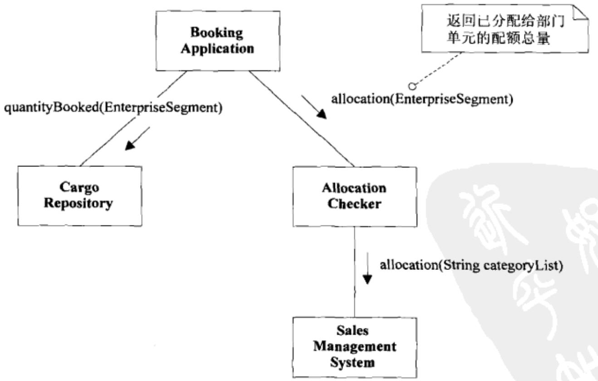


图7-10 Allocation Checker充当了一个ANTICORRUPTION LAYER，它在我们的领域模型中展现了一个到销售管理系统的可选接口


Allocation Checker将充当Enterprise Segment与外部系统的类别名称之间的翻译。Cargo Repository还必须提供一种基于Enterprise Segment的查询。在这两种情况下，我们可以利用与Enterprise Segment对象之间的协作来执行操作，而不会破坏Segment的封装，也不会导致它们自己的实现复杂化（注意，Cargo Repository的查询结果是一个数字，而不是实例的集合）。 

但这种设计还存在几个问题： 

(1) 我们给Booking Application分配了一个不该由它来执行的工作，那就是对如下规则的应用：“如果Enterprise Segment的配额大于已预订的数量与新 Cargo数量的和，则接受该Cargo。”执行业务规则属于领域层的职责，而不应在应用层中执行。 

(2) 没有清楚地表明Booking Application是如何得出Enterprise Segment的。 

184 

这两个职责看起来都属于Allocation Checker。通过修改接口就可以将这两个服务分离出来，这样交互就更整洁和明显了。 

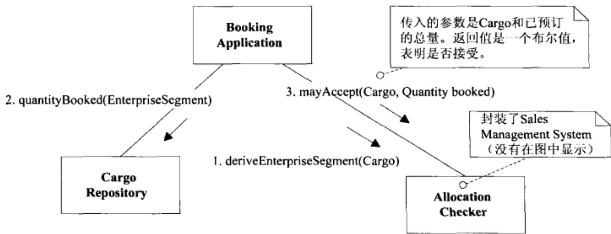


图7-11 领域职责从Booking Application转移到Allocation Checker


这种集成只有一条严格的约束，那就是有些维度是不能被Sales Management System使用的，具体来说就是那些无法用Allocation Checker转换为Enterprise Segment的维度（在不使用ENTERPRISE SEGMENT的情况下，这条约束的作用是使销售系统只能使用那些可以在Cargo Repository查询中使用的维度。虽然这种方法也行得通，但销售系统将会溢出而进入领域的其他部分中。在我们这个设计中，Cargo Repository只需处理Enterprise Segment，而且销售系统中的更改只影响到Allocation Checker，而Allocation Checker可以被看作是一个FACADE）。 

## 7.11.3 性能优化

虽然与领域设计的其他方面有利害关系的只是Allocation Checker的接口，但当出现性能问题时，Allocation Checker的内部实现可能为解决这些问题提供了机会。例如，如果Sales Management System运行在另一台服务器上（或许在另一个位置上），那么通信开销可能会很大，而且每个配额检查都需要进行两次消息交换。第二条消息需要调用Sales Management System来回答是否应该 接受货物，因此并没有其他的替代方法可用来处理这条消息。但第一条消息是得出货物的Enterprise Segment，这条消息所基于的数据和行为与配额决策本身相比是静态的。这样，一种设计选择就是把这些信息缓存到服务器上，以便Allocation Checker在需要的时候能够在服务器上找到它们，从而将消息传递的开销降低一半。但这种灵活性也是有代价的。设计会更复杂一些，而且被缓存的数据必须保持最新。但如果性能在分布式系统中是至关重要的因素的话，这种灵活部署可能成为一个重要的设计目标。 

## 7.12 小结

情况就是这样了。这种集成有可能把我们这个原本简单且在概念上一致的设计弄得乱七八糟，但现在，在使用了一个ANTICORRUPTION LAYER、一个SERVICE和一些ENTERPRISE SEGMENT之后，我们已经干净利落地把Sales Management System的功能集成到我们的预订系统中了，从而使领域更加丰富。 

还有最后一个设计问题：为什么不把获取Enterprise Segment的职责分配给Cargo呢？如果Enterprise Segment的所有数据都是从Cargo中获取的，那么乍看上去把它变成Cargo的一个派生属性是一种不错的选择。遗憾的是，事情并不是这么简单。为了用一些有利于业务策略的维度进行划分，我们可以任意定义Enterprise Segment。出于不同的目的，可能需要对相同的ENTITY进行不同的划分。出于预订配额的目的，我们需要根据特定的Cargo进行划分；但如果是出于税务会计的目的时，可能会采取一种完全不同的Enterprise Segment划分方式。甚至当执行新的销售策略而对Sales Management System进行重新配置时，配额的Enterprise Segment划分也可能会发生变化。因此Cargo必须知道Allocation Checker，而这完全不在其概念职责范围之内。而且得出特定类型Enterprise Segment所需使用的方法会加重Cargo的负担。因此，正确的做法是让那些知道划分规则的对象来承担获取这个值的职责，而不是把这个职责施加给包含具体数据（那些规则就作用于这些数据上）的对象。这些规则可以被分离到一个独立的Strategy对象中，然后将这个对象传递给Cargo，以便它能够得出一个Enterprise Segment。这种解决方案似乎超出了这里的需求，但它可能是后面的设计的一个选择，而且应该不会对设计造成很大的破坏。 

## 第三部分

## 通过重构来加深理解

本书的第二部分为维护模型和实现之间的对应关系打下了基础。在开发过程中使用一系列成熟的基本构造块并运用一致的语言，能够使开发工作更加清晰而有条理。 

当然，我们面临的真正挑战是找到深层次的模型，这个模型不但能够捕捉到领域专家们的微妙的关注点，还可驱动切实可行的设计。我们的最终目的是开发出能够捕捉到领域深层含义的模型。以这种方式设计出来的软件可以更加贴近领域专家的思维方式，也更能满足用户的需求。本部分将会对这个目标加以说明并详细描述其实现过程，同时也会解释某些设计原则和模式。我们应用这些原则和模式来得到满足应用程序以及开发人员自身需求的设计。 

要想成功地开发出实用的模型，需要注意以下三点。 

(1) 复杂巧妙的领域模型是可以实现的，也是值得我们去花费力气实现的。 

(2) 这样的模型离开不断的重构是很难开发出来的，重构需要领域专家和热爱学习领域知识的开发人员密切参与进来。 

(3) 要实现并有效地运用模型，需要精通设计技巧。 

## 重构的层次

重构就是在不改变软件功能的前提下重新设计它。开发人员无需在着手开发之前做出详细的设计决策，只需要在开发过程中不断小幅调整各个部分的设计即可，这不但能够保证软件原有的功能不变，还可使整个设计更加灵活易懂。自动化的单元测试套件能够对代码进行相对安全的检验。这个过程解放了开发人员，使他们不再有远虑。 

然而，几乎所有关于重构的文献都专注于研究如何机械地修改代码，以使其更具可读性或在非常细节的层次上有所改进。如果开发人员能够看准时机，利用成熟的设计模式进行开发，那么“通过重构得到模式” $^{①}$ （refactoring to patterns）这种方式就可以让重构过程更上一层楼。不过， 

这依然是从技术视角来评估设计的质量。 

有些重构能够极大地提高系统的可用性，它们有的源于对领域的新认知，有的能够通过代码清晰地表达出模型的含义。这些重构不能取代设计模式重构和微重构，这两种重构应该持续进行。但前者添加了另一种重构层次：为实现更深层模型而进行的重构。在深入理解领域的基础上进行重构，通常需要实现一系列的微重构，但这么做绝不仅仅是为了改进代码状态。相反，微重构是一组操作方便的修改单元，通过这些重构可以得到更深层次的模型。开发人员通过微重构不仅能够了解代码可实现的功能，还能明白个中原因，并把它们与领域专家的交流联系起来。 

《重构》（[Fowler 1999]）一书中所列出的重构分类涵盖了大部分常用的微重构。这些微重构主要是为了解决一些可以从代码中观察到的问题。相比之下，领域模型千变万化，当你对领域有了新的理解后，便可以对模型进行调整，这种调整是无法整理出一个完整的目录的。 

与所有的探索活动一样，建模本质上是非结构化的。只有进行深入的学习思考，然后据此重构，才能得到更深层的理解。尽管已发布的成功模型会对我们大有帮助（第11章将会提及），但是不能因此将领域建模简化为照本宣科的行为，当其是烹饪书籍或者工具包，依样画葫芦。建模和设计都需要你发挥创造力。接下来的6章将会给出一些改进领域模型的具体思考方式以及可实现这些领域模型的设计方法。 

## 深层模型

对象分析的传统方法是先在需求文档中确定名词和动词，并将其作为系统的初始对象和方法。这种方式太过简单，只适用于教导初学者如何进行对象建模。事实上，初始模型通常都是基于对领域的浅显认知而构建的，既不够成熟也不够深入。 

比如，我曾参与过一个运输应用系统的开发，我的初始想法是构建一个包括货轮和集装箱的对象模型。货轮将货物从一个地点运送到另一个地点。集装箱则通过装载和卸载操作与货轮进行关联或脱离关联。这确实能够准确地描述出一部分实际运输活动。但是事实证明，它对于运输业务的软件实现并没有太多帮助。 

最终，在与运输专家们一起工作了几个月并进行了许多次迭代后，我们得到了一个完全不同的模型。在外行人看来，它也许没那么浅显易懂，但却能贴切地反映出专家的想法。这个最终模型关注的焦点是如何运送货物。 

我们依然保留了货轮，但是将其抽象为“船只航次”（vessel voyage）的形式，即货轮、火车或其他运输工具的某一调度好的航程。货轮本身并不重要，如遇维修或计划变动可临时改用其他船只，只要保证原定航次按计划执行即可。运输集装箱则完全从模型中移除了。在原来的应用程序中，集装箱是操作细节，而现在它却在货物装卸应用程序中以一种完全不同的复杂形式存在。货物实际的位置变化已不重要，重要的是其法律责任的转移。原来一些诸如“提货单”之类不被关注的对象也出现在模型中。 

每当有新的对象建模人员加入这个项目时，他们首先提出的建议是什么？就是添加“货轮”和“集装箱”这两个缺少的类。他们都很聪明，只不过还没有仔细揣摩运输领域的知识罢了。 

深层模型能够穿过领域表象，清楚地表达出领域专家们的主要关注点以及最相关的知识。以上定义并没有提及抽象的问题。事实上，深层模型中通常都含有抽象元素，但在直接切入问题核心的关键位置也同样会出现具体元素。 

恰当反映领域的模型通常都具有功能多样、简单易用和解释力强的特性。这种模型的共同之处在于它们所使用的是业务专家青睐的简单语言，但这种语言可能也是抽象的。 

## 深层模型/柔性设计

在不断重构的过程中，设计本身也需要支持重构所带来的变化。第10章将会探讨如何使设计更易于使用，不但方便修改还能够简单地将其与系统其他部分集成。 

设计自身的某些特性就可以使其更易于修改和使用。这些特性并不复杂，却很有挑战性。第10章会主要讨论“柔性设计（Supple Design）”及其实现方法。 

幸运的是，如果每次对模型和代码所进行的修改都能反映出对领域的新理解，那么通过不断的重构就能给系统最需要修改的地方增添灵活性，我们也能找到简单快捷的方式来实现普通的功能。戴久了的手套在手指关节处会变得柔软；而其他部分则依然硬实，可起到保护的作用。同样道理，用这种方式来进行建模和设计时，虽然需要反复尝试、不断改正错误，但是对模型和设计的改进却因此而更容易实现，同时反复的修改也能让我们越来越接近柔性设计。 

柔性设计除了便于修改，还有助于改进模型本身。MODEL-DRIVEN DESIGN需要以下两个方面的支持：深层模型使设计更具表现力；同时，当设计既具有可让开发人员试验的灵活性，又能清晰地表达出领域含义时，那么事实上这个设计就能够将开发人员的深层理解反馈到整个模型发现的过程中。这段反馈回路是很重要的，因为我们所寻求的模型并不仅仅只是一套好想法：它还应该是构建系统的基础。 

## 发现过程

要想创建出确实可解决当前问题的设计，首先必须拥有可捕捉到领域核心概念的模型。第9章将会介绍如何主动搜寻这些概念，并将它们融入到设计中。 

由于模型和设计之间具有紧密的关系，因此如果代码难于重构，建模过程也会停滞不前。第10章将会探讨如何为软件开发者（而不仅是为你自己）编写软件，以使开发人员能够高效地扩展和修改代码。这一设计过程与模型的进一步精化是密不可分的。它通常需要更高级的设计技巧以及更严格的模型定义。 

你需要富有创造力，不断地尝试，不断地发现问题才能找到合适的方法为你所发现的领域概念建模，但有时你也可以借用别人已建好的模式。第11章和第12章将会讨论“分析模式”和“设 计模式”的应用。这些模式并不是现成的解决方案，但是它们可以帮助我们消化领域知识并缩小研究范围。 

但是，让我们以领域驱动设计中最令人兴奋的事件来开始第三部分吧，那就是突破。有时，当我们拥有了MODEL-DRIVEN DESIGN和显式概念，就能够产生突破。我们有机会使软件更富表达力、更加多样化，甚至会使它变得超乎我们的想象。这可以为软件带来新特性，或者意味着我们可以用简单灵活的方式来表达更深层次的模型，从而替换掉大段死板的代码。尽管这种突破不会时常出现，但它们非常有价值，当我们有机会进行突破时，一定要懂得识别并抓住机会。 

第8章讲述了一个真实的项目，这个项目通过重构过程得到了更深层的理解，最终实现了突破。这种经历是无法预先规划的。尽管如此，它却为我们提供了一个很好的学习背景，帮助我们思考领域重构。 


# 突破

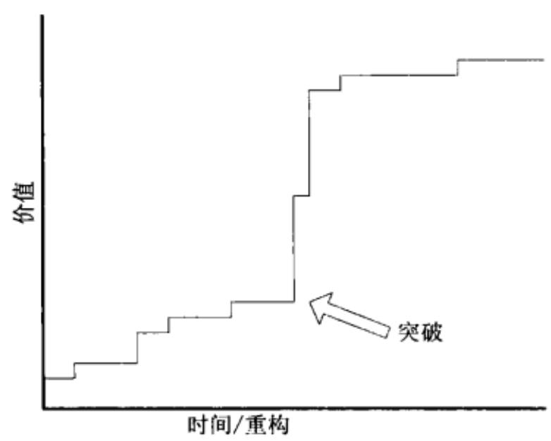


重构的投入与回报并非呈线性关系。通常，小的调整会带来小的回报，小的改进也会积少成多。小改进可防止系统退化，成为避免模型变得陈腐的第一道防线。但是，有些最重要的理解也会突然出现，给整个项目带来巨大的冲击。 

可以确定的是，项目团队会积累、消化知识，并将其转化成模型。微小的重构可能每次只涉及一个对象（在这里加上一个关联，在那里转移一项职责）并通过一系列微小的重构逐渐形成深层模型。 

一般来说，持续重构是在为突破做好准备。每次代码和模型的精化都让开发人员有了更加清晰的认识。这使得在理解上的突破成为可能。通过一系列的修改可以得到更符合现实而且更符合用户那些最重要的需求的模型。模型变得简单了，其功能性及说明性却增强了。 

193 

这种突破不是一项技术，而是一种事件。它的困难之处在于你需要判断发生了什么，然后再决定如何处理。为了说明这是种什么样的经历，我将会讲述一个我几年前参与过的真实项目，以及我们是如何获得一个宝贵的深层模型的。 

## 8.1 一个突破的故事

这个故事发生在纽约，经过一个冬天的漫长重构之后，我们最终得到了能够捕捉到一些领域 关键知识的模型和一个确实能在应用程序中发挥作用的设计。当时我们正在给一家投资银行开发一个大型应用程序的核心部分，该程序用于管理银团贷款。 

假如Intel想要建造一座价值10亿美元的工厂，就需要申请巨额贷款，但任何一家借贷公司（lending company）都无法独立承担，于是这些公司就组成银团 $^{①}$ ，集中它们的资源，以此来支持这种巨额信贷。投资银行通常在银团里担当领导者的角色，负责协调各种交易和其他服务。我们的项目就是要开发这样一个用于跟踪和支持以上整个过程的软件。 

## 8.1.1 华而不实的模型

当时，我们对于自己的成果感觉相当不错。四个月前，我们还身陷困境，因为之前留下的代码完全不可行，从那时开始我们就竭尽所能将其迁移到一个内聚的MODEL-DRIVEN DESIGN中。 

图8-1中展示的模型使常见业务变得非常简单。Loan Investment（贷款投资）是一个派生对象，用来表示某一投资者在Loan（贷款）中所承担的股份，它与投资者在Facility（信贷）中所持有的股份成正比。 

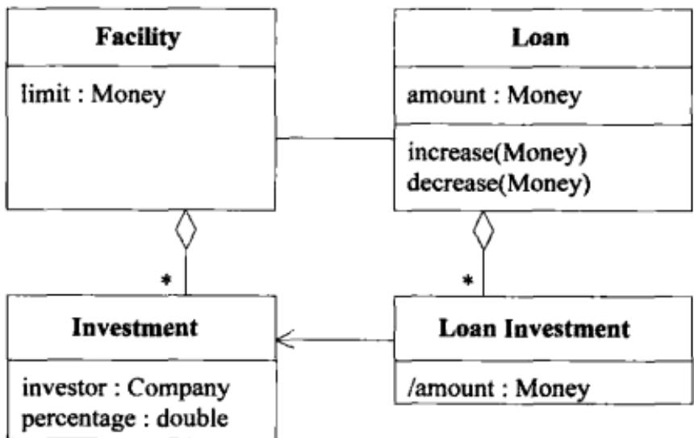


图8-1 假定放贷方所持股份固定的模型


## Facility是什么？

Facility（信贷）在这里并不是建筑物的意思。在大部分项目中，领域专家提供的专用术语都会变成我们自己的词汇，并成为UBIQUITOUS LANGUAGE的一部分。在商业银行领域中，信贷是公司为借款而作出的承诺。信用卡就是一种信贷，卡片持有者有权在需要时借出不超过预设限制的金额，并且以预定利息还款。当你使用信用卡时，就会产生一笔未偿贷款，每笔支出都会降低你的信贷额度，并增加你的贷款金额。最后，你需要偿还贷款本金。也许还需要缴纳年费。年费是持有信用卡（信贷）所需缴纳的费用，与你的贷款无关。 

但是这个模型已显露出了一些令人担忧的迹象。各种意料之外的需求一直困扰着我们，也使设计更加复杂。最突出的例子就是对Facility股份的理解不断深入，在提取（Drawdown）贷款时，信贷股份仅仅是放贷方投入金额的指导原则。当借款者（borrower）要求提取贷款时，银团领导者会通知所有成员支付各自的股份。 

收到通知后，投资者通常会按自己的股份来支付，但是有时他们也会与银团其他成员协商，以求少投入（或多投入）一些。于是我们在模型中添加了Loan Adjustment（贷款调整）以反映这一事实。 

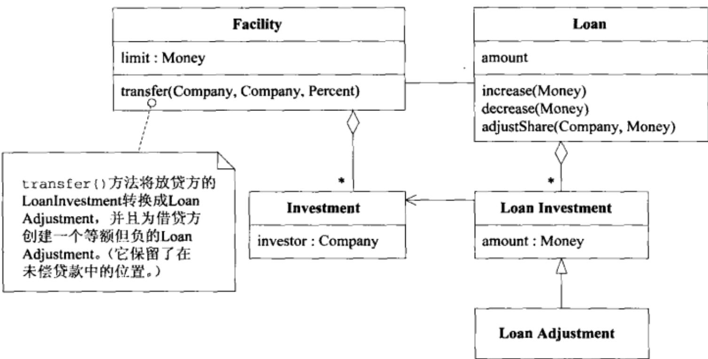


图8-2 为解决问题而逐步修改的模型。Loan Adjustment用来跟踪放贷方最


初同意放贷的股份与实际放贷额之差


这种类型的精化使我们能够越来越清楚地理解各种交易规则。但同时，模型的复杂度也在不断增加，并且看起来我们无法很快从模型中提炼出真正健壮的功能。 

更麻烦的是尽管算法越来越复杂，我们却无法解决舍入运算所带来的细微差别。在1亿美元的交易中，确实没有人会在意几美分的去向，但是银行家是不会信任无法精确计算到美分的软件的。我们开始怀疑我们所遇到的难题可能只是因为在某个基本设计中存在问题。 

## 8.1.2 突破

在项目进行过程中，我们突然领悟到了问题的所在。我们在模型中把Facility股份和Loan股份绑定到一起，而这种方式并不适用于实际的业务。这一发现得到了广泛的认可。业务专家点头称是，并开始热情地给予帮助（我敢说他们一定还在奇怪我们怎么花了这么长时间才明白这一点），我们迅速在白板上创建了一个新模型。虽然细节问题尚未确定，但是我们已经知道新模型的关键特征了：Loan股份和Facility股份可以在互不影响的前提下独立发生改变。有了这层认知， 

我们利用与下图类似的新模型走查了许多场景： 

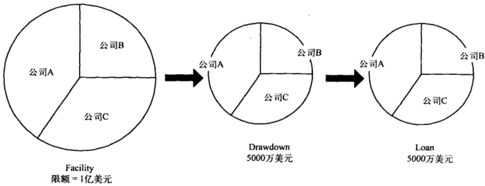


图8-3 基于Facility股份来进行分配的提取


这张图表明Facility的总额是1亿美元，而借款者选择从中提取的第一笔Loan金额是5000万美元。3个放贷方按照各自原先承诺的Facility股份来支付，这样5000万的Loan就被分配到了这3个放贷方头上。 

随后，在图8-4中，借款者又提取了另一笔3000万美元的货款（如图8-4所示），这样他的未偿Loan就达到了8000万美元，依然在Facility的1亿美元限额之内。这次，公司B决定不参与Loan，而由公司A来支付它的股份。各个放贷方在借款者提取货款的过程中所支付的股份反映了它们的投资选择。当Loan的提取额不断增加时，Loan的股份份额就不再与Facility的股份成比例了。这种现象很普遍。 

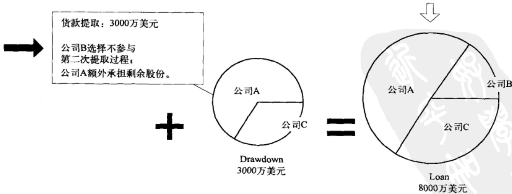


图8-4 贷方B选择不参与第二次提款


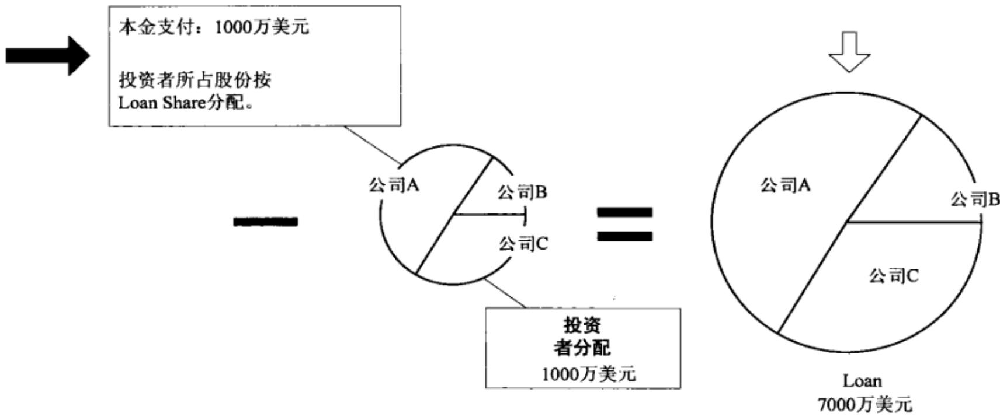


图8-5 本金支付始终按照未偿Loan的股份比例来进行分配


当借款者偿还Loan时，所偿还的金额会根据Loan股份分配给各放贷方，而不是根据Facility股份来划分。同样，利息支付也会按照Loan股份进行分配。 

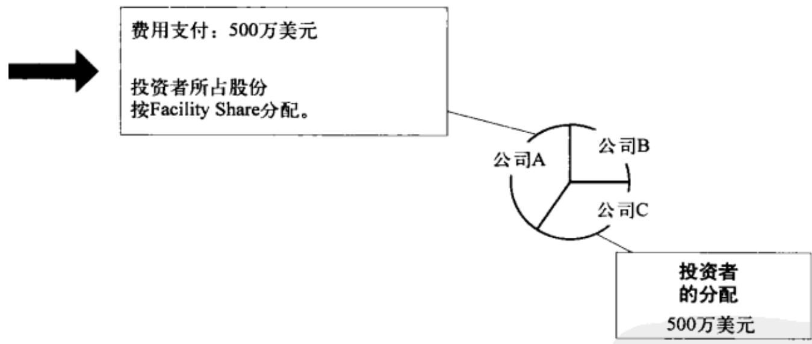


图8-6 费用支付始终按照Facility的股份比例来进行分配


另一方面，当借款者为享有Facility权而支付费用时，这笔钱是按照Facility股份划分的，而不考虑放贷方是否借出了钱。Loan不会因费用支付而发生变化。甚至还有这种情况，放贷方单独交易费用股份，与利息股份等无关。 

## 8.1.3 更深层模型

我们得到了两个深层理解。其一是意识到“投资”和“Loan投资”是“股份”这个常规基础概念的两种特例。信贷股份、货款股份、支付比例股份，这些都是股份，股份无处不在。任何可 

分配的价值都是股份。 

经过几天忙碌的工作，我根据与专家讨论时所使用的语言以及我们一起研究的场景，初步搭建起了一个股份模型如图8-7所示。 

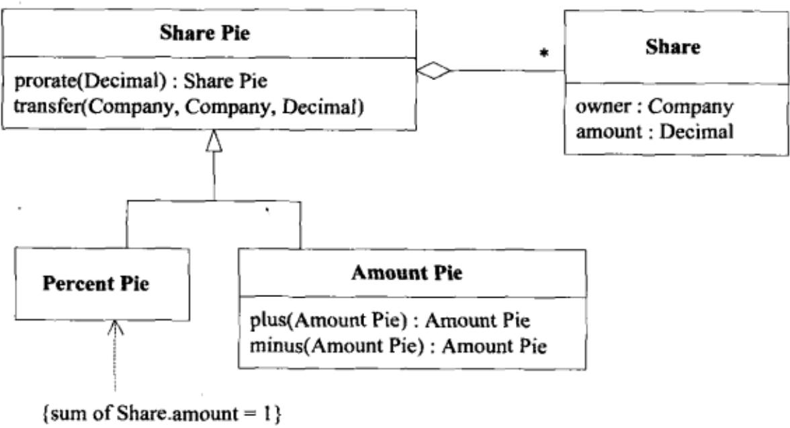


图8-7 股份的抽象模型


我同时也草绘了一个与股份模型搭配的新贷款模型。


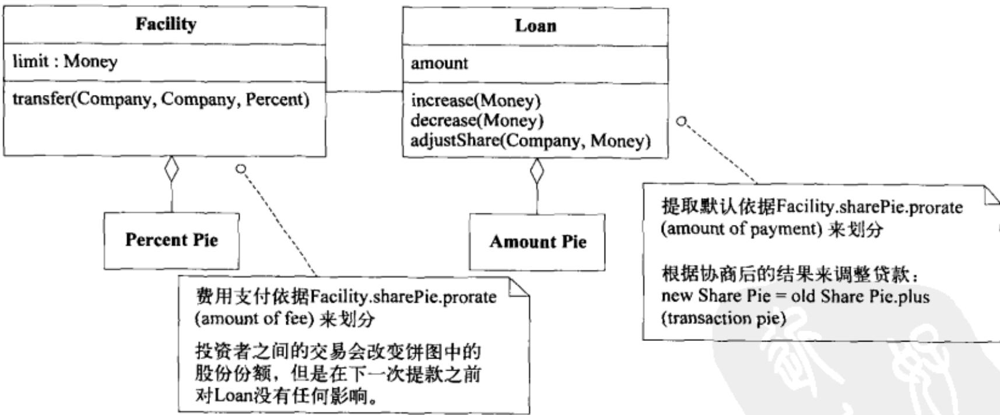


198 

图8-8 使用Share Pie的Loan模型 

现在Facility股份和Loan股份不再由专用对象来表示了。它们都被分解成了更直观的Share Pie。这种泛化引入了“股份数学”的概念，极大地简化了所有交易中的股份计算，同时也使这些计算更富有表达力、更简洁且更易于组合。 

但最重要的是，新模型删除了不恰当的约束，这使得我们的问题迎刃而解。Loan的Share因 而不再与Facility的Share成比例，同时新模型仍然保留着对总额、费用分配等的有效约束。我们可以直接调整Loan的Share Pie，因此新模型也不再需要Loan Adjustment和大量处理特殊情况的逻辑了。 

新模型中不再包含Loan Investment对象，我们此时才意识到“货款投资”并不是一个银行业术语。事实上，业务专家早已多次告诉我们，他们不明白“货款投资”是什么意思。但是他们还是尊重我们在软件方面的知识，并假定它对技术方面的设计是有所帮助的。而事实上，我们之所以创建它是因为没有完全理解领域。 

这种看待领域的新方法使我们立即就可以毫不费力地处理之前遇到的所有场景，处理过程要比以往简单许多。业务专家认为我们的模型图非常合理，他们曾经指出我们之前的模型图对他们来说“技术性太强”了。即使只是在白板上画出草图，我们也能看出新模型能够彻底解决长期困扰我们的舍入计算问题，我们可以不再使用复杂的舍入代码了。 

新模型的效果很好。非常非常好。 

而我们都已疲惫不堪了！ 

## 8.1.4 冷静决策

你也许会认为我们在那时一定会洋洋自得。但我们没有。项目的期限很紧，而我们的进度已严重落后了。所以，那时我们最强烈的感受就是担忧。 

重构的原则是始终小步前进，始终保持系统正常运转。但是要按照这个新模型来重构则需要修改大量的支持代码，在两次重构之间几乎不会有停顿的时间。我们能够看出一些力所能及的微小改进，但这些改进无法让我们更贴近新的领域概念。我们也知道通过一系列小改动可以实现新模型，但是在这个过程中必然会导致程序的一部分功能无法正常工作。而且在当时，自动化测试还没有广泛应用于这种项目。我们一无所有，所以肯定会出现一些让我们始料不及的破坏。 

199 

此外，重构是需要花费精力去实现的。但几个月以来，我们一直压力重重，早已精疲力尽了。 

这时，我们与项目经理开了一次会，这次会议令我终生难忘。我们的项目经理是个睿智而勇敢的人。他问了我们许多问题： 

Q1：如果采用新设计，需要多久才能重新实现已有功能？ 

A1: 大约三周。 

Q2: 不用新设计可以解决问题吗? 

A2: 有可能。但我们无法保证。 

Q3：如果现在不采用新设计，可以继续进行下一个版本的开发吗？ 

A3：如果不做修改，开发进度会非常缓慢。而且我们的系统一旦有了客户群，再做修改就会变得更加困难。 

Q4: 这是不是正确的行动? 

A4：我们知道目前的局面很不稳定，如果不是非做不可，我们也可以将就。而且我们都很疲惫了。但是，是的，这是个更加简单的解决方案，也更符合业务需求。从长远角度来看，它会降低风险。 

他给我们开了绿灯，并告诉我们他会控制好局面。做出这种决定需要无比的勇气和信心，这使我一直对他钦佩不已。 

我们全力以赴，在三个星期内完成了任务。这是个巨大的工程，但是却进展得异常顺利。 

## 8.1.5 成果

项目需求不再有意外的、难以捉摸的改变了。舍入逻辑的实现虽然并不简单，却很稳定并且合理。我们交付了软件的第一个版本，第二个版本的开发思路也很清晰了。我的神经衰弱也多少有了好转。 

在进行第二个版本的开发时，Share Pie成了整个程序的统一主题。技术人员和业务专家利用它来对系统进行讨论。市场人员使用它来向预期客户解释系统特性。这些预期客户和其他的客户都能立刻理解它，并且可以马上用它来讨论特性。由于它抓住了银团货款的核心问题，所以它真正成为了UBIQUITOUS LANGUAGE的一部分。 

## 8.2 机遇

当突破带来更深层的模型时，通常会令人感到不安。与大部分重构相比，这种变化的回报更多，风险也更高。而且突破出现的时机可能很不合时宜。 

尽管我们希望进展顺利，但往往事与愿违。过渡到真正的深层模型需要从根本上调整思路，并且对设计做大幅修改。在很多项目中，建模和设计工作最重要的进展都来自于突破。 

## 8.3 关注根本

不要试图去制造突破，那只会使项目陷入困境。通常，只有在实现了许多适度的重构后才有可能出现突破。在大部分时间里，我们都在进行微小的改进，而在这种连续的改进中模型深层含义也会逐渐显现。 

要为突破做好准备，应专注于知识消化过程，同时也要逐渐建立健壮的UBIQUITOUS LANGUAGE。寻找那些重要的领域概念，并在模型中清晰地表达出来（参见第9章）。精化模型，使其更具柔性（参见第10章）。提炼模型（参见第15章）。利用这些更容易掌握的手段使模型变得更清晰，这通常会带来突破。 

不要犹豫着不去做小的改进，这些改进即使脱离不开常规的概念框架，也可以逐渐加深我们对模型理解。不要因为好高骛远而使项目陷入困境。只要随时注意可能出现的机会就够了。 

## 8.4 后记：越来越多的新理解

突破使我们走出了困境，但故事并没有就此结束。更深层次的模型为我们带来了意想不到的机会，可以使应用程序的功能更加丰富，设计也更加清晰。 

在Share Pie版本的程序发布几周之后，我们注意到在模型中还存在一个使设计变得复杂的地方。我们漏掉了一个重要的ENTITY，结果是本来应该由它承担的职责不得不由其他对象来完成。具体来说就是提取货款、缴纳费用等业务是由一些重要的规则控制的，而所有这些逻辑都分散在Facility和Loan中的各种方法里了。这些设计问题在Share Pie突破出现之前几乎没有引起我们的注意，但是随着我们对领域的理解日渐清晰，它们也变得明显起来。现在我们开始注意到，那些经常在讨论中出现的术语（比如“交易”，代表一次金融交易）并没有体现在模型中，反而隐含在了那些复杂的方法里。 

经过与之前类似的过程（但所幸的是，我们有了更加充足的时间），我们对领域的理解又向前迈进了一步，并获得了一个更深层次的模型。这个新模型不但使所有隐含的概念显现了出来（比如Transaction），同时也简化了Position（包括Facility和Loan的抽象类）。于是定义各种交易、交易规则、协商程序和审批流程就变得轻而易举了，而且实现这些概念的代码也相对来说变得更好理解了。 

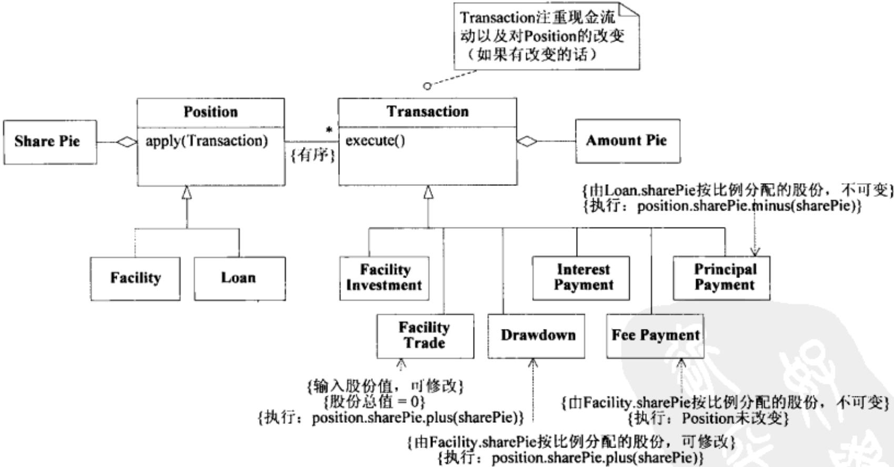


图8-9 几周之后的又一次模型突破。Transaction的约束可以被简单精确地表达出来


通常，在经过一次真正的突破并获得了深层模型之后，所获得的新设计变得更加清晰简单，新的UBIQUITOUS LANGUAGE也会增进沟通，于是又促成了下一次建模突破。 

当大部分项目由于规模和复杂度的累积而举步维艰时，我们的项目却正在加速前进。203 

# 将隐式概念转变为显式概念

深层建模听起来很不错，但是我们要如何实现它呢？深层模型之所以强大是因为它包含了领域的中心概念和抽象概念，能够以简单灵活的方式表达出基本的用户活动、问题以及解决方案。深层建模的第一步就是要设法在模型中表达出领域的基本概念。随后，在不断消化知识和重构的过程中，实现模型的精化。但是实际上这个过程是从我们识别出某个重要概念并且在模型和设计中把它显式地表达出来的那个时刻开始的。 

若开发人员识别出设计中隐含的某个概念或是在讨论中受到启发而发现一个概念时，就会对领域模型和相应的代码进行许多转换，在模型中加入一个或多个对象或关系，从而将此概念显式地表达出来。 

有时，这种从隐式概念到显式概念的转换可能是一次突破，使我们得到一个深层模型。但更多的时候，突破不会马上到来，而需要我们在模型中显式表达出许多重要概念，并通过一系列重构不断地调整对象职责、改变它们与其他对象的关系、甚至多次修改对象名称，在这之后，突破才会姗姗而来。最后，所有事情都变得清晰了。但是要实现上述过程，必须首先识别出以某种形式存在的隐含的概念，无论这些概念有多么原始。 

## 9.1 概念挖掘

开发人员必须能够敏锐地捕捉到隐含概念的蛛丝马迹，有时他们也必须主动寻找线索。要挖掘出大部分的隐含概念，需要开发人员去倾听团队语言、仔细检查设计中的不足之处以及与专家观点相矛盾的地方、研究领域相关文献并且进行大量的实验。 

## 9.1.1 倾听语言

你可能会想起这样的经历：用户总是不停地谈论报告中的某一项。该项可能来自各种对象的参数汇编，甚至还可能来自一次直接的数据库查询。同时，应用程序的另一部分也需要这个数据集来进行显示、报告或派生操作。但是，你却一直认为没有必要为此创建一个对象。也许你一直没有真正理解用户所说的某一特定术语时的含义，也没有意识到它的重要性。 

然后，你突然灵机一动。原来，报告中该项的名称即给出了一个重要的领域概念。你高兴地与专家谈起了这个新发现。他们可能会松一口气，因为你终于明白了。也可能会觉得很平常，因 为他们一直认为这是理所当然的。不管专家们如何反应，你开始在白板上画模型图了（之前你也一直这么做）。用户会帮助你修正新模型连接方面的细节，但这次的讨论质量肯定会有所提高。你和用户可以更加准确地理解对方，并且可以更加自然地用模型交互来演示特定场景。领域模型的语言也变得更加强大。然后，你可以重构代码来反映新模型，同时也会发现你的设计思路变得更加清晰了。 

倾听领域专家使用的语言。有没有一些术语能够简洁地表达出复杂的概念？他们有没有纠正过你的用词（也许是很委婉的提醒）？当你使用某个特定短语时，他们脸上还流露出迷惑的表情吗？这些都暗示了某个概念也许可以改进模型。 

这不同于原来的“名词即对象”概念。听到新单词只是个开头，然后我们还要进行对话、消化知识，这样才能挖掘出清晰实用的概念。如果用户或领域专家使用了设计中没有的词汇，这就是个警告信号。而当开发人员和领域专家都在使用设计中没有的词汇时，那就是一个双倍严重的警告信号了。 

206 

或者，应该把这种警告看成一次机会。UBIQUITOUS LANGUAGE是由遍布于对话、文档、模型图甚至代码中的词汇构成的。如果出现了设计中没有的一个术语，就可以把它添加到通用语言中，这样也就有机会改进模型和设计了。 

## 示例 听出运输模型中丢失的一个概念

团队已经开发出了可用来预订货物的有效应用程序。现在他们开始开发“作业支持”应用程序，此程序可帮助工作人员管理工作单，这些工作单用于安排起始地和目的地的货物装卸以及在不同货轮之间的转运。 

预定应用程序使用一个路线引擎来安排货物行程。运输过程的每段行程都作为一行数据存储在数据库表中，其中指定了装载该货物的航次（某一货轮的某一航次）ID、装货地点以及卸货地点。如图9-1所示。 

数据库表：cargo_bookings 

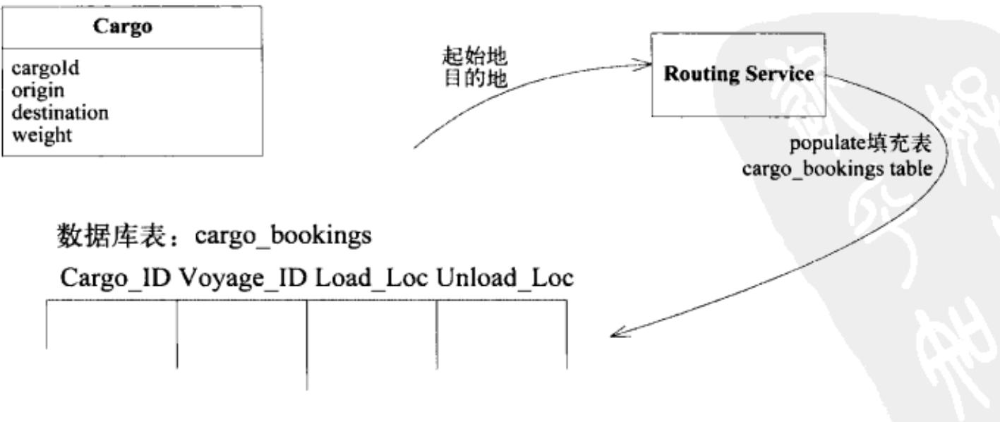


Cargo_ID Voyage_ID Load_Loc Unload_Loc 

图9-1 

207 

让我们来听听开发人员和运输专家之间的对话吧（对话已被高度简化）。 

开发人员：我想要确认一下cargo bookings（货物预订）表中是否已包含了作业应用程序所需的所有数据。 

专家：他们需要Cargo的全部行程。现在表中有哪些信息？ 

开发人员：货物ID、航次以及每个航段的装货港口和卸货港口。 

专家：那么日期呢？需要按照预计的时间来进行装卸工作。 

开发人员：嗯，日期可以从航次安排中获得。该表的数据已经得到了规范化处理。 

专家：是的，日期通常都是必需的数据。作业人员会用它们来安排后面的装卸工作。 

开发人员：嗯……好的。他们肯定可以得到日期数据。作业管理应用程序可以提供全部装货和卸货信息以及每次装卸作业的日期。我猜这也就是你所说的“航程”。 

专家：很好。航程是他们需要的主要数据。事实上，你知道，预订应用程序包含了一个菜单项，可以打印出航程或将航程通过电子邮件发送给顾客。你能想办法利用这个功能吗？ 

开发人员：我想那只是个报表。我们无法据此来开发作业应用程序。 

[开发人员陷入了沉思，然后开始兴奋起来。] 

开发人员：那么，航程实际上把预订程序和作业程序连接起来了。 

专家：是的。它同时还连接了一些客户关系。 

开发人员：[在白板上画出了一个草图。]那么，你觉得是这样的吗？ 

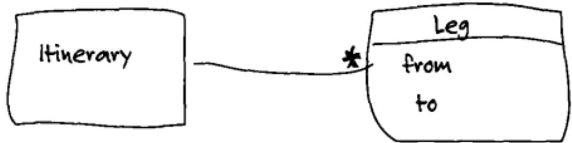


图9-2


专家：是的，基本上是这样。在每段行程中，我们都希望看到航次、装货和卸货地点以及时间。 

开发人员：所以，我们一旦创建了Leg（般段）对象，就能够从航次安排中获取时间信息。我们可以将Itinerary（航程）对象作为与作业应用程序联系的主要连接点。同时，还可以用这种方式重新编写航程报表，这样领域逻辑就重新回到领域层中了。 

专家：有些地方我不太明白，但是你说对了Itinerary的两个主要用途，一是用在预订应用程序报表功能中，二是用在作业应用程序中。 

开发人员：嘿！我们可以让Routing Service（路线服务）接口返回航程对象，而不用将数据写入数据库表。这样一来，路线引擎就不需要知道数据库表了。 

专家：嗯？ 

开发人员：我是说，我可以让路线引擎只返回一个Itinerary。然后，预订应用程序在保存剩下的信息时把它一起存储到数据库中。 

专家：你是说现在的程序并没有这么做吗？！ 

这位开发人员回去与开发路线过程的人员进行讨论。他们仔细研究了这对模型和设计会带来什么影响和变化，在必要的时候也去请教了运输专家。最后，他们得到了如图9-3所示的模型。 

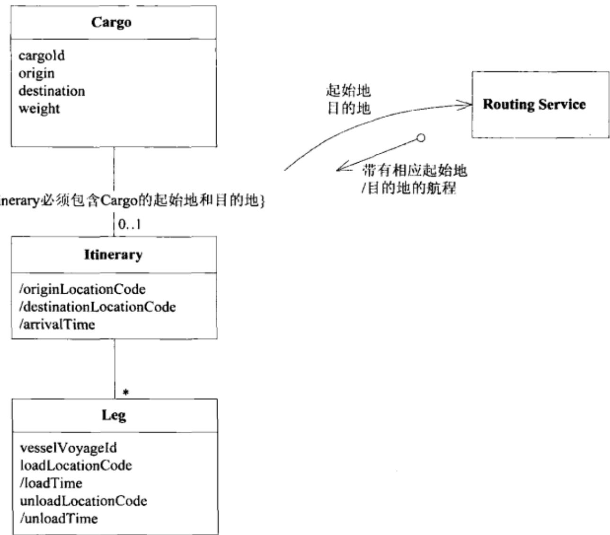


图9-3


接下来，开发人员对代码进行了重构，以使它能反映出新的模型。在一周内，他们很快对代码作出了一系列的修改，每次修改都进行两到三次重构。但是他们还没有对预订应用程序中航程报告进行简化，而简化工作将会在下周初开始进行。 

这位开发人员一直都在仔细倾听运输专家的见解，并注意到“航程”概念的重要性。所有的数据都已收集完毕，在航程报告中也已隐含了操作行为，但是，把显式的Itinerary对象作为模型的一部分给他们带来了新的机会。 

通过重构得到显式的Itinerary对象的益处是： 

(1) 更明确地定义Routing Service接口； 

(2) 将Routing Service从预订数据库表中分离出来； 

(3) 明确了预订应用程序和作业支持应用程序之间的关系（即共享Itinerary对象）； 

(4) 减少重复，因为Itinerary可同时为预订报表和作业支持应用程序提供装货/卸货时间； 

(5) 从预订报表中删除领域逻辑，并将其移至独立的领域层； 

(6) 扩充了UBIQUITOUS LANGUAGE，使得开发人员和领域专家之间或者开发人员内部能够更准确地讨论模型和设计。 

## 9.1.2 检查不足之处

你所需要的概念并不总是浮在表面上，也绝不仅仅是通过对话和文档就能让它显现出来。有些概念可能需要你自己去挖掘和创造。要挖掘的地方就是设计中最不足的地方，也就是操作复杂且难于解释的地方。每当有新的需求时，似乎都会让这个地方变得更加复杂。 

有时，你很难意识到模型中丢失了什么概念。也许你的对象能够实现所有的功能，但是有些职责的完成却很笨拙。而有时，你虽然能够意识到模型中丢失了某些东西，但是却无法找到解决方案。 

这个时候，你必须积极地让领域专家参与到讨论中来。如果你足够幸运，这些专家可能会愿意一起思考各种想法，并通过模型来进行验证。如果你没那么幸运，你和你的同事就不得不自己思索出不同的想法，让领域专家对这些想法进行判断，并注意观察专家的表情是认同还是反对。 

## 示例 摸索利息计算模型

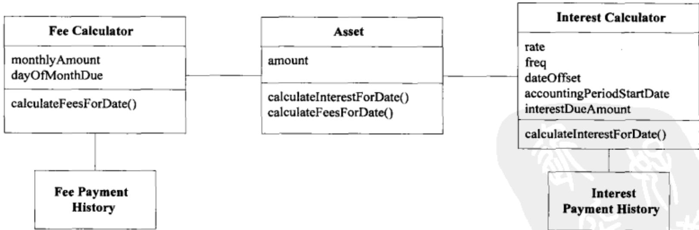


图9-4 笨拙的模型


下面的故事以一家假想的金融公司为背景，该公司经营商业贷款和其他一些生息资产。公司开发了一个用于跟踪这些投资及收益的应用程序，通过一项一项地添加功能来使它不断地发展。每天晚上，公司都会运行一个批处理脚本，用于计算当天所生成的利息和费用，并把它们相应地记录到公司的会计软件中。 

晚间批处理脚本会遍历每笔Asset（资产），并让其执行calculateInterestForDate()，按照当天的日期来计算利息。然后，该脚本会接收返回值（收益金额），并将它和指定分类账的名称一起发送给一个SERVICE（这个SERVICE提供了记账程序的公共接口）。再由记账软件将收入金额过账到指定的分类账中。这个脚本还会对每笔Asset当日的手续费作类似的处理，并记录到另一个不同的分类账中。 

负责这个程序的一位开发人员一直在费力地应对日益复杂的利息计算。她开始怀疑应该能找到一个更适合完成此项任务的模型。于是，她向她熟识的领域专家寻求帮助，希望专家可以协助她深入研究这个问题。 

开发人员：我们的Interest Calculator（利息计算器）太复杂了。 

专家：这一部分确实很复杂。还有很多情况我们都推迟考虑了。 

开发人员：我知道。我们可以使用另一个不同的Interest Calculator来添加新的利息类型。但现在最大的麻烦是，如果没有按时支付利息，该如何去处理由此引发的各种特殊情况。 

专家：其实这些不算是特殊情况。人们支付利息的方式可以非常灵活。 

开发人员：记得之前我们重构Asset，将Interest Calculator从中分离出来，这对开发工作大有帮助。我们可能还需要进一步分解Asset。 

专家：没问题。 

开发人员：我在想你们在讨论这种利息计算时可能有另外的方式。 

专家：你指的是什么？ 

开发人员：举个例子，假设我们正在跟踪会计期（accounting period）内到期的未付利息。这种利息有名字吗？ 

专家：哦，实际上我们并不会这么做。利息收入和付款是完全独立的过账。 

开发人员：所以你们不需要这个数字（到期的未付利息）？ 

专家：有时我们也许会看看，但这不是我们处理业务的方式。 

开发人员: 好吧。如果付款和利息是彼此独立的, 也许我们应该这样建模。这看起来怎么样? [在白板上画出草图] 

212 

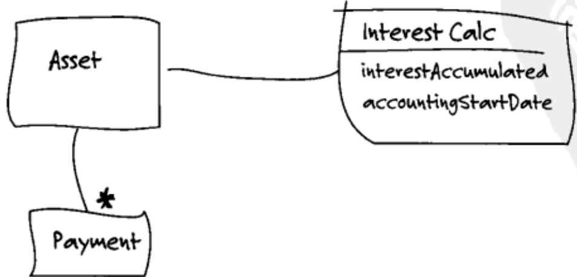


图9-5


专家：我想这是合乎情理的。但你只是把它从一个地方移到了另一个地方。 

开发人员：不过现在Interest Calculator只负责追踪利息收入了，付款的数目则是由Payment单独管理。这个模型并没有简化什么，但它是不是能够更好地反映出业务惯例呢？ 

专家: 啊。我懂了。我们能够同时保留利息的历史记录吗？就像之前模型中的 Payment History（付款历史）一样。 

开发人员：可以。这已经被作为一项新功能提出来了。但是，它本来应该在初始设计中就加进来。 

专家：哦。是这样，我看到你以这种方式分离利息和Payment History，还以为你们要把利息分解并组织成类似于Payment History的结构。你对应计制会计（accrual basis accounting）有所了解吗？ 

开发人员：请解释一下。 

专家：我们每天（或根据计划安排）都会把应计利息过账到收支总账中。而支付的过账方法则完全不同。你在这里把应计利息累加起来有点不大合适。 

开发人员：你是说，如果我们保留“应计利息”列表，那么这些利息就可以根据需要来进计算总计或者……“过账”。 

专家：应该是在应计日期过账，但是可以在任意时间内累加。费用的处理与此相同，当然，213 是要提交到另一个分类账中。 

开发人员：事实上，如果只计算一天或一段时间的利息，问题就会简单得多。然后，我们就能够解决所有这些问题了。这看起来怎么样？ 

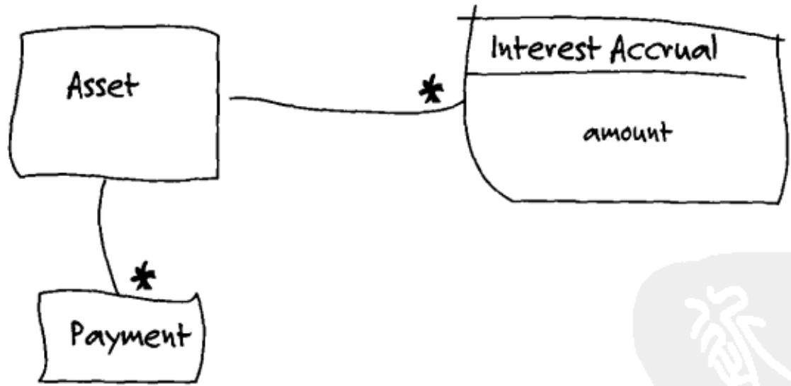


图9-6


专家：不错。这看起来很好。我不明白为什么这对你来说会简单得多。但基本上，资产之所以有价值，就是因为通过它可以累积利息、费用等等。 

开发人员：你是说手续费也是一样的吗？它们……怎么说来着？……要过账到不同的分类账中？ 

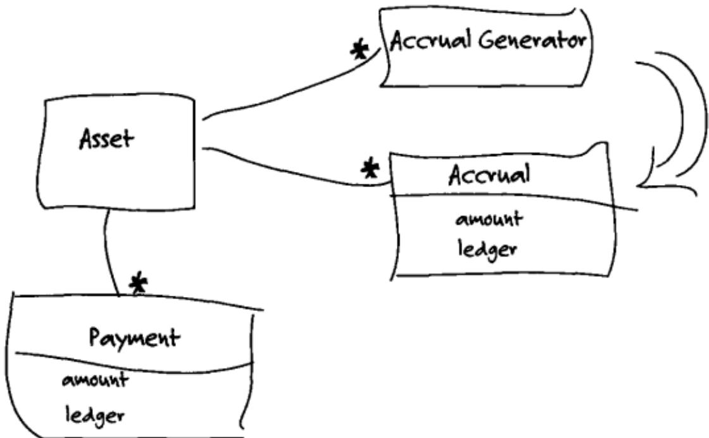


图9-7


开发人员：在这个模型中，我们将Interest Calculator中的利息计算（或者说是应计手续费的计算逻辑）与跟踪利息的功能分开了。直到现在我才注意到Fee Calculator与Interest Calculator有很多重复的地方。此外，现在不同类型的费用也可以轻松地添加进来了。 

专家：是的。之前的计算也是正确的，但现在变得一目了然了。 

由于Calculator类并没有直接与设计中的其他部分相关联，所以这其实是一个非常简单的重构。这位开发人员只需花几个小时就能够通过重写单元测试来验证新的语言，第二天新的设计就可以用了。最终，她得到了下面的模型。 

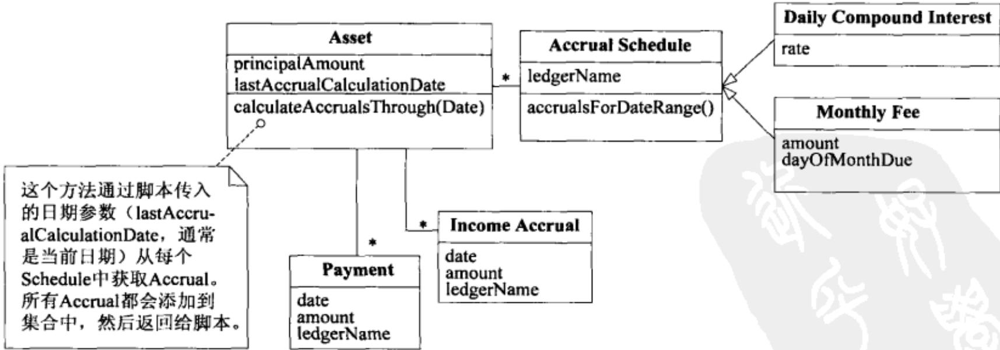


图9-8 重构后的深层模型


在重构后的应用程序中，夜间批处理脚本会通知每个Asset执行calculateAccrualsThroughDate()。其返回值是Accrual的集合，而其中的每笔金额都会过账到指定的分类账中。 

新模型具有几个优点，包括： 

(1) 术语 “应计费用（accrual）” 使UBIQUITOUS LANGUAGE更丰富； 

(2) 将应计费用从付款中分离出来； 

(3) 将领域知识（例如过账到哪个分类账）从脚本中移出来，并放到领域层中； 

215 

(4) 将费用与利息统一，既能够符合业务逻辑，又可消除重复代码； 

(5) 把Accrual Schedule作为费用和利息的一种新的形式简单地添加到模型中。 

这一次，开发人员不得不自己挖掘所需的新概念。她能够看出利息计算的不足之处，并坚持不懈地寻找更深层次的解决方案。 

她很幸运地找到一位聪明且热忱的银行专家作为合作伙伴。如果合作的专家不那么主动的话，她可能会在初期犯更多的错误，而后则需要更多地依赖于与其他开发人员进行头脑风暴来解决问题。这样，程序开发的进度会放慢，但还是有可能获得进展的。 

## 9.1.3 思考矛盾之处

不同的领域专家对同样的事情会有不同的看法，这取决于他们的经验和需求。即使是同一个人提供的信息，仔细分析后也会发现存在逻辑上不一致的地方。在挖掘程序需求的时候，我们会不断遇到这种令人烦恼的矛盾，但它们也为深层模型的实现提供了重要线索。有些矛盾只是术语说法上的不一致，有些则是由于误解而产生的。但还有一种情况是专家们会给出相互矛盾的两种说法。 

天文学家伽利略曾提出过一个悖论。我们的感觉清楚地表明地球是静止的：人们既不会被吹走也不会被抛出去。然而哥白尼却在他之前提到过一个很有说服力的观点，即地球是围绕着太阳飞速转动的。将这一矛盾统一起来可能会揭示出大自然运转的某种深奥的规律。 

于是，伽利略设计了一个假想实验。如果一个骑士在奔跑的马背上丢下一个球，这个球会掉到哪里？显然，这个球会随着马一起向前移动，直到它落在马蹄旁边的地面上，就像马一直站着没动时一样。根据这个实验，伽利略推导出了一个惯性参考系思想的早期雏形，它可以解决前面提到的悖论并可引出更为实用的运动物理学模型。 

我们遇到的矛盾通常不会这么有趣，也不会具有如此深刻的意义。尽管如此，采用同样的思考模式通常可帮助我们透过问题领域的表面获得更深层的理解。 

要解决所有矛盾是不太现实的，甚至是不需要的。（第14章将会深入探讨如何取舍以及如何处理结果。）然而，即使不去解决矛盾，我们也应该仔细思考对立的两种看法是如何同时应用于同一个外部现实的，这会给我们带来启示。 

## 9.1.4 查阅书籍

在寻找模型概念时，不要忽略一些显而易见的资源。在很多领域中，你都可以找到解释基本 概念和传统思想的书籍。你依然需要与领域专家合作，提炼与你的问题相关的那部分知识，然后将其转化为适用于面向对象软件的概念。但是，查阅书籍也许能够使你一开始就形成一致且深层的认识。 

## 示例 借助参考书来设计利息计算模型

让我们设想一下前面讨论的投资跟踪应用程序的另一个场景。与前面一样，这个故事的开头也是开发人员意识到设计变得越来越复杂，特别是Interest Calculator。但是在这个场景中，领域专家主要负责其他工作，他对帮助软件开发项目并不十分感兴趣。在这里，开发人员不能指望专家与其一起进行头脑风暴，帮助她探寻隐藏于表象之下的遗漏概念。 

于是，她去了书店。随意翻阅了几本书之后，她找到了一本自己比较喜欢的会计学入门书籍，并把它粗略浏览了一遍。她发现书中有一整套明确定义的概念体系。其中一段文字给了她特别大的启发： 

应计制会计。这种方法把所有已经产生的收入均计到收入中（即使尚未支付），所有支出也均在产生时显示出来（无论是已经支付还是以后才支付）。所有到期债务，包括税金，都列入费用。 

开发人员再也不用自己去重新编造一个会计学出来了。在与其他开发人员进行了一些讨论之后，她设计出了一个模型，如图9-9所示。 

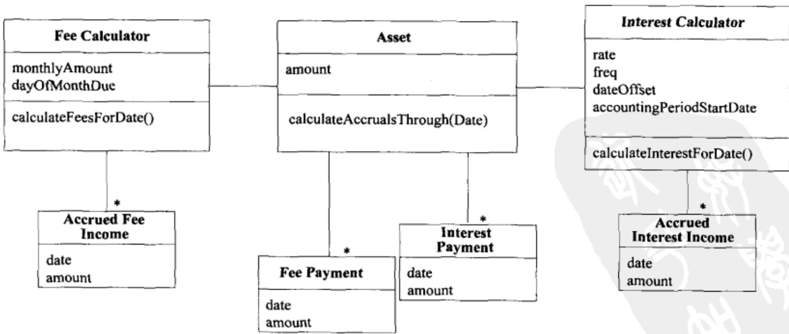


图9-9 通过阅读书籍而得来的略为深层的模型


她还没有认识到收入是由Asset产生的，所以模型中依然含有Calculator。分类账的概念还是包含在应用程序中，而不是在它本应归属的领域层中。但是，她确实将付款从应计收入中分离出来了（这曾是最大的问题）并且她将“应计费用”这个词引入到模型和UBIQUITOUS LANGUAGE中。在之后的迭代过程中，模型还会得到进一步的精化。 

当这位开发人员终于有机会与领域专家讨论时，专家大吃一惊。她是专家遇到的第一个对专家的工作表现出些许兴趣的程序人员。由于职责分配的原因，专家从未与她交谈过，也从来没有像在前面的例子中一样坐下来与她共同商讨过模型问题。但是，这位开发人员从书中获取了知识，这使她能够提出很好的问题，所以自此以后，专家开始认真倾听她的见解，并尽力及时地回答她的问题。 

当然，看书与咨询领域专家并不冲突。即便能够从领域专家那里得到充分的支持，花点时间从文献资料中学习掌握领域理论也是值得的。虽然许多业务并不会像会计学或金融行业那样具有精化的模型，但是在许多领域中都会有一些擅于思考的人，他们已组织并抽象出了业务的一些通用的惯例。 

开发人员还有另一个选择，就是阅读由在此领域中有过开发经验的软件专业人员编写的资料。例如，《分析模式》（[Fowler 1997]）一书的第6章可能会为她提供一个完全不同的思考方向，无论这个方向会让开发变得更好还是更糟。阅读书籍并不能提供现成的解决方案，但可以为她提供一些全新的实验起点，以及在这个领域中探索过的人总结出来的经验。这样可以避免开发人员重复设计已有的概念。第11章将更深入地探讨这一主题。 

## 9.1.5 尝试，再尝试

上面的例子并没有显示出不断尝试和出错的次数。在讨论过程中，我可能尝试六七种不同的思路，然后找到一个看起来足够清晰且实用的概念，并在模型中尝试它。后面，随着经验的积累和知识的消化，我们会有更好的想法，最终，这个概念至少会被替换一次。因此，建模人员/设计人员绝对不能固执己见。 

并不是所有这些方向性的改变都毫无用处。每次改变都会把开发人员更深刻的理解添加到模型中。每次重构都使设计变得更灵活并且为那些可能需要修改的地方做好准备。 

其实，我们并没有其他选择。只有不断尝试才能了解什么有效什么无效。企图避免设计上的失误将会导致开发出来的产品质量低劣，因为没有更多的经验可用来借鉴，同时也会比进行一系列快速实验更加费时。 

## 9.2 如何为那些不太明显的概念建模

面向对象范式会引导我们去寻找和创造特定类型的概念。所有事物（即使是像“应计费用”这种非常抽象的概念）及其操作行为是大部分对象模型的主要部分。它们就是面向对象设计入门 书籍所讲到的“名词和动词”。但是，概念中其他重要的类别也可以在模型中显式地表现出来。 

下面我将会描述三个这样的类别，我在开始接触对象时，对它们的认识并不够清晰。我每学会一个这样的类别，就会让设计变得更加清晰深刻。 

219 

## 9.2.1 显式的约束

约束是模型概念中非常重要的类别。它们通常是隐式出现的，将它们显式地表现出来可以极大地提高设计质量。 

有时，约束很自然地存在于对象或方法中。Bucket（桶）对象必须满足一个固定规则——装载量不能超出它的容积，如图9-10所示。 

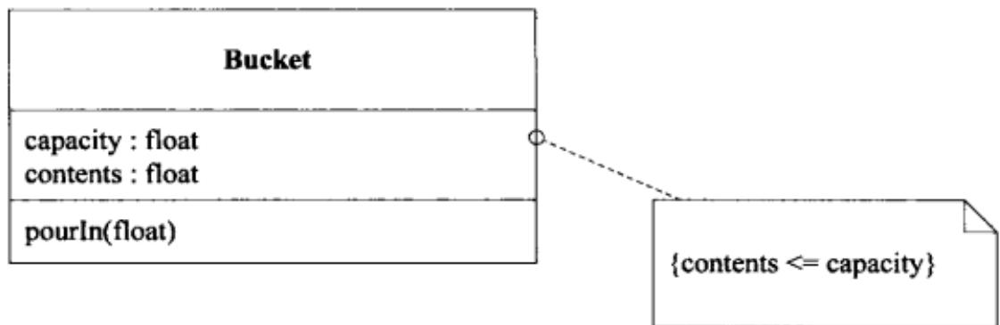


图9-10


这样一个简单的固定规则可以在每次可改变内容的操作中使用一个逻辑判断来保证。 

```txt
class Bucket {
    private float capacity;
    private float contents;

    public void pourIn(float addedVolume) {
    if (contents + addedVolume > capacity) {
    contents = capacity;
    } else {
    contents = contents + addedVolume;
    }
    }
} 
```

这里的逻辑非常简单，规则也很明显。但是不难想象，在更复杂的类中这个约束可能会丢失。让我们把这个约束提取到一个单独的方法中，并用清晰直观的名称来表达它的意义。 

```java
class Bucket {
private float capacity;
private float contents;

public void pourIn(float addedVolume) { 
```

```txt
float volumePresent = contents + addedVolume;
contents = constrainedToCapacity(volumePresent);
}
private float constrainedToCapacity(float volumePlacedIn) {
    if (volumePlacedIn > capacity) return capacity;
    return volumePlacedIn;
} 
```

这两个版本的代码都实施了约束，但是第二个版本与模型的关系更为明显（这也是MODEL-DRIVEN DESIGN的基本需求）。这个规则十分简单，使用最初形式的代码也很容易理解，但如果要是执行的规则比较复杂的话，它们就会像所有隐式概念一样淹没掉被约束的对象或操作。将约束条件提取到其自己的方法中，这样就可以通过方法名来表达约束的含义，从而在设计中显式地表现出这条约束。现在这个约束条件就是一个“有名有姓”的概念了，我们可以用它的名字来讨论它。这种方式也为约束的扩展提供了空间。比这更复杂的规则很容易就会产生比其调用者（在这里就是pourIn()方法）更长的方法。这样，调用者就可以简单一些，并且只专注于处理自己的任务，而约束条件则可以根据需要进行扩展。 

这种独立方法为约束预留了一定的增加空间，但是在很多时候，约束条件是无法用单独一个方法来轻松表达的。或者，即使方法自身能够保持其简单性，但它可能会调用一些信息，而在对象的主要职责中这些信息毫无用处。这种规则可能就不适合放到现有对象中。 

下面是一些警告信号，表明约束的存在正在扰乱它的“宿主对象”（Host Object）的设计。 

(1) 计算约束所需的数据从定义上看并不属于这个对象。 

(2) 相关规则在多个对象中出现，造成了代码重复或导致不属于同一族的对象之间产生了继承关系。 

(3) 很多设计和需求讨论是围绕这些约束进行的，而在代码实现中，它们却隐藏在过程代码 221 中。 

如果约束的存在掩盖了对象的基本职责,或者如果约束在领域中非常突出但在模型中却不明显,那么就可以将其提取到一个显式的对象中,甚至可以把它建模为一个对象和关系的集合。(The Object Constraint Language: Precise Modeling with UML [Warmer and Kleppe 1999] 一书中提供了关于这个问题的半正式的深入解决方案。) 

## 示例 复核：超订策略

在第1章中，我们讨论了一个常见的运输业务惯例：预订超出运输能力 $10\%$ 的货物。（货运公司的经验表明，这种程度的超额可以弥补因客户临时取消订单而给货运公司所带来的损失，这样就可以保证货轮基本能够满载起航了。） 

通过加入一个新类来反映Voyage和Cargo关联中的结束，该约束不管是在图表中还是在代码中都能显式地体现出来。如图9-11所示。 

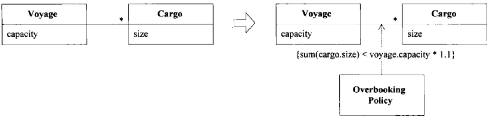


图9-11 为显式表达超订策略而重构的模型


要查看完整例子的代码和思路，请参阅1.4节示例。 

## 9.2.2 作为领域对象的过程

首先要说明的是，我们都不希望过程变成模型的主要部分。对象是用来封装过程的，而我们只需考虑对象的设计目的或意图就可以了。 

在这里，我们讨论的是存在于领域中的过程，我们必须在模型中把这些过程表示出来。否则当这些过程显露出来时，往往会使对象设计变得笨拙。 

本章的第一个例子描述了一个用来安排货运路线的运输系统。安排路线的过程涉及一些业务知识。SERVICE是显式表达这种过程的一种方式，同时它依然会将异常复杂的算法封装起来。 

如果过程的执行有多种方式，那么我们也可以用另一种方法来处理它，那就是将算法本身或其中的关键部分放到一个单独的对象中。这样，选择不同的过程就变成了选择不同的对象，每个对象都表示一种不同的STRATEGY。（第12章将会更详细地讨论如何在领域中使用STRATEGY。） 

过程是应该被显式表达出来，还是应该被隐藏起来呢？区分的方法很简单：它是经常被领域专家提起呢，还是仅仅被当作计算机程序机制的一部分？ 

约束和过程是模型概念中两个应用范围很广的概念，当我们用面向对象语言编程时，不会立即想到它们，然而它们一旦被我们视为模型元素，就真的可以让我们的设计更为清晰。 

有些概念类别很实用，但它们可应用的范围要窄很多。为了使本章的讨论更全面，我会说明这样一个更专门的但也非常常用的概念类别——规格（specification）。“规格”提供了用于表达特定类型的规则的精确方式，它把这些规则从条件逻辑中提取出来，并在模型中把它们显式地表示出来。 

SPECIFICATION是我与Martin Fowler（[Evans and Fowler 1997]）协作开发出来的。这个概念 看起来很简单，但是应用和实现中起来却很微妙，因此在本节中会有大量的细节描述。在第10章中还会继续讨论SPECIFICATION，并对这种模式进行扩展。在阅读完接下来对该模式的初步解释后，你可以跳过9.2.4节，等到你真正想要应用这种模式时再回来阅读也不迟。 

## 9.2.3 模式：SPECIFICATION

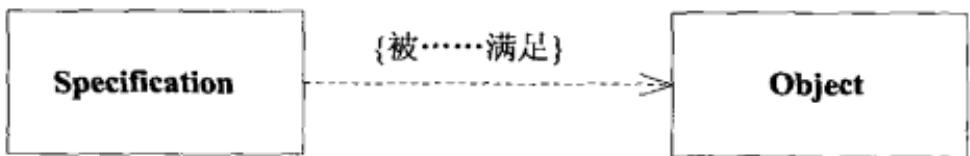


在所有类型的应用程序中，都会有布尔值测试方法，实际上它们基本不属于规则。只要它们很简单，就可以用测试方法（例如anIterator.hasNext()或anInvoice.isOverdue()）来处理它们。在Invoice类中，isOverdue()的代码是计算一条规则的算法。例如： 

```txt
public boolean isOverdue() {
    Date currentDate = new Date();
    return currentDate.after(dueDate);
} 
```

但是并非所有规则都如此简单。在同一个Invoice（发票）类中，还有另外一个规则anInvoice.isDelinquent()，它一开始也是用来检查Invoice是否过期的，但仅仅是开始部分。根据客户账户状态的不同，可能会有宽限期政策。一些拖欠票据正准备再一次发出催款通知，而另一些则准备发给收账公司。此外，还要考虑客户的付款历史纪录、公司在不同产品线上的政策，等等。Invoice作为付款请求是明白无误的，但它很快就会消失在大量杂乱的规则计算代码中。Invoice还会发展出对领域类和子系统的各种依赖关系，而这些领域类和子系统却与Invoice的基本含义无关。 

到了这一步，为了简化Invoice类与其他对象的关系，开发人员通常会将规则计算代码重构到应用层中（在这里就是账单收集应用程序）。现在规则已经从领域层中分离出来，留下了一个纯粹的数据对象，它将不再表达本来应该在业务模型中表示的规则。这些规则需要保留在领域层中，但是把它们放到被其约束的对象（在这里是Invoice）里又不合适。此外，计算规则的方法中到处都是条件代码，这也使得规则变得复杂难懂。 

那些使用逻辑编程范式的开发人员会用一种不同的方式来处理这种情况。这种规则被称为谓词。谓词是指计算结果为“真”或“假”的函数，并且可以使用操作符（如AND和OR）把它们连接起来以表达更复杂的规则。通过谓词，我们可以显式地声明规则并在Invoice中使用这些规则。但前提是必须使用逻辑范式。 

认识到这一点后，人们已经开始尝试以对象的形式来实现逻辑规则。在这些尝试中，有些很成熟，有些则很幼稚。有些雄心勃勃，有些则谦虚谨慎。有些被证明很有价值，有些则被当作失败的试验丢到一边。有些尝试甚至导致项目误入歧途。但是，有一件事情是很清楚的：无论这个 想法多么吸引人，其主要目标都是完全用对象来实现逻辑。（毕竟，逻辑编程本身就是一套建模和设计范式。） 

业务规则通常不适合作为ENTITY或VALUE OBJECT的职责，而且规则的变化和组合也会掩盖领域对象的基本含义。但是将规则移出领域层的结果会更糟糕，因为这样一来，领域代码就不再表达模型了。 

逻辑编程提供了一种概念，即“谓词”这种可分离、可组合的规则对象，但是要把这种概念用对象完全实现是很麻烦的。同时，这种概念也非常笼统，在表达设计意图方面，它的针对性不如设计那么好。 

幸运的是，我们并不真正需要完全实现逻辑编程即可从中受益。大部分规则都可以归类为几种特定的情况。我们可以借用谓词概念来创建可计算出布尔值的特殊对象。那些难于控制的测试方法可以巧妙地扩展出自己的对象。它们都是一些小的事实测试，可以提取到一个单独的VALUE OBJECT中。而这个新对象则可以用来计算另一个对象，看看谓词对那个对象的计算是否为“真”。 

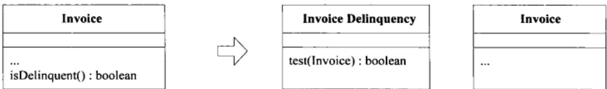


图9-12


换言之，这个新对象就是一个规格。SPECIFICATION中（规格）中声明的是限制另一个对象状态的约束，被约束对象可以存在，也可以不存在。SPECIFICATION有多种用途，其中的一种用途体现了最基本的概念，这种用途就是：SPECIFICATION可以测试任何对象以检验它们是否满足指定的标准。 

因此： 

为特殊目的创建谓词形式的显式的VALUE OBJECT。SPECIFICATION就是一个谓词，可用来确定对象是否满足某些标准。 

许多SPECIFICATION都是具有特殊目标的简单测试，就像在拖欠票据示例中的规格一样。当规则很复杂时，可以扩展这种概念，对简单的规格进行组合，就像用逻辑运算符把多个谓词组合起来一样。（这种技术将在下一章中讨论。）基本模式保持不变，并且提供了一种从简单模型过渡到复杂模型的途径。 

拖欠票据的例子可以使用SPECIFICATION来建模，如图9-13所示。在规格中声明拖欠的含义，对任意的Invoice对象进行计算并做出判断。 

SPECIFICATION将规则保留在领域层。由于规则是一个完备的对象，所以这种设计能够更加清晰地反映模型。利用工厂，可以用来自其他资源（例如客户账户或者企业政策数据库）的信息对规格进行配置。之所以使用FACTORY，是为了避免Invoice直接访问这些资源，因为这样会使得 

Invoice与这些资源发生不正确的关联（Invoice的基本职责是请求付款，而这些资源与这一职责无关）。在这个例子中，我们将创建Delinquent Invoice Specification（拖欠发票规格）来对一些发票进行评估，这个SPECIFICATION用过之后就丢掉了。这样只需指定评估日期就可以了，这真是一次完美的简化。我们可以通过为SPECIFICATION提供所需信息来简单直接地完成它的职责。 

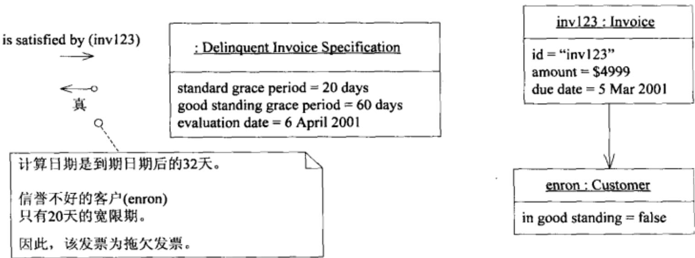


图9-13 作为SPECIFICATION被提取出来的更为详细的拖欠规则


226 

* * * 

SPECIFICATION的基本概念非常简单，这能帮助我们思考领域建模问题。但是MODEL-DRIVEN DRSIGN要求我们开发出一个能够把概念表达出来的有效实现。要实现这个目标，必须要更深入地挖掘应用这个模式的方法。领域模式不仅仅是UML图中好的想法，也应该可以为MODEL-DRIVEN DRSIGN中的编程问题提供解决方案。 

只要恰当地应用模式，就可以得出一整套如何解决领域建模问题的思路，同时也可以从这种长时间搜寻有效实现的经验中受益。下面的SPECIFICATION讨论详细介绍了功能和实现方法的多种选择。模式并不像菜谱那么死板。它可以让你基于自己的经验来开发解决方案，也为你讨论手头工作提供了语言。 

在第一次阅读时，你可以快速浏览关键概念。以后碰到具体情况时，可以再回过头来阅读并从细节讨论中获取经验。然后就可以开始设计你自己的解决方案了。 

## 9.2.4 SPECIFICATION的应用和实现

SPECIFICATION最有价值的地方在于它可以将看起来完全不同的应用功能统一起来。出于以下三个目的中的至少一个目的，我们可能需要来指定对象的状态。 

(1) 验证对象，检查它是否能满足某些需求或者是否已经为实现某个目标做好了准备。 

(2) 从集合中选择一个对象（如上述例子中的查询过期发票）。 

(3) 指定在创建新对象时必须满足某种需求。 

这三种用法（验证、选择和根据要求来创建）从概念层面上来讲是相同的。如果没有诸如SPECIFICATION这样的模式，相同的规则可能会表现为不同的形式，甚至有可能是相互矛盾的形式。这样就会丧失概念上的统一性。通过应用SPECIFICATION模式，我们可以使用一致的模型，尽管在实现时可能需要分开处理。 

验证 

规格的最简单用法是验证，这种用法也最能直观地展示出它的概念。如图9-14所示。 

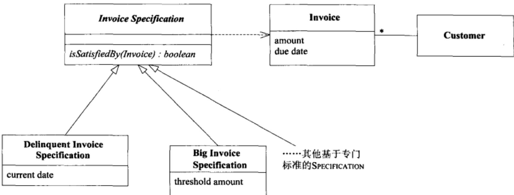


图9-14 应用SPECIFICATION进行验证的模型


```java
class DelinquentInvoiceSpecification extends
InvoiceSpecification {
private Date currentDate;
// An instance is used and discarded on a single date

public DelinquentInvoiceSpecification(Date currentDate) {
    this.currentDate = currentDate;
}

public boolean isSatisfiedBy(Invoice candidate) {
    int gracePeriod =
    candidate.customer().getPaymentGracePeriod();
    Date firmDeadline =
    DateUtility.addDaysToDate(candidate.dueDate(),
    gracePeriod);
    return currentDate.after(firmDeadline);
} 
```


现在，假设当销售人员看到一个欠账客户的信息时，系统需要显示一个红旗标识。我们只需要在客户类中编写一个方法即可，类似于下面这段代码： 

```java
public boolean accountIsDelinquent(Customer customer) {
    Date today = new Date();
    Specification delinquentSpec =
    new DelinquentInvoiceSpecification(today);
    Iterator it = customer.getInvoices().iterator();
    while (it.hasNext()) {
    Invoice candidate = (Invoice) it.next();
    if (delinquentSpec.isSatisfiedBy(candidate)) return true;
    }
    return false;
} 
```

## 选择（或查询）

验证是对一个独立的对象进行测试，检查它是否满足某些标准，然后客户可能根据验证的结论来采取行动。另一种常见需求是根据某些标准从对象集合中选择一个子集。SPECIFICATION概念同样可以在此应用，但是实现问题会有所不同。 

假设应用程序的需求是列出所有拖欠发票的客户。那么从理论上来说，我们依然可以使用之前定义的Delinquent Invoice Specification，但实际上我们可能不得不去修改它的实现。为了证明二者的概念是相同的，让我们首先假设发票的数量很少，可能已经全部装入内存了。在这种情况下，验证功能的最直接实现方式依然可用。Invoice Repository可以用一个一般化的方法来基于SPECIFICATION选择Invoice： 

```java
public Set selectSatisfying(InvoiceSpecification spec) {
    Set results = new HashSet();
    Iterator it = invoices.iterator();
    while (it.hasNext()) {
    Invoice candidate = (Invoice) it.next();
    if (spec.isSatisfiedBy(candidate)) results.add(candidate);
    }
    return results;
}
这样，用一行代码即可获得所有拖欠发票的集合： 
```

229 

```javascript
Set delinquentInvoices = invoiceRepository.selectSatisfying(new DelinquentInvoiceSpecification(currentDate)); 
```

上面这行代码建立了操作背后的概念。当然，Invoice对象可能并不在内存中。也有可能会有成千上万个Invoice对象。在典型的业务系统中，数据很可能会存储在关系数据库中。我们在前面 的章节中曾经指出，在与其他技术交互使用时，很容易分散我们对模型的注意力。 

关系数据库具有强大的查询能力。我们如何才能充分利用这种能力来有效解决这一问题，同时又能保留SPECIFICATION模型呢？MODEL-DRIVEN DESIGN要求模型与实现保持同步，但它同时也让我们可以自由选择能够准确捕捉模型意义的实现方式。幸运的是，SQL是用于编写SPECIFICATION的一种很自然的方式。 

下面是个简单的例子，其中查询被封装在验证规则所在的类中。我们在Invoice Specification中添加了一个方法，该方法在Delinquent Invoice Specification子类中得以实现： 

```java
public String asSQL() {
    return
    "SELECT * FROM INVOICE, CUSTOMER" +
    " WHERE INVOICE.CUST_ID = CUSTOMER.ID" +
    " AND INVOICE.DUE_DATE + CUSTOMER.GRACE_PERIOD" +
    " < " + SQLUtility.dateAsSQL(currentDate); 
```

SPECIFICATION与REPOSITORY的搭配非常合适，REPOSITORY作为一种构造块机制，提供了对领域对象的查询访问，并且把数据库接口封装起来（参见图9-15）。 

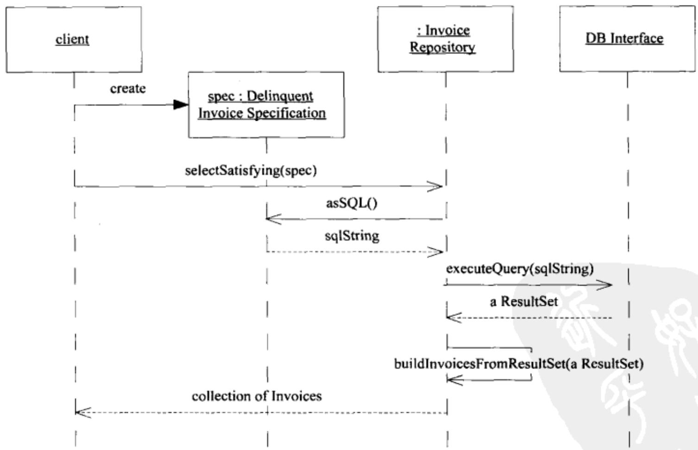


图9-15 REPOSITORY和SPECIFICATION之间的交互


现在的设计有一些问题。最重要的问题是，表结构的细节本应该被隔离到一个映射层中（这个映射层把领域对象关联到关系表），现在却泄漏到了DOMAIN LAYER中。这样一来，这些表结构 信息发生了隐性的重复，因此导致对Invoice和Customer对象的修改和维护变得很麻烦，因为现在必须在多个地方跟踪它们的映射变化。但是，这个例子只是一个简单的例证，用来说明如何将规则只放在一个地方。一些对象关系映射框架提供了用模型对象和属性来表达这种查询的方式，并在基础设施层中创建实际的SQL语句。这样就可以两全其美了。 

如果无法把SQL语句创建到基础设施中，还可以重写一个专用的查询方法并把它添加到Invoice Repository中，这样就把SQL语句从领域对象中分离出来了。为了避免在REPOSITORY中嵌入规则，必须采用更为通用的方式来表达查询，这种方式不捕捉规则但是可以通过组合或放置在上下文中来表达规则（在这个例子中，使用的是双分派模式）。 

231 

```java
public class InvoiceRepository {

    public Set selectWhereGracePeriodPast(Date aDate) {
    //This is not a rule, just a specialized query
    String sql = whereGracePeriodPast_SQL(aDate);
    ResultSet queryResultSet =
    SQLDatabaseInterface.instance().executeQuery(sql);
    return buildInvoicesFromResultSet(queryResultSet);
    }

    public String whereGracePeriodPast_SQL(Date aDate) {
    return
    "SELECT * FROM INVOICE, CUSTOMER" +
    " WHERE INVOICE.CUST_ID = CUSTOMER.ID" +
    " AND INVOICE.DUE_DATE + CUSTOMER.GRACE_PERIOD" +
    " < " + SQLUtility.dateAsSQL(aDate);
    }

    public Set selectSatisfying(InvoiceSpecification spec) {
    return spec.satisfyingElementsFrom(this);
    }
} 
```

Invoice Specification 中的 asSql() 方法被替换为 satisfyingElementsFrom(Invoice-Repository)，并在 Delinquent Invoice Specification 中以如下的方式实现： 

```swift
public class DelinquentInvoiceSpecification {
    // Basic DelinquentInvoiceSpecification code here
    public Set satisfyingElementsFrom(
    InvoiceRepository repository) {
    //Delinquency rule is defined as:
    // "grace period past as of current date"
    return repository.selectWhereGracePeriodPast(currentDate);
    }
} 
```

这段代码将SQL置于REPOSITORY中，而应该使用哪个查询则由SPECIFICATION来控制。规格中并没有定义完整的规则，但是包含了SPECIFICATION的基本声明，指明了什么条件构成了拖欠（即超过宽限期）。 

现在，REPOSITORY中包含的查询非常具有针对性，可能只适用于这种情况。虽然这可以接受的，但是根据拖欠发票在过期发票中所占数量的不同，我们可以选择一种更通用的REPOSITORY解决方案，使得性能仍然很好，同时又使SPECIFICATION的使用更易理解。 

```java
public class InvoiceRepository {

    public Set selectWhereDueDateIsBefore(Date aDate) {
    String sql = whereDueDateIsBefore_SQL(aDate);
    ResultSet queryResultSet =
    SQLDatabaseInterface.instance().executeQuery(sql);
    return buildInvoicesFromResultSet(queryResultSet);
    }

    public String whereDueDateIsBefore_SQL(Date aDate) {
    return
    "SELECT * FROM INVOICE" +
    " WHERE INVOICE.DUE_DATE" +
    " < " + SQLUtility.dateAsSQL(aDate);
    }

    public Set selectSatisfying(InvoiceSpecification spec) {
    return spec.satisfyingElementsFrom(this);
    }
}

public class DelinquentInvoiceSpecification {
    //Basic DelinquentInvoiceSpecification code here

    public Set satisfyingElementsFrom(
    InvoiceRepository repository) {
    Collection pastDueInvoices =
    repository.selectWhereDueDateIsBefore(currentDate);

    Set delinquentInvoices = new HashSet();
    Iterator it = pastDueInvoices.iterator();
    while (it.hasNext()) {
    Invoice anInvoice = (Invoice) it.next();
    if (this.isSatisfiedBy(anInvoice))
    delinquentInvoices.add(anInvoice);
    }
    return delinquentInvoices;
    }
} 
```

因为我们取出了很多Invoice，上面的代码可能会降低系统性能，所以不得不在内存中对它们进行筛选。这种以降低性能来实现更好的职责分离的代价是否可以接受完全取决于环境因素。SPECIFICATION和REPOSITORY之间的交互有很多种实现方式，不但能够利用开发平台的优势，还可以保证基本职责的实施。 

有时，为了改善性能（或者更有可能是为了加强安全性），我们可能把查询实现为服务器上的存储过程。在这种情况下，SPECIFICATION可能只带有存储过程允许的参数。除此之外，这些不同实现之间的模型并没有什么不同。我们可以自由选择实现方式，除非模型中有特别的约束条件。这么做的代价是更加难于编写和维护查询。 

上面的讨论基本上没有涉及将SPECIFICATION与数据库结合时所面临的挑战，我并不想在这里说明所有可能需要考虑的问题，而只是想简单介绍一下必须要做出的选择。Mee和Hieatt在[Fowler 2002]中讨论了用规格设计REPOSITORY时遇到的一些技术问题。 

## 根据要求来创建（生成）

如果五角大楼需要一架新式的喷气式战斗机，政府官员们会先编写规格。在规格中可能会要求这架喷气机的速度达到2马赫，航程1800英里，并且成本不高于5000万美元，等等。无论规格有多详细，它都不是飞机的设计，更不是飞机本身。航空航天工程公司将接受这份规格并且据此创建出一个或多个设计。各个竞争公司可能会提出不同的设计，所有这些方案都需要满足原始规格。 

很多计算机程序都能够生成一些工件，这些工件是需要被指定的。当你在字处理软件文档中插入图片时，文字会环绕在图片周围。你已指定了图片的位置，可能也指定了文字环绕的样式。这样，字处理软件就可以按照你指定的规格来将页面上的文字摆放到正确的位置。 

尽管乍看起来并不明显，但是这种SPECIFICATION概念与应用于验证和选择的规格并无二致。都是在为尚未创建的对象指定标准。但是，SPECIFICATION的实现则会大不相同。这种SPECIFICATION与查询不同，它不用来过滤已存在对象；也与验证不同，并不用来测试已有对象。在这里，我们要创建或重新配置满足SPECIFICATION的全新对象或对象集合。 

如果不使用SPECIFICATION, 可以编写一个生成器, 其中包含可创建所需对象的过程或指令集。这种代码隐式地定义了生成器的行为。 

反过来，我们也可以根据SPECIFICATION来定义生成器的接口，这个接口就显式地约束了生成器产生的结果。这种方法具有以下几个优点。 

☐ 生成器的实现与接口分离。SPECIFICATION声明了输出的需求，但没有定义如何得到输出结果。 

☐ 接口把规则显式地表示出来，因此开发人员无需理解所有操作细节即可知晓生成器会产生什么结果。而如果生成器是预定义好的，那么要想预测它的行为，唯一的途径就是在不同的情况下运行或去研究每行代码。 

□接口更为灵活，或者说我们可以增强其灵活性，因为需求由客户给出，生成器唯一的职 

责就是实现SPECIFICATION中的要求。 

☐ 最后一点也很重要。这种接口更加便于测试，因为接口显式地定义了生成器的输入，而这同时也可用来验证输出。也就是说，传入生成器接口的用于约束创建过程的同一个SPECIFICATION也可发挥其验证的作用（如果实现方式能够支持这一点的话），以保证被创建的对象是正确的。（这是ASSERTION的例子，将会在第10章中讨论。） 

根据要求来创建可以是从头创建全新对象，也可以是配置已有对象来满足SPECIFICATION。 

## 示例 化学品仓库打包程序

假设有一个仓库,里面用类似于货车车厢的大型容器存放各种化学品。有些化学品是惰性的,可以随意摆放。有些则是易挥发的,必须放于特制的通风容器中。还有一些是易爆品,必须保存于特制的防爆容器中。还有一些规则是关于如何在容器中混装化学品的。 

我们的目标是编写出一个软件，用于寻找一种可安全而高效地在容器中放置化学品的方式，如图9-16所示。 

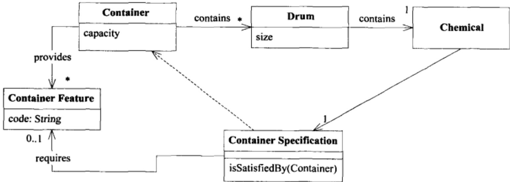


图9-16 仓库存储模型


我们可以首先从编写一个过程——取出一个化学品并将其放置在一个容器中——开始，但是让我们从验证问题开始着手吧。这种方式让我们必须显式描述规则，同时也提供了一种测试最终实现的方式。


每种化学品都有一个容器SPECIFICATION。


<table><tr><td>化学品</td><td>容器SPECIFICATION</td></tr><tr><td>TNT</td><td>防爆容器</td></tr><tr><td>砂</td><td></td></tr><tr><td>生物样本</td><td>不能与易爆品混装</td></tr><tr><td>氨水</td><td>通风容器</td></tr></table>

现在，如果将这些规格编写成Container Specification，就可以提出一种把化学品混装在容器中的配置方法，并测试它是否满足这些约束条件。 

<table><tr><td>容器特性</td><td>物品</td><td>是否满足规格?</td></tr><tr><td rowspan="3">防爆</td><td>20磅TNT500磅砂</td><td>√</td></tr><tr><td>50磅生物样本</td><td>√</td></tr><tr><td>氨水</td><td>×</td></tr></table>

Container Specification中的方法isSatisfied()用来检查是否满足所需的ContainerFeature。例如，易爆化学品的规格会寻找“防爆”特性： 

236 

```java
public class ContainerSpecification {
    private ContainerFeature requiredFeature;

    public ContainerSpecification(ContainerFeature required) {
    requiredFeature = required;
    }

    boolean isSatisfiedBy(Container aContainer){
    return aContainer.getFeatures().contains(requiredFeature);
    }
} 
```

下面是设置易爆化学品的客户端示例代码： 

```txt
tnt.setContainerSpecification(
    new ContainerSpecification(ARMORED)); 
```

Container对象中的方法isSafelyPacked()用来保证Container具有Chemical要求的所有特性。 

```txt
boolean isSafelyPacked() {
    Iterator it = contents.iterator();
    while (it.hasNext()) {
    Drum drum = (Drum) it.next(); if (!drum.containerSpecification().isSatisfiedBy(this)) return false;
    }
    return true;
} 
```

到了这一步，我们就可以编写一个监控程序，用来监视库存数据库并报告不安全状况。 

```java
Iterator it = containers.iterator();
while (it.hasNext()) { 
```

```java
public class Container {
    private double capacity;
    private Set contents; //Drums 
```

```txt
Container container = (Container) it.next();
if (!container.isSafelyPacked())
    unsafeContainers.add(container);
} 
```

客户并没有要求我们编写这样一个软件。让业务人员知道这个程序当然很好，但客户的要求是设计一个打包程序。而现在我们得到的是打包的测试程序。这些对领域的理解和基于SPECIFICATION的模型使我们有能力为服务定义一个清晰而简单的接口，这个服务可接受Drum和Container集合并将它们按照规则进行打包。 

```java
public interface WarehousePacker {
    public void pack(Collection containersToFill,
    Collection drumsToPack) throws NoAnswerFoundException;

    /* ASSERTION: At end of pack(), the ContainerSpecification
    of each Drum shall be satisfied by its Container.
    If no complete solution can be found, an exception shall be thrown. */ 
```

现在，为履行Packer服务的职责，我们的任务就是设计一个优化的约束求解方案。这一任务已经与程序中的其他部分分离开来，因此其他部分的实现机制不会对这个部分的设计产生影响。（详见第10章和第15章。）然而，控制打包的规则并没有从领域对象中提取出来。 

## 示例 仓库打包程序的工作原型

为了让仓库打包软件有效工作而编写优化逻辑，这是一项艰巨的工作。一个小组的开发人员和业务专家已经分头开始工作了，但是编码工作尚未进行。同时，另一个小组正在开发一个应用程序，该程序允许用户从数据库中提取库存并提交给Packer处理，最后分析打包结果。这个小组正试图设计预期的Packer。但是他们能做的只是模拟一个用户界面，编写一些数据库集成代码。他们无法为用户显示一个具有实际行为的界面，因此无法获得良好的反馈。同样，Packer小组也在闭门造车。 

通过仓库打包程序示例中创建的领域对象和SERVICE接口，开发应用程序的小组认识到他们可以构建一个非常简单的Packer实现代码，这有助于开发工作获得进展，同时可以与其他小组协同工作并建立起反馈循环，但这只有在端到端的系统中才可以完全发挥作用。 

```java
public boolean hasSpaceFor(Drum aDrum) {
    return remainingSpace() >= aDrum.getSize();
}

public double remainingSpace() {
    double totalContentSize = 0.0;
    Iterator it = contents.iterator();
    while (it.hasNext()) {
    Drum aDrum = (Drum) it.next();
    totalContentSize = totalContentSize + aDrum.getSize();
    }
    return capacity - totalContentSize;
}

public boolean canAccommodate(Drum aDrum) {
    return hasSpaceFor(aDrum) &&
    aDrum.getContainerSpecification().isSatisfiedBy(this);
}

public class PrototypePacker implements WarehousePacker {

    public void pack(Collection containers, Collection drums)
    throws NoAnswerFoundException {

    /* This method fulfills the ASSERTION as written. However, when an exception is thrown, Containers' contents may have changed. Rollback must be handled at a higher level. */

    Iterator it = drums.iterator();
    while (it.hasNext()) {
    Drum drum = (Drum) it.next();
    Container container =
    findContainerFor(containers, drum);
    container.add(drum);
    }
    }

    public Container findContainerFor(
    Collection containers, Drum drum)
    throws NoAnswerFoundException { 
```

```javascript
Iterator it = containers.iterator();
while (it.hasNext()) {
    Container container = (Container) it.next();
    if (container.canAccommodate(drum))
    return container;
}
throw new NoAnswerFoundException();
} 
```

当然，上述代码有很多不足之处。它可能会将砂打包到特制容器中，这就导致在打包危险化学品时，特制容器已经没有多余的空间了。显然，它没有对空间的利用进行优化。但是很多优化方面的问题无论怎样都无法得到完美的解决。而这段实现代码确实遵循了到目前为止已声明过的所有规则。 

## 通过工作原型来摆脱开发僵局

有的团队必须要等待另一个团队编写出代码后才可以继续工作。而这两个团队都要等到代码完全整合后才可以测试组件或从用户那里获取反馈。这种僵局通常可以通过关键组件的模型驱动原型来缓解，即使原型并不满足所有需求也可以。当实现与接口分离时，只要有可以工作的实现，项目工作就可以并行地开展下去。时机成熟的时候，可以用更为高效的实现来替代原型。同时，系统中的其他部分也能在开发期间与原型进行交互。 

有了这个原型，应用程序的开发人员就可以全速开展工作了，包括进行所有与外部系统的集成。在领域专家对原型进行研究并确认自己的想法后，Packer开发小组也能够得到专家的反馈，从而帮助他们自己理清需求和优先级。Packer小组决定接管这个原型并对其进行调整，以便测试他们的想法。 

同时，他们还使接口与最新设计保持同步，以推动应用程序和一些领域对象的重构，从而尽早解决集成问题。 

一旦完成复杂的Packer程序，集成就是轻而易举的事情了，因为它有一个描述得很清楚的接口，应用程序在与原型交互的时候也是根据相同的接口和ASSERTION编写的。 

专家们花费了几个月的时间才得到了正确的优化算法。用户与原型交互时的反馈使他们受益匪浅。同时，系统中的其他部分在开发期间也能够与原型进行交互。 

这里的例子演示了如何通过更巧妙的模型使“最简单却可能非常最有效的事物”成为可能。我们可以用几十行简单易懂的代码编写出复杂组件的功能原型。如果不用MODEL-DRIVEN DESIGN，原型会更难理解和升级（因为Packer与设计的其他部分更紧密地耦合在一起），在这种情况下，开发原型可能会更加耗时。 

# 柔性设计


软件的最终目的是为用户服务。但首先它必须为开发人员服务。在强调重构的软件开发过程中尤其如此。随着程序的演变，开发人员将重新安排并重写每个部分。他们会把原有的领域对象集成到应用程序中，也会让它们与新的领域对象进行集成。甚至几年以后，维护程序还将修改和扩充代码。人们必须要做这些工作，但他们是否愿意呢？ 

当具有复杂行为的软件缺乏一个良好的设计时，重构或元素的组合会变得很困难。一旦开发人员不能十分肯定地预知计算的全部含意，就会出现重复。当设计元素都是整块的而无法重新组合的时候，重复就是一种必然的结果。我们可以对类和方法进行分解，这样可以更好地重用它们，但这些小部分的行为又变得很难跟踪。如果软件没有一个条理分明的设计，那么开发人员不仅不愿意仔细地分析代码，而且修改代码也可能会产生问题——要么加重了代码的混乱状态，要么由于某种未预料到的依赖性而破坏了某个结构。在任何一种系统中（除非是一些非常小的系统），这种不稳定性使我们很难开发出丰富的功能，而且限制了重构和迭代式的精化。 

为了使项目能够随着开发工作的进行加速前进，而不会由于它自己的老化停滞不前，设计必须要让人们乐于使用，而且易于做出修改。这就是柔性设计（supple design）。 

柔性设计是对深层建模的补充。一旦我们挖掘出隐式概念，并把它们显示表达出来之后，就 有了原料。通过迭代循环，我们可以把这些原料组织成有用的形式，最后得到一个模型，它简单而清晰地捕获了主要关注点，并使得客户开发人员真正能够使用这个模型。在设计和代码的开发过程中，我们将更深刻地理解模型概念。我们一次又一次回到迭代循环中，通过重构得到更深刻的理解。但我们究竟要达到一个什么样的设计呢？在这个过程中应该进行哪些实验？这正是本章要讨论的内容。 

很多过度设计（overengineering）借着柔性设计的名义而自认为是正当的。但是，过多的抽象层和间接设计常常成为项目的绊脚石。看一下真正为用户带来强大功能的软件设计，你会发现它们通常有一些非常简单的部分。简单并不容易做到。为了把创建的元素装配到复杂系统中，而且在装配之后仍然能够理解它们，必须坚持模型驱动的设计方法，与此同时还要坚持适当严格的设计风格。要创建或使用这样的设计，可能需要我们掌握相对熟练的设计技巧。 

开发人员扮演着两个角色，而设计必须要为这两个角色服务。同一个人可能会同时承担这两种角色，甚至在几分钟之内来回变换角色，但角色与代码之间的关系是不同的。一个角色是客户开发人员，负责将领域对象组织成应用程序代码或其他领域层代码，以便发挥设计的功能。柔性设计能够揭示深层次的底层模型，并把它潜在的部分明确地展现出来。客户开发人员可以灵活地使用一个最小化的、松散耦合的概念集合，来表示领域中的大量场景。设计元素非常自然地组合到一起，其结果也是健壮的，可以被清晰地刻画出来，而且也是可以预知的。 

244 

同样重要的是，设计也必须为那些修改代码的开发人员服务。为了便于修改，设计必须易于理解，必须把客户开发人员正在使用的同一个底层模型表示出来。我们必须按照领域深层模型的轮廓进行设计，以便大部分修改都可以灵活地完成。代码的结果必须是完全清晰明了的，这样才容易预见到修改的后果。 

早期的设计版本通常达不到柔性设计的要求。由于项目的时间期限和预算的缘故，很多设计一直就是僵化的。我也从未见过有哪个大型程序自始至终都是柔性的。但是，当复杂性阻碍了项目的前进时，就需要仔细修改最关键、最复杂的地方，使之变成一个柔性设计，这样才能突破复杂性带给我们的限制，而不会陷入遗留代码维护的麻烦中。 

设计这样的软件并没有公式，但我精选了一组模式，从我自己的经验来看，这些模式如果运用得当的话，就有可能获得柔性设计。这些模式和示例展示了一个柔性设计应该是什么样的，以及在设计中所采取的思考方式。 

## 10.1 模式：INTENTION-REVEALING INTERFACES

在领域驱动的设计中，我们希望看到有意义的领域逻辑。如果代码只是在执行规则后得到结果，而没有把规则显式地表达出来，那么我们就不得一步一步地去思考软件的执行步骤。那些只运行代码然后计算出结果而没有显式地把计算逻辑表达出来的计算也是同样的道理。如果不把代码与模型清晰地联系起来，我们很难理解代码的执行效果，也很难预测修改代码的效果。前一章深入探讨了对规则和计算进行显式的建模。实现这样的对象要求我们深入理解计算或规则的大量 细节。对象的强大功能是它能够把所有这些细节封装起来，这样客户代码就能够很简单，而且可以用高层概念来解释。 

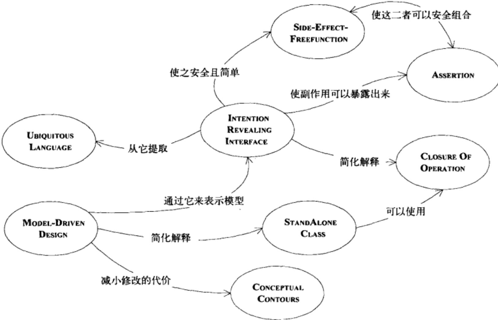


245 

图10-1 一些有助于获得柔性设计的模式 

但是，客户开发人员要想有效地使用对象，必须知道对象的一些信息，如果接口没有告诉开发人员这些信息，那么他就必须深入研究对象的内部机制，以便理解细节。阅读客户代码的人也需要做同样的事情。这样就失去了封装的大部分价值。我们需要避免出现“认识过载”的问题。如果客户开发人员必须总是思考组件工作方式的大量细节，那么就无暇理清思路来解决客户设计的复杂性。让一个人同时扮演两种角色（既开发代码，也使用他自己的代码）的时候也是如此，因为他即使不必去了解那些细节，也不可能一次就把所有的因素都考虑全面。 

如果开发人员为了使用一个组件而必须要去研究它的实现，那么就失去了封装的价值。当某个人开发的对象或操作被别人使用时，如果使用这个组件的新的开发者不得不根据其实现来推测其用途，那么他推测出来的可能并不是那个操作或类的主要用途。如果这不是那个组件的用途，虽然代码暂时可以工作，但设计的概念基础已经被误用了，两位开发人员的意图也是背道而驰。 

当我们把概念显式地建模为类或方法时，为了真正从中获取价值，必须为这些程序元素赋予一个能够反映出它们的概念的名字。类和方法的名称为开发人员之间的沟通创造了很好的机会， 

也能够改善系统的抽象。 

246 

Kent Beck曾经提出通过INTENTION-REVEALING SELECTOR（释意命名选择器）来选择方法的名称，使名称表达出其目的[Beck 1997]。设计中的所有公共元素共同构成了接口，每个元素的名称都提供了一次揭示设计意图的机会。类型名称、方法名称和参数名称组合在一起，共同形成了一个INTENTION-REVEALING INTERFACE（释意接口）。 

因此： 

在命名类和操作时要描述它们的效果和目的，而不要表露它们是通过何种方式达到目的的。这样可以使客户开发人员不必去理解内部的细节。这些名称应该与UBIQUITOUS LANGUAGE保持一致，以便团队成员可以迅速推断出它们的意义。在创建一个行为之前先为它编写一个测试，这样可以促使你站在客户开发人员的角度上来思考它。 

所有复杂的机制都应该封装到抽象接口的后面，接口只表明意图，而不表明方式。 

在领域的公共接口中，可以把关系和规则表述出来，但不要说明规则是如何实施的；可以把事件和动作描述出来，但不要描述它们是如何执行的；可以给出方程式，但不要给出解方程式的数学方法。可以提出问题，但不要给出获取答案的方法。 

## 示例 重构：调漆应用程序

一家油漆商店的程序能够为客户显示出标准调漆的结果。下面是一个初始的设计，它有一个简单的领域类。 

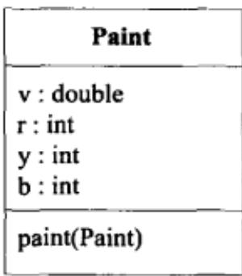


图10-2


paint(Paint)方法的行为根本猜不出，想知道它的唯一方法就是阅读代码。 

247 

```txt
public void paint(Paint paint) {
    v = v + paint.getV(); // After mixing, volume is summed
    // Omitted many lines of complicated color mixing logic
    // ending with the assignment of new r, b, and y values.
} 
```

从代码上看，这个方法是把两种油漆（Paint）混合到一起，结果是油漆的体积增加了，并变为混合颜色。 

为了换个角度来看问题，我们为这个方法编写一个测试（这段代码基于JUnit测试框架）。 

```java
public void testPaint() {
    // Create a pure yellow paint with volume=100
    Paint yellow = new Paint(100.0, 0, 50, 0);
    // Create a pure blue paint with volume=100
    Paint blue = new Paint(100.0, 0, 0, 50);

    // Mix the blue into the yellow
    yellow.paint(blue);

    // Result should be volume of 200.0 of green paint
    assertEquals(200.0, yellow.getV(), 0.01);
    assertEquals(25, yellow.getB());
    assertEquals(25, yellow.getY());
    assertEquals(0, yellow.getR());
} 
```

通过这个测试只是一个起点，这无法令我们满意，因为这段测试代码并没有告诉我们这个方法都做了什么。让我们来重新编写这个测试，看一下如果我们正在编写一个客户应用程序的话，将以何种方式来使用Paint对象。最初，这个测试会失败。实际上，它甚至不能编译。我们编写它的目的是从客户开发人员的角度来研究一下Paint对象的接口设计。 

248 

```java
public void testPaint() {
    // Start with a pure yellow paint with volume=100
    Paint ourPaint = new Paint(100.0, 0, 50, 0);
    // Take a pure blue paint with volume=100
    Paint blue = new Paint(100.0, 0, 0, 50);

    // Mix the blue into the yellow
    ourPaint.mixIn(blue);

    // Result should be volume of 200.0 of green paint
    assertEquals(200.0, ourPaint.getVolume(), 0.01);
    assertEquals(25, ourPaint.getBlue());
    assertEquals(25, ourPaint.yellow());
    assertEquals(0, ourPaint.getRed());
} 
```

花时间编写这样的测试是非常必要的,因为它可以反映出我们希望以哪种方式与这些对象进行交互。在这之后,我们重构Paint类,使它通过测试。如图10-3所示。 

新的方法名称可能不会告诉读者有关混合另一种油漆（Paint）的效果的所有信息（要达到这个目的需要使用断言，接下来我们就会讨论它）。但这个名称为读者提供了足够多的线索，使读者可以开始使用这个类，特别是从测试提供的示例开始。而且它还使客户代码的阅读者能够理解客户的意图。在本章接下来的几个示例中，我们将再次重构这个类，使它更清晰。 

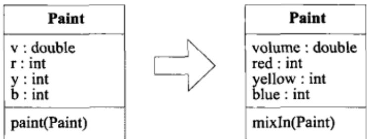


图 10-3


## * * *

整个子领域可以被划分到独立的模块中，并用一个接口把它们封装起来（这个接口表达了其用途）。这种方法可以使我们把注意力集中在项目上，并控制大型系统的复杂性，这些内容将在第15章中的COHESIVE MECHANISM和GENERIC SUBDOMAIN部分进行更多的讨论。 

在接下来的两个模式中，我们将介绍如何令一个方法的执行结果变得易于预测。复杂的逻辑可以在SIDE-EFFECT-FREE FUNCTION中安全地执行，而改变系统状态的方法可以用ASSERTION来刻画。 

## 10.2 模式：SIDE-EFFECT-FREE FUNCTION

我们可以宽泛地把操作分为两个大的类别：命令和查询。查询是从系统获取信息，查询的方式可能只是简单地访问变量中的数据，也可能是用这些数据执行计算。命令（也称为修改器）是修改系统的操作（举一个简单的例子，设置变量）。在标准英语中，“副作用”这个词暗示着“意外的结果”，但在计算机科学中，任何对系统状态产生的影响都叫副作用。这里为了便于讨论，我们把它的含义缩小一下，任何对未来操作产生影响的系统状态的改变都可以称为副作用。 

为什么人们会采用“副作用”这个词来形容那些显然是有意影响系统状态的操作呢？我推测这大概是来自于复杂系统的经验。大多数操作都会调用其他的操作，而后者又会调用另外一些操作。一旦形成这种任意深度的嵌套，就很难预测调用一个操作将要产生的所有后果。第二层和第三层操作的影响可能并不是客户开发人员有意而为之的，于是它们就变成了完全意义上的副作用。在一个复杂的设计中，元素之间的交互同样也会产生无法预料的结果。副作用这个词强调了这种交互的不可避免性。 

多个规则或计算组合的相互作用所产生的结果是很难预测的。开发人员在调用一个操作时，为了预测操作的结果，必须理解它的实现以及所有派生操作的实现。如果开发人员不得不“揭开接口的面纱”，那么接口的抽象的作用就受到了限制。如果没有了可以安全地预见到结果的抽象，开发人员就必须限制“组合爆炸” $^{①}$ ，这就限制了系统行为的丰富性。 

返回结果而不产生副作用的操作称为函数。一个函数可以被多次调用，每次调用都返回相同的值。一个函数可以调用其他函数，而不必担心这种嵌套的深度。函数比那些有副作用的操作更易于测试。由于这些原因，使用函数可以降低风险。 

显然，在大多数软件系统中，命令的使用都是不可避免的，但有两种方法可以减少命令产生的问题。首先，可以把命令和查询严格地放在不同的操作中。确保导致状态改变的方法不返回领域数据，并尽可能保持简单。在不引起任何可观测到的副作用的方法中执行所有查询和计算([Meyer 1988])。 

第二，总是有一些替代的模型和设计，它们不要求对现有对象做任何修改。相反，它们创建并返回一个VALUE OBJECT，用于表示计算结果。这是一种很常见的技术，在接下来的示例中我们就会演示它的使用。VALUE OBJECT可以在响应一次查询中被创建和传递，然后被丢弃——不像ENTITY，实体的生命周期是受到严格管理的。 

VALUE OBJECT是不可变的，这意味着除了在创建期间调用的初始化程序之外，它们的所有操作都是函数。像函数一样，VALUE OBJECT使用起来很安全，测试也很简单。如果一个操作把逻辑或计算与状态改变混合在一起，那么我们就应该把这个操作重构为两个独立的操作([Fowler 1999, p. 279])。但从定义上来看，这种把副作用隔离到简单的命令方法中的做法仅适用于ENTITY。在完成了修改和查询的分离之后，可以考虑再进行一次重构，把复杂计算的职责转移到VALUE OBJECT中。通过派生出一个VALUE OBJECT（而不是改变现有状态），或者通过把职责完全转移到一个VALUE OBJECT中，往往可以完全消除副作用。 

因此： 

尽可能把程序的逻辑放到函数中，因为函数是只返回结果而不产生明显副作用的操作。严格地把命令（引起明显的状态改变的方法）隔离到不返回领域信息的、非常简单的操作中。当发现了一个非常适合承担复杂逻辑职责的概念时，就可以把这个复杂逻辑移到VALUE OBJECT中，这样可以进一步控制副作用。 

SIDE-EFFECT-FREE FUNCTION，特别是不变的VALUE OBJECT，允许我们安全地对多个操作进行组合。当通过一个INTENTION-REVEALING INTERFACE把一个FUNCTION呈现出来的时候，开发人员就可以在无需理解其实现细节的情况下使用它。 

## 示例 再次重构调漆应用程序

一家油漆商店的程序能够为客户显示出标准调漆的结果。我们继续前面的例子，下面是重构后得到的那个类： 

```java
public void mixIn(Paint other) {
    volume = volume.plus(other.getVolume());
    // Many lines of complicated color-mixing logic 
```

// ending with the assignment of new red, blue,
// and yellow values. 

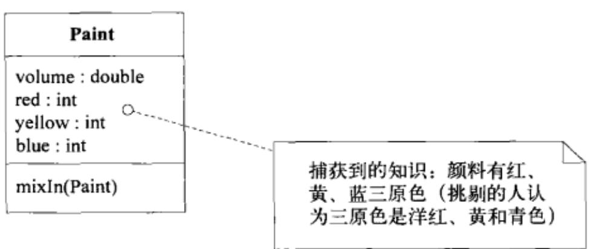


图10-4


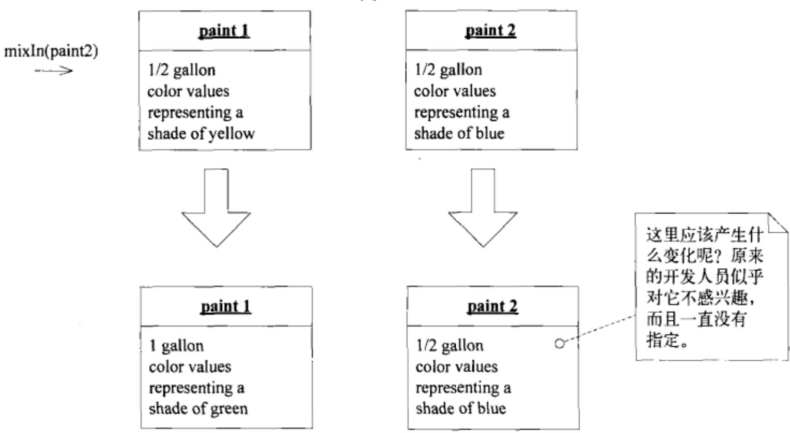


图10-5 mixIn()方法的副作用


mixIn()方法中发生了很多事情，但这个设计确实遵循了“修改和查询分离”这条原则。有一点需要注意（下面会具体讨论），这里并没有对paint2对象的体积（它是mixIn()方法的一个参数）做过多的考虑。操作不改变Paint2的体积，在这个概念模型的上下文中，这看起来并不是十分合乎逻辑。就我们所知，这在原来的开发人员看来并不是问题，因为他们对操作之后的paint2对象不感兴趣，但我们很难预测副作用会产生什么后果。在接下来要讨论的ASSERTION中我们很快会回头再讨论这个问题。现在，我们先来看一下颜色。 

在这个领域中，颜色是一个重要的概念。让我们试着把它变成一个显式的对象。它应该叫什么名字呢？首先想到的就是Color（颜色），但我们通过先前的知识消化已经认识到了一个重要的知识，即油漆的调色与我们所熟悉的RGB调色是不同的。名称必须反映出这一点。 

```txt
public class PigmentColor { 
```

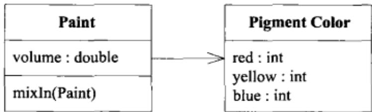


图10-6


把Pigment Color（颜料颜色）分离出来之后，确实比先前表达了更多信息，但计算还是相同的，仍然是在mixIn()方法中进行计算。当把颜色数据移出来后，与这些数据有关的行为也应该一起移出来。但是在做这件事之前，要注意Pigment Color是一个VALUE OBJECT。因此，它应该是不可变的。当我们调漆时，Paint对象本身被改变了，它是一个具有生命周期的实体。相反，表示某个色调（例如黄色）的Pigment Color则一直表示那种颜色。调漆的结果是产生一个新的Pigment Color对象，用于表示新的颜色。 

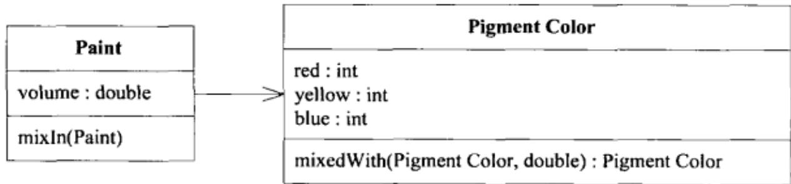


253 


图10-7


```java
public PigmentColor mixewith(PigmentColor other, double ratio) {
    // Many lines of complicated color-mixing logic
    // ending with the creation of a new PigmentColor object
    // with appropriate new red, blue, and yellow values.
}
public class Paint {

    public void mixIn(Paint other) {
    volume = volume + other.getVolume();
    double ratio = other.getVolume() / volume;
    pigmentColor =
    pigmentColor.mixedWith(other.pigmentColor(), ratio);
    }
} 
```

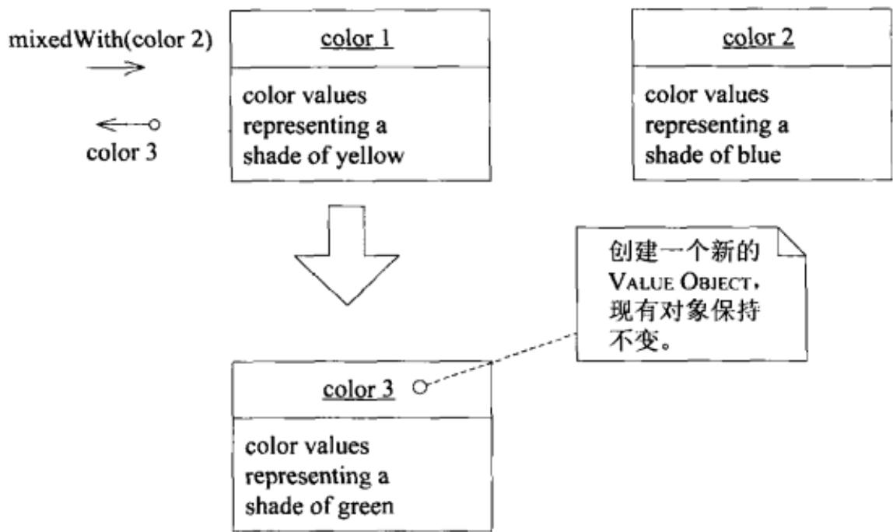


图10-8


现在，Paint中的代码已经尽可能简单了。新的Pigment Color类捕获了知识，并显式地把这些知识表达出来，而且它还提供了一个SIDE-EFFECT-FREE FUNCTION，函数的计算结果很容易理解，也很容易测试，因此可以安全地使用或与其他操作进行组合。由于它的安全性很高，因此复杂的调色逻辑真正被封装起来了。使用这个类的开发人员不必理解其实现。 

254 

## 10.3 模式：ASSERTION

把复杂的计算封装到SIDE-EFFECT-FREE FUNCTION中可以简化问题，但实体仍然会留有一些有副作用的命令，使用这些ENTITY的人必须了解使用这些命令的后果。在这种情况下，使用ASSERTION（断言）可以把副作用明确地表示出来，使它们更易于处理。 

## * * *

确实，一条不包含复杂计算的命令只需查看一下就能够理解。但是，在一个软件设计中，如果较大的部分是由较小部分构成的，那么一个命令可能会调用其他命令。开发人员在使用高层命令时，必须了解每个底层命令所产生的后果，这时封装也就没有什么价值了。而且，由于对象接口并不会限制副作用，因此实现相同接口的两个子类可能会产生不同的副作用。使用它们的开发人员需要知道哪个副作用是由哪个子类产生的，以便预测后果。这样，抽象和多态也就失去了意义。 

如果操作的副作用仅仅是由它们的实现隐式定义的,那么在一个具有大量相互调用关系的系统中,起因和结果会变得一团糟。理解程序的唯一方式就是沿着分支路径来跟踪程序的执行。封装完全失去了价值。跟踪具体的执行也使抽象失去了意义。 

我们需要在不深入研究内部机制的情况下理解设计元素的意义和执行操作的后果。INTENTION-REVEALING INTERFACE可以起到一部分作用，但这样的接口只能非正式地给出操作的用途，这常常是不够的。“契约式设计”（design by contract）向前推进了一步，通过给出类和方法的“断言”使开发人员知道肯定会发生的结果。[Meyer 1988]中详细讨论了这种设计风格。简言之，“后置条件”描述了一个操作的副作用，也就是调用一个方法之后必然会发生的结果。“前置条件”就像是合同条款，即为了满足后置条件而必须要满足的前置条件。类的固定规则规定了在操作结束时对象的状态。也可以把AGGREGATE作为一个整体来为它声明固定规则，这些都是严格定义的完整性规则。 

所有这些断言都描述了状态，而不是过程，因此它们更易于分析。类的固定规则在描述类的意义方面起到帮助作用，并且使客户开发人员能够更准确地预测对象的行为，从而简化他们的工作。如果你确信后置条件的保证，那么就不必考虑方法是如何工作的。断言应该已经把调用其他操作的效果考虑在内了。 

因此： 

把操作的后置条件和类及AGGREGATE的固定规则表述清楚。如果在你的编程语言中不能直接编写ASSERTION，那么就把它们编写成自动的单元测试。还可以把它们写到文档或图中（如果符合项目开发风格的话）。 

寻找在概念上内聚的模型，以便使开发人员更容易推出预期的ASSERTION，从而加快学习过程并避免代码矛盾。 

尽管很多面向对象的语言目前都不支持直接使用ASSERTION, 但ASSERTION仍然不失为一种功能强大的设计方法。自动单元测试在一定程度上弥补了缺乏语言支持带来的不足。由于ASSERTION只声明状态，而不声明过程，因此很容易编写测试。测试首先设置前置条件，在执行之后，再检查后置条件是否被满足。 

把固定规则、前置条件和后置条件清楚地表述出来，这样开发人员就能够理解使用一个操作或对象的后果。从理论上讲，如果一组断言之间互不矛盾，那么就可以使用。但人的大脑并不会一丝不苟地把这些断言编译到一起。人们会推断和补充模型的概念，因此找到一个既易于理解又满足应用程序需求的模型是至关重要的。 

## 示例 回到调漆应用程序

在前面的示例中，我们曾注意到：在Paint类中mixIn(Paint)操作的参数到底会发生什么变化，这还存在着一些不明之处。 

接受者（即被混合的油漆）的体积增加了的体积就是参数的体积。根据我们对油漆的一般理解，这个混合过程应该使另一种油漆减少同样的体积，把它的体积减为零或完全删除。目前的实 