现并没有修改这个参数，而修改参数无疑是有产生副作用的风险的。 

256 

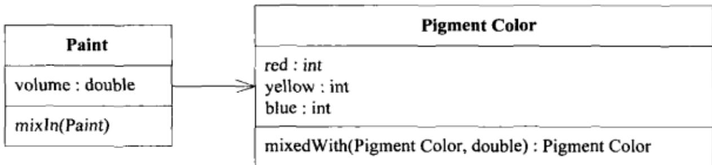


图10-9


第一步，我们先把mixIn()方法的后置条件声明如下： 

```txt
在p1.mixIn(p2)之后：
p1.volume增加p2.volume的量
p2.volume不变 
```

问题在于开发人员将会犯错，因为这些属性与实际概念不符。简单的修改方法是让另一种油漆的体积变为零。虽然修改参数不是一种好的行为，但这里的修改简单而直观。我们可以声明一个固定规则： 

混合之后油漆的总体积保持不变。 

但先等一下！当开发人员考虑这种选择时，他们有了一个新发现。最初的设计人员这样设计原来是有充分理由的。程序在最后会报告被混合之前的油漆清单。毕竟，这个程序的最终目的是帮助用户弄清楚把哪几种油漆混合到一起。 

因此，如果要使体积模型的逻辑保持一致，那么它就无法满足这个应用程序的需求了。这看上去是一种进退两难的境况。我们是否仍使用这个不合常理的后置条件，并为了弥补这个不足而清楚地说明这样做的理由呢？世界上并不是一切事物都是直观的，有时直观是最好的答案。但在这个例子中，这种尴尬局面似乎是由于丢失概念而造成的。让我们去寻找一个新的模型。 

257 

## 寻找更清晰的模型

我们在寻找更好的模型的时候，会比原来的设计人员更有优势，因为我们在研究的过程中消化了更多知识，而且通过重构得到了更深层的理解。例如，我们用一个VALUE OBJECT上的SIDE-EFFECT-FREE FUNCTION来计算颜色。这意味着可以在任何需要的时候重复进行这个计算。我们应该利用这种优势。 

我们似乎为Paint分配了两种不同的基本职责。让我们试着把它们分开。 

现在只有一个命令，即mixIn()。从对模型的直观理解可以看出，它只是把一个对象加入到一个集合中。所有其他操作都是SIDE-EFFECT-FREE FUNCTION。 

下面的测试方法(使用了JUnit测试框架)用来确认图10-10中列出的一个ASSERTION是否满足： 

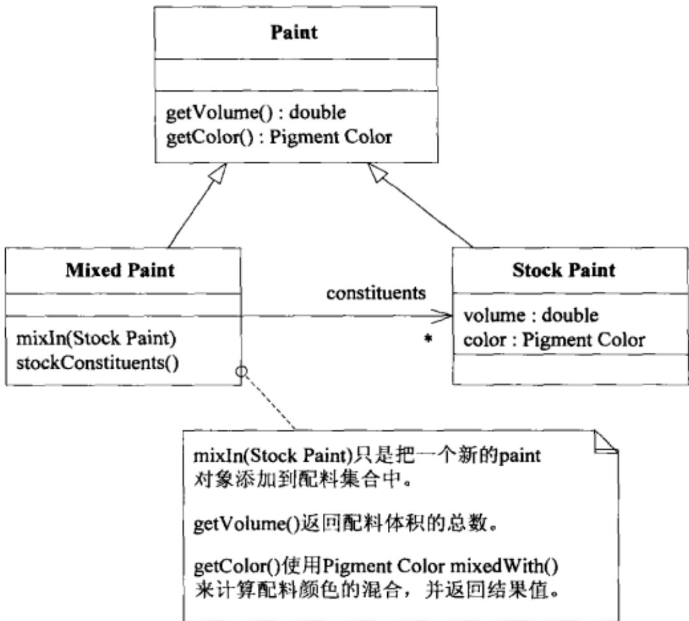


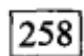


图10-10


```java
public void testMixingVolume {
    PigmentColor yellow = new PigmentColor(0, 50, 0);
    PigmentColor blue = new PigmentColor(0, 0, 50);

    StockPaint paint1 = new StockPaint(1.0, yellow);
    StockPaint paint2 = new StockPaint(1.5, blue);
    MixedPaint mix = new MixedPaint();

    mix.mixIn(paint1);
    mix.mixIn(paint2);
    assertEquals(2.5, mix.getVolume(), 0.01);
} 
```

这个模型捕捉并传递了更多领域知识。固定规则和后置条件符合常识，这使得它们更易于维护和使用。 

* * * 

INTENTION-REVEALING INTERFACE清楚地表明了用途，SIDE-EFFECT-FREE FUNCTION和ASSERTION使我们能够更准确地预测结果，因此封装和抽象更加安全。 

259 

可重组元素的下一个因素是有效的分解…… 

## 10.4 模式：CONCEPTUAL CONTOUR

有时，人们会对功能进行更细的分解，以便灵活地组合它们，有时却要把功能组合成大块，以便封装复杂性。有时，人们为了使所有类和操作都具有相似的规模而寻找一种一致的粒度。这些方法都过于简单了，并不能作为通用的规则。但使用这些方法的动机都来自于一系列基本的问题。 

如果把模型或设计的所有元素都放在一个整体的大结构中，那么它们的功能就会发生重复。外部接口无法全部给出客户可能关心的信息。由于不同的概念被混合在一起，它们的意义变得很难理解。 

而另一方面，把类和方法分解开也是毫无意义的，这会使客户更复杂，迫使客户对象去理解各个小部分是如何组合在一起的。更糟的是，有的概念可能会完全丢失。铀原子的一半并不是铀。而且，粒度的大小并不是唯一要考虑的问题，我们还要考虑粒度是在哪种场合下使用的。 

菜谱式的规则是没有用的。但大部分领域都深深隐含着某种逻辑一致性，否则它们就形不成领域了。这并不是说领域就是绝对一致的，而且人们讨论领域的方式肯定也不一样。但是领域中一定存在着某种十分复杂的原理，否则建模也就失去了意义。由于这种隐藏在底层的一致性，当我们找到一个模型，它与领域的某个部分特别吻合时，这个模型很可能也会与我们后续发现的这个领域的其他部分一致。有时，新的发现可能与模型不符，在这种情况下，就需要对模型进行重构，以便获取更深层的理解，并希望下一次新发现能与模型一致。 

通过反复重构最终会实现柔性设计，以上就是其中的一个原因。随着代码不断适合新理解的概念或需求，CONCEPTUAL CONTOUR（概念轮廓）也就逐渐形成了。 

（从单个方法的设计，到类和MODULE的设计，再到大比例结构的设计（参见第16章），高内聚低耦合这一对基本原则都起着重要的作用。这两条原则既适用于代码，也适用于概念。为了避免机械化地遵循它，我们必须经常根据我们对领域的直观认识来考虑它的基本问题，并以此来调整技术思路。在做每个决定时，都要问自己：“这是根据当前模型和代码中的一组特定关系做出的权宜之计呢，还是反映了底层领域的某种轮廓？”） 

260 

寻找在概念上有意义的功能单元，这样可以使得设计既灵活又易懂。例如，如果领域中对两个对象的“相加”（addition）是一个连贯的整体操作，那么就可以把它作为整体来实现。不要把add()拆分成两个步骤。不要在同一个操作中进行到下一个步骤。从稍大的范围来看，每个对象都应该是一个独立的、完整的概念，也就是一个“WHOLE VALUE”（整体值） $^{①}$ 。 

出于同样的原因，在任何领域中，都有一些细节是用户不感兴趣的。前面假想的那个调漆应用程序的用户不会添加红色颜料或蓝色颜料，他们只是把已经做好的油漆拿来调，而油漆包含所有三种颜料。把那些没必要分解或重组的元素作为一个整体，这样可以避免混乱，并且使人们更 容易看到那些真正需要重组的元素。如果用户的物理设备允许加入颜料，那么领域就改变了，而且我们可能需要分别对每种颜料进行控制。专门研究油漆的化学家将需要更精细的控制，这就需要进行完全不同的分析了，有可能会产生一个比我们的调漆应用程序中的颜料颜色更精细的油漆构成模型。但是这些与我们的调漆应用程序项目中的任何人都无关。 

因此： 

把设计元素（操作、接口、类和AGGREGATE）分解为内聚的单元，在这个过程中，你对领域中一切重要划分的直观认识也要考虑在内。在连续的重构过程中观察发生变化和保证稳定的规律性，并寻找能够解释这些变化模式的底层CONCEPTUAL CONTOUR。使模型与领域中那些一致的方面（正是这些方面使得领域成为一个有用的知识体系）相匹配。 

我们的目标是得到一组可以在逻辑上组合起来的简单接口，使我们可以用UBIQUITOUS LANGUAGE把它们表述出来，并且使那些无关的选项不会分散我们的注意力，也不增加维护负担。但这通常是通过重构才能得到的结果，很难在前期就实现。而且如果仅仅是从技术角度进行重构，可能永远也不会出现这种结果；只有通过重构得到更深层的理解，才能实现这样的目标。 

设计即使是按照CONCEPTUAL CONTOUR进行，也仍然需要修改和重构。当连续的重构往往只是做出一些局部修改（而不是对模型的概念产生大范围的影响）时，这就是模型已经与领域相吻合的信号。如果遇到了一个需求，它要求我们必须大幅度地修改对象和方法的划分，那么这就是在向我们传递这样一条信息：我们对领域的理解还需要精化。它提供了一个深化模型并且使设计变得更加具有柔性的机会。 

## 示例 应计项目的CONCEPTUAL CONTOUR

在第9章中,基于对会计概念的更深层理解,我们对一个货款跟踪系统进行了重构。如图10-11所示。 

新模型比原来的模型只多出一个对象，但职责的划分却发生了很大的变化。 

Schedule原来是在Calculator类中通过逻辑判断计算的，现在被分散到不同的类中，用于不同类型的手续费和利息计算。另一方面，手续费和利息的支付原来是分开的，现在也被合并到一起了。 

由于新发现的显式概念与领域非常吻合，而且Accrual Schedule的层次结构具有内聚性，因此开发人员认为这个模型更符合领域的CONCEPTUAL CONTOUR，如图10-12所示。 

新的Accrual Schedule的加入是开发人员早就预料到的，因为有一些需求早已等待它来处理了。这样，她选择的模型除了使现有功能更清晰、简单之外，还很容易引入新的Schedule。但是，她是否找到了一个CONCEPTUAL CONTOUR，使得领域设计可以随着应用程序和业务的演变而改变和发展呢？我们无法确定一个设计如何处理意料之外的改变，但她认为她的设计中一些不合适的地方已经有所改进了。 

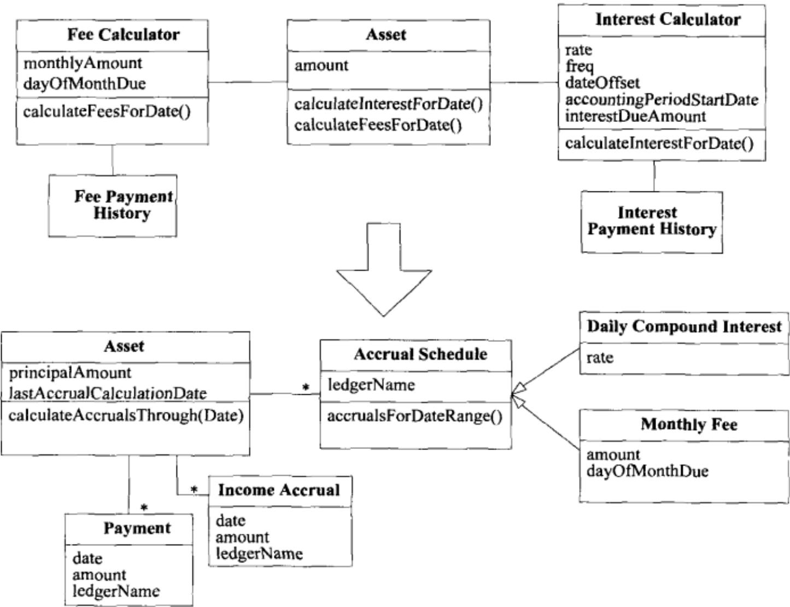


图10-11


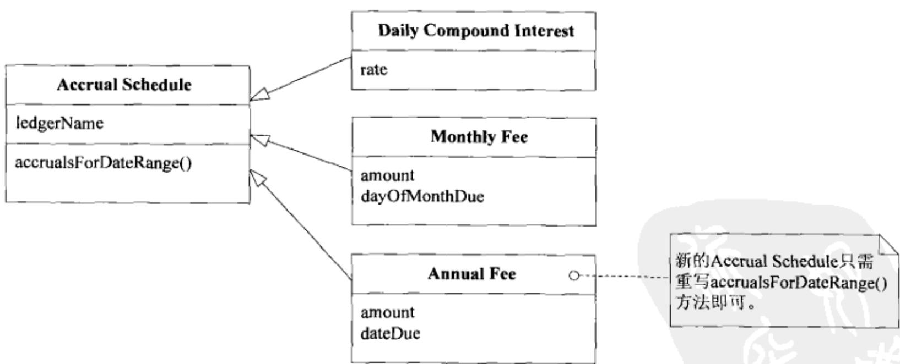


图10-12 这个模型把新的Accrual Schedule添加进来了


## 一个未预料到的改变

随着项目向前进展,又出现了一个新的需求——需要制定一些详细的规则来处理提早付款和 

262 延迟付款。这位开发人员在研究问题的时候，很高兴地发现利息付款和手续费付款实际上使用相同的规则。这意味着新的模型元素可以很自然地使用Payment类。 

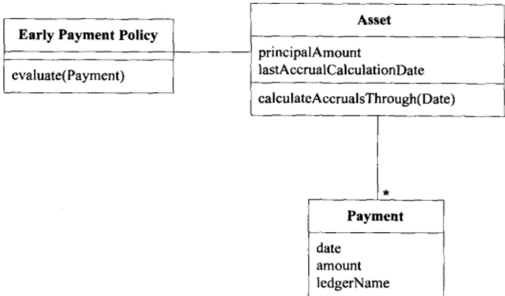


图10-13


原有的设计导致两个Payment History类之间必然出现重复（这个难题可能使得开发人员认识到Payment类应该被共享，这样就会从另外一条途径得到类似的模型）。新元素之所以很容易就添加进来了，并不是因为她预料到了这个改变，也不是因为她的设计灵活到了足以容纳任何可能修改的程度。真正的原因是经过前面的重构，设计能够很好地与领域的基本概念产生吻合了。 

## * * *

INTENTION-REVEALING INTERFACE使客户能够把对象表示为有意义的单元，而不仅仅是一些机制。SIDE-EFFECT-FREE FUNCTION和ASSERTION使我们可以安全地使用这些单元，并对它们进行复杂的组合。CONCEPTUAL CONTOUR的出现使模型的各个部分变得更稳定，也使得这些单元更直观，更易于使用和组合。 

然而，我们仍然会遇到“概念过载”（conceptual overload）的问题——当模型中的互相依赖性过多时，我们就必须把大量问题放在一起考虑。 

## 10.5 模式：STANDALONE CLASS

互相依赖性使模型和设计变得难以理解、测试和维护。而且，互相依赖性很容易越积越多。 

当然，每个关联都是一种依赖性，要想理解一个类，必须理解它与哪些对象有联系。与这个类有联系的其他对象还会与更多的对象发生联系，而这些联系也是必须要弄清楚的。每个方法的每个参数的类型也是一个依赖性，每个返回值也都是一个依赖性。 

如果有一个依赖关系，我们必须同时考虑两个类以及它们之间的关系的本质。如果某个类依 赖另外两个类，我们就必须考虑这三个类当中的每一个、这个类与其他两个类之间的相互关系的本质，以及这三个类可能存在的其他相互关系。如果它们之间依次存在依赖关系，那么我们还必须考虑这些关系。如果一个类有三个依赖关系……问题就会像滚雪球一样越来越多。 

MODULE和AGGREGATE的目的都是为了限制互相依赖的关系网。当我们识别出一个高度内聚的子领域并把它提取到一个MODULE中的时候，一组对象也随之与系统的其他部分解除了联系，这样就把互相联系的概念的数量控制在一个有限的范围之内。但是，即使把系统分成了各个MODULE，如果不严格控制MODULE内部的依赖性的话，那么MODULE也一样会让我们耗费很多精力去考虑依赖关系。 

即使是在MODULE内部，设计也会随着依赖关系的增加而变得越来越难以理解。这加重了我们的思考负担，从而限制了开发人员能处理的设计复杂度。隐式概念比显式的引用增加的负担更大。 

我们可以将模型一直精炼下去，直到每个剩下的概念关系都表示出概念的基本含义为止。在一个重要的子集中，依赖关系的个数可以减小到零，这样就得到一个完全孤立的类，它只有很少的几个基本类型和基础库概念。 

在每种编程环境中，都有一些非常基本的概念，它们经常用到，以至于已经根植于我们的大脑中。例如，在Java开发环境中，基本类型和一些标准类库提供了数字、字符串和集合等基本概念。从实际来讲，“整数”这个概念是不会增加思考负担的。除此之外，为了理解一个对象而必须保留在大脑中的每个其他概念都会增加思考负担。 

隐式概念，无论是否已被识别出来，都与显式引用一样会加重思考负担。虽然我们通常可以忽略像整数和字符串这样的基本类型值，但无法忽略它们所表示的意义。例如，在第一个调漆应用程序的例子中，Paint对象包含三个公共的整数，分别表示红、黄、蓝三种颜色值。Pigment Color对象的创建并没有增加所涉及的概念数量，也没有增加依赖关系。但它确实使现有概念更明显、更易于理解了。另一方面，Collection的size()操作返回一个整数（只是一个简单的合计数），它只表示整数的基本含义，因此并不产生隐式的新概念。 

我们应该对每个依赖关系提出质疑，直到证实它确实表示对象的基本概念为止。这个仔细检查依赖关系的过程从提取模型概念本身开始。然后需要注意每个独立的关联和操作。仔细选择模型和设计能够大幅减少依赖关系——常常能减少到零。 

低耦合是对象设计的一个基本要素。尽一切可能保持低耦合。把其他所有无关概念提取到对象之外。这样类就变成完全孤立的了，这就使得我们可以单独地研究和理解它。每个这样的孤立类都极大地减轻了因理解MODULE而带来的负担。 

当一个类与它所在的模块中的其他类存在依赖关系时，比它与模块外部的类有依赖关系要好得多。同样，当两个对象具有自然的紧密耦合关系时，这两个对象共同涉及的多个操作实际上能够把它们的关系本质明确地表示出来。我们的目标不是消除所有依赖，而是消除所有不重要的依赖。当无法消除所有的依赖关系时，每清除一个依赖对开发人员而言都是一种解脱，使他们能够 

集中精力处理剩下的概念依赖关系。 

尽力把最复杂的计算提取到STANDALONE CLASS（孤立的类）中，可能实现此目的的一种方法是把具有紧密联系的类中所含有的VALUE OBJECT建模出来。 

从根本上讲，油漆的概念与颜色的概念紧密相关。但在考虑颜色（甚至是颜料）的时候却与不必去考虑油漆。通过把这两个概念变为显式概念并精炼它们的关系，所得到的单向关联就可以表达出重要的信息，同时我们可以对Pigment Color类（大部分计算复杂性都隐藏在这个类中）进行独立的分析和测试。 

## * * *

低耦合是减少概念过载的最基本办法。孤立的类是低耦合的极致。 

消除依赖性并不是说要武断地把模型中的一切都简化为基本类型, 这样只会削弱模型的表达能力。本章要讨论的最后一个模式CLOSURE OF OPERATION（闭合操作）就是一种在减小依赖性的同时保持丰富接口的技术。 

## 10.6 模式：CLOSURE OF OPERATION

两个实数相乘，结果仍为实数（实数是所有有理数和所有无理数的集合）。由于这一点永远是正确的，因此我们说实数的“乘法运算是闭合的”：乘法运算的结果永远无法脱离实数这个集合。当我们对集合中的任意两个元素组合时，结果仍在这个集合中，这就叫做闭合操作。 

—The Math Forum, Drexel University 

当然，依赖是必然存在的，当依赖性是概念的一个基本属性时，它就不是坏事。如果把接口精简到只处理一些基本类型，那么它也就没有什么表达能力了。但我们也经常为接口引入很多不必要的依赖性，甚至是整个不必要的概念。 

大部分引起我们兴趣的对象所产生的行为仅用基本类型是无法描述的。 

另一种常见的对设计进行精化的方法就是我所说的CLOSURE OF OPERATION（闭合操作）。这个名字来源于最精炼的概念体系，即数学。 $1+1=2$ 。加法运算是实数集中的闭合运算。数学家们都极力避免去引入无关的概念，而闭合运算的性质正好为他们提供了这样一种方式，可用来定义一种不涉及其他任何概念的运算。我们都非常熟悉数学中的精炼，因此很难注意到一些小技巧会有多么强大。但是，这些技巧在软件设计中也广为应用。例如，XSLT的基本用法是把一个XML文档转换为另一个XML文档。这种XSLT操作就是XML文档集合中的闭合操作。闭合的性质极大地简化了对操作的理解，而且闭合操作的链接或组合也很容易理解。 

因此： 

在适当的情况下，在定义操作时让它的返回类型与其参数的类型相同。如果实现者（implementer）的状态在计算中会被用到，那么实现者实际上就是操作的一个参数，因此参数 和返回值应该与实现者有相同的类型。这样的操作就是在该类型的实例集合中的闭合操作。闭合操作提供了一个高层接口，同时又不会引入对其他概念的任何依赖性。 

268 

这种模式更常用于VALUE OBJECT的操作。由于ENTITY的生命周期在领域中十分重要，因此我们不能为了解决某一问题而草率创建一个ENTITY。有一些操作是ENTITY类型之下的闭合操作。我们可以通过查询一个Employee（员工）对象来返回其主管，而返回的将是另一个Employee对象。但是，ENTITY通常不会成为计算结果。因此，大部分闭合操作都应该到VALUE OBJECT中去寻找。 

一个操作可能是在某一抽象类型之下的闭合操作，在这种情况下，具体的参数可能有不同的具体类型。例如，加法是实数之下的闭合运算，而实数既可以是有理数，也可以是无理数。 

在尝试和寻找减少互相依赖性并提高内聚性的过程中，有时我们会遇到“半个闭合操作”这种情况。参数类型与实现者的类型一致，但返回类型不同；或者返回类型与接收者（receiver）的类型相同但参数类型不同。这些操作都不是闭合操作，但它们确实具有CLOSURE OF OPERATION的某些优点。当没有形成闭合操作的那个多出来的类型是基本类型或基础库类时，它几乎与CLOSURE OF OPERATION一样减轻了我们的思考负担。 

在前面的示例中，Pigment Color的mixedWith()操作是Pigment Color之下的闭合操作，本书中还零星地穿插着几个这样的示例。以下示例显示了即使在没有达到真正CLOSURE OF OPERATION的时候这种思想也发挥了强大的作用。 

## 示例 从集合中选择子集

在Java中，如果想从Collection（集合）中选择一个元素子集，需要使用Iterator（迭代器）。用迭代器来测试每个元素，把匹配的元素收集到一个新的Collection中。 

```txt
Set employees = (some Set of Employee objects);
Set lowPaidEmployees = new HashSet();
Iterator it = employees.iterator();
while (it.hasNext()) {
    Employee anEmployee = it.next();
    if (anEmployee.salary() < 40000)
    lowPaidEmployees.add(anEmployee);
} 
```

从概念上讲，上段代码只是从集合中选择了一个子集。是否真的有必要使用Iterator这个额外的概念以及它所带来的所有机制上的复杂性呢？如果是使用Smalltalk，我将在Collection上调用“select”操作，把测试作为一个参数传递给它。返回值将是一个新的Collection，其中只包含通过测试的那些元素。 

```txt
employees := (some Set of Employee objects). 
```

```txt
lowPaidEmployees := employees select:
    [:anEmployee | anEmployee salary < 40000]. 
```

Smalltalk的Collection还提供了其他一些这样的函数，它们返回派生的Collection（可能是几种不同的具体类）。这些操作并不是闭合操作，因为它们把一个block（块）作为参数。但block在Smalltalk中是一个基础库类型，因此它们并不会增加开发人员的思考负担。由于返回值与实现者的类型相匹配，因此它们可以像一系列过滤器一样被串接在一起，使读写代码都变得很容易。它们并没有引入与选择子集无关的外来概念。 

## * * *

本章介绍的模式演示了一个总体的设计风格和一种思考设计的方式。把软件设计得便于、容易预测且富有表达力，可以有效地发挥抽象和封装的作用。我们可以对模型进行分解，使得对象更易于理解和使用，同时仍具有功能丰富的、高级的接口。 

运用这些技术需要掌握相当高级的设计技巧,甚至有时编写客户端代码也需要掌握高级技巧才能运用这些技术。MODEL-DRIVEN DESIGN的作用受细节设计的质量和实现决策的质量影响很大,而且只要有少数几个开发人员没有弄清楚它们,整个项目就会偏离目标。 

尽管如此，团队只要愿意培养这些建模和设计技巧，那么按照这些模式的思考方式就能够开发出可以反复重构的软件，从而最终创建出非常复杂的软件。 

## 10.7 声明式设计

使用ASSERTION可以得到更好的设计，虽然我们只是用一些相对非正式的方式来检查这些ASSERTION。但实际上我们无法保证手写软件的正确性。举个简单例子，只要代码还有其他一些没有被ASSERTION专门排除在外的副作用，断言就失去了作用。无论我们的设计多么遵守MODEL-DRIVEN开发方法，最后仍要通过编写过程代码来实现概念交互的结果。而且我们花费了大量时间来编写样板式的刻板的代码，但是这些代码实际上不增加任何意义或行为。这些代码冗长乏味而且易出错，此外还掩盖了模型的意义（虽然有的编程语言会相对好一些，但都需要我们做大量繁琐的工作）。本章介绍的INTENTION-REVEALING INTERFACE和其他模式虽然有一定的帮助作用，但它们永远也不会使传统的面向对象技术达到非常严密的程度。 

以上这些正是采用声明式设计的部分动机。声明式设计对于不同的人来说具有不同的意义，但通常是指一种编程方式——把程序或程序的一部分写成一种可执行的规格（specification）。使用声明式设计时，软件实际上是由一些非常精确的属性描述来控制的。声明式设计有多种实现方式，例如，可以通过反射机制来实现，或在编译时通过代码生成来实现（根据声明来自动生成传统代码）。这种方法使其他开发人员能够根据字面意义来使用声明。它是一种绝对的保证。 

从模型属性的声明来生成可运行的程序是MODEL-DRIVEN DESIGN的理想目标，但在实践中这种方法也有自己的缺陷。例如，下面就是我多次遇到的两个特殊的问题： 

□声明式语言并不足以表达一切所需的东西，它把软件束缚在一个由自动部分构成的框架之内，使软件很难扩展到这个框架之外。 

☐ 代码生成技术破坏了迭代循环，它把生成的代码合并到手写的代码中，使得重新生成的破坏作用变得很大。 

许多声明式设计的尝试带来了意想不到的后果，由于开发人员受到框架局限性的约束，为了交付工作只能先处理重要问题，而搁置其他一些问题，这导致模型和应用程序的质量严重下降。 

基于规则的编程（带有推理引擎和规则库）是另一种有望实现的声明式设计方法。但遗憾的是，一些微妙的问题会影响它的实现。 

尽管基于规则的程序原则上是声明式的,但大多数系统都有一些用于性能优化的“控制谓词”(control predicate)。这种控制代码引入了副作用,这样行为就不再完全由声明式规则来控制了。添加、删除规则或重新排序可能导致预料不到的错误结果。因此,编写逻辑的程序员必须确保代码的效果是显而易见的,就像对象程序员所做的那样。 

很多声明式方法被开发人员有意或无意忽略之后会遭到破坏。当系统很难使用或限制过多时，就会发生这种情况。为了获得声明式程序的利益，每个人都必须遵守框架的规则。 

据我所知，声明式设计的最大价值是用一个范围非常窄的框架来自动处理设计中某个特别单调且易出错的方面，例如持久化和对象关系映射。最好的声明式设计能够使开发人员不必去做那些单调乏味的工作，同时又完全不限制他们的设计自由。 

## 特定于领域的语言

特定于领域的语言是一种有趣的方法，它有时也是一种声明式语言。采用这种编码风格时，客户代码是用一种专门为特殊领域的特殊模型定制的语言而编写的。例如，运输系统的语言可能包括cargo（货物）和route（路线）这样的术语，以及一些用于组合这些术语的语法。然后，程序通常会被编译成一种传统的面向对象的语言，由一个类库为这些术语提供实现。 

在这样的语言中，程序可以具有极强的表达能力，并且与UBIQUITOUS LANGUAGE之间形成最紧密的结合。特定于领域的语言是一个令人振奋的概念，但在我所见过的基于面向对象技术的方法中，这种语言也存在自身的缺陷。 

为了精化模型，开发人员需要修改语言。这可能涉及修改语法声明和其他语言解释功能，以及修改底层的类库。虽然我完全赞同“高级技术和设计概念是学来的”这个观点，但我们必须冷静地评估特定团队当前的技术水平，以及将来的维护团队可能的技术水平。此外，用同一种语言实现的应用程序和模型之间是“无缝”的，这一点很有价值。另一个缺点是当模型被修改时，很难对客户代码进行重构，使之与修改之后的模型及与其相关的特定于领域的语言保持一致。当然，有人认为可以通过技术修复来解决重构问题。 

## 一种完全不同的语言

有一种不同的范式——Scheme编程语言，能够比对象更好地实现特定于领域的语言。在Scheme编程语言中（它是“函数式编程”家族的一个代表），有些部分非常类似于标准的编程风格，因此既具有特定于领域的语言的表达能力，又不会造成系统的分裂。 

这种技术可能在非常成熟的模型中能够发挥出最大的作用，在这样的模型中，客户代码可能是由另一个不同的团队编写的。通常，这样的设置会导致产生一种有害的结果——团队被分成两部分，框架由那些技术水平较高的人来构建，而应用程序则由那些技术水平较差的人来构建了，但也并不是非得如此。 

## 10.8 声明式设计风格

一旦你的设计中有了INTENTION-REVEALING INTERFACE、SIDE-EFFECT-FREE FUNCTION和ASSERTION，那么你就具备了使用声明式设计的条件。当我们有了可以组合在一起来表达意义的元素，并且刻画了效果（或根本没有明显效果）之后，就可以获得声明式设计的很多益处了。 

柔性设计使得客户代码可以使用声明式的设计风格。为了说明这一点，下一节将会把本章介绍的一些模式结合起来使用，从而使SPECIFICATION更灵活，更符合声明式设计的风格。 

## 用声明式的风格来扩展 SPECIFICATION

第9章介绍了SPECIFICATION的基本概念、它在程序中扮演的角色，以及它在实现中的意义。273 现在，让我们来看看几个额外的、有吸引力的技巧，它们在规则很复杂的情况下可能非常有用。 

SPECIFICATION是由“谓词”（predicate）这个众所周知的形式化概念变来的。谓词还有其他一些有用的特性，我们可以对这些特性进行有选择的利用。 

## 使用逻辑运算对SPECIFICATION进行组合

当使用SPECIFICATION时，我们很容易就会遇到需要把它们组合起来使用的情况。正如我们刚刚提到的那样，SPECIFICATION是谓词的一个例子，而谓词可以用“AND”、“OR”和“NOT”等运算进行组合和修改。这些逻辑运算都是谓词这个类别之下的闭合操作，因此SPECIFICATION组合也是CLOSURE OF OPERATION。 

随着SPECIFICATION的通用性逐渐提高，创建一个可用于各种类型的SPECIFICATION的抽象类或接口会变得很有用。这需要把参数类型定义为某种高级的抽象类。 

```txt
public interface Specification {
    boolean isSatisfiedBy(Object candidate);
} 
```

这个抽象要求在方法的开始处放置一条卫语句（guard clause），但是没有卫语句也不影响它的功能。例如，可以对Container Specification（参见图9-16以及后面的相关表格、代码等）做如 

## 下修改：

```java
public class ContainerSpecification implements Specification {
private ContainerFeature requiredFeature; 
```

```java
public ContainerSpecification(ContainerFeature required) {
    requiredFeature = required;
} 
```

```txt
boolean isSatisfiedBy(Object candidate) {
    if (!candidate instanceof Container) return false; 
```

```lua
return
(Container)candidate.getFeatures().contains(requiredFeature);
} 
```

现在，让我们扩展Specification接口，加入3个新操作： 

```java
public interface Specification {
    boolean isSatisfiedBy(Object candidate); 
```

```txt
Specification and(Specification other);
Specification or(Specification other);
Specification not(); 
```

回忆一下，有些Container Specification需要通风性的Container（容器），而有些则需要有防爆性。如果一种化学药品既易挥发又易爆炸，那么它可能同时需要这两种规格。如果使用新的方法，这就很容易实现。 

```txt
Specification ventilated = new ContainerSpecification(VENTILATED);
Specification armored = new ContainerSpecification(ARMORED); 
```

```txt
Specification both = ventilated.and(armored); 
```

这段声明定义了一个具有期望属性的新的Specification对象。这种组合将需要一个用于某种特殊目的的、更复杂的Container Specification。 

假设我们有多种通风容器。对于有些物品来说，把它们放进哪种容器中都没问题。它们可以放在任何一种通风容器中。 

```matlab
Specification ventilatedType1 =
    new ContainerSpecification(VENTILATED_TYPE_1);
Specification ventilatedType2 =
    new ContainerSpecification(VENTILATED_TYPE_2); 
```

```txt
Specification either = ventilatedType1.or(ventilatedType2); 
```

如果我们认为把砂存放在特殊容器中是一种浪费，那么可以通过指定一种没有特殊性质的“便宜的”容器来禁止把砂存放在特殊容器中。 

```javascript
Specification cheap = (ventilated.not()).and(armored.not()); 
```

这个约束将阻止第9章中所讨论的仓库打包程序原型的某些不优化的行为。 

从简单元素构建复杂规格的能力提高了代码的表达能力。以上组合是以声明式的风格编写的。 

由于SPECIFICATION实现的方法存在不同，提供这些运算符的难易程度也不同。下面是一个非常简单的实现，在有些情况下它的效率很差，而有些情况下则很实用。举这个例子只是为了起到说明的作用。像任何模式一样，它也有很多实现方式。 

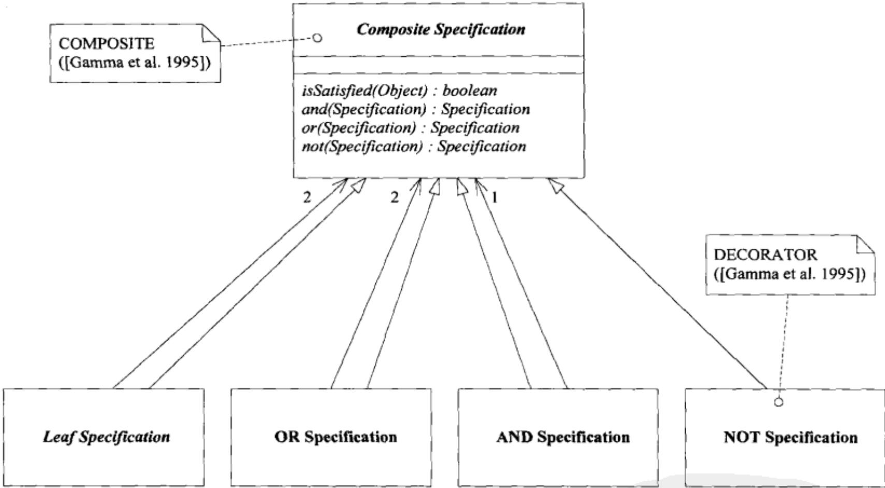


图10-14 SPECIFICATION的COMPOSITE（组合）设计


```java
public abstract class AbstractSpecification implements Specification {
    public Specification and(Specification other) {
    return new AndSpecification(this, other);
    }
    public Specification or(Specification other) {
    return new OrSpecification(this, other);
    }
    public Specification not() {
    return new NotSpecification(this); 
```

```java
public class AndSpecification extends AbstractSpecification {
    Specification one;
    Specification other;

    public AndSpecification(Specification x, Specification y) {
    one = x;
    other = y;
    }
    public boolean isSatisfiedBy(Object candidate) {
    return one.isSatisfiedBy(candidate) &&
    other.isSatisfiedBy(candidate);
    }
}

public class OrSpecification extends AbstractSpecification {
    Specification one;
    Specification other;
    public OrSpecification(Specification x, Specification y) {
    one = x;
    other = y;
    }
    public boolean isSatisfiedBy(Object candidate) {
    return one.isSatisfiedBy(candidate) ||
    other.isSatisfiedBy(candidate);
    }
}

public class NotSpecification extends AbstractSpecification {
    Specification wrapped;

    public NotSpecification(Specification x) {
    wrapped = x;
    }
    public boolean isSatisfiedBy(Object candidate) {
    return !wrapped.isSatisfiedBy(candidate);
    }
} 
```

为了便于阅读，上面这段代码写得尽可能简单。如前所述，它在有些情况下是低效的。可能会有一些其他的实现选择，使得对象的数目减至最少，或极大地提高速度，或者与某个项目的特定技术兼容。重要的是模型捕捉到领域的关键概念，同时有一个忠实于该模型的实现。这就为解 

277 决性能问题预留了很大的空间。 

此外，这些完全的通用性在很多情况下并不需要。特别是AND可能比其他运算用得更多，而且它的实现的复杂程度也较小。如果你只需要AND，那么完全可以只实现它，这没有什么可担心的。 

我们回顾一下第2章的示例中的对话，开发人员显然没有实现他们SPECIFICATION中的“satisfied by”行为。在他们进行那段讨论的时候，SPECIFICATION只是“根据需要来构建”（building to order）。尽管如此，抽象仍然完整，而且功能添加起来也相对简单。使用模式并不意味着构建你不需要的特性。它们可以过后再添加，只要不引起概念混淆即可。 

## 示例 COMPOSITE SPECIFICATION的另一种实现

有些实现环境不能使用粒度很小的对象。我曾经遇到过一个项目，它有一个对象数据库，这个数据库为每个对象分配一个ID并跟踪这个ID。每个对象都占有很大的内存空间，并且产生很大的性能开销，因此总的地址空间成为一个限制因素。我在领域设计中的一些重要地方使用了SPECIFICATION，当时我认为这是一个很好的决定。但我使用了一个过于细致的实现（像本章中描述的那样），这无疑是个错误。它产生了数百万个粒度非常小的对象，使整个系统的速度变得非常缓慢。 

下面的例子给出了一种替代实现，它把组合SPECIFICATION编码为一个字符串或者数组（这个数组对逻辑表达式进行了编码），然后在运行时进行解析。 

(即使你没明白它的实现也不要紧,重要的是认识到用逻辑运算符来实现SPECIFICATION的方式有很多。如果最简单的方法不适用于你的情况,可以选择其他的方法。) 


“Cheap Container”的SPECIFICATION栈的内容


<table><tr><td rowspan="5">栈顶</td><td>AndSpecificationOperator (FLY WEIGHT)</td></tr><tr><td>NotSpecificationOperator (FLY WEIGHT)</td></tr><tr><td>Armored</td></tr><tr><td>NotSpecificationOperator</td></tr><tr><td>Ventilated</td></tr></table>

当我们想测试一种候选方案时，必须解释这个结构，这可以通过把每个元索单出来并计算它（或者是根据运算符的需要弹出下一个元素）来实现。最后将得到如下结果： 

and (not (armored), not (ventilated)) 

这种设计有一些优点（+）和缺点（-） 

+对象个数较少 

+ 内存使用效率高 

- 需要更高级的开发人员 

你必须根据自己的实际情况做出权衡，找到一种适合你的实现。基于相同的模式和模型可以创建出完全不同的实现。 

## 包含

最后要讲的这个包含特性并不是经常需要，而且实现起来也很难，但有时它确实能够解决很困难的问题。它还能够表达出一个SPECIFICATION的含义。 

再次考虑一下前面的化学仓库打包程序的例子。每个 Chemical 都有一个 Container Specification，而且 Packer SERVICE 确保当把 Drum 分配到 Container 中时，所有这些 Container Specification 都被满足，一切都没有问题……直到有人改变了规则。 

每隔几个月都会发布一组新的规则，我们的用户希望能够生成一个列表，把那些已经有了更严格要求的化学品列出来。 

279 

当然，通过运行一个验证，用新实施的规格来检查仓库中的每个Drum，并找到所有不再满足新SPECIFICATION的化学品，这样可以把一部分化学品列出来，而且这可能也是用户需要的。这可以告诉用户现在仓库中有哪些Drum是需要转移的。 

但用户要求的是把所有那些存放要求变得更严格的化学品都列出来。或许仓库里目前还没有这样的化学品，或者它们碰巧被装到了一个更严格的容器中。无论是哪种情况，刚才的那个报告都不会列出它们。 

我们引入一个用于直接比较两种SPECIFICATION的新操作。 

boolean subsumes(Specification other); 

更严格的SPECIFICATION包含不太严格的SPECIFICATION。用更严格的SPECIFICATION来取代不严格的SPECIFICATION不会遗漏掉先前的任何需求。如图10-15所示。 

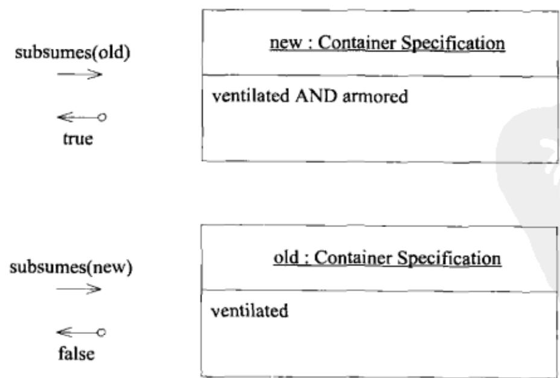


图10-15 汽油容器的SPECIFICATION变严格了


在SPECIFICATION语言中，我们说新的SPECIFICATION包含旧的SPECIFICATION，因为任何满足新SPECIFICATION的对象都将满足旧SPECIFICATION。 

如果把每个SPECIFICATION看成一个谓词，那么包含就等于逻辑蕴涵（logical implication）。使用传统的符号，A→B表示声明A蕴涵声明B，因此，如果A为真，则B也为真。 

让我们把这个逻辑应用于我们的容器匹配需求。当一个SPECIFICATION被修改时，我们想知道新SPECIFICATION是否满足旧SPECIFICATION的所有条件。 

280 

```txt
New Spec → Old Spec 
```

也就是说，如果新规格为真，那么旧规格一定也为真。要证明一般情况下的逻辑蕴涵是很难的，但特殊情况就很容易证明。例如，特殊的参数化的SPECIFICATION可以定义它们自己的包含规则。 

```java
public class MinimumAgeSpecification {
    int threshold;

    public boolean isSatisfiedBy(Person candidate) {
    return candidate.getAge() >= threshold;
    }

    public boolean subsumes(MinimumAgeSpecification other) {
    return threshold >= other.getThreshold();
    }
} 
```

JUnit测试可能包含以下代码： 

```txt
drivingAge = new MinimumAgeSpecification(16);
votingAge = new MinimumAgeSpecification(18);
assertTrue(votingAge.subsumes(drivingAge)); 
```

还有一个有用的特例适用于解决Container Specification问题，它就是用单一的逻辑操作AND把SPECIFICATION接口与包含结合起来。 

```txt
public interface Specification {
    boolean isSatisfiedBy(Object candidate);
    Specification and(Specification other);
    boolean subsumes(Specification other);
} 
```

A AND $B \rightarrow A$ 

或者在更复杂的情况中， 

```txt
A AND B AND C → A AND B 
```

这样, 如果Composite Specification能够把所有由“AND”连接起来的叶子 (leaf) SPECIFICATION 收集到一起, 那么我们要做的事情只是检查包含规格 (subsuming SPECIFICATION) 是否含有被包 含规格的所有叶子（而且它可能还包含更多的叶子）——它的叶子是另一个SPECIFICATION的叶子集合的超集。 

281 

```java
public boolean subsumes(Specification other) {
    if (other instanceof CompositeSpecification) {
    Collection otherLeaves =
    (CompositeSpecification) other.leafSpecifications();
    Iterator it = otherLeaves.iterator();
    while (it.hasNext()) {
    if (!leafSpecifications().contains(it.next()))
    return false;
    }
    } else {
    if (!leafSpecifications().contains(other))
    return false;
    }
    return true;
} 
```

我们还可以增强这种交互，对仔细选择的参数化的叶子SPECIFICATION进行比较或者进行其他一些复杂的比较。遗憾的是，当把OR和NOT也包括进来时，这些证明会变得更复杂。在大多数情况下，最好避免出现这样的复杂性：要么选择放弃一些运算符，要么不使用包含。如果这二者同时需要，那么要慎重考虑这样做的价值是否多过它所带来的麻烦。 


受SPECIFICATION约束的亚里士多德


```txt
所有人都是要死的
Specification manSpec = new ManSpecification();
Specification mortalSpec = new MortalSpecification();
assert manSpec.subsumes(mortalSpec);
亚里士多德是一个人
man aristotle = new Man();
assert manSpec.isSatisfiedBy(aristotle);
因此，亚里士多德会死
assert mortalSpec.isSatisfiedBy(aristotle); 
```

## 10.9 切入问题的角度

本章展示了一系列技术，它们用于澄清代码意图，使得使用代码的后果变得显而易见，并且解除模型元素的耦合。尽管有这些技术，但要想实现这样的设计还是很难的。我们不能只是看着一个庞大的系统说：“让我们把它设计得灵活点吧。”我们必须选择具体的目标。下面介绍几种主要方法，然后给出一个扩展的示例，它显示了如何把这些模型结合起来使用，并用于处理更大的设计。 

## 10.9.1 分割子领域

我们无法一下子就能处理好整个设计，而需要一步一步地进行。我们从系统的某些方面可以 看出适合用哪种方法处理，那么就把它们提取出来加以处理。如果模型的某个部分可以被看作是专门的数学，那么可以把这部分分离出来。如果应用程序实施了某些用来限制状态改变的复杂规则，那么可以把这部分提取到一个单独的模型中，或者提取到一个允许声明规则的简单框架中。随着这些步骤的进行，不仅新模型更整洁了，而且剩下的部分也更小、更清晰了。在剩下的模型中，有的部分是用声明式的风格来编写的——这些可能是根据专门数学或验证框架编写的声明，或者是子领域所采用的任何形式。 

重点突击某个部分，使设计的一个部分真正变得灵活起来，这比分散精力泛泛地处理整个系统要有用得多。第15章将更深入地讨论如何选择和管理子领域。 

## 10.9.2 尽可能利用已有的形式

我们不能把从头创建一个严密的概念框架当作一项日常的工作来做。在项目的生命周期中，我们有时会发现并精炼出这样一个框架。但更常见的情况是，可以对你的领域或其他领域中那些建立已久的概念系统加以修改和利用，其中有些系统已经被精化和提炼达几个世纪之久。例如，很多商业应用程序涉及会计学。会计学定义了一组成熟的ENTITY和规则，我们很容易对这些ENTITY和规则进行调整，得到一个深层的模型和柔性设计。 

有很多这样的正式概念框架，而我个人最喜欢的框架是数学。数学的强大功能令人惊奇，它可以用基本数学概念把一些复杂的问题提取出来。很多领域都涉及数学，我们要寻找这样的部分，并把它挖掘出来。专门的数学很整齐，可以通过清晰的规则进行组合，并且很容易理解。下面我要举一个例子，用它来结束本章，它来自我过去的经历——它就是“股份数学”（Shares Math）。 

## 示例 把各种模型结合起来使用：股份数学

第8章讲述了在银团贷款系统项目上发生的一次模型突破的故事。现在我们将更详细地讨论这个例子，这里我们只集中讨论设计的一个特性，并与原来项目上的特性进行比较。 

该应用程序的一个需求是，当借款者偿付本金时，默认是根据放贷方的股份来分配这笔钱。 

## 最初的付款分配设计

随着我们对它进行重构，这段代码会变得越来越容易理解，因此不必过度深究这个版本。 


图10-16


```java
public class Loan {
    private Map shares;

    //Accessors, constructors, and very simple methods are excluded

    public Map distributePrincipalPayment(double paymentAmount) {
    Map paymentShares = new HashMap();
    Map loanShares = getShares();
    double total = getAmount();
    Iterator it = loanShares.keySet().iterator();
    while(it.hasNext()) {
    Object owner = it.next();
    double initialLoanShareAmount = getShareAmount(owner);
    double paymentShareAmount =
    initialLoanShareAmount / total * paymentAmount;
    Share paymentShare =
    new Share(owner, paymentShareAmount);
    paymentShares.put(owner, paymentShare);

    double newLoanShareAmount =
    initialLoanShareAmount - paymentShareAmount;
    Share newLoanShare =
    new Share(owner, newLoanShareAmount);
    loanShares.put(owner, newLoanShare);
    }
    return paymentShares;
}

public double getAmount() {
    Map loanShares = getShares();
    double total = 0.0;
    Iterator it = loanShares.keySet().iterator();
    while(it.hasNext()) {
    Share loanShare = (Share) loanShares.get(it.next());
    total = total + loanShare.getAmount();
    }
    return total;
} 
```

## 把命令和 SIDE—EFFECT—FREE FUNCTION 分开

这个设计已经有了INTENTION-REVEALING INTERFACE。但distributePaymentPrincipal()方法做了一件很危险的事情。它计算要分配的股份，并且还修改了Loan。我们通过重构把查询从 

修改操作中分离出来。 

```kotlin
Loan
    owner
    Share
    owner : Company
    amount : Money
    calculatePrincipalPaymentShares(Money) : Map
    applyPrincipalPaymentShares(Map)
    getAmount() 
```


图10-17


```txt
public void applyPrincipalPaymentShares(Map paymentShares) {
    Map loanShares = getShares();
    Iterator it = paymentShares.keySet().iterator();
    while(it.hasNext()) {
    Object lender = it.next();
    Share paymentShare = (Share) paymentShares.get(lender);
    Share loanShare = (Share) loanShares.get(lender);
    double newLoanShareAmount = loanShare.getAmount() - paymentShare.getAmount();
    Share newLoanShare = new Share(lender, newLoanShareAmount);
    loanShares.put(lender, newLoanShare);
    }
}

public Map calculatePrincipalPaymentShares(double paymentAmount) {
    Map paymentShares = new HashMap();
    Map loanShares = getShares();
    double total = getAmount();
    Iterator it = loanShares.keySet().iterator();
    while(it.hasNext()) {
    Object lender = it.next();
    Share loanShare = (Share) loanShares.get(lender);
    double paymentShareAmount = loanShare.getAmount() / total * paymentAmount;
    Share paymentShare = new Share(lender, paymentShareAmount);
    paymentShares.put(lender, paymentShare);
    }
    return paymentShares;
}

客户代码现在如下：
Map distribution =
aLoan.calculatePrincipalPaymentShares(paymentAmount);
aLoan.applyPrincipalPaymentShares(distribution); 
```


这段代码不算太差。FUNCTION把大量的复杂性封装在INTENTION-REVEALING INTERFACE背后。但当我们添加applyDrawdown()，calculateFeePaymentShares()等一些函数之后，代码开始大量增加。每次扩充都使代码变得更复杂，速度也不断减慢。这可能是由于粒度过大造成的。传统的解决方法是把计算方法分解为子例程。这可能是一种不错的解决办法，但我们希望最终看到底层的概念边界，并深化模型。当设计元素具有这种CONCEPT-CONTOURING的粒度时，就可以把这些元素进行组合，得到所需的变体。 

## 把隐式概念变为显式概念

现在我们有足够的条件来探索新模型了。在这个实现中，Share对象是被动的，它们是用一些复杂、低级的方式来操纵的。这是因为大部分与股份有关的规则和计算并不适用于单独的股份，而是用于成组的股份。有一个概念被漏掉了：股份互相之间是有关联的，同时部分又构成整体。如果能把这个概念显式地表达出来，就能更简洁地表示这些规则和计算。 

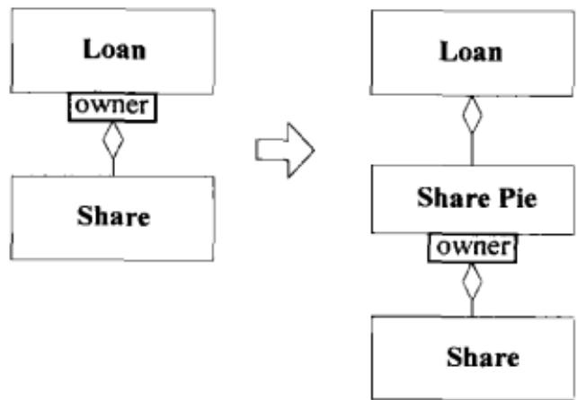


图10-18


Share Pie表示了一个特定的Loan的总体分布。它是一个ENTITY，其标识位于Loan AGGREGATE的内部。实际的分布计算可以被委托给Share Pie。 

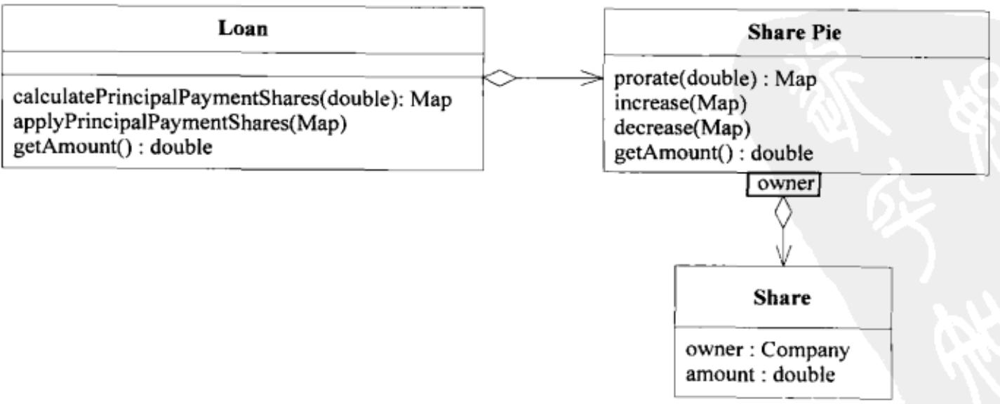


图10-19


```java
public class Loan {
    private SharePie shares;

    //Accessors, constructors, and straightforward methods
    //are omitted

    public Map calculatePrincipalPaymentDistribution(
    double paymentAmount) {
    return getShares().prorated(paymentAmount);
    }

    public void applyPrincipalPayment(Map paymentShares) {
    shares.decrease(paymentShares);
    }
} 
```

这样Loan就被简化了,而且Share计算也被集中到了一个VALUE OBJECT中(这个VALUE OBJECT只负责这个计算)。但是,这个计算并没有真正变得通用和易用。 

## 在进一步理解之后，把 Share Pie 变成一个 VALUE OBJECT

通常，在实现一个新设计的过程中，所获得的经验会引导我们对模型本身形成新的认识。在这个例子中，Loan和Share Pie的紧密耦合使Share Pie与Share之间的关系变得模糊不清。如果我们把Share Pie变成一个VALUE OBJECT，会产生什么变化呢？ 

这意味着不能再使用increase(Map)和decrease(Map)了，因为Share Pie必须是不变的。要更改Share Pie的值，必须替换整个Pie。因此需要使用addShares(Map)这样的方法来返回一个全新的、更大的Share Pie。 

让我们再进一步把它变成CLOSURE OF OPERATION。我们不采用“增加”Share Pie或向它添加Share，而只是把两个Share Pie加起来，结果是一个新的、更大的Share Pie。 

我们可以先把Share Pie上的prorate()操作变成半个闭合操作，这只需要修改返回类型即可。我们把它重命名为prorated()，以便强调它没有副作用。“股份数学”开始成型了，最初它有4个操作。 

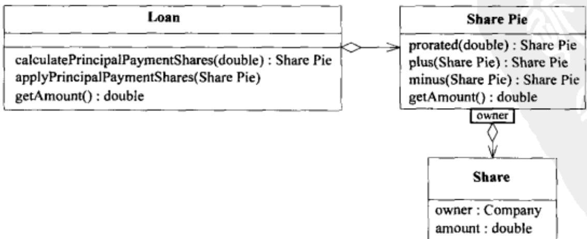


图10-20


我们可以为新的VALUE OBJECT Share Pie创建一些定义明确的ASSERTION。每个方法都有各自的意义。 

```java
public class SharePie {
    private Map shares = new HashMap();

    //Accessors and other straightforward methods are omitted

    public double getAmount() {
    double total = 0.0;
    Iterator it = shares.keySet().iterator();
    while(it.hasNext()) {    总股份等于各股份之和
    Share loanShare = getShare(it.next());
    total = total + loanShare.getAmount();
    }
    return total;
}

public SharePie minus(SharePie otherShares) {
    SharePie result = new SharePie();
    Set owners = new HashSet();
    owners.addAll(getOwners());
    owners.addAll(otherShares.getOwners());    两个Pie之差等于这两个股东所持股份之差
    Iterator it = owners.iterator();    两个Pie的组合就等于把这个股东所持股份加到一起
    while(it.hasNext()) {
    Object owner = it.next();
    double resultShareAmount = getShareAmount(owner) - otherShares.getShareAmount(owner);
    result.add(owner, resultShareAmount);
    }
    return result;
}

public SharePie plus(SharePie otherShares) {
    //Similar to implementation of minus()
}

public SharePie prorated(double amountToProrate) {
    SharePie proration = new SharePie();
    double basis = getAmount();
    Iterator it = shares.keySet().iterator();    总额可以依照所有股东所占的股份按比例划分
    while(it.hasNext()) {
    Object owner = it.next();
    Share share = getShare(owner);
    double proratedShareAmount = share.getAmount() / basis * amountToProrate;
    proration.add(owner, proratedShareAmount);
} 
```

```txt
}
return proration;
} 
```

## 新设计的柔性

现在，最重要的Loan类中的方法已经很简单了，如下： 

```java
public class Loan {
    private SharePie shares;

    //Accessors, constructors, and straightforward methods
    //are omitted

    public SharePie calculatePrincipalPaymentDistribution(
    double paymentAmount) {
    return shares.prorated(paymentAmount);
    }

    public void applyPrincipalPayment(SharePie paymentShares) {
    setShares(shares.minus(paymentShares));
    } 
```

这些简短的方法中的每一个都表达了其自己的含义。本金偿付表示从货款中按照股份减去偿付额。对已偿付的本金进行分配是指在股份持有者之间按比例分配。Share Pie的设计使我们能够在Loan代码中使用声明式风格，所编写的代码读起来像是业务交易的概念定义，而不像是一种计算。 

现在，其他交易类型（由于过于复杂没有在前面列出）也很容易声明了。例如，货款支取是根据贷方的Facility股份来分配的。新支取的数额被加到未偿货款（Loan）中。用我们的新领域语言可以描述如下： 

290 

```java
public class Facility {
    private SharePie shares;
    ...
    public SharePie calculateDrawdownDefaultDistribution(
    double drawdownAmount)
    return shares.prorated(drawdownAmount);
    }
}

public class Loan {
    ...
    public void applyDrawdown(SharePie drawdownShares) {
    setShares(shares.plus(drawdownShares));
    }
} 
```

要查看每个贷方的原定货款额与实际货款额之差,只需计算该贷方在未偿Loan总额中的理论分配值,然后用Loan的实际股份减去这个值即可。 

```txt
SharePie originalAgreement =
    aFacility.getShares().prorated(aLoan.getAmount());
SharePie actual = aLoan.getShares();
SharePie deviation = actual.minus(originalAgreement); 
```

Share Pie设计的一些特性使这种组合变得很容易，也提高了代码的表达能力。 

☐ 复杂的逻辑通过SIDE-EFFECT-FREE FUNCTION被封装到了专门的VALUE OBJECT中。大部分复杂逻辑都已经被封装到这些不变的对象中。由于Share Pie是VALUE OBJECT，因此数学运算可以创建新实例，我们可以用这些新实例来替换旧实例。 

Share Pie的所有方法都不会修改任何现有对象。这使我们在中间计算中能够自由地使用plus()、minus()和pro-rated()，并通过组合它们来实现预期效果，同时又不会产生其他副作用。我们还可以根据这些方法来创建分析特性（以前，只有在执行实际计算的时候才能调用这些方法，因为在每次调用之后数据就改变了）。 

□ 修改状态的操作很简单，而且是用ASSERTION来描述的。利用“股份数学”的高层抽象，我们可以用声明式的风格来精确地编写交易的固定规则。例如，差值是实际股份减去根据Facility的Share Pie按比例分配的Loan额。 

☐ 模型概念解除了耦合，操作只涉及最少的其他类型。Share Pie上的一些方法显示出它们是CLOSURE OF OPERATION（加、减方法是Share Pie之下的闭合操作）。其他操作以简单的总额作为参数或返回值，它们虽然不是闭合操作，但只增加了极少的概念负担。Share Pie只与一个其他的类——Share有密切交互。这样，Share Pie就非常直截了当，易于理解和测试，也很容易通过组合来产生声明式的交易。这些特性都是从数学形式中继承得来的。 

☐ 熟悉的形式使我们更容易掌握协议（protocol）。最初用于操作股份的协议本来也是可以用财务术语来设计的，而且从原则上讲，这样的设计也能很灵活。但它有两个缺点。首先，我们必须从头开始设计它，这是一项困难且没有把握完成的任务。其次，每个处理它的人都必须先学会它。而我们现在这种设计的好处是，看到股份数学的人会发现他们对这个早已十分熟悉了，而且由于设计与算术规则保持严格一致，因此人们不会被误导。 

把与数学形式有关的那部分问题提取出来之后，我们得到了一个柔性的Share设计，这使得我们可以进一步精炼核心的Loan和Facility方法（参见第15章有关CORE DOMAIN的讨论）。 

柔性设计可以极大地提升软件处理变更和复杂性的能力。正如本章的例子所示，柔性设计在很大程度上取决于详细的建模和设计决策。柔性设计的影响可能远远超越某个特定的建模和设计问题。第15章将讨论柔性设计的战略价值，我们将把它作为一种工具，用来精炼领域模型，以便使大型和复杂的项目更易于掌握。 

## 分析模式的应用

深刻的模型和柔性的设计并不会轻易得到。要想取得进展，必须学习大量领域知识并进行充分的讨论，还需要经历大量的尝试和失败。但有时我们也能从中获得一些优势。 

一位经验丰富的开发人员在研究领域问题时，如果发现了他所熟悉的某种职责或某个关系网，他会想起以前这个问题是如何解决的。以前尝试过哪些模型？哪些是有效的？在实现中有哪些难题？它们是如何解决的？先前经历过的尝试和失败会突然间与新的情况联系起来。这些模式当中有一些已经记载到文献中供大家分享，这样我们就可以借鉴这些积累的经验。 

与第二部分提出的基本构造块模式和第10章介绍的柔性设计原则相比，这些模式属于更高级和专用的模式，其中还使用了少量对象来表示某种概念。利用这些模式，可以避免一些代价高昂的尝试和失败过程，而直接从一个已经具有良好表达力和易实现的模型开始工作，而且构造块模式已经解决了一些可能很难学习的微妙的问题。我们可以从这样一个起点来重构和试验。然而，它们并不是现成的解决方案。 

在《分析模式》一书中，Martin Fowler这样定义分析模式（[Fowler 1997, p. 8]）： 

分析模式是一种概念集合，用来表示业务建模中的常见构造。它可能只与一个领域有关，也可能跨越多个领域。 

Fowler所提出的分析模式来自于实践经验，因此只要用在适当的情况下，它们会非常实用。这些模式为那些面对领域挑战的开发人员提供了一个非常有价值的迭代开发过程起点。“分析模式”这个名字本身就强调了其概念本质。分析模式并不是技术解决方案，而只是用来指导人们设计特定领域中的模型。 

但从这个名字中我们看不出分析模式也讨论了大量实现问题，包括一些代码。Fowler知道，在不考虑实际设计的情况下进行单纯的分析是有缺陷的。下面举一个很有趣的例子，在这个例子中，Fowler用更长远的眼光审视了模型选择的意义——考虑在部署之后，模型选择对系统长期维护的影响（[Fowler 1997, p. 151]）。 

当构建一个新的[会计]实务时，我们会创建一个新的过账规则（posting rule）的实例网。这项工作完全不需要重新编译或重建系统，而且不影响系统的运行。有时我们将不可避免地需要过账规则的某个新的子类型，但这种情况并不多见。 


在一个成熟的项目上，模型选择往往是根据实用经验做出的。人们已经尝试了各种组件的多种实现方法。其中的一些实现已经被采用，甚至已经到了维护阶段。这些经验可以帮助人们避开很多问题。分析模式的最大作用是借鉴其他项目的经验，把那些项目中所做的广泛的设计方向讨论和实现结果的经验与当前的模型结合起来。脱离设计模式的上下文来讨论模型思想将使它们很难应用，而且还会产生分析与设计脱节的风险，而这一点正是MODEL-DRIVEN DESIGN坚决反对的。 

用实例比用单纯的抽象描述能够更好地解释分析模式的原则和应用。本章将举出两个例子，它们选自[Fowler 1997]中的“Inventory and Accounting”（库存与账户）一章，在这两个例子中开发人员使用一个小型的、有代表性的模型。本章只是为了讲解这两个例子而概述分析模式。显然，本章的目的不是对这种模式进行归纳分类，甚至对示例所使用的模式也没有做完全的解释。本章的重点是说明如何将它们集成到领域驱动的设计过程中。 

## 示例 账户的利息计算

第10章显示了开发人员为某种专用会计应用程序去寻找更深层模型的各种可能途径。而本示例则是另外一个场景，这里开发人员将深入挖掘Fowler的《分析模式》一书，从中寻找有用的思想。 

来复习一下。用于跟踪货款和其他有息资产的应用程序将计算所产生的利息和手续费，并跟踪借方的付款情况。夜间会有一个批处理操作提取这些数字，并传递给原来的会计系统，并标明每个账目应该过账到哪个分类账中。这种设计虽然能工作，但使用起来却很麻烦，修改起来也很复杂，而且不易于交流沟通。 

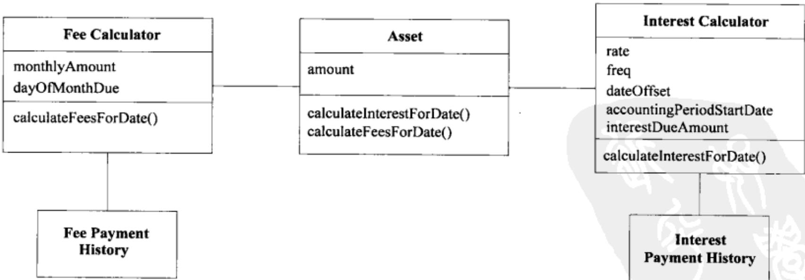


图11-1 初始的类图


开发人员决定读一下《分析模式》的第6章 “Inventory and Accounting”。下面是摘录的一些最与之相关的内容。 

## 《分析模式》中的账户模型

所有种类的业务应用程序都需要对账户进行跟踪，因为账户中保存了与数值有关的信息（通常是钱）。在很多应用程序中，仅跟踪账户总额是不够的，记录和控制账户总额的每次修改也很重要。这也是会计模型最基本的动机。 

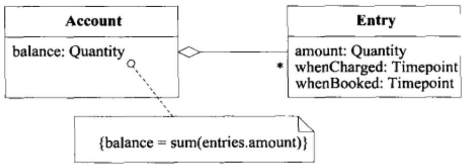


图11-2 一个基本的账户模型


通过插入一个Entry（项）可以向账户中添加数值，而插入一个负的Entry则可以从账户中删除数值。Entry永远不会被删除，因此整个历史就会被保留下来。余额就是把所有Entry加到一起所得到的结果。这个余额可以实时计算，也可以被缓存，这是由Account接口封装的一个实现决策。 

会计的一条基本原则就是账目的平恒。钱不会无中生有，也不会无故消失。它只能从一个账户转移到另一个账户。 

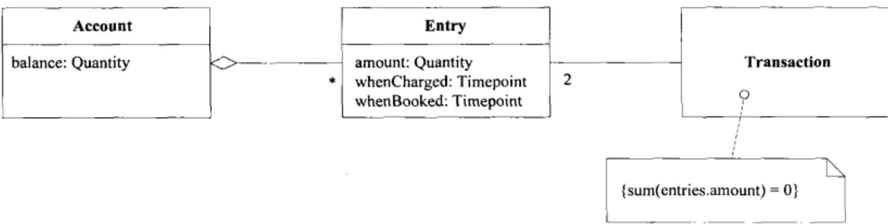


图11-3 一个交易模型


这就是众所周知的“复式记账”（double-entry book-keeping）概念。每个贷方都有与之相应的借方。当然，像其他守恒定律一样，它只适用于一个封闭的系统，这个系统包含了入账和出账的所有明细。但很多简单的应用程序并不需要这么严格。 

Fowler在他的书中介绍了这些模型的较全面的形式，并对折中问题做了大量讨论。 

开发人员（开发人员1）通过阅读这些内容获得了一些新的思路。她把这章内容介绍给她的同事（开发人员2）看，这位同事正在与她一起编写一些利息计算逻辑，而且他还编写了夜间批处理程序。他们一起对模型作了一些粗略的修改，并在模型中加进了一些在阅读该章时看到的模型元素。 

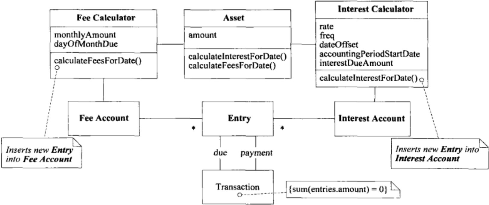


图11-4 新提出的模型


然后他们找来领域专家（以下称专家）一起讨论新模型的思路。 

开发人员1：利用这个新模型，我们可以在Interest Account中为每笔利息收入增加一个Entry，而不是只调整interestDueAmount。然后，另一个付款的Entry会使其平账。 

专家：这样是不是就可以看到所有的应计（accrual）利息和付款历史了？这正是需要的功能。 

开发人员2：我不确定这里使用“Transaction”（交易）是否完全正确。定义讲的是把钱从一个Account转移到另一个Account，而不是两个Entry在同一个Account中互相平衡。 

开发人员1：这个问题很好，我也有些担心，因为书上似乎强调交易是瞬间建立的，而利息的付款可以过几天再进行。 

专家：那些付款不一定要推迟几天，在支付时间上可以灵活处理。 

开发人员1：那么这种担心就没有必要了。我想我们或许已经发现了一些隐含的概念。让Interest Calculator来创建Entry对象似乎确实更易理解。而且Transaction似乎把计算出的利息和付款巧妙地联系在一起了。 

297 

专家：为什么要把应计项目和付款联系在一起呢？它们在会计系统中分开过账的。Account的平账才是主要的。沿着一个一个的Entry，我们就可以查出所有的账目。 

开发人员2：你的意思是说不用跟踪利息是否已经支付这一点吗？ 

专家：当然需要跟踪。但它并不是你们所说的“一次应计项目/一笔付款”这种简单的模式。 

开发人员2：实际上不用考虑那种关联之后，很多事情都简化了。 

开发人员1：好的，这样如何？[拿来旧类图的复印件开始把修改的地方画出来]。顺便问一下，你好几次提到“应计项目”这个词，能确切地讲一下它的意思吗？ 

专家：当然可以。应计项目（accrual）是指在一笔支出或收入发生的时候把它记录到账目中，而永远不管现金实际是何时过账的。因此，利息每天都会计算，但只有在（举例来说）月末才会支付。 

开发人员1：是的，我们确实需要这个词。好，现在这个图怎么样？ 

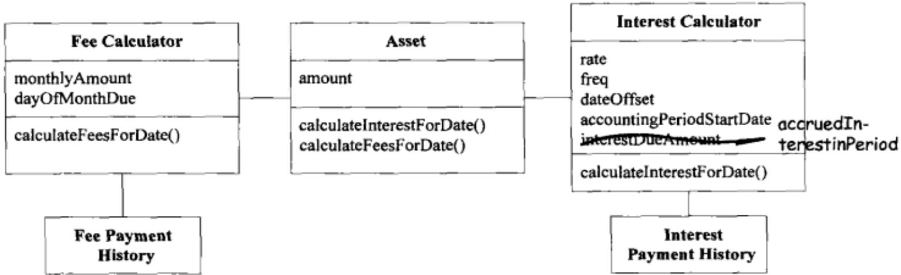


图11-5 还是原来的类图，只是把应计项目和付款分开了


开发人员1：现在，我们可以删掉与付款有关的所有复杂计算了，而且我们引入了“accrual”这个术语，它更好地表明了我们的意图。 

专家：那么我们就不会有Account对象了吧？我本来还希望能够把应计项目、付款和余额等项都放到这个对象中呢。 

开发人员1：是吗？！如果是那样的话，或许这么画就可以[拿起另一张图开始画起来]。 

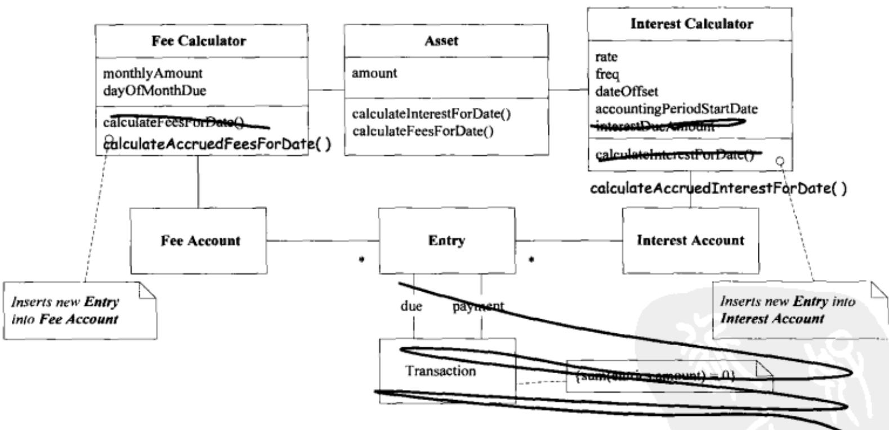


图11-6 基于账户的图，里面没有Transaction


专家：这看起来确实好极了！ 

开发人员2：批处理脚本也只需要简单的修改就能使用这些新对象。 

开发人员1：新的Interest Calculator过几天才能使用。有好几个测试需要修改一下。但修改之后测试会更清楚。 

两位开发人员开始基于新模型进行重构。他们在着手编写代码并加强设计时，又有了一些对模型进行精化的新想法。 

通过更仔细的研究，他们发现这两个子类在应用程序中的职责稍有不同，而且都是非常重要的领域概念，于是决定为Entry创建两个子类：Payment和Accrual。但另一方面，从“Entry是从何而来的”这个角度来看，那么无论它是因为手续费而产生的，还是因为利息产生的，在概念和行为上都没有任何区别。它们只是出现在适当的Account中。 

但遗憾的是，开发人员们发现，出于实现方面的考虑，他们不得不放弃最后这一次抽象。数据存储在关系表中，而且项目标准要求在不运行程序的情况下也能解释清楚这些表。这意味着要把手续费项和利息项分开保存到不同的表中。根据他们所使用的对象-关系映射框架，将手续费项和利息项保存到不同表中的唯一方法就是创建具体的子类（Fee Payment、Interest Payment等等）。如果换成另外一种基础设施，他们或许还可以避免使用这些笨拙的子类。 

我在这个大部分是虚构的故事中讲述这段小插曲的原因是想说明我们在现实中总是会遇到这类小的障碍。我们必须做出一些适当的折中选择然后继续前进，而不能因为这些小问题而改变MODEL-DRIVEN DESIGN的方向。 

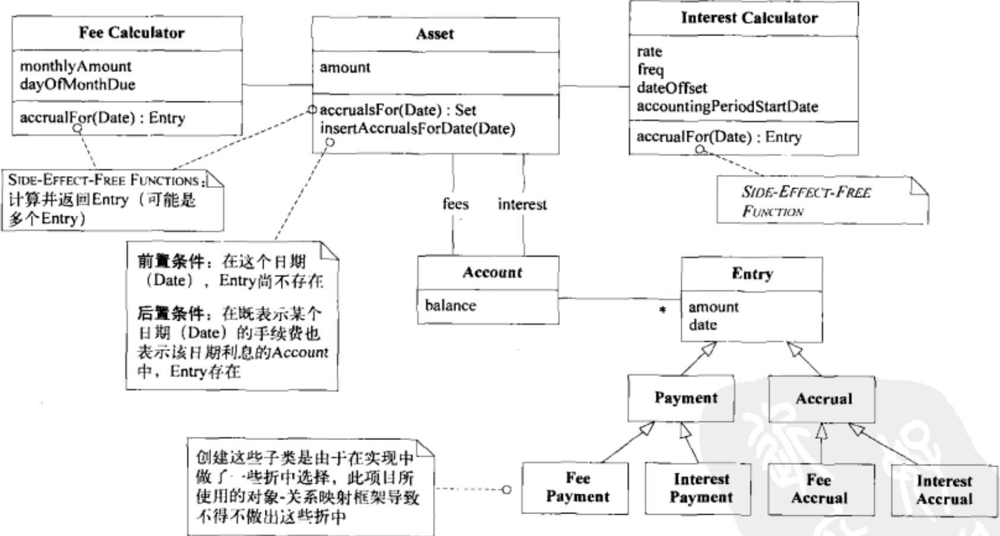


图11-7 实现之后的类图


新的设计更易于分析和测试，因为最复杂的功能已被封装到了SIDE-EFFECT-FREE FUNCTION中。剩下的命令的代码很简单（因为它只需调用各种FUNCTION），并使用了ASSERTION。 

有时，我们甚至想象不到，程序的一些部分也能从领域模型获益。它们可能从简单开始，并 一步步机械地演变。它们看上去就像是复杂的应用程序代码，而不是领域逻辑。分析模式在找到这些盲点方面特别有用。 

在下一个例子中，一位开发人员对夜间批处理程序的内部机制产生了新的想法，以前他并没有从领域的角度来考虑这一问题。 

## 示例 对夜间批处理程序的深入理解

几星期后，改进后的基于Account的模型基本完成了。像往常一样，虽然新设计更加清晰了，但它又暴露了其他一些问题。开发人员（开发人员2）在修改夜间批处理程序以使之与新设计交互的时候，发现批处理程序的行为与《分析模式》一书中所讲的一些概念有联系。下面就是他发现的一些最相关的概念： 

## 过账规则

会计系统经常提供同一个基本财务信息的多种视图。一个账户可能用于跟踪收入，而另一个账户可能用于跟踪该收入的估税。如果我们希望系统自动更新估税总额，那么这两个账户的实现将会彼此紧密关联。在有些系统中，大部分账目都是由这些规则而产生的，在这样的系统中，依赖逻辑会变得一团糟。即使是在规模不大的系统中，这样的交叉过账也会很复杂。减少这种缠杂不清的依赖性的第一步是通过引入一个新的对象来使这些规则明朗化。 

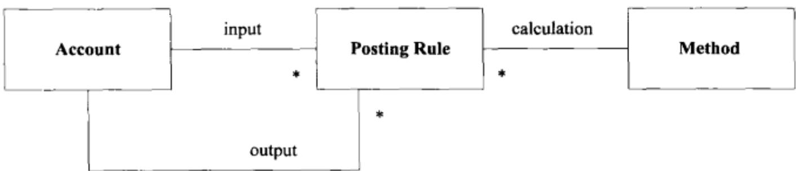


图11-8 基本过账规则的类图


当过账规则的input账目收到一个新的Entry时，这个Entry就会触发过账规则。然后过账规则会生成一个新的Entry（基于其自己的计算方法），并将这个Entry插入到其“output”账目中。在工资系统中，工资Account中的Entry可能会触发一个过账规则，此规则计算30%的估计收入所得税，并将其作为一个Entry插入到扣税Account中。 

## 执行过账规则

过账规则建立了各个Account在概念之间的依赖性，但如果对这个模式的使用仅限于目前这个程度，那么它仍然很难使用。在依赖性设计中，最复杂的一个部分是更新的时间和控制。Fowler讨论了3种选择： 

(1) “主动触发”（Eager firing）是最明显的选择，但通常也是最不实用的。每当一个Entry被插入到Account中时，它立即就触发过账规则，并立即进行所有更新。 

(2) “基于Account的触发”允许推迟处理。在过后的某个时刻，向Account发送一条消息，令其触发过账规则，来处理自从上一次触发以来所插入的所有Entry。 

(3) 最后，“基于过账规则的触发”由外部代理来启动，它通知过账规则触发。过账规则负责查找自从上次触发以来插入到其输入的Account中的所有Entry。 

尽管在一个系统中可以混合使用各种触发模式，但每组特定的规则都需要有一个明确定义的“启动点”（应该在何时启动），还要定义由谁负责查找插入到输入的Account中的Entry。将这三种触发模式添加到UBIQUITOUS LANGUAGE中对于成功使用这种模式具有至关重要的意义，这与模型对象定义本身同等重要。这样，触发的概念就不再模糊了，而且还能指导我们从已经明确定义的三种选择中确定一个。这些触发模式揭示出了一个很容易被忽略的重点，并且丰富了我们的词汇，从而使讨论更清晰。 

开发人员2需要找个人来讨论他的新思路。他找到了同事（开发人员1），开发人员1原来主要负责建立一个应计项目（accrual）的模型。 

开发人员2：有的时候，夜间批处理程序成为了一个隐藏问题的地方。脚本的行为中隐含了领域逻辑，而且正在变得越来越复杂。很长时间以来，我一直想用MODEL-DRIVEN DESIGN的方法来修改一下批处理，将领域层分离出来，并使脚本本身成为领域层之上的一个简单的层。但我一直没有想出这个领域模型应该是什么样的。看上去它似乎只是一些操作步骤，而把它们实现为对象没什么实际意义。我读完《分析模式》一书中有关Posting Rule的内容后，获得了一些思路。这个图就是我所想到的[递过来一张草图]。 

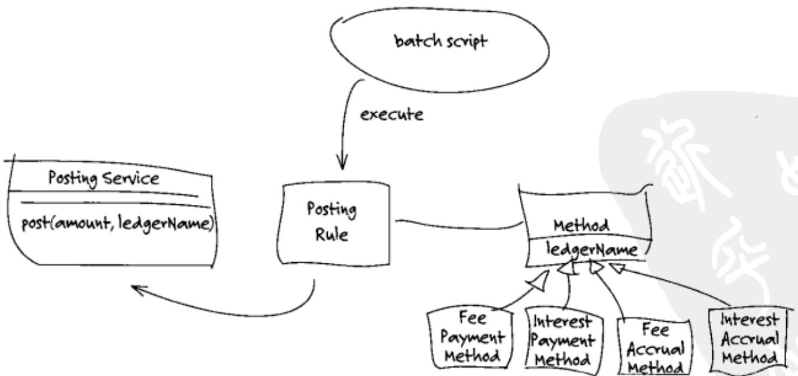


图11-9 在批处理中使用过账规则的一个思路


开发人员1：Posting Service是指什么？ 

开发人员2：这是个FACADE，它提供了会计应用程序的API，并且将其呈现为一个SERVICE。实际上我使用它已经有一段时间了，主要用来简化批处理代码，而且它也为我提供了一个INTENTION-REVEALING INTERFACE，可用于向老系统过账。 

开发人员1：很有趣，那么你打算为这些Posting Rule（过账规则）使用哪种触发模式？ 

开发人员2：我还没有想那么多。 

开发人员1：“主动触发”可能适用于Accrual，因为批处理程序实际上通知Asset插入Accrual，但“主动触发”可能不适用于Payment，因为Payment是在白天输入的。 

开发人员2：不管怎样，我认为我们都不希望把计算方法与批处理程序特别紧密地联系到一起。如果我们决定在一个不同的时间来触发利息计算，那么情况将会是一团糟。而且从概念上看，这也是不正确的。 

开发人员1：这听上去有点像“基于Posting Rule的触发”。每个Posting Rule需要执行的时候，都由批处理程序通知它执行，然后规则找出相应的新Entry，并完成其他工作。这种思路基本上就与你画的图中表现出来的思路差不多吧。 

开发人员2：这样在批处理设计中就不会产生很多依赖性，而且它也易于控制了，看样子不错。 

开发人员1：我没有完全明白这些对象是如何与Account和Entry交互的。 

开发人员2：我也没完全明白。那本书中的示例在Account和Posting Rule之间建立了直接联系。在某种程度上这种方法是合乎逻辑的，但我认为它并不完全适用于我们的情况。我们每次都需要用数据来实例化这些对象，因此要使用这种方法，必须知道应用哪条规则。同时，Asset对象知道每个Account的内容，因此也知道应用哪条规则。但别的对象是什么情况呢？ 

开发人员1：虽然我讨厌过分挑剔，但我确实认为Method的使用不正确。我认为在概念上Method是用于计算要过账的总额的，比方说，在收入上计算 $20\%$ 的扣税。但我们的情形很简单：它始终是过账的全额。我想Posting Rule本身应该是知道要过账给哪个Account的，这个Account对应于我们的ledger name（分类账名称）。 

开发人员2：哦，那么如果让Posting Rule负责查知正确的ledger name，我们可能就完全不需要Method了。 

实际上，选择正确的ledger name这件事情变得越来越复杂了。它已经是收入类型（手续费或利息）与“Asset类别”（公司对每种Asset所使用的分类）的组合了。我希望新模型能够在解决这个复杂性上有所帮助。 

开发人员1：好的，我们就把重点集中在这里。Posting Rule负责根据Account的属性来选择Ledger。现在，我们可以先用一种简单直接的方式来处理资产类型以及利息与收入之间的区分。将来，我们会有一个OBJECT MODEL，可以通过改进这个模型来处理更复杂的情形。 

开发人员2：在这方面我还要多考虑一下。我会再仔细研究一番，再把模式读一遍，然后再来尝试解决这个问题。明天下午我能再次和你讨论这个问题吗？ 

在接下来的几天时间里，这两位开发人员设计出了一个模型，并对代码进行了重构，使得批处理程序只是简单地依次访问各个Asset，并向每个Asset发送几条非常浅显易懂的消息，然后提交数据库事务。复杂性被转移到领域层中，领域层中的对象模型使问题变得更加明确，也更抽象。 

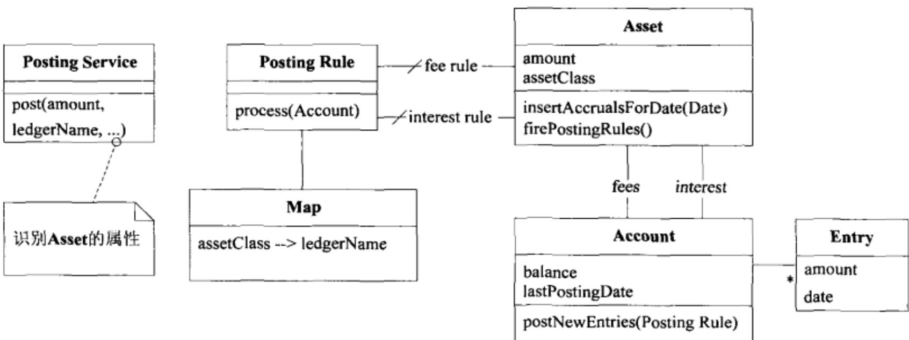


图11-10 含有过账规则的类图


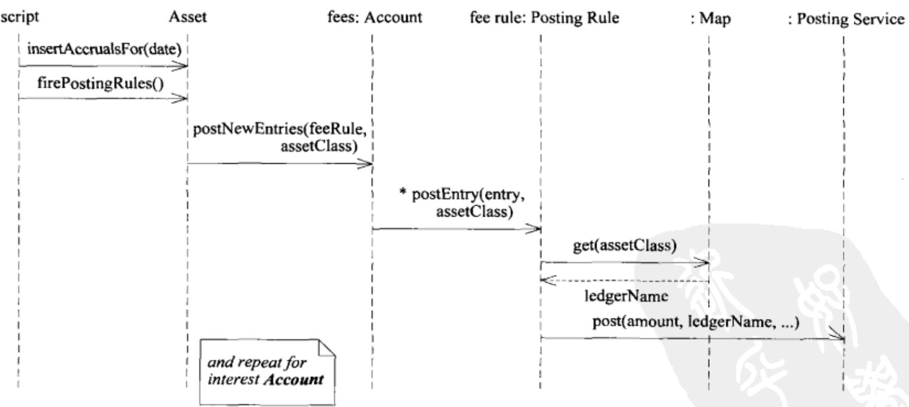


图11-11 显示了规则触发的序列图


在一些细节问题上，这两位开发人员开发的模型与《分析模式》中给出的相差甚远，但他们认为二者在概念本质上还是相同的。有一个问题令他们稍感不安，那就是在Posting Rule的选择中 305 把Asset牵扯进来了，因为Asset知道每个Account的性质（手续费或利息），而且它也是脚本的自然访问点。在规则对象直接与Account发生关联的情况下，这些对象在每次实例化时（每次运行批处理程序时）都需要与Asset对象进行协作。可他们没有这样做，而是让Asset对象通过SINGLETON访问来查找这两个相关规则，并把相应的Account传递给它们。这样一来代码就变得更直接了，因此这是一个正确的决定。 

他们都感到从概念上看更好的做法是让Posting Rule只与Account发生关联，而令Asset只负责生成Accrual。他们希望等到有了后续的重构和更深入的理解之后再回头看这个问题，并找到一种将职责分离得更清楚而又不影响代码明确性的方法。 

## 分析模式是很有价值的知识

当你可以幸运地使用一种分析模式时，它一般并不会直接满足你的需求。但它为你的研究提供了有价值的指导，而且提供了明确抽象的词汇。它还可以指导我们的实现，从而省去很多麻烦。 

我们应该把所有分析模式的知识融入到知识消化和重构的过程中，从而形成更深刻的理解，并促进开发。当我们应用一种分析模式时，所得到的结果通常与该模式的文献中记载的形式非常相像，只是因具体情况不同而略有差异。但有时也完全看不出这个结果与分析模式本身有关，然而这个结果仍然是受该模式思想的启发而得到的。 

但有一个误区是应该避免的。当使用一个众所周知的分析模式中的术语时，一定要注意，不管其表面形式的变化有多大，都不要改变它所表示的基本概念。这样做有两个原因，一是模式中蕴含的基本概念将帮助我们避免问题，二是（也是更重要的原因）在UBIQUITOUS LANGUAGE中使用被广泛理解或至少是被明确解释的术语可以增强通用语言。如果在模型的自然演变过程中模型的定义也发生改变，那么就要修改模型名称了。 

很多对象模型都有文献资料可查，其中有些对象模型专门用于某个行业中的某种应用，而有些则是通用的模型。大部分对象模型都有助于开阔思路，但只有为数不多的一些模型精辟地阐述了选择这些模式的原理和使用的结果，而这些才是分析模式中最有用的部分。这些精化后的分析模式大部分都很有价值，有了它们，可以免去一次次的重复开发工作。尽管我们不大可能归纳出一个包罗万象的分析模式类目，但针对具体行业的类目还是能够开发出来的。而且在一些跨越多个应用的领域中适用的模式可以被广泛共享。 

这种对已组织好的知识的重复利用完全不同于通过框架或组件进行的代码重用,但是二者唯一的共同点是它们都提供了一种新思路的萌芽,而这种新思路先前可能并不十分明晰。一个模型,甚至一个通用框架,都是一个完整的整体,而分析则相当于一个工具包,它被应用于模型的一些部分。分析模式专注于一些最关键和最艰难的决策,并指明了各种替代和选择。它们提前预测了一些后期结果,而如果单靠我们自己去发现这些结果,可能会付出高昂的代价。 

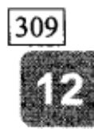


# 将设计模式应用于模型

到目前为止,本书中所探讨的模式都是专门针对如何在MODEL-DRIVEN DESIGN的上下文中解决领域模型中的问题。但实际上,大部分已发布的模式都更侧重于解决技术问题。设计模式与领域模式之间有什么区别?《设计模式》这部经典著作的作者为初学者指出了以下事实 ([Gamma et al. 1995, p. 3]): 

观点的不同会影响人们对什么是模式和什么不是模式的理解。一个人所认为的模式在另一个人看来可能是基本构造块。本书将在一定的抽象层次上讨论模式。设计模式并不是指像链表和散列表那样可以被封装到类中并供人们直接重用的设计，也不是直接用于整个应用程序或子系统的复杂的、专用于领域的设计。本书中的设计模式是对一些交互的对象和类的描述，我们通过定制这些对象和类来解决特定上下文中的一般设计问题。 

在《设计模式》介绍的模式中，有些（但并非所有）模式可用作领域模式，但在这样使用的时候，需要变换一下重点。《设计模式》一书中的设计模式把相关设计元素归为一类，这些元素能够解决在各种上下文中经常遇到的问题。这些模式的动机以及模式本身都是从纯技术角度描述的。但这些元素中的一部分在更广泛的领域和设计上下文中也适用，因为这些元素所对应的基本概念在很多领域中都会出现。 

除了《设计模式》一书中介绍的模式以外，近年来还出现了其他很多技术设计模式。有些模式反映了在一些领域中出现的深层次概念。这些模式都有很大的利用价值。为了在领域驱动的设计中充分利用这些模式，我们必须同时从两个角度看待它们：从代码的角度来看它们是技术设计模式，从模型的角度来看它们就是概念模式。 

我们将把《设计模式》所介绍的一个特定模式作为样例，来说明如何将人们所认为的设计模式应用到领域模型中，而且这个例子还将澄清技术设计模式与领域模式之间的区别。本章还将通过组合COMPOSITE（组合）和STRATEGY（策略）这两种模式演示如何通过改变思考方式，用一些经典的设计模式来解决领域问题。 

## 12.1 模式：STRATEGY（也称为 POLICY）

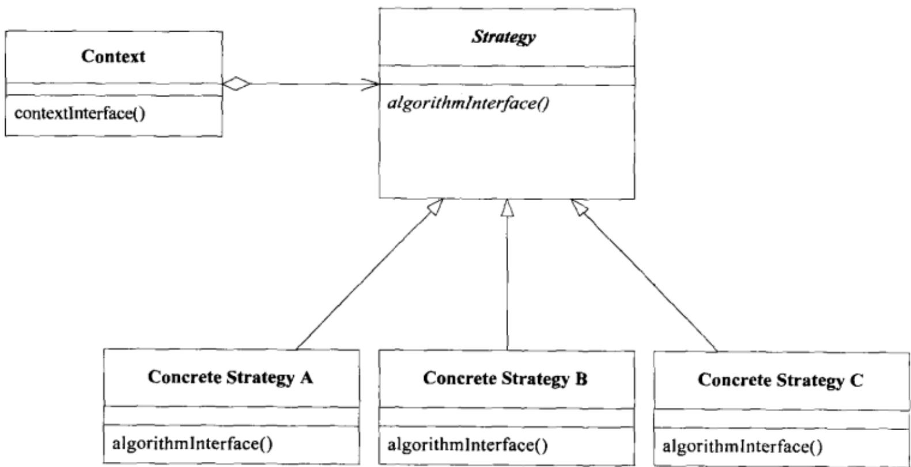


定义了一组算法，将每个算法封装起来，并使它们可以互换。STRATEGY允许算法独立于使用它的客户而变化。（[Gamma et al. 1995]) 

领域模型包含一些并非用于解决技术问题的过程，将它们包含进来是因为它们对处理问题领域具有实际的价值。当必须从多个过程中进行选择时，选择的复杂性再加上多个过程本身的复杂性会使局面失去控制。 

当对过程进行建模时，我们经常会发现有不止一种合理的建模方式，而如果把所有的选择都写到过程的定义中，定义就会变得臃肿而复杂，而且我们所选择的行为描述也会因为混杂在其他行为中而显得模糊不清。 

我们希望把这些选择从过程的主体概念中分离出来，这样既能够看清主体概念，也能更清楚地看到这些选择。软件设计社区中众所周知的STRATEGY模式就是为了解决这个问题的，虽然它的侧重点在于技术方面。这里，我们把它当成模型中的一个概念来使用，并在该模型的代码实现中把它反映出来。我们同样也需要把过程中极易发生变化的部分与那些更稳定的部分分离开。 

因此： 

我们需要把过程中的易变部分提取到模型的一个单独的“策略”对象中。将规则与它所控制的行为区分开。按照STRATEGY设计模式来实现规则或可替换的过程。策略对象的多个版本表示了完成过程的不同方式。 

传统上，人们把STRATEGY模式看作一种设计模式，这种观点的侧重点是它替换不同算法 的能力。而把它看作领域模型的侧重点是其表示概念的能力，这里的概念通常是指过程或策略规则。 

## 示例 路线查找（Route-Finding）策略

我们把一个Route Specification(路线规格)传递给Routing Service(路线服务), Routing Service的工作是构造一个满足SPECIFICATION的详细的Itinerary。这个SERVICE是一个优化引擎, 可以通过调节它来查找最快的路线或最便宜的路线。 

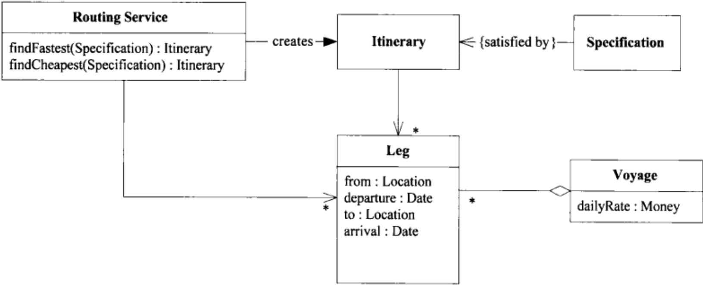


图12-1 带选项的SERVICE接口需要条件逻辑


这种设置看上去似乎没问题，但仔细观察路线代码就会发现，每个计算中都有条件判断，到处都是判断最快还是最便宜的逻辑。当为了做出更精细的航线选择而把新标准添加进来时，麻烦会更多。 

解决此问题的一种方法是把这些起调节作用的参数分离到STRATEGY中。这样它们就可以被明确地表示出来，并作为参数传递给Routing Service。 

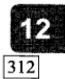


现在，Routing Service就可以用一种完全相同的、无需进行条件判断的方式来处理所有请求了，它按照Leg Magnitude Policy（航段规模策略）的计算，找出一系列规模较小的Leg（航段）。 

这种设计具有《设计模式》中所介绍的STRATEGY模式的优点。按这种思路设计的应用程序可以提供丰富的功能，同时也很灵活，现在，可以通过安装适当的Leg Magnitude Policy来控制和扩展Routing Service的行为。图12-2中显示的只是最明显的两种STRATEGY（最快或最便宜）。可能还会有一些在速度和成本之间进行权衡考虑的组合策略。也可以加进其他的因素，例如在预订货物时优先选择公司自己的运输系统，而不是外包给其他运输公司。不使用STRATEGY模式同样能实现这些修改，但必须将逻辑添加到Routing Service的内部（这会是一 个麻烦的过程)，而且这些逻辑会使接口变得臃肿。解耦可以令Routing Service更清楚且易于测试。 

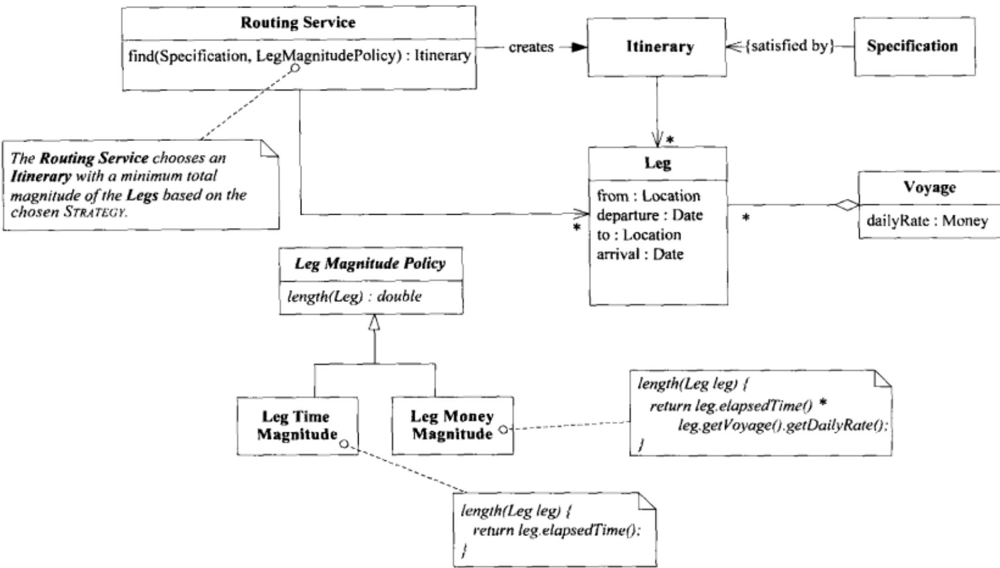


图12-2 通过STRATEGY（或者POLICY）选择确定的选项（STRATEGY是作为参数传入的）


现在，领域中的一个至关重要的规则明确地显示出来了，也就是在构建Itinerary时用于选择Leg的基本规则。它传达了这样一个知识：路线选择的基础是航段的一个特定属性（有可能是派生属性），这个属性最后可归结为一个数字。这样，我们就可以在领域语言中用一句简单的话来定义Routing Service的行为：Routing Service根据所选定的STRATEGY来选择Leg总规模最小的Itinerary。 

说明：以上讨论暗示了一件事。Routing Service在查找Itinerary时实际上会计算Leg的规模。这种方法在概念上比较直接，而且可以得到一个合理的原型实现，但它的低效率可能令人无法接受。第14章会再次讨论这个应用程序，其中将使用相同的接口，但具有完全不同的Routing Service实现。 

## * * *

我们在领域层中使用技术设计模式时，必须认识到这样做的另外一种动机，也是它的另一层含义。当所使用的STRATEGY对应于某种实际的业务策略时，模式就不再仅仅是一种有用的实现 

技术了（但它在实现方面的价值并未改变）。 

设计模式的结论也完全适用于领域层。例如，在《设计模式》一书中，Gamma等人指出客户必须知道不同的STRATEGY，这也是一个建模关注点。如果单纯从实现上来考虑，使用策略可能会增加系统中对象的数目。如果这是一个问题，可以通过把STRATEGY实现为可在上下文中共享的无状态对象来减小开销。《设计模式》中对实现方法的全面讨论在这里也适用，这是因为我们仍然在使用STRATEGY，只是动机有些不同，这将影响我们的一些选择，但设计模式中的经验仍然是可以借鉴的。 

## 12.2 模式：COMPOSITE

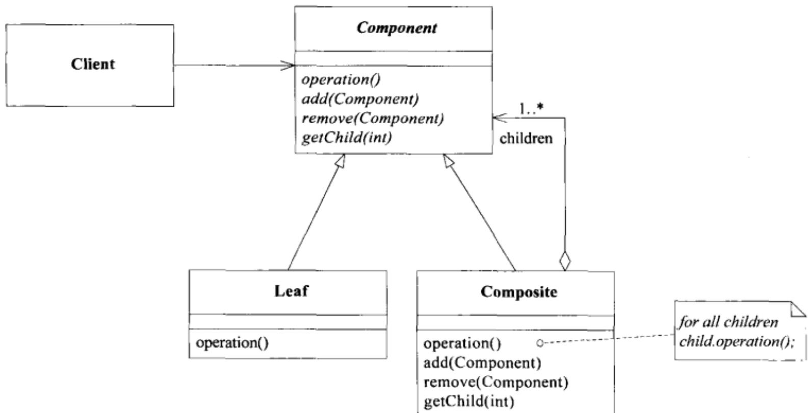


将对象组织为树结构来表示部分-整体的层次结构。利用COMPOSITE，客户可以对单独的对象和对象组合进行同样的处理。（[Gamma et al. 1995]）


在对复杂的领域进行建模时，我们经常会遇到由多个部分组成的重要对象，这些部分本身又由其他一些部分组成，进而又由其他部分组成，有时甚至会出现任意深度的这种嵌套。在一些领域中，各个嵌套层在概念上是有区别的，但在另一些领域中，各个部分与它们所组成的整体是完全相同的事物，只是规模较小一些而已。 

当嵌套容器的关联性没有在模型中反映出来时，公共行为必然会在层次结构的每一层重复出现，而且嵌套也变得僵化（例如，容器通常不能包含同一层中的其他容器，而且嵌套的层数也是固定的）。客户必须通过不同的接口来处理层次结构中的不同层，尽管这些层可能在概念上没有区别。通过层次结构来递归地收集信息也变得非常复杂。 

当在领域中应用任何一种设计模式时，首先关注的问题应该是模式思想是否确实适合领域概 念。以递归方式在一些相关对象中导航确实比较方便，但它们是否真的存在整体-部分层次结构？你是否发现可以通过某种抽象方式把所有部分都归到同一概念类型中？如果你确实发现了这种抽象方式，那么使用COMPOSITE可以令模型的这些部分变得更清晰，同时使你能够深入细致地考虑设计模式的设计和实现问题。 

因此： 

定义一个把COMPOSITE的所有成员都包含在内的抽象类型，在容器上实现一些用来查询信息的方法，这些方法可用来收集与容器内容有关的信息。“叶”节点基于它们自己的值来实现这些方法。客户只需使用抽象类型，而无需区分“叶”和容器。 

这相对来说是一种明显的结构层面上的模式，但设计人员通常不会主动地充实它的操作方面。COMPOSITE模式在每个结构层上都提供了相同的行为，而且无论是较小的部分还是较大的部分，都可以对这些部分提出一些有意义的问题，这些问题能够透明地反映出它们的构成情况。这种严格的对称是组合模式具有强大能力的关键所在。 

## 示例 由Route构成的Shipment Route

完整的货物运输路线是很复杂的。首先，必须用卡车把集装箱运输到铁路终点站，然后运送到港口，然后用货轮运输到另一个港口，中间可能还会换船，最后还要进行地面运输才能到达目的地。 

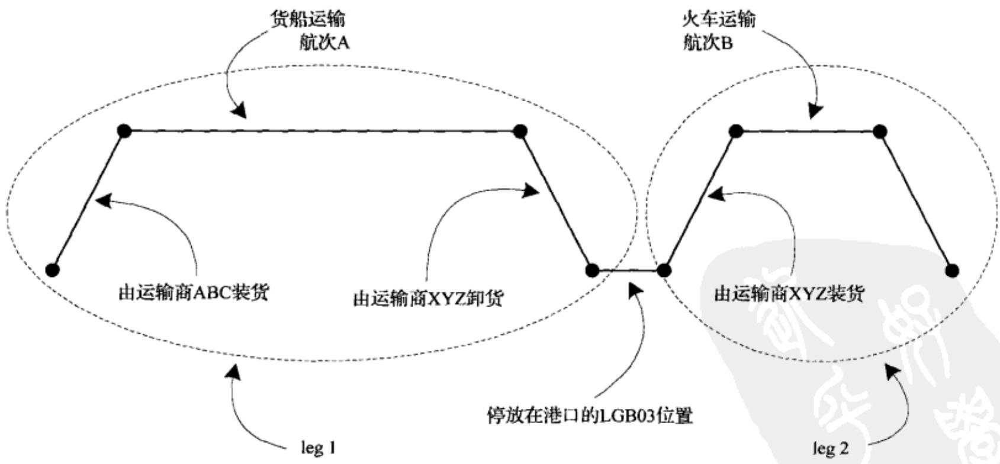


图12-3 由 “leg”（航段）构成的 “route”（航线）


一个应用开发团队创建了一个对象模型，它表示了一个航线可以由任意多个航段组成。 

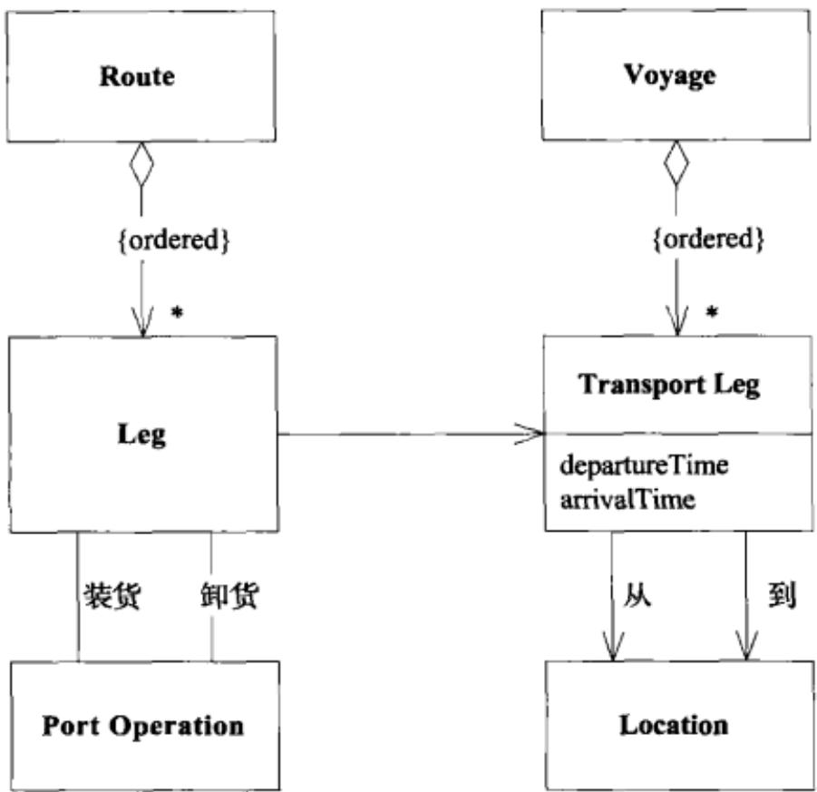


图12-4 Route的类图，其中Route由多个Leg组成


利用这个模型，开发人员可以根据预订请求来创建Route对象。他们可以把这些Leg组织为进一步一步运输货物的操作计划。在这个过程中他们发现了一些问题。 

开发人员原来一直认为航线是由任意多个航段组成的，而各个航段之间并没有什么区别。 


图12-5 开发人员的航线概念


而事实上领域专家把航线看成是由5个逻辑段组成的一个序列。 

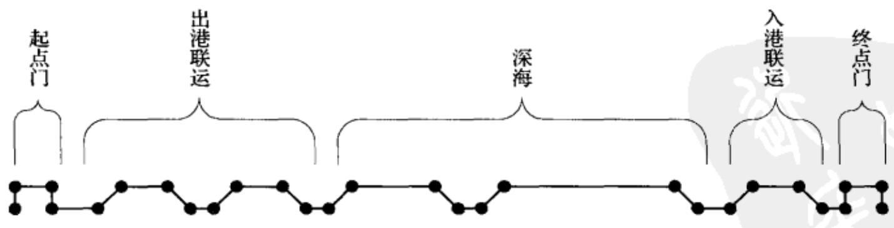


图12-6 业务专家的航线概念


其他问题先不考虑，这些小段的航线可能是由不同的人在不同时间规划的，因此必须认识到它们之间是有区别的。通过更仔细的研究可以发现，“门航段”（door leg）与其他航段大不相同，它涉及在当地雇用卡车甚至是客户运输，这与详细计划的铁路和货船运输完全不同。 

反映了所有这些区别的对象模型渐渐变得复杂起来。 

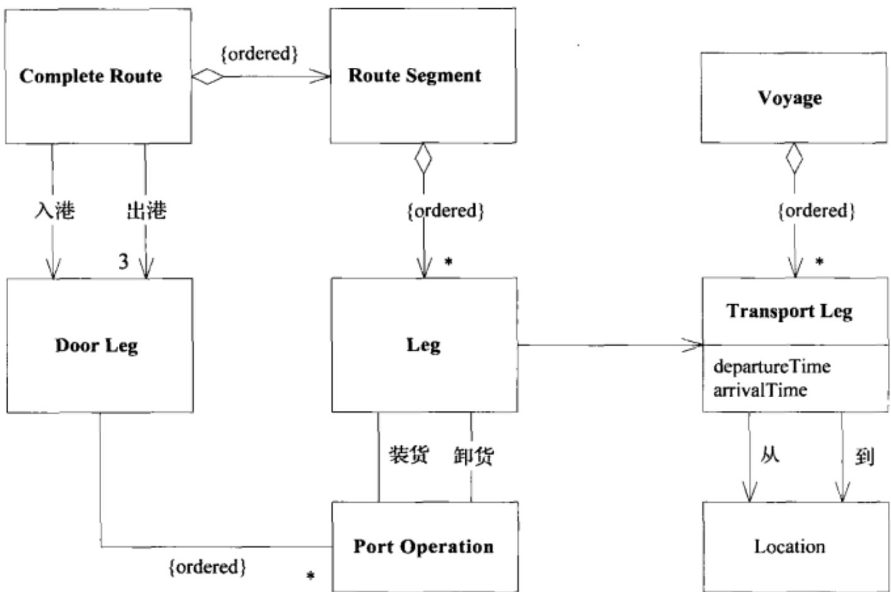


图12-7 详细的Route类图


从结构上看这个模式并不是很差，但在操作计划的处理上失去了一致性，因此代码（甚至是行为的描述）变得复杂得多。其他复杂之处也渐渐显现。任何一条航线的遍历都涉及不同类型对象的多个集合。 

运用COMPOSITE模式能使特定客户在不同层上都使用这种构造进行统一的处理，因为大的航线是由小段的航线构成的。这种视图在概念上也是合理的。每一层Route都是集装箱从一个地点到另一个地点的移动，最后就可以归结为一个独立的航段（参见图12-8）。 

与前面那个类图不同，从现在这个静态类图看不出来门航段是如何与其他航段组合在一起的。但模型并不只包含静态类图。我们将通过其他的图（参见图12-9）和代码（现在代码简单多了）来表示这些航段的组合信息。这个模型抓住了所有这些不同类型的Route的深层关联性。生成操作计划的工作再次变得简单了，而且其他路线遍历操作也变得简单了。 

利用这种“由航线组成航线”的方法，我们可以把各个航线的端点连接到一起来得到从一个地点到另一个地点的航线，从而可以实现各种不同的航线。我们可以把航线的一端截去，再拼接一段新的航线，我们可以有任何细节的嵌套，而且可以充分利用一切可能有用的选项。 

当然，我们现在还不需要这些选择。当不需要这些航线分段和不同的“门航段”时，不使用COMPOSITE模式也能很好地工作。设计模式应该仅仅在需要的时候才使用。 

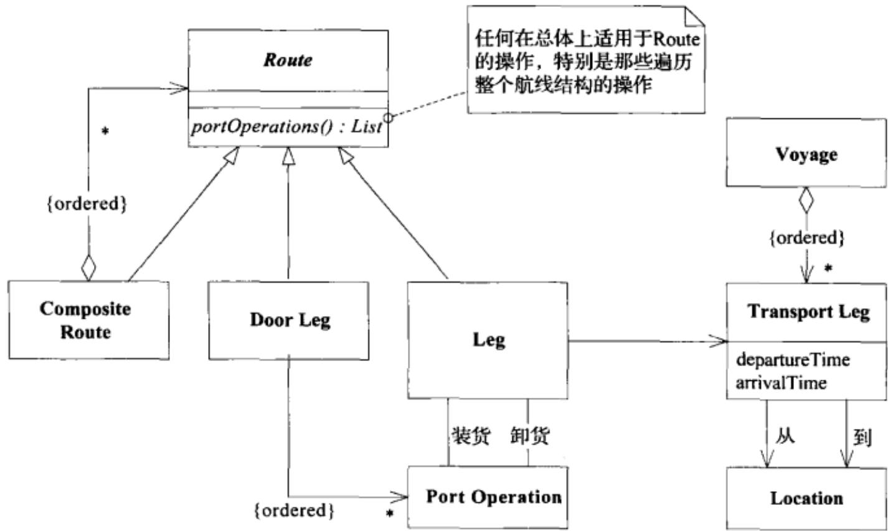


图12-8 使用COMPOSITE之后的类图


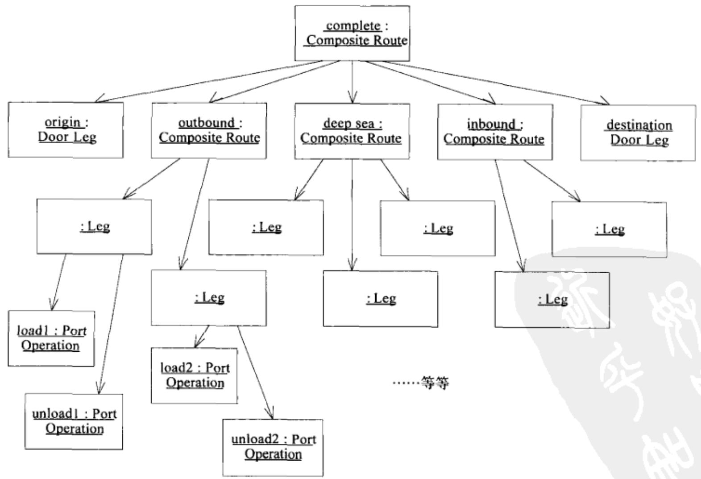


图12-9 表示了一个完整Route的实例


## * * *

## 12.3 为什么没有介绍 FLYWEIGHT

由于第5章中提到过FLYWEIGHT模式，因此你可能认为它是一种适用于领域模型的模式。事实上，FLYWEIGHT虽然是设计模式的一个典型的例子，却并不适用于领域模型。 

当一个VALUE OBJECT集合（其中的值对象数目有限）被多次使用的时候（例如房屋规划中电源插座的例子），那么把它们实现为FLYWEIGHT可能是有意义的。这是一个适用于VALUE OBJECT（但不适用于ENTITY）的实现选择。COMPOSITE模式与它的不同之处在于，组合模式的概念对象是由其他概念对象组成的。这使得组合模式既适用于模型，也适用于实现，这是领域模式的一个基本特征。 

我并不打算把那些可以当作领域模式使用的设计模式完整地列出来。虽然我想不出一个把“解释器”（interpreter）用作领域模式的例子，但我也不能断言解释器不适用于任何一种领域概念。把设计模式用作领域模式的唯一要求是这些模式能够描述关于概念领域的一些事情，而不仅仅是作为解决技术问题的技术解决方案。 


## 通过重构得到更深层的理解

通过重构得到更深层的理解是一个涉及很多方面的过程。我们有必要暂停一下，把一些要点归纳到一起。有三件事情是必须要关注的： 

(1) 以领域为本； 

(2) 用一种不同的方式来看待事物； 

(3) 始终坚持与领域专家对话。 

在寻求领域理解的过程中，可以发现更广泛的重构机会。 

一提到传统意义上的重构，我们头脑中就会出现这样一幅场景：一两位开发人员坐在键盘前面，发现一些代码可以改进，然后立即动手修改代码（当然还要用单元测试来验证结果）。这个过程应该一直进行下去，但它并不是重构过程的全部。 

前面5章内容在传统的微重构方法基础上呈现了一幅全面的重构视图。 

## 13.1 开始重构

重构的原因可能有很多。重构可能是为了解决代码（一段复杂或笨拙的代码）中的一个问题。开发人员可能不会使用标准的代码转换，而会认为问题的根源在于领域模型，或许是领域中缺少一个概念，或许是某个关系发生了错误。 

与传统的重构观点不同的是，即使在代码看上去很整洁的时候也可能需要重构，原因是模型的语言没有与领域专家保持一致，或者新的需求不能被自然地添加到模型中。重构的原因可能是开发人员通过学习获得了更深刻的理解，从而发现了一个得到更清晰或更有用的模型的机会。 

如何找到问题的病灶往往是最难和最不确定的部分。在这之后，开发人员就可以系统地找出新模型的元素。他们可以与同事和领域专家一起进行头脑风暴活动，也可以充分利用那些已经对知识做了系统性总结的分析模式或设计模式。 

## 13.2 探索团队

不管问题的根源是什么,下一步都是要找到一种能够使模型表达变得更清楚和更自然的精化方案。这可能只需要做一些明显的简单修改,只需几小时即可完成。在这种情况下,所做的修改 类似于传统的重构。但寻找新模型可能需要更多时间，而且需要更多人参与工作。 

修改的发起者应该挑选几位开发人员来一起工作，这些开发人员应该擅长思考该类型问题，了解领域，或者掌握深厚的建模技巧。如果涉及一些难捉摸的问题，他们还要请一位领域专家加入。这个由4～5个人组成的小组到会议室或咖啡厅进行头脑风暴活动，时间为半小时至一个半小时。在这个过程中，他们画一些UML草图，并试着用对象来走查场景。他们必须保证领域专家能够理解模型并认为模型有用。当发现了一些新思路后，他们可以立即回去编码，或者决定再多考虑几天，而回去先做点别的事情。几天之后，这个小组再次碰头，重复上面的过程。这时，他们已经对前几天的想法有了更深入的理解，因此更加自信了，并且得出了一些结论。他们回到计算机前，开始对新设计进行编码。 

要想保证这个过程的效率，需要注意几个关键事项。 

□ 自主决定。可以随时组成一个小的团队来研究某个设计问题。这个团队只工作几天，然后就可以解散了。这种团队没有长期存在的必要，也不必有详细的组织结构。 

☐ 注意范围和休息。在几天内召开两三次短会就应该能够产生一个值得尝试的设计。工作拖得太长并没什么好处。如果讨论毫无进展，可能是一次讨论的内容太多了。选一个较小的设计方面，集中讨论它。 

□ 练习使用UBIQUITOUS LANGUAGE。让其他团队成员（特别是主题事务专家）参与头脑风暴会议是练习和精化UBIQUITOUS LANGUAGE的好机会。这样，原来的开发人员可以得到更完善的UBIQUITOUS LANGUAGE，并正式用于编码。 

本书前面几章曾介绍过开发人员和领域专家为了设计更好的模型而进行的几段对话。成熟的头脑风暴活动是灵活机动、不拘泥于形式的，而且具有令人难以置信的高效率。 

## 13.3 借鉴先前的经验

我们没有必要总去做一些无谓的重复工作。用于查找丢失概念或改进模型的头脑风暴过程具有巨大的潜力，通过这个过程可以收集来自各个方面的创意，并把这些创意与已有知识结合起来。随着知识消化的不断开展，就能找到当前问题的答案。 

我们可以从书籍和领域本身的其他知识源获得一些思路。尽管从事领域工作的人员可能还没有创建出适合运行软件的模型，但他们可能已经把概念很好地组织到了一起，并发现了一些有用的抽象。把这些知识结合到知识消化过程中，可以更快速地得到更丰富的结果，而且这个结果也更为领域专家们所熟悉。 

有时我们可以从分析模式中汲取他人的经验。这些经验对于帮助我们读懂领域起到了一定的作用，但分析模式是专门针对软件开发的，因此应该直接根据我们自己在领域中实现软件的经验来利用这些模式。分析模式可以提供精细的模型概念，并帮助我们避免很多错误。但它们并不是现成的“菜谱”。它们只是为知识消化过程提供了一些供给。 

随着零散知识的归纳，必须同时处理模型关注点和设计关注点。同样，这并不意味着总是需要从头开发一切。当设计模式既符合实现需求，又符合模型概念时，通常就可以在领域层中应用这些模式。 

同样，当一种公用的形式（例如算术逻辑或谓词逻辑）与领域的某个部分非常符合时，可以把这个部分提取出来，并根据它来修改形式系统的规则。这可以产生非常简练且易于理解的模型。 

## 13.4 针对开发人员的设计

软件不仅仅是为用户提供的，也是为开发人员提供的。开发人员必须把他们编写的代码与系统的其他部分集成到一起。在迭代过程中，开发人员反复修改代码。开发人员应该通过重构得到更深层的理解，这样既能够实现柔性设计，也能够从这样一个设计中获益。 

柔性设计能够清楚地表明它的意图。这样的设计使人们很容易看出代码的运行效果，因此也很容易预计修改代码的结果。柔性设计能够主要通过减少依赖性和副作用来减轻人们的思考负担。这样的设计是以深层次的领域模型为基础的，在模型中，只有那些对用户最重要的部分才具有较细的粒度。在这样的模型中，那些经常需要修改的地方能够保持很高的灵活性，而其他地方则相对比较简单。 

## 13.5 重构的时机

如果一直等到完全证明了修改的合理性之后才去修改，那么可能要等待太长时间了。项目正在承受巨大的耗支，推迟修改将使修改变得更难执行，因为要修改的代码已经变得更加精细，并更深地嵌入到其他代码中。 

持续重构渐渐被认为是一种“最佳实践”，但大部分项目团队仍然对它抱有很大的戒心。人们虽然看到了修改代码会有风险，还要花费开发时间；却不容易看到的是维持一个拙劣设计也有风险以及迁就这种设计也要付出代价。想要重构的开发人员往往被要求证明其重构的合理性。虽然这看似合理，但这使得一个本来就很难进行的工作变得几乎不可能完成，而且会限制重构的进行（或者人们只能暗地里进行）。软件开发并不是一个可以完全预料到后果的过程，人们无法准确地计算出某个修改会带来哪些好处，或者是不做某个修改会付出多大代价。 

在探索领域的过程中、在培训开发人员的过程中，以及在开发人员与领域专家进行思想交流的过程中，必须始终坚持把“通过重构得到更深层理解”作为这些工作的一部分。因此，当发生以下情况时，就应该进行重构了： 

☐ 设计没有表达出团队对领域的最新理解； 

☐ 一些重要的概念被隐藏在设计中了（而且你已经发现了把它们呈现出来的方法）； 

☐ 发现了一个能令某个重要的设计部分变得更灵活的机会。 

我们虽然应该有这样一种积极的态度，但并不意味着可以随随便便做任何修改。在发布的前一天，就不要进行重构了。不要引入一些只顾炫耀技术能力而没有解决领域核心问题的“柔性设 计”。无论一个“更深层的模型”看起来有多好，如果你不能确信领域专家们能够使用它，那么就不要引入它。万事都不是绝对的，但如果某个重构对我们有利，那么不妨在这个方向上大胆前进。 

## 13.6 危机就是机遇

在达尔文创立进化论后的一个多世纪中，人们一直认为标准的进化模型就是物种随着时间而缓慢地改变（在一定程度上这种改变是稳定的）。突然之间，这个模型在20世纪70年代被“间断平衡”（punctuated equilibrium）模型所取代了。它对原有进化论进行了扩展，认为长期的缓慢变化或稳定变化会被相对来说很短的、爆发性的快速变化所打断。然后事物会进入一个新的平衡。软件开发与物种进化之间的不同点是前者具有明确的目的方向性（虽然在某些项目上可能并不明显），尽管如此它仍遵循这种进化规律。 

传统意义上的重构听起来是一个非常稳定的过程。但通过重构得到更深层理解往往不是一个稳定的过程。对模式进行精化是一个稳定的过程，在这个过程中，你可能突然有所顿悟，而这会改变模型中的一切。这些突破不会每天都发生，然而很大一部分深层模型和柔性设计都来自这些突破。 

这样的情况往往看起来不像是机遇，而更像危机。例如，你突然发现模型中有一些明显的缺陷，在表达方面显示出一个很大的漏洞，或存在一些没有表达清楚的关键区域。或者有些描述是完全错误的。 

这些都表明团队对模型的理解已经达到了一个新的水平。他们现在站在更高的层次上发现了原有模型的弱点。他们可以从这种角度构思一个更好的模型。 

通过重构得到更深层理解是一个持续不断的过程。人们可能会发现一些隐含的概念，并把它们明确地表示出来。有些设计部分变得更具有柔性，或许还采用了声明式的开发风格。开发工作一下子到了突破的边缘，然后开发人员跨越这条界线，得到了一个更深层的模型，接下来又重新开始了稳步的精化过程。 

# 第四部分

# 战略设计

随着系统的增长，它会变得越来越复杂，当我们无法通过分析对象来理解系统的时候，就需要掌握一些操纵和理解大模型的技术了。本书的这一部分将介绍一些原则。遵循这些原则，就可以对一些十分复杂的领域进行建模。大部分这样的决策都需要由团队来制定，甚至需要多个团队共同协商制定。这些决策往往是把设计和策略综合到一起的结果。 

最卓越的企业系统的目标是实现一个把所有业务都包括进来的、紧密集成的系统。然而在几乎所有这种规模的组织中，整体业务模型太大也太复杂了，因此难以管理，甚至很难把它作为一个整体来理解。我们必须在概念和实现上把系统分解为较小的部分。问题是如何在不损害集成利益的前提下完成这种模块化的过程，从而使系统的不同部分能够进行互操作，以便使各种业务操作互相协调。如果设计一个把所有概念都涵盖进来的单一领域模型，它将会非常笨拙，而且将会出现大量难以察觉的重复和矛盾。而如果用一些特定接口把一组小的、各自不同的子系统集成到一起，又会影响解决企业级问题的能力，并且在每个集成点上都有可能出现不一致问题。通过采用一种系统的、不断演变的设计策略，就可以避免这两种极端问题。 

即使在这种规模的系统中采用领域驱动设计方法，也不要脱离实现去开发模型。每个决策都必须对系统开发产生直接的影响，否则它就是无关的决策。战略设计原则必须指导设计决策，以便减少各个部分之间的互相依赖，并提高清晰度，而又不丢失关键的互操作性和协同性。战略设计原则必须把模型的重点放在捕获系统的概念核心，也就是系统的“远景”上。而且在完成这些目标的同时又不能为项目带来麻烦。为了帮助实现这些目标，这一部分探索了三个大的主题：上下文、精炼和大比例结构。 

其中上下文是最不起眼的，但实际上它是一个最基本的主题。无论大小，成功的模型都必须在逻辑上保持整体的一致，不能有互相矛盾或重叠的定义。有时，企业系统会集成一些来自其他来源的子系统，或包含一些完全不同的应用程序，以至于无法从同一个角度来看待领域。要把这些不同部分中隐含的模型统一起来可能是要求过高了。通过为每个模型显式地定义一个 BOUNDED CONTEXT，然后在必要的情况下定义它与其他上下文的关系，建模人员就可以避免使模型变得缠杂不清。 

通过精炼可以减少混乱，并且把注意力集中到正确的地方。人们通常在领域的一些次要问题上花费了太多的精力。整体领域模型必须要突出系统中最有价值和最特殊的那些方面，而且在构造领域模型时应该尽可能把注意力集中在这些部分上。虽然一些支持组件也很关键，但绝不能把它们和领域核心一视同仁。把注意力集中到正确的地方不仅有助于把精力投入到关键部分上，而且还可以使系统不会偏离预期方向。战略精炼可以使一个大的模型保持清晰。有了更清晰的视图后，CORE DOMAIN的设计就会发挥更大的作用。 

大比例结构是用来描述整个系统的。在一个非常复杂的模型中，人们可能会“只见树木，不见森林”。精炼确实有帮助，它使人们能够把注意力集中到核心元素上，并把其他元素表示为支持作用，但如果不沿着一个主题来应用一些系统级的设计元素和模式的话，关系仍然可能非常混乱。我将概要介绍几种大比例结构方法，然后详细讨论其中的一种模式——RESPONSIBILITY LAYER（职责层），通过这个示例来探索使用大比例结构的含义。我们所讨论的特殊结构只是一些例子，它们并不是大比例结构的全部。当需要的时候，应该创造新的结构，或者在一个 EVOLVING ORDER（演变的顺序）过程中修改这些结构。一些大比例结构能够使设计保持一致性，从而加速开发，并提高集成度。 

这三种原则各有各的用处，但结合起来使用将发挥更大的力量，遵守这些原则就可以创建出好的设计，即使是对一个非常庞大的没有人能够完全理解的系统也是如此。大比例结构能够保持各个不同部分之间的一致性，从而有助于这些部分的集成。结构和精炼能够帮助我们理解各个部分之间的复杂关系，同时保持整体视图的清晰。BOUNDED CONTEXT 使我们能够在不同的部分中进行工作，而不会破坏模型或是无意间导致模型的分裂。把这些概念加进团队的 UBIQUITOUS LANGUAGE 中，可以帮助开发人员设计出他们自己的解决方案。 


## 保持模型的完整性

我曾经参加过一个项目，在这个项目中几个团队同时开发一个大型新系统。有一天，当负责“客户发票”模块的团队正要准备实现一个他们称为Charge（收费）的对象时，他们发现另一个团队已经构建了这个对象，于是决定重复使用这个现有对象。他们发现它没有expense code（费用代码）属性，因此添加了一个。对象中有一个posted amount（过账金额）属性是他们所需要的。他们本来计划把这个属性叫做amount due（到期金额），但名称不同有什么关系呢？于是他们把名称改成了“posted amount”。又添加了几个方法和关联后，他们得到了所需的对象，而且没有扰乱任何事情。虽然他们必须忽略掉几个不需要的关联，但他们的模块运行很正常。 

几天之后，“账单支付”模块出现了一些奇怪的问题（Charge对象最初就是为这个模块编写的）。模块中出现了一些奇怪的Charge，没有人记得曾经输入过它们，而且它们也没有任何意义。当使用某些函数时，特别是使用当月月初至今（month-to-date）的税务报表时，程序就会崩溃。调查发现，当用于计算所有当月付款的可扣除总额的函数被调用时，程序就会崩溃。那些来历不明的记录在percent deductible（可扣除百分比）字段中没有值，尽管数据录入应用程序的验证需要这个值，甚至为它设置了一个默认值。 

问题在于这两个团队使用了不同的模型，而他们并没有认识到这一点，也没有用于检测这一问题的过程。每个团队都对Charge对象做了一些假设，使之能够在自己的上下文中使用（一个是向客户收费，另一个是向供应商付款）。当他们的代码被组合到一起而没有消除这些矛盾时，结果就产生了不可靠的软件。 

如果他们一开始就意识到这一点，就能决定如何来解决它。他们可以共同开发出一个公共的模型，然后编写一个自动测试套件来防止以后出现意外。也可以双方商定开发各自的模型，而互相不干扰对方的代码。无论采用哪种方法，都明确划定了边界，各自的模型只在各自的边界内使用。 

他们在知道了问题所在之后采取了什么措施呢？他们创建了两个不同的类：Customer Charge（客户收费）类和Supplier Charge（供应商收费）类。并根据各自的需求定义了每个类。解决了眼前这个问题之后，他们又按以前的方式开始工作了。 

模型的最基本需求是它应该保持内部的一致性、术语总具有相同的意义并且不包含互相矛盾 的规则：尽管我们很少明确地考虑这些需求。模型的内部一致性又叫做“统一”，这样每个术语都不会有模棱两可的意义，也不会有规则冲突。除非模型在逻辑上是一致的，否则它就没有意义。在理想的世界中，我们可以有一种把整个企业领域包含进来的单一模型。这个模型将是统一的，没有任何相互矛盾或相互重叠的术语定义。每个有关领域的逻辑声明都将是一致的。 

但大型系统开发并不是这样理想。在整个企业系统中保持这种水平的统一是一件得不偿失的事情。在系统的各个不同部分中开发多个模型是很有必要的，但我们必须慎重地选择系统的哪些部分可以分开，以及它们之间是什么关系。我们需要用一些方法来保持模型关键部分的高度统一。所有这些都不会自动发生，而且光有良好的意愿也是没用的。它只有通过有意识的设计决策和建立特定过程才能实现。大型系统领域模型的完全统一是不可行的，也不是一种经济有效的做法。 

有时人们会反对这一点。大多数人都看到了多个模型的代价：它们限制了集成，并且使沟通变得很麻烦。更重要的是，多个模型在一定程度上看上去不够雅致。由于人们反对使用多个模型，有时这会导致人们在一个非常大的项目中努力尝试把所有软件统一到一个模型中。我自己就很后悔曾经这么做过了头。但请一定要考虑下面的风险。 

(1) 一次尝试对遗留系统做过多的替换。 

(2) 大项目可能会陷入困境，因为协调的开销太大，超出了这些项目的能力范围。 

(3) 具有一些特殊需求的应用程序可能不得不使用无法充分满足需求的模型，而只能将这些无法满足的行为放到其他地方。 

(4) 另一方面，试图用一个模型来满足所有人的需求可能会导致模型中包含过于复杂的选择，因而很难使用。 

此外，除了技术上的因素以外，权力上的划分和管理级别的不同也要求把模型分开。而且不同模型的出现也可能是团队组织和开发过程导致的结果。因此，即使完全的集成没有来自技术方面的阻力，项目也可能会面临多个模型。 

既然在整个企业中维护统一模型并不可行，就不要再受到这种思路的限制。通过预先决定什么应该统一，并实际认识到什么不能统一，我们就能够创建一个清晰的、共同的视图。确定了这些之后，就可以着手开始工作，以保证那些需要统一的部分保持一致，不需要统一的部分不会引起混乱或破坏模型。 

我们需要用一种方式来标记出不同模型之间的边界和关系。我们需要有意识地选择一种策略，并一致地遵守它。 

本章将介绍一些用于识别、沟通和选择模型边界及关系的技术。本章的讨论首先从画出项目的当前领域开始。BOUNDED CONTEXT (限界上下文) 定义了每个模型的应用范围，而 CONTEXT MAP （上下文图）则给出了项目上下文以及它们之间关系的总体视图。这种清晰的视图能够使项目更好地进行，但仅仅有 CONTEXT MAP 是不够的。一旦有了 BOUNDED CONTEXT 之后，就需要一种持续集成的过程，它能够帮助确保模型的统一。 

稳步推进这些工作之后，我们就可以开始实施更有效的BOUNDED CONTEXT策略了，并明确 它们之间的关系，区分出那些具有共享内核的紧密关联的上下文，以及那些具有独立方式的松散耦合的模型。 

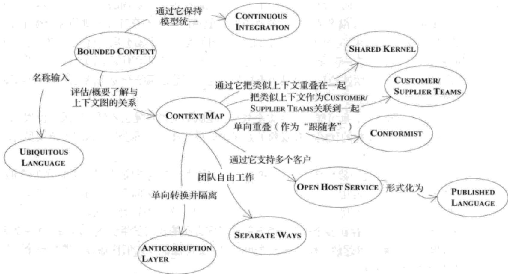


图14-1 模型完整性模式的导航图


## 14.1 模式：BOUNDED CONTEXT


细胞之所以会存在，是因为细胞膜定义了什么在细胞内，什么在细胞外，并且确定了什么物质可以通过细胞膜 

在一个大型项目上会有多个模型共存，在很多情况下这是没问题的。不同的模型应用于不同的上下文。例如，你可能必须将你的新软件与一个外部系统集成，而你的团队对这个外部系统没有控制权。在这种情况下，任何人都会明白这个外部系统是一种完全不同的上下文，不能应用于他们正在开发的模型，但还有很多情况是比较含糊和易混淆的。在本章开篇所讲的那个故事中，两个团队为同一个新系统开发不同的功能。那么他们使用的是同一个模型吗？他们的意图是至少共享模型的一部分，但却没有一种划分方法告诉他们共享什么、不共享什么。而且他们也没有一个过程来维持共享模型，或快速检测模型是否有分歧。他们只是在系统行为突然变得不可预测时才意识到他们之间产生了分歧。 

即使是在同一个团队中，也可能会出现多个模型。团队的沟通可能会不畅，导致对模型的理解产生难以捉摸的冲突。原先的代码往往反映的是早先的模型概念，而这些概念与当前模型有着微妙的差别。 

每个人都知道两个系统的数据格式是不同的，因此需要进行数据转换，但这只是问题的表面。问题的根本在于两个系统所使用的模型不同。当这种差异不是来自外部系统，而是发生在同一个系统的代码中时，它将更难发现。然而，所有大型团队项目都会发生这种情况。 

任何一个大型项目都会存在多个模型。而当基于不同模型的代码被组合到一起后，软件就会出现bug、变得不可靠和难以理解。团队成员之间的沟通变得混乱。人们往往弄不清楚一个模型不应该在哪个上下文中使用。 

模型混乱的问题会在代码不能正常运行时暴露出来,但问题的根源却在于团队的组织方式和成员的交流方法。因此,为了澄清模型的上下文,我们既要注意项目,也要注意它的最终产品(代码、数据库模式等)。 

一个模型只在一个上下文中使用。这个上下文可以是代码的一个特定部分，也可以是某个特定团队的工作。如果模型是在团队的一次头脑风暴会议中得到的，那么这个模型的上下文仅限于那次会议的讨论。就拿本书中的例子来说，示例中所使用的模型的上下文就是那个示例所在的小节以及任何相关的后续讨论。模型上下文是为了保证该模型中的术语具有特定意义而必须要应用的一组条件。 

为了解决多个模型的问题,我们需要明确地定义模型的范围——模型是软件系统中一个有界的部分,一个部分只应用一个模型,并尽可能地保持统一。团队组织中必须一致遵守这个定义。 

因此： 

明确地定义模型所应用的上下文。根据团队的组织、软件系统的各个部分的用法以及物理表现（代码和数据库模式等）来设置模型的边界。在这些边界中严格保持模型的一致性，而不要受到边界之外问题的干扰和混淆。 

BOUNDED CONTEXT明确地限定了模型的应用范围，以便让团队成员对什么应该保持一致以及上下文之间如何关联有一个明确和共同的理解。在CONTEXT中，要保证模型在逻辑上统一，而不用考虑它是不是适用于边界之外的情况。在其他CONTEXT中，会使用其他的模型，这些模型具有 不同的术语、概念、规则和UBIQUITOUS LANGUAGE的技术行话。通过划定明确的边界，可以使模型保持纯粹，因而在它所适用的CONTEXT中更有效。同时，也避免了将注意力切换到其他CONTEXT时引起的混淆。跨边界的集成必然需要进行一些转换，但我们可以清楚地分析这些转换。 

## BOUNDED CONTEXT不是MODULE

有时这两个概念易引起混淆，但它们是具有不同动机的不同模式。确实，当两组对象组成两个不同模型时，人们几乎总是把它们放在不同的MODULE中。这样做的确提供了不同的名称空间（对不同的CONTEXT很重要）和一些划分方法。 

但人们也会在一个模型中用MODULE来组织元素,它们不一定表达了划分CONTEXT的意图。模型在一个BOUNDED CONTEXT内部创建的独立名称空间实际上使人们很难发现意外产生的模型分裂。 

## 示例

## 预订系统的上下文

一家运输公司有一个内部项目，为货物预订开发一个新的应用程序。他们决定采用模型驱动的开发方法——为这个应用程序开发一个对象模型。那么这个模型应用的BOUNDED CONTEXT是什么呢？为了回答这个问题，我们必须看一下项目正在发生什么事情。记住，这里是观察项目的现状，而不是它的理想状态。 

预订应用程序的开发工作由一个项目团队负责。他们不能修改模型对象，但他们所构建的应用程序还必须要显示和操作这些对象。这个团队是模型的使用者。模型在应用程序（模型的主要使用者）中是有效的，因此预订应用程序在应用程序的边界之内。 

已完成的预订必须要传递给原来的货物跟踪系统来处理。新模型与原有系统的模型是不同的，因此原来的货物跟踪系统位于新模型的边界之外。新旧模型之间的必要转换由原有系统的维护团队来负责处理。转换机制不是模型驱动的。它不在BOUNDED CONTEXT中（转换其实是边界本身的一部分，这一点将在CONTEXT MAP中讨论）。转换机制在CONTEXT之外（不基于模型）是一种好的方法。要求原来的团队使用这个模型是不切实际的，因为他们的主要工作都发生在CONTEXT之外。 

每个对象的整个生命周期都由负责模型的团队来处理，包括对象的持久化。由于这个团队也控制着数据库模式，因此他们特意把对象-关系映射设计得简单直接。换言之，数据库模式是由模型驱动的，因此在模型的边界之内。 

作。这会带来风险，因为他们并没有意识到各自正在使用不同的模型。到了集成的时候，就会出现问题，除非他们采取特定的过程来管理这种情况（共享内核可能就是一个很好的选择，本章后面会介绍）。但是，第一步是认清现状。他们不在同一个CONTEXT中，因此应该停止共享代码，直到做出一些改变之后再去共享。 

这个BOUNDED CONTEXT由这个特殊模型所驱动的所有系统方面构成，包括模型对象、用于模型对象持久化的数据库模式以及预订应用程序。在这个CONTEXT中主要有两支团队在工作，一个是建模团队，另一个是应用程序团队。这个系统需要与原来的货物跟踪系统交换信息，原有系统的维护团队主要负责在这个边界上的转换，并且与建模团队进行合作。预订模型和航次安排模型之间没有明确定义的关系，定义这种关系应该是这两个团队的首要任务之一。同时，他们在共享代码或数据方面应该格外谨慎。 

因此，通过定义这个BOUNDED CONTEXT，团队得到了什么？这个CONTEXT中的团队有了更清晰的思路。这两支团队知道他们必须在这个模型中保持一致。他们根据这一点制定设计决策，并注意防范出现不一致的情况。这个CONTEXT之外的团队有了自由。他们不必行走在灰色地带，不必犹豫是不是应该使用同一个模型。但在这个特殊例子中，最实际的收获是他们认识到了在预订模型团队和航次安排团队之间进行非正式共享存在着风险。为了避免问题产生，他们实际上需要在共享的代价和收益之间作出权衡，并采用一些特定过程来确保共享的有效性。要想避免产生这些问题，每个人都必须理解模型上下文的边界在哪里。 

## * * *

当然，边界只不过是一些特殊的位置。各个BOUNDED CONTEXT之间的关系需要我们仔细地处理。CONTEXT MAP画出了上下文的范围，并给出了CONTEXT以及它们之间的连接的总体视图，而几种模式定义了CONTEXT之间的各种关系的性质。CONTINUOUS INTEGRATION的过程可以使模型在一个BOUNDED CONTEXT中保持统一。 

但在讨论所有这些问题之前，想一想当模型的统一性被破坏时，模型会是什么样子呢？我们又该如何识别概念上的不一致呢？ 

## 识别 BOUNDED CONTEXT 中的不一致

很多症状都可能表明模型中出现了差异。最明显的症状是已编码的接口不匹配。一些细微的意外行为也可能是一种信号。采用了自动测试的CONTINUOUS INTEGRATION可以帮助捕捉到这类问题。但语言上的混乱往往是一种早期的警告信号。 

将不同模型的元素组合到一起可能会引发两类问题：重复的概念和假同源。重复的概念是指两个模型元素（以及伴随的实现）实际上表示同一个概念。每当这个概念的信息发生变化时，都必须要更新两个地方。每次由于新的知识导致一个对象被修改时，也必须重新分析和修改另一个 对象。如果不进行实际的重新分析，结果就会出现同一概念的两个版本，它们遵守不同的规则，甚至有不同的数据。更严重的是，团队成员必须学习同一操作的两种方法，以及保持这两种方法同步的各种方式。 

假同源可能稍微少见一点，但它潜在的危害更大。它是指使用相同术语（或已实现的对象）的两个人认为他们是在谈论同一件事情，但实际上并不是这样。本章开头的示例就是一个典型的例子（两个不同的业务活动都叫做Charge）。但是，当两个定义都与同一个领域方面相关，而只是在概念上稍有区别时，这种冲突更难以发现。假同源会导致开发团队互相干扰对方的代码，也可能导致数据库中含有奇怪的矛盾，还会引起团队沟通的混淆。假同源这个术语在自然语言中也经常使用。例如，说英语的人在学习西班牙语时常常会误用embarazada这个词。这个词的意思并不是embarrassed（难堪的），而是pregnant（怀孕的）。很惊讶吧！ 

当发现这些问题时，团队必须要做出相应的决定。可能需要重新对模型进行开发，对开发过程进行精化，以便防止出现不一致的情况。不一致也有可能是由分组造成的，一些小组出于合理的原因，需要以一些不同的方式来开发模型，而且你可能也决定让他们独立开发。本章接下来要讨论的模式的主题就是如何解决这些问题。 

340 

## 14.2 模式：CONTINUOUS INTEGRATION


定义完一个BOUNDED CONTEXT后，必须让它保持合理化。


从而导致了这些概念和行为（不正确的）重复。有时他们意识到了这些概念有其他的表示，但却因为担心破坏现有功能而不敢去改动它们，于是他们继续重复开发这些概念和功能。 

开发一个统一系统（无论规模大小）需要维持很高的沟通水平，而这一点常常很难做到。我们需要通过运用各种方法来增进沟通并减小复杂性。还需要一些安全防护措施，以避免过于谨慎的行为（例如开发人员由于担心破坏现有代码而重复地开发一些功能）。 

极限编程（XP）在这样的环境中真正显示了其特性。很多XP实践都是针对在很多人频繁更改设计的情况下如何维护设计的一致性这个特定问题而出现的。XP是一种非常适合在BOUNDED CONTEXT中维护模型完整性的形式。但是，无论是否使用XP，都很有必要采取一些CONTINUOUS INTEGRATION过程。 

CONTINUOUS INTEGRATION是指把一个上下文中的所有工作足够频繁地合并到一起，并使它们经常保持一致，以便当模型发生分裂时，可以迅速发现并纠正问题。像领域驱动设计中的其他方法一样，CONTINUOUS INTEGRATION也有两个级别的操作：(1) 模型概念的集成；(2) 实现的集成。 

团队成员之间通过经常沟通来保证概念的集成。团队必须对不断变化的模型形成一个共同的理解。有很多方法可以帮助做到这一点，但最基本的方法是对UBIQUITOUS LANGUAGE多加锤炼。同时，实际工件是通过系统性的合并/构建/测试过程来集成的，这样的过程能够尽早暴露出模型的分裂问题。用来集成的过程有很多，大部分有效的方法都具有以下这些特征： 

☐ 分步集成，采用可重复使用的合并/构建技术； 

□ 自动测试套件； 

☐ 有一些规则，用来为那些尚未集成的改动设置一个合理的、稍高的生命期上限。 

有效过程的另一面是概念集成，虽然它很少被正式地纳入进来。 

☐ 在讨论模型和应用程序时要坚持使用UBIQUITOUS LANGUAGE。 

大多数敏捷项目至少每天都要把每位开发人员所做的修改合并进来。这个频率可以根据更改的步伐来调整，只要确保该间隔不会导致大量不兼容工作的产生即可。 

在MODEL-DRIVEN DESIGN中，概念集成为实现集成扫清了道路，而实现集成验证了模型的有效性和一致性，并暴露出模型分裂这个问题。 

因此： 

建立一个经常把所有代码和其他实现工件合并到一起的过程，并通过自动测试来快速查明模型的分裂问题。严格坚持使用UBIQUITOUS LANGUAGE，以便在不同人的头脑中演变出不同的概念时，使所有人对模型都能达成一个共识。 

最后，不要在持续集成中做一些不必要的工作。CONTINUOUS INTEGRATION只有在BOUNDED CONTEXT中才是重要的。相邻CONTEXT中的设计问题（包括转换）不必以同一个步调来处理。 

两个以上的人去完成就可以。它可以维护单一模型的完整性。当多个BOUNDED CONTEXT共存时，我们必须要确定它们的关系，并设计任何必需的接口。 

343 

## 14.3 模式：CONTEXT MAP

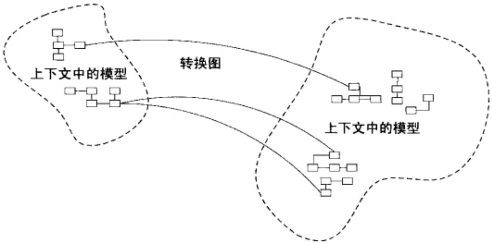


只有一个BOUNDED CONTEXT并不能提供全局视图。其他模型的上下文可能仍不清楚而且还在不断变化。 

## * * *

其他团队中的人员并不是十分清楚CONTEXT的边界，他们会不知不觉地做出一些更改，从而使边界变得模糊或者使互连变得复杂。当不同的上下文必须互相连接时，它们可能会互相重叠。 

BOUNDED CONTEXT之间的代码重用是很危险的，应该避免。功能和数据的集成必须要通过转换去实现。通过定义不同上下文之间的关系，并在项目中创建一个所有模型上下文的全局视图，可以减少混乱。 

CONTEXT MAP位于项目管理和软件设计之间的重叠区域。按照常规，人们往往按团队组织的轮廓来划定边界。紧密协作的人会很自然地共享一个模型上下文。不同团队的人员（或者即使在同一个团队中但从不交流的人）将使用不同的上下文。办公室的物理位置也有影响，例如分别位于大楼两端的团队成员（更不用说在不同城市工作的人了）如果没有特别的整合工作，很有可能会使用不同的上下文。大多数项目经理会本能地意识到这些因素，并围绕着软件模型与设计的子系统大致把各个团队组织起来。但团队组织与软件模型及设计之间的相互关系仍然不够明显。项目经理和团队成员需要对正在进行的软件模型和设计有一个清晰的视图。 


344 

因此： 

识别每个模型在项目中的作用，并定义其BOUNDED CONTEXT。这包括非面向对象子系统的隐含模型。为每个BOUNDED CONTEXT命名，并把名称添加到UBIQUITOUS LANGUAGE中。 

描述模型之间的接触点，明确每次交流所需的转换，并突出任何共享的内容。 

画出现有的范围。为稍后的转换做好准备。 

在每个BOUNDED CONTEXT中，都将有一种一致的UBIQUITOUS LANGUAGE的“方言”。我们需要把BOUNDED CONTEXT的名称添加到UBIQUITOUS LANGUAGE中，这样只要通过明确CONTEXT就可以清楚地讨论任何一种设计部分的模型。 

CONTEXT MAP并不需要写成任何特殊格式的文档。我发现本章中的图在可视化和沟通上下文图方面很有帮助。有些人可能喜欢使用较多的文本描述或别的图形表示。在某些情况下，团队成员之间只需进行一些讨论就足够了。需求不同，细节级别也不同。不管CONTEXT MAP采用什么形式，项目中的每个人都必须共享它，并能够理解它。它必须为每个BOUNDED CONTEXT提供一个明确的名称，而且必须清晰地表示出接触点和它们的本质。 

## * * *

根据设计问题和项目组织问题的不同，BOUNDED CONTEXT之间的关系有很多种形式。本章稍后将介绍CONTEXT之间的各种关系模式，这些模式分别适用于不同的情况，并且提供了一些术语，这些术语可以用来描述你在自己的上下文图中发现的关系。记住，CONTEXT MAP始终表示它所处的情况，你所发现的关系一开始可能并不适合这些模式。如果它们与某种模式非常吻合，你可能想用这个模式名来描述它们，但不要生搬硬套。只需描述你所发现的关系即可。过后，你可以向更加标准化的关系过渡。 

那么，如果你发现模型产生了分裂——模型完全混乱且包含不一致时，你该怎么办呢？这时一定要十分注意，先把描述工作停下来。然后，从精确的全局角度来解决这些混乱点。小的分裂可以修复，并且可以通过实施一些过程来为修复提供支持。如果一个关系很模糊，可以选择一种最接近的模式，然后向此模式靠拢。最重要的任务是画出一个清晰的CONTEXT MAP，而这可能意味着修复实际发现的问题。但不要因为修复必要的问题而重组整个结构。我们只需修改那些明显的矛盾即可，直到得出一个明确的CONTEXT MAP，在这个图中，你的所有工作都被放到某个BOUNDED CONTEXT中，而且所有互连的模型都有明确的关系。 

一旦有了一致的CONTEXT MAP，就会看到需要修改的那些地方。在经过深思熟虑后，你可以修改团队的组织或设计。记住，在更改实际上完成以前，不要先修改CONTEXT MAP。 

## 示例 运输应用程序中的两个CONTEXT

我们再次回到运输系统。应用程序的主要特性之一是在客户预订的时候自动为货物安排路线。模型类似于图14-2。 

Routing Service是一个SERVICE，它把服务的机制封装在一个INTENTION-REVEALING INTERFACE后面，这个接口是由一些SIDE-EFFECT-FREE FUNCTION构成的。这些函数的结果是用ASSERTION刻画的。 

(1) 接口声明了当传入一个Route Specification时，将返回一个Itinerary。 

(2) ASSERTION规定返回的Itinerary将满足所传入的Route Specification。 

从上面这些并不能看出这项困难任务是如何执行的。现在，让我们来看一下幕后的机制。 

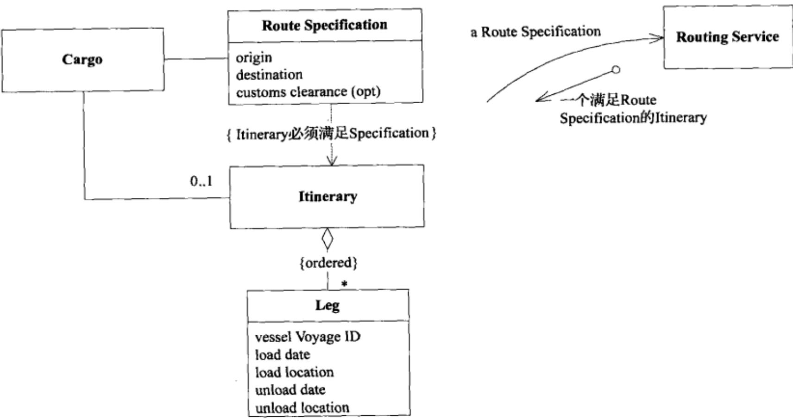


图14-2


最初在这个示例所在的项目中，我在Routing Service的内部机制上太过教条了。我希望把领域模型扩展一下，以便把实际的路线安排操作包括进来，由模型来表示航次，并直接把这些航次与Itinerary中的Leg（航段）关联起来。但负责处理路线问题的团队指出，为了更好地执行路线的安排，并充分利用那些已经建立得很好的算法，应该把这个解决方案实现为一个优化网络，并把航次的每个航段表示为矩阵中的一个元素。他们坚持要用一个完全不同的运输作业模型来实现此目的。 

就当时的设计而言，他们在路线安排过程的计算要求上无疑是正确的，而且我也没有更好的思路，因此我只好同意了。实际上，我们创建了两个独立的BOUNDED CONTEXT，每个上下文都有自己运输作业的概念组织（参见图14-3）。 

我们需要接受一个Routing Service请求，并将它转换为Network Traversal Service可以理解的术语，然后获取结果，并将其转换为Routing Service所期望得到的格式。 

这意味着在这两个模型中并不需要映射出所有事情，而只需能够进行这两个特定的转换即可：
Route Specification→地点代码的List
Node标识的列表→Itinerary 

清关地点（参见图4-14）。 

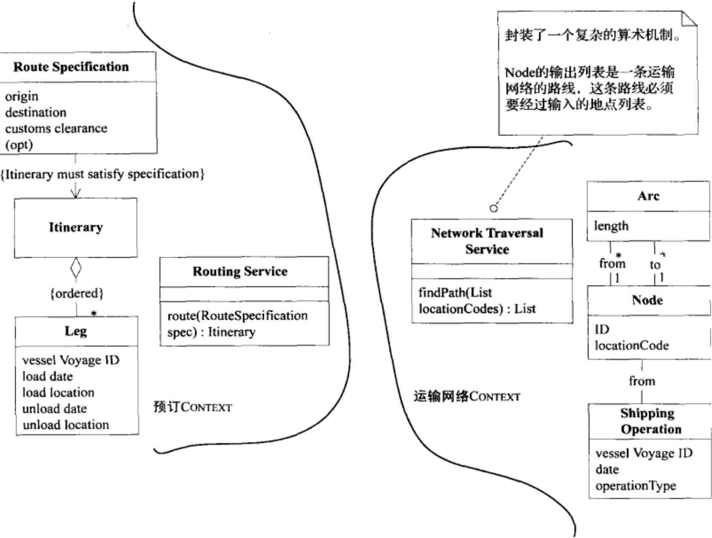


图14-3 同时使用两个BOUNDED CONTEXT，这样就可以应用有效的路线安排算法


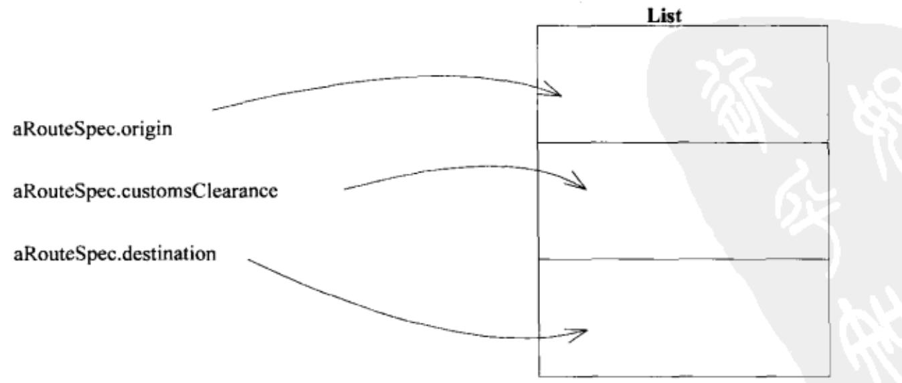


图14-4 对Network Traversal Service的一次查询的转换


(幸运的是，两个团队使用相同的地点代码，因此我们不必处理地点代码之间的转换。) 

注意，反向转换是不明确的，因为网络遍历输入允许任意数目的中间点，而不是只有一个特别指定的清关点。幸运的是，由于我们并不需要反向转换，因此不会产生这个问题，但由此我们很容易看出为什么有些转换是不可能的。 

现在, 我们开始对结果进行转换 (Node标识的List→Itinerary)。假设我们可以根据所得到的Node ID来使用存储库查询Node和Shipping Operation对象。那么, 这些Node是如何映射到Leg上的呢? 根据operationType-Code, 我们可以把Node列表分解为“出发/到达”对。每一对组成一个Leg。 

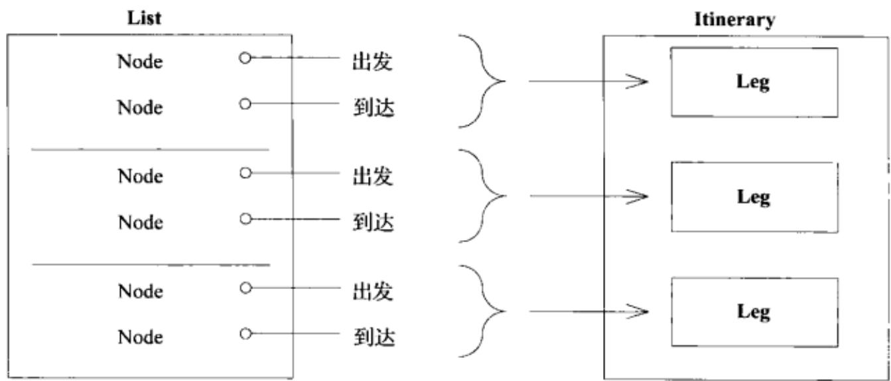


图14-5 对Network Traversal Service所发现的一个路线进行转换


每个Node对的属性按下面这样进行映射： 

```txt
departureNode.shippingOperation.vesselVoyageId → leg.vesselVoyageId
departureNode.shippingOperation.date → leg.loadDate
departureNode.locationCode → leg.loadLocationCode
arrivalNode.shippingOperation.date → leg.unloadDate
arrivalNode.locationCode → leg.unloadLocationCode 
```

这是两个模型之间的概念转换映射。现在，我们必须通过某种方法来实现这些转换。在像这样的简单例子中，我通常先创建一个用于转换的对象，然后找到或创建另一个对象来为子系统的剩余部分提供服务。 

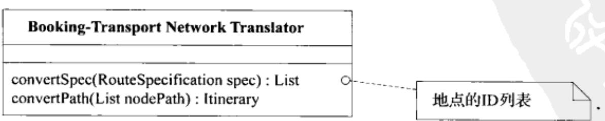


图14-6 双向转换器


这是两个团队必须一起维护的对象。设计应该使单元测试变得容易，因此最好让两个团队协 

作来开发一个测试套件。除此之外，他们可以采用不同的方式各自开发。 

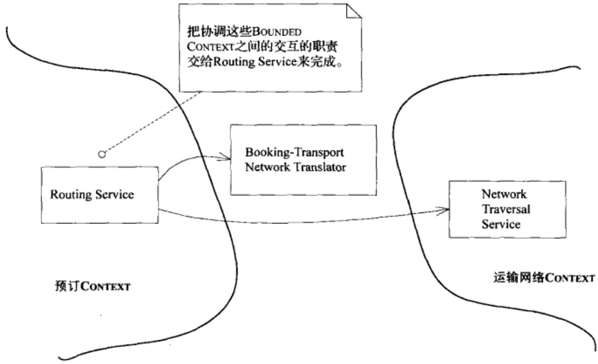


图14-7


把协调这些BOUNDED CONTEXT之间的交互的职责交给Routing Service来完成。 

Routing Service的实现现在变成了把任务委托给Translator和Network Traversal Service。它剩下的操作如下： 

```txt
public Itinerary route(RouteSpecification spec) {
    Booking_TransportNetwork_Translator translator = new Booking_TransportNetwork_Translator();

    List constraintLocations =
    translator.convertConstraints(spec);

    // Get access to the NetworkTraversalService
    List pathNodes =
    traversalService.findPath(constraintLocations);

    Itinerary result = translator.convert(pathNodes);
    return result;
} 
```

这种处理方法不错。BOUNDED CONTEXT使每个模型都保持相对清晰，使团队大部分时间都能独立工作，而且，如果最初的假设是正确的，它们可能会发挥很好的作用（本章后面还会回头讨论这个问题）。 

两个上下文之间的接口非常小。Routing Service的接口把预订上下文中的剩余部分与路线查找事件隔离开。这个接口完全由SIDE-EFFECT-FREE FUNCTION构成，因此很容易测试。与其他CONTEXT和谐共存的一个秘诀是拥有有效的接口测试集。正如里根总统在裁减核武器谈判时所说的名言“信任，但要确认” $^{①}$ 。 

我们很容易设计一组自动测试集来把Route Specification输入到Routing Service中并检查返回的Itinerary。 

模型上下文总是存在的，但如果我们不注意的话，它们可能会发生重叠和变化。通过明确地定义BOUNDED CONTEXT和CONTEXT MAP，团队就可以掌控模型的统一过程，并把不同的模型连接起来。 

## 14.3.1 测试 CONTEXT 的边界

对各个BOUNDED CONTEXT的接触点的测试特别重要。这些测试有助于解决转换时所存在的一些细微问题以及弥补边界沟通上存在的不足。测试充当了有用的早期报警系统，特别是在我们必须信赖那些模型细节却又无法控制它们时，它能让我们感到放心。 

## 14.3.2 CONTEXT MAP 的组织和文档化

这里只有以下两个重点。 

(1) BOUNDED CONTEXT应该有名称，以便可以讨论它们。这些名称应该被添加到团队的UBIQUITOUS LANGUAGE中。 

(2) 每个人都应该知道边界在哪里，而且应该能够分辨出任何代码段的CONTEXT，或任何情况的CONTEXT。 

有很多种方式可以满足第二项需求，这取决于团队的文化。一旦定义了BOUNDED CONTEXT，就很自然地需要把不同上下文的代码隔离到不同的MODULE中，这样就产生了一个问题——如何跟踪哪个MODULE属于哪个CONTEXT。我们可以用命名惯例来表明这一点，或者使用其他简单且不会产生混淆的机制。 

同样重要的是以一种适当的形式来表示出概念边界，使团队中的每个人都能以相同的方式来理解它们。我喜欢用非正式的图来实现这一目的，就像示例中所显示的那些图一样。也可以使用更严格的图或文本列表来显示出每个CONTEXT中的所有包，同时也显示出接触点以及负责连接和转换的机制。有些团队更愿意使用这种方法，而另一些团队通过口头协定和大量的讨论也能很好地实现这一目的。 

无论是哪种情况，如果要把CONTEXT的名称添加到UBIQUITOUS LANGUAGE中，那么讨论 

CONTEXT MAP就是很重要的。不要说“George团队的内容改变了，因此我们也需要改变那些与其进行交互的内容”，而应该说：“Transport Network模型发生了改变，因此我们也需要修改Booking上下文的转换器。” 

## 14.4 BOUNDED CONTEXT 之间的关系

下面介绍的这些模式提供了把两个模型关联起来的各种策略。把模型连接到一起之后，就能够把整个企业系统涵盖在内。这些模式有两个目的，一是为成功地组织开发工作设定目标，二是提供用于描述现有组织的术语。 

现有关系可能与这些模式中的某一种很接近——这可能是由于巧合，也可能是有意设计的——在这种情况下可以使用这个模式的术语来描述关系，但差异之处应该引起重视。然后，随着每次小的设计修改，关系会与所选定的模式越来越接近。 

另一方面，你可能会发现现有关系很混乱或过于复杂。要想得到一个明确的CONTEXT MAP，需要重新组织一些关系。在这种情况或任何需要考虑重组的情况下，这些模式提供了各种不同的选择。这些模式的主要区别包括你对另一个模型的控制程度、两个团队之间合作水平和合作类型以及特性和数据的集成程度。 

下面这些模式涵盖了一些最常见和最重要的情况，它们提供了一些很好的思路，沿着这些思路，我们就可以知道如何处理其他的情况。开发一个紧密集成产品的优秀团队可以部署一个大的、统一的模型。如果团队需要为不同的用户群提供服务，或者团队的协调能力有限，可能就需要采用SHARED KERNEL（共享内核）或CUSTOMER/SUPPLIER（客户/供应商）关系。有时仔细研究需求之后可能发现集成并不重要，而系统最好采用SEPARATE WAY（独立自主）模式。当然，大多数项目都需要与遗留系统或外部系统进行一定程度的集成，这就需要使用OPEN HOST SERVICE（开放主机服务）或ANTICORRUPTION LAYER（防护层）。 

## 14.5 模式：SHARED KERNEL

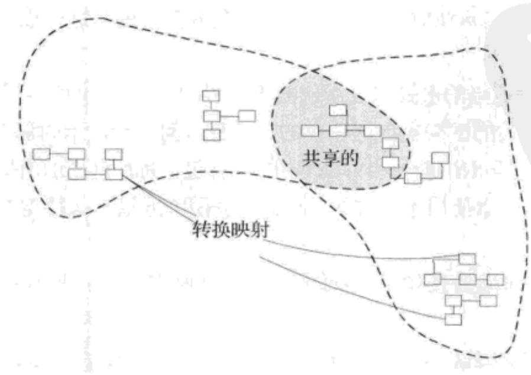


当功能集成很有限时，CONTINUOUS INTEGRATION的开销可能会变得非常高。尤其是当团队的技能水平或行政组织不能保持持续集成，或者只有一个庞大的、笨拙的团队时，更容易发生这种情况。在这种情况下可以定义单独的BOUNDED CONTEXT，并组织多个团队。 

## * * *

当不同团队开发一些紧密相关的应用程序时，如果团队之间不进行协调，即使短时间内能够取得快速进展，他们开发出的产品也可能互相不适合。最后可能不得不在转换层上花费大量时间，而且得到的产品也“五花八门”，不如使用CONTINUOUS INTEGRATION所得到的产品那么一致，同时会浪费大量的重复工作，并且无法实现公共的UBIQUITOUS LANGUAGE所带来的好处。 

在很多项目中，我看到过一些基本上独立工作的团队共享基础设施层。领域工作采用类似的方法也可以很有效。保持整个模型和代码的完全同步这个开销可能太高了，但从系统中仔细挑选出一部分并保持同步，就能以较小的代价获得较大的收益。 

因此： 

从领域模型中选出两个团队都同意共享的一个子集。当然，除了模型的这个子集以外，这还包括与该模型部分相关的代码子集，或数据库设计的子集。这部分明确共享的内容具有特殊的状态，而且一个团队在没与另一个团队商量的情况下不应擅自更改它。 

354 

功能系统要经常进行集成，但集成的频率应该比团队中CONTINUOUS INTEGRATION的频率低一些。在进行这些集成的时候，两个团队都要运行测试。 

这是一个仔细的平衡。SHARED KERNEL（共享内核）不能像其他设计部分那样可以自由更改。在做决定时需要与另一个团队协商。共享内核中必须要集成自动测试套件，因为当修改共享内核时，必须要通过两个团队的所有测试。通常，团队先对共享内核的副本进行修改，然后每隔一段时间与另一个团队的修改进行集成。（例如，在每天（或更短的时间周期）进行CONTINUOUS INTEGRATION的团队中，可以每周进行一次内核的合并。）不管代码集成是怎样安排的，两个团队越早讨论修改，效果就会越好。 

## * * *

SHARED KERNEL通常是CORE DOMAIN，或是一组GENERIC SUBDOMAIN（通用子领域），也可能二者兼有（参见第15章），它可以是两个团队都需要的任何一部分模型。使用SHARED KERNEL的目的是减少重复（但并不能消除重复，因为只有在一个BOUNDED CONTEXT中才能消除重复），并且使两个子系统之间的集成变得相对容易一些。 


355 

## 14.6 模式：CUSTOMER/SUPPLIER DEVELOPMENT TEAM


我们常常会碰到这样的情况：一个子系统的主要任务是服务于另一个子系统，或者执行分析（或其他）功能的“下游”组件向“上游”组件反馈的信息非常少，所有的依赖性都是单向的。两个子系统一般为完全不同的用户群提供服务，这些用户的工作完全不同，在这种情况下使用不同的模型会很有帮助。工具集可能也不相同，因此无法共享程序代码。 

## * * *

上游和下游子系统很自然地分隔到两个BOUNDED CONTEXT中。如果两个组件需要不同的技巧或者是使用不同的工具集实现的，更需要把它们隔离到不同的上下文中。转换很容易，因为只需要进行单向转换。但两个团队的行政组织关系可能会引起问题。 

如果下游团队对变更具有否决权，或请求变更的程序太复杂，那么上游团队的开发自由就会受到限制。由于担心破坏下游系统，上游团队甚至会受到抑制。同时，由于上游团队掌握优先权，下游团队有时也会无能为力。 

下游团队依赖于上游团队，但上游团队却不负责下游团队的产品。要想预计一个团队对另一个团队有什么影响，人员性质会产生什么影响，以及时间压力会产生什么影响等，需要额外付出大量的工作。因此，正式规定团队之间的关系会使所有人工作起来更容易。这样，就可以对开发过程进行组织，均衡地处理两个用户群的需求，并根据下游所需的特性来安排工作。 

在极限编程项目中，已经有了实现此目的的机制——迭代计划过程。我们只需根据计划过程来定义两个团队之间的关系。下游团队的代表类似于用户代表，他们与用户代表一起参加计划会议，直接与他们讨论和权衡所需的任务。结果是供应商团队得到一个包含下游团队最需要的任务的迭代计划，或是通过双方商定推迟一些任务，这样下游团队也就知道这些被推迟的功能不会交付给他们。 

如果使用的不是XP过程，那么无论使用什么类似的方法来平衡不同用户的关注点，都可以对这种方法加以扩充，使之把下游应用程序的需求包括进来。 

因此： 

在两个团队之间建立一种明确的客户/供应商关系。在计划会议中，下游团队相当于上游团队的客户。根据下游团队的需求来协商需要执行的任务并为这些任务做预算，以便每个人都知道双方的约定和进度。 

两个团队一起开发自动验收测试，用来验证预期的接口。把这些测试添加到上游团队的测试套件中，以便作为其持续集成的一部分来运行。这些测试使上游团队在做出修改时不必担心对下游团队产生副作用。 

在迭代期间，下游团队成员应该像传统的客户一样随时回答上游团队的提问，并帮助解决问题。 

自动化验收测试是这种客户关系的一个重要部分。即使在合作得非常好的项目中，虽然客户很明确他们所依赖的功能并告诉上游团队，而且供应商也能很认真地把所做的修改传递给下游团队，但如果没有测试，也会发生一些很意外的事情。这些事情将破坏下游团队的工作，并使上游团队不得不采取计划外的紧急修复措施。因此，客户团队在与供应商团队合作的过程中，应该开发自动验收测试来验证所期望的接口。上游团队将把这些测试作为标准测试套件的一部分来运行。任何一个团队在修改这些测试时都需要与另一个团队沟通，因为修改测试就意味着修改接口。 

357 

在不同公司的项目之间也会出现客户/供应商关系，在某些情况下，客户的需求对供应商的业务来说显得非常重要。下游团队也能制约上游团队，一个有影响力的客户所提出的要求对上游项目的功能非常重要，但这些要求也能破坏上游项目的开发。建立正式的需求响应过程对双方都有利，因为与内部IT关系相比，在这种外部关系中更难做出“成本/效益”的权衡。 

这种模式有两个关键要素。 

(1) 关系必须是客户与供应商的关系，其中客户的需求是至关重要的。由于下游团队并不是唯一的客户，因此不同客户的要求必须通过协商来平衡，但这些要求都是非常重要的。这种关系与经常出现的“穷亲戚”关系相好相反，在后者的关系中，下游团队不得不乞求上游团队满足其需求。 

(2) 必须有一个自动测试套件，使上游团队在修改代码时不必担心破坏下游团队的工作，并使下游团队能够专注于自己的工作，而不用总是密切注意着上游团队的行动。 

在接力赛中，前面的选手在接棒的时候不能一直回头看，这位选手必须相信队友能够把接力棒准确地交到他手中，否则整个团队的速度无疑会慢下来。 

## 示例 收益分析与预订

我们再次回到运输的示例中。项目建立了一支专门的团队，负责分析公司收到的所有预订，以便查看如何实现收益的最大化。团队成员可能发现货轮上还有空位置，并建议接受超订。他们 

358 可能发现货轮过早地装满了散装货物，从而使公司不得不拒绝利润更大的专门货物。在这种情况下，他们可能会建议为这些类型的货物预留出空间，或提高散货的运输价格。 

为了进行这种分析，他们使用了自己的复杂模型。在实现过程中，他们使用了一个带有构建分析模型工具的数据仓库。而且他们需要从预订应用程序中获取大量的信息。 

从一开始就知道，这显然是两个BOUNDED CONTEXT，因为它们使用不同的实现工具，而且最重要的是，它们使用不同的领域模型。那么它们之间应该具有什么样的关系呢？ 

在这种情况下使用SHARED KERNEL看起来很合乎逻辑，因为收益分析只对预订模型的一个子集感兴趣，而且它们自己的模型也有一些重复的货物、价格等概念。但当使用了不同的实现技术时，SHARED KERNEL是很难使用的。此外，收益分析团队需要建立非常专门的模型，他们要不断修改模型，并且尝试其他的模型。他们最好从预订CONTEXT中找到所需的东西，并把它们转换到自己的上下文中。（另一方面，如果他们使用SHARED KERNEL，他们的翻译负担将会轻得多。他们仍然必须重新实现模型，并把数据转换到新的实现中，但如果模型相同的话，转换就简单多了。） 

预订应用程序并不依赖收益分析，因为系统没有自动调整策略。调整决策将由专家来制定，并传递给相关的人员和系统。这样我们就有了一个上游/下游关系。下游的需求如下： 

(1)一些数据（任何预订系统都不需要这些数据）； 

(2) 数据库模式具有一定稳定性（或至少具有可靠的变更通知机制），或者一个用于导出的实用程序。 

幸运的是，预订应用程序开发团队的项目经理非常积极主动地帮助收益分析团队。但这可能会产生一个问题，因为实际负责处理日常预订业务的运营部门和实际执行收益分析的团队并非向同一个副总裁报告工作。但高管层非常关心收益管理，而且过去曾看到过两个部门之间的合作问题，因此调整一下软件开发项目的结构，让两个团队的项目经理向同一个人汇报工作。 

这样，应用CUSTOMER/SUPPLIER DEVELOPMENT TEAM（客户/供应商开发团队）的所有需求都满足了。 

我曾经在很多地方看到过这种场景的发展,其中分析软件开发人员和操作软件开发人员具有客户/供应商关系。当上游团队成员认为他们的角色是服务于客户时,工作会进展得相当顺利。这种关系几乎总是非正式地组织起来的,因此工作顺利与否有赖于两个项目经理的私人关系。 

在一个XP项目中，我曾经看到过正式的客户/供应商关系，在每次迭代中，下游团队的代表都以客户的身份参与到计划的讨论中，他们与更多（应用程序功能的）普通客户代表聚到一起，共同协商哪些任务应该被添加到迭代计划中。这是一家小公司的项目，因此最近一级的共同主管不会处在关系链的很远位置。项目进展得非常顺利。 

## * * *

机会将更大一些，如果两个团队分属不同的公司，但实际上也具有这些角色，同样也会成功。但是，当上游团队不愿意为下游团队提供服务时，情况就会完全不同了。 

## 14.7 模式：CONFORMIST


当两个具有上游/下游关系的团队不归同一个管理者指挥时，CUSTOMER/SUPPLIER TEAM这样的合作模式就不会奏效。勉强应用这种模式会给下游团队带来麻烦。大公司可能会发生这种情况，其中两个团队在管理层次中相隔很远，或者两个团队的共同主管不关心它们之间的关系。当两个团队属于不同公司时，如果客户的业务对供应商不是非常重要，那么也会出现这种情况。或许供应商有很多小客户，或者供应商正在改变市场方向，而不再重视老客户。也可能是供应商的运营状况较差，或者已经倒闭。不管是什么原因，现实情况是下游团队只能靠自己了。 

当两个开发团队具有上/下游关系时，如果上游团队没有动机来满足下游团队的需求，那么下游团队将无能为力。出于利他主义的考虑，上游开发人员可能会做出承诺，但他们可能不会履行承诺。下游团队出于良好的意愿会相信这些承诺，从而根据一些永远不会实现的特性来制定计划。下游项目只能被搁置，直到团队最终学会利用现有条件自力更生为止。下游团队不会得到根据他们的需求而量身定做的接口。 

在这种情况下，有3种可能的解决途径。一种是完全放弃对上游的利用。做出这种选择时，应对现实情况进行评估，它假定上游不会满足下游的需求。有时我们会高估这种依赖性的价值，或是低估它的成本。如果下游团队决定切断这条链，他们将走上SEPARATE WAY（独立自主）的道路（参见本章后面介绍的模式）。 

有时，使用上游软件具有非常大的价值，因此必须保持这种依赖性（或者是行政决策规定团队不能改变这种依赖性）。在这种情况下，有两种途径可供选择，选择哪一种取决于上游设计的 质量和风格。如果上游的设计很难使用（可能是由于缺乏封装、使用了不恰当的抽象或者建模时使用了团队无法使用的范式），那么下游团队仍然必须开发其自己的模型。他们将完全负责开发一个转换层，这个层可能会非常复杂（参见本章后面要介绍的ANTICORRUPTION LAYER）。 

## 跟随并不总是坏事

当使用一个具有很大接口的现成组件时，一般应该CONFORM该组件中隐含的模型。由于组件和你自己的应用程序显然是不同的BOUNDED CONTEXT，因此根据团队组织和控制的不同，可能需要使用适配器来减少格式的修改，但模型一定要保持相同。否则，就应该质疑该组件的价值。如果它确实能够提供价值，那说明它的设计中已经消化吸收了一些知识。在该组件的应用范围内，它可能比你的理解要先进。你的模型大概会扩展该组件的范围，而且你自己的概念将为了适应这些部分而演进。但在连接该组件的地方，你自己的模型将是一个CONFORMIT，遵从该组件模型的领导。实际上，你将被带到一个更好的设计中。 

当你与组件的接口很小时，那么共享一个统一模型就不那么重要了，而且转换也是一个可行的选项。但是，当接口很大而且集成更加重要时，跟随是有意义的。 

另一方面，如果上游设计的质量不是很差，而且风格也能兼容的话，那么最好不要再开发一个独立的模型。这种情况下可以使用CONFORMIST（跟随者）模式。 

因此： 

通过严格遵从上游团队的模型，可以消除在BOUNDED CONTEXT之间进行转换的复杂性。尽管这会限制下游设计人员的风格，而且可能不会得到理想的应用程序模型，但选择CONFORMITY模式可以极大地简化集成。此外，这样还可以与供应商团队共享一种UBIQUITOUS LANGUAGE。供应商处于驾驶者的位置上，因此最好使他们能够容易沟通。他们从利他主义的角度出发，会与你分享信息。 

这个决策会加深你对上游团队的依赖，同时你的应用也受限于上游模型的功能，充其量也只能做一些简单的增强而已。人们在主观上不愿意这样做，因此有时本应该这样选择时，却没有这样选择。 

如果这些折中不可接受，而上游的依赖又必不可少，那么还可以选择第二种方法。通过创建一个ANTICORRUPTION LAYER来尽可能把自己隔离开，这是一种实现转换映射的积极方法，后面将会讨论它。 

## * * *

CONFORMIST模式类似于SHARED KERNEL模式。在这两种模式中，都有一个重叠的区域，在这个重叠区域内两个团队的模型是相同的，你的模型由于叠加而得到扩展，并且不会受到另一个模型的影响。这两种模式之间的区别在于决策制定和开发过程不同。SHARED KERNEL是两个高度协调的团队之间的合作模式，而CONFORMIST模式则是与一个对合作不感兴趣的团队进行集成。 

前面介绍了在两个BOUNDED CONTEXT之间集成时可以进行的各种合作，从高度合作的SHARED KERNEL模式或CUSTOMER/SUPPLIER DEVELOPER TEAM到单方面的CONFORMIST模式。现在，我们最后来看一种更悲观的关系，假设一个团队既不可能与另一个团队合作也无法利用他们的设计时，该如何应对。 

363 

## 14.8 模式：ANTICORRUPTION LAYER


新系统几乎总是需要与遗留系统或其他系统进行集成，这些系统具有其自己的模型。当把设计得很完善的BOUNDED CONTEXT与合作团队的上下文进行连接时，转换层可能很简单，甚至很优雅。但是，当边界那侧发生渗透时，转换层就要承担起更多的防护职责。 

## * * *

当正在构建的新系统与另一个系统的接口很大时，为了克服连接两个模型而带来的困难，新模型所表达的意图可能会被完全改变，最终导致它被修改得像是另一个系统的模型了（以一种特定的风格）。遗留系统的模型通常很弱。即使有一些例外的被开发得很好的模型，它们可能也不会符合当前项目的需要。然而，集成遗留系统仍然具有很大的价值，而且有时还是绝对必要的。 

正确的答案是不要全盘封杀与其他系统的集成。在我经历过的一些项目中，人们非常热衷于替换所有遗留系统，但由于工作量太大，这不可能立即完成。此外，与现有系统集成是一种有价值的重用形式。在大型项目中，一个子系统通常必须与其他独立开发的子系统连接。这些子系统将从不同角度反映问题领域。当基于不同模型的系统被组合到一起时，为了使新系统符合另一个系统的语义，新系统自己的模型可能会被破坏。即使另一个系统被设计得很好，它也不会与客户基于同一个模型。而且其他系统往往并不是设计得很好。 

当通过接口与外部系统连接时，存在很多障碍。例如，基础设施层必须提供与另一个系统进行通信的方法，这个系统可能处于一个不同的平台上，或是使用了不同的协议。你必须把那个系 统的数据类型转换为你自己系统的数据类型。但通常被忽视的一个事实是那个系统肯定不会使用相同的概念领域模型。 

如果从一个系统中取出一些数据，然后在另一个系统中错误地解释了它，那么显然会发生错误，甚至会破坏数据库。但尽管我们已经认识到这一点，这个问题仍然会“偷袭”我们，因为我们认为在系统之间转移的是原始数据，其含义是明确的，并且认为这些数据在两个系统中的含义肯定是相同的。这种假设常常是错误的。数据与每个系统的关联方式会使得它的各个含义出现细微但重要的差别。而且，即使原始数据元素确实具有完全相同的含义，但在原始数据这样低的层次上进行接口操作也通常是错误的。这样的低层接口使另一个系统的模型丧失了解释数据以及约束其值和关系的能力，同时使新系统背负了解释原始数据的负担（而且这些数据与其自己的模型无关）。 

我们需要为使用不同模型的部分提供一种转换机制, 这样模型就不会因为无法理解外来模型的元素而被破坏。 

因此： 

创建一个隔离的层，以便根据客户自己的领域模型来为客户提供相关的功能。这个层通过其现有接口与另一个系统进行对话，而只需对那个系统作出很少的修改，甚至无需修改。在内部，这个层在两个模型之间进行必要的双向转换。 

## * * *

这种连接两个系统的机制可能会使我们想到把数据从一个程序转移到另一个程序，或者从一个服务器迁移到另一个服务器的问题。我们很快就会讨论技术通信机制的使用。但这些细节问题不应与防护层混淆，因为ANTICORRUPTION LAYER（防护层）并不是向另一个系统发送消息的机制。相反，它是在不同的模型和协议之间转换概念对象和操作的机制。 

ANTICORRUPTION LAYER本身就可能是一段复杂的软件。接下来将概要描述在设计防护层时需要考虑的一些事项。 

## 14.8.1 设计 ANTICORRUPTION LAYER 的接口

ANTICORRUPTION LAYER的公共接口通常以一组SERVICE的形式出现，但偶尔也会采用ENTITY的形式。构建一个全新的层来负责两个系统的语义之间的转换为我们提供了一个机会，使我们能够重新对那个系统的行为进行抽象，并按照与我们的模型一致的方式把服务和信息提供给我们的系统。在我们的模型中，把外部系统表示为一个单独的组件可能是没有意义的。最好是使用多个SERVICE（或偶尔使用ENTITY），其中每个SERVICE都为我们的模型履行某种单一的职责。 

## 14.8.2 实现 ANTICORRUPTION LAYER

对ANTICORRUPTION LAYER设计进行组织的一种方法是把它实现为FACADE、ADAPTER（这两 种模式（[Gamma et al. 1995]）和转换器的组合，外加两个系统之间进行对话所需的通信和传输机制。 


我们常常需要与那些大的、复杂的且具有混乱接口的系统进行集成。这不是概念模型差别的问题（概念模型差别是我们使用ANTICORRUPTION LAYER的动机），而是一个实现问题当我们尝试创建ANTICORRUPTION LAYER时，会遇到这个实现问题。当从一个模型转换到另一个模型的时候，如果不能同时处理那些很难与之对话的子系统接口，那么将很难完成转换（特别是当模型很复杂时）。好在FACADE可以解决这个问题。 

FACADE是子系统的一个可供替换的接口，它简化了对客户的访问，并使子系统更易于使用。由于我们对需要使用另一个系统的哪些功能非常清楚，因此可以创建一个FACADE来促进和简化对这些特性的访问，并把其他的特性隐藏起来。FACADE并不改变底层系统的模型。它应该是严格按照那个系统的模型编写的。否则会产生严重的后果：轻则导致转换职责蔓延到多个对象中，并加重FACADE的负担；重则创建出另一个模型，这个模型既不属于那个系统，也不属于你自己的BOUNDED CONTEXT。FACADE应该属于另一个系统的BOUNDED CONTEXT，它只是为了满足你的专门需要而呈现出的一个更友好的外观。 

ADAPTER是一个包装器，它允许客户使用另外一种协议，这种协议可以是行为实现者不理解的协议。当客户向适配器发送一条消息时，ADAPTER把消息转换为一条在语义上等同的消息，并将其发送给“被适配者”（adaptee）。然后ADAPTER对响应消息进行转换，并将其发回。我在这里使用适配器（adapter）这个术语略微有点儿不严谨，因为[Gamma et al. 1995]一书中强调的是使被包装的对象符合客户所期望的标准接口，而我们选择的是被适配的接口，而且被适配者甚至可能不是一个对象。我们强调的是两个模型之间的转换，但我认为这与ADAPTER的意图是一致的。 

我们所定义的每种SERVICE都需要一个支持其接口的ADAPTER，这个适配器还需要知道怎样才能向其他系统或其FACADE发出相应的请求）。 

剩下的要素就是转换器了。ADAPTER的工作是知道如何生成请求。概念对象或数据的实际转换是一种完全不同的复杂任务，我们可以让一个单独的对象来承担这项任务，这样可以使负责转换的对象和ADAPTER都更易于理解。转换器可以是一个轻量级的对象，它可以在需要的时候被实例化。由于它只属于它所服务的ADAPTER，因此不需要有状态，也不需要是分布式的。 

这些都是我用来创建ANTICORRUPTION LAYER的基本元素。此外还有其他一些需要考虑的因素。 

☐ 如图14-8所示，一般是由正在设计的系统（你的子系统）来发起一个动作。但在有些情况下，其他子系统可能需要向你的子系统提交某种请求，或是把某个事件通知给你的子系统。ANTICORRUPTION LAYER可以是双向的，它可能使用具有对称转换的相同转换器来定义两个接口上的SERVICE（它们具有自己的ADAPTER）。尽管实现ANTICORRUPTION LAYER通常不需要对另一个子系统做任何修改，但为了使它能够调用ANTICORRUPTION LAYER的SERVICE，有时还是有必要修改的。 

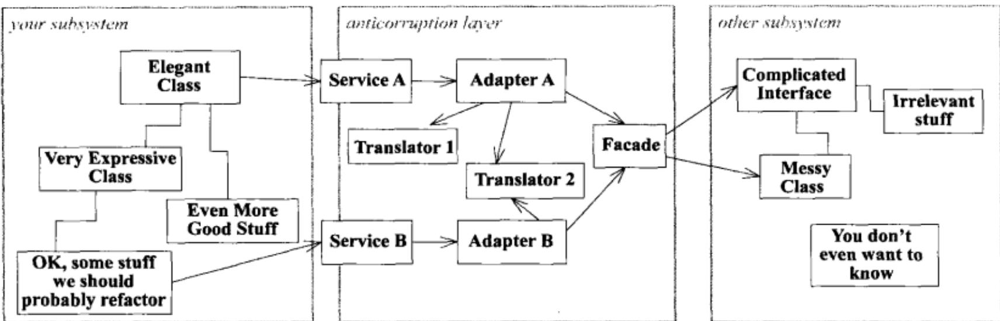


图14-8 ANTICORRUPTION LAYER的结构


☐ 我们通常需要一些通信机制来连接两个子系统，而且它们可能位于不同的服务器上。在这种情况下，必须决定在哪里放置通信链接。如果无法访问另一个子系统，那么可能必须在FACADE和另一个子系统之间设置通信链接。但是，如果FACADE可以直接与另一个子系统集成到一起，那么在适配器和外观之间设置通信链接也不失为一种好的选择，这是因为FACADE的协议比它所封装的内容要简单。在有些情况下，整个ANTICORRUPTION LAYER可以与另一个子系统集成到一起，这时可以在你的系统和构成ANTICORRUPTION LAYER接口的SERVICE之间设置通信链接或分发机制。这些都是需要根据实际情况做出的实现和部署决策。它们与ANTICORRUPTION LAYER的概念角色无关。 

□如果有权访问另一个子系统，你可能会发现对它进行少许的重构会使你的工作变得更容易。特别是应该为那些需要使用的功能编写更显式的接口，如果可能的话，首先从编写自动测试开始。 

☐ 当需要进行广泛的集成时，转换的成本会直线上升。这时需要对正在设计的系统的模型做出一些选择，使之尽量接近外部系统，以便使转换更加容易。做这些工作时要非常小心，不要破坏模型的完整性。当翻译的难度非常大时，可以有选择地进行。如果这种方法看起来是系统的大部分重要问题的最自然的解决方案，那么可以考虑你的子系统采用CONFORMIST模式，从而消除转换。 

☐ 如果另一个子系统很简单或有一个很整洁的接口，可能就不需要FACADE了。 

☐ 如果一个功能是两个系统的关系所需的，就可以把这个功能添加到FACADE中。此外我们还很容易想到两个特性，一是外部系统使用情况的审计跟踪，二是跟踪对另一个接口的调用进行调试的逻辑。 

记住，ANTICORRUPTION LAYER是连接两个BOUNDED CONTEXT的一种方式。我们常常需要使用别人创建的系统，而这些系统是很难完全理解的，而且我们对它们也只有很少的控制。但这并不是我们需要在两个子系统之间使用防护层的唯一情况。如果你自己开发的两个子系统基于不同 的模型，那么使用ANTICORRUPTION LAYER把它们连接起来也是有意义的。在这种情况下，你应该可以完全控制这两个子系统，而且通常可以使用一个简单的转换层。但是，如果这两个BOUNDED CONTEXT采用了SEPARATE WAY模式，而仍然需要进行一定的功能集成，那么可以使用ANTICORRUPTION LAYER来减少它们之间的矛盾。 

## 示例 遗留预订应用程序

为了有一个小的、可以快速开始的最初版本，我们将编写一个最小化的应用程序，它可以建立一次装载（shipment）并通过一个转换层传递给遗留系统进行预订和支持操作。由于我们是专门为了保护正在开发的模型不受遗留设计的影响才来构建转换层的，因此这个转换就是一个ANTICORRUPTION LAYER。 

最初，ANTICORRUPTION LAYER将接收表示装载的对象，对它们进行转换并传递给遗留系统，请求一个预订，然后捕获确认消息并将其转换成新设计的确认对象。这种隔离使我们基本上能够独立于遗留系统来开发新的应用程序，尽管这也必须投入相当多的转换工作。 

在后续的每个版本中，根据后面的决策，新系统要么可以接管遗留系统的更多功能，要么可以在不替换现有功能的情况下增加一些新的功能。由于实现了这种灵活性，我们在构建ANTICORRUPTION LAYER上投入的工作也许是值得的，这使我们能够不间断地操作合并的系统，同时能够实现新老系统的逐步过渡。 

## 14.8.3 一个关于防御的故事

为了保护边境不受周边好战的游牧部落的侵犯，古代的中国修建了长城。虽然它并不是一道不可逾越的屏障，但它却使得与邻近地区的通商变得规范有序，同时也可以抵御侵略和其他不良影响。两千多年来，它定义了一个边界，保护中国的农业文明较少受到外界混乱局面的干扰。 

如果没有长城，中国可能不会形成如此独特的文明，但尽管如此，长城的修建耗资巨大，它至少使一个朝代“破产”，而且也可能导致了它最终灭亡。隔离策略的益处是必须平衡它产生的代价。我们应该从实际出发，对模型做出适度的修改，使之能够更好地适应外部模型。 

任何集成都是有开销的，无论这种集成是单一BOUNDED CONTEXT中的完全CONTINUOUS INTEGRATION，还是集成度较轻的SHARED KERNEL或CUSTOMER/SUPPLIER DEVELOPER TEAM，或是单方面的CONFORMIST模式和防御型的ANTICORRUPTION LAYER模式。集成可能非常有价值，但它的代价也总是十分高昂的。我们应该确保在真正需要的地方进行集成。 

## 14.9 模式：SEPARATE WAY


我们必须严格划定需求的范围。如果两组功能之间的关系并非必不可少，那么二者完全可以彼此独立。 

## * * *

集成总是代价高昂，而有时获益却很小。 

除了在团队之间进行协调所需的常见开销以外，集成还迫使我们做出一些折中。为了处理所有的情况，我们必须使用更加抽象的模型，而不得不放弃可以满足某一特定需求的简单专用模型。或许有些完全不同的技术能够轻而易举地提供某些特性，但它却很难集成。或许某个团队很难合作，使得其他团队在尝试与之合作时找不到行之有效的方法。 

在很多情况下,集成不会提供明显的收益。如果两个功能部分并不需要互相调用对方的功能,或者这两个部分所使用的对象并不需要进行交互,或者在它们操作期间不共享数据,那么集成可能就是没有必要的(尽管可以通过一个转换层进行集成)。仅仅因为特性在用例中相关,并不一定意味着它们必须集成到一起。 

因此： 

声明一个与其他上下文毫无关联的BOUNDED CONTEXT，使开发人员能够在这个小范围内找到简单、专用的解决方案。 

特性仍然可以被组织到中间件或UI层中，但它们将没有共享的逻辑，而且应该把通过转换层进行的数据传输减至绝对的最小，最好是没有数据传输。 

## 示例 一个保险项目的简化

一个项目团队着手开发一个新的保险理赔软件，他们打算把客户服务代理或理赔人所需的一 切功能都集成到一个系统中。经过一年的工作后，团队成员陷入僵局。分析瘫痪 $^{①}$ 再加上巨大的基础设施前期投资使他们在管理上渐渐失去了耐心。更严重的是，工作范围使他们根本无力应对。 

新任项目经理把所有人员集成到一个房间中，让他们一周内制定一个新的计划。他们首先整理出需求列表，然后尝试估计它们的难度和重要性。他们严格地删减那些困难的和不重要的需求。然后，开始为剩下的需求列表排列顺序。这个星期他们在这个房间里制定了很多明智的决策，但最后只有一个被证明是真正重要的。这个时候他们终于认识到有些特性几乎没有从集成得到任何好处。例如，理赔人需要访问一些现有数据库，而且他们目前的访问非常不方便。但是，尽管用户需要得到这些数据，但软件系统的其他特性却没有一个用到它们。 

团队成员提出了各种简单的访问方式。一个提议是，可以把关键报告导出为HTML并放到内部网（intranet）上。另一个提议是，可以为理赔人提供一种专用查询，这种查询是用一个标准软件包编写的。通过在内部网的页面上放置链接，或者在用户桌面上放置按钮，就可以把所有这些功能集成进来。 

团队启动了一组小项目，这些项目除了从同一个菜单启动之外，不再尝试任何集成。几个很有价值的功能几乎在一夜之间就完成了。卸去了这些过多特性的包袱之后，只剩下了一组精炼的需求，这使得主应用程序的交付又有了希望。 

372 

团队本来可以这样进行下去，但遗憾的是，他们又回到了老路，再次陷入困境。最后，只有那些采用SEPARATE WAY模式开发的小应用程序被证明是有用的。 

## * * *

采用SEPARATE WAY（独立自主）模式需要预先决定一些选项。尽管持续重构最后可以撤销任何决策，但完全隔离开发的模型是很难合并的。如果最终仍然需要集成，那么转换层将是必要的，而且可能很复杂。当然，不管怎样，这都是我们将要面对的问题。 

现在，让我们回到更强调合作的关系上，来看一下几种集成度更高的模式。 

## 14.10 模式：OPEN HOST SERVICE

一般来说，在BOUNDED CONTEXT中工作时，我们会为CONTEXT外部的每个组件定义一个转换层，这个转换层是必须要集成的。当集成是一次性的时候，这种为每个外部系统插入转换层的方法可以以最小的代价避免破坏模型。但当子系统要与很多系统集成时，可能就需要更灵活的方法了。 

## * * *

当一个子系统必须与大量其他系统进行集成时，为每个集成都定制一个转换层可能会减慢团 

队的工作速度。需要维护的东西会越来越多，而且进行修改的时候担心的事情也会越来越多。 

团队可能正在反复做着同样的事情。如果一个子系统有某种内聚性，那么或许可以把它描述为一组SERVICE，这组SERVICE满足了其他子系统的公共需求。 

要想设计出一个足够干净的协议，使之能够被多个团队理解和使用，是一件十分困难的事情，因此只有当子系统的资源可以被描述为一个内聚的SERVICE集并且必须进行很多集成的时候，才值得设计这样一种协议。在这些情况下，它能够把维护模式和持续开发区别开。 

因此： 

定义一个协议，把你的子系统作为一组SERVICE供其他系统访问。开放这个协议，以便所有需要与你的子系统集成的人都可以使用它。当有新的集成需求时，就增强并扩展这个协议，但个别团队的特殊需求除外。满足这种特殊需求的方法是使用一次性的转换器来扩充协议，以便使共享协议简单且内聚。 

## * * *

这种通信形式暗含一些共享的模型词汇，它们是SERVICE接口的基础。这样，其他子系统就变成了与OPENHOST（开放主机）的模型相连接，而其他团队则必须学习HOST团队所使用的专用术语。在一些情况下，使用一个众所周知的PUBLISHED LANGUAGE（公开发布的语言）作为交换模型可以减少耦合并简化理解。 

## 14.11 模式：PUBLISHED LANGUAGE

两个BOUNDED CONTEXT之间的模型转换需要一种公共的语言。 

* * * 

当两个领域模型必须共存而且必须交换信息时，转换过程本身就可能很复杂，而且很难文档化和理解。如果正在构建一个新系统，我们一般会认为新模型是最好的，因此只考虑把旧模型转换成新模型就可以了。但有时我们的工作是增强一系列旧系统并尝试集成它们。这时应在两个模型中选一个较好的（但这个模型可能也很混乱），也就是说“两害取其轻”。 

另一种情况是，当不同企业之间需要互相交换信息时，应该如何做？想让一个企业采用另一个企业的领域模型不仅是不现实的，而且可能也不符合双方的需要。领域模型是为了解决其用户的需求而开发的，这样的模型所包含的一些特性可能使得与另一个系统的通信变得复杂，而实际上没有必要这么复杂。此外，如果把一个应用程序的模型用作通信介质，那么它可能就无法为满足新需求而自由地修改了，它必须非常稳定，以便支持当前的通信职责。 

与现有领域模型之间进行直接的转换可能不是一种好的解决方案。这些模型可能过于复杂或设计得较差。它们可能没有被很好地文档化。如果把其中的一个模型作为数据交换语言，它实质上就被固定住了，而无法满足新的开发需求。 

OPEN HOST SERVICE使用一个标准化的协议来支持多方集成。它通过领域的一个模型来让系统之间进行交换，尽管这些系统的内部可能并不使用该模型。这里我们可以更进一步——发布这种语言，或找到一种已经公开发布的语言。我这里所说的发布仅仅是指该语言已经可以供那些对它感兴趣的群体使用，而且已经被充分文档化，兼容一些独立的解释。 

最近，电子商务界出现了一种激动人心的新技术：XML（可扩展标记语言）。这种技术有望使数据交换变得更加容易。XML的一个非常有价值的特性是通过DTD（文档类型定义）或XML来正式定义一个专用的领域语言，从而使得所有数据都可以被转换为这种语言。一些行业组织已经成立，准备为各自的行业定义一种标准的DTD，这样，业内多方就可以交换信息了，例如交换化学公式信息或遗传代码信息。实际上这些组织正在以语言定义的形式创建一种共享的领域模型。 

375 

因此： 

把一个良好文档化的、能够表达出所需领域信息的共享语言作为公共的通信媒介，必要时在其他信息与该语言之间进行转换。 

这种语言不必从头创建。很多年以前，我曾经受聘于一家公司，这家公司有一个用Smalltalk 编写的软件产品，它使用DB2存储数据。公司希望灵活地把软件分发给那些没有DB2许可的用户，于是请我为Btrieve创建一个接口，Btrieve是一个较轻量级的数据库引擎，它有一个免费的运行时分发许可。Btrieve并不完全是关系型的，但我的客户只用到DB2的很小的一部分功能，而且两个数据库都能提供这种能力。公司的开发人员已经对DB2的对象存储方面进行了一些抽象，于是我决定把这些工作作为我的Btrieve组件的接口。 

这种方法确实很有效。软件顺利地与我的客户系统集成到一起。但是，客户设计中缺少有关持久化对象的抽象的正式规格说明或文档，这意味着我必须做很多工作来确定新组件的需求。此外，要想重用该组件把其他应用程序从DB2迁移到Btrieve，机会也不大。而且新软件为公司的持久化模型增添了更多约束，使得持久化对象模型的重构变得更困难。 

更好的方法可能是标识出公司所使用的那一小部分DB2接口，然后为其提供支持就可以了。DB2的接口由SQL和大量专有协议构成。尽管接口很复杂，但它已经被严格指定并充分文档化。由于公司只使用接口的一个很小的子集，因此复杂性有所降低。如果已开发出一个模拟必要的DB2接口子集的组件，那么开发人员所需做的文档化工作只是标识出该子集即可。与之集成的应用程序已经知道如何与DB2对话，因此额外要做的工作很少。将来重新设计持久层的工作仅限于DB2子集的使用，就像前面做的改进一样。 

DB2接口是PUBLISHED LANGUAGE中的一个例子。在这个例子中，两个模型都不属于业务领域，但它们所应用的原则是一致的。由于协作中的一个模型已经是一种PUBLISHED LANGUAGE，因此就不需要引入第三方语言了。 

## 示例 一种化学的PUBLISHED Language

在工业界和学术界，有无数的程序用于分类、分析和处理化学公式。几乎每个程序都使用不 同的领域模型来表示化学结构，因此数据的交换总是很难。当然，大部分程序都是用一些没有充分表达领域模型的语言编写的（例如FORTRAN）。当有人想要共享数据时，他们不得不先了解其他系统的数据库的细节，然后再研究出某种转换方案。 

CML（化学标记语言）正是在这种背景下诞生的，它是作为化学领域的公共交流语言被开发出来的专用XML，由一个代表学术界和化学界的组织负责开发和管理（[Murray-Rust et al. 1995]）。 

化学信息非常复杂和多样化，而且会随着新发现而不断变化。因此，该组件开发了一种用于描述基础知识（例如有机和无机分子的化学公式、蛋白质序列、光谱或物理量）的语言。 

既然这种语言已经公开发布，人们就可以开发相应的工具了（以前，要开发这样的工具是不值得的，因为它们只能用于一种数据库）。例如，人们开发一种名为JUMBO Browser的Java应用程序，它的功能是为那些以CML格式存储的化学结构创建图形视图。因此，如果你的数据采用了CML格式，就可以使用这样的可视化工具。 

事实上，CML通过使用XML（一种已发布的元语言）获得了双重优势。一个优势是人们对XML很熟悉，因此很容易学习CML，另一个优势是由于有大量现成的工具（例如解析器），因此CML的实现很容易，而且有大量书籍介绍了XML的各个方面，这对CML的文档化有很大帮助。 

下面是一个CML的小例子。虽然像我这样的外行并不能清楚地理解它是什么意思，但它的原则还是很清晰的。 

<table><tr><td colspan="8">CML.ARR ID=&quot;array3&quot; EL.TYPE=FLOAT NAME=&quot;ATOMIC ORBITAL ELECTRON POPULATIONS&quot;</td></tr><tr><td colspan="8">SIZE=30 GLO.ENT=CML.THE.AOEPOPS&gt;</td></tr><tr><td>1.17947</td><td>0.95091</td><td>0.97175</td><td>1.00000</td><td>1.17947</td><td>0.95090</td><td>0.97174</td><td>1.00000</td></tr><tr><td>1.17946</td><td>0.98215</td><td>0.94049</td><td>1.00000</td><td>1.17946</td><td>0.95091</td><td>0.97174</td><td>1.00000</td></tr><tr><td>1.17946</td><td>0.95091</td><td>0.97174</td><td>1.00000</td><td>1.17946</td><td>0.98215</td><td>0.94049</td><td>1.00000</td></tr><tr><td>0.89789</td><td>0.89790</td><td>0.89789</td><td>0.89789</td><td>0.89790</td><td>0.89788</td><td></td><td></td></tr><tr><td colspan="8">&lt;/CML.ARR&gt;</td></tr></table>

* * * 

## 14.12 “大象”的统一

六个好学的印度人， 

都通过触摸， 

来满足了解事物的心愿。 

第一个接近大象的盲人， 

恰巧了撞上了大象宽阔结实的身躯， 

马上叫到：“上帝保佑，原来大象就像一堵墙。” 

第三个盲人， 

碰巧把扭动着的象鼻抓在手中， 

因此就大胆地说道： 

“依我看，大象就像一条蛇！” 

就抓住了它摆动着的尾巴，
他说，“我认为大象就像一根绳子！” 

第四个盲人急切地伸出双手， 

摸到了大象的膝盖， 

“这头奇异的怪兽最像什么已经很明显了”，他说， 

“很明显，大象就像一棵树” 

• • • • • • 

第六个盲人一开始摸这头大象， 这六个印度人，  
大声地争论个不停，  
他们每个人的观点，  
都过于僵化和固执，  
尽管他们每人都有正确的地方，但从整体上都是错误的！ 

——摘自John Godfrey Saxe（1816—1887）创作的《盲人与象》， 

来源于印度自说经 $^{①}$ Udana中的故事 378 

即便他们对大象的本质不能达成完全的一致，这些盲人仍然可以根据他们所触摸到的大象身体的部位来扩展各自的认识。如果并不需要集成，那么模型统不统一就无关紧要。如果他们需要进行一些集成，那么实际上并不需要对大象是什么达成一致，而是会通过认识到各种不同意见获得很多价值。这样，他们就不会在不知不觉中各执己见。 

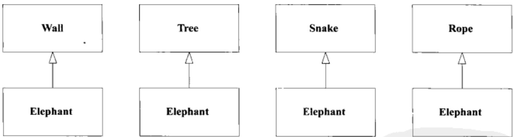


图14-9 4个没有集成的上下文


上图用UML图表示了6个盲人所认识到的大象模型。这张图建立了4个独立的BOUNDED CONTEXT，情况很明显，他们必须找到一种方式来交流他们共同关心的少数几个方面，或许他们共同关心的就是大象所在的位置。 

当盲人想要分享更多有关大象的信息时，他们会从共享单车个BOUNDED CONTEXT得到更大的价值。但统一不同的模型却很难做到。可能没有人愿意放弃自己的模型而采用别人的模型。毕竟，摸到尾巴的那个人知道大象并不像一颗树，而且那个模型对他来说没有意义，也没有用处。统一 

多个模型几乎总是意味着创建一个新模型。 

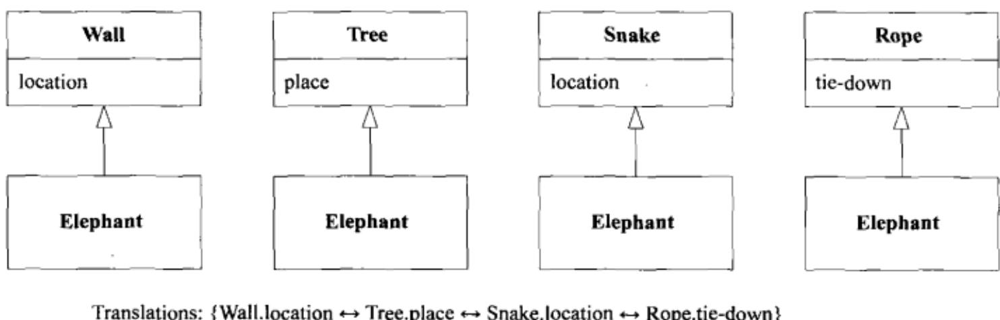


图14-10 4个只有最小集成的上下文


经过一些想象和讨论（也许是激烈的讨论）之后，盲人们最终可能会认识到他们正在对一个更大整体的不同部分进行描述和建模。出于多种目的进行的部分-整体统一可能不需要花费很多工作。至少集成的第一步只需弄清楚各个部分是如何相连的就够了。可以把大象看成一堵墙，下面通过树干支撑着，一头儿是一根绳子，另一头儿是一条蛇，这样看就可以适当地满足一些需求了。 

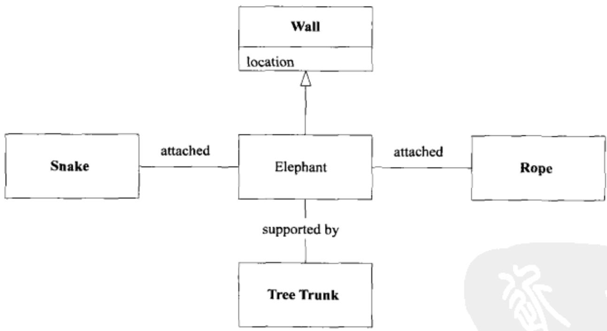


图14-11 一个粗略集成的上下文


大象模型的统一要比大多数这样的合并相对简单一些。遗憾的是，当两个模型纯粹是在描述整体的不同部分时，要想统一它们就不那么简单了，而这还只是“对整体的不同部分进行合并”这种简单的差别。当两个模型以不同方式描述同一部分时，问题会变得更加困难。如果两个盲人都摸到了象鼻子，一个人认为它像蛇，而另一个人认为它像消防水龙，那么他们将更难集成。双方都无法接受对方的模型，因为那不符合自己的体验。事实上，他们需要一个新的抽象，这个抽 象需要把蛇的“活着的特性”与消防水龙的喷水功能合并到一起，而这个抽象还应该排除先前两个模型中的一些不确切的含义，例如人们可能会想到的毒牙，或者可以从身体上拆开并卷起来放到救火车中的这种性质。 

尽管我们已经把部分合并成一个整体，但得到的模型还是很简陋的。它缺乏内聚性，也没有形成一个底层的领域模型。在持续精化的过程中，新的理解可能会产生更深刻的模型。新的应用程序需求也可能会促成产生更深刻的模型。如果大象开始移动了，那么“树”理论就站不住脚了，而盲人建模者们也可能会有所突破，形成“腿”的概念。 

380 

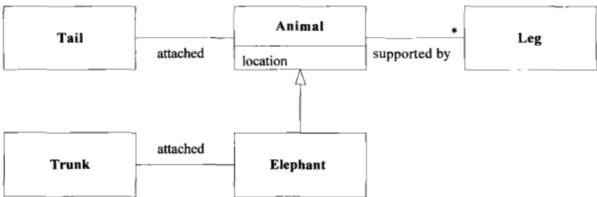


图14-12 一个更深入集成的上下文


模型集成的第二步是去掉各个模型中那些偶然或不正确的方面，并创建新的概念，在本例中，这个概念就是一种“动物”，它长着“鼻子”、“腿”、“身体”和“尾巴”，每个部分都有其自己的属性以及与其他部分的明确关系。在很大程度上，成功的模型应该尽可能做到精简。象鼻中的器官可能比蛇多，也可能比蛇少，但宁“少”勿“多”。宁可缺少喷水功能，也不要包含不正确的毒牙特性。 

如果目标只是找到大象，那么只要对每个模型中所表示的位置进行转换就可以了。当需要更多集成时，第一个版本的统一模型不一定达到完全的成熟。把大象看成一堵墙，下面用树干支撑着，一头儿是一根绳子，另一头儿是一条蛇，就可以适当地满足一些需求了。紧接着，通过新需求和进一步的理解及沟通的推动，模型可以得到加深和精化。 

承认多个互相冲突的领域模型实际上正是面对现实的做法。通过定义每个模型都适用的上下文，可以维护每个模型的完整性，并清楚地看到要在两个模型创建的任何特殊接口的含义。盲人没办法看到整个大象，但只要他们承认各自的理解是不完整的，他们的问题就能得到解决。 

## 14.13 选择你的模型上下文策略

在任何时候，绘制出CONTEXT MAP来反映当前状况都是很重要的。但是，当绘制好CONTEXT MAP之后，你可能又非常想根据实际情况对它进行修改。现在，你可以开始有意识地选择CONTEXT 边界和关系。以下是一些指导原则。 

## 14.13.1 制定团队决策或更高层的决策

首先，团队必须决定在哪里定义BOUNDED CONTEXT，以及它们之间有什么样的关系。这些决策必须由团队做出，或者至少传达给整个团队，并且被团队里的每个人理解。事实上，这样的决策通常需要你自己的团队一致同意。按照本身价值来说，在决定是否扩展或分割BOUNDED CONTEXT时，应该权衡团队独立工作的价值和能产生直接且丰富集成的价值，以这两种价值之间的成本-效益权衡作为决策的依据。在实践中，团队之间的行政关系往往决定了系统是如何集成的。由于组织的上下级结构存在，技术上有利的统一可能无法实现。管理层所要求的合并可能并不实用。你不会总能得到你想要的东西，但你至少可以评估出这些决策的代价，并反映给管理层，以便采取相应的措施来减小代价。从一个现实的CONTEXT MAP开始，并根据实际情况来选择转换。 

## 14.13.2 在上下文中工作

开发软件项目时，我们首先是对自己的团队正在开发的那些部分感兴趣（“正在设计的系统”），其次是对那些与我们交互的系统感兴趣。典型情况下，正在设计的系统将被划分为一个或两个BOUNDED CONTEXT，主要的开发团队将在这些上下文中工作，或许还会有另外一个或两个起支持作用的CONTEXT。此外，这些CONTEXT与外部系统之间还存在一些关系。这是一种你可能会遇到的简单、典型的视图，能让你对它有一些粗略的了解。 

实际上，我们自己也是所工作的主要CONTEXT的一部分，这会在我们的CONTEXT MAP中反映出来。只要我们知道我们存在偏好，并且在超出该CONTEXT MAP的应用边界时能够意识到已越界，那么就不会有什么问题。 

## 14.13.3 转换边界

在画出BOUNDED CONTEXT的边界时，有无数种情况，也有无数种选择。但通常是对下面所列出的各种因素进行权衡。 

首选较大的BOUNDED CONTEXT 

□ 当用一个统一模型来处理更多任务时，用户任务之间的流动更顺畅。 

□一个内聚模型比两个不同模型再加它们之间的映射更容易理解。 

□ 两个模型之间的转换可能会很难（有时甚至是不可能的）。 

□共享语言可以使团队沟通起来更清楚。 

首选较小的BOUNDED CONTEXT 

□ 开发人员之间的沟通开销减少了。 

□ 由于团队和代码规模较小，CONTINUOUS INTEGRATION更容易了。 

☐ 较大的上下文要求更加通用的抽象模型，而掌握所需技巧的人员会出现短缺。 

□ 不同的模型可以满足一些特殊需求，或者是能够把一些特殊用户群的专门术语和 


UBIQUITOUS LANGUAGE的专门术语包括进来。 

在不同BOUNDED CONTEXT之间进行深度功能集成是不切实际的。在一个模型中，只有那些能够严格按照另一个模型来表述的部分才能够进行集成，而且，即便是这种水平的集成可能也需要付出相当大的工作量。当两个系统之间有一个很小的接口时，集成是有意义的。 

## 14.13.4 接受那些我们无法更改的事物：描述外部系统

最好从一些最简单的决策开始。一些子系统显然不在系统的任何BOUNDED CONTEXT中。一些无法立即淘汰的大型遗留系统和那些提供所需服务的外部系统就是这样的例子。我们很容易就能识别出这些系统，并把它们与你的设计隔离开。 

在做出假设时必须要保持谨慎。我们很容易想到这些系统构成了其自己的BOUNDED CONTEXT，但大多数外部系统只能够勉强满足定义。首先，定义BOUNDED CONTEXT的目的是把模型统一在特定边界之内。你可能负责控制遗留系统的维护，在这种情况下，可以明确地声明这一目的，或者也可以很好地协调遗留团队来执行非正式的CONTINUOUS INTEGRATION，但不要认为集成是理所当然的事情。仔细检查，如果开发工作不容易集成，一定要特别小心。在这样的系统中，不同部分之间出现语义矛盾是很平常的事情。 

## 14.13.5 与外部系统的关系

这里可以应用三种模式。首先，可以考虑SEPARATE WAY模式。当然，如果你不需要集成，就不用把它们包括进来。但一定要真正确定不需要集成。只为用户提供对两个系统的简单访问确实够用吗？集成要花费很大代价而且还会分散精力，因此要尽可能为你的项目减轻负担。 

如果集成确实非常重要，可以在两种极端的模式之间选择一种：CONFORMIST模式或ANTICORRUPTION LAYER模式。作为CONFORMIST并不那么有趣，你的创造力和你对新功能的选择都会受到限制。当构建一个大型的新系统时，遵循遗留系统或外部系统的模型可能是不现实的（毕竟，为什么要构建新系统呢？）。但是，当对一个大的系统进行外围扩展时，这个系统仍然是主要系统，在这种情况下，继续使用遗留模型可能就很合适。这种选择的例子包括轻量级的决策支持工具，这些工具通常是用Excel或其他简单工具编写的。如果你的应用程序确实是现有系统的一个扩展，而且与该系统的接口很大，那么CONTEXT之间的转换需要的工作量可能比应用程序功能本身需要的工作量还大。尽管你已经处于那个系统的BOUNDED CONTEXT中，但你自己的一些好的设计仍然有用武之地。如果那个系统的领域模型很容易辨别，则严格地遵照这个老模型，使它比在原来的系统中更清楚，这样做就可以改进你的实现。如果你决定采用CONFORMIST设计，就必须全心全意地去做。你应该约束自己只可以去扩展现有模型，而不能去修改它。 

当正在设计的系统的功能并不仅仅是扩展现有系统时，而且你与另一个系统的接口很小，或者那个系统的设计非常糟糕，那么实际上你会希望使用自己的BOUNDED CONTEXT，这意味着需要 构建一个转换层，甚至是一个ANTICORRUPTION LAYER。 

## 14.13.6 正在设计的系统

你的项目团队正在构建的软件实际上是一个正在设计的系统。你可以在这个区域内声明 BOUNDED CONTEXT，并在每个 BOUNDED CONTEXT 中应用 CONTINUOUS INTEGRATION，以便保持它们的统一。但应该有几个上下文呢？各个上下文之间又应该是什么关系呢？与外部系统的情况相比，这些问题的答案会变得更加不确定，因为我们拥有更多的自由和控制。 

情况很简单：为正在设计中的整个设计使用一个BOUNDED CONTEXT。例如，当一个少于10人的团队正在开发高度相关的功能时，这可能就是一种很好的选择。 

随着团队规模的增大，CONTINUOUS INTEGRATION可能会变得困难起来（尽管我也曾看到过一些较大的团队仍能保持持续集成）。你可能希望采用SHARED KERNEL模式，并把几组相对独立的功能划分到不同的BOUNDED CONTEXT中，使得在每个BOUNDED CONTEXT中工作的人员少于10人。在这些BOUNDED CONTEXT中，如果有两个上下文之间的所有依赖性都是单向的，就可以建成为CUSTOMER/SUPPLIER DEVELOPMENT TEAM。 

你可能认识到两个团队的思想截然不同，以致他们的建模工作总是发生矛盾。可能他们需要从模型得到完全不同的东西，或者只是背景知识有某种不同，又或者是由于项目所采用的管理结构而引起的。如果这种矛盾的原因是你无法改变或不想改变的，那么可以让他们的模型采用SEPARATE WAY模式。在需要集成的地方，两个团队可以共同开发并维护一个转换层，把它作为唯一的CONTINUOUS INTEGRATION点。这与同外部系统的集成正好相反，在外部集成中，一般由ANTICORRUPTION LAYER来起调节作用，而且从另一端得不到太多的支持。 

一般来说，每个BOUNDED CONTEXT都对应一个团队。一个团队可以维护多个BOUNDED CONTEXT，但多个团队在一个上下文中工作却是比较难的（虽然并非不可能）。 

## 14.13.7 满足不同模型的特殊需要

同一业务的不同小组常常有各自的专用术语，而且可能各不相同。这些本地术语可能是非常精确的，并且是根据他们的需要定制的。要想改变它们（例如，施行标准化的企业级术语），需要大量的培训和分析，以便解决差异问题。即使如此，新的术语仍然可能没有原来那个已经经过精心调整的术语好用。 

你可能决定通过不同的BOUNDED CONTEXT来满足这些特殊需要，除了转换层的CONTINUOUS INTEGRATION以外，就可以允许模型采用SEPARATE WAY模式。UBIQUITOUS LANGUAGE的不同专用术语将围绕这些模型以及它们所基于的行话来发展。如果两种专用术语有很多重叠之处，那么SHARED KERNEL模式就可以满足特殊化要求，同时又能把转换成本减至最小。 

当不需要集成或者集成相对有限时，就可以继续使用已经习惯的术语，以免破坏模型。但这也有其自己的代价和风险。如下所示。 

□ 没有共同的语言，交流将会减少。 

□集成开销更高。 

□随着相同业务活动和实体的不同模型的发展，工作会有一定的重复。 

但是，最大的风险或许是在面对更改时不好做出判断，而且可能会为使用一个非常规的、狭隘的模型而辩护。为了满足特殊的需要，需要对系统的这一部分进行多大的定制？最重要的是，这个用户群的专门术语有多大的价值？你必须在团队独立操作的价值与转换的风险之间做出权衡，并且合理地对待一些没有价值的术语变化。 

有时会出现一个深层次的模型，它把这些不同语言统一起来，并能够满足双方的要求。只有经过大量开发工作和知识消化之后，深层次模型才会在生命周期的后期出现。深层次模型不是计划出来的，我们只能在它出现的时候抓住机遇，修改自己的策略并进行重构。 

记住，在需要大量集成的地方，转换成本会大大增加。在团队之间进行一些协调工作（从精确地修改一个具有复杂转换的对象到采用SHARED KERNEL模式）可以使转换变得更加容易，同时又不需要完全的统一。 

## 14.13.8 部署

在复杂系统中,对打包和部署进行协调是一项繁琐的任务,这类任务总是要比看上去难得多。BOUNDED CONTEXT策略的选择将对部署产生影响。例如,当CUSTOMER/SUPPLIER TEAM部署新版本时,他们必须相互协调来发布经过共同测试的版本。在执行这些合并的时候,必须要进行代码和数据迁移。在分布式系统中,一种好的做法是把CONTEXT之间的转换层保持在单个进程中,这样就不会出现多个版本共存的情况。 

当数据迁移可能很花时间或者分布式系统无法同步更新时，即使是单一BOUNDED CONTEXT中的组件部署也是很困难的，这会导致代码和数据中有两个版本共存。 

由于部署环境和技术存在不同，有很多技术因素需要考虑。但BOUNDED CONTEXT关系可以为我们指出重点问题。转换接口已经被标出。 

绘制CONTEXT边界时应该反映出部署计划的可行性。当两个CONTEXT通过一个转换层连接时，其中的一个CONTEXT可能会被更新，这时一个新的转换层可以为另一个CONTEXT提供相同的接口。SHARED KERNEL需要进行更多的协调工作，不仅在开发中如此，而且在部署中也同样应该如此。SEPARATE WAY模式可以使工作简单很多。 

## 14.13.9 权衡

通过总结这些指导原则可知有很多统一或集成模型的策略。一般来说，我们需要在无缝功能集成的益处和额外的协调和沟通工作之间做出权衡。还要在更独立的操作与更顺畅的沟通之间做出权衡。更积极的统一要求对有关子系统的设计有更多控制。 

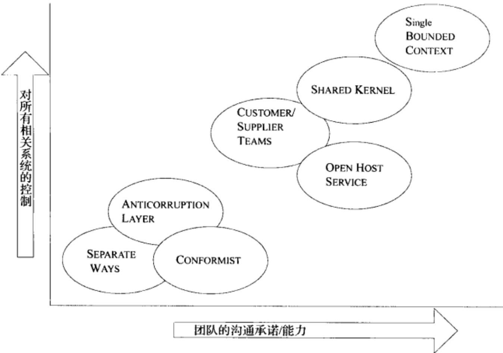


图14-13 CONTEXT关系模式的相对要求


## 14.13.10 当项目正在进行时

很多情况下，我们不是从头开发一个项目，而是会改进一个正在开发的项目。在这种情况下，第一步是根据当前的状况来定义BOUNDED CONTEXT。这是很关键的。为了有效地定义上下文，CONTEXT MAP必须反映出团队的实际工作，而不是反映那个通过遵守以上描述的指导原则而得出的理想组织。 

描述了当前真实的BOUNDED CONTEXT以及它们的关系以后，下一步就是围绕当前组织结构来加强团队的工作。在CONTEXT中改进CONTINUOUS INTEGRATION。把所有分散的转换代码重构到ANTICORRUPTION LAYER中。命名现有的BOUNDED CONTEXT，并确定它们处于项目的UBIQUITOUS LANGUAGE中。 

现在可以开始考虑修改边界和它们的关系了。这些修改很自然地由相同的原则来驱动。前面已经描述了对新项目的一些修改，但我们应该把这些修改分成较小的部分，以便根据实际情况做出选择，从而在只花费最少的工作和对模型产生最小破坏的前提下创造最大的价值。 

下一节将讨论如何修改CONTEXT的边界。 

## 14.14 转换

像建模和设计的其他方面一样，有关BOUNDED CONTEXT的决策并不是不可改变的。在很多 情况下，我们必须改变最初有关边界以及BOUNDED CONTEXT之间关系的决策，这是不可避免的。一般而言，分割CONTEXT是很容易的，但合并它们或改变它们之间的关系却很难。下面将介绍几种有代表性的修改，它们很难，但也很重要。这些转换往往很大，无法在一次重构中完成，甚至无法在一次项目迭代中完成。因为这个原因，我将把这些转换划分为一系列可管理的步骤。当然，这些只是一些指导原则，你必须根据你的特殊情况和事件对它们进行调整。 

## 14.14.1 合并 CONTEXT: SEPARATE WAY → SHARED KERNEL

这种合并的前提是：翻译开销过高、重复现象很明显等等。有很多动机支持合并BOUNDED CONTEXT。而且这种合并很难完成。它并不是过晚，但需要一些耐心。 

即使你的最终目标是完全合并成一个可以采用CONTINUOUS INTEGRATION的CONTEXT，也应该先过渡到SHARED KERNEL。 

(1) 评估初始状况。在开始统一两个 CONTEXT 之前，一定要确信它们确实需要统一。 

(2) 建立合并过程。你需要决定代码的共享方式以及模块应该采用哪种命名约定。SHARED KERNEL 的代码必须至少每周集成一次，而且它必须有一个测试套件。在开发任何共享代码之前，先把它设置好。（测试套件将是空的，因此很容易通过！） 

389 

(3) 选择某个小的子领域作为开始，它应该是在两个CONTEXT中重复出现的子领域，但不是CORE DOMAIN的一部分。这种最初的合并主要是为了建立一个合并过程，因此最好选择一些简单且相对普通或不重要的部分。检查有哪些集成和翻译是已经存在的。选择已有翻译的好处是它们已经得到过验证，此外可以减轻翻译层的负担。 

此时，我们有两个描述相同子领域的模型。基本上有三种合并方法。我们可以选择一个模型，并重构另一个CONTEXT，使之与第一个模型兼容。我们可以从整体上做出这个决策，把目标设置为系统性地替换一个CONTEXT的模型，并保持作为一个单元而被开发的那个模型的内聚性。也可以一次选择一个部分，假定到最后两个模型会“两全其美”（但注意最后不要弄得一团糟）。 

第三种选择是找到一个新模型，这个模型可能比最初的两个都深刻，能够承担二者的职责。 

(4) 从两个团队中一共选出2～4位开发人员组成一个小组，由他们来为子领域开发一个共享的模型。不管模型是如何得出的，它的内容必须详细。这包括一些困难的工作：识别同义词和映射那些尚未被翻译的术语。这个联合团队需要为模型开发一个基本的测试集。 

(5)来自两个团队的开发人员一起负责实现模型（或修改要共享的现有代码）、确定各种细节并使模型开始工作。如果这些开发人员在模型中遇到了问题，就从第(3)步开始重新组织团队，并进行必要的概念修订工作。 

(6) 每个团队的开发人员都承担与新的SHARED KERNEL集成的任务。 

(7) 清除那些不再需要的翻译。 

这时你会有一个非常小的SHARED KERNEL，并且有一个过程来维护它。在后续的项目迭代中，重复第(3)~(7)步来共享更多内容。随着过程的不断巩固和团队信心的树立，就可以选择更复杂 的子领域了，同时处理多个子领域，或者处理CORE DOMAIN中的子领域。 

注意：当从模型中选取更多与领域有关的部分时，可能会遇到这样的情况，即两个模型各自采用了不同用户群的专用术语。聪明的做法是先不要把它们合并到SHARED KERNEL中，除非工作中出现了突破，得到了一个深层次的模型，这个模型为你提供了一种能够替代那两种专用术语的语言。SHARED KERNEL的优点是它具有CONTINUOUS INTEGRATION的部分优势，同时又保留了SEPARATE WAY模式的一些优点。 

以上这些是把模型的一些部分合并到SHARED KERNEL中的指导原则。在继续讨论之前，我们来看一下另外一种能够满足这种转换所提出的一部分要求的方法。如果两个模型中有一个毫无疑问是符合首选条件的，那么就考虑向它过渡，而不用进行集成。不共享公共的子领域，而只是系统性地通过重构应用程序把这些子领域的所有职责从一个BOUNDED CONTEXT转移到另一个BOUNDED CONTEXT，从而使用那个有利的CONTEXT的模型，并按需要对这个模型进行增强。这样就避免了集成开销，也就自然消除了冗余。很有可能（但也不是必然的）那个更有利的BOUNDED CONTEXT最终会完全取代另一个BOUNDED CONTEXT，这样就实现了与合并完全一样的效果。在转换过程中（这个过程可能相当长或不确定），这种方法具有SEPARATE WAY模式常见的优点和缺点，而且我们必须拿这些优缺点与SHARED KERNEL的利弊进行权衡。 

## 14.14.2 合并 CONTEXT: SHARED KERNEL→CONTINUOUS INTEGRATION

如果你的SHARED KERNEL正在扩大，你可能会被完全统一两个BOUNDED CONTEXT的优点所吸引。但这并不只是一个解决模型差异的问题。你将改变团队的结构，而且最终会改变人们所使用的语言。 

这个过程从人员和团队的准备开始。 

(1) 确保每个团队都已经建立了CONTINUOUS INTEGRATION所需的所有过程（共享代码所有权、频繁集成等）。两个团队协商集成步骤，以便所有人都以同一步调工作。 

(2) 团队成员在团队之间流动。这样可以形成一大批同时理解两个模型的人员，并且可以把两个团队的人员联系起来。 

(3) 澄清每个模型的精髓（参见第15章）。 

(4) 现在，团队应该有了足够的信心把核心领域合并到SHARED KERNEL中。这可能需要多次迭代，有时需要在新共享的部分与尚未共享的部分之间使用临时的转换层。一旦进入到合并CORE DOMAIN的过程中，最好能快速完成。这是一个开销高且易出错的阶段，因此应该尽可能缩短时间，要优先于新的开发任务。但注意量力而行，不要超过你的处理能力。 

要合并CORE模型，有几种选择。可以保持一个模型，然后修改另一个，使之与第一个兼容，或者可以为子领域创建一个新模型，并通过修改两个上下文来使用这个模型。如果两个模型已经被修改以满足不同用户的需要，你就要注意了。这种修改有可能把你在两个原始模型中所需要的一些功能给减掉了。这就要求开发一个能够替代两个原始模型的更深层的模型。开发这样一个更 深入的统一模型是很难的，但如果你已经决定完全合并两个CONTEXT，就不再需要选择多种专门术语了。这样做的好处是最终模型和代码的集成变得更清晰了。注意这并不会影响到你满足用户特殊需要的能力。 


(5)随着SHARED KERNEL的增长,把集成频率提高到每天一次,最后实现CONTINUOUS INTEGRATION。 

392 

(6) 当SHARED KERNEL逐渐把先前两个BOUNDED CONTEXT的所有内容都包括进来的时候，你会发现要么形成了一个大的团队，要么形成了两个较小的团队，这两个较小的团队有一个CONTINUOUS INTEGRATION的代码库，从而使得团队成员可以经常在两个团队之间来回流动。 

## 14.14.3 逐步淘汰遗留系统

一个事物再好，也会有一个尽头，遗留计算机软件也不例外。但这种现象并不是光靠这个事物自己发生的。这些老的系统可能与业务及其他系统紧密交织在一起，因此淘汰它们可能需要很多年。好在我们并不需要一次就把所有东西都淘汰掉。 

这一话题的涉及面太广了，这里的讨论也只能浅尝辄止。我们将讨论一种常见的情况：用一系列更现代的系统来补充业务中每天都在使用的老系统，新系统通过一个ANTICORRUPTION LAYER与老系统进行通信。 

首先要执行的步骤是确定一个测试策略。应该为新系统中的新功能编写自动的单元测试，但逐步淘汰遗留系统还需要有一些特殊的测试需求。一些组织在某段时间内会同时运行新系统和老系统。 

在任何一次迭代中： 

(1) 在一次迭代中确定遗留系统的哪个功能可以被添加到某个新系统中； 

(2) 确定需要在ANTICORRUPTION LAYER中添加的功能； 

(3) 实现； 

(4) 部署； 

有时，要编写一个等价于遗留系统中的某个单元的功能，需要进行多次迭代，但在计划新的替代功能时仍以小规模的迭代为单元，最后一次部署多次迭代。 

部署是另一个难点，因为此时代码库包含大量改动。如果这些小的、增量式的改动可以一次完成部署，那么对开发是很有利的，但这一般需要组织成更大的版本。用户培训也是必不可少的。有时在成功部署的同时还必须进行开发工作。还有很多后勤问题需要解决。 

一旦最终进入运行阶段后，应该遵循如下步骤。 

393 

(5) 找出ANTICORRUPTION LAYER中那些不必要的部分，并去掉它们； 

(6) 考虑删除遗留系统中目前未被使用的模块，虽然这种做法未必实用。有趣的是，遗留系统设计得越好，它就越容易被淘汰。而设计得不好的软件却很难一点儿一点儿地去除。我们可以暂时忽略那些未使用的部分，直到将来这些剩余的部分已经被淘汰，这时整个遗留系统就可以停止使用了。 

不断重复这几个步骤。遗留系统应该越来越少地参与业务，直到完全停止使用为止。同时， 随着各种组合增加或减小系统之间的依赖性，ANTICORRUPTION LAYER将相应地收缩或扩张。当然，在其他条件都相同的情况下，应该首先迁移那些只产生较小ANTICORRUPTION LAYER的功能。但其他因素也可能会起主导作用，有时候在过渡期间可能必须经历一些麻烦的转换。 

## 14.14.4 OPEN HOST SERVICE→PUBLISHED LANGUAGE

我们已经通过一系列特定的协议与其他系统进行了集成，但随着需要访问的系统逐渐增多，维护负担也不断增加，或者交互变得很难理解。我们需要通过PUBLISHED LANGUAGE来规范系统之间的关系。 

(1) 如果有一种行业标准语言可用，则尽可能评估并使用它。 

(2) 如果没有标准语言或预先公开发布的语言，则对系统的CORE DOMAIN进行完善，把它作为主机（参见第15章）。 

(3) 使用CORE DOMAIN作为交换语言的基础，尽可能使用像XML这样的标准交互范式。 

(4)（至少）向所有参与协作的各方发布新语言。 

(5) 如果涉及新系统的架构，那么也要发布它。 

(6) 为每个协作系统构建转换层。 

(7) 转换。 

现在，当加入更多协作系统时，对整个系统的破坏已经减至最小了。 

记住，PUBLISHED LANGUAGE必须是稳定的，但是当继续进行重构时，仍然需要能够自由地更改主机的模型。因此，不要把交换语言和主机的模型等同起来。保持它们的密切关系可以减小转换开销，而且你的主机可以采用CONFORMIST模式。但是应该保留用转换层进行补充的权力，当采用转换层有利于成本-效益的折中时，可以把转换层添加进来。 

项目领导者应该根据功能集成需求和开发团队之间的关系来定义BOUNDED CONTEXT。一旦 BOUNDED CONTEXT 和 CONTEXT MAP 被明确地定义下来，就应该保持它们的逻辑一致性。最起码要把相关的通信问题提出来，以便解决它们。 

但是，有时模型上下文（无论是我们有意识地划定边界的还是自然出现的上下文）被错误地用来解决系统中的一些其他问题，而不是逻辑不一致问题。团队可能会发现一个很大的CONTEXT的模型由于过于复杂而无法作为一个整体来理解或透彻地分析。出于有意或无意的考虑，团队往往会把CONTEXT分割为更易管理的部分。这种分割会导致失去很多机会。现在，值得花费一些功夫仔细考查在一个大的CONTEXT中建立一个大模型的决策了。如果从组织结构或行政角度来看保持一个大模型并不现实，如果实际上模型已经分裂，那么就重新绘制上下文图，并定义能够保持的边界。但是，如果保持一个大的BOUNDED CONTEXT能够解决迫切的集成需要，而且除了模型本身的复杂性以外，这看上去是行得通的，那么分割CONTEXT可能就不是最佳的选择了。 

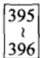


在做出这种牺牲之前，还应该考虑其他一些能够使大模型变得易于管理的方法。下两章将着重讨论通过应用两种更广泛的原则（精炼和大比例结构）来管理大模型的复杂性。 

## 精炼

$$
\nabla \cdot \mathbf {D} = \rho
$$

$$
\nabla \cdot \mathbf {B} = 0
$$

$$
\nabla \times \mathbf {E} = - \frac {\partial \mathbf {B}}{\partial t}
$$

$$
\nabla \times \mathbf {H} = \mathbf {J} + \frac {\partial \mathbf {D}}{\partial t}
$$

—James Clerk Maxwell, A Treatise on Electricity and Magnetism, 1873 

上面这4个方程式，再加上其中的术语定义，以及它们所依赖的数学体系，表达了19世纪经典电磁学的全部内涵 

如何才能专注于核心问题而不被大量的次要问题淹没呢？LAYERED ARCHITECTURE可以把领域概念从技术逻辑中（技术逻辑确保了计算机系统能够运转）分离出来，但在大型系统中，即使领域被分离出来，它的复杂性也可能仍然难以管理。 

精炼是把一堆混杂在一起的组件分开的过程，以便从中提取出最重要的内容，使得它更有价值，也更有用。模型就是知识的精炼。通过每次重构得到更深层的理解，我们把关键的领域知识和优先级提取出来。现在，让我们回过头来从战略角度看一下精炼，本章将介绍对模型进行粗线条划分的各种方式，并把领域模型作为一个整体进行精炼。 

像很多化学蒸馏过程一样，精炼过程（例如GENERIC SUBDOMAIN和COHERENT MECHANISM）所分离出来的副产品本身也很有价值，但精炼的主要动机是把最有价值的那部分提取出来，正是这个部分使我们的软件区别于别的软件，而且由于这个部分的存在才值得我们去构建软件，这个部分就叫做CORE DOMAIN。 

397 

领域模型的战略精炼包括以下部分： 

(1) 帮助所有团队成员掌握系统的总体设计及协调； 

本章将展示一种对CORE DOMAIN进行战略精炼的系统性方法，解释如何在团队中有效地统一认识，并提供一种用于讨论工作的语言。 

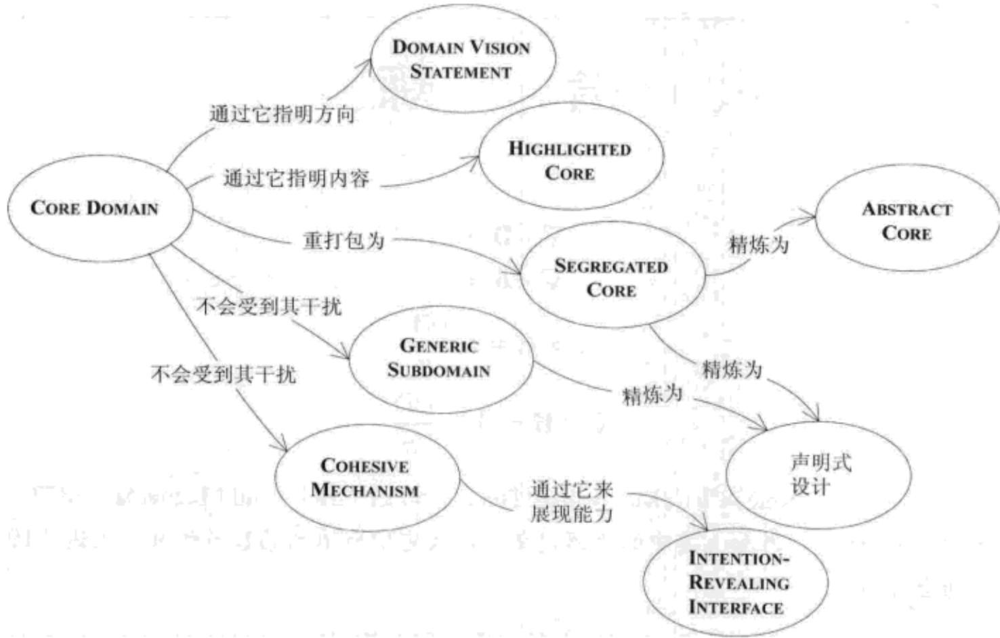


图15-1 战略精炼的导航图


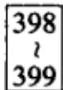


像那些园丁为了让树干快速生长而修剪树苗一样，我们将使用一整套技术把模型中那些细枝末节砍掉，从而把注意力集中在最重要的部分上…… 

## 15.1 模式：CORE DOMAIN


在设计大型系统时，有很多有用的组件，它们都很复杂而且绝对有必要把它们做好，这导致


真正的业务资产——领域模型——被掩盖和忽略了。 

难以理解的系统修改起来会很困难，而且修改的结果也很难预料。开发人员如果脱离自己熟悉的领域，很可能会迷失方向（当团队中有新人加入时尤其如此，但老成员也面临同样的状况，除非代码表达得非常清楚并且组织有序）。这样一来就必须分门别类地为人们安排任务。当开发人员把他们的工作限定到具体的模块时，知识的传递就更少了。这种工作上的划分导致系统很难平滑地集成，也无法灵活地分配工作。如果开发人员没有意识到某项工作已经有人做过了，那么就会出现重复，这样系统就会变得更加复杂。 

以上只是难以理解的设计所导致的一部分后果。当设计中失去了领域的整体视图时，还存在另一个同样严重的风险。 

一个严峻的现实是我们不可能对所有设计部分进行同等的精化，而是必须分出优先级。为了使领域模型成为有价值的资产，必须整齐地梳理出模型的真正核心，并完全根据这个核心来创建应用程序的功能。但本来就稀缺的高水平开发人员往往会把工作重点放在技术基础设施上，或者只是去解决那些不需要专门领域知识就能理解的领域问题（这些问题都已经有了很好的定义）。 

计算机科学家对系统的这些部分更感兴趣,他们认为通过这些工作可以让自己具备一些在其他地方也能派上用场的专业技能,同时也丰富了个人简历。而真正体现应用程序价值并且使之成为业务资产的领域核心却通常是由那些技术水平稍差的开发人员完成的,他们与DBA一起创建数据模式,然后逐个特性编写代码,而根本没有对模型的概念能力加以任何利用。 

如果软件的这个部分实现得很差，那么无论技术基础设施有多好，无论支持功能有多完善，应用程序都永远不会为用户提供真正吸引人的功能。这个严重问题的根源在于项目没有一个明确的整体设计视图，而且也没有认清各个部分的相对重要性。 

我曾经参加过的最成功的项目中，有一个开始时就受到了这种问题的困扰。这个项目的目标是开发一个非常复杂的联合贷款系统。技术能力最强的开发人员在数据库映射层和消息传递接口这些工作上忙得不亦乐乎，而业务模型则交到了那些不熟悉对象技术的新人手中。 

唯一的例外是有一个领域问题是由一位经验丰富的对象开发人员处理的，他为那些长期存在的领域对象设计了一种添加注释的功能。通过把这些注释组织到一起，商家们能够看到他们或其他人过去所做的一些决策的基本思想。这位开发人员还构建了一个优秀的用户界面，它为用户提供了直观的访问，用户可以利用这个界面来灵活地使用组件模型的各种功能。 

这些特性很有用处，而且设计得很好。它们被合并到最终产品中。 

遗憾的是，它们只是一些次要特性。这位能力超群的开发人员把一种有趣的、通用的注释方法建模出来，并干净利落地实现了它，最后交付到用户手中。同时，另一位能力上不太胜任的开发人员却把关键的“贷款”模块弄得一团糟，项目差一点就因此失败。 

401 DOMAIN。CORE DOMAIN是系统中最有价值的部分。 

因此： 

对模型进行提炼。找到CORE DOMAIN并提供一种易于区分的方法把它与那些起辅助作用的模型和代码分开。最有价值和最专业的概念要轮廓分明。尽量压缩CORE DOMAIN。 

让最有才能的人来开发CORE DOMAIN，并相应地招募新人来补充这些人空出来的位置。在CORE DOMAIN中努力开发能够确保实现系统蓝图的深层模型和柔性设计。仔细判断任何其他部分的投入，看它是否能够支持这个提炼出来的CORE。 

提炼CORE DOMAIN并不容易，但做出决策并不难。你需要投入大量的工作使你的CORE与众不同，而其他的设计部分则只需依照常规做得实用即可。如果某个设计部分需要保密以便保持竞争优势，那么它就是你的CORE DOMAIN。其他的部分则没有必要隐藏起来。当必须在两个看起来都很有用的重构之间选择一个时（由于时限的缘故），首先应该选择对CORE DOMAIN影响最大的那个重构。 

## * * *

本章中的模式能够使我们更容易发现、使用和修改CORE DOMAIN。 

## 15.1.1 选择核心

我们需要关注的是那些能够表示业务领域并解决业务问题的模型部分。 

对CORE DOMAIN的选择取决于看问题的角度。例如，很多应用程序需要一个通用的货币模型，用来表示各种货币以及它们的汇率和兑换。另一方面，一个用来支持货币交易的应用程序可能需要更精细的货币模型，这个模型有可能就是CORE的一部分。即使在这种情况下，货币模型中可能有一部分仍是非常通用的。随着对领域理解的不断加深，精炼过程可以持续进行，这需要把通用的货币概念分离出来，而只把模型中那些专有的部分保留在CORE DOMAIN中。 

在运输应用程序中，CORE可能是以下几方面的模型：货物是如何装船运输的，当集装箱转交时责任是如何转接的，或者特定的集装箱是如何经过不同的运输路线最后到达目的地的。在投资银行中，CORE可能包括委托人和参与者之间的合资模型。 

一个应用程序的CORE DOMAIN在另一个应用程序中可能只是通用的支持组件。尽管如此，仍然可以在一个项目中（而且通常在一个公司中）定义一个一致的CORE。像其他设计部分一样，人们对CORE DOMAIN的认识也会随着迭代而发展。开始时特定关系集合的重要性可能并不明显。最初被认为是核心的对象可能逐渐被证明只是起支持作用。 

以下几节（特别是GENERIC SUBDOMAIN这节）将给出制定这些决策的指导。 

## 15.1.2 工作的分配

在项目团队中，技术能力最强的人员往往缺乏丰富的领域知识。这限制了他们的作用，并且 更倾向于分派他们来开发一些支持组件，从而形成了一个恶性循环——知识的缺乏使他们远离了那些能够学到领域知识的工作。 

打破这种恶性循环是很重要的,方法是建立一支由开发人员和一位或多位领域专家组成的联合团队,其中开发人员必须能力很强、能够长期稳定地工作并且对学习领域知识非常感兴趣,而领域专家则要掌握深厚的业务知识。如果你认真对待领域设计,那么它就是一项有趣且充满技术挑战的工作。你肯定也会找到持这种观点的开发人员。 

从外界聘请一些短期的专业人员来设计CORE DOMAIN的关键环节通常是行不通的，因为团队需要积累领域知识，而且短期人员会造成知识流失。相反，充当培训和指导角色的专家可能非常有价值，因为他们帮助团队建立领域设计技巧，并促进团队成员使用先前并未掌握的高级设计原则。 

出于类似的原因，购买CORE DOMAIN也是行不通的。人们已经在建立特定于行业的模型框架方面付出了一些工作，著名的例子就是半导体行业协会SEMATECH创立的用于半导体制造自动化的CIM框架，以及IBM为很多业务开发的San Francisco框架。虽然这是一个有吸引力的想法，但除了PUBLISHED LANGUAGE（参见第14章）能够促进数据交换以外，其他的结果并不理想。Domain-Specific Application Frameworks（[Fayad and Johnson 2000]）一书介绍了这项工作的总体现状。随着这个领域的进步，可能会出现一些更有用的框架。 

除了上述原因之外，还有一个更根本的原因需要引起我们的注意。自主开发的软件的最大价值来自于对CORE DOMAIN的完全控制。一个设计良好的框架可能会提供满足你的专门使用需求的高水平抽象，它可以节省开发那些更通用部分的时间，并使你能够专注于CORE。但是，如果它对你的约束超出了这个限度，可能有以下三种原因。 

(1)你正在失去一项重要的软件资产。此时应该让这些限制性的框架退出你的CORE DOMAIN。 

(2) 框架所处理的部分并不是你所认为的核心。此时应该重新划定CORE DOMAIN的边界，把你的模型中真正的标志性部分识别出来。 

(3) 你的CORE DOMAIN并没有特殊的需求。此时应该考虑采用一种风险更低的解决方案，例如购买软件并与你的应用程序进行集成。 

不管是哪种情况，创建与众不同的软件还是会回到原来的轨道上——需要一支稳定工作的团队，他们不断积累和消化专业知识，并将这些知识转化为一个丰富的模型。没有捷径，也没有魔术弹。 

## 15.2 精炼的逐步提升

本章接下来将要介绍各种精炼技术，它们在使用顺序上基本没什么要求，但对设计的改动却大不相同。 

一份简单的DOMAIN VISION STATEMENT（领域前景说明）只需很少的投入，它传达了基本概念以及它们的价值。HIGHLIGHTED CORE（突出的核心）可以改善沟通，并指导决策制定过程，这 

也只需对设计进行很少的改动甚至无需改动。 

更积极的精炼方法是通过重构和重新打包显式地分离出GENERIC SUBDOMAIN，然后分别进行处理。在使用COHESIVE MECHANISM的同时，也要保持设计的通用性、易懂性和柔性，这两个方面可以结合起来。只有除去了这些细枝末节，才能把CORE剥离出来。 

重新打包出一个SEGREGATED CORE（隔离的核心），可以使得这个CORE清晰可见（即使在代码中也是如此），并且可以促进将来在CORE模型上的工作。 

最积极的精炼技术是ABSTRACT CORE（抽象内核），它用抽象的形式表示了最基本的概念和关系（需要对模型进行全面的重新组织和重构）。 

每种技术都需要我们连续不断地投入越来越多的工作，但刀磨得越薄，就会越锋利。领域模型的连续精炼将为我们创造一项资产，使项目进行得更快、更敏捷、更精确。 

首先，我们可以把模型中最普通的那些部分分离出去，它们就是GENERIC SUBDOMAIN（通用子领域）。GENERIC SUBDOMAIN与CORE DOMAIN形成鲜明的对比，使我们可以更清楚地理解它们各自的含义。 

## 15.3 模式：GENERIC SUBDOMAIN

模型中有些部分除了增加复杂性以外并没有捕捉或传递任何专门的知识。任何外来因素都会使CORE DOMAIN更难以分辨和理解。模型中包含大量众所周知的一般原则，或者是专门的细节，这些细节并不是我们的主要关注点，而只是起到支持作用。然而，无论它们是多么通用的元素，它们对实现系统功能和充分表达模型都是极为重要的。 

你可能会认为模型中理所当然地应该包含这些部分。不可否认，它们确实是领域模型的一部分，但它们抽象出来的概念是很多业务都需要的。比如，各个行业（例如运输业、银行业或制造业）都需要某种形式的企业组织图。再比如，很多应用程序都需要跟踪应收账款、开支分类账和其他财务数据，而这些都可以用一个通用的会计模型来处理。 

对领域的周边问题进行处理往往要耗费人们大量的精力。我亲眼目睹过两个不同项目都分派了最好的开发人员来重新设计带有时区的日期和时间功能，这些工作耗费了他们数周的时间。虽然这样的组件必须正常工作，但它们并不是系统的概念核心。 

即使这样的通用模型元素确实非常重要,整体领域模型仍然需要把系统中最有价值和最特别的方面突出出来,而且整个模型的组织应该尽可能把重点放在这个部分上。当核心与所有相关的因素混杂在一起时,这一点会更难做到。 

因此： 

把内聚的子领域（它们不是项目的动机）识别出来。把这些子领域的通用模型提取出来，并放到单独的MODULE中。任何专有的东西都不应放在这些模块中。 

把它们分离出来以后，在继续开发的过程中，它们的优先级应低于CORE DOMAIN的优先级，并且不要分派核心开发人员来完成这些任务（因为他们很少能够从这些任务中获得领域知识）。此外，还可以考虑为这些GENERIC SUBDOMAIN使用现成的解决方案或“公开发布的模型” 

(PUBLISHED MODEL)。 

406 

## * * *

当开发这样的软件包时，有以下几种选择。 

## 选择1：现成的解决方案

有时可以购买一个已实现好的解决方案，或使用开源代码。 

优点 

□ 可以减少代码的开发。 

□ 维护负担转移到了外部。 

☐ 代码已经在很多地方使用过，可能较为成熟，因此比自己开发的代码更可靠和完备。 

## 缺点

☐ 在使用之前，仍需要花时间来评估和理解它。 

□就业内目前的质量控制水平而言，无法保证它的正确性和稳定性。 

☐ 它可能设计得过于细致了（远远超出了你的目的），集成的工作量可能比开发一个最小化的内部实现更大。 

□外部元素的集成常常不顺利。它可能有一个与你的项目完全不同的BOUNDED CONTEXT。即使不是这样，它也很难顺利地引用你的其他软件包中的ENTITY。 

☐ 它可能会引入对平台、编译器版本的依赖，等等。 

现成的子领域解决方案是值得我们去考虑的，但如果它们会带来很多麻烦，那么就不值得使用了。我曾经看到过一些成功案例——一些应用程序需要非常精细的工作流，它们通过API挂钩（API hook）成功地使用了商用的外部工作流系统。我还曾经见过错误日志被深入地集成到应用程序中。有时，GENERIC SUBDOMAIN被打包为框架的形式，它实现了非常抽象的模型，从而可以与你的应用程序集成来满足你的特殊需求。子组件越通用，其自己的模型的精炼程度越高，它的用处可能就越大。 

407 

## 选择2：公开发布的设计或模型

优点 

□ 比自己开发的模型更为成熟，并且反映了很多人的深层知识。 

□ 提供了随时可用的高质量文档。 

缺点 

□ 可能不是很符合你的需要，或者设计得过于细致了（远远超出了你的需要）。 

Tom Lehrer（20世纪50和60年代的喜剧作曲家）曾经讲过数学上的成功秘诀是：“抄袭！抄袭。不要让任何人的工作逃过你的眼睛……但一定要把这叫做研究。”在领域建模中，特别是在攻克GENERIC SUBDOMAIN时，这是一条好的建议。 

当有一个被广泛使用的模型时，例如《分析模式》（[Fowler 1996]）一书中所列举的那些模 

型（参见第11章），这种方法最为有效。 

如果领域中已经有了一种非常正式且严格的模型，那么就能使用它。会计和物理学是我们立即能想到的两个例子。这些模型不仅健壮和流畅，而且被人们广泛理解，因此可以减轻目前和将来的培训负担（参见10.9.2节）。 

如果在一个公开发布的模式中能够发现一个简化的子集，它本身是一致的而且能够满足你的要求，那么就不要强迫自己完全重新实现这样一个模型。如果有一个模型已经有人很好地研究过了，并且提供了完备的文档（有正式的模型就更好了），那么重新去设计它就没有意义了。 

## 选择3：把实现外包出去

优点 

☐ 使核心团队可以脱身去处理CORE DOMAIN，这是最需要知识和经验积累的部分。 

☐ 开发工作的增加不会使团队规模无限扩大下去，同时又不会导致CORE DOMAIN知识的分散。 

☐ 强制团队采用面向接口的设计，并且有助于保持子领域的通用性，因为规格已经被传递到外部。 

缺点 

☐ 仍需要核心团队花费一些时间，因为他们需要与外包人员商量接口、编码标准和其他重要方面。 

☐ 当把代码的所属权交回团队时，团队需要耗费大量精力来理解这些代码。（但是这个开销比理解专用子领域要小一些，因为通用子领域不需要理解专门的背景知识。） 

☐ 代码质量或高或低，这取决于两个团队能力的高低。 

自动测试在外包中可能起到重要作用。应该要求外包人员为他们交付的代码提供单元测试。真正有用的方法是为外包的组件指定甚至是编写自动验收测试，这有助于确保质量、明确规格并且使这些组件的再集成变得顺利。此外，“把实现外包出去”可能会与“公开发布的设计或模型”完美地组合到一起。 

## 选择4：内部实现

优点 

□ 易于集成。 

□ 只开发自己需要的，不做多余的工作。 

□ 可以临时把工作分包出去。 

## 缺点

□需要承受后续的维护和培训负担。 

□很容易低估开发这些软件包所需的时间和成本。 

当然，这也可以与“公开发布的设计或模型”结合起来使用。 

GENERIC SUBDOMAIN是你充分利用外部设计专家的地方，因为这些专家不需要深入理解你的 专有的CORE DOMAIN，而且他们也没有太大的机会学习这个领域。机密性问题可以不用过多关注，因为这些模块几乎不涉及专有信息或业务实践。利用外部专家来开发GENERIC SUBDOMAIN，可以减轻对那些不了解领域知识的人员进行培训而带来的负担。 

我相信，随着时间的推移，CORE模型的范围将会不断变窄，而越来越多的通用模型将作为框架被实现出来，或者至少被实现为公开发布的模型或分析模式。但是现在，大部分模型仍然需要我们自己开发，但把它们与CORE DOMAIN模型区分开是很有价值的。 

## 示例 两个与时区有关的故事

我曾经两次亲眼目睹项目中最好的开发人员花费好几周的时间来解决各个时区的时间存储和转换问题。虽然我对这样的工作安排总是持怀疑态度，但有时它是必要的，而且下面这两个项目几乎形成了鲜明的对比。 

第一个项目是为货物运输系统设计日程安排软件。为了安排国际运输，准确的时间计算是非常必要的，而由于所有这些日程安排都是按照当地时间计算的，因此运输过程的安排必然需要进行时间转换。 

既然这项功能需求已经确定了，团队就开始了CORE DOMAIN的开发并利用现有的时间类和一些哑数据进行了一些早期的应用程序迭代。随着应用程序的不断成熟，显然现有的时间类无法满足项目的要求，而且由于很多国家的时间是不同的，再加上国际日期变更线的复杂性，这个问题变得异常复杂。随着需求变得越来越明确，他们开始寻找现成的解决方案，但却没有找到。这样除了自己构建一个之外已经别无选择了。 

这项任务需要做一番研究并进行精确的设计,因此团队领导者打算分派一位最好的程序员来完成它。但这项任务并不需要任何运输方面的专业知识,而且做这项任务也不会获得这样的知识,因此他们选择了一位临时在项目上工作的程序员。 

这位程序员并没有从头开始工作。他研究了几个现有的时区实现，但大部分并不能满足需要，于是他决定把BSD Unix的一个公共的解决方案改编一下，它已经有了一个完善的数据库和C语言实现。他通过反向工程找出了其中的逻辑，并编写了一个数据库导入例程。 

事实证明问题比他预计的要难得多（例如涉及特殊情况的数据库导入），尽管如此他仍然完成了代码的编写并与CORE进行了集成，最终完成了产品的交付。 

在另一个项目上发生的事情就完全不同了。一家保险公司开发一个新的理赔处理系统，他们打算把各种事件发生的时间记录下来（发生车祸的时间、下冰雹的时间等等）。这些数据是按照当地时间记录的，因此需要用到时区功能。 

当我参加这个项目时，他们已经安排了一位初级（但很聪明的）开发人员来从事这项任务，尽管应用程序的准确需求仍在变化中，而且项目甚至还没有开始尝试第一次迭代。他开始尽职尽责地基于假设来构建一个时区模型。 

保险项目的策略 

由于不知道需要什么样的功能，这位开发人员假设时区组件应该足够灵活，以便处理任何可能的情况。这个问题对他来说太难了，因此项目又分派了一位高级开发人员来帮助他。他们编写了复杂的代码，但由于还没有具体的应用程序使用这些代码，因此他们根本不知道代码是否能正确工作。 

项目由于各种原因而搁浅，时区代码也永远用不上了。但如果项目不中断，那么简单地存储标明时区的当地时间可能就足够了，甚至不需要转换，因为这些主要用作参考数据，而不是计算的基础。即使需要转换，由于所有数据都来自北美洲，时区转换相对很简单。 

过分关注时区带来的主要代价是忽略了CORE DOMAIN模型。如果他们能够把同样的精力放在核心模型上，可能早就为自己的应用程序开发出了一个有效的原型和一个初步的、可以工作的领域模型。此外，那些长期稳定地在项目上工作的开发人员此时本来应该对保险领域有所了解了，以便为团队积累关键的知识。 

有一件事情这两个团队都做得很正确，那就是把通用的时区模型明确地从CORE DOMAIN中分离出来。如果在运输模型或保险模型中使用各自专用的时区MODULE，那么这会导致核心模型与这个通用的支持模型耦合在一起，使得CORE模型更难以理解（因为它将包含无关的时区细节）。而且时区模块可能更难维护（因为维护人员必须理解核心以及它与时区的相互关系）。 

<table><tr><td>优点</td><td>优点</td></tr><tr><td>□ GENERIC模型与核心分离</td><td>□ GENERIC模型与CORE分离</td></tr><tr><td>□ CORE模型较成熟。因此资源的转移不会妨碍它</td><td>缺点</td></tr><tr><td>□ 明确知道需要什么功能</td><td>□ CORE模型未被开发出来,因此关注其他问题导致核心模型继续被忽略</td></tr><tr><td>□ 为跨国的日程安排提供了关键支持功能</td><td rowspan="2">□ 由于需求不明确,所以试图开发一个能满足所有需求的模块,而实际上只需简单地提供北美地区的时区转换功能就足够了</td></tr><tr><td>□ GENERIC模块的任务使用了短期程序员</td></tr><tr><td>缺点</td><td></td></tr><tr><td>□ 最好的程序员没有从事核心工作</td><td>□ 安排长期工作的程序员来执行这项任务,他们本来应该成为领域知识的储备库</td></tr></table>

技术人员喜欢处理那些可定义的问题（如时区转换），而且很容易就能证明他们花时间做这些工作是值得的。但严格地从优先级角度来看，他们应该先去完成CORE DOMAIN的工作。 

## 15.3.1 通用不等于可以重用

注意，虽然我一直在强调这些子领域的通用性质，但我并没有提到代码的可重用性。现成的解决方案可能适用于某种特殊情况，也可能不适用，但假设你要自己实现代码（内部实现或外包出去），那么不要特别关注代码的可重用性。因为如果这样做就会违反精炼的基本动机——我们应该尽可能把大部分精力投入到CORE DOMAIN工作中，而只在必要的时候才在支持性的GENERIC SUBDOMAIN中投入工作。 

重用确实会发生，但不一定总是代码重用。模型重用通常是更高级的重用，例如当使用公开发布的设计或模型的时候就是如此。如果你必须创建自己的模型，那么它在以后的相关项目中可能很有价值。但是，虽然这样的模型概念可能适用于很多情况，但我们不必把它开发成“万能的”模型。我们只要把业务所需的那部分建模出来并实现即可。 

尽管我们很少需要考虑设计的可重用性，但通用子领域的设计必须严格地限定在通用概念的范围之内。如果把行业专用的模型元素引入到通用子领域中，会产生两个后果。第一，它将妨碍将来的开发。虽然现在我们只需要子领域模型的一小部分，但我们的需求会不断增加。如果把任何不属于子领域概念的部分引入到设计中，那么再想灵活地扩展系统就很难了，除非完全重建原来的部分并重新设计使用该部分的其他模块。 

第二，也是更重要的，这些行业专用的概念要么属于CORE DOMAIN，要么属于它们自己的更专业的子领域，而且这些专业的模型比通用子领域更有价值。 

## 15.3.2 项目风险管理

敏捷过程通常要求通过尽早解决最具风险的任务来管理风险。特别是XP过程，它要求迅速建立并运行一个端到端的系统。这种初步的系统通常用来检验某种技术基础设施，而且人们会试图建立一个周边系统，用来处理一些支持性的GENERIC SUBDOMAIN，因为这些子领域通常更易于分析。但是要注意，这可能会不利于风险管理。 

项目面临着两方面的风险，有些项目的技术风险更大，有些项目则是领域建模的风险更大一些。端到端的系统是实际系统中最困难部分的“雏形”——它控制风险的能力也仅限于此。当使用这种雏形时，我们很容易低估领域建模的风险。这种风险包括未预料到存在复杂性、与业务专家的交流不够充分，或者开发人员的关键技能存在欠缺等。 

因此，除非团队拥有精湛的技术并且对领域非常熟悉，否则第一个雏形系统应该以CORE DOMAIN的某个部分作为基础，不管它有多么简单。 

相同的原则也适用于任何试图把高风险的任务放到前面处理的过程。CORE DOMAIN就是高风险的，因为它的难度往往会超出我们的预料，而且如果没有它，项目就不可能获得成功。 

本章介绍的大多数精炼模式都显示了如何修改模型和代码，以便提炼出CORE DOMAIN。但是，接下来的两个模式DOMAIN VISION STATEMENT和HIGHLIGHTED CORE将展示如何用最少的投入通过补充文档来增进沟通、提高人们对核心的认识并使之把精力集中到开发工作上来…… 

## 15.4 模式：DOMAIN VISION STATEMENT

在项目开始时，模型通常并不存在，但是模型开发的需求是早就确定下来的重点。在后面的开发阶段中，我们需要解释清楚系统的价值，但这并不需要深入地分析模型。此外，领域模型的关键方面可能跨越多个BOUNDED CONTEXT，但从定义上看，这些模型的关注点是各不相同的。 

很多项目团队都会编写“前景说明”以便管理。最好的前景说明会展示出应用程序为组织带 来的具体价值。一些前景说明会把领域模型当作一项战略资产来创建。通常，前景说明文档在项目启动以后就被弃之不用了，而在实际开发过程中从来不会使用它，甚至根本不会有技术人员去阅读它。 

DOMAIN VISION STATEMENT就是模仿这类文档创建的，但它关注的重点是领域模型的性质，以及如何为企业带来价值。在项目开发的所有阶段，管理层和技术人员都可以直接用领域前景说明来指导资源分配、建模选择和团队成员的培训。如果领域模型为多个群体提供服务，那么此文档还能够显示出他们的利益是如何均衡的。 

因此： 

写一份CORE DOMAIN的简短描述以及它将会创造的价值（大约一页纸），也就是“价值主张”。那些不能将你的领域模型与其他领域模型区分开的方面就不要写了。展示出领域模型是如何实现和均衡各方利益的。这份描述要尽量精简。尽早把它写出来，等到获得新的理解后再修改它。 

DOMAIN VISION STATEMENT可以用作一个指南，它帮助开发团队在精炼模型和代码的过程中保持统一的方向。团队中的非技术成员、管理层甚至是客户也都可以共享领域前景说明（当然，包含专有信息的情况除外）。 

以下两个表格分别包含了航班预定系统和半导体工厂自动化系统的DOMAIN VISION STATEMENT。 

<table><tr><td>以下内容是DOMAIN VISION STATEMENT的一部分</td><td>以下内容虽然很重要,但它不是DOMAINVISION STATEMENT的一部分</td></tr><tr><td>航班预订系统模型可以表示出乘客的优先级和航班预订策略,并根据灵活的政策来平衡这些方面。乘客模型应该反映出航空公司努力发展与回头客的关系这一点。因此,它应该用简明的形式表示出乘客的历史记录、参与过的特殊活动以及与战略企业客户的关系,等等。表示出不同用户的不同角色(例如乘客、代理商、经理),以便丰富关系模型并为安全框架提供所需的信息。模型应该支持高效的航线/座位搜索,并与其他已有的航空预订系统集成。</td><td>航班预订系统用户界面应该兼顾新老用户,让老用户能够快速流畅地操作,让新用户也能易于使用。系统将提供Web访问,可以把数据传输到其他系统,或通过其他的UI提供访问,因此接口应该用XML来设计,并使用转换层来保存Web页面或把数据转换到其他系统中。彩色的动画logo将缓存到客户机器上,以便将来访问时能够快速显示。当客户提交预订时,在5秒钟内提供可以看到的确认信息。安全框架将验证用户的身份,然后根据分配给特定用户角色的权限来限制他能够访问的具体特性。</td></tr><tr><td>以下内容是DOMAIN VISION STATEMENT的一部分</td><td>以下内容虽然很重要,但它不是DOMAINVISION STATEMENT的一部分</td></tr><tr><td>半导体工厂自动化领域模型将表示出材料和设备在芯片厂中的状态,以便提供必要的审计跟踪,并支持自动化的工艺流程。模型不包括工艺流程中所需的人力资源,但必须通过下载工艺配方来实现有选择性的流程自动化。工厂状况的描述应该使管理人员能够理解,以便使他们有更深层的认识并制定更好的决策。</td><td>半导体工厂自动化软件应该能够通过一个servlet提供Web访问,但它的结构应该允许使用不同的接口。尽可能使用行业标准的技术,以避免内部开发,减少维护成本,并最大限度地利用外部的专业资源。应该把开源解决方案作为首选(例如Apache Web服务器)。Web服务器将在专用服务器上运行。应用程序将在另一台单独的专用服务器上运行。</td></tr></table>


## * * *

DOMAIN VISION STATEMENT为团队提供了统一的方向。但在高层次的说明和代码或模型的完整细节之间通常还需要做一些衔接…… 

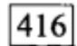


## 15.5 模式：HIGHLIGHTED CORE

DOMAIN VISION STATEMENT从宽泛的角度对CORE DOMAIN进行了说明，但它把具体核心模型元素留给人们自己去解释和猜测。除非团队的沟通极其充分，否则单靠VISION STATEMENT是很难产生什么效果的。 

## * * *

尽管团队成员可能大体上知道核心领域是由什么构成的，但CORE DOMAIN中到底包含哪些元素，不同的人会有不同的理解，甚至同一个人在不同的时间也会有不同的理解。如果我们总是要不断过滤模型以便识别出关键部分，那么就会分散本应该投入到设计上的精力，而且这还需要广泛的模型知识。因此，CORE DOMAIN必须要很容易被分辨出来。 

对代码所做的重大结构性改动是识别CORE DOMAIN的理想方式，但这些改动往往无法在短期内完成。事实上，如果团队的认识还不够全面，这样的重大代码修改是很难进行的。 

通过修改模型的组织结构（例如划分GENERIC SUBDOMAIN和本章后面要介绍的一些改动），可以用MODULE表达出核心领域。但如果把它作为表达CORE DOMAIN的唯一方法，那么对模型的改动会很大，因此很难马上看到结果。 

我们可能需要用一种轻量级的解决方案来补充这些激进的技术。可能有一些约束使你无法从物理上分离出CORE，或者你可能是从现有代码开始工作的，而这些代码并没有很好地区分出CORE，但你确实很需要知道什么是CORE并把它共享给大家，以便有效地通过重构进行更好的精炼。即使到了高级阶段，通过仔细挑选几个图或文档，也能够为团队提供思考的定位点和切入点。 

无论是使用了详尽的UML模型的项目，还是那些只使用很少的外部文档并且把代码用作主要的模型存储库的项目（例如XP项目），都会面临这些问题。极限编程团队可能采用更简洁的做法，他们更少地使用这些补充解决方案，而且只是临时使用（例如，在墙上挂一张手绘的图，让所有人都能看到），但这些技术可以很好地结合到开发过程中。 

把模型的一个特别的部分连同它的实现划分出来只是对模型的一种反映,而不是模型本身必不可少的部分。任何使人们易于了解CORE DOMAIN的技术都可以采用。这类解决方案有两种典型的代表性技术。 

## 15.5.1 精炼文档

我经常会创建一个单独的文档来描述和解释CORE DOMAIN。这个文档可能很简单，只是最基 本的概念对象的清单。它可能是一组描述这些对象的图，显示了它们的最重要的关系。它可能在抽象层次上或通过示例来描述基本的交互过程。它可能会使用UML类图或序列图、专用于领域的非标准的图、措辞严谨的文字解释或上述这些元素的组合。精炼文档并不是完备的设计文档。它只是一个最简单的切入点，描述并解释了核心，并给出了更进一步研究这些核心部分的理由。精炼文档为读者提供了一个总体视图，指出了各个部分是如何组合到一起的，并且指导读者到相应的代码部分寻找更多细节。 

因此（作为HIGHLIGHTED CORE（突出核心）的一种形式）： 

编写一个非常简短的文档（3～7页，每页内容不必太多），用于描述CORE DOMAIN以及CORE元素之间的主要交互过程。 

独立文档带来的所有常见风险也会在这里出现： 

(1) 文档可能得不到维护； 

(2) 文档可能没人阅读； 

(3) 由于有多个信息来源，文档可能达不到简化复杂性的目的。 

控制这些风险的最好方法是保持绝对的精简。剔除那些不重要的细节，只关注核心抽象以及它们的交互，这样文档的老化速度就会减慢，因为这个层次的模型通常更稳定。 

418 

精炼文档应该能够被团队中的非技术人员理解。把它当作一个共享的视图，描述每个人都应该知道的东西，而且可以把它作为团队所有成员研究模型和代码的一个起点。 

## 15.5.2 标明 CORE

我以前参加过一家大型保险公司的项目，在上班的第一天，有人给了我一份200页的“领域模型”文档的复印件，这个文档是花高价从一家行业协会购买的。我花了几天时间仔细研究了一大堆类图，它们涵盖了所有细节，从详细的保险政策组合到人们之间极为抽象的关系模型。这些模型的质量也参差不齐，有的只有高中生的水平，有的却相当好（有几个甚至描述了业务规则，至少在附带的文本中做了描述）。但我要从哪里开始工作呢？要知道它有200页啊。 

这个项目的人员热衷于构建抽象框架，我的前任们非常关注人与人之间、人与事物之间以及人与活动或协议之间的抽象关系模型。他们确实对关系进行了很好的分析，而且模型实验也达到了专业研究项目的水准，但却并没有使我们找到开发这个保险应用程序的任何思路。 

我对它的第一反应就是大幅删减，找到一个小的CORE DOMAIN并重构它，然后再逐步添加其他细节。但我的这个观点使管理层感到担心。这份文档具有极大的权威性。它是由整个行业的专家们编写的，而且无论如何他们付给协会的费用远远超过付给我的费用，因此他们不太可能慎重考虑我所提出的要进行彻底修改的建议。但我知道必须有一个共享的CORE DOMAIN视图，并让每个人的工作都以它为中心。 

我没有进行重构，而是走查了文档，并且还得到了一位既懂得大量保险业一般知识又了解我们这个特殊应用程序的具体需求的业务分析师的帮助，把那些体现出基本的、区别于其他系统概 念的部分标识出来，这些是我们真正需要处理的部分。我提供了一个模型的导航图，它清晰地显示了核心，以及它与支持特性的关系。 

419 

我们从这个角度开始了建立原型的新工作，很快就开发出了一个简化的应用程序，它展示了一些必需的功能。 

这沓两磅重的再生纸变成了一项有用的业务资产，而我做的只是加了少量的页标和一些黄色标记。 

这种技术并不仅限于纸面上的对象图。使用大量UML图的团队可以使用一个“原型”（Stereotype）来识别核心元素。把代码用作唯一模型存储库的团队可以使用注释（可以采用Java Doc这样的结构），或使用开发环境中的一些工具。使用哪种特定技术都没关系，只要使开发人员容易分辨出什么在核心领域内，什么在CORE DOMAIN外就可以了。 

因此（作为另一种形式的HIGHLIGHTED CORE）： 

把模型的主要存储库中的CORE DOMAIN标记出来，而不要特意去阐明其角色。使开发人员很容易就知道什么在核心内，什么在核心外。 

现在，我们只做了很少的处理和维护工作，负责处理模型的人员就已经清晰地看到CORE DOMAIN了，至少模型已经被整理得很好，使人们很容易分清各个部分的组成。 

## 15.5.3 把精炼文档作为过程工具

理论上，在XP项目上工作的任何一对人员（两位一起工作的程序员）都可以修改系统中的任何代码。但在实际中，一些修改会产生很大影响，因此需要更多的商量和协调。按照项目通常的组织形式，当在基础设施层中工作时，变更的影响可能很清楚；但在领域层中，影响就不那么明显了。 

从CORE DOMAIN的概念来看，这种影响更为清楚。更改CORE DOMAIN模型会产生较大的影响。对广泛使用的通用元素进行修改可能要求更新大量的代码，但不会像CORE DOMAIN修改那样产生概念上的变化。 

把精炼文档作为一个指南。如果开发人员发现精炼文档本身需要修改以便与他们的代码或模型修改保持同步，那么这样的修改需要大家一起协商。这种修改要么是从根本上修改CORE DOMAIN元素或关系；要么是修改CORE DOMAIN的边界，把一些元素包含进来，或是把一些元素排除出去。不管使用什么沟通渠道（包括新版本的精炼文档的分发），模型的修改都必须传达到整个团队。 

如果精炼文档概括了CORE DOMAIN的基本元素，那么它就可以作为一个指示器用来指示模型改变的重要程度。当模型或代码的修改影响到精炼文档时，需要与团队其他成员一起协商。当对精炼文档做出修改时，需要立即通知所有团队成员，而且要把新版本的文档分发给他们。CORE外部的修改或精炼文档外部的细节修改则无需协商或通知，可以直接把它们集成到系统中，其他成员在后续工作过程中自然会看到这些修改。这样开发人员就拥有了XP所提供的完全 

的自治性。 

* * * 

尽管VISION STATEMENT和HIGHLIGHTED CORE可以起到通知和指导的作用，但它们本身并没有修改模型或代码。具体地划分GENERIC SUBDOMAIN可以除去一些非核心元素。接下来的几个模式着眼于从结构上修改模型和设计本身，目的是使CORE DOMAIN更明显，更易于管理。 

## 15.6 模式：COHESIVE MECHANISM

封装机制是面向对象设计的一个基本原则。把复杂算法隐藏到方法中，再为方法起一个一看就知道其用途的名字，这样就把“做什么”和“如何做”分开了。这种技术使设计更易于理解和使用。然而它也有一些先天的局限性。 

计算有时会非常复杂，使设计开始变得膨胀。机制性的“如何做”大量增加，而把概念性的“做什么”完全掩盖了。为解决问题提供算法的大量方法掩盖了那些用于表达问题的方法。 

这一过程的扩散是模型出问题的一种症状。这时应该通过重构得到更深层的理解，从而找到更适合解决问题的模型和设计元素。首先要寻找的解决方案是找到一个能使计算机制变得简单的模型。但有时我们会发现，有些计算机制本身在概念上就是内聚的。这种内聚的计算概念可能并不包括我们所需的全部计算。我们讨论的也不是一种万能的计算器。把内聚部分提取出来会使得剩下的部分更易于理解。 

因此： 

把概念上的COHESIVE MECHANISM（内聚机制）分离到一个单独的轻量级框架中。要特别注意公式算法或那些有完备文档的算法。用一个INTENTION-REVEALING INTERFACE来公开这个框架的功能。现在，领域中的其他元素就可以只专注于如何表达问题（做什么）了，而把解决方案的复杂细节（如何做）转移给了框架。 

然后，这些被分离出来的机制承担起支持的任务，从而留下一个更小的、表达得更清楚的 CORE DOMAIN，这个核心以更明确的方式通过接口来使用这些机制。 

把标准的算法或公式识别出来以后，可以把一部分设计的复杂性转移到一系列已经过深入研究的概念中。在这种方法的引导下，我们可以放心地实现一个解决方案，而且只需进行很少的尝试和改错。我们可以依靠其他一些了解这种算法或至少能够查到相关资料的开发人员。这个好处类似于从公开发布的GENERIC SUBDOMAIN模型获得的好处，但找到完备的算法或公式计算的机会比利用通用子领域模型的机会更大一些，因为这种水平的计算机科学已经有了较深入的研究。但是，我们仍常常需要创建新的算法。创建的算法应该主要用于计算，避免在算法中混杂用于表达问题的领域模型。二者的职责应该分离。CORE DOMAIN或GENERIC SUBDOMAIN的模型描述的是事实、规则或问题。而COHESIVE MECHANISM则用来满足规则或者用来完成模型指定的计算。 

## 示例 从组织结构图中分离出一个COHESIVE MECHANISM

我曾经在一个项目上经历过这种分离过程，这个项目需要一种非常详细的组织结构图模型。这个模型可以表示出一个人正在为谁工作以及他属于哪个分支部门，模型还提供了一个接口，通过这个接口可以提出和回答相关的问题。由于大部分问题都类似于“在这个指挥链中谁有权批准这件事”或“在这个部门中谁能够处理这样的问题”，因此团队意识到大部分复杂性都来自于遍历组织树中的特定分支，从中搜索特定的人员或关系。这恰好是成熟的图形系统所能够解决的问题，图由一个节点集合（各个节点通过弧连接起来，弧叫做边）以及遍历图所需的规则和算法组成。 

负责这项工作的开发人员开发出了一个图的遍历框架，并把它实现为一种COHESIVE MECHANISM。这个框架使用了标准的图形术语和算法，大多数计算机专业人员都很熟悉这些术语和算法，而且它们在教科书中也大量出现。这位开发人员并没有实现一个完整的概念框架，而只是实现了它的一个子集，该子集涵盖了组织模型所需的功能。而且由于有了一个INTENTION-REVEALING INTERFACE，因此以何种方式获取答案并不是我们主要关心的问题。 

现在，组织模型可以用标准的图形术语简单地把每个人表示为一个节点，把人们之间的关系表示为连接这些节点的边（弧）。这样，使用这个图形框架机制就可以找到任意两个人之间的关系了。 

如果这个机制被混杂到领域模型中，那么将会产生两个后果。一是模型会与一个用于解决问题的特殊方法耦合在一起，这将限制将来的选择。更重要的是，组织的模型将变得异常复杂和混乱。把该机制与模型分开的好处是可以用声明式的风格来描述组织，使组织结构变得更清晰。而且用于图形操作的复杂代码被分离到一个单纯的、基于成熟算法的机制框架中，从而可以进行单独的维护和单元测试。 

COHESIVE MECHANISM的另一个例子是用一个框架来构造SPECIFICATION对象，并为这些对象所需的基本的比较和组合操作提供支持。利用这个框架，CORE DOMAIN和GENERIC SUBDOMAIN可以用SPECIFICATION模式中所描述的清晰的、易于理解的语言来声明它们的规格（参见第10章）。这样，比较和组合等复杂操作可以留给框架去完成。 

## * * *

## 15.6.1 GENERIC SUBDOMAIN 与 COHESIVE MECHANISM 的比较

GENERIC SUBDOMAIN与COHESIVE MECHANISM的动机都是相同的——为CORE DOMAIN减负。区别在于二者所承担的职责的性质不同。GENERIC SUBDOMAIN是以一个描述问题的模型作为基础的，它用这个模型表示出团队会如何看待领域的某个方面。在这一点上它与CORE DOMAIN没什么 区别，只是重要性和专门程度较低而已。COHESIVE MECHANISM并不表示领域，它的目的是解决描述性模型所提出来的一些复杂的计算问题。 

模型提出问题，COHESIVE MECHANISM解决问题。 

在实践中，除非你识别出一种正式的、公开发布的算法，否则这种区别通常并不十分清楚，至少在开始时是这样。在后续的重构中，如果发现一些先前未识别的模型概念会使这种机制变得更为简单，那么就可以把这种算法精炼成一种更纯粹的机制，或者转换为一个GENERIC SUBDOMAIN。 

## 15.6.2 MECHANISM 是 CORE DOMAIN 一部分

我们几乎总是想要把MECHANISM从CORE DOMAIN中分离出去。一个例外是MECHANISM本身就是一个专有部分并且是软件的一项核心价值。有时，非常专用的算法就是这种情况。例如，如果一个非常高效的算法（用于计算日程安排）是运输物流应用程序中的标志性特性之一，那么该机制就可以被认为是概念核心的一部分。我以前参加过一个投资银行的项目，在这个项目中有一个非常专业的风险评估算法，它无疑是CORE DOMAIN的一部分（事实上，这个算法是高度机密的，甚至大部分核心开发人员都看不到它们）。当然，这些算法可能是一个用于预测风险的规则集的特殊实现。通过更深入的分析可能会得到一个更深层的模型，从而用一种封装的解决机制把这些规则显式地表达出来。 

但那只是将来要做的进一步改进。是否做这个决定取决于成本-效益分析。实现新设计的难度有多大？当前设计有多难理解和修改？采用更高级的设计后，对从事这些工作的人来说，设计会得到多大程度的简化？当然，有人对新模型的组成有什么想法吗？ 

## 示例 绕了一圈，MECHANISM又重新回到组织结构图中

实际上，在我们完成了前面示例中的组织模型一年之后，其他开发人员又重新设计了它，取消了图形框架的分离。他们认为对象数量在增加，而且把这种MECHANISM分离到单独的包中也会变得很复杂，于是觉得这二者没必要如此。相反，他们把节点行为添加到组织ENTITY的父类中。但他们保留了组织模型的声明式公共接口。他们甚至在组织ENTITY中保持了MECHANISM的封装。 

绕弯路之后又返回到原来的老路上是很常见的事情，但并不会退回到起点。最终结果通常是得到了一个更深层的模型，这个模型能够更清楚地区分出事实、目标和MECHANISM。实用的重构在保留中间阶段的重要价值的同时还能够去除不必要的复杂性。 

## 15.7 通过精炼得到声明式风格

声明式设计和“声明式风格”是第10章的一个主题，但本章的战略精炼这个话题上，有必要特别提一下这种设计风格。精炼的价值在于使你能够看到自己正在做什么，不让无关细节分散你的注意力，并通过不断削减得到核心。如果领域中那些起到支持作用的部分提供了一种简练的语言，可用于表示CORE概念和规则，同时又能够把计算或实施这些概念和规则的方式封装起来，那么CORE DOMAIN的重要部分就可以采用声明式设计。 

COHESIVE MECHANISM用途最大的地方是它通过一个INTENTION-REVEALING INTERFACE来提供访问，并且具有概念上一致的ASSERTION和SIDE-EFFECT-FREE FUNCTION。利用这些MECHANISM和柔性设计，CORE DOMAIN可以使用有意义的声明，而不必调用难懂的函数。但最不同寻常的回报来自于使CORE DOMAIN的一部分产生突破，得到一个深层模型，而且这部分核心领域本身成为了一种语言，可以灵活且精确地表达出最重要的应用场景。 

深层模型往往与相对应的柔性设计一起产生。柔性设计变得成熟的时候，就可以提供一组易于理解的元素，我们可以明确地把它们组合到一起来完成复杂的任务，或表达复杂的信息，就像单词组成句子一样。此时，客户代码就可以采用声明式风格，而且更为精炼。 

426 

把GENERIC SUBDOMAIN提取出来可以减少混乱，并且内聚机制可以把复杂操作封装起来。这样可以得到一个更专注的模型，从而减少了那些对用户活动没什么价值的、分散注意力的方面。但我们不太可能为领域模型中所有非CORE元素安排一个适当的去处。SEGREGATED CORE（隔离的核心）采用直接的方法从结构上把CORE DOMAIN划分出来。 

427 

## 15.8 模式：SEGREGATED CORE

模型中的元素可能有一部分属于CORE DOMAIN，而另一部分起支持作用。核心元素可能与一般元素紧密耦合在一起。CORE的概念内聚性可能不是很强，看上去也不明显。这种混乱性和耦合关系抑制了CORE的分离。设计人员如果无法清晰地看到最重要的关系，就会开发出一个脆弱的设计。 

通过把GENERIC SUBDOMAIN提取出来，可以从领域中清除一些干扰性的细节，使CORE变得更清楚。但识别和澄清所有这些子领域是很困难的工作，而且有些工作看起来并不值得去做。同时，最重要的CORE DOMAIN仍然与剩下的那些元素纠缠在一起。 

因此： 

对模型进行重构，把核心概念从支持性元素（包括定义得不清楚的那些元素）中分离出来，并增强CORE的内聚性，同时减少它与其他代码的耦合。把所有通用元素或支持性元素提取到其他对象中，并把这些对象放到其他的包中——即使这会把一些紧密耦合的元素分开。 

这里基本上采用了与GENERIC SUBDOMAIN一样的原则，只是从另一个方向来考虑而已。那些在应用程序中非常关键的内聚子领域可以被识别出来，并分离到它们自己的内聚包中。如何处理 剩下那些未加区分的元素虽然也很重要，但其重要性略低。这些元素或多或少地可以保留在原先的位置，也可以放到其他一些主要的类中。最后，越来越多的剩余元素可以被提取到GENERIC SUBDOMAIN中。但就目前来看，使用哪种简单解决方案都可以，只需把注意力集中在SEGREGATED CORE（隔离的核心）上即可。 

## * * *

通过重构得到SEGREGATED CORE的一般步骤如下所示。 

428 

(1) 识别出一个CORE子领域（可能是从精炼文档中得到的）。 

(2) 把相关的类移到新的MODULE中，并根据与这些类有关的概念为模块命名。 

(3) 对代码进行重构，把那些不直接表示概念的数据和功能分离出来。把分离出来的元素放到其他包的类（可以是新的类）中。尽量把它们与概念上相关的任务放在一起，但不要为了追求完美而浪费太长时间。把注意力放在提炼CORE子领域上，并且使CORE子领域对其他包的引用变得更明显且易于理解。 

(4) 对新的 SEGREGATED CORE MODULE 进行重构，使其中的关系和交互变得更简单、表达得更清楚，并且最大限度地减少并澄清它与其他 MODULE 的关系（这是后续重构的目标）。 

(5) 对另一个CORE子领域重复这个过程，直到完成SEGREGATED CORE的工作。 

## 15.8.1 创建 SEGREGATED CORE 的代价

有时候，把CORE隔离出来会使得它与那些紧密耦合的非CORE类的关系变得更晦涩，甚至更复杂，但CORE DOMAIN更清晰了，而且更易于处理，因此获得的好处还是足以抵偿这种代价。 

SEGREGATED CORE使我们能够提高CORE DOMAIN的内聚性。我们可以使用很多有意义的方式来分解模型，有时在创建SEGREGATED CORE时，可以把一个内聚性很好的MODULE拆分开，通过牺牲这种内聚性来换取CORE DOMAIN的内聚性。这样做是值得的，因为企业软件的最大价值来自于模型中企业的那些特有方面。 

当然，另一个代价是隔离CORE需要付出很大的工作量。我们必须认识到，在做出SEGREGATED CORE的决定时，有可能需要开发人员对整个系统做出修改。 

当系统有一个很大的、非常重要的BOUNDED CONTEXT时，如果模型的关键部分被大量支持性功能掩盖了，那么就需要创建SEGREGATED CORE了。 

## 15.8.2 不断发展演变的团队决策

就像很多战略设计决策所要求的一样，创建SEGREGATED CORE需要整个团队一致行动。这一行动需要团队的一致决策，而且团队必须足够自律和协调才能执行这样的决策。困难之处在于既要约束每个人使其都使用相同的CORE定义，又不能一成不变地去执行这个决策。由于CORE DOMAIN也是不断演变的（像任何其他设计方面一样），在处理SEGREGATED CORE的过程中我们会 不断积累经验，这将使我们对什么是核心什么是支持元素这些问题产生新的理解。我们应该把这些理解反馈到设计中，从而得到更完善的CORE DOMAIN和SEGREGATED CORE MODULE的定义。 

这意味着新的理解必须持续不断地在整个团队中共享，但个人（或编程对）不能单方面根据这些理解擅自采取行动。无论团队采用了什么样的决策过程，团队一致通过也好，由领导者下命令决定也好，决策过程都必须具有足够的敏捷性，可以反复纠正。团队必须进行有效的沟通，以便使每个人都共享同一个CORE视图。 

## 示例 把货物运输模型的CORE隔离出来

我们从图15-2所示的模型开始，把它作为货物运输调度软件的基础。 

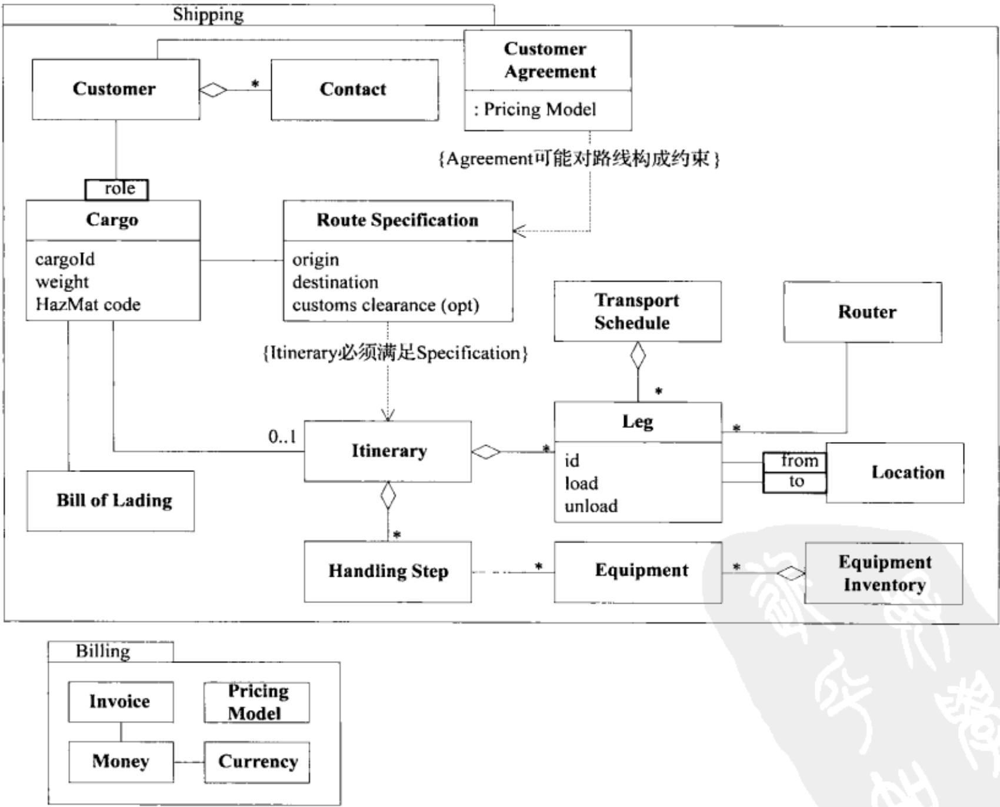


图15-2


注意，与实际应用程序所需的模型相比，这个模型是高度简化的。真实的模型过于复杂，不适合作为例子。因此，尽管这个示例的复杂程度可能不足以驱使我们创建SEGREGATED CORE，但可以把这个模型想象得十分复杂，很难解释，而且无法作为一个整体来处理。 

现在，运输模型的实质是什么？通常“底线”是一个很好的起点。按照这个思路，我们可能会注意到Pricing(定价)和Invoice(发票)上。但实际上我们需要看一下DOMAIN VISION STATEMENT。以下就是从前景说明中摘录的： 

## ……提高操作的可见性，并提供更快速可靠地满足客户需求的工具……

这个应用程序并不是为销售部门设计的，而是供公司一线操作人员使用。因此，我们把所有与金钱有关的问题（当然很重要）归结为支持性作用。已经有人把一些这样的项放到一个单独的包（Billing）中。我们可以保留这个包，并进一步确认它起到支持作用。 

我们需要把重点放在货物处理上：根据客户需求来运输货物。我们把与这些活动直接相关的类提取出来放到一个新的包Delivery中，这样就产生了一个SEGREGATED CORE，如图15-3所示。 

大部分操作都只是把类移动到新的包中，但模型本身也有几处改动。 

首先，Customer Agreement对Handling Step进行了约束。这是团队在隔离CORE过程中获得的典型理解。由于团队把注意力放在有效、正确的运输上，显然Customer Agreement中的运输约束是非常重要的，而且应该在模型中显式地表达出来。 

另一项更改更有实效。在重构之后的模型中，Customer Agreement直接连接到Cargo，而不再需要通过Customer进行导航（在预订Cargo时，Customer Agreement必须像Customer一样连接到Cargo）。在实际运输时，Customer与运输作业的关系不如协议与作业的关系紧密。而在原来的模型中，必须根据Customer在运输中的角色找到正确的Customer，然后再查询其Customer Agreement。这种交互使得模型表述的关系不易理解。新的关联使那些最重要的场景变得尽可能简单和直接。现在就很容易把Customer完全从CORE中分离出去了。 

那么到底是否应该把Customer提取出来呢？我们的关注点是要满足Customer的需求，因此最初看上去Customer应该属于CORE。然而，由于运输期间的交互现在可以直接访问Customer Agreement了，因此就不再需要Customer类。这样Customer的基本模型就非常普通了。 

Leg是否应该保留在CORE中这个问题可能会引起很大的争议。我的意见是CORE应保持最小化，而且Leg与Transport Schedule、Routing Service和Location应该具有更紧密的联系，而这三者都不需要在CORE中。但是，如果这个模型描述的很多场景都涉及Leg，那么我就会把它移到Delivery包中，即使把它与上面那些类分开显得有些不协调。 

在这个例子中，所有类定义都与先前相同，但精炼通常都需要对类进行重构，以便分离出通用的职责和领域的专有职责，然后就可以把核心隔离出来了。 

既然我们已经有了一个SEGREGATED CORE，重构就完成了。但剩下的Shipping包正是“把CORE提取出来后剩下的所有东西”。我们可以再进行其他的重构过程，以便得到更清晰的打包方式， 

如图15-4所示。 

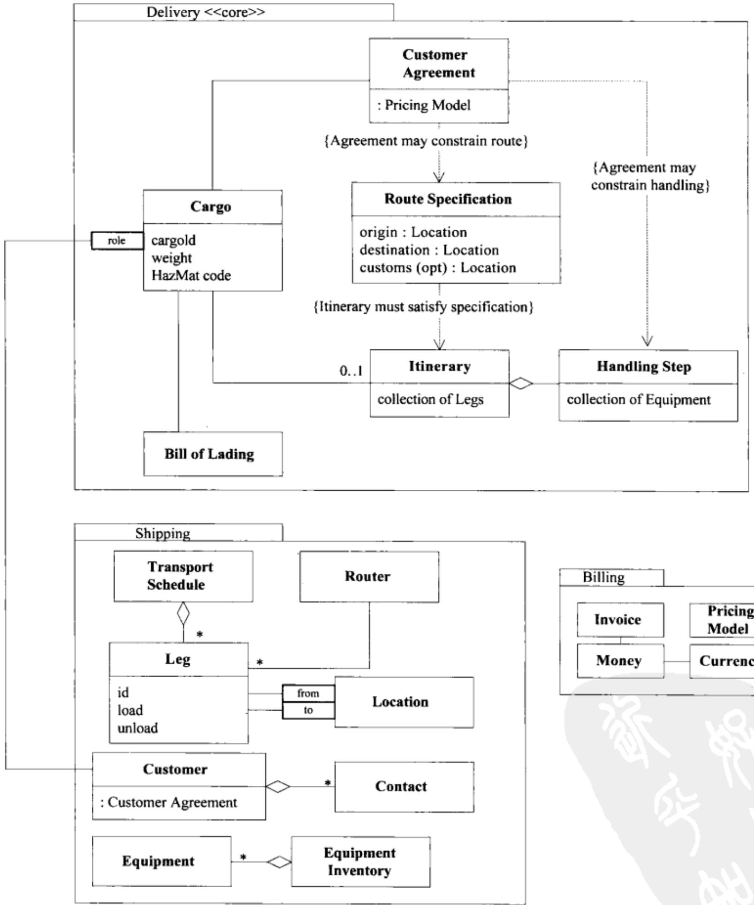


图15-3 按照客户需求可靠地运输货物是这个项目的核心目标


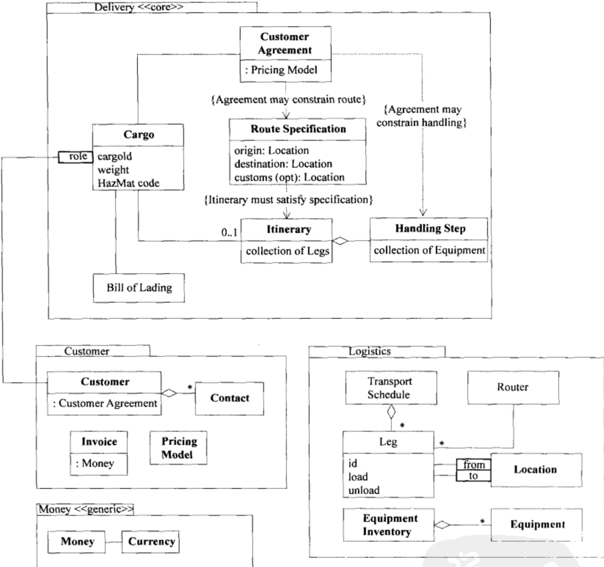


图15-4 完成SEGREGATED CORE之后留下的有意义的非CORE子领域MODULE


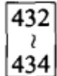


这种效果不是一次就能实现的，可能需要经过多次重构。于是，我们最后得到了一个SEGREGATED CORE包、一个GENERIC SUBDOMAIN和两个起支持作用的领域专用包。在有了更深层的理解后，可能会为Customer创建一个GENERIC SUBDOMAIN，或者将Customer专用于运输。 

识别有用的、有意义的MODULE是一项建模活动（正如第5章中所讨论的那样）。开发人员和领域专家在战略精炼中进行协作，这种协作是知识消化过程的一部分。 

## 15.9 模式：ABSTRACT CORE

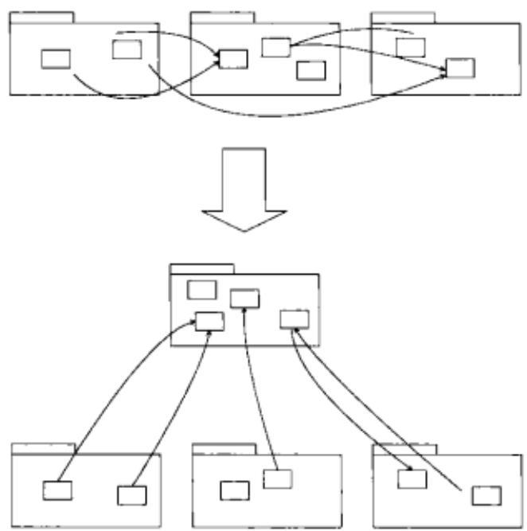


即使是CORE DOMAIN模型也通常会包含太多的细节，以至于它很难表达出整体视图。 

* * * 

我们处理大模型的方法通常是把它分解为足够小的子领域，以便掌握它们并把它们放到一些独立的MODULE中。这种简化式的打包风格通常是行之有效的，能够使一个复杂的模型变得易于管理。但有时创建独立的MODULE反而会使子领域之间的交互变得晦涩难懂，甚至变得更复杂。 

当不同MODULE的子领域之间有大量交互时，要么需要在MODULE之间创建很多引用（在很大程度上抵消了划分模块的价值），要么就必须间接地实现这些交互，而后者会使模型变得晦涩难懂。 

我们不妨考虑采用横向切割而不是纵向切割的方式。多态性（polymorphism）允许我们忽略抽象类型实例的很多细节变化。如果MODULE之间的大部分交互都可以在多态接口这个层次上表达出来，那么就可以把这些类型重构到一个特定的CORE MODULE中。 

这里并不是寻找技术上的技巧。只有当领域中的基本概念能够用多态接口来表达时，这才是一种有价值的技术。在这种情况下，把这些分散注意力的细节分离出来可以使MODULE解耦，同时可以精炼出一个更小、更内聚的CORE DOMAIN。 

435 

因此： 

把模型中最基本的概念识别出来，并分离到不同的类、抽象类或接口中。设计这个抽象模型，使之能够表达出重要组件之间的大部分交互。把这个完整的抽象模型放到它自己的MODULE中，而专用的、详细的实现类则留在由子领域定义的MODULE中。 

现在，大部分专用的类都将引用ABSTRACT CORE MODULE，而不是其他专用的MODULE。ABSTRACT CORE（抽象核心）提供了主要概念及其交互的简化视图。 

提取ABSTRACT CORE并不是一个机械的过程。例如，如果把MODULE之间频繁引用的所有类都自动移动到一个单独的MODULE中，那么结果可能是一团糟，这样的结果是毫无意义的。对ABSTRACT CORE进行建模需要深入理解关键概念以及它们在系统的主要交互中扮演的角色。换言之，它是通过重构得到更深层理解的。而且它通常需要大量的重新设计。 

如果项目中同时使用了ABSTRACT CORE和精炼文档，而且精炼文档随着应用程序理解的加深而不断演变，那么抽象核心的最后结果看起来应该与精炼文档非常类似。当然，ABSTRACT CORE是用代码编写的，因此更为严格和完整。 

## * * *

## 15.10 深层模型精炼

精炼并不仅限于从整体上把领域中的一些部分从CORE中分离出来。它也意味着对子领域（特别是CORE DOMAIN）进行精炼，通过连续的重构得到更深层的理解，从而向深层模型和柔性设计推进。精炼的目标是把模型设计得更明显，使我们可以用模型简单地把领域表示出来。深层模型把领域中最本质的方面精炼成一些简单的元素，使我们可以把这些元素组合起来解决应用程序中的重要问题。 

436 

尽管任何一次突破都会得到一个有价值的深层模型，但只有CORE DOMAIN中的突破才能改变整个项目的轨道。 

## 15.11 选择重构目标

当你遇到一个杂乱无章的大型系统时，应该从哪里入手呢？在XP社区中，答案往往是以下之一： 

(1) 可以从任何地方开始，因为所有的东西都要进行重构； 

(2) 从影响你工作的那部分开始——也就是完成具体任务所需要的那个部分。 

这两种做法我都不赞成。第一种做法并不十分可行，只有少数完全由顶尖的程序员组成的团队才是例外。第二种做法往往只是对外围问题进行了处理，只治其标而不治其本，回避了最严重的问题。最终这会使代码变得越来越难以重构。 

因此，如果你既不能全面解决问题，又不能“哪儿痛治哪儿”，那么该怎么办呢？ 

(1) 如果采用 “哪儿痛治哪儿” 这种重构策略，要观察一下根源问题是否涉及 CORE DOMAIN 或 CORE 与支持元素的关系。如果确实涉及，那么就要接受挑战，首先修复核心。 

(2) 当可以自由选择重构的部分时，应首先集中精力把CORE DOMAIN更好地提取出来，完善对CORE的隔离，并且把支持性的子领域提炼成通用子领域。 

437 

以上就是如何从重构中获取最大利益的方法。 

# 大比例结构


数千人分工合作来制作“艾滋病纪念拼被”(AIDS Quilt) 

硅谷一家小的设计公司签了一份为卫星通信系统创建模拟器的合同。工作进展得很顺利，他们正在开发一个MODEL-DRIVEN DESIGN，这个设计能够表示和模拟各种网络条件和故障。 

但开发团队的领导者却有点不安。问题本身是太复杂了。为了澄清模型中的复杂关系，他们已经把设计分解为一些在规模上便于管理的内聚 MODULE，于是便有了现在的很多 MODULE。在这种情况下，开发人员要想查找某个功能，应该到哪个 MODULE 中去查呢？如果有了一个新类，应该把它放在哪里？这些小 MODULE 的实际意义是什么？它们又是如何结合到一起的呢？而且以后还要创建更多的 MODULE。 

段时能够理解和控制它。 

他们进行了头脑风暴活动，发现了很多可行的办法。开发人员提出了不同的打包方案。有一些文档给出了系统的全貌，还有一有关建模工具中的类图的新的认识可以用来指导开发人员设计出更适当的模块。但项目领导者对这些小花招并不满意。 

他们可以用模型把模拟器的工作流程简单地描述出来, 也可以说清楚数据是如何在基础设施上分布的, 而且电信技术层还保证了数据的完整性和路由选择。模型中包含了所有细节, 却没有一条清楚的主线。 

领域的一些重要概念丢失了。但这次丢失的不是对象模型中的一两个类，而是整个模型的结构。 

经过一两周的仔细思考之后，开发人员有了思路。他们打算把设计放到一个结构中。整个模拟器将被看作由一系列层组成，这些层分别对应于通信系统的各个方面。最下面的层用来表示物理基础设施，它具有将数据位从一个节点传送到另一个节点的基本能力。它的上面是封包路由层，与数据流定向有关的问题都被集中到这一层中。其他的层则表示其他概念层次的问题。这些层共同描述了系统的大致情况。 

他们开始按照新的结构来重构代码。为了不让模式跨越多个层，必须对它们重新定义。在一些情况下，还需要重构对象职责，以便明确地让每个对象只属于一个层。另一方面，在应用这些新思路的实际经验的基础上，概念层本身的定义也得到了精化。层、MODULE和对象一起演变，最后，整个设计都符合了这种分层结构的大体轮廓。 

这些层并不是 MODULE，也不是任何其他的代码工件。它们是一种全局性的规则集，用于约束整个设计中的任何 MODULE 或对象（甚至包括与其他系统的接口）的边界和关系。 

有了这种分层级别之后，设计重新变得易于理解了。人们基本上知道了到哪里去寻找某个特定功能。分工不同的开发人员所做的设计决策可以大体上互相保持一致。这样就可以处理更加复杂的设计了。 

即使将一个大的模型分解为许多 MODULE，其复杂性也可能会使它变得很难掌握。MODULE 确实把设计分解为更易管理的小部分，但 MODULE 的数量可能会很多。此外，模块化并不一定能够保证设计的一致性。对象与对象之间，包与包之间，可能由于应用了不一样的设计决策而变得混乱，每个决策看起来都合情合理，但又各自不同。 

严格划分 BOUNDED CONTEXT 可能会防止出现这种破坏和混淆，但如果使用它的话，我们就很难把系统看作一个整体了。 

精炼可以帮助我们把注意力集中于 CORE DOMAIN，并将子领域分离出来，让它们承担一些支持性的职责。但我们仍然需要理解这些支持性元素，以及它们与 CORE DOMAIN 的关系，还有它们互相之间的关系。理想的情况是，整个 CORE DOMAIN 应该在没有其他支持性元素的情况下也照样非常清楚和易于理解，但我们并不总能达到这样一种境界。 

无论项目的规模如何，人们总需要有各自的分工，来负责系统的不同部分。如果没有任何协调机制或规则，那么相同问题的各种不同风格和截然不同的解决方案就会混杂在一起，使人们很难理解各个部分是如何组织在一起的，也不可能看到整个系统的统一视图。从设计的一个部分学到的东西并不适用于这个设计的其他部分，因此项目最后的结果是在不同 MODULE 中工作的开发人员脱离了他们自己的狭窄范围之后就无法互相帮助。在这种情况下，CONTINUOUS INTEGRATION 根本无法实现，而 BOUNDED CONTEXT 也使项目变得支离破碎。 

在一个大的系统中，如果因为缺少一种全局性的原则而使人们无法根据元素在模式（这些模式被应用于整个设计）中的角色来解释这些元素，那么开发人员就会陷入“只见树木，不见森林”的境地。 

我们需要理解各个部分在整体中的角色，而不必去深究细节。 

“大比例结构”是一种语言，人们可以用它来从大局上讨论和理解系统。它用一组高级概念或规则（或两者兼有）来为整个系统的设计建立一种模式。这种组织原则既能指导设计，又能帮助理解。另外，它还能够协调不同人员的工作，因为它提供了共享的整体视图概念，让人们知道各个部分在整体中的角色。 

设计一种应用于整个系统的规则（或角色和关系）模式，使人们可以通过它在一定程度上了解各个部分在整体中所处的位置（即使是在不知道各个部分的详细职责的情况下）。 

这种结构可以被限制在一个 BOUNDED CONTEXT 中，但通常情况下它会跨越多个 BOUNDED CONTEXT，并通过提供一种概念组织把项目涉及的所有团队和子系统紧密结合到一起。好的结构可以帮助人们深入地理解模型，还能够对精炼起到补充作用。 

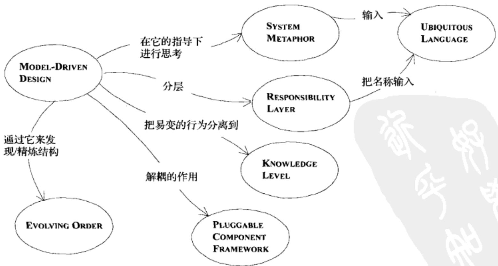


图 16-1 一些大比例结构模式


大部分大比例结构都无法用 UML 来表示，而且也不需要这样做。这些大比例结构是用来勾画和解释模型及设计的，但在设计中并不出现，它们只是用来表达设计的另外一种方式。在本章的示例中，你将看到许多添加了大比例结构信息的非正式的 UML 图。 

当团队规模较小而且模型也不太复杂时，只需将模型分解为正确命名的 MODULE，再进行一定程度的精炼，然后在开发人员之间进行非正式的协调，以上这些就足以使模型保持良好的组织结构了。 

大比例结构可以节省项目的开发费用，但不适当的结构会严重妨碍开发的进展。本章将探讨一些能成功构建这种设计结构的模式。 

## 16.1 模式：EVOLVING ORDER

很多开发人员都亲自经历过由于结构混乱而产生的代价。为了避免混乱，项目施行了从各个方面对开发进行约束的架构。一些技术架构确实能够解决技术问题，例如网络或数据持久化问题，但当我们在应用层和领域模型中使用架构时，它们可能会产生自己的问题。它们往往会妨碍开发人员创建适合于解决特定问题的设计和模型。一些要求过高的架构甚至会妨碍编程语言本身的使用，导致应用程序开发人员根本无法使用他们在编程语言中最熟悉的和技术能力很强的一些功能。而且，有些架构无论是面向技术的，还是面向领域的，都会使很多前期设计决策定格，随着需求的更改和理解的深入，这些架构会使项目变得束手束脚。 

近年来，一些技术架构（例如 J2EE）已经成为主流技术，而人们对领域层中的大比例结构却没有做多少研究，这是因为应用程序不同，其各自的需求也大为不同。 

在项目的前期使用大比例结构可能需要很大的成本。随着开发的进行，我们肯定会发现更适当的结构，甚至会发现先前使用的结构妨碍了我们采取一种使应用程序更清晰和简化的路线。这种结构的一部分是有用的，但却使你失去了其他很多机会。你的工作会慢下来，因为你要寻找解决的办法或试着与架构师们进行协商。但经理会认为架构已经定下来了，当初选这个架构就是因为它能够使应用程序变得简单一些，那为什么不去开发应用程序，却在这些架构问题上纠缠不清呢？即使经理和架构团队能够接受这些问题，但如果每次修改都像是一场攻坚战，那么人们很快就会疲乏不堪。 

一个没有任何规则的随意设计会产生一些无法理解整体含义且很难维护的系统。但架构中预先规定的假设又会使项目变得束手束脚，而且会极大地限制应用程序中某些特定部分的开发人员/设计人员的能力。很快，开发人员就会为适应结构而不得不在应用程序的开发上委曲求全，要么就是完全推翻架构而又回到不协调的开发的老路上来。 

问题并不在于指导规则本身应不应该存在，而在于这些规则的严格性和来源。如果这些用于控制设计的规则确实符合开发环境，那么它们不但不会阻碍开发，而且还会推动开发在健康的方向上前进，并且保持开发的一致性。 

因此： 

应该允许这种概念上的大比例结构随着应用程序一起演变，甚至可以变成一种完全不同的结构风格。有些设计决策和模型决策必须在掌握了详细知识之后才能确定，这样的决策不必过早地制定。 

有时个别部分具有一些很自然且有用的组织和表示方式，但这些方式并不适用于整体，因此施加全局规则会使这些部分的设计不够理想。在选择大比例结构时，应该侧重于整体模型的易管理性，而不是优化个别部分的结构。因此，在“统一使用结构”和“用最自然的方式表示个别组件”之间需要做出一些折中选择。根据实际经验和领域知识来选择结构，并避免对结构进行过多限制，以便更有利于折中。真正适合领域和需求的结构能够使细节的建模和设计变得更容易，因为它快速排除了很多选项。 

大比例结构还能够为我们在制定设计决策提供捷径，虽然原则上也可以通过研究各个对象来做出这些决策，但实际上这会耗费太长时间，而且可能产生不一致的结果。当然，持续重构仍然是必要的，但这种结构可以帮助重构变得更易于管理，并使不同的人能够得到一致的解决方案。 

大比例结构通常需要能够跨越 BOUNDED CONTEXT 来使用。在经历了实际项目上的迭代之后，结构将失去一些与某一特定模型联系非常紧密的特性，也会得到一些符合领域的 CONCEPTUAL CONTOUR 的特性。这并不意味着它不能对模型做出任何假设，而是说它不会把一些专门针对局部情况而做的假设强加于整个项目。它应该为那些在不同 CONTEXT 中工作的开发团队保留一定的自由，允许他们为了满足局部需要而修改模型。 

此外，大比例结构必须适应开发工作中的实际约束。例如，设计人员可能无法控制系统的某些部分的模型，特别是外部子系统或遗留子系统。这个问题有多种解决方式，例如修改结构使之更好地符合特定外部元素，或者指定应用程序与外部元素的关联方式，或者使结构变得足够松散，以适应一些难以处理的现实情况。 

445 

与 CONTEXT MAP 不同的是，大比例结构是可选的。当使用某种结构可以节省成本并带来益处时，就应该使用它，而且当发现了一种适当的结构时，也应该使用它。实际上，如果一个系统简单到把它分解为 MODULE 就足以理解它，那么就不必使用这种结构了。当发现一种大比例结构可以明显使系统变得更清晰，而又没有为模型开发施加一些不自然的约束时，就应该采用这种结构。使用不合适的结构还不如不使用它，因此最好不要为了追求设计的完整性而勉强去使用一种结构，而应该找到能够最精简地解决所出现问题的方案。要记住宁缺勿滥的原则。 

大比例结构可能非常有帮助，但也有少数不适用的情况，这些例外情况应该以某种方式被标记出来，以便让开发人员知道在没有特殊注明时可以遵循这种结构。如果不适用的情况开始大量出现，就要修改这种结构了，或者干脆不用它。 

## * * *

如前所述，要想创建一种既为开发人员保留必要自由度同时又能保证开发工作不会陷入混乱的结构绝非易事。尽管人们已经在软件系统的技术架构上投入了大量工作，但有关领域层的结构化研究还很少见。一些方法会破坏面向对象的范式，例如那些按应用或按用例对领域进行分解的 方法。整个领域的研究还很贫瘠。我曾经在一些项目上看到过几个通用的大比例结构模式。本章将讨论4种模式，其中可能会有一种符合你的需要，或者能够为你提供一些思路，从而找到一种非常适合你的项目的结构。 

## 16.2 模式：SYSTEM METAPHOR

隐喻思维在软件开发（特别是模型）中是很普遍的。但极限编程中的“隐喻”却具有另外一种含义，它用一种特殊的隐喻方式来使整个系统的开发井然有序。 

## * * *

一栋大楼的防火墙能够在周围发生火灾时防止火势从其他建筑蔓延到它自身，同样，软件“防火墙”可以保护局部网络免受来自更大的外部网的破坏。这个“防火墙”的隐喻对网络架构产生了很大影响，并且由此而产生了一整套产品类别。有多种互相竞争的防火墙可供消费者选择，它们都是独立开发的，而且人们知道它们在一定程度上具有可互换性。即使网络的初学者也很容易掌握这个概念。这种在整个行业和客户中的共同理解很大一部分上得益于隐喻。 

然而这个类比却并不准确，而且防火墙从功能上来看也是把双刃剑。防火墙的隐喻引导人们开发出了软件屏障，但有时它并不能起到充分的防护作用，而且会阻止正当的数据交换，同时也无法防护来自网络内部的威胁。例如，无线 LAN 就存在漏洞。防火墙这个形象的隐喻确实很有用，但所有隐喻也都是有弊端的 $^{①}$ 。 

软件设计往往非常抽象且难于掌握。开发人员和用户都需要一些切实可行的方式来理解系统，并共享系统的一个整体视图。 

从某种程度上讲，隐喻是对人们影响很深的一种思考方式，它已经渗透到每个设计中。系统有很多“层”，层与层之间依次叠放起来。系统还有“内核”，位于这些层的“中心”。但有时一个隐喻可以传达整个设计的中心主题，并能够代表团队所有成员的共同理解。 

在这种情况下，系统实际上就是由这个隐喻塑造的。开发人员所做的设计决策也将与系统隐喻保持一致。这种一致性使其他开发人员能够根据同一个隐喻来解释复杂系统中的多个部分。开发人员和专家在讨论时有一个比模型本身更具体的参考点。 

SYSTEM METAPHOR（系统隐喻）是一种松散的、易于理解的大比例结构，它与对象范式是协调的。由于系统隐喻只是对领域的一种类比，因此不同模型可以用近似的方式来使用它，这使得人们能够在多个 BOUNDED CONTEXT 中使用系统隐喻，从而有助于协调各个 BOUNDED CONTEXT 之间的工作。 

SYSTEM METAPHOR 是极限编程的核心实践之一，因此它已经成为一种非常流行的方法(Beck 2000)。遗憾的是，很少有项目能够找到真正有用的 METAPHOR，而且人们有时还会把一些起反作用的隐喻思想灌输到领域中。有时使用太强的隐喻反而会有风险，因为它使设计中掺杂了一些与 当前问题无关的类比，或者是类比虽然很有吸引力，但它本身并不恰当。 

尽管如此，SYSTEM METAPHOR 仍然是众所周知的大比例结构，它对一些项目非常有用，而且很好地说明了结构中的总体概念。 

因此： 

当系统的一个具体类比正好符合团队成员对系统的想象，并且能够引导他们向着一个有用的方向进行思考时，就应该把这个类比用作一种大比例结构。围绕这个隐喻来组织设计，并把它吸收到 UBIQUITOUS LANGUAGE 中。SYSTEM METAPHOR 应该既能促进系统的交流，又能指导系统的开发。它可以增加系统不同部分之间的一致性，甚至可以跨越不同的 BOUNDED CONTEXT。但所有隐喻都不是完全精确的，因此应不断检查隐喻是否过度或不恰当，当发现它起到妨碍作用时，要随时准备放弃它。 

## * * *

## “幼稚隐喻”以及我们为什么不需要它

由于在大多数项目并不会自动出现有用的隐喻，因此 XP 社区中的一些人开始谈论 “幼稚隐喻”（Naive Metaphor），他们所说的幼稚隐喻就是领域模型本身。 

这个术语的一个问题在于，一个成熟的领域模型绝对不会是“幼稚的”。实际上，“工资处理就像一条装配线”这个隐喻与模型的实际情况相比要幼稚得多，因为模型是软件开发人员与领域专家进行了多次知识消化的迭代过程才得到的，它已经紧密结合到应用程序的实现中，并经过了实践的检验。 

“幼稚隐喻”这个术语应该停止使用了。 

SYSTEM METAPHOR 并不适用于所有项目。从总体上讲，大比例结构并不是必须使用的。在极限编程的 12 个实践中，SYSTEM METAPHOR 的角色可以由 UBIQUITOUS LANGUAGE 来承担。当在项目中发现一种非常合适的 SYSTEM METAPHOR 或其他大比例结构时，应该用它来补充 UBIQUITOUS LANGUAGE。 

## 16.3 模式：RESPONSIBILITY LAYER

在本书从头至尾的讨论中，各个对象都被分配了一组相关的、范围较窄的职责。职责驱动的设计在更大的规模上也适用。 

## * * *

如果每个对象的职责都是手工分配的，将没有统一的指导原则和一致性，也无法把领域作为一个整体来处理。为了保持大模型的一致，有必要在职责分配上实施一定的结构化控制。 

当对领域有了深入的理解后，大的模式会变得清晰起来。一些领域具有自然的层次结构。某 些概念和活动处在其他元素形成的一个大背景下，而那些元素会因不同原因而以不同频率独立发生变化。如何才能充分利用这种自然结构，使它变得更清晰和有用呢？这种自然的层次结构使我们很容易想到把领域分层，这是最成功的架构设计模式之一（[Buschmann et al. 1996]，等等）。 

所谓的层，就是对系统进行划分，每个层的元素都知道或能够使用在它“下面”的那些层的服务，但却不知道它“上面”的层，而且与它上面的层保持独立。当我们把MODULE的依赖性画出来时，图的布局通常是具有依赖性的MODULE出现在它所依赖的模块上面。按照这种方式，层一般的排序是低层中的对象在概念上不依赖于高层中的对象。 

这种特定的分层方式虽然使对依赖性的跟踪变得更容易，而且有时具有一定的直观意义，但它对模型的理解并没有多大的帮助，也不会指导建模决策。我们需要一种具有更明确目的的分层方式。 

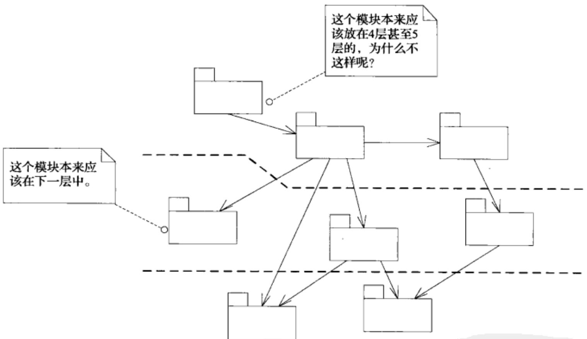


图16-2 特定分层，这些包描述了什么事情


在一个具有自然层次结构的模型中，可以围绕主要职责进行概念上的分层，这样可以把分层和职责驱动的设计这两个强有力的原则结合起来使用。 

这些职责必须比分配给单个对象的职责广泛得多才行，我们稍后就会举例说明这一点。当设计 MODULE 和 AGGREGATE 时，它们应该具有某种主要职责。这种明确的职责分组可以提高模块化系统的可理解性，因为 MODULE 的职责会变得更易于解释。而高级职责与分层的结合为我们提供了一种系统的组织原则。 

分层模式有一种变体最适合按职责来分层，我们把这种变体称为 RELAXED LAYERED 

SYSTEM（松散分层系统）（[Buschmann et al. 1996, p. 45]），如果采用这种分层模式，某一层中的组件可以访问任何比它低的层，而不限于只能访问直接与它相邻的下一层。 

因此： 

注意观察模型中的概念依赖性，以及领域中不同部分的变化频率和变化的原因。如果在领域中发现了自然的层次结构，就把它们转换为主要的抽象职责。这些职责应该描述了系统的高级目的和设计。对模型进行重构，使得每个领域对象、AGGREGATE 和 MODULE 的职责都清晰地位于一个职责层当中。 

这是一段很抽象的描述，但通过几个示例就可以把它说清楚了。本章开头的卫星通信模拟器示例就是对职责进行了分层。我曾经在各种领域（例如生产控制和财务管理）中看到过使用RESPONSIBILITY LAYER（职责层）所产生的良好效果。 

451 

## * * *

下面的示例详细研究了 RESPONSIBILITY LAYER，我们可以通过这个例子来体会一下如何去发现任何一种大比例结构，以及它是如何指导和约束建模与设计的。 

## 示例

## 深入研究运输系统的分层

让我们看一下把 RESPONSIBILITY LAYER 应用于前面几章所讨论的货运应用程序会有什么效果。当我们现在又回到这个应用程序时，开发团队已经有了很大的进展，他们已经创建了一个 MODEL-DRIVEN DESIGN，并且提炼出了一个 CORE DOMAIN。但随着设计变得充实，他们在如何把所有部分协调为一个整体上遇到了麻烦。他们正在寻找一种能够显示出整个系统主题并且让每个人都达成一致看法的大比例结构。 

我们来看一下这个模型中有代表性的一个部分，如图 16-3 和图 16-4 所示。 

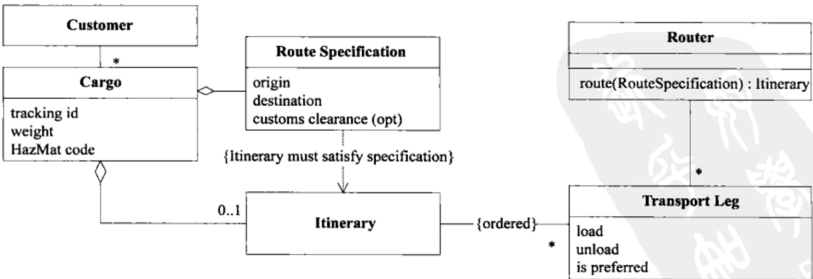


图 16-3 货运路线的一个基本的运输领域模型


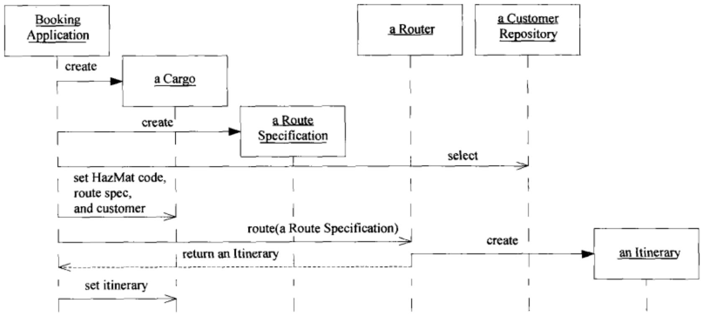


图 16-4 在预订期间使用模型来制定一个货运路线


团队成员研究运输领域已经有好几个月了，并且已经观察到了一些自然的概念层次结构。他们发现在讨论运输时间表（安排好的货轮航次或火车班次）时不需要涉及所运输的货物。而当讨论对一个货物的跟踪时，如果不知道它的运输信息，那么就很难进行跟踪。概念依赖性是非常清楚的。团队很容易区分出两个层：“作业”层和这些作业的基础层（他们把这个层叫做“能力”层）。 

## “作业”职责

公司的活动，无论是过去、现在还是计划的活动，都被组织到“作业”层中。最明显的作业对象是 Cargo，它是公司大部分日常活动的焦点。Route Specification 是 Cargo 的一个不可缺少的部分，它指出了运输需求。Itinerary 是运输计划。这些对象都是 Cargo 聚合的一部分，它们的生命周期依赖于一次有效运输的时间安排。 

## “能力”职责

这个层反映了公司在执行作业时所能利用的资源。Transit Leg 就是一个典型的示例。人们为货轮制定航程时间表，货轮具有一定的货运能力，这个能力有可能被完全利用，也有可能未被完全利用。 

当然，如果公司的主要业务是经营一个运输船队的话，那么 Transit Leg 将是作业层中的一个对象。但这个系统的用户并不需要关心这个问题（如果公司同时从事经营船队和经营货运这两种业务，并且希望协调它们，那么开发团队可能需要考虑一种不同的分层方案，或许要把作业层分成两个不同的层，例如“运输作业”和“货物作业”。） 

一个稍微复杂一点儿的决策是把 Customer 放在哪里。在一些企业中，客户只是一些临时对象。例如在邮递公司中，只有在投递包裹的时候，才需要知道客户对象，投递完成之后，大部分客户就被忘记了，直到出现下一次投递。这种性质决定了在针对个人客户的包裹投递服务中，客户仅仅与作业相关。但在我们假想的这家运输公司中，需要与客户保持长期关系，而且大部分业务都来自回头客。考虑到企业用户的这些意图，Customer 应该属于一个潜能层。正如我们看到的，这并非一个技术决策，而是试图掌握并交流领域知识。 

由于 Cargo 与 Customer 之间的关联只有一个遍历方向，因此 Cargo REPOSITORY 需要通过一个查询来查找某个特定 Customer 的所有 Cargo。不管怎样，按照这种方式来设计都有很好的理由，但在使用了大比例结构以后，现在它变成一项必须要满足的需求了。 

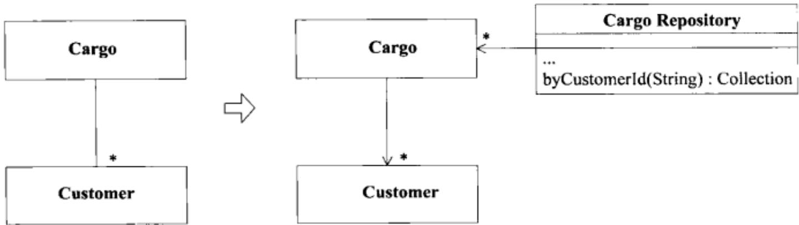


图 16-5 由于双向关联会破坏分层，因此用查询来代替它


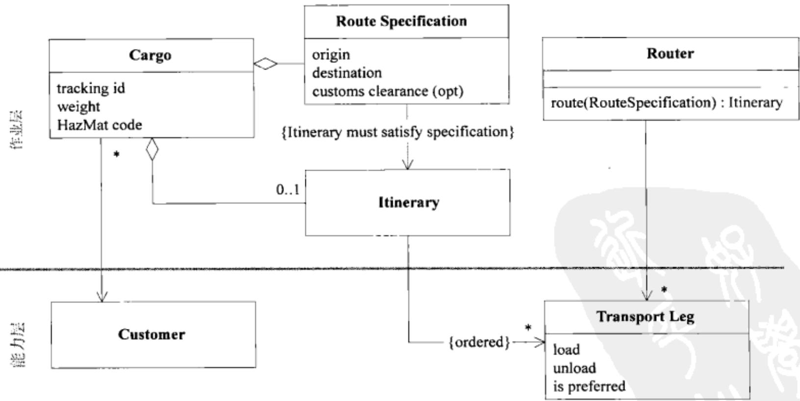


图 16-6 初次通过的分层模型


虽然作业层与能力层的区别使这张图看上去很清楚了，但次序仍需要进一步细化。经过几个 星期的实验之后，团队将注意力集中在另一个特性上。在很大程度上，最初的两个层主要考虑的是当前的情况或计划。但 Router（以及其他很多未在图中画出的元素）并不是当前的作业或计划的一部分。它是用来帮助修改这些计划的。因此团队定义了一个新的层，让它来负责决策支持 (Decision Support)。 

## “决策支持”职责层

软件的这个层为用户提供了用于制定计划和决策的工具，它具有自动制定一些决策的潜能（例如当运输时间表发生变动时，自动重新制定运送 Cargo 的路线）。 

Router 是一个 SERVICE，能帮助预订代理（booking agent）选择运送货物的最佳路线。因此 Router 明显属于决策支持层。 

现在模型中的元素基本上都按照这三个层来组织了，唯一例外的是 Transport Leg 的 “is preferred” 属性。这个属性存在的原因是公司希望在可能的情况下优先使用自己的货轮，或者是那些签订了优惠合同的公司的货轮。is preferred 属性用于使 Router 优先选择这些首选的运输工具。这个属性与“能力层”毫无关系。它是一个用于指导决策制定的策略。为了使用新的 RESPONSIBILITY LAYER，需要对模型进行重构。 

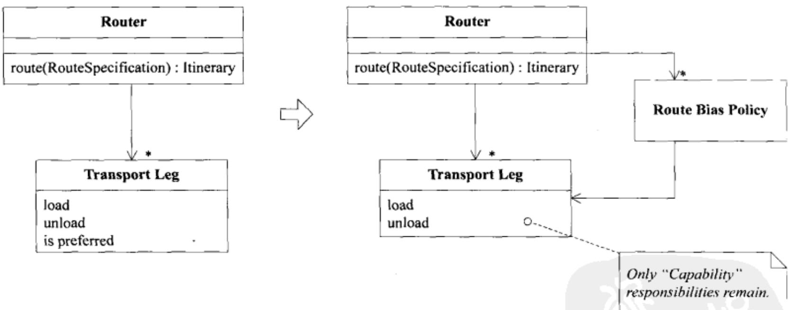


图 16-7 对模型进行重构，使之符合新的分层结构


这次重构使 Route Bias Policy 变得更清楚，同时使得 Transport Leg 更专注于运输能力的基本概念。基于对领域的深刻理解而发现的大比例结构总是能够使模型更清楚地表达其含义。 

现在，这个新模型更加符合大比例结构了。如图 16-8 所示。 

开发人员在熟悉了选定的分层结构后，很容易区分出各个部分的角色和依赖关系。大比例结构的价值随着复杂度的增加而增加。 

注意，虽然我使用了一个修改后的UML图来演示这个例子，但这只是为了表示分层而使用 的一种方式。UML 中并没有这种表示法，因此这些是作为额外的信息加上去的，目的是让读者看得更清楚。如果在你的项目中，代码就是最终的设计文档，那么最好可以使用一种可以按层查看类（或至少按照层来报告与这些类有关的信息）的工具。 

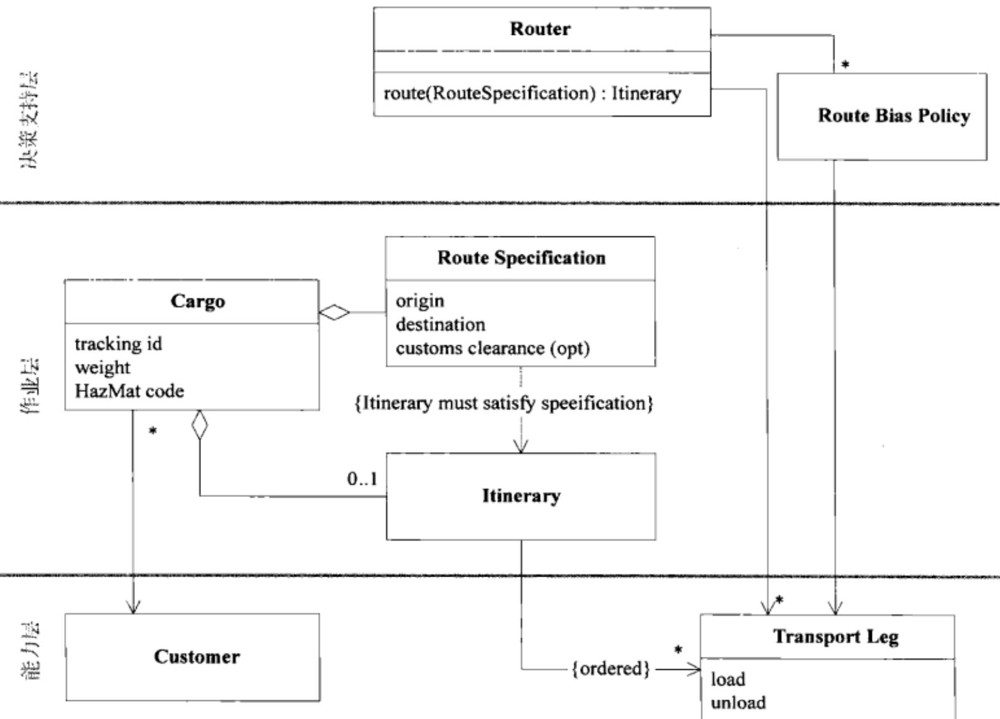


图 16-8 重构后的模型


## 大比例结构如何影响后续设计

一旦采用了一种大比例结构，后续的建模和设计决策就必须要把它考虑在内。为了说明这一点，假设我们必须在这个已分层的设计中增加一个新特性。领域专家们刚刚告诉我们一些针对特定类别危险品的航线约束。有些危险品在某些货轮或港口上是禁止装载的。我们必须使Router遵守这些规则。 

有很多可行的方法。在未使用大比例结构时，一种吸引人的设计方法是让拥有 Route Specification 和 Hazardous Material（HazMat）代码的对象负责把这些航线规则加进来，这个对象就是 Cargo。 

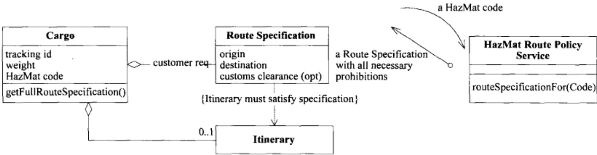


图 16-9 用于制定危险货物运送路线的一种可能的设计


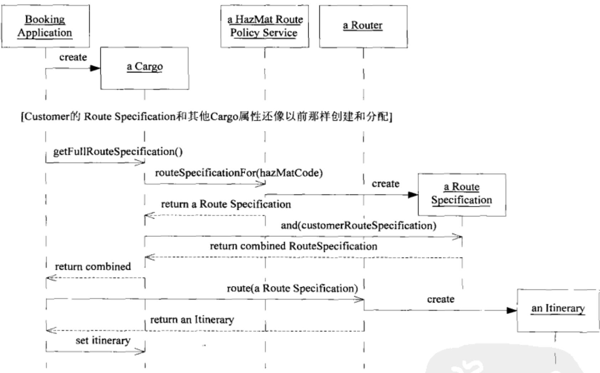


图 16-10


问题是这种设计并不适合大比例结构。HazMat Route Policy Service并没有问题，它非常适合承担决策支持层的职责。问题在于 Cargo（一个作业层对象）对 HazMat Route Policy Service（一个决策支持层对象）的依赖上。只要项目还采用目前的分层，就不能使用这个模型，因为开发人员会认为设计将遵循分层结构，而这种依赖会使开发人员感到糊涂。 

可能的设计选择总会有很多，这里我们只选择另外一种设计，这种设计符合大比例结构的规则。HazMat Route Policy 服务本身是完全没有问题的，但我们需要把使用它的职责转移到别处。让我们尝试让 Router 来承担在搜索航线之前收集相关规则的职责。这意味着要修改 Router 接口， 把规则可能依赖的那些对象包括进来。下面就是一种可能的设计，如图 16-11 所示。 

458 

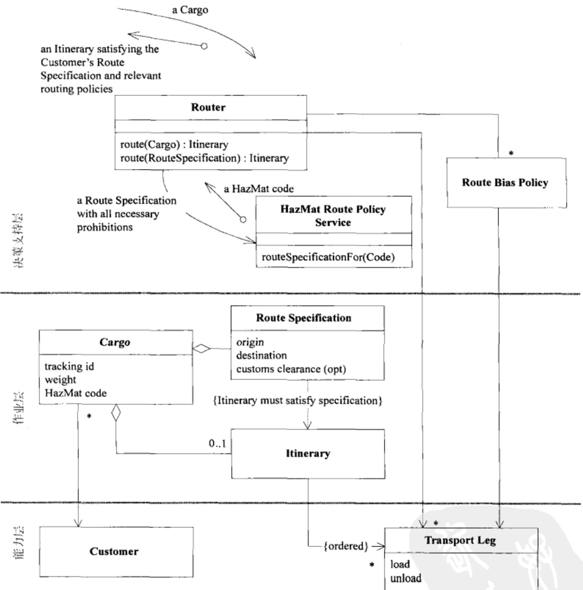


图 16-11 符合分层结构的一种设计


一种典型的交互如图 16-12 所示。 

现在的这个设计并不一定就比前面那个设计更好。二者都是各有利弊。但如果项目的所有人员都采用一致的方式来制定决策，那么整体的设计就更容易理解，因此这也值得在细小的设计选择上做出一些适度的折中。 

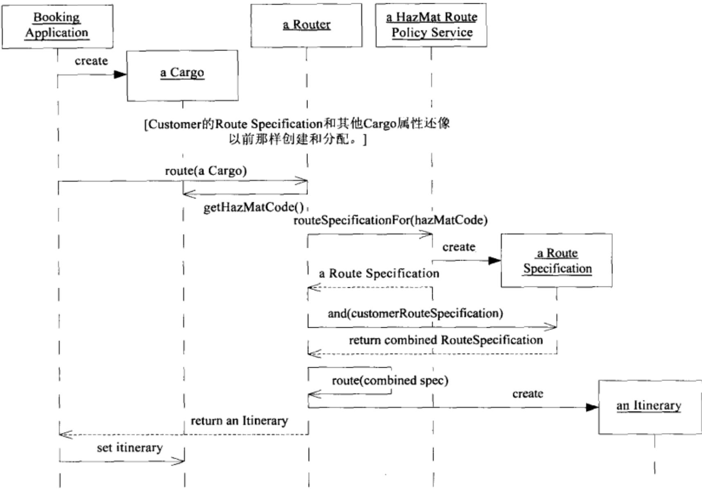


图16-12


如果所采用的结构强制性地要求我们做出很多别扭的设计选择，那么就要遵循 EVOLVING ORDER（演变的顺序），在项目进行过程中评估这种结构，并修改甚至放弃它。 

## 选择适当的层

要想找到一种适当的 RESPONSIBILITY LAYER 或大比例结构，需要理解问题领域并反复进行实验。如果遵循 EVOLVING ORDER，那么最初的起点并不是十分重要，尽管差劲的选择确实会加大工作量。结构可能最后演变得面目全非。因此，下面将给出一些指导方针，无论是刚开始选择一种结构，还是对已有结构进行转换，这些指导方针都适用。 

当对层进行删除、合并、拆分和重新定义等操作时，应寻找并保留以下一些有用的特征。 

☐ 场景描述。层应该能够表达出领域的基本现实或优先级。选择一种大比例结构与其说是一种技术决策，不如说是一种业务建模决策。层应该显示出业务的优先级。 

□ 概念依赖性。“较高”层概念的意义应该依赖“较低”层，而低层概念的意义应该独立于较高的层。 

☐ CONCEPTUAL CONTOUR。如果不同层的对象必须具有不同的变化频率或原因，那么层应该能够容许它们之间的变化。 

在为每个新模型定义层时不一定总要从头开始。在一系列相关领域中，有些层是固定的。 

例如，在那些利用大型固定资产进行运作的企业（例如工厂或货运）中，物流软件通常可以被组织为“潜能”层（上面例子中的“能力”层的另外一个名称）和“作业”层。 

□ 潜能层。我们能够做什么？潜能层不关心我们打算做什么，而关心能够做什么。企业的资源（包括人力资源）以及这些资源的组织方式是潜能层的核心。与供应商签订的合同也明确界定了企业的潜能。这个层几乎存在于任何业务领域中，但在那些相对来说依靠大型固定资产来支持业务运作的企业中（例如运输和制造业）尤其突出。潜能也包括临时性的资产，但主要依赖临时资产来运作的企业可能会强调临时资产的层（这个层在例子中被称为“Capability”），这一点稍后会讨论。 

□作业层。我们正在做什么？我们利用这些潜能做了什么事情？像潜能层一样，这个层也应该反映出现实状况，而不是我们设想的状况。我们希望在这个层中看到自己的工作和活动：我们正在销售什么，而不是能够销售什么。通常来说，作业层对象可以引用潜能层对象，它甚至可以由潜能层对象组成，但潜能层对象不应该引用作业层对象。 

461 

在这类领域很多（也许是大部分）现有的系统中，这两个层可以涵盖一切对象（尽管可能会有某种完全不同的和更清晰的分解结构）。它们可以跟踪当前状况和正在执行的作业计划，以及问题报告或相关文档。但跟踪往往是不够的。当项目要为用户提供指导或帮助或者要自动制定一些决策时，就需要有另外一组职责，这些职责可以被组织到作业层之上的决策支持层中。 

☐ 决策支持层。应该采取什么行动或制定什么策略？这个层是用来作出分析和制定决策的。它根据来自较低层（例如潜能层或作业层）的信息进行分析。决策支持软件可以利用历史信息来主动寻找适用于当前和未来作业的机会。 

决策支持系统对其他层（例如作业层或潜能层）有概念上的依赖性，因为决策并不是凭空制定的。很多项目都利用数据仓库技术来实现决策支持。在这样的项目中，决策支持层实际上变成了一个独特的 BOUNDED CONTEXT，并且与作业软件具有一种 CUSTOMER/SUPPLIER 关系。在其他项目中，决策支持层被更深地集成到系统中，就像前面的扩展示例讲到的那样。分层结构的一个内在的优点是较低的层可以独立于较高的层存在。这样有利于在较老的作业系统上分阶段引入新功能或开发高层次的增强功能。 

另一种情形是软件实施了详细的业务规则或法律需求，这些规则或需求可以形成一个RESPONSIBILITY LAYER。 

☐ 策略层。规则和目标是什么？规则和目标主要是被动的，但它们约束着其他层的行为。这些交互的设计是一个微妙的问题。有时策略会作为一个参数传给较低层的方法。有时会使用 STRATEGY 模式。策略层与决策支持层能够进行很好的协作，决策支持层提供了用于搜索策略层所设定的目标的方式，这些目标又受到策略层所设定的规则的约束。 

策略层可以和其他层使用同一种语言来编写，但它们有时是使用规则引擎来实现的。这并不是说一定要把它们放到一个单独的 BOUNDED CONTEXT 中。实际上，通过在两种不同的实现技术中严格使用同一个模型，可以减小在这两种实现技术之间进行协调的难度。当规则与它们所应用的对象是基于不同模型编写的时候，要么复杂度会大大增加，要么对象会变得十分笨拙而难以管理。如图 16-13 所示。 

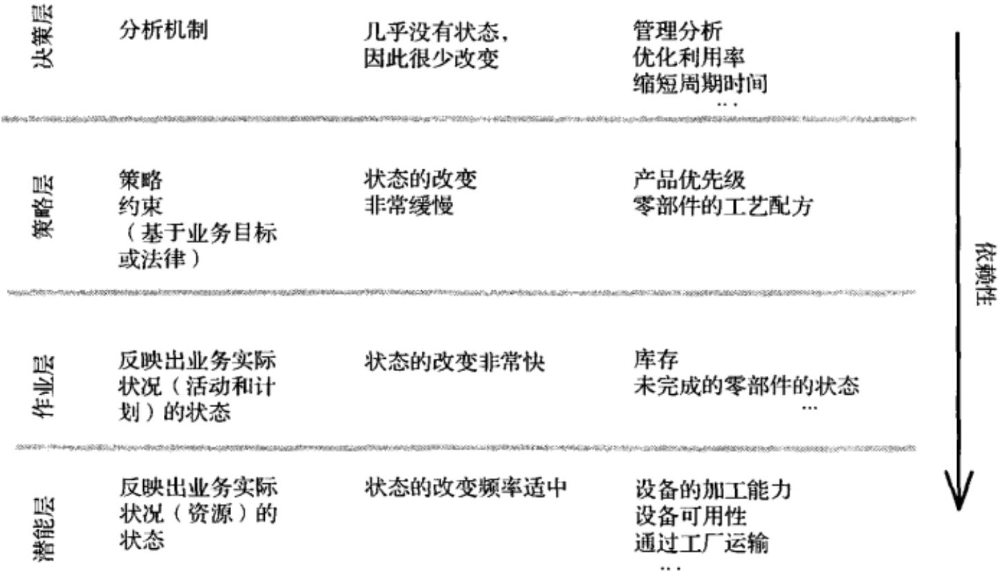


图 16-13 工厂自动化系统中的概念依赖性和切合点


很多企业并不是依靠工厂和设备能力来运营的。举两个例子，在金融服务或保险业中，潜能在很大程度上是由当前的运营状况决定的。一家保险公司在考虑签保单承担理赔责任时，要根据当前业务的多样性来判断是否有能力承担它所带来的风险。潜能层有可能会被合并到作业层中，这样就会演变出一种不同的分层结构。 

这些情况下经常出现的一个层是对客户所做出的承诺（见图 16-14）。 

□承诺层。我们承诺了什么？这个层具有策略层的性质，因为它表述了一些指导未来运营的目标；但它也有作业层的性质，因为承诺是作为后续业务活动的一部分而出现和变化的。 

潜能层和承诺层并不是互相排斥的。在有的领域中（例如一家提供很多定制运输服务的运输公司），这两个层都很重要，因此可以同时使用它们。与这些领域密切相关的其他层也会用到。我们需要对分层结构进行调整和实验，但一定要使分层系统保持简单，如果层数超过4或5，就比较难处理了。层数过多将无法有效地描述领域，而且本来要使用大比例结构解决的复杂性问题又会以一种新的方式出现。我们必须对大比例结构进行严格的精简。 

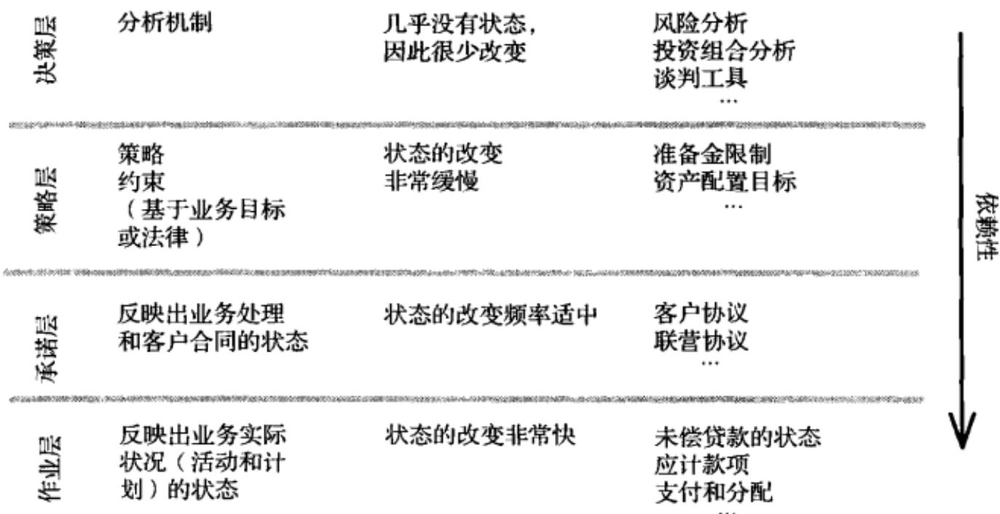


图 16-14 投资银行系统中的概念依赖性和切合点


虽然这 5 个层对很多企业系统都适用，但并不是所有领域的主要概念都涵盖在这 5 个层中。有些情况下，在设计中生硬地套用这种形式反而会起反作用，而使用一组更自然的 RESPONSIBILITY LAYER 会更有效。如果一个领域与上述讨论毫无关系，所有的分层可能都必须从头开始。最后，我们必须根据直觉选择一个起点，然后通过 EVOLVING ORDER 来改进它。 

## 16.4 模式：KNOWLEDGE LEVEL

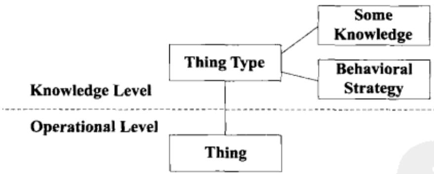


“KNOWLEDGE LEVEL 是”一组描述了另一组对象应该有哪些行为的对象。


[Martin Fowler, “Accountability,” www.martinfowler.com] 

当我们需要让用户对模型的一部分有所控制，而模型又必须满足更大的一组规则时，可以利用 KNOWLEDGE LEVEL（知识级别）来处理这种情况。它可以使软件具有可配置的行为，其中实体中的角色和关系必须在安装时（甚至在运行时）进行修改。 

在《分析模式》([Fowler 1996, pp. 24–27])一书中，知识级别这种模式是讨论在组织内部对责任进行建模的时候提到的，后来在会计系统的过账规则中也用到了这种模式。虽然有几章内容涉及此模式，但并没有为它单独开一章，因为它与书中所讨论的大部分模式都不相同。 

KNOWLEDGE LEVEL 并不像其他分析模式那样对领域进行建模，而是用来构造模型的。 

为了使问题更具体，我们来考虑一下“责任”（accountability）模型。组织是由人和一些更小的组织构成的，并且定义了他们所承担的角色和互相之间的关系。不同的组织用于控制这些角色和关系的规则大不相同。有的公司分为各个“部门”，每个部门可能由一位“主管”来领导，他要向“副总裁”汇报。而有的公司则分为各个“模块”（module），每个模块由一位“经理”来领导，他要向“高级经理”汇报。还有一些组织采用的是“矩阵”形式，其中每个人都出于不同的目的而向不同的经理汇报。 

一般的应用程序都会做一些假设。当这些假设并不恰当时，用户就会在数据录入字段中输入与预期不符的数据。由于语义被用户改变，因此应用程序的任何行为都可能会失败。用户将会想出一些迂回的办法来执行这些行为，或者关闭一些高级特性。他们不得不费力地找出他们的操作与软件行为之间的复杂对应关系。这样他们永远也得不到良好的服务。 

当必须要对系统进行修改或替换时，开发人员（或迟或早）会发现，有一些功能的真实含义并不像它们看上去的那样。它们在不同的用户社区或不同情况下具有完全不同的含义。在不破坏这些互相叠加的含义的前提下修改任何东西都是非常困难的。要想把数据迁移到一个“更合适”的系统中，必须要理解这些奇怪的部分，并对其进行编码。 

## 示例 员工工资和养老金系统，第1部分

一家中等规模公司的人力资源部门有一个用于计算工资和养老金代扣的简单程序。如图16-15和图16-16所示。 

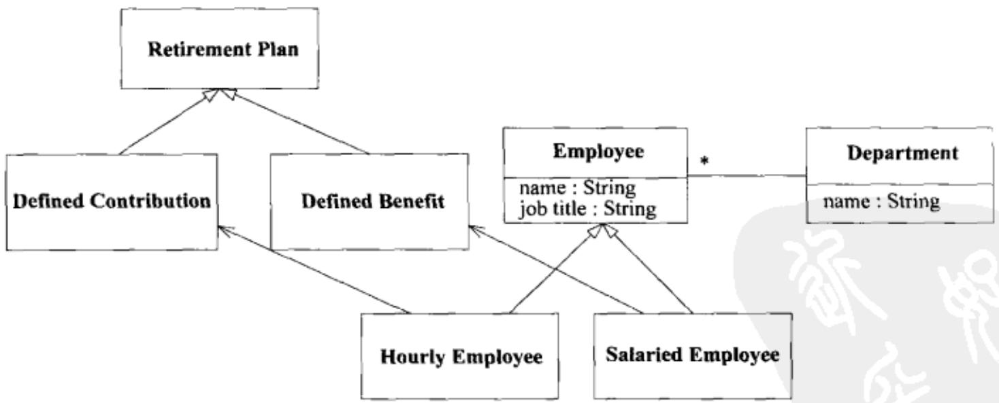


图 16-15 原来的模型，在新的需求下被过多地约束


但现在，管理层决定办公室行政人员应该进入“固定受益”（Defined Benefit）退休计划。问题在于办公室行政人员是按小时付薪酬的，而这个模型不支持混合计算。因此必须修改模型。 

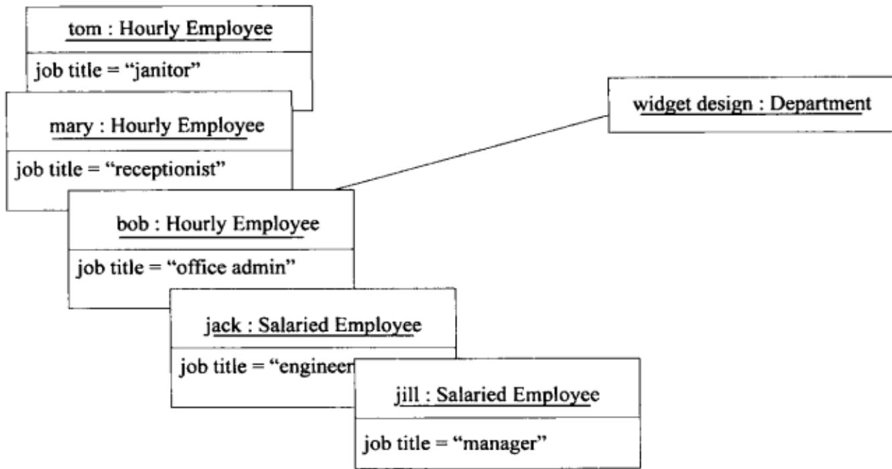


图 16-16 用原来的模型表示出来的一些员工


下面的模型提议非常简单，只是把约束去掉了，如图 16-17 所示。但也会出现一些错误，如图 16-18 所示。 

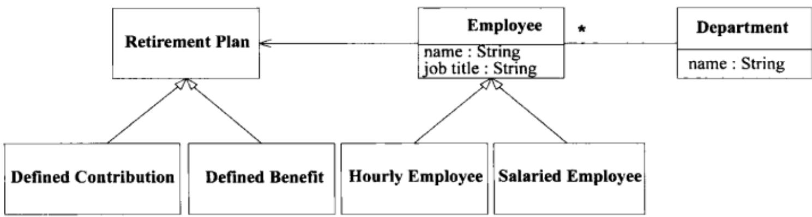


图16-17 提议的模型，现在的情况是约束过少了


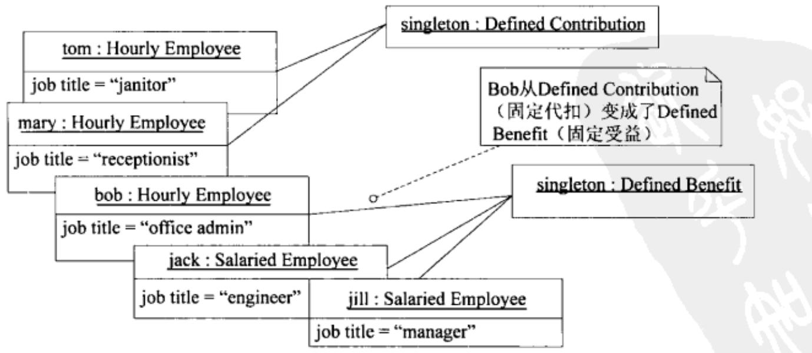


图 16-18 员工可能会与错误的计划关联起来


在这个模型中，每个员工随便加入哪一种退休计划都可以，因此每位办公室行政人员都可以改变退休计划。管理层最后放弃了这个模型，因为它没有反映出公司的策略。一些行政人员可以选择“固定受益”计划，而另外一些则不能。要是使用这个模型，连门卫也可以改变退休计划。管理层需要一个能够实施以下策略的模型： 

办公室行政人员按小时付薪酬，且采用固定受益退休计划。 

这个策略暗示出 job title（工作头衔）字段现在表示了一个重要的领域概念。开发人员可以重构模型，用 Employee Type（员工类型）把这个概念明确显示出来，如图 16-19 和图 16-20 所示。 

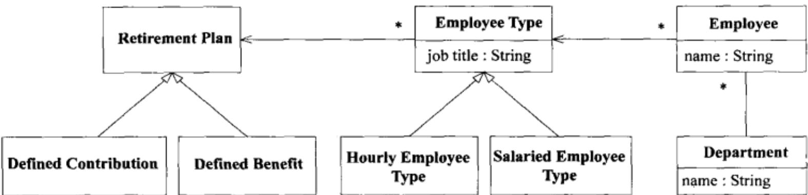


图 16-19 Type 对象能够满足需求


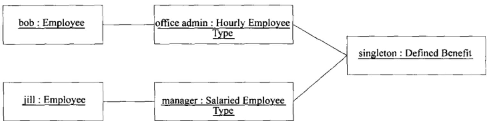


图 16-20 每个 Employee Type 被指定一个 Retirement Plan


需求可以像下面这样用 Ubiquitous LANGUAGE 来表述出来：


一个 EMPLOYEE TYPE 可以被指定两种 RETIREMENT PLAN 中的任何一种，也可以被指定两种工资中的任何一种。 

468 

EMPLOYEE 受 EMPLOYEE TYPE 约束。 

只有 superuser（超级用户）才能编辑 Employee Type 对象，而且只有当公司策略变更时，他才能修改此对象。人事部门的普通用户只能修改 Employee 对象，或只能将这些对象指定为另一种 Employee Type。 

这种模型可以满足需求。开发人员认识到了一两个隐含的概念，但这只是灵机一动才想到的。他们并没有具体的思路可供追查下去，因此他们暂时结束了这一天的工作。 

静态模型可能引起问题。但在一个过于灵活的系统中，如果任何可能的关系都允许存在，问题一样糟糕。这样的系统使用起来会很不方便，而且会导致组织无法实施自己的规则。 

让每个组织完全定制自己的软件也是不现实的，即使组织能够担负得起定制软件的费用，组织结构也可能会频繁变化。 

因此，这样的软件必须为用户提供配置选项，以便反映出组织的当前结构。问题是，在模型对象中添加这些选项会使这些对象变得难于处理。要求的灵活性越高，模型就会变得越复杂。 

如果在一个应用程序中，ENTITY 的角色和它们之间的关系在不同的情况下有很大变化，那么复杂性会显著增加。在这种情况下，无论是一般的模型还是高度定制的模型，都无法满足用户的需求。为了兼顾各种不同的情形，对象需要引用其他的类型，或者需要具备一些在不同情况下包括不同使用方式的属性。具有相同数据和行为的类可能会大量增加，而这些类的唯一作用只是为了满足不同的组装规则。 

在我们的模型中嵌入了另一个模型，而它的作用只是描述我们的模型。KNOWLEDGE LEVEL 分离了模型的这个自我定义的方面，并清楚地显示了它的限制。 

KNOWLEDGE LEVEL 是 REFLECTION（反射）模式在领域层中的一种应用，很多软件架构和技术基础设施中都使用了它，([Buschmann et al. 1996]) 中给出了详尽介绍。REFLECTION 模式能够使软件具有“自我感知”的特性，并使所选中的结构和行为可以接受调整和修改，从而满足变化需要。这是通过将软件分为两个层来实现的，一个层是“基础级别”（base level），它承担应用程序的操作职责；另一个是“元级别”（meta level），它表示有关软件结构和行为方面的知识。 

值得注意的是，我们并没有把这种模式叫做知识“层”(layer)。虽然 REFLECTION 与分层很类似，但反射却包含双向依赖关系。 

Java 有一些最基本的内置 REFLECTION 机制，它们采用的是协议的形式，用于查询一个类的方法等。这样的机制允许用户查询有关它自己的一些设计信息。CORBA 也有一些扩展（但类似）的 REFLECTION 协议。一些持久化技术增加了更丰富的自描述特性，在数据表与对象之间提供了部分自动化的映射。还有其他一些技术例子。这种模式也可以在领域层中使用。 


KNOWLEDGE LEVEL与REFLECTION所使用的术语比较


<table><tr><td>Fowler的术语</td><td><eq>POSA^{1}</eq>的术语</td></tr><tr><td>知识级别</td><td>元级别</td></tr><tr><td>操作级别</td><td>基础级别</td></tr></table>

要明确的一点是，编程语言的反射工具并不是用于实现领域模型的 KNOWLEDGE LEVEL 的。这些元对象描述的是语言构造本身的结构和行为。相反，KNOWLEDGE LEVEL 必须使用普通对象来构造。 

KNOWLEDGE LEVEL 具有两个很有用的特性。首先，它关注的是应用领域，这一点与人们所熟悉的 REFLECTION 模式的应用正好相反。其次，它并不追求完全的通用性。正如一个 SPECIFICATION 可能比通用的断言更有用一样，专门为一组对象和它们的关系定制的一个约束集可能比一个通用的框架更有用。KNOWLEDGE LEVEL 显得更简单，而且可以传达设计者的特别意图。 

因此： 

创建一组不同的对象，用它们来描述和约束基本模型的结构和行为。把这些对象分为两个“级别”，一个是非常具体的级别，另一个级别则提供了一些可供用户或超级用户定制的规则和知识。 

像所有有用的思想一样，REFLECTION 和 KNOWLEDGE LEVEL 可能令人们感到振奋，但不应滥用这种模式。它确实能够使对象不必为了满足各种不同情形下的需求而变得过于复杂，但它所引入的间接性也会使系统变得更模糊。如果 KNOWLEDGE LEVEL 太复杂，开发人员和用户就很难理解系统的行为。负责配置它的用户（或超级用户）最终将需要具备程序员的技能，甚至需要掌握处理元数据的技能。如果他们出现了错误，应用程序也将会产生错误行为。 

而且，数据迁移的基本问题并没有完全得到解决。当 KNOWLEDGE LEVEL 中的某个结构发生变化时，必须对现有的操作级别中的对象进行相应的处理。新旧对象确实可以共存，但无论如何都需要进行仔细的分析。 

所有这些问题为 KNOWLEDGE LEVEL 的设计人员增加了一个沉重的负担。设计必须足够健壮，因为不仅要解决开发中可能出现的各种问题，而且还要考虑到将来用户在配置软件时可能会出现的各种问题。如果得到合理的运用，KNOWLEDGE LEVEL 能够解决一些其他方式很难解决的问题。如果系统中某些部分的定制非常关键，而要是不提供定制能力就会破坏掉整个设计，这时就可以利用知识级别来解决这一问题。 

## 示例 员工工资和养老金系统，第2部分：KNOWLEDGE LEVEL

471 

我们的团队成员又回来了，经过了一夜的休息，他们恢复了精神，团队中的一个人对系统中一个难处理的问题有了点思路。为什么有些对象要被限制起来，而其他对象则可以自由编辑呢？那些受限制的对象让他想到了 KNOWLEDGE LEVEL 模式，他决定尝试着从这个角度来观察一下模型，才发现本来就可以用这种方式来观察模型的。 

从图 16-21 可以看出，受限制的对象都在 KNOWLEDGE LEVEL 中，而可以自由编辑的对象都在操作级别中，区分得非常清楚。虚线上面的所有对象描述了类型或长期策略。Employee Type 有效地把行为加在 Employee 上。 

这位开发人员把他的想法告诉了大家，这使另一个人又产生了另一个想法。按照 KNOWLEDGE LEVEL 对模型进行组织后，模型变得更清晰了，这使她一下子发现了昨天困扰她的那个问题——两个完全不同的概念被合并到同一个模型中。昨天她在团队讨论所使用的语言中就听到了这个问题，只是没有注意到而已： 

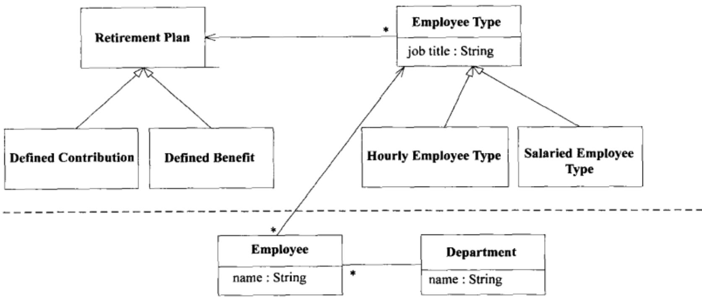


图 16-21 从现有模型中识别出隐含的 KNOWLEDGE LEVEL


一个 Employee Type 可以被指定两种 Retirement Plan 中的任何一种，也可以被指定两种工资中的任何一种。 

但这实际上并不是用 UBIQUITOUS LANGUAGE 中来表达的声明。模型中并没有 “payroll”（工资）。他们只是根据自己的需要来讲话，而没有使用实际就有的通用语言。payroll 的概念在模型中是隐含的，与 Employee Type 混在一起。在分离出 KNOWLEDGE LEVEL 以前，它并不明显，而且这个声明中的所有元素都出现在同一个级别上，只有一个元素例外。 

根据这种理解，她重构了一个真正支持该声明的模型。 

为了让用户控制那些制约对象之间关联的规则，开发团队开发了一个包含隐含 KNOWLEDGE LEVEL 的模型。 

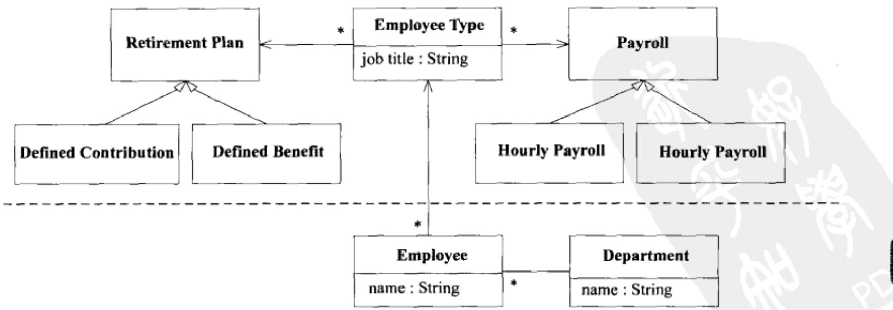


图 16-22 Payroll 现在已经显示出来了，它已与 Employee Type 分离


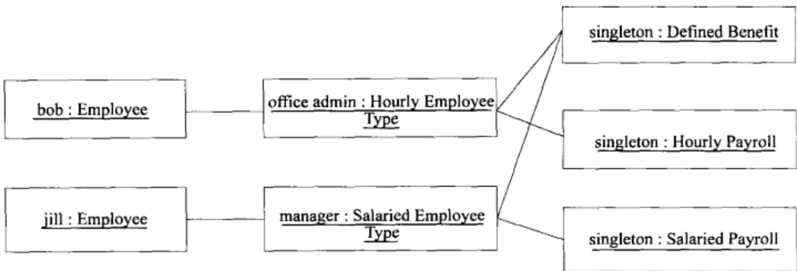


图16-23 每个EmployeeType现在都有一个RetirementPlan和一个Payroll


特有的访问约束和一种“事物-事物”型的关系对开发团队起到了提示的作用，使他们看出了隐含的 KNOWLEDGE LEVEL。一旦 KNOWLEDGE LEVEL 被分离出来，它就能够使模型变得非常清晰，从而可以通过提取出 Payroll 将两个重要的领域概念分开。 

像其他大比例结构一样，KNOWLEDGE LEVEL 也不是必须要使用的。没有它，对象照样能工作，而且团队可能仍能够认识到他们需要将 Employee Type 与 Payroll 分离。当项目进行到某个时刻，这种结构看起来已经没什么作用了，那么就可以放弃它。但现在它对于描述系统很有用，并且能够帮助开发人员理解模型。 

## * * *

乍看上去，KNOWLEDGE LEVEL 像是 RESPONSIBILITY LAYER（特别是 policy 层）的一个特例，但它并不是。首先，两个级别之间的依赖性是双向的，而在层次结构中，较低的层不依赖于较高的层。 

实际上，RESPONSIBILITY LAYER 可以与其他大部分的大比例结构共存，它提供了另一种用来组织模型的维度。 

## 16.5 模式：PLUGGABLE COMPONENT FRAMEWORK

在深入理解和反复精炼基础上得到的成熟模型中，会出现很多机会。通常只有在同一个领域中实现了多个应用程序之后，才有机会使用 PLUGGABLE COMPONENT FRAMEWORK（可插入式组件框架）。 

## * * *

当很多应用程序需要进行互操作时，如果所有应用程序都基于相同的一些抽象，但它们是独立设计的，那么在多个 BOUNDED CONTEXT 之间的转换会限制它们的集成。各个团队之间如果不能紧密地协作，就无法形成一个 SHARED KERNEL。重复和分裂将会增加开发和安装的成本，而 

且互操作会变得很难实现。 

一些成功的项目将它们的设计分解为组件，每个组件负责提供某些类别的功能。通常所有组件都插入到一个中央 hub 上，这个 hub 支持组件所需的所有协议，并且知道如何与它们所提供的接口进行对话。还有其他一些将组件连在一起的可行模式。对这些接口以及用于连接它们的 hub 的设计必须要协调，而组件内部的设计则可以更独立一些。 

有几个广泛使用的技术框架支持这种模式，但这只是次要问题。一种技术框架只有在能够解决某类重要技术问题的时候才有必要使用，例如在设计分布式系统或在不同应用程序中共享一个组件时。可插入式组件框架的基本模式是职责的概念组织，它很容易在单个的 Java 程序中使用。 

因此： 

从接口和交互中提炼出一个ABSTRACT CORE，并创建一个框架，这个框架要允许这些接口的各种不同实现被自由替换。同样，无论是什么应用程序，只要它严格地通过ABSTRACT CORE的接口进行操作，那么就可以允许它使用这些组件。 

高层抽象被识别出来，并在整个系统范围内共享，而特化（specialization）发生在 MODULE 中。应用程序的中央 hub 是 SHARED KERNEL 内部的 ABSTRACT CORE。但封装的组件接口可以把多个 BOUNDED CONTEXT 封装到其中，这样，当很多组件来自多个不同地方时，或者当组件中封装了用于集成的已有软件时，可以很方便地使用这种结构。 

475 

这并不是说不同组件一定要使用不同的模型。只要团队采用了 CONTINUOUS INTEGRATE，或者为一组密切相关的组件定义了另一个 SHARED KERNEL，那么就可以在同一个 CONTEXT 中开发多个组件。在 PLUGGABLE COMPONENT FRAMEWORK 这种大比例结构中，所有这些策略很容易共存。在某些情况下，还有一种选择是使用一种 PUBLISHED LANGUAGE 来编写 hub 的插入接口。 

PLUGGABLE COMPONENT FRAMEWORK 也有几个缺点。一个缺点是它是一种非常难以使用的模式。它需要高精度的接口设计和一个非常深入的模型，以便把一些必要的行为捕获到 ABSTRACT CORE 中。另一个很大的缺点是它只为应用程序提供了有限的选择。如果一个应用程序需要对 CORE DOMAIN 使用一种非常不同的方法，那么可插入式组件框架将起到妨碍作用。开发人员可以对模型进行特殊修改，但如果不更改所有不同组件的协议，就无法修改 ABSTRACT CORE。这样一来，CORE 的持续精化过程（也是通过重构得到更深层理解的过程）在某种程度上会陷入僵局。 

[Fayad and Johnson(2000)]中详细介绍了在几个领域中使用 PLUGGABLE COMPONENT FRAMEWORK 的大胆尝试，其中包括对 SEMATECH CIM 框架的讨论。要想成功地使用这些框架，需要综合考虑很多事情。最大的障碍可能就是人们的理解不那么成熟，要想设计一个有用的框架，必须要有成熟的理解。PLUGGABLE COMPONENT FRAMEWORK 不适合作为项目的第一个大比例结构，也不适合作为第二个。最成功的例子都是在完全开发出了多个专门应用之后才采用这种结构的。 

## 示例 SEMATECH CIM 框架

在一家生产计算机芯片的工厂中，一组一组的硅片（称为 lot）从一台机器传送到另一台机器，通过上百道加工工序，直到印刷上微电路并完成蚀刻。工厂需要一个软件来跟踪每个 lot，记录下来它上面已经完成的加工，然后指挥工人或自动设备把它送到下一台正确的机器上，并进行下一次正确的加工。这样的软件称为制造执行系统（Manufacturing Execution System, MES）。 

工厂使用了数十家供应商生产的数百台不同的机器，每道工序都仔细设计了定制的配方。为这个复杂的混合加工过程开发 MES 软件是一项异常艰巨的任务，而且费用也十分高昂。为了解决这些问题，SEMATECH（一家行业协会）开发了 CIM 框架。 

CIM 框架庞大而复杂，它有很多方面，但只有两个方面与我们这里的讨论相关。首先，这个框架为半导体 MES 领域的基本概念定义了抽象接口，换言之，以 ABSTRACT CORE 的形式定义了 CORE DOMAIN。这些接口定义既包括行为上的，也包括语义上的。 

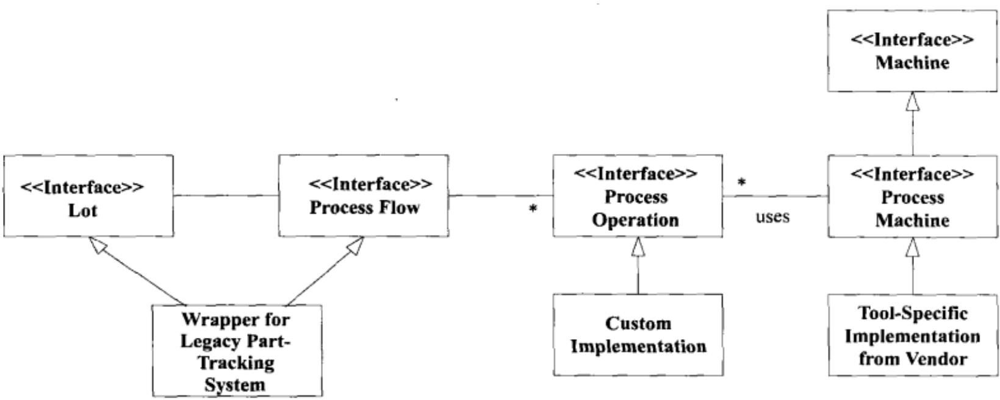


图 16-24 高度简化的 CIM 接口子集，提供了一些实现样例


如果某家供应商生产了一种新的机器，他们必须开发 Process Machine 接口的一个专用实现。只要他们遵守该接口，他们的机器控制组件就可以插入到任何基于 CIM 框架的应用程序中。 

在定义了这些接口之后，SEMATECH 又定义了组件在应用程序中进行交互时需要遵守的规则。任何基于 CIM 框架的应用程序都必须实现一个协议，通过这个协议来为那些已经实现部分接口的对象提供服务。如果这个协议已经实现，而且应用程序严格遵守抽象接口，那么这个应用程序就可以使用这些接口所提供的服务，而不用管它们是如何实现的。这些接口以及为了使用接口而实现的协议组合在一起，构成了具有严格限制的大比例结构。 

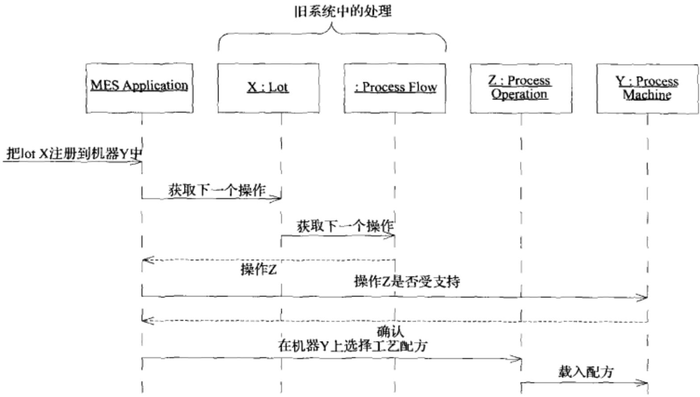


图16-25 用户把一个lot放到下一台机器上，并把这次操作记录到计算机中


这个框架需要使用专门的基础设施。它主要使用CORBA来提供持久化、事务、事件和其他技术服务。但它的PLUGGABLE COMPONENT FRAMEWORK的定义很有趣，它允许人们独立开发软件，并把开发出来的软件平滑地集成到庞大的系统中。没有人会知道这个系统中的所有细节，但每个人都理解整体视图。 

## * * *

数千人是如何分工来制作一个由40000多块组成的“艾滋病纪念拼被”的？ 

几条简单的规则为“艾滋病拼图被子”提供了一种大比例结构，而细节则由各个志愿者来完成。注意规则重点关注的三个方面，一是整体任务（纪念那些因艾滋病而死去的人们），二是各个小块所具有的那些使其容易拼到整体中的特性，三是处理更大的块的能力（例如把它折叠起来）。 

## 以下就是艾滋病纪念拼被的一个拼块的制作方法

[摘自艾滋病纪念拼被网站，www.aidsquilt.org] 

## 设计拼块

把要纪念的人的名字写到拼块上。可以自由加入其他一些信息，例如出生、死亡日期和出生地，等等，每个拼块仅限一人…… 


## 选择你的材料

记住，被单要被折叠和打开许多次，因此材料的耐久性很重要。由于胶会随着时间失效，因 

此最好把东西缝到拼块上。最好使用重量适中、不具有拉伸性的布料，例如棉帆布或毛葛。 

设计可以采用横向或纵向，但最终镶好边的拼块必须是3英尺×6英尺（90cm×180cm）——不能多也不能少！裁剪布料时，每个边留出2~3英寸的镶边。如果你自己不能镶边，我们会为你代劳。无需为拼块缝制夹层，但建议在背面缝一个衬垫，这样当把拼块放到地上时，可以保持干净，也有助于保持布料不变形。 

制作拼块 

制作拼块时可能会用到以下技术。 

☐ 缝饰：在背景布料上缝上其他的织物、信件或小的纪念品。不要使用胶水，因为它很容易失效。 

☐ 用颜料涂色：刷上纺织颜料或快速上色染料，也可以使用不褪色的墨水笔。不要使用“棉花彩” $^{①}$ ，因为它的黏性太大了。 

☐ 模绘：用铅笔把你的设计画到布料上，然后把得到的模板垫高，再用刷子涂上纺织颜料或不褪色的标记。 

□ 拼贴：在拼块上使用的材料一定不要把布料划破（因此不要使用玻璃和金属片），还要注意不要使用体积很大的物品。 

☐ 照片：加照片或信件的最好方法是把它们影印到烫印转印纸（iron-on transfer）上，再由烫印转印纸印到100%的纯棉布料上，再把这块布料缝到拼块上。也可以用乙烯材料把照片塑封起来，再缝到拼块上（不要放在中央，以避免折叠）。 

479 

## 16.6 结构应该有一种什么样的约束

本章所讨论的大比例结构很广泛，从非常宽松的 SYSTEM METAPHOR 到严格的 PLUGGABLE COMPONENT FRAMEWORK。当然，还有很多其他结构，而且，甚至在一个通用的结构模式中，在制定规则上也可以选择多种不同的严格程度。 

例如，RESPONSIBILITY LAYER规定了一种用于划分模型概念以及它们的依赖性的方式，但我们也可以添加一些规则，来指定各个层之间的通信模式。 

假设有一家制造厂，每个零件在哪台机器上加工（根据工艺配方）完全由软件来指挥。正确的加工命令是从策略层发出的，并在作业层执行。但工厂的实际生产不可避免地会有错误。实际情况将与软件的规则不符。现在，作业层必须要反映出工厂的实际情况，这意味着当一个零件偶然被放到一台错误的机器上时，机器必须无条件地接受它。这种异常情况需要以某种方式传递到更高的层。然后，决策制定层可以利用其他策略来纠正这种情况，可以把该零件重新送到修理流程或直接丢弃它。但作业层不知道较高层的任何信息。通信必须是单向的，不能让较低层产生对 

较高层的依赖性。 

通常，这种信号传递是通过某种事件机制实现的。每当作业层对象的状态发生变化时，它们就将生成事件。策略层对象将监听来自较低层的相关事件。如果一个事件违反了某个规则，该规则将执行一个动作（规则定义的一部分）来给出适当的响应，或者生成一个事件反馈给更高的层，以便帮助更高的层做出决策。 

例如在银行中，当投资组合中的某些部分发生变动时，资产的价值会发生改变（作业层）。当这些值超过投资组合的配置限制时（策略层），交易商可能就会接到通知，然后他可以通过买入或卖出资产来恢复平衡。 

我们可以为每种不同的情况设计不同的事件机制，也可以让特殊层中的对象在交互时遵守一种一致的模式。结构越严格，一致性就越高，设计也越容易理解。如果结构适当的话，规则将推动开发人员得出好的设计。不同的部分之间会更协调。 

480 

另一方面，约束也会限制开发人员所需的灵活性。在异构系统中，特别是当系统使用了不同的实现技术时，可能无法跨越不同的 BOUNDED CONTEXT 来使用非常特殊的通信路径。 

因此一定要克制，不要滥用框架和死板地实现大比例结构。大比例结构的最重要的贡献在于它具有概念上的一致性，并帮助我们更深入地理解领域。每条结构规则都应该使开发变得更容易实现。 

## 16.7 通过重构得到更适当的结构

在当今这个时代，软件开发行业正在努力摆脱过多的预先设计，因此一些人会把大比例结构看作是倒退回了过去那段使用瀑布架构的令人痛苦的年代。但实际上，只有深入地理解领域和问题才能发现一种非常有用的结构，而获得这种深刻的理解的有效方式就是迭代开发过程。 

团队要想坚持 EVOLVING ORDER 原则，必须在项目的整个生命周期中大胆地反复思考大比例结构。团队不应该一成不变地使用早期构思出来的那个结构，因为那时所有人对领域或需求的理解都不够完善。 

遗憾的是，这种演变意味着最终的结构不会在项目一开始就被发现，而且我们必须在开发过程中进行重构，以便得到最终的结构。这可能很难实现，而且需要高昂的代价，但这样做是非常必要的。有一些通用的方法可以帮助控制成本并最大化收益。 

## 16.7.1 最小化

控制成本的一个关键是保持一种简单、轻量级的结构。不要试图使结构面面俱到。只需解决最主要的问题即可，其他问题可以留到后面一个一个地解决。 

开始最好选择一种松散的结构，例如 SYSTEM METAPHOR 或几个 RESPONSIBILITY LAYER。不管怎样，一种最小化的松散结构可以起到轻量级的指导作用，它有助于避免混乱。 

## 16.7.2 沟通和自律

整个团队在新的开发和重构中必须遵守结构。要做到这一点，整个团队必须理解这种结构。必须把术语和关系纳入到 Ubiquitous LANGUAGE 中。 

大比例结构为项目提供了一个术语表，它概要地描述了整个系统，并且使不同人员能够做出一致的决策。但由于大多数大比例结构只是松散的概念指导，因此团队必须要自觉地遵守它。 

如果很多人不遵守结构，它慢慢就会失去作用。这时，结构与模型和实现的各个部分之间的关系无法总是在代码中明确地反映出来，而且功能测试也不再依赖结构了。此外，结构往往是抽象的，因此很难保证在一个大的团队（或多个团队）中一致地应用它。 

在大多数团队中，仅仅通过沟通是不足以保证在系统中采用一致的大比例结构的。至关重要的一点是要把它合并到项目的通用语言中，并让每个人都严格地使用 UBIQUITOUS LANGUAGE。 

## 16.7.3 通过重构得到柔性设计

其次，对结构的任何修改都可能导致大量的重构工作出现。随着系统复杂度的增加和人们理解的加深，结构会不断演变。每次修改结构时，必须修改整个系统，以便遵守新的秩序。显然这需要付出大量工作。 

但这并不像听上去那么糟糕。根据我的观察，采用了大比例结构的设计往往比那些未采用的设计更容易转换。即使是从一种结构更改为另一种结构（例如从 METAPHOR 改为 LAYER）也是如此。我无法完全解释清楚这是什么原因。部分原因是当完全理解了某个系统的当前布局之后，再重新安排它就会更容易，而且先前的结构使得重新布局变得更容易。还有部分原因是用于维护先前结构的那种自律性已经渗透到了系统的各个方面。但我觉得还有更多的原因，因为当一个系统先前已经使用了两种结构时，它的更改甚至更加容易。 

一件新皮茄克穿起来又硬又不舒服，但穿了一天之后，肘部经过若干次弯曲后就会变得更容易弯曲。再穿几天之后，肩部也会变得宽松，茄克也更容易穿上了。几个月后，皮质开始变得柔软，穿着会更舒适，也更容易穿上。同样，对模型反复进行合理的转换也有相同效果。不断增加的知识被合并到模型中，更改的要点已经被识别出来，并且更改也变得更灵活，同时模型中一些稳定的部分也得到了简化。这样，底层领域的更显著的 CONCEPTUAL CONTOUR 就会在模型结构中浮现出来。 

## 16.7.4 通过精炼可以减轻负担

对模型施加的另一项关键工作是持续精炼。这可以从各个方面减小修改结构的难度。首先，从 CORE DOMAIN 中去掉一些机制、GENERIC SUBDOMAIN 和其他支持结构，需要重构的内容就少多了。 

如果可能的话，应该把这些支持元素简单地定义成符合大比例结构的形式。例如，在一个 

RESPONSIBILITY LAYER 系统中，可以把 GENERIC SUBDOMAIN 定义成只适合放到某个特定层中。当使用了 PLUGGABLE COMPONENT FRAMEWORK 的时候，可以把 GENERIC SUBDOMAIN 定义成完全由某个组件拥有，也可以定义成一个 SHARED KERNEL，供一组相关组件使用。这些支持元素可能需要进行重构，以便找到它们在结构中的适当位置，但它们的移动与 CORE DOMAIN 是独立的，而且移动也限制在很小的范围内，因此更容易实现。最后，它们都是次要元素，因此它们的精化不会影响大局。 

通过精炼和重构得到更深层理解的原理甚至也适用于大比例结构本身。例如，最初可以根据对领域的初步理解来选择分层结构，然后逐步用更深层次的抽象（这些抽象表达了系统的基本职责）来代替它们。这种极高的清晰度使人们能够透彻地理解领域，这也是我们的目标。它也是一种使系统的整体控制变得更容易、更安全的手段。 


## 领域驱动设计的综合运用

前面3章给出了领域驱动战略设计的很多原则和技术。在一个大的、复杂的系统中，可能需要在一个设计中综合运用几种策略。那么，大比例结构如何与CONTEXT MAP共存？应该把构造块放到哪里？第一步先做什么？第二步和第三步呢？如何设计你的战略？ 

## 17.1 把大比例结构与 BOUNDED CONTEXT 结合起来使用

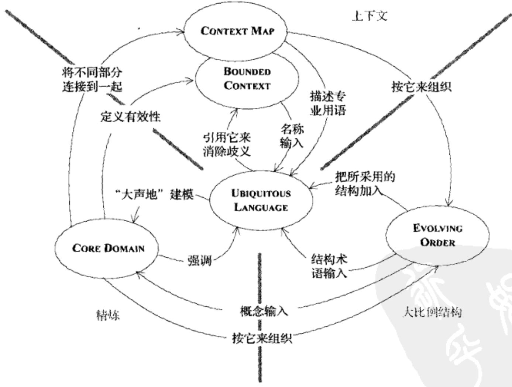


485 

图17-1 

战略设计的三个基本原则（上下文、精炼和大比例结构）并不是可以互相代替的，而是互为补充，并且以多种方式交互。例如，一种大比例结构可以存在于一个BOUNDED CONTEXT中，也可 以跨越多个BOUNDED CONTEXT存在，并用于组织CONTEXT MAP。 

前面的RESPONSIBILITY LAYER的例子被限定在一个BOUNDED CONTEXT中。这是解释这一思想的最简单的方法，也是该模式的一般用法。在这样的简单场景中，层的名称的含义仅用于该CONTEXT，该CONTEXT中的模型元素或子系统接口的名称也是如此。 

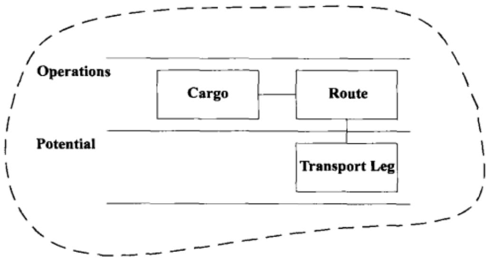


图17-2 在一个BOUNDED CONTEXT内部构造一个模型


这样的局部结构在一个非常复杂但统一的模型中是很有用的, 它使系统所能承受的复杂度的上限提高了, 进而使得在一个BOUNDED CONTEXT中可以维护更多的对象。 

但是在很多项目中，更大的挑战是知道怎样使各个不同的部分构成一个整体，如图17-3所示。这些部分可能被划分到不同的BOUNDED CONTEXT中，但是各个部分在整个集成系统中的作用是什么，它们之间又是如何互相关联的？理解了这些问题之后就可以用大比例结构来组织CONTEXT MAP。在这种情况下，结构的术语适用于整个项目（或至少是项目中某个明确限定的部分）。 

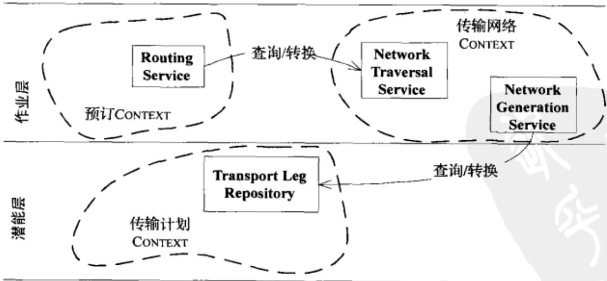


图17-3 在不同BOUNDED CONTEXT的组件关系上所使用的结构


假设你打算采用RESPONSIBILITY LAYER模式，但你有一个遗留系统，它的组织结构与你想要


采用的大比例结构不一致。那么是否必须放弃LAYERS模式？不必放弃它，但是你必须确定遗留系统在新结构中的位置，如图17-4所示。实际上，职责层可能有助于刻画出遗留系统的特征。遗留系统所提供的SERVICE可以只被限定到几个层中。如果我们能够说出遗留系统与哪几个特定的RESPONSIBILITY LAYER相符，那么这就非常精确地描述了遗留系统的范围和角色的关键方面。 

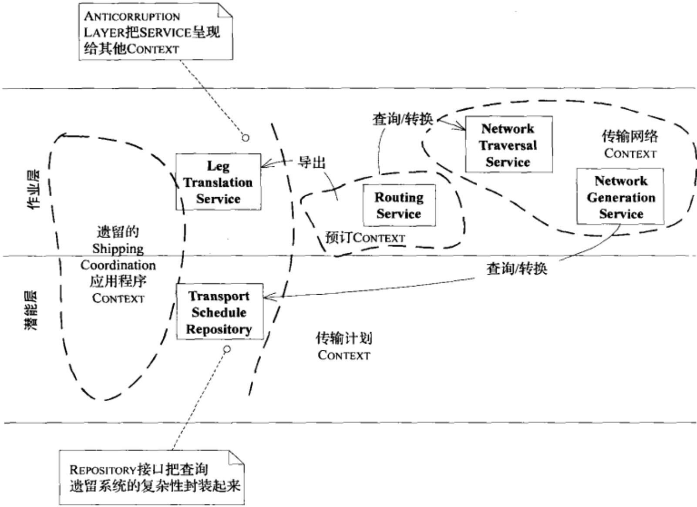


487 


图17-4 允许一些组件跨越多个层的结构


如果遗留子系统的功能是通过一个FACADE来访问的，那么就可以把该FACADE所提供的每项SERVICE都设计到一个层中。 

在这个示例中，Shipping Coordination应用程序是一个遗留系统，它的内部机制是作为一个无差别的整体呈现出来的。但如果项目团队已经很好地建立了一种跨CONTEXT MAP的大比例结构，那么团队可以选择在他们的CONTEXT中按照已经熟悉的层来组织模型，如图17-5所示。 

当然，由于每个BOUNDED CONTEXT都是其自己的名称空间，因此在一个CONTEXT中可以使用一种结构来组织模型，而在相邻的CONTEXT中则可以使用另一种结构，然后再使用一种别的结构来组织CONTEXT MAP。但是，使用过多的结构就会损害大比例结构作为项目统一概念集的价值。 

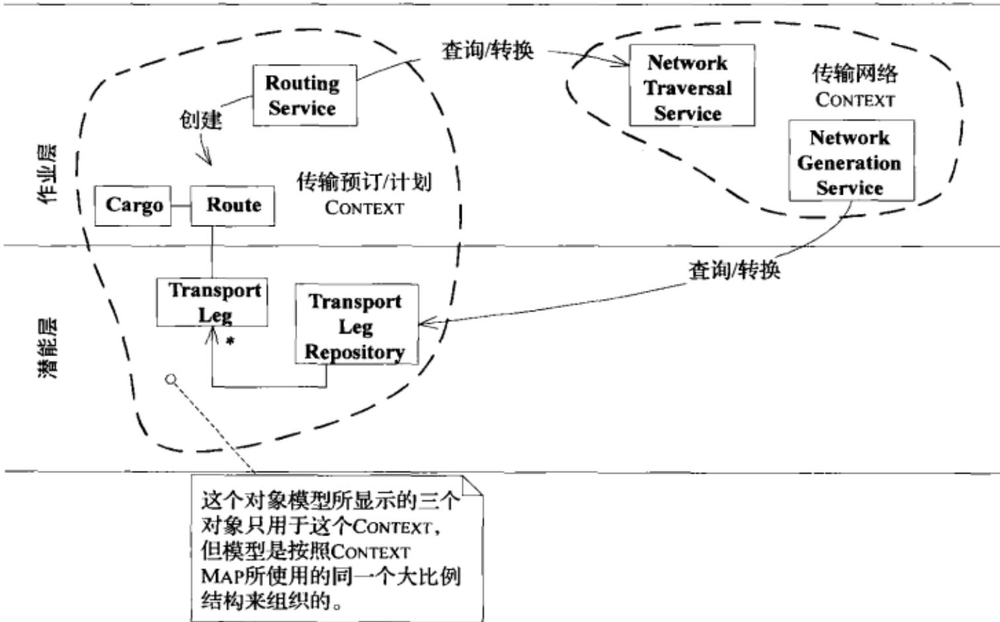


图17-5 在一个CONTEXT中和整个CONTEXT MAP（作为一个整体）中使用同一种结构


## 17.2 将大比例结构与精炼结合起来使用

大比例结构和精炼的概念也是互为补充的。大比例结构可以帮助解释CORE DOMAIN内部的关系以及GENERIC SUBDOMAIN之间的关系，如图17-6所示。 

同时，大比例结构本身也可能是CORE DOMAIN的一个重要部分。例如，把潜能层、作业层、策略层和决策支持层区分开，能够提炼出对软件所要解决的业务问题的基本理解。当项目被划分为多个BOUNDED CONTEXT时，这种理解会特别有用，这样CORE DOMAIN的模型对象就不会具有过多的含义。 

## 17.3 首先评估

当对一个项目进行战略设计时，首先需要清晰地评估当前现状。 

(1) 画出 CONTEXT MAP。你能画出一个一致的图吗？有没有一些模棱两可的情况？ 

(2) 注意项目上的语言使用。有没有UBIQUITOUS LANGUAGE? 这种语言是否足够丰富，以便帮助开发？ 

(3) 理解重点所在。CORE DOMAIN被识别出来了吗？有没有DOMAIN VISION STATEMENT？你能写一个吗？ 

(4) 项目所采用的技术是遵循MODEL-DRIVEN DESIGN，还是与之相悖？ 

(5) 团队开发人员是否具备必要的技能？ 

(6) 开发人员是否了解领域知识？他们对领域是否感兴趣？ 

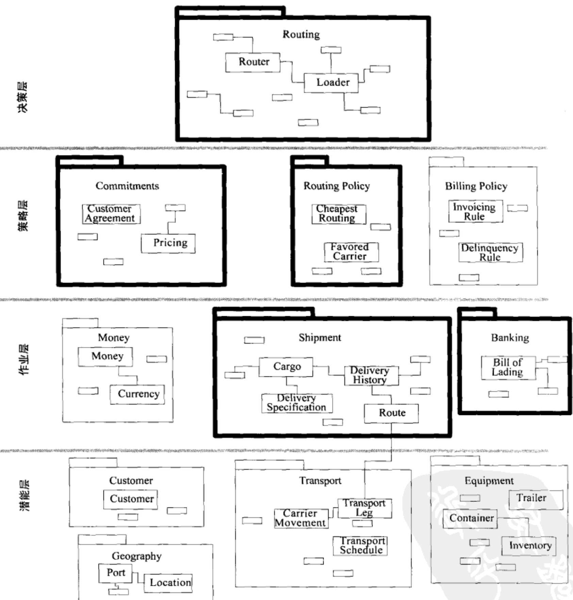


图17-6 通过分层把CORE DOMAIN的MODULE（用粗框显示）和GENERIC SUBDOMAIN分得更清楚


当然，我们不会发现完美的答案。我们现在对项目的了解永远不如将来的了解深入。但这些问题为我们提供了一个可靠的起点。当知道了这些问题的初步答案后，我们就会明白什么是最迫切需要解决的。随着时间的推进，我们可以得出更精炼的答案，特别是CONTEXT MAP、DOMAIN VISION STATEMENT，以及其他创建出来的工件，这些答案都反映出了变化的情况和新的理解。 

## 17.4 由谁制定策略

传统上，架构是在应用程序开发开始之前建立的，并且在这种组织中，负责建立架构的团队比应用开发团队拥有更大的权力。但我们并不一定得遵循这种传统的方式，因为它并不总是十分有效。 

战略设计必须明确地应用于整个项目。项目有很多组织方式，这一点我并不想做过多的说明。但是，要想使决策制定过程更有效，需要注意一些基本问题。 

首先，我们简单介绍一下我曾见过的两种在实践中具有一定价值的风格（摒弃了传统的“由高层制定决策”的做法）。 

## 17.4.1 从应用程序开发自动得出的结构

一个非常善于沟通、懂得自律的团队在没有核心领导的情况下照样能够很好地工作，他们能够遵循EVOLVING ORDER来达成一组共同遵守的原则，这样就能够有机地形成一种秩序，而不用靠命令来约束。 

这是极限编程团队的典型模式。从理论上讲，任何一对儿编程人员都可以根据自己的理解来完全自发地创建一种结构。通常，让团队中的一个人（或几个人）来承担大比例结构的一定监管职责有利于保持结构的统一。如果这位承担监管职责的非正式的领导人也是一位负责具体工作的开发人员（仲裁者和协调员），而不是决策的唯一制定者，那么这种方法将特别有效。在我见过的极限编程团队中，这样的策略设计领导者可能会自动出现，他的角色就像是一位教练。不管这个自动出现的领导人是谁，他仍然是开发团队的成员之一。由此可见，开发团队必须至少有几位具有这样才干的人，由他们来制定一些运用到整个项目中的设计决策。 

当多个团队使用同一种大比例结构时，密切相关的团队可以开始非正式的协作。在这种情况下，每个应用程序团队仍会产生对这种大比例结构的各自的想法，而其中有些特殊的选择则由一个非正式的委员会来讨论，这个委员会由各个团队的代表组成。在评估了这些选择对设计的影响之后，委员会决定是采用它、修改它，还是放弃它。团队在这种松散的合作关系下一起前进。这种安排在团队数目相对较少的时候很有效，因为各个团队之间能够一致地保持彼此协调，他们的设计能力大致相同，而且他们的结构需求基本是一致的，可以通过同一种大比例结构来满足。 

## 17.4.2 以客户为中心的架构团队

当几个团队共用同一种策略时，确实需要集中制定一些决策。架构师如果脱离实际开发工作， 就可能会设计出失败的模型，但这是完全可以避免的。架构团队可以把自己放在与应用开发团队平等的位置上，帮助他们协调大比例结构、BOUNDED CONTEXT边界和其他一些跨团队的技术问题。为了在这个过程中发挥作用，架构团队必须把思考的重点放在应用程序的开发上。 

在组织结构图中，这样的团队看起来与传统的架构团队没什么分别，但实际上二者在每一项活动中都存在不同。架构团队的成员是真正的开发协作者，他们与开发人员一起发现模式，与各个团队一起通过反复实验进行精炼，并亲自动手参与开发工作。 

这种场景我曾经见到过几次，项目最终会由一位架构师来领导，下面列出的大部分工作都会由他来完成。 

## 17.5 制定战略设计决策的 6 个要点

## 决策必须传达到整个团队

显然，如果不能确保团队中的所有人都知道策略并去遵守它，那么策略也就失去了作用。这个要求引导人们以架构团队（具有正式的“权威”）为中心组织到一起，以便在整个项目中应用一致的规则。然而具有讽刺意味的是，那些脱离实际开发工作的架构师往往会被人们忽略或躲开。如果架构师没有实践经验，又试图把他们自己的规则强加于实际的应用程序，那么他们所设计出来的模式就会不切实际，这时开发人员除了忽略他们之外别无选择。 

在一个沟通良好的项目中，应用开发团队所产生的策略设计实际上会更有效地传播到每个人。这样策略将会实际发挥作用，而且具有权威性，因为它是通过集体智慧制定的决策。 

无论开发什么系统，都不要用管理层所授予的权力来强制地推行战略决策，而应该更多地关注开发人员与策略之间的实际关系。 

## 决策过程必须收集反馈意见

无论是建立组织原则、大比例结构还是精炼过程，都需要非常精细的工作，因此需要真正理解项目的需求和领域概念。那些唯一具有这方面深层次知识的人就是应用程序的开发团队。这解释了为什么架构团队所创建的应用架构很少对项目产生帮助，尽管我们必须承认很多架构师都非常有才能。 

与技术基础设施和架构不同，战略设计虽然影响到所有的开发工作，但是它本身并不需要编写很多代码。战略设计真正需要的是应用开发团队的参与。经验丰富的架构师可以听取来自各个团队的想法，并促进总体解决方案的开发。 

我曾经与一个技术架构团队合作过，这个团队实际上把成员轮流派到使用其架构的各个应用开发团队中。这种流动性既使架构团队亲身体验到了开发人员所面临的挑战，同时也把如何应用框架的知识传播给了开发人员。战略设计同样需要这种紧凑的反馈循环。 

## 计划必须允许演变

有效的软件开发是一个高度动态的过程。如果最高层的决策已经固定下来，那么当团队需要对变更做出响应时，选择就会更少。遵循EVOLVING ORDER这一原则，可以避免出现这个问题， 因为它强调的是根据理解的不断加深来修改大比例结构。 


当很多设计决策过早地固定下来时，开发团队可能会束手束脚，失去解决问题的灵活性。因此，虽然那些为了协调项目而制定的原则可能很有价值，但原则必须能够随着项目开发生命周期的进行而完善和变化，而且不能过分限制应用程序开发人员的权力，因为开发工作本来就已经很难了。 

有了积极的反馈之后，当在构建应用程序的过程中遇到障碍或是出现了意外的机会时，就能够自然地进行创新。 

493 

## 架构团队不必把所有最好、最聪明的人员都吸收进来

架构层次的设计确实需要技术精湛的人员，而这样的人员总是供不应求。项目经理往往会把那些最有技术天分的开发人员调到架构团队和基础设施团队中，因为他们想要充分利用这些高级设计人员的技能。在项目经理看来，开发人员都希望提高自己的影响力，或是攻克那些“更有趣”的问题。而且，加入精英团队本身也会赢得威望。 

这样往往会把那些技术能力较差的人留下来实际构建应用程序。但要想开发出优秀的应用程序，是需要设计技巧的，因此这样安排注定会失败。即使战略团队建立了一个伟大的战略设计，应用程序开发团队也没有能力把它实现出来。 

相反，架构团队几乎从来不会把那些缺乏设计技巧但精通领域知识的开发人员吸纳进来。战略设计并不是一项纯粹的技术任务，把那些精通深层次领域知识的开发人员排除在外只会使架构师的工作更难进行。而且同样也需要领域专家的参与。 

所有应用程序团队都应该有一些技术能力很强的设计人员，而且任何从事战略设计的团队也都必须具有领域知识，这两者都是非常重要的。聘用更多高级设计人员是很有必要的，而且使架构团队偶尔从事一下开发工作也会很有帮助。我相信有很多有用的方法，但任何有效的战略团队必须要与一个有效的应用程序团队通力合作。 

## 战略设计需要遵守简约和谦逊的原则

任何设计工作都必须精炼而简约，而战略设计更要简约。即使是一个非常小的设计失误也有可能会变成可怕的隐患。把架构团队单分出来时要格外慎重，因为他们将更少感知他们为应用程序开发团队所设置的障碍。同时，架构师对其主要职责的过度关注会使他们迷失方向。我就曾多次看到过这种情况，甚至我自己也犯过这种错误。有了一个好的想法后，又会引出另一个想法，想法太多最后就会得到一个过度设计的架构，这种体系结构反而起到了负面作用。 

相反，我们必须严格地约束自己，从而使所设计出来的组织原则和核心模型精简到只包含那些能够显著提高设计清晰度的内容。事实上，几乎任何事物都会对其他某个事物构成障碍，因此每个元素都必须是确实值得存在的。我们需要有一个谦逊的态度，才能认识到我们自己认为的最佳思路可能会对某个人构成障碍。 

对象的职责要专一，而开发人员应该是多面手 

好的对象设计的本质是只为每个对象分配一个明确且专一的职责，并且把对象之间的互相依 赖性减至绝对最小。有时人们会试图让团队中的交流像软件中的交互那样整齐。其实在一个优秀的项目中，会有很多人参与其他人的事情。开发人员有时也处理框架，而架构师有时也会编写应用程序代码。所有人员都可以互相交流。这种看似无秩序的工作其实是很有效率的。因此，应该让对象有专一的职责，而让开发人员成为多面手。 

由于我已经把战略设计与其他设计区分开了，以帮助澄清所涉及的工作，因此在这里必须指出有两种设计活动并不意味着有两种人员。基于深层模型创建一个柔性设计是一种高级的设计活动，但一些细节问题也十分重要，因此设计工作必须由一个从事编码工作的人来完成。战略设计源自应用设计，然而战略设计需要有一个总体的开发活动视图，这个视图可能跨越多个团队。人们总喜欢想出各种办法把工作分得很细，以使得设计专家不必了解业务，而领域专家也不用知道技术。一个人能学的知识是有限的，但过于专业化也会削弱领域驱动设计的力量。 

## 17.5.1 技术框架同样如此

技术框架提供了基础设施层，从而使应用程序不必自己去实现基本服务，而且技术框架还能帮助把领域与其他关注点隔离开，因此它能够极大地加速应用程序（包括领域层）的开发。但技术框架也是有风险的，那就是它会影响领域模型实现的表达能力，并妨碍领域模型的自由改变。甚至当框架设计人员并没有特意去干涉领域层或应用层的时候，情况同样如此。 

用于克服战略设计缺点的原则同样适用于技术架构。遵守演变、简约等原则并且让应用程序开发团队参与进来，就能够得到一组持续精化的服务和规则，这些服务和规则能够真正有助于应用程序的开发，而不会妨碍开发。如果架构不按照这种路线来设计，那么它们要么会抑制应用程序开发的创造力，要么被人们绕过去了，从而导致应用程序为了能够把开发进行下去而根本没有使用架构。 

有一种态度肯定会使框架流于失败。 

## 不要编写“傻瓜式”的框架

在划分团队时，如果认为一些开发人员不够聪明，无法胜任设计工作，而让他们去做开发工作，那么这种态度可能会导致失败，因为他们低估了应用程序开发的难度。如果这些人在设计方面不够聪明，就不应该让他们来开发软件。如果他们足够聪明，那么用“傻瓜式”的框架来应付他们只会为他们造成障碍，使他们得不到所需的工具。 

这种态度还会损害团队之间的关系。我就曾经在这样傲慢自大的团队中感到疲惫不堪，于是我每次谈话都得向开发人员道歉，我自己也因为有这样自大的同事而感到难堪（我恐怕永远也无法改变这样的团队）。 

注意，把无关的技术细节封装起来与我所反对的那种预打包完全不同。框架可以为开发人员提供有力的抽象和工具，使他们不用去做那么多苦差事。有用的封装和“傻瓜式”的预打包之间的区别很难用一种通用的方式描述出来，但只要问问框架设计人员他们对将要使用工具/框架/组件的那些人有什么期望，就可以看出区别。如果设计人员对框架的用户非常尊重，那么他们的工 

作方向可能就是正确的。 

## 17.5.2 注意总体规划

由Christopher Alexander领导的一群建筑师（设计实际大楼的建筑师）在建筑和城市规划领域中提倡“聚少成多地成长”（piecemeal growth）。他们非常好地解释了总体规划失败的原因。 

496 

如果没有某种规划过程，那么俄勒冈州大学的校园永远不会像剑桥大学校园那样庞大、和谐而井井有条。 

总体规划是解决这种难题的传统方法。它试图建立足够多的指导方针，来保持整体环境的一致性，同时仍然为每幢建筑保留自由度，并为适应局部需要预留下广阔的空间。 

……将来这所大学的所有部分将构成一个一致的整体，因为它们只是被“插入”到总体设计的各个位置中。 

……实际上总体规划会失败，因为它只是建立了一种极权主义的秩序，而不是一种有机的秩序。它们过于生硬了，因此不容易根据自然变化和不可预料的社会生活变化来做出调整。当这些变化发生时……总体规划就变得过时了，而且不再被人们遵守。即使人们遵守总体规划……它们也没有足够详细地指定建筑物之间的联系，人口规模、功能均衡等等这些用来帮助每幢建筑的局部行为和设计很好地符合整体环境的方面。 

……试图驾驭这种总体规划过程非常类似于在小孩的填色本上填充颜色……这个过程最多也不过是得到一种极为平常的秩序。 

……因此，通过总体规划是无法得到一种有机的秩序的，因为这个规划既过于精确，又不够精确。它在整体上过于精确了，而在细节上又不够精确。 

……总体规划的存在疏远了用户[因为，从根本上讲]大部分重要决策已经确定下来了，因此社区成员对社区未来的建设几乎没有什么影响了。 

$$
- - \text {摘自} O r e g o n E x p e r i m e n t, \mathrm{pp.16-28([Alexanderetal.1975])}
$$

Alexander和他的同事倡议由社区成员共同制定一组原则，并在“聚少成多地成长”的每次行动中都应用这些原则，这样就会形成一种“有机秩序”，并且能够根据环境变化作出调整。 

497 

## 结束语

## 后记

虽然开发最前沿的项目并体验有趣的思想和工具会带来巨大的成就感，但我认为如果软件得不到有效的应用，那么一切都将成为为空谈。事实上，检验软件成功与否的最有效的方法是让它运行一段时间。近年来，我从我经历过的项目中总结出了一些经验。 

这里我们来谈一下其中的5个项目，每个项目都认真尝试了领域驱动的设计，尽管它们并没有系统地采用这种方法，当然也不能真正称为领域驱动的设计。这5个项目都完成了软件交付工作，其中有4个项目坚持采用模型驱动的设计方法，并得到了一个这样的设计，而有一个项目却没有这样做。一些应用程序经过了多年的成长和改变，但有一个程序一直没有进步，还有一个很早就夭折了。 

第 1 章中描述的 PCB 设计软件的 beta 版本在业内引起了一次很大的轰动，但遗憾的是，发起该项目的公司在它的营销方面做得非常失败，导致该项目无疾而终。少数一些保留了 beta 版副本的 PCB 工程师现在仍在使用该软件。像所有缺乏支持的软件一样，它会被继续使用下去，直到其中集成的某个程序发生重大改变为止。 

第 9 章中介绍的贷款软件在发生突破之后，经历了 3 年波澜不惊的发展。在此之后，该项目 

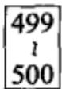


一片新种植的橄榄林


脱离出来，成为一家独立的公司。在重组的过程中，从一开始就领导这个项目的经理被解聘了，一些核心开发人员也随他一起离开。新的团队有一套稍微不同的设计思想，他们不是完全遵循对象建模。但保留了具有复杂行为的独特的领域层，而且在他们的开发团队中依旧非常重视领域知识。在新公司独立运转7年后，该软件仍在不断增加新的功能。它在业内是一个领先的应用程序，正在为越来越多的客户机构服务，也是公司最大的收入来源。 

到领域驱动的方法广为流行的时候，对很多 

项目中的相关软件的创建将会变得更快、更高效。但最终项目仍不免按传统的套路发展，导致先前精炼的深层模型无法被充分利用，更谈不上去增强它的能力了。可能我的期望过高了，但如果做不到这一点，项目就无法在长达数年的期间内为用户提供稳定的价值。 

我曾经与另一位开发人员结对儿做过一个项目，我们为客户编写一个实用工具，客户用这个工具来开发他们的核心产品。所需的功能及功能组合相当复杂。我很喜欢这个项目的工作，我们也开发出了一个具有ABSTRACT CORE的柔性设计。这个软件交付以后，每个人涉及的工作也就结束了。由于项目交接之后就与我们无关了，交接过程显得有些突兀，因此我估计那些用来支持元素组合的特性可能很难被客户理解，而且有可能被替换为更典型的事例逻辑。但这种情况并没有马上发生。当我们交付软件的时候，程序包含一个完整的测试套件和一个精炼文档。新的团队成员用这个文档来指导他们的工作。他们对这个软件做了一番研究之后，很高兴地发现我们的设计提供了各种可以利用的机会。当我在一年之后听到他们的评论时，我知道我们的UBIQUITOUS LANGUAGE已经引起了新团队的极大兴趣，而且这种语言仍然充满活力并继续发展。 


7年之后


又一年过去了，我听到一个完全不同的故事。团队遇到了新的需求，开发人员们发现用原来的设计已经无法满足这些新需求。他们不得不修改设计，这一改几乎使原来的设计面目全非。在了解了一些细节之后，我发现我们原来的模型用来解决这些问题时显然十分蹩脚。往往就是在这个时候有可能产生一次突破，形成一个更深层的模型，特别是在这个例子中，开发人员已经积累了大量的深层领域知识和经验。事实上，他们确实形成了新的理解，并最终根据这些理解对模型和设计进行了转换。 

他们小心翼翼地、委婉地告诉了我这件事情， 

我猜他们可能是担心我在听到如此多的先前工作被丢弃后会感到不满。但是我对自己的设计并没有这种守旧情结。一个成功的设计并不一定要永远保持不变。如果把人们赖以工作的一个系统封闭起来，那么它将会变为一项永久的、触及不到的遗留资产。深层模型可以使人们清楚地看懂它，并据此产生新的理解，而柔性设计可以促进后续的修改。他们提出了一个更深层的模型，这个模型更符合用户关心的需求。他们的设计解决了实际问题。变更是软件的固有性质，因此这个程序在拥有它的团队的手中得到了继续发展。 

本书很多章节中都提到过运输的例子，这个例子大体上是基于一家大型国际集装箱运输公司的项目。在早期，项目的领导者们采用了领域驱动的方法，但他们一直没有建立一种支持该方法的开发文化。几支具有不同设计技术水平和对象经验的团队分头开始创建模块，但他们之间的工作只是由团队领导者之间的非正式合作和一个主要负责客户事务的架构团队来粗略地协调。我们确实开发出了一个合理的、深层的 CORE DOMAIN 模型，也有一个可使用的 UBIQUITOUS LANGUAGE。 

但公司的文化非常不利于迭代开发，因此我们过了很长时间才形成了一个可用的内部版本。因此，问题到了后期阶段才暴露出来，而此时修复的话就要冒很大的风险并且要付出高昂的代价。我们发现了模型的某些方面会引起数据库性能问题。反馈（无论是实现问题，还是模型修改）是MODEL-DRIVEN DESIGN的一个自然的部分，但那时我们感觉到我们已经在开发这条路上走得太远了，以至于很难再修改模型的基本部分了。相反，我们对代码做了修改，使它更有效，但代码与模型的联系却被削弱了。最初的版本也暴露出了在技术基础设施扩展方面的局限性，这使管理层感到担忧。项目组聘请了专家来修复基础设施问题，而且项目也恢复了开发。但实现与领域建模之间却始终没有形成一个闭合的循环。 

有几个团队交付了不错的软件——实现了复杂的功能，模型也表达得很清楚。而有些团队交付的软件却很生硬，只是简单地根据模型开发出数据结构（尽管他们也保留了 Ubiquitous LANGUAGE 的痕迹）。可能使用 CONTEXT MAP 也是于事无补，因为各个团队的开发结果之间没有什么必然联系。然而，用 Ubiquitous LANGUAGE 开发出来的 CORE 模型确实帮助团队把各自的工作整合为一个系统。 

虽然范围缩小了，项目还是替换了几个遗留系统。虽然大部分设计都不够灵活，但整体的设计还是通过一个共享的概念集凝聚到了一起。经过几年之后，系统本身已经退化为一项遗留资产，但它仍在为全球业务提供全天候的服务。虽然有几支团队完成了出色的工作，而且公司有着雄厚的财力，但整个项目最后还是逾期了。项目的文化从来没有真正采纳过 MODEL-DRIVEN DESIGN 方法。现在的这个新的开发是在不同平台上进行的，而且也基本上不受我们的工作影响了，因为新的开发人员有着他们自己的传统开发风格。 

在一些领域中，像运输公司最初设定的那样宏伟的目标是不可信的。更好的做法是开发小的、确保能够交付的应用程序，并坚持用最简单的设计来实现简单的功能。这种保守的方法有它自己的用武之地，可以使项目范围保持精简，并且使项目具有快速响应的能力。但集成的、模型驱动的系统所提供的价值是那些拼凑起来的系统无法提供的。但我们还有一种方法，那就是使用领域驱动的设计构建一个深层的模型和柔性设计，这样，具有丰富功能的大型系统就能够逐步增长。 

最后我们来说一下Evant，这是一家开发库存管理系统的公司，我曾在这家公司做过辅助支持的工作，也为公司已经很健壮的设计文化作出了一点贡献。有些人把这个项目看作是极限编程的典型代表，但很少有人注意到它也广泛应用了领域驱动的设计。在这个项目中，模型被不断精炼，并且用更柔性的设计表达出来。这个项目在2001年的“dotcom”泡沫破裂以前一直在快速发展。不过随后由于投资断流，公司一度萎缩，软件开发也基本上陷入休眠状态，看起来离倒闭的日子不远了。但在2002年夏季，Evant被一个世界排名前十的零售商看中。这家潜在的客户喜欢Evant的产品，但产品需要改变设计，以便扩展系统来支持大量库存规划操作。这是Evant的最后机会。 

虽然项目人员已萎缩至4人，但团队仍然有实力。他们都具有精湛的技术，并且掌握了大量领域知识，而且其中一位成员还精通系统的扩展问题。他们有着非常高效的开发文化，代码库也实现了柔性设计，因此便于修改。在那个夏天，这4位开发人员经过艰巨的努力终于使系统能够处理数 以十亿计的规划元素以及数百个用户。借助于这些强大功能，Evant赢得了这家大客户。不久之后，它被另一家公司收购，这家公司希望利用他们的软件以及他们所展示出的能力来应对新的需求。 

领域驱动的设计文化（以及极限编程文化）在公司过渡期间幸存下来并获得了新生。现在，模型和设计仍在不断发展，比两年前我工作的时候要丰富和灵活得多。而且 Evant 团队并没有被收购它的公司同化，相反，在 Evant 团队成员的带动下，公司现有项目团队正在向 Evant 团队的开发文化转变。这个故事还远未结束。 

没有哪个项目会用到本书中介绍的所有技术。尽管如此，我们很容易通过几个方面辨认出一个项目是否采用了领域驱动的设计。标志性的特征是“把理解目标领域并把学到的知识融合到软件中当作首要任务”。其他工作都以它为前提。团队成员在项目中有意识地使用通用语言，并且不断对语言进行精化。由于他们不断地学习越来越多的领域知识，因此他们永远不会满足于现有领域模型的质量。他们把持续精化视作机会，把不适当的模型视作风险。他们知道，开发出高质量的、能够清晰反映出领域模型的软件并非易事，因此他们一丝不苟地运用设计技巧。他们也因为遇到障碍而跌倒过，但却始终坚持自己的原则，百折不挠，继续前进。 

## 未来展望

气候、生态系统和生物学以前被认为是杂乱无章的，是与物理或化学恰好相反的“软”领域。然而，近来人们认识到这种“混乱”的表象实际上提出了一个具有深远意义的技术挑战，这意味着要去发现和理解这些非常复杂的现象之中蕴含的规律。被人们认为很“复杂”的领域是很多科学的前沿。虽然有才能的软件工程师通常都认为纯粹的技术任务是最有趣、最有挑战性的，但领域驱动设计展现了一个同样富有挑战性（甚至具有更大挑战性）的新领域。业务软件大可不必是拼凑而成的杂乱系统。与一个复杂的领域“搏斗”，把它转化为一个可理解的软件设计，这对于优秀的技术人员来说是一项激动人心的挑战。 

由外行创建复杂软件的时代还远未到来。虽然掌握了一些初级技术的众多编程人员可以开发出特定种类的软件，但他们绝对无法开发出能在危急关头拯救公司的软件。工具构建人员必须确保他们开发出的工具能够提高那些优秀软件开发人员的能力和工作效率。真正需要做的事是更加透彻地研究领域模型，并在可运行的软件中把它们表示出来。我非常希望能够使用出于这个目的而设计的新工具和技术来进行实验。 

然而，尽管好的工具很有价值，但我们不能把注意力都放在工具上而忽视掉一个基本的事实——创建好的软件是一项需要学习和思考的活动。建模需要想象力和自律。好的工具能够帮助我们思考或避免分心。企图自动实现一些只有通过思考才能完成的任务是不切实际的，如果这样做的话，产生的效果只会适得其反。 

利用已有的工具和技术，我们可以开发出比当今大多数项目更有价值的系统。我们可以编写优秀的软件，这样的软件使用起来是一种乐趣，它在扩展的时候不会对我们构成限制，反而会为我们创造新的机会，并且会不断为其使用者提供价值。 

## 附录

我的第一部“靓车”是一部已经使用了8年的标致（Peugeot），这是我大学毕业后不久别人送给我的。有人把这款车称为“法国的梅赛德斯”，它制造精良，驾驶起来非常舒适，而且安全性很高。但到我手里时，它已经有一些年头了，因此很容易出毛病，而且需要更多的保养。 

标致是一家老牌公司，数十年来一直沿着自己的发展路线前进。它有自己的机械术语、设计和特殊风格，甚至零部件的拆卸有时也不是标准的。这导致标致车只有标致公司的专家才能修理，维修费用对于一个刚毕业的、没多少收入的学生来说是一个潜在的问题。 

在一次平常的维护中，我把车开到当地一家机修工那里检查漏油问题。他检查了底盘，告诉我油是“从距离车尾大概2/3位置处的一个小箱子里漏出来的，这个小箱子看起来与前后轮之间的制动力分配有关”。随后他拒绝了为我修车，建议我去找50英里之外的经销商。任何机修工都可以修理福特或本田汽车，这就是为什么这些车开起来更方便而且维修费用也较低的缘故，尽管它们在机械制造上与标致汽车同样复杂。 

虽然我确实喜欢这部车，但我再也不想拥有一部古怪的车了。有一天车被检出了一个问题，而对它的维修费用却相当昂贵。我实在是受不了这辆标致了，于是就把车送给了当地一家接受汽车捐赠的慈善机构。然后我买了一辆旧的本田思域，买这辆车的钱跟那辆标致的修理费差不多。 

领域开发缺乏标准的设计元素,因此每个领域模型和对应的实现都很奇怪且难以理解。此外,每个团队都必须重复地设计轮子（或齿轮，或雨刷）。在面向对象的设计中，所有的一切都是对象、引用或消息，这些都是有用的抽象。但这并不足以约束领域设计的选择范围，也无法支持对领域模型进行简练的讨论。 

“一切都是对象”这个观点就好像木匠或建筑师把房屋归纳为“一切都是屋子”一样。屋子有大有小，有电源插座和水池的大屋子可以做饭，楼上则是睡觉用的小屋子。描述一间普通的房子可能需要许多页纸的篇幅。于是，建造和使用房屋的人意识到房屋需要遵循一些模式，这些模式都有特殊的名称，例如“厨房”。这种语言使人们能够对房屋设计进行简练的讨论。 

此外，并非所有的功能组合都是实用的。为什么不建一个既能供我们洗澡又能供我们睡觉的房间呢？这样不是很方便吗？但长期的经验已经形成了习惯，我们把“浴室”和“卧室”分开。毕竟，洗浴设施往往可以与更多的人共用，而卧室则不然。浴室需要最大限度地保证个人独处， 甚至包括那些共用同一个卧室的其他人也不能未经同意而同时使用这个浴室。而且，浴室需要装备特殊的、昂贵的设施。浴缸和卫生间通常设在一个房间里，因为它们都需要相同的基础设施（水和排水管道），还因为二者都需要保护隐私。 

另一类需要安装特殊设施的房间是我们用来做饭的房间，也称为“厨房”。与浴室相比，厨房没有隐私需求。由于厨房的设计同样很昂贵，因此通常一所房屋（即使是很大的房屋）只有一个厨房。这种单一性也促使我们形成了准备全家共用的食物和共同用餐的习惯。 

当我说我需要一所有三间卧室、两间浴室和一个开放式厨房的房屋时，我把大量的信息打包到一句很短的话里，并且避免了很多愚蠢的错误，例如把抽水马桶放在冰箱旁边。 

在每个设计领域（例如汽车、皮划艇或软件）中，我们都会把设计建立在已有模式上，在已有主题范围内即兴发挥。有时我们必须发明一些全新的东西。但是，以标准的模式元素为基础，可以避免把精力浪费在那些已经存在了解决方案的问题上，从而集中精力关注我们的特殊问题。此外，根据传统的模式来建立自己的设计可以避免产生一个过于特殊化的、很难交流的设计。 

508 

虽然软件设计领域不像其他设计领域那么成熟，各种情况变化多端，无法像汽车零部件或房屋那样具体地应用模式，但不管怎样都不能仅仅停留在“一切都是对象”这种层次上，至少要分清“螺栓”和“弹簧”。 

20 世纪 70 年代，一群由 Christopher Alexander（[Alexander et al. 1977]）领导的建筑师提出了一种共享和标准化设计思想的理念。他们的“模式语言”把一些经过事实检验的解决方案组合在一起，用来解决一些公共的问题（这些问题比“厨房”要复杂多了，可能会使 Alexander 的一些读者望而却步）。他们的目的是让房屋的建造者和使用者用这种语言进行交流，并且在这些模式的指导下建造出优美的建筑物，为房屋的使用者提供实用的功能，并让他们产生良好的体验。 

无论建筑师们是怎样想的，这种模式语言已经对软件设计产生了重大的影响。在20世纪90年代，软件模式被应用在很多方面，并且获得了一些成功，特别是在详细设计（[Gamma et al]）和技术架构（[Buschmann et al. 1996]）方面获得了显著成功。近来，模式已经在基本的面向对象设计技术（[Larman 1998]）和企业架构（[Fowler 2002, Alur et al. 2001]）中得到了验证。模式语言现在已成为组织软件设计思想的主流技术。 

模式名称应该作为团队语言中的术语来使用，我在本书中就是这样使用它们的。当在讨论中出现模式名时，一律采用了英文小体大写格式，以便于区分。 

以下是本书讨论模式时所采用的格式。有的模式与这个基本格式略有不同，因为我喜欢具体问题具体对待，而且我认为可读性比严格的结构更为重要…… 

模式：模式名称 

[概念的说明。有时用一种形象的比喻或引起读者兴趣的文字。] 

[上下文。对概念与其他模式相关性的简单解释。有些情况下是一段简单的模式概述。 

但是，本书中的大部分上下文讨论都是在每章的引言以及其他叙述段落中给出的，而不是在模式中给出的。 

## * * * ]

## [问题讨论]

问题小结 

通过解决问题的讨论形成一个解决方案。 

因此： 

解决方案小结。 

结果。实现考虑。示例。 

## * * *

结论。简单解释这种模式如何引出后续模式。 

[实现问题的讨论。在 Alexander 最初的格式中，这个讨论应该放在一个段落内，描述问题的解决，本书一般是按照 Alexander 的方法来组织的。但有些模式需要较长的实现讨论。为了保证核心模式讨论的紧凑，我把这些较长篇幅的实现讨论移到了模式讨论的后面。 

510 

此外，较长的示例，特别是涉及多个模式组合的示例，也放在模式之外进行讨论。] 

## 术语表

以下是本书中所选用的术语、模式名和其他概念的简要定义。 

AGGREGATE（聚合）——聚合就是一组相关对象的集合，我们把聚合作为数据修改的单元。外部对象只能引用聚合中的一个成员，我们把它称为根。在聚合的边界之内应用一组一致的规则。 

分析模式（analysis pattern）——分析模式是用来表示业务建模中的常见构造的概念集合。它可能只与一个领域有关，也可能跨多个领域（[Fowler 1997, p. 8]）。 

ASSERTION（断言）——断言是对程序在某个时刻的正确状态的声明，它与如何达到这个状态无关。通常，断言指定了一个操作的结果或者一个设计元素的固定规则。 

BOUNDED CONTEXT（限界上下文）——特定模型的限界应用。限界上下文使团队所有成员能够明确地知道什么必须保持一致，什么必须独立开发。 

客户（client）——一个程序元素，它调用正在设计的元素，使用其功能。 

内聚（cohesion）——逻辑协定和依赖性。 

命令，也称为修改器命令（command/modifier）——使系统发生改变的操作（例如，设置变量）。它是一种有意产生副作用的操作。 

CONCEPTUAL CONTOUR（概念轮廓）——领域本身的基本一致性，如果它能够在模型中反映出来的话，则有助于使设计更自然地适应变化。 

上下文(context)——一个单词或句子出现的环境,它决定了其含义。参见 BOUNDED CONTEXT。 

CONTEXT MAP（上下文图）——项目所涉及的限界上下文以及它们与模型之间的关系的一种表示。 

CORE DOMAIN（核心领域）——模型的独特部分，是用户的核心目标，它使得应用程序与众不同并且有价值。 

声明式设计（declarative design）——一种编程形式，由精确的属性描述对软件进行实际的控制。它是一种可执行的规格。 

深层模型（deep model）——领域专家们最关心的问题以及与这些问题最相关的知识的清晰表示。深层模型不停留在领域的表层和粗浅的理解上。 

设计模式（design pattern）——设计模式是对一些互相交互的对象和类的描述，我们通过定制这些对象和类来解决特定上下文中的一般设计问题（[Gamma et al. 1995, p. 3]）。 

精炼（distillation）——精炼是把一堆混杂在一起的组件分开的过程，从中提取出最重要的内容，使得它更有价值，也更有用。在软件设计中，精炼就是对模型中的关键方面进行抽象，或者是对大系统进行划分，从而把核心领域提取出来。 

领域（domain）——知识、影响或活动的范围。 

领域专家（domain expert）——软件项目的成员之一，精通的是软件的应用领域而不是软件开发。并非软件的任何使用者都是领域专家，领域专家需要具备深厚的主题知识。 

领域层（domain layer）——在分层架构中负责领域逻辑的那部分设计和实现。领域层是在软件中用来表示领域模型的地方。 

ENTITY（实体）——一种对象，它不是由属性来定义的，而是通过一连串的连续事件和标识定义的。 

FACTORY（工厂）——一种封装机制，把复杂的创建逻辑封装起来，并为客户抽象出所创建的对象的类型。 

函数（function）——一种只计算和返回结果而没有副作用的操作。 

不可变的（immutable）——在创建后永远不发生状态改变的一种特性。 

隐式概念（implicit concept）——一种为了理解模型和设计的意义而必不可少的概念，但它从未被提及。 

INTENTION-REVEALING INTERFACE（释意接口）——类、方法和其他元素的名称既表达了初始开发人员创建它们的目的，也反映出了它们将会为客户开发人员带来的价值。 

固定规则（invariant）——一种为某些设计元素做出的断言，除了一些特殊的临时情况（例如方法执行的中间，或者尚未提交的数据库事务的中间）以外，它必须一直保持为真。 

迭代（iteration）——程序反复进行小幅改进的过程。也表示这个过程中的一个步骤。 

大比例结构（large-scale structure）——一组高层的概念和/或规则，它为整个系统建立了一种设计模式。它使人们能够从大的角度来讨论和理解系统。 

LAYERED ARCHITECTURE（分层架构）——一种用于分离软件系统关注点的技术，它把领域层与其他层分开。 

生命周期（life cycle）——一个对象从创建到删除中间所经历的一个状态序列，通常具有一些约束，以确保从一种状态变为另一种状态时的完整性。它可能包括 ENTITY 在不同的系统和 BOUNDED CONTEXT 之间的迁移。 

模型（model）——一个抽象的系统，描述了领域的所选方面，可用于解决与该领域有关的问题。 

MODEL-DRIVEN DESIGN（模型驱动的设计）——软件元素的某个子集严格对应于模型的元素。也代表一种合作开发模型和实现以便互相保持一致的过程。 

建模范式（modeling paradigm）——一种从领域中提取概念的特殊方式，与工具结合起来使用，为这些概念创建软件类比。（例如，面向对象编程和逻辑编程。） 

REPOSITORY（存储库）——一种把存储、检索和搜索行为封装起来的机制，它类似于一个对象集合。 

职责（responsibility）——执行任务或掌握信息的责任（[Wirfs-Brock et al. 2003, p. 3]）。 

SERVICE（服务）——一种作为接口提供的操作，它在模型中是独立的，没有封装的状态。 

副作用（side effect）——由一个操作产生的任何可观测到的状态改变，不管这个操作是有意的还是无意的（即使是一个有意的更新操作）。 

SIDE-EFFECT-FREE FUNCTION（无副作用的函数）——参见[FUNCTION] 

STANDALONE CLASS（孤立的类）——无需引用任何其他对象（系统的基本类型和基础库除外）就能够理解和测试的类。 

无状态（stateless）——设计元素的一种属性，客户在使用任何无状态的操作时，都不需要关心它的历史。无状态的元素可以使用甚至修改全局信息（即它可以产生副作用），但它不保存影响其行为的私有状态。 

战略设计（strategic design）——一种针对系统整体的建模和设计决策。这样的决策影响整个项目，而且必须由团队来制定。 

柔性设计（supple design）——柔性设计使客户开发人员能够掌握并运用深层模型所蕴含的潜力来开发出清晰、灵活且健壮的实现，并得到预期结果。同样重要的是，利用这个深层模型，开发人员可以轻松地实现并调整设计，从而很容易地把他们的新知识加入到设计中。 

UBIQUITOUS LANGUAGE（通用语言）——围绕领域模型建立的一种语言，团队所有成员都使用这种语言把团队的所有活动与软件联系起来。 

统一（unification）——模型的内部一致性，使得每个术语都没有歧义且没有规则冲突。 

VALUE OBJECT（值对象）——一种描述了某种特征或属性但没有概念标识的对象。 

WHOLE VALUE（完整值）——对单一、完整的概念进行建模的对象。 

## 参考文献


Alexander, C., M. Silverstein, S. Angel, S. Ishikawa, and D. Abrams. 1975. The Oregon Experiment. Oxford University Press. 


Alexander, C., S. Ishikawa, and M. Silverstein. 1977. A Pattern Language: Towns, Buildings, Construction. Oxford University Press. 


Alur, D., J. Crupi, and D. Malks. 2001. Core J2EE Patterns. Sun Microsystems Press. 


Beck, K. 1997. Smalltalk Best Practice Patterns. Prentice Hall PTR. 


——. 2000. Extreme Programming Explained: Embrace Change. Addison-Wesley. 


——. 2003. Test-Driven Development: By Example. Addison-Wesley. 


Buschmann, F., R. Meunier, H. Rohnert, P. Sommerlad, and M. Stal. 1996. Pattern-Oriented Software Architecture: A System of Patterns. Wiley. 


Cockburn, A. 1998. Surviving Object-Oriented Projects: A Manager's Guide. Addison-Wesley. 


Evans, E., and M. Fowler. 1997. "Specifications." Proceedings of PLoP 97 Conference. 


Fayad, M., and R. Johnson. 2000. Domain-Specific Application Frameworks. Wiley. 


Fowler, M. 1997. Analysis Patterns: Reusable Object Models. Addison-Wesley. 


——. 1999. Refactoring: Improving the Design of Existing Code. Addison-Wesley. 


——. 2003. Patterns of Enterprise Application Architecture. Addison-Wesley. 


Gamma, E., R. Helm, R. Johnson, and J. Vlissides. 1995. Design Patterns. Addison-Wesley. 


Kerievsky, J. 2003. "Continuous Learning," in Extreme Programming Perspectives, 


Michele Marchesi et al. Addison-Wesley. 


——. 2003. Web site: http://www.industriallogic.com/xp/refactoring. 


Larman, C. 1998. Applying UML and Patterns: An Introduction to Object-Oriented Analysis and Design. Prentice Hall PTR. 


Merriam-Webster. 1993. Merriam-Webster's Collegiate Dictionary. Tenth edition. Merriam-Webster. 


Meyer, B. 1988. Object-oriented Software Construction. Prentice Hall PTR. 


Murray-Rust, P., H. Rzepa, and C. Leach. 1995. Abstract 40. Presented as a poster at the 210th ACS 


Meeting in Chicago on August 21, 1995. http://www.ch.ic.ac.uk/cml/Pinker, S. 1994. The Language Instinct: How the Mind Creates Language. HarperCollins. 


Succi, G. J., D. Wells, M. Marchesi, and L. Williams. 2002. Extreme Programming Perspectives. Pearson Education. 


Warmer, J., and A. Kleppe. 1999. The Object Constraint Language: Precise Modeling with UML. Addison-Wesley. 


Wirfs-Brock, R., B. Wilkerson, and L. Wiener. 1990. Designing Object-Oriented Software. Prentice Hall PTR. 


Wirfs-Brock, R., and A. McKean. 2003. Object Design: Roles, Responsibilities, and Collaborations. Addison-Wesley. 


## 图片说明

本书中的所有图片均已得到使用许可。 

Richard A. Paselk, Humboldt State University 

星盘图（第3章，P30） 

© Royalty-Free/Corbis
指印（第5章，P56），加油站（第5章，P67），Auto工厂（第6章，P89），图书管理员（第6章，P97） 

Martine Jousset
葡萄（第6章，P81），新种植的和长大后的橄榄林（结束语，P346和P347） 

Biophoto Associates/Photo Researchers, Inc. 

电子显微镜下的颤藻细胞（第14章，P235） 

Ross J. Venables  
划手（一群和单个）（第14章，P239和P260） 

Photodisc Green/Getty Images
赛跑者（第 14 章，P250），儿童（第 14 章，P253） 

U.S. National Oceanic and Atmospheric Administration
中国长城（第 14 章，P255） 

© 2003 NAMES Project Foundation, Atlanta, Georgia. 

Photographer Paul Margolies. www.aidsquilt.org 

艾滋拼被（第16章，P303） 


# 索引

索引中的页码为英文原书页码，与本书边栏页码一致。 

## A

ABSTRACT CORE, 435-437 

ADAPTERS, 367 

AGGREGATES
definition（定义），126-127
examples（例子），130-135, 170-171, 177-179
invariants（固定规则），128-129
local vs. global identity（本地标识与全局标识），127
overview（概述），125-129
ownership relationships（所属关系），126 

Agile design（敏捷设计）
Distillation（精炼），483
MODULES, 111
reducing dependencies（降低依赖性），265, 435-437, 463
supple design（柔性设计），243-244, 260-264 

AIDS Memorial Quilt Project（艾滋病纪念拼被），479 

Analysis patterns（分析模式）. 参见 design patterns.
concept integrity（概念完整性），306-307
definition（定义），293
example（示例），295-306
overview（概述），294
UBIQUITOUS LANGUAGE, 306-307 

ANTICORRUPTION LAYER
ADAPTERS, 367
considerations（考虑因素）, 368-369
example（示例）, 369-370
FACADES, 366-367
interface design（接口设计）, 366-369
overview（概述）, 364-366
relationships with external systems（与外部系统的关系）, 384-385
Application layer（应用层）, 70, 76-79 

Architectural frameworks（架构框架），70, 74, 156-157, 271-272, 495-496 

ASSERTIONS, 255-259 

Associations（关联） 

bidirectional（双向的）, 102-103
example（示例）, 169-170
for practical design（为了获得更实用的设计）, 82-88
VALUE OBJECTS, 102-103 

Astrolabe（星盘）, 47
Awkwardness（不足之处）, concept analysis（概念分析）,
210-216 

## B

Bidirectional associations（双向关联），102-103 

Blind men and the elephant（盲人与象），377-381 

Bookmark anecdote（书签趣闻），57-59 

BOUNDED CONTEXT. 参见 CONTEXT MAP.
code reuse (代码重用), 344
CONTINUOUS INTEGRATION, 341-343
defining (定义), 382
duplicate concepts (重复的概念), 339-340
example (示例), 337-340
false cognates (假同源), 339-340
large-scale structure (大比例结构), 485-488
overview (概述), 335-337
relationships (关系), 352-353
splinters (不一致), 339-340
testing boundaries (测试边界), 351
translation layers (转换层), 374. 参见 ANTICORRUPTION
LAYER; PUBLISHED LANGUAGE.
vs. MODULES, 335
Brainstorming (头脑风暴), 7-13, 207-216, 219 

Breakthroughs（突破），193-200, 202-203 

Business logic, in user interface layer（业务逻辑，位于用户界面层）, 77 

Business rules（业务规则）, 17, 225 

## C

Callbacks（回调模式），73 

Cargo shipping examples (货运示例). 参见 examples, cargo shipping. 

Changing the design（改变设计）. 参见 refactoring. 

Chemical warehouse packer example(化学品仓库打包示例), 235-241 

Chemistry example（化学示例），377 

Cleese, John, 5 

CLOSURE OF OPERATIONS, 268-270 

Code as documentation（作为文档的代码），40 

Code reuse（代码重用）
BOUNDED CONTEXT, 344
GENERIC SUBDOMAINS, 412-413
reusing prior art（借鉴先前的经验）, 323-324 

Cohesion（内聚），MODULES, 109-110, 113 

COHESIVE MECHANISMS
and declarative style（声明式风格），426-427
example（示例），425-427
overview（概述），422-425
vs. GENERIC SUBDOMAINS, 425 

Common language（公共语言）. 参见 PUBLISHED LANGUAGE; UBIQUITOUS LANGUAGE. 

Communication（沟通）, speech（讲话）. 参见 UBIQUITOUS LANGUAGE. 

Communication（共同），written（书面的）. 参见 documents; UML (Unified Modeling Language); UBIQUITOUS LANGUAGE. 

Complexity（复杂性），reducing（减少）。参见 distillation; large-scale structure(大比例结构); LAYERED ARCHITECTURE; supple design（柔性设计）。 

COMPOSITE pattern, 315-320 

Composite SPECIFICATION, 273-282 

Concept analysis（概念分析）. 参见 analysis patterns; examples, concept analysis.

Awkwardness（不足之处），210-216

Contradictions（矛盾之处），216-217

explicit constraints（显式的约束），220-222

language of the domain experts（领域专家的语言）， 

206-207 

missing concepts（丢失的概念）, 207-210 

processes as domain objects（作为领域对象的过程），222-223 

trial and error（尝试和出错）, 219 

CONCEPTUAL CONTOURS, 260-264 

Conceptual layers（概念层），参见 LAYERED ARCHITECTURE; RESPONSIBILITY LAYERS 

Configuring（配置） SPECIFICATION, 226-227 

CONFORMIST, 361-363, 384-385 

Constructors, 141-142, 174-175. 参见 FACTORIES. 

CONTEXT MAP. 参见 BOUNDED CONTEXT.
Example（示例）, 346-351
organizing and documenting（组织和文档化）, 351-352
overview（概述）, 344-346
vs. large-scale structure（大比例结构）, 446, 485-488 

CUSTOMER/SUPPLIER DEVELOPMENT TEAMS, 356-360 

defining BOUNDED CONTEXT, 382 

deployment（部署）,387 

external systems（外部系统），383-385 

integration（集成），384-385 

merging（合并）OPEN HOST SERVICE and PUBLISHED LANGUAGE, 394-396 

merging（合并）SEPARATE WAYS and SHARED KERNEL, 389-391  
merging（合并）SHARED KERNEL and CONTINUOUS INTEGRATION, 391-393 

packaging（打包）,387
phasing out legacy systems(逐步淘汰遗留系统),393-394 

for a project in progress（对于一个正在开发的项目），388-389 

SEPARATE WAYS, 384-385 

SHARED KERNEL, 354-355 

specialized terminologies（专用术语），386-387 

system under design（正在设计的系统），385-386 

team context（团队上下文），382 

trade-offs（折中，权衡），387 

transformations（转换）,389 

transforming boundaries（转换边界）, 382-383 

Context principle（上下文主题），328-329. 参见 BOUNDED 

CONTEXT; CONTEXT MAP.
CONTINUOUS INTEGRATION, 341-343, 391-393. 参见 integration.
Continuous learning（持续学习）, 15-16
Contradictions（矛盾之处）, concept analysis（概念分析）, 216-217
CORE DOMAIN
DOMAIN VISION STATEMENT, 415-416
flagging key elements（表明核心元素）, 419-420
MECHANISMS, 425
Overview（概述）, 400-405
Costs of architecture dictated MODULES（支配 MODULE 的架构的代价）, 114-115
Coupling（耦合）MODULES, 109-110
Customer-focused teams（以客户为中心的团队）, 492
CUSTOMER/SUPPLIER, 356-360 

## D

Database tuning（优化数据库），example（示例），102  
Declarative design（声明式设计），270-272  
Declarative style of design（声明式设计风格），273-282,426-427  
Decoupling from the client（与客户解耦），156  
Deep models（深层模型）  
distillation（精炼），436-437  
overview（概述），20-21  
refactoring（重构），189-191  
Deployment（部署），387.参见 MODULES.  
Design changes（设计变更）.参见 refactoring.  
Design patterns（设计模式）.参见 analysis patterns.  
COMPOSITE, 315-320  
FLYWEIGHT, 320  
overview（概述），309-310  
STRATEGY, 311-314  
vs. domain patterns（领域模式），309  
Development teams（开发团队）.参见 teams.  
Diagrams（图表）.参见 documents; UML(Unified Modeling Language).  
Discovery（发现），191-192  
Distillation（精炼）.参见 examples, distillation.  
ABSTRACT CORE, 435-437  
deep models（深层模型），436-437  
DOMAIN VISION STATEMENT, 415-416  
Encapsulation（封装），422-427  
HIGHLIGHTED CORE, 417-421  
INTENTION-REVEALING INTERFACES, 422-427 

large-scale structure（大比例结构），483, 488-489
overview（概述），397-399
PCB design anecdote（PCB 设计趣闻），7-13
Polymorphism（多态），435-437
refactoring targets（重构目标），437
role in design（设计中的角色），329
SEGREGATED CORE，428-434
separating CORE concepts（分离 CORE 概念），428-434 

Distillation（精炼），COHESIVE MECHANISMS and declarative style（和声明式风格），426-427
overview（概述），422-425
vs. GENERIC SUBDOMAINS, 425 

Distillation（精炼）, CORE DOMAIN
DOMAIN VISION STATEMENT, 415-416
flagging key elements（表明核心元素）, 419-420
MECHANISMS, 425
overview（概述）, 400-405 

Distillation, GENERIC SUBDOMAINS
adapting a published design（采用公开发布的设计），408
in-house solution（内部解决方案），409-410
off-the-shelf solutions（现成的解决方案），407
outsourcing（外包），408-409
overview（概述），406
reusability（可重用性），412-413
risk management（风险管理），413-414
vs. COHESIVE MECHANISMS，425 

Distillation document（精炼文档）, 418-419, 420-421 

Documents（文档）
code as documentation（作为文档的代码），40
distillation document（精炼文档），418-419, 420-421
DOMAIN VISION STATEMENT, 415-416
explanatory models（解释性模型），41-43
keeping current（保持最新状态），38-40
in project activities（深入各种项目活动之中），39-40
purpose of（目的在于），37-40 validity of（正当性），38-40
UBIQUITOUS LANGUAGE, 39-40 

Domain experts（领域专家）
gathering requirements from（从……处搜集信息）. 参见 concept analysis; knowledge crunching.
language of（……的知识），206-207. 参见 UBIQUITOUS LANGUAGE. 

Domain objects(领域对象), life cycle(生命周期), 123-124.
参见 AGGREGATES; FACTORIES; REPOSITORIES.
Domain patterns vs. design pattern(领域模式与设计模式), 309 

DOMAIN VISION STATEMENT, 415-416  
Domain-specific language（特定于领域的语言）, 272-273  
Duplicate concepts（重复的概念）, 339-340 

## E

Elephant and the blind men (盲人与象), 377-381 

Encapsulation（封装）. 参见 FACTORIES. COHESIVE MECHANISMS, 422-427
INTENTION-REVEALING INTERFACES, 246
REPOSITORIES, 154 

ENTITIES. 参见 associations; SERVICES; VALUE OBJECTS.
automatic IDs（自动生成的 ID），95-96
clustering（聚集）. 参见 AGGREGATES. establishing identity （定义标识），90-93
example（示例），167-168
ID uniqueness（ID 唯一性），96
identifying attributes（标识属性），94-96
identity tracking（实体跟踪），94-96
modeling（建模），93-94
referencing with（参考）VALUE OBJECTS，98-99
vs. Java entity beans（Java 实体 bean），91 

Examples（示例）
AGGREGATES, 130-135
analysis patterns (分析模式), 295-306
ASSERTIONS, 256-259
breakthroughs (突破), 202-203
chemical warehouse packer (化学仓库打包), 235-241
chemistry (化学), PUBLISHED LANGUAGE, 377
CLOSURE OF OPERATIONS, 269-270
COHESIVE MECHANISMS, 425-427
composite SPECIFICATION, 278-282
CONCEPTUAL CONTOURS, 260-264
constructors (构造函数), 174-175
Evant (Evant 公司), 504-505
explanatory models (解释性模型), 41-43
extracting hidden concepts (提取隐藏的概念), 17-20
insurance project (保险项目), 372-373
integration with other systems (与其他系统集成), 372-373
INTENTION-REVEALING INTERFACES, 423-424
introducing new features (引入新特性), 181-185
inventory management (库存管理), 504-505
investment banking (投资银行业务), 211-215 

payroll and pension（工资和养老金系统），466-474  
PLUGGABLE COMPONENT FRAMEWORK, 475-479  
procedural languages（过程语言），52-57  
prototypes（原型），238-241  
PUBLISHED LANGUAGE, 377  
purchase order integrity（采购订单的完整性），130-135  
refactoring（重构），247-249  
RESPONSIBILITY LAYERS, 452-460  
selecting from Collections（从集合中选择子集），269-270  
SEMATECH CIM framework（SEMATECH CIM 框架），476-479  
SIDE-EFFECT-FREE FUNCTIONS, 252-254, 285-286  
SPECIFICATION, 235-241  
supple design（柔性设计），247-249  
time zones（时区），410-412  
tuning a database（优化数据库），102  
VALUE OBJECTS, 102 

Examples, cargo shipping （货运示例）
AGGREGATES, 170-171, 177-179
allocation checking（配额检查）, 181-185
ANTICORRUPTION LAYER, 369-370
associations（关联）, 169-170
automatic routing（自动安排路线）, 346-351
booking （预定）
BOUNDED CONTEXT, 337-340
extracting hidden concepts（提取隐藏的概念）, 17-20
legacy application（遗留应用程序）, 369-370
overbooking（超订）, 18-19, 222
vs. yield analysis（收益分析）, 358-360
cargo routing（安排货运路线）, 27-30
cargo tracking（货物跟踪）, 41-43
COMPOSITE pattern, 316-320
composite routes（组合的路线）, 316-320
concept analysis（概念分析）, 222
conclusion（结论）, 502-504 

constructors（构造函数），174-175  
CONTEXT MAP, 346-351  
ENTITIES, 167-168  
extracting hidden concepts（提取隐藏的概念），17-20  
FACTORIES, 174-175  
identifying missing concepts（找出丢失的概念），207-210  
isolating the domain（隔离领域），166-167  
large-scale structure（大比例结构），452-460  
MODULES, 179-181  
multiple development teams（多个开发团队），358-360  
performance tuning（性能优化），185-186  
refactoring（重构），177-179  
REPOSITORIES, 172-173  
RESPONSIBILITY LAYERS, 452-460  
route-finding（路线查找），312-314  
scenarios（场景），173-177  
SEGREGATED CORE, 430-434  
shipping operations and routes（航运操作和路线），41-43  
STRATEGY, 312-314  
system overview（系统简介），163-166  
UBIQUITOUS LANGUAGE, 27-30  
VALUE OBJECTS, 167-168 

Examples（示例），concept analysis（概念分析）
extracting hidden concepts（提取隐藏的概念），17-20
identifying missing concepts（找出丢失的概念），207-210
implicit concepts（隐式概念），286-288
researching existing resources（查询现有资源），217-219
resolving awkwardness（解决不足之处），211-215 

Examples（示例）, distillation（精炼）
COHESIVE MECHANISMS, 423-424, 425-427
GENERIC SUBDOMAINS, 410-412
organization chart（组织结构图）, 423-424, 425-427
SEGREGATED CORE, 428-434
time zones（时区）, 410-412 

Examples（示例），integration（集成）
ANTICORRUPTION LAYER, 369-370
Translator（转换者）, 346-351
unifying an elephant (“大象”的统一）, 378-381 

Examples（示例），large-scale structure（大比例结构）
KNOWLEDGE LEVEL, 466-474
PLUGGABLE COMPONENT FRAMEWORK, 475-479
RESPONSIBILITY LAYERS, 452-460 

Examples, LAYERED ARCHITECTURE partitioning applications (为应用程序分层), 71-72 RESPONSIBILITY LAYERS, 452-460 

Examples（示例）, loan management（贷款管理）
analysis patterns（分析模式）, 295-306
breakthroughs（突破）, 194-200
concept analysis（概念分析）, 211-215, 217-219
CONCEPTUAL CONTOURS, 262-264
conclusion（总结）, 501-502
interest calculator（利息计算器）, 211-215, 217-219, 295-306
investment banking（投资银行业务）, 194-200
refactoring（重构）, 194-200, 284-292
Explanatory models（解释性模型）, 41-43
Explicit constraints（显式的约束），concept analysis（概念分析），220-222
External systems（外部系统），383-385. 参见 integration.
Extracting hidden concepts（提取隐藏的概念），17-20. 参见 implicit concepts. 

## F

FACADES, 366-367
Facilities (信贷), 194
FACTORIES
configuring SPECIFICATION (配置 SPECIFICATION), 226-227
creating (创建), 139-141
creating objects (创建对象), 137-139
designing the interface (接口的设计), 143
ENTITY vs. VALUE OBJECT, 144-145
example (示例), 174-175
invariant logic (固定规则的逻辑), 143
overview (概述), 136-139
placing (放置), 139-141
reconstitution (重建), 145-146
and REPOSITORIES, 157-159
requirements (要求), 139
FACTORY METHOD, 139-141
False cognates (假同源), 339-340
Film editing anecdote (电影剪辑趣闻), 5
Flexibility (灵活性). 参见 supple design.
FLYWEIGHT pattern, 320
Functions (函数), SIDE-EFFECT-FREE, 250-254, 285-286 

## G

GENERIC SUBDOMAINS
adapting a published design（公开发布的设计），408 example（示例），410-412 

in-house solution（内部解决方案），409-410  
off-the-shelf solutions（现成的解决方案），407  
outsourcing（外包），408-409  
overview（概述），406  
reusability（可重用性），412-413  
risk management（风险管理），413-414  
vs. COHESIVE MECHANISMS, 425  
Granularity（粒度），108 

## H

Hidden concepts（隐藏的概念），extracting（提取），17-20
HIGHLIGHTED CORE, 417-421
Holy Grail anecdote（有关《圣杯与巨蟒》电影的一些趣闻），5 

## 1

Identity（标识）
    establishing（创建），90-93
    local vs. global（本地 vs. 全局），127
    tracking（跟踪），94-96
Immutability of VALUE OBJECTS（保持 VALUE OBJECT 不变），100-101
Implicit concepts（隐式概念）
    categories of（……的类别），219-223
    recognizing（识别），206-219
Infrastructure layer（基础设施层），70
Infrastructure-driven packaging（基础设施驱动的打包），112-116
In-house solution（内部解决方案），GENERIC SUBDOMAINS，409-410
Insurance project example（保险项目示例），372-373
Integration（集成）
    ANTICORRUPTION LAYER, 364-370
    CONTINUOUS INTEGRATION, 341-343, 391-393
    cost/benefit analysis（成本/效益分析），371-373
    elephant and the blind men（盲人与象），377-381
    example（示例），372-373
    external systems（外部系统），384-385
    OPEN HOST SERVICE, 374
    SEPARATE WAYS, 371-373
    translation layers（转换层），374. 参见 PUBLISHED LANGUAGE.
Integrity（集成）参见 model integrity.
INTENTION-REVEALING INTERFACES, 246-249, 422-427
Interest calculator examples（利息计算器示例），211-215, 217-219, 295-306 

Internet Explorer bookmark anecdote（IE书签趣闻），57-59  
Invariant logic（固定规则的逻辑），128-129, 143  
Inventory management example（库存管理示例），504-505  
Investment banking example（银行业投资示例），194-200, 211-215, 501 

Isolated domain layer（孤立的领域层），106-107  
Isolating the domain（隔离领域）. 参见 ANTICORRUPTION  
LAYER; distillation; LAYERED ARCHITECTURE.  
Iterative design process（迭代式设计过程），14, 188, 445 

## J

Jargon（术语）. 参见 PUBLISHED LANGUAGE; UBIQUITOUS LANGUAGE.
Java entity beans vs. ENTITIES（Java 实体 bean 与 ENTITY），91 

## K

Knowledge crunching（知识消化），13-15  
Knowledge crunching（知识消化），example（示例），7-12  
KNOWLEDGE LEVEL, 465-474 

## L

Language of the domain experts (领域专家的语言), 206-207  
Large-scale structure (大比例结构). 参见 distillation; examples, large-scale structure; LAYERED ARCHITECTURE; strategic design.  
CONTEXT MAP, 446  
Definition (定义), 442  
development constraints (限制开发), 445-446  
EVOLVING ORDER, 444-446  
Flexibility (灵活性), 480-481  
KNOWLEDGE LEVEL, 465-474  
minimalism (最小化), 481  
naive metaphor (幼稚隐喻), 448-449  
overview (概述), 439-443  
PLUGGABLE COMPONENT FRAMEWORK, 475-479  
refactoring (重构), 481  
role in design (设计中的作用), 329  
supple design (柔性设计), 482-483  
SYSTEM METAPHOR, 447-449  
team communication (团队沟通), 482  
Large-scale structure (大比例结构), RESPONSIBILITY LAYERS choosing layers (选择层), 460-464  
overview (概述), 450-452  
useful characteristics (有用的特征), 461 

LAYERED ARCHITECTURE. 参见 distillation; examples,  
LAYERED ARCHITECTURE; large-scale structure.  
application layer (应用层), 70, 76-79  
callbacks (回调模式), 73  
conceptual layers (概念层), 70  
connecting layers (连接各层), 72-74  
design dependencies (设计依赖性), 72-74  
diagram (图表), 68  
domain layer (领域层), 70, 75-79  
frameworks (框架), 74-75  
infrastructure layer (基础设施层), 70  
isolated domain layer (孤立的领域层), 106-107  
MVC (MODEL-VIEW-CONTROLLER), 73  
OBSERVERS, 73  
partitioning complex programs (给复杂的应用程序划分层次), 70  
separating user interface, application, and domain (将用户界面层、应用层和领域层分开), 76-79  
SERVICES, 73-74  
SMART UI, 73  
TRANSACTION SCRIPT, 79  
user interface layer (用户界面层), 70, 76-79  
value of (……的价值), 69 

LAYERED ARCHITECTURE, ANTICORRUPTION LAYER ADAPTERS, 367
considerations（需要考虑的因素），368-369
FACADES, 366-367
interface design（接口设计），366-369
overview（概述），364-366
relationships with external systems（与外部系统的关系），384-385 

LAYERED ARCHITECTURE, RESPONSIBILITY LAYERS
choosing layers（选择层）, 460-464
overview（概述）, 450-452
useful characteristics（有用的特征）, 461 

Legacy systems(遗留系统), phasing out(逐步淘汰), 393-394 

Life cycle of domain objects(领域对象的生命周期), 123-124.
参见 AGGREGATES; FACTORIES; REPOSITORIES. 

Loan management examples(贷款管理示例). 参见 examples, loan management. 

Local vs. global identity（本地标识与全局标识），127 

## M

Merging （合并）
OPEN HOST SERVICE and PUBLISHED LANGUAGE, 394-396
SEPARATE WAYS to SHARED KERNEL, 389-391 

SHARED KERNEL to CONTINUOUS INTEGRATION, 391-393 

METADATA MAPPING LAYERS, 149 

Missing concepts (丢失的概念), 207-210 

Mistaken identity anecdote（有关错误实体的趣闻），89 

Model integrity（模型完整性）. 参见 BOUNDED CONTEXT; CONTEXT MAP; multiple models.
establishing boundaries（建立边界），333-334
multiple models（多个模型），333
overview（概述），331-334
recognizing relationships（识别关系），333-334
unification（统一），332. 参见 CONTINUOUS INTEGRATION. 

Model layer（模型层）. 参见 domain layer. 

Model-based language(基于模型的语言). 参见 UBIQUITOUS LANGUAGE. 

MODEL-DRIVEN DESIGN
correspondence to design（与设计的一致性），50-51
modeling paradigms（建模范式），50-52
overview（概述），49
procedural languages（过程语言），51-54
relevance of model（模型的相关），49
tool support（工具支持），50-52 

Modeling（建模）
Associations（关联），82-88
ENTITIES, 93-94
HANDS-ON MODELERS, 60-62
integrating with programming（与编程相结合），60-62
non-object（非对象），119-122 

Models（模型）
binding to implementation（与实现绑定）参见
MODEL-DRIVEN DESIGN.
and user understanding（以及让用户理解），57-59 

MODEL-VIEW-CONTROLLER (MVC), 73 

Modularity（模块化）, 115-116 

MODULES
    agile（敏捷的）, 111
    cohesion（一致性）, 109-110, 113
    costs of（……的成本）, 114-115
    coupling（耦合）, 109-110
    determining meaning of（决定……的意义）, 110
    examples（示例）, 111-112, 179-181
    infrastructure-driven packaging（基础设施驱动的打包）,
    112-116
    mixing paradigms（混合范式）, 119-122
    modeling paradigms（建模范式）, 116-119 

modularity（模块化）, 115-116  
naming（命名）, 110  
non-object models（非对象模型）, 119-122  
object paradigm（对象范式）, 116-119  
overview（概述）, 109  
packaging domain objects（对领域对象打包）, 115  
refactoring（重构）, 110, 111  
vs. BOUNDED CONTEXT, 335  
Monty Python anecdote（Monty Pyrhon 的趣闻）, 5  
Multiple models（多个模型）, 333, 335-340  
MVC (MODEL-VIEW-CONTROLLER), 73 

## N

Naive metaphor（幼稚隐喻）, 448-449
Naming（命名）
BOUNDED CONTEXTS, 345
conventions for supple design（柔性设计的惯例）, 247
INTENTION-REVEALING INTERFACES, 247
MODULES, 110
SERVICES, 105
Non-object models（非对象模型）, 119-122 

## 0

Object references（对象引用）. 参见 REPOSITORIES.
Objects. 参见 ENTITIES; VALUE OBJECTS.
associations（关联），82-88
creating（创建），234-235. 参见 constructors; FACTORIES.
defining（定义），81-82
designing for relational databases（为关系数据库设计对象），159-161
made up of objects（由对象组成）. 参见 AGGREGATES; COMPOSITE.
Persistent（持久化的），150-151
OBSERVERS, 73
Off-the-shelf solutions（现成的解决方案），407
Online banking example（网上银行示例），71-72
OPEN HOST SERVICE, converting to PUBLISHED LANGUAGE, 394-396
Outsourcing（外包），408-409
Overbooking examples（超订示例），18-19, 222 

## P

Packaging（打包）. 参见 deployment; MODULES.
Paint-mixing application(调漆应用程序), examples(示例), 

247-249, 252-254, 256-259
Partitioning（划分）
complex programs（复杂程序）. 参见 large-scale structure;
LAYERED ARCHITECTURE.
SERVICES into layers, 107
Patterns（模式），507-510. 参见 analysis patterns; design patterns; large-scale structure.
PCB design anecdote（PCB 设计趣闻），7-13, 501
Performance tuning（性能优化），example（示例），185-186
Persistent objects（持久的对象），150-151
PLUGGABLE COMPONENT FRAMEWORK, 475-479
POLICY pattern（POLICY 模式）. 参见 STRATEGY pattern.
Polymorphism（多态），435-437
Presentation layer. 参见 user interface layer.
Procedural languages（过程语言），and MODEL-DRIVEN DESIGN, 51-54
Processes as domain objects（作为领域对象的过程），222-223
Prototypes（原型），238-241
PUBLISHED LANGUAGE
elephant and the blind men（盲人与象），377-381
example（示例），377
merging with OPEN HOST SERVICE（与 OPEN HOST SERVICE 合并），394-396
overview（概述），375-377 

## Q

Quilt project（拼被）, 479 

## R

Reconstitution（重建），145-146, 148
Refactoring（重构）
Breakthroughs（突破），193-200
during a crisis（危机之中），325-326
deep models（深层模型），189-191
definition（定义），188
designing for developers（针对开发人员的设计），324
discovery（发现），191-192
distillation（精炼），437
examples（示例），177-179，181-185，194-200，247-249
exploration teams（探索团队），322-323
initiation（开始重构），321-322
large-scale structure（大比例结构），481
levels of（……的层次），188-189 

MODULES, 110, 111  
to patterns (模式), 188-189  
reusing prior art (重用先前的经验), 323-324  
supple design (柔性设计), 191  
timing (时机), 324-325 

Refactoring targets (重构目标), 437 

Reference objects（引用对象）. 参见 ENTITIES. 

advantages（优点），152 

architectural frameworks（架构框架），156-157 

decoupling from the client（与客户解耦），156 

designing objects for relational databases（为关系数据库设计对象），159-161 

encapsulation（封装），154 

example（示例），172-173 

and FACTORIES, 157-159 

global searches（全局搜索），150-151 

implementing（实现），155-156 

METADATA MAPPING LAYERS, 149 

object access（对象访问），149-151 

overview（概述），147-152 

persistent objects（持久对象），150-151 

querying（查询），152-154 

references to preexisting domain objects（获取已存在的领域对象的引用），149 

transaction control（事务的控制权），156 

transient objects（临时对象），149 

type abstraction（对类型进行的抽象），155-156 

Requirements gathering（需求收集）. 参见 concept analysis; knowledge crunching; UBIQUITOUS LANGUAGE. 

RESPONSIBILITY LAYERS 

choosing layers（选择层）, 460-464 

example（示例）,452-460 

overview（概述），450-452 

useful characteristics（有用的特征）,461 

Reusing code （重新使用代码）
BOUNDED CONTEXT, 344
GENERIC SUBDOMAINS, 412-413
reusing prior art（重用先前的经验）, 323-324 

Risk management（风险管理）, 413-414 

## s

Scenarios（场景），examples（示例），173-177
SEGREGATED CORE, 428-434 

Selecting objects（选择对象），229-234, 269-270 

SEPARATE WAYS, 384-385, 389-391 

SERVICES. 参见 ENTITIES; VALUE OBJECTS. 

access to（对……的访问），108 

characteristics of (……的特征), 105-106 

granularity（粒度），108 

and the isolated domain layer（以及鼓励的领域层），106-107 

naming（命名），105 

overview（概述），104-105 

partitioning into layers（分层），107 

SHARED KERNEL
example（示例）, 359
merging with CONTINUOUS INTEGRATION（与 CONTINUOUS INTEGRATION 合并）, 391-393
merging with SEPARATE WAYS（与 SEPARATE WAYS 合并）, 389-391
overview（概述）, 354-355 

Sharing（共享）VALUE OBJECTS, 100-101 

Shipping examples（货运示例）. 参见 examples, cargo shipping（货运示例）. 

Side effects（副作用），250. 参见 ASSERTIONS. 

SIDE-EFFECT-FREE FUNCTIONS, 250-254, 285-286 

Simplifying your design（简化你的设计）. 参见 distillation; large-scale structure; LAYERED ARCHITECTURE. 

SMART UI, 73 

SPECIFICATION. 参见 analysis patterns; design patterns. 

applying（应用）,227 

business rules（业务规则）,225 

combining（结合）. 参见 composite SPECIFICATION. 

composite（组合）,273-281 

configuring（配置）, 226-227 

definition（定义）,225-226 

example（示例），29,235-241,279-282 

generating objects（生成对象）, 234-235 

implementing（实现），227 

overview（概述）,224-227 

purpose（目的）,227 

selecting objects（选择对象），229-234 

validating objects（验证对象）, 227, 228-229 

Speech（讲话），common language（公共语言）. 参见 UBIQUITOUS LANGUAGE. 

Speech（讲话），modeling through（通过……建模），30-32 

STANDALONE CLASSES, 265-267 

Strategic design（策略设计）. 参见 large-scale structure. 

assessing the situation (评估现状), 490  
customer-focused architecture teams (以客户为中心的架构团队), 492  
developers (开发者), role of (……的角色), 494  
essential requirements (基本要求), 492-495  
evolution (演变), 493  
EVOLVING ORDER, 491  
feedback process (反馈过程), 493  
minimalism (最小化), 494-495  
multiple development teams (多个开发团队), 491  
objects (对象), role of (……的角色), 494  
setting a strategy (制定策略), 490-492  
team communication (团队沟通), 492  
team makeup (团队成员的组成), 494  
technical frameworks (技术框架), 495-497  
STRATEGY pattern, 19, 311-314  
Supple design (柔性设计)  
approaches to (……的方法), 282-292  
ASSERTIONS, 255-259  
CLOSURE OF OPERATIONS, 268-270  
composite SPECIFICATION, 273-282  
CONCEPTUAL CONTOURS, 260-264  
declarative design (声明式设计), 270-272  
declarative style of design (声明式设计风格), 273-282  
domain-specific language (特定于领域的语言), 272-273  
example (示例), 247-249  
INTENTION-REVEALING INTERFACES, 246-249  
Interdependencies (内部依赖), 265-267  
large-scale structure (大比例结构), 480-483  
naming conventions (命名惯例), 247  
overview (概述), 243-245  
SIDE-EFFECT-FREE FUNCTIONS, 250-254, 285-286  
STANDALONE CLASSES, 265-267  
SYSTEM METAPHOR, 447-449  
System under design (正在设计的系统), 385-386 

## T

Team context（团队上下文）, 382
Teams（团队）
    choosing a strategy（选择一种策略）, 382
    communication（沟通）, large-scale structure（大比例结构）, 482
    customer-focused（以客户为中心的）, 492
    defining（定义） BOUNDED CONTEXT, 382
    developer community（开发者社区）, maturity of (…… 

变得成熟), 117-119
exploration (探索), 322-323
Teams (团队), and strategic design (以及策略设计)
communication (沟通), 492
customer-focused (以客户为中心的), 492
developers (开发者), role of (……的角色), 494
makeup of (……的组成), 494
multiple teams (多个团队), 491
Teams (团队), multiple (多个)
ANTICORRUPTION LAYER, 364-370
CONFORMIST, 361-363
CUSTOMER/SUPPLIER, 356-360
example (示例), 358-360
SHARED KERNEL, 354-355, 359
strategic design (策略设计), 491
Terminology (术语). 参见 BOUNDED CONTEXT; PUBLISHED LANGUAGE; UBIQUITOUS LANGUAGE.
Testing boundaries (测试边界), 351
Transaction control (事物的控制权), 156
TRANSACTION SCRIPT, 79
Transformations (转换), 389
Transforming boundaries (转换边界), 382-383
Transient objects (临时对象), 149
Translation layers (转换层), 374
Tuning a database (优化数据库), example (示例), 102 

## U

UBIQUITOUS LANGUAGE. 参见 PUBLISHED LANGUAGE.
analysis patterns (分析模式), 306-307
cargo router example (安排货运路线示例), 27-30
consistent use of (持续使用……), 32-35
designing objects for relational databases (为关系数据库设计对象), 160-161
domain-specific language (特定于领域的语言), 272-273
language of the domain experts (领域专家的语言), 206-207
overview (概述), 24-27
refining the model (精化模型), 30-32
specialized terminologies (专用术语), 386-387
requirements analysis, 25
speech (讲话), role of (……的角色), 30-32
UML (Unified Modeling Language), 35-37
Unification (统一), 332. 参见 CONTINUOUS INTEGRATION.
Unified Modeling Language (UML), 35-37
Updating the design (更新设计). 参见 refactoring. 

User interface layer（用户界面层）
business logic（业务逻辑），77
definition（定义），70
separating from application and domain（从应用层和领域层分开），76-79 

## ■ v

Validating objects（验证对象）, 227, 228-229
VALUE OBJECTS. 参见 ENTITIES; SERVICES.
associations（关联）, 102-103
bidirectional associations（双向关联）, 102-103
change management（变更管理）, 101
clustering（聚集）. 参见 AGGREGATES.
designing（设计）, 99-102
example（示例）, 167-168
immutability（不变性）, 100-101 

object assemblages（对象集合）, 98-99
overview（概述）, 97-99
passing as parameters（作为参数传递……）, 99
referencing ENTITIES（引用 ENTITY），98-99
sharing（共享），100-101
tuning a database（优化数据库），example（示例），102 

Vision statement（前景说明）. 参见 DOMAIN VISION STATEMENT. 

Vocabulary(词汇). 参见 PUBLISHED LANGUAGE; UBIQUITOUS LANGUAGE. 

## W

Waterfall design method（瀑布方法）, 14
Web site bookmark anecdote（网站书签趣闻），57-59 